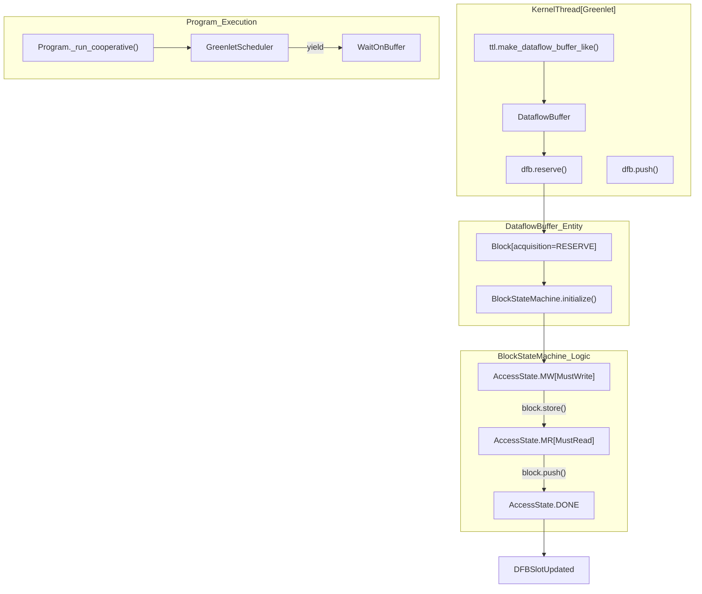

# CircularBuffer Simulation

Relevant source files
*   [docs/sphinx/simulator.md](https://github.com/tenstorrent/tt-lang/blob/d76e6233/docs/sphinx/simulator.md?plain=1)
*   [python/sim/blockstate.py](https://github.com/tenstorrent/tt-lang/blob/d76e6233/python/sim/blockstate.py)
*   [python/sim/context_types.py](https://github.com/tenstorrent/tt-lang/blob/d76e6233/python/sim/context_types.py)
*   [python/sim/dfb.py](https://github.com/tenstorrent/tt-lang/blob/d76e6233/python/sim/dfb.py)
*   [python/sim/operation.py](https://github.com/tenstorrent/tt-lang/blob/d76e6233/python/sim/operation.py)
*   [python/sim/ttlang_sim.py](https://github.com/tenstorrent/tt-lang/blob/d76e6233/python/sim/ttlang_sim.py)
*   [python/sim/ttnnsim.py](https://github.com/tenstorrent/tt-lang/blob/d76e6233/python/sim/ttnnsim.py)
*   [test/sim/test_blockstate.py](https://github.com/tenstorrent/tt-lang/blob/d76e6233/test/sim/test_blockstate.py)
*   [test/sim/test_debug_print.py](https://github.com/tenstorrent/tt-lang/blob/d76e6233/test/sim/test_debug_print.py)
*   [test/sim/test_dfb.py](https://github.com/tenstorrent/tt-lang/blob/d76e6233/test/sim/test_dfb.py)
*   [test/sim/test_examples.py](https://github.com/tenstorrent/tt-lang/blob/d76e6233/test/sim/test_examples.py)
*   [test/sim/test_no_mutable_globals.py](https://github.com/tenstorrent/tt-lang/blob/d76e6233/test/sim/test_no_mutable_globals.py)
*   [test/sim/test_ttlang_sim.py](https://github.com/tenstorrent/tt-lang/blob/d76e6233/test/sim/test_ttlang_sim.py)
*   [test/sim/test_ttnnsim.py](https://github.com/tenstorrent/tt-lang/blob/d76e6233/test/sim/test_ttnnsim.py)

## Purpose and Scope

The circular buffer simulation in `tt-lang` provides a functional model of hardware circular buffers (CBs). It is built around the `DataflowBuffer` (DFB) class, which simulates the ring-buffer primitives used for producer-consumer synchronization in Tenstorrent kernels [python/sim/dfb.py 4-11](https://github.com/tenstorrent/tt-lang/blob/d76e6233/python/sim/dfb.py#L4-L11)

Key features include:

*   **State Machine Enforcement**: Validates correct usage patterns (e.g., `reserve` ->`push`, `wait` ->`pop`) using the `BlockStateMachine`[python/sim/dfb.py 69-76](https://github.com/tenstorrent/tt-lang/blob/d76e6233/python/sim/dfb.py#L69-L76)
*   **Kernel-Type Context**: Tracks whether operations occur in Data Movement (DM) or Compute threads via `KernelType` to enforce hardware-specific access restrictions [python/sim/blockstate.py 37](https://github.com/tenstorrent/tt-lang/blob/d76e6233/python/sim/blockstate.py#L37-L37)
*   **Cooperative Scheduling**: Integrated with the `GreenletScheduler` to yield execution when buffers are full or empty, simulating hardware backpressure [python/sim/program.py 181-188](https://github.com/tenstorrent/tt-lang/blob/d76e6233/python/sim/program.py#L181-L188)
*   **Validation**: Detects shape mismatches, illegal indexing, and lifecycle violations at runtime [python/sim/dfb.py 190-205](https://github.com/tenstorrent/tt-lang/blob/d76e6233/python/sim/dfb.py#L190-L205)

Sources: [python/sim/dfb.py 4-76](https://github.com/tenstorrent/tt-lang/blob/d76e6233/python/sim/dfb.py#L4-L76)[python/sim/blockstate.py 37](https://github.com/tenstorrent/tt-lang/blob/d76e6233/python/sim/blockstate.py#L37-L37)[python/sim/program.py 181-188](https://github.com/tenstorrent/tt-lang/blob/d76e6233/python/sim/program.py#L181-L188)

* * *

## System Architecture

The simulation logic is distributed across several core entities that bridge the gap between Python DSL operations and internal state management.


```mermaid
graph TB
    subgraph "User Interface Layer"
        ["Python_DSL"]
        ["ttl.operation"]
        ["ttl.compute"]
        ["ttl.datamovement"]
    end
    
    subgraph "Compilation Infrastructure"
        ["TTL_Dialect"]
        ["TTKernel_Dialect"]
        ["MLIR_Pass_Pipeline"]
        ["EmitC_Lowering"]
    end
    
    subgraph "Execution Backends"
        ["Hardware_Tensix_Cores"]
        ["ttlang-sim_Simulator"]
    end
    
    ["Python_DSL"] -->|"AST Parsing"| ["TTL_Dialect"]
    ["TTL_Dialect"] -->|"Transforms"| ["MLIR_Pass_Pipeline"]
    ["MLIR_Pass_Pipeline"] -->|"Lowering"| ["TTKernel_Dialect"]
    ["TTKernel_Dialect"] -->|"CodeGen"| ["EmitC_Lowering"]
    
    ["EmitC_Lowering"] -->|"Binary Execution"| ["Hardware_Tensix_Cores"]
    ["Python_DSL"] -->|"Direct Execution"| ["ttlang-sim_Simulator"]
```

The compilation infrastructure transforms Python AST to initial MLIR via `TTCompilerBase` [python/pykernel/_src/kernel_ast.py:61-62](), applies optimization passes such as `TTLInsertIntermediateDFBsPass` [lib/Dialect/TTL/Transforms/TTLInsertIntermediateDFBs.cpp:39-41](), and generates C++ code via `EmitC` [python/CMakeLists.txt:11-12](). Execution backends support both functional simulation for rapid development and hardware compilation for deployment [README.md:76-78]().
```
### Entity Mapping: DSL to Code

| DSL Concept | Code Entity | File |
| --- | --- | --- |
| **Circular Buffer** | `DataflowBuffer` | [python/sim/dfb.py 79-84](https://github.com/tenstorrent/tt-lang/blob/d76e6233/python/sim/dfb.py#L79-L84) |
| **Buffer State** | `DFBState` | [python/sim/dfbstate.py 43](https://github.com/tenstorrent/tt-lang/blob/d76e6233/python/sim/dfbstate.py#L43-L43) |
| **Access Window** | `Block` | [python/sim/dfb.py 65-78](https://github.com/tenstorrent/tt-lang/blob/d76e6233/python/sim/dfb.py#L65-L78) |
| **State Tracker** | `BlockStateMachine` | [python/sim/blockstate.py 186-192](https://github.com/tenstorrent/tt-lang/blob/d76e6233/python/sim/blockstate.py#L186-L192) |
| **Transfer Logic** | `copy` / `CopyTransaction` | [python/sim/copy.py 14-15](https://github.com/tenstorrent/tt-lang/blob/d76e6233/python/sim/copy.py#L14-L15) |

### Simulation Flow Diagram

This diagram shows how a `DataflowBuffer` operation in a kernel triggers state transitions and synchronization within the simulator.

Title: Circular Buffer Operation Flow

Sources: [python/sim/dfb.py 65-111](https://github.com/tenstorrent/tt-lang/blob/d76e6233/python/sim/dfb.py#L65-L111)[python/sim/blockstate.py 67-180](https://github.com/tenstorrent/tt-lang/blob/d76e6233/python/sim/blockstate.py#L67-L180)[python/sim/program.py 181-188](https://github.com/tenstorrent/tt-lang/blob/d76e6233/python/sim/program.py#L181-L188)

* * *



Sources: [python/sim/dfb.py:65-111](), [python/sim/blockstate.py:67-180](), [python/sim/program.py:181-188]()

---
```
## DataflowBuffer Implementation

The `DataflowBuffer` manages a ring of `Tensor` objects via `DFBState`. It tracks producer/consumer pointers and enforces capacity limits [python/sim/dfb.py 79-84](https://github.com/tenstorrent/tt-lang/blob/d76e6233/python/sim/dfb.py#L79-L84)

### Lifecycle Operations

1.   **Reserve**: The producer requests a writeable window. This returns a `Block` with `RESERVE` acquisition [python/sim/dfb.py 103](https://github.com/tenstorrent/tt-lang/blob/d76e6233/python/sim/dfb.py#L103-L103)
2.   **Wait**: The consumer requests a readable window. This blocks until data is available and returns a `Block` with `WAIT` acquisition [python/sim/dfb.py 103](https://github.com/tenstorrent/tt-lang/blob/d76e6233/python/sim/dfb.py#L103-L103)
3.   **Push/Pop**: These operations signal completion of a production or consumption cycle, transitioning the internal state and potentially unblocking other threads [python/sim/dfb.py 190-205](https://github.com/tenstorrent/tt-lang/blob/d76e6233/python/sim/dfb.py#L190-L205)

### Context Manager Support

`Block` objects support the Python `with` statement [python/sim/dfb.py 151-153](https://github.com/tenstorrent/tt-lang/blob/d76e6233/python/sim/dfb.py#L151-L153) Exiting the block automatically calls `push()` for reserved blocks or `pop()` for waited blocks, provided no exception occurred [python/sim/dfb.py 155-168](https://github.com/tenstorrent/tt-lang/blob/d76e6233/python/sim/dfb.py#L155-L168)

### Temporary Blocks

Arithmetic operations on blocks create "temporary" blocks [python/sim/dfb.py 105](https://github.com/tenstorrent/tt-lang/blob/d76e6233/python/sim/dfb.py#L105-L105) These blocks have `unrestricted` state machine settings because they do not represent physical hardware CB slots and do not require `push`/`pop`[python/sim/dfb.py 127-128](https://github.com/tenstorrent/tt-lang/blob/d76e6233/python/sim/dfb.py#L127-L128)

### Capacity and Dtypes

The simulator uses the declared dtype for all `DataflowBuffer` capacity accounting to match hardware allocation, even if float32 promotion is active [docs/sphinx/simulator.md 97-101](https://github.com/tenstorrent/tt-lang/blob/d76e6233/docs/sphinx/simulator.md?plain=1#L97-L101) For example, `bfloat8_b` capacity accounts for shared-exponent overhead: $size = n + \lceil n/16 \rceil$ [test/sim/test_ttnnsim.py 55-65](https://github.com/tenstorrent/tt-lang/blob/d76e6233/test/sim/test_ttnnsim.py#L55-L65)

Sources: [python/sim/dfb.py 79-205](https://github.com/tenstorrent/tt-lang/blob/d76e6233/python/sim/dfb.py#L79-L205)[python/sim/blockstate.py 42-47](https://github.com/tenstorrent/tt-lang/blob/d76e6233/python/sim/blockstate.py#L42-L47)[docs/sphinx/simulator.md 97-101](https://github.com/tenstorrent/tt-lang/blob/d76e6233/docs/sphinx/simulator.md?plain=1#L97-L101)[test/sim/test_ttnnsim.py 55-65](https://github.com/tenstorrent/tt-lang/blob/d76e6233/test/sim/test_ttnnsim.py#L55-L65)

* * *

## Block State Machine

Every `Block` is governed by a `BlockStateMachine`. This ensures that kernels adhere to hardware-mandated access patterns based on the `KernelType` (DM vs COMPUTE) [python/sim/blockstate.py 186-192](https://github.com/tenstorrent/tt-lang/blob/d76e6233/python/sim/blockstate.py#L186-L192)

### Access States

The simulator defines several granular states to catch subtle programming errors [python/sim/blockstate.py 16-33](https://github.com/tenstorrent/tt-lang/blob/d76e6233/python/sim/blockstate.py#L16-L33):

*   `MW` (Must be Written): Block reserved but contains garbage.
*   `MR` (Must be Read): Block contains valid data but hasn't been used.
*   `RW` (Read-Write): Block has been accessed and is now in a flexible state.
*   `ROR` (Read-Only Reading): Block has active asynchronous copy transactions in flight.
*   `NAW` (No Access Writing): Block is a destination for an active asynchronous copy.

### Transition Table

The state machine uses a comprehensive transition table `STATE_TRANSITIONS` to validate every operation [python/sim/blockstate.py 67-180](https://github.com/tenstorrent/tt-lang/blob/d76e6233/python/sim/blockstate.py#L67-L180)

| Acquisition | KernelType | Operation | Start State | End State | Allowed Next Ops |
| --- | --- | --- | --- | --- | --- |
| `RESERVE` | `COMPUTE` | `store_dst` | `MW` | `MR` | `PUSH`, `STORE_SRC` |
| `WAIT` | `COMPUTE` | `assign_src` | `MR` | `RW` | `POP`, `STORE_SRC`, `STORE` |
| `RESERVE` | `DM` | `copy_dst` | `MW` | `NAW` | `TX_WAIT` |
| `WAIT` | `DM` | `copy_src` | `MR` | `ROR` | `TX_WAIT`, `COPY_SRC` |

### Special Transitions: `assign_src`

In the `COMPUTE` thread, using a `WAIT` block as an arithmetic operand triggers the `assign_src` transition [python/sim/blockstate.py 136-144](https://github.com/tenstorrent/tt-lang/blob/d76e6233/python/sim/blockstate.py#L136-L144) This moves the block from `MR` to `RW`, unlocking the `POP` operation [test/sim/test_blockstate.py 191-199](https://github.com/tenstorrent/tt-lang/blob/d76e6233/test/sim/test_blockstate.py#L191-L199) This transition also registers a "pending store confirmation" on the `DataflowBuffer`, which must be resolved by `mark_store_read_complete` before the simulation finishes [test/sim/test_blockstate.py 202-208](https://github.com/tenstorrent/tt-lang/blob/d76e6233/test/sim/test_blockstate.py#L202-L208)

Title: Block State Transitions for Compute Thread

Sources: [python/sim/blockstate.py 67-180](https://github.com/tenstorrent/tt-lang/blob/d76e6233/python/sim/blockstate.py#L67-L180)[test/sim/test_blockstate.py 162-208](https://github.com/tenstorrent/tt-lang/blob/d76e6233/test/sim/test_blockstate.py#L162-L208)

* * *

## Program Context and Isolation

When a `Program` is executed, the simulator builds a per-core context to ensure state isolation [python/sim/program.py 136-144](https://github.com/tenstorrent/tt-lang/blob/d76e6233/python/sim/program.py#L136-L144)

### Core Context Building

The `_build_core_context` method performs the following [python/sim/program.py 136-179](https://github.com/tenstorrent/tt-lang/blob/d76e6233/python/sim/program.py#L136-L179):

*   **Fresh DFBs**: Every core receives its own instance of `DataflowBuffer` for each CB defined in the kernel [python/sim/program.py 163-167](https://github.com/tenstorrent/tt-lang/blob/d76e6233/python/sim/program.py#L163-L167)
*   **Deep Copy**: State variables are deep-copied to prevent cross-core interference [python/sim/program.py 171](https://github.com/tenstorrent/tt-lang/blob/d76e6233/python/sim/program.py#L171-L171)
*   **Tensors**: `Tensor` objects are shared (aliased) to simulate shared memory/NOC access where applicable [python/sim/program.py 158-161](https://github.com/tenstorrent/tt-lang/blob/d76e6233/python/sim/program.py#L158-L161)

### Hardware Limit Validation

The simulator enforces hardware limits during program initialization:

*   **Max DFBs**: Warns if the number of buffers exceeds `max_dfbs` (defaulting to 32) [python/sim/context_types.py 29](https://github.com/tenstorrent/tt-lang/blob/d76e6233/python/sim/context_types.py#L29-L29)[python/sim/program.py 191-197](https://github.com/tenstorrent/tt-lang/blob/d76e6233/python/sim/program.py#L191-L197)
*   **L1 Capacity**: Warns if the total capacity (in bytes) of all DFBs on a core exceeds the available L1 memory (defaulting to 1432 KiB) [python/sim/context_types.py 22](https://github.com/tenstorrent/tt-lang/blob/d76e6233/python/sim/context_types.py#L22-L22)[python/sim/program.py 199-206](https://github.com/tenstorrent/tt-lang/blob/d76e6233/python/sim/program.py#L199-L206)

Sources: [python/sim/program.py 136-206](https://github.com/tenstorrent/tt-lang/blob/d76e6233/python/sim/program.py#L136-L206)[python/sim/context_types.py 22-32](https://github.com/tenstorrent/tt-lang/blob/d76e6233/python/sim/context_types.py#L22-L32)

* * *

## Validation and Error Reporting

The simulation framework provides strict validation to mirror hardware constraints:

*   **Indexing Prohibited**: Direct indexing of `Block` objects (e.g., `block[0]`) is explicitly forbidden to prevent users from writing kernels that rely on CPU-style memory access [test/sim/test_blockstate.py 60-61](https://github.com/tenstorrent/tt-lang/blob/d76e6233/test/sim/test_blockstate.py#L60-L61)
*   **Shape Mismatch**: Errors are raised if a tensor slice does not match the block dimensions during a `copy` or `store`[python/sim/dfb.py 101-103](https://github.com/tenstorrent/tt-lang/blob/d76e6233/python/sim/dfb.py#L101-L103)
*   **Deadlock Detection**: If all greenlets are blocked on `wait()` or `reserve()` and no progress is possible, the scheduler raises a `RuntimeError` with a deadlock cause [python/sim/ttlang_sim.py 112-116](https://github.com/tenstorrent/tt-lang/blob/d76e6233/python/sim/ttlang_sim.py#L112-L116)
*   **Lifecycle Violations**: Attempting to `push()` a block that was never written to or `pop()` a block that was never read results in a `RuntimeError`[test/sim/test_blockstate.py 142-145](https://github.com/tenstorrent/tt-lang/blob/d76e6233/test/sim/test_blockstate.py#L142-L145)

Sources: [test/sim/test_blockstate.py 60-145](https://github.com/tenstorrent/tt-lang/blob/d76e6233/test/sim/test_blockstate.py#L60-L145)[python/sim/dfb.py 101-103](https://github.com/tenstorrent/tt-lang/blob/d76e6233/python/sim/dfb.py#L101-L103)[python/sim/ttlang_sim.py 112-116](https://github.com/tenstorrent/tt-lang/blob/d76e6233/python/sim/ttlang_sim.py#L112-L116)

Dismiss
Refresh this wiki

Enter email to refresh
