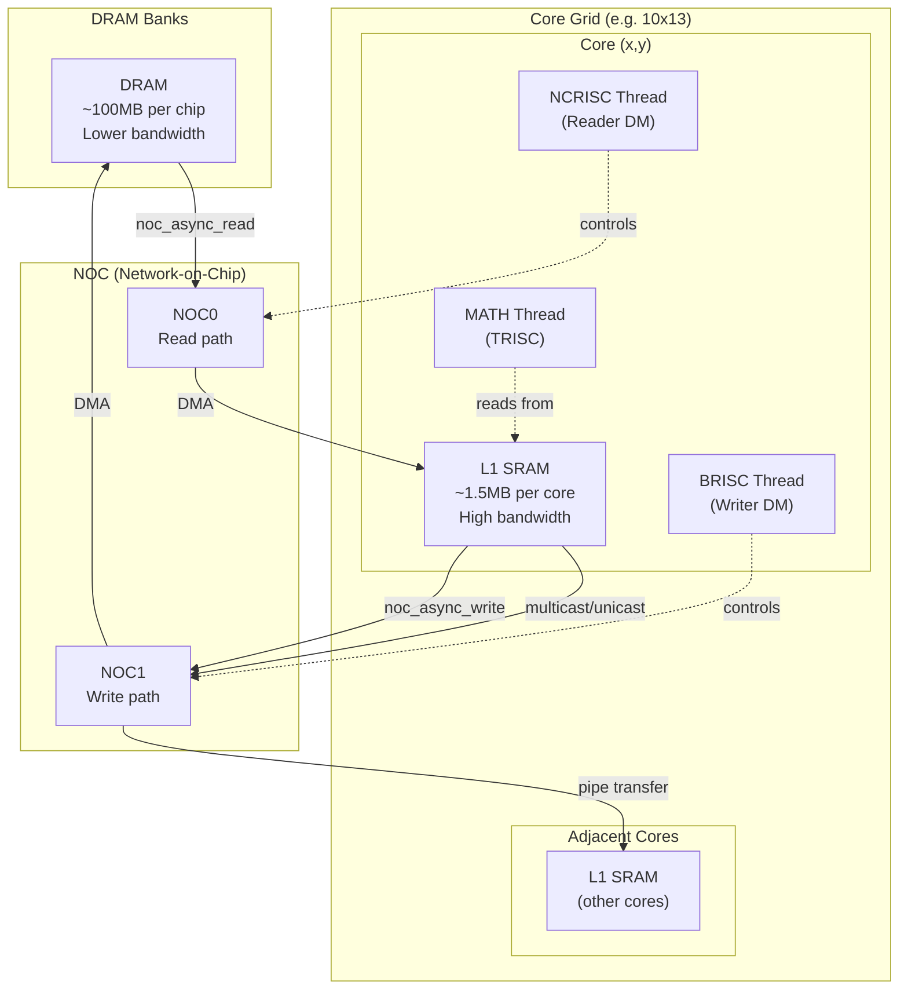
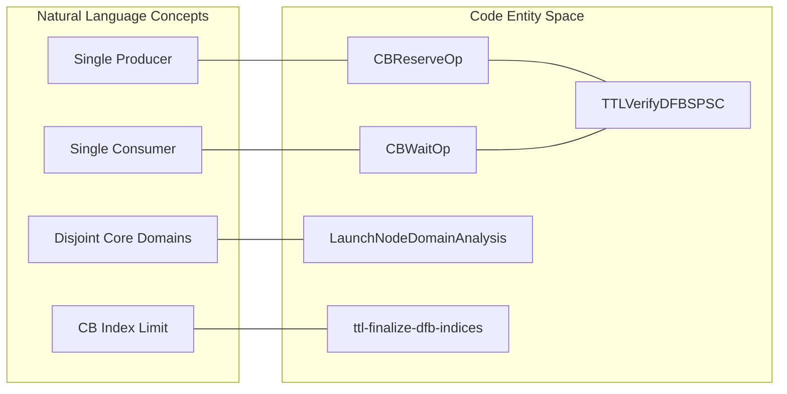
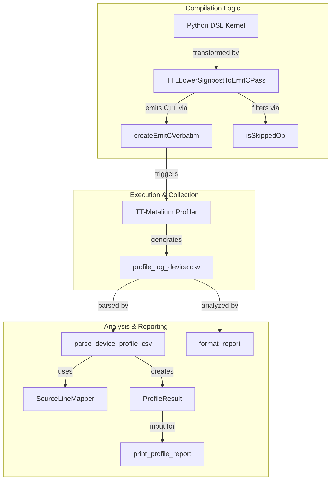

# Auto-Profiling System

Relevant source files
*   [lib/Dialect/TTL/Transforms/LowerSignpostToEmitC.cpp](https://github.com/tenstorrent/tt-lang/blob/d76e6233/lib/Dialect/TTL/Transforms/LowerSignpostToEmitC.cpp)
*   [python/ttl/_src/auto_profile.py](https://github.com/tenstorrent/tt-lang/blob/d76e6233/python/ttl/_src/auto_profile.py)
*   [python/ttl/_src/signpost_profile.py](https://github.com/tenstorrent/tt-lang/blob/d76e6233/python/ttl/_src/signpost_profile.py)
*   [test/python/auto_profile_bcast_multitile.py](https://github.com/tenstorrent/tt-lang/blob/d76e6233/test/python/auto_profile_bcast_multitile.py)
*   [test/python/auto_profile_multi_store.py](https://github.com/tenstorrent/tt-lang/blob/d76e6233/test/python/auto_profile_multi_store.py)
*   [test/python/auto_profile_signposts.py](https://github.com/tenstorrent/tt-lang/blob/d76e6233/test/python/auto_profile_signposts.py)
*   [test/python/signpost_scopes.py](https://github.com/tenstorrent/tt-lang/blob/d76e6233/test/python/signpost_scopes.py)
*   [test/python/simple_add_3d.py](https://github.com/tenstorrent/tt-lang/blob/d76e6233/test/python/simple_add_3d.py)
*   [test/python/test_matmul_acc.py](https://github.com/tenstorrent/tt-lang/blob/d76e6233/test/python/test_matmul_acc.py)

The Auto-Profiling system in `tt-lang` is a built-in instrumentation framework that automatically inserts performance markers into compiled kernels and generates per-line cycle count reports. It provides visibility into kernel execution performance without requiring manual instrumentation, enabling rapid identification of bottlenecks by mapping hardware execution time back to specific Python DSL source lines.

* * *

## Overview

Auto-profiling operates through a multi-stage pipeline:

1.   **Instrumentation**: The compiler inserts `ttl.signpost` operations during MLIR transformation passes.
2.   **Lowering**: These signposts are converted into `DeviceZoneScopedN` markers in the final C++ kernel code [lib/Dialect/TTL/Transforms/LowerSignpostToEmitC.cpp 125-126](https://github.com/tenstorrent/tt-lang/blob/d76e6233/lib/Dialect/TTL/Transforms/LowerSignpostToEmitC.cpp#L125-L126)
3.   **Collection**: After execution, hardware profiler data is retrieved from the device using the underlying TT-Metalium infrastructure [python/ttl/_src/auto_profile.py 126-130](https://github.com/tenstorrent/tt-lang/blob/d76e6233/python/ttl/_src/auto_profile.py#L126-L130)
4.   **Attribution**: Profiler events are mapped back to source lines using a `SourceLineMapper`[python/ttl/_src/auto_profile.py 57-63](https://github.com/tenstorrent/tt-lang/blob/d76e6233/python/ttl/_src/auto_profile.py#L57-L63)
5.   **Reporting**: A visual report is printed to the console showing cycle counts per source line [python/ttl/_src/auto_profile.py 185-215](https://github.com/tenstorrent/tt-lang/blob/d76e6233/python/ttl/_src/auto_profile.py#L185-L215)

**Sources:**[python/ttl/_src/auto_profile.py 5-11](https://github.com/tenstorrent/tt-lang/blob/d76e6233/python/ttl/_src/auto_profile.py#L5-L11)[lib/Dialect/TTL/Transforms/LowerSignpostToEmitC.cpp 1-15](https://github.com/tenstorrent/tt-lang/blob/d76e6233/lib/Dialect/TTL/Transforms/LowerSignpostToEmitC.cpp#L1-L15)[python/ttl/_src/auto_profile.py 57-63](https://github.com/tenstorrent/tt-lang/blob/d76e6233/python/ttl/_src/auto_profile.py#L57-L63)

* * *




Sources: [python/ttl/ttl_api.py:98-98](), [benchmarks/matmul/config.py:76-78](), [benchmarks/matmul/NOTES.md:68-74]()
```
## System Configuration

Auto-profiling is controlled primarily via environment variables.

| Variable | Purpose | File Reference |
| --- | --- | --- |
| `TT_METAL_DEVICE_PROFILER` | Enables the underlying hardware profiling infrastructure in TT-Metalium. | [python/ttl/_src/auto_profile.py 126-130](https://github.com/tenstorrent/tt-lang/blob/d76e6233/python/ttl/_src/auto_profile.py#L126-L130) |
| `TTLANG_AUTO_PROFILE` | Enables the tt-lang specific instrumentation and reporting pipeline. | [python/ttl/_src/auto_profile.py 52-54](https://github.com/tenstorrent/tt-lang/blob/d76e6233/python/ttl/_src/auto_profile.py#L52-L54) |
| `TTLANG_SIGNPOST_PROFILE` | Enables specialized reporting for user-defined signpost zones. | [python/ttl/_src/signpost_profile.py 24-25](https://github.com/tenstorrent/tt-lang/blob/d76e6233/python/ttl/_src/signpost_profile.py#L24-L25) |

**Sources:**[python/ttl/_src/auto_profile.py 52-54](https://github.com/tenstorrent/tt-lang/blob/d76e6233/python/ttl/_src/auto_profile.py#L52-L54)[python/ttl/_src/signpost_profile.py 8-10](https://github.com/tenstorrent/tt-lang/blob/d76e6233/python/ttl/_src/signpost_profile.py#L8-L10)[python/ttl/_src/signpost_profile.py 24-25](https://github.com/tenstorrent/tt-lang/blob/d76e6233/python/ttl/_src/signpost_profile.py#L24-L25)

* * *

## Auto-Profiling Architecture

The following diagram bridges the high-level profiling concepts to the specific code entities responsible for implementation.

### Natural Language to Code Entity Mapping

**Sources:**[lib/Dialect/TTL/Transforms/LowerSignpostToEmitC.cpp 142-162](https://github.com/tenstorrent/tt-lang/blob/d76e6233/lib/Dialect/TTL/Transforms/LowerSignpostToEmitC.cpp#L142-L162)[python/ttl/_src/auto_profile.py 126-141](https://github.com/tenstorrent/tt-lang/blob/d76e6233/python/ttl/_src/auto_profile.py#L126-L141)[python/ttl/_src/signpost_profile.py 73-85](https://github.com/tenstorrent/tt-lang/blob/d76e6233/python/ttl/_src/signpost_profile.py#L73-L85)[lib/Dialect/TTL/Transforms/LowerSignpostToEmitC.cpp 29-33](https://github.com/tenstorrent/tt-lang/blob/d76e6233/lib/Dialect/TTL/Transforms/LowerSignpostToEmitC.cpp#L29-L33)

* * *




Sources: [lib/Dialect/TTL/Transforms/TTLVerifyDFBSPSC.cpp:5-23](), [docs/development/DFBManagement.md:51-66]()
```



## Instrumentation Mechanics

### Signpost Generation

The compiler tracks source line information and registers signposts for operations like `cb_wait`, `cb_reserve`, and `cb_push/pop`[test/python/auto_profile_signposts.py 67-82](https://github.com/tenstorrent/tt-lang/blob/d76e6233/test/python/auto_profile_signposts.py#L67-L82) These are often generated as "implicit" signposts to track Dataflow Buffer (DFB) lifecycle events [python/ttl/_src/auto_profile.py 87-99](https://github.com/tenstorrent/tt-lang/blob/d76e6233/python/ttl/_src/auto_profile.py#L87-L99)

### Lowering to C++

The `TTLLowerSignpostToEmitCPass`[lib/Dialect/TTL/Transforms/LowerSignpostToEmitC.cpp 142-143](https://github.com/tenstorrent/tt-lang/blob/d76e6233/lib/Dialect/TTL/Transforms/LowerSignpostToEmitC.cpp#L142-L143) converts MLIR `SignpostOp` instances into C++ `DeviceZoneScopedN` macros.

*   **Filtering**: It identifies "interesting" operations (non-skipped `ttkernel` dialect ops) to wrap [lib/Dialect/TTL/Transforms/LowerSignpostToEmitC.cpp 39-59](https://github.com/tenstorrent/tt-lang/blob/d76e6233/lib/Dialect/TTL/Transforms/LowerSignpostToEmitC.cpp#L39-L59)
*   **Scoping**: It creates scoped blocks `{ ... }` in the generated C++ to ensure the `DeviceZoneScopedN` object's lifetime matches the operation [lib/Dialect/TTL/Transforms/LowerSignpostToEmitC.cpp 124-128](https://github.com/tenstorrent/tt-lang/blob/d76e6233/lib/Dialect/TTL/Transforms/LowerSignpostToEmitC.cpp#L124-L128)
*   **Safety**: It skips profiling for operations that define values used outside the scope (escaping values) to avoid breaking C++ variable visibility [lib/Dialect/TTL/Transforms/LowerSignpostToEmitC.cpp 63-76](https://github.com/tenstorrent/tt-lang/blob/d76e6233/lib/Dialect/TTL/Transforms/LowerSignpostToEmitC.cpp#L63-L76)
*   **Overhead Reduction**: Certain cheap coordinate lookup ops like `ttkernel.my_x` or `ttkernel.my_logical_y_` are explicitly skipped [lib/Dialect/TTL/Transforms/LowerSignpostToEmitC.cpp 29-33](https://github.com/tenstorrent/tt-lang/blob/d76e6233/lib/Dialect/TTL/Transforms/LowerSignpostToEmitC.cpp#L29-L33)

**Sources:**[lib/Dialect/TTL/Transforms/LowerSignpostToEmitC.cpp 113-138](https://github.com/tenstorrent/tt-lang/blob/d76e6233/lib/Dialect/TTL/Transforms/LowerSignpostToEmitC.cpp#L113-L138)[test/python/auto_profile_signposts.py 67-82](https://github.com/tenstorrent/tt-lang/blob/d76e6233/test/python/auto_profile_signposts.py#L67-L82)[lib/Dialect/TTL/Transforms/LowerSignpostToEmitC.cpp 29-33](https://github.com/tenstorrent/tt-lang/blob/d76e6233/lib/Dialect/TTL/Transforms/LowerSignpostToEmitC.cpp#L29-L33)

* * *

## Data Flow and Attribution

Accurate attribution of cycles to source lines requires mapping the flat CSV data back to the original Python code.

### The Profiling Pipeline Data Flow

**Sources:**[python/ttl/_src/auto_profile.py 126-182](https://github.com/tenstorrent/tt-lang/blob/d76e6233/python/ttl/_src/auto_profile.py#L126-L182)[python/ttl/_src/auto_profile.py 57-76](https://github.com/tenstorrent/tt-lang/blob/d76e6233/python/ttl/_src/auto_profile.py#L57-L76)

* * *

## User-Defined Signposts

In addition to automatic profiling, users can manually insert signposts using the `with ttl.signpost("name"):` context manager [test/python/signpost_scopes.py 64-65](https://github.com/tenstorrent/tt-lang/blob/d76e6233/test/python/signpost_scopes.py#L64-L65) These markers are prefixed with `ttl_` in the backend to distinguish them from internal system zones [python/ttl/_src/signpost_profile.py 21](https://github.com/tenstorrent/tt-lang/blob/d76e6233/python/ttl/_src/signpost_profile.py#L21-L21)

The `signpost_profile.py` module provides a specialized report for these manual zones, aggregating execution counts, total cycles, and average/min/max durations per RISC thread [python/ttl/_src/signpost_profile.py 73-119](https://github.com/tenstorrent/tt-lang/blob/d76e6233/python/ttl/_src/signpost_profile.py#L73-L119)

**Sources:**[python/ttl/_src/signpost_profile.py 28-70](https://github.com/tenstorrent/tt-lang/blob/d76e6233/python/ttl/_src/signpost_profile.py#L28-L70)[python/ttl/_src/signpost_profile.py 73-119](https://github.com/tenstorrent/tt-lang/blob/d76e6233/python/ttl/_src/signpost_profile.py#L73-L119)[test/python/signpost_scopes.py 64-81](https://github.com/tenstorrent/tt-lang/blob/d76e6233/test/python/signpost_scopes.py#L64-L81)

* * *

## Line-Level Cycle Counting

The `ProfileResult` class stores the final attributed data including thread name, cycle count, and source line info [python/ttl/_src/auto_profile.py 102-113](https://github.com/tenstorrent/tt-lang/blob/d76e6233/python/ttl/_src/auto_profile.py#L102-L113)

### Attribution Logic

*   **Explicit Signposts**: Created by manual `ttl.signpost` calls [python/ttl/_src/signpost_profile.py 9](https://github.com/tenstorrent/tt-lang/blob/d76e6233/python/ttl/_src/signpost_profile.py#L9-L9)
*   **Implicit Signposts**: Generated for `with` statements and DFB operations (e.g., `_implicit_cb_pop`, `_implicit_cb_push`) [python/ttl/_src/auto_profile.py 87-99](https://github.com/tenstorrent/tt-lang/blob/d76e6233/python/ttl/_src/auto_profile.py#L87-L99)
*   **Timestamps**: Extracted from the CSV `ZONE_START` and `ZONE_END` markers [python/ttl/_src/auto_profile.py 166-170](https://github.com/tenstorrent/tt-lang/blob/d76e6233/python/ttl/_src/auto_profile.py#L166-L170)

### Visual Reporting

The `print_profile_report` function uses ANSI colors to highlight hotspots and distinguish different Circular Buffers using background colors [python/ttl/_src/auto_profile.py 21-49](https://github.com/tenstorrent/tt-lang/blob/d76e6233/python/ttl/_src/auto_profile.py#L21-L49) It organizes results by thread (MATH, BRISC, NCRISC) and maps them back to the original kernel source lines [python/ttl/_src/auto_profile.py 196-215](https://github.com/tenstorrent/tt-lang/blob/d76e6233/python/ttl/_src/auto_profile.py#L196-L215)

**Sources:**[python/ttl/_src/auto_profile.py 126-182](https://github.com/tenstorrent/tt-lang/blob/d76e6233/python/ttl/_src/auto_profile.py#L126-L182)[test/python/auto_profile_signposts.py 68-82](https://github.com/tenstorrent/tt-lang/blob/d76e6233/test/python/auto_profile_signposts.py#L68-L82)[python/ttl/_src/auto_profile.py 21-49](https://github.com/tenstorrent/tt-lang/blob/d76e6233/python/ttl/_src/auto_profile.py#L21-L49)

Dismiss
Refresh this wiki

Enter email to refresh
