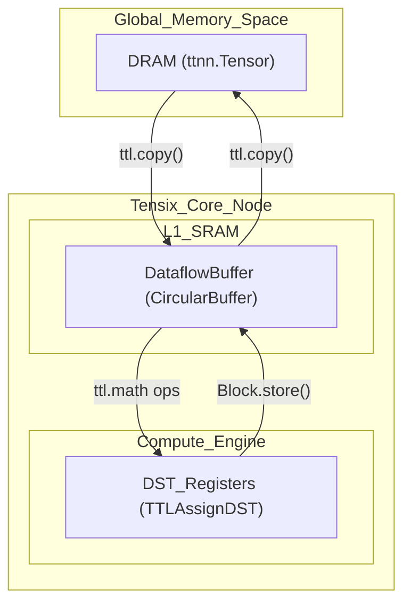
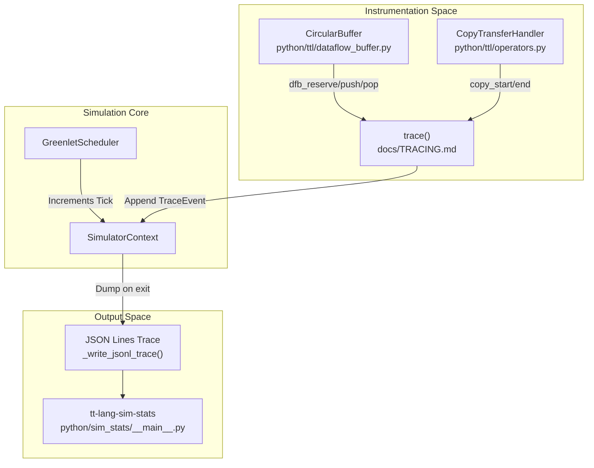

# Performance Trace Visualization

Relevant source files
*   [docs/TRACING.md](https://github.com/tenstorrent/tt-lang/blob/d76e6233/docs/TRACING.md?plain=1)
*   [include/ttlang/Dialect/TTL/Passes.td](https://github.com/tenstorrent/tt-lang/blob/d76e6233/include/ttlang/Dialect/TTL/Passes.td)
*   [lib/Dialect/TTL/Pipelines/TTLPipelines.cpp](https://github.com/tenstorrent/tt-lang/blob/d76e6233/lib/Dialect/TTL/Pipelines/TTLPipelines.cpp)
*   [lib/Dialect/TTL/Transforms/CMakeLists.txt](https://github.com/tenstorrent/tt-lang/blob/d76e6233/lib/Dialect/TTL/Transforms/CMakeLists.txt)
*   [packaging/sim/pyproject.toml](https://github.com/tenstorrent/tt-lang/blob/d76e6233/packaging/sim/pyproject.toml)
*   [python/sim_stats/__main__.py](https://github.com/tenstorrent/tt-lang/blob/d76e6233/python/sim_stats/__main__.py)
*   [python/ttl/_src/ttl_ast.py](https://github.com/tenstorrent/tt-lang/blob/d76e6233/python/ttl/_src/ttl_ast.py)
*   [python/ttl/ttl_api.py](https://github.com/tenstorrent/tt-lang/blob/d76e6233/python/ttl/ttl_api.py)
*   [test/me2e/builder/pipeline.py](https://github.com/tenstorrent/tt-lang/blob/d76e6233/test/me2e/builder/pipeline.py)
*   [test/sim/test_tracing.py](https://github.com/tenstorrent/tt-lang/blob/d76e6233/test/sim/test_tracing.py)

## Purpose and Scope

Performance trace visualization in `tt-lang` provides two distinct paths for analyzing kernel execution:

1.   **Hardware Trace Visualization**: Converts device profiler CSV data into interactive timelines using the Perfetto UI via a dedicated trace server.
2.   **Simulator Trace Visualization**: Generates structured execution traces during functional simulation to visualize logical time, buffer occupancy, and stall patterns without requiring hardware.

For profiling setup on hardware, see [Auto-Profiling System](https://deepwiki.com/tenstorrent/tt-lang/7.1-auto-profiling-system). For simulator details, see [Simulation Overview](https://deepwiki.com/tenstorrent/tt-lang/6.1-simulation-overview).

## Hardware Trace Visualization Architecture

The hardware trace system operates as a standalone HTTP server that converts TT-Metalium profiler CSV data into the Chrome Trace Event format. It uses a `postMessage` handshake to push trace data into the Perfetto UI (ui.perfetto.dev) without cross-origin or HTTPS issues.

### Data Flow Diagram

**Sources:**`python/ttl/_src/perf_trace_server.py`


```mermaid
graph TB
    subgraph "Profiler Data Source"
        [profile_log_device.csv] --> ["Device profiler output<br/>ZONE_START/ZONE_END pairs"]
        [CSV Header] --> ["CHIP_FREQ[MHz]<br/>Core coordinates"]
    end
    
    subgraph "Trace Conversion"
        Parser["csv_to_trace_events()"]
        Filter["Filter Wrapper Zones<br/>_WRAPPER_ZONES<br/>BRISC-FW, TRISC-KERNEL, etc"]
        Normalize["Normalize Timestamps<br/>Start at 0"]
        Events["Chrome Trace Events<br/>{name, cat, ph:X, ts, dur, pid, tid}"]
    end
    
    subgraph "HTTP Server"
        Handler["_TraceHandler<br/>BaseHTTPRequestHandler"]
        Landing["Landing Page<br/>_LANDING_HTML<br/>Fetch + postMessage"]
        TraceJSON["trace.json<br/>Cached in memory"]
    end
    
    subgraph "Client Browser"
        OpenPage["Open http://localhost:PORT"]
        FetchTrace["Fetch /trace.json"]
        OpenPerfetto["Open Perfetto UI<br/>ui.perfetto.dev"]
        PostMessage["postMessage to Perfetto<br/>with ArrayBuffer"]
    end
    
    Parser --> Filter
    Filter --> Normalize
    Normalize --> Events
    Events --> TraceJSON
    
    TraceJSON --> Handler
    Landing --> Handler
    
    Handler --> OpenPage
    OpenPage --> Landing
    Landing --> FetchTrace
    FetchTrace --> TraceJSON
    Landing --> OpenPerfetto
    OpenPerfetto --> PostMessage
    PostMessage --> TraceJSON
```




For details, see [Memory Architecture](#2.3).
```
### Profiler Event Mapping

The conversion process matches `ZONE_START` and `ZONE_END` markers from the CSV.

| Field | Description | Example |
| --- | --- | --- |
| `name` | Zone name from CSV | `"compute_L52_cb_wait"` |
| `cat` | Category (RISC thread) | `"TRISC_0"` |
| `ph` | Phase (`"X"` for complete events) | `"X"` |
| `ts` | Start timestamp (microseconds) | `1234.5` |
| `dur` | Duration (microseconds) | `56.7` |
| `pid` | Process ID (core coordinates) | `"Core (3,4)"` |
| `tid` | Thread ID (RISC name) | `"TRISC_0"` |

**Sources:**`python/ttl/_src/perf_trace_server.py`

## Simulator Trace Visualization

The simulator provides a deterministic tracing system that records semantic events in "Logical Time" (ticks). This is enabled via the `--trace` flag in the `tt-lang-sim` CLI [python/sim/ttlang_sim.py 10-13](https://github.com/tenstorrent/tt-lang/blob/d76e6233/python/sim/ttlang_sim.py#L10-L13)

### Simulator Tracing Architecture

**Sources:**[python/sim/ttlang_sim.py 202-212](https://github.com/tenstorrent/tt-lang/blob/d76e6233/python/sim/ttlang_sim.py#L202-L212)[docs/TRACING.md 3-74](https://github.com/tenstorrent/tt-lang/blob/d76e6233/docs/TRACING.md?plain=1#L3-L74)[python/sim_stats/__main__.py 1-21](https://github.com/tenstorrent/tt-lang/blob/d76e6233/python/sim_stats/__main__.py#L1-L21)[python/ttl/ttl_api.py 166-181](https://github.com/tenstorrent/tt-lang/blob/d76e6233/python/ttl/ttl_api.py#L166-L181)



### Logical Time (Ticks)

Logical time in the simulator is a **tick counter**[docs/TRACING.md 72-74](https://github.com/tenstorrent/tt-lang/blob/d76e6233/docs/TRACING.md?plain=1#L72-L74) One tick equals one scheduler activation [docs/TRACING.md 78](https://github.com/tenstorrent/tt-lang/blob/d76e6233/docs/TRACING.md?plain=1#L78-L78) This ensures traces are:

*   **Deterministic**: Identical inputs yield identical traces [docs/TRACING.md 87-88](https://github.com/tenstorrent/tt-lang/blob/d76e6233/docs/TRACING.md?plain=1#L87-L88)
*   **Comparable across kernels**: Time gaps between kernels (e.g., Producer push at T=5, Consumer pop at T=7) are meaningful [docs/TRACING.md 89-91](https://github.com/tenstorrent/tt-lang/blob/d76e6233/docs/TRACING.md?plain=1#L89-L91)
*   **Stall-measurable**: A kernel blocked from tick 5 to 12 was stalled for 7 ticks [docs/TRACING.md 92-94](https://github.com/tenstorrent/tt-lang/blob/d76e6233/docs/TRACING.md?plain=1#L92-L94)
*   **Wall-clock Independent**: Reproducible regardless of host machine load [docs/TRACING.md 94-95](https://github.com/tenstorrent/tt-lang/blob/d76e6233/docs/TRACING.md?plain=1#L94-L95)

### Trace Events

The simulator records the following categories of events [docs/TRACING.md 19-63](https://github.com/tenstorrent/tt-lang/blob/d76e6233/docs/TRACING.md?plain=1#L19-L63):

| Category | Events | Data Captured |
| --- | --- | --- |
| **Operation** | `operation_start`, `operation_end` | Grid shape, node index [docs/TRACING.md 21-23](https://github.com/tenstorrent/tt-lang/blob/d76e6233/docs/TRACING.md?plain=1#L21-L23) |
| **Kernel** | `kernel_start`, `kernel_end`, `kernel_block`, `kernel_unblock` | Thread type (COMPUTE/DM), block reason [docs/TRACING.md 27-34](https://github.com/tenstorrent/tt-lang/blob/d76e6233/docs/TRACING.md?plain=1#L27-L34) |
| **DFB** | `dfb_reserve_begin`, `dfb_push`, `dfb_pop`, `dfb_wait_end` | Buffer occupancy, iteration count [docs/TRACING.md 42-52](https://github.com/tenstorrent/tt-lang/blob/d76e6233/docs/TRACING.md?plain=1#L42-L52) |
| **Copy** | `copy_start`, `copy_end` | Source/dest types, node, kernel [docs/TRACING.md 56-62](https://github.com/tenstorrent/tt-lang/blob/d76e6233/docs/TRACING.md?plain=1#L56-L62) |

**Sources:**[docs/TRACING.md 19-63](https://github.com/tenstorrent/tt-lang/blob/d76e6233/docs/TRACING.md?plain=1#L19-L63)[test/sim/test_tracing.py 143-204](https://github.com/tenstorrent/tt-lang/blob/d76e6233/test/sim/test_tracing.py#L143-L204)

## Usage and Tooling

### Visualizing Hardware Traces

Hardware traces are triggered by the `_run_profiling_pipeline` function [python/ttl/ttl_api.py 166-171](https://github.com/tenstorrent/tt-lang/blob/d76e6233/python/ttl/ttl_api.py#L166-L171) when `TT_METAL_DEVICE_PROFILER=1` is set. The server can be manually invoked via `serve_trace()`[python/ttl/ttl_api.py 62](https://github.com/tenstorrent/tt-lang/blob/d76e6233/python/ttl/ttl_api.py#L62-L62)

### Visualizing Simulator Traces

To generate a simulator trace and view statistics [python/sim/ttlang_sim.py 10-13](https://github.com/tenstorrent/tt-lang/blob/d76e6233/python/sim/ttlang_sim.py#L10-L13)[python/sim_stats/__main__.py 18-21](https://github.com/tenstorrent/tt-lang/blob/d76e6233/python/sim_stats/__main__.py#L18-L21):

### Post-Processing with `tt-lang-sim-stats`

The `tt-lang-sim-stats` tool aggregates raw trace events into human-readable tables [python/sim_stats/__main__.py 10-17](https://github.com/tenstorrent/tt-lang/blob/d76e6233/python/sim_stats/__main__.py#L10-L17):

*   **Tensor Access Statistics**: Reads/writes and tile counts per tensor name, including locality (Local L1, Remote L1, DRAM) [python/sim_stats/__main__.py 112-131](https://github.com/tenstorrent/tt-lang/blob/d76e6233/python/sim_stats/__main__.py#L112-L131)[python/sim_stats/__main__.py 184-194](https://github.com/tenstorrent/tt-lang/blob/d76e6233/python/sim_stats/__main__.py#L184-L194)
*   **Pipe Transfer Statistics**: Sends/receives and tile counts per pipe [python/sim_stats/__main__.py 132-145](https://github.com/tenstorrent/tt-lang/blob/d76e6233/python/sim_stats/__main__.py#L132-L145)
*   **Dataflow Buffer Statistics**: Reserves/waits and tile counts per DFB, broken down by node [python/sim_stats/__main__.py 146-165](https://github.com/tenstorrent/tt-lang/blob/d76e6233/python/sim_stats/__main__.py#L146-L165)

**Sources:**[python/sim_stats/__main__.py 1-21](https://github.com/tenstorrent/tt-lang/blob/d76e6233/python/sim_stats/__main__.py#L1-L21)[packaging/sim/pyproject.toml 30-32](https://github.com/tenstorrent/tt-lang/blob/d76e6233/packaging/sim/pyproject.toml#L30-L32)

Dismiss
Refresh this wiki

Enter email to refresh
