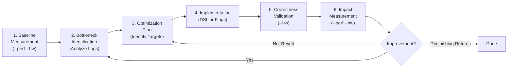
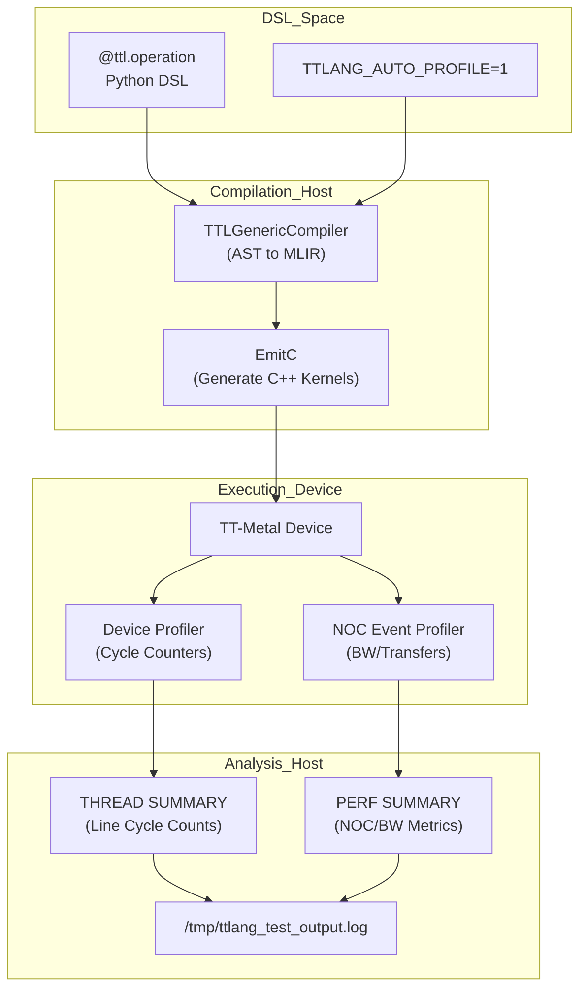
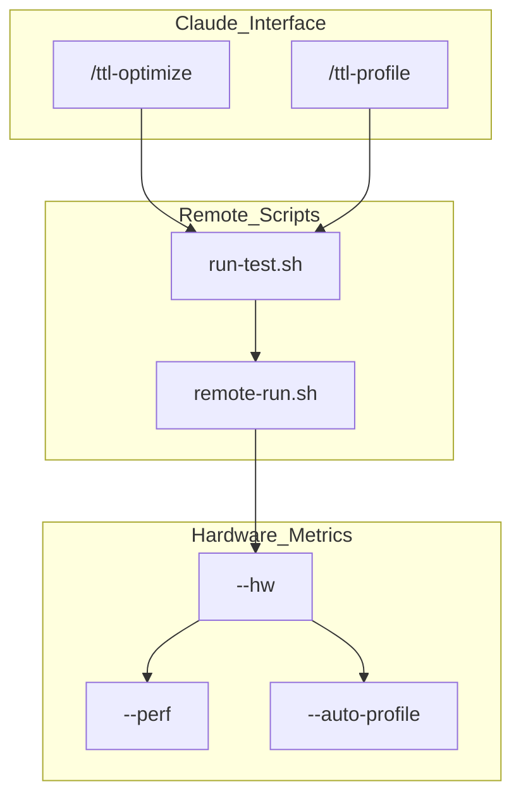

# Optimization Workflow

Relevant source files
*   [benchmarks/__init__.py](https://github.com/tenstorrent/tt-lang/blob/d76e6233/benchmarks/__init__.py)
*   [benchmarks/matmul/NOTES.md](https://github.com/tenstorrent/tt-lang/blob/d76e6233/benchmarks/matmul/NOTES.md?plain=1)
*   [benchmarks/matmul/README.md](https://github.com/tenstorrent/tt-lang/blob/d76e6233/benchmarks/matmul/README.md?plain=1)
*   [benchmarks/matmul/__init__.py](https://github.com/tenstorrent/tt-lang/blob/d76e6233/benchmarks/matmul/__init__.py)
*   [benchmarks/matmul/config.py](https://github.com/tenstorrent/tt-lang/blob/d76e6233/benchmarks/matmul/config.py)
*   [benchmarks/matmul/ksplit_kernel.py](https://github.com/tenstorrent/tt-lang/blob/d76e6233/benchmarks/matmul/ksplit_kernel.py)
*   [benchmarks/matmul/ksplit_sweep.csv](https://github.com/tenstorrent/tt-lang/blob/d76e6233/benchmarks/matmul/ksplit_sweep.csv)
*   [benchmarks/matmul/ksplit_sweep.png](https://github.com/tenstorrent/tt-lang/blob/d76e6233/benchmarks/matmul/ksplit_sweep.png)
*   [benchmarks/matmul/plot.py](https://github.com/tenstorrent/tt-lang/blob/d76e6233/benchmarks/matmul/plot.py)
*   [benchmarks/matmul/summa_kernel.py](https://github.com/tenstorrent/tt-lang/blob/d76e6233/benchmarks/matmul/summa_kernel.py)
*   [benchmarks/matmul/sweep.py](https://github.com/tenstorrent/tt-lang/blob/d76e6233/benchmarks/matmul/sweep.py)
*   [claude-slash-commands/tools/run-test.sh](https://github.com/tenstorrent/tt-lang/blob/d76e6233/claude-slash-commands/tools/run-test.sh)
*   [claude-slash-commands/ttl-import.md](https://github.com/tenstorrent/tt-lang/blob/d76e6233/claude-slash-commands/ttl-import.md?plain=1)
*   [claude-slash-commands/ttl-optimize.md](https://github.com/tenstorrent/tt-lang/blob/d76e6233/claude-slash-commands/ttl-optimize.md?plain=1)
*   [claude-slash-commands/ttl-profile.md](https://github.com/tenstorrent/tt-lang/blob/d76e6233/claude-slash-commands/ttl-profile.md?plain=1)

## Purpose and Scope

The optimization workflow in `tt-lang` is a systematic approach to improving kernel performance on Tenstorrent hardware. It bridges the gap between high-level Python DSL definitions and low-level hardware execution by providing tools for bottleneck identification, cycle-accurate profiling, and compiler-driven optimizations. The primary goal is to minimize **wall time**, which serves as the ground truth metric for all performance improvements [claude-slash-commands/ttl-optimize.md 113](https://github.com/tenstorrent/tt-lang/blob/d76e6233/claude-slash-commands/ttl-optimize.md?plain=1#L113-L113)

## Optimization Process Overview

The workflow follows a rigorous iterative cycle. Optimization begins only after functional correctness is verified on hardware [claude-slash-commands/ttl-optimize.md 73-75](https://github.com/tenstorrent/tt-lang/blob/d76e6233/claude-slash-commands/ttl-optimize.md?plain=1#L73-L75)

Title: Optimization Iteration Loop

**Sources:**[claude-slash-commands/ttl-optimize.md 71-115](https://github.com/tenstorrent/tt-lang/blob/d76e6233/claude-slash-commands/ttl-optimize.md?plain=1#L71-L115)

## Profiling and Diagnostic Modes

`tt-lang` leverages several environment variables and instrumentation passes to extract performance data from the device. These are typically managed via the `run-test.sh` script [claude-slash-commands/ttl-optimize.md 20-26](https://github.com/tenstorrent/tt-lang/blob/d76e6233/claude-slash-commands/ttl-optimize.md?plain=1#L20-L26)

| Mode | Flag / Variable | Purpose | Key Output |
| --- | --- | --- | --- |
| **Perf Summary** | `--perf` | NOC traffic, DRAM/L1 bandwidth, and per-kernel wall time summary [claude-slash-commands/ttl-optimize.md 23](https://github.com/tenstorrent/tt-lang/blob/d76e6233/claude-slash-commands/ttl-optimize.md?plain=1#L23-L23) | `PERF SUMMARY` in log [claude-slash-commands/ttl-optimize.md 30](https://github.com/tenstorrent/tt-lang/blob/d76e6233/claude-slash-commands/ttl-optimize.md?plain=1#L30-L30) |
| **Auto-Profile** | `--auto-profile` | Per-line cycle counts and hotspot analysis using hardware signposts [claude-slash-commands/ttl-optimize.md 24](https://github.com/tenstorrent/tt-lang/blob/d76e6233/claude-slash-commands/ttl-optimize.md?plain=1#L24-L24) | `THREAD SUMMARY` in log [claude-slash-commands/ttl-optimize.md 30](https://github.com/tenstorrent/tt-lang/blob/d76e6233/claude-slash-commands/ttl-optimize.md?plain=1#L30-L30) |
| **Initial MLIR** | `TTLANG_INITIAL_MLIR` | Write pre-optimization MLIR module to file | `ttlang_initial.mlir`[claude-slash-commands/ttl-import.md 38](https://github.com/tenstorrent/tt-lang/blob/d76e6233/claude-slash-commands/ttl-import.md?plain=1#L38-L38) |
| **Final MLIR** | `TTLANG_FINAL_MLIR` | Write post-optimization MLIR module to file | `ttlang_final.mlir`[claude-slash-commands/ttl-import.md 39](https://github.com/tenstorrent/tt-lang/blob/d76e6233/claude-slash-commands/ttl-import.md?plain=1#L39-L39) |

**Sources:**[claude-slash-commands/ttl-optimize.md 20-30](https://github.com/tenstorrent/tt-lang/blob/d76e6233/claude-slash-commands/ttl-optimize.md?plain=1#L20-L30)[claude-slash-commands/ttl-import.md 38-39](https://github.com/tenstorrent/tt-lang/blob/d76e6233/claude-slash-commands/ttl-import.md?plain=1#L38-L39)

## Hardware Profiling Execution Flow

When `TTLANG_AUTO_PROFILE=1` is enabled, the compiler automatically instruments the kernel with signposts [claude-slash-commands/ttl-profile.md 69](https://github.com/tenstorrent/tt-lang/blob/d76e6233/claude-slash-commands/ttl-profile.md?plain=1#L69-L69) These are lowered to hardware-specific profiling markers that the device profiler captures during execution.

Title: Profiling Data Flow (DSL to Analysis)

**Sources:**[claude-slash-commands/ttl-optimize.md 20-30](https://github.com/tenstorrent/tt-lang/blob/d76e6233/claude-slash-commands/ttl-optimize.md?plain=1#L20-L30)[claude-slash-commands/ttl-profile.md 47-53](https://github.com/tenstorrent/tt-lang/blob/d76e6233/claude-slash-commands/ttl-profile.md?plain=1#L47-L53)[claude-slash-commands/ttl-profile.md 69](https://github.com/tenstorrent/tt-lang/blob/d76e6233/claude-slash-commands/ttl-profile.md?plain=1#L69-L69)

## Bottleneck Identification Strategy

### 1. Grid Utilization

Check the `grid` size in the `PERF SUMMARY`. If it is smaller than the hardware's capacity (e.g., 130 cores on Blackhole), the kernel is underutilizing the compute fabric [claude-slash-commands/ttl-optimize.md 52-54](https://github.com/tenstorrent/tt-lang/blob/d76e6233/claude-slash-commands/ttl-optimize.md?plain=1#L52-L54)[benchmarks/matmul/NOTES.md 8](https://github.com/tenstorrent/tt-lang/blob/d76e6233/benchmarks/matmul/NOTES.md?plain=1#L8-L8)

*   **Fix:** Partition work across cores using multi-core patterns (e.g., `Mp`, `Np`, `Kp`) [benchmarks/matmul/config.py 141-144](https://github.com/tenstorrent/tt-lang/blob/d76e6233/benchmarks/matmul/config.py#L141-L144)

### 2. DRAM Traffic and Bandwidth

High DRAM read/write volumes indicate unnecessary round-trips. Effective bandwidth metrics help distinguish between memory-bound and compute-bound kernels [claude-slash-commands/ttl-optimize.md 58-62](https://github.com/tenstorrent/tt-lang/blob/d76e6233/claude-slash-commands/ttl-optimize.md?plain=1#L58-L62)[claude-slash-commands/ttl-optimize.md 82-84](https://github.com/tenstorrent/tt-lang/blob/d76e6233/claude-slash-commands/ttl-optimize.md?plain=1#L82-L84)

*   **Fix:** Fuse operations into a single kernel to keep data in L1 [claude-slash-commands/ttl-optimize.md 59](https://github.com/tenstorrent/tt-lang/blob/d76e6233/claude-slash-commands/ttl-optimize.md?plain=1#L59-L59)
*   **Fix:** Increase DFB block size (`shape=(bm, bn)`) to improve DMA throughput by reducing the number of transfers [claude-slash-commands/ttl-optimize.md 67-70](https://github.com/tenstorrent/tt-lang/blob/d76e6233/claude-slash-commands/ttl-optimize.md?plain=1#L67-L70)

### 3. Compute Efficiency and Subblocking

The compiler's subblocking strategy impacts how effectively the DST register file is utilized.

*   **Block Dimensions:** Dims above 8 can regress performance due to non-linear LLK overhead, even if L1 capacity is available [benchmarks/matmul/NOTES.md 9-18](https://github.com/tenstorrent/tt-lang/blob/d76e6233/benchmarks/matmul/NOTES.md?plain=1#L9-L18)
*   **Subblock Decomposition:** Lopsided sub-blocks (e.g., 10 tiles decomposing into 8+2) can cause wall time jumps [benchmarks/matmul/NOTES.md 12-16](https://github.com/tenstorrent/tt-lang/blob/d76e6233/benchmarks/matmul/NOTES.md?plain=1#L12-L16)

**Sources:**[claude-slash-commands/ttl-optimize.md 48-70](https://github.com/tenstorrent/tt-lang/blob/d76e6233/claude-slash-commands/ttl-optimize.md?plain=1#L48-L70)[benchmarks/matmul/NOTES.md 8-46](https://github.com/tenstorrent/tt-lang/blob/d76e6233/benchmarks/matmul/NOTES.md?plain=1#L8-L46)[benchmarks/matmul/config.py 80-87](https://github.com/tenstorrent/tt-lang/blob/d76e6233/benchmarks/matmul/config.py#L80-L87)

## The `/ttl-optimize` Command

The `/ttl-optimize` slash command provides an automated workflow for performance tuning [claude-slash-commands/ttl-optimize.md 1-4](https://github.com/tenstorrent/tt-lang/blob/d76e6233/claude-slash-commands/ttl-optimize.md?plain=1#L1-L4) It requires a remote hardware setup and uses the `run-test.sh` toolchain [claude-slash-commands/ttl-optimize.md 6-26](https://github.com/tenstorrent/tt-lang/blob/d76e6233/claude-slash-commands/ttl-optimize.md?plain=1#L6-L26)

Title: Slash Command Toolchain

**Sources:**[claude-slash-commands/ttl-optimize.md 18-26](https://github.com/tenstorrent/tt-lang/blob/d76e6233/claude-slash-commands/ttl-optimize.md?plain=1#L18-L26)[claude-slash-commands/ttl-optimize.md 6-14](https://github.com/tenstorrent/tt-lang/blob/d76e6233/claude-slash-commands/ttl-optimize.md?plain=1#L6-L14)

## Case Study: Matmul Optimization

The `ksplit` and `SUMMA` matmul benchmarks demonstrate complex trade-offs between core utilization, padding, and communication overhead [benchmarks/matmul/ksplit_kernel.py 4-13](https://github.com/tenstorrent/tt-lang/blob/d76e6233/benchmarks/matmul/ksplit_kernel.py#L4-L13)

*   **K-Splitting:** Increasing `Kp` (K-parts) shrinks each core's K-slab but introduces gather costs [benchmarks/matmul/NOTES.md 50-52](https://github.com/tenstorrent/tt-lang/blob/d76e6233/benchmarks/matmul/NOTES.md?plain=1#L50-L52)
*   **Gather Cost:** The penalty for partial reduction scales with the total number of gather events per core: `(Kp-1) * iter_per_core`[benchmarks/matmul/NOTES.md 26-30](https://github.com/tenstorrent/tt-lang/blob/d76e6233/benchmarks/matmul/NOTES.md?plain=1#L26-L30)[benchmarks/matmul/config.py 119](https://github.com/tenstorrent/tt-lang/blob/d76e6233/benchmarks/matmul/config.py#L119-L119)
*   **Scoring Model:** A throughput model is used to pick optimal block shapes: `throughput ~= cores * bv / (pad * (bv + ALPHA))`[benchmarks/matmul/config.py 10-12](https://github.com/tenstorrent/tt-lang/blob/d76e6233/benchmarks/matmul/config.py#L10-L12)

**Sources:**[benchmarks/matmul/ksplit_kernel.py 4-13](https://github.com/tenstorrent/tt-lang/blob/d76e6233/benchmarks/matmul/ksplit_kernel.py#L4-L13)[benchmarks/matmul/NOTES.md 48-75](https://github.com/tenstorrent/tt-lang/blob/d76e6233/benchmarks/matmul/NOTES.md?plain=1#L48-L75)[benchmarks/matmul/config.py 10-22](https://github.com/tenstorrent/tt-lang/blob/d76e6233/benchmarks/matmul/config.py#L10-L22)

Dismiss
Refresh this wiki

Enter email to refresh
