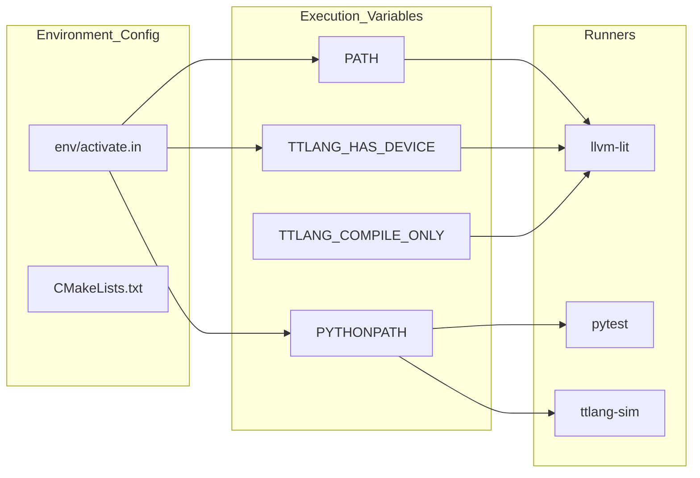

# Testing Infrastructure

Relevant source files
*   [.github/workflows/call-test-sim.yml](https://github.com/tenstorrent/tt-lang/blob/d76e6233/.github/workflows/call-test-sim.yml)
*   [AGENTS.md](https://github.com/tenstorrent/tt-lang/blob/d76e6233/AGENTS.md?plain=1)
*   [CMakeLists.txt](https://github.com/tenstorrent/tt-lang/blob/d76e6233/CMakeLists.txt)
*   [env/activate.in](https://github.com/tenstorrent/tt-lang/blob/d76e6233/env/activate.in)
*   [env/ttlang_prompt_utils.sh](https://github.com/tenstorrent/tt-lang/blob/d76e6233/env/ttlang_prompt_utils.sh)
*   [include/ttlang/Dialect/TTL/TTLElementwiseOps.def](https://github.com/tenstorrent/tt-lang/blob/d76e6233/include/ttlang/Dialect/TTL/TTLElementwiseOps.def)
*   [scripts/docker-test.sh](https://github.com/tenstorrent/tt-lang/blob/d76e6233/scripts/docker-test.sh)
*   [test/TESTING.md](https://github.com/tenstorrent/tt-lang/blob/d76e6233/test/TESTING.md?plain=1)
*   [test/lit.cfg.py](https://github.com/tenstorrent/tt-lang/blob/d76e6233/test/lit.cfg.py)
*   [test/me2e/base.py](https://github.com/tenstorrent/tt-lang/blob/d76e6233/test/me2e/base.py)
*   [test/me2e/config.py](https://github.com/tenstorrent/tt-lang/blob/d76e6233/test/me2e/config.py)
*   [test/me2e/config_specs.py](https://github.com/tenstorrent/tt-lang/blob/d76e6233/test/me2e/config_specs.py)
*   [test/me2e/op_specs.py](https://github.com/tenstorrent/tt-lang/blob/d76e6233/test/me2e/op_specs.py)
*   [test/me2e/ops/__init__.py](https://github.com/tenstorrent/tt-lang/blob/d76e6233/test/me2e/ops/__init__.py)
*   [test/me2e/ops/test_binary.py](https://github.com/tenstorrent/tt-lang/blob/d76e6233/test/me2e/ops/test_binary.py)
*   [test/me2e/runner.py](https://github.com/tenstorrent/tt-lang/blob/d76e6233/test/me2e/runner.py)
*   [test/me2e/test_compute_ops.py](https://github.com/tenstorrent/tt-lang/blob/d76e6233/test/me2e/test_compute_ops.py)
*   [test/python/test_elementwise_ops.py](https://github.com/tenstorrent/tt-lang/blob/d76e6233/test/python/test_elementwise_ops.py)
*   [test/ttlang/Conversion/TTLToTTKernel/tile_ops_to_ttkernel.mlir](https://github.com/tenstorrent/tt-lang/blob/d76e6233/test/ttlang/Conversion/TTLToTTKernel/tile_ops_to_ttkernel.mlir)
*   [test/ttlang_test_utils.py](https://github.com/tenstorrent/tt-lang/blob/d76e6233/test/ttlang_test_utils.py)

## Purpose and Scope

This document provides an overview of the tt-lang testing infrastructure, which spans from low-level MLIR dialect validation to high-level functional simulation and hardware execution. The suite is designed to ensure correctness across the entire compilation pipeline: Python DSL → TTL Dialect → TTKernel Dialect → C++ EmitC [test/TESTING.md 5-9](https://github.com/tenstorrent/tt-lang/blob/d76e6233/test/TESTING.md?plain=1#L5-L9)

For detailed guides on specific test categories, see the following child pages:

*   **[Test Framework Overview](https://deepwiki.com/tenstorrent/tt-lang/8.1-test-framework-overview)**: High-level organization of `pytest`, `lit`, and `simulator` suites.
*   **[Pytest Test Suite](https://deepwiki.com/tenstorrent/tt-lang/8.2-pytest-test-suite)**: Parametric testing, device fixtures, and `conftest.py` logic.
*   **[Simulator Tests](https://deepwiki.com/tenstorrent/tt-lang/8.3-simulator-tests)**: Validation of kernel logic using the functional Python simulator.
*   **[MLIR FileCheck Tests](https://deepwiki.com/tenstorrent/tt-lang/8.4-mlir-filecheck-tests)**: Direct testing of MLIR transformations and lowering passes.
*   **[Writing and Running Tests](https://deepwiki.com/tenstorrent/tt-lang/8.5-writing-and-running-tests)**: Practical guide for developers, including environment variables and CI/CD.

* * *

## Testing Framework Architecture

The tt-lang repository employs a multi-layered testing strategy using `llvm-lit` for compiler-focused tests and `pytest` for runtime and simulation-focused tests [test/TESTING.md 18-26](https://github.com/tenstorrent/tt-lang/blob/d76e6233/test/TESTING.md?plain=1#L18-L26)

### Test Hierarchy Diagram

This diagram maps the natural language test categories to their respective code entities and runners.

Sources: [test/TESTING.md 14-26](https://github.com/tenstorrent/tt-lang/blob/d76e6233/test/TESTING.md?plain=1#L14-L26)[test/lit.cfg.py 13-27](https://github.com/tenstorrent/tt-lang/blob/d76e6233/test/lit.cfg.py#L13-L27)[test/lit.cfg.py 98-102](https://github.com/tenstorrent/tt-lang/blob/d76e6233/test/lit.cfg.py#L98-L102)


```mermaid
graph TB
    subgraph "Test_Suites_(Code_Entities)"
        ["test/ttlang/ (*.mlir)"]
        ["test/python/ (non-test_*.py)"]
        ["test/python/ (test_*.py)"]
        ["test/sim/"]
        ["test/me2e/"]
    end
    
    subgraph "Runners_&_Tools"
        LitRunner["llvm-lit"]
        PytestRunner["pytest"]
        FileCheck["FileCheck"]
        TTLangOpt["ttlang-opt"]
        TTLangTranslate["ttlang-translate"]
    end

    subgraph "Hardware/Sim_Targets"
        HW["Tenstorrent Hardware"]
        SIM["ttlang-sim"]
    end

    ["test/ttlang/ (*.mlir)"] --> LitRunner
    ["test/python/ (non-test_*.py)"] --> LitRunner
    ["test/python/ (test_*.py)"] --> PytestRunner
    ["test/sim/"] --> PytestRunner
    ["test/me2e/"] --> PytestRunner

    LitRunner --> FileCheck
    LitRunner --> TTLangOpt
    LitRunner --> TTLangTranslate
    
    PytestRunner --> HW
    PytestRunner --> SIM
```
Sources: [test/TESTING.md:14-26](), [test/lit.cfg.py:13-27](), [test/lit.cfg.py:98-102]()
```
### Summary of Test Categories

| Target / Path | Runner | CMake Target | Primary Purpose |
| --- | --- | --- | --- |
| `test/ttlang/` | `llvm-lit` | `check-ttlang-mlir` | Validates individual MLIR passes and op definitions [test/TESTING.md 20](https://github.com/tenstorrent/tt-lang/blob/d76e6233/test/TESTING.md?plain=1#L20-L20) |
| `test/python/` (non-`test_*`) | `llvm-lit` | `check-ttlang-python-lit` | Validates Python DSL and initial MLIR generation [test/TESTING.md 21](https://github.com/tenstorrent/tt-lang/blob/d76e6233/test/TESTING.md?plain=1#L21-L21) |
| `test/python/test_*.py` | `pytest` | `check-ttlang-pytest` | Parametric end-to-end tests for Python DSL [test/TESTING.md 23](https://github.com/tenstorrent/tt-lang/blob/d76e6233/test/TESTING.md?plain=1#L23-L23) |
| `test/sim/` | `pytest` | N/A | Software simulation of runtime behavior [test/TESTING.md 30](https://github.com/tenstorrent/tt-lang/blob/d76e6233/test/TESTING.md?plain=1#L30-L30) |
| `test/me2e/` | `pytest` | `check-ttlang-me2e` | Middle end-to-end tests using MLIR input [test/TESTING.md 25](https://github.com/tenstorrent/tt-lang/blob/d76e6233/test/TESTING.md?plain=1#L25-L25) |
| `test/bindings/python/` | `llvm-lit` | `check-ttlang-python-bindings` | Validates Python bindings for MLIR components [test/TESTING.md 22](https://github.com/tenstorrent/tt-lang/blob/d76e6233/test/TESTING.md?plain=1#L22-L22) |

Sources: [test/TESTING.md 18-26](https://github.com/tenstorrent/tt-lang/blob/d76e6233/test/TESTING.md?plain=1#L18-L26)[test/me2e/base.py 23-31](https://github.com/tenstorrent/tt-lang/blob/d76e6233/test/me2e/base.py#L23-L31)

* * *

## Test Environment and Execution

The testing environment is managed via a shell activation script that sets up `PYTHONPATH`, `PATH`, and critical environment variables like `TT_METAL_HOME` and `LLVM_INSTALL_DIR`[env/activate.in 29-58](https://github.com/tenstorrent/tt-lang/blob/d76e6233/env/activate.in#L29-L58)

### Environment Mapping

The following diagram illustrates how the environment configuration connects the source tree to the test execution environment.

Sources: [env/activate.in 29-61](https://github.com/tenstorrent/tt-lang/blob/d76e6233/env/activate.in#L29-L61)[test/ttlang_test_utils.py 27-44](https://github.com/tenstorrent/tt-lang/blob/d76e6233/test/ttlang_test_utils.py#L27-L44)[test/TESTING.md 10-12](https://github.com/tenstorrent/tt-lang/blob/d76e6233/test/TESTING.md?plain=1#L10-L12)



Sources: [env/activate.in:29-61](), [test/ttlang_test_utils.py:27-44](), [test/TESTING.md:10-12]()
```
### Discovery and Execution Rules

*   **Lit Exclusion**: Files named `test_*.py` under `test/python/` are excluded from lit collection and are instead handled by `pytest`[test/TESTING.md 28-30](https://github.com/tenstorrent/tt-lang/blob/d76e6233/test/TESTING.md?plain=1#L28-L30)
*   **Sequential Execution**: Python lit tests (`check-ttlang-python-lit`) are run with `-j1` to avoid contention on hardware resources [test/TESTING.md 21](https://github.com/tenstorrent/tt-lang/blob/d76e6233/test/TESTING.md?plain=1#L21-L21)
*   **Compile-Only Mode**: Setting `TTLANG_COMPILE_ONLY=1` allows tests to verify generated code without requiring physical hardware [test/TESTING.md 10-12](https://github.com/tenstorrent/tt-lang/blob/d76e6233/test/TESTING.md?plain=1#L10-L12)
*   **Feature Detection**: The `ttlang_test_utils.py` module detects features like `ttnn` and hardware availability by checking `/dev/tenstorrent*` or environment variables [test/ttlang_test_utils.py 27-40](https://github.com/tenstorrent/tt-lang/blob/d76e6233/test/ttlang_test_utils.py#L27-L40)

* * *

## Core Testing Tools and Workflows

### 1. llvm-lit & FileCheck

The primary tool for verifying "Initial IR" (MLIR before the pipeline) and "C++ Output" (generated kernel code). Tests use `RUN` commands to execute the compiler and pipe results to `FileCheck` for pattern matching [test/TESTING.md 5-9](https://github.com/tenstorrent/tt-lang/blob/d76e6233/test/TESTING.md?plain=1#L5-L9)[test/TESTING.md 58-77](https://github.com/tenstorrent/tt-lang/blob/d76e6233/test/TESTING.md?plain=1#L58-L77)

### 2. Pytest & Parametric Testing

Parametric tests (found in `test/python/test_*.py`) allow testing kernels across various operations and data types. For example, `test_elementwise_ops.py` uses templates to generate and import kernels for diverse math operations [test/python/test_elementwise_ops.py 38-69](https://github.com/tenstorrent/tt-lang/blob/d76e6233/test/python/test_elementwise_ops.py#L38-L69)[test/python/test_elementwise_ops.py 197-208](https://github.com/tenstorrent/tt-lang/blob/d76e6233/test/python/test_elementwise_ops.py#L197-L208)

### 3. Middle End-to-End (ME2E)

The ME2E framework (`test/me2e/`) provides a declarative way to test operations. It auto-generates test cases from `TTLElementwiseOps.def` to ensure the compiler, kernel generation, and hardware execution are in sync with the dialect definition [test/me2e/op_specs.py 102-155](https://github.com/tenstorrent/tt-lang/blob/d76e6233/test/me2e/op_specs.py#L102-L155)[test/me2e/base.py 8-14](https://github.com/tenstorrent/tt-lang/blob/d76e6233/test/me2e/base.py#L8-L14)

### 4. Validation and Diagnostics

*   **PCC and ULP**: Correctness is verified using Pearson Correlation Coefficient (PCC) and Units in the Last Place (ULP) comparisons against PyTorch golden references [test/ttlang_test_utils.py 203-226](https://github.com/tenstorrent/tt-lang/blob/d76e6233/test/ttlang_test_utils.py#L203-L226)[test/me2e/ops/__init__.py 87-104](https://github.com/tenstorrent/tt-lang/blob/d76e6233/test/me2e/ops/__init__.py#L87-L104)
*   **Negative Testing**: Tests under `test/python/invalid/` verify that the compiler rejects malformed input with appropriate error messages [test/TESTING.md 81-89](https://github.com/tenstorrent/tt-lang/blob/d76e6233/test/TESTING.md?plain=1#L81-L89)

Sources: [test/python/test_elementwise_ops.py 133-150](https://github.com/tenstorrent/tt-lang/blob/d76e6233/test/python/test_elementwise_ops.py#L133-L150)[test/me2e/runner.py 78-93](https://github.com/tenstorrent/tt-lang/blob/d76e6233/test/me2e/runner.py#L78-L93)[test/ttlang_test_utils.py 82-94](https://github.com/tenstorrent/tt-lang/blob/d76e6233/test/ttlang_test_utils.py#L82-L94)[include/ttlang/Dialect/TTL/TTLElementwiseOps.def 71-114](https://github.com/tenstorrent/tt-lang/blob/d76e6233/include/ttlang/Dialect/TTL/TTLElementwiseOps.def#L71-L114)

Dismiss
Refresh this wiki

Enter email to refresh
