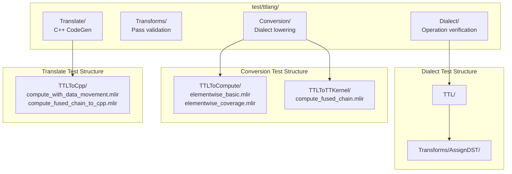
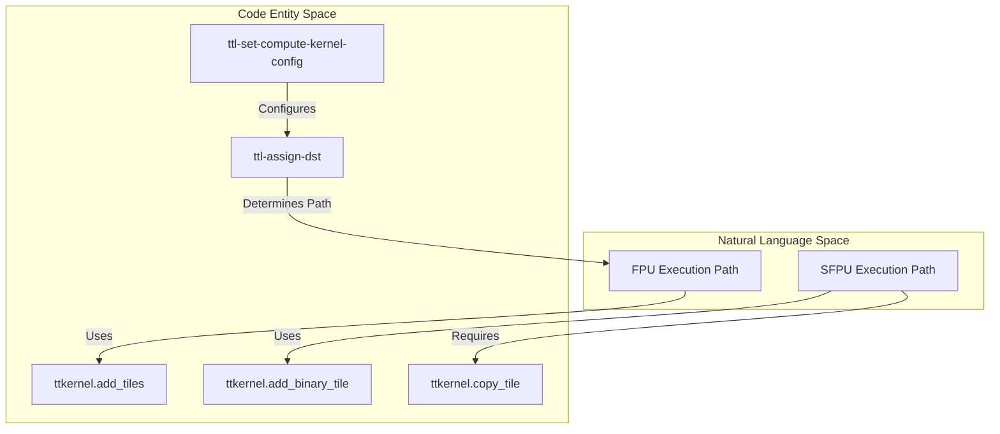
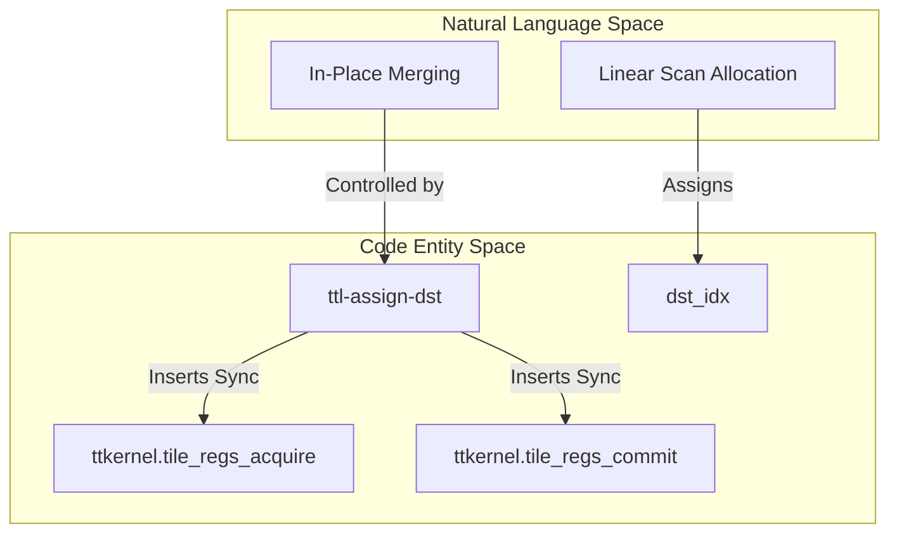

# MLIR FileCheck Tests

Relevant source files
*   [test/ttlang/Conversion/TTLToCompute/dst_assignment.mlir](https://github.com/tenstorrent/tt-lang/blob/d76e6233/test/ttlang/Conversion/TTLToCompute/dst_assignment.mlir)
*   [test/ttlang/Conversion/TTLToCompute/elementwise_basic.mlir](https://github.com/tenstorrent/tt-lang/blob/d76e6233/test/ttlang/Conversion/TTLToCompute/elementwise_basic.mlir)
*   [test/ttlang/Conversion/TTLToCompute/elementwise_coverage.mlir](https://github.com/tenstorrent/tt-lang/blob/d76e6233/test/ttlang/Conversion/TTLToCompute/elementwise_coverage.mlir)
*   [test/ttlang/Conversion/TTLToCompute/elementwise_ops.mlir](https://github.com/tenstorrent/tt-lang/blob/d76e6233/test/ttlang/Conversion/TTLToCompute/elementwise_ops.mlir)
*   [test/ttlang/Conversion/TTLToTTKernel/compute_fused_chain.mlir](https://github.com/tenstorrent/tt-lang/blob/d76e6233/test/ttlang/Conversion/TTLToTTKernel/compute_fused_chain.mlir)
*   [test/ttlang/Dialect/TTL/Transforms/AssignDST/dst_add_mul_exp_chain.mlir](https://github.com/tenstorrent/tt-lang/blob/d76e6233/test/ttlang/Dialect/TTL/Transforms/AssignDST/dst_add_mul_exp_chain.mlir)
*   [test/ttlang/Dialect/TTL/Transforms/AssignDST/dst_multi_use_patterns.mlir](https://github.com/tenstorrent/tt-lang/blob/d76e6233/test/ttlang/Dialect/TTL/Transforms/AssignDST/dst_multi_use_patterns.mlir)
*   [test/ttlang/Dialect/TTL/Transforms/AssignDST/dst_register_reuse.mlir](https://github.com/tenstorrent/tt-lang/blob/d76e6233/test/ttlang/Dialect/TTL/Transforms/AssignDST/dst_register_reuse.mlir)
*   [test/ttlang/Dialect/TTL/Transforms/AssignDST/dst_seven_op_chain.mlir](https://github.com/tenstorrent/tt-lang/blob/d76e6233/test/ttlang/Dialect/TTL/Transforms/AssignDST/dst_seven_op_chain.mlir)
*   [test/ttlang/Dialect/TTL/Transforms/AssignDST/dst_tile_regs_acquire.mlir](https://github.com/tenstorrent/tt-lang/blob/d76e6233/test/ttlang/Dialect/TTL/Transforms/AssignDST/dst_tile_regs_acquire.mlir)
*   [test/ttlang/Translate/TTLToCpp/compute_fused_chain_to_cpp.mlir](https://github.com/tenstorrent/tt-lang/blob/d76e6233/test/ttlang/Translate/TTLToCpp/compute_fused_chain_to_cpp.mlir)
*   [test/ttlang/Translate/TTLToCpp/compute_with_data_movement.mlir](https://github.com/tenstorrent/tt-lang/blob/d76e6233/test/ttlang/Translate/TTLToCpp/compute_with_data_movement.mlir)

## Purpose and Scope

MLIR lit tests validate MLIR transformations directly at the dialect level, testing the compiler's internal representation and transformation passes without involving the Python API layer. These tests use `.mlir` files containing hand-written or compiler-generated MLIR code to verify that transformation passes produce the expected output.

For testing Python kernel compilation (which generates MLIR from Python code), see [Simulator Tests](https://deepwiki.com/tenstorrent/tt-lang/8.3-simulator-tests). For general testing framework configuration, see [Test Framework Overview](https://deepwiki.com/tenstorrent/tt-lang/8.1-test-framework-overview).

**Key responsibilities:**

*   Validate individual MLIR passes and their composition into pipelines [test/ttlang/Conversion/TTLToCompute/elementwise_basic.mlir 1](https://github.com/tenstorrent/tt-lang/blob/d76e6233/test/ttlang/Conversion/TTLToCompute/elementwise_basic.mlir#L1-L1)
*   Test TTL → TTKernel → EmitC → C++ lowering transformations [test/ttlang/Translate/TTLToCpp/compute_fused_chain_to_cpp.mlir 2-7](https://github.com/tenstorrent/tt-lang/blob/d76e6233/test/ttlang/Translate/TTLToCpp/compute_fused_chain_to_cpp.mlir#L2-L7)
*   Verify correct code generation patterns including loops, DMA operations, and register allocation [test/ttlang/Translate/TTLToCpp/compute_with_data_movement.mlir 2-7](https://github.com/tenstorrent/tt-lang/blob/d76e6233/test/ttlang/Translate/TTLToCpp/compute_with_data_movement.mlir#L2-L7)
*   Ensure type conversions and operation lowering are correct [test/ttlang/Conversion/TTLToCompute/elementwise_ops.mlir 1-3](https://github.com/tenstorrent/tt-lang/blob/d76e6233/test/ttlang/Conversion/TTLToCompute/elementwise_ops.mlir#L1-L3)
*   Verify hardware-specific initialization sequences like SFPU vs FPU setup [test/ttlang/Conversion/TTLToTTKernel/compute_fused_chain.mlir 1-7](https://github.com/tenstorrent/tt-lang/blob/d76e6233/test/ttlang/Conversion/TTLToTTKernel/compute_fused_chain.mlir#L1-L7)

Sources: [test/ttlang/Conversion/TTLToCompute/elementwise_basic.mlir 1](https://github.com/tenstorrent/tt-lang/blob/d76e6233/test/ttlang/Conversion/TTLToCompute/elementwise_basic.mlir#L1-L1)[test/ttlang/Translate/TTLToCpp/compute_fused_chain_to_cpp.mlir 2-7](https://github.com/tenstorrent/tt-lang/blob/d76e6233/test/ttlang/Translate/TTLToCpp/compute_fused_chain_to_cpp.mlir#L2-L7)[test/ttlang/Translate/TTLToCpp/compute_with_data_movement.mlir 2-7](https://github.com/tenstorrent/tt-lang/blob/d76e6233/test/ttlang/Translate/TTLToCpp/compute_with_data_movement.mlir#L2-L7)[test/ttlang/Conversion/TTLToCompute/elementwise_ops.mlir 1-3](https://github.com/tenstorrent/tt-lang/blob/d76e6233/test/ttlang/Conversion/TTLToCompute/elementwise_ops.mlir#L1-L3)[test/ttlang/Conversion/TTLToTTKernel/compute_fused_chain.mlir 1-7](https://github.com/tenstorrent/tt-lang/blob/d76e6233/test/ttlang/Conversion/TTLToTTKernel/compute_fused_chain.mlir#L1-L7)

* * *

## Test File Organization

MLIR lit tests are organized by transformation stage and dialect in `test/ttlang/`:

**Test Categories:**

| Directory | Purpose | Key Verifiers/Passes | Example Tests |
| --- | --- | --- | --- |
| `test/ttlang/Dialect/TTL/Transforms/AssignDST/` | DST Assignment and Sync | `ttl-assign-dst` | `dst_seven_op_chain.mlir`[test/ttlang/Dialect/TTL/Transforms/AssignDST/dst_seven_op_chain.mlir 2-4](https://github.com/tenstorrent/tt-lang/blob/d76e6233/test/ttlang/Dialect/TTL/Transforms/AssignDST/dst_seven_op_chain.mlir#L2-L4) |
| `test/ttlang/Conversion/TTLToCompute/` | Lowering TTL to Compute ops | `convert-ttl-to-compute` | `elementwise_basic.mlir`[test/ttlang/Conversion/TTLToCompute/elementwise_basic.mlir 1](https://github.com/tenstorrent/tt-lang/blob/d76e6233/test/ttlang/Conversion/TTLToCompute/elementwise_basic.mlir#L1-L1) |
| `test/ttlang/Conversion/TTLToTTKernel/` | Lowering to hardware-specific ops | `convert-ttl-to-ttkernel` | `compute_fused_chain.mlir`[test/ttlang/Conversion/TTLToTTKernel/compute_fused_chain.mlir 5-7](https://github.com/tenstorrent/tt-lang/blob/d76e6233/test/ttlang/Conversion/TTLToTTKernel/compute_fused_chain.mlir#L5-L7) |
| `test/ttlang/Translate/TTLToCpp/` | Verifying final C++ emission | `ttkernel-to-cpp` | `compute_with_data_movement.mlir`[test/ttlang/Translate/TTLToCpp/compute_with_data_movement.mlir 2-7](https://github.com/tenstorrent/tt-lang/blob/d76e6233/test/ttlang/Translate/TTLToCpp/compute_with_data_movement.mlir#L2-L7) |

Sources: [test/ttlang/Dialect/TTL/Transforms/AssignDST/dst_seven_op_chain.mlir 1-4](https://github.com/tenstorrent/tt-lang/blob/d76e6233/test/ttlang/Dialect/TTL/Transforms/AssignDST/dst_seven_op_chain.mlir#L1-L4)[test/ttlang/Conversion/TTLToCompute/elementwise_basic.mlir 1-3](https://github.com/tenstorrent/tt-lang/blob/d76e6233/test/ttlang/Conversion/TTLToCompute/elementwise_basic.mlir#L1-L3)[test/ttlang/Conversion/TTLToTTKernel/compute_fused_chain.mlir 1-12](https://github.com/tenstorrent/tt-lang/blob/d76e6233/test/ttlang/Conversion/TTLToTTKernel/compute_fused_chain.mlir#L1-L12)[test/ttlang/Translate/TTLToCpp/compute_with_data_movement.mlir 1-15](https://github.com/tenstorrent/tt-lang/blob/d76e6233/test/ttlang/Translate/TTLToCpp/compute_with_data_movement.mlir#L1-L15)

* * *




**Test Categories:**

| Directory | Purpose | Key Verifiers/Passes | Example Tests |
|-----------|---------|---------------------|---------------|
| `test/ttlang/Dialect/TTL/Transforms/AssignDST/` | DST Assignment and Sync | `ttl-assign-dst` | `dst_seven_op_chain.mlir` [test/ttlang/Dialect/TTL/Transforms/AssignDST/dst_seven_op_chain.mlir:2-4]() |
| `test/ttlang/Conversion/TTLToCompute/` | Lowering TTL to Compute ops | `convert-ttl-to-compute` | `elementwise_basic.mlir` [test/ttlang/Conversion/TTLToCompute/elementwise_basic.mlir:1-1]() |
| `test/ttlang/Conversion/TTLToTTKernel/` | Lowering to hardware-specific ops | `convert-ttl-to-ttkernel` | `compute_fused_chain.mlir` [test/ttlang/Conversion/TTLToTTKernel/compute_fused_chain.mlir:5-7]() |
| `test/ttlang/Translate/TTLToCpp/` | Verifying final C++ emission | `ttkernel-to-cpp` | `compute_with_data_movement.mlir` [test/ttlang/Translate/TTLToCpp/compute_with_data_movement.mlir:2-7]() |

Sources: [test/ttlang/Dialect/TTL/Transforms/AssignDST/dst_seven_op_chain.mlir:1-4](), [test/ttlang/Conversion/TTLToCompute/elementwise_basic.mlir:1-3](), [test/ttlang/Conversion/TTLToTTKernel/compute_fused_chain.mlir:1-12](), [test/ttlang/Translate/TTLToCpp/compute_with_data_movement.mlir:1-15]()

---
```
## Test Structure and RUN Commands

Each MLIR lit test consists of `RUN` commands (execution directives) and `CHECK` patterns (verification assertions). The test runner `lit` executes the `RUN` commands and uses `FileCheck` to verify output matches `CHECK` patterns.

### Standard Test Pattern for Pipeline Tests

Tests often verify both FPU (Floating Point Unit) and SFPU (Special Floating Point Unit) paths by varying pass options like `enable-fpu-binary-ops`[test/ttlang/Dialect/TTL/Transforms/AssignDST/dst_seven_op_chain.mlir 2-4](https://github.com/tenstorrent/tt-lang/blob/d76e6233/test/ttlang/Dialect/TTL/Transforms/AssignDST/dst_seven_op_chain.mlir#L2-L4):

**RUN Command Tools:**

| Tool | Purpose |
| --- | --- |
| `ttlang-opt` | MLIR transformation tool for running passes [test/ttlang/Translate/TTLToCpp/compute_with_data_movement.mlir 2-3](https://github.com/tenstorrent/tt-lang/blob/d76e6233/test/ttlang/Translate/TTLToCpp/compute_with_data_movement.mlir#L2-L3) |
| `ttlang-translate` | Translates MLIR to C++ source code [test/ttlang/Translate/TTLToCpp/compute_with_data_movement.mlir 6](https://github.com/tenstorrent/tt-lang/blob/d76e6233/test/ttlang/Translate/TTLToCpp/compute_with_data_movement.mlir#L6-L6) |
| `FileCheck` | Pattern matching tool for verifying output [test/ttlang/Translate/TTLToCpp/compute_with_data_movement.mlir 7](https://github.com/tenstorrent/tt-lang/blob/d76e6233/test/ttlang/Translate/TTLToCpp/compute_with_data_movement.mlir#L7-L7) |

Sources: [test/ttlang/Translate/TTLToCpp/compute_with_data_movement.mlir 1-7](https://github.com/tenstorrent/tt-lang/blob/d76e6233/test/ttlang/Translate/TTLToCpp/compute_with_data_movement.mlir#L1-L7)[test/ttlang/Dialect/TTL/Transforms/AssignDST/dst_seven_op_chain.mlir 1-4](https://github.com/tenstorrent/tt-lang/blob/d76e6233/test/ttlang/Dialect/TTL/Transforms/AssignDST/dst_seven_op_chain.mlir#L1-L4)

* * *

## FPU vs SFPU Lowering Verification

The `ttl-assign-dst` pass and the `ttl-set-compute-kernel-config` utility determine whether binary operations execute on the FPU or SFPU based on operand location and pass flags.

### FPU Binary Logic

When `enable-fpu-binary-ops` is enabled (default), binary operations (add/sub/mul) with both operands sourced from block arguments (CBs) lower to FPU operations (`ttkernel.add_tiles`). These operations read directly from CBs and do not require `copy_tile` to DST [test/ttlang/Conversion/TTLToTTKernel/compute_fused_chain.mlir 37-38](https://github.com/tenstorrent/tt-lang/blob/d76e6233/test/ttlang/Conversion/TTLToTTKernel/compute_fused_chain.mlir#L37-L38)

### SFPU Binary Logic

When disabled, or if an operand is already in DST (e.g., an intermediate result), the compiler uses SFPU operations. This requires `ttkernel.copy_tile` to move CB operands into DST registers [test/ttlang/Conversion/TTLToTTKernel/compute_fused_chain.mlir 81-84](https://github.com/tenstorrent/tt-lang/blob/d76e6233/test/ttlang/Conversion/TTLToTTKernel/compute_fused_chain.mlir#L81-L84)

**Verification Pattern:**

*   **FPU:** Expect `ttkernel.add_tiles` without preceding `ttkernel.copy_tile` for block arguments [test/ttlang/Conversion/TTLToTTKernel/compute_fused_chain.mlir 37-38](https://github.com/tenstorrent/tt-lang/blob/d76e6233/test/ttlang/Conversion/TTLToTTKernel/compute_fused_chain.mlir#L37-L38)
*   **SFPU:** Expect `ttkernel.copy_tile` for operands followed by `ttkernel.add_binary_tile`[test/ttlang/Conversion/TTLToTTKernel/compute_fused_chain.mlir 81-86](https://github.com/tenstorrent/tt-lang/blob/d76e6233/test/ttlang/Conversion/TTLToTTKernel/compute_fused_chain.mlir#L81-L86)

Sources: [test/ttlang/Conversion/TTLToTTKernel/compute_fused_chain.mlir 1-103](https://github.com/tenstorrent/tt-lang/blob/d76e6233/test/ttlang/Conversion/TTLToTTKernel/compute_fused_chain.mlir#L1-L103)[test/ttlang/Dialect/TTL/Transforms/AssignDST/dst_seven_op_chain.mlir 28-60](https://github.com/tenstorrent/tt-lang/blob/d76e6233/test/ttlang/Dialect/TTL/Transforms/AssignDST/dst_seven_op_chain.mlir#L28-L60)

* * *




**Verification Pattern:**
- **FPU:** Expect `ttkernel.add_tiles` without preceding `ttkernel.copy_tile` for block arguments [test/ttlang/Conversion/TTLToTTKernel/compute_fused_chain.mlir:37-38]().
- **SFPU:** Expect `ttkernel.copy_tile` for operands followed by `ttkernel.add_binary_tile` [test/ttlang/Conversion/TTLToTTKernel/compute_fused_chain.mlir:81-86]().

Sources: [test/ttlang/Conversion/TTLToTTKernel/compute_fused_chain.mlir:1-103](), [test/ttlang/Dialect/TTL/Transforms/AssignDST/dst_seven_op_chain.mlir:28-60]()

---
```
## DST Assignment and Synchronization

Tests in `test/ttlang/Dialect/TTL/Transforms/AssignDST/` verify the linear scan allocation and in-place merging logic.

### DST Allocation and Re-use

The `ttl-assign-dst` pass performs linear scan allocation. Verification ensures that intermediate results in a fused chain correctly reuse DST registers to minimize capacity usage [test/ttlang/Dialect/TTL/Transforms/AssignDST/dst_add_mul_exp_chain.mlir 31-34](https://github.com/tenstorrent/tt-lang/blob/d76e6233/test/ttlang/Dialect/TTL/Transforms/AssignDST/dst_add_mul_exp_chain.mlir#L31-L34)

### Multi-Op Chains

Regression tests verify that long fused chains (e.g., seven operations) are correctly lowered without dropping operations or losing `dst_idx` attributes [test/ttlang/Dialect/TTL/Transforms/AssignDST/dst_seven_op_chain.ml31-37](https://github.com/tenstorrent/tt-lang/blob/d76e6233/test/ttlang/Dialect/TTL/Transforms/AssignDST/dst_seven_op_chain.ml31-37)

Sources: [test/ttlang/Dialect/TTL/Transforms/AssignDST/dst_seven_op_chain.mlir 9-67](https://github.com/tenstorrent/tt-lang/blob/d76e6233/test/ttlang/Dialect/TTL/Transforms/AssignDST/dst_seven_op_chain.mlir#L9-L67)[test/ttlang/Dialect/TTL/Transforms/AssignDST/dst_add_mul_exp_chain.mlir 1-38](https://github.com/tenstorrent/tt-lang/blob/d76e6233/test/ttlang/Dialect/TTL/Transforms/AssignDST/dst_add_mul_exp_chain.mlir#L1-L38)[test/ttlang/Dialect/TTL/Transforms/AssignDST/dst_tile_regs_acquire.mlir 1-28](https://github.com/tenstorrent/tt-lang/blob/d76e6233/test/ttlang/Dialect/TTL/Transforms/AssignDST/dst_tile_regs_acquire.mlir#L1-L28)

* * *




Sources: [test/ttlang/Dialect/TTL/Transforms/AssignDST/dst_seven_op_chain.mlir:9-67](), [test/ttlang/Dialect/TTL/Transforms/AssignDST/dst_add_mul_exp_chain.mlir:1-38](), [test/ttlang/Dialect/TTL/Transforms/AssignDST/dst_tile_regs_acquire.mlir:1-28]()

---
```
## End-to-End Translation Verification

Tests in `test/ttlang/Translate/TTLToCpp/` verify the final C++ source code generation.

### Reader/Writer Thread Generation

Verifies that NOC DMA operations (`noc_async_read_tile`) and tensor accessors are correctly emitted for reader/writer threads [test/ttlang/Translate/TTLToCpp/compute_with_data_movement.mlir 40-62](https://github.com/tenstorrent/tt-lang/blob/d76e6233/test/ttlang/Translate/TTLToCpp/compute_with_data_movement.mlir#L40-L62)

### Compute Thread Emission

Verifies that `ttkernel` dialect operations translate to the appropriate Tenstorrent kernel APIs like `binary_op_init_common`, `tile_regs_acquire`, and `pack_tile`[test/ttlang/Translate/TTLToCpp/compute_with_data_movement.mlir 104-125](https://github.com/tenstorrent/tt-lang/blob/d76e6233/test/ttlang/Translate/TTLToCpp/compute_with_data_movement.mlir#L104-L125)

Sources: [test/ttlang/Translate/TTLToCpp/compute_with_data_movement.mlir 25-130](https://github.com/tenstorrent/tt-lang/blob/d76e6233/test/ttlang/Translate/TTLToCpp/compute_with_data_movement.mlir#L25-L130)[test/ttlang/Translate/TTLToCpp/compute_fused_chain_to_cpp.mlir 25-60](https://github.com/tenstorrent/tt-lang/blob/d76e6233/test/ttlang/Translate/TTLToCpp/compute_fused_chain_to_cpp.mlir#L25-L60)

Dismiss
Refresh this wiki

Enter email to refresh
