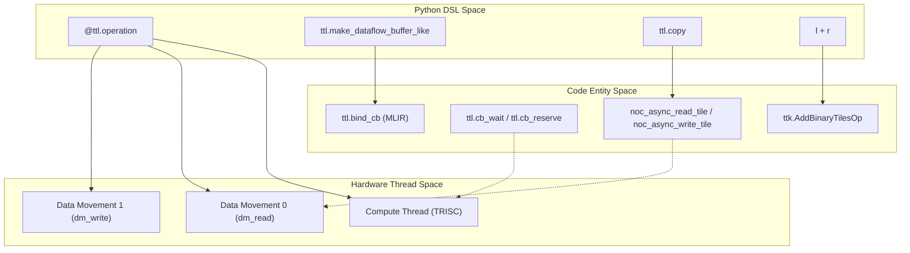

# Simple Element-wise Operations

Relevant source files
*   [docs/sphinx/specs/TTLangSpecification.md](https://github.com/tenstorrent/tt-lang/blob/d76e6233/docs/sphinx/specs/TTLangSpecification.md?plain=1)
*   [examples/elementwise-tutorial/step_0_ttnn_base.py](https://github.com/tenstorrent/tt-lang/blob/d76e6233/examples/elementwise-tutorial/step_0_ttnn_base.py)
*   [examples/elementwise-tutorial/step_1_single_node_single_tile_block.py](https://github.com/tenstorrent/tt-lang/blob/d76e6233/examples/elementwise-tutorial/step_1_single_node_single_tile_block.py)
*   [examples/elementwise-tutorial/step_2_single_node_multitile_block.py](https://github.com/tenstorrent/tt-lang/blob/d76e6233/examples/elementwise-tutorial/step_2_single_node_multitile_block.py)
*   [examples/elementwise-tutorial/step_3_multinode.py](https://github.com/tenstorrent/tt-lang/blob/d76e6233/examples/elementwise-tutorial/step_3_multinode.py)
*   [include/ttlang/Dialect/TTL/Transforms/DFBMaterialization.h](https://github.com/tenstorrent/tt-lang/blob/d76e6233/include/ttlang/Dialect/TTL/Transforms/DFBMaterialization.h)
*   [lib/Dialect/TTL/Transforms/DFBMaterialization.cpp](https://github.com/tenstorrent/tt-lang/blob/d76e6233/lib/Dialect/TTL/Transforms/DFBMaterialization.cpp)
*   [lib/Dialect/TTL/Transforms/TTLInsertIntermediateDFBs.cpp](https://github.com/tenstorrent/tt-lang/blob/d76e6233/lib/Dialect/TTL/Transforms/TTLInsertIntermediateDFBs.cpp)
*   [python/pykernel/_src/kernel_ast.py](https://github.com/tenstorrent/tt-lang/blob/d76e6233/python/pykernel/_src/kernel_ast.py)
*   [test/python/invalid/invalid_reduce_scalar_undefined.py](https://github.com/tenstorrent/tt-lang/blob/d76e6233/test/python/invalid/invalid_reduce_scalar_undefined.py)
*   [test/python/simple_add.py](https://github.com/tenstorrent/tt-lang/blob/d76e6233/test/python/simple_add.py)
*   [test/python/simple_add_dram.py](https://github.com/tenstorrent/tt-lang/blob/d76e6233/test/python/simple_add_dram.py)
*   [test/python/simple_add_loop.py](https://github.com/tenstorrent/tt-lang/blob/d76e6233/test/python/simple_add_loop.py)
*   [test/python/simple_add_multitile.py](https://github.com/tenstorrent/tt-lang/blob/d76e6233/test/python/simple_add_multitile.py)
*   [test/python/simple_add_with_stmt.py](https://github.com/tenstorrent/tt-lang/blob/d76e6233/test/python/simple_add_with_stmt.py)
*   [test/python/simple_reduce_scalar.py](https://github.com/tenstorrent/tt-lang/blob/d76e6233/test/python/simple_reduce_scalar.py)
*   [test/python/test_dram_interleaved_add.py](https://github.com/tenstorrent/tt-lang/blob/d76e6233/test/python/test_dram_interleaved_add.py)
*   [test/python/test_ttnn_interop_add.py](https://github.com/tenstorrent/tt-lang/blob/d76e6233/test/python/test_ttnn_interop_add.py)

This page provides a complete walkthrough of implementing basic element-wise operations (addition, multiplication, etc.) in tt-lang. It covers the fundamental structure of tt-lang kernels using the `@ttl.operation` decorator, management of Dataflow Buffers (DFBs), and the separation between compute and data movement threads.

* * *

## Overview of Element-wise Operations

Element-wise operations in tt-lang are typically implemented by streaming tiles through circular buffers (DFBs). The compute thread performs the mathematical operation on tiles residing in the DST register file, while data movement threads handle the transfer between device memory (L1 or DRAM) and these buffers [docs/sphinx/specs/TTLangSpecification.md 53-57](https://github.com/tenstorrent/tt-lang/blob/d76e6233/docs/sphinx/specs/TTLangSpecification.md?plain=1#L53-L57)

### Supported Operations

The mapping between Python DSL operations and hardware-specific instructions allows for a wide range of math.

*   **Binary Ops**: `add`, `sub`, `mul`, `div`, `max`, `min`. [test/python/simple_add.py 37](https://github.com/tenstorrent/tt-lang/blob/d76e6233/test/python/simple_add.py#L37-L37)[examples/elementwise-tutorial/step_2_single_node_multitile_block.py 88](https://github.com/tenstorrent/tt-lang/blob/d76e6233/examples/elementwise-tutorial/step_2_single_node_multitile_block.py#L88-L88)
*   **Unary Ops**: `exp`, `log`, `sqrt`, `rsqrt`, `tanh`, `abs`, `neg`, `relu`, `sigmoid`. [docs/sphinx/specs/TTLangSpecification.md 46](https://github.com/tenstorrent/tt-lang/blob/d76e6233/docs/sphinx/specs/TTLangSpecification.md?plain=1#L46-L46)
*   **In-place Patterns**: Operations like accumulation in loops using `+=`. [test/python/simple_add_loop.py 40](https://github.com/tenstorrent/tt-lang/blob/d76e6233/test/python/simple_add_loop.py#L40-L40)

**Sources:**[test/python/simple_add.py 27-63](https://github.com/tenstorrent/tt-lang/blob/d76e6233/test/python/simple_add.py#L27-L63)[test/python/simple_add_loop.py 28-41](https://github.com/tenstorrent/tt-lang/blob/d76e6233/test/python/simple_add_loop.py#L28-L41)[docs/sphinx/specs/TTLangSpecification.md 46](https://github.com/tenstorrent/tt-lang/blob/d76e6233/docs/sphinx/specs/TTLangSpecification.md?plain=1#L46-L46)

* * *

## Single-Tile Addition Kernel

The simplest kernel adds two 32×32 tiles using the standard tt-lang programming pattern.

### Explicit Lifecycle Pattern

The basic pattern explicitly manages buffer lifecycle with `reserve()`, `wait()`, `push()`, and `pop()` operations. This manual management is often used when fine-grained control over synchronization is required.

`@ttl.operation(grid=(1, 1))def add_kernel(lhs, rhs, out):    # Create Dataflow Buffers (DFBs) matching tensor shapes    lhs_dfb = ttl.make_dataflow_buffer_like(lhs, shape=(1, 1), block_count=2)    rhs_dfb = ttl.make_dataflow_buffer_like(rhs, shape=(1, 1), block_count=2)    out_dfb = ttl.make_dataflow_buffer_like(out, shape=(1, 1), block_count=2)     @ttl.compute()    def add_compute():        l = lhs_dfb.wait()      # Wait for input data        r = rhs_dfb.wait()        o = out_dfb.reserve()   # Reserve output space        result = l + r         # Perform addition (mapped to ttl.add)        o.store(result)        # Store result to DFB        l.pop()                # Release input DFBs        r.pop()        o.push()               # Make output available to writer     @ttl.datamovement()    def dm_read():        lhs_blk = lhs_dfb.reserve()        tx_lhs = ttl.copy(lhs[0, 0], lhs_blk) # DMA from tensor to DFB        tx_lhs.wait()        lhs_blk.push()                rhs_blk = rhs_dfb.reserve()        tx_rhs = ttl.copy(rhs[0, 0], rhs_blk)        tx_rhs.wait()        rhs_blk.push()     @ttl.datamovement()    def dm_write():        out_blk = out_dfb.wait()        tx = ttl.copy(out_blk, out[0, 0]) # DMA from DFB to tensor        tx.wait()        out_blk.pop()`
**Sources:**[test/python/simple_add.py 27-63](https://github.com/tenstorrent/tt-lang/blob/d76e6233/test/python/simple_add.py#L27-L63)[test/python/simple_add_dram.py 28-65](https://github.com/tenstorrent/tt-lang/blob/d76e6233/test/python/simple_add_dram.py#L28-L65)

### With-Statement Pattern (Recommended)

The `with` statement automatically handles the acquire/release lifecycle of DFBs, reducing boilerplate and preventing common synchronization errors like forgetting to `pop()` or `push()`. On context entry, `wait()` or `reserve()` is called; on exit, `pop()` or `push()` is called in reverse order [test/python/simple_add_with_stmt.py 15-18](https://github.com/tenstorrent/tt-lang/blob/d76e6233/test/python/simple_add_with_stmt.py#L15-L18)

`@ttl.compute()def compute():    # 'with' handles wait/reserve at entry, pop/push at exit    with (        a_dfb.wait() as a_blk,        b_dfb.wait() as b_blk,        out_dfb.reserve() as out_blk,    ):        out_blk.store(a_blk + b_blk)    # Automatic: out_blk.push(), b_blk.pop(), a_blk.pop()`
**Sources:**[test/python/simple_add_with_stmt.py 43-46](https://github.com/tenstorrent/tt-lang/blob/d76e6233/test/python/simple_add_with_stmt.py#L43-L46)[examples/elementwise-tutorial/step_3_multinode.py 82-88](https://github.com/tenstorrent/tt-lang/blob/d76e6233/examples/elementwise-tutorial/step_3_multinode.py#L82-L88)

* * *

## Data Flow and Thread Roles

The kernel orchestrates independent hardware threads communicating via circular buffers mapped to SRAM.

### System Mapping Diagram

This diagram bridges the Python DSL concepts to the underlying code entities and hardware roles.

Title: DSL to Hardware Entity Mapping

**Sources:**[test/python/simple_add.py 69-134](https://github.com/tenstorrent/tt-lang/blob/d76e6233/test/python/simple_add.py#L69-L134)[test/python/simple_add.py 140-190](https://github.com/tenstorrent/tt-lang/blob/d76e6233/test/python/simple_add.py#L140-L190)[python/pykernel/_src/kernel_ast.py 61-127](https://github.com/tenstorrent/tt-lang/blob/d76e6233/python/pykernel/_src/kernel_ast.py#L61-L127)

### DFB Synchronization Flow

Title: DFB Producer-Consumer Lifecycle

**Sources:**[test/python/simple_add.py 33-63](https://github.com/tenstorrent/tt-lang/blob/d76e6233/test/python/simple_add.py#L33-L63)[docs/sphinx/specs/TTLangSpecification.md 38-39](https://github.com/tenstorrent/tt-lang/blob/d76e6233/docs/sphinx/specs/TTLangSpecification.md?plain=1#L38-L39)

* * *

## Processing Multiple Tiles and Granularity

For tensors larger than a single tile, kernels use loops and "granularity" to process blocks of tiles.

### Multi-tile Looping

Kernels can use standard Python `for` loops which are lowered to `scf.for` in MLIR [python/pykernel/_src/kernel_ast.py 210](https://github.com/tenstorrent/tt-lang/blob/d76e6233/python/pykernel/_src/kernel_ast.py#L210-L210) Granularity defines how many tiles are processed in a single DFB transaction.

`# Example processing a 2x2 tile grid@ttl.operation(grid=(1, 1))def add_multitile_kernel(lhs, rhs, out):    lhs_dfb = ttl.make_dataflow_buffer_like(lhs, shape=(2, 2), block_count=2)    # ...    @ttl.compute()    def add_compute():        l = lhs_dfb.wait()        # ... math on 2x2 block ...`
**Sources:**[test/python/simple_add_multitile.py 30-43](https://github.com/tenstorrent/tt-lang/blob/d76e6233/test/python/simple_add_multitile.py#L30-L43)[examples/elementwise-tutorial/step_2_single_node_multitile_block.py 44-49](https://github.com/tenstorrent/tt-lang/blob/d76e6233/examples/elementwise-tutorial/step_2_single_node_multitile_block.py#L44-L49)

### Accumulation in Loops

Loops can also be used within the compute thread to perform operations like iterative accumulation, often requiring reading and writing to the same DFB [test/python/simple_add_loop.py 35-41](https://github.com/tenstorrent/tt-lang/blob/d76e6233/test/python/simple_add_loop.py#L35-L41)

`@ttl.compute()def add_compute():    with lhs_dfb.wait() as l, rhs_dfb.wait() as r:        out_blk = out_dfb.reserve()        out_blk.store(l)        for i in range(4):            out_blk += r # Accumulate r into the output block        out_blk.push()`
**Sources:**[test/python/simple_add_loop.py 35-41](https://github.com/tenstorrent/tt-lang/blob/d76e6233/test/python/simple_add_loop.py#L35-L41)[test/python/simple_add_loop.py 72-74](https://github.com/tenstorrent/tt-lang/blob/d76e6233/test/python/simple_add_loop.py#L72-L74)

* * *

## Multi-Core Grid Execution

Element-wise operations can be parallelized across a grid of cores. Each node identifies its work using `ttl.node()` and determines the total grid size via `ttl.grid_size()`[examples/elementwise-tutorial/step_3_multinode.py 54-96](https://github.com/tenstorrent/tt-lang/blob/d76e6233/examples/elementwise-tutorial/step_3_multinode.py#L54-L96)

| Function | Purpose |
| --- | --- |
| `ttl.grid_size(dims)` | Returns the dimensions of the execution grid (e.g., (cols, rows)). |
| `ttl.node(dims)` | Returns the coordinates of the current core in the grid. |

**Sources:**[examples/elementwise-tutorial/step_3_multinode.py 54-96](https://github.com/tenstorrent/tt-lang/blob/d76e6233/examples/elementwise-tutorial/step_3_multinode.py#L54-L96)[docs/sphinx/specs/TTLangSpecification.md 100-115](https://github.com/tenstorrent/tt-lang/blob/d76e6233/docs/sphinx/specs/TTLangSpecification.md?plain=1#L100-L115)

* * *

## Memory Configurations

tt-lang kernels can operate directly on different memory configurations (DRAM or L1) without manual management of the underlying NOC addresses.

| Feature | Description | Code Reference |
| --- | --- | --- |
| **DRAM Direct** | DMA pulls directly from DRAM interleaved tensors into DFBs. | [test/python/simple_add_dram.py 28-65](https://github.com/tenstorrent/tt-lang/blob/d76e6233/test/python/simple_add_dram.py#L28-L65) |
| **L1 Interleaved** | Tensors reside in L1; `ttl.copy` manages NOC transfers. | [test/python/simple_add.py 102-104](https://github.com/tenstorrent/tt-lang/blob/d76e6233/test/python/simple_add.py#L102-L104) |
| **Block Count** | Usually set to 2 for double-buffering, allowing compute and DM to overlap. | [test/python/simple_add.py 28-30](https://github.com/tenstorrent/tt-lang/blob/d76e6233/test/python/simple_add.py#L28-L30) |
| **TTNN Interop** | Tensors created via `ttnn` are passed directly to kernels. | [test/python/test_ttnn_interop_add.py 72-76](https://github.com/tenstorrent/tt-lang/blob/d76e6233/test/python/test_ttnn_interop_add.py#L72-L76) |

**Sources:**[test/python/simple_add_dram.py 12-17](https://github.com/tenstorrent/tt-lang/blob/d76e6233/test/python/simple_add_dram.py#L12-L17)[test/python/test_dram_interleaved_add.py 21-61](https://github.com/tenstorrent/tt-lang/blob/d76e6233/test/python/test_dram_interleaved_add.py#L21-L61)[test/python/simple_add.py 28-30](https://github.com/tenstorrent/tt-lang/blob/d76e6233/test/python/simple_add.py#L28-L30)

* * *

## Compilation and Code Generation

### MLIR Lowering

The Python code is first lowered to the `ttl` dialect. For an `add` operation, the compiler emits `ttl.add`. If the `with` statement is used, it generates `ttl.cb_wait`/`ttl.cb_reserve` followed by `ttl.attach_cb` to bind the buffer to the operation [test/python/simple_add.py 87](https://github.com/tenstorrent/tt-lang/blob/d76e6233/test/python/simple_add.py#L87-L87)[test/python/simple_add_with_stmt.py 78-87](https://github.com/tenstorrent/tt-lang/blob/d76e6233/test/python/simple_add_with_stmt.py#L78-L87)

### C++ Hardware Intrinsics

Depending on compiler flags and hardware capabilities, the backend generates different C++ code:

*   **FPU Path**: Uses `add_tiles_init` and `add_tiles` for high-performance math. This is the default for most binary operations when `--ttl-fpu-binary-ops` is enabled [test/python/simple_add.py 160-161](https://github.com/tenstorrent/tt-lang/blob/d76e6233/test/python/simple_add.py#L160-L161)[test/python/simple_add_multitile.py 150-152](https://github.com/tenstorrent/tt-lang/blob/d76e6233/test/python/simple_add_multitile.py#L150-L152)
*   **SFPU Path**: Uses `add_binary_tile_init` and `add_binary_tile` for special functional unit ops or when FPU binary ops are disabled [test/python/simple_add_with_stmt.py 151-152](https://github.com/tenstorrent/tt-lang/blob/d76e6233/test/python/simple_add_with_stmt.py#L151-L152)[test/python/simple_add_multitile.py 128-129](https://github.com/tenstorrent/tt-lang/blob/d76e6233/test/python/simple_add_multitile.py#L128-L129)

**Sources:**[test/python/simple_add.py 137-174](https://github.com/tenstorrent/tt-lang/blob/d76e6233/test/python/simple_add.py#L137-L174)[test/python/simple_add_dram.py 130-154](https://github.com/tenstorrent/tt-lang/blob/d76e6233/test/python/simple_add_dram.py#L130-L154)[test/python/simple_add_with_stmt.py 135-159](https://github.com/tenstorrent/tt-lang/blob/d76e6233/test/python/simple_add_with_stmt.py#L135-L159)[test/python/simple_add_multitile.py 136-161](https://github.com/tenstorrent/tt-lang/blob/d76e6233/test/python/simple_add_multitile.py#L136-L161)

Dismiss
Refresh this wiki

Enter email to refresh
