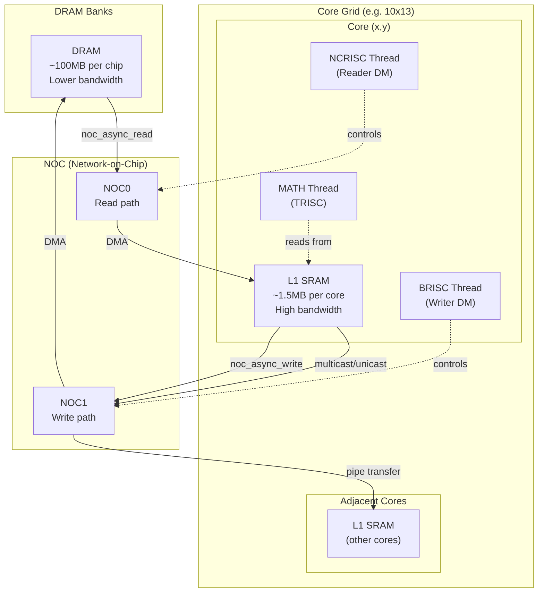
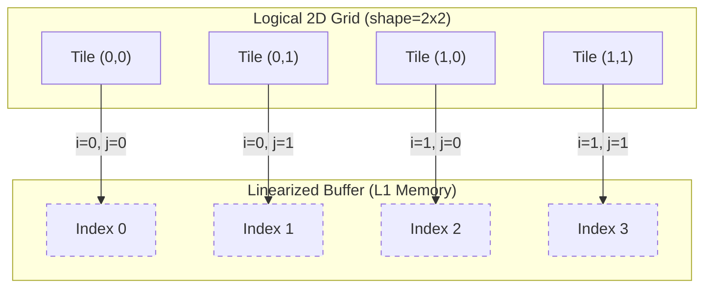
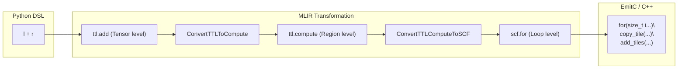

# Multi-tile Processing

Relevant source files
*   [docs/LOWERING_MULTITILE.md](https://github.com/tenstorrent/tt-lang/blob/d76e6233/docs/LOWERING_MULTITILE.md?plain=1)
*   [test/python/simple_add.py](https://github.com/tenstorrent/tt-lang/blob/d76e6233/test/python/simple_add.py)
*   [test/python/simple_add_dram.py](https://github.com/tenstorrent/tt-lang/blob/d76e6233/test/python/simple_add_dram.py)
*   [test/python/simple_add_loop.py](https://github.com/tenstorrent/tt-lang/blob/d76e6233/test/python/simple_add_loop.py)
*   [test/python/simple_add_multitile.py](https://github.com/tenstorrent/tt-lang/blob/d76e6233/test/python/simple_add_multitile.py)
*   [test/python/simple_add_with_stmt.py](https://github.com/tenstorrent/tt-lang/blob/d76e6233/test/python/simple_add_with_stmt.py)
*   [test/python/test_dram_interleaved_add.py](https://github.com/tenstorrent/tt-lang/blob/d76e6233/test/python/test_dram_interleaved_add.py)
*   [test/python/test_ttnn_interop_add.py](https://github.com/tenstorrent/tt-lang/blob/d76e6233/test/python/test_ttnn_interop_add.py)

## Overview

Multi-tile processing involves working with blocks of tiles larger than 1x1 (e.g., 2x2, 4x4) within a single kernel invocation. This approach is fundamental for efficient tensor operations on Tenstorrent hardware, as it amortizes synchronization overhead across multiple tiles and enables better utilization of circular buffer (CB) capacity and DST register space.

This page explains multi-tile processing through the `simple_add_multitile` example, which performs element-wise addition on 64x64 tensors (2x2 tile grids). Key topics include linearized indexing, nested loop generation, and how the compiler lowers high-level tile operations into hardware-specific code.

Sources: [test/python/simple_add_multitile.py 12-17](https://github.com/tenstorrent/tt-lang/blob/d76e6233/test/python/simple_add_multitile.py#L12-L17)[docs/LOWERING_MULTITILE.md 1-3](https://github.com/tenstorrent/tt-lang/blob/d76e6233/docs/LOWERING_MULTITILE.md?plain=1#L1-L3)

* * *




Sources: [python/ttl/ttl_api.py:98-98](), [benchmarks/matmul/config.py:76-78](), [benchmarks/matmul/NOTES.md:68-74]()
```
## Dataflow Buffer Configuration

The `shape` parameter in `ttl.make_dataflow_buffer_like` defines the dimensions of the tile block the buffer will hold. This parameter directly influences the total capacity of the buffer in L1 memory.

### Capacity Calculation

The total number of tiles allocated for a buffer is: `total_tiles = block_count * shape_rows * shape_cols`

In [test/python/simple_add_multitile.py 30-32](https://github.com/tenstorrent/tt-lang/blob/d76e6233/test/python/simple_add_multitile.py#L30-L32) the buffers are defined as:

`lhs_dfb = ttl.make_dataflow_buffer_like(lhs, shape=(2, 2), block_count=2)rhs_dfb = ttl.make_dataflow_buffer_like(rhs, shape=(2, 2), block_count=2)out_dfb = ttl.make_dataflow_buffer_like(out, shape=(2, 2), block_count=2)`
With a `block_count` of 2 and a `shape` of (2, 2), each buffer allocates 8 tiles total (double-buffering 4-tile blocks).

Sources: [test/python/simple_add_multitile.py 30-32](https://github.com/tenstorrent/tt-lang/blob/d76e6233/test/python/simple_add_multitile.py#L30-L32)[docs/LOWERING_MULTITILE.md 38-42](https://github.com/tenstorrent/tt-lang/blob/d76e6233/docs/LOWERING_MULTITILE.md?plain=1#L38-L42)

* * *

## Linearized Indexing

When processing a multi-tile block, tiles are stored contiguously in the circular buffer. To access a specific tile `(i, j)` within a block of width `W`, the compiler calculates a linearized index.

### Mapping 2D to 1D

The formula used is: `linear_index = i * W + j`.

**Diagram: Logical Grid to Linearized Buffer Mapping** This diagram bridges the "Natural Language Space" of 2D grids to the "Code Entity Space" of linearized `copy_tile` indices.

In the generated C++ code for the compute kernel, the compiler materializes this calculation:

*   `size_t [[COLS:v[0-9]+]] = 2;`[test/python/simple_add_multitile.py 119](https://github.com/tenstorrent/tt-lang/blob/d76e6233/test/python/simple_add_multitile.py#L119-L119)
*   `size_t [[ROW_OFF:v[0-9]+]] = [[I]] * [[COLS]];`[test/python/simple_add_multitile.py 120](https://github.com/tenstorrent/tt-lang/blob/d76e6233/test/python/simple_add_multitile.py#L120-L120)
*   `size_t [[LIN_IDX:v[0-9]+]] = [[ROW_OFF]] + [[J]];`[test/python/simple_add_multitile.py 121](https://github.com/tenstorrent/tt-lang/blob/d76e6233/test/python/simple_add_multitile.py#L121-L121)

Sources: [test/python/simple_add_multitile.py 118-122](https://github.com/tenstorrent/tt-lang/blob/d76e6233/test/python/simple_add_multitile.py#L118-L122)[docs/LOWERING_MULTITILE.md 150-152](https://github.com/tenstorrent/tt-lang/blob/d76e6233/docs/LOWERING_MULTITILE.md?plain=1#L150-L152)

* * *




In the generated C++ code for the compute kernel, the compiler materializes this calculation:
- `size_t [[COLS:v[0-9]+]] = 2;` [test/python/simple_add_multitile.py:119]()
- `size_t [[ROW_OFF:v[0-9]+]] = [[I]] * [[COLS]];` [test/python/simple_add_multitile.py:120]()
- `size_t [[LIN_IDX:v[0-9]+]] = [[ROW_OFF]] + [[J]];` [test/python/simple_add_multitile.py:121]()

Sources: [test/python/simple_add_multitile.py:118-122](), [docs/LOWERING_MULTITILE.md:150-152]()

---
```
## Compilation Pipeline for Multi-tile

The transformation from Python DSL to hardware-executable C++ involves several MLIR passes that handle the expansion of tensor operations into tile-level loops.

### 1. High-Level TTL Dialect

The initial IR represents operations on entire multi-tile tensors (e.g., `tensor<2x2x!ttcore.tile<32x32, bf16>>`). Sources: [docs/LOWERING_MULTITILE.md 38-56](https://github.com/tenstorrent/tt-lang/blob/d76e6233/docs/LOWERING_MULTITILE.md?plain=1#L38-L56)

### 2. `convert-ttl-to-compute`

This pass replaces tensor-level operations (like `ttl.add`) with a `ttl.compute` region. This region contains `indexing_maps` (affine maps) that define how the input and output tensors are traversed. Sources: [docs/LOWERING_MULTITILE.md 58-78](https://github.com/tenstorrent/tt-lang/blob/d76e6233/docs/LOWERING_MULTITILE.md?plain=1#L58-L78)

### 3. `ttl-lower-to-loops`

The `ttl.compute` operation is materialized into explicit `scf.for` loops. For a 2x2 grid, the compiler generates nested loops with bounds `0` to `2`. Inside these loops, `ttl.iter_index` is used to retrieve the current induction variables for calculating the linearized index. Sources: [docs/LOWERING_MULTITILE.md 130-165](https://github.com/tenstorrent/tt-lang/blob/d76e6233/docs/LOWERING_MULTITILE.md?plain=1#L130-L165)

**Diagram: Lowering Pipeline Entities** Associates system transformation stages with specific MLIR operations and passes.

Sources: [docs/LOWERING_MULTITILE.md 32-165](https://github.com/tenstorrent/tt-lang/blob/d76e6233/docs/LOWERING_MULTITILE.md?plain=1#L32-L165)[test/python/simple_add_multitile.py 115-121](https://github.com/tenstorrent/tt-lang/blob/d76e6233/test/python/simple_add_multitile.py#L115-L121)

* * *




Sources: [docs/LOWERING_MULTITILE.md:32-165](), [test/python/simple_add_multitile.py:115-121]()

---
```
## Data Movement and Slicing

Multi-tile data movement uses Python slice syntax to specify the block of tiles to be transferred between DRAM/L1 and the local core buffers.

In the `dm_read` function of the example:

`lhs_blk = lhs_dfb.reserve()tx_lhs = ttl.copy(lhs[0:2, 0:2], lhs_blk)tx_lhs.wait()lhs_blk.push()`
The slice `lhs[0:2, 0:2]` instructs the `ttl.copy` operation to fetch a 2x2 block of tiles starting at row 0, column 0. The compiler validates that the slice dimensions match the `shape` provided in `make_dataflow_buffer_like`.

Sources: [test/python/simple_add_multitile.py 47-50](https://github.com/tenstorrent/tt-lang/blob/d76e6233/test/python/simple_add_multitile.py#L47-L50)[test/python/simple_add_multitile.py 30-32](https://github.com/tenstorrent/tt-lang/blob/d76e6233/test/python/simple_add_multitile.py#L30-L32)

* * *

## Optimization: FPU Path and Unrolling

If the multi-tile block is small enough to fit in the DST register file, the compiler can optimize the execution by fully unrolling the loops and using FPU-specific binary operations.

### DST Register Capacity

For `bfloat16` data, the DST register file can typically hold several tiles. In the 2x2 example (4 tiles total), the compiler may choose to:

1.   Initialize binary operations once: `binary_op_init_common(...)`[test/python/simple_add_multitile.py 148](https://github.com/tenstorrent/tt-lang/blob/d76e6233/test/python/simple_add_multitile.py#L148-L148)
2.   Acquire all needed registers: `tile_regs_acquire()`[test/python/simple_add_multitile.py 149](https://github.com/tenstorrent/tt-lang/blob/d76e6233/test/python/simple_add_multitile.py#L149-L149)
3.   Execute unrolled tile additions: `add_tiles(...)` called 4 times consecutively [test/python/simple_add_multitile.py 151-154](https://github.com/tenstorrent/tt-lang/blob/d76e6233/test/python/simple_add_multitile.py#L151-L154)
4.   Commit and release: `tile_regs_commit()`, `tile_regs_wait()`, `tile_regs_release()`[test/python/simple_add_multitile.py 155-158](https://github.com/tenstorrent/tt-lang/blob/d76e6233/test/python/simple_add_multitile.py#L155-L158)

This avoids the overhead of loop branching and re-initialization for every tile.

Sources: [test/python/simple_add_multitile.py 136-161](https://github.com/tenstorrent/tt-lang/blob/d76e6233/test/python/simple_add_multitile.py#L136-L161)

* * *

## Automatic Lifecycle with `with` Statement

For multi-tile processing, the `with` statement simplifies DFB lifecycle management. It automatically handles the acquisition (wait/reserve) and release (pop/push) of tile blocks.

`@ttl.compute()def add_compute():    # 'with' handles wait/reserve at entry, pop/push at exit    with lhs_dfb.wait() as l, rhs_dfb.wait() as r, out_dfb.reserve() as o:        result = l + r        o.store(result)`
The compiler lowers this to `ttl.cb_wait`/`ttl.cb_reserve` at the start and `ttl.cb_push`/`ttl.cb_pop` in reverse order at the end of the block.

Sources: [test/python/simple_add_with_stmt.py 41-47](https://github.com/tenstorrent/tt-lang/blob/d76e6233/test/python/simple_add_with_stmt.py#L41-L47)[test/python/simple_add_with_stmt.py 82-98](https://github.com/tenstorrent/tt-lang/blob/d76e6233/test/python/simple_add_with_stmt.py#L82-L98)

* * *

## Loop Accumulation

Kernels can also use explicit loops to accumulate results within a tile block using the `+=` operator, which the compiler lowers to `ttl.store` with an `accumulate` attribute.

`for i in range(4):    out_blk += r`
This generates `llk_pack_reconfig_l1_acc(1)` to enable accumulation in the hardware packer.

Sources: [test/python/simple_add_loop.py 39-40](https://github.com/tenstorrent/tt-lang/blob/d76e6233/test/python/simple_add_loop.py#L39-L40)[test/python/simple_add_loop.py 73-74](https://github.com/tenstorrent/tt-lang/blob/d76e6233/test/python/simple_add_loop.py#L73-L74)[test/python/simple_add_loop.py 102](https://github.com/tenstorrent/tt-lang/blob/d76e6233/test/python/simple_add_loop.py#L102-L102)

Dismiss
Refresh this wiki

Enter email to refresh
