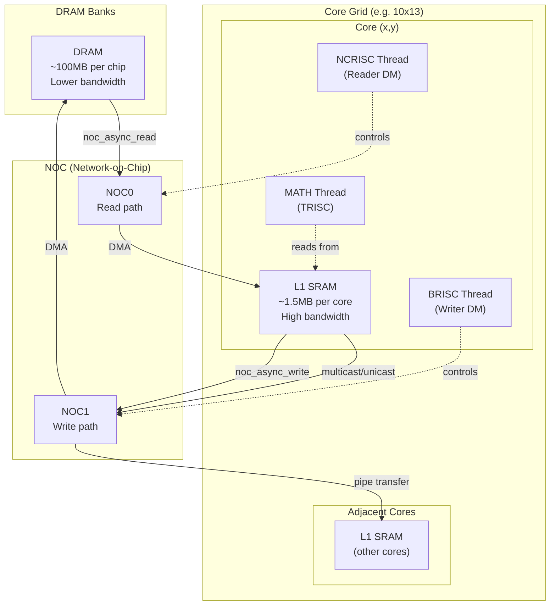
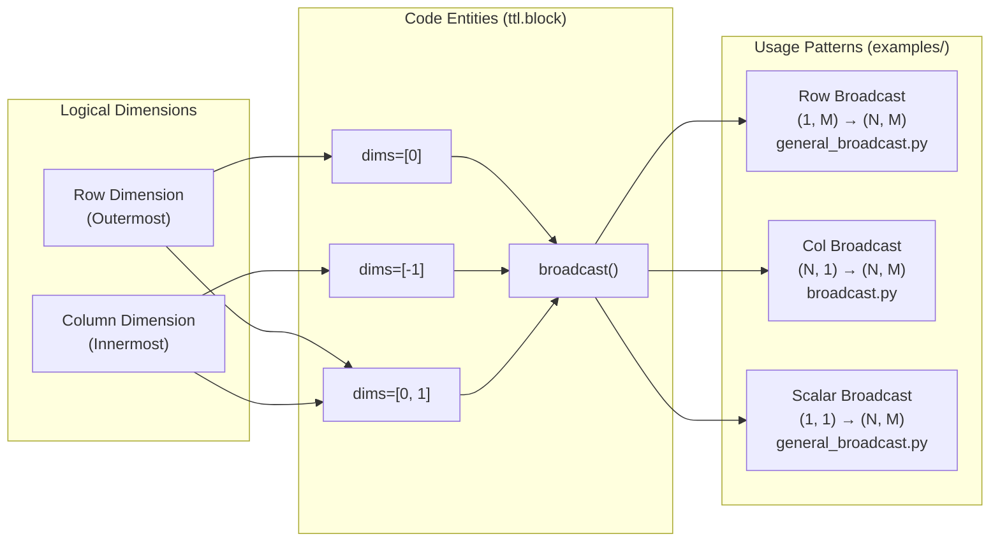
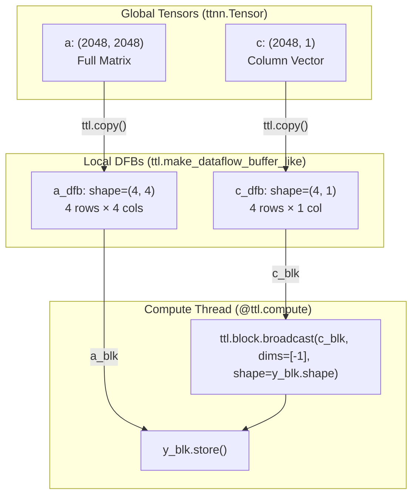
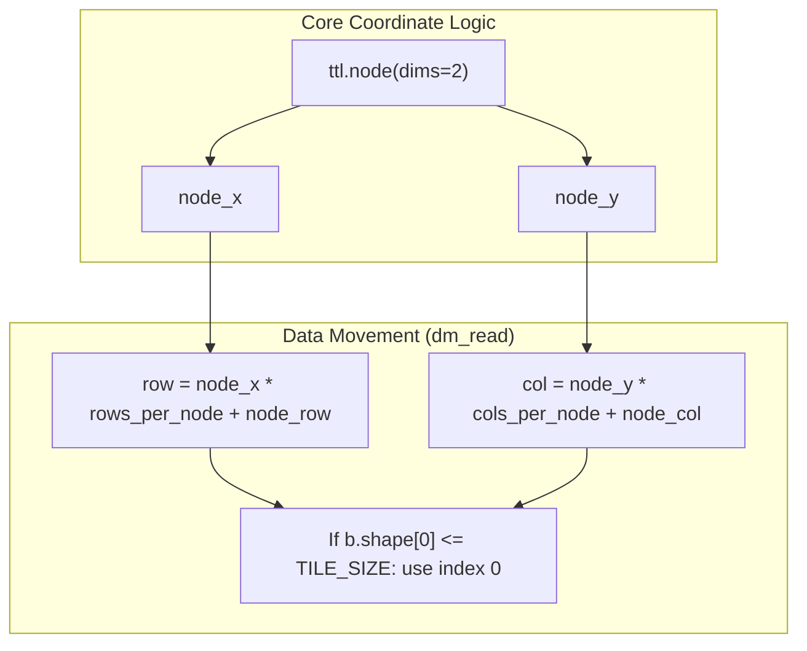

# Broadcasting Patterns

Relevant source files
*   [examples/broadcast.py](https://github.com/tenstorrent/tt-lang/blob/d76e6233/examples/broadcast.py)
*   [examples/general_broadcast.py](https://github.com/tenstorrent/tt-lang/blob/d76e6233/examples/general_broadcast.py)
*   [python/sim/block.py](https://github.com/tenstorrent/tt-lang/blob/d76e6233/python/sim/block.py)
*   [python/sim/math.py](https://github.com/tenstorrent/tt-lang/blob/d76e6233/python/sim/math.py)
*   [test/python/invalid/invalid_cb_shape_mismatch.py](https://github.com/tenstorrent/tt-lang/blob/d76e6233/test/python/invalid/invalid_cb_shape_mismatch.py)
*   [test/python/simple_bcast.py](https://github.com/tenstorrent/tt-lang/blob/d76e6233/test/python/simple_bcast.py)
*   [test/python/test_bcast_ops.py](https://github.com/tenstorrent/tt-lang/blob/d76e6233/test/python/test_bcast_ops.py)
*   [test/python/test_bcast_shape_expansion.py](https://github.com/tenstorrent/tt-lang/blob/d76e6233/test/python/test_bcast_shape_expansion.py)
*   [test/sim/test_math.py](https://github.com/tenstorrent/tt-lang/blob/d76e6233/test/sim/test_math.py)

This page demonstrates common broadcasting patterns in `tt-lang`, showing how to efficiently broadcast tensors along different dimensions when processing tile blocks. Broadcasting allows smaller tensors to be expanded to match the shape of larger tensors during computation, a fundamental operation in many tensor programs.

For general tile operations and math functions, see [Tile Operations and Broadcasting](https://github.com/tenstorrent/tt-lang/blob/d76e6233/Tile%20Operations%20and%20Broadcasting) For multi-tile block processing concepts, see [Multi-tile Processing](https://github.com/tenstorrent/tt-lang/blob/d76e6233/Multi-tile%20Processing)

* * *

## Overview

Broadcasting in `tt-lang` extends tensors with smaller dimensions to match larger dimensions during computation. The system supports broadcasting along rows (dimension 0), columns (dimension -1), or both dimensions simultaneously. Broadcasting is performed using `ttl.block.broadcast()` which takes a source tensor/block and a `dims` parameter specifying which dimensions to expand [python/sim/block.py 80-84](https://github.com/tenstorrent/tt-lang/blob/d76e6233/python/sim/block.py#L80-L84)

**Key Concepts:**

*   **Dimension -1 (innermost/columns)**: Broadcasting horizontally across columns [examples/broadcast.py 57-60](https://github.com/tenstorrent/tt-lang/blob/d76e6233/examples/broadcast.py#L57-L60)[test/sim/test_math.py 46-47](https://github.com/tenstorrent/tt-lang/blob/d76e6233/test/sim/test_math.py#L46-L47)
*   **Dimension 0 (outermost/rows)**: Broadcasting vertically across rows [examples/general_broadcast.py 72-73](https://github.com/tenstorrent/tt-lang/blob/d76e6233/examples/general_broadcast.py#L72-L73)[test/sim/test_math.py 24](https://github.com/tenstorrent/tt-lang/blob/d76e6233/test/sim/test_math.py#L24-L24)
*   **Dims [0, 1]**: Broadcasting in both directions (scalar broadcast) [examples/general_broadcast.py 74-84](https://github.com/tenstorrent/tt-lang/blob/d76e6233/examples/general_broadcast.py#L74-L84)[test/python/test_bcast_shape_expansion.py 103-105](https://github.com/tenstorrent/tt-lang/blob/d76e6233/test/python/test_bcast_shape_expansion.py#L103-L105)[test/sim/test_math.py 93](https://github.com/tenstorrent/tt-lang/blob/d76e6233/test/sim/test_math.py#L93-L93)
*   **DFB shape alignment**: Dataflow buffers for broadcast tensors have reduced shapes matching their actual data dimensions [examples/general_broadcast.py 38-51](https://github.com/tenstorrent/tt-lang/blob/d76e6233/examples/general_broadcast.py#L38-L51)[examples/broadcast.py 40-42](https://github.com/tenstorrent/tt-lang/blob/d76e6233/examples/broadcast.py#L40-L42)
*   **Explicit Requirement**: `tt-lang` requires explicit broadcasting to avoid ambiguity; implicit shape mismatches in binary ops trigger compiler errors [test/python/invalid/invalid_cb_shape_mismatch.py 23-38](https://github.com/tenstorrent/tt-lang/blob/d76e6233/test/python/invalid/invalid_cb_shape_mismatch.py#L23-L38)

Sources: [examples/broadcast.py 23-60](https://github.com/tenstorrent/tt-lang/blob/d76e6233/examples/broadcast.py#L23-L60)[examples/general_broadcast.py 25-91](https://github.com/tenstorrent/tt-lang/blob/d76e6233/examples/general_broadcast.py#L25-L91)[test/python/test_bcast_shape_expansion.py 4-14](https://github.com/tenstorrent/tt-lang/blob/d76e6233/test/python/test_bcast_shape_expansion.py#L4-L14)[test/python/invalid/invalid_cb_shape_mismatch.py 9-13](https://github.com/tenstorrent/tt-lang/blob/d76e6233/test/python/invalid/invalid_cb_shape_mismatch.py#L9-L13)[python/sim/block.py 80-120](https://github.com/tenstorrent/tt-lang/blob/d76e6233/python/sim/block.py#L80-L120)[test/sim/test_math.py 18-101](https://github.com/tenstorrent/tt-lang/blob/d76e6233/test/sim/test_math.py#L18-L101)

* * *




Sources: [python/ttl/ttl_api.py:98-98](), [benchmarks/matmul/config.py:76-78](), [benchmarks/matmul/NOTES.md:68-74]()
```
## Broadcasting Semantics

The `ttl.block.broadcast()` operation expands a tensor block along specified dimensions to match a target shape. In the hardware DSL, this is typically used within a compute kernel to prepare operands for element-wise operations.

`tt-lang` supports broadcasting through explicit `ttl.block.broadcast` calls. The result can be stored directly or used as an expression in math operations.

`# Explicit broadcast to match destination block shapey_blk.store(    a_blk * b_blk + ttl.block.broadcast(c_blk, dims=[-1], shape=y_blk.shape))`
**Dimension Indexing:**`tt-lang` uses standard Python indexing [python/sim/block.py 87-90](https://github.com/tenstorrent/tt-lang/blob/d76e6233/python/sim/block.py#L87-L90) For a 2D block:

*   `dims=[-1]` or `dims=[1]`: Broadcast along columns (innermost dimension) [examples/broadcast.py 59-60](https://github.com/tenstorrent/tt-lang/blob/d76e6233/examples/broadcast.py#L59-L60)[python/sim/block.py 88-89](https://github.com/tenstorrent/tt-lang/blob/d76e6233/python/sim/block.py#L88-L89)
*   `dims=[0]` or `dims=[-2]`: Broadcast along rows (outermost dimension) [examples/general_broadcast.py 72-73](https://github.com/tenstorrent/tt-lang/blob/d76e6233/examples/general_broadcast.py#L72-L73)[python/sim/block.py 87-90](https://github.com/tenstorrent/tt-lang/blob/d76e6233/python/sim/block.py#L87-L90)

### Dimension Mapping to Code Entities

The following diagram bridges the conceptual broadcasting dimensions to the specific code implementations and usage patterns found in the examples.

Sources: [examples/broadcast.py 57-60](https://github.com/tenstorrent/tt-lang/blob/d76e6233/examples/broadcast.py#L57-L60)[examples/general_broadcast.py 72-84](https://github.com/tenstorrent/tt-lang/blob/d76e6233/examples/general_broadcast.py#L72-L84)[test/python/test_bcast_shape_expansion.py 11-13](https://github.com/tenstorrent/tt-lang/blob/d76e6233/test/python/test_bcast_shape_expansion.py#L11-L13)[python/sim/block.py 80-120](https://github.com/tenstorrent/tt-lang/blob/d76e6233/python/sim/block.py#L80-L120)[test/sim/test_math.py 18-101](https://github.com/tenstorrent/tt-lang/blob/d76e6233/test/sim/test_math.py#L18-L101)

* * *




Sources: [examples/broadcast.py:57-60](), [examples/general_broadcast.py:72-84](), [test/python/test_bcast_shape_expansion.py:11-13](), [python/sim/block.py:80-120](), [test/sim/test_math.py:18-101]()

---
```
## Implicit Broadcasting Rules

`tt-lang` enforces strict shape matching for binary operations. Implicit broadcasting is rejected to ensure predictable hardware behavior and memory usage.

*   **Mismatched Shapes**: Adding a `(2, 1)` block to a `(2, 2)` block without explicit broadcast results in a validation error: "shape mismatch between (2, 2) bf16 tensor and (2, 1) bf16 tensor; note: you can use ttl.block.broadcast() to expand the smaller tensor" [test/python/invalid/invalid_cb_shape_mismatch.py 23-38](https://github.com/tenstorrent/tt-lang/blob/d76e6233/test/python/invalid/invalid_cb_shape_mismatch.py#L23-L38)
*   **Invalid Dimensions**: Broadcasting on a dimension where the element size is not 1 is prohibited. The block grid size must be 1 in the broadcast dimension [python/sim/block.py 153-157](https://github.com/tenstorrent/tt-lang/blob/d76e6233/python/sim/block.py#L153-L157)
*   **Layout Constraints**: Broadcasting is not supported for Row-Major layout blocks [python/sim/block.py 125-126](https://github.com/tenstorrent/tt-lang/blob/d76e6233/python/sim/block.py#L125-L126)

Sources: [test/python/invalid/invalid_cb_shape_mismatch.py 23-38](https://github.com/tenstorrent/tt-lang/blob/d76e6233/test/python/invalid/invalid_cb_shape_mismatch.py#L23-L38)[python/sim/block.py 144-157](https://github.com/tenstorrent/tt-lang/blob/d76e6233/python/sim/block.py#L144-L157)[python/sim/block.py 125-126](https://github.com/tenstorrent/tt-lang/blob/d76e6233/python/sim/block.py#L125-L126)

* * *

## Multi-Tile Block Broadcasting

Processing multiple tiles per block improves performance by amortizing control overhead. When broadcasting, the Dataflow Buffer (DFB) shapes are reduced to match their actual data dimensions, significantly saving L1 memory [examples/broadcast.py 34-45](https://github.com/tenstorrent/tt-lang/blob/d76e6233/examples/broadcast.py#L34-L45)

### DFB Shape Configuration

The DFB shapes are configured using `ttl.make_dataflow_buffer_like` with specific `shape` overrides:

`# Full matrix DFB (e.g., 4x4 tiles)a_dfb = ttl.make_dataflow_buffer_like(    a, shape=(row_tiles_per_block, col_tiles_per_block), block_count=2)# Column vector DFB (only 1 tile wide)c_dfb = ttl.make_dataflow_buffer_like(    c, shape=(row_tiles_per_block, 1), block_count=2)`
Sources: [examples/broadcast.py 34-45](https://github.com/tenstorrent/tt-lang/blob/d76e6233/examples/broadcast.py#L34-L45)[test/python/test_bcast_shape_expansion.py 128-134](https://github.com/tenstorrent/tt-lang/blob/d76e6233/test/python/test_bcast_shape_expansion.py#L128-L134)

* * *




The DFB shapes are configured using `ttl.make_dataflow_buffer_like` with specific `shape` overrides:

```python
```
## Shape Expansion Patterns

A powerful feature of `tt-lang` broadcasting is **Shape Expansion**, where the input DFB is physically smaller than the output DFB. The compiler generates logic to replicate tiles from the smaller input to fill the larger output [test/python/test_bcast_shape_expansion.py 4-14](https://github.com/tenstorrent/tt-lang/blob/d76e6233/test/python/test_bcast_shape_expansion.py#L4-L14)

| Pattern | Input DFB Shape | Output DFB Shape | Broadcast Dims |
| --- | --- | --- | --- |
| **Column Expansion** | (2, 1) | (2, 2) | `dims=[1]` |
| **Row Expansion** | (1, 2) | (2, 2) | `dims=[0]` |
| **Scalar Expansion** | (1, 1) | (2, 2) | `dims=[0, 1]` |

### Implementation Example (Column Expansion)

In this pattern, only one column of tiles is read from DRAM, but the compute engine expands it to fill multiple columns in the output block [test/python/test_bcast_shape_expansion.py 35-63](https://github.com/tenstorrent/tt-lang/blob/d76e6233/test/python/test_bcast_shape_expansion.py#L35-L63)

`@ttl.compute()def compute_fn():    with inp_dfb.wait() as i, out_dfb.reserve() as o:        # bcast handles the (2,1) -> (2,2) expansion internally        result = ttl.block.broadcast(i, dims=[1], shape=(2, 2))        o.store(result)`
Sources: [test/python/test_bcast_shape_expansion.py 30-118](https://github.com/tenstorrent/tt-lang/blob/d76e6233/test/python/test_bcast_shape_expansion.py#L30-L118)

* * *

## General Broadcasting Implementation

The general broadcasting pattern handles arbitrary combinations of dimensions by dynamically determining DFB shapes and broadcast logic based on runtime tensor shapes [examples/general_broadcast.py 37-54](https://github.com/tenstorrent/tt-lang/blob/d76e6233/examples/general_broadcast.py#L37-L54)

### Dynamic Data Movement

The kernel detects if a tensor dimension is of size 1 (single tile) and adjusts the `ttl.copy` slice accordingly. If the dimension is 1, it reads from index 0; otherwise, it reads the tile corresponding to the current block position [examples/general_broadcast.py 116-139](https://github.com/tenstorrent/tt-lang/blob/d76e6233/examples/general_broadcast.py#L116-L139)

`# Handle broadcasting for bb_start_row = 0 if b.shape[0] <= TILE_SIZE else start_row_tileb_end_row = b_row_tiles if b.shape[0] <= TILE_SIZE else end_row_tileb_start_col = 0 if b.shape[1] <= TILE_SIZE else start_col_tileb_end_col = b_col_tiles if b.shape[1] <= TILE_SIZE else end_col_tile tx_b = ttl.copy(b[b_start_row:b_end_row, b_start_col:b_end_col], b_blk)`
### Conditional Compute Logic

In the compute thread, broadcasting is applied conditionally based on whether the DFB shape indicates a broadcast is needed [examples/general_broadcast.py 66-84](https://github.com/tenstorrent/tt-lang/blob/d76e6233/examples/general_broadcast.py#L66-L84)

`b_dims = ([0] if b_row_tiles == 1 and row_tiles_per_block > 1 else []) + \         ([-1] if b_col_tiles == 1 and col_tiles_per_block > 1 else []) b_expr = ttl.block.broadcast(b_blk, dims=b_dims, shape=y_shape) if b_dims else b_blk`
Sources: [examples/general_broadcast.py 37-54](https://github.com/tenstorrent/tt-lang/blob/d76e6233/examples/general_broadcast.py#L37-L54)[examples/general_broadcast.py 66-91](https://github.com/tenstorrent/tt-lang/blob/d76e6233/examples/general_broadcast.py#L66-L91)[examples/general_broadcast.py 116-143](https://github.com/tenstorrent/tt-lang/blob/d76e6233/examples/general_broadcast.py#L116-L143)

* * *

## Multi-Core Grid Broadcasting




In a grid, if a tensor is being broadcast (e.g., a column vector `c`), every core in a specific row of the grid reads the same column slice of `c`, while cores in different rows read different slices [examples/broadcast.py:92-98]().

Sources: [examples/broadcast.py:27-33](), [examples/broadcast.py:64-77](), [examples/broadcast.py:92-98]()
59:T2a37,
```

Broadcasting patterns extend to multi-core execution. Each core processes a subset of output blocks and reads corresponding slices of broadcast tensors based on its grid coordinates [examples/broadcast.py 27-33](https://github.com/tenstorrent/tt-lang/blob/d76e6233/examples/broadcast.py#L27-L33)

In a grid, if a tensor is being broadcast (e.g., a column vector `c`), every core in a specific row of the grid reads the same column slice of `c`, while cores in different rows read different slices [examples/broadcast.py 92-98](https://github.com/tenstorrent/tt-lang/blob/d76e6233/examples/broadcast.py#L92-L98)

Sources: [examples/broadcast.py 27-33](https://github.com/tenstorrent/tt-lang/blob/d76e6233/examples/broadcast.py#L27-L33)[examples/broadcast.py 64-77](https://github.com/tenstorrent/tt-lang/blob/d76e6233/examples/broadcast.py#L64-L77)[examples/broadcast.py 92-98](https://github.com/tenstorrent/tt-lang/blob/d76e6233/examples/broadcast.py#L92-L98)

Dismiss
Refresh this wiki

Enter email to refresh
