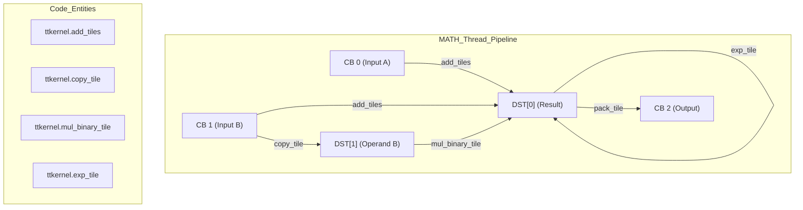

# Fused Operations and Control Flow

Relevant source files
*   [lib/Dialect/TTL/Transforms/TTLSetComputeKernelConfig.cpp](https://github.com/tenstorrent/tt-lang/blob/d76e6233/lib/Dialect/TTL/Transforms/TTLSetComputeKernelConfig.cpp)
*   [test/python/test_typecast.py](https://github.com/tenstorrent/tt-lang/blob/d76e6233/test/python/test_typecast.py)
*   [test/ttlang/Conversion/TTLToCompute/matmul_fusion.mlir](https://github.com/tenstorrent/tt-lang/blob/d76e6233/test/ttlang/Conversion/TTLToCompute/matmul_fusion.mlir)
*   [test/ttlang/Conversion/TTLToTTKernel/compute_fused_chain.mlir](https://github.com/tenstorrent/tt-lang/blob/d76e6233/test/ttlang/Conversion/TTLToTTKernel/compute_fused_chain.mlir)
*   [test/ttlang/Dialect/TTL/Transforms/AssignDST/dst_corner_cases.mlir](https://github.com/tenstorrent/tt-lang/blob/d76e6233/test/ttlang/Dialect/TTL/Transforms/AssignDST/dst_corner_cases.mlir)
*   [test/ttlang/Dialect/TTL/Transforms/AssignDST/dst_fpu_binary.mlir](https://github.com/tenstorrent/tt-lang/blob/d76e6233/test/ttlang/Dialect/TTL/Transforms/AssignDST/dst_fpu_binary.mlir)
*   [test/ttlang/Dialect/TTL/Transforms/AssignDST/dst_typecast_mixed_dtypes.mlir](https://github.com/tenstorrent/tt-lang/blob/d76e6233/test/ttlang/Dialect/TTL/Transforms/AssignDST/dst_typecast_mixed_dtypes.mlir)
*   [test/ttlang/Dialect/TTL/Transforms/SetComputeKernelConfig/unpack_to_dest_fp32_negative.mlir](https://github.com/tenstorrent/tt-lang/blob/d76e6233/test/ttlang/Dialect/TTL/Transforms/SetComputeKernelConfig/unpack_to_dest_fp32_negative.mlir)
*   [test/ttlang/Dialect/TTL/Transforms/SetComputeKernelConfig/unpack_to_dest_fp32_positive.mlir](https://github.com/tenstorrent/tt-lang/blob/d76e6233/test/ttlang/Dialect/TTL/Transforms/SetComputeKernelConfig/unpack_to_dest_fp32_positive.mlir)
*   [test/ttlang/Translate/TTLToCpp/compute_fused_chain_to_cpp.mlir](https://github.com/tenstorrent/tt-lang/blob/d76e6233/test/ttlang/Translate/TTLToCpp/compute_fused_chain_to_cpp.mlir)
*   [test/ttlang/Translate/TTLToCpp/compute_with_data_movement.mlir](https://github.com/tenstorrent/tt-lang/blob/d76e6233/test/ttlang/Translate/TTLToCpp/compute_with_data_movement.mlir)

This page demonstrates how to chain multiple operations together and use control flow constructs (loops and conditionals) within tt-lang kernels. Chaining operations enables the compiler to perform **Elementwise Fusion**, reducing memory traffic and DST register pressure, while loops allow kernels to process large tensors by iterating over tiles or blocks.

## Operation Fusion

Operation fusion in tt-lang occurs when multiple tile-level operations are combined into a single `@ttl.compute` body. This is a key optimization that eliminates intermediate circular buffer (CB) allocations and reduces data movement between the MATH thread and L1 memory.

### FPU vs. SFPU Execution Paths

The tt-lang compiler targets two distinct execution engines within the Tenstorrent Tensix core: the **FPU (Floating Point Unit)** and the **SFPU (Special Function Unit)**.

*   **FPU Path**: Used for high-throughput binary operations (add, sub, mul). When both operands are block arguments (fed directly from CBs), the compiler uses `add_tiles`, `sub_tiles`, or `mul_tiles`[test/ttlang/Conversion/TTLToTTKernel/compute_fused_chain.mlir 37-38](https://github.com/tenstorrent/tt-lang/blob/d76e6233/test/ttlang/Conversion/TTLToTTKernel/compute_fused_chain.mlir#L37-L38) These read directly from CBs and consume 0 DST input slots, which doubles the achievable unroll factor [test/ttlang/Dialect/TTL/Transforms/AssignDST/dst_fpu_binary.mlir 1-4](https://github.com/tenstorrent/tt-lang/blob/d76e6233/test/ttlang/Dialect/TTL/Transforms/AssignDST/dst_fpu_binary.mlir#L1-L4)
*   **SFPU Path**: Used for transcendental functions (exp, sigmoid, etc.) and binary operations where one operand is already in DST (intermediate result) [test/ttlang/Conversion/TTLToTTKernel/compute_fused_chain.mlir 40-43](https://github.com/tenstorrent/tt-lang/blob/d76e6233/test/ttlang/Conversion/TTLToTTKernel/compute_fused_chain.mlir#L40-L43) These require `copy_tile` to move data into DST registers before processing [test/ttlang/Translate/TTLToCpp/compute_fused_chain_to_cpp.mlir 48-49](https://github.com/tenstorrent/tt-lang/blob/d76e6233/test/ttlang/Translate/TTLToCpp/compute_fused_chain_to_cpp.mlir#L48-L49)

### Fusion Chain Lowering

When operations are chained, the compiler performs a linear scan to allocate DST registers. For example, a chain of `add -> mul -> exp` is lowered into a sequence of hardware-specific `init` and `tile` operations.

**Fused Compute Lowering (FPU-Enabled Path)**

**Sources**: [test/ttlang/Conversion/TTLToTTKernel/compute_fused_chain.mlir 37-45](https://github.com/tenstorrent/tt-lang/blob/d76e6233/test/ttlang/Conversion/TTLToTTKernel/compute_fused_chain.mlir#L37-L45)[test/ttlang/Translate/TTLToCpp/compute_fused_chain_to_cpp.mlir 44-55](https://github.com/tenstorrent/tt-lang/blob/d76e6233/test/ttlang/Translate/TTLToCpp/compute_fused_chain_to_cpp.mlir#L44-L55)

### Matmul and Accumulation Fusion

A specialized form of fusion exists for the Multiply-Accumulate (MAC) pattern. The expression `prev + a @ b` is recognized by the `convert-ttl-to-compute` pass and folded into a 3-operand `ttl.tile_matmul_block`[test/ttlang/Conversion/TTLToCompute/matmul_fusion.mlir 10-18](https://github.com/tenstorrent/tt-lang/blob/d76e6233/test/ttlang/Conversion/TTLToCompute/matmul_fusion.mlir#L10-L18)

*   **In-place Accumulation**: The accumulator (e.g., a bias or partial sum) is loaded into DST, and the matmul hardware performs `DST += A*B` directly [test/ttlang/Conversion/TTLToCompute/matmul_fusion.mlir 46-47](https://github.com/tenstorrent/tt-lang/blob/d76e6233/test/ttlang/Conversion/TTLToCompute/matmul_fusion.mlir#L46-L47)
*   **Post-Matmul Unary**: Unary operations like `relu` can be fused immediately following a matmul, operating in-place on the DST register containing the matmul result [test/ttlang/Conversion/TTLToCompute/matmul_fusion.mlir 87-97](https://github.com/tenstorrent/tt-lang/blob/d76e6233/test/ttlang/Conversion/TTLToCompute/matmul_fusion.mlir#L87-L97)

**Sources**: [test/ttlang/Conversion/TTLToCompute/matmul_fusion.mlir 10-21](https://github.com/tenstorrent/tt-lang/blob/d76e6233/test/ttlang/Conversion/TTLToCompute/matmul_fusion.mlir#L10-L21)[lib/Dialect/TTL/Transforms/TTLSetComputeKernelConfig.cpp 74-76](https://github.com/tenstorrent/tt-lang/blob/d76e6233/lib/Dialect/TTL/Transforms/TTLSetComputeKernelConfig.cpp#L74-L76)

## Control Flow in Kernels

Python control flow constructs like `for` loops and `if` statements are used within `@ttl.compute` and `@ttl.datamovement` functions to manage data processing and multi-core coordination.

### Loop Constructs for Multi-Tile Processing

Loops are used to iterate over tensor dimensions that exceed the capacity of a single tile or block. The compiler lowers these to `scf.for` loops in MLIR, which eventually become C++ `for` loops in the generated kernel [test/ttlang/Conversion/TTLToTTKernel/compute_fused_chain.mlir 33-34](https://github.com/tenstorrent/tt-lang/blob/d76e6233/test/ttlang/Conversion/TTLToTTKernel/compute_fused_chain.mlir#L33-L34)[test/ttlang/Translate/TTLToCpp/compute_with_data_movement.mlir 46-47](https://github.com/tenstorrent/tt-lang/blob/d76e6233/test/ttlang/Translate/TTLToCpp/compute_with_data_movement.mlir#L46-L47)

`@ttl.compute()def compute_fn():    # Loop over tiles in a 2x2 block    for i in range(2):        for j in range(2):            with inp_dfb.wait() as a, out_dfb.reserve() as o:                # The compiler linearizes (i, j) for CB access                o.store(ttl.math.exp(a))`
**Sources**: [test/ttlang/Translate/TTLToCpp/compute_with_data_movement.mlir 46-53](https://github.com/tenstorrent/tt-lang/blob/d76e6233/test/ttlang/Translate/TTLToCpp/compute_with_data_movement.mlir#L46-L53)[test/ttlang/Conversion/TTLToTTKernel/compute_fused_chain.mlir 75-79](https://github.com/tenstorrent/tt-lang/blob/d76e6233/test/ttlang/Conversion/TTLToTTKernel/compute_fused_chain.mlir#L75-L79)

### Tensor Slicing and Indexing

Within loops, tt-lang supports Pythonic slicing and indexing to access specific tiles or blocks. The compiler generates `affine.linearize_index` operations to map these multi-dimensional indices to the linear address space of Circular Buffers [test/ttlang/Conversion/TTLToTTKernel/compute_fused_chain.mlir 36](https://github.com/tenstorrent/tt-lang/blob/d76e6233/test/ttlang/Conversion/TTLToTTKernel/compute_fused_chain.mlir#L36-L36)[test/ttlang/Translate/TTLToCpp/compute_with_data_movement.mlir 49-50](https://github.com/tenstorrent/tt-lang/blob/d76e6233/test/ttlang/Translate/TTLToCpp/compute_with_data_movement.mlir#L49-L50)

*   **Data Movement**: `ttl.copy(inp[0:rows, 0:cols], blk)` uses a `TensorAccessor` to calculate DRAM/L1 offsets while iterating [test/ttlang/Translate/TTLToCpp/compute_with_data_movement.mlir 41-42](https://github.com/tenstorrent/tt-lang/blob/d76e6233/test/ttlang/Translate/TTLToCpp/compute_with_data_movement.mlir#L41-L42)
*   **Compute Indexing**: `ttl.iter_index` provides the current loop coordinates to the compute body for manual indexing if required [test/ttlang/Dialect/TTL/Transforms/AssignDST/dst_corner_cases.mlir 32-33](https://github.com/tenstorrent/tt-lang/blob/d76e6233/test/ttlang/Dialect/TTL/Transforms/AssignDST/dst_corner_cases.mlir#L32-L33)

## Implementation Details

### Unpack Mode and Data Types

The compiler manages hardware "unpack modes" based on the data types and operations used.

*   **UnpackToDestFp32**: Required for SFPU operations consuming `f32` data directly from a CB [test/ttlang/Dialect/TTL/Transforms/SetComputeKernelConfig/unpack_to_dest_fp32_positive.mlir 7-11](https://github.com/tenstorrent/tt-lang/blob/d76e6233/test/ttlang/Dialect/TTL/Transforms/SetComputeKernelConfig/unpack_to_dest_fp32_positive.mlir#L7-L11)
*   **Default Mode**: Used for FPU operations (reduce, matmul, add) or when data is `bf16`, as these route through SRCA/SRCB registers [lib/Dialect/TTL/Transforms/TTLSetComputeKernelConfig.cpp 97-101](https://github.com/tenstorrent/tt-lang/blob/d76e6233/lib/Dialect/TTL/Transforms/TTLSetComputeKernelConfig.cpp#L97-L101)[test/ttlang/Dialect/TTL/Transforms/SetComputeKernelConfig/unpack_to_dest_fp32_negative.mlir 7-9](https://github.com/tenstorrent/tt-lang/blob/d76e6233/test/ttlang/Dialect/TTL/Transforms/SetComputeKernelConfig/unpack_to_dest_fp32_negative.mlir#L7-L9)

### DST Management and Synchronization

The lowering pipeline ensures fused operations respect hardware synchronization requirements:

*   **Acquire/Release**: The generated C++ code wraps fused sequences in `tile_regs_acquire()` and `tile_regs_release()`[test/ttlang/Translate/TTLToCpp/compute_fused_chain_to_cpp.mlir 42-60](https://github.com/tenstorrent/tt-lang/blob/d76e6233/test/ttlang/Translate/TTLToCpp/compute_fused_chain_to_cpp.mlir#L42-L60)
*   **Commit/Wait**: `tile_regs_commit()` and `tile_regs_wait()` are inserted before packing results to ensure the MATH engine has finished the computation [test/ttlang/Translate/TTLToCpp/compute_fused_chain_to_cpp.mlir 57-58](https://github.com/tenstorrent/tt-lang/blob/d76e6233/test/ttlang/Translate/TTLToCpp/compute_fused_chain_to_cpp.mlir#L57-L58)

### System Mapping Table

| Code Entity | Role in Fused Ops | Source |
| --- | --- | --- |
| `TTLSetComputeKernelConfig` | Detects F32/FPU/SFPU requirements and sets kernel attributes | [lib/Dialect/TTL/Transforms/TTLSetComputeKernelConfig.cpp 9-12](https://github.com/tenstorrent/tt-lang/blob/d76e6233/lib/Dialect/TTL/Transforms/TTLSetComputeKernelConfig.cpp#L9-L12) |
| `ttl.tile_matmul_block` | Fused MAC operation (DST += A*B) | [test/ttlang/Conversion/TTLToCompute/matmul_fusion.mlir 18](https://github.com/tenstorrent/tt-lang/blob/d76e6233/test/ttlang/Conversion/TTLToCompute/matmul_fusion.mlir#L18-L18) |
| `ttkernel.binary_op_init_common` | Consolidates hardware initialization for binary FPU ops | [test/ttlang/Conversion/TTLToTTKernel/compute_fused_chain.mlir 32](https://github.com/tenstorrent/tt-lang/blob/d76e6233/test/ttlang/Conversion/TTLToTTKernel/compute_fused_chain.mlir#L32-L32) |
| `ttkernel.init_sfpu` | Hardware initialization for SFPU operation chains | [test/ttlang/Conversion/TTLToTTKernel/compute_fused_chain.mlir 74](https://github.com/tenstorrent/tt-lang/blob/d76e6233/test/ttlang/Conversion/TTLToTTKernel/compute_fused_chain.mlir#L74-L74) |
| `ttkernel.pack_tile` | Moves final result from DST back to CB/L1 | [test/ttlang/Conversion/TTLToTTKernel/compute_fused_chain.mlir 48](https://github.com/tenstorrent/tt-lang/blob/d76e6233/test/ttlang/Conversion/TTLToTTKernel/compute_fused_chain.mlir#L48-L48) |

**Sources**: [test/ttlang/Conversion/TTLToTTKernel/compute_fused_chain.mlir 19-53](https://github.com/tenstorrent/tt-lang/blob/d76e6233/test/ttlang/Conversion/TTLToTTKernel/compute_fused_chain.mlir#L19-L53)[test/ttlang/Translate/TTLToCpp/compute_fused_chain_to_cpp.mlir 25-61](https://github.com/tenstorrent/tt-lang/blob/d76e6233/test/ttlang/Translate/TTLToCpp/compute_fused_chain_to_cpp.mlir#L25-L61)[lib/Dialect/TTL/Transforms/TTLSetComputeKernelConfig.cpp 118-148](https://github.com/tenstorrent/tt-lang/blob/d76e6233/lib/Dialect/TTL/Transforms/TTLSetComputeKernelConfig.cpp#L118-L148)

Dismiss
Refresh this wiki

Enter email to refresh
