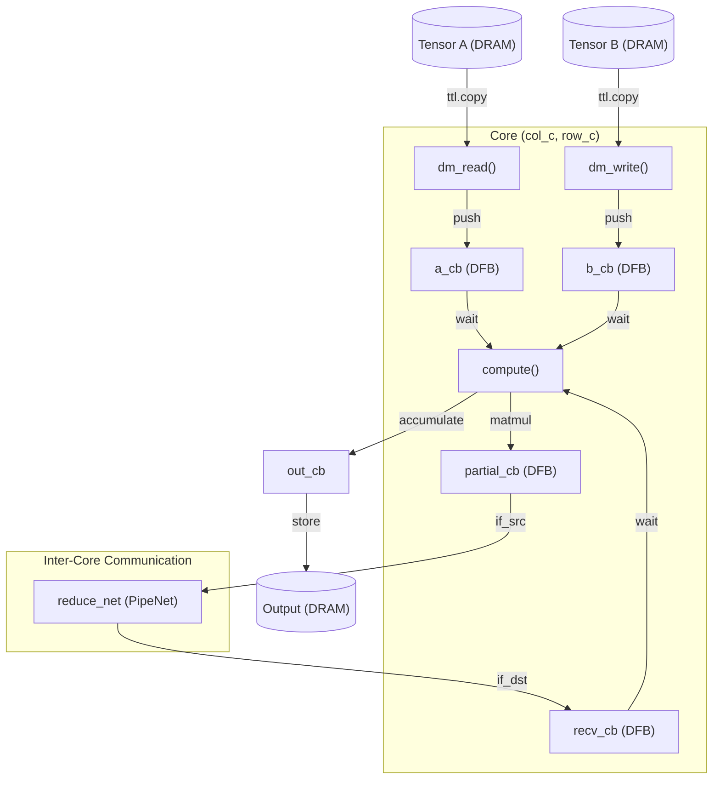
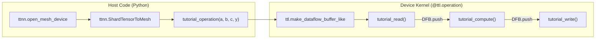

# Matmul Benchmarks and Advanced Examples

Relevant source files
*   [benchmarks/__init__.py](https://github.com/tenstorrent/tt-lang/blob/d76e6233/benchmarks/__init__.py)
*   [benchmarks/matmul/NOTES.md](https://github.com/tenstorrent/tt-lang/blob/d76e6233/benchmarks/matmul/NOTES.md?plain=1)
*   [benchmarks/matmul/README.md](https://github.com/tenstorrent/tt-lang/blob/d76e6233/benchmarks/matmul/README.md?plain=1)
*   [benchmarks/matmul/__init__.py](https://github.com/tenstorrent/tt-lang/blob/d76e6233/benchmarks/matmul/__init__.py)
*   [benchmarks/matmul/config.py](https://github.com/tenstorrent/tt-lang/blob/d76e6233/benchmarks/matmul/config.py)
*   [benchmarks/matmul/ksplit_kernel.py](https://github.com/tenstorrent/tt-lang/blob/d76e6233/benchmarks/matmul/ksplit_kernel.py)
*   [benchmarks/matmul/ksplit_sweep.csv](https://github.com/tenstorrent/tt-lang/blob/d76e6233/benchmarks/matmul/ksplit_sweep.csv)
*   [benchmarks/matmul/ksplit_sweep.png](https://github.com/tenstorrent/tt-lang/blob/d76e6233/benchmarks/matmul/ksplit_sweep.png)
*   [benchmarks/matmul/plot.py](https://github.com/tenstorrent/tt-lang/blob/d76e6233/benchmarks/matmul/plot.py)
*   [benchmarks/matmul/summa_kernel.py](https://github.com/tenstorrent/tt-lang/blob/d76e6233/benchmarks/matmul/summa_kernel.py)
*   [benchmarks/matmul/sweep.py](https://github.com/tenstorrent/tt-lang/blob/d76e6233/benchmarks/matmul/sweep.py)
*   [docs/sphinx/elementwise-tutorial/index.md](https://github.com/tenstorrent/tt-lang/blob/d76e6233/docs/sphinx/elementwise-tutorial/index.md?plain=1)
*   [docs/sphinx/matmul-tutorial/index.md](https://github.com/tenstorrent/tt-lang/blob/d76e6233/docs/sphinx/matmul-tutorial/index.md?plain=1)
*   [examples/matmul-tutorial/step_0_ttnn_base.py](https://github.com/tenstorrent/tt-lang/blob/d76e6233/examples/matmul-tutorial/step_0_ttnn_base.py)
*   [examples/matmul-tutorial/step_1_single_node_single_tile_block.py](https://github.com/tenstorrent/tt-lang/blob/d76e6233/examples/matmul-tutorial/step_1_single_node_single_tile_block.py)
*   [examples/matmul-tutorial/step_2_single_node_multitile_block.py](https://github.com/tenstorrent/tt-lang/blob/d76e6233/examples/matmul-tutorial/step_2_single_node_multitile_block.py)
*   [examples/matmul-tutorial/step_3_multinode.py](https://github.com/tenstorrent/tt-lang/blob/d76e6233/examples/matmul-tutorial/step_3_multinode.py)
*   [examples/matmul-tutorial/step_5_multidevice_shard_m.py](https://github.com/tenstorrent/tt-lang/blob/d76e6233/examples/matmul-tutorial/step_5_multidevice_shard_m.py)
*   [examples/matmul-tutorial/step_6_multidevice_shard_k.py](https://github.com/tenstorrent/tt-lang/blob/d76e6233/examples/matmul-tutorial/step_6_multidevice_shard_k.py)
*   [examples/matmul-tutorial/step_7_multidevice_shard_k_all_reduce.py](https://github.com/tenstorrent/tt-lang/blob/d76e6233/examples/matmul-tutorial/step_7_multidevice_shard_k_all_reduce.py)
*   [examples/matmul_1d.py](https://github.com/tenstorrent/tt-lang/blob/d76e6233/examples/matmul_1d.py)
*   [examples/matmul_1d_mcast.py](https://github.com/tenstorrent/tt-lang/blob/d76e6233/examples/matmul_1d_mcast.py)
*   [examples/metal_examples/1d_mcast_matmul/ttlang/1d_tt_lang.py](https://github.com/tenstorrent/tt-lang/blob/d76e6233/examples/metal_examples/1d_mcast_matmul/ttlang/1d_tt_lang.py)
*   [examples/metal_examples/multinode_matmul/ttlang/multinode_matmul.py](https://github.com/tenstorrent/tt-lang/blob/d76e6233/examples/metal_examples/multinode_matmul/ttlang/multinode_matmul.py)
*   [examples/metal_examples/multinode_reuse_matmul/ttlang/multinode_reuse_matmul.py](https://github.com/tenstorrent/tt-lang/blob/d76e6233/examples/metal_examples/multinode_reuse_matmul/ttlang/multinode_reuse_matmul.py)
*   [examples/metal_examples/single_node_matmul/ttlang/single_node_matmul.py](https://github.com/tenstorrent/tt-lang/blob/d76e6233/examples/metal_examples/single_node_matmul/ttlang/single_node_matmul.py)
*   [examples/multinode_matmul.py](https://github.com/tenstorrent/tt-lang/blob/d76e6233/examples/multinode_matmul.py)
*   [examples/single_node_matmul.py](https://github.com/tenstorrent/tt-lang/blob/d76e6233/examples/single_node_matmul.py)

This page details the high-performance matrix multiplication (matmul) implementations within `tt-lang`. It covers the benchmark suite used for performance sweeps (K-split and SUMMA algorithms), advanced multicast patterns for data reuse, and the educational matmul tutorial series.

## Overview of Matmul Implementations

The `tt-lang` repository contains several matmul implementations ranging from simple educational examples to highly optimized kernels designed for performance benchmarking.

| Implementation | Location | Key Features |
| --- | --- | --- |
| **K-split** | `benchmarks/matmul/ksplit_kernel.py` | Parallelizes across the reduction dimension (K). Uses partial accumulation and inter-core gathering. |
| **SUMMA** | `benchmarks/matmul/summa_kernel.py` | Scalable Universal Matrix Multiplication Algorithm. Uses multicast for A and B weights. |
| **1D Multicast** | `examples/matmul_1d_mcast.py` | Demonstrates 1D grid multicast for weight reuse. |
| **Multi-node Reuse** | `examples/metal_examples/multinode_reuse_matmul/` | Multi-core implementation with optimized L1 buffering and subblocking. |
| **Tutorial Series** | `examples/matmul-tutorial/` | Step-by-step evolution from a single-tile matmul to multi-device K-sharding. |

Sources: [benchmarks/matmul/ksplit_kernel.py 4-13](https://github.com/tenstorrent/tt-lang/blob/d76e6233/benchmarks/matmul/ksplit_kernel.py#L4-L13)[examples/matmul_1d_mcast.py 15-60](https://github.com/tenstorrent/tt-lang/blob/d76e6233/examples/matmul_1d_mcast.py#L15-L60)[examples/matmul-tutorial/step_6_multidevice_shard_k.py 5-23](https://github.com/tenstorrent/tt-lang/blob/d76e6233/examples/matmul-tutorial/step_6_multidevice_shard_k.py#L5-L23)

* * *

## K-Split Matmul Algorithm

The K-split implementation parallelizes the computation of a single output block across multiple cores by partitioning the $K$ (reduction) dimension.

### Grid Layout and Logic

In a K-split configuration, the logical grid is defined as `(N_parts * K_parts, M_parts)`[benchmarks/matmul/ksplit_kernel.py 6-9](https://github.com/tenstorrent/tt-lang/blob/d76e6233/benchmarks/matmul/ksplit_kernel.py#L6-L9)

*   **Root Cores**: Cores where `k_p == 0`. These cores are responsible for the final accumulation and writing the result to DRAM [benchmarks/matmul/ksplit_kernel.py 9-10](https://github.com/tenstorrent/tt-lang/blob/d76e6233/benchmarks/matmul/ksplit_kernel.py#L9-L10)
*   **Non-Root Cores**: Compute partial products for their assigned $K$ segment and gather them to the root core via a `PipeNet`[benchmarks/matmul/ksplit_kernel.py 10-11](https://github.com/tenstorrent/tt-lang/blob/d76e6233/benchmarks/matmul/ksplit_kernel.py#L10-L11)

### Data Flow and Pipes

K-split utilizes three primary `PipeNet` structures for coordination:

1.   **mcast_a_net**: Multicasts blocks of tensor $A$ along the $K$ segments [benchmarks/matmul/ksplit_kernel.py 74-79](https://github.com/tenstorrent/tt-lang/blob/d76e6233/benchmarks/matmul/ksplit_kernel.py#L74-L79)
2.   **mcast_b_net**: Multicasts blocks of tensor $B$ across $M$ partitions [benchmarks/matmul/ksplit_kernel.py 81-84](https://github.com/tenstorrent/tt-lang/blob/d76e6233/benchmarks/matmul/ksplit_kernel.py#L81-L84)
3.   **reduce_net**: Gathers partial results from non-root cores (`k_p > 0`) to the root core (`k_p == 0`) [benchmarks/matmul/ksplit_kernel.py 88-94](https://github.com/tenstorrent/tt-lang/blob/d76e6233/benchmarks/matmul/ksplit_kernel.py#L88-L94)

### Diagram: K-Split Execution Flow

The following diagram maps the logical entities in `ksplit_kernel.py` to the hardware execution flow.

"K-Split Matmul Logic"

Sources: [benchmarks/matmul/ksplit_kernel.py 73-104](https://github.com/tenstorrent/tt-lang/blob/d76e6233/benchmarks/matmul/ksplit_kernel.py#L73-L104)[benchmarks/matmul/ksplit_kernel.py 106-134](https://github.com/tenstorrent/tt-lang/blob/d76e6233/benchmarks/matmul/ksplit_kernel.py#L106-L134)[benchmarks/matmul/ksplit_kernel.py 136-168](https://github.com/tenstorrent/tt-lang/blob/d76e6233/benchmarks/matmul/ksplit_kernel.py#L136-L168)

* * *



Sources: [benchmarks/matmul/ksplit_kernel.py:73-104](), [benchmarks/matmul/ksplit_kernel.py:106-134](), [benchmarks/matmul/ksplit_kernel.py:136-168]()

---
```
## Multicast Patterns (1D and 2D)

Advanced matmul examples utilize `ttl.PipeNet` to reduce DRAM bandwidth requirements by multicasting data that is reused across multiple cores.

### 1D Multicast Matmul

In `examples/matmul_1d_mcast.py`, the implementation replicates tensor $A$ across a row of cores.

*   **Source Core**: The core at `node_index == 0` reads from DRAM and multicasts to the rest of the row [examples/matmul_1d_mcast.py 60](https://github.com/tenstorrent/tt-lang/blob/d76e6233/examples/matmul_1d_mcast.py#L60-L60)
*   **Destination Cores**: Use `mcast_a_net.if_dst` to receive data directly into L1 DFBs without accessing DRAM [examples/matmul_1d_mcast.py 109-113](https://github.com/tenstorrent/tt-lang/blob/d76e6233/examples/matmul_1d_mcast.py#L109-L113)

### Multinode Reuse Matmul

The `examples/metal_examples/multinode_reuse_matmul/` implementation optimizes for large matrices by using `get_large_matmul_params` to determine optimal subblocking [examples/metal_examples/multinode_reuse_matmul/ttlang/multinode_reuse_matmul.py 29-33](https://github.com/tenstorrent/tt-lang/blob/d76e6233/examples/metal_examples/multinode_reuse_matmul/ttlang/multinode_reuse_matmul.py#L29-L33) It demonstrates:

*   **Subblocking**: Processing blocks of size `(per_node_M, K_block_size)` to maximize DST register utilization [examples/metal_examples/multinode_reuse_matmul/ttlang/multinode_reuse_matmul.py 46-55](https://github.com/tenstorrent/tt-lang/blob/d76e6233/examples/metal_examples/multinode_reuse_matmul/ttlang/multinode_reuse_matmul.py#L46-L55)
*   **Stationary Accumulation**: The output block remains in L1 while iterating through the $K$ dimension [examples/metal_examples/multinode_reuse_matmul/ttlang/multinode_reuse_matmul.py 63-71](https://github.com/tenstorrent/tt-lang/blob/d76e6233/examples/metal_examples/multinode_reuse_matmul/ttlang/multinode_reuse_matmul.py#L63-L71)

Sources: [examples/matmul_1d_mcast.py 60-113](https://github.com/tenstorrent/tt-lang/blob/d76e6233/examples/matmul_1d_mcast.py#L60-L113)[examples/metal_examples/multinode_reuse_matmul/ttlang/multinode_reuse_matmul.py 57-71](https://github.com/tenstorrent/tt-lang/blob/d76e6233/examples/metal_examples/multinode_reuse_matmul/ttlang/multinode_reuse_matmul.py#L57-L71)

* * *

## Matmul Tutorial Series

The matmul tutorial provides a progressive learning path from basic single-core kernels to complex multi-device strategies.

### Step 5: Multi-Device Shard M

Introduces SPMD (Single-Program Multiple-Data) execution.

*   **Strategy**: Tensor $A$ is sharded along the $M$ dimension (`ttnn.ShardTensorToMesh(dim=0)`), while $B$ is replicated across all devices [examples/matmul-tutorial/step_5_multidevice_shard_m.py 8-23](https://github.com/tenstorrent/tt-lang/blob/d76e6233/examples/matmul-tutorial/step_5_multidevice_shard_m.py#L8-L23)
*   **Kernel**: Each device runs the `tutorial_operation` independently on its local shard [examples/matmul-tutorial/step_5_multidevice_shard_m.py 56-62](https://github.com/tenstorrent/tt-lang/blob/d76e6233/examples/matmul-tutorial/step_5_multidevice_shard_m.py#L56-L62)

### Step 6 & 7: Shard K and All-Reduce

These steps focus on parallelizing the reduction dimension.

*   **Shard K**: Each device computes a partial sum $y_i = A_i \times B_i$. The host then gathers and sums these partials [examples/matmul-tutorial/step_6_multidevice_shard_k.py 8-22](https://github.com/tenstorrent/tt-lang/blob/d76e6233/examples/matmul-tutorial/step_6_multidevice_shard_k.py#L8-L22)
*   **All-Reduce**: Replaces host-side summation with `ttnn.all_reduce`, performing the reduction in-place across the mesh using the TT-Fabric interconnect [examples/matmul-tutorial/step_7_multidevice_shard_k_all_reduce.py 8-23](https://github.com/tenstorrent/tt-lang/blob/d76e6233/examples/matmul-tutorial/step_7_multidevice_shard_k_all_reduce.py#L8-L23)

"Matmul Tutorial Entity Mapping"

Sources: [examples/matmul-tutorial/step_5_multidevice_shard_m.py 25-62](https://github.com/tenstorrent/tt-lang/blob/d76e6233/examples/matmul-tutorial/step_5_multidevice_shard_m.py#L25-L62)[examples/matmul-tutorial/step_7_multidevice_shard_k_all_reduce.py 48-82](https://github.com/tenstorrent/tt-lang/blob/d76e6233/examples/matmul-tutorial/step_7_multidevice_shard_k_all_reduce.py#L48-L82)

* * *



Sources: [examples/matmul-tutorial/step_5_multidevice_shard_m.py:25-62](), [examples/matmul-tutorial/step_7_multidevice_shard_k_all_reduce.py:48-82]()

---
```
## Performance Sweep Methodology

The `benchmarks/matmul/sweep.py` script is used to evaluate kernel performance across different configurations.

### Key Metrics

*   **TFLOPS**: Measured compute performance.
*   **Bandwidth**: DRAM and NOC utilization.
*   **Cycle Counts**: Detailed breakdown of compute vs. data movement cycles.

### Configuration Parameters

The sweep explores the following space:

*   **Block Sizes (`bm, bn, bk`)**: Sizes of tile blocks processed in each inner loop iteration [benchmarks/matmul/ksplit_kernel.py 39](https://github.com/tenstorrent/tt-lang/blob/d76e6233/benchmarks/matmul/ksplit_kernel.py#L39-L39)
*   **Partitioning (`Mp, Np, Kp`)**: How the global matrix is split across the physical grid [benchmarks/matmul/ksplit_kernel.py 40](https://github.com/tenstorrent/tt-lang/blob/d76e6233/benchmarks/matmul/ksplit_kernel.py#L40-L40)
*   **Math Fidelity**: Toggling `fp32_dest_acc_en` to evaluate the impact of high-precision accumulation [benchmarks/matmul/ksplit_kernel.py 31](https://github.com/tenstorrent/tt-lang/blob/d76e6233/benchmarks/matmul/ksplit_kernel.py#L31-L31)

Sources: [benchmarks/matmul/ksplit_kernel.py 24-40](https://github.com/tenstorrent/tt-lang/blob/d76e6233/benchmarks/matmul/ksplit_kernel.py#L24-L40)[benchmarks/matmul/sweep.py 1-20](https://github.com/tenstorrent/tt-lang/blob/d76e6233/benchmarks/matmul/sweep.py#L1-L20)

Dismiss
Refresh this wiki

Enter email to refresh
