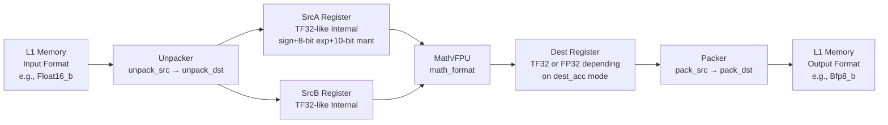

# Data Formats and Configuration

Relevant source files
*   [tests/python_tests/helpers/data_format_inference.py](https://github.com/tenstorrent/tt-llk/blob/366f58e2/tests/python_tests/helpers/data_format_inference.py)
*   [tests/python_tests/helpers/device.py](https://github.com/tenstorrent/tt-llk/blob/366f58e2/tests/python_tests/helpers/device.py)
*   [tests/python_tests/helpers/format_config.py](https://github.com/tenstorrent/tt-llk/blob/366f58e2/tests/python_tests/helpers/format_config.py)
*   [tests/python_tests/helpers/pack.py](https://github.com/tenstorrent/tt-llk/blob/366f58e2/tests/python_tests/helpers/pack.py)
*   [tests/python_tests/helpers/stimuli_config.py](https://github.com/tenstorrent/tt-llk/blob/366f58e2/tests/python_tests/helpers/stimuli_config.py)
*   [tests/python_tests/helpers/stimuli_generator.py](https://github.com/tenstorrent/tt-llk/blob/366f58e2/tests/python_tests/helpers/stimuli_generator.py)
*   [tests/python_tests/helpers/unpack.py](https://github.com/tenstorrent/tt-llk/blob/366f58e2/tests/python_tests/helpers/unpack.py)
*   [tests/python_tests/helpers/utils.py](https://github.com/tenstorrent/tt-llk/blob/366f58e2/tests/python_tests/helpers/utils.py)
*   [tt_llk_blackhole/common/inc/cmath_common.h](https://github.com/tenstorrent/tt-llk/blob/366f58e2/tt_llk_blackhole/common/inc/cmath_common.h)
*   [tt_llk_blackhole/common/inc/cpack_common.h](https://github.com/tenstorrent/tt-llk/blob/366f58e2/tt_llk_blackhole/common/inc/cpack_common.h)
*   [tt_llk_blackhole/common/inc/cunpack_common.h](https://github.com/tenstorrent/tt-llk/blob/366f58e2/tt_llk_blackhole/common/inc/cunpack_common.h)
*   [tt_llk_blackhole/llk_lib/llk_math_common.h](https://github.com/tenstorrent/tt-llk/blob/366f58e2/tt_llk_blackhole/llk_lib/llk_math_common.h)
*   [tt_llk_blackhole/llk_lib/llk_math_eltwise_unary_datacopy.h](https://github.com/tenstorrent/tt-llk/blob/366f58e2/tt_llk_blackhole/llk_lib/llk_math_eltwise_unary_datacopy.h)
*   [tt_llk_blackhole/llk_lib/llk_pack_common.h](https://github.com/tenstorrent/tt-llk/blob/366f58e2/tt_llk_blackhole/llk_lib/llk_pack_common.h)
*   [tt_llk_blackhole/llk_lib/llk_unpack_A.h](https://github.com/tenstorrent/tt-llk/blob/366f58e2/tt_llk_blackhole/llk_lib/llk_unpack_A.h)
*   [tt_llk_blackhole/llk_lib/llk_unpack_common.h](https://github.com/tenstorrent/tt-llk/blob/366f58e2/tt_llk_blackhole/llk_lib/llk_unpack_common.h)
*   [tt_llk_wormhole_b0/llk_lib/llk_math_common.h](https://github.com/tenstorrent/tt-llk/blob/366f58e2/tt_llk_wormhole_b0/llk_lib/llk_math_common.h)
*   [tt_llk_wormhole_b0/llk_lib/llk_pack_common.h](https://github.com/tenstorrent/tt-llk/blob/366f58e2/tt_llk_wormhole_b0/llk_lib/llk_pack_common.h)
*   [tt_llk_wormhole_b0/llk_lib/llk_unpack_common.h](https://github.com/tenstorrent/tt-llk/blob/366f58e2/tt_llk_wormhole_b0/llk_lib/llk_unpack_common.h)

## Purpose and Scope

This page documents the data format system in tt-llk, including format enumerations, hardware configuration structures, tile memory layout, and format conversion mechanisms. The system supports multiple numeric formats (floating-point, integer, block floating-point, and microscaling formats) and provides efficient runtime reconfiguration of the unpacker, math unit, and packer hardware.

For information about how formats are used in specific operations, see [Unpacker System](https://deepwiki.com/tenstorrent/tt-llk/4-unpacker-system), [Math Unit Operations](https://deepwiki.com/tenstorrent/tt-llk/5-math-unit-operations), and [Packer System](https://deepwiki.com/tenstorrent/tt-llk/6-packer-system). For hardware-level abstractions, see [Core Kernel API (ckernel)](https://deepwiki.com/tenstorrent/tt-llk/2-core-kernel-api-(ckernel)).

* * *

## Data Format Enumeration

The LLK supports multiple data formats across the unpacker-math-packer pipeline. Each format is defined in the `DataFormat` enum (found in hardware register definitions) and is represented by an underlying integer value used in hardware configuration.

### Supported Formats

| Format | Type | Precision | Exponent Width | Mantissa Width | Size (bytes) | Hardware Value |
| --- | --- | --- | --- | --- | --- | --- |
| `Float32` | IEEE 754 | 32-bit | 8 | 23 | 4 | `to_underlying(DataFormat::Float32)` |
| `Float16` | IEEE 754 | 16-bit | 5 | 10 | 2 | `to_underlying(DataFormat::Float16)` |
| `Float16_b` | Brain Float | 16-bit | 8 | 7 | 2 | `to_underlying(DataFormat::Float16_b)` |
| `Bfp8_b` | Block Floating-Point | 8-bit per datum | 8 (shared) | Variable | 1 + overhead | `to_underlying(DataFormat::Bfp8_b)` |
| `Bfp4_b` | Block Floating-Point | 4-bit per datum | 8 (shared) | Variable | 0.5 + overhead | `to_underlying(DataFormat::Bfp4_b)` |
| `Bfp2_b` | Block Floating-Point | 2-bit per datum | 8 (shared) | Variable | 0.25 + overhead | `to_underlying(DataFormat::Bfp2_b)` |
| `Int32` | Signed Integer | 32-bit | - | - | 4 | `to_underlying(DataFormat::Int32)` |
| `Int8` | Signed Integer | 8-bit | - | - | 1 | `to_underlying(DataFormat::Int8)` |
| `UInt32` | Unsigned Integer | 32-bit | - | - | 4 | `to_underlying(DataFormat::UInt32)` |
| `UInt16` | Unsigned Integer | 16-bit | - | - | 2 | `to_underlying(DataFormat::UInt16)` |
| `UInt8` | Unsigned Integer | 8-bit | - | - | 1 | `to_underlying(DataFormat::UInt8)` |
| `MxFp8R` | Microscaling (E5M2) | 8-bit + scale | 5 | 2 | 1 + scale overhead | - |
| `MxFp8P` | Microscaling (E4M3) | 8-bit + scale | 4 | 3 | 1 + scale overhead | - |

The `to_underlying()` template function at [tt_llk_wormhole_b0/common/inc/ckernel_defs.h 110-115](https://github.com/tenstorrent/tt-llk/blob/366f58e2/tt_llk_wormhole_b0/common/inc/ckernel_defs.h#L110-L115) converts enum values to their underlying integer representation for hardware register programming.

### Format Properties

**Sources:**[tests/python_tests/helpers/golden_generators.py 9-19](https://github.com/tenstorrent/tt-llk/blob/366f58e2/tests/python_tests/helpers/golden_generators.py#L9-L19)[tt_llk_wormhole_b0/common/inc/ckernel_defs.h 110-115](https://github.com/tenstorrent/tt-llk/blob/366f58e2/tt_llk_wormhole_b0/common/inc/ckernel_defs.h#L110-L115)[tt_llk_wormhole_b0/common/inc/ckernel_defs.h 117-204](https://github.com/tenstorrent/tt-llk/blob/366f58e2/tt_llk_wormhole_b0/common/inc/ckernel_defs.h#L117-L204)

* * *

## Configuration Structures

The hardware pipeline uses several configuration structures to control data format handling across the unpacker, math unit, and packer stages.

### Unpacker Configuration

#### unpack_tile_descriptor_t

Defines the structure of input tiles for the unpacker hardware.

Key fields:

*   `in_data_format`: Input data format (4-bit enumeration)
*   `uncompressed`: Whether data is in uncompressed form (always 1)
*   `x_dim`, `y_dim`, `z_dim`, `w_dim`: Tile dimensions (x=width, y=height, z=faces, w=unused)

**Sources:**[tt_llk_wormhole_b0/common/inc/cunpack_common.h 22-49](https://github.com/tenstorrent/tt-llk/blob/366f58e2/tt_llk_wormhole_b0/common/inc/cunpack_common.h#L22-L49)

#### unpack_config_t

Controls unpacker behavior and output format.

Key fields:

*   `out_data_format`: Output format to source registers (TF32-like internal format)
*   `haloize_mode`: Enables XY transpose during unpacking
*   `tileize_mode`: Enables row-major to tiled format conversion
*   `uncompress_cntx0_3/4_7`: Uncompression enable for each context

**Sources:**[tt_llk_wormhole_b0/common/inc/cunpack_common.h 52-88](https://github.com/tenstorrent/tt-llk/blob/366f58e2/tt_llk_wormhole_b0/common/inc/cunpack_common.h#L52-L88)

### Math Unit Configuration

#### alu_config_t

Configures the ALU/FPU data formats and operational modes.

| Field | Bits | Purpose |
| --- | --- | --- |
| `ALU_ROUNDING_MODE_Fpu_srnd_en` | 1 | FPU stochastic rounding enable |
| `ALU_ROUNDING_MODE_Gasket_srnd_en` | 1 | Gasket stochastic rounding enable |
| `ALU_ROUNDING_MODE_Packer_srnd_en` | 1 | Packer stochastic rounding enable |
| `ALU_FORMAT_SPEC_REG0_SrcAUnsigned` | 1 | SrcA unsigned integer flag |
| `ALU_FORMAT_SPEC_REG0_SrcBUnsigned` | 1 | SrcB unsigned integer flag |
| `ALU_FORMAT_SPEC_REG0_SrcA` | 4 | SrcA data format |
| `ALU_FORMAT_SPEC_REG1_SrcB` | 4 | SrcB data format |
| `ALU_FORMAT_SPEC_REG2_Dstacc` | 4 | Destination accumulator format |
| `ALU_ACC_CTRL_Fp32_enabled` | 1 | FP32 accumulation mode |
| `ALU_ACC_CTRL_SFPU_Fp32_enabled` | 1 | SFPU FP32 mode |
| `ALU_ACC_CTRL_INT8_math_enabled` | 1 | INT8 math mode |

**Sources:**[tt_llk_wormhole_b0/common/inc/cunpack_common.h 91-115](https://github.com/tenstorrent/tt-llk/blob/366f58e2/tt_llk_wormhole_b0/common/inc/cunpack_common.h#L91-L115)

### Packer Configuration

#### pack_config_t

Controls packer data format conversion and output.

Key fields:

*   `exp_section_size`: Size of exponent section for BFP formats
*   `out_data_format`: Output format to L1 memory
*   `in_data_format`: Input format from destination registers
*   `exp_threshold_en/exp_threshold`: FP32 to BFP_A threshold workaround
*   `pack_l1_acc_disable_pack_zero_flag`: L1 accumulation mode flags

**Sources:**[tt_llk_wormhole_b0/common/inc/cpack_common.h 34-68](https://github.com/tenstorrent/tt-llk/blob/366f58e2/tt_llk_wormhole_b0/common/inc/cpack_common.h#L34-L68)

#### relu_config_t

Configures ReLU activation applied during packing.

| Field | Purpose |
| --- | --- |
| `STACC_RELU_ApplyRelu` | ReLU mode: 0=none, 3=max_threshold, other=min_threshold |
| `STACC_RELU_ReluThreshold` | 16-bit threshold value (format-dependent encoding) |
| `DISABLE_RISC_BP_*` | Breakpoint disable flags for RISC cores |

**Sources:**[tt_llk_wormhole_b0/common/inc/cpack_common.h 71-91](https://github.com/tenstorrent/tt-llk/blob/366f58e2/tt_llk_wormhole_b0/common/inc/cpack_common.h#L71-L91)

#### dest_rd_ctrl_t

Controls how destination registers are read by the packer.

| Field | Purpose |
| --- | --- |
| `PCK_DEST_RD_CTRL_Read_32b_data` | Read 32-bit data (FP32 or Int32) |
| `PCK_DEST_RD_CTRL_Read_unsigned` | Interpret as unsigned integer |
| `PCK_DEST_RD_CTRL_Read_int8` | Read as 8-bit integer |
| `PCK_DEST_RD_CTRL_Round_10b_mant` | Round FP32 dest to 10-bit mantissa (for FP16 output) |

**Sources:**[tt_llk_wormhole_b0/common/inc/cpack_common.h 94-109](https://github.com/tenstorrent/tt-llk/blob/366f58e2/tt_llk_wormhole_b0/common/inc/cpack_common.h#L94-L109)

#### pck_edge_offset_t

Configures per-row datum masking for reduce operations.

The system uses 4 `PCK_EDGE_OFFSET_SEC[0:3]` registers and 4 `TILE_ROW_SET_MAPPING[0:3]` registers. Each row in a face can select which mask to use via the mapping registers. This enables complex masking patterns for reduce operations.

**Sources:**[tt_llk_wormhole_b0/common/inc/cpack_common.h 111-137](https://github.com/tenstorrent/tt-llk/blob/366f58e2/tt_llk_wormhole_b0/common/inc/cpack_common.h#L111-L137)

* * *

## Tile and Face Memory Layout

Data in the LLK pipeline is organized into **tiles**, which are the fundamental unit of computation.

### Tile Structure

### Key Constants

| Constant | Value | Definition | Source |
| --- | --- | --- | --- |
| `TILE_HEIGHT` / `TILE_WIDTH` | 32 | Tile dimensions (rows and columns) | [tt_llk_wormhole_b0/common/inc/ckernel_defs.h 88-89](https://github.com/tenstorrent/tt-llk/blob/366f58e2/tt_llk_wormhole_b0/common/inc/ckernel_defs.h#L88-L89) |
| `TILE_R_DIM` / `TILE_C_DIM` | 32 | Tile row/column dimensions | [tt_llk_wormhole_b0/common/inc/ckernel_defs.h 94-95](https://github.com/tenstorrent/tt-llk/blob/366f58e2/tt_llk_wormhole_b0/common/inc/ckernel_defs.h#L94-L95) |
| `FACE_HEIGHT` / `FACE_WIDTH` | 16 | Face dimensions | [tt_llk_wormhole_b0/common/inc/ckernel_defs.h 86-87](https://github.com/tenstorrent/tt-llk/blob/366f58e2/tt_llk_wormhole_b0/common/inc/ckernel_defs.h#L86-L87) |
| `FACE_R_DIM` / `FACE_C_DIM` | 16 | Face row/column dimensions | [tt_llk_wormhole_b0/common/inc/ckernel_defs.h 91-92](https://github.com/tenstorrent/tt-llk/blob/366f58e2/tt_llk_wormhole_b0/common/inc/ckernel_defs.h#L91-L92) |
| `TILE_NUM_FACES` | 4 | `(TILE_R_DIM * TILE_C_DIM) / (FACE_R_DIM * FACE_C_DIM)` | [tt_llk_wormhole_b0/common/inc/ckernel_defs.h 97](https://github.com/tenstorrent/tt-llk/blob/366f58e2/tt_llk_wormhole_b0/common/inc/ckernel_defs.h#L97-L97) |
| `FACE_SIZE` | 256 | `FACE_R_DIM * FACE_C_DIM` elements per face | [tt_llk_wormhole_b0/common/inc/ckernel_defs.h 99](https://github.com/tenstorrent/tt-llk/blob/366f58e2/tt_llk_wormhole_b0/common/inc/ckernel_defs.h#L99-L99) |
| `ELEMENTS_PER_FACE` | 256 | 16 × 16 elements (Python test constant) | [tests/python_tests/helpers/golden_generators.py 26](https://github.com/tenstorrent/tt-llk/blob/366f58e2/tests/python_tests/helpers/golden_generators.py#L26-L26) |
| `ELEMENTS_PER_TILE` | 1024 | 4 × 256 elements (Python test constant) | [tests/python_tests/helpers/golden_generators.py 28](https://github.com/tenstorrent/tt-llk/blob/366f58e2/tests/python_tests/helpers/golden_generators.py#L28-L28) |

### Face Numbering and Memory Order

Faces are numbered 0-3 and stored sequentially in memory:

```
Memory Offset:
  Face 0: bytes <FileRef file-url="https://github.com/tenstorrent/tt-llk/blob/366f58e2/0, face_size)\n  Face 1#LNaN-LNaN" NaN  file-path="0, face_size)\n  Face 1">Hii</FileRef> <FileRef file-url="https://github.com/tenstorrent/tt-llk/blob/366f58e2/tt_llk_wormhole_b0/common/inc/ckernel_defs.h#L86-L99" min=86 max=99 file-path="tt_llk_wormhole_b0/common/inc/ckernel_defs.h">Hii</FileRef> <FileRef file-url="https://github.com/tenstorrent/tt-llk/blob/366f58e2/tt_llk_wormhole_b0/common/inc/cpack_common.h#L171-L201" min=171 max=201 file-path="tt_llk_wormhole_b0/common/inc/cpack_common.h">Hii</FileRef> <FileRef file-url="https://github.com/tenstorrent/tt-llk/blob/366f58e2/tt_llk_wormhole_b0/common/inc/cunpack_common.h#L208-L221" min=208 max=221 file-path="tt_llk_wormhole_b0/common/inc/cunpack_common.h">Hii</FileRef>

---

## Format Conversion Pipeline

Data flows through the pipeline with format conversions at each stage.

### Pipeline Format Flow



### SrcFormatModel: TF32 Conversion

The `SrcFormatModel` class at [tests/python_tests/helpers/golden_generators.py 232-413](https://github.com/tenstorrent/tt-llk/blob/366f58e2/tests/python_tests/helpers/golden_generators.py#L232-L413) models how input formats are converted to the internal TF32 representation used in source registers. This class provides bidirectional conversion:

*   `SrcFormatModel.to_src_format(format_from, tensor)` → Converts input format to TF32 representation
*   `SrcFormatModel.from_src_format(data_format, tensor)` → Converts TF32 back to target format

**TF32 Internal Format:**

*   Sign: 1 bit
*   Exponent: 8 bits (biased, same as Float32/Float16_b)
*   Mantissa: 10 bits (with implied leading 1, stored as `torch.int64`)

**Conversion Examples:**

**Conversion Mapping:**

| Input Format | Process | Function |
| --- | --- | --- |
| `Float16_b` / `Bfp8_b` | Extract 7-bit mantissa → shift left 3 → add implied 1 = 10-bit mantissa | `_bfp8b_to_tf32()` / `_fp16b_to_tf32()` at [tests/python_tests/helpers/golden_generators.py 260-301](https://github.com/tenstorrent/tt-llk/blob/366f58e2/tests/python_tests/helpers/golden_generators.py#L260-L301) |
| `Float16` | Extract 10-bit mantissa → add implied 1 (already 10 bits) | `_fp16_to_tf32()` at [tests/python_tests/helpers/golden_generators.py 303-333](https://github.com/tenstorrent/tt-llk/blob/366f58e2/tests/python_tests/helpers/golden_generators.py#L303-L333) |
| `Float32` | Extract 23-bit mantissa → truncate right 13 → add implied 1 = 10-bit mantissa | `_fp32_to_tf32()` at [tests/python_tests/helpers/golden_generators.py 335-370](https://github.com/tenstorrent/tt-llk/blob/366f58e2/tests/python_tests/helpers/golden_generators.py#L335-L370) |
| `MxFp8R` / `MxFp8P` | Treated as Float16_b after unpacking from microscaling format | `_mxfp8r_to_tf32()` / `_mxfp8p_to_tf32()` at [tests/python_tests/helpers/golden_generators.py 372-396](https://github.com/tenstorrent/tt-llk/blob/366f58e2/tests/python_tests/helpers/golden_generators.py#L372-L396) |

**Sources:**[tests/python_tests/helpers/golden_generators.py 232-413](https://github.com/tenstorrent/tt-llk/blob/366f58e2/tests/python_tests/helpers/golden_generators.py#L232-L413)

### Dest Accumulation Modes

The destination register format depends on the `is_fp32_dest_acc_en` template parameter:

| Mode | Dest Format | Capacity | Use Case | Constants |
| --- | --- | --- | --- | --- |
| `is_fp32_dest_acc_en = false` | TF32 (10-bit mantissa) | 8 tiles (16-bit) | Standard operations | `DEST_REGISTER_HALF_SIZE`, `MAX_TILES_16_BIT_DEST = 8` |
| `is_fp32_dest_acc_en = true` | FP32 (23-bit mantissa) | 4 tiles (32-bit) | High precision, Int32, Float32 | `BIT32_DEST_REGISTER_HALF_SIZE`, `MAX_TILES_32_BIT_DEST = 4` |

The capacity difference is due to larger element size in FP32 mode. Functions like `get_dest_max_tiles<DST_SYNC, is_fp32_dest_acc_en, DstTileShape>()` return the appropriate capacity.

**Sources:**[tests/python_tests/helpers/golden_generators.py 34-35](https://github.com/tenstorrent/tt-llk/blob/366f58e2/tests/python_tests/helpers/golden_generators.py#L34-L35)[tt_llk_wormhole_b0/common/inc/cmath_common.h 223-230](https://github.com/tenstorrent/tt-llk/blob/366f58e2/tt_llk_wormhole_b0/common/inc/cmath_common.h#L223-L230)[tests/sources/eltwise_unary_sfpu_test.cpp 28-29](https://github.com/tenstorrent/tt-llk/blob/366f58e2/tests/sources/eltwise_unary_sfpu_test.cpp#L28-L29)

* * *

## Runtime Format Reconfiguration

The LLK provides efficient reconfiguration functions to change data formats without full re-initialization, critical for multi-stage operations and format conversions.

### Unpacker Reconfiguration

Diagram: Unpacker Runtime Format Reconfiguration

**Key Functions:**

*   `_llk_unpack_reconfig_data_format_srca_impl_<is_fp32_dest_acc_en, to_from_int8, dim_stride_target>()` at [tt_llk_wormhole_b0/llk_lib/llk_unpack_common.h 80-119](https://github.com/tenstorrent/tt-llk/blob/366f58e2/tt_llk_wormhole_b0/llk_lib/llk_unpack_common.h#L80-L119) - Reconfigure unpacker A
*   `_llk_unpack_reconfig_data_format_srcb_impl_<is_fp32_dest_acc_en, to_from_int8, dim_stride_target>()` at [tt_llk_wormhole_b0/llk_lib/llk_unpack_common.h 123-158](https://github.com/tenstorrent/tt-llk/blob/366f58e2/tt_llk_wormhole_b0/llk_lib/llk_unpack_common.h#L123-L158) - Reconfigure unpacker B

**Template Parameters:**

*   `is_fp32_dest_acc_en`: Whether FP32 dest mode is enabled
*   `to_from_int8`: Enable Int8/UInt8 unsigned flag configuration (requires `static_assert(is_fp32_dest_acc_en)`)
*   `dim_stride_target`: `p_dim_stride_target::IGNORE` or `p_dim_stride_target::FACE_ROW_MAJOR` for stride reconfiguration

**Register Operations:**

*   `cfg_reg_rmw_tensix<ADDR, SHAMT, MASK>(value)` - Read-modify-write configuration register
*   `TT_SETDMAREG()` - Set DMA register value (for GPRs)
*   `TTI_STALLWAIT(p_stall::STALL_CFG, p_stall::UNPACK0/UNPACK1)` - Stall until unpacker completes

**Sources:**[tt_llk_wormhole_b0/llk_lib/llk_unpack_common.h 80-159](https://github.com/tenstorrent/tt-llk/blob/366f58e2/tt_llk_wormhole_b0/llk_lib/llk_unpack_common.h#L80-L159)

### Math Unit Reconfiguration

Diagram: Math Unit Runtime Format Reconfiguration

**Key Functions:**

*   `_llk_math_reconfig_data_format_srca_<is_fp32_dest_acc_en, to_from_int8>(src_format)` at [tt_llk_wormhole_b0/llk_lib/llk_math_common.h 133-158](https://github.com/tenstorrent/tt-llk/blob/366f58e2/tt_llk_wormhole_b0/llk_lib/llk_math_common.h#L133-L158) - Reconfigure SrcA format
*   `_llk_math_reconfig_data_format_srcb_<is_fp32_dest_acc_en, to_from_int8>(src_format)` at [tt_llk_wormhole_b0/llk_lib/llk_math_common.h 160-184](https://github.com/tenstorrent/tt-llk/blob/366f58e2/tt_llk_wormhole_b0/llk_lib/llk_math_common.h#L160-L184) - Reconfigure SrcB format
*   `_llk_math_reconfig_data_format_<is_fp32_dest_acc_en, to_from_int8>(srca_format, srcb_format)` - Reconfigure both sources

These functions:

1.   Update ALU format registers for source operands
2.   Enable `INT8_math_enabled` when format is `Int8`, `UInt8`, or `Int32`
3.   Set unsigned flags for `UInt8` format (when `to_from_int8 = true`)
4.   Issue `TTI_STALLWAIT(p_stall::STALL_CFG, p_stall::MATH | p_stall::WAIT_SFPU)` to synchronize

**Sources:**[tt_llk_wormhole_b0/llk_lib/llk_math_common.h 133-184](https://github.com/tenstorrent/tt-llk/blob/366f58e2/tt_llk_wormhole_b0/llk_lib/llk_math_common.h#L133-L184)

### Packer Reconfiguration

Diagram: Packer Runtime Format Reconfiguration

**Key Function:**

*   `reconfig_packer_data_format<is_fp32_dest_acc_en>(pack_src_format, pack_dst_format, tile_size, face_r_dim, num_faces, partial_face)` at [tt_llk_wormhole_b0/common/inc/cpack_common.h 382-514](https://github.com/tenstorrent/tt-llk/blob/366f58e2/tt_llk_wormhole_b0/common/inc/cpack_common.h#L382-L514)

**Configuration Process:**

1.   **Synchronization:**`TTI_STALLWAIT(p_stall::STALL_THCON, p_stall::PACK)` - Wait for packer to finish
2.   **Format Fields:** Update `out_data_format` and `in_data_format` in pack configuration registers using `TTI_REG2FLOP()`
3.   **Pack Counters:** Update `pack_reads_per_xy_plane` field (set to `face_r_dim` for edge mask reset)
4.   **Dest Read Control:** Configure `PCK_DEST_RD_CTRL` register based on format: 
    *   `Read_32b_data`: Set if `is_32b_format` or `is_fp32_dest_acc_en`
    *   `Read_int8`: Set if `is_int8_format` and not FP32 dest
    *   `Read_unsigned`: Set if `pack_dst_format == UInt8`
    *   `Round_10b_mant`: Set if `is_fp32_dest_acc_en && pack_src_format == Float16`

5.   **BFP Exponential Sections:** For BFP formats, call `cache_exponential_section_sizes_in_gprs<true>()` and update section sizes
6.   **L1 Offsets:** Call `set_packer_l1_offset(pack_dst_format, face_r_dim)` to update packer 1/2/3 address offsets
7.   **Tile Size:** Update `p_gpr_pack::TILE_HEADER` GPR
8.   **FP32-to-BFP_A Workaround:** If `is_fp32_dest_acc_en && IS_BFP_A_FORMAT(pack_dst_format)`, set `exp_threshold_en=1, exp_threshold=113` (bug workaround from budabackend#1394)
9.   **ALU Dest Format:** Update `ALU_FORMAT_SPEC_REG2_Dstacc` register
10.   **Strides:** Call `set_packer_strides(pack_src_format)` to update X/Y/Z/W strides

**Sources:**[tt_llk_wormhole_b0/common/inc/cpack_common.h 382-514](https://github.com/tenstorrent/tt-llk/blob/366f58e2/tt_llk_wormhole_b0/common/inc/cpack_common.h#L382-L514)[tt_llk_wormhole_b0/common/inc/cpack_common.h 168-201](https://github.com/tenstorrent/tt-llk/blob/366f58e2/tt_llk_wormhole_b0/common/inc/cpack_common.h#L168-L201)[tt_llk_wormhole_b0/common/inc/cpack_common.h 203-222](https://github.com/tenstorrent/tt-llk/blob/366f58e2/tt_llk_wormhole_b0/common/inc/cpack_common.h#L203-L222)[tt_llk_wormhole_b0/common/inc/cpack_common.h 354-380](https://github.com/tenstorrent/tt-llk/blob/366f58e2/tt_llk_wormhole_b0/common/inc/cpack_common.h#L354-L380)

* * *

## Microscaling (MXFP8) Format Handling

Microscaling formats (`MxFp8R` and `MxFp8P`) provide block-level scaling for efficient 8-bit floating-point representation.

### Format Specifications

| Format | Variant | Exponent | Mantissa | Scale Granularity |
| --- | --- | --- | --- | --- |
| `MxFp8R` | E5M2 | 5 bits | 2 bits | Per-block shared scale |
| `MxFp8P` | E4M3 | 4 bits | 3 bits | Per-block shared scale |

### Quantization Process

MXFP8 formats undergo quantization via a **pack→unpack roundtrip** to match hardware behavior:

Diagram: MXFP8 Quantization Flow

**Rationale:** The golden model must use quantized values to match what hardware sees after unpacking from L1 memory. The pack-unpack roundtrip simulates the precision loss that occurs in actual hardware.

**Pack Functions:**

*   `pack_mxfp8r(tensor, num_faces)` at [tests/python_tests/helpers/pack.py](https://github.com/tenstorrent/tt-llk/blob/366f58e2/tests/python_tests/helpers/pack.py) - Pack to MxFp8R (E5M2)
*   `pack_mxfp8p(tensor, num_faces)` at [tests/python_tests/helpers/pack.py](https://github.com/tenstorrent/tt-llk/blob/366f58e2/tests/python_tests/helpers/pack.py) - Pack to MxFp8P (E4M3)

**Unpack Functions:**

*   `unpack_mxfp8r(packed, num_faces)` at [tests/python_tests/helpers/unpack.py](https://github.com/tenstorrent/tt-llk/blob/366f58e2/tests/python_tests/helpers/unpack.py) - Unpack from MxFp8R
*   `unpack_mxfp8p(packed, num_faces)` at [tests/python_tests/helpers/unpack.py](https://github.com/tenstorrent/tt-llk/blob/366f58e2/tests/python_tests/helpers/unpack.py) - Unpack from MxFp8P

### Quantization API

`def quantize_mx_stimuli(    tensor: torch.Tensor,    data_format: DataFormat,    num_faces: int = 4) -> torch.Tensor`
**Function:**[tests/python_tests/helpers/golden_generators.py 121-173](https://github.com/tenstorrent/tt-llk/blob/366f58e2/tests/python_tests/helpers/golden_generators.py#L121-L173)

**Parameters:**

*   `tensor`: Input tensor (bfloat16 values)
*   `data_format`: `DataFormat.MxFp8R` or `DataFormat.MxFp8P`
*   `num_faces`: Number of faces to quantize (1, 2, or 4)

**Returns:** Quantized tensor with bfloat16 values reflecting quantization artifacts

**Usage Pattern:**

For chunked processing of large tensors:

`def quantize_mx_tensor_chunked(    tensor: torch.Tensor,    data_format: DataFormat) -> torch.Tensor`
**Function:**[tests/python_tests/helpers/golden_generators.py 175-229](https://github.com/tenstorrent/tt-llk/blob/366f58e2/tests/python_tests/helpers/golden_generators.py#L175-L229)

This function automatically determines appropriate chunk sizes based on remaining elements:

*   1024 elements → 4 faces
*   512 elements → 2 faces
*   256 elements → 1 face

### Hardware Unpacking to TF32

After unpacking, MXFP8 formats are treated as `Float16_b` for conversion to TF32 internal representation:

**Sources:**[tests/python_tests/helpers/golden_generators.py 372-396](https://github.com/tenstorrent/tt-llk/blob/366f58e2/tests/python_tests/helpers/golden_generators.py#L372-L396)

### Test Example

Example showing MXFP8 format usage in tests:

**Test Example: SFPU with MXFP8**

The test at [tests/python_tests/test_eltwise_unary_sfpu.py 1-373](https://github.com/tenstorrent/tt-llk/blob/366f58e2/tests/python_tests/test_eltwise_unary_sfpu.py#L1-L373) demonstrates SFPU operations across all formats including MXFP8.

**Stimuli Generation:**

`# At test_eltwise_unary_sfpu.py:226-231src_A, tile_cnt_A, src_B, tile_cnt_B = generate_stimuli(    stimuli_format_A=formats.input_format,  # Could be MxFp8R or MxFp8P    input_dimensions_A=input_dimensions,    stimuli_format_B=formats.input_format,    input_dimensions_B=input_dimensions,)`
The `generate_stimuli()` function at [tests/python_tests/helpers/stimuli_generator.py](https://github.com/tenstorrent/tt-llk/blob/366f58e2/tests/python_tests/helpers/stimuli_generator.py) automatically applies MXFP8 quantization when the format is microscaling via:

`if stimuli_format_A.is_mx_format():    tensor = quantize_mx_tensor_chunked(tensor, stimuli_format_A)`
**Golden Generation:**

`# At test_eltwise_unary_sfpu.py:233-240generate_golden = get_golden_generator(UnarySFPUGolden)golden_tensor = generate_golden(    mathop,    src_A,  # Already quantized if MXFP8    formats.output_format,    dest_acc,    formats.input_format,    input_dimensions,)`
**Sources:**[tests/python_tests/test_eltwise_unary_sfpu.py 221-284](https://github.com/tenstorrent/tt-llk/blob/366f58e2/tests/python_tests/test_eltwise_unary_sfpu.py#L221-L284)[tests/python_tests/helpers/golden_generators.py 121-229](https://github.com/tenstorrent/tt-llk/blob/366f58e2/tests/python_tests/helpers/golden_generators.py#L121-L229)[tests/python_tests/helpers/stimuli_generator.py](https://github.com/tenstorrent/tt-llk/blob/366f58e2/tests/python_tests/helpers/stimuli_generator.py)

* * *

## Format Inference and Multi-Stage Pipelines

For multi-stage L1-to-L1 operations, the system automatically determines intermediate formats based on `dest_acc` mode and format compatibility constraints.

### Format Inference Rules

When multiple pipeline runs have different input/output formats, each run uses a separate `FormatConfig` entry:

Diagram: Multi-Stage Format Configuration

**Implementation:** The kernel uses a `formats_array` with separate `FormatConfig` entries for each L1-to-L1 iteration.

**Example Kernel Code:**[tests/sources/matmul_and_unary_sfpu_test.cpp 22-45](https://github.com/tenstorrent/tt-llk/blob/366f58e2/tests/sources/matmul_and_unary_sfpu_test.cpp#L22-L45)

`// Define buffer for intermediate resultsconstexpr std::uint32_t buffer_A_tilized = 0x66000; // Configuration array for each pipeline runconstexpr std::array<FormatConfig, L1_to_L1_ITERATIONS> formats_array = {    {FormatConfig(UNPACK_A_IN_LIST[0], UNPACK_B_IN_LIST[0], ...),  // Run 0: Matmul     FormatConfig(UNPACK_A_IN_LIST[1], UNPACK_B_IN_LIST[1], ...)}  // Run 1: SFPU}; // In TRISC_UNPACK:int run = 0;  // First run_llk_unpack_hw_configure_<is_fp32_dest_acc_en>(    formats_array[run].unpack_A_src,    formats_array[run].unpack_B_src,    ...);// Process matmul... // Reconfigure for second runrun = 1;_llk_unpack_reconfig_data_format_srca_impl_<...>(    formats_array[run].unpack_A_src,    formats_array[run].unpack_A_dst,    ...);// Process SFPU...`
**Format Reconfiguration Between Runs:**

*   After Run 0 completes, use `_llk_unpack_reconfig_data_format_srca_impl_<>()`, `_llk_math_reconfig_data_format_<>()`, and `reconfig_packer_data_format<>()` to switch formats
*   Synchronization via semaphores: `t6_semaphore_wait_on_zero<p_stall::STALL_PACK>(semaphore::PACK_DONE)` ensures Run 0 packing completes before Run 1 begins

### Intermediate Format Selection

The intermediate format between pipeline stages is determined by:

1.   **Dest Accumulation Mode:** If `dest_acc=true`, FP32 dest enables higher precision intermediates
2.   **Format Outliers:** If input format is "special" (e.g., Int32, UInt16 with FP32 dest), workarounds may apply
3.   **BFP Threshold:** For FP32 dest to BFP_A output, `exp_threshold` workaround is enabled

**Sources:**[tests/helpers/include/params.h 26-50](https://github.com/tenstorrent/tt-llk/blob/366f58e2/tests/helpers/include/params.h#L26-L50)[tests/python_tests/test_matmul_and_unary_sfpu.py 1-165](https://github.com/tenstorrent/tt-llk/blob/366f58e2/tests/python_tests/test_matmul_and_unary_sfpu.py#L1-L165)

* * *

## Summary

The data format system in tt-llk provides:

1.   **Rich Format Support**: 13 data formats spanning IEEE 754, BFP, integers, and microscaling
2.   **Structured Configuration**: Dedicated structures for unpacker, math, and packer stages
3.   **Tile-Based Layout**: 32×32 tiles divided into 4 faces with flexible face dimensions
4.   **TF32 Internal Representation**: Unified internal format for source registers
5.   **Efficient Reconfiguration**: Runtime format switching without full re-initialization
6.   **MXFP8 Quantization**: Pack-unpack roundtrip to match hardware behavior
7.   **Multi-Stage Support**: Format inference for complex L1-to-L1 pipelines

This system enables the LLK to efficiently support diverse workloads while abstracting hardware complexity from kernel developers.

This wiki is featured in the [repository](https://github.com/tenstorrent/tt-llk/blob/main/README.md)

Dismiss
Refresh this wiki

Enter email to refresh