# Overview

Relevant source files
*   [.github/CODEOWNERS](https://github.com/tenstorrent/tt-metal/blob/f30f8df0/.github/CODEOWNERS)
*   [.github/pull_request_template.md](https://github.com/tenstorrent/tt-metal/blob/f30f8df0/.github/pull_request_template.md?plain=1)
*   [.github/workflows/all-model-tests.yaml](https://github.com/tenstorrent/tt-metal/blob/f30f8df0/.github/workflows/all-model-tests.yaml)
*   [.github/workflows/fast-dispatch-full-regressions-and-models-impl.yaml](https://github.com/tenstorrent/tt-metal/blob/f30f8df0/.github/workflows/fast-dispatch-full-regressions-and-models-impl.yaml)
*   [.github/workflows/fast-dispatch-full-regressions-and-models.yaml](https://github.com/tenstorrent/tt-metal/blob/f30f8df0/.github/workflows/fast-dispatch-full-regressions-and-models.yaml)
*   [.github/workflows/galaxy-deepseek-tests-impl.yaml](https://github.com/tenstorrent/tt-metal/blob/f30f8df0/.github/workflows/galaxy-deepseek-tests-impl.yaml)
*   [.github/workflows/galaxy-deepseek-tests.yaml](https://github.com/tenstorrent/tt-metal/blob/f30f8df0/.github/workflows/galaxy-deepseek-tests.yaml)
*   [.github/workflows/galaxy-demo-tests-impl.yaml](https://github.com/tenstorrent/tt-metal/blob/f30f8df0/.github/workflows/galaxy-demo-tests-impl.yaml)
*   [.github/workflows/galaxy-demo-tests.yaml](https://github.com/tenstorrent/tt-metal/blob/f30f8df0/.github/workflows/galaxy-demo-tests.yaml)
*   [.github/workflows/galaxy-profiler-tests.yaml](https://github.com/tenstorrent/tt-metal/blob/f30f8df0/.github/workflows/galaxy-profiler-tests.yaml)
*   [.github/workflows/galaxy-stress-tests-impl.yaml](https://github.com/tenstorrent/tt-metal/blob/f30f8df0/.github/workflows/galaxy-stress-tests-impl.yaml)
*   [.github/workflows/galaxy-stress-tests.yaml](https://github.com/tenstorrent/tt-metal/blob/f30f8df0/.github/workflows/galaxy-stress-tests.yaml)
*   [.github/workflows/galaxy-unit-tests-impl.yaml](https://github.com/tenstorrent/tt-metal/blob/f30f8df0/.github/workflows/galaxy-unit-tests-impl.yaml)
*   [.github/workflows/galaxy-unit-tests.yaml](https://github.com/tenstorrent/tt-metal/blob/f30f8df0/.github/workflows/galaxy-unit-tests.yaml)
*   [.github/workflows/metal-run-microbenchmarks.yaml](https://github.com/tenstorrent/tt-metal/blob/f30f8df0/.github/workflows/metal-run-microbenchmarks.yaml)
*   [.github/workflows/perf-device-models-impl.yaml](https://github.com/tenstorrent/tt-metal/blob/f30f8df0/.github/workflows/perf-device-models-impl.yaml)
*   [.github/workflows/perf-device-models.yaml](https://github.com/tenstorrent/tt-metal/blob/f30f8df0/.github/workflows/perf-device-models.yaml)
*   [.github/workflows/perf-models-impl.yaml](https://github.com/tenstorrent/tt-metal/blob/f30f8df0/.github/workflows/perf-models-impl.yaml)
*   [.github/workflows/perf-models.yaml](https://github.com/tenstorrent/tt-metal/blob/f30f8df0/.github/workflows/perf-models.yaml)
*   [.github/workflows/pipeline-select-galaxy.yaml](https://github.com/tenstorrent/tt-metal/blob/f30f8df0/.github/workflows/pipeline-select-galaxy.yaml)
*   [.github/workflows/pipeline-select-t3k.yaml](https://github.com/tenstorrent/tt-metal/blob/f30f8df0/.github/workflows/pipeline-select-t3k.yaml)
*   [.github/workflows/pipeline-select.yaml](https://github.com/tenstorrent/tt-metal/blob/f30f8df0/.github/workflows/pipeline-select.yaml)
*   [.github/workflows/pr-description-inject-branch-name.yaml](https://github.com/tenstorrent/tt-metal/blob/f30f8df0/.github/workflows/pr-description-inject-branch-name.yaml)
*   [.github/workflows/single-card-demo-tests-impl.yaml](https://github.com/tenstorrent/tt-metal/blob/f30f8df0/.github/workflows/single-card-demo-tests-impl.yaml)
*   [.github/workflows/single-card-demo-tests.yaml](https://github.com/tenstorrent/tt-metal/blob/f30f8df0/.github/workflows/single-card-demo-tests.yaml)
*   [.github/workflows/t3000-demo-tests-impl.yaml](https://github.com/tenstorrent/tt-metal/blob/f30f8df0/.github/workflows/t3000-demo-tests-impl.yaml)
*   [.github/workflows/t3000-demo-tests.yaml](https://github.com/tenstorrent/tt-metal/blob/f30f8df0/.github/workflows/t3000-demo-tests.yaml)
*   [.github/workflows/t3000-e2e-tests.yaml](https://github.com/tenstorrent/tt-metal/blob/f30f8df0/.github/workflows/t3000-e2e-tests.yaml)
*   [.github/workflows/t3000-integration-tests.yaml](https://github.com/tenstorrent/tt-metal/blob/f30f8df0/.github/workflows/t3000-integration-tests.yaml)
*   [.github/workflows/t3000-perf-tests.yaml](https://github.com/tenstorrent/tt-metal/blob/f30f8df0/.github/workflows/t3000-perf-tests.yaml)
*   [.github/workflows/t3000-profiler-tests-impl.yaml](https://github.com/tenstorrent/tt-metal/blob/f30f8df0/.github/workflows/t3000-profiler-tests-impl.yaml)
*   [.github/workflows/t3000-profiler-tests.yaml](https://github.com/tenstorrent/tt-metal/blob/f30f8df0/.github/workflows/t3000-profiler-tests.yaml)
*   [.github/workflows/t3000-unit-tests-impl.yaml](https://github.com/tenstorrent/tt-metal/blob/f30f8df0/.github/workflows/t3000-unit-tests-impl.yaml)
*   [.github/workflows/t3000-unit-tests.yaml](https://github.com/tenstorrent/tt-metal/blob/f30f8df0/.github/workflows/t3000-unit-tests.yaml)
*   [.github/workflows/test-dispatch.yaml](https://github.com/tenstorrent/tt-metal/blob/f30f8df0/.github/workflows/test-dispatch.yaml)
*   [CONTRIBUTING.md](https://github.com/tenstorrent/tt-metal/blob/f30f8df0/CONTRIBUTING.md?plain=1)
*   [README.md](https://github.com/tenstorrent/tt-metal/blob/f30f8df0/README.md?plain=1)
*   [models/README.md](https://github.com/tenstorrent/tt-metal/blob/f30f8df0/models/README.md?plain=1)
*   [models/demos/deepseek_v3/README.md](https://github.com/tenstorrent/tt-metal/blob/f30f8df0/models/demos/deepseek_v3/README.md?plain=1)
*   [models/demos/deepseek_v3/tests/fused_op_unit_tests/mla/test_ds_mla.py](https://github.com/tenstorrent/tt-metal/blob/f30f8df0/models/demos/deepseek_v3/tests/fused_op_unit_tests/mla/test_ds_mla.py)
*   [models/demos/deepseek_v3/tests/fused_op_unit_tests/moe/test_ds_moe.py](https://github.com/tenstorrent/tt-metal/blob/f30f8df0/models/demos/deepseek_v3/tests/fused_op_unit_tests/moe/test_ds_moe.py)
*   [models/demos/deepseek_v3/tests/fused_op_unit_tests/run_ci_device_perf_tracy.sh](https://github.com/tenstorrent/tt-metal/blob/f30f8df0/models/demos/deepseek_v3/tests/fused_op_unit_tests/run_ci_device_perf_tracy.sh)
*   [models/demos/deepseek_v3/tests/test_compute_tg.py](https://github.com/tenstorrent/tt-metal/blob/f30f8df0/models/demos/deepseek_v3/tests/test_compute_tg.py)
*   [models/demos/deepseek_v3/tests/test_dispatch_tg.py](https://github.com/tenstorrent/tt-metal/blob/f30f8df0/models/demos/deepseek_v3/tests/test_dispatch_tg.py)
*   [models/demos/deepseek_v3/tests/test_optimized_moe_decode_block_tg.py](https://github.com/tenstorrent/tt-metal/blob/f30f8df0/models/demos/deepseek_v3/tests/test_optimized_moe_decode_block_tg.py)
*   [models/demos/llama3_70b_galaxy/PERF.md](https://github.com/tenstorrent/tt-metal/blob/f30f8df0/models/demos/llama3_70b_galaxy/PERF.md?plain=1)
*   [models/demos/llama3_70b_galaxy/README.md](https://github.com/tenstorrent/tt-metal/blob/f30f8df0/models/demos/llama3_70b_galaxy/README.md?plain=1)
*   [models/demos/multimodal/gemma3/README.md](https://github.com/tenstorrent/tt-metal/blob/f30f8df0/models/demos/multimodal/gemma3/README.md?plain=1)
*   [models/demos/t3000/llama3_70b/README.md](https://github.com/tenstorrent/tt-metal/blob/f30f8df0/models/demos/t3000/llama3_70b/README.md?plain=1)
*   [models/demos/t3000/llama3_70b/setup_llama.sh](https://github.com/tenstorrent/tt-metal/blob/f30f8df0/models/demos/t3000/llama3_70b/setup_llama.sh)
*   [models/demos/wormhole/qwen3_embedding_8b/demo/generator_vllm.py](https://github.com/tenstorrent/tt-metal/blob/f30f8df0/models/demos/wormhole/qwen3_embedding_8b/demo/generator_vllm.py)
*   [models/docs/MODEL_HYBRID_TP_DP.md](https://github.com/tenstorrent/tt-metal/blob/f30f8df0/models/docs/MODEL_HYBRID_TP_DP.md?plain=1)
*   [models/docs/MODEL_UPDATES.md](https://github.com/tenstorrent/tt-metal/blob/f30f8df0/models/docs/MODEL_UPDATES.md?plain=1)
*   [models/docs/model_bring_up.md](https://github.com/tenstorrent/tt-metal/blob/f30f8df0/models/docs/model_bring_up.md?plain=1)
*   [models/perf/merge_device_perf_results.py](https://github.com/tenstorrent/tt-metal/blob/f30f8df0/models/perf/merge_device_perf_results.py)
*   [releases/README.md](https://github.com/tenstorrent/tt-metal/blob/f30f8df0/releases/README.md?plain=1)
*   [scripts/tracing/.gitattributes](https://github.com/tenstorrent/tt-metal/blob/f30f8df0/scripts/tracing/.gitattributes)
*   [scripts/tracing/.gitignore](https://github.com/tenstorrent/tt-metal/blob/f30f8df0/scripts/tracing/.gitignore)
*   [scripts/tracing/README.md](https://github.com/tenstorrent/tt-metal/blob/f30f8df0/scripts/tracing/README.md?plain=1)
*   [scripts/tracing/context.txt](https://github.com/tenstorrent/tt-metal/blob/f30f8df0/scripts/tracing/context.txt)
*   [scripts/tracing/questions.txt](https://github.com/tenstorrent/tt-metal/blob/f30f8df0/scripts/tracing/questions.txt)
*   [scripts/tracing/run.py](https://github.com/tenstorrent/tt-metal/blob/f30f8df0/scripts/tracing/run.py)
*   [scripts/tracing/system-prompt.txt](https://github.com/tenstorrent/tt-metal/blob/f30f8df0/scripts/tracing/system-prompt.txt)
*   [tech_reports/Debugging/Kernel_Debugging_Tips.md](https://github.com/tenstorrent/tt-metal/blob/f30f8df0/tech_reports/Debugging/Kernel_Debugging_Tips.md?plain=1)
*   [tech_reports/LLMs/vLLM_integration.md](https://github.com/tenstorrent/tt-metal/blob/f30f8df0/tech_reports/LLMs/vLLM_integration.md?plain=1)
*   [tests/pipeline_reorg/t3k_demo_tests.yaml](https://github.com/tenstorrent/tt-metal/blob/f30f8df0/tests/pipeline_reorg/t3k_demo_tests.yaml)
*   [tests/pipeline_reorg/t3k_integration_tests.yaml](https://github.com/tenstorrent/tt-metal/blob/f30f8df0/tests/pipeline_reorg/t3k_integration_tests.yaml)
*   [tests/pipeline_reorg/t3k_perf_tests.yaml](https://github.com/tenstorrent/tt-metal/blob/f30f8df0/tests/pipeline_reorg/t3k_perf_tests.yaml)
*   [tests/scripts/run_python_model_tests.sh](https://github.com/tenstorrent/tt-metal/blob/f30f8df0/tests/scripts/run_python_model_tests.sh)
*   [tests/scripts/single_card/run_single_card_demo_tests.sh](https://github.com/tenstorrent/tt-metal/blob/f30f8df0/tests/scripts/single_card/run_single_card_demo_tests.sh)
*   [tests/scripts/t3000/run_t3000_demo_tests.sh](https://github.com/tenstorrent/tt-metal/blob/f30f8df0/tests/scripts/t3000/run_t3000_demo_tests.sh)
*   [tests/scripts/t3000/run_t3000_integration_tests.sh](https://github.com/tenstorrent/tt-metal/blob/f30f8df0/tests/scripts/t3000/run_t3000_integration_tests.sh)
*   [tests/scripts/t3000/run_t3000_perf_tests.sh](https://github.com/tenstorrent/tt-metal/blob/f30f8df0/tests/scripts/t3000/run_t3000_perf_tests.sh)
*   [tests/scripts/t3000/run_t3000_perplexity_tests.sh](https://github.com/tenstorrent/tt-metal/blob/f30f8df0/tests/scripts/t3000/run_t3000_perplexity_tests.sh)
*   [tests/scripts/t3000/run_t3000_unit_tests.sh](https://github.com/tenstorrent/tt-metal/blob/f30f8df0/tests/scripts/t3000/run_t3000_unit_tests.sh)
*   [tests/scripts/tg/run_tg_frequent_tests.sh](https://github.com/tenstorrent/tt-metal/blob/f30f8df0/tests/scripts/tg/run_tg_frequent_tests.sh)
*   [tests/scripts/wh_6u/run_wh_6u_profiler_tests.sh](https://github.com/tenstorrent/tt-metal/blob/f30f8df0/tests/scripts/wh_6u/run_wh_6u_profiler_tests.sh)

## Purpose and Scope

The `tt-metal` repository provides a complete software stack for Tenstorrent AI accelerators, consisting of two primary tiers:

*   **TT-NN**: A high-level neural network operation library providing a Python and C++ API for tensor operations, collective communications, and model primitives optimized for Tenstorrent hardware. [README.md 12-22](https://github.com/tenstorrent/tt-metal/blob/f30f8df0/README.md?plain=1#L12-L22)
*   **TT-Metalium**: A low-level programming model and runtime enabling kernel development for Tenstorrent hardware. It provides direct access to the architecture, including Tensix cores, Ethernet cores, and the Network-on-Chip (NoC). [README.md 95-102](https://github.com/tenstorrent/tt-metal/blob/f30f8df0/README.md?plain=1#L95-L102)

This page introduces the overall system architecture and component interactions. For detailed information on specific subsystems, refer to the following child pages:

 — Organization of major directories (`tt_metal`, `ttnn`, `models`, `tests`, `tt-train`, `tools`).
 — High-level interaction between TT-Metalium, TTNN, and the Fabric layer.
 — Guide to `build_metal.sh`, dependencies, and environment configuration using `install_dependencies.sh`.
 — Details on Wormhole (N150/N300) and Blackhole (P100/P150) architectures.

**Sources**: [README.md 1-102](https://github.com/tenstorrent/tt-metal/blob/f30f8df0/README.md?plain=1#L1-L102)

* * *

## Repository Components

### TT-Metalium: Low-Level Programming Framework

TT-Metalium manages hardware abstraction and execution through several core systems:

*   **Context and Device Management**: Managed via the `MetalContext` singleton [tt_metal/impl/context/metal_context.hpp 56-67](https://github.com/tenstorrent/tt-metal/blob/f30f8df0/tt_metal/impl/context/metal_context.hpp#L56-L67) and `MetalEnv`[tt_metal/impl/context/metal_context.hpp 16-17](https://github.com/tenstorrent/tt-metal/blob/f30f8df0/tt_metal/impl/context/metal_context.hpp#L16-L17) Hardware is abstracted through `IDevice`, with implementations for single chips (`Device`) and multi-chip clusters (`MeshDevice`). [tt_metal/impl/context/metal_context.hpp 110-117](https://github.com/tenstorrent/tt-metal/blob/f30f8df0/tt_metal/impl/context/metal_context.hpp#L110-L117)
*   **Program and Kernel System**: Orchestrates execution using `Program` objects that contain `Kernel` definitions for compute and data movement.
*   **JIT Build System**: Handles on-the-fly compilation of RISC-V kernels using `JitBuildEnv`[tt_metal/jit_build/build.hpp 99](https://github.com/tenstorrent/tt-metal/blob/f30f8df0/tt_metal/jit_build/build.hpp#L99-L99) and `BuildEnvManager`. [tt_metal/jit_build/build_env_manager.hpp 20](https://github.com/tenstorrent/tt-metal/blob/f30f8df0/tt_metal/jit_build/build_env_manager.hpp#L20-L20) It utilizes the `SFPI` toolchain for specialized RISC-V math operations. [tt_metal/jit_build/build.cpp 125-140](https://github.com/tenstorrent/tt-metal/blob/f30f8df0/tt_metal/jit_build/build.cpp#L125-L140)
*   **Fast Dispatch**: A hardware command queue system (`HWCommandQueue`) that manages low-latency command submission to dispatch cores. [tt_metal/impl/context/metal_context.hpp 118-123](https://github.com/tenstorrent/tt-metal/blob/f30f8df0/tt_metal/impl/context/metal_context.hpp#L118-L123)

**Sources**: [tt_metal/impl/context/metal_context.hpp 56-123](https://github.com/tenstorrent/tt-metal/blob/f30f8df0/tt_metal/impl/context/metal_context.hpp#L56-L123)[tt_metal/jit_build/build.hpp 99](https://github.com/tenstorrent/tt-metal/blob/f30f8df0/tt_metal/jit_build/build.hpp#L99-L99)[tt_metal/jit_build/build_env_manager.hpp 20](https://github.com/tenstorrent/tt-metal/blob/f30f8df0/tt_metal/jit_build/build_env_manager.hpp#L20-L20)[tt_metal/jit_build/build.cpp 125-140](https://github.com/tenstorrent/tt-metal/blob/f30f8df0/tt_metal/jit_build/build.cpp#L125-L140)

### TT-NN: Neural Network Library

TT-NN provides the high-level interface for model developers:

*   **Tensor Abstraction**: Manages multi-dimensional data layouts, memory configurations, and sharding strategies via `ttnn::Tensor`. [ttnn/ttnn/__init__.py 244-250](https://github.com/tenstorrent/tt-metal/blob/f30f8df0/ttnn/ttnn/__init__.py#L244-L250)
*   **Operation Library**: Optimized implementations of matmul, convolutions, and transformer-specific ops used in models like Llama 3.3, Qwen 2.5, and DeepSeek-R1. [README.md 40-53](https://github.com/tenstorrent/tt-metal/blob/f30f8df0/README.md?plain=1#L40-L53)[tests/scripts/single_card/run_single_card_demo_tests.sh 24-30](https://github.com/tenstorrent/tt-metal/blob/f30f8df0/tests/scripts/single_card/run_single_card_demo_tests.sh#L24-L30)
*   **Distributed Execution**: Support for Tensor Parallelism (TP) and Data Parallelism (DP) across `MeshDevice` topologies, critical for large models like Llama 3.3 70B (TP=32). [README.md 36-43](https://github.com/tenstorrent/tt-metal/blob/f30f8df0/README.md?plain=1#L36-L43)

**Sources**: [README.md 12-65](https://github.com/tenstorrent/tt-metal/blob/f30f8df0/README.md?plain=1#L12-L65)[ttnn/ttnn/__init__.py 244-250](https://github.com/tenstorrent/tt-metal/blob/f30f8df0/ttnn/ttnn/__init__.py#L244-L250)[tests/scripts/single_card/run_single_card_demo_tests.sh 24-30](https://github.com/tenstorrent/tt-metal/blob/f30f8df0/tests/scripts/single_card/run_single_card_demo_tests.sh#L24-L30)

* * *

## System Architecture Layers

### High-Level Stack Diagram

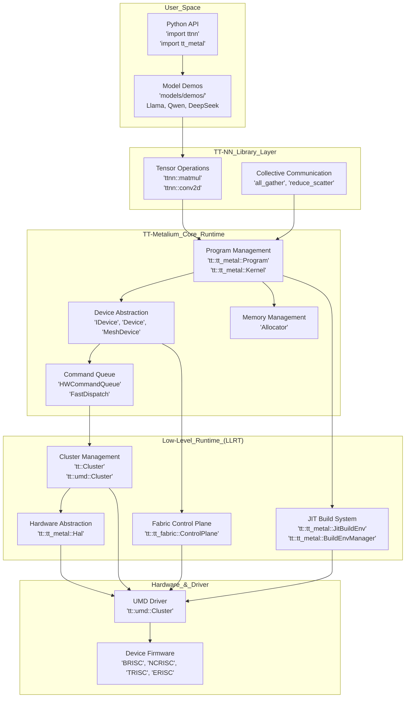

**Architecture Summary**

The stack is strictly layered to provide both high-level productivity and low-level performance:

| Layer | Purpose | Key Code Entities |
|-------|---------|-------------------|
| **User Space** | Model implementation | `models/demos/` [README.md:18]() |
| **TT-NN Library** | High-level primitives | `ttnn` [README.md:14]() |
| **TT-Metalium** | Programming model | `tt_metal` |
| **LLRT** | HW Abstraction | `llrt` |
| **Hardware** | Execution | `umd`, `Firmware` |
```


**Architecture Summary**

The stack is strictly layered to provide both high-level productivity and low-level performance:

| Layer | Purpose | Key Code Entities |
| --- | --- | --- |
| **User Space** | Model implementation | `models/demos/`[README.md 18](https://github.com/tenstorrent/tt-metal/blob/f30f8df0/README.md?plain=1#L18-L18) |
| **TT-NN Library** | High-level primitives | `ttnn`[README.md 14](https://github.com/tenstorrent/tt-metal/blob/f30f8df0/README.md?plain=1#L14-L14) |
| **TT-Metalium** | Programming model | `tt_metal` |
| **LLRT** | HW Abstraction | `llrt` |
| **Hardware** | Execution | `umd`, `Firmware` |

**Sources**: [README.md 12-102](https://github.com/tenstorrent/tt-metal/blob/f30f8df0/README.md?plain=1#L12-L102)[ttnn/ttnn/__init__.py 1-250](https://github.com/tenstorrent/tt-metal/blob/f30f8df0/ttnn/ttnn/__init__.py#L1-L250)[tt_metal/impl/context/metal_context.hpp 56-123](https://github.com/tenstorrent/tt-metal/blob/f30f8df0/tt_metal/impl/context/metal_context.hpp#L56-L123)[tt_metal/jit_build/build.hpp 99](https://github.com/tenstorrent/tt-metal/blob/f30f8df0/tt_metal/jit_build/build.hpp#L99-L99)[tt_metal/jit_build/build_env_manager.hpp 20](https://github.com/tenstorrent/tt-metal/blob/f30f8df0/tt_metal/jit_build/build_env_manager.hpp#L20-L20)[tt_metal/jit_build/build.cpp 125-140](https://github.com/tenstorrent/tt-metal/blob/f30f8df0/tt_metal/jit_build/build.cpp#L125-L140)[tt_metal/llrt/tt_cluster.hpp 61](https://github.com/tenstorrent/tt-metal/blob/f30f8df0/tt_metal/llrt/tt_cluster.hpp#L61-L61)[tt_metal/fabric/control_plane.cpp 33](https://github.com/tenstorrent/tt-metal/blob/f30f8df0/tt_metal/fabric/control_plane.cpp#L33-L33)[tt_metal/llrt/hal.hpp 1](https://github.com/tenstorrent/tt-metal/blob/f30f8df0/tt_metal/llrt/hal.hpp#L1-L1)[tt_metal/llrt/tt_cluster.hpp 26](https://github.com/tenstorrent/tt-metal/blob/f30f8df0/tt_metal/llrt/tt_cluster.hpp#L26-L26)

* * *

## Core Runtime Flow

### Component Initialization and Execution

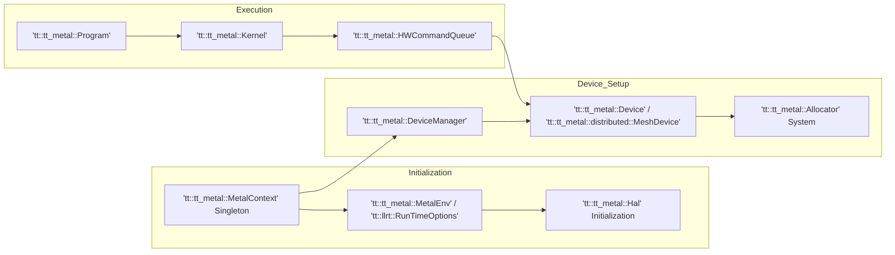

**Component Responsibilities**

- **MetalContext**: Manages global state, including `DeviceManager` and `Cluster` discovery. The `MetalContext::instance()` method provides access to the singleton. [tt_metal/impl/context/metal_context.hpp:65]()
- **JIT Build System**: Configures the compiler toolchain, including the RISC-V SFPI compiler path (`riscv-tt-elf-g++`). This is handled by `JitBuildEnv::init`. [tt_metal/jit_build/build.cpp:125-140]()
- **HAL**: Provides architecture-specific memory maps and core configurations for Tensix and Ethernet cores. The `Hal` object is accessed via `MetalContext::hal()`. [tt_metal/impl/context/metal_context.hpp:88]()
```


**Component Responsibilities**

*   **MetalContext**: Manages global state, including `DeviceManager` and `Cluster` discovery. The `MetalContext::instance()` method provides access to the singleton. [tt_metal/impl/context/metal_context.hpp 65](https://github.com/tenstorrent/tt-metal/blob/f30f8df0/tt_metal/impl/context/metal_context.hpp#L65-L65)
*   **JIT Build System**: Configures the compiler toolchain, including the RISC-V SFPI compiler path (`riscv-tt-elf-g++`). This is handled by `JitBuildEnv::init`. [tt_metal/jit_build/build.cpp 125-140](https://github.com/tenstorrent/tt-metal/blob/f30f8df0/tt_metal/jit_build/build.cpp#L125-L140)
*   **HAL**: Provides architecture-specific memory maps and core configurations for Tensix and Ethernet cores. The `Hal` object is accessed via `MetalContext::hal()`. [tt_metal/impl/context/metal_context.hpp 88](https://github.com/tenstorrent/tt-metal/blob/f30f8df0/tt_metal/impl/context/metal_context.hpp#L88-L88)

**Sources**: [tt_metal/impl/context/metal_context.hpp 65](https://github.com/tenstorrent/tt-metal/blob/f30f8df0/tt_metal/impl/context/metal_context.hpp#L65-L65)[tt_metal/jit_build/build.cpp 125-140](https://github.com/tenstorrent/tt-metal/blob/f30f8df0/tt_metal/jit_build/build.cpp#L125-L140)[tt_metal/impl/context/metal_context.hpp 88](https://github.com/tenstorrent/tt-metal/blob/f30f8df0/tt_metal/impl/context/metal_context.hpp#L88-L88)

* * *

## Hardware Platform Support

The stack supports Tenstorrent's Wormhole and Blackhole architectures:

### Supported Architectures

| Architecture | Chip Family | Characteristics |
| --- | --- | --- |
| **Wormhole** | N150, N300, Galaxy | Tensix cores + Active/Idle Ethernet cores. [tt_metal/llrt/tt_cluster.cpp 65](https://github.com/tenstorrent/tt-metal/blob/f30f8df0/tt_metal/llrt/tt_cluster.cpp#L65-L65) |
| **Blackhole** | P100, P150 | Higher core counts and updated NoC/Memory configurations. [tt_metal/llrt/tt_cluster.cpp 99](https://github.com/tenstorrent/tt-metal/blob/f30f8df0/tt_metal/llrt/tt_cluster.cpp#L99-L99) |

### System Configurations

*   **Single Device**: Standard N150 or P150 cards. [tt_metal/llrt/tt_cluster.cpp 134](https://github.com/tenstorrent/tt-metal/blob/f30f8df0/tt_metal/llrt/tt_cluster.cpp#L134-L134)
*   **N300**: Dual-chip Wormhole configuration. [tt_metal/llrt/tt_cluster.cpp 134](https://github.com/tenstorrent/tt-metal/blob/f30f8df0/tt_metal/llrt/tt_cluster.cpp#L134-L134)
*   **T3000**: 8-chip Wormhole system. [tests/scripts/t3000/run_t3000_unit_tests.sh 12-47](https://github.com/tenstorrent/tt-metal/blob/f30f8df0/tests/scripts/t3000/run_t3000_unit_tests.sh#L12-L47)
*   **Galaxy**: 32-chip Wormhole cluster for large-scale model inference. [tt_metal/llrt/tt_cluster.cpp 116](https://github.com/tenstorrent/tt-metal/blob/f30f8df0/tt_metal/llrt/tt_cluster.cpp#L116-L116)[README.md 40-43](https://github.com/tenstorrent/tt-metal/blob/f30f8df0/README.md?plain=1#L40-L43)

**Sources**: [README.md 40-66](https://github.com/tenstorrent/tt-metal/blob/f30f8df0/README.md?plain=1#L40-L66)[tt_metal/llrt/tt_cluster.cpp 65-170](https://github.com/tenstorrent/tt-metal/blob/f30f8df0/tt_metal/llrt/tt_cluster.cpp#L65-L170)[tests/scripts/t3000/run_t3000_unit_tests.sh 12-47](https://github.com/tenstorrent/tt-metal/blob/f30f8df0/tests/scripts/t3000/run_t3000_unit_tests.sh#L12-L47)

* * *

## Build and Setup

The build system is based on CMake and supports various configurations:

*   **CMake Configuration**: Top-level project definition with options for shared libraries, Python bindings, and LTO. [cmake/](https://github.com/tenstorrent/tt-metal/blob/f30f8df0/cmake/)
*   **Toolchain**: Uses a custom RISC-V SFPI toolchain for device-side kernels. The `JitBuildEnv` class manages the SFPI toolchain path. [tt_metal/jit_build/build.cpp 125-140](https://github.com/tenstorrent/tt-metal/blob/f30f8df0/tt_metal/jit_build/build.cpp#L125-L140)
*   **Docker Environments**: Multi-stage builds for CI and development (`ci-build`, `ci-test`, `dev`). [.github/workflows/fast-dispatch-full-regressions-and-models-impl.yaml 166-170](https://github.com/tenstorrent/tt-metal/blob/f30f8df0/.github/workflows/fast-dispatch-full-regressions-and-models-impl.yaml#L166-L170)
*   **Dependencies**: Managed via `install_dependencies.sh` for various OS families (Ubuntu, RHEL).

**Sources**: [tt_metal/jit_build/build.cpp 125-140](https://github.com/tenstorrent/tt-metal/blob/f30f8df0/tt_metal/jit_build/build.cpp#L125-L140)[cmake/](https://github.com/tenstorrent/tt-metal/blob/f30f8df0/cmake/)

This wiki is featured in the [repository](https://github.com/tenstorrent/tt-metal/blob/main/README.md)

Dismiss
Refresh this wiki

Enter email to refresh

## Additional Diagrams


#### UMD and Fabric Metadata


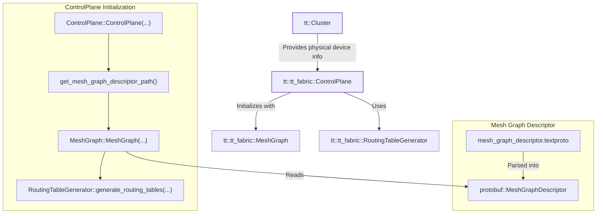

**Diagram: Control Plane and Fabric Integration**

The `ControlPlane` uses `MeshGraph` to represent the fabric topology. The `MeshGraph` can be initialized from a `.textproto` file, which is the preferred format for Mesh Graph Descriptors (MGD 2.0) [tt_metal/fabric/mesh_graph.cpp:112-130](). The `ControlPlane` also handles the mapping of logical mesh chip IDs to physical chip IDs [tt_metal/fabric/control_plane.cpp:220-221]().
```


#### MeshDevice Architecture


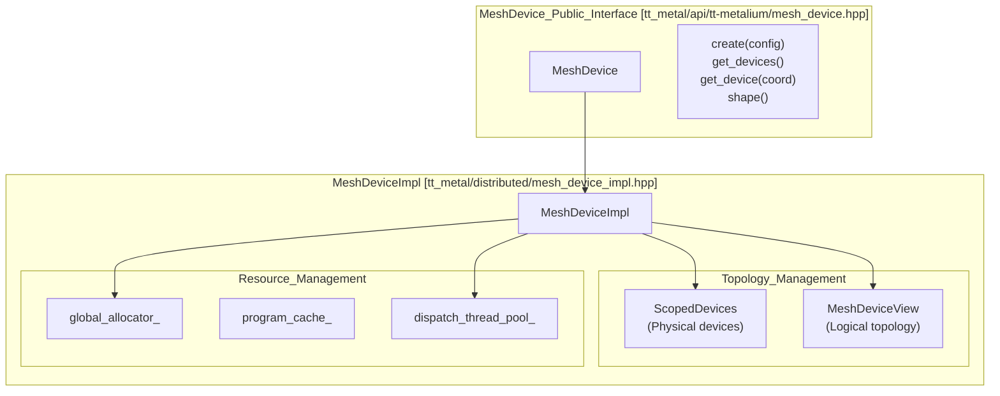

Sources: [tt_metal/api/tt-metalium/mesh_device.hpp:75-90](), [tt_metal/distributed/mesh_device.cpp:162-193]()
```


#### RunTimeOptions Initialization Flow


```mermaid
graph TD
    EnvVars["Environment Variables<br/>(TT_METAL_*)"]
    Constructor["RunTimeOptions()<br/>Constructor"]
    Parse["parse_env() calls"]
    Validate["Validation & Resolution"]
    MetalEnv["MetalEnv"]
    MetalContext["MetalContext"]
    Subsystems["Subsystems<br/>(Cluster, JIT, Watcher, etc.)"]
    
    EnvVars -->|Read during init| Constructor
    Constructor -->|Parse each category| Parse
    Parse -->|Store & validate| Validate
    Validate -->|Embedded in| MetalEnv
    MetalEnv -->|Referenced by| MetalContext
    MetalContext -->|Accessed via rtoptions()| Subsystems
    
    style Constructor fill:#ffffff
    style MetalContext fill:#ffffff
    style Subsystems fill:#ffffff
```

**Diagram: RunTimeOptions Initialization and Access Pattern** - Environment variables are parsed once during `RunTimeOptions` construction, stored in typed fields, and accessed throughout the system via `MetalContext::instance().rtoptions()`.
```


### JIT Build Configuration


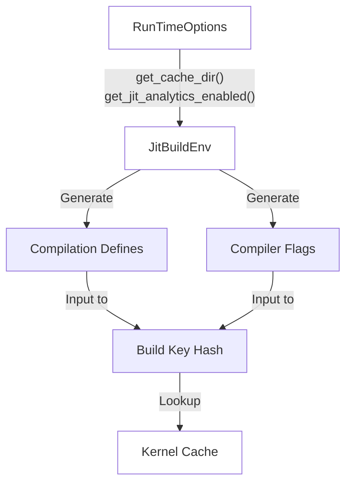

**Diagram: JIT Build Configuration Flow** - RunTimeOptions settings are incorporated into JitBuildEnv which generates compilation defines and flags, hashed into a build key for cache lookup.

**Build Key Computation**: The build key is used to identify unique build environments and artifacts in the cache. `JitBuildEnv::init` uses `RunTimeOptions` to set up include paths, compiler flags, and feature defines [[tt_metal/jit_build/build.cpp:101-210]()].
```


#### Fabric System Architecture


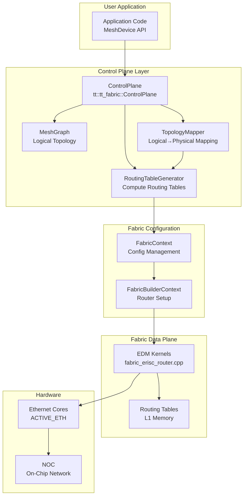


#### ControlPlane Code Entities


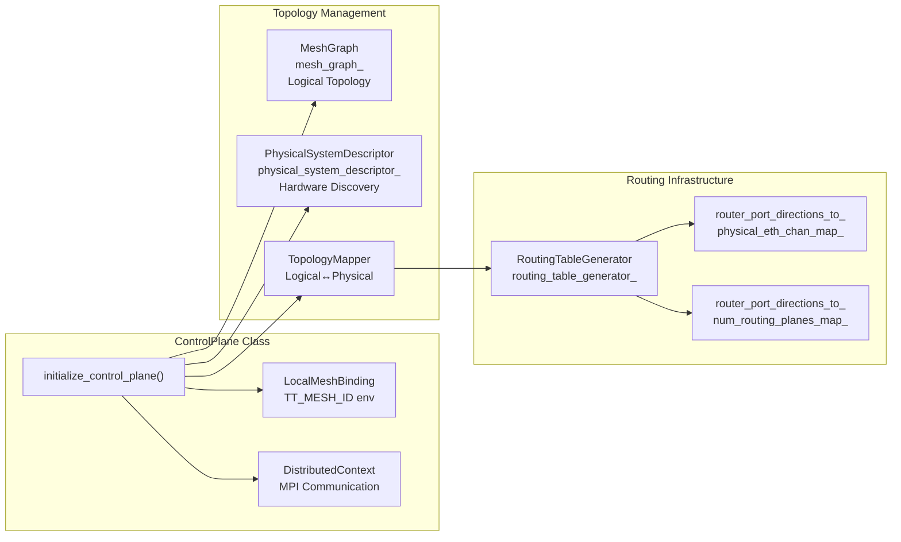


#### Data Flow


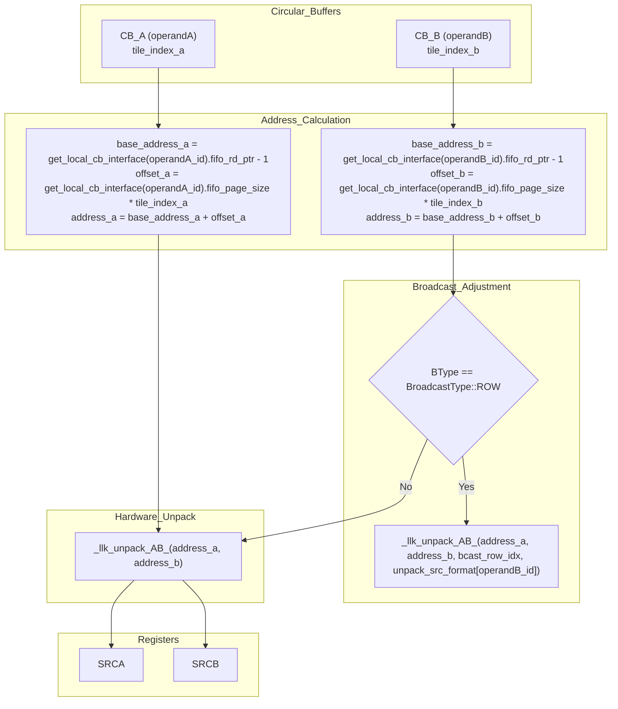

Sources:
[tt_metal/hw/ckernels/blackhole/metal/llk_api/llk_unpack_AB_api.h:38-73](),
[tt_metal/hw/ckernels/wormhole_b0/metal/llk_api/llk_unpack_AB_api.h:38-73]()
```


### Compute Pipeline Overview


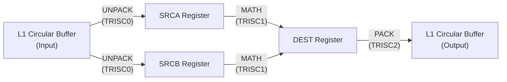


#### Data Format Configuration Flow


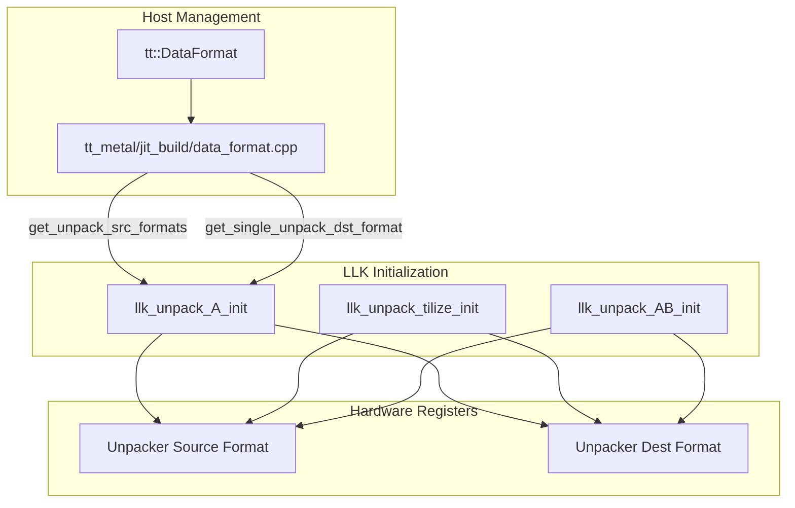

Sources: [tt_metal/jit_build/data_format.cpp:122-136](), [tt_metal/hw/ckernels/wormhole_b0/metal/llk_api/llk_unpack_A_api.h:18-41](), [tt_metal/hw/ckernels/blackhole/metal/llk_api/llk_unpack_tilize_api.h:21-28]()
```


#### Registration Workflow


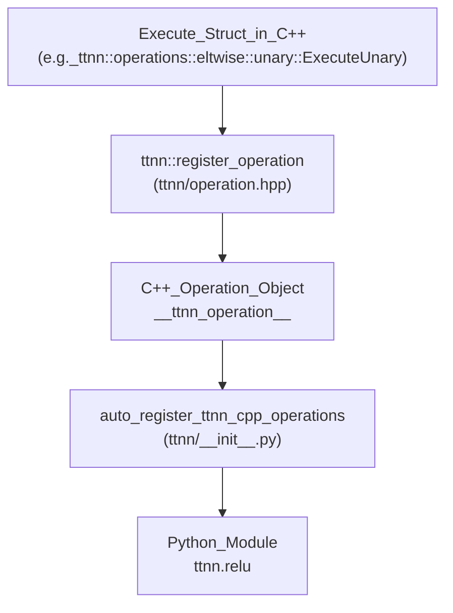

- **Execute Struct**: Implements operation logic in C++.
- **Registration Statement**: Using `ttnn::register_operation` template binds a name to the execute struct.
- **Operation Object**: Annotated with `__ttnn_operation__`; visible to Python.
- **Python Auto-Registration**: Scans C++ modules and registers operations into Python namespace.
```


#### Device Operation Dispatch Flow


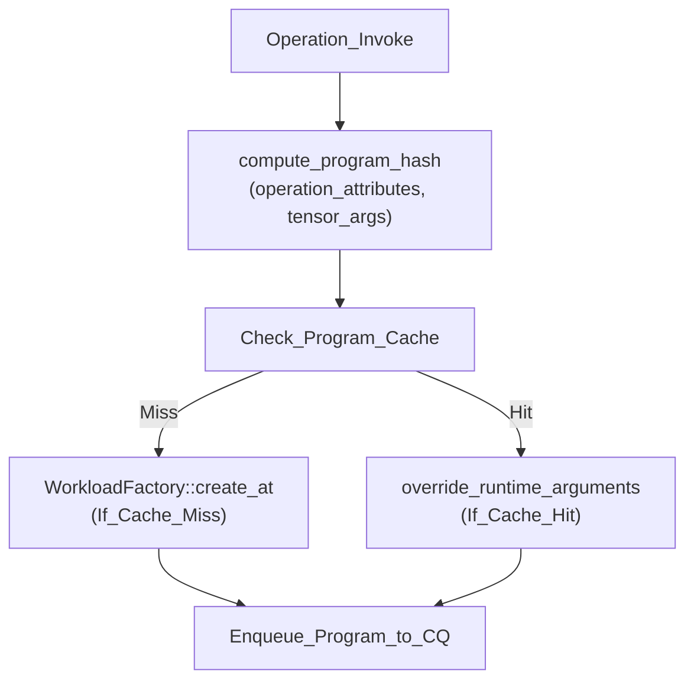


### Convolution Operation Architecture


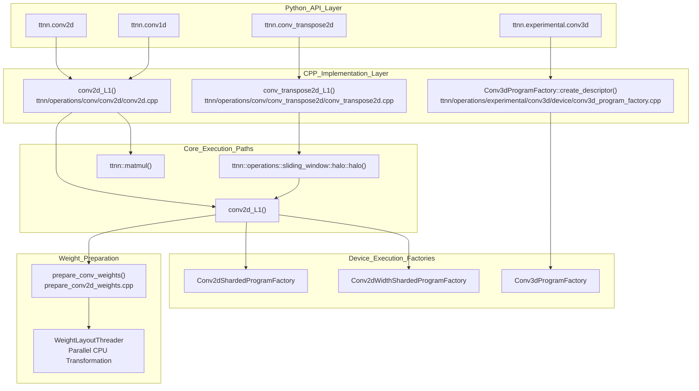
Sources: [ttnn/cpp/ttnn/operations/conv/conv2d/conv2d.cpp:38-56](), [ttnn/cpp/ttnn/operations/conv/conv_transpose2d/conv_transpose2d.cpp:51-71](), [ttnn/cpp/ttnn/operations/conv/conv2d/prepare_conv2d_weights.cpp:82-103](), [ttnn/cpp/ttnn/operations/experimental/conv3d/device/conv3d_program_factory.cpp:32-42]()
```


### Operation Architecture Overview


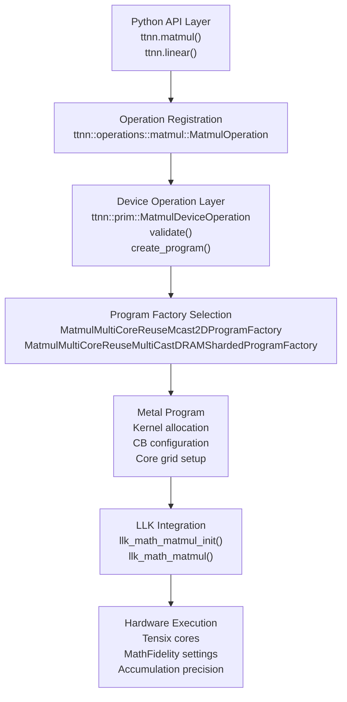


### Python API Layer


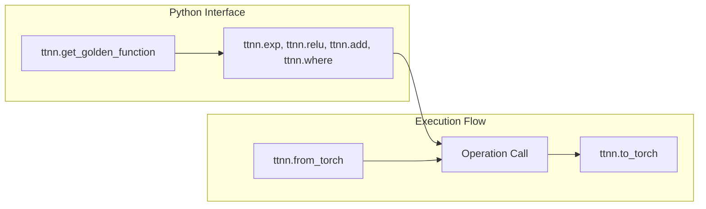

**Diagram 3: Python API Structure**

The Python layer automatically attaches PyTorch reference implementations as golden functions for testing via `ttnn.get_golden_function` [tests/ttnn/unit_tests/operations/eltwise/test_unary.py:56-57]().

**Example usage in tests:**
- `run_unary_test`: Executes an operation and compares it against the golden function using PCC or ULP [tests/ttnn/unit_tests/operations/eltwise/test_unary.py:43-68]().
- `run_identity_test`: Validates the `ttnn.identity` operation across multiple dtypes (uint8, uint16, int32, bfloat16) [tests/ttnn/unit_tests/operations/eltwise/test_unary.py:109-176]().
- `test_unequal_ranks`: Tests broadcasting logic for binary operations where input shapes do not match in rank [tests/ttnn/unit_tests/operations/eltwise/test_binary_bcast.py:48-61]().
- `test_where_op`: Validates the `ttnn.where` ternary operation [tests/ttnn/unit_tests/operations/eltwise/test_where.py:10-29]().

Sources: [tests/ttnn/unit_tests/operations/eltwise/test_unary.py:43-176](), [tests/ttnn/unit_tests/operations/eltwise/test_binary_bcast.py:48-61](), [tests/ttnn/unit_tests/operations/eltwise/test_where.py:10-29]()

---
```


### Library Organization and Targets


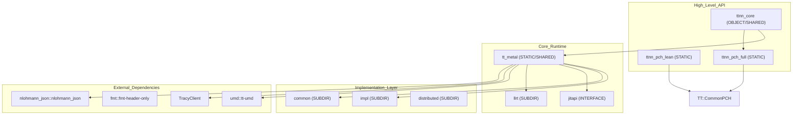


#### High-Level Pipeline Flow


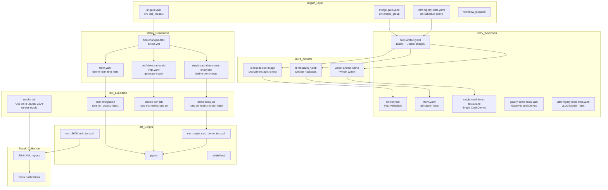


#### Release Flow Integration


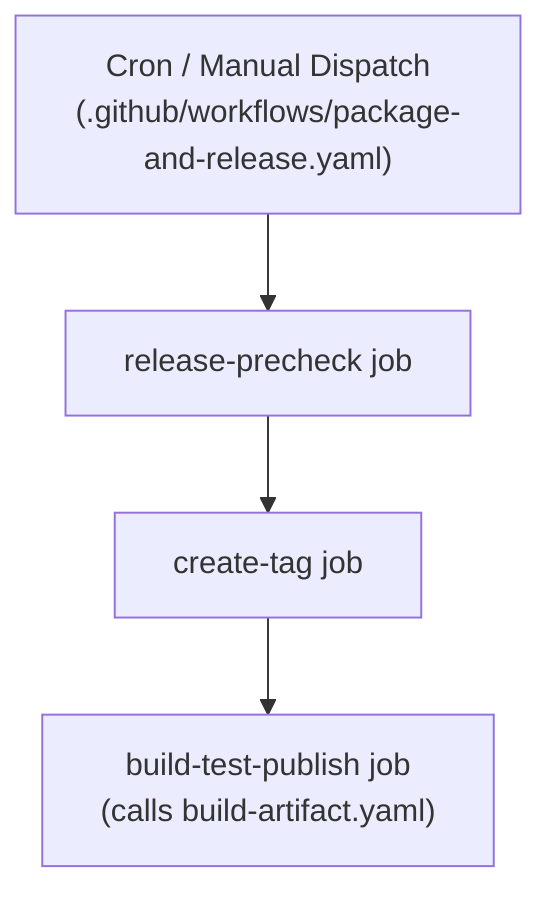
Official releases generate distinct artifacts:
1.  **Standard Build**: Production-ready binaries without instrumentation [.github/workflows/package-and-release.yaml:102-111]().
2.  **Tracy Build**: Instrumented binaries for performance validation [.github/workflows/build-artifact.yaml:17-21]().
3.  **Docker Release Image**: A standalone image containing the pre-installed stack [dockerfile/Dockerfile:185-194]().

Sources: [.github/workflows/package-and-release.yaml:1-161](), [.github/workflows/build-artifact.yaml:1-178]()
```


#### Test Organization by Layer


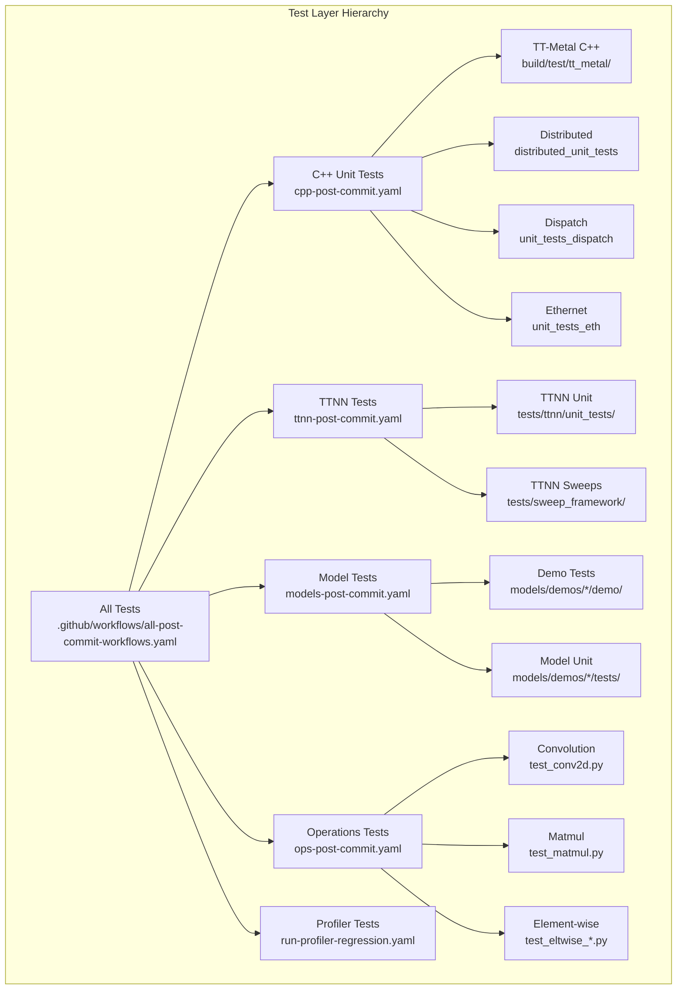


#### YAML-Based Test Definitions


```mermaid
graph LR
    YAMLDef["YAML Test Definition<br/>tests/pipeline_reorg/ttnn-tests.yaml"]
    WorkflowRead["Workflow Reads YAML<br/>ttnn-post-commit.yaml:60"]
    ParseStep["Parse & Filter<br/>prepare_test_matrix.py"]
    MatrixGen["Generate Matrix<br/>load-test-matrix job"]
    TestExec["Execute Tests<br/>ttnn job"]
    
    YAMLDef --> WorkflowRead
    WorkflowRead --> ParseStep
    ParseStep --> MatrixGen
    MatrixGen --> TestExec
```


#### Hardware Coverage Diagram


```mermaid
graph TD
    subgraph "Natural_Language_Space"
        WH["Wormhole B0"]
        BH["Blackhole"]
        T3K["T3000"]
        GLX["Galaxy"]
    end

    subgraph "Code_Entity_Space_(CI_Workflows)"
        WH_ARCH["arch: wormhole_b0"]
        BH_ARCH["arch: blackhole"]
        
        N150_LABEL["runner-label: N150"]
        N300_LABEL["runner-label: N300"]
        P150_LABEL["runner-label: P150"]
        P150B_LABEL["runner-label: P150b"]
        P100A_LABEL["runner-label: P100a"]
        T3K_LABEL["runner-label: N300-llmbox"]
        GLX_LABEL["runner-label: Galaxy"]
    end

    WH --> WH_ARCH
    BH --> BH_ARCH
    
    WH_ARCH --> N150_LABEL
    WH_ARCH --> N300_LABEL
    WH_ARCH --> T3K_LABEL
    WH_ARCH --> GLX_LABEL
    
    BH_ARCH --> P150_LABEL
    BH_ARCH --> P150B_LABEL
    BH_ARCH --> P100A_LABEL
```


#### Build System Integration


```mermaid
graph LR
    subgraph "Code Entities"
        M["Metalium (tt_metal)"]
        AGF["all_generated_files target"]
        T["TTNN (ttnn)"]
    end

    subgraph "Static Check Logic"
        CT["clang-tidy-20"]
        CCT["ccache integration"]
    end

    M -- "analyzed by" --> CT
    T -- "analyzed by" --> CT
    AGF -- "ensures headers for" --> CT
    CT -- "uses" --> CCT
```

Sources: [CMakeLists.txt:84-115](), [CMakeLists.txt:160]()
```


#### Data Flow and Code Entities


```mermaid
graph TB
    subgraph "Host_Space_(C++/Python)"
        A["tests/tt_metal/tools/profiler/test_device_profiler.py"] -- "Calls run_device_profiler_test()" --> B["tt::tt_metal::run_device_profiler_test"]
        B -- "Manages profiler state" --> C["tt::tt_metal::ProfilerStateManager"]
        C -- "Uses Tracy for visualization" --> D["Tracy_Profiler_Host"]
    end

    subgraph "Device_Space_(Silicon)"
        E["tt_metal/tools/profiler/kernel_profiler.hpp"] -- "Calls mark_time_at_index_inlined()" --> F["L1_Profiler_Buffer"]
        F -- "DMA/CQ transfer" --> G["DRAM_Profiler_Buffer"]
    end

    subgraph "Communication_Layer"
        H["tt::tt_metal::DeviceProfiler"] -- "Calls readResults()" --> G
    end

    F -- "Defined in profiler_common.h" --> I["profiler_msg_t"]
    G -- "Uses DRAM_PROFILER_ADDRESS" --> I
    H -- "Calls processResults()" --> C
    C -- "Populates TracyTTCtx" --> D
```

Sources:
- [tt_metal/impl/profiler/profiler.cpp:67-112]()
- [tt_metal/tools/profiler/kernel_profiler.hpp:79-84]()
- [tests/tt_metal/tools/profiler/test_device_profiler.py:116-154]()
```


### Release Pipeline Architecture


```mermaid
graph TD
    Trigger["Trigger<br/>(cron/dispatch)"]
    Precheck["release-precheck<br/>.github/workflows/package-and-release.yaml"]
    CreateTag["create-tag<br/>uses: release-verify-or-create-tag.yaml"]

    subgraph "Multi-Platform Build and Test"
        BuildTest22["build-test-publish<br/>Ubuntu 22.04<br/>uses: release-build-test-publish.yaml"]
        BuildTest24["build-test-publish<br/>Ubuntu 24.04<br/>uses: release-build-test-publish.yaml"]
    end

    Docs["release-docs<br/>uses: docs-latest-public.yaml"]
    DockerRel["create-docker-release-image<br/>uses: publish-release-image.yaml"]

    Trigger --> Precheck
    Precheck --> CreateTag
    CreateTag --> BuildTest22
    CreateTag --> BuildTest24

    BuildTest22 --> Docs
    BuildTest22 --> DockerRel
```

**Key pipeline characteristics:**

1. **Parallel platform builds**: Ubuntu 22.04 and 24.04 build simultaneously in separate matrix jobs [[.github/workflows/package-and-release.yaml:153-156]()]
2. **Idempotent release checks**: `get_should_create_release.sh` prevents duplicate releases by checking existing tags and commits [[.github/workflows/package-and-release.yaml:127-132]()]
3. **Platform Differentiation**: The main platform (Ubuntu 22.04) runs the full suite including multi-card tests (Galaxy, N300, Blackhole clusters), while others run single-card only [[.github/workflows/release-build-test-publish.yaml:122-128]()]
```


### Test Execution Architecture


```mermaid
graph TB
    subgraph "Main Process (sweeps_runner.py)"
        Config["SweepsConfig<br/>Configuration for test runs"]
        VectorSrc["VectorSourceFactory<br/>Load vectors"]
        SanitizeInputs["sanitize_inputs()<br/>Cleanup metadata"]
        ExecuteSuite["execute_suite()<br/>Runs vectors in child process"]
    end
    
    subgraph "Vector Execution"
        Queues["Queue (faster_fifo or multiprocessing)"]
        ChildProc["Process (multiprocessing)"]
        RunSingle["run_single()<br/>Executes run() of sweep module"]
        TestModule["Sweep module's run() function"]
        TTSMIReset["tt_smi_util.reset()<br/>Hardware reset on timeout"]
    end
    
    Config --> VectorSrc
    VectorSrc --> SanitizeInputs
    SanitizeInputs --> ExecuteSuite
    
    ExecuteSuite --> Queues
    Queues --> ChildProc
    ChildProc --> RunSingle
    RunSingle --> TestModule
    
    ChildProc -- "Timeout or hang" --> TTSMIReset
```

Sources: [tests/sweep_framework/sweeps_runner.py:38-63](), [tests/sweep_framework/sweeps_runner.py:158-176](), [tests/sweep_framework/sweep_utils/perf_utils.py:35-36]()
```


### Configuration System Architecture


```mermaid
graph TD
    User["User Code<br/>(simple_text_demo.py)"]
    OptMode["Optimization Mode<br/>ModelOptimizations.performance()<br/>ModelOptimizations.accuracy()"]
    JSON["JSON Override<br/>performance_decoder_config.json<br/>accuracy_decoder_config.json"]
    
    ModelArgs["ModelArgs<br/>max_batch_size<br/>max_seq_len<br/>device configuration"]
    DecPrec["DecodersPrecision<br/>Per-layer precision settings<br/>tensor_dtype_settings<br/>op_fidelity_settings"]
    
    Decoder["TransformerBlock<br/>layer_num"]
    Attn["Attention<br/>wqkv_dtype<br/>wo_dtype<br/>kv_cache_dtype<br/>compute_kernel_cfg"]
    MLP["MLP<br/>ff1_ff3_dtype<br/>ff2_dtype<br/>compute_kernel_cfg"]
    
    User -->|"optimizations parameter"| OptMode
    User -->|"JSON path"| JSON
    OptMode --> DecPrec
    JSON -->|"parse_decoder_json()"| DecPrec
    
    ModelArgs -->|"contains"| DecPrec
    DecPrec -->|"get_tensor_dtype(layer_num)"| Decoder
    DecPrec -->|"get_math_fidelity(layer_num)"| Decoder
    
    Decoder --> Attn
    Decoder --> MLP
```


#### Distributed Tensor Flow Diagram


```mermaid
graph LR
    HostTensor["Host Tensor"]
    TensorToMesh["TensorToMesh"]
    MeshMapperConfig["MeshMapperConfig (Shard / Replicate)"]
    DistributedTensor["Distributed Tensor (Shards on Mesh)"]

    HostTensor --> TensorToMesh
    TensorToMesh -->|Uses| MeshMapperConfig
    TensorToMesh --> DistributedTensor
```


#### CCL Operation Flow Diagram


```mermaid
graph LR
    subgraph HostOrchestration
        CclOp["CclOpTensorConfig"]
        Topo["LineTopology / RingTopology"]
        Builder["CclCommandStreamBuilder"]
    end

    subgraph DeviceExecution
        EriscDM["EriscDatamoverBuilder"]
        Kernel["ccl_send_reader_two_input.cpp"]
        Fabric["tt_fabric::Send / Receive"]
    end

    CclOp --> Topo
    Topo --> Builder
    Builder --> EriscDM
    EriscDM --> Kernel
    Kernel --> Fabric
```


### Model Organization


```mermaid
graph TB
    subgraph "Model Repository Structure"
        ModelsRoot["models/"]
        
        Demos["demos/"]
        TTTransformers["tt_transformers/"]
        Experimental["experimental/"]
        TTDIT["tt_dit/"]
        
        ModelsRoot --> Demos
        ModelsRoot --> TTTransformers
        ModelsRoot --> Experimental
        ModelsRoot --> TTDIT
        
        subgraph "Transformer Models"
            TTTransformers --> TransformerModels["Llama3.x, Qwen2.5<br/>Mistral, Mixtral<br/>Common LLM Infrastructure"]
        end
        
        subgraph "Demo Categories"
            Demos --> LLMDemos["LLM Demos"]
            Demos --> VisionDemos["vision/"]
            
            LLMDemos --> DeepSeek["deepseek_v3/<br/>MoE architecture"]
            LLMDemos --> Falcon["falcon7b/"]
            LLMDemos --> GPTOSS["gpt_oss/"]
            
            VisionDemos --> SD["generative/<br/>Stable Diffusion"]
        end

        subgraph "Diffusion Transformers"
            TTDIT --> Wan["wan/<br/>Wan2.1 Video Generation"]
        end
    end
```


#### Implementation Architecture


```mermaid
graph TD
    subgraph "DeepSeek Code-to-System Mapping"
        Gen["DeepseekGenerator (generator.py:154-202)"]
        Model["RowBatchedModel (row_batched_model.py)"]
        MLA["MLA1D/MLA2D (mla1d.py:194-214)"]
        MoE["MoE (moe.py:38-68)"]
        Experts["MoEExperts (experts.py)"]
        
        Gen -->|manages inference| Model
        Model -->|implements attention| MLA
        Model -->|handles MoE routing| MoE
        MoE -->|contains experts| Experts
        
        subgraph "MLA Components"
            MatmulPC["build_prefill_matmul_program_config (mla1d.py:72-187)"]
        end
    end
```

- **DeepseekGenerator**: Orchestrates inference steps, token batching, sampling parameters, and optionally MTP verification aliasing [models/demos/deepseek_v3/tt/generator.py:154-202]().
- **RowBatchedModel**: Implements the core batched transformer forward pass.
- **MLA1D/MLA2D**: Multi-Latent Attention modules support 1D and 2D tensor parallelism, including advanced matmul program configuration for memory and compute efficiency [models/demos/deepseek_v3/tt/mla/mla1d.py:72-187]().
- **MoE Module**: Includes gate and expert submodules, with shared and SRAM-hot routes for optimal expert weighting [models/demos/deepseek_v3/tt/moe.py:38-68]().
```


#### Architecture and Pipeline


```mermaid
graph TD
    subgraph "GPT-OSS Code-to-System Mapping"
        ModelOSS["Model (model.py:77-247)"]
        DecLayer["DecoderLayer (layer.py)"]
        RMS["RMSNorm (rms_norm.py)"]
        RoPE["RotarySetup (rope.py)"]
        
        ModelOSS -->|contains| DecLayer
        DecLayer -->|uses| RMS
        ModelOSS -->|initializes| RoPE
        
        subgraph "Generation Pipeline"
            GenOSS["Generator (tt_transformers/tt/generator.py)"]
            TextDemo["text_demo.py:82-174"]
            
            TextDemo -->|invokes| GenOSS
            GenOSS -->|executes| ModelOSS
        end
    end
```

- **Vocabulary handling**: The calculation of per-device vocabulary width aligns vocab size to the next power of two, enabling optimized top-k multi-core sorting in `ttnn.topk` [models/demos/gpt_oss/tt/model.py:21-31]().

- **RoPE Setup**: The `create_rope_setup` function constructs cos/sin matrices and various transformation matrices for rotary embeddings, constraining data to bfloat16 for compatibility [models/demos/gpt_oss/tt/model.py:34-74]().

- **Throughput Experts**: Experimental support for throughput-based experts enhances multi-device throughput, enabled based on architecture and mesh size [models/demos/gpt_oss/tt/model.py:103-181]().
```


#### Distributed Tensor Data Flow


```mermaid
graph TD
    Host["Host std::vector<T>"] --> Mapper["ttnn::distributed::shard_tensor_to_mesh_mapper"]
    Mapper --> Mesh["ttnn::distributed::distribute_tensor"]
    Mesh --> Device["ttnn::distributed::MeshDevice"]
    Device -- "AllReduce" --> CCL["ttml::ttnn_fixed::distributed::all_reduce"]
```

Sources: [tt-train/tests/core/n300_utils_test.cpp:95-96](), [tt-train/tests/core/n300_utils_test.cpp:141](), [tt-train/sources/examples/nano_gpt/main.cpp:41-95]().

---
```


#### Architecture Diagram: Debugging Subsystem Components and Data Flow


```mermaid
graph TD
    subgraph "Host_Side_Entities"
        RTO["llrt::RunTimeOptions\
(rtoptions.hpp)"]
        MC["MetalContext::instance()\
(metal_context.hpp)"]
        WS["WatcherServer::Impl\
(watcher_server.cpp)"]
        WDR["WatcherDeviceReader\
(watcher_device_reader.cpp)"]
        DPS["DPrintServer::Impl\
(dprint_server.cpp)"]
    end

    subgraph "Device_L1_Memory_Space"
        MB["Mailboxes (dev_msgs::mailboxes_t)\
(dev_msgs.h)"]
        DB["DevicePrintHeader\
(device_print_structures.h)"]
        RB["Debug Ring Buffer\
(ring_buffer.h)"]
    end

    RTO -->|configure features| WS
    RTO -->|configure dprint| DPS
    MC -->|manages instance / lifecycle| WS
    MC -->|manages instance / lifecycle| DPS
    WS -->|creates per-device readers| WDR
    WDR -->|polls mailbox data| MB
    WDR -->|polls ring buffer data| RB
    DPS -->|polls print buffers| DB
```

**Notes:**
- `WatcherServer` continuously polls device mailboxes, looking for error conditions and kernel status.
- `WatcherDeviceReader` handles device-specific data reads for mailboxes and ring buffer analysis.
- `DPrintServer` processes kernel-side debug prints (via DPRINT mechanism) for printf-style diagnostics.

Sources: `[tt_metal/impl/debug/watcher_server.cpp:46-107]()`, `[tt_metal/impl/debug/watcher_device_reader.cpp:36-56]()`, `[tt_metal/impl/debug/dprint_server.cpp:159-190]()`, `[tt_metal/impl/context/metal_context.hpp:99-100]()`

---
```


#### Debug Data Flow


```mermaid
graph TD
    subgraph "Device_NPU_Core"
        subgraph "Programmable_RISCV"
            KCode["Kernel_Code<br/>(DPRINT << var)"]
            WPoint["Waypoint/Assert<br/>(WAYPOINT / ASSERT)"]
        end
        subgraph "L1_Memory"
            DP_Buf["DPRINT_Buffer<br/>(HalL1MemAddrType::DPRINT_BUFFERS)"]
            W_Mailbox["Watcher_Mailbox<br/>(dev_msgs::mailboxes_t)"]
        end
    end

    subgraph "Host_Metalium_Runtime"
        DP_Server["DPrintServer::Impl"]
        W_Server["WatcherServer::Impl"]
        Cluster["tt::Cluster<br/>(read_core / write_core)"]
        MContext["MetalContext::instance()"]
    end

    subgraph "Output_Files"
        DP_Log["generated/dprint/dprint.log"]
        W_Log["generated/watcher/watcher.log"]
    end

    KCode --> DP_Buf
    WPoint --> W_Mailbox
    DP_Buf -.->|NOC_Read| Cluster
    W_Mailbox -.->|NOC_Read| Cluster
    MContext --> DP_Server
    MContext --> W_Server
    DP_Server --> DP_Log
    W_Server --> W_Log
```

Sources: [tt_metal/impl/debug/dprint_server.cpp:185-200](), [tt_metal/impl/debug/watcher_server.cpp:78-107](), [tt_metal/impl/debug/debug_helpers.hpp:84-87]()

---
```


### Fast Dispatch Kernel Implementation Overview


```mermaid
graph LR
    subgraph "Host System"
        IssueQueue["Issue Queue (Host Memory)"]
    end
    subgraph "Prefetcher Core (BRISC)"
        FetchQueue["Fetch Queue"]
        ScratchBuffer["Scratch Buffer"]
        Telemetry["PrefetchCoreTelemetry"]
    end
    subgraph "Dispatcher Core (BRISC / NCRISC)"
        DispatchBuffer["Dispatch Buffer"]
        CQWriteInterface["CQWriteInterface"]
        TelemetryDispatch["DispatchCoreTelemetry"]
    end
    subgraph "Worker Cores"
        WorkerCores["Worker RISC-V Cores"]
    end

    IssueQueue -->|DMA fetch| FetchQueue
    FetchQueue --> PrefetcherCore["Prefetcher Core"]
    PrefetcherCore -->|Relay commands| DispatcherCore["Dispatcher Core"]
    DispatcherCore -->|NOC writes| WorkerCores
    DispatcherCore --> CQWriteInterface
```

This telemetry is accessed during triage runs to analyze dispatcher stalls and command queue status.

_Sources: [tt_metal/impl/dispatch/kernels/cq_prefetch.cpp:120-140](), [tt_metal/impl/dispatch/kernels/cq_dispatch.cpp:100-130](), [tt_metal/impl/dispatch/kernels/telemetry.hpp:12-28]()_

---
```


### Operation Architecture Overview


```mermaid
graph TD
    subgraph "Python_API_Layer"
        PyAPI["Python Function: ttnn.matmul, ttnn.split, etc."]
        Golden["Golden Function: PyTorch ref for testing"]
        NB_Bind["Nanobind Wrapper: bind_function.hpp"]
    end
    
    subgraph "C++_API_Layer"
        OpStruct["Operation Implementation: e.g. binary.cpp"]
        OpAttr["Operation Attributes: operation_attributes_t"]
        OpParams["Tensor Args: tensor_args_t"]
    end
    
    subgraph "Device_Operation_Layer"
        Launch["Launch Utility: device_operation::launch"]
        DeviceOp["Device Operation: e.g. BinaryDeviceOperation"]
        ProgFactory["Program Factory: e.g. binary_multi_core_program_factory.cpp"]
        Validation["Input Validation: CheckDeviceBufferIsAllocated"]
    end
    
    subgraph "Kernel_Layer"
        ComputeKernel["Compute Kernel: reader/writer/compute in C++"]
        LLKCalls["LLK Function Calls: sfpu_*.h calls"]
    end
    
    subgraph "Hardware_Layer"
        SFPU["SFPU Instructions: RISC-V kernels"]
        LLK["Low-Level Kernels: Pack/Unpack operations"]
    end
    
    PyAPI --> NB_Bind
    NB_Bind --> OpStruct
    Golden -. "Validates" .-> PyAPI
    
    OpStruct --> Launch
    Launch --> OpAttr
    Launch --> OpParams
    OpAttr --> DeviceOp
    
    DeviceOp --> ProgFactory
    DeviceOp --> Validation
    
    ProgFactory --> ComputeKernel
    ComputeKernel --> LLKCalls
    
    LLKCalls --> SFPU
    LLKCalls --> LLK
```

This architecture enables operations written in C++ to be accessed directly from Python, validated against golden PyTorch computations, dispatched through a device operation layer, and compiled down to efficient SFPU machine instructions.
```


### Operation Implementation Flow


```mermaid
graph TD
    subgraph "Host_Side_Logic"
        PyCall["ttnn.operation(input_tensors, attributes)"]
        CppImpl["C++ Interface Function (e.g., binary.cpp)"]
        Launch["device_operation::launch"]
        ProgFactory["WorkloadFactory::create_mesh_workload or create_at"]
    end

    subgraph "Device_Execution"
        Reader["Reader Kernel: reader_*.cpp"]
        Compute["Compute Kernel: compute/*.cpp"]
        Writer["Writer Kernel: writer_*.cpp"]
    end

    PyCall --> CppImpl
    CppImpl --> Launch
    Launch --> ProgFactory
    
    ProgFactory -- "CreateKernel calls" --> Reader
    ProgFactory -- "CreateKernel calls" --> Compute
    ProgFactory -- "CreateKernel calls" --> Writer
    
    Reader -- "L1 Circular Buffers" --> Compute
    Compute -- "L1 Circular Buffers" --> Writer
```

This flow shows how an operation from Python triggers dispatch through the layers down to hardware kernel execution and data flow between kernels via on-chip circular buffers.
```


#### Lifecyle Overview Diagram


```mermaid
graph TD
  subgraph "Initialization Paths"
    A["run_physical_system_discovery() - Live Discovery"] --> PSD["PhysicalSystemDescriptor"]
    B["deserialize_physical_system_descriptor_from_text_proto_file() - From File"] --> PSD
    C["deserialize_physical_system_descriptor_from_proto() - Proto Object"] --> PSD
  end

  PSD --> Merge["PhysicalSystemDescriptor::merge(PhysicalSystemDescriptor && other)"]
  Merge --> Unified["Unified System Graph (system_graph_) with ASIC and Host Connectivity"]
  PSD --> Clear["clear() - Reset topology data"]

  classDef codeEntity fill:#f9f9f9,stroke:#333,stroke-width:1px;
  class PSD,Merge,Clear codeEntity;
```

---
```

