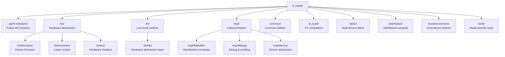
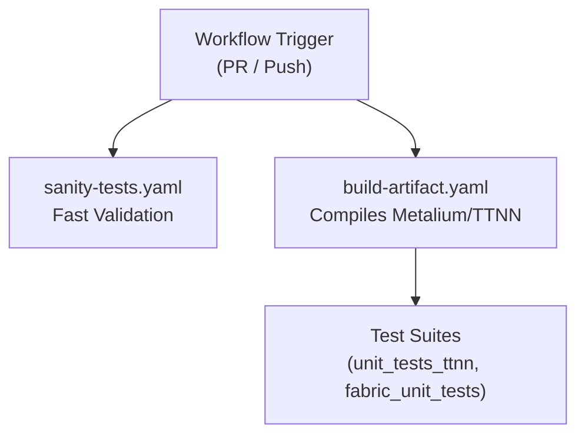

# Repository Structure

Relevant source files
*   [.github/pull_request_template.md](https://github.com/tenstorrent/tt-metal/blob/f30f8df0/.github/pull_request_template.md?plain=1)
*   [.github/workflows/pr-description-inject-branch-name.yaml](https://github.com/tenstorrent/tt-metal/blob/f30f8df0/.github/workflows/pr-description-inject-branch-name.yaml)
*   [CONTRIBUTING.md](https://github.com/tenstorrent/tt-metal/blob/f30f8df0/CONTRIBUTING.md?plain=1)
*   [README.md](https://github.com/tenstorrent/tt-metal/blob/f30f8df0/README.md?plain=1)
*   [cmake/helper_functions.cmake](https://github.com/tenstorrent/tt-metal/blob/f30f8df0/cmake/helper_functions.cmake)
*   [models/README.md](https://github.com/tenstorrent/tt-metal/blob/f30f8df0/models/README.md?plain=1)
*   [models/demos/deepseek_v3/README.md](https://github.com/tenstorrent/tt-metal/blob/f30f8df0/models/demos/deepseek_v3/README.md?plain=1)
*   [models/demos/llama3_70b_galaxy/PERF.md](https://github.com/tenstorrent/tt-metal/blob/f30f8df0/models/demos/llama3_70b_galaxy/PERF.md?plain=1)
*   [models/demos/llama3_70b_galaxy/README.md](https://github.com/tenstorrent/tt-metal/blob/f30f8df0/models/demos/llama3_70b_galaxy/README.md?plain=1)
*   [models/demos/multimodal/gemma3/README.md](https://github.com/tenstorrent/tt-metal/blob/f30f8df0/models/demos/multimodal/gemma3/README.md?plain=1)
*   [models/demos/t3000/llama3_70b/README.md](https://github.com/tenstorrent/tt-metal/blob/f30f8df0/models/demos/t3000/llama3_70b/README.md?plain=1)
*   [models/demos/t3000/llama3_70b/setup_llama.sh](https://github.com/tenstorrent/tt-metal/blob/f30f8df0/models/demos/t3000/llama3_70b/setup_llama.sh)
*   [models/demos/wormhole/qwen3_embedding_8b/demo/generator_vllm.py](https://github.com/tenstorrent/tt-metal/blob/f30f8df0/models/demos/wormhole/qwen3_embedding_8b/demo/generator_vllm.py)
*   [models/docs/MODEL_HYBRID_TP_DP.md](https://github.com/tenstorrent/tt-metal/blob/f30f8df0/models/docs/MODEL_HYBRID_TP_DP.md?plain=1)
*   [models/docs/MODEL_UPDATES.md](https://github.com/tenstorrent/tt-metal/blob/f30f8df0/models/docs/MODEL_UPDATES.md?plain=1)
*   [models/docs/model_bring_up.md](https://github.com/tenstorrent/tt-metal/blob/f30f8df0/models/docs/model_bring_up.md?plain=1)
*   [releases/README.md](https://github.com/tenstorrent/tt-metal/blob/f30f8df0/releases/README.md?plain=1)
*   [scripts/tracing/.gitattributes](https://github.com/tenstorrent/tt-metal/blob/f30f8df0/scripts/tracing/.gitattributes)
*   [scripts/tracing/.gitignore](https://github.com/tenstorrent/tt-metal/blob/f30f8df0/scripts/tracing/.gitignore)
*   [scripts/tracing/README.md](https://github.com/tenstorrent/tt-metal/blob/f30f8df0/scripts/tracing/README.md?plain=1)
*   [scripts/tracing/context.txt](https://github.com/tenstorrent/tt-metal/blob/f30f8df0/scripts/tracing/context.txt)
*   [scripts/tracing/questions.txt](https://github.com/tenstorrent/tt-metal/blob/f30f8df0/scripts/tracing/questions.txt)
*   [scripts/tracing/run.py](https://github.com/tenstorrent/tt-metal/blob/f30f8df0/scripts/tracing/run.py)
*   [scripts/tracing/system-prompt.txt](https://github.com/tenstorrent/tt-metal/blob/f30f8df0/scripts/tracing/system-prompt.txt)
*   [tech_reports/Debugging/Kernel_Debugging_Tips.md](https://github.com/tenstorrent/tt-metal/blob/f30f8df0/tech_reports/Debugging/Kernel_Debugging_Tips.md?plain=1)
*   [tech_reports/LLMs/vLLM_integration.md](https://github.com/tenstorrent/tt-metal/blob/f30f8df0/tech_reports/LLMs/vLLM_integration.md?plain=1)
*   [tests/CMakeLists.txt](https://github.com/tenstorrent/tt-metal/blob/f30f8df0/tests/CMakeLists.txt)
*   [tests/tt_metal/distributed/benchmark_distributed_host_buffer.cpp](https://github.com/tenstorrent/tt-metal/blob/f30f8df0/tests/tt_metal/distributed/benchmark_distributed_host_buffer.cpp)
*   [tests/tt_metal/distributed/benchmark_thread_pool.cpp](https://github.com/tenstorrent/tt-metal/blob/f30f8df0/tests/tt_metal/distributed/benchmark_thread_pool.cpp)
*   [tests/tt_metal/distributed/test_thread_pool.cpp](https://github.com/tenstorrent/tt-metal/blob/f30f8df0/tests/tt_metal/distributed/test_thread_pool.cpp)
*   [tests/tt_metal/tt_fabric/CMakeLists.txt](https://github.com/tenstorrent/tt-metal/blob/f30f8df0/tests/tt_metal/tt_fabric/CMakeLists.txt)
*   [tests/ttnn/CMakeLists.txt](https://github.com/tenstorrent/tt-metal/blob/f30f8df0/tests/ttnn/CMakeLists.txt)
*   [tests/ttnn/benchmark/cpp/CMakeLists.txt](https://github.com/tenstorrent/tt-metal/blob/f30f8df0/tests/ttnn/benchmark/cpp/CMakeLists.txt)
*   [tests/ttnn/benchmark/cpp/benchmark_host_alloc_on_tensor_readback.cpp](https://github.com/tenstorrent/tt-metal/blob/f30f8df0/tests/ttnn/benchmark/cpp/benchmark_host_alloc_on_tensor_readback.cpp)
*   [tests/ttnn/benchmark/cpp/benchmark_host_dtype_conversion.cpp](https://github.com/tenstorrent/tt-metal/blob/f30f8df0/tests/ttnn/benchmark/cpp/benchmark_host_dtype_conversion.cpp)
*   [tests/ttnn/benchmark/cpp/host_tilizer_untilizer/tilizer_untilizer.cpp](https://github.com/tenstorrent/tt-metal/blob/f30f8df0/tests/ttnn/benchmark/cpp/host_tilizer_untilizer/tilizer_untilizer.cpp)
*   [tests/ttnn/benchmark/cpp/matmul/test_matmul_benchmark.cpp](https://github.com/tenstorrent/tt-metal/blob/f30f8df0/tests/ttnn/benchmark/cpp/matmul/test_matmul_benchmark.cpp)
*   [tests/ttnn/benchmark/cpp/operations/ternary/benchmark_where.cpp](https://github.com/tenstorrent/tt-metal/blob/f30f8df0/tests/ttnn/benchmark/cpp/operations/ternary/benchmark_where.cpp)
*   [tests/ttnn/benchmark/cpp/padding/pad_rm.cpp](https://github.com/tenstorrent/tt-metal/blob/f30f8df0/tests/ttnn/benchmark/cpp/padding/pad_rm.cpp)
*   [tests/ttnn/lab_examples/CMakeLists.txt](https://github.com/tenstorrent/tt-metal/blob/f30f8df0/tests/ttnn/lab_examples/CMakeLists.txt)
*   [tests/ttnn/tracy/cpp/CMakeLists.txt](https://github.com/tenstorrent/tt-metal/blob/f30f8df0/tests/ttnn/tracy/cpp/CMakeLists.txt)
*   [tests/ttnn/unit_tests/gtests/CMakeLists.txt](https://github.com/tenstorrent/tt-metal/blob/f30f8df0/tests/ttnn/unit_tests/gtests/CMakeLists.txt)
*   [tests/ttnn/unit_tests/gtests/multiprocess/CMakeLists.txt](https://github.com/tenstorrent/tt-metal/blob/f30f8df0/tests/ttnn/unit_tests/gtests/multiprocess/CMakeLists.txt)
*   [tests/ttnn/unit_tests/gtests/test_graph_capture_arguments_morehdot.cpp](https://github.com/tenstorrent/tt-metal/blob/f30f8df0/tests/ttnn/unit_tests/gtests/test_graph_capture_arguments_morehdot.cpp)
*   [tests/ttnn/unit_tests/gtests/test_graph_capture_arguments_transpose.cpp](https://github.com/tenstorrent/tt-metal/blob/f30f8df0/tests/ttnn/unit_tests/gtests/test_graph_capture_arguments_transpose.cpp)
*   [tests/ttnn/unit_tests/gtests/ttnn_test_fixtures.hpp](https://github.com/tenstorrent/tt-metal/blob/f30f8df0/tests/ttnn/unit_tests/gtests/ttnn_test_fixtures.hpp)
*   [tests/ttnn/unit_tests/gtests/udm/CMakeLists.txt](https://github.com/tenstorrent/tt-metal/blob/f30f8df0/tests/ttnn/unit_tests/gtests/udm/CMakeLists.txt)
*   [tests/ttnn/unit_tests/operations/experimental/test_multi_scale_deformable_attn.py](https://github.com/tenstorrent/tt-metal/blob/f30f8df0/tests/ttnn/unit_tests/operations/experimental/test_multi_scale_deformable_attn.py)
*   [tt_metal/CMakeLists.txt](https://github.com/tenstorrent/tt-metal/blob/f30f8df0/tt_metal/CMakeLists.txt)
*   [tt_metal/common/CMakeLists.txt](https://github.com/tenstorrent/tt-metal/blob/f30f8df0/tt_metal/common/CMakeLists.txt)
*   [tt_metal/common/sources.cmake](https://github.com/tenstorrent/tt-metal/blob/f30f8df0/tt_metal/common/sources.cmake)
*   [tt_metal/fabric/CMakeLists.txt](https://github.com/tenstorrent/tt-metal/blob/f30f8df0/tt_metal/fabric/CMakeLists.txt)
*   [tt_metal/hw/CMakeLists.txt](https://github.com/tenstorrent/tt-metal/blob/f30f8df0/tt_metal/hw/CMakeLists.txt)
*   [tt_metal/hw/toolchain/main.ld](https://github.com/tenstorrent/tt-metal/blob/f30f8df0/tt_metal/hw/toolchain/main.ld)
*   [tt_metal/impl/CMakeLists.txt](https://github.com/tenstorrent/tt-metal/blob/f30f8df0/tt_metal/impl/CMakeLists.txt)
*   [tt_metal/jit_build/CMakeLists.txt](https://github.com/tenstorrent/tt-metal/blob/f30f8df0/tt_metal/jit_build/CMakeLists.txt)
*   [tt_metal/llrt/CMakeLists.txt](https://github.com/tenstorrent/tt-metal/blob/f30f8df0/tt_metal/llrt/CMakeLists.txt)
*   [tt_metal/llrt/hal/CMakeLists.txt](https://github.com/tenstorrent/tt-metal/blob/f30f8df0/tt_metal/llrt/hal/CMakeLists.txt)
*   [tt_metal/llrt/hal/codegen/codegen.sh](https://github.com/tenstorrent/tt-metal/blob/f30f8df0/tt_metal/llrt/hal/codegen/codegen.sh)
*   [tt_metal/tools/lightmetal_runner/CMakeLists.txt](https://github.com/tenstorrent/tt-metal/blob/f30f8df0/tt_metal/tools/lightmetal_runner/CMakeLists.txt)
*   [tt_metal/tools/watcher_dump/CMakeLists.txt](https://github.com/tenstorrent/tt-metal/blob/f30f8df0/tt_metal/tools/watcher_dump/CMakeLists.txt)
*   [ttnn/CMakeLists.txt](https://github.com/tenstorrent/tt-metal/blob/f30f8df0/ttnn/CMakeLists.txt)
*   [ttnn/cpp/ttnn/operations/experimental/experimental_nanobind.cpp](https://github.com/tenstorrent/tt-metal/blob/f30f8df0/ttnn/cpp/ttnn/operations/experimental/experimental_nanobind.cpp)
*   [ttnn/cpp/ttnn/operations/experimental/multi_scale_deformable_attn/CMakeLists.txt](https://github.com/tenstorrent/tt-metal/blob/f30f8df0/ttnn/cpp/ttnn/operations/experimental/multi_scale_deformable_attn/CMakeLists.txt)
*   [ttnn/cpp/ttnn/operations/experimental/multi_scale_deformable_attn/device/kernels/compute/msda_compute.cpp](https://github.com/tenstorrent/tt-metal/blob/f30f8df0/ttnn/cpp/ttnn/operations/experimental/multi_scale_deformable_attn/device/kernels/compute/msda_compute.cpp)
*   [ttnn/cpp/ttnn/operations/experimental/multi_scale_deformable_attn/device/kernels/dataflow/reader_msda.cpp](https://github.com/tenstorrent/tt-metal/blob/f30f8df0/ttnn/cpp/ttnn/operations/experimental/multi_scale_deformable_attn/device/kernels/dataflow/reader_msda.cpp)
*   [ttnn/cpp/ttnn/operations/experimental/multi_scale_deformable_attn/device/kernels/dataflow/writer_msda.cpp](https://github.com/tenstorrent/tt-metal/blob/f30f8df0/ttnn/cpp/ttnn/operations/experimental/multi_scale_deformable_attn/device/kernels/dataflow/writer_msda.cpp)
*   [ttnn/cpp/ttnn/operations/experimental/multi_scale_deformable_attn/device/kernels/msda_tile_layout.hpp](https://github.com/tenstorrent/tt-metal/blob/f30f8df0/ttnn/cpp/ttnn/operations/experimental/multi_scale_deformable_attn/device/kernels/msda_tile_layout.hpp)
*   [ttnn/cpp/ttnn/operations/experimental/multi_scale_deformable_attn/device/multi_scale_deformable_attn_device_operation.cpp](https://github.com/tenstorrent/tt-metal/blob/f30f8df0/ttnn/cpp/ttnn/operations/experimental/multi_scale_deformable_attn/device/multi_scale_deformable_attn_device_operation.cpp)
*   [ttnn/cpp/ttnn/operations/experimental/multi_scale_deformable_attn/device/multi_scale_deformable_attn_device_operation.hpp](https://github.com/tenstorrent/tt-metal/blob/f30f8df0/ttnn/cpp/ttnn/operations/experimental/multi_scale_deformable_attn/device/multi_scale_deformable_attn_device_operation.hpp)
*   [ttnn/cpp/ttnn/operations/experimental/multi_scale_deformable_attn/device/multi_scale_deformable_attn_program_factory.cpp](https://github.com/tenstorrent/tt-metal/blob/f30f8df0/ttnn/cpp/ttnn/operations/experimental/multi_scale_deformable_attn/device/multi_scale_deformable_attn_program_factory.cpp)
*   [ttnn/sources.cmake](https://github.com/tenstorrent/tt-metal/blob/f30f8df0/ttnn/sources.cmake)
*   [ttnn/test/CMakeLists.txt](https://github.com/tenstorrent/tt-metal/blob/f30f8df0/ttnn/test/CMakeLists.txt)

This page describes the physical organization of the `tt-metal` repository, including major directories, their purposes, and how they relate to the build system. For information about the runtime architecture and how components interact at execution time, see **System Architecture Overview (1.2)**. For build system configuration details, see **Build and Packaging System (5)**.

The `tt-metal` repository is organized into three main layers: the **core runtime (TT-Metalium)**, the **neural network library (TTNN)**, and **model implementations**, supported by build infrastructure, testing, and tooling.

* * *

## Repository Root Structure

```mermaid
graph TD
    Root["Repository Root"]
    
    Root --> CMake["CMakeLists.txt<br/>Top-level build config"]
    Root --> BuildScript["build_metal.sh<br/>Build automation script"]
    Root --> README["README.md<br/>Main documentation"]
    
    Root --> TTMetal["tt_metal/<br/>Core runtime (TT-Metalium)"]
    Root --> TTNN["ttnn/<br/>Neural network library"]
    Root --> Models["models/<br/>Model implementations"]
    Root --> Tests["tests/<br/>Test infrastructure"]
    Root --> Tools["tools/<br/>Development tools"]
    Root --> TTTrain["tt-train/<br/>C++ Training Framework"]
    Root --> ThirdParty["third_party/ / t3rd_party/<br/>External dependencies"]
    Root --> GitHub[".github/<br/>CI/CD workflows"]
    
    Root --> BuildDir["build/<br/>Build output (generated)"]
```

The repository follows a standard C++ project layout with CMake-based builds. The root directory contains configuration files, build scripts, and top-level source directories.

**Title: Repository Root Organization**

**Sources**: [README.md 1-102](https://github.com/tenstorrent/tt-metal/blob/f30f8df0/README.md?plain=1#L1-L102)[tt_metal/CMakeLists.txt 1-41](https://github.com/tenstorrent/tt-metal/blob/f30f8df0/tt_metal/CMakeLists.txt#L1-L41)

* * *

## Major Directory Purposes

| Directory | Purpose | Key Contents |
| --- | --- | --- |
| `tt_metal/` | Core runtime system (TT-Metalium) | Device abstraction, kernels, LLRT, HAL, fabric |
| `ttnn/` | High-level neural network operations | Tensor ops, convolution, matmul, attention |
| `models/` | Model implementations and demos | LLMs (Llama, Qwen), Whisper, transformers |
| `tests/` | Test infrastructure | Unit tests, sweep tests, performance tests |
| `tt-train/` | C++ Training Framework | Autograd, training loops, C++ model definitions |
| `tools/` | Development and debugging tools | Profiling, triage, scale-out cabling utilities |
| `third_party/` | External dependencies | UMD, FlatBuffers, Tracy Client, Taskflow |
| `.github/` | CI/CD automation | GitHub Actions workflows and scripts |

**Sources**: [README.md 14-18](https://github.com/tenstorrent/tt-metal/blob/f30f8df0/README.md?plain=1#L14-L18)[README.md 95-102](https://github.com/tenstorrent/tt-metal/blob/f30f8df0/README.md?plain=1#L95-L102)[tt_metal/CMakeLists.txt 161-177](https://github.com/tenstorrent/tt-metal/blob/f30f8df0/tt_metal/CMakeLists.txt#L161-L177)[ttnn/CMakeLists.txt 1-155](https://github.com/tenstorrent/tt-metal/blob/f30f8df0/ttnn/CMakeLists.txt#L1-L155)

* * *

## TT-Metal Directory Structure

The `tt_metal/` directory contains the core runtime system (TT-Metalium). It is organized into subdirectories for the public API, hardware abstraction, low-level runtime, and implementation details.

**Title: TT-Metalium Directory Hierarchy**

**Sources**: [tt_metal/CMakeLists.txt 161-173](https://github.com/tenstorrent/tt-metal/blob/f30f8df0/tt_metal/CMakeLists.txt#L161-L173)[tt_metal/impl/CMakeLists.txt 10-35](https://github.com/tenstorrent/tt-metal/blob/f30f8df0/tt_metal/impl/CMakeLists.txt#L10-L35)

### TT-Metal Subdirectories

#### `tt_metal/api/tt-metalium/`

Contains the public C++ API headers. This is the stable interface to TT-Metalium, defined in the `TT_METAL_PUBLIC_API` variable within the build system [tt_metal/CMakeLists.txt 31-37](https://github.com/tenstorrent/tt-metal/blob/f30f8df0/tt_metal/CMakeLists.txt#L31-L37) It also includes serialized descriptors using FlatBuffers, such as `mesh_coordinate.fbs`[tt_metal/CMakeLists.txt 17-21](https://github.com/tenstorrent/tt-metal/blob/f30f8df0/tt_metal/CMakeLists.txt#L17-L21)

#### `tt_metal/hw/`

Hardware-specific code including firmware, linker scripts, and headers for different architectures like `wormhole` and `blackhole`[tt_metal/hw/CMakeLists.txt 2-5](https://github.com/tenstorrent/tt-metal/blob/f30f8df0/tt_metal/hw/CMakeLists.txt#L2-L5)

*   **`hw/inc/`**: Contains hardware memory maps and register definitions.
*   **`hw/toolchain/`**: RISC-V SFPI toolchain integration and linker scripts. The SFPI toolchain is managed via `sfpi-info.sh` and can be downloaded or built locally [tt_metal/hw/CMakeLists.txt 41-78](https://github.com/tenstorrent/tt-metal/blob/f30f8df0/tt_metal/hw/CMakeLists.txt#L41-L78)
*   **`hw/firmware/`**: Device firmware for various processor types like `brisc`, `ncrisc`, `ierisc`, and `trisc`[tt_metal/hw/CMakeLists.txt 6-17](https://github.com/tenstorrent/tt-metal/blob/f30f8df0/tt_metal/hw/CMakeLists.txt#L6-L17)

#### `tt_metal/llrt/`

Low-level runtime (LLRT) providing device communication and binary loading. It interfaces with the `umd::tt-umd` driver [tt_metal/CMakeLists.txt 91-94](https://github.com/tenstorrent/tt-metal/blob/f30f8df0/tt_metal/CMakeLists.txt#L91-L94)

*   **`llrt/hal/`**: Hardware Abstraction Layer providing architecture-specific translations.

#### `tt_metal/impl/`

Implementation details for programs, devices, buffers, and kernels.

*   **`impl/flatbuffer/`**: Contains schema files (`.fbs`) for serializing commands, programs, and buffers, including `light_metal_binary.fbs` and `program_types.fbs`[tt_metal/impl/CMakeLists.txt 10-16](https://github.com/tenstorrent/tt-metal/blob/f30f8df0/tt_metal/impl/CMakeLists.txt#L10-L16)
*   **`impl/debug/`**: Implements the `inspector` system, utilizing Cap'n Proto for RPC-based on-device debugging. It includes generated RPC server and stub implementations [tt_metal/impl/CMakeLists.txt 26-52](https://github.com/tenstorrent/tt-metal/blob/f30f8df0/tt_metal/impl/CMakeLists.txt#L26-L52)
*   **`impl/experimental/`**: Contains experimental features like `disaggregation` using Protobuf for `kv_chunk_address_table.proto`[tt_metal/impl/CMakeLists.txt 78-83](https://github.com/tenstorrent/tt-metal/blob/f30f8df0/tt_metal/impl/CMakeLists.txt#L78-L83)

* * *

## TTNN and Models Organization

### TTNN Structure

The `ttnn/` directory contains the high-level neural network operations library. It provides both a Python API and a C++ backend.

*   **`ttnn/cpp/ttnn/operations/`**: Implementation of specific OPs (e.g., `multi_scale_deformable_attn`).
*   **`ttnn/api/`**: Public headers for the TTNN library [ttnn/CMakeLists.txt 137-145](https://github.com/tenstorrent/tt-metal/blob/f30f8df0/ttnn/CMakeLists.txt#L137-L145)
*   **`ttnn/core/tensor/flatbuffer/`**: Serialization schemas for tensors using FlatBuffers, such as `tensor.fbs` and `mesh_shape.fbs`[ttnn/CMakeLists.txt 101-107](https://github.com/tenstorrent/tt-metal/blob/f30f8df0/ttnn/CMakeLists.txt#L101-L107)

### Models Structure

The `models/` directory contains reference model implementations and performance demos.

*   **`models/demos/`**: Production-ready demos for specific platforms like `llama3_70b_galaxy` and `audio/whisper`[README.md 40-60](https://github.com/tenstorrent/tt-metal/blob/f30f8df0/README.md?plain=1#L40-L60)
*   **`models/tt_transformers/`**: Optimized transformer implementations for models like Qwen 2.5 and Mixtral [models/README.md 7-15](https://github.com/tenstorrent/tt-metal/blob/f30f8df0/models/README.md?plain=1#L7-L15)
*   **`models/docs/`**: Documentation for model bring-up and updates [README.md 70-77](https://github.com/tenstorrent/tt-metal/blob/f30f8df0/README.md?plain=1#L70-L77)

* * *

## CI/CD and Build Infrastructure

The repository uses a centralized CI/CD pipeline defined in `.github/workflows/`.

**Title: Build Artifact Pipeline Flow**

**Sources**: [README.md 1-2](https://github.com/tenstorrent/tt-metal/blob/f30f8df0/README.md?plain=1#L1-L2)[tests/ttnn/unit_tests/gtests/CMakeLists.txt 71-142](https://github.com/tenstorrent/tt-metal/blob/f30f8df0/tests/ttnn/unit_tests/gtests/CMakeLists.txt#L71-L142)[tests/tt_metal/tt_fabric/CMakeLists.txt 4-124](https://github.com/tenstorrent/tt-metal/blob/f30f8df0/tests/tt_metal/tt_fabric/CMakeLists.txt#L4-L124)

### Key Build and Test Components

*   **`CMakeLists.txt`**: Top-level file that manages global options and subdirectories.
*   **`tt_metal/CMakeLists.txt`**: Configures the `tt_metal` (Metalium) target and its dependencies like `umd::tt-umd` and `TracyClient`[tt_metal/CMakeLists.txt 91-117](https://github.com/tenstorrent/tt-metal/blob/f30f8df0/tt_metal/CMakeLists.txt#L91-L117)
*   **`ttnn/CMakeLists.txt`**: Configures the `ttnn_core` and `ttnncpp` libraries, supporting both Python-bound and standalone C++ builds [ttnn/CMakeLists.txt 92-182](https://github.com/tenstorrent/tt-metal/blob/f30f8df0/ttnn/CMakeLists.txt#L92-L182)
*   **`tests/`**: Contains the full test suite. 
    *   **`tests/ttnn/unit_tests/gtests/`**: GoogleTest-based C++ unit tests for TTNN ops [tests/ttnn/unit_tests/gtests/CMakeLists.txt 1-174](https://github.com/tenstorrent/tt-metal/blob/f30f8df0/tests/ttnn/unit_tests/gtests/CMakeLists.txt#L1-L174)
    *   **`tests/tt_metal/tt_fabric/`**: Unit tests and benchmarks for the Fabric communication system [tests/tt_metal/tt_fabric/CMakeLists.txt 1-233](https://github.com/tenstorrent/tt-metal/blob/f30f8df0/tests/tt_metal/tt_fabric/CMakeLists.txt#L1-L233)

*   **`.github/`**: GitHub Actions workflows orchestrate the execution of these tests.
*   **`CONTRIBUTING.md`**: Defines standards for machine setup, testing, and PR categories [CONTRIBUTING.md 1-42](https://github.com/tenstorrent/tt-metal/blob/f30f8df0/CONTRIBUTING.md?plain=1#L1-L42)

**Sources**: [tt_metal/CMakeLists.txt 91-117](https://github.com/tenstorrent/tt-metal/blob/f30f8df0/tt_metal/CMakeLists.txt#L91-L117)[ttnn/CMakeLists.txt 92-182](https://github.com/tenstorrent/tt-metal/blob/f30f8df0/ttnn/CMakeLists.txt#L92-L182)[tests/ttnn/unit_tests/gtests/CMakeLists.txt 1-174](https://github.com/tenstorrent/tt-metal/blob/f30f8df0/tests/ttnn/unit_tests/gtests/CMakeLists.txt#L1-L174)[tests/tt_metal/tt_fabric/CMakeLists.txt 1-233](https://github.com/tenstorrent/tt-metal/blob/f30f8df0/tests/tt_metal/tt_fabric/CMakeLists.txt#L1-L233)[CONTRIBUTING.md 1-42](https://github.com/tenstorrent/tt-metal/blob/f30f8df0/CONTRIBUTING.md?plain=1#L1-L42)

Dismiss
Refresh this wiki

Enter email to refresh