# System Architecture Overview

Relevant source files
*   [.github/pull_request_template.md](https://github.com/tenstorrent/tt-metal/blob/f30f8df0/.github/pull_request_template.md?plain=1)
*   [.github/workflows/pr-description-inject-branch-name.yaml](https://github.com/tenstorrent/tt-metal/blob/f30f8df0/.github/workflows/pr-description-inject-branch-name.yaml)
*   [CONTRIBUTING.md](https://github.com/tenstorrent/tt-metal/blob/f30f8df0/CONTRIBUTING.md?plain=1)
*   [README.md](https://github.com/tenstorrent/tt-metal/blob/f30f8df0/README.md?plain=1)
*   [cmake/protobuf.cmake](https://github.com/tenstorrent/tt-metal/blob/f30f8df0/cmake/protobuf.cmake)
*   [docs/source/common/images/16LB_Cluster.png](https://github.com/tenstorrent/tt-metal/blob/f30f8df0/docs/source/common/images/16LB_Cluster.png)
*   [models/README.md](https://github.com/tenstorrent/tt-metal/blob/f30f8df0/models/README.md?plain=1)
*   [models/demos/deepseek_v3/README.md](https://github.com/tenstorrent/tt-metal/blob/f30f8df0/models/demos/deepseek_v3/README.md?plain=1)
*   [models/demos/llama3_70b_galaxy/PERF.md](https://github.com/tenstorrent/tt-metal/blob/f30f8df0/models/demos/llama3_70b_galaxy/PERF.md?plain=1)
*   [models/demos/llama3_70b_galaxy/README.md](https://github.com/tenstorrent/tt-metal/blob/f30f8df0/models/demos/llama3_70b_galaxy/README.md?plain=1)
*   [models/demos/multimodal/gemma3/README.md](https://github.com/tenstorrent/tt-metal/blob/f30f8df0/models/demos/multimodal/gemma3/README.md?plain=1)
*   [models/demos/t3000/llama3_70b/README.md](https://github.com/tenstorrent/tt-metal/blob/f30f8df0/models/demos/t3000/llama3_70b/README.md?plain=1)
*   [models/demos/t3000/llama3_70b/setup_llama.sh](https://github.com/tenstorrent/tt-metal/blob/f30f8df0/models/demos/t3000/llama3_70b/setup_llama.sh)
*   [models/demos/wormhole/qwen3_embedding_8b/demo/generator_vllm.py](https://github.com/tenstorrent/tt-metal/blob/f30f8df0/models/demos/wormhole/qwen3_embedding_8b/demo/generator_vllm.py)
*   [models/docs/MODEL_HYBRID_TP_DP.md](https://github.com/tenstorrent/tt-metal/blob/f30f8df0/models/docs/MODEL_HYBRID_TP_DP.md?plain=1)
*   [models/docs/MODEL_UPDATES.md](https://github.com/tenstorrent/tt-metal/blob/f30f8df0/models/docs/MODEL_UPDATES.md?plain=1)
*   [models/docs/model_bring_up.md](https://github.com/tenstorrent/tt-metal/blob/f30f8df0/models/docs/model_bring_up.md?plain=1)
*   [releases/README.md](https://github.com/tenstorrent/tt-metal/blob/f30f8df0/releases/README.md?plain=1)
*   [scripts/tracing/.gitattributes](https://github.com/tenstorrent/tt-metal/blob/f30f8df0/scripts/tracing/.gitattributes)
*   [scripts/tracing/.gitignore](https://github.com/tenstorrent/tt-metal/blob/f30f8df0/scripts/tracing/.gitignore)
*   [scripts/tracing/README.md](https://github.com/tenstorrent/tt-metal/blob/f30f8df0/scripts/tracing/README.md?plain=1)
*   [scripts/tracing/context.txt](https://github.com/tenstorrent/tt-metal/blob/f30f8df0/scripts/tracing/context.txt)
*   [scripts/tracing/questions.txt](https://github.com/tenstorrent/tt-metal/blob/f30f8df0/scripts/tracing/questions.txt)
*   [scripts/tracing/run.py](https://github.com/tenstorrent/tt-metal/blob/f30f8df0/scripts/tracing/run.py)
*   [scripts/tracing/system-prompt.txt](https://github.com/tenstorrent/tt-metal/blob/f30f8df0/scripts/tracing/system-prompt.txt)
*   [tech_reports/Debugging/Kernel_Debugging_Tips.md](https://github.com/tenstorrent/tt-metal/blob/f30f8df0/tech_reports/Debugging/Kernel_Debugging_Tips.md?plain=1)
*   [tech_reports/LLMs/vLLM_integration.md](https://github.com/tenstorrent/tt-metal/blob/f30f8df0/tech_reports/LLMs/vLLM_integration.md?plain=1)
*   [tests/tt_metal/tt_fabric/custom_mesh_descriptors/mgd2_syntax_check_mesh_graph_descriptor.textproto](https://github.com/tenstorrent/tt-metal/blob/f30f8df0/tests/tt_metal/tt_fabric/custom_mesh_descriptors/mgd2_syntax_check_mesh_graph_descriptor.textproto)
*   [tests/tt_metal/tt_fabric/fabric_router/test_control_plane_logical_to_physical.cpp](https://github.com/tenstorrent/tt-metal/blob/f30f8df0/tests/tt_metal/tt_fabric/fabric_router/test_control_plane_logical_to_physical.cpp)
*   [tests/tt_metal/tt_fabric/fabric_router/test_mesh_graph_descriptor.cpp](https://github.com/tenstorrent/tt-metal/blob/f30f8df0/tests/tt_metal/tt_fabric/fabric_router/test_mesh_graph_descriptor.cpp)
*   [tests/tt_metal/tt_fabric/fabric_router/test_multi_host.cpp](https://github.com/tenstorrent/tt-metal/blob/f30f8df0/tests/tt_metal/tt_fabric/fabric_router/test_multi_host.cpp)
*   [tests/tt_metal/tt_fabric/fabric_router/test_routing_tables.cpp](https://github.com/tenstorrent/tt-metal/blob/f30f8df0/tests/tt_metal/tt_fabric/fabric_router/test_routing_tables.cpp)
*   [tests/tt_metal/tt_fabric/system_health/test_system_health.cpp](https://github.com/tenstorrent/tt-metal/blob/f30f8df0/tests/tt_metal/tt_fabric/system_health/test_system_health.cpp)
*   [tests/tt_metal/tt_metal/device/CMakeLists.txt](https://github.com/tenstorrent/tt-metal/blob/f30f8df0/tests/tt_metal/tt_metal/device/CMakeLists.txt)
*   [tests/tt_metal/tt_metal/device/test_simulator_device.cpp](https://github.com/tenstorrent/tt-metal/blob/f30f8df0/tests/tt_metal/tt_metal/device/test_simulator_device.cpp)
*   [tt_metal/api/tt-metalium/experimental/fabric/mesh_graph_descriptor.hpp](https://github.com/tenstorrent/tt-metal/blob/f30f8df0/tt_metal/api/tt-metalium/experimental/fabric/mesh_graph_descriptor.hpp)
*   [tt_metal/fabric/MGD_README.md](https://github.com/tenstorrent/tt-metal/blob/f30f8df0/tt_metal/fabric/MGD_README.md?plain=1)
*   [tt_metal/fabric/control_plane.cpp](https://github.com/tenstorrent/tt-metal/blob/f30f8df0/tt_metal/fabric/control_plane.cpp)
*   [tt_metal/fabric/fabric.cpp](https://github.com/tenstorrent/tt-metal/blob/f30f8df0/tt_metal/fabric/fabric.cpp)
*   [tt_metal/fabric/fabric_host_utils.cpp](https://github.com/tenstorrent/tt-metal/blob/f30f8df0/tt_metal/fabric/fabric_host_utils.cpp)
*   [tt_metal/fabric/fabric_host_utils.hpp](https://github.com/tenstorrent/tt-metal/blob/f30f8df0/tt_metal/fabric/fabric_host_utils.hpp)
*   [tt_metal/fabric/mesh_graph.cpp](https://github.com/tenstorrent/tt-metal/blob/f30f8df0/tt_metal/fabric/mesh_graph.cpp)
*   [tt_metal/fabric/mesh_graph_descriptor.cpp](https://github.com/tenstorrent/tt-metal/blob/f30f8df0/tt_metal/fabric/mesh_graph_descriptor.cpp)
*   [tt_metal/fabric/mesh_graph_descriptors/single_bh_galaxy_mesh_graph_descriptor.textproto](https://github.com/tenstorrent/tt-metal/blob/f30f8df0/tt_metal/fabric/mesh_graph_descriptors/single_bh_galaxy_mesh_graph_descriptor.textproto)
*   [tt_metal/fabric/mesh_graph_descriptors/tg_mesh_graph_descriptor.textproto](https://github.com/tenstorrent/tt-metal/blob/f30f8df0/tt_metal/fabric/mesh_graph_descriptors/tg_mesh_graph_descriptor.textproto)
*   [tt_metal/fabric/protobuf/mesh_graph_descriptor.proto](https://github.com/tenstorrent/tt-metal/blob/f30f8df0/tt_metal/fabric/protobuf/mesh_graph_descriptor.proto)
*   [tt_metal/impl/context/metal_context.cpp](https://github.com/tenstorrent/tt-metal/blob/f30f8df0/tt_metal/impl/context/metal_context.cpp)
*   [tt_metal/impl/context/metal_context.hpp](https://github.com/tenstorrent/tt-metal/blob/f30f8df0/tt_metal/impl/context/metal_context.hpp)
*   [tt_metal/impl/dispatch/command_queue_common.cpp](https://github.com/tenstorrent/tt-metal/blob/f30f8df0/tt_metal/impl/dispatch/command_queue_common.cpp)
*   [tt_metal/impl/dispatch/kernel_config/relay_mux.cpp](https://github.com/tenstorrent/tt-metal/blob/f30f8df0/tt_metal/impl/dispatch/kernel_config/relay_mux.cpp)
*   [tt_metal/impl/dispatch/kernel_config/relay_mux.hpp](https://github.com/tenstorrent/tt-metal/blob/f30f8df0/tt_metal/impl/dispatch/kernel_config/relay_mux.hpp)
*   [tt_metal/impl/dispatch/system_memory_manager.cpp](https://github.com/tenstorrent/tt-metal/blob/f30f8df0/tt_metal/impl/dispatch/system_memory_manager.cpp)
*   [tt_metal/impl/dispatch/system_memory_manager.hpp](https://github.com/tenstorrent/tt-metal/blob/f30f8df0/tt_metal/impl/dispatch/system_memory_manager.hpp)
*   [tt_metal/impl/dispatch/topology.cpp](https://github.com/tenstorrent/tt-metal/blob/f30f8df0/tt_metal/impl/dispatch/topology.cpp)
*   [tt_metal/impl/dispatch/topology.hpp](https://github.com/tenstorrent/tt-metal/blob/f30f8df0/tt_metal/impl/dispatch/topology.hpp)
*   [tt_metal/jit_build/build.cpp](https://github.com/tenstorrent/tt-metal/blob/f30f8df0/tt_metal/jit_build/build.cpp)
*   [tt_metal/jit_build/build.hpp](https://github.com/tenstorrent/tt-metal/blob/f30f8df0/tt_metal/jit_build/build.hpp)
*   [tt_metal/jit_build/build_env_manager.cpp](https://github.com/tenstorrent/tt-metal/blob/f30f8df0/tt_metal/jit_build/build_env_manager.cpp)
*   [tt_metal/jit_build/build_env_manager.hpp](https://github.com/tenstorrent/tt-metal/blob/f30f8df0/tt_metal/jit_build/build_env_manager.hpp)
*   [tt_metal/llrt/rtoptions.cpp](https://github.com/tenstorrent/tt-metal/blob/f30f8df0/tt_metal/llrt/rtoptions.cpp)
*   [tt_metal/llrt/rtoptions.hpp](https://github.com/tenstorrent/tt-metal/blob/f30f8df0/tt_metal/llrt/rtoptions.hpp)
*   [tt_metal/llrt/tlb_config.cpp](https://github.com/tenstorrent/tt-metal/blob/f30f8df0/tt_metal/llrt/tlb_config.cpp)
*   [tt_metal/llrt/tlb_config.hpp](https://github.com/tenstorrent/tt-metal/blob/f30f8df0/tt_metal/llrt/tlb_config.hpp)
*   [tt_metal/llrt/tt_cluster.cpp](https://github.com/tenstorrent/tt-metal/blob/f30f8df0/tt_metal/llrt/tt_cluster.cpp)
*   [tt_metal/llrt/tt_cluster.hpp](https://github.com/tenstorrent/tt-metal/blob/f30f8df0/tt_metal/llrt/tt_cluster.hpp)

This document provides a high-level overview of the tt-metal repository architecture, explaining how the major components interact to provide a low-level programming framework for Tenstorrent hardware. It covers the layered architecture, core runtime components, initialization flows, and multi-device system organization.

* * *

## Architecture Layers

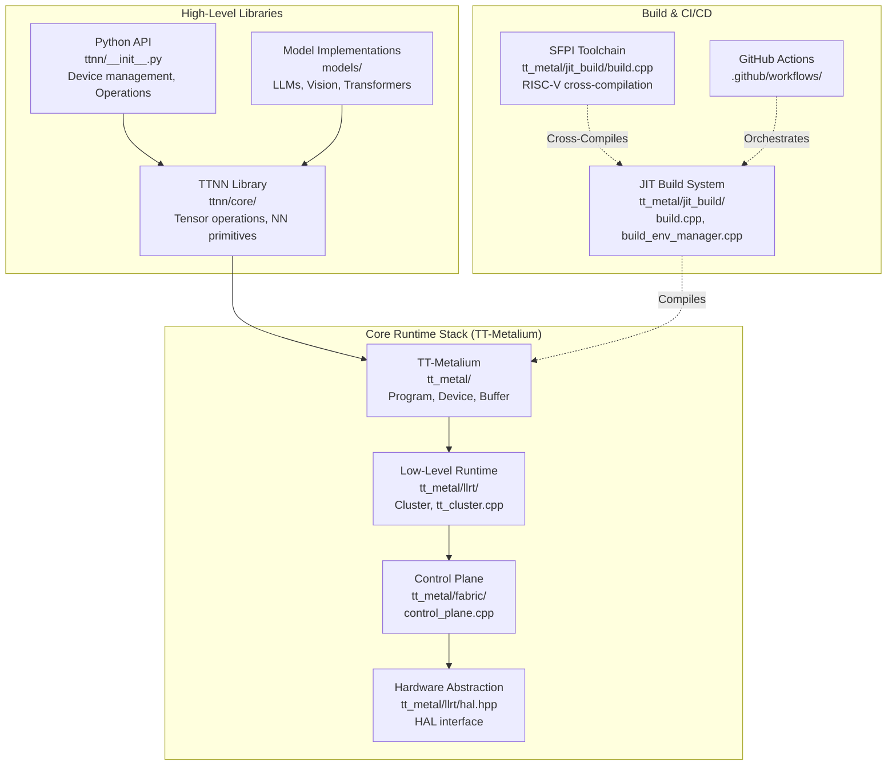


The tt-metal repository is organized into three primary layers that build upon each other, from low-level hardware control to high-level neural network operations.

**Diagram 1: Repository Architecture Overview**

**Sources:**[tt_metal/impl/context/metal_context.cpp 21-35](https://github.com/tenstorrent/tt-metal/blob/f30f8df0/tt_metal/impl/context/metal_context.cpp#L21-L35)[tt_metal/jit_build/build.cpp 101-140](https://github.com/tenstorrent/tt-metal/blob/f30f8df0/tt_metal/jit_build/build.cpp#L101-L140)[tt_metal/llrt/tt_cluster.cpp 31-41](https://github.com/tenstorrent/tt-metal/blob/f30f8df0/tt_metal/llrt/tt_cluster.cpp#L31-L41)

* * *

## Core Runtime Components

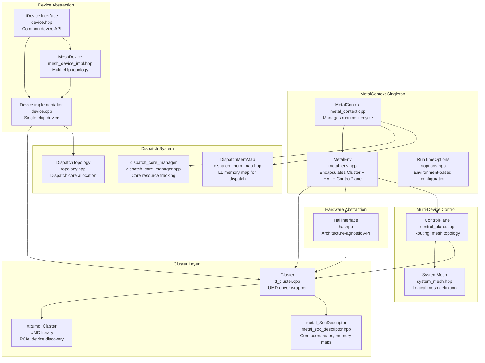


The runtime is centered around `MetalContext`, a singleton that manages the lifecycle of all runtime subsystems. The initialization creates a dependency chain from low-level cluster access through device abstraction to program execution.

**Diagram 2: Core Runtime Entity Space**

**Sources:**[tt_metal/impl/context/metal_context.hpp 52-108](https://github.com/tenstorrent/tt-metal/blob/f30f8df0/tt_metal/impl/context/metal_context.hpp#L52-L108)[tt_metal/impl/context/metal_context.cpp 19-49](https://github.com/tenstorrent/tt-metal/blob/f30f8df0/tt_metal/impl/context/metal_context.cpp#L19-L49)[tt_metal/llrt/tt_cluster.hpp 61-135](https://github.com/tenstorrent/tt-metal/blob/f30f8df0/tt_metal/llrt/tt_cluster.hpp#L61-L135)[tt_metal/llrt/rtoptions.hpp 153-215](https://github.com/tenstorrent/tt-metal/blob/f30f8df0/tt_metal/llrt/rtoptions.hpp#L153-L215)

* * *

## Initialization Flow
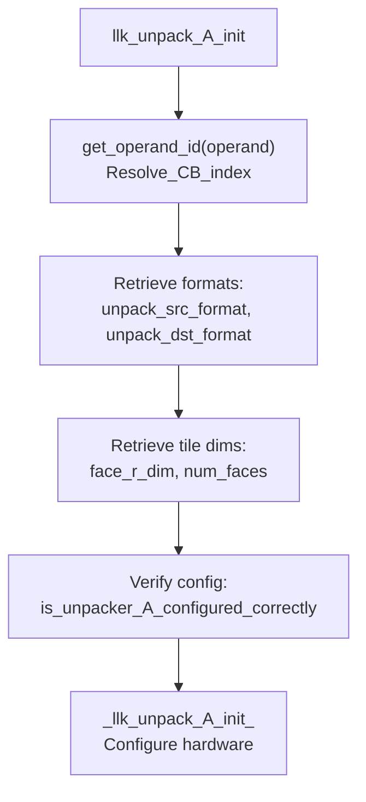

The hardware configuration prepares the unpacker unit for the specified source and destination data formats and tile layouts.

**Template parameters controlling behavior:**

- `BType`: Broadcast type (defined in `ckernel::BroadcastType`), e.g., `NONE`, `ROW`, `COL`, `SCALAR`.
- `acc_to_dest`: Whether to accumulate results directly to destination register.
- `binary_reuse_dest`: Binary reuse flag (defined in `ckernel::EltwiseBinaryReuseDestType`).
- `unpack_to_dest`: Whether to unpack directly to the destination (bypassing SRCA).

Sources:
[tt_metal/hw/ckernels/wormhole_b0/metal/llk_api/llk_unpack_A_api.h:13-41](),
[tt_metal/hw/ckernels/blackhole/metal/llk_api/llk_unpack_A_api.h:13-41]()
```


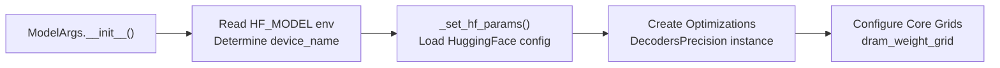

**Initialization Code Path:**
- User creates `ModelArgs` instance: [models/tt_transformers/tests/test_model.py:120-130]()
- Constructor processes parameters: [models/tt_transformers/tt/model_config.py:401-609]()
- Loads HuggingFace parameters: [models/tt_transformers/tt/model_config.py:1264-1428]()
- Establishes optimization settings: [models/tt_transformers/tt/model_config.py:571-578]()
```


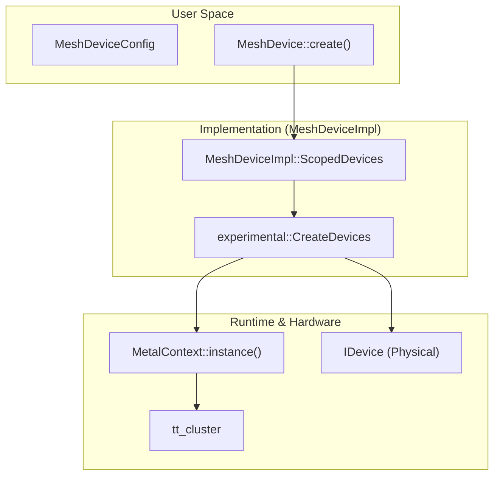


System initialization proceeds through several phases, establishing infrastructure for hardware communication, memory management, and program dispatch.

**Diagram 3: System Initialization Sequence**

**Key Initialization Steps:**

1.   **Cluster and HAL Setup**: Detects hardware via UMD and establishes architecture-specific hardware abstraction (HAL). `Cluster` identifies board types like N150, N300, or Galaxy [tt_metal/llrt/tt_cluster.cpp 87-120](https://github.com/tenstorrent/tt-metal/blob/f30f8df0/tt_metal/llrt/tt_cluster.cpp#L87-L120)
2.   **Control Plane Initialization**: The `ControlPlane` is accessed via `MetalContext` to manage the Ethernet fabric, routing tables, and mesh topology [tt_metal/impl/context/metal_context.cpp 138-143](https://github.com/tenstorrent/tt-metal/blob/f30f8df0/tt_metal/impl/context/metal_context.cpp#L138-L143)
3.   **Dispatch Configuration**: `MetalContext::initialize` resolves the `DispatchCoreConfig` based on the cluster architecture and fabric settings, then initializes the `dispatch_core_manager`[tt_metal/impl/context/metal_context.cpp 172-179](https://github.com/tenstorrent/tt-metal/blob/f30f8df0/tt_metal/impl/context/metal_context.cpp#L172-L179)
4.   **JIT Environment**: The `JitBuildEnv` is initialized with architecture-specific flags, include paths for SFPI, and profiler/watcher defines [tt_metal/jit_build/build.cpp 101-210](https://github.com/tenstorrent/tt-metal/blob/f30f8df0/tt_metal/jit_build/build.cpp#L101-L210)

**Sources:**[tt_metal/impl/context/metal_context.cpp 136-150](https://github.com/tenstorrent/tt-metal/blob/f30f8df0/tt_metal/impl/context/metal_context.cpp#L136-L150)[tt_metal/llrt/tt_cluster.cpp 52-71](https://github.com/tenstorrent/tt-metal/blob/f30f8df0/tt_metal/llrt/tt_cluster.cpp#L52-L71)[tt_metal/jit_build/build.cpp 101-140](https://github.com/tenstorrent/tt-metal/blob/f30f8df0/tt_metal/jit_build/build.cpp#L101-L140)

* * *

## Multi-Device Architecture

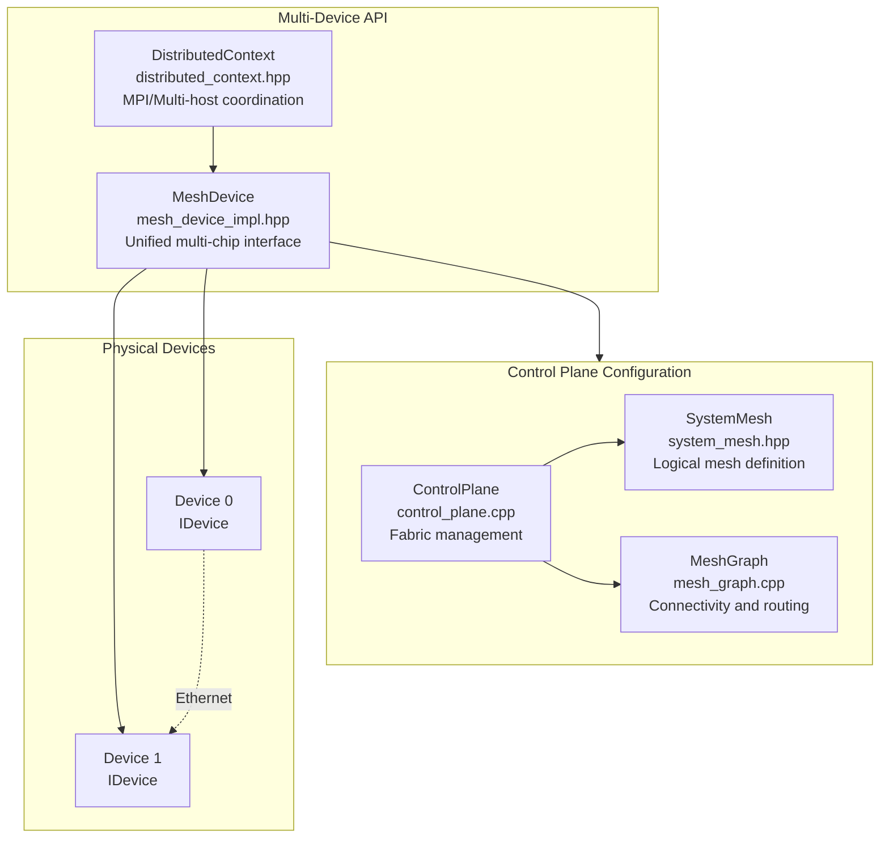

**Control Plane and Fabric:**
-   **Mesh Topology Management**: `ControlPlane` calculates routing paths and manages fabric node IDs. The system supports various board configurations via `MeshGraph` [tt_metal/fabric/control_plane.cpp:47-63]().
-   **Mesh Device Implementation**: `MeshDevice` handles the lifecycle of physical devices within a mesh, ensuring they are correctly mapped to a `ContextId` and shared `MetalContext` [tt_metal/impl/context/metal_context.cpp:108-122]().
-   **Routing Table Generation**: The `ControlPlane` generates fixed ASIC position pinnings for topologies like Galaxy to ensure link alignment with fabric mesh corner nodes [tt_metal/fabric/control_plane.cpp:85-117]().
```


For multi-chip systems, `MeshDevice` provides a unified abstraction over a grid of chips, while the `ControlPlane` manages routing across the Ethernet fabric.

**Diagram 4: Multi-Device Mesh Architecture**

**Control Plane and Fabric:**

*   **Mesh Topology Management**: `ControlPlane` calculates routing paths and manages fabric node IDs. The system supports various board configurations via `MeshGraph`[tt_metal/fabric/control_plane.cpp 47-63](https://github.com/tenstorrent/tt-metal/blob/f30f8df0/tt_metal/fabric/control_plane.cpp#L47-L63)
*   **Mesh Device Implementation**: `MeshDevice` handles the lifecycle of physical devices within a mesh, ensuring they are correctly mapped to a `ContextId` and shared `MetalContext`[tt_metal/impl/context/metal_context.cpp 108-122](https://github.com/tenstorrent/tt-metal/blob/f30f8df0/tt_metal/impl/context/metal_context.cpp#L108-L122)
*   **Routing Table Generation**: The `ControlPlane` generates fixed ASIC position pinnings for topologies like Galaxy to ensure link alignment with fabric mesh corner nodes [tt_metal/fabric/control_plane.cpp 85-117](https://github.com/tenstorrent/tt-metal/blob/f30f8df0/tt_metal/fabric/control_plane.cpp#L85-L117)

**Sources:**[tt_metal/impl/context/metal_context.cpp 137-143](https://github.com/tenstorrent/tt-metal/blob/f30f8df0/tt_metal/impl/context/metal_context.cpp#L137-L143)[tt_metal/fabric/control_plane.cpp 42-63](https://github.com/tenstorrent/tt-metal/blob/f30f8df0/tt_metal/fabric/control_plane.cpp#L42-L63)[tt_metal/impl/dispatch/topology.cpp 153-170](https://github.com/tenstorrent/tt-metal/blob/f30f8df0/tt_metal/impl/dispatch/topology.cpp#L153-L170)

* * *

## Architecture Configuration Matrix

| Platform | Architecture | Fast Dispatch | Multi-Device | Fabric Support |
| --- | --- | --- | --- | --- |
| N150 | Wormhole | ✓ | - | - |
| N300 | Wormhole | ✓ | 2 chips | Base routing |
| T3K | Wormhole | ✓ | 8 chips | Full fabric |
| Blackhole | Blackhole | ✓ | 1-8 chips | Full fabric |
| Galaxy | Wormhole | ✓ | 32 chips | Full fabric |

**Sources:**[tt_metal/llrt/tt_cluster.cpp 130-170](https://github.com/tenstorrent/tt-metal/blob/f30f8df0/tt_metal/llrt/tt_cluster.cpp#L130-L170)[tt_metal/llrt/rtoptions.cpp 94-105](https://github.com/tenstorrent/tt-metal/blob/f30f8df0/tt_metal/llrt/rtoptions.cpp#L94-L105)[tt_metal/fabric/control_plane.cpp 162-165](https://github.com/tenstorrent/tt-metal/blob/f30f8df0/tt_metal/fabric/control_plane.cpp#L162-L165)

Dismiss
Refresh this wiki

Enter email to refresh


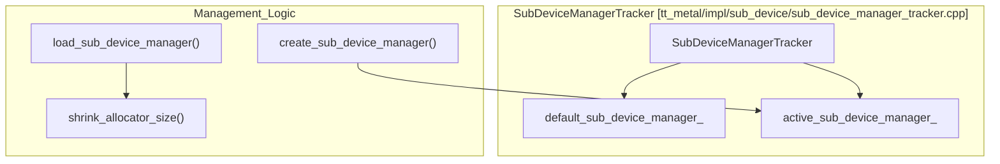

### Related: Watcher System Settings

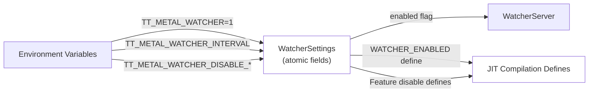

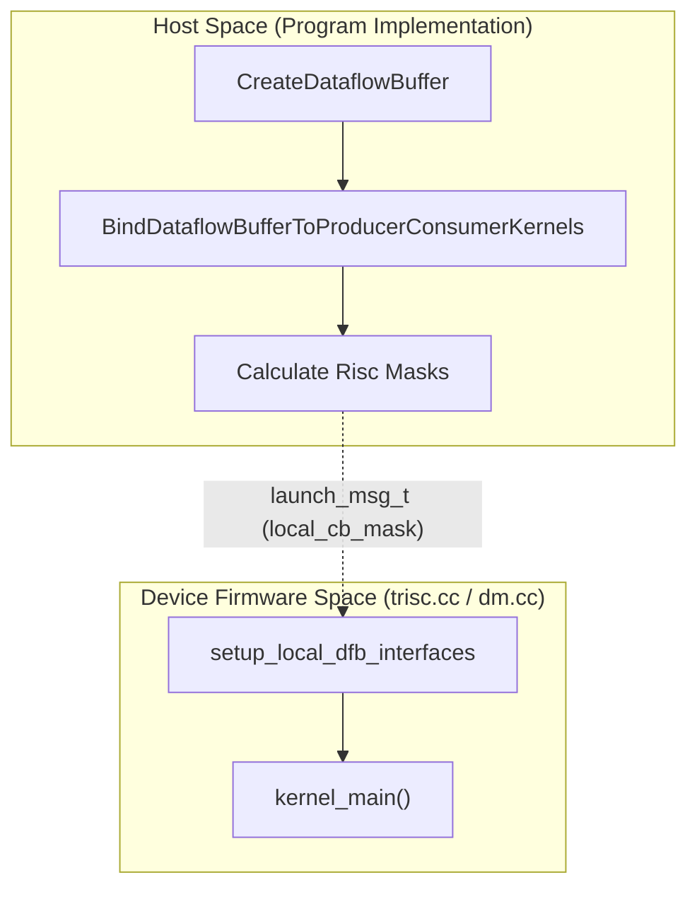

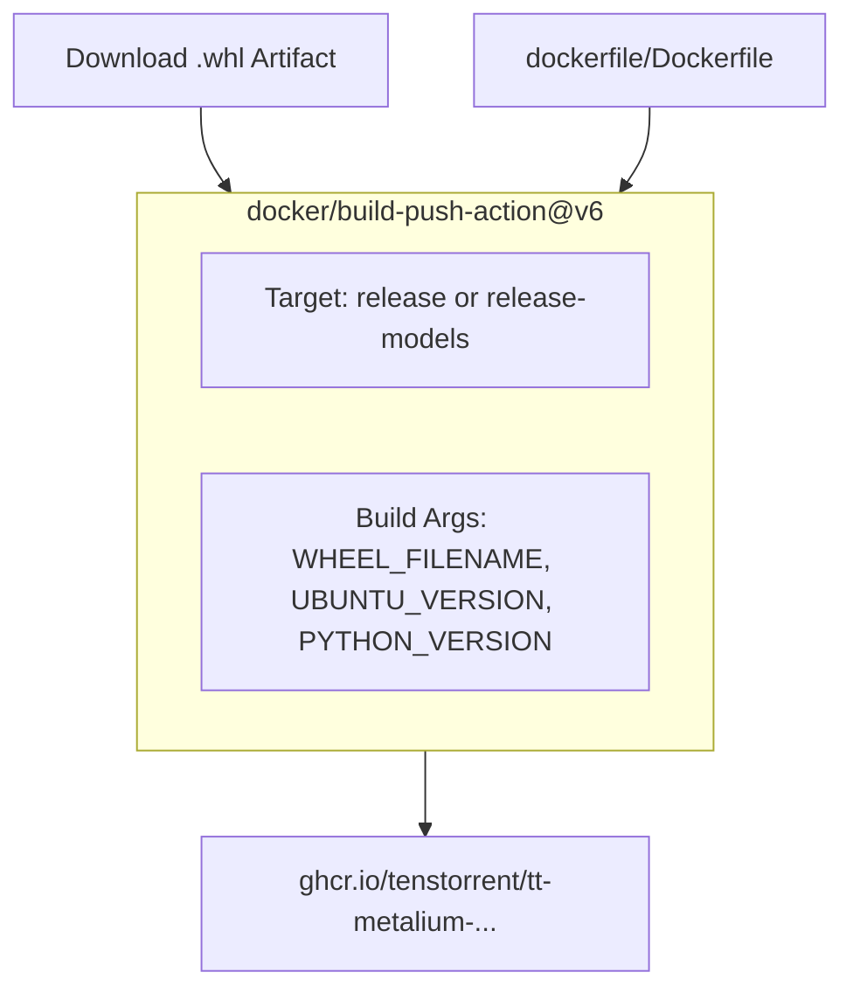

### Related: Matrix Generation and Configuration

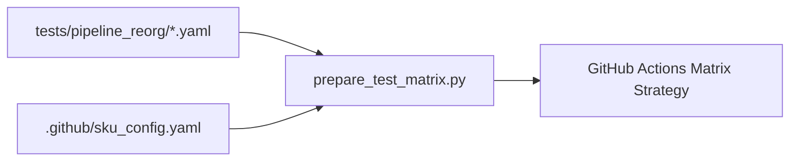

### Related: Multi-Host Execution Flow

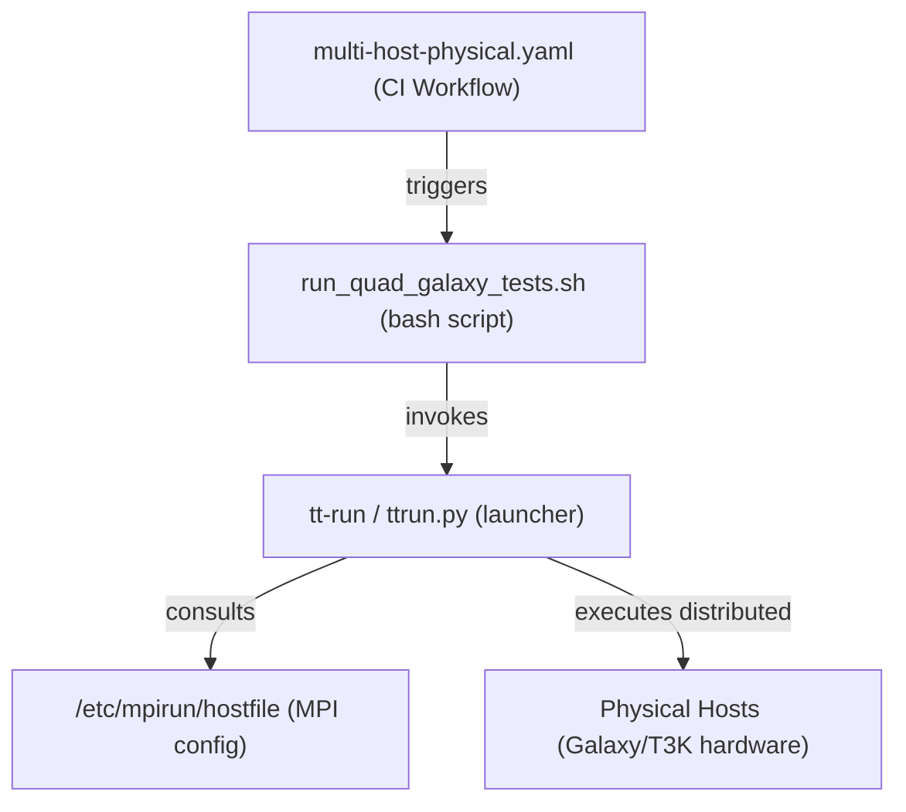
