# Installation and Setup

Relevant source files
*   [.github/actions/find-changed-files/action.yml](https://github.com/tenstorrent/tt-metal/blob/f30f8df0/.github/actions/find-changed-files/action.yml)
*   [.github/actions/manual-docker-bake/action.yml](https://github.com/tenstorrent/tt-metal/blob/f30f8df0/.github/actions/manual-docker-bake/action.yml)
*   [.github/actions/report-failure/action.yml](https://github.com/tenstorrent/tt-metal/blob/f30f8df0/.github/actions/report-failure/action.yml)
*   [.github/pull_request_template.md](https://github.com/tenstorrent/tt-metal/blob/f30f8df0/.github/pull_request_template.md?plain=1)
*   [.github/scripts/compute-platform-data.sh](https://github.com/tenstorrent/tt-metal/blob/f30f8df0/.github/scripts/compute-platform-data.sh)
*   [.github/scripts/utils/find-changed-files.sh](https://github.com/tenstorrent/tt-metal/blob/f30f8df0/.github/scripts/utils/find-changed-files.sh)
*   [.github/scripts/utils/model-charts-sync.py](https://github.com/tenstorrent/tt-metal/blob/f30f8df0/.github/scripts/utils/model-charts-sync.py)
*   [.github/workflows/basic.yaml](https://github.com/tenstorrent/tt-metal/blob/f30f8df0/.github/workflows/basic.yaml)
*   [.github/workflows/build-artifact.yaml](https://github.com/tenstorrent/tt-metal/blob/f30f8df0/.github/workflows/build-artifact.yaml)
*   [.github/workflows/build-docker-artifact.yaml](https://github.com/tenstorrent/tt-metal/blob/f30f8df0/.github/workflows/build-docker-artifact.yaml)
*   [.github/workflows/build-docker-tools.yaml](https://github.com/tenstorrent/tt-metal/blob/f30f8df0/.github/workflows/build-docker-tools.yaml)
*   [.github/workflows/build-evaluation-image.yaml](https://github.com/tenstorrent/tt-metal/blob/f30f8df0/.github/workflows/build-evaluation-image.yaml)
*   [.github/workflows/build-wrapper.yaml](https://github.com/tenstorrent/tt-metal/blob/f30f8df0/.github/workflows/build-wrapper.yaml)
*   [.github/workflows/clang-tidy-reusable.yaml](https://github.com/tenstorrent/tt-metal/blob/f30f8df0/.github/workflows/clang-tidy-reusable.yaml)
*   [.github/workflows/code-analysis.yaml](https://github.com/tenstorrent/tt-metal/blob/f30f8df0/.github/workflows/code-analysis.yaml)
*   [.github/workflows/merge-gate.yaml](https://github.com/tenstorrent/tt-metal/blob/f30f8df0/.github/workflows/merge-gate.yaml)
*   [.github/workflows/pr-description-inject-branch-name.yaml](https://github.com/tenstorrent/tt-metal/blob/f30f8df0/.github/workflows/pr-description-inject-branch-name.yaml)
*   [.github/workflows/pr-gate.yaml](https://github.com/tenstorrent/tt-metal/blob/f30f8df0/.github/workflows/pr-gate.yaml)
*   [.github/workflows/sdk-examples.yaml](https://github.com/tenstorrent/tt-metal/blob/f30f8df0/.github/workflows/sdk-examples.yaml)
*   [.github/workflows/smoke.yaml](https://github.com/tenstorrent/tt-metal/blob/f30f8df0/.github/workflows/smoke.yaml)
*   [.github/workflows/ttsim.yaml](https://github.com/tenstorrent/tt-metal/blob/f30f8df0/.github/workflows/ttsim.yaml)
*   [CMakeLists.txt](https://github.com/tenstorrent/tt-metal/blob/f30f8df0/CMakeLists.txt)
*   [CONTRIBUTING.md](https://github.com/tenstorrent/tt-metal/blob/f30f8df0/CONTRIBUTING.md?plain=1)
*   [INSTALLING.md](https://github.com/tenstorrent/tt-metal/blob/f30f8df0/INSTALLING.md?plain=1)
*   [MANIFEST.in](https://github.com/tenstorrent/tt-metal/blob/f30f8df0/MANIFEST.in)
*   [README.md](https://github.com/tenstorrent/tt-metal/blob/f30f8df0/README.md?plain=1)
*   [build_metal.sh](https://github.com/tenstorrent/tt-metal/blob/f30f8df0/build_metal.sh)
*   [cmake/linking.cmake](https://github.com/tenstorrent/tt-metal/blob/f30f8df0/cmake/linking.cmake)
*   [cmake/project_options.cmake](https://github.com/tenstorrent/tt-metal/blob/f30f8df0/cmake/project_options.cmake)
*   [create_venv.sh](https://github.com/tenstorrent/tt-metal/blob/f30f8df0/create_venv.sh)
*   [dockerfile/Dockerfile](https://github.com/tenstorrent/tt-metal/blob/f30f8df0/dockerfile/Dockerfile)
*   [dockerfile/Dockerfile.basic-dev](https://github.com/tenstorrent/tt-metal/blob/f30f8df0/dockerfile/Dockerfile.basic-dev)
*   [dockerfile/Dockerfile.evaluation](https://github.com/tenstorrent/tt-metal/blob/f30f8df0/dockerfile/Dockerfile.evaluation)
*   [dockerfile/Dockerfile.tools](https://github.com/tenstorrent/tt-metal/blob/f30f8df0/dockerfile/Dockerfile.tools)
*   [dockerfile/scripts/install-ccache.sh](https://github.com/tenstorrent/tt-metal/blob/f30f8df0/dockerfile/scripts/install-ccache.sh)
*   [docs/source/tt-metalium/tools/triage.rst](https://github.com/tenstorrent/tt-metal/blob/f30f8df0/docs/source/tt-metalium/tools/triage.rst)
*   [install_dependencies.sh](https://github.com/tenstorrent/tt-metal/blob/f30f8df0/install_dependencies.sh)
*   [models/README.md](https://github.com/tenstorrent/tt-metal/blob/f30f8df0/models/README.md?plain=1)
*   [models/demos/deepseek_v3/README.md](https://github.com/tenstorrent/tt-metal/blob/f30f8df0/models/demos/deepseek_v3/README.md?plain=1)
*   [models/demos/llama3_70b_galaxy/PERF.md](https://github.com/tenstorrent/tt-metal/blob/f30f8df0/models/demos/llama3_70b_galaxy/PERF.md?plain=1)
*   [models/demos/llama3_70b_galaxy/README.md](https://github.com/tenstorrent/tt-metal/blob/f30f8df0/models/demos/llama3_70b_galaxy/README.md?plain=1)
*   [models/demos/multimodal/gemma3/README.md](https://github.com/tenstorrent/tt-metal/blob/f30f8df0/models/demos/multimodal/gemma3/README.md?plain=1)
*   [models/demos/t3000/llama3_70b/README.md](https://github.com/tenstorrent/tt-metal/blob/f30f8df0/models/demos/t3000/llama3_70b/README.md?plain=1)
*   [models/demos/t3000/llama3_70b/setup_llama.sh](https://github.com/tenstorrent/tt-metal/blob/f30f8df0/models/demos/t3000/llama3_70b/setup_llama.sh)
*   [models/demos/wormhole/qwen3_embedding_8b/demo/generator_vllm.py](https://github.com/tenstorrent/tt-metal/blob/f30f8df0/models/demos/wormhole/qwen3_embedding_8b/demo/generator_vllm.py)
*   [models/docs/MODEL_HYBRID_TP_DP.md](https://github.com/tenstorrent/tt-metal/blob/f30f8df0/models/docs/MODEL_HYBRID_TP_DP.md?plain=1)
*   [models/docs/MODEL_UPDATES.md](https://github.com/tenstorrent/tt-metal/blob/f30f8df0/models/docs/MODEL_UPDATES.md?plain=1)
*   [models/docs/model_bring_up.md](https://github.com/tenstorrent/tt-metal/blob/f30f8df0/models/docs/model_bring_up.md?plain=1)
*   [pyproject.toml](https://github.com/tenstorrent/tt-metal/blob/f30f8df0/pyproject.toml)
*   [releases/README.md](https://github.com/tenstorrent/tt-metal/blob/f30f8df0/releases/README.md?plain=1)
*   [scripts/install-uv.sh](https://github.com/tenstorrent/tt-metal/blob/f30f8df0/scripts/install-uv.sh)
*   [scripts/install_debugger.sh](https://github.com/tenstorrent/tt-metal/blob/f30f8df0/scripts/install_debugger.sh)
*   [scripts/tracing/.gitattributes](https://github.com/tenstorrent/tt-metal/blob/f30f8df0/scripts/tracing/.gitattributes)
*   [scripts/tracing/.gitignore](https://github.com/tenstorrent/tt-metal/blob/f30f8df0/scripts/tracing/.gitignore)
*   [scripts/tracing/README.md](https://github.com/tenstorrent/tt-metal/blob/f30f8df0/scripts/tracing/README.md?plain=1)
*   [scripts/tracing/context.txt](https://github.com/tenstorrent/tt-metal/blob/f30f8df0/scripts/tracing/context.txt)
*   [scripts/tracing/questions.txt](https://github.com/tenstorrent/tt-metal/blob/f30f8df0/scripts/tracing/questions.txt)
*   [scripts/tracing/run.py](https://github.com/tenstorrent/tt-metal/blob/f30f8df0/scripts/tracing/run.py)
*   [scripts/tracing/system-prompt.txt](https://github.com/tenstorrent/tt-metal/blob/f30f8df0/scripts/tracing/system-prompt.txt)
*   [setup.py](https://github.com/tenstorrent/tt-metal/blob/f30f8df0/setup.py)
*   [tech_reports/Debugging/Kernel_Debugging_Tips.md](https://github.com/tenstorrent/tt-metal/blob/f30f8df0/tech_reports/Debugging/Kernel_Debugging_Tips.md?plain=1)
*   [tech_reports/LLMs/vLLM_integration.md](https://github.com/tenstorrent/tt-metal/blob/f30f8df0/tech_reports/LLMs/vLLM_integration.md?plain=1)
*   [tests/pipeline_reorg/ttnn-tests.yaml](https://github.com/tenstorrent/tt-metal/blob/f30f8df0/tests/pipeline_reorg/ttnn-tests.yaml)
*   [tests/pipeline_reorg/ttsim-skip-list.yaml](https://github.com/tenstorrent/tt-metal/blob/f30f8df0/tests/pipeline_reorg/ttsim-skip-list.yaml)
*   [tests/ttnn/nightly/unit_tests/operations/experimental/deepseek_prefill/test_deepseek_moe_post_combine_reduce.py](https://github.com/tenstorrent/tt-metal/blob/f30f8df0/tests/ttnn/nightly/unit_tests/operations/experimental/deepseek_prefill/test_deepseek_moe_post_combine_reduce.py)
*   [tests/ttnn/nightly/unit_tests/operations/experimental/deepseek_prefill/test_deepseek_prefill_extract.py](https://github.com/tenstorrent/tt-metal/blob/f30f8df0/tests/ttnn/nightly/unit_tests/operations/experimental/deepseek_prefill/test_deepseek_prefill_extract.py)
*   [tests/ttnn/nightly/unit_tests/operations/experimental/deepseek_prefill/test_deepseek_prefill_insert.py](https://github.com/tenstorrent/tt-metal/blob/f30f8df0/tests/ttnn/nightly/unit_tests/operations/experimental/deepseek_prefill/test_deepseek_prefill_insert.py)
*   [tests/ttnn/nightly/unit_tests/operations/experimental/deepseek_prefill/test_moe_grouped_topk.py](https://github.com/tenstorrent/tt-metal/blob/f30f8df0/tests/ttnn/nightly/unit_tests/operations/experimental/deepseek_prefill/test_moe_grouped_topk.py)
*   [tests/ttnn/nightly/unit_tests/operations/experimental/deepseek_prefill/test_single_routed_expert.py](https://github.com/tenstorrent/tt-metal/blob/f30f8df0/tests/ttnn/nightly/unit_tests/operations/experimental/deepseek_prefill/test_single_routed_expert.py)
*   [tt_metal/python_env/requirements-dev.txt](https://github.com/tenstorrent/tt-metal/blob/f30f8df0/tt_metal/python_env/requirements-dev.txt)
*   [ttnn/ttnn/download_sfpi.py](https://github.com/tenstorrent/tt-metal/blob/f30f8df0/ttnn/ttnn/download_sfpi.py)

## Purpose and Scope

This document provides comprehensive guidance for installing and configuring the TT-Metal software stack. It covers prerequisite setup, multiple deployment options (PyPI, Docker, source builds), environment configuration, and initial setup using `build_metal.sh` and `install_dependencies.sh`.

**Sources:**[CMakeLists.txt 28-32](https://github.com/tenstorrent/tt-metal/blob/f30f8df0/CMakeLists.txt#L28-L32)[INSTALLING.md 1-10](https://github.com/tenstorrent/tt-metal/blob/f30f8df0/INSTALLING.md?plain=1#L1-L10)

* * *

## Installation Method Selection

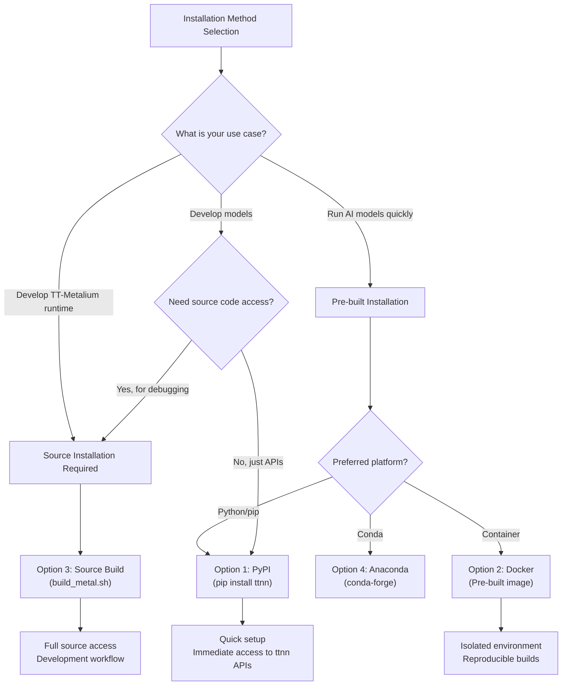


The following decision tree helps determine the appropriate installation method based on your use case:

**Sources:**[INSTALLING.md 53-72](https://github.com/tenstorrent/tt-metal/blob/f30f8df0/INSTALLING.md?plain=1#L53-L72)[INSTALLING.md 119-126](https://github.com/tenstorrent/tt-metal/blob/f30f8df0/INSTALLING.md?plain=1#L119-L126)[INSTALLING.md 169-180](https://github.com/tenstorrent/tt-metal/blob/f30f8df0/INSTALLING.md?plain=1#L169-L180)[dockerfile/Dockerfile 1-10](https://github.com/tenstorrent/tt-metal/blob/f30f8df0/dockerfile/Dockerfile#L1-L10)

* * *

## Prerequisites

### Hardware and Driver Requirements

Before software installation, Tenstorrent hardware must be physically installed with compatible drivers. Specific versions are required for Wormhole Galaxy and Blackhole systems to ensure stability.

| Component | Required Version (Galaxy/Blackhole) |
| --- | --- |
| Driver (TT-KMD) | v2.8.0 or above |
| Firmware (TT-Flash) | v19.8.1 (fw_pack-19.8.1.fwbundle) |
| TT-SMI | v5.0.0 or above |
| OS | Ubuntu 22.04 (recommended) |

**Sources:**[INSTALLING.md 28-33](https://github.com/tenstorrent/tt-metal/blob/f30f8df0/INSTALLING.md?plain=1#L28-L33)[INSTALLING.md 40-45](https://github.com/tenstorrent/tt-metal/blob/f30f8df0/INSTALLING.md?plain=1#L40-L45)

### Software Dependencies

#### Automated Dependency Installation

The `install_dependencies.sh` script (and the `TT-Installer` wrapper) automates the setup of system packages. It installs necessary tools including compilers, Python development headers, and communication libraries.

**Key Dependencies installed:**

*   **Compilers:** GCC 12 is used for Ubuntu 22.04 [INSTALLING.md 31](https://github.com/tenstorrent/tt-metal/blob/f30f8df0/INSTALLING.md?plain=1#L31-L31) In CI environments, `clang-20` and `gcc-12` are specified [dockerfile/Dockerfile 150-155](https://github.com/tenstorrent/tt-metal/blob/f30f8df0/dockerfile/Dockerfile#L150-L155)[.github/workflows/ttsim.yaml 65-66](https://github.com/tenstorrent/tt-metal/blob/f30f8df0/.github/workflows/ttsim.yaml#L65-L66)
*   **Build Tools:**`cmake`, `ninja-build`, and `mold` for fast linking [CMakeLists.txt 1-20](https://github.com/tenstorrent/tt-metal/blob/f30f8df0/CMakeLists.txt#L1-L20)[dockerfile/Dockerfile 154-155](https://github.com/tenstorrent/tt-metal/blob/f30f8df0/dockerfile/Dockerfile#L154-L155)
*   **Distributed:** OpenMPI dependencies (v5.0.7-ulfm) are required for multi-host compute [dockerfile/Dockerfile 90-95](https://github.com/tenstorrent/tt-metal/blob/f30f8df0/dockerfile/Dockerfile#L90-L95)[CMakeLists.txt 145](https://github.com/tenstorrent/tt-metal/blob/f30f8df0/CMakeLists.txt#L145-L145)
*   **Python:** Supported versions include 3.10, 3.11, and 3.12 [INSTALLING.md 170](https://github.com/tenstorrent/tt-metal/blob/f30f8df0/INSTALLING.md?plain=1#L170-L170)

**Sources:**[INSTALLING.md 19-47](https://github.com/tenstorrent/tt-metal/blob/f30f8df0/INSTALLING.md?plain=1#L19-L47)[dockerfile/Dockerfile 73-107](https://github.com/tenstorrent/tt-metal/blob/f30f8df0/dockerfile/Dockerfile#L73-L107)[CMakeLists.txt 145-146](https://github.com/tenstorrent/tt-metal/blob/f30f8df0/CMakeLists.txt#L145-L146)

* * *

## Installation Methods

### Option 1: Install from Binaries (PyPI)

Pre-compiled Python wheels provide the fastest path to using `ttnn` APIs.

To run demo models from the repository, additional development requirements and host-side performance tuning are required:

**Sources:**[INSTALLING.md 78-84](https://github.com/tenstorrent/tt-metal/blob/f30f8df0/INSTALLING.md?plain=1#L78-L84)[INSTALLING.md 95-100](https://github.com/tenstorrent/tt-metal/blob/f30f8df0/INSTALLING.md?plain=1#L95-L100)[tt_metal/python_env/requirements-dev.txt 1-40](https://github.com/tenstorrent/tt-metal/blob/f30f8df0/tt_metal/python_env/requirements-dev.txt#L1-L40)

* * *

### Option 2: Install from Docker

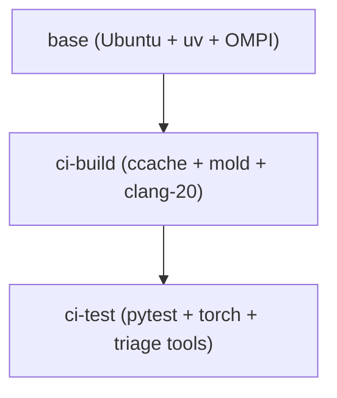

| Image Variant | Purpose | Key Components |
|-------------------|---------|----------------|
| `ci-build` | Compilation | ccache, mold, clang-20, yq [dockerfile/Dockerfile:150-157]() |
| `ci-test` | Validation | pytest 9.0.3, torch 2.11.0, triage requirements [dockerfile/Dockerfile:160-175](), [tt_metal/python_env/requirements-dev.txt:39-49]() |
| `release` | Deployment | Minimal runtime with pre-built wheels [INSTALLING.md:104-113]() |

**Key Configuration in Docker:**
- **uv Integration:** Uses `uv` for fast Python package management. `UV_PYTHON_INSTALL_DIR` ensures Python is accessible for multi-host use [dockerfile/Dockerfile:96-98]().
- **Virtual Environment:** Located at `/opt/venv` in CI images [dockerfile/Dockerfile:143-145]().
- **Linker Optimization:** Uses `mold` linker for significantly faster C++ linking [dockerfile/Dockerfile:154-155]().
```


The repository uses a multi-stage `Dockerfile` optimized with `uv` for dependency management.

**Build Stage Hierarchy:**

| Image Variant | Purpose | Key Components |
| --- | --- | --- |
| `ci-build` | Compilation | ccache, mold, clang-20, yq [dockerfile/Dockerfile 150-157](https://github.com/tenstorrent/tt-metal/blob/f30f8df0/dockerfile/Dockerfile#L150-L157) |
| `ci-test` | Validation | pytest 9.0.3, torch 2.11.0, triage requirements [dockerfile/Dockerfile 160-175](https://github.com/tenstorrent/tt-metal/blob/f30f8df0/dockerfile/Dockerfile#L160-L175)[tt_metal/python_env/requirements-dev.txt 39-49](https://github.com/tenstorrent/tt-metal/blob/f30f8df0/tt_metal/python_env/requirements-dev.txt#L39-L49) |
| `release` | Deployment | Minimal runtime with pre-built wheels [INSTALLING.md 104-113](https://github.com/tenstorrent/tt-metal/blob/f30f8df0/INSTALLING.md?plain=1#L104-L113) |

**Key Configuration in Docker:**

*   **uv Integration:** Uses `uv` for fast Python package management. `UV_PYTHON_INSTALL_DIR` ensures Python is accessible for multi-host use [dockerfile/Dockerfile 96-98](https://github.com/tenstorrent/tt-metal/blob/f30f8df0/dockerfile/Dockerfile#L96-L98)
*   **Virtual Environment:** Located at `/opt/venv` in CI images [dockerfile/Dockerfile 143-145](https://github.com/tenstorrent/tt-metal/blob/f30f8df0/dockerfile/Dockerfile#L143-L145)
*   **Linker Optimization:** Uses `mold` linker for significantly faster C++ linking [dockerfile/Dockerfile 154-155](https://github.com/tenstorrent/tt-metal/blob/f30f8df0/dockerfile/Dockerfile#L154-L155)

**Sources:**[dockerfile/Dockerfile 12-46](https://github.com/tenstorrent/tt-metal/blob/f30f8df0/dockerfile/Dockerfile#L12-L46)[dockerfile/Dockerfile 51-140](https://github.com/tenstorrent/tt-metal/blob/f30f8df0/dockerfile/Dockerfile#L51-L140)[.github/workflows/build-artifact.yaml 102-132](https://github.com/tenstorrent/tt-metal/blob/f30f8df0/.github/workflows/build-artifact.yaml#L102-L132)

* * *

### Option 3: Install from Source

Recommended for developers modifying the runtime or kernels.

#### Step 1: Clone Repository

Submodules in `tt_metal/third_party/umd` are mandatory; the root `CMakeLists.txt` will error out if they are missing [CMakeLists.txt 4-6](https://github.com/tenstorrent/tt-metal/blob/f30f8df0/CMakeLists.txt#L4-L6)

#### Step 2: Build the Library

**Option A: Build Script (Recommended)**

**Option B: Manual CMake** The build system defaults to `RelWithDebInfo` for single-config generators [CMakeLists.txt 20-23](https://github.com/tenstorrent/tt-metal/blob/f30f8df0/CMakeLists.txt#L20-L23)

| Config | Compiler Flags |
| --- | --- |
| `Debug` | `-O0 -g3 -ggnu-pubnames -DDEBUG -fno-omit-frame-pointer`[CMakeLists.txt 48-61](https://github.com/tenstorrent/tt-metal/blob/f30f8df0/CMakeLists.txt#L48-L61) |
| `RelWithDebInfo` | `-O3 -g3 -ggnu-pubnames -DDEBUG -fno-omit-frame-pointer`[CMakeLists.txt 48-64](https://github.com/tenstorrent/tt-metal/blob/f30f8df0/CMakeLists.txt#L48-L64) |

**Sources:**[INSTALLING.md 132-150](https://github.com/tenstorrent/tt-metal/blob/f30f8df0/INSTALLING.md?plain=1#L132-L150)[CMakeLists.txt 40-64](https://github.com/tenstorrent/tt-metal/blob/f30f8df0/CMakeLists.txt#L40-L64)

#### Step 3: Python Environment Setup

Use `create_venv.sh` to set up a local virtual environment.

**Sources:**[INSTALLING.md 158-162](https://github.com/tenstorrent/tt-metal/blob/f30f8df0/INSTALLING.md?plain=1#L158-L162)[create_venv.sh 1-10](https://github.com/tenstorrent/tt-metal/blob/f30f8df0/create_venv.sh#L1-L10)

* * *

## Build System Architecture

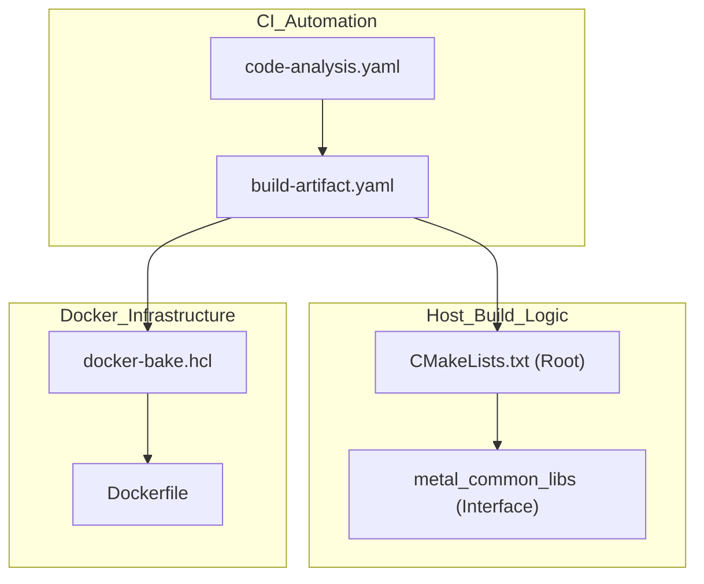


The following diagram maps the build system components to their code entities:

### Key Build Options (CMake)

*   `WITH_PYTHON_BINDINGS`: Enables Python API support [CMakeLists.txt 137](https://github.com/tenstorrent/tt-metal/blob/f30f8df0/CMakeLists.txt#L137-L137)
*   `ENABLE_DISTRIBUTED`: Adds OpenMPI dependency for multi-host compute [CMakeLists.txt 145](https://github.com/tenstorrent/tt-metal/blob/f30f8df0/CMakeLists.txt#L145-L145)
*   `TT_LTO_ENABLED`: Enables Link Time Optimization [CMakeLists.txt 142](https://github.com/tenstorrent/tt-metal/blob/f30f8df0/CMakeLists.txt#L142-L142)
*   `ENABLE_CCACHE`: Enables compilation caching if available [CMakeLists.txt 112-115](https://github.com/tenstorrent/tt-metal/blob/f30f8df0/CMakeLists.txt#L112-L115)
*   `BUILD_PROGRAMMING_EXAMPLES`: Controls building of programming examples [CMakeLists.txt 138](https://github.com/tenstorrent/tt-metal/blob/f30f8df0/CMakeLists.txt#L138-L138)

**Sources:**[CMakeLists.txt 135-147](https://github.com/tenstorrent/tt-metal/blob/f30f8df0/CMakeLists.txt#L135-L147)[CMakeLists.txt 112-115](https://github.com/tenstorrent/tt-metal/blob/f30f8df0/CMakeLists.txt#L112-L115)[.github/workflows/build-artifact.yaml 9-30](https://github.com/tenstorrent/tt-metal/blob/f30f8df0/.github/workflows/build-artifact.yaml#L9-L30)

* * *

## Simulation and Testing

The repository supports testing on hardware simulators like `TTSim`.

*   **TTSim Integration:** Tests can run against `libttsim.so` using `TT_METAL_SIMULATOR` environment variables [.github/workflows/ttsim.yaml 68-71](https://github.com/tenstorrent/tt-metal/blob/f30f8df0/.github/workflows/ttsim.yaml#L68-L71)
*   **Slow Dispatch:** Simulator runs typically use `TT_METAL_SLOW_DISPATCH_MODE=1`[.github/workflows/ttsim.yaml 70](https://github.com/tenstorrent/tt-metal/blob/f30f8df0/.github/workflows/ttsim.yaml#L70-L70)
*   **Skip Lists:** Certain tests are excluded from simulation due to timeouts or numeric mismatches [tests/pipeline_reorg/ttsim-skip-list.yaml 1-25](https://github.com/tenstorrent/tt-metal/blob/f30f8df0/tests/pipeline_reorg/ttsim-skip-list.yaml#L1-L25)

**Sources:**[.github/workflows/ttsim.yaml 39-71](https://github.com/tenstorrent/tt-metal/blob/f30f8df0/.github/workflows/ttsim.yaml#L39-L71)[tests/pipeline_reorg/ttsim-skip-list.yaml 7-25](https://github.com/tenstorrent/tt-metal/blob/f30f8df0/tests/pipeline_reorg/ttsim-skip-list.yaml#L7-L25)

* * *

## Verification

### 1. Functional Verification

Run a basic `ttnn` operation to verify the device is accessible.

### 2. Unit Testing

The repository includes GTest-based unit tests and Python pytests.

**Sources:**[INSTALLING.md 183-195](https://github.com/tenstorrent/tt-metal/blob/f30f8df0/INSTALLING.md?plain=1#L183-L195)[.github/workflows/smoke.yaml 103-119](https://github.com/tenstorrent/tt-metal/blob/f30f8df0/.github/workflows/smoke.yaml#L103-L119)

Dismiss
Refresh this wiki

Enter email to refresh

## Additional Diagrams


#### Automated CB Configuration


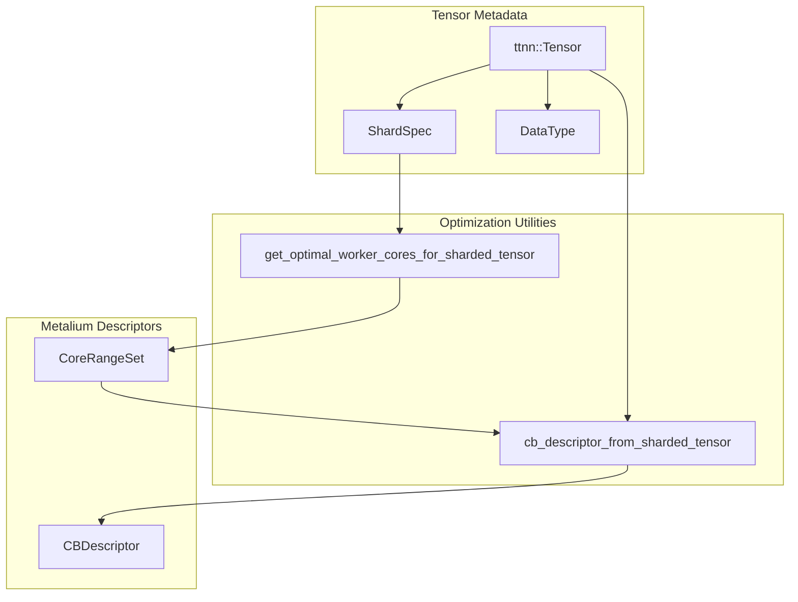
**Diagram: Sharded Tensor Optimization Flow**

Sources: [ttnn/api/ttnn/tensor/tensor_utils.hpp:34-95](), [ttnn/core/tensor/tensor_utils.cpp:35-70]()

---
```


### Docker Image Hierarchy


```mermaid
graph TB
    subgraph "Base_Images"
        "Ubuntu_Mirror"["mirror.gcr.io/ubuntu:22.04 or 24.04"]
        "Uv_Layer"["ghcr.io/astral-sh/uv"]
    end

    subgraph "Tool_Layers"
        "Cmake_Layer"["cmake-layer"]
        "Sfpi_Layer"["sfpi-layer"]
        "OpenMPI_Layer"["openmpi-layer"]
    end

    subgraph "TT-Metal_Image_Hierarchy"
        "Base"["base (dockerfile/Dockerfile:73-131)<br/>Runtime foundation<br/>SFPI, Python, uv, system libs"]
        "CI_Build"["ci-build (dockerfile/Dockerfile:136-173)<br/>Build tools<br/>ccache, doxygen, mold, clang-20"]
        "CI_Test"["ci-test (dockerfile/Dockerfile:176-213)<br/>Test dependencies<br/>PyTorch CPU, pytest, requirements-dev.txt"]
        "Dev"["dev (dockerfile/Dockerfile:216-274)<br/>Development tools<br/>gdb, emacs, vim, debuggers"]
        "Basic_Dev"["basic-dev (dockerfile/Dockerfile.basic-dev)<br/>Minimal build image"]
    end

    "Ubuntu_Mirror" --> "Base"
    "Uv_Layer" --> "Base"
    "Cmake_Layer" --> "Base"
    "Sfpi_Layer" --> "Base"
    "OpenMPI_Layer" --> "Base"
    
    "Base" --> "CI_Build"
    "CI_Build" --> "CI_Test"
    "CI_Test" --> "Dev"
```

**Image Purpose Matrix**

| Image Name | Primary Use | Key Features | Typical Users |
|------------|-------------|--------------|---------------|
| `base` | Runtime foundation | SFPI compiler, `uv`, Python venv, OpenMPI | All derived images |
| `ci-build` | Compilation | `ccache`, `mold` linker, `clang-20`, `yq` | CI build jobs |
| `ci-test` | Test execution | PyTorch CPU, `pytest`, `requirements-dev.txt` | CI test jobs |
| `dev` | Interactive development | `gdb`, debuggers, editors (vim/emacs) | Developers |
| `basic-dev` | Minimal Build | Lightweight alternative to `ci-build` | Local fast builds |

Sources: [dockerfile/Dockerfile:48-274](), [dockerfile/Dockerfile.basic-dev:1-10]()

---
```


#### Wheel Build Workflow


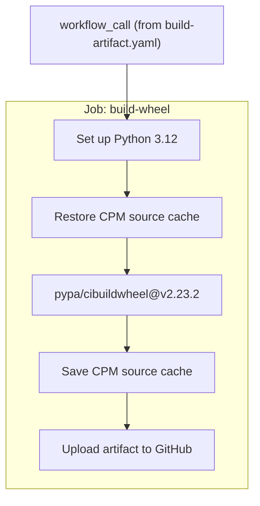

Sources: [.github/workflows/wheels.yaml:37-150](), [.github/workflows/build-artifact.yaml:614-627]()
```


#### Package Component Structure


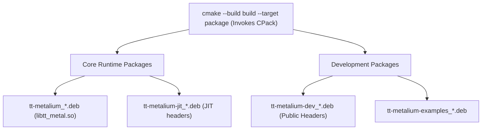

Sources: [.github/workflows/build-artifact.yaml:514-523]()

---
```


#### Build Optimization Data Flow


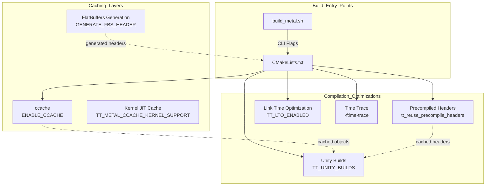
Sources: [CMakeLists.txt:1-172](), [build_metal.sh:1-250]()
```


### Runner Selection Logic


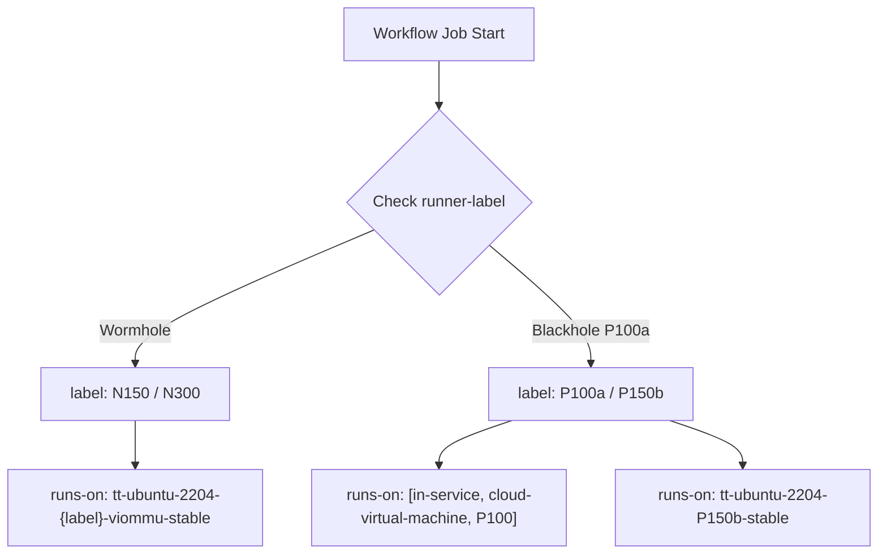

**Implementation Reference**:
The logic is implemented in the `runs-on` block of unit test and nightly workflows:
[ .github/workflows/cpp-post-commit.yaml:122-125 ](), [ .github/workflows/blackhole-post-commit.yaml:213-223 ](), [ .github/workflows/ttnn-post-commit.yaml:115 ]().

---
```


#### PR Gate Pipeline Architecture


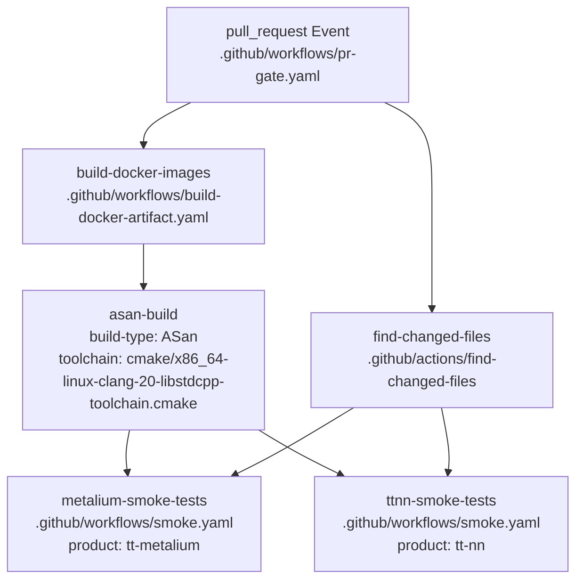

**Key Characteristics:**
- **AddressSanitizer (ASan)**: The default build type for the PR gate is `ASan` [[.github/workflows/pr-gate.yaml:132]](), which detects memory errors like use-after-free and buffer overflows. It uses the Clang 20 toolchain [[.github/workflows/pr-gate.yaml:131]]().
- **Change Detection**: The action `find-changed-files` identifies which subsystems (Metalium, TTNN, LLK, etc.) have changed to optimize test selection [[.github/workflows/pr-gate.yaml:146-155]]().
- **Smoke Tests**: Validates core functionality on a single-chip platform to minimize hardware queue times. These are triggered based on file change detection outputs like `any-code-changed` [[.github/workflows/pr-gate.yaml:166]]().
```


#### Merge Gate Pipeline


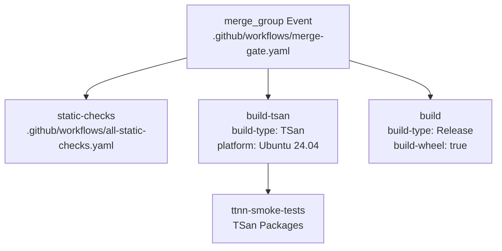


#### Clang-Tidy Integration


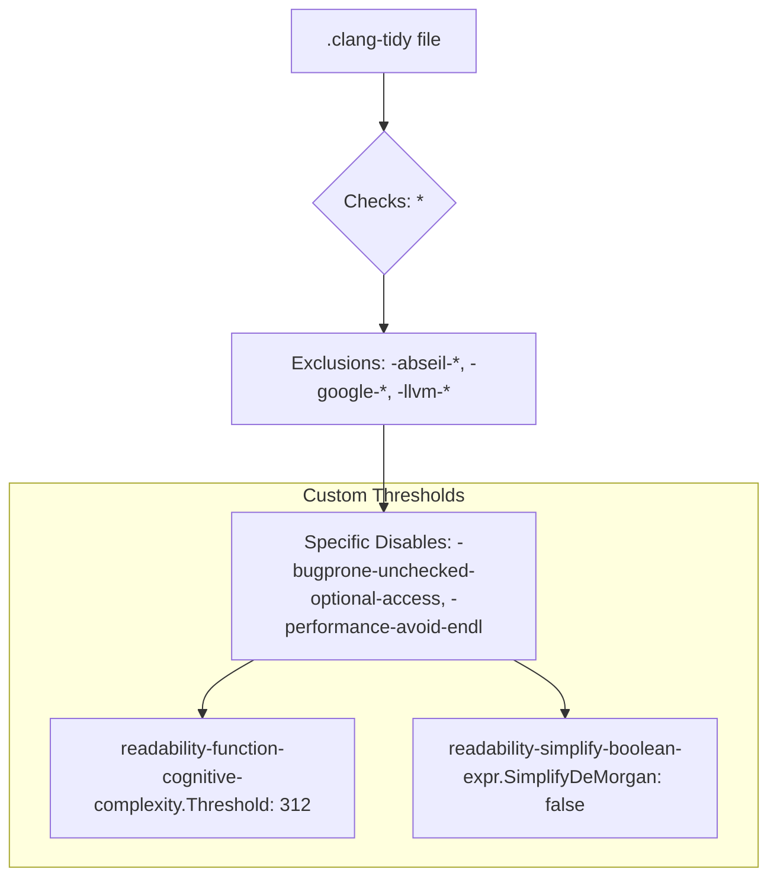

**Key Check Categories:**
*   **Modernization**: Enforces `#pragma once` via `modernize-use-pragma-once` [.clang-tidy:18-20]().
*   **Bug Prevention**: Targeted checks for `bugprone-*` and `cppcoreguidelines-*` [.clang-tidy:4-5]().
*   **Complexity Management**: Uses `readability-function-cognitive-complexity` with a threshold of `312` to flag overly complex logic [.clang-tidy:181-182]().

**Intentionally Disabled Checks:**
Some checks are disabled due to high noise or lack of value in the low-level hardware context, such as `concurrency-mt-unsafe` (flags `std::getenv`) and `performance-avoid-endl` (due to concerns about flush dependencies) [.clang-tidy:33-38]().

Sources: [.clang-tidy:1-198]()
```


### Version Tagging and Management


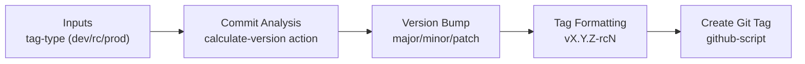

**Commit ignore list** (defined in environment variables):
```yaml
DEFAULT_IGNORE_COMMITS: >-
  72e9419a1be562889e1f008cf3e2db495f9e0aa9
```
[[.github/workflows/package-and-release.yaml:54-55]()]

**Bump detection logic:**
- Commits are analyzed to determine if a release is needed via `get_should_create_release.sh` [[.github/workflows/package-and-release.yaml:127-132]()]
- The `calculate-version` action determines the final version string based on `tag-type` and `force-bump-type` [[.github/actions/calculate-version/action.yml:1-10]()]
- `force-bump-type` input overrides automatic detection [[.github/workflows/package-and-release.yaml:145]()]
- The `calculate-version` action handles special logic for `dev` tags, which always increment the minor version [[.github/actions/calculate-version/action.yml:178-180]()]
```


### Docker Release Images


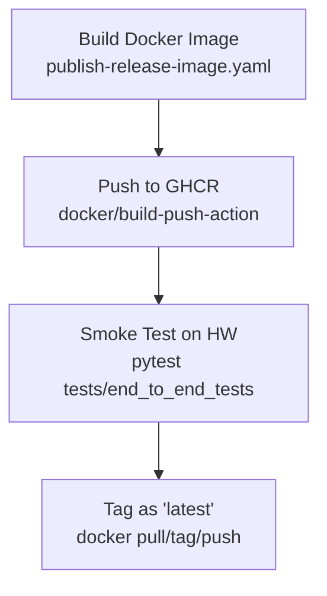

**Image types and tagging:**
- Images are built for `release` and `release-models` variants [[.github/workflows/publish-release-image-wrapper.yaml:47]()]
- Python versions are selected based on the Ubuntu distro (3.12 for 24.04, 3.10 for 22.04) [[.github/workflows/publish-release-image.yaml:70-76]()]
- Built images undergo a hardware smoke test using `pytest tests/end_to_end_tests` on N150/N300 runners before being tagged as `latest` [[.github/workflows/publish-release-image.yaml:112-160]()]
```


#### Failure Notification Flow


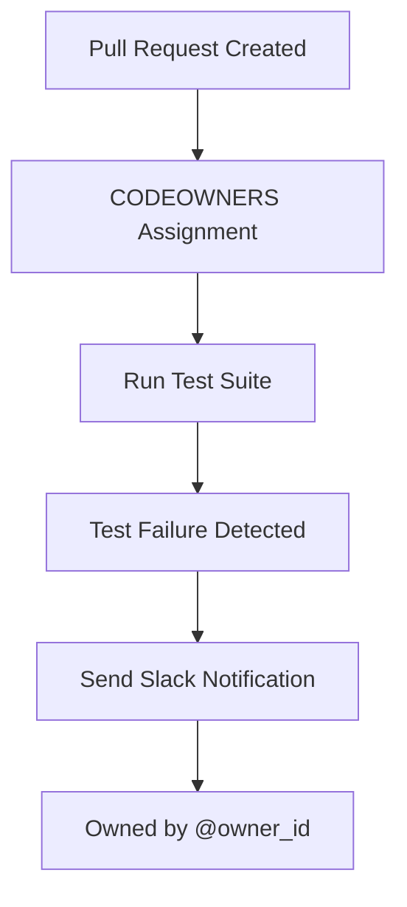

This automation shortens feedback loops for developers and improves triage efficiency.
```


#### Hardware Selection Criteria


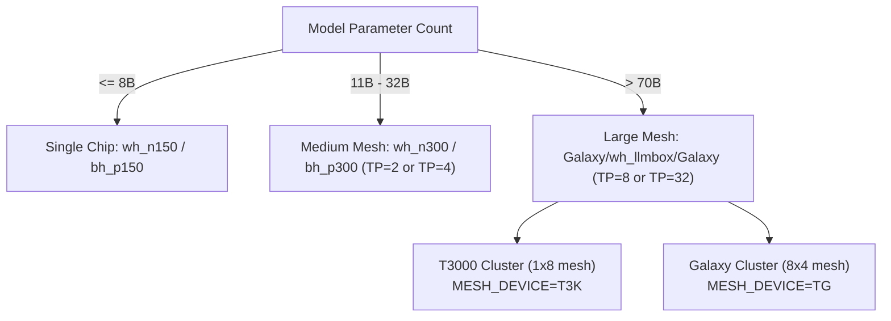

Sources:  
[README.md:40-64](), [models/README.md:5-23](), [models/demos/deepseek_v3/README.md:28-59]()

---
```


#### Debugging Decision Tree: Symptom to Debug Tool Mapping


```mermaid
graph TD
    START["Issue Encountered"]

    START --> Q1{"Where is the problem?"}

    Q1 -->|"Host Side"| HOST["Use GDB on MetalContext\
(`metal_context.cpp`)"]

    Q1 -->|"Device Side"| Q2{"What symptom?"}

    Q2 -->|"Hang / Timeout"| HANG["WatcherServer::Impl::poll_watcher_data\
(`watcher_server.cpp`)\
Check `watcher.log`"]

    Q2 -->|"Wrong Results"| WRONG["DPrintServer::Impl::poll_one_core\
(`dprint_server.cpp`)\
Inspect DPRINT output"]

    Q2 -->|"NOC Errors"| NOC["WatcherDeviceReader::Sanitize\
(`watcher_device_reader.cpp`)\
Check alignment or transactions"]

    Q2 -->|"Hardware Fault"| FAULT["get_debug_assert_message\
(`debug_helpers.hpp`)\
Interpret error cause codes"]

    Q2 -->|"Post-Mortem"| TRIAGE["`tt-triage.py` tool\
(`tools/triage/triage.py`)\
Run full health checks"]
```

Sources: `[tt_metal/impl/debug/watcher_server.cpp:78-84]()`, `[tt_metal/impl/debug/dprint_server.cpp:185-186]()`, `[tt_metal/impl/debug/watcher_device_reader.cpp:154-160]()`, `[tt_metal/impl/debug/debug_helpers.hpp:134-148]()`, `[tools/triage/triage.py:6-42]()`

---
```


#### Triage System Flow Diagram


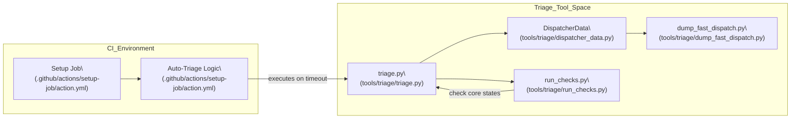


### Environment Variable Processing Architecture


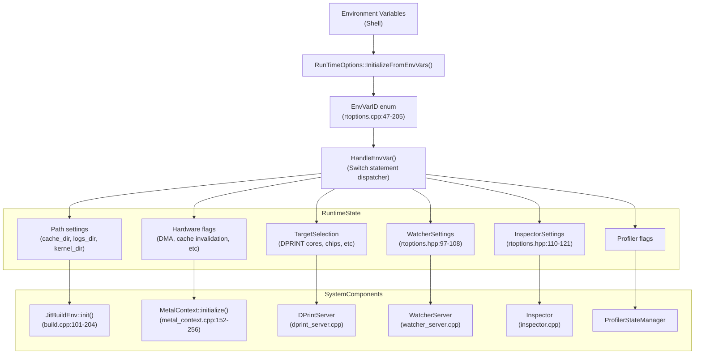

Sources: [tt_metal/llrt/rtoptions.cpp:47-205](), [tt_metal/llrt/rtoptions.hpp:153-215](), [tt_metal/impl/context/metal_context.cpp:152-256](), [tt_metal/jit_build/build.cpp:101-204]()
```

