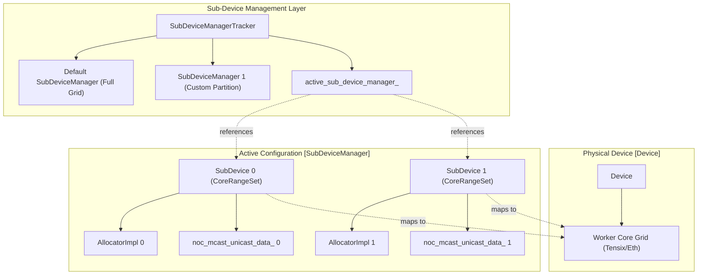
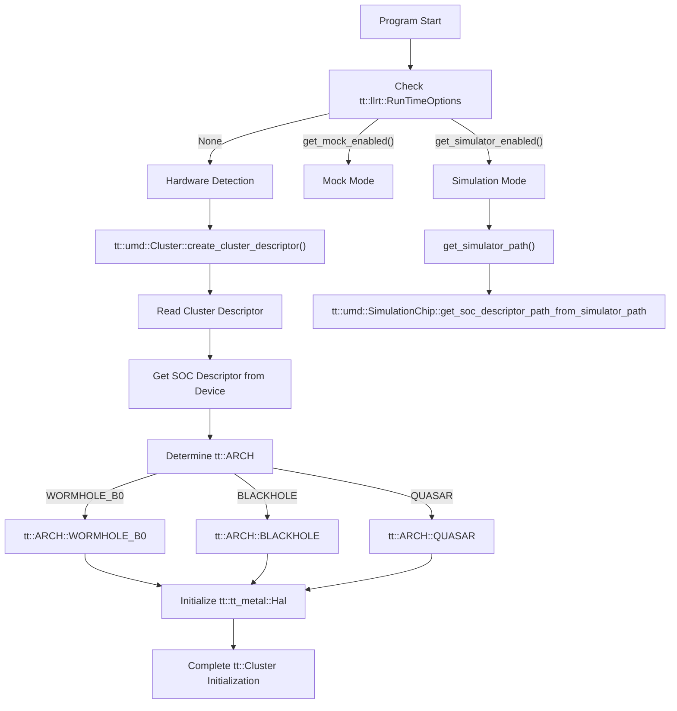
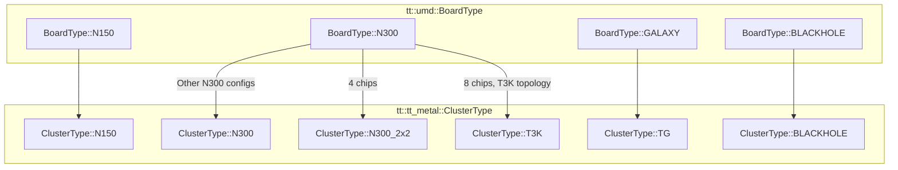
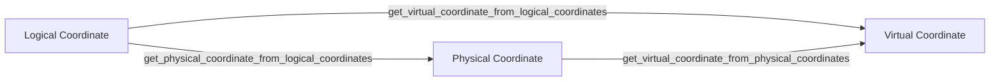
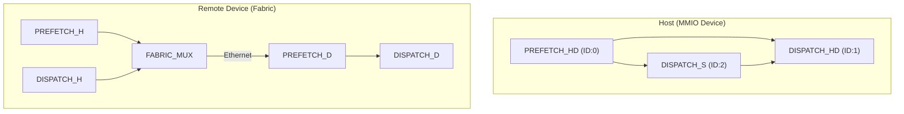
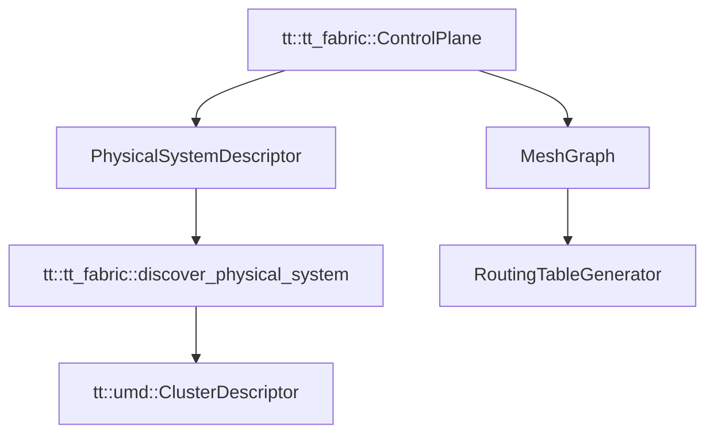

# Hardware Platforms and Configurations

Relevant source files
*   [.github/CODEOWNERS](https://github.com/tenstorrent/tt-metal/blob/f30f8df0/.github/CODEOWNERS)
*   [.github/blackhole_demo_systems.yaml](https://github.com/tenstorrent/tt-metal/blob/f30f8df0/.github/blackhole_demo_systems.yaml)
*   [.github/scripts/utils/prepare_test_matrix.py](https://github.com/tenstorrent/tt-metal/blob/f30f8df0/.github/scripts/utils/prepare_test_matrix.py)
*   [.github/workflows/all-model-tests.yaml](https://github.com/tenstorrent/tt-metal/blob/f30f8df0/.github/workflows/all-model-tests.yaml)
*   [.github/workflows/bisect-dispatch.yaml](https://github.com/tenstorrent/tt-metal/blob/f30f8df0/.github/workflows/bisect-dispatch.yaml)
*   [.github/workflows/blackhole-demo-tests-impl.yaml](https://github.com/tenstorrent/tt-metal/blob/f30f8df0/.github/workflows/blackhole-demo-tests-impl.yaml)
*   [.github/workflows/blackhole-demo-tests.yaml](https://github.com/tenstorrent/tt-metal/blob/f30f8df0/.github/workflows/blackhole-demo-tests.yaml)
*   [.github/workflows/blackhole-multi-card-unit-tests-impl.yaml](https://github.com/tenstorrent/tt-metal/blob/f30f8df0/.github/workflows/blackhole-multi-card-unit-tests-impl.yaml)
*   [.github/workflows/blackhole-post-commit.yaml](https://github.com/tenstorrent/tt-metal/blob/f30f8df0/.github/workflows/blackhole-post-commit.yaml)
*   [.github/workflows/build-and-unit-tests.yaml](https://github.com/tenstorrent/tt-metal/blob/f30f8df0/.github/workflows/build-and-unit-tests.yaml)
*   [.github/workflows/cpp-post-commit.yaml](https://github.com/tenstorrent/tt-metal/blob/f30f8df0/.github/workflows/cpp-post-commit.yaml)
*   [.github/workflows/didt-tests.yaml](https://github.com/tenstorrent/tt-metal/blob/f30f8df0/.github/workflows/didt-tests.yaml)
*   [.github/workflows/fabric-build-and-unit-tests.yaml](https://github.com/tenstorrent/tt-metal/blob/f30f8df0/.github/workflows/fabric-build-and-unit-tests.yaml)
*   [.github/workflows/fast-dispatch-build-and-unit-tests.yaml](https://github.com/tenstorrent/tt-metal/blob/f30f8df0/.github/workflows/fast-dispatch-build-and-unit-tests.yaml)
*   [.github/workflows/fast-dispatch-full-regressions-and-models-impl.yaml](https://github.com/tenstorrent/tt-metal/blob/f30f8df0/.github/workflows/fast-dispatch-full-regressions-and-models-impl.yaml)
*   [.github/workflows/fast-dispatch-full-regressions-and-models.yaml](https://github.com/tenstorrent/tt-metal/blob/f30f8df0/.github/workflows/fast-dispatch-full-regressions-and-models.yaml)
*   [.github/workflows/galaxy-deepseek-tests-impl.yaml](https://github.com/tenstorrent/tt-metal/blob/f30f8df0/.github/workflows/galaxy-deepseek-tests-impl.yaml)
*   [.github/workflows/galaxy-deepseek-tests.yaml](https://github.com/tenstorrent/tt-metal/blob/f30f8df0/.github/workflows/galaxy-deepseek-tests.yaml)
*   [.github/workflows/galaxy-demo-tests-impl.yaml](https://github.com/tenstorrent/tt-metal/blob/f30f8df0/.github/workflows/galaxy-demo-tests-impl.yaml)
*   [.github/workflows/galaxy-demo-tests.yaml](https://github.com/tenstorrent/tt-metal/blob/f30f8df0/.github/workflows/galaxy-demo-tests.yaml)
*   [.github/workflows/galaxy-profiler-tests.yaml](https://github.com/tenstorrent/tt-metal/blob/f30f8df0/.github/workflows/galaxy-profiler-tests.yaml)
*   [.github/workflows/galaxy-stress-tests-impl.yaml](https://github.com/tenstorrent/tt-metal/blob/f30f8df0/.github/workflows/galaxy-stress-tests-impl.yaml)
*   [.github/workflows/galaxy-stress-tests.yaml](https://github.com/tenstorrent/tt-metal/blob/f30f8df0/.github/workflows/galaxy-stress-tests.yaml)
*   [.github/workflows/galaxy-unit-tests-impl.yaml](https://github.com/tenstorrent/tt-metal/blob/f30f8df0/.github/workflows/galaxy-unit-tests-impl.yaml)
*   [.github/workflows/galaxy-unit-tests.yaml](https://github.com/tenstorrent/tt-metal/blob/f30f8df0/.github/workflows/galaxy-unit-tests.yaml)
*   [.github/workflows/job_configs/upstream-tests.json](https://github.com/tenstorrent/tt-metal/blob/f30f8df0/.github/workflows/job_configs/upstream-tests.json)
*   [.github/workflows/metal-run-microbenchmarks.yaml](https://github.com/tenstorrent/tt-metal/blob/f30f8df0/.github/workflows/metal-run-microbenchmarks.yaml)
*   [.github/workflows/models-post-commit.yaml](https://github.com/tenstorrent/tt-metal/blob/f30f8df0/.github/workflows/models-post-commit.yaml)
*   [.github/workflows/ops-post-commit.yaml](https://github.com/tenstorrent/tt-metal/blob/f30f8df0/.github/workflows/ops-post-commit.yaml)
*   [.github/workflows/perf-device-models-impl.yaml](https://github.com/tenstorrent/tt-metal/blob/f30f8df0/.github/workflows/perf-device-models-impl.yaml)
*   [.github/workflows/perf-device-models.yaml](https://github.com/tenstorrent/tt-metal/blob/f30f8df0/.github/workflows/perf-device-models.yaml)
*   [.github/workflows/perf-models-impl.yaml](https://github.com/tenstorrent/tt-metal/blob/f30f8df0/.github/workflows/perf-models-impl.yaml)
*   [.github/workflows/perf-models.yaml](https://github.com/tenstorrent/tt-metal/blob/f30f8df0/.github/workflows/perf-models.yaml)
*   [.github/workflows/pipeline-select-galaxy.yaml](https://github.com/tenstorrent/tt-metal/blob/f30f8df0/.github/workflows/pipeline-select-galaxy.yaml)
*   [.github/workflows/pipeline-select-t3k.yaml](https://github.com/tenstorrent/tt-metal/blob/f30f8df0/.github/workflows/pipeline-select-t3k.yaml)
*   [.github/workflows/pipeline-select.yaml](https://github.com/tenstorrent/tt-metal/blob/f30f8df0/.github/workflows/pipeline-select.yaml)
*   [.github/workflows/single-card-demo-tests-impl.yaml](https://github.com/tenstorrent/tt-metal/blob/f30f8df0/.github/workflows/single-card-demo-tests-impl.yaml)
*   [.github/workflows/single-card-demo-tests.yaml](https://github.com/tenstorrent/tt-metal/blob/f30f8df0/.github/workflows/single-card-demo-tests.yaml)
*   [.github/workflows/t3000-demo-tests-impl.yaml](https://github.com/tenstorrent/tt-metal/blob/f30f8df0/.github/workflows/t3000-demo-tests-impl.yaml)
*   [.github/workflows/t3000-demo-tests.yaml](https://github.com/tenstorrent/tt-metal/blob/f30f8df0/.github/workflows/t3000-demo-tests.yaml)
*   [.github/workflows/t3000-e2e-tests.yaml](https://github.com/tenstorrent/tt-metal/blob/f30f8df0/.github/workflows/t3000-e2e-tests.yaml)
*   [.github/workflows/t3000-fast-tests-impl.yaml](https://github.com/tenstorrent/tt-metal/blob/f30f8df0/.github/workflows/t3000-fast-tests-impl.yaml)
*   [.github/workflows/t3000-fast-tests.yaml](https://github.com/tenstorrent/tt-metal/blob/f30f8df0/.github/workflows/t3000-fast-tests.yaml)
*   [.github/workflows/t3000-integration-tests.yaml](https://github.com/tenstorrent/tt-metal/blob/f30f8df0/.github/workflows/t3000-integration-tests.yaml)
*   [.github/workflows/t3000-perf-tests.yaml](https://github.com/tenstorrent/tt-metal/blob/f30f8df0/.github/workflows/t3000-perf-tests.yaml)
*   [.github/workflows/t3000-profiler-tests-impl.yaml](https://github.com/tenstorrent/tt-metal/blob/f30f8df0/.github/workflows/t3000-profiler-tests-impl.yaml)
*   [.github/workflows/t3000-profiler-tests.yaml](https://github.com/tenstorrent/tt-metal/blob/f30f8df0/.github/workflows/t3000-profiler-tests.yaml)
*   [.github/workflows/t3000-unit-tests-impl.yaml](https://github.com/tenstorrent/tt-metal/blob/f30f8df0/.github/workflows/t3000-unit-tests-impl.yaml)
*   [.github/workflows/t3000-unit-tests.yaml](https://github.com/tenstorrent/tt-metal/blob/f30f8df0/.github/workflows/t3000-unit-tests.yaml)
*   [.github/workflows/test-dispatch.yaml](https://github.com/tenstorrent/tt-metal/blob/f30f8df0/.github/workflows/test-dispatch.yaml)
*   [.github/workflows/tt-cnn-post-commit.yaml](https://github.com/tenstorrent/tt-metal/blob/f30f8df0/.github/workflows/tt-cnn-post-commit.yaml)
*   [.github/workflows/tt-metal-l2-nightly.yaml](https://github.com/tenstorrent/tt-metal/blob/f30f8df0/.github/workflows/tt-metal-l2-nightly.yaml)
*   [.github/workflows/tt-train-post-commit.yaml](https://github.com/tenstorrent/tt-metal/blob/f30f8df0/.github/workflows/tt-train-post-commit.yaml)
*   [.github/workflows/ttnn-post-commit.yaml](https://github.com/tenstorrent/tt-metal/blob/f30f8df0/.github/workflows/ttnn-post-commit.yaml)
*   [.github/workflows/ttnn-stress-tests-impl.yaml](https://github.com/tenstorrent/tt-metal/blob/f30f8df0/.github/workflows/ttnn-stress-tests-impl.yaml)
*   [.github/workflows/ttnn-stress-tests.yaml](https://github.com/tenstorrent/tt-metal/blob/f30f8df0/.github/workflows/ttnn-stress-tests.yaml)
*   [.github/workflows/ttnn-tutorials-post-commit.yaml](https://github.com/tenstorrent/tt-metal/blob/f30f8df0/.github/workflows/ttnn-tutorials-post-commit.yaml)
*   [.github/workflows/umd-unit-tests-wrapper.yaml](https://github.com/tenstorrent/tt-metal/blob/f30f8df0/.github/workflows/umd-unit-tests-wrapper.yaml)
*   [.github/workflows/umd-unit-tests.yaml](https://github.com/tenstorrent/tt-metal/blob/f30f8df0/.github/workflows/umd-unit-tests.yaml)
*   [.github/workflows/upstream-tests.yaml](https://github.com/tenstorrent/tt-metal/blob/f30f8df0/.github/workflows/upstream-tests.yaml)
*   [cmake/protobuf.cmake](https://github.com/tenstorrent/tt-metal/blob/f30f8df0/cmake/protobuf.cmake)
*   [dockerfile/upstream_test_images/Dockerfile.template](https://github.com/tenstorrent/tt-metal/blob/f30f8df0/dockerfile/upstream_test_images/Dockerfile.template)
*   [dockerfile/upstream_test_images/run_upstream_tests_vanilla.sh](https://github.com/tenstorrent/tt-metal/blob/f30f8df0/dockerfile/upstream_test_images/run_upstream_tests_vanilla.sh)
*   [docs/source/common/images/16LB_Cluster.png](https://github.com/tenstorrent/tt-metal/blob/f30f8df0/docs/source/common/images/16LB_Cluster.png)
*   [models/demos/deepseek_v3/tests/fused_op_unit_tests/mla/test_ds_mla.py](https://github.com/tenstorrent/tt-metal/blob/f30f8df0/models/demos/deepseek_v3/tests/fused_op_unit_tests/mla/test_ds_mla.py)
*   [models/demos/deepseek_v3/tests/fused_op_unit_tests/moe/test_ds_moe.py](https://github.com/tenstorrent/tt-metal/blob/f30f8df0/models/demos/deepseek_v3/tests/fused_op_unit_tests/moe/test_ds_moe.py)
*   [models/demos/deepseek_v3/tests/fused_op_unit_tests/run_ci_device_perf_tracy.sh](https://github.com/tenstorrent/tt-metal/blob/f30f8df0/models/demos/deepseek_v3/tests/fused_op_unit_tests/run_ci_device_perf_tracy.sh)
*   [models/demos/deepseek_v3/tests/test_compute_tg.py](https://github.com/tenstorrent/tt-metal/blob/f30f8df0/models/demos/deepseek_v3/tests/test_compute_tg.py)
*   [models/demos/deepseek_v3/tests/test_dispatch_tg.py](https://github.com/tenstorrent/tt-metal/blob/f30f8df0/models/demos/deepseek_v3/tests/test_dispatch_tg.py)
*   [models/demos/deepseek_v3/tests/test_optimized_moe_decode_block_tg.py](https://github.com/tenstorrent/tt-metal/blob/f30f8df0/models/demos/deepseek_v3/tests/test_optimized_moe_decode_block_tg.py)
*   [models/perf/merge_device_perf_results.py](https://github.com/tenstorrent/tt-metal/blob/f30f8df0/models/perf/merge_device_perf_results.py)
*   [pytest.ini](https://github.com/tenstorrent/tt-metal/blob/f30f8df0/pytest.ini)
*   [tests/pipeline_reorg/blackhole_demo_tests.yaml](https://github.com/tenstorrent/tt-metal/blob/f30f8df0/tests/pipeline_reorg/blackhole_demo_tests.yaml)
*   [tests/pipeline_reorg/models_device_perf_tests.yaml](https://github.com/tenstorrent/tt-metal/blob/f30f8df0/tests/pipeline_reorg/models_device_perf_tests.yaml)
*   [tests/pipeline_reorg/t3k_demo_tests.yaml](https://github.com/tenstorrent/tt-metal/blob/f30f8df0/tests/pipeline_reorg/t3k_demo_tests.yaml)
*   [tests/pipeline_reorg/t3k_integration_tests.yaml](https://github.com/tenstorrent/tt-metal/blob/f30f8df0/tests/pipeline_reorg/t3k_integration_tests.yaml)
*   [tests/pipeline_reorg/t3k_perf_tests.yaml](https://github.com/tenstorrent/tt-metal/blob/f30f8df0/tests/pipeline_reorg/t3k_perf_tests.yaml)
*   [tests/scripts/download_artifacts.sh](https://github.com/tenstorrent/tt-metal/blob/f30f8df0/tests/scripts/download_artifacts.sh)
*   [tests/scripts/run_python_model_tests.sh](https://github.com/tenstorrent/tt-metal/blob/f30f8df0/tests/scripts/run_python_model_tests.sh)
*   [tests/scripts/single_card/run_single_card_demo_tests.sh](https://github.com/tenstorrent/tt-metal/blob/f30f8df0/tests/scripts/single_card/run_single_card_demo_tests.sh)
*   [tests/scripts/t3000/run_t3000_demo_tests.sh](https://github.com/tenstorrent/tt-metal/blob/f30f8df0/tests/scripts/t3000/run_t3000_demo_tests.sh)
*   [tests/scripts/t3000/run_t3000_integration_tests.sh](https://github.com/tenstorrent/tt-metal/blob/f30f8df0/tests/scripts/t3000/run_t3000_integration_tests.sh)
*   [tests/scripts/t3000/run_t3000_perf_tests.sh](https://github.com/tenstorrent/tt-metal/blob/f30f8df0/tests/scripts/t3000/run_t3000_perf_tests.sh)
*   [tests/scripts/t3000/run_t3000_perplexity_tests.sh](https://github.com/tenstorrent/tt-metal/blob/f30f8df0/tests/scripts/t3000/run_t3000_perplexity_tests.sh)
*   [tests/scripts/t3000/run_t3000_unit_tests.sh](https://github.com/tenstorrent/tt-metal/blob/f30f8df0/tests/scripts/t3000/run_t3000_unit_tests.sh)
*   [tests/scripts/tg/run_tg_frequent_tests.sh](https://github.com/tenstorrent/tt-metal/blob/f30f8df0/tests/scripts/tg/run_tg_frequent_tests.sh)
*   [tests/scripts/tt_bisect.sh](https://github.com/tenstorrent/tt-metal/blob/f30f8df0/tests/scripts/tt_bisect.sh)
*   [tests/scripts/wh_6u/run_wh_6u_profiler_tests.sh](https://github.com/tenstorrent/tt-metal/blob/f30f8df0/tests/scripts/wh_6u/run_wh_6u_profiler_tests.sh)
*   [tests/tt_metal/tt_fabric/custom_mesh_descriptors/mgd2_syntax_check_mesh_graph_descriptor.textproto](https://github.com/tenstorrent/tt-metal/blob/f30f8df0/tests/tt_metal/tt_fabric/custom_mesh_descriptors/mgd2_syntax_check_mesh_graph_descriptor.textproto)
*   [tests/tt_metal/tt_fabric/fabric_data_movement/test_basic_fabric_smoke.cpp](https://github.com/tenstorrent/tt-metal/blob/f30f8df0/tests/tt_metal/tt_fabric/fabric_data_movement/test_basic_fabric_smoke.cpp)
*   [tests/tt_metal/tt_fabric/fabric_router/test_control_plane_logical_to_physical.cpp](https://github.com/tenstorrent/tt-metal/blob/f30f8df0/tests/tt_metal/tt_fabric/fabric_router/test_control_plane_logical_to_physical.cpp)
*   [tests/tt_metal/tt_fabric/fabric_router/test_mesh_graph_descriptor.cpp](https://github.com/tenstorrent/tt-metal/blob/f30f8df0/tests/tt_metal/tt_fabric/fabric_router/test_mesh_graph_descriptor.cpp)
*   [tests/tt_metal/tt_fabric/fabric_router/test_multi_host.cpp](https://github.com/tenstorrent/tt-metal/blob/f30f8df0/tests/tt_metal/tt_fabric/fabric_router/test_multi_host.cpp)
*   [tests/tt_metal/tt_fabric/fabric_router/test_routing_tables.cpp](https://github.com/tenstorrent/tt-metal/blob/f30f8df0/tests/tt_metal/tt_fabric/fabric_router/test_routing_tables.cpp)
*   [tests/tt_metal/tt_fabric/system_health/test_system_health.cpp](https://github.com/tenstorrent/tt-metal/blob/f30f8df0/tests/tt_metal/tt_fabric/system_health/test_system_health.cpp)
*   [tests/tt_metal/tt_metal/CMakeLists.txt](https://github.com/tenstorrent/tt-metal/blob/f30f8df0/tests/tt_metal/tt_metal/CMakeLists.txt)
*   [tests/tt_metal/tt_metal/api/CMakeLists.txt](https://github.com/tenstorrent/tt-metal/blob/f30f8df0/tests/tt_metal/tt_metal/api/CMakeLists.txt)
*   [tests/tt_metal/tt_metal/device/CMakeLists.txt](https://github.com/tenstorrent/tt-metal/blob/f30f8df0/tests/tt_metal/tt_metal/device/CMakeLists.txt)
*   [tests/tt_metal/tt_metal/device/test_simulator_device.cpp](https://github.com/tenstorrent/tt-metal/blob/f30f8df0/tests/tt_metal/tt_metal/device/test_simulator_device.cpp)
*   [tests/tt_metal/tt_metal/dispatch/CMakeLists.txt](https://github.com/tenstorrent/tt-metal/blob/f30f8df0/tests/tt_metal/tt_metal/dispatch/CMakeLists.txt)
*   [tests/tt_metal/tt_metal/dispatch/dispatch_buffer/test_BufferCorePageMapping_Iterator.cpp](https://github.com/tenstorrent/tt-metal/blob/f30f8df0/tests/tt_metal/tt_metal/dispatch/dispatch_buffer/test_BufferCorePageMapping_Iterator.cpp)
*   [tests/ttnn/stress_tests/test_data_movement.py](https://github.com/tenstorrent/tt-metal/blob/f30f8df0/tests/ttnn/stress_tests/test_data_movement.py)
*   [tests/ttnn/stress_tests/test_eltwise.py](https://github.com/tenstorrent/tt-metal/blob/f30f8df0/tests/ttnn/stress_tests/test_eltwise.py)
*   [tests/ttnn/stress_tests/test_matmul.py](https://github.com/tenstorrent/tt-metal/blob/f30f8df0/tests/ttnn/stress_tests/test_matmul.py)
*   [tt_metal/api/tt-metalium/experimental/fabric/mesh_graph_descriptor.hpp](https://github.com/tenstorrent/tt-metal/blob/f30f8df0/tt_metal/api/tt-metalium/experimental/fabric/mesh_graph_descriptor.hpp)
*   [tt_metal/fabric/MGD_README.md](https://github.com/tenstorrent/tt-metal/blob/f30f8df0/tt_metal/fabric/MGD_README.md?plain=1)
*   [tt_metal/fabric/control_plane.cpp](https://github.com/tenstorrent/tt-metal/blob/f30f8df0/tt_metal/fabric/control_plane.cpp)
*   [tt_metal/fabric/fabric.cpp](https://github.com/tenstorrent/tt-metal/blob/f30f8df0/tt_metal/fabric/fabric.cpp)
*   [tt_metal/fabric/fabric_host_utils.cpp](https://github.com/tenstorrent/tt-metal/blob/f30f8df0/tt_metal/fabric/fabric_host_utils.cpp)
*   [tt_metal/fabric/fabric_host_utils.hpp](https://github.com/tenstorrent/tt-metal/blob/f30f8df0/tt_metal/fabric/fabric_host_utils.hpp)
*   [tt_metal/fabric/mesh_graph.cpp](https://github.com/tenstorrent/tt-metal/blob/f30f8df0/tt_metal/fabric/mesh_graph.cpp)
*   [tt_metal/fabric/mesh_graph_descriptor.cpp](https://github.com/tenstorrent/tt-metal/blob/f30f8df0/tt_metal/fabric/mesh_graph_descriptor.cpp)
*   [tt_metal/fabric/mesh_graph_descriptors/single_bh_galaxy_mesh_graph_descriptor.textproto](https://github.com/tenstorrent/tt-metal/blob/f30f8df0/tt_metal/fabric/mesh_graph_descriptors/single_bh_galaxy_mesh_graph_descriptor.textproto)
*   [tt_metal/fabric/mesh_graph_descriptors/tg_mesh_graph_descriptor.textproto](https://github.com/tenstorrent/tt-metal/blob/f30f8df0/tt_metal/fabric/mesh_graph_descriptors/tg_mesh_graph_descriptor.textproto)
*   [tt_metal/fabric/protobuf/mesh_graph_descriptor.proto](https://github.com/tenstorrent/tt-metal/blob/f30f8df0/tt_metal/fabric/protobuf/mesh_graph_descriptor.proto)
*   [tt_metal/hostdevcommon/CMakeLists.txt](https://github.com/tenstorrent/tt-metal/blob/f30f8df0/tt_metal/hostdevcommon/CMakeLists.txt)
*   [tt_metal/hw/firmware/CMakeLists.txt](https://github.com/tenstorrent/tt-metal/blob/f30f8df0/tt_metal/hw/firmware/CMakeLists.txt)
*   [tt_metal/impl/context/metal_context.cpp](https://github.com/tenstorrent/tt-metal/blob/f30f8df0/tt_metal/impl/context/metal_context.cpp)
*   [tt_metal/impl/context/metal_context.hpp](https://github.com/tenstorrent/tt-metal/blob/f30f8df0/tt_metal/impl/context/metal_context.hpp)
*   [tt_metal/impl/dispatch/command_queue_common.cpp](https://github.com/tenstorrent/tt-metal/blob/f30f8df0/tt_metal/impl/dispatch/command_queue_common.cpp)
*   [tt_metal/impl/dispatch/kernel_config/relay_mux.cpp](https://github.com/tenstorrent/tt-metal/blob/f30f8df0/tt_metal/impl/dispatch/kernel_config/relay_mux.cpp)
*   [tt_metal/impl/dispatch/kernel_config/relay_mux.hpp](https://github.com/tenstorrent/tt-metal/blob/f30f8df0/tt_metal/impl/dispatch/kernel_config/relay_mux.hpp)
*   [tt_metal/impl/dispatch/system_memory_manager.cpp](https://github.com/tenstorrent/tt-metal/blob/f30f8df0/tt_metal/impl/dispatch/system_memory_manager.cpp)
*   [tt_metal/impl/dispatch/system_memory_manager.hpp](https://github.com/tenstorrent/tt-metal/blob/f30f8df0/tt_metal/impl/dispatch/system_memory_manager.hpp)
*   [tt_metal/impl/dispatch/topology.cpp](https://github.com/tenstorrent/tt-metal/blob/f30f8df0/tt_metal/impl/dispatch/topology.cpp)
*   [tt_metal/impl/dispatch/topology.hpp](https://github.com/tenstorrent/tt-metal/blob/f30f8df0/tt_metal/impl/dispatch/topology.hpp)
*   [tt_metal/jit_build/build.cpp](https://github.com/tenstorrent/tt-metal/blob/f30f8df0/tt_metal/jit_build/build.cpp)
*   [tt_metal/jit_build/build.hpp](https://github.com/tenstorrent/tt-metal/blob/f30f8df0/tt_metal/jit_build/build.hpp)
*   [tt_metal/jit_build/build_env_manager.cpp](https://github.com/tenstorrent/tt-metal/blob/f30f8df0/tt_metal/jit_build/build_env_manager.cpp)
*   [tt_metal/jit_build/build_env_manager.hpp](https://github.com/tenstorrent/tt-metal/blob/f30f8df0/tt_metal/jit_build/build_env_manager.hpp)
*   [tt_metal/llrt/rtoptions.cpp](https://github.com/tenstorrent/tt-metal/blob/f30f8df0/tt_metal/llrt/rtoptions.cpp)
*   [tt_metal/llrt/rtoptions.hpp](https://github.com/tenstorrent/tt-metal/blob/f30f8df0/tt_metal/llrt/rtoptions.hpp)
*   [tt_metal/llrt/tlb_config.cpp](https://github.com/tenstorrent/tt-metal/blob/f30f8df0/tt_metal/llrt/tlb_config.cpp)
*   [tt_metal/llrt/tlb_config.hpp](https://github.com/tenstorrent/tt-metal/blob/f30f8df0/tt_metal/llrt/tlb_config.hpp)
*   [tt_metal/llrt/tt_cluster.cpp](https://github.com/tenstorrent/tt-metal/blob/f30f8df0/tt_metal/llrt/tt_cluster.cpp)
*   [tt_metal/llrt/tt_cluster.hpp](https://github.com/tenstorrent/tt-metal/blob/f30f8df0/tt_metal/llrt/tt_cluster.hpp)
*   [tt_metal/test/CMakeLists.txt](https://github.com/tenstorrent/tt-metal/blob/f30f8df0/tt_metal/test/CMakeLists.txt)

## Purpose and Scope

This document describes the hardware platforms supported by TT-Metalium, their configurations, and how the software stack detects and manages different hardware setups. It covers:

*   Supported chip architectures (Wormhole, Blackhole).
*   Board types and SKUs (N150, N300, P150, P100, etc.).
*   Multi-chip configurations (T3000, Galaxy).
*   Hardware detection and cluster type identification via `tt::Cluster`.
*   SOC descriptors and coordinate systems.
*   Fast Dispatch topology mapping for different hardware scales.

For information about initializing devices and the device abstraction layer, see [Device Abstraction Layer (2.3)](https://github.com/tenstorrent/tt-metal/blob/f30f8df0/Device%20Abstraction%20Layer%20(2.3)) For details on multi-device execution patterns, see [Multi-Device Execution and MeshWorkload (2.10)](https://github.com/tenstorrent/tt-metal/blob/f30f8df0/Multi-Device%20Execution%20and%20MeshWorkload%20(2.10))

* * *

## Architecture Overview

TT-Metalium supports multiple chip architectures, each with different capabilities and memory configurations. The architecture determines the instruction set, core layout, and fundamental hardware capabilities defined in the Hardware Abstraction Layer (HAL).




**Diagram: Sub-Device Management Architecture**

Sources: [tt_metal/impl/sub_device/sub_device_manager.cpp:46-76](), [tt_metal/impl/sub_device/sub_device_manager_tracker.cpp:37-53](), [tt_metal/api/tt-metalium/device.hpp:174-180]()
```
### Supported Architectures

Sources: `[tt_metal/llrt/tt_cluster.cpp:52-72]()`, `[tt_metal/llrt/tt_cluster.cpp:87-104]()`, `[tt_metal/llrt/tt_cluster.hpp:116-116]()`

---
```


| Architecture | Description | Status | SOC Descriptor |
| --- | --- | --- | --- |
| **WORMHOLE_B0** | Production architecture with Tensix cores, up to 80 worker cores per chip. | Stable | `wormhole_b0_80_arch.yaml` |
| **BLACKHOLE** | Next-generation architecture with integrated PCIe/DRAM cores. Supports up to 140 worker cores. | Active Development | `blackhole_140_arch.yaml` |
| **QUASAR** | Quasar architecture. | Active Development | `quasar_32_arch.yaml` |

**Architecture Detection Flow**

The system uses `tt::llrt::RunTimeOptions` to determine if it should initialize real hardware, a simulator, or a mock cluster descriptor.

Title: Architecture Detection Flow

Sources: `<FileRef file-url="https://github.com/tenstorrent/tt-metal/blob/f30f8df0/tt_metal/llrt/tt_cluster.cpp#L52-L72" min=52 max=72 file-path="tt_metal/llrt/tt_cluster.cpp">Hii</FileRef>`, `<FileRef file-url="https://github.com/tenstorrent/tt-metal/blob/f30f8df0/tt_metal/llrt/tt_cluster.cpp#L87-L104" min=87 max=104 file-path="tt_metal/llrt/tt_cluster.cpp">Hii</FileRef>`, `<FileRef file-url="https://github.com/tenstorrent/tt-metal/blob/f30f8df0/tt_metal/llrt/tt_cluster.hpp#L116-L116" min=116  file-path="tt_metal/llrt/tt_cluster.hpp">Hii</FileRef>`

* * *

## Board Types and SKUs

Board types represent physical hardware configurations with specific form factors, chip counts, and connectivity. Each board type has associated SKUs that identify specific product configurations used in CI/CD matrix generation.

### Single-Chip Boards

*   **N150**: Single Wormhole B0 PCIe card. [tt_metal/llrt/tt_cluster.cpp 170](https://github.com/tenstorrent/tt-metal/blob/f30f8df0/tt_metal/llrt/tt_cluster.cpp#L170-L170)
*   **P150 (BH)**: Single Blackhole PCIe card. Identified in CI as `P150`. [.github/workflows/blackhole-post-commit.yaml 10](https://github.com/tenstorrent/tt-metal/blob/f30f8df0/.github/workflows/blackhole-post-commit.yaml#L10-L10)
*   **P100 (BH)**: Single Blackhole variant, often tested in virtualized or specific power-limited environments. [.github/workflows/blackhole-post-commit.yaml 7](https://github.com/tenstorrent/tt-metal/blob/f30f8df0/.github/workflows/blackhole-post-commit.yaml#L7-L7)

### Multi-Chip Boards

*   **N300**: Dual Wormhole B0 PCIe card. Chips are connected via internal Ethernet links. [tt_metal/llrt/tt_cluster.cpp 133](https://github.com/tenstorrent/tt-metal/blob/f30f8df0/tt_metal/llrt/tt_cluster.cpp#L133-L133)
*   **P300 (BH)**: Multi-chip Blackhole configuration. [dockerfile/upstream_test_images/run_upstream_tests_vanilla.sh 115](https://github.com/tenstorrent/tt-metal/blob/f30f8df0/dockerfile/upstream_test_images/run_upstream_tests_vanilla.sh#L115-L115)

### Large Scale Systems


Sources: `[tt_metal/llrt/tt_cluster.cpp:111-171]()`, `[tt_metal/llrt/tt_cluster.cpp:172-180]()`, `[tt_metal/llrt/tt_cluster.cpp:181-189]()`

---
```


*   **T3000 (T3K)**: An 8-chip Wormhole system in a 2x4 mesh topology. MMIO chips have 3 connections, while remote chips have 2. [tt_metal/llrt/tt_cluster.cpp 134-155](https://github.com/tenstorrent/tt-metal/blob/f30f8df0/tt_metal/llrt/tt_cluster.cpp#L134-L155)
*   **Galaxy (TG)**: A 32-chip Wormhole system in a 4x8 mesh topology. [tt_metal/llrt/tt_cluster.cpp 116-118](https://github.com/tenstorrent/tt-metal/blob/f30f8df0/tt_metal/llrt/tt_cluster.cpp#L116-L118)
*   **Blackhole Clusters**: Includes configurations like `blackhole_llmbox`, `blackhole_loudbox`, and `blackhole_p300`. [dockerfile/upstream_test_images/run_upstream_tests_vanilla.sh 109-117](https://github.com/tenstorrent/tt-metal/blob/f30f8df0/dockerfile/upstream_test_images/run_upstream_tests_vanilla.sh#L109-L117)

Title: Board Type to Cluster Type Mapping

Sources: `<FileRef file-url="https://github.com/tenstorrent/tt-metal/blob/f30f8df0/tt_metal/llrt/tt_cluster.cpp#L111-L171" min=111 max=171 file-path="tt_metal/llrt/tt_cluster.cpp">Hii</FileRef>`, `<FileRef file-url="https://github.com/tenstorrent/tt-metal/blob/f30f8df0/tt_metal/llrt/tt_cluster.cpp#L172-L180" min=172 max=180 file-path="tt_metal/llrt/tt_cluster.cpp">Hii</FileRef>`, `<FileRef file-url="https://github.com/tenstorrent/tt-metal/blob/f30f8df0/tt_metal/llrt/tt_cluster.cpp#L181-L189" min=181 max=189 file-path="tt_metal/llrt/tt_cluster.cpp">Hii</FileRef>`

* * *

## Hardware Detection and Initialization

The hardware detection process identifies the connected hardware and configures the software stack accordingly via the `Cluster` and `Hal` classes.

### Initialization Sequence

1.   **Cluster Initialization**: `tt::Cluster` is initialized with `RunTimeOptions`. [tt_metal/llrt/tt_cluster.cpp 88-114](https://github.com/tenstorrent/tt-metal/blob/f30f8df0/tt_metal/llrt/tt_cluster.cpp#L88-L114)
2.   **Cluster Descriptor**: UMD is used to create a cluster descriptor representing the physical topology. [tt_metal/llrt/tt_cluster.cpp 111](https://github.com/tenstorrent/tt-metal/blob/f30f8df0/tt_metal/llrt/tt_cluster.cpp#L111-L111)
3.   **Architecture Identification**: The system determines the `tt::ARCH` based on the SOC descriptor file path. [tt_metal/llrt/tt_cluster.cpp 53-72](https://github.com/tenstorrent/tt-metal/blob/f30f8df0/tt_metal/llrt/tt_cluster.cpp#L53-L72)
4.   **HAL Setup**: The `tt::tt_metal::Hal` is set for the cluster to provide architecture-specific abstractions. [tt_metal/impl/context/metal_context.cpp 93-105](https://github.com/tenstorrent/tt-metal/blob/f30f8df0/tt_metal/impl/context/metal_context.cpp#L93-L105)

### Key Entities

| Code Entity | Role | File |
| --- | --- | --- |
| `tt::Cluster` | Manages device cluster discovery and low-level communication (UMD wrapper). | [tt_metal/llrt/tt_cluster.hpp 61](https://github.com/tenstorrent/tt-metal/blob/f30f8df0/tt_metal/llrt/tt_cluster.hpp#L61-L61) |
| `tt::llrt::RunTimeOptions` | Provides configuration from environment variables (e.g., `TT_METAL_CACHE`). | [tt_metal/llrt/rtoptions.hpp 153](https://github.com/tenstorrent/tt-metal/blob/f30f8df0/tt_metal/llrt/rtoptions.hpp#L153-L153) |
| `tt::tt_metal::Hal` | Hardware Abstraction Layer providing core/memory mapping. | [tt_metal/llrt/hal.hpp 1-100](https://github.com/tenstorrent/tt-metal/blob/f30f8df0/tt_metal/llrt/hal.hpp#L1-L100) |
| `tt::umd::ClusterDescriptor` | UMD class describing the physical layout of chips and links. | [tt_metal/llrt/tt_cluster.cpp 76](https://github.com/tenstorrent/tt-metal/blob/f30f8df0/tt_metal/llrt/tt_cluster.cpp#L76-L76) |

Sources: `<FileRef file-url="https://github.com/tenstorrent/tt-metal/blob/f30f8df0/tt_metal/llrt/tt_cluster.cpp#L1-L170" min=1 max=170 file-path="tt_metal/llrt/tt_cluster.cpp">Hii</FileRef>`, `<FileRef file-url="https://github.com/tenstorrent/tt-metal/blob/f30f8df0/tt_metal/llrt/rtoptions.hpp#L1-L213" min=1 max=213 file-path="tt_metal/llrt/rtoptions.hpp">Hii</FileRef>`

* * *

## Memory and Compute Characteristics

Each architecture defines specific memory maps and compute resources through the SOC descriptors and HAL.

### SOC Descriptors

SOC descriptors define the grid of cores, including worker (Tensix), Ethernet, and DRAM cores.

| Architecture | Default SOC Descriptor | Worker Grid |
| --- | --- | --- |
| **Wormhole B0** | `wormhole_b0_80_arch.yaml` | 8x10 (80 cores) |
| **Blackhole** | `blackhole_140_arch.yaml` | 10x14 (140 cores) |
| **Quasar** | `quasar_32_arch.yaml` | 4x8 (32 cores) |

### Core and Coordinate Systems


Sources: `[tt_metal/llrt/tt_cluster.hpp:119-125]()`

---
```


The `Cluster` class provides methods to translate between different coordinate systems:

*   **Logical**: User-facing coordinates.
*   **Physical**: Hardware NOC coordinates.
*   **Virtual**: Translated coordinates used by the runtime for harvesting-aware mapping.

Title: Coordinate Translation System

Sources: `<FileRef file-url="https://github.com/tenstorrent/tt-metal/blob/f30f8df0/tt_metal/llrt/tt_cluster.hpp#L119-L125" min=119 max=125 file-path="tt_metal/llrt/tt_cluster.hpp">Hii</FileRef>`

* * *

## Fast Dispatch Topology

Fast Dispatch (FD) requires specific kernel configurations based on the hardware topology. The `MetalContext` manages the placement of dispatch kernels and determines the topology graph.

### Dispatch Node Selections

Dispatch kernels use specific NoC selections for upstream and downstream communication to avoid resource contention.

| Kernel Type | Upstream NoC | Downstream NoC | Purpose |
| --- | --- | --- | --- |
| `PREFETCH_HD` | `NOC_0` | `NOC_0` | Host to Device prefetcher. |
| `DISPATCH_HD` | `NOC_1` | `k_dispatch_downstream_noc` | Host to Device dispatcher. |
| `DISPATCH_S` | `NOC_1` | `NOC_1` | Secondary dispatcher for multi-CQ. |

### Topology Templates


Sources: `[tt_metal/impl/dispatch/topology.cpp:118-187]()`

---
```


The system uses predefined templates for different configurations:

*   `single_chip_arch_1cq`: Standard single-chip 1 Command Queue setup.
*   `two_chip_arch_1cq_fabric`: 1 CQ setup using Fabric for remote chip communication.
*   `galaxy_nine_chip_arch_1cq_fabric`: Specialized topology for Galaxy systems.

Title: Fast Dispatch Topology Mapping

Sources: `<FileRef file-url="https://github.com/tenstorrent/tt-metal/blob/f30f8df0/tt_metal/impl/dispatch/topology.cpp#L118-L187" min=118 max=187 file-path="tt_metal/impl/dispatch/topology.cpp">Hii</FileRef>`

* * *

## Galaxy and Cluster Management

### Galaxy Topology

For Galaxy systems, the `Cluster` identifies the board type and sets the cluster type to `TG`. [tt_metal/llrt/tt_cluster.cpp:116-117].

### Fabric and Control Plane


Sources: `[tt_metal/fabric/control_plane.cpp:33-63]()`, `[tt_metal/llrt/tt_cluster.cpp:111-117]()`

---
```


The `ControlPlane` manages the routing and topology mapping for multi-device meshes.

*   **ASIC Pinning**: Galaxy systems use fixed ASIC position pinnings to align QSFP links with fabric mesh corners. [tt_metal/fabric/control_plane.cpp 85-117](https://github.com/tenstorrent/tt-metal/blob/f30f8df0/tt_metal/fabric/control_plane.cpp#L85-L117)
*   **Bus IDs**: The system tracks PCIe bus IDs for architecture-specific UBB (Universal Backplane Board) configurations. [tt_metal/fabric/control_plane.cpp 162-165](https://github.com/tenstorrent/tt-metal/blob/f30f8df0/tt_metal/fabric/control_plane.cpp#L162-L165)

Title: Fabric Control Plane Discovery

Sources: `<FileRef file-url="https://github.com/tenstorrent/tt-metal/blob/f30f8df0/tt_metal/fabric/control_plane.cpp#L33-L63" min=33 max=63 file-path="tt_metal/fabric/control_plane.cpp">Hii</FileRef>`, `<FileRef file-url="https://github.com/tenstorrent/tt-metal/blob/f30f8df0/tt_metal/llrt/tt_cluster.cpp#L111-L117" min=111 max=117 file-path="tt_metal/llrt/tt_cluster.cpp">Hii</FileRef>`

* * *

## Toolchain and SFPI Integration

Kernel compilation for different architectures is handled by the `JitBuildEnv`. It integrates the RISC-V SFPI (Special Function Processor Interface) toolchain.

### Compiler Configuration

*   **SFPI Root**: The system searches for SFPI at `/opt/tenstorrent/sfpi` or within the repository's `runtime/sfpi`. [tt_metal/jit_build/build.cpp 125-137](https://github.com/tenstorrent/tt-metal/blob/f30f8df0/tt_metal/jit_build/build.cpp#L125-L137)
*   **GPP Command**: `riscv-tt-elf-g++` is the target compiler for device kernels. [tt_metal/jit_build/build.cpp 129-131](https://github.com/tenstorrent/tt-metal/blob/f30f8df0/tt_metal/jit_build/build.cpp#L129-L131)

### Hardware Feature Flags

Architecture-specific features are enabled via defines in `JitBuildEnv::init`:

*   `WATCHER_ENABLED`: Enables the watcher debug system. [tt_metal/jit_build/build.cpp 204-206](https://github.com/tenstorrent/tt-metal/blob/f30f8df0/tt_metal/jit_build/build.cpp#L204-L206)
*   `PROFILE_KERNEL`: Enables device-side profiling. [tt_metal/jit_build/build.cpp 172-187](https://github.com/tenstorrent/tt-metal/blob/f30f8df0/tt_metal/jit_build/build.cpp#L172-L187)
*   `DEVICE_DEBUG_DUMP`: Enables experimental NOC debug dumps. [tt_metal/jit_build/build.cpp 195-197](https://github.com/tenstorrent/tt-metal/blob/f30f8df0/tt_metal/jit_build/build.cpp#L195-L197)

Sources: `<FileRef file-url="https://github.com/tenstorrent/tt-metal/blob/f30f8df0/tt_metal/jit_build/build.cpp#L99-L207" min=99 max=207 file-path="tt_metal/jit_build/build.cpp">Hii</FileRef>`

Dismiss
Refresh this wiki

Enter email to refresh
