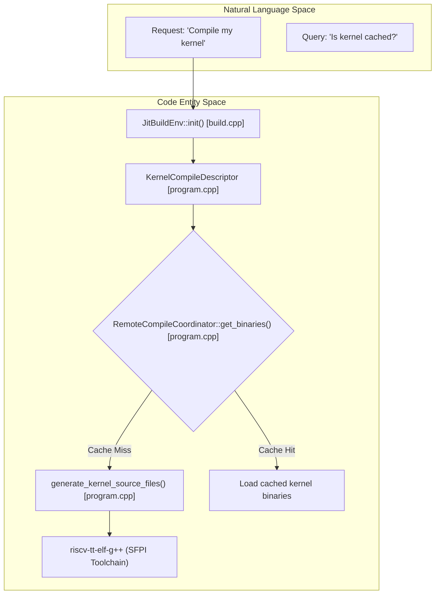
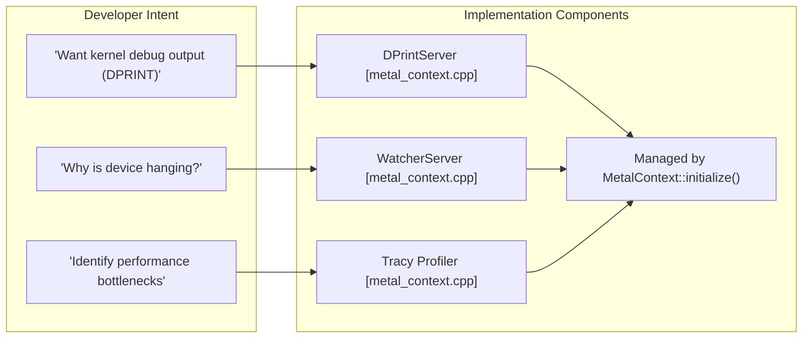

# Glossary

Relevant source files
*   [.github/CODEOWNERS](https://github.com/tenstorrent/tt-metal/blob/f30f8df0/.github/CODEOWNERS)
*   [.github/pull_request_template.md](https://github.com/tenstorrent/tt-metal/blob/f30f8df0/.github/pull_request_template.md?plain=1)
*   [.github/workflows/all-model-tests.yaml](https://github.com/tenstorrent/tt-metal/blob/f30f8df0/.github/workflows/all-model-tests.yaml)
*   [.github/workflows/fast-dispatch-full-regressions-and-models-impl.yaml](https://github.com/tenstorrent/tt-metal/blob/f30f8df0/.github/workflows/fast-dispatch-full-regressions-and-models-impl.yaml)
*   [.github/workflows/fast-dispatch-full-regressions-and-models.yaml](https://github.com/tenstorrent/tt-metal/blob/f30f8df0/.github/workflows/fast-dispatch-full-regressions-and-models.yaml)
*   [.github/workflows/galaxy-deepseek-tests-impl.yaml](https://github.com/tenstorrent/tt-metal/blob/f30f8df0/.github/workflows/galaxy-deepseek-tests-impl.yaml)
*   [.github/workflows/galaxy-deepseek-tests.yaml](https://github.com/tenstorrent/tt-metal/blob/f30f8df0/.github/workflows/galaxy-deepseek-tests.yaml)
*   [.github/workflows/galaxy-demo-tests-impl.yaml](https://github.com/tenstorrent/tt-metal/blob/f30f8df0/.github/workflows/galaxy-demo-tests-impl.yaml)
*   [.github/workflows/galaxy-demo-tests.yaml](https://github.com/tenstorrent/tt-metal/blob/f30f8df0/.github/workflows/galaxy-demo-tests.yaml)
*   [.github/workflows/galaxy-profiler-tests.yaml](https://github.com/tenstorrent/tt-metal/blob/f30f8df0/.github/workflows/galaxy-profiler-tests.yaml)
*   [.github/workflows/galaxy-stress-tests-impl.yaml](https://github.com/tenstorrent/tt-metal/blob/f30f8df0/.github/workflows/galaxy-stress-tests-impl.yaml)
*   [.github/workflows/galaxy-stress-tests.yaml](https://github.com/tenstorrent/tt-metal/blob/f30f8df0/.github/workflows/galaxy-stress-tests.yaml)
*   [.github/workflows/galaxy-unit-tests-impl.yaml](https://github.com/tenstorrent/tt-metal/blob/f30f8df0/.github/workflows/galaxy-unit-tests-impl.yaml)
*   [.github/workflows/galaxy-unit-tests.yaml](https://github.com/tenstorrent/tt-metal/blob/f30f8df0/.github/workflows/galaxy-unit-tests.yaml)
*   [.github/workflows/metal-run-microbenchmarks.yaml](https://github.com/tenstorrent/tt-metal/blob/f30f8df0/.github/workflows/metal-run-microbenchmarks.yaml)
*   [.github/workflows/perf-device-models-impl.yaml](https://github.com/tenstorrent/tt-metal/blob/f30f8df0/.github/workflows/perf-device-models-impl.yaml)
*   [.github/workflows/perf-device-models.yaml](https://github.com/tenstorrent/tt-metal/blob/f30f8df0/.github/workflows/perf-device-models.yaml)
*   [.github/workflows/perf-models-impl.yaml](https://github.com/tenstorrent/tt-metal/blob/f30f8df0/.github/workflows/perf-models-impl.yaml)
*   [.github/workflows/perf-models.yaml](https://github.com/tenstorrent/tt-metal/blob/f30f8df0/.github/workflows/perf-models.yaml)
*   [.github/workflows/pipeline-select-galaxy.yaml](https://github.com/tenstorrent/tt-metal/blob/f30f8df0/.github/workflows/pipeline-select-galaxy.yaml)
*   [.github/workflows/pipeline-select-t3k.yaml](https://github.com/tenstorrent/tt-metal/blob/f30f8df0/.github/workflows/pipeline-select-t3k.yaml)
*   [.github/workflows/pipeline-select.yaml](https://github.com/tenstorrent/tt-metal/blob/f30f8df0/.github/workflows/pipeline-select.yaml)
*   [.github/workflows/pr-description-inject-branch-name.yaml](https://github.com/tenstorrent/tt-metal/blob/f30f8df0/.github/workflows/pr-description-inject-branch-name.yaml)
*   [.github/workflows/single-card-demo-tests-impl.yaml](https://github.com/tenstorrent/tt-metal/blob/f30f8df0/.github/workflows/single-card-demo-tests-impl.yaml)
*   [.github/workflows/single-card-demo-tests.yaml](https://github.com/tenstorrent/tt-metal/blob/f30f8df0/.github/workflows/single-card-demo-tests.yaml)
*   [.github/workflows/t3000-demo-tests-impl.yaml](https://github.com/tenstorrent/tt-metal/blob/f30f8df0/.github/workflows/t3000-demo-tests-impl.yaml)
*   [.github/workflows/t3000-demo-tests.yaml](https://github.com/tenstorrent/tt-metal/blob/f30f8df0/.github/workflows/t3000-demo-tests.yaml)
*   [.github/workflows/t3000-e2e-tests.yaml](https://github.com/tenstorrent/tt-metal/blob/f30f8df0/.github/workflows/t3000-e2e-tests.yaml)
*   [.github/workflows/t3000-integration-tests.yaml](https://github.com/tenstorrent/tt-metal/blob/f30f8df0/.github/workflows/t3000-integration-tests.yaml)
*   [.github/workflows/t3000-perf-tests.yaml](https://github.com/tenstorrent/tt-metal/blob/f30f8df0/.github/workflows/t3000-perf-tests.yaml)
*   [.github/workflows/t3000-profiler-tests-impl.yaml](https://github.com/tenstorrent/tt-metal/blob/f30f8df0/.github/workflows/t3000-profiler-tests-impl.yaml)
*   [.github/workflows/t3000-profiler-tests.yaml](https://github.com/tenstorrent/tt-metal/blob/f30f8df0/.github/workflows/t3000-profiler-tests.yaml)
*   [.github/workflows/t3000-unit-tests-impl.yaml](https://github.com/tenstorrent/tt-metal/blob/f30f8df0/.github/workflows/t3000-unit-tests-impl.yaml)
*   [.github/workflows/t3000-unit-tests.yaml](https://github.com/tenstorrent/tt-metal/blob/f30f8df0/.github/workflows/t3000-unit-tests.yaml)
*   [.github/workflows/test-dispatch.yaml](https://github.com/tenstorrent/tt-metal/blob/f30f8df0/.github/workflows/test-dispatch.yaml)
*   [CONTRIBUTING.md](https://github.com/tenstorrent/tt-metal/blob/f30f8df0/CONTRIBUTING.md?plain=1)
*   [README.md](https://github.com/tenstorrent/tt-metal/blob/f30f8df0/README.md?plain=1)
*   [cmake/protobuf.cmake](https://github.com/tenstorrent/tt-metal/blob/f30f8df0/cmake/protobuf.cmake)
*   [docs/source/common/images/16LB_Cluster.png](https://github.com/tenstorrent/tt-metal/blob/f30f8df0/docs/source/common/images/16LB_Cluster.png)
*   [docs/source/tt-metalium/index.rst](https://github.com/tenstorrent/tt-metal/blob/f30f8df0/docs/source/tt-metalium/index.rst)
*   [docs/source/tt-metalium/tt_metal/environment_variables/index.rst](https://github.com/tenstorrent/tt-metal/blob/f30f8df0/docs/source/tt-metalium/tt_metal/environment_variables/index.rst)
*   [docs/source/tt-metalium/tt_metal/labs/index.rst](https://github.com/tenstorrent/tt-metal/blob/f30f8df0/docs/source/tt-metalium/tt_metal/labs/index.rst)
*   [docs/source/tt-metalium/tt_metal/labs/matmul/lab1/lab1.rst](https://github.com/tenstorrent/tt-metal/blob/f30f8df0/docs/source/tt-metalium/tt_metal/labs/matmul/lab1/lab1.rst)
*   [docs/source/tt-metalium/tt_metal/labs/matmul/lab2/lab2.rst](https://github.com/tenstorrent/tt-metal/blob/f30f8df0/docs/source/tt-metalium/tt_metal/labs/matmul/lab2/lab2.rst)
*   [docs/source/tt-metalium/tt_metal/labs/matmul/lab3/lab3.rst](https://github.com/tenstorrent/tt-metal/blob/f30f8df0/docs/source/tt-metalium/tt_metal/labs/matmul/lab3/lab3.rst)
*   [models/README.md](https://github.com/tenstorrent/tt-metal/blob/f30f8df0/models/README.md?plain=1)
*   [models/demos/deepseek_v3/README.md](https://github.com/tenstorrent/tt-metal/blob/f30f8df0/models/demos/deepseek_v3/README.md?plain=1)
*   [models/demos/deepseek_v3/tests/fused_op_unit_tests/mla/test_ds_mla.py](https://github.com/tenstorrent/tt-metal/blob/f30f8df0/models/demos/deepseek_v3/tests/fused_op_unit_tests/mla/test_ds_mla.py)
*   [models/demos/deepseek_v3/tests/fused_op_unit_tests/moe/test_ds_moe.py](https://github.com/tenstorrent/tt-metal/blob/f30f8df0/models/demos/deepseek_v3/tests/fused_op_unit_tests/moe/test_ds_moe.py)
*   [models/demos/deepseek_v3/tests/fused_op_unit_tests/run_ci_device_perf_tracy.sh](https://github.com/tenstorrent/tt-metal/blob/f30f8df0/models/demos/deepseek_v3/tests/fused_op_unit_tests/run_ci_device_perf_tracy.sh)
*   [models/demos/deepseek_v3/tests/test_compute_tg.py](https://github.com/tenstorrent/tt-metal/blob/f30f8df0/models/demos/deepseek_v3/tests/test_compute_tg.py)
*   [models/demos/deepseek_v3/tests/test_dispatch_tg.py](https://github.com/tenstorrent/tt-metal/blob/f30f8df0/models/demos/deepseek_v3/tests/test_dispatch_tg.py)
*   [models/demos/deepseek_v3/tests/test_optimized_moe_decode_block_tg.py](https://github.com/tenstorrent/tt-metal/blob/f30f8df0/models/demos/deepseek_v3/tests/test_optimized_moe_decode_block_tg.py)
*   [models/demos/llama3_70b_galaxy/PERF.md](https://github.com/tenstorrent/tt-metal/blob/f30f8df0/models/demos/llama3_70b_galaxy/PERF.md?plain=1)
*   [models/demos/llama3_70b_galaxy/README.md](https://github.com/tenstorrent/tt-metal/blob/f30f8df0/models/demos/llama3_70b_galaxy/README.md?plain=1)
*   [models/demos/multimodal/gemma3/README.md](https://github.com/tenstorrent/tt-metal/blob/f30f8df0/models/demos/multimodal/gemma3/README.md?plain=1)
*   [models/demos/t3000/llama3_70b/README.md](https://github.com/tenstorrent/tt-metal/blob/f30f8df0/models/demos/t3000/llama3_70b/README.md?plain=1)
*   [models/demos/t3000/llama3_70b/setup_llama.sh](https://github.com/tenstorrent/tt-metal/blob/f30f8df0/models/demos/t3000/llama3_70b/setup_llama.sh)
*   [models/demos/wormhole/qwen3_embedding_8b/demo/generator_vllm.py](https://github.com/tenstorrent/tt-metal/blob/f30f8df0/models/demos/wormhole/qwen3_embedding_8b/demo/generator_vllm.py)
*   [models/docs/MODEL_HYBRID_TP_DP.md](https://github.com/tenstorrent/tt-metal/blob/f30f8df0/models/docs/MODEL_HYBRID_TP_DP.md?plain=1)
*   [models/docs/MODEL_UPDATES.md](https://github.com/tenstorrent/tt-metal/blob/f30f8df0/models/docs/MODEL_UPDATES.md?plain=1)
*   [models/docs/model_bring_up.md](https://github.com/tenstorrent/tt-metal/blob/f30f8df0/models/docs/model_bring_up.md?plain=1)
*   [models/perf/merge_device_perf_results.py](https://github.com/tenstorrent/tt-metal/blob/f30f8df0/models/perf/merge_device_perf_results.py)
*   [models/tt_transformers/PERF.md](https://github.com/tenstorrent/tt-metal/blob/f30f8df0/models/tt_transformers/PERF.md?plain=1)
*   [models/tt_transformers/README.md](https://github.com/tenstorrent/tt-metal/blob/f30f8df0/models/tt_transformers/README.md?plain=1)
*   [models/tt_transformers/demo/conftest.py](https://github.com/tenstorrent/tt-metal/blob/f30f8df0/models/tt_transformers/demo/conftest.py)
*   [models/tt_transformers/demo/simple_text_demo.py](https://github.com/tenstorrent/tt-metal/blob/f30f8df0/models/tt_transformers/demo/simple_text_demo.py)
*   [models/tt_transformers/demo/simple_vision_demo.py](https://github.com/tenstorrent/tt-metal/blob/f30f8df0/models/tt_transformers/demo/simple_vision_demo.py)
*   [models/tt_transformers/tests/conftest.py](https://github.com/tenstorrent/tt-metal/blob/f30f8df0/models/tt_transformers/tests/conftest.py)
*   [models/tt_transformers/tests/generate_reference_outputs.py](https://github.com/tenstorrent/tt-metal/blob/f30f8df0/models/tt_transformers/tests/generate_reference_outputs.py)
*   [models/tt_transformers/tests/multimodal/test_llama_cross_attention_transformer_text.py](https://github.com/tenstorrent/tt-metal/blob/f30f8df0/models/tt_transformers/tests/multimodal/test_llama_cross_attention_transformer_text.py)
*   [models/tt_transformers/tests/test_attention.py](https://github.com/tenstorrent/tt-metal/blob/f30f8df0/models/tt_transformers/tests/test_attention.py)
*   [models/tt_transformers/tests/test_attention_prefill.py](https://github.com/tenstorrent/tt-metal/blob/f30f8df0/models/tt_transformers/tests/test_attention_prefill.py)
*   [models/tt_transformers/tests/test_chunked_generation.py](https://github.com/tenstorrent/tt-metal/blob/f30f8df0/models/tt_transformers/tests/test_chunked_generation.py)
*   [models/tt_transformers/tests/test_decoder.py](https://github.com/tenstorrent/tt-metal/blob/f30f8df0/models/tt_transformers/tests/test_decoder.py)
*   [models/tt_transformers/tests/test_decoder_prefill.py](https://github.com/tenstorrent/tt-metal/blob/f30f8df0/models/tt_transformers/tests/test_decoder_prefill.py)
*   [models/tt_transformers/tests/test_embedding.py](https://github.com/tenstorrent/tt-metal/blob/f30f8df0/models/tt_transformers/tests/test_embedding.py)
*   [models/tt_transformers/tests/test_load_checkpoints.py](https://github.com/tenstorrent/tt-metal/blob/f30f8df0/models/tt_transformers/tests/test_load_checkpoints.py)
*   [models/tt_transformers/tests/test_mlp.py](https://github.com/tenstorrent/tt-metal/blob/f30f8df0/models/tt_transformers/tests/test_mlp.py)
*   [models/tt_transformers/tests/test_model.py](https://github.com/tenstorrent/tt-metal/blob/f30f8df0/models/tt_transformers/tests/test_model.py)
*   [models/tt_transformers/tests/test_model_prefill.py](https://github.com/tenstorrent/tt-metal/blob/f30f8df0/models/tt_transformers/tests/test_model_prefill.py)
*   [models/tt_transformers/tests/test_rms_norm.py](https://github.com/tenstorrent/tt-metal/blob/f30f8df0/models/tt_transformers/tests/test_rms_norm.py)
*   [models/tt_transformers/tt/attention.py](https://github.com/tenstorrent/tt-metal/blob/f30f8df0/models/tt_transformers/tt/attention.py)
*   [models/tt_transformers/tt/common.py](https://github.com/tenstorrent/tt-metal/blob/f30f8df0/models/tt_transformers/tt/common.py)
*   [models/tt_transformers/tt/decoder.py](https://github.com/tenstorrent/tt-metal/blob/f30f8df0/models/tt_transformers/tt/decoder.py)
*   [models/tt_transformers/tt/generator.py](https://github.com/tenstorrent/tt-metal/blob/f30f8df0/models/tt_transformers/tt/generator.py)
*   [models/tt_transformers/tt/load_checkpoints.py](https://github.com/tenstorrent/tt-metal/blob/f30f8df0/models/tt_transformers/tt/load_checkpoints.py)
*   [models/tt_transformers/tt/mlp.py](https://github.com/tenstorrent/tt-metal/blob/f30f8df0/models/tt_transformers/tt/mlp.py)
*   [models/tt_transformers/tt/model.py](https://github.com/tenstorrent/tt-metal/blob/f30f8df0/models/tt_transformers/tt/model.py)
*   [models/tt_transformers/tt/model_config.py](https://github.com/tenstorrent/tt-metal/blob/f30f8df0/models/tt_transformers/tt/model_config.py)
*   [models/tt_transformers/tt/multimodal/llama_class_embedding.py](https://github.com/tenstorrent/tt-metal/blob/f30f8df0/models/tt_transformers/tt/multimodal/llama_class_embedding.py)
*   [models/tt_transformers/tt/multimodal/llama_conv2d_patch.py](https://github.com/tenstorrent/tt-metal/blob/f30f8df0/models/tt_transformers/tt/multimodal/llama_conv2d_patch.py)
*   [models/tt_transformers/tt/multimodal/llama_cross_attention_transformer_text.py](https://github.com/tenstorrent/tt-metal/blob/f30f8df0/models/tt_transformers/tt/multimodal/llama_cross_attention_transformer_text.py)
*   [models/tt_transformers/tt/multimodal/llama_cross_block.py](https://github.com/tenstorrent/tt-metal/blob/f30f8df0/models/tt_transformers/tt/multimodal/llama_cross_block.py)
*   [models/tt_transformers/tt/multimodal/llama_image_block.py](https://github.com/tenstorrent/tt-metal/blob/f30f8df0/models/tt_transformers/tt/multimodal/llama_image_block.py)
*   [models/tt_transformers/tt/multimodal/llama_positional_embedding.py](https://github.com/tenstorrent/tt-metal/blob/f30f8df0/models/tt_transformers/tt/multimodal/llama_positional_embedding.py)
*   [models/tt_transformers/tt/multimodal/llama_tile_position_embedding.py](https://github.com/tenstorrent/tt-metal/blob/f30f8df0/models/tt_transformers/tt/multimodal/llama_tile_position_embedding.py)
*   [models/tt_transformers/tt/multimodal/llama_vision_encoder.py](https://github.com/tenstorrent/tt-metal/blob/f30f8df0/models/tt_transformers/tt/multimodal/llama_vision_encoder.py)
*   [models/tt_transformers/tt/multimodal/llama_vision_model.py](https://github.com/tenstorrent/tt-metal/blob/f30f8df0/models/tt_transformers/tt/multimodal/llama_vision_model.py)
*   [models/tt_transformers/tt/rope.py](https://github.com/tenstorrent/tt-metal/blob/f30f8df0/models/tt_transformers/tt/rope.py)
*   [releases/README.md](https://github.com/tenstorrent/tt-metal/blob/f30f8df0/releases/README.md?plain=1)
*   [scripts/tracing/.gitattributes](https://github.com/tenstorrent/tt-metal/blob/f30f8df0/scripts/tracing/.gitattributes)
*   [scripts/tracing/.gitignore](https://github.com/tenstorrent/tt-metal/blob/f30f8df0/scripts/tracing/.gitignore)
*   [scripts/tracing/README.md](https://github.com/tenstorrent/tt-metal/blob/f30f8df0/scripts/tracing/README.md?plain=1)
*   [scripts/tracing/context.txt](https://github.com/tenstorrent/tt-metal/blob/f30f8df0/scripts/tracing/context.txt)
*   [scripts/tracing/questions.txt](https://github.com/tenstorrent/tt-metal/blob/f30f8df0/scripts/tracing/questions.txt)
*   [scripts/tracing/run.py](https://github.com/tenstorrent/tt-metal/blob/f30f8df0/scripts/tracing/run.py)
*   [scripts/tracing/system-prompt.txt](https://github.com/tenstorrent/tt-metal/blob/f30f8df0/scripts/tracing/system-prompt.txt)
*   [tech_reports/Debugging/Kernel_Debugging_Tips.md](https://github.com/tenstorrent/tt-metal/blob/f30f8df0/tech_reports/Debugging/Kernel_Debugging_Tips.md?plain=1)
*   [tech_reports/LLMs/vLLM_integration.md](https://github.com/tenstorrent/tt-metal/blob/f30f8df0/tech_reports/LLMs/vLLM_integration.md?plain=1)
*   [tests/pipeline_reorg/t3k_demo_tests.yaml](https://github.com/tenstorrent/tt-metal/blob/f30f8df0/tests/pipeline_reorg/t3k_demo_tests.yaml)
*   [tests/pipeline_reorg/t3k_integration_tests.yaml](https://github.com/tenstorrent/tt-metal/blob/f30f8df0/tests/pipeline_reorg/t3k_integration_tests.yaml)
*   [tests/pipeline_reorg/t3k_perf_tests.yaml](https://github.com/tenstorrent/tt-metal/blob/f30f8df0/tests/pipeline_reorg/t3k_perf_tests.yaml)
*   [tests/scripts/run_python_model_tests.sh](https://github.com/tenstorrent/tt-metal/blob/f30f8df0/tests/scripts/run_python_model_tests.sh)
*   [tests/scripts/single_card/run_single_card_demo_tests.sh](https://github.com/tenstorrent/tt-metal/blob/f30f8df0/tests/scripts/single_card/run_single_card_demo_tests.sh)
*   [tests/scripts/t3000/run_t3000_demo_tests.sh](https://github.com/tenstorrent/tt-metal/blob/f30f8df0/tests/scripts/t3000/run_t3000_demo_tests.sh)
*   [tests/scripts/t3000/run_t3000_integration_tests.sh](https://github.com/tenstorrent/tt-metal/blob/f30f8df0/tests/scripts/t3000/run_t3000_integration_tests.sh)
*   [tests/scripts/t3000/run_t3000_perf_tests.sh](https://github.com/tenstorrent/tt-metal/blob/f30f8df0/tests/scripts/t3000/run_t3000_perf_tests.sh)
*   [tests/scripts/t3000/run_t3000_perplexity_tests.sh](https://github.com/tenstorrent/tt-metal/blob/f30f8df0/tests/scripts/t3000/run_t3000_perplexity_tests.sh)
*   [tests/scripts/t3000/run_t3000_unit_tests.sh](https://github.com/tenstorrent/tt-metal/blob/f30f8df0/tests/scripts/t3000/run_t3000_unit_tests.sh)
*   [tests/scripts/tg/run_tg_frequent_tests.sh](https://github.com/tenstorrent/tt-metal/blob/f30f8df0/tests/scripts/tg/run_tg_frequent_tests.sh)
*   [tests/scripts/wh_6u/run_wh_6u_profiler_tests.sh](https://github.com/tenstorrent/tt-metal/blob/f30f8df0/tests/scripts/wh_6u/run_wh_6u_profiler_tests.sh)
*   [tests/tt_eager/python_api_testing/unit_testing/misc/test_num_cores_to_corerangeset_in_subcoregrids.py](https://github.com/tenstorrent/tt-metal/blob/f30f8df0/tests/tt_eager/python_api_testing/unit_testing/misc/test_num_cores_to_corerangeset_in_subcoregrids.py)
*   [tests/tt_metal/distributed/test_dispatch_context.cpp](https://github.com/tenstorrent/tt-metal/blob/f30f8df0/tests/tt_metal/distributed/test_dispatch_context.cpp)
*   [tests/tt_metal/tt_fabric/custom_mesh_descriptors/mgd2_syntax_check_mesh_graph_descriptor.textproto](https://github.com/tenstorrent/tt-metal/blob/f30f8df0/tests/tt_metal/tt_fabric/custom_mesh_descriptors/mgd2_syntax_check_mesh_graph_descriptor.textproto)
*   [tests/tt_metal/tt_fabric/fabric_router/test_control_plane_logical_to_physical.cpp](https://github.com/tenstorrent/tt-metal/blob/f30f8df0/tests/tt_metal/tt_fabric/fabric_router/test_control_plane_logical_to_physical.cpp)
*   [tests/tt_metal/tt_fabric/fabric_router/test_mesh_graph_descriptor.cpp](https://github.com/tenstorrent/tt-metal/blob/f30f8df0/tests/tt_metal/tt_fabric/fabric_router/test_mesh_graph_descriptor.cpp)
*   [tests/tt_metal/tt_fabric/fabric_router/test_multi_host.cpp](https://github.com/tenstorrent/tt-metal/blob/f30f8df0/tests/tt_metal/tt_fabric/fabric_router/test_multi_host.cpp)
*   [tests/tt_metal/tt_fabric/fabric_router/test_routing_tables.cpp](https://github.com/tenstorrent/tt-metal/blob/f30f8df0/tests/tt_metal/tt_fabric/fabric_router/test_routing_tables.cpp)
*   [tests/tt_metal/tt_fabric/system_health/test_system_health.cpp](https://github.com/tenstorrent/tt-metal/blob/f30f8df0/tests/tt_metal/tt_fabric/system_health/test_system_health.cpp)
*   [tests/tt_metal/tt_metal/device/CMakeLists.txt](https://github.com/tenstorrent/tt-metal/blob/f30f8df0/tests/tt_metal/tt_metal/device/CMakeLists.txt)
*   [tests/tt_metal/tt_metal/device/test_simulator_device.cpp](https://github.com/tenstorrent/tt-metal/blob/f30f8df0/tests/tt_metal/tt_metal/device/test_simulator_device.cpp)
*   [tests/ttnn/lab_examples/sources.cmake](https://github.com/tenstorrent/tt-metal/blob/f30f8df0/tests/ttnn/lab_examples/sources.cmake)
*   [tests/ttnn/unit_tests/base_functionality/test_device.py](https://github.com/tenstorrent/tt-metal/blob/f30f8df0/tests/ttnn/unit_tests/base_functionality/test_device.py)
*   [tests/ttnn/unit_tests/base_functionality/test_grid_to_cores.py](https://github.com/tenstorrent/tt-metal/blob/f30f8df0/tests/ttnn/unit_tests/base_functionality/test_grid_to_cores.py)
*   [tests/ttnn/unit_tests/tensor/test_tensor_utilities.py](https://github.com/tenstorrent/tt-metal/blob/f30f8df0/tests/ttnn/unit_tests/tensor/test_tensor_utilities.py)
*   [tt_metal/api/tt-metalium/experimental/dispatch_context.hpp](https://github.com/tenstorrent/tt-metal/blob/f30f8df0/tt_metal/api/tt-metalium/experimental/dispatch_context.hpp)
*   [tt_metal/api/tt-metalium/experimental/fabric/mesh_graph_descriptor.hpp](https://github.com/tenstorrent/tt-metal/blob/f30f8df0/tt_metal/api/tt-metalium/experimental/fabric/mesh_graph_descriptor.hpp)
*   [tt_metal/api/tt-metalium/work_split.hpp](https://github.com/tenstorrent/tt-metal/blob/f30f8df0/tt_metal/api/tt-metalium/work_split.hpp)
*   [tt_metal/common/work_split.cpp](https://github.com/tenstorrent/tt-metal/blob/f30f8df0/tt_metal/common/work_split.cpp)
*   [tt_metal/distributed/dispatch_context.cpp](https://github.com/tenstorrent/tt-metal/blob/f30f8df0/tt_metal/distributed/dispatch_context.cpp)
*   [tt_metal/distributed/mesh_device_impl.hpp](https://github.com/tenstorrent/tt-metal/blob/f30f8df0/tt_metal/distributed/mesh_device_impl.hpp)
*   [tt_metal/fabric/MGD_README.md](https://github.com/tenstorrent/tt-metal/blob/f30f8df0/tt_metal/fabric/MGD_README.md?plain=1)
*   [tt_metal/fabric/control_plane.cpp](https://github.com/tenstorrent/tt-metal/blob/f30f8df0/tt_metal/fabric/control_plane.cpp)
*   [tt_metal/fabric/fabric.cpp](https://github.com/tenstorrent/tt-metal/blob/f30f8df0/tt_metal/fabric/fabric.cpp)
*   [tt_metal/fabric/fabric_host_utils.cpp](https://github.com/tenstorrent/tt-metal/blob/f30f8df0/tt_metal/fabric/fabric_host_utils.cpp)
*   [tt_metal/fabric/fabric_host_utils.hpp](https://github.com/tenstorrent/tt-metal/blob/f30f8df0/tt_metal/fabric/fabric_host_utils.hpp)
*   [tt_metal/fabric/mesh_graph.cpp](https://github.com/tenstorrent/tt-metal/blob/f30f8df0/tt_metal/fabric/mesh_graph.cpp)
*   [tt_metal/fabric/mesh_graph_descriptor.cpp](https://github.com/tenstorrent/tt-metal/blob/f30f8df0/tt_metal/fabric/mesh_graph_descriptor.cpp)
*   [tt_metal/fabric/mesh_graph_descriptors/single_bh_galaxy_mesh_graph_descriptor.textproto](https://github.com/tenstorrent/tt-metal/blob/f30f8df0/tt_metal/fabric/mesh_graph_descriptors/single_bh_galaxy_mesh_graph_descriptor.textproto)
*   [tt_metal/fabric/mesh_graph_descriptors/tg_mesh_graph_descriptor.textproto](https://github.com/tenstorrent/tt-metal/blob/f30f8df0/tt_metal/fabric/mesh_graph_descriptors/tg_mesh_graph_descriptor.textproto)
*   [tt_metal/fabric/protobuf/mesh_graph_descriptor.proto](https://github.com/tenstorrent/tt-metal/blob/f30f8df0/tt_metal/fabric/protobuf/mesh_graph_descriptor.proto)
*   [tt_metal/impl/context/metal_context.cpp](https://github.com/tenstorrent/tt-metal/blob/f30f8df0/tt_metal/impl/context/metal_context.cpp)
*   [tt_metal/impl/context/metal_context.hpp](https://github.com/tenstorrent/tt-metal/blob/f30f8df0/tt_metal/impl/context/metal_context.hpp)
*   [tt_metal/impl/dispatch/command_queue_common.cpp](https://github.com/tenstorrent/tt-metal/blob/f30f8df0/tt_metal/impl/dispatch/command_queue_common.cpp)
*   [tt_metal/impl/dispatch/kernel_config/relay_mux.cpp](https://github.com/tenstorrent/tt-metal/blob/f30f8df0/tt_metal/impl/dispatch/kernel_config/relay_mux.cpp)
*   [tt_metal/impl/dispatch/kernel_config/relay_mux.hpp](https://github.com/tenstorrent/tt-metal/blob/f30f8df0/tt_metal/impl/dispatch/kernel_config/relay_mux.hpp)
*   [tt_metal/impl/dispatch/system_memory_manager.cpp](https://github.com/tenstorrent/tt-metal/blob/f30f8df0/tt_metal/impl/dispatch/system_memory_manager.cpp)
*   [tt_metal/impl/dispatch/system_memory_manager.hpp](https://github.com/tenstorrent/tt-metal/blob/f30f8df0/tt_metal/impl/dispatch/system_memory_manager.hpp)
*   [tt_metal/impl/dispatch/topology.cpp](https://github.com/tenstorrent/tt-metal/blob/f30f8df0/tt_metal/impl/dispatch/topology.cpp)
*   [tt_metal/impl/dispatch/topology.hpp](https://github.com/tenstorrent/tt-metal/blob/f30f8df0/tt_metal/impl/dispatch/topology.hpp)
*   [tt_metal/jit_build/build.cpp](https://github.com/tenstorrent/tt-metal/blob/f30f8df0/tt_metal/jit_build/build.cpp)
*   [tt_metal/jit_build/build.hpp](https://github.com/tenstorrent/tt-metal/blob/f30f8df0/tt_metal/jit_build/build.hpp)
*   [tt_metal/jit_build/build_env_manager.cpp](https://github.com/tenstorrent/tt-metal/blob/f30f8df0/tt_metal/jit_build/build_env_manager.cpp)
*   [tt_metal/jit_build/build_env_manager.hpp](https://github.com/tenstorrent/tt-metal/blob/f30f8df0/tt_metal/jit_build/build_env_manager.hpp)
*   [tt_metal/llrt/rtoptions.cpp](https://github.com/tenstorrent/tt-metal/blob/f30f8df0/tt_metal/llrt/rtoptions.cpp)
*   [tt_metal/llrt/rtoptions.hpp](https://github.com/tenstorrent/tt-metal/blob/f30f8df0/tt_metal/llrt/rtoptions.hpp)
*   [tt_metal/llrt/tlb_config.cpp](https://github.com/tenstorrent/tt-metal/blob/f30f8df0/tt_metal/llrt/tlb_config.cpp)
*   [tt_metal/llrt/tlb_config.hpp](https://github.com/tenstorrent/tt-metal/blob/f30f8df0/tt_metal/llrt/tlb_config.hpp)
*   [tt_metal/llrt/tt_cluster.cpp](https://github.com/tenstorrent/tt-metal/blob/f30f8df0/tt_metal/llrt/tt_cluster.cpp)
*   [tt_metal/llrt/tt_cluster.hpp](https://github.com/tenstorrent/tt-metal/blob/f30f8df0/tt_metal/llrt/tt_cluster.hpp)
*   [ttnn/api/ttnn/device.hpp](https://github.com/tenstorrent/tt-metal/blob/f30f8df0/ttnn/api/ttnn/device.hpp)
*   [ttnn/core/device.cpp](https://github.com/tenstorrent/tt-metal/blob/f30f8df0/ttnn/core/device.cpp)
*   [ttnn/cpp/ttnn-nanobind/device.cpp](https://github.com/tenstorrent/tt-metal/blob/f30f8df0/ttnn/cpp/ttnn-nanobind/device.cpp)
*   [ttnn/cpp/ttnn-nanobind/tensor.cpp](https://github.com/tenstorrent/tt-metal/blob/f30f8df0/ttnn/cpp/ttnn-nanobind/tensor.cpp)
*   [ttnn/cpp/ttnn/operations/data_movement/moe_expert_token_remap/device/kernels/dataflow/writer_moe_expert_token_remap.cpp](https://github.com/tenstorrent/tt-metal/blob/f30f8df0/ttnn/cpp/ttnn/operations/data_movement/moe_expert_token_remap/device/kernels/dataflow/writer_moe_expert_token_remap.cpp)
*   [ttnn/cpp/ttnn/operations/data_movement/moe_expert_token_remap/device/moe_expert_token_remap_device_operation.cpp](https://github.com/tenstorrent/tt-metal/blob/f30f8df0/ttnn/cpp/ttnn/operations/data_movement/moe_expert_token_remap/device/moe_expert_token_remap_device_operation.cpp)
*   [ttnn/cpp/ttnn/operations/data_movement/moe_expert_token_remap/device/moe_expert_token_remap_device_operation.hpp](https://github.com/tenstorrent/tt-metal/blob/f30f8df0/ttnn/cpp/ttnn/operations/data_movement/moe_expert_token_remap/device/moe_expert_token_remap_device_operation.hpp)
*   [ttnn/cpp/ttnn/operations/data_movement/moe_expert_token_remap/device/moe_expert_token_remap_program_factory.cpp](https://github.com/tenstorrent/tt-metal/blob/f30f8df0/ttnn/cpp/ttnn/operations/data_movement/moe_expert_token_remap/device/moe_expert_token_remap_program_factory.cpp)
*   [ttnn/cpp/ttnn/operations/data_movement/moe_expert_token_remap/moe_expert_token_remap.cpp](https://github.com/tenstorrent/tt-metal/blob/f30f8df0/ttnn/cpp/ttnn/operations/data_movement/moe_expert_token_remap/moe_expert_token_remap.cpp)
*   [ttnn/cpp/ttnn/operations/data_movement/moe_expert_token_remap/moe_expert_token_remap.hpp](https://github.com/tenstorrent/tt-metal/blob/f30f8df0/ttnn/cpp/ttnn/operations/data_movement/moe_expert_token_remap/moe_expert_token_remap.hpp)
*   [ttnn/cpp/ttnn/operations/data_movement/moe_routing_remap/device/kernels/dataflow/writer_moe_routing_remap.cpp](https://github.com/tenstorrent/tt-metal/blob/f30f8df0/ttnn/cpp/ttnn/operations/data_movement/moe_routing_remap/device/kernels/dataflow/writer_moe_routing_remap.cpp)
*   [ttnn/examples/CMakeLists.txt](https://github.com/tenstorrent/tt-metal/blob/f30f8df0/ttnn/examples/CMakeLists.txt)
*   [ttnn/examples/add/CMakeLists.txt](https://github.com/tenstorrent/tt-metal/blob/f30f8df0/ttnn/examples/add/CMakeLists.txt)
*   [ttnn/examples/lab_eltwise_binary/CMakeLists.txt](https://github.com/tenstorrent/tt-metal/blob/f30f8df0/ttnn/examples/lab_eltwise_binary/CMakeLists.txt)
*   [ttnn/examples/lab_eltwise_binary/kernels/compute/tiles_add.cpp](https://github.com/tenstorrent/tt-metal/blob/f30f8df0/ttnn/examples/lab_eltwise_binary/kernels/compute/tiles_add.cpp)
*   [ttnn/examples/lab_eltwise_binary/kernels/dataflow/read_tiles.cpp](https://github.com/tenstorrent/tt-metal/blob/f30f8df0/ttnn/examples/lab_eltwise_binary/kernels/dataflow/read_tiles.cpp)
*   [ttnn/ttnn/__init__.py](https://github.com/tenstorrent/tt-metal/blob/f30f8df0/ttnn/ttnn/__init__.py)
*   [ttnn/ttnn/core.py](https://github.com/tenstorrent/tt-metal/blob/f30f8df0/ttnn/ttnn/core.py)
*   [ttnn/ttnn/device.py](https://github.com/tenstorrent/tt-metal/blob/f30f8df0/ttnn/ttnn/device.py)
*   [ttnn/ttnn/operations/conv2d.py](https://github.com/tenstorrent/tt-metal/blob/f30f8df0/ttnn/ttnn/operations/conv2d.py)
*   [ttnn/ttnn/types.py](https://github.com/tenstorrent/tt-metal/blob/f30f8df0/ttnn/ttnn/types.py)

This page provides definitions for codebase-specific terms, abbreviations, and domain concepts used throughout the `tt-metal` repository. It serves as a technical reference for engineers to map high-level terminology to specific implementation details and code entities.

* * *

## Core System Entities

The following terms define the primary abstractions used to interact with Tenstorrent hardware.

| Term | Definition | Key Code Pointer |
| --- | --- | --- |
| **MetalContext** | A singleton manager that owns the global state of the runtime, including device management and environment configuration. Responsible for initializing device managers, fabric, dispatch cores, memory allocators, and debugging components. Manages multiple contexts for multi-device setups. | [tt_metal/impl/context/metal_context.cpp 62-254](https://github.com/tenstorrent/tt-metal/blob/f30f8df0/tt_metal/impl/context/metal_context.cpp#L62-L254) |
| **MetalEnv** | Encapsulates the runtime environment configuration derived from environment variables and system detection. It provides immutable configuration data accessed globally through `MetalContext`. | [tt_metal/impl/context/metal_env_impl.cpp 20-60](https://github.com/tenstorrent/tt-metal/blob/f30f8df0/tt_metal/impl/context/metal_env_impl.cpp#L20-L60) (implied by metal_context.cpp) |
| **Cluster** | Represents a collection of interconnected chips forming a system (e.g., Wormhole, Blackhole, T3000, Galaxy). Responsible for device discovery, topology resolution, and board type detection via UMD. Provides cluster type information to guide runtime behavior. | [tt_metal/llrt/tt_cluster.cpp 86-170](https://github.com/tenstorrent/tt-metal/blob/f30f8df0/tt_metal/llrt/tt_cluster.cpp#L86-L170) |
| **IDevice / Device** | The primary interface representing a physical Tenstorrent chip. Handles memory allocation (L1, DRAM), command queue management, program and kernel execution, and HAL interaction. | [tt_metal/impl/context/metal_context.cpp 107-117](https://github.com/tenstorrent/tt-metal/blob/f30f8df0/tt_metal/impl/context/metal_context.cpp#L107-L117) and [tt_metal/impl/device/device_impl.hpp 45-85](https://github.com/tenstorrent/tt-metal/blob/f30f8df0/tt_metal/impl/device/device_impl.hpp#L45-L85) (inferred) |
| **MeshDevice** | A logical container representing multiple physical devices acting as a single unit for distributed execution. Provides a unified context and dispatch interface over multiple chips. | [tt_metal/impl/context/metal_context.cpp 109-112](https://github.com/tenstorrent/tt-metal/blob/f30f8df0/tt_metal/impl/context/metal_context.cpp#L109-L112) |
| **HAL (Hardware Abstraction Layer)** | A low-level API abstracting architecture-specific details such as registers, memory ranges, and core types across supported hardware platforms. | [tt_metal/llrt/rtoptions.hpp 35-70](https://github.com/tenstorrent/tt-metal/blob/f30f8df0/tt_metal/llrt/rtoptions.hpp#L35-L70) (Forward declared as part of runtime options) |
| **Sub-Device** | A logical partition of a physical device's cores and memory resources to isolate workloads and improve resource utilization. | [tt_metal/impl/program/program.cpp 69](https://github.com/tenstorrent/tt-metal/blob/f30f8df0/tt_metal/impl/program/program.cpp#L69-L69) |

### System Initialization Flow

The diagram below illustrates how the high-level `MetalContext` orchestrates the discovery and initialization of hardware components, device managers, and the fabric system.

**Initialization Sequence Diagram**

**Sources:**[tt_metal/impl/context/metal_context.cpp 136-150](https://github.com/tenstorrent/tt-metal/blob/f30f8df0/tt_metal/impl/context/metal_context.cpp#L136-L150)[tt_metal/llrt/tt_cluster.cpp 86-170](https://github.com/tenstorrent/tt-metal/blob/f30f8df0/tt_metal/llrt/tt_cluster.cpp#L86-L170)[tt_metal/impl/program/program.cpp 105-112](https://github.com/tenstorrent/tt-metal/blob/f30f8df0/tt_metal/impl/program/program.cpp#L105-L112)

* * *

## Programming Model & Execution

Concepts related to how code is compiled for and executed on the Tenstorrent Tensix and Ethernet cores.

### Kernel Types

*   **Data Movement (DM) Kernels**: Kernels responsible for moving data between L1, DRAM, and through NoC on-chip communication. Typically run on ERISC cores like `riscv0` or `riscv1` to move data efficiently. | [tt_metal/impl/program/program.cpp 160-164](https://github.com/tenstorrent/tt-metal/blob/f30f8df0/tt_metal/impl/program/program.cpp#L160-L164) |
*   **Compute Kernels**: Mathematical computation kernels running on the Tensix cores. They implement neural net operations using SFPU and LLK APIs. | [tt_metal/impl/program/program.cpp 160-161](https://github.com/tenstorrent/tt-metal/blob/f30f8df0/tt_metal/impl/program/program.cpp#L160-L161) |
*   **Ethernet Kernels**: Kernels that run on ERISC cores designated for chip-to-chip communication over Ethernet, enabling distributed execution. | [tt_metal/impl/program/program.cpp 118-120](https://github.com/tenstorrent/tt-metal/blob/f30f8df0/tt_metal/impl/program/program.cpp#L118-L120) |

### Kernel Abstractions

| Term | Definition | Key Code Pointer |
| --- | --- | --- |
| **Program** | An encapsulation of kernels, circular buffers (CBs), semaphores, and related resources dispatched as a unit to the device for execution. Contains kernel binaries and RTA (Runtime Arguments) for flexible execution. | [tt_metal/impl/program/program.cpp 150-185](https://github.com/tenstorrent/tt-metal/blob/f30f8df0/tt_metal/impl/program/program.cpp#L150-L185) |
| **Circular Buffer (CB)** | A structure allocated in L1 memory used as a buffer for streaming data between kernels, typically Reader → Compute → Writer pipelines. | [tt_metal/impl/program/program.cpp 41-44](https://github.com/tenstorrent/tt-metal/blob/f30f8df0/tt_metal/impl/program/program.cpp#L41-L44) |
| **Fast Dispatch** | A high-throughput execution mode where dedicated dispatch cores (Prefetcher and Dispatcher) run continuously to schedule and dispatch work dynamically. This reduces host-device communication overhead. | [tt_metal/impl/context/metal_context.cpp 120-130](https://github.com/tenstorrent/tt-metal/blob/f30f8df0/tt_metal/impl/context/metal_context.cpp#L120-L130) |
| **JIT (Just-In-Time)** | A system that compiles kernel source code to RISC-V binaries at runtime, incorporating environment-dependent defines and kernel parameters, with caching to avoid recompilation. | [tt_metal/jit_build/build.cpp 88-140](https://github.com/tenstorrent/tt-metal/blob/f30f8df0/tt_metal/jit_build/build.cpp#L88-L140) |
| **Runtime Arguments (RTA)** | Kernel arguments configured at runtime (addresses, sizes, params) which enable binary reuse across different data sets. | [tt_metal/impl/program/program.cpp 85-90](https://github.com/tenstorrent/tt-metal/blob/f30f8df0/tt_metal/impl/program/program.cpp#L85-L90) |
| **L1 Banking** | Memory banking scheme for L1 that allows partitioning and remapping to enable parallel memory access without conflicts for multiple cores or programs. | [tt_metal/impl/context/metal_context.cpp 142-172](https://github.com/tenstorrent/tt-metal/blob/f30f8df0/tt_metal/impl/context/metal_context.cpp#L142-L172) |

### Kernel Compilation and Caching Workflow

**Sources:**[tt_metal/impl/program/program.cpp 156-185](https://github.com/tenstorrent/tt-metal/blob/f30f8df0/tt_metal/impl/program/program.cpp#L156-L185)[tt_metal/jit_build/build.cpp 58-140](https://github.com/tenstorrent/tt-metal/blob/f30f8df0/tt_metal/jit_build/build.cpp#L58-L140)

* * *

## Hardware and Fabric Concepts

Terminology describing the physical hardware layout and interconnect fabric of the system.

| Term | Definition | Key Code Pointer |
| --- | --- | --- |
| **NOC (Network-on-Chip)** | The on-chip network consisting of routers and links connecting cores in a 2D mesh topology enabling communication between Tensix and ERISC cores. | [tt_metal/impl/context/metal_context.cpp 38-40](https://github.com/tenstorrent/tt-metal/blob/f30f8df0/tt_metal/impl/context/metal_context.cpp#L38-L40) |
| **Fabric** | The off-chip interconnect system connecting multiple physical chips into a cluster, with dedicated routing, control plane, and communication mechanisms across chips. | [tt_metal/fabric/control_plane.cpp 67-160](https://github.com/tenstorrent/tt-metal/blob/f30f8df0/tt_metal/fabric/control_plane.cpp#L67-L160) |
| **Galaxy** | A large 32-chip mesh system composed of Wormhole B0 chips interconnected with a fabric topology to form a superpod. Has specific ASIC pinning for QSFP links. | [tt_metal/fabric/control_plane.cpp 85-117](https://github.com/tenstorrent/tt-metal/blob/f30f8df0/tt_metal/fabric/control_plane.cpp#L85-L117) |
| **Board Types** | Classification of hardware boards by their chip count and type; examples include N150 (single chip), N300 (4-8 chip variants), T3K (8-chip cluster), and Galaxy (32-chip system). | [tt_metal/llrt/tt_cluster.cpp 115-170](https://github.com/tenstorrent/tt-metal/blob/f30f8df0/tt_metal/llrt/tt_cluster.cpp#L115-L170) |

* * *

## Debugging and Profiling

Technical terms relating to runtime debugging and profiling subsystems available within the codebase.

| Term | Definition | Key Code Pointer |
| --- | --- | --- |
| **Watcher** | A monitoring system that observes L1 memory for heartbeats and waypoints from device cores to detect stalls or hangs on hardware cores during execution. | [tt_metal/impl/context/metal_context.cpp 39-40](https://github.com/tenstorrent/tt-metal/blob/f30f8df0/tt_metal/impl/context/metal_context.cpp#L39-L40) |
| **DPRINT** | A mechanism similar to `printf` but implemented in device kernels writing debug strings into a circular buffer in L1 which are then collected and streamed by the host `DPrintServer`. | [tt_metal/impl/context/metal_context.cpp 33](https://github.com/tenstorrent/tt-metal/blob/f30f8df0/tt_metal/impl/context/metal_context.cpp#L33-L33) |
| **Tracy Profiler** | The integrated profiler using Tracy instrumentation that visualizes CPU and device core execution timelines, useful for performance analysis. | [tt_metal/impl/context/metal_context.cpp 17](https://github.com/tenstorrent/tt-metal/blob/f30f8df0/tt_metal/impl/context/metal_context.cpp#L17-L17) |
| **Slow Dispatch Mode** | A fallback execution mode where the host issues commands directly to device registers, bypassing fast dispatch cores for reliability/debugging. | [tt_metal/impl/program/program.cpp 110-130](https://github.com/tenstorrent/tt-metal/blob/f30f8df0/tt_metal/impl/program/program.cpp#L110-L130) |
| **Inspector** | A system that captures detailed snapshots of device states and runtime information for post-mortem debugging and detailed analysis. | [tt_metal/impl/context/metal_context.cpp 34](https://github.com/tenstorrent/tt-metal/blob/f30f8df0/tt_metal/impl/context/metal_context.cpp#L34-L34) |

### Debug Infrastructure Mapping

**Sources:**[tt_metal/impl/context/metal_context.cpp 17-43](https://github.com/tenstorrent/tt-metal/blob/f30f8df0/tt_metal/impl/context/metal_context.cpp#L17-L43)[tt_metal/jit_build/build.cpp 58-140](https://github.com/tenstorrent/tt-metal/blob/f30f8df0/tt_metal/jit_build/build.cpp#L58-L140)

* * *

## Model Execution Terms (TTNN / Transformers)

Terminology specific to the high-level neural network runtime (TTNN) and large language model inference.

| Term | Definition | Key Code Pointer |
| --- | --- | --- |
| **Prefill** | The initial phase of autoregressive decoding where the input prompt tokens are processed to populate the KV Cache for the model. | [models/tt_transformers/demo/simple_text_demo.py 10-50](https://github.com/tenstorrent/tt-metal/blob/f30f8df0/models/tt_transformers/demo/simple_text_demo.py#L10-L50) |
| **Decode** | The token-by-token generation phase using the cached key-value states produced in prefill. | [models/tt_transformers/demo/simple_text_demo.py 10-50](https://github.com/tenstorrent/tt-metal/blob/f30f8df0/models/tt_transformers/demo/simple_text_demo.py#L10-L50) |
| **KV Cache** | A cached memory structure that stores key and value tensors for transformer layers to avoid recomputing attention on previous tokens during decode. | [models/tt_transformers/tt/generator.py 55-90](https://github.com/tenstorrent/tt-metal/blob/f30f8df0/models/tt_transformers/tt/generator.py#L55-L90) |
| **Tensor Parallelism (TP)** | Model weight and computation parallelism where a single model's tensors are split across multiple devices to scale inference. | [README.md 32-40](https://github.com/tenstorrent/tt-metal/blob/f30f8df0/README.md?plain=1#L32-L40) |
| **Data Parallelism (DP)** | Parallel execution of independent batches of the same model instance on multiple devices for throughput scaling. | [README.md 32-40](https://github.com/tenstorrent/tt-metal/blob/f30f8df0/README.md?plain=1#L32-L40) |
| **TT-NN** | The high-level Python and C++ neural network library built atop TT-Metalium providing tensor operations and neural network primitives. | [README.md 12-16](https://github.com/tenstorrent/tt-metal/blob/f30f8df0/README.md?plain=1#L12-L16) |
| **TTFT (Time to First Token)** | Latency metric measuring time from inference request to first token emission. | [README.md 32-35](https://github.com/tenstorrent/tt-metal/blob/f30f8df0/README.md?plain=1#L32-L35) |
| **T/S (Tokens per Second)** | Throughput metric measuring generated tokens per second, often scaled by user batch size. | [README.md 36-37](https://github.com/tenstorrent/tt-metal/blob/f30f8df0/README.md?plain=1#L36-L37) |

### Model Execution Flow (Prefill and Decode)

**Sources:**[models/tt_transformers/demo/simple_text_demo.py 10-70](https://github.com/tenstorrent/tt-metal/blob/f30f8df0/models/tt_transformers/demo/simple_text_demo.py#L10-L70)[models/tt_transformers/tt/generator.py 75-170](https://github.com/tenstorrent/tt-metal/blob/f30f8df0/models/tt_transformers/tt/generator.py#L75-L170)[README.md 32-40](https://github.com/tenstorrent/tt-metal/blob/f30f8df0/README.md?plain=1#L32-L40)

* * *

# Summary

This glossary centralizes terminology bridging natural language descriptions and the precise code entities within the `tt-metal` repository. Familiarity with these terms and their implementation references accelerates onboarding and effective navigation of this complex deep learning framework for Tenstorrent hardware.

* * *

**All code citations reference:** The versions of the respective files as available in the HEAD of the `tt-metal` repository.

Dismiss
Refresh this wiki

Enter email to refresh