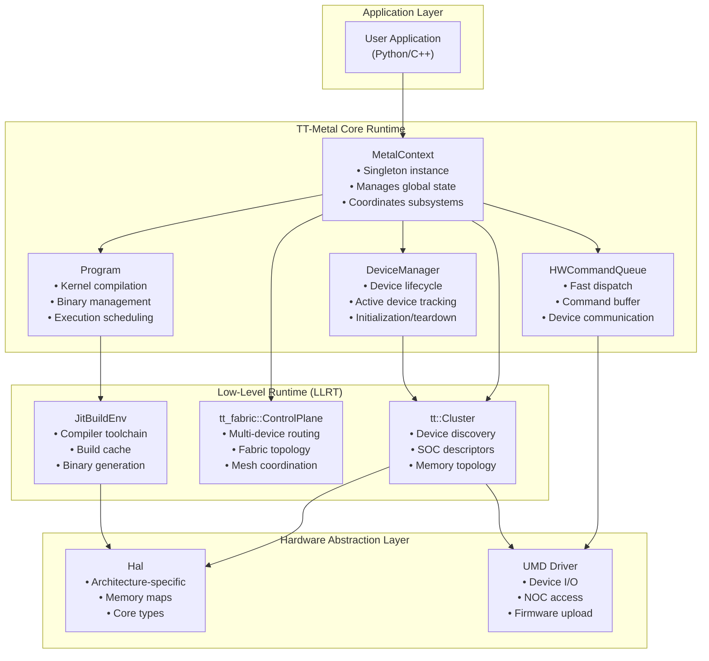
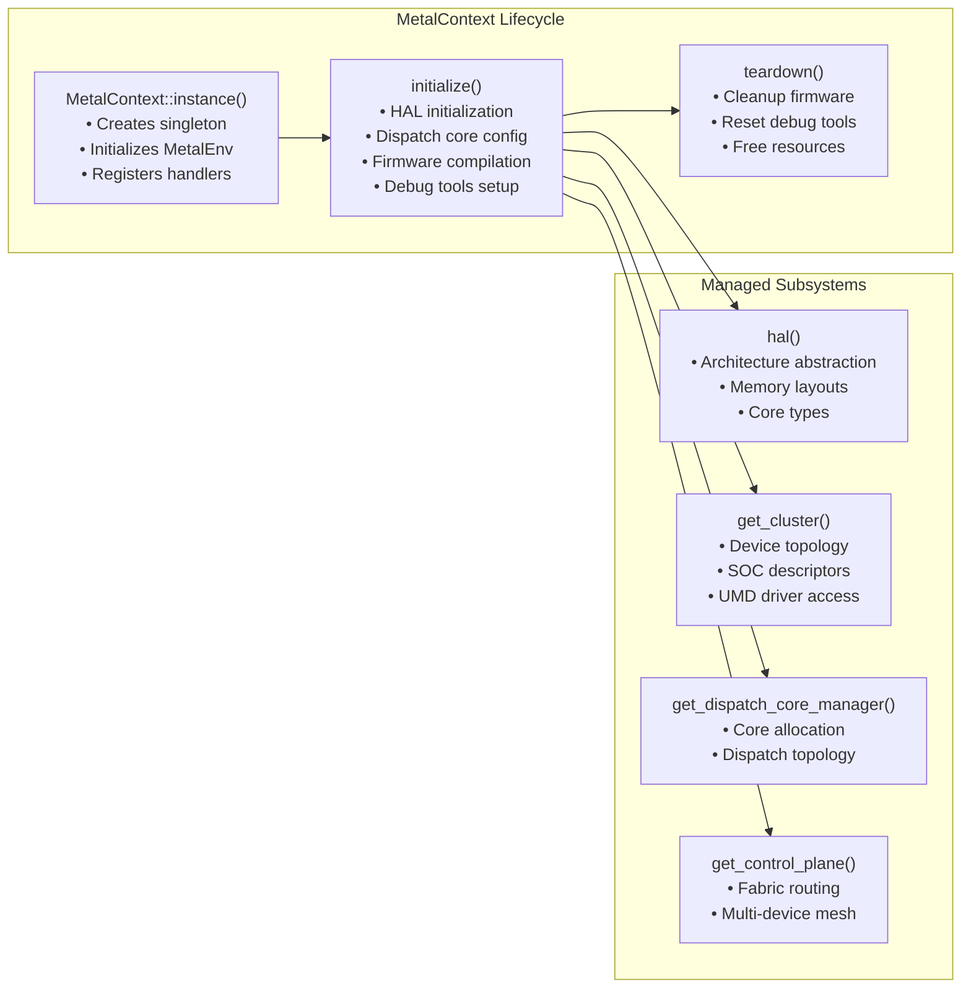
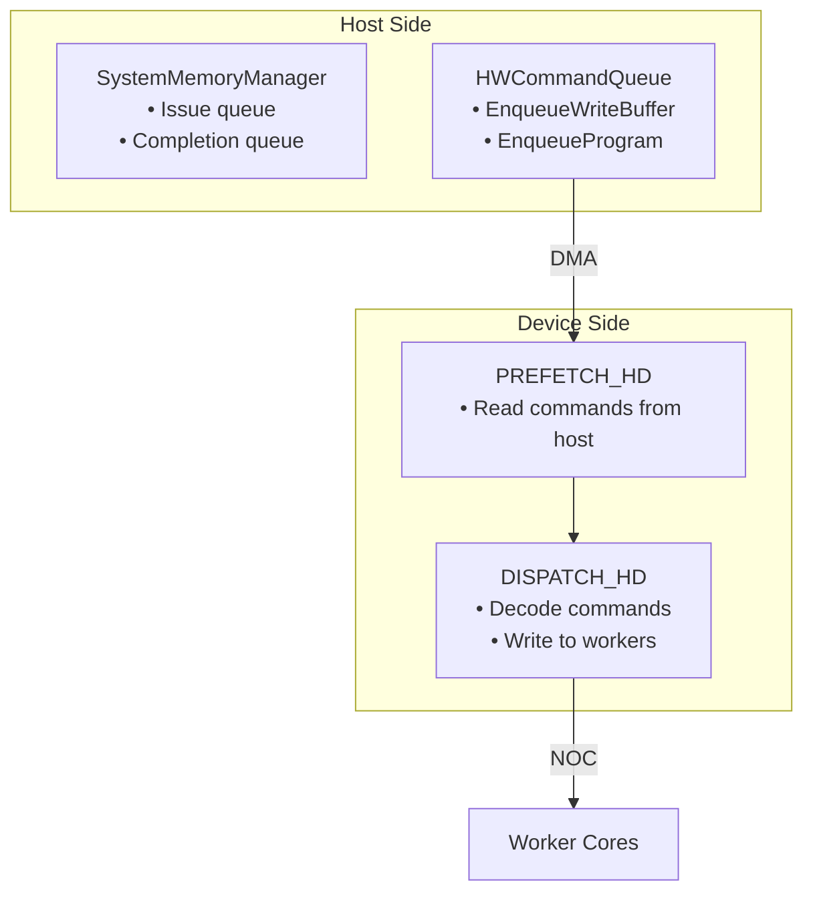

# Core Runtime System (TT-Metalium)

Relevant source files
*   [cmake/protobuf.cmake](https://github.com/tenstorrent/tt-metal/blob/f30f8df0/cmake/protobuf.cmake)
*   [docs/source/common/images/16LB_Cluster.png](https://github.com/tenstorrent/tt-metal/blob/f30f8df0/docs/source/common/images/16LB_Cluster.png)
*   [tests/tt_metal/distributed/multiprocess/test_sanity.cpp](https://github.com/tenstorrent/tt-metal/blob/f30f8df0/tests/tt_metal/distributed/multiprocess/test_sanity.cpp)
*   [tests/tt_metal/distributed/test_mesh_coord.cpp](https://github.com/tenstorrent/tt-metal/blob/f30f8df0/tests/tt_metal/distributed/test_mesh_coord.cpp)
*   [tests/tt_metal/distributed/test_mesh_device.cpp](https://github.com/tenstorrent/tt-metal/blob/f30f8df0/tests/tt_metal/distributed/test_mesh_device.cpp)
*   [tests/tt_metal/distributed/test_mesh_device_reshape.cpp](https://github.com/tenstorrent/tt-metal/blob/f30f8df0/tests/tt_metal/distributed/test_mesh_device_reshape.cpp)
*   [tests/tt_metal/distributed/test_mesh_device_view.cpp](https://github.com/tenstorrent/tt-metal/blob/f30f8df0/tests/tt_metal/distributed/test_mesh_device_view.cpp)
*   [tests/tt_metal/multihost/fabric_tests/mesh_socket_test_context.cpp](https://github.com/tenstorrent/tt-metal/blob/f30f8df0/tests/tt_metal/multihost/fabric_tests/mesh_socket_test_context.cpp)
*   [tests/tt_metal/tt_fabric/custom_mesh_descriptors/mgd2_syntax_check_mesh_graph_descriptor.textproto](https://github.com/tenstorrent/tt-metal/blob/f30f8df0/tests/tt_metal/tt_fabric/custom_mesh_descriptors/mgd2_syntax_check_mesh_graph_descriptor.textproto)
*   [tests/tt_metal/tt_fabric/fabric_router/test_control_plane_logical_to_physical.cpp](https://github.com/tenstorrent/tt-metal/blob/f30f8df0/tests/tt_metal/tt_fabric/fabric_router/test_control_plane_logical_to_physical.cpp)
*   [tests/tt_metal/tt_fabric/fabric_router/test_mesh_graph_descriptor.cpp](https://github.com/tenstorrent/tt-metal/blob/f30f8df0/tests/tt_metal/tt_fabric/fabric_router/test_mesh_graph_descriptor.cpp)
*   [tests/tt_metal/tt_fabric/fabric_router/test_multi_host.cpp](https://github.com/tenstorrent/tt-metal/blob/f30f8df0/tests/tt_metal/tt_fabric/fabric_router/test_multi_host.cpp)
*   [tests/tt_metal/tt_fabric/fabric_router/test_routing_tables.cpp](https://github.com/tenstorrent/tt-metal/blob/f30f8df0/tests/tt_metal/tt_fabric/fabric_router/test_routing_tables.cpp)
*   [tests/tt_metal/tt_fabric/system_health/test_system_health.cpp](https://github.com/tenstorrent/tt-metal/blob/f30f8df0/tests/tt_metal/tt_fabric/system_health/test_system_health.cpp)
*   [tests/tt_metal/tt_metal/common/multi_device_fixture.hpp](https://github.com/tenstorrent/tt-metal/blob/f30f8df0/tests/tt_metal/tt_metal/common/multi_device_fixture.hpp)
*   [tests/tt_metal/tt_metal/device/CMakeLists.txt](https://github.com/tenstorrent/tt-metal/blob/f30f8df0/tests/tt_metal/tt_metal/device/CMakeLists.txt)
*   [tests/tt_metal/tt_metal/device/test_simulator_device.cpp](https://github.com/tenstorrent/tt-metal/blob/f30f8df0/tests/tt_metal/tt_metal/device/test_simulator_device.cpp)
*   [tests/ttnn/unit_tests/gtests/multiprocess/test_host_all_gather.cpp](https://github.com/tenstorrent/tt-metal/blob/f30f8df0/tests/ttnn/unit_tests/gtests/multiprocess/test_host_all_gather.cpp)
*   [tests/ttnn/unit_tests/gtests/tensor/test_unit_mesh_utils.cpp](https://github.com/tenstorrent/tt-metal/blob/f30f8df0/tests/ttnn/unit_tests/gtests/tensor/test_unit_mesh_utils.cpp)
*   [tt_metal/api/tt-metalium/device.hpp](https://github.com/tenstorrent/tt-metal/blob/f30f8df0/tt_metal/api/tt-metalium/device.hpp)
*   [tt_metal/api/tt-metalium/experimental/fabric/mesh_graph_descriptor.hpp](https://github.com/tenstorrent/tt-metal/blob/f30f8df0/tt_metal/api/tt-metalium/experimental/fabric/mesh_graph_descriptor.hpp)
*   [tt_metal/api/tt-metalium/mesh_coord.hpp](https://github.com/tenstorrent/tt-metal/blob/f30f8df0/tt_metal/api/tt-metalium/mesh_coord.hpp)
*   [tt_metal/api/tt-metalium/mesh_device.hpp](https://github.com/tenstorrent/tt-metal/blob/f30f8df0/tt_metal/api/tt-metalium/mesh_device.hpp)
*   [tt_metal/api/tt-metalium/mesh_device_view.hpp](https://github.com/tenstorrent/tt-metal/blob/f30f8df0/tt_metal/api/tt-metalium/mesh_device_view.hpp)
*   [tt_metal/api/tt-metalium/system_mesh.hpp](https://github.com/tenstorrent/tt-metal/blob/f30f8df0/tt_metal/api/tt-metalium/system_mesh.hpp)
*   [tt_metal/common/mesh_coord.cpp](https://github.com/tenstorrent/tt-metal/blob/f30f8df0/tt_metal/common/mesh_coord.cpp)
*   [tt_metal/distributed/mesh_device.cpp](https://github.com/tenstorrent/tt-metal/blob/f30f8df0/tt_metal/distributed/mesh_device.cpp)
*   [tt_metal/distributed/mesh_device_view.cpp](https://github.com/tenstorrent/tt-metal/blob/f30f8df0/tt_metal/distributed/mesh_device_view.cpp)
*   [tt_metal/distributed/system_mesh.cpp](https://github.com/tenstorrent/tt-metal/blob/f30f8df0/tt_metal/distributed/system_mesh.cpp)
*   [tt_metal/fabric/MGD_README.md](https://github.com/tenstorrent/tt-metal/blob/f30f8df0/tt_metal/fabric/MGD_README.md?plain=1)
*   [tt_metal/fabric/control_plane.cpp](https://github.com/tenstorrent/tt-metal/blob/f30f8df0/tt_metal/fabric/control_plane.cpp)
*   [tt_metal/fabric/fabric.cpp](https://github.com/tenstorrent/tt-metal/blob/f30f8df0/tt_metal/fabric/fabric.cpp)
*   [tt_metal/fabric/fabric_host_utils.cpp](https://github.com/tenstorrent/tt-metal/blob/f30f8df0/tt_metal/fabric/fabric_host_utils.cpp)
*   [tt_metal/fabric/fabric_host_utils.hpp](https://github.com/tenstorrent/tt-metal/blob/f30f8df0/tt_metal/fabric/fabric_host_utils.hpp)
*   [tt_metal/fabric/mesh_graph.cpp](https://github.com/tenstorrent/tt-metal/blob/f30f8df0/tt_metal/fabric/mesh_graph.cpp)
*   [tt_metal/fabric/mesh_graph_descriptor.cpp](https://github.com/tenstorrent/tt-metal/blob/f30f8df0/tt_metal/fabric/mesh_graph_descriptor.cpp)
*   [tt_metal/fabric/mesh_graph_descriptors/single_bh_galaxy_mesh_graph_descriptor.textproto](https://github.com/tenstorrent/tt-metal/blob/f30f8df0/tt_metal/fabric/mesh_graph_descriptors/single_bh_galaxy_mesh_graph_descriptor.textproto)
*   [tt_metal/fabric/mesh_graph_descriptors/tg_mesh_graph_descriptor.textproto](https://github.com/tenstorrent/tt-metal/blob/f30f8df0/tt_metal/fabric/mesh_graph_descriptors/tg_mesh_graph_descriptor.textproto)
*   [tt_metal/fabric/protobuf/mesh_graph_descriptor.proto](https://github.com/tenstorrent/tt-metal/blob/f30f8df0/tt_metal/fabric/protobuf/mesh_graph_descriptor.proto)
*   [tt_metal/impl/allocator/allocator_state.cpp](https://github.com/tenstorrent/tt-metal/blob/f30f8df0/tt_metal/impl/allocator/allocator_state.cpp)
*   [tt_metal/impl/context/metal_context.cpp](https://github.com/tenstorrent/tt-metal/blob/f30f8df0/tt_metal/impl/context/metal_context.cpp)
*   [tt_metal/impl/context/metal_context.hpp](https://github.com/tenstorrent/tt-metal/blob/f30f8df0/tt_metal/impl/context/metal_context.hpp)
*   [tt_metal/impl/device/device.cpp](https://github.com/tenstorrent/tt-metal/blob/f30f8df0/tt_metal/impl/device/device.cpp)
*   [tt_metal/impl/device/device_impl.hpp](https://github.com/tenstorrent/tt-metal/blob/f30f8df0/tt_metal/impl/device/device_impl.hpp)
*   [tt_metal/impl/dispatch/command_queue_common.cpp](https://github.com/tenstorrent/tt-metal/blob/f30f8df0/tt_metal/impl/dispatch/command_queue_common.cpp)
*   [tt_metal/impl/dispatch/kernel_config/relay_mux.cpp](https://github.com/tenstorrent/tt-metal/blob/f30f8df0/tt_metal/impl/dispatch/kernel_config/relay_mux.cpp)
*   [tt_metal/impl/dispatch/kernel_config/relay_mux.hpp](https://github.com/tenstorrent/tt-metal/blob/f30f8df0/tt_metal/impl/dispatch/kernel_config/relay_mux.hpp)
*   [tt_metal/impl/dispatch/system_memory_manager.cpp](https://github.com/tenstorrent/tt-metal/blob/f30f8df0/tt_metal/impl/dispatch/system_memory_manager.cpp)
*   [tt_metal/impl/dispatch/system_memory_manager.hpp](https://github.com/tenstorrent/tt-metal/blob/f30f8df0/tt_metal/impl/dispatch/system_memory_manager.hpp)
*   [tt_metal/impl/dispatch/topology.cpp](https://github.com/tenstorrent/tt-metal/blob/f30f8df0/tt_metal/impl/dispatch/topology.cpp)
*   [tt_metal/impl/dispatch/topology.hpp](https://github.com/tenstorrent/tt-metal/blob/f30f8df0/tt_metal/impl/dispatch/topology.hpp)
*   [tt_metal/impl/sub_device/sub_device_manager.cpp](https://github.com/tenstorrent/tt-metal/blob/f30f8df0/tt_metal/impl/sub_device/sub_device_manager.cpp)
*   [tt_metal/impl/sub_device/sub_device_manager_tracker.cpp](https://github.com/tenstorrent/tt-metal/blob/f30f8df0/tt_metal/impl/sub_device/sub_device_manager_tracker.cpp)
*   [tt_metal/impl/sub_device/sub_device_manager_tracker.hpp](https://github.com/tenstorrent/tt-metal/blob/f30f8df0/tt_metal/impl/sub_device/sub_device_manager_tracker.hpp)
*   [tt_metal/jit_build/build.cpp](https://github.com/tenstorrent/tt-metal/blob/f30f8df0/tt_metal/jit_build/build.cpp)
*   [tt_metal/jit_build/build.hpp](https://github.com/tenstorrent/tt-metal/blob/f30f8df0/tt_metal/jit_build/build.hpp)
*   [tt_metal/jit_build/build_env_manager.cpp](https://github.com/tenstorrent/tt-metal/blob/f30f8df0/tt_metal/jit_build/build_env_manager.cpp)
*   [tt_metal/jit_build/build_env_manager.hpp](https://github.com/tenstorrent/tt-metal/blob/f30f8df0/tt_metal/jit_build/build_env_manager.hpp)
*   [tt_metal/llrt/rtoptions.cpp](https://github.com/tenstorrent/tt-metal/blob/f30f8df0/tt_metal/llrt/rtoptions.cpp)
*   [tt_metal/llrt/rtoptions.hpp](https://github.com/tenstorrent/tt-metal/blob/f30f8df0/tt_metal/llrt/rtoptions.hpp)
*   [tt_metal/llrt/tlb_config.cpp](https://github.com/tenstorrent/tt-metal/blob/f30f8df0/tt_metal/llrt/tlb_config.cpp)
*   [tt_metal/llrt/tlb_config.hpp](https://github.com/tenstorrent/tt-metal/blob/f30f8df0/tt_metal/llrt/tlb_config.hpp)
*   [tt_metal/llrt/tt_cluster.cpp](https://github.com/tenstorrent/tt-metal/blob/f30f8df0/tt_metal/llrt/tt_cluster.cpp)
*   [tt_metal/llrt/tt_cluster.hpp](https://github.com/tenstorrent/tt-metal/blob/f30f8df0/tt_metal/llrt/tt_cluster.hpp)
*   [ttnn/api/ttnn/tensor/unit_mesh/unit_mesh_utils.hpp](https://github.com/tenstorrent/tt-metal/blob/f30f8df0/ttnn/api/ttnn/tensor/unit_mesh/unit_mesh_utils.hpp)
*   [ttnn/core/distributed/host_ccl.cpp](https://github.com/tenstorrent/tt-metal/blob/f30f8df0/ttnn/core/distributed/host_ccl.cpp)
*   [ttnn/core/tensor/unit_mesh/unit_mesh_utils.cpp](https://github.com/tenstorrent/tt-metal/blob/f30f8df0/ttnn/core/tensor/unit_mesh/unit_mesh_utils.cpp)
*   [ttnn/cpp/ttnn/operations/experimental/adaptive_pool/adaptive_pool_utils.cpp](https://github.com/tenstorrent/tt-metal/blob/f30f8df0/ttnn/cpp/ttnn/operations/experimental/adaptive_pool/adaptive_pool_utils.cpp)

The Core Runtime System, also known as TT-Metalium, is the foundational layer of the tt-metal repository responsible for device management, program execution, kernel compilation, memory allocation, and multi-device coordination. It provides low-level abstractions for interacting with Tenstorrent hardware, managing device resources, and executing workloads across single or multiple chips.

This page covers the runtime system architecture, initialization flows, and core subsystems. For high-level neural network operations, see [Neural Network Operations (TTNN)](https://deepwiki.com/tenstorrent/tt-metal/4-neural-network-operations-(ttnn)). For build system details, see [Build and Packaging System](https://deepwiki.com/tenstorrent/tt-metal/5-build-and-packaging-system). For CI/CD infrastructure, see [CI/CD and Testing Infrastructure](https://deepwiki.com/tenstorrent/tt-metal/6-cicd-and-testing-infrastructure).

## System Architecture

The Core Runtime System consists of several layers that abstract hardware and provide execution primitives:

Title: TT-Metalium Architecture Layers

**Sources**: [tt_metal/impl/context/metal_context.cpp 137-149](https://github.com/tenstorrent/tt-metal/blob/f30f8df0/tt_metal/impl/context/metal_context.cpp#L137-L149)[tt_metal/impl/device/device.cpp 77-94](https://github.com/tenstorrent/tt-metal/blob/f30f8df0/tt_metal/impl/device/device.cpp#L77-L94)

## MetalContext: Global Runtime State

`MetalContext` is the singleton that manages all global runtime state and coordinates subsystems. Applications interact with the runtime through this context. It handles the transition from a "Cluster-aware" state to a "Dispatch-ready" state. For details, see [MetalContext and System Initialization](https://deepwiki.com/tenstorrent/tt-metal/2.1-metalcontext-and-system-initialization).

Title: MetalContext Lifecycle and Managed Entities

**Sources**: [tt_metal/impl/context/metal_context.cpp 63-90](https://github.com/tenstorrent/tt-metal/blob/f30f8df0/tt_metal/impl/context/metal_context.cpp#L63-L90)[tt_metal/impl/context/metal_context.cpp 152-183](https://github.com/tenstorrent/tt-metal/blob/f30f8df0/tt_metal/impl/context/metal_context.cpp#L152-L183)[tt_metal/impl/context/metal_context.hpp 56-130](https://github.com/tenstorrent/tt-metal/blob/f30f8df0/tt_metal/impl/context/metal_context.hpp#L56-L130)

### Key Components

| Component | Type | Purpose |
| --- | --- | --- |
| `MetalEnv` | Environment container | Encapsulates `Cluster`, `HAL`, `ControlPlane`, and `RunTimeOptions`. [tt_metal/impl/context/metal_context.cpp 65-67](https://github.com/tenstorrent/tt-metal/blob/f30f8df0/tt_metal/impl/context/metal_context.cpp#L65-L67) |
| `DeviceManager` | Device lifecycle | Tracks active devices, manages open/close operations. [tt_metal/impl/context/metal_context.cpp 47](https://github.com/tenstorrent/tt-metal/blob/f30f8df0/tt_metal/impl/context/metal_context.cpp#L47-L47) |
| `dispatch_core_manager` | Core Manager | Manages dispatch core assignment for fast dispatch. [tt_metal/impl/context/metal_context.cpp 58](https://github.com/tenstorrent/tt-metal/blob/f30f8df0/tt_metal/impl/context/metal_context.cpp#L58-L58) |
| `DispatchQueryManager` | Query interface | Provides information about dispatch cores and NOC routing. [tt_metal/impl/context/metal_context.cpp 57](https://github.com/tenstorrent/tt-metal/blob/f30f8df0/tt_metal/impl/context/metal_context.cpp#L57-L57) |
| `RiscFirmwareInitializer` | Firmware management | Compiles and loads firmware to device cores. [tt_metal/impl/context/metal_context.cpp 29](https://github.com/tenstorrent/tt-metal/blob/f30f8df0/tt_metal/impl/context/metal_context.cpp#L29-L29) |
| `WatcherServer` | Debug tool | Monitors device state, detects hangs and errors. [tt_metal/impl/context/metal_context.cpp 40](https://github.com/tenstorrent/tt-metal/blob/f30f8df0/tt_metal/impl/context/metal_context.cpp#L40-L40) |
| `DPrintServer` | Debug tool | Collects debug prints from device kernels. [tt_metal/impl/context/metal_context.cpp 34](https://github.com/tenstorrent/tt-metal/blob/f30f8df0/tt_metal/impl/context/metal_context.cpp#L34-L34) |

**Sources**: [tt_metal/impl/context/metal_context.cpp 19-61](https://github.com/tenstorrent/tt-metal/blob/f30f8df0/tt_metal/impl/context/metal_context.cpp#L19-L61)[tt_metal/impl/context/metal_context.hpp 96-112](https://github.com/tenstorrent/tt-metal/blob/f30f8df0/tt_metal/impl/context/metal_context.hpp#L96-L112)

## Device Abstraction

The `Device` class represents a single chip and provides the primary interface for device operations. `MeshDevice` extends this for multi-chip systems, providing a unified view of a collection of devices. For details, see [Device Abstraction Layer](https://deepwiki.com/tenstorrent/tt-metal/2.3-device-abstraction-layer) and [Multi-Device Execution and MeshWorkload](https://deepwiki.com/tenstorrent/tt-metal/2.10-multi-device-execution-and-meshworkload).

### Device Initialization

Title: Device Setup Sequence

**Sources**: [tt_metal/impl/device/device.cpp 77-94](https://github.com/tenstorrent/tt-metal/blob/f30f8df0/tt_metal/impl/device/device.cpp#L77-L94)[tt_metal/impl/device/device.cpp 143-173](https://github.com/tenstorrent/tt-metal/blob/f30f8df0/tt_metal/impl/device/device.cpp#L143-L173)[tt_metal/impl/device/device.cpp 177-180](https://github.com/tenstorrent/tt-metal/blob/f30f8df0/tt_metal/impl/device/device.cpp#L177-L180)

### Device Interface Hierarchy

Title: Device Code Entity Relationship

**Sources**: [tt_metal/impl/device/device.cpp 77-89](https://github.com/tenstorrent/tt-metal/blob/f30f8df0/tt_metal/impl/device/device.cpp#L77-L89)[tt_metal/api/tt-metalium/mesh_device.hpp 75-119](https://github.com/tenstorrent/tt-metal/blob/f30f8df0/tt_metal/api/tt-metalium/mesh_device.hpp#L75-L119)[tt_metal/distributed/mesh_device.cpp 162-193](https://github.com/tenstorrent/tt-metal/blob/f30f8df0/tt_metal/distributed/mesh_device.cpp#L162-L193)

## Program and Kernel System

Programs contain kernels that execute on device cores. The runtime compiles kernels via JIT, caches binaries, and manages execution. For details, see [Program and Kernel System](https://deepwiki.com/tenstorrent/tt-metal/2.4-program-and-kernel-system) and [JIT Build System and Kernel Compilation](https://deepwiki.com/tenstorrent/tt-metal/2.6-jit-build-system-and-kernel-compilation).

### Kernel Compilation Flow

Title: JIT Compilation Pipeline

**Sources**: [tt_metal/jit_build/build.cpp 101-135](https://github.com/tenstorrent/tt-metal/blob/f30f8df0/tt_metal/jit_build/build.cpp#L101-L135)[tt_metal/jit_build/build.cpp 143-164](https://github.com/tenstorrent/tt-metal/blob/f30f8df0/tt_metal/jit_build/build.cpp#L143-L164)[tt_metal/jit_build/build.cpp 204-210](https://github.com/tenstorrent/tt-metal/blob/f30f8df0/tt_metal/jit_build/build.cpp#L204-L210)

## Fast Dispatch and Command Queue

Fast Dispatch uses dedicated dispatch cores (prefetcher and dispatcher) to process commands from the host. `HWCommandQueue` manages the host-device command queue interface. For details, see [Fast Dispatch and Command Queue System](https://deepwiki.com/tenstorrent/tt-metal/2.5-fast-dispatch-and-command-queue-system).

### Command Queue Architecture

Title: Fast Dispatch Topology

**Sources**: [tt_metal/impl/device/device.cpp 177-180](https://github.com/tenstorrent/tt-metal/blob/f30f8df0/tt_metal/impl/device/device.cpp#L177-L180)[tt_metal/impl/dispatch/topology.cpp 125-129](https://github.com/tenstorrent/tt-metal/blob/f30f8df0/tt_metal/impl/dispatch/topology.cpp#L125-L129)[tt_metal/impl/dispatch/topology.cpp 153-170](https://github.com/tenstorrent/tt-metal/blob/f30f8df0/tt_metal/impl/dispatch/topology.cpp#L153-L170)

## Memory Management

The runtime manages L1 and DRAM memory through allocators. The primary allocator is `L1BankingAllocator`, which divides L1 into banks to support interleaved data layouts. For details, see [Memory Management and Allocators](https://deepwiki.com/tenstorrent/tt-metal/2.7-memory-management-and-allocators).

| Region | Type | Purpose |
| --- | --- | --- |
| `L1` | On-chip SRAM | High-speed workspace for kernels. [tt_metal/impl/device/device.cpp 166-167](https://github.com/tenstorrent/tt-metal/blob/f30f8df0/tt_metal/impl/device/device.cpp#L166-L167) |
| `DRAM` | Off-chip Memory | Large data storage interleaved across banks. [tt_metal/impl/device/device.cpp 151-152](https://github.com/tenstorrent/tt-metal/blob/f30f8df0/tt_metal/impl/device/device.cpp#L151-L152) |
| `l1_small_size` | Partition | Reserved space for small, frequent allocations. [tt_metal/impl/device/device.cpp 144](https://github.com/tenstorrent/tt-metal/blob/f30f8df0/tt_metal/impl/device/device.cpp#L144-L144) |

**Sources**: [tt_metal/impl/device/device.cpp 143-173](https://github.com/tenstorrent/tt-metal/blob/f30f8df0/tt_metal/impl/device/device.cpp#L143-L173)[tt_metal/impl/device/device.cpp 160-161](https://github.com/tenstorrent/tt-metal/blob/f30f8df0/tt_metal/impl/device/device.cpp#L160-L161)

## Runtime Options and Configuration

`RunTimeOptions` provides a centralized configuration system loaded from environment variables (e.g., `TT_METAL_CACHE`, `TT_METAL_WATCHER`). For details, see [Runtime Options and Configuration](https://deepwiki.com/tenstorrent/tt-metal/2.9-runtime-options-and-configuration).

| Variable | Property | Purpose |
| --- | --- | --- |
| `TT_METAL_CACHE` | `cache_dir_` | Kernel build cache directory. [tt_metal/llrt/rtoptions.cpp 52](https://github.com/tenstorrent/tt-metal/blob/f30f8df0/tt_metal/llrt/rtoptions.cpp#L52-L52) |
| `TT_METAL_WATCHER` | `watcher_settings` | Enable device-side hang/error monitoring. [tt_metal/llrt/rtoptions.cpp 204-206](https://github.com/tenstorrent/tt-metal/blob/f30f8df0/tt_metal/llrt/rtoptions.cpp#L204-L206) |
| `TT_METAL_DPRINT` | `RunTimeDebugFeatureDprint` | Enable debug printing from kernels. [tt_metal/llrt/rtoptions.cpp 33-34](https://github.com/tenstorrent/tt-metal/blob/f30f8df0/tt_metal/llrt/rtoptions.cpp#L33-L34) |

**Sources**: [tt_metal/llrt/rtoptions.hpp 153-213](https://github.com/tenstorrent/tt-metal/blob/f30f8df0/tt_metal/llrt/rtoptions.hpp#L153-L213)[tt_metal/llrt/rtoptions.cpp 47-133](https://github.com/tenstorrent/tt-metal/blob/f30f8df0/tt_metal/llrt/rtoptions.cpp#L47-L133)

## Key Files Reference

| Subsystem | Primary Implementation Files |
| --- | --- |
| **Initialization** | [tt_metal/impl/context/metal_context.cpp](https://github.com/tenstorrent/tt-metal/blob/f30f8df0/tt_metal/impl/context/metal_context.cpp)[tt_metal/impl/context/metal_context.hpp](https://github.com/tenstorrent/tt-metal/blob/f30f8df0/tt_metal/impl/context/metal_context.hpp) |
| **Device Mgmt** | [tt_metal/impl/device/device.cpp](https://github.com/tenstorrent/tt-metal/blob/f30f8df0/tt_metal/impl/device/device.cpp)[tt_metal/distributed/mesh_device.cpp](https://github.com/tenstorrent/tt-metal/blob/f30f8df0/tt_metal/distributed/mesh_device.cpp) |
| **Dispatch/CQ** | [tt_metal/impl/dispatch/topology.cpp](https://github.com/tenstorrent/tt-metal/blob/f30f8df0/tt_metal/impl/dispatch/topology.cpp)[tt_metal/impl/device/device.cpp](https://github.com/tenstorrent/tt-metal/blob/f30f8df0/tt_metal/impl/device/device.cpp) |
| **JIT Build** | [tt_metal/jit_build/build.cpp](https://github.com/tenstorrent/tt-metal/blob/f30f8df0/tt_metal/jit_build/build.cpp)[tt_metal/jit_build/build_env_manager.cpp](https://github.com/tenstorrent/tt-metal/blob/f30f8df0/tt_metal/jit_build/build_env_manager.cpp) |
| **Runtime Config** | [tt_metal/llrt/rtoptions.cpp](https://github.com/tenstorrent/tt-metal/blob/f30f8df0/tt_metal/llrt/rtoptions.cpp)[tt_metal/llrt/rtoptions.hpp](https://github.com/tenstorrent/tt-metal/blob/f30f8df0/tt_metal/llrt/rtoptions.hpp) |
| **Cluster/Discovery** | [tt_metal/llrt/tt_cluster.cpp](https://github.com/tenstorrent/tt-metal/blob/f30f8df0/tt_metal/llrt/tt_cluster.cpp)[tt_metal/llrt/tt_cluster.hpp](https://github.com/tenstorrent/tt-metal/blob/f30f8df0/tt_metal/llrt/tt_cluster.hpp) |

**Sources**: Citations integrated within the tables and diagrams above.

This wiki is featured in the [repository](https://github.com/tenstorrent/tt-metal/blob/main/README.md)

Dismiss
Refresh this wiki

Enter email to refresh