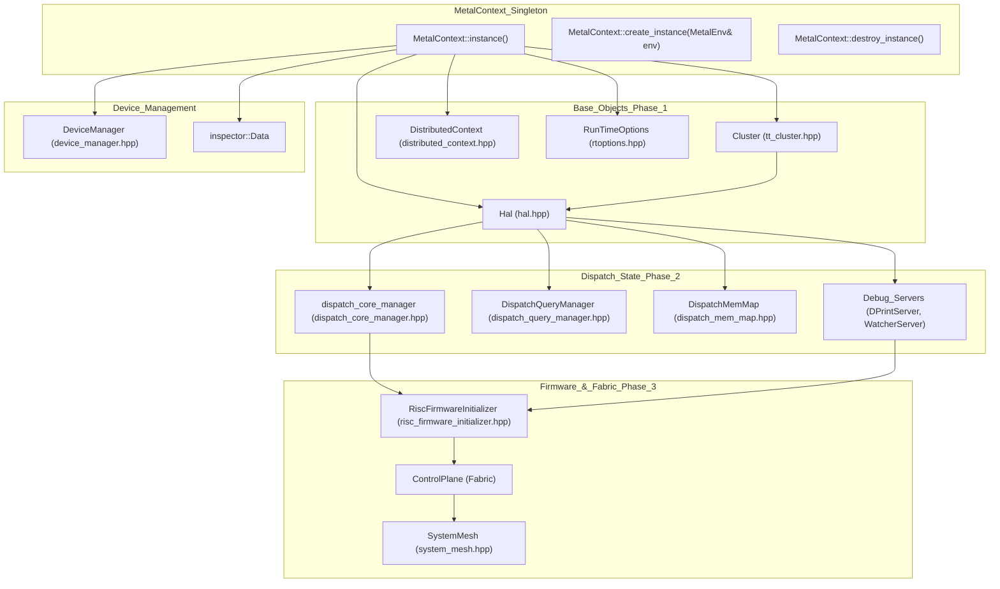
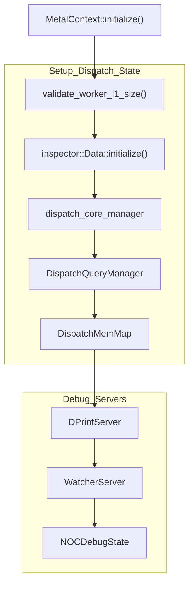
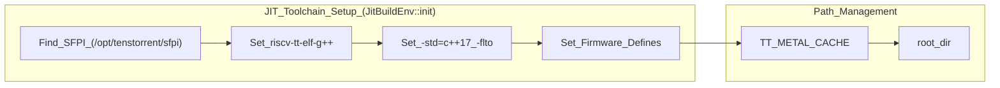
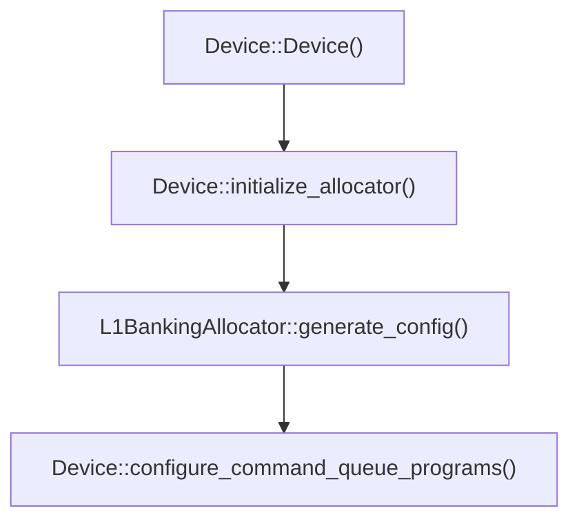
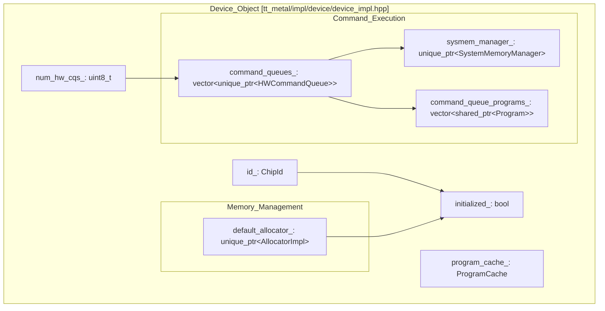
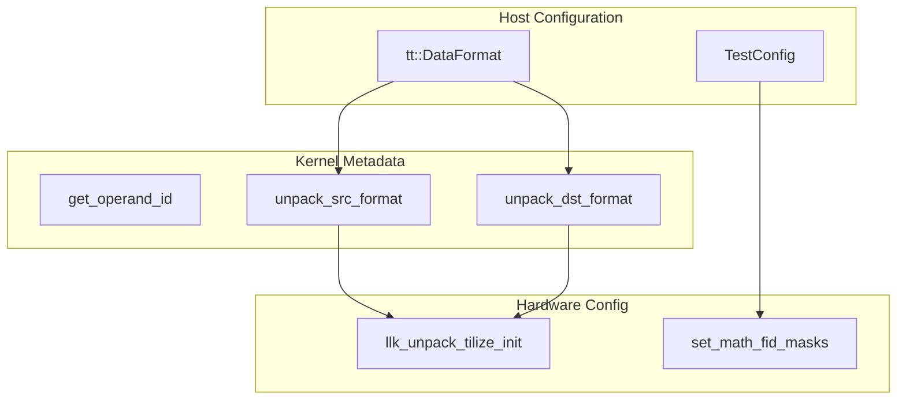

# MetalContext and System Initialization

Relevant source files
*   [cmake/protobuf.cmake](https://github.com/tenstorrent/tt-metal/blob/f30f8df0/cmake/protobuf.cmake)
*   [docs/source/common/images/16LB_Cluster.png](https://github.com/tenstorrent/tt-metal/blob/f30f8df0/docs/source/common/images/16LB_Cluster.png)
*   [tests/tt_metal/tt_fabric/custom_mesh_descriptors/mgd2_syntax_check_mesh_graph_descriptor.textproto](https://github.com/tenstorrent/tt-metal/blob/f30f8df0/tests/tt_metal/tt_fabric/custom_mesh_descriptors/mgd2_syntax_check_mesh_graph_descriptor.textproto)
*   [tests/tt_metal/tt_fabric/fabric_router/test_control_plane_logical_to_physical.cpp](https://github.com/tenstorrent/tt-metal/blob/f30f8df0/tests/tt_metal/tt_fabric/fabric_router/test_control_plane_logical_to_physical.cpp)
*   [tests/tt_metal/tt_fabric/fabric_router/test_mesh_graph_descriptor.cpp](https://github.com/tenstorrent/tt-metal/blob/f30f8df0/tests/tt_metal/tt_fabric/fabric_router/test_mesh_graph_descriptor.cpp)
*   [tests/tt_metal/tt_fabric/fabric_router/test_multi_host.cpp](https://github.com/tenstorrent/tt-metal/blob/f30f8df0/tests/tt_metal/tt_fabric/fabric_router/test_multi_host.cpp)
*   [tests/tt_metal/tt_fabric/fabric_router/test_routing_tables.cpp](https://github.com/tenstorrent/tt-metal/blob/f30f8df0/tests/tt_metal/tt_fabric/fabric_router/test_routing_tables.cpp)
*   [tests/tt_metal/tt_fabric/system_health/test_system_health.cpp](https://github.com/tenstorrent/tt-metal/blob/f30f8df0/tests/tt_metal/tt_fabric/system_health/test_system_health.cpp)
*   [tests/tt_metal/tt_metal/device/CMakeLists.txt](https://github.com/tenstorrent/tt-metal/blob/f30f8df0/tests/tt_metal/tt_metal/device/CMakeLists.txt)
*   [tests/tt_metal/tt_metal/device/test_simulator_device.cpp](https://github.com/tenstorrent/tt-metal/blob/f30f8df0/tests/tt_metal/tt_metal/device/test_simulator_device.cpp)
*   [tt_metal/api/tt-metalium/experimental/fabric/mesh_graph_descriptor.hpp](https://github.com/tenstorrent/tt-metal/blob/f30f8df0/tt_metal/api/tt-metalium/experimental/fabric/mesh_graph_descriptor.hpp)
*   [tt_metal/api/tt-metalium/hal_types.hpp](https://github.com/tenstorrent/tt-metal/blob/f30f8df0/tt_metal/api/tt-metalium/hal_types.hpp)
*   [tt_metal/fabric/MGD_README.md](https://github.com/tenstorrent/tt-metal/blob/f30f8df0/tt_metal/fabric/MGD_README.md?plain=1)
*   [tt_metal/fabric/control_plane.cpp](https://github.com/tenstorrent/tt-metal/blob/f30f8df0/tt_metal/fabric/control_plane.cpp)
*   [tt_metal/fabric/fabric.cpp](https://github.com/tenstorrent/tt-metal/blob/f30f8df0/tt_metal/fabric/fabric.cpp)
*   [tt_metal/fabric/fabric_host_utils.cpp](https://github.com/tenstorrent/tt-metal/blob/f30f8df0/tt_metal/fabric/fabric_host_utils.cpp)
*   [tt_metal/fabric/fabric_host_utils.hpp](https://github.com/tenstorrent/tt-metal/blob/f30f8df0/tt_metal/fabric/fabric_host_utils.hpp)
*   [tt_metal/fabric/mesh_graph.cpp](https://github.com/tenstorrent/tt-metal/blob/f30f8df0/tt_metal/fabric/mesh_graph.cpp)
*   [tt_metal/fabric/mesh_graph_descriptor.cpp](https://github.com/tenstorrent/tt-metal/blob/f30f8df0/tt_metal/fabric/mesh_graph_descriptor.cpp)
*   [tt_metal/fabric/mesh_graph_descriptors/single_bh_galaxy_mesh_graph_descriptor.textproto](https://github.com/tenstorrent/tt-metal/blob/f30f8df0/tt_metal/fabric/mesh_graph_descriptors/single_bh_galaxy_mesh_graph_descriptor.textproto)
*   [tt_metal/fabric/mesh_graph_descriptors/tg_mesh_graph_descriptor.textproto](https://github.com/tenstorrent/tt-metal/blob/f30f8df0/tt_metal/fabric/mesh_graph_descriptors/tg_mesh_graph_descriptor.textproto)
*   [tt_metal/fabric/protobuf/mesh_graph_descriptor.proto](https://github.com/tenstorrent/tt-metal/blob/f30f8df0/tt_metal/fabric/protobuf/mesh_graph_descriptor.proto)
*   [tt_metal/impl/context/metal_context.cpp](https://github.com/tenstorrent/tt-metal/blob/f30f8df0/tt_metal/impl/context/metal_context.cpp)
*   [tt_metal/impl/context/metal_context.hpp](https://github.com/tenstorrent/tt-metal/blob/f30f8df0/tt_metal/impl/context/metal_context.hpp)
*   [tt_metal/impl/dispatch/command_queue_common.cpp](https://github.com/tenstorrent/tt-metal/blob/f30f8df0/tt_metal/impl/dispatch/command_queue_common.cpp)
*   [tt_metal/impl/dispatch/kernel_config/relay_mux.cpp](https://github.com/tenstorrent/tt-metal/blob/f30f8df0/tt_metal/impl/dispatch/kernel_config/relay_mux.cpp)
*   [tt_metal/impl/dispatch/kernel_config/relay_mux.hpp](https://github.com/tenstorrent/tt-metal/blob/f30f8df0/tt_metal/impl/dispatch/kernel_config/relay_mux.hpp)
*   [tt_metal/impl/dispatch/system_memory_manager.cpp](https://github.com/tenstorrent/tt-metal/blob/f30f8df0/tt_metal/impl/dispatch/system_memory_manager.cpp)
*   [tt_metal/impl/dispatch/system_memory_manager.hpp](https://github.com/tenstorrent/tt-metal/blob/f30f8df0/tt_metal/impl/dispatch/system_memory_manager.hpp)
*   [tt_metal/impl/dispatch/topology.cpp](https://github.com/tenstorrent/tt-metal/blob/f30f8df0/tt_metal/impl/dispatch/topology.cpp)
*   [tt_metal/impl/dispatch/topology.hpp](https://github.com/tenstorrent/tt-metal/blob/f30f8df0/tt_metal/impl/dispatch/topology.hpp)
*   [tt_metal/jit_build/build.cpp](https://github.com/tenstorrent/tt-metal/blob/f30f8df0/tt_metal/jit_build/build.cpp)
*   [tt_metal/jit_build/build.hpp](https://github.com/tenstorrent/tt-metal/blob/f30f8df0/tt_metal/jit_build/build.hpp)
*   [tt_metal/jit_build/build_env_manager.cpp](https://github.com/tenstorrent/tt-metal/blob/f30f8df0/tt_metal/jit_build/build_env_manager.cpp)
*   [tt_metal/jit_build/build_env_manager.hpp](https://github.com/tenstorrent/tt-metal/blob/f30f8df0/tt_metal/jit_build/build_env_manager.hpp)
*   [tt_metal/llrt/hal.cpp](https://github.com/tenstorrent/tt-metal/blob/f30f8df0/tt_metal/llrt/hal.cpp)
*   [tt_metal/llrt/hal.hpp](https://github.com/tenstorrent/tt-metal/blob/f30f8df0/tt_metal/llrt/hal.hpp)
*   [tt_metal/llrt/hal/tt-1xx/blackhole/bh_hal.cpp](https://github.com/tenstorrent/tt-metal/blob/f30f8df0/tt_metal/llrt/hal/tt-1xx/blackhole/bh_hal.cpp)
*   [tt_metal/llrt/hal/tt-1xx/blackhole/bh_hal_active_eth.cpp](https://github.com/tenstorrent/tt-metal/blob/f30f8df0/tt_metal/llrt/hal/tt-1xx/blackhole/bh_hal_active_eth.cpp)
*   [tt_metal/llrt/hal/tt-1xx/blackhole/bh_hal_idle_eth.cpp](https://github.com/tenstorrent/tt-metal/blob/f30f8df0/tt_metal/llrt/hal/tt-1xx/blackhole/bh_hal_idle_eth.cpp)
*   [tt_metal/llrt/hal/tt-1xx/blackhole/bh_hal_tensix.cpp](https://github.com/tenstorrent/tt-metal/blob/f30f8df0/tt_metal/llrt/hal/tt-1xx/blackhole/bh_hal_tensix.cpp)
*   [tt_metal/llrt/hal/tt-1xx/wormhole/wh_hal.cpp](https://github.com/tenstorrent/tt-metal/blob/f30f8df0/tt_metal/llrt/hal/tt-1xx/wormhole/wh_hal.cpp)
*   [tt_metal/llrt/hal/tt-1xx/wormhole/wh_hal_active_eth.cpp](https://github.com/tenstorrent/tt-metal/blob/f30f8df0/tt_metal/llrt/hal/tt-1xx/wormhole/wh_hal_active_eth.cpp)
*   [tt_metal/llrt/hal/tt-1xx/wormhole/wh_hal_idle_eth.cpp](https://github.com/tenstorrent/tt-metal/blob/f30f8df0/tt_metal/llrt/hal/tt-1xx/wormhole/wh_hal_idle_eth.cpp)
*   [tt_metal/llrt/hal/tt-1xx/wormhole/wh_hal_tensix.cpp](https://github.com/tenstorrent/tt-metal/blob/f30f8df0/tt_metal/llrt/hal/tt-1xx/wormhole/wh_hal_tensix.cpp)
*   [tt_metal/llrt/hal/tt-2xx/quasar/qa_hal.cpp](https://github.com/tenstorrent/tt-metal/blob/f30f8df0/tt_metal/llrt/hal/tt-2xx/quasar/qa_hal.cpp)
*   [tt_metal/llrt/hal/tt-2xx/quasar/qa_hal_active_eth.cpp](https://github.com/tenstorrent/tt-metal/blob/f30f8df0/tt_metal/llrt/hal/tt-2xx/quasar/qa_hal_active_eth.cpp)
*   [tt_metal/llrt/hal/tt-2xx/quasar/qa_hal_idle_eth.cpp](https://github.com/tenstorrent/tt-metal/blob/f30f8df0/tt_metal/llrt/hal/tt-2xx/quasar/qa_hal_idle_eth.cpp)
*   [tt_metal/llrt/hal/tt-2xx/quasar/qa_hal_tensix.cpp](https://github.com/tenstorrent/tt-metal/blob/f30f8df0/tt_metal/llrt/hal/tt-2xx/quasar/qa_hal_tensix.cpp)
*   [tt_metal/llrt/rtoptions.cpp](https://github.com/tenstorrent/tt-metal/blob/f30f8df0/tt_metal/llrt/rtoptions.cpp)
*   [tt_metal/llrt/rtoptions.hpp](https://github.com/tenstorrent/tt-metal/blob/f30f8df0/tt_metal/llrt/rtoptions.hpp)
*   [tt_metal/llrt/tlb_config.cpp](https://github.com/tenstorrent/tt-metal/blob/f30f8df0/tt_metal/llrt/tlb_config.cpp)
*   [tt_metal/llrt/tlb_config.hpp](https://github.com/tenstorrent/tt-metal/blob/f30f8df0/tt_metal/llrt/tlb_config.hpp)
*   [tt_metal/llrt/tt_cluster.cpp](https://github.com/tenstorrent/tt-metal/blob/f30f8df0/tt_metal/llrt/tt_cluster.cpp)
*   [tt_metal/llrt/tt_cluster.hpp](https://github.com/tenstorrent/tt-metal/blob/f30f8df0/tt_metal/llrt/tt_cluster.hpp)

## Purpose and Scope

This page covers the `MetalContext` singleton and the system initialization sequence in TT-Metalium. `MetalContext` serves as the central coordination point for global state management, orchestrating the initialization and teardown of core runtime components including the hardware cluster interface, Hardware Abstraction Layer (HAL), dispatch systems, and firmware.

For information about specific device management and device creation, see [Device Abstraction Layer (2.3)](https://github.com/tenstorrent/tt-metal/blob/f30f8df0/Device%20Abstraction%20Layer%20(2.3)) For details on the JIT compilation process, see [JIT Build System and Kernel Compilation (2.6)](https://github.com/tenstorrent/tt-metal/blob/f30f8df0/JIT%20Build%20System%20and%20Kernel%20Compilation%20(2.6)) For dispatch architecture specifics, see [Fast Dispatch and Command Queue System (2.5)](https://github.com/tenstorrent/tt-metal/blob/f30f8df0/Fast%20Dispatch%20and%20Command%20Queue%20System%20(2.5))

* * *

## MetalContext Overview

The `MetalContext` class is implemented as a singleton that manages the lifecycle of all global runtime state in TT-Metalium. It provides centralized access to core subsystems and ensures proper initialization ordering and dependency management.

**Key Responsibilities:**

*   Singleton instance management with thread-safe initialization using `g_instance_mutex`[tt_metal/impl/context/metal_context.cpp 65-70](https://github.com/tenstorrent/tt-metal/blob/f30f8df0/tt_metal/impl/context/metal_context.cpp#L65-L70)
*   Ordered initialization of dependent subsystems (Cluster → HAL → Dispatch → Firmware).
*   Global state access for `Cluster`, `Hal`, `RunTimeOptions`, and various managers [tt_metal/impl/context/metal_context.hpp 56-160](https://github.com/tenstorrent/tt-metal/blob/f30f8df0/tt_metal/impl/context/metal_context.hpp#L56-L160)
*   Multi-context support via `ContextId`, allowing for isolated execution environments [tt_metal/impl/context/metal_context.cpp 71-90](https://github.com/tenstorrent/tt-metal/blob/f30f8df0/tt_metal/impl/context/metal_context.cpp#L71-L90)
*   Configuration management through `RunTimeOptions` and `MetalEnv`.

**Code Entity Mapping:**

*   `MetalContext` class: [tt_metal/impl/context/metal_context.hpp 56-160](https://github.com/tenstorrent/tt-metal/blob/f30f8df0/tt_metal/impl/context/metal_context.hpp#L56-L160)
*   Singleton access via `MetalContext::instance()`: [tt_metal/impl/context/metal_context.cpp 63-66](https://github.com/tenstorrent/tt-metal/blob/f30f8df0/tt_metal/impl/context/metal_context.cpp#L63-L66)
*   Context lifecycle management: `create_instance`[tt_metal/impl/context/metal_context.cpp 69](https://github.com/tenstorrent/tt-metal/blob/f30f8df0/tt_metal/impl/context/metal_context.cpp#L69-L69)`destroy_instance`[tt_metal/impl/context/metal_context.cpp 71-72](https://github.com/tenstorrent/tt-metal/blob/f30f8df0/tt_metal/impl/context/metal_context.cpp#L71-L72)

### System Architecture Diagram




The following diagram shows how `MetalContext` orchestrates the various subsystems during initialization.

**Sources:**[tt_metal/impl/context/metal_context.cpp 152-210](https://github.com/tenstorrent/tt-metal/blob/f30f8df0/tt_metal/impl/context/metal_context.cpp#L152-L210)[tt_metal/impl/context/metal_context.hpp 56-160](https://github.com/tenstorrent/tt-metal/blob/f30f8df0/tt_metal/impl/context/metal_context.hpp#L56-L160)

* * *

## Initialization Phases

### Phase 1: Base Objects Initialization

Base objects are initialized during `MetalContext` construction. This phase establishes the hardware connection and the abstraction layer.

| Component | Type | Purpose |
| --- | --- | --- |
| `Cluster` | Hardware Interface | Manages UMD driver, device discovery, SOC descriptors, and low-level memory operations [tt_metal/llrt/tt_cluster.cpp 88-113](https://github.com/tenstorrent/tt-metal/blob/f30f8df0/tt_metal/llrt/tt_cluster.cpp#L88-L113) |
| `Hal` | Hardware Abstraction | Provides architecture-specific constants (Wormhole vs Blackhole), memory addresses, and core types [tt_metal/llrt/hal.hpp 46-160](https://github.com/tenstorrent/tt-metal/blob/f30f8df0/tt_metal/llrt/hal.hpp#L46-L160) |
| `DistributedContext` | Multi-host | Manages the world state for multi-host/distributed execution [tt_metal/impl/context/metal_context.hpp 142-148](https://github.com/tenstorrent/tt-metal/blob/f30f8df0/tt_metal/impl/context/metal_context.hpp#L142-L148) |
| `RunTimeOptions` | Configuration | Parses environment variables (e.g., `TT_METAL_WATCHER`) and manages runtime settings [tt_metal/llrt/rtoptions.cpp 47-135](https://github.com/tenstorrent/tt-metal/blob/f30f8df0/tt_metal/llrt/rtoptions.cpp#L47-L135) |

**Key Functions:**

*   `MetalContext::initialize()`: Orchestrates the transition from base objects to a fully functional runtime [tt_metal/impl/context/metal_context.cpp 152-180](https://github.com/tenstorrent/tt-metal/blob/f30f8df0/tt_metal/impl/context/metal_context.cpp#L152-L180)

### Phase 2: Dispatch and Debug State




Dispatch state is initialized explicitly via `MetalContext::initialize()`. This phase sets up the infrastructure required to send commands to the hardware.

**Sources:**[tt_metal/impl/context/metal_context.cpp 93-105](https://github.com/tenstorrent/tt-metal/blob/f30f8df0/tt_metal/impl/context/metal_context.cpp#L93-L105)[tt_metal/impl/context/metal_context.cpp 152-180](https://github.com/tenstorrent/tt-metal/blob/f30f8df0/tt_metal/impl/context/metal_context.cpp#L152-L180)[tt_metal/impl/context/metal_context.hpp 96-112](https://github.com/tenstorrent/tt-metal/blob/f30f8df0/tt_metal/impl/context/metal_context.hpp#L96-L112)

### Phase 3: Firmware and Fabric

The final phase involves preparing the RISC-V firmware that runs on the Tenstorrent cores and setting up the Fabric control plane for multi-chip communication.

*   **Firmware Build**: `RiscFirmwareInitializer` JIT-compiles firmware for each processor type (BRISC, NCRISC, TRISC, ERISC) based on the `fw_compile_hash` derived from `rtoptions().get_compile_hash_string()`[tt_metal/impl/context/metal_context.cpp 169-170](https://github.com/tenstorrent/tt-metal/blob/f30f8df0/tt_metal/impl/context/metal_context.cpp#L169-L170)
*   **Fabric Setup**: If `initialize_fabric_and_dispatch_fw` is requested, the system initializes the `ControlPlane` and `SystemMesh`[tt_metal/impl/context/metal_context.cpp 145-146](https://github.com/tenstorrent/tt-metal/blob/f30f8df0/tt_metal/impl/context/metal_context.cpp#L145-L146) The `ControlPlane` is responsible for managing the fabric, including routing table generation and inter-chip communication. It uses `MeshGraph` to represent the physical topology and `TopologyMapper` to map logical to physical chip IDs [tt_metal/fabric/control_plane.cpp 47-63](https://github.com/tenstorrent/tt-metal/blob/f30f8df0/tt_metal/fabric/control_plane.cpp#L47-L63)[tt_metal/fabric/mesh_graph.cpp 107-131](https://github.com/tenstorrent/tt-metal/blob/f30f8df0/tt_metal/fabric/mesh_graph.cpp#L107-L131)

* * *

## RunTimeOptions and Environment Configuration

The `RunTimeOptions` class is the central repository for all environment-variable driven configurations. It reads variables like `TT_METAL_CACHE` and `ARCH_NAME` to determine system behavior [tt_metal/llrt/rtoptions.cpp 52-59](https://github.com/tenstorrent/tt-metal/blob/f30f8df0/tt_metal/llrt/rtoptions.cpp#L52-L59)

### Key Environment Variables

| Variable | Code Member | Purpose |
| --- | --- | --- |
| `TT_METAL_WATCHER` | `watcher_settings` | Enables the Watcher debug system for hang detection [tt_metal/llrt/rtoptions.cpp 134](https://github.com/tenstorrent/tt-metal/blob/f30f8df0/tt_metal/llrt/rtoptions.cpp#L134-L134) |
| `TT_METAL_SLOW_DISPATCH_MODE` | `using_slow_dispatch` | Forces the system into slow dispatch (MMIO-based) mode [tt_metal/llrt/rtoptions.cpp 107](https://github.com/tenstorrent/tt-metal/blob/f30f8df0/tt_metal/llrt/rtoptions.cpp#L107-L107) |
| `TT_METAL_DEVICE_PROFILER` | `profiler_enabled` | Enables the device-side Tracy profiler [tt_metal/llrt/rtoptions.cpp 123](https://github.com/tenstorrent/tt-metal/blob/f30f8df0/tt_metal/llrt/rtoptions.cpp#L123-L123) |
| `TT_METAL_FORCE_REINIT` | `force_reinit` | Forces a complete context reinitialization [tt_metal/llrt/rtoptions.cpp 104](https://github.com/tenstorrent/tt-metal/blob/f30f8df0/tt_metal/llrt/rtoptions.cpp#L104-L104) |
| `TT_MESH_GRAPH_DESC_PATH` | `custom_fabric_mesh_graph_desc_path` | Specifies a custom mesh graph descriptor file for fabric topology [tt_metal/llrt/rtoptions.cpp 60](https://github.com/tenstorrent/tt-metal/blob/f30f8df0/tt_metal/llrt/rtoptions.cpp#L60-L60) |
| `TT_METAL_FABRIC_TELEMETRY` | `fabric_telemetry_settings` | Enables fabric telemetry for monitoring [tt_metal/llrt/rtoptions.cpp 98](https://github.com/tenstorrent/tt-metal/blob/f30f8df0/tt_metal/llrt/rtoptions.cpp#L98-L98) |

**Sources:**[tt_metal/llrt/rtoptions.hpp 153-213](https://github.com/tenstorrent/tt-metal/blob/f30f8df0/tt_metal/llrt/rtoptions.hpp#L153-L213)[tt_metal/llrt/rtoptions.cpp 47-135](https://github.com/tenstorrent/tt-metal/blob/f30f8df0/tt_metal/llrt/rtoptions.cpp#L47-L135)

* * *

## JIT Build Environment




The `JitBuildEnv` manages the toolchain and paths for kernel compilation. It is initialized per-device via `BuildEnvManager`[tt_metal/jit_build/build.cpp 99-105](https://github.com/tenstorrent/tt-metal/blob/f30f8df0/tt_metal/jit_build/build.cpp#L99-L105)

**Sources:**[tt_metal/jit_build/build.cpp 101-140](https://github.com/tenstorrent/tt-metal/blob/f30f8df0/tt_metal/jit_build/build.cpp#L101-L140)[tt_metal/jit_build/build.hpp 52-104](https://github.com/tenstorrent/tt-metal/blob/f30f8df0/tt_metal/jit_build/build.hpp#L52-L104)

### HAL Integration in JIT

The Hardware Abstraction Layer provides architecture-specific includes and defines needed for JIT compilation. The `JitBuildEnv` uses `RunTimeOptions` and `JitDeviceConfig` to configure the build environment [tt_metal/jit_build/build.cpp 101-112](https://github.com/tenstorrent/tt-metal/blob/f30f8df0/tt_metal/jit_build/build.cpp#L101-L112) It specifically sets up flags for the RISC-V toolchain and handles watcher/profiler defines if enabled [tt_metal/jit_build/build.cpp 143-206](https://github.com/tenstorrent/tt-metal/blob/f30f8df0/tt_metal/jit_build/build.cpp#L143-L206)

* * *

## Device Initialization Flow



**Key Implementation Details:**
- **Device Manager**: `MetalContext::initialize_device_manager` coordinates device ID discovery and initialization [tt_metal/impl/context/metal_context.cpp:137-151]().
- **Allocator**: Partitioning logic uses the HAL to determine unreserved L1 memory sizes via `validate_worker_l1_size` [tt_metal/impl/context/metal_context.cpp:93-105]().

---
```


When a `Device` is created, it interacts with `MetalContext` to initialize its internal allocators and command queues.

**Key Implementation Details:**

*   **Device Manager**: `MetalContext::initialize_device_manager` coordinates device ID discovery and initialization [tt_metal/impl/context/metal_context.cpp 137-151](https://github.com/tenstorrent/tt-metal/blob/f30f8df0/tt_metal/impl/context/metal_context.cpp#L137-L151)
*   **Allocator**: Partitioning logic uses the HAL to determine unreserved L1 memory sizes via `validate_worker_l1_size`[tt_metal/impl/context/metal_context.cpp 93-105](https://github.com/tenstorrent/tt-metal/blob/f30f8df0/tt_metal/impl/context/metal_context.cpp#L93-L105)

* * *

## Teardown and Resource Cleanup

`MetalContext::teardown()` is responsible for a clean shutdown of all subsystems. This is critical for resetting hardware state and preventing memory leaks in long-running processes or testing frameworks.

**Teardown Order:**

1.   **Debug Servers**: Detach `DPrintServer` and `WatcherServer`[tt_metal/impl/context/metal_context.cpp 34-40](https://github.com/tenstorrent/tt-metal/blob/f30f8df0/tt_metal/impl/context/metal_context.cpp#L34-L40)
2.   **Firmware**: Teardown `RiscFirmwareInitializer`[tt_metal/impl/context/metal_context.hpp 13-15](https://github.com/tenstorrent/tt-metal/blob/f30f8df0/tt_metal/impl/context/metal_context.hpp#L13-L15)
3.   **Dispatch**: Reset `DispatchMemMap`, `DispatchQueryManager`, and `dispatch_core_manager`[tt_metal/impl/context/metal_context.hpp 96-100](https://github.com/tenstorrent/tt-metal/blob/f30f8df0/tt_metal/impl/context/metal_context.hpp#L96-L100)
4.   **Fabric**: Reset `ControlPlane` and `SystemMesh`[tt_metal/impl/context/metal_context.hpp 138-140](https://github.com/tenstorrent/tt-metal/blob/f30f8df0/tt_metal/impl/context/metal_context.hpp#L138-L140)
5.   **Cluster**: Reset the hardware `Cluster` and `Hal` via singleton destruction [tt_metal/llrt/tt_cluster.hpp 73](https://github.com/tenstorrent/tt-metal/blob/f30f8df0/tt_metal/llrt/tt_cluster.hpp#L73-L73)

**Sources:**[tt_metal/impl/context/metal_context.cpp 300-347](https://github.com/tenstorrent/tt-metal/blob/f30f8df0/tt_metal/impl/context/metal_context.cpp#L300-L347)[tt_metal/impl/context/metal_context.hpp 131-150](https://github.com/tenstorrent/tt-metal/blob/f30f8df0/tt_metal/impl/context/metal_context.hpp#L131-L150)

Dismiss
Refresh this wiki

Enter email to refresh

## Additional Diagrams


#### Device Construction and Members




Sources: [tt_metal/impl/device/device.cpp:77-94](), [tt_metal/impl/device/device_impl.hpp:39-170]()
```


#### Diagram 2: Data Format Configuration Flow





#### Entity Mapping: Third-Party to Metalium Targets


```mermaid
graph LR
    subgraph "External_Source_Entities"
        [fmt_src]
        [tracy_src]
        [flatbuffers_src]
        [enchantum_src]
        [protobuf_src]
    end

    subgraph "Internal_CMake_Targets"
        [metal_common_libs]
        [tt_metal_target]
        [llrt_target]
        [jit_build_target]
        
        [FMT_T] --> [metal_common_libs]
        [PROTO_T] --> [tt_metal_target]
        [TRACY_T] --> [tt_metal_target]
        [FBS_T] --> [tt_metal_target]
        [ENCH_T] --> [tt_metal_target]
    end

    [fmt_src] -- "CPMAddPackage" --> [FMT_T]
    [tracy_src] -- "CPMAddPackage" --> [TRACY_T]
    [flatbuffers_src] -- "CPMAddPackage" --> [FBS_T]
    [enchantum_src] -- "CPMAddPackage" --> [ENCH_T]
    [protobuf_src] -- "CPMAddPackage" --> [PROTO_T]

    [metal_common_libs] -- "LINK" --> [tt_metal_target]
    [llrt_target] -- "LINK" --> [tt_metal_target]
    [jit_build_target] -- "LINK" --> [tt_metal_target]
```

