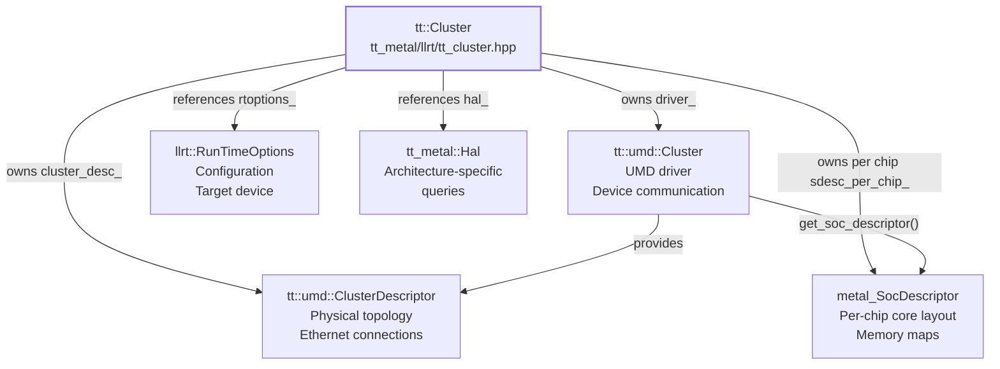
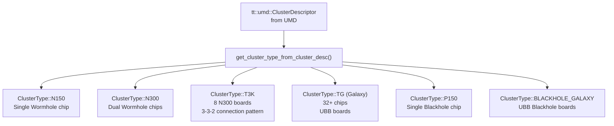
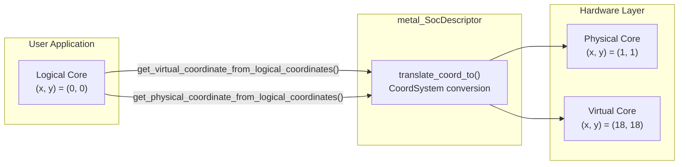
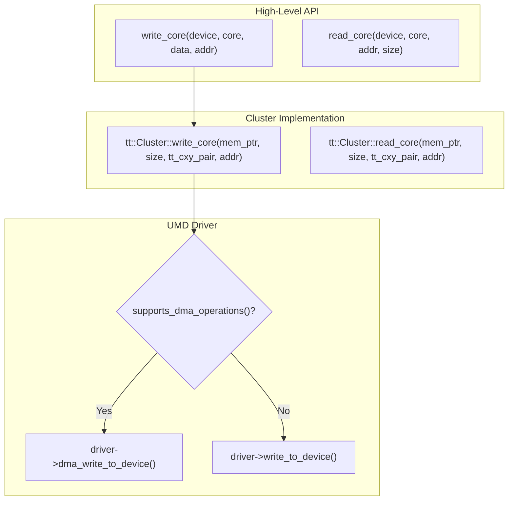
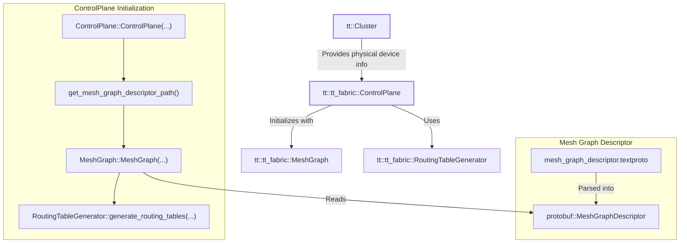

# Cluster Management and Device Discovery

Relevant source files
*   [cmake/protobuf.cmake](https://github.com/tenstorrent/tt-metal/blob/f30f8df0/cmake/protobuf.cmake)
*   [docs/source/common/images/16LB_Cluster.png](https://github.com/tenstorrent/tt-metal/blob/f30f8df0/docs/source/common/images/16LB_Cluster.png)
*   [tests/tt_metal/tt_fabric/custom_mesh_descriptors/mgd2_syntax_check_mesh_graph_descriptor.textproto](https://github.com/tenstorrent/tt-metal/blob/f30f8df0/tests/tt_metal/tt_fabric/custom_mesh_descriptors/mgd2_syntax_check_mesh_graph_descriptor.textproto)
*   [tests/tt_metal/tt_fabric/fabric_router/test_control_plane_logical_to_physical.cpp](https://github.com/tenstorrent/tt-metal/blob/f30f8df0/tests/tt_metal/tt_fabric/fabric_router/test_control_plane_logical_to_physical.cpp)
*   [tests/tt_metal/tt_fabric/fabric_router/test_mesh_graph_descriptor.cpp](https://github.com/tenstorrent/tt-metal/blob/f30f8df0/tests/tt_metal/tt_fabric/fabric_router/test_mesh_graph_descriptor.cpp)
*   [tests/tt_metal/tt_fabric/fabric_router/test_multi_host.cpp](https://github.com/tenstorrent/tt-metal/blob/f30f8df0/tests/tt_metal/tt_fabric/fabric_router/test_multi_host.cpp)
*   [tests/tt_metal/tt_fabric/fabric_router/test_routing_tables.cpp](https://github.com/tenstorrent/tt-metal/blob/f30f8df0/tests/tt_metal/tt_fabric/fabric_router/test_routing_tables.cpp)
*   [tests/tt_metal/tt_fabric/system_health/test_system_health.cpp](https://github.com/tenstorrent/tt-metal/blob/f30f8df0/tests/tt_metal/tt_fabric/system_health/test_system_health.cpp)
*   [tests/tt_metal/tt_metal/device/CMakeLists.txt](https://github.com/tenstorrent/tt-metal/blob/f30f8df0/tests/tt_metal/tt_metal/device/CMakeLists.txt)
*   [tests/tt_metal/tt_metal/device/test_simulator_device.cpp](https://github.com/tenstorrent/tt-metal/blob/f30f8df0/tests/tt_metal/tt_metal/device/test_simulator_device.cpp)
*   [tt_metal/api/tt-metalium/experimental/fabric/mesh_graph_descriptor.hpp](https://github.com/tenstorrent/tt-metal/blob/f30f8df0/tt_metal/api/tt-metalium/experimental/fabric/mesh_graph_descriptor.hpp)
*   [tt_metal/fabric/MGD_README.md](https://github.com/tenstorrent/tt-metal/blob/f30f8df0/tt_metal/fabric/MGD_README.md?plain=1)
*   [tt_metal/fabric/control_plane.cpp](https://github.com/tenstorrent/tt-metal/blob/f30f8df0/tt_metal/fabric/control_plane.cpp)
*   [tt_metal/fabric/fabric.cpp](https://github.com/tenstorrent/tt-metal/blob/f30f8df0/tt_metal/fabric/fabric.cpp)
*   [tt_metal/fabric/fabric_host_utils.cpp](https://github.com/tenstorrent/tt-metal/blob/f30f8df0/tt_metal/fabric/fabric_host_utils.cpp)
*   [tt_metal/fabric/fabric_host_utils.hpp](https://github.com/tenstorrent/tt-metal/blob/f30f8df0/tt_metal/fabric/fabric_host_utils.hpp)
*   [tt_metal/fabric/mesh_graph.cpp](https://github.com/tenstorrent/tt-metal/blob/f30f8df0/tt_metal/fabric/mesh_graph.cpp)
*   [tt_metal/fabric/mesh_graph_descriptor.cpp](https://github.com/tenstorrent/tt-metal/blob/f30f8df0/tt_metal/fabric/mesh_graph_descriptor.cpp)
*   [tt_metal/fabric/mesh_graph_descriptors/single_bh_galaxy_mesh_graph_descriptor.textproto](https://github.com/tenstorrent/tt-metal/blob/f30f8df0/tt_metal/fabric/mesh_graph_descriptors/single_bh_galaxy_mesh_graph_descriptor.textproto)
*   [tt_metal/fabric/mesh_graph_descriptors/tg_mesh_graph_descriptor.textproto](https://github.com/tenstorrent/tt-metal/blob/f30f8df0/tt_metal/fabric/mesh_graph_descriptors/tg_mesh_graph_descriptor.textproto)
*   [tt_metal/fabric/protobuf/mesh_graph_descriptor.proto](https://github.com/tenstorrent/tt-metal/blob/f30f8df0/tt_metal/fabric/protobuf/mesh_graph_descriptor.proto)
*   [tt_metal/impl/context/metal_context.cpp](https://github.com/tenstorrent/tt-metal/blob/f30f8df0/tt_metal/impl/context/metal_context.cpp)
*   [tt_metal/impl/context/metal_context.hpp](https://github.com/tenstorrent/tt-metal/blob/f30f8df0/tt_metal/impl/context/metal_context.hpp)
*   [tt_metal/impl/dispatch/command_queue_common.cpp](https://github.com/tenstorrent/tt-metal/blob/f30f8df0/tt_metal/impl/dispatch/command_queue_common.cpp)
*   [tt_metal/impl/dispatch/kernel_config/relay_mux.cpp](https://github.com/tenstorrent/tt-metal/blob/f30f8df0/tt_metal/impl/dispatch/kernel_config/relay_mux.cpp)
*   [tt_metal/impl/dispatch/kernel_config/relay_mux.hpp](https://github.com/tenstorrent/tt-metal/blob/f30f8df0/tt_metal/impl/dispatch/kernel_config/relay_mux.hpp)
*   [tt_metal/impl/dispatch/system_memory_manager.cpp](https://github.com/tenstorrent/tt-metal/blob/f30f8df0/tt_metal/impl/dispatch/system_memory_manager.cpp)
*   [tt_metal/impl/dispatch/system_memory_manager.hpp](https://github.com/tenstorrent/tt-metal/blob/f30f8df0/tt_metal/impl/dispatch/system_memory_manager.hpp)
*   [tt_metal/impl/dispatch/topology.cpp](https://github.com/tenstorrent/tt-metal/blob/f30f8df0/tt_metal/impl/dispatch/topology.cpp)
*   [tt_metal/impl/dispatch/topology.hpp](https://github.com/tenstorrent/tt-metal/blob/f30f8df0/tt_metal/impl/dispatch/topology.hpp)
*   [tt_metal/jit_build/build.cpp](https://github.com/tenstorrent/tt-metal/blob/f30f8df0/tt_metal/jit_build/build.cpp)
*   [tt_metal/jit_build/build.hpp](https://github.com/tenstorrent/tt-metal/blob/f30f8df0/tt_metal/jit_build/build.hpp)
*   [tt_metal/jit_build/build_env_manager.cpp](https://github.com/tenstorrent/tt-metal/blob/f30f8df0/tt_metal/jit_build/build_env_manager.cpp)
*   [tt_metal/jit_build/build_env_manager.hpp](https://github.com/tenstorrent/tt-metal/blob/f30f8df0/tt_metal/jit_build/build_env_manager.hpp)
*   [tt_metal/llrt/llrt.cpp](https://github.com/tenstorrent/tt-metal/blob/f30f8df0/tt_metal/llrt/llrt.cpp)
*   [tt_metal/llrt/llrt.hpp](https://github.com/tenstorrent/tt-metal/blob/f30f8df0/tt_metal/llrt/llrt.hpp)
*   [tt_metal/llrt/rtoptions.cpp](https://github.com/tenstorrent/tt-metal/blob/f30f8df0/tt_metal/llrt/rtoptions.cpp)
*   [tt_metal/llrt/rtoptions.hpp](https://github.com/tenstorrent/tt-metal/blob/f30f8df0/tt_metal/llrt/rtoptions.hpp)
*   [tt_metal/llrt/tlb_config.cpp](https://github.com/tenstorrent/tt-metal/blob/f30f8df0/tt_metal/llrt/tlb_config.cpp)
*   [tt_metal/llrt/tlb_config.hpp](https://github.com/tenstorrent/tt-metal/blob/f30f8df0/tt_metal/llrt/tlb_config.hpp)
*   [tt_metal/llrt/tt_cluster.cpp](https://github.com/tenstorrent/tt-metal/blob/f30f8df0/tt_metal/llrt/tt_cluster.cpp)
*   [tt_metal/llrt/tt_cluster.hpp](https://github.com/tenstorrent/tt-metal/blob/f30f8df0/tt_metal/llrt/tt_cluster.hpp)

## Purpose and Scope

This page documents the `Cluster` class and its role in managing physical device discovery, initialization, and low-level hardware communication in the TT-Metalium runtime. The `Cluster` class serves as the bridge between host software and Tenstorrent hardware, interfacing with the Unified Memory Driver (UMD) and maintaining SOC descriptors that describe device topology and core layouts.

This page focuses on:

*   Physical device detection and enumeration.
*   Cluster descriptor generation and cluster type classification.
*   SOC descriptor management and coordinate translation systems.
*   Low-level device communication primitives (read/write/multicast).

For system-wide initialization including `MetalContext` setup, see [MetalContext and System Initialization](https://github.com/tenstorrent/tt-metal/blob/f30f8df0/MetalContext%20and%20System%20Initialization) For logical device abstractions used by programs, see [Device Abstraction Layer](https://github.com/tenstorrent/tt-metal/blob/f30f8df0/Device%20Abstraction%20Layer) For multi-device fabric topology and routing, see [Control Plane and Fabric System](https://github.com/tenstorrent/tt-metal/blob/f30f8df0/Control%20Plane%20and%20Fabric%20System)

**Sources:**[tt_metal/llrt/tt_cluster.hpp 1-60](https://github.com/tenstorrent/tt-metal/blob/f30f8df0/tt_metal/llrt/tt_cluster.hpp#L1-L60)[tt_metal/llrt/tt_cluster.cpp 1-83](https://github.com/tenstorrent/tt-metal/blob/f30f8df0/tt_metal/llrt/tt_cluster.cpp#L1-L83)

* * *

## Cluster Class Architecture

The `Cluster` class is the primary abstraction for managing physical Tenstorrent devices. It wraps the UMD `tt::umd::Cluster` driver and provides Metal-specific functionality including SOC descriptor management, coordinate translation, and device communication.

### Cluster Class Structure

**Diagram: Cluster Class Dependencies**

The `Cluster` constructor performs the following initialization sequence:

1.   **Architecture and Target Detection** - `detect_arch_and_target()` determines the hardware architecture (Wormhole B0, Blackhole, Quasar) and target device type (Silicon, Simulator, Mock) [tt_metal/llrt/tt_cluster.cpp 240-254](https://github.com/tenstorrent/tt-metal/blob/f30f8df0/tt_metal/llrt/tt_cluster.cpp#L240-L254)
2.   **Driver Initialization** - `initialize_device_drivers()` opens the UMD driver, generates cluster descriptors, and validates harvesting masks [tt_metal/llrt/tt_cluster.cpp 313-340](https://github.com/tenstorrent/tt-metal/blob/f30f8df0/tt_metal/llrt/tt_cluster.cpp#L313-L340)
3.   **Ethernet Core Configuration** - `initialize_ethernet_cores_router_mode()` configures ethernet cores for routing if fabric is enabled [tt_metal/llrt/tt_cluster.cpp 230](https://github.com/tenstorrent/tt-metal/blob/f30f8df0/tt_metal/llrt/tt_cluster.cpp#L230-L230)
4.   **RISC Reset** - `assert_risc_reset()` holds all RISC processors in reset state [tt_metal/llrt/tt_cluster.cpp 236](https://github.com/tenstorrent/tt-metal/blob/f30f8df0/tt_metal/llrt/tt_cluster.cpp#L236-L236)

**Sources:**[tt_metal/llrt/tt_cluster.cpp 222-238](https://github.com/tenstorrent/tt-metal/blob/f30f8df0/tt_metal/llrt/tt_cluster.cpp#L222-L238)[tt_metal/llrt/tt_cluster.hpp 60-96](https://github.com/tenstorrent/tt-metal/blob/f30f8df0/tt_metal/llrt/tt_cluster.hpp#L60-L96)

* * *




**Diagram: Cluster Class Dependencies**

The `Cluster` constructor performs the following initialization sequence:

1.  **Architecture and Target Detection** - `detect_arch_and_target()` determines the hardware architecture (Wormhole B0, Blackhole, Quasar) and target device type (Silicon, Simulator, Mock) [tt_metal/llrt/tt_cluster.cpp:240-254]().
2.  **Driver Initialization** - `initialize_device_drivers()` opens the UMD driver, generates cluster descriptors, and validates harvesting masks [tt_metal/llrt/tt_cluster.cpp:313-340]().
3.  **Ethernet Core Configuration** - `initialize_ethernet_cores_router_mode()` configures ethernet cores for routing if fabric is enabled [tt_metal/llrt/tt_cluster.cpp:230]().
4.  **RISC Reset** - `assert_risc_reset()` holds all RISC processors in reset state [tt_metal/llrt/tt_cluster.cpp:236]().
```
## Device Discovery and Initialization Flow

### Discovery Process

**Diagram: Device Discovery and Initialization Sequence**

**Sources:**[tt_metal/llrt/tt_cluster.cpp 222-238](https://github.com/tenstorrent/tt-metal/blob/f30f8df0/tt_metal/llrt/tt_cluster.cpp#L222-L238)[tt_metal/llrt/tt_cluster.cpp 313-340](https://github.com/tenstorrent/tt-metal/blob/f30f8df0/tt_metal/llrt/tt_cluster.cpp#L313-L340)[tt_metal/llrt/tt_cluster.cpp 374-421](https://github.com/tenstorrent/tt-metal/blob/f30f8df0/tt_metal/llrt/tt_cluster.cpp#L374-L421)

### Target Device Types

The runtime supports three target device types, configured via `RunTimeOptions`:

| Target Type | Description | Usage |
| --- | --- | --- |
| **Silicon** | Physical Tenstorrent ASICs connected via PCIe | Production, testing on real hardware |
| **Simulator** | Software simulation using versim | Functional testing, debugging |
| **Mock** | Fake cluster using YAML descriptor | Unit testing, CI without hardware |

The target device type is detected in `detect_arch_and_target()` and determines initialization behavior [tt_metal/llrt/tt_cluster.cpp 240-254](https://github.com/tenstorrent/tt-metal/blob/f30f8df0/tt_metal/llrt/tt_cluster.cpp#L240-L254)

**Sources:**[tt_metal/llrt/tt_cluster.cpp 240-254](https://github.com/tenstorrent/tt-metal/blob/f30f8df0/tt_metal/llrt/tt_cluster.cpp#L240-L254)[tt_metal/llrt/rtoptions.hpp 153-213](https://github.com/tenstorrent/tt-metal/blob/f30f8df0/tt_metal/llrt/rtoptions.hpp#L153-L213)

* * *

## Cluster Types and Hardware Configurations

### Cluster Type Classification

The `Cluster` analyzes physical topology to classify the system into a specific `ClusterType`[tt_metal/llrt/tt_cluster.cpp 86-110](https://github.com/tenstorrent/tt-metal/blob/f30f8df0/tt_metal/llrt/tt_cluster.cpp#L86-L110)

**Diagram: Cluster Type Detection Logic**

The detection algorithm examines:

*   **Number of chips** in the cluster [tt_metal/llrt/tt_cluster.cpp 121](https://github.com/tenstorrent/tt-metal/blob/f30f8df0/tt_metal/llrt/tt_cluster.cpp#L121-L121)
*   **Board types** (N150, N300, GALAXY, etc.) [tt_metal/llrt/tt_cluster.cpp 113](https://github.com/tenstorrent/tt-metal/blob/f30f8df0/tt_metal/llrt/tt_cluster.cpp#L113-L113)
*   **Ethernet connection patterns** - number of remote chips each chip connects to [tt_metal/llrt/tt_cluster.cpp 136-152](https://github.com/tenstorrent/tt-metal/blob/f30f8df0/tt_metal/llrt/tt_cluster.cpp#L136-L152)
*   **MMIO capability** - which chips have PCIe connections [tt_metal/llrt/tt_cluster.cpp 144](https://github.com/tenstorrent/tt-metal/blob/f30f8df0/tt_metal/llrt/tt_cluster.cpp#L144-L144)

**Sources:**[tt_metal/llrt/tt_cluster.cpp 86-208](https://github.com/tenstorrent/tt-metal/blob/f30f8df0/tt_metal/llrt/tt_cluster.cpp#L86-L208)[tt_metal/llrt/tt_cluster.hpp 61-65](https://github.com/tenstorrent/tt-metal/blob/f30f8df0/tt_metal/llrt/tt_cluster.hpp#L61-L65)

* * *




**Diagram: Cluster Type Detection Logic**

The detection algorithm examines:
*   **Number of chips** in the cluster [tt_metal/llrt/tt_cluster.cpp:121]().
*   **Board types** (N150, N300, GALAXY, etc.) [tt_metal/llrt/tt_cluster.cpp:113]().
*   **Ethernet connection patterns** - number of remote chips each chip connects to [tt_metal/llrt/tt_cluster.cpp:136-152]().
*   **MMIO capability** - which chips have PCIe connections [tt_metal/llrt/tt_cluster.cpp:144]().
```
## SOC Descriptors and Coordinate Systems

Each physical chip has an associated `metal_SocDescriptor` that describes core locations, memory maps, and coordinate translation.

### Coordinate System Types

| System | Description | Use Case |
| --- | --- | --- |
| **Logical** | Sequential core numbering (0, 1, 2, ...) | User-facing APIs, kernel specifications |
| **Physical** | Actual core locations on die (NOC routing coordinates) | Hardware addressing, NOC transactions |
| **Virtual** | Architecture-normalized coordinates | Cross-architecture portable code |

**Diagram: Coordinate System Translation**

**Sources:**[tt_metal/llrt/tt_cluster.cpp 620-672](https://github.com/tenstorrent/tt-metal/blob/f30f8df0/tt_metal/llrt/tt_cluster.cpp#L620-L672)[tt_metal/llrt/tt_cluster.hpp 115-123](https://github.com/tenstorrent/tt-metal/blob/f30f8df0/tt_metal/llrt/tt_cluster.hpp#L115-L123)

* * *




**Diagram: Coordinate System Translation**
```
## Device Communication Primitives

The `Cluster` class provides low-level device communication methods that abstract UMD driver calls and handle coordinate translation.

### Core Read/Write Operations

**Diagram: Device Communication Flow**




**Diagram: Device Communication Flow**
```
### DMA vs NOC Transactions

The runtime automatically selects between DMA and NOC-based transfers:

*   **DMA Operations**: Used for Wormhole MMIO devices with transfers ≥ 32 bytes [tt_metal/llrt/tt_cluster.cpp 755-761](https://github.com/tenstorrent/tt-metal/blob/f30f8df0/tt_metal/llrt/tt_cluster.cpp#L755-L761)
*   **NOC Operations**: Used for all other cases [tt_metal/llrt/tt_cluster.cpp 771](https://github.com/tenstorrent/tt-metal/blob/f30f8df0/tt_metal/llrt/tt_cluster.cpp#L771-L771)

**Sources:**[tt_metal/llrt/tt_cluster.cpp 748-812](https://github.com/tenstorrent/tt-metal/blob/f30f8df0/tt_metal/llrt/tt_cluster.cpp#L748-L812)[tt_metal/llrt/tt_cluster.hpp 141-180](https://github.com/tenstorrent/tt-metal/blob/f30f8df0/tt_metal/llrt/tt_cluster.hpp#L141-L180)

* * *

## TLB Configuration

Translation Lookaside Buffers (TLBs) map host memory addresses to device memory for fast access.

### Static TLB Setup

On Silicon devices during `start_driver()`, TLBs are configured in parallel for all MMIO devices [tt_metal/llrt/tt_cluster.cpp 449-475](https://github.com/tenstorrent/tt-metal/blob/f30f8df0/tt_metal/llrt/tt_cluster.cpp#L449-L475)

`// tt_metal/llrt/tt_cluster.cpp:456-461for (const auto& mmio_device_id : mmio_device_ids) {    futures.emplace_back(tt_metal::detail::async(<FileRef file-url="https://github.com/tenstorrent/tt-metal/blob/f30f8df0/this, mmio_device_id" undefined  file-path="this, mmio_device_id">Hii</FileRef> {        ll_api::configure_static_tlbs(            this->arch_, mmio_device_id, this->get_soc_desc(mmio_device_id), *this->driver_);    }));}`
Static TLBs provide fixed mappings to frequently accessed memory regions (L1, DRAM). The configuration is architecture-specific and defined in `tt_metal/llrt/tlb_config.cpp`.

**Sources:**[tt_metal/llrt/tt_cluster.cpp 449-475](https://github.com/tenstorrent/tt-metal/blob/f30f8df0/tt_metal/llrt/tt_cluster.cpp#L449-L475)[tt_metal/llrt/tlb_config.cpp 1-50](https://github.com/tenstorrent/tt-metal/blob/f30f8df0/tt_metal/llrt/tlb_config.cpp#L1-L50)

* * *

## Fabric and Control Plane Integration

The `Cluster` class works closely with the `ControlPlane` to manage ethernet core states and routing tables for multi-chip fabrics.

### Ethernet Core Routing Modes

Ethernet cores can be configured in different modes, such as `EthRouterMode::IDLE` or `EthRouterMode::FABRIC_ROUTER`[tt_metal/llrt/tt_cluster.hpp 56-59](https://github.com/tenstorrent/tt-metal/blob/f30f8df0/tt_metal/llrt/tt_cluster.hpp#L56-L59)

### UMD and Fabric Metadata

The `Cluster` provides physical information to the `ControlPlane`, such as bus IDs and physical slots, which are essential for generating routing tables [tt_metal/llrt/tt_cluster.cpp 211-218](https://github.com/tenstorrent/tt-metal/blob/f30f8df0/tt_metal/llrt/tt_cluster.cpp#L211-L218)

| Function | Purpose |
| --- | --- |
| `get_bus_id(chip)` | Returns the PCIe bus ID for a specific chip [tt_metal/llrt/tt_cluster.cpp 211](https://github.com/tenstorrent/tt-metal/blob/f30f8df0/tt_metal/llrt/tt_cluster.cpp#L211-L211) |
| `get_physical_slot(chip)` | Returns the physical slot number [tt_metal/llrt/tt_cluster.cpp 215](https://github.com/tenstorrent/tt-metal/blob/f30f8df0/tt_metal/llrt/tt_cluster.cpp#L215-L215) |
| `get_unique_chip_ids()` | Returns unique hardware identifiers from UMD [tt_metal/llrt/tt_cluster.hpp 103](https://github.com/tenstorrent/tt-metal/blob/f30f8df0/tt_metal/llrt/tt_cluster.hpp#L103-L103) |

The `ControlPlane` is responsible for managing the fabric topology, including the `MeshGraph` and `RoutingTableGenerator`. The `Cluster` provides the necessary physical device information to the `ControlPlane` during its initialization. The `ControlPlane` can also apply fixed ASIC position pinnings for specific topologies like Galaxy to optimize QSFP link alignment [tt_metal/fabric/control_plane.cpp 85-116](https://github.com/tenstorrent/tt-metal/blob/f30f8df0/tt_metal/fabric/control_plane.cpp#L85-L116)

**Diagram: Control Plane and Fabric Integration**

The `ControlPlane` uses `MeshGraph` to represent the fabric topology. The `MeshGraph` can be initialized from a `.textproto` file, which is the preferred format for Mesh Graph Descriptors (MGD 2.0) [tt_metal/fabric/mesh_graph.cpp 112-130](https://github.com/tenstorrent/tt-metal/blob/f30f8df0/tt_metal/fabric/mesh_graph.cpp#L112-L130) The `ControlPlane` also handles the mapping of logical mesh chip IDs to physical chip IDs [tt_metal/fabric/control_plane.cpp 220-221](https://github.com/tenstorrent/tt-metal/blob/f30f8df0/tt_metal/fabric/control_plane.cpp#L220-L221)

**Sources:**[tt_metal/llrt/tt_cluster.cpp 211-218](https://github.com/tenstorrent/tt-metal/blob/f30f8df0/tt_metal/llrt/tt_cluster.cpp#L211-L218)[tt_metal/llrt/tt_cluster.hpp 56-59](https://github.com/tenstorrent/tt-metal/blob/f30f8df0/tt_metal/llrt/tt_cluster.hpp#L56-L59)[tt_metal/fabric/control_plane.cpp 85-116](https://github.com/tenstorrent/tt-metal/blob/f30f8df0/tt_metal/fabric/control_plane.cpp#L85-L116)[tt_metal/fabric/mesh_graph.cpp 112-130](https://github.com/tenstorrent/tt-metal/blob/f30f8df0/tt_metal/fabric/mesh_graph.cpp#L112-L130)[tt_metal/fabric/control_plane.cpp 220-221](https://github.com/tenstorrent/tt-metal/blob/f30f8df0/tt_metal/fabric/control_plane.cpp#L220-L221)

* * *




**Diagram: Control Plane and Fabric Integration**

The `ControlPlane` uses `MeshGraph` to represent the fabric topology. The `MeshGraph` can be initialized from a `.textproto` file, which is the preferred format for Mesh Graph Descriptors (MGD 2.0) [tt_metal/fabric/mesh_graph.cpp:112-130](). The `ControlPlane` also handles the mapping of logical mesh chip IDs to physical chip IDs [tt_metal/fabric/control_plane.cpp:220-221]().
```
## Summary

The `Cluster` class provides the foundation for all device interaction in TT-Metalium:

*   **Device Discovery**: Enumerates and classifies physical hardware.
*   **SOC Management**: Maintains per-chip core layouts and memory maps via `metal_SocDescriptor`.
*   **Coordinate Translation**: Converts between logical, physical, and virtual systems.
*   **Communication**: Provides read/write primitives with DMA optimization.
*   **UMD Integration**: Wraps the Unified Memory Driver with Metalium-specific functionality.

**Sources:**[tt_metal/llrt/tt_cluster.hpp 1-250](https://github.com/tenstorrent/tt-metal/blob/f30f8df0/tt_metal/llrt/tt_cluster.hpp#L1-L250)[tt_metal/llrt/tt_cluster.cpp 1-900](https://github.com/tenstorrent/tt-metal/blob/f30f8df0/tt_metal/llrt/tt_cluster.cpp#L1-L900)

Dismiss
Refresh this wiki

Enter email to refresh
