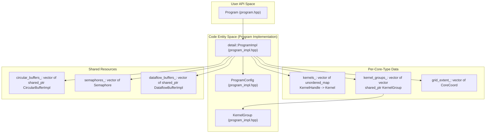
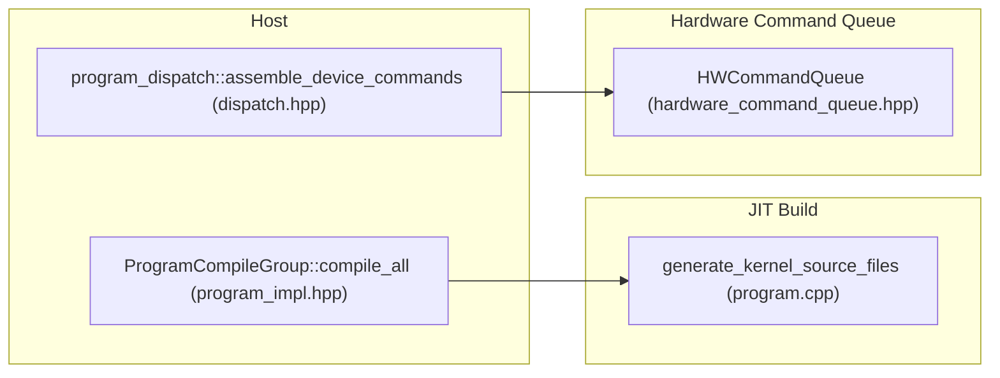

# Program and Kernel System

Relevant source files
*   [tests/tt_metal/tt_metal/api/metal2_host_api/test_helpers.hpp](https://github.com/tenstorrent/tt-metal/blob/f30f8df0/tests/tt_metal/tt_metal/api/metal2_host_api/test_helpers.hpp)
*   [tests/tt_metal/tt_metal/api/metal2_host_api/test_program_run_args.cpp](https://github.com/tenstorrent/tt-metal/blob/f30f8df0/tests/tt_metal/tt_metal/api/metal2_host_api/test_program_run_args.cpp)
*   [tests/tt_metal/tt_metal/api/metal2_host_api/test_program_spec.cpp](https://github.com/tenstorrent/tt-metal/blob/f30f8df0/tests/tt_metal/tt_metal/api/metal2_host_api/test_program_spec.cpp)
*   [tests/tt_metal/tt_metal/api/metal2_host_api/test_program_spec_hw.cpp](https://github.com/tenstorrent/tt-metal/blob/f30f8df0/tests/tt_metal/tt_metal/api/metal2_host_api/test_program_spec_hw.cpp)
*   [tests/tt_metal/tt_metal/api/test_kernel_thread_sync.cpp](https://github.com/tenstorrent/tt-metal/blob/f30f8df0/tests/tt_metal/tt_metal/api/test_kernel_thread_sync.cpp)
*   [tests/tt_metal/tt_metal/eth/test_basic_eth.cpp](https://github.com/tenstorrent/tt-metal/blob/f30f8df0/tests/tt_metal/tt_metal/eth/test_basic_eth.cpp)
*   [tests/tt_metal/tt_metal/eth/test_buffer_movement_kernels.cpp](https://github.com/tenstorrent/tt-metal/blob/f30f8df0/tests/tt_metal/tt_metal/eth/test_buffer_movement_kernels.cpp)
*   [tests/tt_metal/tt_metal/eth/test_erisc_app_direct_send.cpp](https://github.com/tenstorrent/tt-metal/blob/f30f8df0/tests/tt_metal/tt_metal/eth/test_erisc_app_direct_send.cpp)
*   [tests/tt_metal/tt_metal/llk/sources.cmake](https://github.com/tenstorrent/tt-metal/blob/f30f8df0/tests/tt_metal/tt_metal/llk/sources.cmake)
*   [tests/tt_metal/tt_metal/llk/test_mxfp4_typecast.cpp](https://github.com/tenstorrent/tt-metal/blob/f30f8df0/tests/tt_metal/tt_metal/llk/test_mxfp4_typecast.cpp)
*   [tests/tt_metal/tt_metal/llk/test_mxfp6_typecast.cpp](https://github.com/tenstorrent/tt-metal/blob/f30f8df0/tests/tt_metal/tt_metal/llk/test_mxfp6_typecast.cpp)
*   [tests/tt_metal/tt_metal/test_compile_sets_kernel_binaries.cpp](https://github.com/tenstorrent/tt-metal/blob/f30f8df0/tests/tt_metal/tt_metal/test_compile_sets_kernel_binaries.cpp)
*   [tt_metal/api/tt-metalium/experimental/metal2_host_api/advanced_options.hpp](https://github.com/tenstorrent/tt-metal/blob/f30f8df0/tt_metal/api/tt-metalium/experimental/metal2_host_api/advanced_options.hpp)
*   [tt_metal/api/tt-metalium/experimental/metal2_host_api/dataflow_buffer_spec.hpp](https://github.com/tenstorrent/tt-metal/blob/f30f8df0/tt_metal/api/tt-metalium/experimental/metal2_host_api/dataflow_buffer_spec.hpp)
*   [tt_metal/api/tt-metalium/experimental/metal2_host_api/kernel_spec.hpp](https://github.com/tenstorrent/tt-metal/blob/f30f8df0/tt_metal/api/tt-metalium/experimental/metal2_host_api/kernel_spec.hpp)
*   [tt_metal/api/tt-metalium/experimental/metal2_host_api/program_spec.hpp](https://github.com/tenstorrent/tt-metal/blob/f30f8df0/tt_metal/api/tt-metalium/experimental/metal2_host_api/program_spec.hpp)
*   [tt_metal/api/tt-metalium/experimental/metal2_host_api/semaphore_spec.hpp](https://github.com/tenstorrent/tt-metal/blob/f30f8df0/tt_metal/api/tt-metalium/experimental/metal2_host_api/semaphore_spec.hpp)
*   [tt_metal/api/tt-metalium/experimental/metal2_host_api/tensor_parameter.hpp](https://github.com/tenstorrent/tt-metal/blob/f30f8df0/tt_metal/api/tt-metalium/experimental/metal2_host_api/tensor_parameter.hpp)
*   [tt_metal/api/tt-metalium/mesh_workload.hpp](https://github.com/tenstorrent/tt-metal/blob/f30f8df0/tt_metal/api/tt-metalium/mesh_workload.hpp)
*   [tt_metal/api/tt-metalium/mxfp4.hpp](https://github.com/tenstorrent/tt-metal/blob/f30f8df0/tt_metal/api/tt-metalium/mxfp4.hpp)
*   [tt_metal/api/tt-metalium/mxfp6.hpp](https://github.com/tenstorrent/tt-metal/blob/f30f8df0/tt_metal/api/tt-metalium/mxfp6.hpp)
*   [tt_metal/api/tt-metalium/program.hpp](https://github.com/tenstorrent/tt-metal/blob/f30f8df0/tt_metal/api/tt-metalium/program.hpp)
*   [tt_metal/api/tt-metalium/tt_backend_api_types.hpp](https://github.com/tenstorrent/tt-metal/blob/f30f8df0/tt_metal/api/tt-metalium/tt_backend_api_types.hpp)
*   [tt_metal/common/tt_backend_api_types.cpp](https://github.com/tenstorrent/tt-metal/blob/f30f8df0/tt_metal/common/tt_backend_api_types.cpp)
*   [tt_metal/distributed/mesh_workload.cpp](https://github.com/tenstorrent/tt-metal/blob/f30f8df0/tt_metal/distributed/mesh_workload.cpp)
*   [tt_metal/distributed/mesh_workload_impl.hpp](https://github.com/tenstorrent/tt-metal/blob/f30f8df0/tt_metal/distributed/mesh_workload_impl.hpp)
*   [tt_metal/impl/data_format/mx_common.cpp](https://github.com/tenstorrent/tt-metal/blob/f30f8df0/tt_metal/impl/data_format/mx_common.cpp)
*   [tt_metal/impl/data_format/mx_common.hpp](https://github.com/tenstorrent/tt-metal/blob/f30f8df0/tt_metal/impl/data_format/mx_common.hpp)
*   [tt_metal/impl/data_format/mx_tile_pack.hpp](https://github.com/tenstorrent/tt-metal/blob/f30f8df0/tt_metal/impl/data_format/mx_tile_pack.hpp)
*   [tt_metal/impl/data_format/mxfp4.cpp](https://github.com/tenstorrent/tt-metal/blob/f30f8df0/tt_metal/impl/data_format/mxfp4.cpp)
*   [tt_metal/impl/data_format/tile.cpp](https://github.com/tenstorrent/tt-metal/blob/f30f8df0/tt_metal/impl/data_format/tile.cpp)
*   [tt_metal/impl/dispatch/hardware_command_queue.cpp](https://github.com/tenstorrent/tt-metal/blob/f30f8df0/tt_metal/impl/dispatch/hardware_command_queue.cpp)
*   [tt_metal/impl/dispatch/hardware_command_queue.hpp](https://github.com/tenstorrent/tt-metal/blob/f30f8df0/tt_metal/impl/dispatch/hardware_command_queue.hpp)
*   [tt_metal/impl/dispatch/host_runtime_commands.cpp](https://github.com/tenstorrent/tt-metal/blob/f30f8df0/tt_metal/impl/dispatch/host_runtime_commands.cpp)
*   [tt_metal/impl/flatbuffer/base_types.fbs](https://github.com/tenstorrent/tt-metal/blob/f30f8df0/tt_metal/impl/flatbuffer/base_types.fbs)
*   [tt_metal/impl/flatbuffer/base_types_from_flatbuffer.cpp](https://github.com/tenstorrent/tt-metal/blob/f30f8df0/tt_metal/impl/flatbuffer/base_types_from_flatbuffer.cpp)
*   [tt_metal/impl/flatbuffer/base_types_to_flatbuffer.cpp](https://github.com/tenstorrent/tt-metal/blob/f30f8df0/tt_metal/impl/flatbuffer/base_types_to_flatbuffer.cpp)
*   [tt_metal/impl/kernels/kernel.cpp](https://github.com/tenstorrent/tt-metal/blob/f30f8df0/tt_metal/impl/kernels/kernel.cpp)
*   [tt_metal/impl/kernels/kernel.hpp](https://github.com/tenstorrent/tt-metal/blob/f30f8df0/tt_metal/impl/kernels/kernel.hpp)
*   [tt_metal/impl/metal2_host_api/program_spec.cpp](https://github.com/tenstorrent/tt-metal/blob/f30f8df0/tt_metal/impl/metal2_host_api/program_spec.cpp)
*   [tt_metal/impl/program/dispatch.cpp](https://github.com/tenstorrent/tt-metal/blob/f30f8df0/tt_metal/impl/program/dispatch.cpp)
*   [tt_metal/impl/program/dispatch.hpp](https://github.com/tenstorrent/tt-metal/blob/f30f8df0/tt_metal/impl/program/dispatch.hpp)
*   [tt_metal/impl/program/program.cpp](https://github.com/tenstorrent/tt-metal/blob/f30f8df0/tt_metal/impl/program/program.cpp)
*   [tt_metal/impl/program/program_command_sequence.hpp](https://github.com/tenstorrent/tt-metal/blob/f30f8df0/tt_metal/impl/program/program_command_sequence.hpp)
*   [tt_metal/impl/program/program_impl.hpp](https://github.com/tenstorrent/tt-metal/blob/f30f8df0/tt_metal/impl/program/program_impl.hpp)
*   [tt_metal/impl/sources.cmake](https://github.com/tenstorrent/tt-metal/blob/f30f8df0/tt_metal/impl/sources.cmake)
*   [tt_metal/jit_build/data_format.cpp](https://github.com/tenstorrent/tt-metal/blob/f30f8df0/tt_metal/jit_build/data_format.cpp)
*   [tt_metal/jit_build/data_format.hpp](https://github.com/tenstorrent/tt-metal/blob/f30f8df0/tt_metal/jit_build/data_format.hpp)
*   [tt_metal/jit_build/genfiles.cpp](https://github.com/tenstorrent/tt-metal/blob/f30f8df0/tt_metal/jit_build/genfiles.cpp)
*   [tt_metal/jit_build/jit_build_settings.hpp](https://github.com/tenstorrent/tt-metal/blob/f30f8df0/tt_metal/jit_build/jit_build_settings.hpp)
*   [tt_metal/sources.cmake](https://github.com/tenstorrent/tt-metal/blob/f30f8df0/tt_metal/sources.cmake)

## Purpose and Scope

The Program and Kernel System defines how workloads are structured, compiled, and dispatched for execution on Tenstorrent device cores. A **Program** is a collection of **Kernels** along with associated resources (circular buffers, semaphores, runtime arguments) that execute together as a unit of work. This page covers the internal structure of programs and kernels, the JIT compilation pipeline, memory layout finalization, and the dispatch mechanisms that load and execute programs on device hardware.

For information about how programs are cached and reused, see [JIT Build System and Kernel Compilation](https://deepwiki.com/tenstorrent/tt-metal/2.6-jit-build-system-and-kernel-compilation). For details on the command queue system that enqueues programs, see [Fast Dispatch and Command Queue System](https://deepwiki.com/tenstorrent/tt-metal/2.5-fast-dispatch-and-command-queue-system).

## Program Structure and Organization


Sources: [tt_metal/impl/program/program_impl.hpp:180-212](), [tt_metal/impl/program/program_impl.hpp:71-96](), [tt_metal/api/tt-metalium/program.hpp:10-10]()
```


A `Program` is the user-facing API wrapper around `detail::ProgramImpl`, which maintains the internal state and structures. Programs organize kernels into `KernelGroup` objects based on which cores they target and what resources they share.

**Program Entity Relationship Diagram**

Sources: [tt_metal/impl/program/program_impl.hpp 180-212](https://github.com/tenstorrent/tt-metal/blob/f30f8df0/tt_metal/impl/program/program_impl.hpp#L180-L212)[tt_metal/impl/program/program_impl.hpp 71-96](https://github.com/tenstorrent/tt-metal/blob/f30f8df0/tt_metal/impl/program/program_impl.hpp#L71-L96)[tt_metal/api/tt-metalium/program.hpp 10](https://github.com/tenstorrent/tt-metal/blob/f30f8df0/tt_metal/api/tt-metalium/program.hpp#L10-L10)

### ProgramImpl Key Members

The `ProgramImpl` class maintains separate data structures per programmable core type (Tensix, Active Ethernet, Idle Ethernet):

| Member | Type | Purpose |
| --- | --- | --- |
| `kernels_` | `vector<unordered_map<KernelHandle, shared_ptr<Kernel>>>` | Maps kernel handles to kernel objects, one map per core type [tt_metal/impl/program/program_impl.hpp 261](https://github.com/tenstorrent/tt-metal/blob/f30f8df0/tt_metal/impl/program/program_impl.hpp#L261-L261) |
| `kernel_groups_` | `vector<vector<shared_ptr<KernelGroup>>>` | Groups of kernels sharing core ranges, one vector per core type [tt_metal/impl/program/program_impl.hpp 264](https://github.com/tenstorrent/tt-metal/blob/f30f8df0/tt_metal/impl/program/program_impl.hpp#L264-L264) |
| `grid_extent_` | `vector<CoreCoord>` | Bounding box of all kernels per core type [tt_metal/impl/program/program_impl.hpp 263](https://github.com/tenstorrent/tt-metal/blob/f30f8df0/tt_metal/impl/program/program_impl.hpp#L263-L263) |
| `circular_buffers_` | `vector<shared_ptr<CircularBufferImpl>>` | All circular buffers in the program [tt_metal/impl/program/program_impl.hpp 265](https://github.com/tenstorrent/tt-metal/blob/f30f8df0/tt_metal/impl/program/program_impl.hpp#L265-L265) |
| `semaphores_` | `vector<Semaphore>` | All semaphores in the program [tt_metal/impl/program/program_impl.hpp 267](https://github.com/tenstorrent/tt-metal/blob/f30f8df0/tt_metal/impl/program/program_impl.hpp#L267-L267) |
| `dataflow_buffers_` | `vector<shared_ptr<DataflowBufferImpl>>` | All dataflow buffers in the program [tt_metal/impl/program/program_impl.hpp 268-269](https://github.com/tenstorrent/tt-metal/blob/f30f8df0/tt_metal/impl/program/program_impl.hpp#L268-L269) |
| `program_configs_` | `vector<ProgramConfig>` | Finalized memory layout per core type [tt_metal/impl/program/program_impl.hpp 272](https://github.com/tenstorrent/tt-metal/blob/f30f8df0/tt_metal/impl/program/program_impl.hpp#L272-L272) |

Sources: [tt_metal/impl/program/program_impl.hpp 260-278](https://github.com/tenstorrent/tt-metal/blob/f30f8df0/tt_metal/impl/program/program_impl.hpp#L260-L278)

### KernelGroup Structure

Kernels are organized into `KernelGroup` objects that share the same set of cores. Each `KernelGroup` contains:

| Field | Type | Purpose |
| --- | --- | --- |
| `programmable_core_type_index` | `uint32_t` | Index of core type (Tensix=0, Active Eth=1, etc.) [tt_metal/impl/program/program_impl.hpp 72](https://github.com/tenstorrent/tt-metal/blob/f30f8df0/tt_metal/impl/program/program_impl.hpp#L72-L72) |
| `core_ranges` | `CoreRangeSet` | Logical cores this group runs on [tt_metal/impl/program/program_impl.hpp 73](https://github.com/tenstorrent/tt-metal/blob/f30f8df0/tt_metal/impl/program/program_impl.hpp#L73-L73) |
| `kernel_ids` | `vector<KernelHandle>` | Kernels in this group, ordered by processor index [tt_metal/impl/program/program_impl.hpp 75](https://github.com/tenstorrent/tt-metal/blob/f30f8df0/tt_metal/impl/program/program_impl.hpp#L75-L75) |
| `launch_msg` | `dev_msgs::launch_msg_t` | Configuration sent to cores before execution [tt_metal/impl/program/program_impl.hpp 83](https://github.com/tenstorrent/tt-metal/blob/f30f8df0/tt_metal/impl/program/program_impl.hpp#L83-L83) |
| `go_msg` | `dev_msgs::go_msg_t` | Signal to start execution [tt_metal/impl/program/program_impl.hpp 84](https://github.com/tenstorrent/tt-metal/blob/f30f8df0/tt_metal/impl/program/program_impl.hpp#L84-L84) |

Sources: [tt_metal/impl/program/program_impl.hpp 71-96](https://github.com/tenstorrent/tt-metal/blob/f30f8df0/tt_metal/impl/program/program_impl.hpp#L71-L96)

## Kernel Types and Configuration

```mermaid
graph TB
    subgraph "Kernel Base (kernel.hpp)"
        Kernel["Kernel (Abstract Base)"]
    end
    
    subgraph "Core Configuration (kernel_types.hpp)"
        DMConfig["DataMovementConfig"]
        CompConfig["ComputeConfig"]
        EthConfig["EthernetConfig"]
        DramConfig["DramConfig"]
        QuasarDMConfig["experimental::quasar::QuasarDataMovementConfig"]
        QuasarComputeConfig["experimental::quasar::QuasarComputeConfig"]
    end
    
    subgraph "Internal State"
        K_CoreType["programmable_core_type_"]
        K_ProcClass["processor_class_"]
        K_Src["kernel_src_ (KernelSource)"]
        K_RTAs["core_to_runtime_args_"]
        K_Defines["defines_"]
    end
    
    Kernel --> K_CoreType
    Kernel --> K_ProcClass
    Kernel --> K_Src
    Kernel --> K_RTAs
    Kernel --> K_Defines
    
    Kernel -.-> DMConfig
    Kernel -.-> CompConfig
    Kernel -.-> EthConfig
    Kernel -.-> DramConfig
    Kernel -.-> QuasarDMConfig
    Kernel -.-> QuasarComputeConfig
```


Sources: [tt_metal/impl/kernels/kernel.hpp:115-180](), [tt_metal/impl/kernels/kernel.cpp:122-180](), [tt_metal/impl/kernels/kernel.hpp:162-162]()
```


The `Kernel` base class defines the interface for all kernel types. Concrete subclasses implement specific kernel categories like `DataMovementKernel`, `ComputeKernel`, and `EthernetKernel`.

**Kernel Code Entity Mapping**

Sources: [tt_metal/impl/kernels/kernel.hpp 115-180](https://github.com/tenstorrent/tt-metal/blob/f30f8df0/tt_metal/impl/kernels/kernel.hpp#L115-L180)[tt_metal/impl/kernels/kernel.cpp 122-180](https://github.com/tenstorrent/tt-metal/blob/f30f8df0/tt_metal/impl/kernels/kernel.cpp#L122-L180)[tt_metal/impl/kernels/kernel.hpp 162](https://github.com/tenstorrent/tt-metal/blob/f30f8df0/tt_metal/impl/kernels/kernel.hpp#L162-L162)

### Kernel Source Types

Kernels can be created from file paths or inline source code via the `KernelSource` class [tt_metal/impl/kernels/kernel.cpp 115-120](https://github.com/tenstorrent/tt-metal/blob/f30f8df0/tt_metal/impl/kernels/kernel.cpp#L115-L120)

Path resolution priority for `FILE_PATH`[tt_metal/impl/kernels/kernel.cpp 50-90](https://github.com/tenstorrent/tt-metal/blob/f30f8df0/tt_metal/impl/kernels/kernel.cpp#L50-L90):

1.   Absolute path
2.   Current working directory
3.   `TT_METAL_KERNEL_PATH` (via `rtoptions`)
4.   System kernel directory
5.   `TT_METAL_HOME` / Root directory

Sources: [tt_metal/impl/kernels/kernel.cpp 50-90](https://github.com/tenstorrent/tt-metal/blob/f30f8df0/tt_metal/impl/kernels/kernel.cpp#L50-L90)[tt_metal/impl/kernels/kernel.hpp 25](https://github.com/tenstorrent/tt-metal/blob/f30f8df0/tt_metal/impl/kernels/kernel.hpp#L25-L25)

## Kernel Compilation and Binary Management

Kernel compilation follows a JIT (Just-In-Time) model. The `BuildEnvManager` manages the compilation environments for different devices and core types.

### Binary Generation

Binary generation is handled by `Kernel::generate_binaries`, which prepares output directories and invokes the compiler. For remote compilation, `generate_kernel_source_files` is used to prepare source files without running the local compiler [tt_metal/impl/program/program.cpp 162-171](https://github.com/tenstorrent/tt-metal/blob/f30f8df0/tt_metal/impl/program/program.cpp#L162-L171)

### Compilation Hash

To support caching, a `KernelCompileHash` is generated. The hash incorporates the kernel's source, compile-time arguments, and defines [tt_metal/impl/kernels/kernel.cpp 159](https://github.com/tenstorrent/tt-metal/blob/f30f8df0/tt_metal/impl/kernels/kernel.cpp#L159-L159)

### Metal 2.0 Kernel Bindings

For Metal 2.0 kernels, the JIT system generates specialized headers like `kernel_bindings_generated.h` and `kernel_args_generated.h`[tt_metal/jit_build/genfiles.cpp 68-71](https://github.com/tenstorrent/tt-metal/blob/f30f8df0/tt_metal/jit_build/genfiles.cpp#L68-L71) These headers provide `constexpr` accessors for Dataflow Buffers (DFB), Semaphores, and Tensor Bindings within the kernel code [tt_metal/jit_build/genfiles.cpp 158-171](https://github.com/tenstorrent/tt-metal/blob/f30f8df0/tt_metal/jit_build/genfiles.cpp#L158-L171)

Sources: [tt_metal/impl/program/program.cpp 162-171](https://github.com/tenstorrent/tt-metal/blob/f30f8df0/tt_metal/impl/program/program.cpp#L162-L171)[tt_metal/impl/kernels/kernel.cpp 159](https://github.com/tenstorrent/tt-metal/blob/f30f8df0/tt_metal/impl/kernels/kernel.cpp#L159-L159)[tt_metal/jit_build/genfiles.cpp 92-140](https://github.com/tenstorrent/tt-metal/blob/f30f8df0/tt_metal/jit_build/genfiles.cpp#L92-L140)

## Runtime Arguments Management

Runtime arguments (RTAs) are parameters passed to kernels at dispatch time. They are stored in L1 memory and can be updated without re-compiling the kernel.

| Argument Type | Scope | Storage Member |
| --- | --- | --- |
| **Unique RTAs** | Per-core | `core_to_runtime_args_`[tt_metal/impl/kernels/kernel.cpp 172](https://github.com/tenstorrent/tt-metal/blob/f30f8df0/tt_metal/impl/kernels/kernel.cpp#L172-L172) |
| **Common RTAs** | Shared across all cores | `common_runtime_args_`[tt_metal/impl/kernels/kernel.hpp 154](https://github.com/tenstorrent/tt-metal/blob/f30f8df0/tt_metal/impl/kernels/kernel.hpp#L154-L154) |

### Runtime Argument Offsets

During program finalization, RTA offsets are calculated for each `KernelGroup`. If the watcher is enabled, RTA and CRTA offsets are initialized to a sentinel value (`RTA_CRTA_NO_ARGS_SENTINEL` or `0xFFFF`) to distinguish "no args" from "args at offset 0" [tt_metal/impl/program/dispatch.cpp 155-161](https://github.com/tenstorrent/tt-metal/blob/f30f8df0/tt_metal/impl/program/dispatch.cpp#L155-L161)

Sources: [tt_metal/impl/program/dispatch.cpp 142-182](https://github.com/tenstorrent/tt-metal/blob/f30f8df0/tt_metal/impl/program/dispatch.cpp#L142-L182)

## Program Dispatch and Command Sequence


Sources: [tt_metal/impl/program/program_impl.hpp:163-163](), [tt_metal/impl/program/program.cpp:162-171](), [tt_metal/impl/program/program_impl.hpp:63-69]()
```


The `ProgramCommandSequence` class is used to assemble the sequence of commands required to load and run a program on a device [tt_metal/impl/program/program_command_sequence.hpp 7](https://github.com/tenstorrent/tt-metal/blob/f30f8df0/tt_metal/impl/program/program_command_sequence.hpp#L7-L7)

**Dispatch Data Flow**

Sources: [tt_metal/impl/program/program_impl.hpp 163](https://github.com/tenstorrent/tt-metal/blob/f30f8df0/tt_metal/impl/program/program_impl.hpp#L163-L163)[tt_metal/impl/program/program.cpp 162-171](https://github.com/tenstorrent/tt-metal/blob/f30f8df0/tt_metal/impl/program/program.cpp#L162-L171)[tt_metal/impl/program/program_impl.hpp 63-69](https://github.com/tenstorrent/tt-metal/blob/f30f8df0/tt_metal/impl/program/program_impl.hpp#L63-L69)

### Program Binary Status

The status of kernel binaries in device DRAM is tracked via `ProgramBinaryStatus`[tt_metal/impl/program/program_impl.hpp 113-117](https://github.com/tenstorrent/tt-metal/blob/f30f8df0/tt_metal/impl/program/program_impl.hpp#L113-L117):

*   `NotSent`: Binaries not yet written to DRAM.
*   `InFlight`: Fast dispatch commands to write binaries have been issued.
*   `Committed`: Binaries are confirmed to be in DRAM.

Sources: [tt_metal/impl/program/program_impl.hpp 113-117](https://github.com/tenstorrent/tt-metal/blob/f30f8df0/tt_metal/impl/program/program_impl.hpp#L113-L117)

## MeshWorkload and Multi-Device Programs

A `MeshWorkload` encapsulates programs targeting multiple devices in a `MeshDevice`.

*   **Heterogeneous Workloads**: `MeshWorkloadImpl` supports different programs on different device ranges within the mesh [tt_metal/distributed/mesh_workload.cpp 88-97](https://github.com/tenstorrent/tt-metal/blob/f30f8df0/tt_metal/distributed/mesh_workload.cpp#L88-L97)
*   **Parallel Compilation**: Programs in a `MeshWorkload` are compiled in parallel using a thread pool [tt_metal/distributed/mesh_workload.cpp 118-125](https://github.com/tenstorrent/tt-metal/blob/f30f8df0/tt_metal/distributed/mesh_workload.cpp#L118-L125)
*   **Binary Loading**: `MeshWorkloadImpl::load_binaries` allocates a `MeshBuffer` for kernel binaries and writes them across the mesh [tt_metal/distributed/mesh_workload.cpp 129-173](https://github.com/tenstorrent/tt-metal/blob/f30f8df0/tt_metal/distributed/mesh_workload.cpp#L129-L173)

Sources: [tt_metal/distributed/mesh_workload.cpp 78-127](https://github.com/tenstorrent/tt-metal/blob/f30f8df0/tt_metal/distributed/mesh_workload.cpp#L78-L127)[tt_metal/distributed/mesh_workload.cpp 129-173](https://github.com/tenstorrent/tt-metal/blob/f30f8df0/tt_metal/distributed/mesh_workload.cpp#L129-L173)

## Memory Layout and Offsets

The `ProgramOffsetsState` struct tracks the incremental L1 memory offsets for various program resources during finalization [tt_metal/impl/program/program_impl.hpp 121-141](https://github.com/tenstorrent/tt-metal/blob/f30f8df0/tt_metal/impl/program/program_impl.hpp#L121-L141)

| Resource | Offset Tracker |
| --- | --- |
| **Runtime Args** | `rta_offset` |
| **Semaphores** | `sem_offset`, `sem_size` |
| **Circular Buffers** | `cb_offset`, `cb_size` |
| **Dataflow Buffers** | `dfb_offset`, `dfb_size` |
| **Kernel Text** | `kernel_text_offset`, `kernel_text_size` |

Sources: [tt_metal/impl/program/program_impl.hpp 121-141](https://github.com/tenstorrent/tt-metal/blob/f30f8df0/tt_metal/impl/program/program_impl.hpp#L121-L141)

## Watcher and Debug Integration

The Watcher system provides a mechanism for monitoring kernel state and handling on-device asserts.

*   **Registration**: Every kernel is registered with the `WatcherServer` upon creation [tt_metal/impl/kernels/kernel.cpp 157](https://github.com/tenstorrent/tt-metal/blob/f30f8df0/tt_metal/impl/kernels/kernel.cpp#L157-L157)
*   **Kernel ID**: A `watcher_kernel_id_` is assigned to each kernel, which is used to track the source file or kernel name [tt_metal/impl/kernels/kernel.cpp 182-205](https://github.com/tenstorrent/tt-metal/blob/f30f8df0/tt_metal/impl/kernels/kernel.cpp#L182-L205)
*   **Sentinel Initialization**: Launch message memory is initialized with sentinel values for RTA/CRTA offsets to avoid stale data issues [tt_metal/impl/program/dispatch.cpp 155-161](https://github.com/tenstorrent/tt-metal/blob/f30f8df0/tt_metal/impl/program/dispatch.cpp#L155-L161)

Sources: [tt_metal/impl/kernels/kernel.cpp 182-205](https://github.com/tenstorrent/tt-metal/blob/f30f8df0/tt_metal/impl/kernels/kernel.cpp#L182-L205)[tt_metal/impl/program/dispatch.cpp 155-161](https://github.com/tenstorrent/tt-metal/blob/f30f8df0/tt_metal/impl/program/dispatch.cpp#L155-L161)

Dismiss
Refresh this wiki

Enter email to refresh