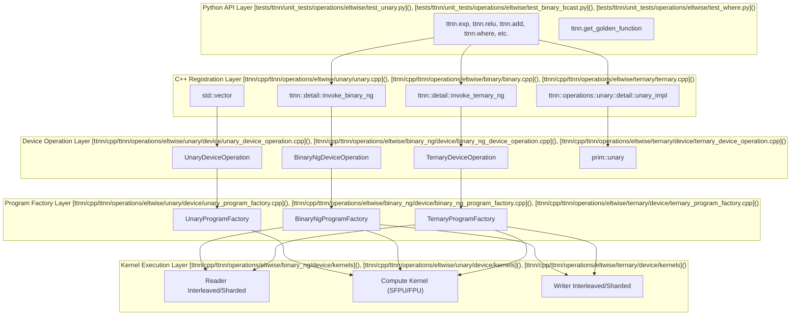
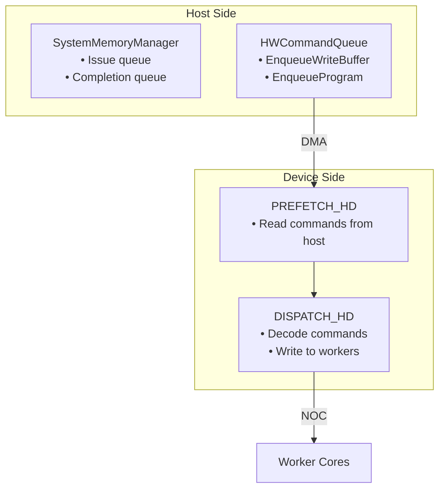
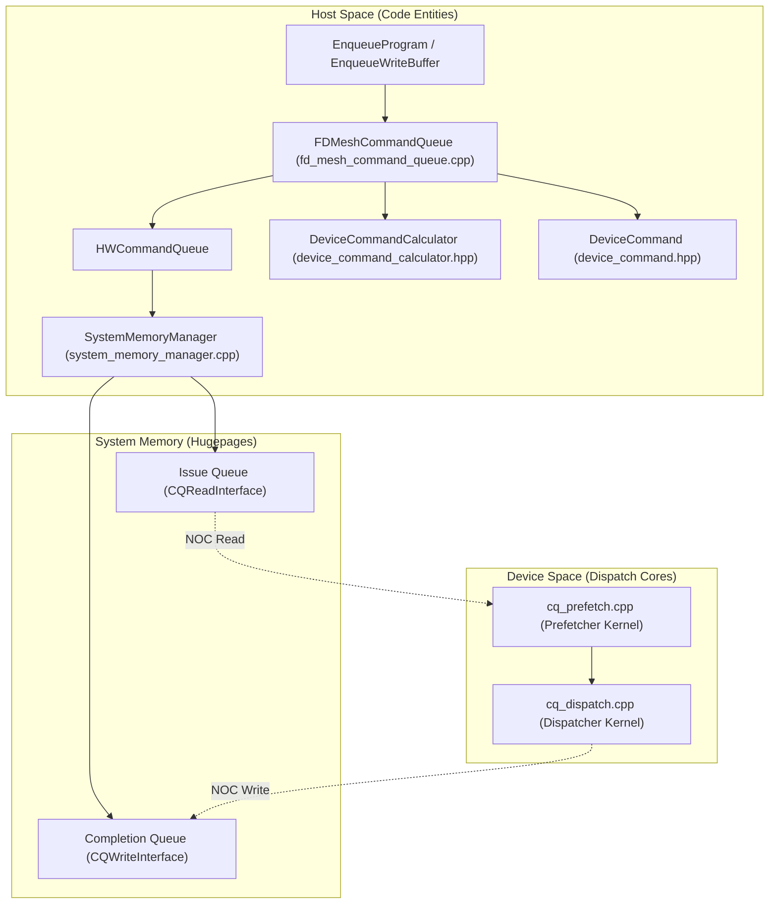
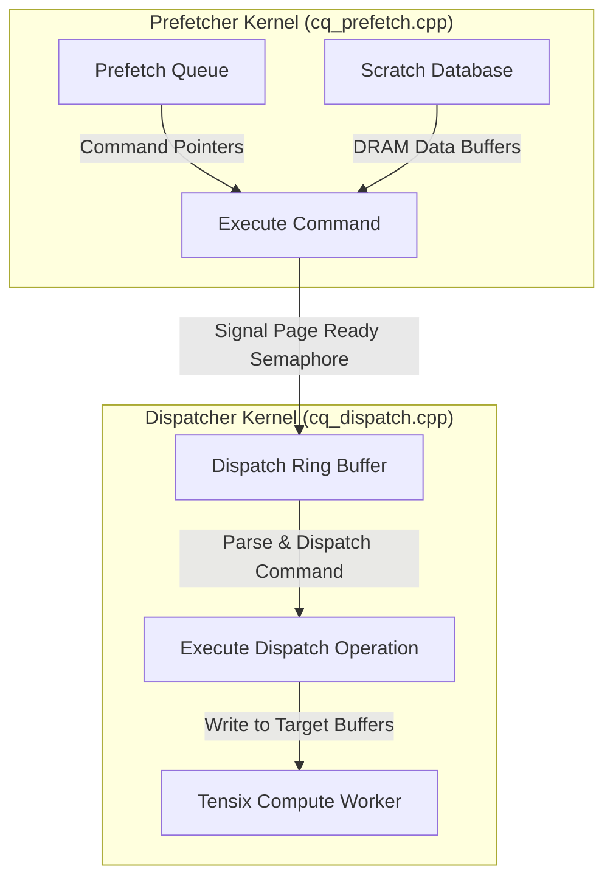
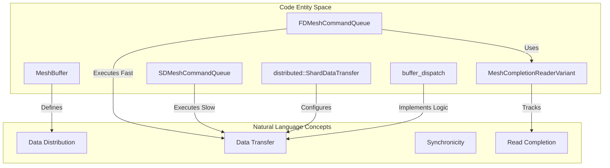
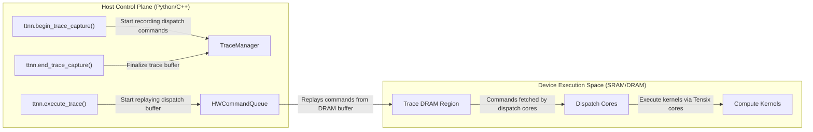

# Fast Dispatch and Command Queue System

Relevant source files
*   [.github/actions/generate-gtest-failure-message/action.yml](https://github.com/tenstorrent/tt-metal/blob/f30f8df0/.github/actions/generate-gtest-failure-message/action.yml)
*   [.github/actions/generate-gtest-failure-message/print_gtest_annotations.py](https://github.com/tenstorrent/tt-metal/blob/f30f8df0/.github/actions/generate-gtest-failure-message/print_gtest_annotations.py)
*   [.github/workflows/fast-dispatch-frequent-tests-impl.yaml](https://github.com/tenstorrent/tt-metal/blob/f30f8df0/.github/workflows/fast-dispatch-frequent-tests-impl.yaml)
*   [METALIUM_GUIDE.md](https://github.com/tenstorrent/tt-metal/blob/f30f8df0/METALIUM_GUIDE.md?plain=1)
*   [docs/source/common/images/tenstorrent-fabric-scale-out-machine.webp](https://github.com/tenstorrent/tt-metal/blob/f30f8df0/docs/source/common/images/tenstorrent-fabric-scale-out-machine.webp)
*   [docs/source/common/images/tenstorrent-galaxy-32-wh.webp](https://github.com/tenstorrent/tt-metal/blob/f30f8df0/docs/source/common/images/tenstorrent-galaxy-32-wh.webp)
*   [docs/source/common/images/tenstorrent-wormhole-quietbox-topology.webp](https://github.com/tenstorrent/tt-metal/blob/f30f8df0/docs/source/common/images/tenstorrent-wormhole-quietbox-topology.webp)
*   [tech_reports/TT-Distributed/MultiHostMeshRuntime.md](https://github.com/tenstorrent/tt-metal/blob/f30f8df0/tech_reports/TT-Distributed/MultiHostMeshRuntime.md?plain=1)
*   [tech_reports/TT-Distributed/TT-Distributed-Architecture-1219.md](https://github.com/tenstorrent/tt-metal/blob/f30f8df0/tech_reports/TT-Distributed/TT-Distributed-Architecture-1219.md?plain=1)
*   [tests/scripts/run_cpp_fd2_tests.sh](https://github.com/tenstorrent/tt-metal/blob/f30f8df0/tests/scripts/run_cpp_fd2_tests.sh)
*   [tests/tt_metal/distributed/test_end_to_end_eltwise.cpp](https://github.com/tenstorrent/tt-metal/blob/f30f8df0/tests/tt_metal/distributed/test_end_to_end_eltwise.cpp)
*   [tests/tt_metal/distributed/test_mesh_buffer.cpp](https://github.com/tenstorrent/tt-metal/blob/f30f8df0/tests/tt_metal/distributed/test_mesh_buffer.cpp)
*   [tests/tt_metal/distributed/test_mesh_events.cpp](https://github.com/tenstorrent/tt-metal/blob/f30f8df0/tests/tt_metal/distributed/test_mesh_events.cpp)
*   [tests/tt_metal/distributed/test_mesh_workload.cpp](https://github.com/tenstorrent/tt-metal/blob/f30f8df0/tests/tt_metal/distributed/test_mesh_workload.cpp)
*   [tests/tt_metal/tt_metal/dispatch/dispatch_buffer/test_EnqueueWriteBuffer_and_EnqueueReadBuffer.cpp](https://github.com/tenstorrent/tt-metal/blob/f30f8df0/tests/tt_metal/tt_metal/dispatch/dispatch_buffer/test_EnqueueWriteBuffer_and_EnqueueReadBuffer.cpp)
*   [tests/tt_metal/tt_metal/dispatch/dispatch_event/test_EnqueueWaitForEvent.cpp](https://github.com/tenstorrent/tt-metal/blob/f30f8df0/tests/tt_metal/tt_metal/dispatch/dispatch_event/test_EnqueueWaitForEvent.cpp)
*   [tests/tt_metal/tt_metal/dispatch/dispatch_event/test_events.cpp](https://github.com/tenstorrent/tt-metal/blob/f30f8df0/tests/tt_metal/tt_metal/dispatch/dispatch_event/test_events.cpp)
*   [tests/tt_metal/tt_metal/dispatch/dispatch_util/test_device_command.cpp](https://github.com/tenstorrent/tt-metal/blob/f30f8df0/tests/tt_metal/tt_metal/dispatch/dispatch_util/test_device_command.cpp)
*   [tests/tt_metal/tt_metal/perf_microbenchmark/dispatch/benchmark_rw_buffer.cpp](https://github.com/tenstorrent/tt-metal/blob/f30f8df0/tests/tt_metal/tt_metal/perf_microbenchmark/dispatch/benchmark_rw_buffer.cpp)
*   [tests/tt_metal/tt_metal/perf_microbenchmark/dispatch/benchmark_rw_buffer_blackhole_golden.json](https://github.com/tenstorrent/tt-metal/blob/f30f8df0/tests/tt_metal/tt_metal/perf_microbenchmark/dispatch/benchmark_rw_buffer_blackhole_golden.json)
*   [tests/tt_metal/tt_metal/perf_microbenchmark/dispatch/benchmark_rw_buffer_golden.json](https://github.com/tenstorrent/tt-metal/blob/f30f8df0/tests/tt_metal/tt_metal/perf_microbenchmark/dispatch/benchmark_rw_buffer_golden.json)
*   [tests/tt_metal/tt_metal/perf_microbenchmark/dispatch/benchmark_rw_buffer_n300_iommu_golden.json](https://github.com/tenstorrent/tt-metal/blob/f30f8df0/tests/tt_metal/tt_metal/perf_microbenchmark/dispatch/benchmark_rw_buffer_n300_iommu_golden.json)
*   [tests/tt_metal/tt_metal/perf_microbenchmark/dispatch/common.h](https://github.com/tenstorrent/tt-metal/blob/f30f8df0/tests/tt_metal/tt_metal/perf_microbenchmark/dispatch/common.h)
*   [tests/tt_metal/tt_metal/perf_microbenchmark/dispatch/compare_benchmark_rw_buffer.py](https://github.com/tenstorrent/tt-metal/blob/f30f8df0/tests/tt_metal/tt_metal/perf_microbenchmark/dispatch/compare_benchmark_rw_buffer.py)
*   [tests/tt_metal/tt_metal/perf_microbenchmark/dispatch/compare_pgm_dispatch_perf_ci.py](https://github.com/tenstorrent/tt-metal/blob/f30f8df0/tests/tt_metal/tt_metal/perf_microbenchmark/dispatch/compare_pgm_dispatch_perf_ci.py)
*   [tests/tt_metal/tt_metal/perf_microbenchmark/dispatch/json_to_csv.py](https://github.com/tenstorrent/tt-metal/blob/f30f8df0/tests/tt_metal/tt_metal/perf_microbenchmark/dispatch/json_to_csv.py)
*   [tests/tt_metal/tt_metal/perf_microbenchmark/dispatch/kernels/spoof_prefetch.cpp](https://github.com/tenstorrent/tt-metal/blob/f30f8df0/tests/tt_metal/tt_metal/perf_microbenchmark/dispatch/kernels/spoof_prefetch.cpp)
*   [tests/tt_metal/tt_metal/perf_microbenchmark/dispatch/pgm_dispatch_blackhole_golden.json](https://github.com/tenstorrent/tt-metal/blob/f30f8df0/tests/tt_metal/tt_metal/perf_microbenchmark/dispatch/pgm_dispatch_blackhole_golden.json)
*   [tests/tt_metal/tt_metal/perf_microbenchmark/dispatch/pgm_dispatch_golden.json](https://github.com/tenstorrent/tt-metal/blob/f30f8df0/tests/tt_metal/tt_metal/perf_microbenchmark/dispatch/pgm_dispatch_golden.json)
*   [tests/tt_metal/tt_metal/perf_microbenchmark/dispatch/sweep_pgm_dispatch.sh](https://github.com/tenstorrent/tt-metal/blob/f30f8df0/tests/tt_metal/tt_metal/perf_microbenchmark/dispatch/sweep_pgm_dispatch.sh)
*   [tests/tt_metal/tt_metal/perf_microbenchmark/dispatch/test_dispatcher.cpp](https://github.com/tenstorrent/tt-metal/blob/f30f8df0/tests/tt_metal/tt_metal/perf_microbenchmark/dispatch/test_dispatcher.cpp)
*   [tests/tt_metal/tt_metal/perf_microbenchmark/dispatch/test_pgm_dispatch.cpp](https://github.com/tenstorrent/tt-metal/blob/f30f8df0/tests/tt_metal/tt_metal/perf_microbenchmark/dispatch/test_pgm_dispatch.cpp)
*   [tests/tt_metal/tt_metal/perf_microbenchmark/dispatch/test_prefetcher.cpp](https://github.com/tenstorrent/tt-metal/blob/f30f8df0/tests/tt_metal/tt_metal/perf_microbenchmark/dispatch/test_prefetcher.cpp)
*   [tests/tt_metal/tt_metal/perf_microbenchmark/dispatch/trim_pgm_dispatch_golden.py](https://github.com/tenstorrent/tt-metal/blob/f30f8df0/tests/tt_metal/tt_metal/perf_microbenchmark/dispatch/trim_pgm_dispatch_golden.py)
*   [tests/tt_metal/tt_metal/perf_microbenchmark/dispatch/trim_rw_buffer_golden.py](https://github.com/tenstorrent/tt-metal/blob/f30f8df0/tests/tt_metal/tt_metal/perf_microbenchmark/dispatch/trim_rw_buffer_golden.py)
*   [tests/ttnn/unit_tests/base_functionality/test_device_synchronize.py](https://github.com/tenstorrent/tt-metal/blob/f30f8df0/tests/ttnn/unit_tests/base_functionality/test_device_synchronize.py)
*   [tt_metal/api/tt-metalium/distributed.hpp](https://github.com/tenstorrent/tt-metal/blob/f30f8df0/tt_metal/api/tt-metalium/distributed.hpp)
*   [tt_metal/api/tt-metalium/experimental/pinned_memory.hpp](https://github.com/tenstorrent/tt-metal/blob/f30f8df0/tt_metal/api/tt-metalium/experimental/pinned_memory.hpp)
*   [tt_metal/api/tt-metalium/mesh_buffer.hpp](https://github.com/tenstorrent/tt-metal/blob/f30f8df0/tt_metal/api/tt-metalium/mesh_buffer.hpp)
*   [tt_metal/api/tt-metalium/mesh_command_queue.hpp](https://github.com/tenstorrent/tt-metal/blob/f30f8df0/tt_metal/api/tt-metalium/mesh_command_queue.hpp)
*   [tt_metal/api/tt-metalium/mesh_config.hpp](https://github.com/tenstorrent/tt-metal/blob/f30f8df0/tt_metal/api/tt-metalium/mesh_config.hpp)
*   [tt_metal/core_descriptors/quasar_simulation_2x3_arch_fast_dispatch.yaml](https://github.com/tenstorrent/tt-metal/blob/f30f8df0/tt_metal/core_descriptors/quasar_simulation_2x3_arch_fast_dispatch.yaml)
*   [tt_metal/distributed/distributed.cpp](https://github.com/tenstorrent/tt-metal/blob/f30f8df0/tt_metal/distributed/distributed.cpp)
*   [tt_metal/distributed/dummy_mesh_command_queue.cpp](https://github.com/tenstorrent/tt-metal/blob/f30f8df0/tt_metal/distributed/dummy_mesh_command_queue.cpp)
*   [tt_metal/distributed/dummy_mesh_command_queue.hpp](https://github.com/tenstorrent/tt-metal/blob/f30f8df0/tt_metal/distributed/dummy_mesh_command_queue.hpp)
*   [tt_metal/distributed/fd_mesh_command_queue.cpp](https://github.com/tenstorrent/tt-metal/blob/f30f8df0/tt_metal/distributed/fd_mesh_command_queue.cpp)
*   [tt_metal/distributed/fd_mesh_command_queue.hpp](https://github.com/tenstorrent/tt-metal/blob/f30f8df0/tt_metal/distributed/fd_mesh_command_queue.hpp)
*   [tt_metal/distributed/mesh_buffer.cpp](https://github.com/tenstorrent/tt-metal/blob/f30f8df0/tt_metal/distributed/mesh_buffer.cpp)
*   [tt_metal/distributed/mesh_command_queue_base.cpp](https://github.com/tenstorrent/tt-metal/blob/f30f8df0/tt_metal/distributed/mesh_command_queue_base.cpp)
*   [tt_metal/distributed/mesh_command_queue_base.hpp](https://github.com/tenstorrent/tt-metal/blob/f30f8df0/tt_metal/distributed/mesh_command_queue_base.hpp)
*   [tt_metal/distributed/mesh_workload_utils.cpp](https://github.com/tenstorrent/tt-metal/blob/f30f8df0/tt_metal/distributed/mesh_workload_utils.cpp)
*   [tt_metal/distributed/pinned_memory.cpp](https://github.com/tenstorrent/tt-metal/blob/f30f8df0/tt_metal/distributed/pinned_memory.cpp)
*   [tt_metal/distributed/pinned_memory_impl.hpp](https://github.com/tenstorrent/tt-metal/blob/f30f8df0/tt_metal/distributed/pinned_memory_impl.hpp)
*   [tt_metal/distributed/sd_mesh_command_queue.cpp](https://github.com/tenstorrent/tt-metal/blob/f30f8df0/tt_metal/distributed/sd_mesh_command_queue.cpp)
*   [tt_metal/distributed/sd_mesh_command_queue.hpp](https://github.com/tenstorrent/tt-metal/blob/f30f8df0/tt_metal/distributed/sd_mesh_command_queue.hpp)
*   [tt_metal/impl/buffers/dispatch.cpp](https://github.com/tenstorrent/tt-metal/blob/f30f8df0/tt_metal/impl/buffers/dispatch.cpp)
*   [tt_metal/impl/buffers/dispatch.hpp](https://github.com/tenstorrent/tt-metal/blob/f30f8df0/tt_metal/impl/buffers/dispatch.hpp)
*   [tt_metal/impl/dispatch/debug_tools.cpp](https://github.com/tenstorrent/tt-metal/blob/f30f8df0/tt_metal/impl/dispatch/debug_tools.cpp)
*   [tt_metal/impl/dispatch/device_command.cpp](https://github.com/tenstorrent/tt-metal/blob/f30f8df0/tt_metal/impl/dispatch/device_command.cpp)
*   [tt_metal/impl/dispatch/device_command.hpp](https://github.com/tenstorrent/tt-metal/blob/f30f8df0/tt_metal/impl/dispatch/device_command.hpp)
*   [tt_metal/impl/dispatch/device_command_calculator.hpp](https://github.com/tenstorrent/tt-metal/blob/f30f8df0/tt_metal/impl/dispatch/device_command_calculator.hpp)
*   [tt_metal/impl/dispatch/kernel_config/dispatch.cpp](https://github.com/tenstorrent/tt-metal/blob/f30f8df0/tt_metal/impl/dispatch/kernel_config/dispatch.cpp)
*   [tt_metal/impl/dispatch/kernel_config/dispatch.hpp](https://github.com/tenstorrent/tt-metal/blob/f30f8df0/tt_metal/impl/dispatch/kernel_config/dispatch.hpp)
*   [tt_metal/impl/dispatch/kernel_config/dispatch_s.cpp](https://github.com/tenstorrent/tt-metal/blob/f30f8df0/tt_metal/impl/dispatch/kernel_config/dispatch_s.cpp)
*   [tt_metal/impl/dispatch/kernel_config/dispatch_s.hpp](https://github.com/tenstorrent/tt-metal/blob/f30f8df0/tt_metal/impl/dispatch/kernel_config/dispatch_s.hpp)
*   [tt_metal/impl/dispatch/kernel_config/fd_kernel.cpp](https://github.com/tenstorrent/tt-metal/blob/f30f8df0/tt_metal/impl/dispatch/kernel_config/fd_kernel.cpp)
*   [tt_metal/impl/dispatch/kernel_config/fd_kernel.hpp](https://github.com/tenstorrent/tt-metal/blob/f30f8df0/tt_metal/impl/dispatch/kernel_config/fd_kernel.hpp)
*   [tt_metal/impl/dispatch/kernel_config/prefetch.cpp](https://github.com/tenstorrent/tt-metal/blob/f30f8df0/tt_metal/impl/dispatch/kernel_config/prefetch.cpp)
*   [tt_metal/impl/dispatch/kernel_config/prefetch.hpp](https://github.com/tenstorrent/tt-metal/blob/f30f8df0/tt_metal/impl/dispatch/kernel_config/prefetch.hpp)
*   [tt_metal/impl/dispatch/kernels/cq_commands.hpp](https://github.com/tenstorrent/tt-metal/blob/f30f8df0/tt_metal/impl/dispatch/kernels/cq_commands.hpp)
*   [tt_metal/impl/dispatch/kernels/cq_common.hpp](https://github.com/tenstorrent/tt-metal/blob/f30f8df0/tt_metal/impl/dispatch/kernels/cq_common.hpp)
*   [tt_metal/impl/dispatch/kernels/cq_dispatch.cpp](https://github.com/tenstorrent/tt-metal/blob/f30f8df0/tt_metal/impl/dispatch/kernels/cq_dispatch.cpp)
*   [tt_metal/impl/dispatch/kernels/cq_dispatch_subordinate.cpp](https://github.com/tenstorrent/tt-metal/blob/f30f8df0/tt_metal/impl/dispatch/kernels/cq_dispatch_subordinate.cpp)
*   [tt_metal/impl/dispatch/kernels/cq_prefetch.cpp](https://github.com/tenstorrent/tt-metal/blob/f30f8df0/tt_metal/impl/dispatch/kernels/cq_prefetch.cpp)
*   [tt_metal/impl/dispatch/kernels/realtime_profiler.hpp](https://github.com/tenstorrent/tt-metal/blob/f30f8df0/tt_metal/impl/dispatch/kernels/realtime_profiler.hpp)
*   [tt_metal/impl/event/dispatch.cpp](https://github.com/tenstorrent/tt-metal/blob/f30f8df0/tt_metal/impl/event/dispatch.cpp)
*   [tt_metal/impl/trace/dispatch.cpp](https://github.com/tenstorrent/tt-metal/blob/f30f8df0/tt_metal/impl/trace/dispatch.cpp)
*   [tt_metal/programming_examples/distributed/1_distributed_program_dispatch/distributed_program_dispatch.cpp](https://github.com/tenstorrent/tt-metal/blob/f30f8df0/tt_metal/programming_examples/distributed/1_distributed_program_dispatch/distributed_program_dispatch.cpp)
*   [tt_metal/programming_examples/distributed/2_distributed_buffer_rw/distributed_buffer_rw.cpp](https://github.com/tenstorrent/tt-metal/blob/f30f8df0/tt_metal/programming_examples/distributed/2_distributed_buffer_rw/distributed_buffer_rw.cpp)
*   [tt_metal/programming_examples/distributed/3_distributed_eltwise_add/distributed_eltwise_add.cpp](https://github.com/tenstorrent/tt-metal/blob/f30f8df0/tt_metal/programming_examples/distributed/3_distributed_eltwise_add/distributed_eltwise_add.cpp)
*   [tt_metal/programming_examples/distributed/4_distributed_trace_and_events/distributed_trace_and_events.cpp](https://github.com/tenstorrent/tt-metal/blob/f30f8df0/tt_metal/programming_examples/distributed/4_distributed_trace_and_events/distributed_trace_and_events.cpp)
*   [ttnn/api/ttnn/events.hpp](https://github.com/tenstorrent/tt-metal/blob/f30f8df0/ttnn/api/ttnn/events.hpp)
*   [ttnn/core/async_runtime.cpp](https://github.com/tenstorrent/tt-metal/blob/f30f8df0/ttnn/core/async_runtime.cpp)
*   [ttnn/core/events.cpp](https://github.com/tenstorrent/tt-metal/blob/f30f8df0/ttnn/core/events.cpp)

## Purpose and Scope

This document describes the **Fast Dispatch** architecture and **Command Queue System** in tt-metal, which provides a high-performance mechanism for submitting and executing work on Tenstorrent hardware. Fast Dispatch is a kernel-based dispatch system that runs specialized firmware on dedicated dispatch cores to efficiently manage program execution, data movement, and synchronization.

This page covers:

*   Command queue architecture (`HWCommandQueue`, `SystemMemoryManager`, `FDMeshCommandQueue`)
*   Dispatch cores (prefetcher/dispatcher) and their firmware implementation
*   Command queue operations and data flow
*   Multi-device dispatch via Mesh Command Queues

Sources: [tt_metal/impl/dispatch/kernels/cq_prefetch.cpp 5-11](https://github.com/tenstorrent/tt-metal/blob/f30f8df0/tt_metal/impl/dispatch/kernels/cq_prefetch.cpp#L5-L11)[tt_metal/distributed/fd_mesh_command_queue.cpp 132-158](https://github.com/tenstorrent/tt-metal/blob/f30f8df0/tt_metal/distributed/fd_mesh_command_queue.cpp#L132-L158)

* * *

## System Architecture Overview


**Diagram 1: Element-wise Operation System Architecture**

The system transforms high-level Python operations into hardware-specific kernel programs through multiple abstraction layers. It utilizes the "Next-Gen" (NG) framework for unified handling of binary and unary-with-scalar operations.

Sources: [ttnn/cpp/ttnn/operations/eltwise/unary/unary.hpp:23-30](), [ttnn/cpp/ttnn/operations/eltwise/unary/unary.cpp:14-49](), [ttnn/cpp/ttnn/operations/eltwise/binary_ng/device/binary_ng_device_operation.cpp:5-10](), [ttnn/cpp/ttnn/operations/eltwise/binary_ng/device/binary_ng_program_factory.cpp:20-44]()

---
```


Fast Dispatch uses specialized **dispatch kernels** running on dedicated cores to manage command execution. Commands are submitted to host-side command queues, transferred to device memory, and processed by dispatch kernels that coordinate program launches, data transfers, and synchronization.

### Fast Dispatch vs Slow Dispatch

**Fast Dispatch** (default mode):

*   Dispatch operations handled by on-device kernels (`cq_prefetch.cpp`, `cq_dispatch.cpp`) running on dedicated cores [tt_metal/impl/dispatch/kernels/cq_prefetch.cpp 5-11](https://github.com/tenstorrent/tt-metal/blob/f30f8df0/tt_metal/impl/dispatch/kernels/cq_prefetch.cpp#L5-L11)[tt_metal/impl/dispatch/kernels/cq_dispatch.cpp 5-11](https://github.com/tenstorrent/tt-metal/blob/f30f8df0/tt_metal/impl/dispatch/kernels/cq_dispatch.cpp#L5-L11)
*   High throughput, low latency command submission via asynchronous processing.
*   Supports multiple hardware command queues (up to 2 by default).

**Slow Dispatch** (legacy/debug mode):

*   Dispatch operations managed directly from the host via UMD.
*   `SDMeshCommandQueue` handles slow dispatch for mesh devices by writing directly to buffers and waiting for idle state [tt_metal/distributed/sd_mesh_command_queue.cpp 1-50](https://github.com/tenstorrent/tt-metal/blob/f30f8df0/tt_metal/distributed/sd_mesh_command_queue.cpp#L1-L50)

Sources: [tt_metal/impl/dispatch/kernels/cq_prefetch.cpp 5-11](https://github.com/tenstorrent/tt-metal/blob/f30f8df0/tt_metal/impl/dispatch/kernels/cq_prefetch.cpp#L5-L11)[tt_metal/distributed/sd_mesh_command_queue.cpp 1-50](https://github.com/tenstorrent/tt-metal/blob/f30f8df0/tt_metal/distributed/sd_mesh_command_queue.cpp#L1-L50)[tests/tt_metal/tt_metal/perf_microbenchmark/dispatch/test_prefetcher.cpp 37-62](https://github.com/tenstorrent/tt-metal/blob/f30f8df0/tests/tt_metal/tt_metal/perf_microbenchmark/dispatch/test_prefetcher.cpp#L37-L62)

* * *

## Command Queue Architecture




### HWCommandQueue

The `HWCommandQueue` class represents a physical hardware queue on a single device. It manages the interaction between the host and the device dispatch cores.

### FDMeshCommandQueue


Sources: [tt_metal/impl/dispatch/kernels/cq_dispatch.cpp:26-26](), [tt_metal/distributed/fd_mesh_command_queue.cpp:132-168](), [tt_metal/impl/dispatch/kernels/cq_common.hpp:19-33]()
```


The `FDMeshCommandQueue` class is the primary interface for submitting work to a `MeshDevice`. It manages the distribution of commands across multiple physical devices and coordinates with the completion queue reader thread [tt_metal/distributed/fd_mesh_command_queue.cpp 132-158](https://github.com/tenstorrent/tt-metal/blob/f30f8df0/tt_metal/distributed/fd_mesh_command_queue.cpp#L132-L158)

**Key Responsibilities:**

*   Managing `config_buffer_mgr_` for worker configuration [tt_metal/distributed/fd_mesh_command_queue.cpp 159-164](https://github.com/tenstorrent/tt-metal/blob/f30f8df0/tt_metal/distributed/fd_mesh_command_queue.cpp#L159-L164)
*   Handling program dispatch to subgrids and recording sub-device usage [tt_metal/distributed/fd_mesh_command_queue.cpp 83-100](https://github.com/tenstorrent/tt-metal/blob/f30f8df0/tt_metal/distributed/fd_mesh_command_queue.cpp#L83-L100)
*   Managing a dedicated `completion_queue_reader_thread_` to process results from the device [tt_metal/distributed/fd_mesh_command_queue.cpp 167](https://github.com/tenstorrent/tt-metal/blob/f30f8df0/tt_metal/distributed/fd_mesh_command_queue.cpp#L167-L167)

**Host-to-Device Entity Mapping**

Sources: [tt_metal/impl/dispatch/kernels/cq_dispatch.cpp 26](https://github.com/tenstorrent/tt-metal/blob/f30f8df0/tt_metal/impl/dispatch/kernels/cq_dispatch.cpp#L26-L26)[tt_metal/distributed/fd_mesh_command_queue.cpp 132-168](https://github.com/tenstorrent/tt-metal/blob/f30f8df0/tt_metal/distributed/fd_mesh_command_queue.cpp#L132-L168)[tt_metal/impl/dispatch/kernels/cq_common.hpp 19-33](https://github.com/tenstorrent/tt-metal/blob/f30f8df0/tt_metal/impl/dispatch/kernels/cq_common.hpp#L19-L33)

### SystemMemoryManager and Interfaces

The dispatch system relies on shared structures between host and device to manage pointers in the hugepage regions.

*   **CQReadInterface**: Controls reads from the issue region; host owns the write interface [tt_metal/impl/dispatch/kernels/cq_common.hpp 19-24](https://github.com/tenstorrent/tt-metal/blob/f30f8df0/tt_metal/impl/dispatch/kernels/cq_common.hpp#L19-L24)
*   **CQWriteInterface**: Controls writes to the completion region; host owns the read interface [tt_metal/impl/dispatch/kernels/cq_common.hpp 28-33](https://github.com/tenstorrent/tt-metal/blob/f30f8df0/tt_metal/impl/dispatch/kernels/cq_common.hpp#L28-L33)

Sources: [tt_metal/impl/dispatch/kernels/cq_common.hpp 19-33](https://github.com/tenstorrent/tt-metal/blob/f30f8df0/tt_metal/impl/dispatch/kernels/cq_common.hpp#L19-L33)[tt_metal/impl/dispatch/kernels/cq_dispatch.cpp 26](https://github.com/tenstorrent/tt-metal/blob/f30f8df0/tt_metal/impl/dispatch/kernels/cq_dispatch.cpp#L26-L26)

* * *

## Dispatch Kernels (Firmware)

The dispatch system relies on several kernel types running on device cores. Configuration for these kernels is handled by classes like `DispatchKernel` and `PrefetchKernel`.

### Prefetcher Kernel (`cq_prefetch.cpp`)

The prefetcher fetches commands from the host's Issue Queue in system memory.

*   **Flavors**: Supports Host-only (`_h`), DRAM-only (`_d`), and Host+DRAM (`_hd`) variants [tt_metal/impl/dispatch/kernels/cq_prefetch.cpp 6-9](https://github.com/tenstorrent/tt-metal/blob/f30f8df0/tt_metal/impl/dispatch/kernels/cq_prefetch.cpp#L6-L9)
*   **Scratch Buffer**: Uses a double-buffered `scratch_db` for out-of-band data transfers [tt_metal/impl/dispatch/kernels/cq_prefetch.cpp 72-73](https://github.com/tenstorrent/tt-metal/blob/f30f8df0/tt_metal/impl/dispatch/kernels/cq_prefetch.cpp#L72-L73)
*   **Relay Logic**: Relays commands to the dispatcher using `page_ready` and `page_done` semaphores [tt_metal/impl/dispatch/kernels/cq_prefetch.cpp 10-11](https://github.com/tenstorrent/tt-metal/blob/f30f8df0/tt_metal/impl/dispatch/kernels/cq_prefetch.cpp#L10-L11)
*   **NOC Writes**: Uses specialized write command buffers like `BRISC_WR_CMD_BUF` for downstream communication [tt_metal/impl/dispatch/kernels/cq_prefetch.cpp 12-14](https://github.com/tenstorrent/tt-metal/blob/f30f8df0/tt_metal/impl/dispatch/kernels/cq_prefetch.cpp#L12-L14)

### Dispatcher Kernel (`cq_dispatch.cpp`)


These kernels provide the low-level primitives enabling multiple command queues and asynchronous dispatch [tt_metal/impl/dispatch/kernels/cq_prefetch.cpp:5-10](), [tt_metal/impl/dispatch/kernels/cq_dispatch.cpp:5-8]().

---
```


The dispatcher parses the commands relayed by the prefetcher and executes them.

*   **Dispatch Buffer**: Receives data in pages into the dispatch buffer ring buffer [tt_metal/impl/dispatch/kernels/cq_dispatch.cpp 6-7](https://github.com/tenstorrent/tt-metal/blob/f30f8df0/tt_metal/impl/dispatch/kernels/cq_dispatch.cpp#L6-L7)
*   **Command Execution**: Processes commands to write data to destination workers or sync state [tt_metal/impl/dispatch/kernels/cq_dispatch.cpp 7-8](https://github.com/tenstorrent/tt-metal/blob/f30f8df0/tt_metal/impl/dispatch/kernels/cq_dispatch.cpp#L7-L8)
*   **Go Signals**: Triggers worker execution via multicast (`mcast_go_signal_addr`) or unicast (`unicast_go_signal_addr`) signals [tt_metal/impl/dispatch/kernels/cq_dispatch.cpp 51-54](https://github.com/tenstorrent/tt-metal/blob/f30f8df0/tt_metal/impl/dispatch/kernels/cq_dispatch.cpp#L51-L54)
*   **Completion Management**: Writes data requests and event states to the completion region [tt_metal/impl/dispatch/kernels/cq_dispatch.cpp 23-24](https://github.com/tenstorrent/tt-metal/blob/f30f8df0/tt_metal/impl/dispatch/kernels/cq_dispatch.cpp#L23-L24)

Sources: [tt_metal/impl/dispatch/kernels/cq_prefetch.cpp 5-18](https://github.com/tenstorrent/tt-metal/blob/f30f8df0/tt_metal/impl/dispatch/kernels/cq_prefetch.cpp#L5-L18)[tt_metal/impl/dispatch/kernels/cq_dispatch.cpp 5-54](https://github.com/tenstorrent/tt-metal/blob/f30f8df0/tt_metal/impl/dispatch/kernels/cq_dispatch.cpp#L5-L54)[tt_metal/impl/dispatch/kernel_config/dispatch.cpp 37-96](https://github.com/tenstorrent/tt-metal/blob/f30f8df0/tt_metal/impl/dispatch/kernel_config/dispatch.cpp#L37-L96)

* * *

## Command Submission Flow

The following diagram illustrates the lifecycle of a command from the high-level API down to the hardware kernels.

Sources: [tt_metal/impl/dispatch/kernels/cq_dispatch.cpp 5-30](https://github.com/tenstorrent/tt-metal/blob/f30f8df0/tt_metal/impl/dispatch/kernels/cq_dispatch.cpp#L5-L30)[tt_metal/impl/dispatch/kernels/cq_prefetch.cpp 5-25](https://github.com/tenstorrent/tt-metal/blob/f30f8df0/tt_metal/impl/dispatch/kernels/cq_prefetch.cpp#L5-L25)[tests/tt_metal/tt_metal/perf_microbenchmark/dispatch/test_prefetcher.cpp 37-62](https://github.com/tenstorrent/tt-metal/blob/f30f8df0/tests/tt_metal/tt_metal/perf_microbenchmark/dispatch/test_prefetcher.cpp#L37-L62)

* * *

## Dispatch Topology and NOC Selection

Dispatch kernels are assigned specific NOC (Network-on-Chip) indices to avoid congestion and deadlocks.

*   **NOC Configuration**: Prefetcher and Dispatcher use specific NOC indices (`UPSTREAM_NOC_INDEX`, `NOC_INDEX`) to separate traffic [tt_metal/impl/dispatch/kernels/cq_dispatch.cpp 118-122](https://github.com/tenstorrent/tt-metal/blob/f30f8df0/tt_metal/impl/dispatch/kernels/cq_dispatch.cpp#L118-L122)
*   **Traffic Routing**: Traffic is routed using physical coordinates encoded via `NOC_XY_ENCODING`[tt_metal/impl/dispatch/kernels/cq_dispatch.cpp 119-123](https://github.com/tenstorrent/tt-metal/blob/f30f8df0/tt_metal/impl/dispatch/kernels/cq_dispatch.cpp#L119-L123)
*   **Fabric Integration**: For multi-chip systems, dispatch commands can be routed via Fabric Mux using `fabric_mux_channel_base_address` and flow control semaphores [tt_metal/impl/dispatch/kernels/cq_dispatch.cpp 74-87](https://github.com/tenstorrent/tt-metal/blob/f30f8df0/tt_metal/impl/dispatch/kernels/cq_dispatch.cpp#L74-L87)

Sources: [tt_metal/impl/dispatch/kernels/cq_dispatch.cpp 118-128](https://github.com/tenstorrent/tt-metal/blob/f30f8df0/tt_metal/impl/dispatch/kernels/cq_dispatch.cpp#L118-L128)[tt_metal/impl/dispatch/kernels/cq_prefetch.cpp 92-112](https://github.com/tenstorrent/tt-metal/blob/f30f8df0/tt_metal/impl/dispatch/kernels/cq_prefetch.cpp#L92-L112)[tt_metal/impl/dispatch/kernel_config/dispatch.cpp 103-112](https://github.com/tenstorrent/tt-metal/blob/f30f8df0/tt_metal/impl/dispatch/kernel_config/dispatch.cpp#L103-L112)

* * *

## Buffer Write Dispatch

Buffer writes are managed through specialized dispatch parameters that calculate how to partition data into transactions.

| Class | Purpose | Location |
| --- | --- | --- |
| `BufferWriteDispatchParams` | Base parameters for assembly of dispatch commands | [tt_metal/impl/buffers/dispatch.cpp 54](https://github.com/tenstorrent/tt-metal/blob/f30f8df0/tt_metal/impl/buffers/dispatch.cpp#L54-L54) |
| `InterleavedBufferWriteDispatchParams` | Parameters for interleaved (banked) buffer writes | [tt_metal/impl/buffers/dispatch.cpp 84](https://github.com/tenstorrent/tt-metal/blob/f30f8df0/tt_metal/impl/buffers/dispatch.cpp#L84-L84) |
| `InterleavedBufferWriteLargePageDispatchParams` | Optimized writes for pages exceeding standard CQ limits | [tt_metal/impl/buffers/dispatch.cpp 161](https://github.com/tenstorrent/tt-metal/blob/f30f8df0/tt_metal/impl/buffers/dispatch.cpp#L161-L161) |

Sources: [tt_metal/impl/buffers/dispatch.cpp 45-180](https://github.com/tenstorrent/tt-metal/blob/f30f8df0/tt_metal/impl/buffers/dispatch.cpp#L45-L180)

* * *

## Key Functions and Classes

| Entity | Role | Location |
| --- | --- | --- |
| `FDMeshCommandQueue` | Mesh-level hardware command queue management | [tt_metal/distributed/fd_mesh_command_queue.cpp 132](https://github.com/tenstorrent/tt-metal/blob/f30f8df0/tt_metal/distributed/fd_mesh_command_queue.cpp#L132-L132) |
| `cq_prefetch` | Device kernel that pulls commands from host/DRAM | [tt_metal/impl/dispatch/kernels/cq_prefetch.cpp 5](https://github.com/tenstorrent/tt-metal/blob/f30f8df0/tt_metal/impl/dispatch/kernels/cq_prefetch.cpp#L5-L5) |
| `cq_dispatch` | Device kernel that executes commands on workers | [tt_metal/impl/dispatch/kernels/cq_dispatch.cpp 5](https://github.com/tenstorrent/tt-metal/blob/f30f8df0/tt_metal/impl/dispatch/kernels/cq_dispatch.cpp#L5-L5) |
| `DispatchKernel` | Configures dispatcher kernel static/dynamic state | [tt_metal/impl/dispatch/kernel_config/dispatch.cpp 37](https://github.com/tenstorrent/tt-metal/blob/f30f8df0/tt_metal/impl/dispatch/kernel_config/dispatch.cpp#L37-L37) |
| `PrefetchKernel` | Configures prefetcher kernel static/dynamic state | [tt_metal/impl/dispatch/kernel_config/prefetch.cpp 38](https://github.com/tenstorrent/tt-metal/blob/f30f8df0/tt_metal/impl/dispatch/kernel_config/prefetch.cpp#L38-L38) |
| `CQReadInterface` | Structure for managing issue queue pointers | [tt_metal/impl/dispatch/kernels/cq_common.hpp 19](https://github.com/tenstorrent/tt-metal/blob/f30f8df0/tt_metal/impl/dispatch/kernels/cq_common.hpp#L19-L19) |
| `CQWriteInterface` | Structure for managing completion queue pointers | [tt_metal/impl/dispatch/kernels/cq_common.hpp 28](https://github.com/tenstorrent/tt-metal/blob/f30f8df0/tt_metal/impl/dispatch/kernels/cq_common.hpp#L28-L28) |
| `BufferWriteDispatchParams` | Logic for assembling write commands | [tt_metal/impl/buffers/dispatch.cpp 54](https://github.com/tenstorrent/tt-metal/blob/f30f8df0/tt_metal/impl/buffers/dispatch.cpp#L54-L54) |

Sources: [tt_metal/impl/dispatch/kernels/cq_prefetch.cpp 5-25](https://github.com/tenstorrent/tt-metal/blob/f30f8df0/tt_metal/impl/dispatch/kernels/cq_prefetch.cpp#L5-L25)[tt_metal/impl/dispatch/kernels/cq_dispatch.cpp 5-30](https://github.com/tenstorrent/tt-metal/blob/f30f8df0/tt_metal/impl/dispatch/kernels/cq_dispatch.cpp#L5-L30)[tt_metal/distributed/fd_mesh_command_queue.cpp 132-168](https://github.com/tenstorrent/tt-metal/blob/f30f8df0/tt_metal/distributed/fd_mesh_command_queue.cpp#L132-L168)[tt_metal/impl/buffers/dispatch.cpp 54-120](https://github.com/tenstorrent/tt-metal/blob/f30f8df0/tt_metal/impl/buffers/dispatch.cpp#L54-L120)

Dismiss
Refresh this wiki

Enter email to refresh

## Additional Diagrams


#### FDMeshCommandQueue Execution




**Diagram: Mesh Data Movement Concepts to Code Entities**

Sources: `tt_metal/distributed/fd_mesh_command_queue.cpp:132-168`, `tt_metal/distributed/sd_mesh_command_queue.cpp:53-70`, `tt_metal/api/tt-metalium/mesh_command_queue.hpp:164-173`, `tt_metal/impl/buffers/dispatch.cpp:41-81`, `tt_metal/distributed/mesh_buffer.cpp:84-160`

---
```


#### Data and Control Flow of Metal Trace




