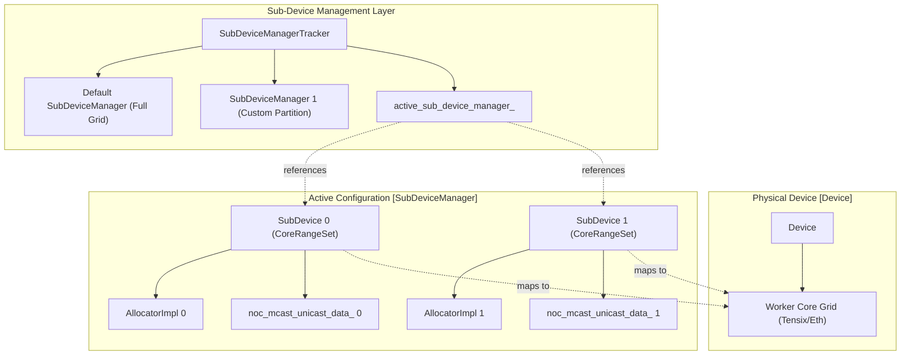
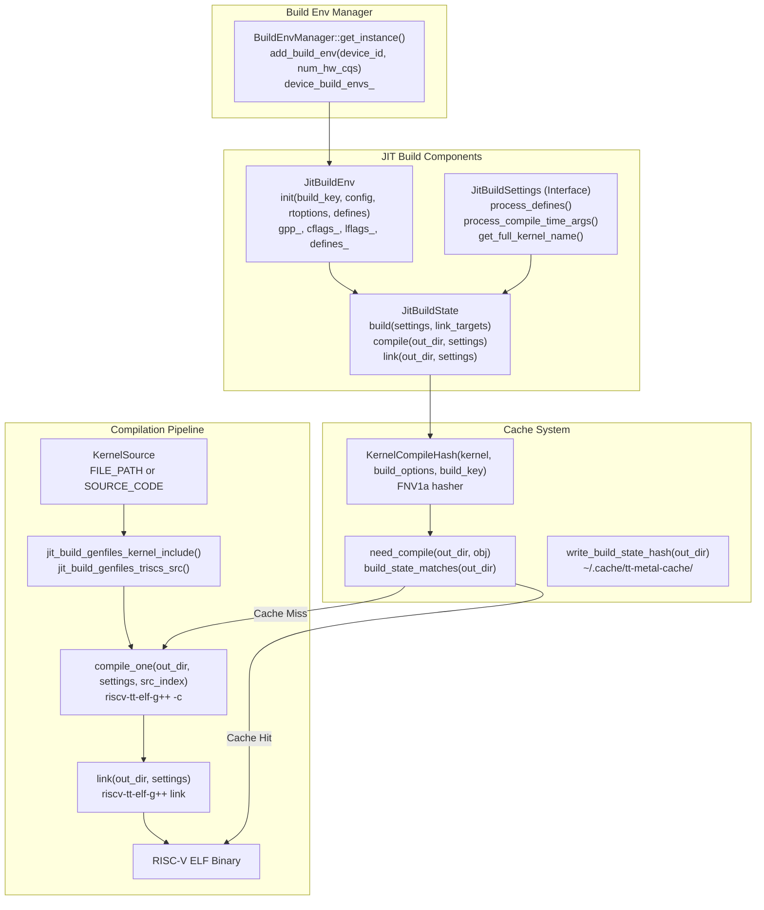
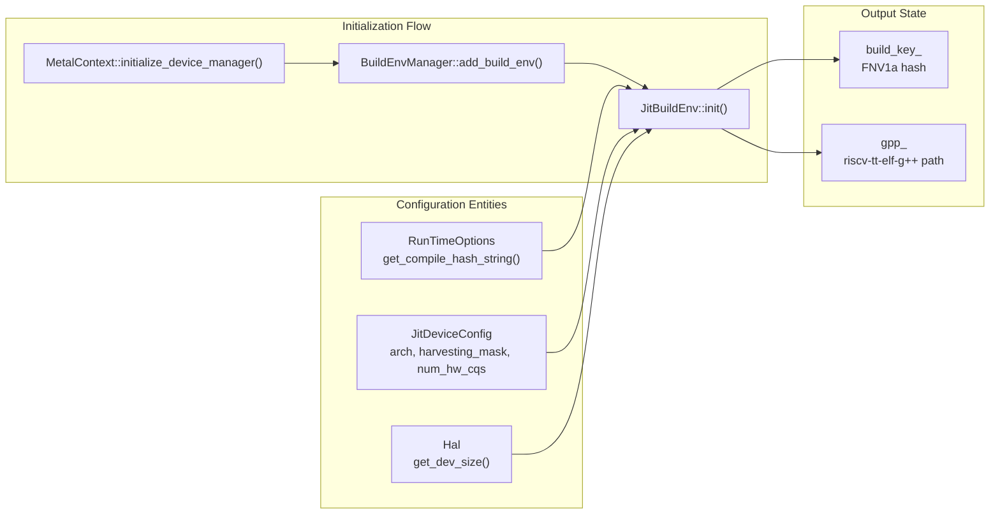
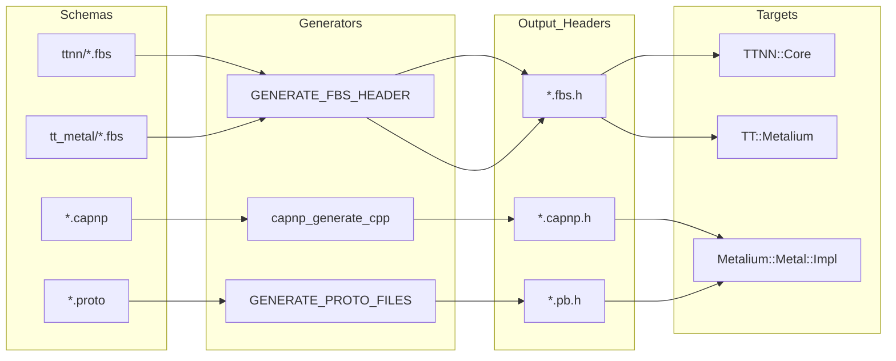

# JIT Build System and Kernel Compilation

Relevant source files
*   [cmake/protobuf.cmake](https://github.com/tenstorrent/tt-metal/blob/f30f8df0/cmake/protobuf.cmake)
*   [dockerfile/Dockerfile.manylinux](https://github.com/tenstorrent/tt-metal/blob/f30f8df0/dockerfile/Dockerfile.manylinux)
*   [docs/source/common/images/16LB_Cluster.png](https://github.com/tenstorrent/tt-metal/blob/f30f8df0/docs/source/common/images/16LB_Cluster.png)
*   [docs/source/tt-metalium/tt_metal/apis/kernel_apis/sfpu/llk.rst](https://github.com/tenstorrent/tt-metal/blob/f30f8df0/docs/source/tt-metalium/tt_metal/apis/kernel_apis/sfpu/llk.rst)
*   [models/demos/deepseek_v3_b1/micro_ops/sdpa/kernels/sdpa_compute.cpp](https://github.com/tenstorrent/tt-metal/blob/f30f8df0/models/demos/deepseek_v3_b1/micro_ops/sdpa/kernels/sdpa_compute.cpp)
*   [tests/tt_metal/tt_fabric/custom_mesh_descriptors/mgd2_syntax_check_mesh_graph_descriptor.textproto](https://github.com/tenstorrent/tt-metal/blob/f30f8df0/tests/tt_metal/tt_fabric/custom_mesh_descriptors/mgd2_syntax_check_mesh_graph_descriptor.textproto)
*   [tests/tt_metal/tt_fabric/fabric_router/test_control_plane_logical_to_physical.cpp](https://github.com/tenstorrent/tt-metal/blob/f30f8df0/tests/tt_metal/tt_fabric/fabric_router/test_control_plane_logical_to_physical.cpp)
*   [tests/tt_metal/tt_fabric/fabric_router/test_mesh_graph_descriptor.cpp](https://github.com/tenstorrent/tt-metal/blob/f30f8df0/tests/tt_metal/tt_fabric/fabric_router/test_mesh_graph_descriptor.cpp)
*   [tests/tt_metal/tt_fabric/fabric_router/test_multi_host.cpp](https://github.com/tenstorrent/tt-metal/blob/f30f8df0/tests/tt_metal/tt_fabric/fabric_router/test_multi_host.cpp)
*   [tests/tt_metal/tt_fabric/fabric_router/test_routing_tables.cpp](https://github.com/tenstorrent/tt-metal/blob/f30f8df0/tests/tt_metal/tt_fabric/fabric_router/test_routing_tables.cpp)
*   [tests/tt_metal/tt_fabric/system_health/test_system_health.cpp](https://github.com/tenstorrent/tt-metal/blob/f30f8df0/tests/tt_metal/tt_fabric/system_health/test_system_health.cpp)
*   [tests/tt_metal/tt_metal/device/CMakeLists.txt](https://github.com/tenstorrent/tt-metal/blob/f30f8df0/tests/tt_metal/tt_metal/device/CMakeLists.txt)
*   [tests/tt_metal/tt_metal/device/test_simulator_device.cpp](https://github.com/tenstorrent/tt-metal/blob/f30f8df0/tests/tt_metal/tt_metal/device/test_simulator_device.cpp)
*   [tests/tt_metal/tt_metal/test_kernels/sfpi/post.inc](https://github.com/tenstorrent/tt-metal/blob/f30f8df0/tests/tt_metal/tt_metal/test_kernels/sfpi/post.inc)
*   [tests/ttnn/unit_tests/operations/eltwise/test_exp2.py](https://github.com/tenstorrent/tt-metal/blob/f30f8df0/tests/ttnn/unit_tests/operations/eltwise/test_exp2.py)
*   [tests/ttnn/unit_tests/operations/eltwise/test_expm1.py](https://github.com/tenstorrent/tt-metal/blob/f30f8df0/tests/ttnn/unit_tests/operations/eltwise/test_expm1.py)
*   [tests/ttnn/unit_tests/operations/eltwise/test_unary_fp32.py](https://github.com/tenstorrent/tt-metal/blob/f30f8df0/tests/ttnn/unit_tests/operations/eltwise/test_unary_fp32.py)
*   [tt_metal/api/tt-metalium/experimental/fabric/mesh_graph_descriptor.hpp](https://github.com/tenstorrent/tt-metal/blob/f30f8df0/tt_metal/api/tt-metalium/experimental/fabric/mesh_graph_descriptor.hpp)
*   [tt_metal/fabric/MGD_README.md](https://github.com/tenstorrent/tt-metal/blob/f30f8df0/tt_metal/fabric/MGD_README.md?plain=1)
*   [tt_metal/fabric/control_plane.cpp](https://github.com/tenstorrent/tt-metal/blob/f30f8df0/tt_metal/fabric/control_plane.cpp)
*   [tt_metal/fabric/fabric.cpp](https://github.com/tenstorrent/tt-metal/blob/f30f8df0/tt_metal/fabric/fabric.cpp)
*   [tt_metal/fabric/fabric_host_utils.cpp](https://github.com/tenstorrent/tt-metal/blob/f30f8df0/tt_metal/fabric/fabric_host_utils.cpp)
*   [tt_metal/fabric/fabric_host_utils.hpp](https://github.com/tenstorrent/tt-metal/blob/f30f8df0/tt_metal/fabric/fabric_host_utils.hpp)
*   [tt_metal/fabric/mesh_graph.cpp](https://github.com/tenstorrent/tt-metal/blob/f30f8df0/tt_metal/fabric/mesh_graph.cpp)
*   [tt_metal/fabric/mesh_graph_descriptor.cpp](https://github.com/tenstorrent/tt-metal/blob/f30f8df0/tt_metal/fabric/mesh_graph_descriptor.cpp)
*   [tt_metal/fabric/mesh_graph_descriptors/single_bh_galaxy_mesh_graph_descriptor.textproto](https://github.com/tenstorrent/tt-metal/blob/f30f8df0/tt_metal/fabric/mesh_graph_descriptors/single_bh_galaxy_mesh_graph_descriptor.textproto)
*   [tt_metal/fabric/mesh_graph_descriptors/tg_mesh_graph_descriptor.textproto](https://github.com/tenstorrent/tt-metal/blob/f30f8df0/tt_metal/fabric/mesh_graph_descriptors/tg_mesh_graph_descriptor.textproto)
*   [tt_metal/fabric/protobuf/mesh_graph_descriptor.proto](https://github.com/tenstorrent/tt-metal/blob/f30f8df0/tt_metal/fabric/protobuf/mesh_graph_descriptor.proto)
*   [tt_metal/hw/ckernels/blackhole/metal/llk_api/llk_sfpu/ckernel_sfpu_div_int32_floor.h](https://github.com/tenstorrent/tt-metal/blob/f30f8df0/tt_metal/hw/ckernels/blackhole/metal/llk_api/llk_sfpu/ckernel_sfpu_div_int32_floor.h)
*   [tt_metal/hw/ckernels/blackhole/metal/llk_api/llk_sfpu/ckernel_sfpu_exp.h](https://github.com/tenstorrent/tt-metal/blob/f30f8df0/tt_metal/hw/ckernels/blackhole/metal/llk_api/llk_sfpu/ckernel_sfpu_exp.h)
*   [tt_metal/hw/ckernels/blackhole/metal/llk_api/llk_sfpu/ckernel_sfpu_exp2.h](https://github.com/tenstorrent/tt-metal/blob/f30f8df0/tt_metal/hw/ckernels/blackhole/metal/llk_api/llk_sfpu/ckernel_sfpu_exp2.h)
*   [tt_metal/hw/ckernels/blackhole/metal/llk_api/llk_sfpu/ckernel_sfpu_expm1.h](https://github.com/tenstorrent/tt-metal/blob/f30f8df0/tt_metal/hw/ckernels/blackhole/metal/llk_api/llk_sfpu/ckernel_sfpu_expm1.h)
*   [tt_metal/hw/ckernels/blackhole/metal/llk_api/llk_sfpu/ckernel_sfpu_sqrt_custom.h](https://github.com/tenstorrent/tt-metal/blob/f30f8df0/tt_metal/hw/ckernels/blackhole/metal/llk_api/llk_sfpu/ckernel_sfpu_sqrt_custom.h)
*   [tt_metal/hw/ckernels/blackhole/metal/llk_api/llk_sfpu/ckernel_sfpu_trigonometry.h](https://github.com/tenstorrent/tt-metal/blob/f30f8df0/tt_metal/hw/ckernels/blackhole/metal/llk_api/llk_sfpu/ckernel_sfpu_trigonometry.h)
*   [tt_metal/hw/ckernels/blackhole/metal/llk_api/llk_sfpu/llk_math_eltwise_unary_sfpu_macros.h](https://github.com/tenstorrent/tt-metal/blob/f30f8df0/tt_metal/hw/ckernels/blackhole/metal/llk_api/llk_sfpu/llk_math_eltwise_unary_sfpu_macros.h)
*   [tt_metal/hw/ckernels/quasar/metal/llk_api/llk_sfpu/llk_math_eltwise_unary_sfpu_macros.h](https://github.com/tenstorrent/tt-metal/blob/f30f8df0/tt_metal/hw/ckernels/quasar/metal/llk_api/llk_sfpu/llk_math_eltwise_unary_sfpu_macros.h)
*   [tt_metal/hw/ckernels/wormhole_b0/metal/llk_api/llk_sfpu/ckernel_sfpu_exp.h](https://github.com/tenstorrent/tt-metal/blob/f30f8df0/tt_metal/hw/ckernels/wormhole_b0/metal/llk_api/llk_sfpu/ckernel_sfpu_exp.h)
*   [tt_metal/hw/ckernels/wormhole_b0/metal/llk_api/llk_sfpu/ckernel_sfpu_exp2.h](https://github.com/tenstorrent/tt-metal/blob/f30f8df0/tt_metal/hw/ckernels/wormhole_b0/metal/llk_api/llk_sfpu/ckernel_sfpu_exp2.h)
*   [tt_metal/hw/ckernels/wormhole_b0/metal/llk_api/llk_sfpu/ckernel_sfpu_expm1.h](https://github.com/tenstorrent/tt-metal/blob/f30f8df0/tt_metal/hw/ckernels/wormhole_b0/metal/llk_api/llk_sfpu/ckernel_sfpu_expm1.h)
*   [tt_metal/hw/ckernels/wormhole_b0/metal/llk_api/llk_sfpu/ckernel_sfpu_sqrt_custom.h](https://github.com/tenstorrent/tt-metal/blob/f30f8df0/tt_metal/hw/ckernels/wormhole_b0/metal/llk_api/llk_sfpu/ckernel_sfpu_sqrt_custom.h)
*   [tt_metal/hw/ckernels/wormhole_b0/metal/llk_api/llk_sfpu/ckernel_sfpu_trigonometry.h](https://github.com/tenstorrent/tt-metal/blob/f30f8df0/tt_metal/hw/ckernels/wormhole_b0/metal/llk_api/llk_sfpu/ckernel_sfpu_trigonometry.h)
*   [tt_metal/hw/ckernels/wormhole_b0/metal/llk_api/llk_sfpu/llk_math_eltwise_unary_sfpu_macros.h](https://github.com/tenstorrent/tt-metal/blob/f30f8df0/tt_metal/hw/ckernels/wormhole_b0/metal/llk_api/llk_sfpu/llk_math_eltwise_unary_sfpu_macros.h)
*   [tt_metal/hw/inc/api/compute/common_globals.h](https://github.com/tenstorrent/tt-metal/blob/f30f8df0/tt_metal/hw/inc/api/compute/common_globals.h)
*   [tt_metal/hw/inc/api/compute/compute_kernel_api.h](https://github.com/tenstorrent/tt-metal/blob/f30f8df0/tt_metal/hw/inc/api/compute/compute_kernel_api.h)
*   [tt_metal/hw/inc/api/compute/eltwise_unary/exp.h](https://github.com/tenstorrent/tt-metal/blob/f30f8df0/tt_metal/hw/inc/api/compute/eltwise_unary/exp.h)
*   [tt_metal/hw/inc/api/compute/eltwise_unary/trigonometry.h](https://github.com/tenstorrent/tt-metal/blob/f30f8df0/tt_metal/hw/inc/api/compute/eltwise_unary/trigonometry.h)
*   [tt_metal/impl/context/metal_context.cpp](https://github.com/tenstorrent/tt-metal/blob/f30f8df0/tt_metal/impl/context/metal_context.cpp)
*   [tt_metal/impl/context/metal_context.hpp](https://github.com/tenstorrent/tt-metal/blob/f30f8df0/tt_metal/impl/context/metal_context.hpp)
*   [tt_metal/impl/dispatch/command_queue_common.cpp](https://github.com/tenstorrent/tt-metal/blob/f30f8df0/tt_metal/impl/dispatch/command_queue_common.cpp)
*   [tt_metal/impl/dispatch/kernel_config/relay_mux.cpp](https://github.com/tenstorrent/tt-metal/blob/f30f8df0/tt_metal/impl/dispatch/kernel_config/relay_mux.cpp)
*   [tt_metal/impl/dispatch/kernel_config/relay_mux.hpp](https://github.com/tenstorrent/tt-metal/blob/f30f8df0/tt_metal/impl/dispatch/kernel_config/relay_mux.hpp)
*   [tt_metal/impl/dispatch/system_memory_manager.cpp](https://github.com/tenstorrent/tt-metal/blob/f30f8df0/tt_metal/impl/dispatch/system_memory_manager.cpp)
*   [tt_metal/impl/dispatch/system_memory_manager.hpp](https://github.com/tenstorrent/tt-metal/blob/f30f8df0/tt_metal/impl/dispatch/system_memory_manager.hpp)
*   [tt_metal/impl/dispatch/topology.cpp](https://github.com/tenstorrent/tt-metal/blob/f30f8df0/tt_metal/impl/dispatch/topology.cpp)
*   [tt_metal/impl/dispatch/topology.hpp](https://github.com/tenstorrent/tt-metal/blob/f30f8df0/tt_metal/impl/dispatch/topology.hpp)
*   [tt_metal/jit_build/build.cpp](https://github.com/tenstorrent/tt-metal/blob/f30f8df0/tt_metal/jit_build/build.cpp)
*   [tt_metal/jit_build/build.hpp](https://github.com/tenstorrent/tt-metal/blob/f30f8df0/tt_metal/jit_build/build.hpp)
*   [tt_metal/jit_build/build_env_manager.cpp](https://github.com/tenstorrent/tt-metal/blob/f30f8df0/tt_metal/jit_build/build_env_manager.cpp)
*   [tt_metal/jit_build/build_env_manager.hpp](https://github.com/tenstorrent/tt-metal/blob/f30f8df0/tt_metal/jit_build/build_env_manager.hpp)
*   [tt_metal/llrt/rtoptions.cpp](https://github.com/tenstorrent/tt-metal/blob/f30f8df0/tt_metal/llrt/rtoptions.cpp)
*   [tt_metal/llrt/rtoptions.hpp](https://github.com/tenstorrent/tt-metal/blob/f30f8df0/tt_metal/llrt/rtoptions.hpp)
*   [tt_metal/llrt/tlb_config.cpp](https://github.com/tenstorrent/tt-metal/blob/f30f8df0/tt_metal/llrt/tlb_config.cpp)
*   [tt_metal/llrt/tlb_config.hpp](https://github.com/tenstorrent/tt-metal/blob/f30f8df0/tt_metal/llrt/tlb_config.hpp)
*   [tt_metal/llrt/tt_cluster.cpp](https://github.com/tenstorrent/tt-metal/blob/f30f8df0/tt_metal/llrt/tt_cluster.cpp)
*   [tt_metal/llrt/tt_cluster.hpp](https://github.com/tenstorrent/tt-metal/blob/f30f8df0/tt_metal/llrt/tt_cluster.hpp)
*   [tt_metal/sfpi-info.sh](https://github.com/tenstorrent/tt-metal/blob/f30f8df0/tt_metal/sfpi-info.sh)
*   [tt_metal/sfpi-version](https://github.com/tenstorrent/tt-metal/blob/f30f8df0/tt_metal/sfpi-version)
*   [tt_metal/tt-llk/tests/helpers/include/sfpu_operations.h](https://github.com/tenstorrent/tt-metal/blob/f30f8df0/tt_metal/tt-llk/tests/helpers/include/sfpu_operations.h)

The JIT (Just-In-Time) Build System is responsible for compiling device-side code (kernels and firmware) on-demand during program execution. When a program is compiled, the JIT system translates C++ kernel source code into RISC-V binaries that execute on Tensix cores, Ethernet cores, and other programmable cores on Tenstorrent hardware. This page covers the JIT compilation pipeline, caching mechanisms, and build environment configuration.

**Sources:**[tt_metal/jit_build/build.cpp 1-45](https://github.com/tenstorrent/tt-metal/blob/f30f8df0/tt_metal/jit_build/build.cpp#L1-L45)[tt_metal/jit_build/build.hpp 1-25](https://github.com/tenstorrent/tt-metal/blob/f30f8df0/tt_metal/jit_build/build.hpp#L1-L25)

## Architecture Overview

The JIT build system consists of primary classes that work together to compile and cache device code:




**Diagram: Sub-Device Management Architecture**

Sources: [tt_metal/impl/sub_device/sub_device_manager.cpp:46-76](), [tt_metal/impl/sub_device/sub_device_manager_tracker.cpp:37-53](), [tt_metal/api/tt-metalium/device.hpp:174-180]()
```
### JIT Build Component Interaction



**`JitBuildEnv`** stores device-specific compilation settings including compiler paths (`gpp_`), include directories, compilation flags (`cflags_`), and preprocessor defines (`defines_`). It is initialized per device with a unique `build_key_` that incorporates architecture, harvesting masks, and runtime options [tt_metal/jit_build/build.cpp:101-141]().

**`JitBuildState`** represents the compilation state for a specific target (firmware or kernel). It manages source files (`srcs_`), output objects (`objs_`), and coordinates the `compile()` and `link()` phases [tt_metal/jit_build/build.hpp:108-173]().

**`JitBuildSettings`** is an abstract interface (implemented by the `Kernel` class) that provides kernel-specific metadata to the build system, such as preprocessor defines, compile-time arguments, and optimization levels [tt_metal/jit_build/build.hpp:35-35]().
```


Title: JIT Build Components and Pipeline

**`JitBuildEnv`** stores device-specific compilation settings including compiler paths (`gpp_`), include directories, compilation flags (`cflags_`), and preprocessor defines (`defines_`). It is initialized per device with a unique `build_key_` that incorporates architecture, harvesting masks, and runtime options [tt_metal/jit_build/build.cpp 101-141](https://github.com/tenstorrent/tt-metal/blob/f30f8df0/tt_metal/jit_build/build.cpp#L101-L141)

**`JitBuildState`** represents the compilation state for a specific target (firmware or kernel). It manages source files (`srcs_`), output objects (`objs_`), and coordinates the `compile()` and `link()` phases [tt_metal/jit_build/build.hpp 108-173](https://github.com/tenstorrent/tt-metal/blob/f30f8df0/tt_metal/jit_build/build.hpp#L108-L173)

**`JitBuildSettings`** is an abstract interface (implemented by the `Kernel` class) that provides kernel-specific metadata to the build system, such as preprocessor defines, compile-time arguments, and optimization levels [tt_metal/jit_build/build.hpp 35](https://github.com/tenstorrent/tt-metal/blob/f30f8df0/tt_metal/jit_build/build.hpp#L35-L35)

**Sources:**[tt_metal/jit_build/build.hpp 53-173](https://github.com/tenstorrent/tt-metal/blob/f30f8df0/tt_metal/jit_build/build.hpp#L53-L173)[tt_metal/jit_build/build.cpp 101-141](https://github.com/tenstorrent/tt-metal/blob/f30f8df0/tt_metal/jit_build/build.cpp#L101-L141)[tt_metal/jit_build/build.hpp 35](https://github.com/tenstorrent/tt-metal/blob/f30f8df0/tt_metal/jit_build/build.hpp#L35-L35)

## Build Environment Initialization

The build environment is initialized per device and incorporates all settings that affect binary generation.

### System Initialization to JIT Env



The `JitBuildEnv::init()` method performs the following:

1.  **Path Resolution**: Determines `root_` and `out_root_`. By default, the cache is located at `~/.cache/tt-metal-cache/` or `/tmp/tt-metal-cache/` [tt_metal/jit_build/build.cpp:90-97]().
2.  **Compiler Detection**: Locates the RISC-V SFPI toolchain at `/opt/tenstorrent/sfpi` or within the repository's `runtime/sfpi`. It stores the path in `gpp_` [tt_metal/jit_build/build.cpp:125-141]().
3.  **Flag Construction**: Sets `cflags_` (e.g., `-std=c++17 -ftt-nttp -ftt-constinit -ftt-consteval`) and adds debug info or analytics flags if enabled in `RunTimeOptions` [tt_metal/jit_build/build.cpp:143-165]().
4.  **Define Accumulation**: Adds device-specific defines (e.g., `TENSIX_FIRMWARE`, `LOCAL_MEM_EN=0`) and feature-specific defines like `WATCHER_ENABLED` or `PROFILE_KERNEL` [tt_metal/jit_build/build.cpp:167-215]().
```


Title: Initialization Flow and Configuration Entities

The `JitBuildEnv::init()` method performs the following:

1.   **Path Resolution**: Determines `root_` and `out_root_`. By default, the cache is located at `~/.cache/tt-metal-cache/` or `/tmp/tt-metal-cache/`[tt_metal/jit_build/build.cpp 90-97](https://github.com/tenstorrent/tt-metal/blob/f30f8df0/tt_metal/jit_build/build.cpp#L90-L97)
2.   **Compiler Detection**: Locates the RISC-V SFPI toolchain at `/opt/tenstorrent/sfpi` or within the repository's `runtime/sfpi`. It stores the path in `gpp_`[tt_metal/jit_build/build.cpp 125-141](https://github.com/tenstorrent/tt-metal/blob/f30f8df0/tt_metal/jit_build/build.cpp#L125-L141)
3.   **Flag Construction**: Sets `cflags_` (e.g., `-std=c++17 -ftt-nttp -ftt-constinit -ftt-consteval`) and adds debug info or analytics flags if enabled in `RunTimeOptions`[tt_metal/jit_build/build.cpp 143-165](https://github.com/tenstorrent/tt-metal/blob/f30f8df0/tt_metal/jit_build/build.cpp#L143-L165)
4.   **Define Accumulation**: Adds device-specific defines (e.g., `TENSIX_FIRMWARE`, `LOCAL_MEM_EN=0`) and feature-specific defines like `WATCHER_ENABLED` or `PROFILE_KERNEL`[tt_metal/jit_build/build.cpp 167-215](https://github.com/tenstorrent/tt-metal/blob/f30f8df0/tt_metal/jit_build/build.cpp#L167-L215)

**Sources:**[tt_metal/jit_build/build.cpp 90-215](https://github.com/tenstorrent/tt-metal/blob/f30f8df0/tt_metal/jit_build/build.cpp#L90-L215)[tt_metal/impl/context/metal_context.cpp 145-155](https://github.com/tenstorrent/tt-metal/blob/f30f8df0/tt_metal/impl/context/metal_context.cpp#L145-L155)[tt_metal/llrt/rtoptions.hpp 153-213](https://github.com/tenstorrent/tt-metal/blob/f30f8df0/tt_metal/llrt/rtoptions.hpp#L153-L213)

## Build Env Manager

The `BuildEnvManager` is a singleton that manages `JitBuildEnv` instances and coordinates firmware builds.

*   **Singleton Access**: Accessed via `BuildEnvManager::get_instance()`[tt_metal/jit_build/build_env_manager.hpp 24](https://github.com/tenstorrent/tt-metal/blob/f30f8df0/tt_metal/jit_build/build_env_manager.hpp#L24-L24)
*   **Environment Tracking**: Maps `ChipId` to `DeviceBuildEnv` (which contains a `JitBuildEnv` and its associated `build_key`) [tt_metal/jit_build/build_env_manager.hpp 36-40](https://github.com/tenstorrent/tt-metal/blob/f30f8df0/tt_metal/jit_build/build_env_manager.hpp#L36-L40)
*   **Build Key Calculation**: Generates a `build_key` using FNV1a hashing of `JitDeviceConfig` (harvesting masks, core types) and `RunTimeOptions` (compile hash strings) [tt_metal/jit_build/build_env_manager.hpp 14-60](https://github.com/tenstorrent/tt-metal/blob/f30f8df0/tt_metal/jit_build/build_env_manager.hpp#L14-L60)

**Sources:**[tt_metal/jit_build/build_env_manager.hpp 14-60](https://github.com/tenstorrent/tt-metal/blob/f30f8df0/tt_metal/jit_build/build_env_manager.hpp#L14-L60)[tt_metal/jit_build/build.hpp 52-104](https://github.com/tenstorrent/tt-metal/blob/f30f8df0/tt_metal/jit_build/build.hpp#L52-L104)

## Compilation and File Generation

The compilation process involves generating auxiliary headers and source files before invoking the compiler.

### Generated Files


Sources: [tt_metal/CMakeLists.txt:16-29](), [tt_metal/CMakeLists.txt:51-76](), [ttnn/CMakeLists.txt:109-113](), [tt_metal/impl/CMakeLists.txt:6-79]()
3d:T41f7,
```


Before compiling a kernel, the system generates files in the JIT output directory:

*   **`kernel_includes.hpp`**: Contains the `#include` directive for the user's kernel source or the raw source code itself.
*   **`defines_generated.h`**: Contains `#define` statements for all defines added to the `Kernel` object.
*   **TRISC Sources**: For compute kernels, it generates `chlkc_unpack.cpp`, `chlkc_math.cpp`, and `chlkc_pack.cpp`.

### Compilation and Linking Stage

The `JitBuildState` class manages the execution of the toolchain:

1.   **`compile()`**: Checks if objects are up-to-date using `need_compile()`. If not, it invokes `gpp_` with calculated `cflags_` and `defines_`[tt_metal/jit_build/build.cpp 513-520](https://github.com/tenstorrent/tt-metal/blob/f30f8df0/tt_metal/jit_build/build.cpp#L513-L520)
2.   **`link()`**: Checks if the binary is up-to-date using `need_link()`. It links object files into an ELF, applying the correct linker script [tt_metal/jit_build/build.cpp 531-584](https://github.com/tenstorrent/tt-metal/blob/f30f8df0/tt_metal/jit_build/build.cpp#L531-L584)
3.   **`weaken()`**: Uses `objcopy` to weaken symbols in firmware binaries so they can be overridden by kernel symbols during the final link [tt_metal/jit_build/build.cpp 586-613](https://github.com/tenstorrent/tt-metal/blob/f30f8df0/tt_metal/jit_build/build.cpp#L586-L613)

**Sources:**[tt_metal/jit_build/build.cpp 513-613](https://github.com/tenstorrent/tt-metal/blob/f30f8df0/tt_metal/jit_build/build.cpp#L513-L613)[tt_metal/jit_build/build.hpp 108-180](https://github.com/tenstorrent/tt-metal/blob/f30f8df0/tt_metal/jit_build/build.hpp#L108-L180)

## Caching and Performance

The JIT system employs multiple layers of caching to minimize build times.

### Build State Hashing

Every build directory contains a `.build_state` file storing a hash of the compilation parameters. The function `build_state_matches()` verifies if the cached objects were built with the exact same configuration [tt_metal/jit_build/build.cpp 337-358](https://github.com/tenstorrent/tt-metal/blob/f30f8df0/tt_metal/jit_build/build.cpp#L337-L358)

### Dependency Tracking

The system uses `-MMD` flags to generate `.d` dependency files [tt_metal/jit_build/build.cpp 157](https://github.com/tenstorrent/tt-metal/blob/f30f8df0/tt_metal/jit_build/build.cpp#L157-L157) The `depend.cpp` module parses these files and computes hashes of all included headers to detect changes in the source tree that require a recompile.

### Parallelism

Build steps are launched asynchronously using `taskflow`. The `jit_build_subset()` function allows parallel building of a subset of targets in one call [tt_metal/jit_build/build.cpp 644-655](https://github.com/tenstorrent/tt-metal/blob/f30f8df0/tt_metal/jit_build/build.cpp#L644-L655)

**Sources:**[tt_metal/jit_build/build.cpp 337-358](https://github.com/tenstorrent/tt-metal/blob/f30f8df0/tt_metal/jit_build/build.cpp#L337-L358)[tt_metal/jit_build/build.cpp 644-655](https://github.com/tenstorrent/tt-metal/blob/f30f8df0/tt_metal/jit_build/build.cpp#L644-L655)

## SFPI Toolchain Integration

The SFPI (Spatial Floating Point Instructions) toolchain provides the specialized RISC-V compiler required for Tenstorrent hardware.

*   **Compiler Selection**: The system prioritizes the local `runtime/sfpi` directory for development and falls back to `/opt/tenstorrent/sfpi` for production environments [tt_metal/jit_build/build.cpp 125-141](https://github.com/tenstorrent/tt-metal/blob/f30f8df0/tt_metal/jit_build/build.cpp#L125-L141)
*   **Version Management**: The required SFPI version and its hashes for different platforms are tracked in `tt_metal/sfpi-version`[tt_metal/sfpi-version 1-14](https://github.com/tenstorrent/tt-metal/blob/f30f8df0/tt_metal/sfpi-version#L1-L14)
*   **CCACHE Support**: If the `TT_METAL_CCACHE_KERNEL_SUPPORT` environment variable is set, the system prefixes the compiler command with `ccache` to further accelerate repeated builds [tt_metal/jit_build/build.cpp 115-120](https://github.com/tenstorrent/tt-metal/blob/f30f8df0/tt_metal/jit_build/build.cpp#L115-L120)

**Sources:**[tt_metal/jit_build/build.cpp 115-141](https://github.com/tenstorrent/tt-metal/blob/f30f8df0/tt_metal/jit_build/build.cpp#L115-L141)[tt_metal/sfpi-version 1-14](https://github.com/tenstorrent/tt-metal/blob/f30f8df0/tt_metal/sfpi-version#L1-L14)

Dismiss
Refresh this wiki

Enter email to refresh
