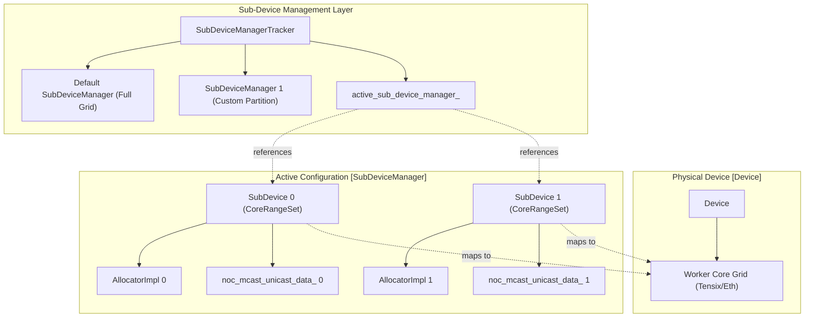
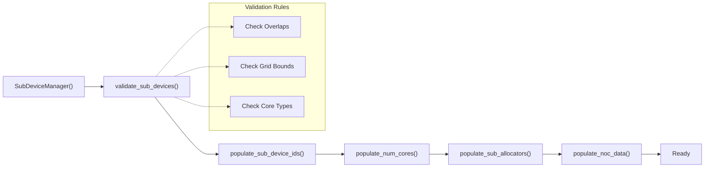
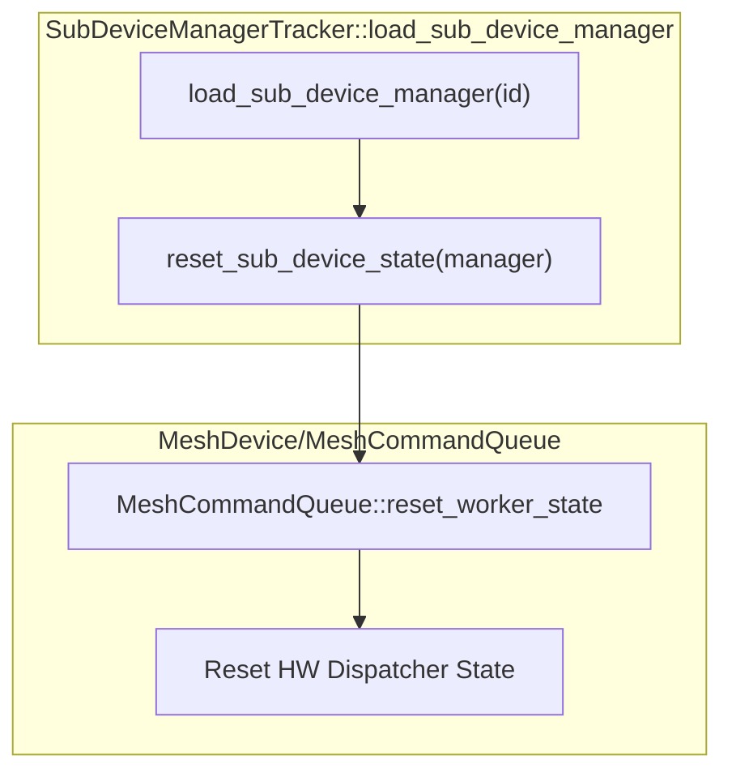

# Sub-Device Management and Core Partitioning

Relevant source files
*   [models/demos/llama3_70b_galaxy/demo/text_demo_targets.json](https://github.com/tenstorrent/tt-metal/blob/f30f8df0/models/demos/llama3_70b_galaxy/demo/text_demo_targets.json)
*   [models/demos/llama3_70b_galaxy/tests/decoder_perf_targets_4u.json](https://github.com/tenstorrent/tt-metal/blob/f30f8df0/models/demos/llama3_70b_galaxy/tests/decoder_perf_targets_4u.json)
*   [models/demos/llama3_70b_galaxy/tests/decoder_perf_targets_6u.json](https://github.com/tenstorrent/tt-metal/blob/f30f8df0/models/demos/llama3_70b_galaxy/tests/decoder_perf_targets_6u.json)
*   [models/demos/llama3_70b_galaxy/tests/test_decoder_device_perf.py](https://github.com/tenstorrent/tt-metal/blob/f30f8df0/models/demos/llama3_70b_galaxy/tests/test_decoder_device_perf.py)
*   [models/demos/llama3_70b_galaxy/tests/tg_perf_unit_tests/test_ccl_async_perf_TG_llama.py](https://github.com/tenstorrent/tt-metal/blob/f30f8df0/models/demos/llama3_70b_galaxy/tests/tg_perf_unit_tests/test_ccl_async_perf_TG_llama.py)
*   [models/demos/llama3_70b_galaxy/tests/tg_perf_unit_tests/test_llama_ops_perf_TG_llama.py](https://github.com/tenstorrent/tt-metal/blob/f30f8df0/models/demos/llama3_70b_galaxy/tests/tg_perf_unit_tests/test_llama_ops_perf_TG_llama.py)
*   [tests/tt_eager/python_api_testing/unit_testing/misc/test_eltwise_binary.py](https://github.com/tenstorrent/tt-metal/blob/f30f8df0/tests/tt_eager/python_api_testing/unit_testing/misc/test_eltwise_binary.py)
*   [tests/tt_eager/python_api_testing/unit_testing/misc/test_subtract_corerangeset_from_another.py](https://github.com/tenstorrent/tt-metal/blob/f30f8df0/tests/tt_eager/python_api_testing/unit_testing/misc/test_subtract_corerangeset_from_another.py)
*   [tests/tt_metal/distributed/multiprocess/test_sanity.cpp](https://github.com/tenstorrent/tt-metal/blob/f30f8df0/tests/tt_metal/distributed/multiprocess/test_sanity.cpp)
*   [tests/tt_metal/distributed/test_mesh_coord.cpp](https://github.com/tenstorrent/tt-metal/blob/f30f8df0/tests/tt_metal/distributed/test_mesh_coord.cpp)
*   [tests/tt_metal/distributed/test_mesh_device.cpp](https://github.com/tenstorrent/tt-metal/blob/f30f8df0/tests/tt_metal/distributed/test_mesh_device.cpp)
*   [tests/tt_metal/distributed/test_mesh_device_reshape.cpp](https://github.com/tenstorrent/tt-metal/blob/f30f8df0/tests/tt_metal/distributed/test_mesh_device_reshape.cpp)
*   [tests/tt_metal/distributed/test_mesh_device_view.cpp](https://github.com/tenstorrent/tt-metal/blob/f30f8df0/tests/tt_metal/distributed/test_mesh_device_view.cpp)
*   [tests/tt_metal/multihost/fabric_tests/mesh_socket_test_context.cpp](https://github.com/tenstorrent/tt-metal/blob/f30f8df0/tests/tt_metal/multihost/fabric_tests/mesh_socket_test_context.cpp)
*   [tests/tt_metal/tt_metal/common/multi_device_fixture.hpp](https://github.com/tenstorrent/tt-metal/blob/f30f8df0/tests/tt_metal/tt_metal/common/multi_device_fixture.hpp)
*   [tests/ttnn/unit_tests/gtests/multiprocess/test_host_all_gather.cpp](https://github.com/tenstorrent/tt-metal/blob/f30f8df0/tests/ttnn/unit_tests/gtests/multiprocess/test_host_all_gather.cpp)
*   [tests/ttnn/unit_tests/gtests/tensor/test_unit_mesh_utils.cpp](https://github.com/tenstorrent/tt-metal/blob/f30f8df0/tests/ttnn/unit_tests/gtests/tensor/test_unit_mesh_utils.cpp)
*   [tests/ttnn/unit_tests/operations/eltwise/test_add.py](https://github.com/tenstorrent/tt-metal/blob/f30f8df0/tests/ttnn/unit_tests/operations/eltwise/test_add.py)
*   [tests/ttnn/unit_tests/operations/eltwise/test_binary_bcast_tcast.py](https://github.com/tenstorrent/tt-metal/blob/f30f8df0/tests/ttnn/unit_tests/operations/eltwise/test_binary_bcast_tcast.py)
*   [tests/ttnn/unit_tests/operations/eltwise/test_binary_ng_typecast.py](https://github.com/tenstorrent/tt-metal/blob/f30f8df0/tests/ttnn/unit_tests/operations/eltwise/test_binary_ng_typecast.py)
*   [tests/ttnn/unit_tests/operations/eltwise/test_binary_scalar.py](https://github.com/tenstorrent/tt-metal/blob/f30f8df0/tests/ttnn/unit_tests/operations/eltwise/test_binary_scalar.py)
*   [tests/ttnn/unit_tests/operations/eltwise/test_binaryng_ND.py](https://github.com/tenstorrent/tt-metal/blob/f30f8df0/tests/ttnn/unit_tests/operations/eltwise/test_binaryng_ND.py)
*   [tests/ttnn/unit_tests/operations/eltwise/test_binaryng_fp32.py](https://github.com/tenstorrent/tt-metal/blob/f30f8df0/tests/ttnn/unit_tests/operations/eltwise/test_binaryng_fp32.py)
*   [tests/ttnn/unit_tests/operations/eltwise/test_divide.py](https://github.com/tenstorrent/tt-metal/blob/f30f8df0/tests/ttnn/unit_tests/operations/eltwise/test_divide.py)
*   [tests/ttnn/unit_tests/operations/eltwise/test_elt_binary.py](https://github.com/tenstorrent/tt-metal/blob/f30f8df0/tests/ttnn/unit_tests/operations/eltwise/test_elt_binary.py)
*   [tests/ttnn/unit_tests/operations/eltwise/test_mul.py](https://github.com/tenstorrent/tt-metal/blob/f30f8df0/tests/ttnn/unit_tests/operations/eltwise/test_mul.py)
*   [tt-train/sources/ttml/metal/optimizers/sgd/device/sgd_program_factory.cpp](https://github.com/tenstorrent/tt-metal/blob/f30f8df0/tt-train/sources/ttml/metal/optimizers/sgd/device/sgd_program_factory.cpp)
*   [tt-train/tests/ops/newton_schulz_op_test.cpp](https://github.com/tenstorrent/tt-metal/blob/f30f8df0/tt-train/tests/ops/newton_schulz_op_test.cpp)
*   [tt_metal/api/tt-metalium/core_coord.hpp](https://github.com/tenstorrent/tt-metal/blob/f30f8df0/tt_metal/api/tt-metalium/core_coord.hpp)
*   [tt_metal/api/tt-metalium/device.hpp](https://github.com/tenstorrent/tt-metal/blob/f30f8df0/tt_metal/api/tt-metalium/device.hpp)
*   [tt_metal/api/tt-metalium/mesh_coord.hpp](https://github.com/tenstorrent/tt-metal/blob/f30f8df0/tt_metal/api/tt-metalium/mesh_coord.hpp)
*   [tt_metal/api/tt-metalium/mesh_device.hpp](https://github.com/tenstorrent/tt-metal/blob/f30f8df0/tt_metal/api/tt-metalium/mesh_device.hpp)
*   [tt_metal/api/tt-metalium/mesh_device_view.hpp](https://github.com/tenstorrent/tt-metal/blob/f30f8df0/tt_metal/api/tt-metalium/mesh_device_view.hpp)
*   [tt_metal/api/tt-metalium/system_mesh.hpp](https://github.com/tenstorrent/tt-metal/blob/f30f8df0/tt_metal/api/tt-metalium/system_mesh.hpp)
*   [tt_metal/common/core_coord.cpp](https://github.com/tenstorrent/tt-metal/blob/f30f8df0/tt_metal/common/core_coord.cpp)
*   [tt_metal/common/core_coord.hpp](https://github.com/tenstorrent/tt-metal/blob/f30f8df0/tt_metal/common/core_coord.hpp)
*   [tt_metal/common/mesh_coord.cpp](https://github.com/tenstorrent/tt-metal/blob/f30f8df0/tt_metal/common/mesh_coord.cpp)
*   [tt_metal/distributed/mesh_device.cpp](https://github.com/tenstorrent/tt-metal/blob/f30f8df0/tt_metal/distributed/mesh_device.cpp)
*   [tt_metal/distributed/mesh_device_view.cpp](https://github.com/tenstorrent/tt-metal/blob/f30f8df0/tt_metal/distributed/mesh_device_view.cpp)
*   [tt_metal/distributed/system_mesh.cpp](https://github.com/tenstorrent/tt-metal/blob/f30f8df0/tt_metal/distributed/system_mesh.cpp)
*   [tt_metal/impl/allocator/allocator_state.cpp](https://github.com/tenstorrent/tt-metal/blob/f30f8df0/tt_metal/impl/allocator/allocator_state.cpp)
*   [tt_metal/impl/device/device.cpp](https://github.com/tenstorrent/tt-metal/blob/f30f8df0/tt_metal/impl/device/device.cpp)
*   [tt_metal/impl/device/device_impl.hpp](https://github.com/tenstorrent/tt-metal/blob/f30f8df0/tt_metal/impl/device/device_impl.hpp)
*   [tt_metal/impl/sub_device/sub_device_manager.cpp](https://github.com/tenstorrent/tt-metal/blob/f30f8df0/tt_metal/impl/sub_device/sub_device_manager.cpp)
*   [tt_metal/impl/sub_device/sub_device_manager_tracker.cpp](https://github.com/tenstorrent/tt-metal/blob/f30f8df0/tt_metal/impl/sub_device/sub_device_manager_tracker.cpp)
*   [tt_metal/impl/sub_device/sub_device_manager_tracker.hpp](https://github.com/tenstorrent/tt-metal/blob/f30f8df0/tt_metal/impl/sub_device/sub_device_manager_tracker.hpp)
*   [ttnn/api/ttnn/tensor/unit_mesh/unit_mesh_utils.hpp](https://github.com/tenstorrent/tt-metal/blob/f30f8df0/ttnn/api/ttnn/tensor/unit_mesh/unit_mesh_utils.hpp)
*   [ttnn/core/distributed/host_ccl.cpp](https://github.com/tenstorrent/tt-metal/blob/f30f8df0/ttnn/core/distributed/host_ccl.cpp)
*   [ttnn/core/tensor/unit_mesh/unit_mesh_utils.cpp](https://github.com/tenstorrent/tt-metal/blob/f30f8df0/ttnn/core/tensor/unit_mesh/unit_mesh_utils.cpp)
*   [ttnn/cpp/ttnn/operations/experimental/adaptive_pool/adaptive_pool_utils.cpp](https://github.com/tenstorrent/tt-metal/blob/f30f8df0/ttnn/cpp/ttnn/operations/experimental/adaptive_pool/adaptive_pool_utils.cpp)
*   [ttnn/cpp/ttnn/operations/reduction/topk/device/topk_utils.hpp](https://github.com/tenstorrent/tt-metal/blob/f30f8df0/ttnn/cpp/ttnn/operations/reduction/topk/device/topk_utils.hpp)

## Purpose and Scope

This document describes the sub-device management system in TT-Metalium, which enables logical partitioning of a physical device's worker cores into multiple isolated execution contexts called sub-devices. Each sub-device operates with its own dedicated core allocation, memory allocator, and NOC (Network-on-Chip) configuration, allowing concurrent execution of independent workloads on different core partitions.

The system is primarily implemented through the `SubDeviceManager` and `SubDeviceManagerTracker` classes, providing resource isolation and workload concurrency on Tenstorrent hardware.

Sources: [tt_metal/impl/sub_device/sub_device_manager.hpp 20-60](https://github.com/tenstorrent/tt-metal/blob/f30f8df0/tt_metal/impl/sub_device/sub_device_manager.hpp#L20-L60)[tt_metal/impl/sub_device/sub_device_manager_tracker.hpp 10-40](https://github.com/tenstorrent/tt-metal/blob/f30f8df0/tt_metal/impl/sub_device/sub_device_manager_tracker.hpp#L10-L40)

## Overview

The sub-device system allows a single physical device to be partitioned into multiple logical sub-devices, each with:

*   **Dedicated worker cores**: Non-overlapping `CoreRangeSet` assignments.
*   **Isolated memory allocators**: Separate `AllocatorImpl` instances per sub-device.
*   **Independent NOC configuration**: Pre-computed multicast and unicast encodings for the specific partition.
*   **Resource isolation**: Prevents memory or execution cross-contamination between sub-devices.

This partitioning enables use cases such as running multiple independent programs concurrently on different core sets and isolating critical workloads from best-effort tasks.

Sources: [tt_metal/impl/sub_device/sub_device_manager.cpp 46-76](https://github.com/tenstorrent/tt-metal/blob/f30f8df0/tt_metal/impl/sub_device/sub_device_manager.cpp#L46-L76)[tt_metal/api/tt-metalium/sub_device_types.hpp 1-30](https://github.com/tenstorrent/tt-metal/blob/f30f8df0/tt_metal/api/tt-metalium/sub_device_types.hpp#L1-L30)

## Architecture Overview

The following diagram illustrates how the sub-device management layer bridges the physical hardware grid to isolated logical execution environments.

**Diagram: Sub-Device Management Architecture**

Sources: [tt_metal/impl/sub_device/sub_device_manager.cpp 46-76](https://github.com/tenstorrent/tt-metal/blob/f30f8df0/tt_metal/impl/sub_device/sub_device_manager.cpp#L46-L76)[tt_metal/impl/sub_device/sub_device_manager_tracker.cpp 37-53](https://github.com/tenstorrent/tt-metal/blob/f30f8df0/tt_metal/impl/sub_device/sub_device_manager_tracker.cpp#L37-L53)[tt_metal/api/tt-metalium/device.hpp 174-180](https://github.com/tenstorrent/tt-metal/blob/f30f8df0/tt_metal/api/tt-metalium/device.hpp#L174-L180)




**Diagram: Sub-Device Management Architecture**

Sources: [tt_metal/impl/sub_device/sub_device_manager.cpp:46-76](), [tt_metal/impl/sub_device/sub_device_manager_tracker.cpp:37-53](), [tt_metal/api/tt-metalium/device.hpp:174-180]()
```
## Core Concepts and Types

### SubDevice

The `SubDevice` class represents a logical partition specification, defined by a `CoreRangeSet`. Within a single `SubDeviceManager`, sub-devices must have disjoint core sets.

Sources: [tt_metal/impl/device/device.cpp 13-15](https://github.com/tenstorrent/tt-metal/blob/f30f8df0/tt_metal/impl/device/device.cpp#L13-L15)[tt_metal/api/tt-metalium/device.hpp 53](https://github.com/tenstorrent/tt-metal/blob/f30f8df0/tt_metal/api/tt-metalium/device.hpp#L53-L53)

### SubDeviceId

A strongly-typed identifier for referencing a specific sub-device. The valid range is typically `0` to `DISPATCH_MESSAGE_ENTRIES - 1`.

`using SubDeviceId = strong_type<uint8_t, struct SubDeviceIdTag>;`
Sources: [tt_metal/api/tt-metalium/sub_device_types.hpp 20-25](https://github.com/tenstorrent/tt-metal/blob/f30f8df0/tt_metal/api/tt-metalium/sub_device_types.hpp#L20-L25)[tt_metal/impl/sub_device/sub_device_manager.cpp 43-45](https://github.com/tenstorrent/tt-metal/blob/f30f8df0/tt_metal/impl/sub_device/sub_device_manager.cpp#L43-L45)

### SubDeviceManager and SubDeviceManagerId

The `SubDeviceManager` encapsulates a complete partitioning configuration. It holds the vector of `SubDevice` objects, their corresponding `AllocatorImpl` instances, and pre-computed NOC data.

Sources: [tt_metal/impl/sub_device/sub_device_manager.hpp 20-60](https://github.com/tenstorrent/tt-metal/blob/f30f8df0/tt_metal/impl/sub_device/sub_device_manager.hpp#L20-L60)[tt_metal/impl/sub_device/sub_device_manager.cpp 46-89](https://github.com/tenstorrent/tt-metal/blob/f30f8df0/tt_metal/impl/sub_device/sub_device_manager.cpp#L46-L89)

## SubDeviceManager Implementation

### Construction and Validation Pipeline

When a `SubDeviceManager` is created, it follows a strict initialization pipeline to ensure hardware safety and resource isolation.

**Diagram: SubDeviceManager Initialization Pipeline**

Sources: [tt_metal/impl/sub_device/sub_device_manager.cpp 49-61](https://github.com/tenstorrent/tt-metal/blob/f30f8df0/tt_metal/impl/sub_device/sub_device_manager.cpp#L49-L61)[tt_metal/impl/sub_device/sub_device_manager.cpp 88-165](https://github.com/tenstorrent/tt-metal/blob/f30f8df0/tt_metal/impl/sub_device/sub_device_manager.cpp#L88-L165)



**Diagram: SubDeviceManager Initialization Pipeline**

Sources: [tt_metal/impl/sub_device/sub_device_manager.cpp:49-61](), [tt_metal/impl/sub_device/sub_device_manager.cpp:88-165]()
```
### Per-SubDevice Allocator Creation

Each sub-device receives its own isolated `AllocatorImpl`. The manager computes a specific `local_l1_size_` for each sub-device. The `AllocatorImpl` instances are stored in `sub_device_allocators_` and are used to manage memory specific to that core partition.

Sources: [tt_metal/impl/sub_device/sub_device_manager.cpp 49-61](https://github.com/tenstorrent/tt-metal/blob/f30f8df0/tt_metal/impl/sub_device/sub_device_manager.cpp#L49-L61)[tt_metal/impl/sub_device/sub_device_manager.cpp 125-134](https://github.com/tenstorrent/tt-metal/blob/f30f8df0/tt_metal/impl/sub_device/sub_device_manager.cpp#L125-L134)

### NOC Data Pre-computation

The manager pre-computes NOC multicast and unicast encodings. This includes:

*   `noc_mcast_unicast_data_`: A `vector_aligned` container storing the pre-computed NOC encodings [tt_metal/impl/sub_device/sub_device_manager.cpp 104](https://github.com/tenstorrent/tt-metal/blob/f30f8df0/tt_metal/impl/sub_device/sub_device_manager.cpp#L104-L104)
*   `has_noc_mcast_txns()`: Checks if a sub-device has multicast transactions configured [tt_metal/impl/sub_device/sub_device_manager.cpp 106-109](https://github.com/tenstorrent/tt-metal/blob/f30f8df0/tt_metal/impl/sub_device/sub_device_manager.cpp#L106-L109)
*   `num_noc_unicast_txns()`: Returns the number of unicast transactions for a sub-device [tt_metal/impl/sub_device/sub_device_manager.cpp 111-114](https://github.com/tenstorrent/tt-metal/blob/f30f8df0/tt_metal/impl/sub_device/sub_device_manager.cpp#L111-L114)
*   `noc_unicast_data_start_index()`: Returns the starting index for unicast data within the pre-computed array [tt_metal/impl/sub_device/sub_device_manager.cpp 116-119](https://github.com/tenstorrent/tt-metal/blob/f30f8df0/tt_metal/impl/sub_device/sub_device_manager.cpp#L116-L119)

Sources: [tt_metal/impl/sub_device/sub_device_manager.cpp 104-123](https://github.com/tenstorrent/tt-metal/blob/f30f8df0/tt_metal/impl/sub_device/sub_device_manager.cpp#L104-L123)

## SubDeviceManagerTracker

The `SubDeviceManagerTracker` manages the lifecycle of multiple manager instances. It tracks the `active_sub_device_manager_` and provides a `default_sub_device_manager_` that encompasses the full device grid.

### Key Operations

*   `create_sub_device_manager()`: Instantiates a new manager and stores it in `sub_device_managers_` map [tt_metal/impl/sub_device/sub_device_manager_tracker.cpp 55-62](https://github.com/tenstorrent/tt-metal/blob/f30f8df0/tt_metal/impl/sub_device/sub_device_manager_tracker.cpp#L55-L62)
*   `load_sub_device_manager()`: Activates a manager. This triggers a state reset on the device, updating NOC data and worker semaphores on the dispatch cores [tt_metal/impl/sub_device/sub_device_manager_tracker.cpp 84-105](https://github.com/tenstorrent/tt-metal/blob/f30f8df0/tt_metal/impl/sub_device/sub_device_manager_tracker.cpp#L84-L105)
*   `clear_loaded_sub_device_manager()`: Reverts the device to the default (full grid) configuration [tt_metal/impl/sub_device/sub_device_manager_tracker.cpp 107-109](https://github.com/tenstorrent/tt-metal/blob/f30f8df0/tt_metal/impl/sub_device/sub_device_manager_tracker.cpp#L107-L109)

Sources: [tt_metal/impl/sub_device/sub_device_manager_tracker.cpp 38-139](https://github.com/tenstorrent/tt-metal/blob/f30f8df0/tt_metal/impl/sub_device/sub_device_manager_tracker.cpp#L38-L139)

## Integration with Programs and Dispatch

### Sub-Device State Reset

When a sub-device manager is loaded, the `reset_sub_device_state` function is called. This interacts with the command queue to reset worker state, passing the pre-computed NOC data and core mapping to the hardware dispatchers.

**Diagram: Sub-Device Loading and Reset Flow**

Sources: [tt_metal/impl/sub_device/sub_device_manager_tracker.cpp 64-105](https://github.com/tenstorrent/tt-metal/blob/f30f8df0/tt_metal/impl/sub_device/sub_device_manager_tracker.cpp#L64-L105)



**Diagram: Sub-Device Loading and Reset Flow**

Sources: [tt_metal/impl/sub_device/sub_device_manager_tracker.cpp:64-105]()
```
### Workload Dispatch (MeshDevice Integration)

The `MeshDevice` aggregates sub-device management across multiple chips. It provides APIs to query worker cores and allocators per sub-device, ensuring sharded workloads respect the logical partitioning.

Sources: [tt_metal/api/tt-metalium/mesh_device.hpp 131-138](https://github.com/tenstorrent/tt-metal/blob/f30f8df0/tt_metal/api/tt-metalium/mesh_device.hpp#L131-L138)[tt_metal/distributed/mesh_device.cpp 54-60](https://github.com/tenstorrent/tt-metal/blob/f30f8df0/tt_metal/distributed/mesh_device.cpp#L54-L60)

## Device and MeshDevice Support

The sub-device management system is integrated across both single-device and multi-device abstractions:

*   **IDevice Interface**: Defines the contract for sub-device management, including `create_sub_device_manager`, `load_sub_device_manager`, and `get_active_sub_device_manager_id`[tt_metal/api/tt-metalium/device.hpp 174-180](https://github.com/tenstorrent/tt-metal/blob/f30f8df0/tt_metal/api/tt-metalium/device.hpp#L174-L180)
*   **Device (Single Chip)**: Implements physical core partitioning. It tracks `ethernet_cores_` and `worker_cores` and provides access to sub-device specific allocators [tt_metal/impl/device/device.cpp 113-115](https://github.com/tenstorrent/tt-metal/blob/f30f8df0/tt_metal/impl/device/device.cpp#L113-L115)[tt_metal/impl/device/device_impl.hpp 113-114](https://github.com/tenstorrent/tt-metal/blob/f30f8df0/tt_metal/impl/device/device_impl.hpp#L113-L114)
*   **MeshDevice (Distributed)**: Aggregates sub-device management across multiple chips. It uses a `SubDeviceManagerTracker` to manage partitions across the entire mesh [tt_metal/distributed/mesh_device.cpp 59-60](https://github.com/tenstorrent/tt-metal/blob/f30f8df0/tt_metal/distributed/mesh_device.cpp#L59-L60)

Sources: [tt_metal/api/tt-metalium/device.hpp 174-180](https://github.com/tenstorrent/tt-metal/blob/f30f8df0/tt_metal/api/tt-metalium/device.hpp#L174-L180)[tt_metal/impl/device/device.cpp 113-115](https://github.com/tenstorrent/tt-metal/blob/f30f8df0/tt_metal/impl/device/device.cpp#L113-L115)[tt_metal/distributed/mesh_device.cpp 59-60](https://github.com/tenstorrent/tt-metal/blob/f30f8df0/tt_metal/distributed/mesh_device.cpp#L59-L60)[tt_metal/api/tt-metalium/mesh_device.hpp 131-138](https://github.com/tenstorrent/tt-metal/blob/f30f8df0/tt_metal/api/tt-metalium/mesh_device.hpp#L131-L138)

## Memory Layout and Constraints

### L1 Memory Partitioning

The `local_l1_size` parameter reserves space at the top of L1. The `SubDeviceManager` aligns this size based on the Hardware Abstraction Layer (HAL) requirements for L1 memory.

Sources: [tt_metal/impl/sub_device/sub_device_manager.cpp 54-55](https://github.com/tenstorrent/tt-metal/blob/f30f8df0/tt_metal/impl/sub_device/sub_device_manager.cpp#L54-L55)

### Constraints

*   **Fast Dispatch Only**: Sub-device managers are only supported when using fast dispatch mode [tt_metal/impl/sub_device/sub_device_manager_tracker.cpp 84-87](https://github.com/tenstorrent/tt-metal/blob/f30f8df0/tt_metal/impl/sub_device/sub_device_manager_tracker.cpp#L84-L87)
*   **Allocation Isolation**: Sub-device managers cannot be switched if the active sub-device still has local allocations [tt_metal/impl/sub_device/sub_device_manager_tracker.cpp 91-95](https://github.com/tenstorrent/tt-metal/blob/f30f8df0/tt_metal/impl/sub_device/sub_device_manager_tracker.cpp#L91-L95)
*   **Max Sub-Devices**: Limited by hardware messaging entries, typically defined by `DispatchSettings::DISPATCH_MESSAGE_ENTRIES`[tt_metal/impl/sub_device/sub_device_manager.cpp 43-45](https://github.com/tenstorrent/tt-metal/blob/f30f8df0/tt_metal/impl/sub_device/sub_device_manager.cpp#L43-L45)

Sources: [tt_metal/impl/sub_device/sub_device_manager.cpp 43-45](https://github.com/tenstorrent/tt-metal/blob/f30f8df0/tt_metal/impl/sub_device/sub_device_manager.cpp#L43-L45)[tt_metal/impl/sub_device/sub_device_manager_tracker.cpp 84-95](https://github.com/tenstorrent/tt-metal/blob/f30f8df0/tt_metal/impl/sub_device/sub_device_manager_tracker.cpp#L84-L95)

This wiki is featured in the [repository](https://github.com/tenstorrent/tt-metal/blob/main/README.md)

Dismiss
Refresh this wiki

Enter email to refresh
