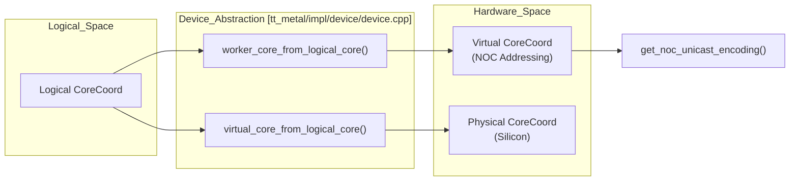
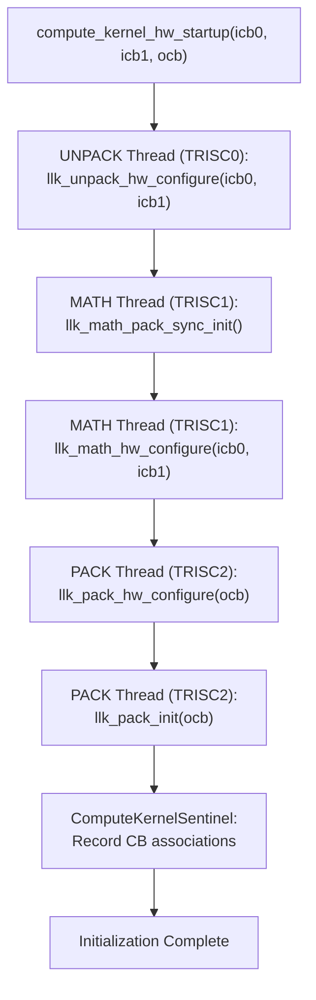
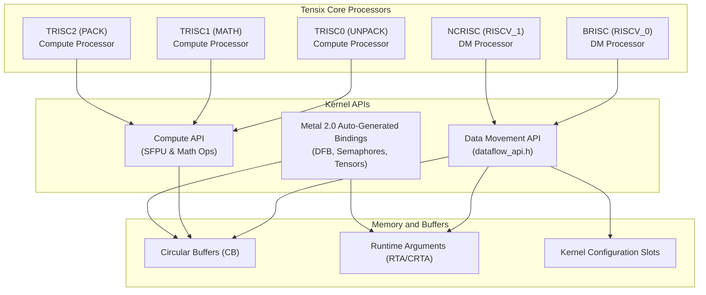

# Low-Level Kernel APIs (LLK)

Relevant source files
*   [dockerfile/Dockerfile.manylinux](https://github.com/tenstorrent/tt-metal/blob/f30f8df0/dockerfile/Dockerfile.manylinux)
*   [docs/source/tt-metalium/tt_metal/apis/kernel_apis/sfpu/llk.rst](https://github.com/tenstorrent/tt-metal/blob/f30f8df0/docs/source/tt-metalium/tt_metal/apis/kernel_apis/sfpu/llk.rst)
*   [models/demos/deepseek_v3_b1/micro_ops/sdpa/kernels/sdpa_compute.cpp](https://github.com/tenstorrent/tt-metal/blob/f30f8df0/models/demos/deepseek_v3_b1/micro_ops/sdpa/kernels/sdpa_compute.cpp)
*   [tests/tt_metal/tt_fabric/test_bandwidth_telemetry_validation.cpp](https://github.com/tenstorrent/tt-metal/blob/f30f8df0/tests/tt_metal/tt_fabric/test_bandwidth_telemetry_validation.cpp)
*   [tests/tt_metal/tt_metal/api/dataflow_buffer/test_dataflow_buffer.cpp](https://github.com/tenstorrent/tt-metal/blob/f30f8df0/tests/tt_metal/tt_metal/api/dataflow_buffer/test_dataflow_buffer.cpp)
*   [tests/tt_metal/tt_metal/api/dataflow_buffer/test_dataflow_buffer_configs.cpp](https://github.com/tenstorrent/tt-metal/blob/f30f8df0/tests/tt_metal/tt_metal/api/dataflow_buffer/test_dataflow_buffer_configs.cpp)
*   [tests/tt_metal/tt_metal/api/test_dram.cpp](https://github.com/tenstorrent/tt-metal/blob/f30f8df0/tests/tt_metal/tt_metal/api/test_dram.cpp)
*   [tests/tt_metal/tt_metal/test_kernels/compute/dfb_t6.cpp](https://github.com/tenstorrent/tt-metal/blob/f30f8df0/tests/tt_metal/tt_metal/test_kernels/compute/dfb_t6.cpp)
*   [tests/tt_metal/tt_metal/test_kernels/compute/dfb_t6_consumer.cpp](https://github.com/tenstorrent/tt-metal/blob/f30f8df0/tests/tt_metal/tt_metal/test_kernels/compute/dfb_t6_consumer.cpp)
*   [tests/tt_metal/tt_metal/test_kernels/compute/dfb_t6_producer.cpp](https://github.com/tenstorrent/tt-metal/blob/f30f8df0/tests/tt_metal/tt_metal/test_kernels/compute/dfb_t6_producer.cpp)
*   [tests/tt_metal/tt_metal/test_kernels/dataflow/dfb_consumer.cpp](https://github.com/tenstorrent/tt-metal/blob/f30f8df0/tests/tt_metal/tt_metal/test_kernels/dataflow/dfb_consumer.cpp)
*   [tests/tt_metal/tt_metal/test_kernels/dataflow/dfb_producer.cpp](https://github.com/tenstorrent/tt-metal/blob/f30f8df0/tests/tt_metal/tt_metal/test_kernels/dataflow/dfb_producer.cpp)
*   [tests/tt_metal/tt_metal/test_kernels/dataflow/dram_copy.cpp](https://github.com/tenstorrent/tt-metal/blob/f30f8df0/tests/tt_metal/tt_metal/test_kernels/dataflow/dram_copy.cpp)
*   [tests/tt_metal/tt_metal/test_kernels/sfpi/post.inc](https://github.com/tenstorrent/tt-metal/blob/f30f8df0/tests/tt_metal/tt_metal/test_kernels/sfpi/post.inc)
*   [tests/ttnn/unit_tests/operations/eltwise/test_exp2.py](https://github.com/tenstorrent/tt-metal/blob/f30f8df0/tests/ttnn/unit_tests/operations/eltwise/test_exp2.py)
*   [tests/ttnn/unit_tests/operations/eltwise/test_expm1.py](https://github.com/tenstorrent/tt-metal/blob/f30f8df0/tests/ttnn/unit_tests/operations/eltwise/test_expm1.py)
*   [tests/ttnn/unit_tests/operations/eltwise/test_unary_fp32.py](https://github.com/tenstorrent/tt-metal/blob/f30f8df0/tests/ttnn/unit_tests/operations/eltwise/test_unary_fp32.py)
*   [tt_metal/api/tt-metalium/experimental/fabric/fabric_telemetry.hpp](https://github.com/tenstorrent/tt-metal/blob/f30f8df0/tt_metal/api/tt-metalium/experimental/fabric/fabric_telemetry.hpp)
*   [tt_metal/fabric/fabric_telemetry_converter.hpp](https://github.com/tenstorrent/tt-metal/blob/f30f8df0/tt_metal/fabric/fabric_telemetry_converter.hpp)
*   [tt_metal/fabric/fabric_telemetry_reader.cpp](https://github.com/tenstorrent/tt-metal/blob/f30f8df0/tt_metal/fabric/fabric_telemetry_reader.cpp)
*   [tt_metal/hw/ckernels/blackhole/metal/llk_api/llk_sfpu/ckernel_sfpu_div_int32_floor.h](https://github.com/tenstorrent/tt-metal/blob/f30f8df0/tt_metal/hw/ckernels/blackhole/metal/llk_api/llk_sfpu/ckernel_sfpu_div_int32_floor.h)
*   [tt_metal/hw/ckernels/blackhole/metal/llk_api/llk_sfpu/ckernel_sfpu_exp.h](https://github.com/tenstorrent/tt-metal/blob/f30f8df0/tt_metal/hw/ckernels/blackhole/metal/llk_api/llk_sfpu/ckernel_sfpu_exp.h)
*   [tt_metal/hw/ckernels/blackhole/metal/llk_api/llk_sfpu/ckernel_sfpu_exp2.h](https://github.com/tenstorrent/tt-metal/blob/f30f8df0/tt_metal/hw/ckernels/blackhole/metal/llk_api/llk_sfpu/ckernel_sfpu_exp2.h)
*   [tt_metal/hw/ckernels/blackhole/metal/llk_api/llk_sfpu/ckernel_sfpu_expm1.h](https://github.com/tenstorrent/tt-metal/blob/f30f8df0/tt_metal/hw/ckernels/blackhole/metal/llk_api/llk_sfpu/ckernel_sfpu_expm1.h)
*   [tt_metal/hw/ckernels/blackhole/metal/llk_api/llk_sfpu/ckernel_sfpu_sqrt_custom.h](https://github.com/tenstorrent/tt-metal/blob/f30f8df0/tt_metal/hw/ckernels/blackhole/metal/llk_api/llk_sfpu/ckernel_sfpu_sqrt_custom.h)
*   [tt_metal/hw/ckernels/blackhole/metal/llk_api/llk_sfpu/ckernel_sfpu_trigonometry.h](https://github.com/tenstorrent/tt-metal/blob/f30f8df0/tt_metal/hw/ckernels/blackhole/metal/llk_api/llk_sfpu/ckernel_sfpu_trigonometry.h)
*   [tt_metal/hw/ckernels/blackhole/metal/llk_api/llk_sfpu/llk_math_eltwise_unary_sfpu_macros.h](https://github.com/tenstorrent/tt-metal/blob/f30f8df0/tt_metal/hw/ckernels/blackhole/metal/llk_api/llk_sfpu/llk_math_eltwise_unary_sfpu_macros.h)
*   [tt_metal/hw/ckernels/quasar/metal/llk_api/llk_sfpu/llk_math_eltwise_unary_sfpu_macros.h](https://github.com/tenstorrent/tt-metal/blob/f30f8df0/tt_metal/hw/ckernels/quasar/metal/llk_api/llk_sfpu/llk_math_eltwise_unary_sfpu_macros.h)
*   [tt_metal/hw/ckernels/quasar/metal/llk_api/llk_unpack_AB_matmul_api.h](https://github.com/tenstorrent/tt-metal/blob/f30f8df0/tt_metal/hw/ckernels/quasar/metal/llk_api/llk_unpack_AB_matmul_api.h)
*   [tt_metal/hw/ckernels/quasar/metal/llk_io/llk_io_pack.h](https://github.com/tenstorrent/tt-metal/blob/f30f8df0/tt_metal/hw/ckernels/quasar/metal/llk_io/llk_io_pack.h)
*   [tt_metal/hw/ckernels/quasar/metal/llk_io/llk_io_unpack.h](https://github.com/tenstorrent/tt-metal/blob/f30f8df0/tt_metal/hw/ckernels/quasar/metal/llk_io/llk_io_unpack.h)
*   [tt_metal/hw/ckernels/wormhole_b0/metal/llk_api/llk_sfpu/ckernel_sfpu_exp.h](https://github.com/tenstorrent/tt-metal/blob/f30f8df0/tt_metal/hw/ckernels/wormhole_b0/metal/llk_api/llk_sfpu/ckernel_sfpu_exp.h)
*   [tt_metal/hw/ckernels/wormhole_b0/metal/llk_api/llk_sfpu/ckernel_sfpu_exp2.h](https://github.com/tenstorrent/tt-metal/blob/f30f8df0/tt_metal/hw/ckernels/wormhole_b0/metal/llk_api/llk_sfpu/ckernel_sfpu_exp2.h)
*   [tt_metal/hw/ckernels/wormhole_b0/metal/llk_api/llk_sfpu/ckernel_sfpu_expm1.h](https://github.com/tenstorrent/tt-metal/blob/f30f8df0/tt_metal/hw/ckernels/wormhole_b0/metal/llk_api/llk_sfpu/ckernel_sfpu_expm1.h)
*   [tt_metal/hw/ckernels/wormhole_b0/metal/llk_api/llk_sfpu/ckernel_sfpu_sqrt_custom.h](https://github.com/tenstorrent/tt-metal/blob/f30f8df0/tt_metal/hw/ckernels/wormhole_b0/metal/llk_api/llk_sfpu/ckernel_sfpu_sqrt_custom.h)
*   [tt_metal/hw/ckernels/wormhole_b0/metal/llk_api/llk_sfpu/ckernel_sfpu_trigonometry.h](https://github.com/tenstorrent/tt-metal/blob/f30f8df0/tt_metal/hw/ckernels/wormhole_b0/metal/llk_api/llk_sfpu/ckernel_sfpu_trigonometry.h)
*   [tt_metal/hw/ckernels/wormhole_b0/metal/llk_api/llk_sfpu/llk_math_eltwise_unary_sfpu_macros.h](https://github.com/tenstorrent/tt-metal/blob/f30f8df0/tt_metal/hw/ckernels/wormhole_b0/metal/llk_api/llk_sfpu/llk_math_eltwise_unary_sfpu_macros.h)
*   [tt_metal/hw/firmware/src/tt-1xx/drisc.cc](https://github.com/tenstorrent/tt-metal/blob/f30f8df0/tt_metal/hw/firmware/src/tt-1xx/drisc.cc)
*   [tt_metal/hw/firmware/src/tt-2xx/dm.cc](https://github.com/tenstorrent/tt-metal/blob/f30f8df0/tt_metal/hw/firmware/src/tt-2xx/dm.cc)
*   [tt_metal/hw/firmware/src/tt-2xx/dmk.cc](https://github.com/tenstorrent/tt-metal/blob/f30f8df0/tt_metal/hw/firmware/src/tt-2xx/dmk.cc)
*   [tt_metal/hw/firmware/src/tt-2xx/trisc.cc](https://github.com/tenstorrent/tt-metal/blob/f30f8df0/tt_metal/hw/firmware/src/tt-2xx/trisc.cc)
*   [tt_metal/hw/inc/api/compute/common_globals.h](https://github.com/tenstorrent/tt-metal/blob/f30f8df0/tt_metal/hw/inc/api/compute/common_globals.h)
*   [tt_metal/hw/inc/api/compute/compute_kernel_api.h](https://github.com/tenstorrent/tt-metal/blob/f30f8df0/tt_metal/hw/inc/api/compute/compute_kernel_api.h)
*   [tt_metal/hw/inc/api/compute/eltwise_unary/exp.h](https://github.com/tenstorrent/tt-metal/blob/f30f8df0/tt_metal/hw/inc/api/compute/eltwise_unary/exp.h)
*   [tt_metal/hw/inc/api/compute/eltwise_unary/trigonometry.h](https://github.com/tenstorrent/tt-metal/blob/f30f8df0/tt_metal/hw/inc/api/compute/eltwise_unary/trigonometry.h)
*   [tt_metal/hw/inc/api/dataflow/dataflow_api.h](https://github.com/tenstorrent/tt-metal/blob/f30f8df0/tt_metal/hw/inc/api/dataflow/dataflow_api.h)
*   [tt_metal/hw/inc/api/dataflow/dataflow_buffer.h](https://github.com/tenstorrent/tt-metal/blob/f30f8df0/tt_metal/hw/inc/api/dataflow/dataflow_buffer.h)
*   [tt_metal/hw/inc/hostdev/dev_msgs.h](https://github.com/tenstorrent/tt-metal/blob/f30f8df0/tt_metal/hw/inc/hostdev/dev_msgs.h)
*   [tt_metal/hw/inc/hostdev/fabric_telemetry_msgs.h](https://github.com/tenstorrent/tt-metal/blob/f30f8df0/tt_metal/hw/inc/hostdev/fabric_telemetry_msgs.h)
*   [tt_metal/hw/inc/internal/dataflow/dataflow_cmd_bufs.h](https://github.com/tenstorrent/tt-metal/blob/f30f8df0/tt_metal/hw/inc/internal/dataflow/dataflow_cmd_bufs.h)
*   [tt_metal/hw/inc/internal/tt-1xx/blackhole/c_tensix_core.h](https://github.com/tenstorrent/tt-metal/blob/f30f8df0/tt_metal/hw/inc/internal/tt-1xx/blackhole/c_tensix_core.h)
*   [tt_metal/hw/inc/internal/tt-1xx/blackhole/core_config.h](https://github.com/tenstorrent/tt-metal/blob/f30f8df0/tt_metal/hw/inc/internal/tt-1xx/blackhole/core_config.h)
*   [tt_metal/hw/inc/internal/tt-1xx/blackhole/dev_mem_map.h](https://github.com/tenstorrent/tt-metal/blob/f30f8df0/tt_metal/hw/inc/internal/tt-1xx/blackhole/dev_mem_map.h)
*   [tt_metal/hw/inc/internal/tt-1xx/blackhole/noc_nonblocking_api.h](https://github.com/tenstorrent/tt-metal/blob/f30f8df0/tt_metal/hw/inc/internal/tt-1xx/blackhole/noc_nonblocking_api.h)
*   [tt_metal/hw/inc/internal/tt-1xx/wormhole/c_tensix_core.h](https://github.com/tenstorrent/tt-metal/blob/f30f8df0/tt_metal/hw/inc/internal/tt-1xx/wormhole/c_tensix_core.h)
*   [tt_metal/hw/inc/internal/tt-1xx/wormhole/core_config.h](https://github.com/tenstorrent/tt-metal/blob/f30f8df0/tt_metal/hw/inc/internal/tt-1xx/wormhole/core_config.h)
*   [tt_metal/hw/inc/internal/tt-1xx/wormhole/dev_mem_map.h](https://github.com/tenstorrent/tt-metal/blob/f30f8df0/tt_metal/hw/inc/internal/tt-1xx/wormhole/dev_mem_map.h)
*   [tt_metal/hw/inc/internal/tt-1xx/wormhole/noc_nonblocking_api.h](https://github.com/tenstorrent/tt-metal/blob/f30f8df0/tt_metal/hw/inc/internal/tt-1xx/wormhole/noc_nonblocking_api.h)
*   [tt_metal/hw/inc/internal/tt-2xx/dataflow_buffer.inl](https://github.com/tenstorrent/tt-metal/blob/f30f8df0/tt_metal/hw/inc/internal/tt-2xx/dataflow_buffer.inl)
*   [tt_metal/hw/inc/internal/tt-2xx/dataflow_buffer/dataflow_buffer_config.h](https://github.com/tenstorrent/tt-metal/blob/f30f8df0/tt_metal/hw/inc/internal/tt-2xx/dataflow_buffer/dataflow_buffer_config.h)
*   [tt_metal/hw/inc/internal/tt-2xx/dataflow_buffer/dataflow_buffer_init.h](https://github.com/tenstorrent/tt-metal/blob/f30f8df0/tt_metal/hw/inc/internal/tt-2xx/dataflow_buffer/dataflow_buffer_init.h)
*   [tt_metal/hw/inc/internal/tt-2xx/dataflow_buffer/dataflow_buffer_interface.h](https://github.com/tenstorrent/tt-metal/blob/f30f8df0/tt_metal/hw/inc/internal/tt-2xx/dataflow_buffer/dataflow_buffer_interface.h)
*   [tt_metal/hw/inc/internal/tt-2xx/quasar/core_config.h](https://github.com/tenstorrent/tt-metal/blob/f30f8df0/tt_metal/hw/inc/internal/tt-2xx/quasar/core_config.h)
*   [tt_metal/hw/inc/internal/tt-2xx/quasar/dev_mem_map.h](https://github.com/tenstorrent/tt-metal/blob/f30f8df0/tt_metal/hw/inc/internal/tt-2xx/quasar/dev_mem_map.h)
*   [tt_metal/hw/inc/internal/tt-2xx/quasar/noc_nonblocking_api.h](https://github.com/tenstorrent/tt-metal/blob/f30f8df0/tt_metal/hw/inc/internal/tt-2xx/quasar/noc_nonblocking_api.h)
*   [tt_metal/hw/inc/internal/tt-2xx/quasar/noc_nonblocking_api_v1.h](https://github.com/tenstorrent/tt-metal/blob/f30f8df0/tt_metal/hw/inc/internal/tt-2xx/quasar/noc_nonblocking_api_v1.h)
*   [tt_metal/hw/inc/internal/tt-2xx/quasar/noc_nonblocking_api_v2.h](https://github.com/tenstorrent/tt-metal/blob/f30f8df0/tt_metal/hw/inc/internal/tt-2xx/quasar/noc_nonblocking_api_v2.h)
*   [tt_metal/hw/inc/internal/tt-2xx/quasar/stream_interface.h](https://github.com/tenstorrent/tt-metal/blob/f30f8df0/tt_metal/hw/inc/internal/tt-2xx/quasar/stream_interface.h)
*   [tt_metal/impl/dataflow_buffer/dataflow_buffer.cpp](https://github.com/tenstorrent/tt-metal/blob/f30f8df0/tt_metal/impl/dataflow_buffer/dataflow_buffer.cpp)
*   [tt_metal/impl/dataflow_buffer/dataflow_buffer_impl.hpp](https://github.com/tenstorrent/tt-metal/blob/f30f8df0/tt_metal/impl/dataflow_buffer/dataflow_buffer_impl.hpp)
*   [tt_metal/llrt/hal/codegen/codegen.py](https://github.com/tenstorrent/tt-metal/blob/f30f8df0/tt_metal/llrt/hal/codegen/codegen.py)
*   [tt_metal/llrt/hal/tt-1xx/blackhole/bh_hal_dram.cpp](https://github.com/tenstorrent/tt-metal/blob/f30f8df0/tt_metal/llrt/hal/tt-1xx/blackhole/bh_hal_dram.cpp)
*   [tt_metal/sfpi-info.sh](https://github.com/tenstorrent/tt-metal/blob/f30f8df0/tt_metal/sfpi-info.sh)
*   [tt_metal/sfpi-version](https://github.com/tenstorrent/tt-metal/blob/f30f8df0/tt_metal/sfpi-version)
*   [tt_metal/tt-llk/tests/helpers/include/sfpu_operations.h](https://github.com/tenstorrent/tt-metal/blob/f30f8df0/tt_metal/tt-llk/tests/helpers/include/sfpu_operations.h)

## Purpose and Scope

The Low-Level Kernel APIs (LLK) provide hardware-agnostic primitives for writing compute kernels that execute on Tenstorrent Tensix or Blackhole cores. These APIs abstract the underlying hardware details and expose a three-phase programming model: **Unpack** (read data from Circular Buffers to registers), **Compute/Math** (perform operations on registers), and **Pack** (write results from registers back to Circular Buffers). LLK sits between the high-level operation implementations and the hardware abstraction layer (HAL).

This is a **PARENT** page providing a high-level overview. For deep technical details, refer to the child pages:

 — Architecture, SFPU operations, and compute kernel relationships.
 — Hardware configuration and CB setup.
 — Tile unpacking and data format handling.
 — Tile packing and output data format configuration.
 — SFPU math, matmul, and compute primitives.
 — Mid-kernel precision and layout transformations.

* * *

## LLK Architecture Overview

```mermaid
graph TB
    subgraph "CB_Space[Circular Buffer (L1 Memory)]"
        "CB0[CB Index 0<br/>(Input A)]"
        "CB1[CB Index 1<br/>(Input B)]"
        "CB16[CB Index 16<br/>(Output)]"
    end
    
    subgraph "LLK_Pipeline[Tensix/Blackhole Pipeline]"
        direction TB
        
        subgraph "Unpack_Proc[UNPACK Processor (TRISC0)]"
            "UnpackOp[llk_unpack_A<br/>llk_unpack_AB]"
        end
        
        subgraph "Registers[Internal Registers]"
            "SrcA[SrcA Register]"
            "SrcB[SrcB Register]"
        end
        
        subgraph "Math_Proc[MATH Processor (TRISC1)]"
            "MathOp[llk_math_eltwise_binary<br/>llk_math_matmul]"
        end
        
        subgraph "Dest_Reg[Accumulator]"
            "Dest[DEST[0..15]]"
        end
        
        subgraph "Pack_Proc[PACK Processor (TRISC2)]"
            "PackOp[llk_pack<br/>llk_pack_untilize]"
        end
        
        "UnpackOp" --> "SrcA"
        "UnpackOp" --> "SrcB"
        "SrcA" --> "MathOp"
        "SrcB" --> "MathOp"
        "MathOp" --> "Dest"
        "Dest" --> "PackOp"
    end
    
    "CB0" --> "UnpackOp"
    "CB1" --> "UnpackOp"
    "PackOp" --> "CB16"
```


The LLK system operates on a decoupled pipeline where three distinct hardware processors (Unpack, Math, Pack) work in parallel on tile-based data. On architectures like Wormhole and Blackhole, these correspond to the TRISC0, TRISC1, and TRISC2 RISC-V processors [tt_metal/hw/inc/api/compute/compute_kernel_api.h 19-64](https://github.com/tenstorrent/tt-metal/blob/f30f8df0/tt_metal/hw/inc/api/compute/compute_kernel_api.h#L19-L64) The system is managed by the Hardware Abstraction Layer (HAL), which defines core types and processor classes.

**Diagram: LLK Three-Phase Execution Model**

**Sources:**

*   [tt_metal/hw/inc/api/compute/compute_kernel_api.h 19-64](https://github.com/tenstorrent/tt-metal/blob/f30f8df0/tt_metal/hw/inc/api/compute/compute_kernel_api.h#L19-L64)
*   [tt_metal/hw/firmware/src/tt-2xx/trisc.cc 1-10](https://github.com/tenstorrent/tt-metal/blob/f30f8df0/tt_metal/hw/firmware/src/tt-2xx/trisc.cc#L1-L10)

* * *

## API Organization

```mermaid
graph LR
    subgraph "LLK_API_Space[LLK API Entry Points]"
        "CKA[compute_kernel_api.h]"
        "DFA[dataflow_api.h]"
    end

    subgraph "Code_Entity_Space[Architecture Implementation]"
        "BH[tt_metal/hw/ckernels/blackhole]"
        "WH[tt_metal/hw/ckernels/wormhole_b0]"
        "QA[tt_metal/hw/inc/internal/tt-2xx/quasar]"
    end

    "CKA" --> "BH"
    "CKA" --> "WH"
    "DFA" --> "QA"
    "DFA" --> "WH"
```


The LLK APIs are organized into header files located in architecture-specific directories (e.g., `wormhole_b0`, `blackhole`, or `quasar`). The `compute_kernel_api.h` header acts as the primary entry point for compute kernels, conditionally including the correct math, pack, and unpack headers based on the processor type (`TRISC_MATH`, `TRISC_PACK`, `TRISC_UNPACK`) [tt_metal/hw/inc/api/compute/compute_kernel_api.h 19-64](https://github.com/tenstorrent/tt-metal/blob/f30f8df0/tt_metal/hw/inc/api/compute/compute_kernel_api.h#L19-L64)

**Diagram: LLK API Architecture Mapping**

### Core API Categories

| Category | Key Headers | Primary Role |
| --- | --- | --- |
| **Unpack** | `llk_unpack_common_api.h`, `llk_unpack_A_api.h` | Loads tiles from L1 CBs into source registers. [tt_metal/hw/inc/api/compute/compute_kernel_api.h 51-60](https://github.com/tenstorrent/tt-metal/blob/f30f8df0/tt_metal/hw/inc/api/compute/compute_kernel_api.h#L51-L60) |
| **Math** | `llk_math_unary_sfpu_api.h`, `ckernel_sfpu_trigonometry.h` | Executes complex SFPU operations (sin, cos, exp) on registers [tt_metal/hw/ckernels/blackhole/metal/llk_api/llk_sfpu/ckernel_sfpu_trigonometry.h 95-138](https://github.com/tenstorrent/tt-metal/blob/f30f8df0/tt_metal/hw/ckernels/blackhole/metal/llk_api/llk_sfpu/ckernel_sfpu_trigonometry.h#L95-L138) |
| **Pack** | `llk_io_pack.h` | Transfers results from `DEST` back to L1 CBs [tt_metal/hw/inc/api/compute/compute_kernel_api.h 38-44](https://github.com/tenstorrent/tt-metal/blob/f30f8df0/tt_metal/hw/inc/api/compute/compute_kernel_api.h#L38-L44) |
| **Dataflow** | `dataflow_api.h` | Provides NoC movement primitives and runtime argument access for BRISC/NCRISC [tt_metal/hw/inc/api/dataflow/dataflow_api.h 108-172](https://github.com/tenstorrent/tt-metal/blob/f30f8df0/tt_metal/hw/inc/api/dataflow/dataflow_api.h#L108-L172) |

For details on initialization, see [Compute Kernel Initialization and Startup](https://deepwiki.com/tenstorrent/tt-metal/3.2-compute-kernel-initialization-and-startup).

* * *

## Data Flow and Programming Model

Compute kernels follow a strictly synchronized flow managed by the three TRISC processors. Data is moved from L1 into registers, processed, and moved back.

### Typical Kernel Execution Flow

1.   **Wait for Data**: Producer kernels (Dataflow) use `cb_push_back` to signal data readiness [tt_metal/hw/inc/api/dataflow/dataflow_api.h 175-184](https://github.com/tenstorrent/tt-metal/blob/f30f8df0/tt_metal/hw/inc/api/dataflow/dataflow_api.h#L175-L184)
2.   **Unpack**: Move data to registers using APIs like `llk_unpack_A` or `llk_unpack_AB`.
3.   **Math**: Execute compute operations. Complex math like `sigmoid_tile` is implemented via SFPU calls [tt_metal/hw/inc/api/compute/compute_kernel_api.h 91-94](https://github.com/tenstorrent/tt-metal/blob/f30f8df0/tt_metal/hw/inc/api/compute/compute_kernel_api.h#L91-L94)
4.   **Pack**: Move data from the `DEST` accumulator back to the output CB.

For details on Unpack and Pack, see [Unpack Operations and Input Processing](https://deepwiki.com/tenstorrent/tt-metal/3.3-unpack-operations-and-input-processing) and [Pack Operations and Output Processing](https://deepwiki.com/tenstorrent/tt-metal/3.4-pack-operations-and-output-processing).

* * *

## Special Operations

### SFPU (Special Function Power Unit)

The SFPU provides high-performance implementations of transcendental and complex functions using polynomial approximations and the **SFPI** (Special Function Programming Interface) toolchain [tt_metal/sfpi-version 1-4](https://github.com/tenstorrent/tt-metal/blob/f30f8df0/tt_metal/sfpi-version#L1-L4)

*   **Exponential**: Uses polynomial approximation (e.g., `exp_21f`) for high accuracy [tt_metal/hw/ckernels/blackhole/metal/llk_api/llk_sfpu/ckernel_sfpu_exp.h 101-152](https://github.com/tenstorrent/tt-metal/blob/f30f8df0/tt_metal/hw/ckernels/blackhole/metal/llk_api/llk_sfpu/ckernel_sfpu_exp.h#L101-L152)
*   **Trigonometry**: Implements `sine`, `cosine`, and `tangent` using Cody-Waite reduction [tt_metal/hw/ckernels/wormhole_b0/metal/llk_api/llk_sfpu/ckernel_sfpu_trigonometry.h 115-158](https://github.com/tenstorrent/tt-metal/blob/f30f8df0/tt_metal/hw/ckernels/wormhole_b0/metal/llk_api/llk_sfpu/ckernel_sfpu_trigonometry.h#L115-L158)

### NoC and Memory Management

Dataflow kernels interact with the Network-on-Chip (NoC) using non-blocking APIs to manage memory transfers across the chip [tt_metal/hw/inc/internal/tt-1xx/blackhole/noc_nonblocking_api.h 52-71](https://github.com/tenstorrent/tt-metal/blob/f30f8df0/tt_metal/hw/inc/internal/tt-1xx/blackhole/noc_nonblocking_api.h#L52-L71) These kernels access runtime arguments via `get_arg_val`[tt_metal/hw/inc/api/dataflow/dataflow_api.h 148-152](https://github.com/tenstorrent/tt-metal/blob/f30f8df0/tt_metal/hw/inc/api/dataflow/dataflow_api.h#L148-L152)

### Dataflow Buffers (DFB)

Newer architectures like Quasar introduce Dataflow Buffers for optimized data movement between producers and consumers. These are managed via `CreateDataflowBuffer` and bound to kernels using `BindDataflowBufferToProducerConsumerKernels`[tt_metal/impl/dataflow_buffer/dataflow_buffer.cpp 20-35](https://github.com/tenstorrent/tt-metal/blob/f30f8df0/tt_metal/impl/dataflow_buffer/dataflow_buffer.cpp#L20-L35)

### Data Format Reconfiguration

LLK supports dynamic reconfiguration of data formats (e.g., Float32 vs Bfloat16) to optimize for either precision or throughput. The `is_fp32_dest_acc_en` template parameter is frequently used to select precision-specific math paths [tt_metal/hw/ckernels/blackhole/metal/llk_api/llk_sfpu/ckernel_sfpu_exp.h 56-87](https://github.com/tenstorrent/tt-metal/blob/f30f8df0/tt_metal/hw/ckernels/blackhole/metal/llk_api/llk_sfpu/ckernel_sfpu_exp.h#L56-L87)

For details, see [Math and Compute Operations](https://deepwiki.com/tenstorrent/tt-metal/3.5-math-and-compute-operations) and [Data Format Reconfiguration](https://deepwiki.com/tenstorrent/tt-metal/3.7-data-format-reconfiguration).

**Sources:**

*   [tt_metal/hw/inc/api/compute/compute_kernel_api.h 1-115](https://github.com/tenstorrent/tt-metal/blob/f30f8df0/tt_metal/hw/inc/api/compute/compute_kernel_api.h#L1-L115)
*   [tt_metal/hw/inc/api/dataflow/dataflow_api.h 44-184](https://github.com/tenstorrent/tt-metal/blob/f30f8df0/tt_metal/hw/inc/api/dataflow/dataflow_api.h#L44-L184)
*   [tt_metal/hw/ckernels/blackhole/metal/llk_api/llk_sfpu/ckernel_sfpu_exp.h 101-152](https://github.com/tenstorrent/tt-metal/blob/f30f8df0/tt_metal/hw/ckernels/blackhole/metal/llk_api/llk_sfpu/ckernel_sfpu_exp.h#L101-L152)
*   [tt_metal/hw/ckernels/wormhole_b0/metal/llk_api/llk_sfpu/ckernel_sfpu_trigonometry.h 115-158](https://github.com/tenstorrent/tt-metal/blob/f30f8df0/tt_metal/hw/ckernels/wormhole_b0/metal/llk_api/llk_sfpu/ckernel_sfpu_trigonometry.h#L115-L158)
*   [tt_metal/hw/inc/internal/tt-1xx/blackhole/noc_nonblocking_api.h 52-115](https://github.com/tenstorrent/tt-metal/blob/f30f8df0/tt_metal/hw/inc/internal/tt-1xx/blackhole/noc_nonblocking_api.h#L52-L115)
*   [tt_metal/impl/dataflow_buffer/dataflow_buffer.cpp 20-102](https://github.com/tenstorrent/tt-metal/blob/f30f8df0/tt_metal/impl/dataflow_buffer/dataflow_buffer.cpp#L20-L102)

Dismiss
Refresh this wiki

Enter email to refresh

## Additional Diagrams


#### Transformation Flow




Sources: [tt_metal/api/tt-metalium/device.hpp:106-110](), [tt_metal/api/tt-metalium/device.hpp:138-139]()
```


#### Compute Hardware Startup Flow




Sources: [tt_metal/hw/firmware/src/tt-2xx/dm.cc:87-101](), [tt_metal/hw/firmware/src/tt-2xx/trisc.cc:98-109]()
```


#### Diagram: Tensix Core Kernel Execution Architecture and API Mapping




Sources: [tt_metal/impl/program/program.cpp:107-114](), [tt_metal/impl/program/program.cpp:160-170](), [tt_metal/jit_build/genfiles.cpp:92-182](), [tt_metal/hw/inc/api/dataflow/dataflow_api.h:44-172](), [tt_metal/impl/kernels/kernel.cpp:42-90]()

---
```

