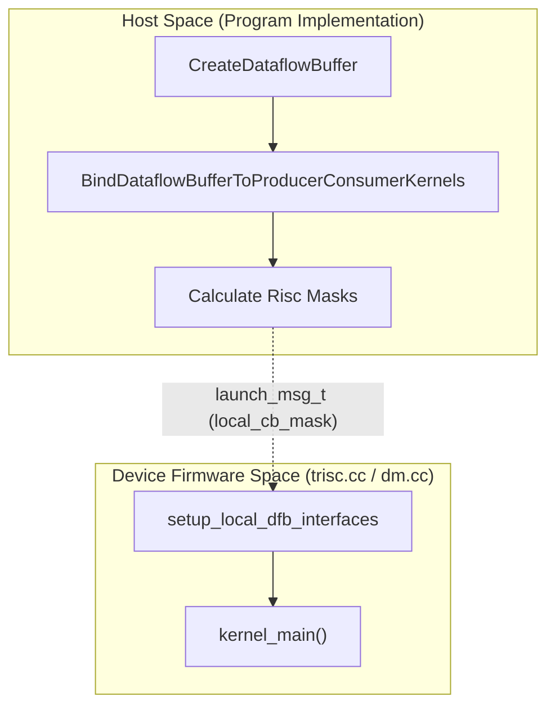
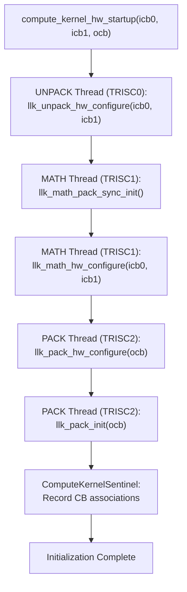
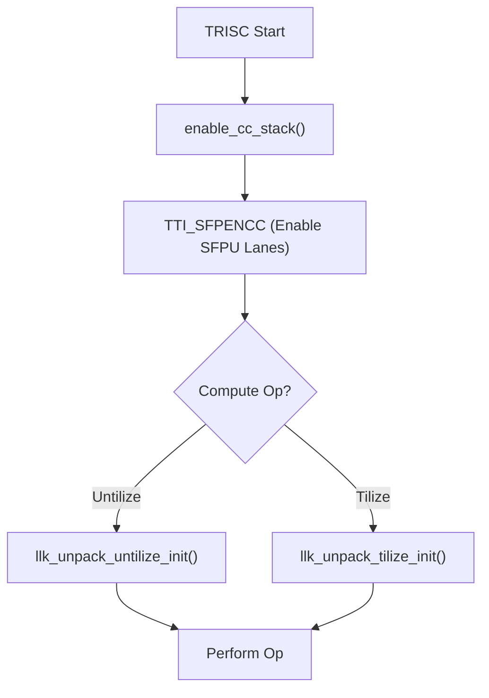

# Compute Kernel Initialization and Startup

Relevant source files
*   [docs/source/tt-metalium/tt_metal/apis/kernel_apis/compute/add_tiles_bcast.rst](https://github.com/tenstorrent/tt-metal/blob/f30f8df0/docs/source/tt-metalium/tt_metal/apis/kernel_apis/compute/add_tiles_bcast.rst)
*   [docs/source/tt-metalium/tt_metal/apis/kernel_apis/compute/mul_tiles_bcast.rst](https://github.com/tenstorrent/tt-metal/blob/f30f8df0/docs/source/tt-metalium/tt_metal/apis/kernel_apis/compute/mul_tiles_bcast.rst)
*   [docs/source/tt-metalium/tt_metal/apis/kernel_apis/compute/sub_tiles_bcast.rst](https://github.com/tenstorrent/tt-metal/blob/f30f8df0/docs/source/tt-metalium/tt_metal/apis/kernel_apis/compute/sub_tiles_bcast.rst)
*   [tests/pipeline_reorg/llk_unit_tests.yaml](https://github.com/tenstorrent/tt-metal/blob/f30f8df0/tests/pipeline_reorg/llk_unit_tests.yaml)
*   [tests/scripts/run_cpp_unit_tests.sh](https://github.com/tenstorrent/tt-metal/blob/f30f8df0/tests/scripts/run_cpp_unit_tests.sh)
*   [tests/tt_metal/tt_fabric/test_bandwidth_telemetry_validation.cpp](https://github.com/tenstorrent/tt-metal/blob/f30f8df0/tests/tt_metal/tt_fabric/test_bandwidth_telemetry_validation.cpp)
*   [tests/tt_metal/tt_metal/api/compile_program_with_kernel_path_env_var_fixture.hpp](https://github.com/tenstorrent/tt-metal/blob/f30f8df0/tests/tt_metal/tt_metal/api/compile_program_with_kernel_path_env_var_fixture.hpp)
*   [tests/tt_metal/tt_metal/api/dataflow_buffer/test_dataflow_buffer.cpp](https://github.com/tenstorrent/tt-metal/blob/f30f8df0/tests/tt_metal/tt_metal/api/dataflow_buffer/test_dataflow_buffer.cpp)
*   [tests/tt_metal/tt_metal/api/dataflow_buffer/test_dataflow_buffer_configs.cpp](https://github.com/tenstorrent/tt-metal/blob/f30f8df0/tests/tt_metal/tt_metal/api/dataflow_buffer/test_dataflow_buffer_configs.cpp)
*   [tests/tt_metal/tt_metal/api/test_dram.cpp](https://github.com/tenstorrent/tt-metal/blob/f30f8df0/tests/tt_metal/tt_metal/api/test_dram.cpp)
*   [tests/tt_metal/tt_metal/integration/matmul/test_matmul_X_tile.cpp](https://github.com/tenstorrent/tt-metal/blob/f30f8df0/tests/tt_metal/tt_metal/integration/matmul/test_matmul_X_tile.cpp)
*   [tests/tt_metal/tt_metal/llk/llk_device_fixture.hpp](https://github.com/tenstorrent/tt-metal/blob/f30f8df0/tests/tt_metal/tt_metal/llk/llk_device_fixture.hpp)
*   [tests/tt_metal/tt_metal/llk/test_broadcast.cpp](https://github.com/tenstorrent/tt-metal/blob/f30f8df0/tests/tt_metal/tt_metal/llk/test_broadcast.cpp)
*   [tests/tt_metal/tt_metal/llk/test_copy_block_matmul_partials.cpp](https://github.com/tenstorrent/tt-metal/blob/f30f8df0/tests/tt_metal/tt_metal/llk/test_copy_block_matmul_partials.cpp)
*   [tests/tt_metal/tt_metal/llk/test_reconfig.cpp](https://github.com/tenstorrent/tt-metal/blob/f30f8df0/tests/tt_metal/tt_metal/llk/test_reconfig.cpp)
*   [tests/tt_metal/tt_metal/llk/test_reduce.cpp](https://github.com/tenstorrent/tt-metal/blob/f30f8df0/tests/tt_metal/tt_metal/llk/test_reduce.cpp)
*   [tests/tt_metal/tt_metal/llk/test_single_core_binary_compute.cpp](https://github.com/tenstorrent/tt-metal/blob/f30f8df0/tests/tt_metal/tt_metal/llk/test_single_core_binary_compute.cpp)
*   [tests/tt_metal/tt_metal/llk/test_transpose.cpp](https://github.com/tenstorrent/tt-metal/blob/f30f8df0/tests/tt_metal/tt_metal/llk/test_transpose.cpp)
*   [tests/tt_metal/tt_metal/llk/test_unary_broadcast.cpp](https://github.com/tenstorrent/tt-metal/blob/f30f8df0/tests/tt_metal/tt_metal/llk/test_unary_broadcast.cpp)
*   [tests/tt_metal/tt_metal/llk/test_untilize_tilize.cpp](https://github.com/tenstorrent/tt-metal/blob/f30f8df0/tests/tt_metal/tt_metal/llk/test_untilize_tilize.cpp)
*   [tests/tt_metal/tt_metal/sfpi/test_sfpi.cpp](https://github.com/tenstorrent/tt-metal/blob/f30f8df0/tests/tt_metal/tt_metal/sfpi/test_sfpi.cpp)
*   [tests/tt_metal/tt_metal/test_kernels/compute/broadcast.cpp](https://github.com/tenstorrent/tt-metal/blob/f30f8df0/tests/tt_metal/tt_metal/test_kernels/compute/broadcast.cpp)
*   [tests/tt_metal/tt_metal/test_kernels/compute/dfb_t6.cpp](https://github.com/tenstorrent/tt-metal/blob/f30f8df0/tests/tt_metal/tt_metal/test_kernels/compute/dfb_t6.cpp)
*   [tests/tt_metal/tt_metal/test_kernels/compute/dfb_t6_consumer.cpp](https://github.com/tenstorrent/tt-metal/blob/f30f8df0/tests/tt_metal/tt_metal/test_kernels/compute/dfb_t6_consumer.cpp)
*   [tests/tt_metal/tt_metal/test_kernels/compute/dfb_t6_producer.cpp](https://github.com/tenstorrent/tt-metal/blob/f30f8df0/tests/tt_metal/tt_metal/test_kernels/compute/dfb_t6_producer.cpp)
*   [tests/tt_metal/tt_metal/test_kernels/compute/dst_untilize.cpp](https://github.com/tenstorrent/tt-metal/blob/f30f8df0/tests/tt_metal/tt_metal/test_kernels/compute/dst_untilize.cpp)
*   [tests/tt_metal/tt_metal/test_kernels/compute/matmul_block.cpp](https://github.com/tenstorrent/tt-metal/blob/f30f8df0/tests/tt_metal/tt_metal/test_kernels/compute/matmul_block.cpp)
*   [tests/tt_metal/tt_metal/test_kernels/compute/pack_untilize.cpp](https://github.com/tenstorrent/tt-metal/blob/f30f8df0/tests/tt_metal/tt_metal/test_kernels/compute/pack_untilize.cpp)
*   [tests/tt_metal/tt_metal/test_kernels/compute/transpose_wh.cpp](https://github.com/tenstorrent/tt-metal/blob/f30f8df0/tests/tt_metal/tt_metal/test_kernels/compute/transpose_wh.cpp)
*   [tests/tt_metal/tt_metal/test_kernels/compute/transpose_wh_dest.cpp](https://github.com/tenstorrent/tt-metal/blob/f30f8df0/tests/tt_metal/tt_metal/test_kernels/compute/transpose_wh_dest.cpp)
*   [tests/tt_metal/tt_metal/test_kernels/compute/unpack_untilize.cpp](https://github.com/tenstorrent/tt-metal/blob/f30f8df0/tests/tt_metal/tt_metal/test_kernels/compute/unpack_untilize.cpp)
*   [tests/tt_metal/tt_metal/test_kernels/dataflow/dfb_consumer.cpp](https://github.com/tenstorrent/tt-metal/blob/f30f8df0/tests/tt_metal/tt_metal/test_kernels/dataflow/dfb_consumer.cpp)
*   [tests/tt_metal/tt_metal/test_kernels/dataflow/dfb_producer.cpp](https://github.com/tenstorrent/tt-metal/blob/f30f8df0/tests/tt_metal/tt_metal/test_kernels/dataflow/dfb_producer.cpp)
*   [tests/tt_metal/tt_metal/test_kernels/dataflow/dram_copy.cpp](https://github.com/tenstorrent/tt-metal/blob/f30f8df0/tests/tt_metal/tt_metal/test_kernels/dataflow/dram_copy.cpp)
*   [tests/tt_metal/tt_metal/test_kernels/dataflow/reader_matmul_with_bias_blocked.cpp](https://github.com/tenstorrent/tt-metal/blob/f30f8df0/tests/tt_metal/tt_metal/test_kernels/dataflow/reader_matmul_with_bias_blocked.cpp)
*   [tests/tt_metal/tt_metal/test_kernels/dataflow/reader_unary_transpose_wh.cpp](https://github.com/tenstorrent/tt-metal/blob/f30f8df0/tests/tt_metal/tt_metal/test_kernels/dataflow/reader_unary_transpose_wh.cpp)
*   [tests/tt_metal/tt_metal/test_pack_relu.cpp](https://github.com/tenstorrent/tt-metal/blob/f30f8df0/tests/tt_metal/tt_metal/test_pack_relu.cpp)
*   [tt_metal/api/tt-metalium/experimental/fabric/fabric_telemetry.hpp](https://github.com/tenstorrent/tt-metal/blob/f30f8df0/tt_metal/api/tt-metalium/experimental/fabric/fabric_telemetry.hpp)
*   [tt_metal/fabric/fabric_telemetry_converter.hpp](https://github.com/tenstorrent/tt-metal/blob/f30f8df0/tt_metal/fabric/fabric_telemetry_converter.hpp)
*   [tt_metal/fabric/fabric_telemetry_reader.cpp](https://github.com/tenstorrent/tt-metal/blob/f30f8df0/tt_metal/fabric/fabric_telemetry_reader.cpp)
*   [tt_metal/hw/ckernels/blackhole/metal/llk_api/llk_math_transpose_dest_api.h](https://github.com/tenstorrent/tt-metal/blob/f30f8df0/tt_metal/hw/ckernels/blackhole/metal/llk_api/llk_math_transpose_dest_api.h)
*   [tt_metal/hw/ckernels/quasar/metal/llk_api/llk_unpack_AB_matmul_api.h](https://github.com/tenstorrent/tt-metal/blob/f30f8df0/tt_metal/hw/ckernels/quasar/metal/llk_api/llk_unpack_AB_matmul_api.h)
*   [tt_metal/hw/ckernels/quasar/metal/llk_io/llk_io_pack.h](https://github.com/tenstorrent/tt-metal/blob/f30f8df0/tt_metal/hw/ckernels/quasar/metal/llk_io/llk_io_pack.h)
*   [tt_metal/hw/ckernels/quasar/metal/llk_io/llk_io_unpack.h](https://github.com/tenstorrent/tt-metal/blob/f30f8df0/tt_metal/hw/ckernels/quasar/metal/llk_io/llk_io_unpack.h)
*   [tt_metal/hw/ckernels/wormhole_b0/metal/llk_api/llk_math_transpose_dest_api.h](https://github.com/tenstorrent/tt-metal/blob/f30f8df0/tt_metal/hw/ckernels/wormhole_b0/metal/llk_api/llk_math_transpose_dest_api.h)
*   [tt_metal/hw/firmware/src/tt-1xx/drisc.cc](https://github.com/tenstorrent/tt-metal/blob/f30f8df0/tt_metal/hw/firmware/src/tt-1xx/drisc.cc)
*   [tt_metal/hw/firmware/src/tt-2xx/dm.cc](https://github.com/tenstorrent/tt-metal/blob/f30f8df0/tt_metal/hw/firmware/src/tt-2xx/dm.cc)
*   [tt_metal/hw/firmware/src/tt-2xx/dmk.cc](https://github.com/tenstorrent/tt-metal/blob/f30f8df0/tt_metal/hw/firmware/src/tt-2xx/dmk.cc)
*   [tt_metal/hw/firmware/src/tt-2xx/trisc.cc](https://github.com/tenstorrent/tt-metal/blob/f30f8df0/tt_metal/hw/firmware/src/tt-2xx/trisc.cc)
*   [tt_metal/hw/inc/api/dataflow/dataflow_api.h](https://github.com/tenstorrent/tt-metal/blob/f30f8df0/tt_metal/hw/inc/api/dataflow/dataflow_api.h)
*   [tt_metal/hw/inc/api/dataflow/dataflow_buffer.h](https://github.com/tenstorrent/tt-metal/blob/f30f8df0/tt_metal/hw/inc/api/dataflow/dataflow_buffer.h)
*   [tt_metal/hw/inc/hostdev/dev_msgs.h](https://github.com/tenstorrent/tt-metal/blob/f30f8df0/tt_metal/hw/inc/hostdev/dev_msgs.h)
*   [tt_metal/hw/inc/hostdev/fabric_telemetry_msgs.h](https://github.com/tenstorrent/tt-metal/blob/f30f8df0/tt_metal/hw/inc/hostdev/fabric_telemetry_msgs.h)
*   [tt_metal/hw/inc/internal/dataflow/dataflow_cmd_bufs.h](https://github.com/tenstorrent/tt-metal/blob/f30f8df0/tt_metal/hw/inc/internal/dataflow/dataflow_cmd_bufs.h)
*   [tt_metal/hw/inc/internal/tt-1xx/blackhole/c_tensix_core.h](https://github.com/tenstorrent/tt-metal/blob/f30f8df0/tt_metal/hw/inc/internal/tt-1xx/blackhole/c_tensix_core.h)
*   [tt_metal/hw/inc/internal/tt-1xx/blackhole/core_config.h](https://github.com/tenstorrent/tt-metal/blob/f30f8df0/tt_metal/hw/inc/internal/tt-1xx/blackhole/core_config.h)
*   [tt_metal/hw/inc/internal/tt-1xx/blackhole/dev_mem_map.h](https://github.com/tenstorrent/tt-metal/blob/f30f8df0/tt_metal/hw/inc/internal/tt-1xx/blackhole/dev_mem_map.h)
*   [tt_metal/hw/inc/internal/tt-1xx/blackhole/noc_nonblocking_api.h](https://github.com/tenstorrent/tt-metal/blob/f30f8df0/tt_metal/hw/inc/internal/tt-1xx/blackhole/noc_nonblocking_api.h)
*   [tt_metal/hw/inc/internal/tt-1xx/wormhole/c_tensix_core.h](https://github.com/tenstorrent/tt-metal/blob/f30f8df0/tt_metal/hw/inc/internal/tt-1xx/wormhole/c_tensix_core.h)
*   [tt_metal/hw/inc/internal/tt-1xx/wormhole/core_config.h](https://github.com/tenstorrent/tt-metal/blob/f30f8df0/tt_metal/hw/inc/internal/tt-1xx/wormhole/core_config.h)
*   [tt_metal/hw/inc/internal/tt-1xx/wormhole/dev_mem_map.h](https://github.com/tenstorrent/tt-metal/blob/f30f8df0/tt_metal/hw/inc/internal/tt-1xx/wormhole/dev_mem_map.h)
*   [tt_metal/hw/inc/internal/tt-1xx/wormhole/noc_nonblocking_api.h](https://github.com/tenstorrent/tt-metal/blob/f30f8df0/tt_metal/hw/inc/internal/tt-1xx/wormhole/noc_nonblocking_api.h)
*   [tt_metal/hw/inc/internal/tt-2xx/dataflow_buffer.inl](https://github.com/tenstorrent/tt-metal/blob/f30f8df0/tt_metal/hw/inc/internal/tt-2xx/dataflow_buffer.inl)
*   [tt_metal/hw/inc/internal/tt-2xx/dataflow_buffer/dataflow_buffer_config.h](https://github.com/tenstorrent/tt-metal/blob/f30f8df0/tt_metal/hw/inc/internal/tt-2xx/dataflow_buffer/dataflow_buffer_config.h)
*   [tt_metal/hw/inc/internal/tt-2xx/dataflow_buffer/dataflow_buffer_init.h](https://github.com/tenstorrent/tt-metal/blob/f30f8df0/tt_metal/hw/inc/internal/tt-2xx/dataflow_buffer/dataflow_buffer_init.h)
*   [tt_metal/hw/inc/internal/tt-2xx/dataflow_buffer/dataflow_buffer_interface.h](https://github.com/tenstorrent/tt-metal/blob/f30f8df0/tt_metal/hw/inc/internal/tt-2xx/dataflow_buffer/dataflow_buffer_interface.h)
*   [tt_metal/hw/inc/internal/tt-2xx/quasar/core_config.h](https://github.com/tenstorrent/tt-metal/blob/f30f8df0/tt_metal/hw/inc/internal/tt-2xx/quasar/core_config.h)
*   [tt_metal/hw/inc/internal/tt-2xx/quasar/dev_mem_map.h](https://github.com/tenstorrent/tt-metal/blob/f30f8df0/tt_metal/hw/inc/internal/tt-2xx/quasar/dev_mem_map.h)
*   [tt_metal/hw/inc/internal/tt-2xx/quasar/noc_nonblocking_api.h](https://github.com/tenstorrent/tt-metal/blob/f30f8df0/tt_metal/hw/inc/internal/tt-2xx/quasar/noc_nonblocking_api.h)
*   [tt_metal/hw/inc/internal/tt-2xx/quasar/noc_nonblocking_api_v1.h](https://github.com/tenstorrent/tt-metal/blob/f30f8df0/tt_metal/hw/inc/internal/tt-2xx/quasar/noc_nonblocking_api_v1.h)
*   [tt_metal/hw/inc/internal/tt-2xx/quasar/noc_nonblocking_api_v2.h](https://github.com/tenstorrent/tt-metal/blob/f30f8df0/tt_metal/hw/inc/internal/tt-2xx/quasar/noc_nonblocking_api_v2.h)
*   [tt_metal/hw/inc/internal/tt-2xx/quasar/stream_interface.h](https://github.com/tenstorrent/tt-metal/blob/f30f8df0/tt_metal/hw/inc/internal/tt-2xx/quasar/stream_interface.h)
*   [tt_metal/impl/dataflow_buffer/dataflow_buffer.cpp](https://github.com/tenstorrent/tt-metal/blob/f30f8df0/tt_metal/impl/dataflow_buffer/dataflow_buffer.cpp)
*   [tt_metal/impl/dataflow_buffer/dataflow_buffer_impl.hpp](https://github.com/tenstorrent/tt-metal/blob/f30f8df0/tt_metal/impl/dataflow_buffer/dataflow_buffer_impl.hpp)
*   [tt_metal/kernels/dataflow/reader_unary.cpp](https://github.com/tenstorrent/tt-metal/blob/f30f8df0/tt_metal/kernels/dataflow/reader_unary.cpp)
*   [tt_metal/kernels/dataflow/writer_unary.cpp](https://github.com/tenstorrent/tt-metal/blob/f30f8df0/tt_metal/kernels/dataflow/writer_unary.cpp)
*   [tt_metal/llrt/hal/codegen/codegen.py](https://github.com/tenstorrent/tt-metal/blob/f30f8df0/tt_metal/llrt/hal/codegen/codegen.py)
*   [tt_metal/llrt/hal/tt-1xx/blackhole/bh_hal_dram.cpp](https://github.com/tenstorrent/tt-metal/blob/f30f8df0/tt_metal/llrt/hal/tt-1xx/blackhole/bh_hal_dram.cpp)
*   [tt_metal/tt-llk/tests/helpers/include/llk_lib_math_wrappers.h](https://github.com/tenstorrent/tt-metal/blob/f30f8df0/tt_metal/tt-llk/tests/helpers/include/llk_lib_math_wrappers.h)
*   [tt_metal/tt-llk/tt_llk_blackhole/llk_lib/llk_math_transpose_dest.h](https://github.com/tenstorrent/tt-metal/blob/f30f8df0/tt_metal/tt-llk/tt_llk_blackhole/llk_lib/llk_math_transpose_dest.h)
*   [ttnn/cpp/ttnn/operations/data_movement/transpose/device/kernels/compute/transpose_wh.cpp](https://github.com/tenstorrent/tt-metal/blob/f30f8df0/ttnn/cpp/ttnn/operations/data_movement/transpose/device/kernels/compute/transpose_wh.cpp)
*   [ttnn/cpp/ttnn/operations/experimental/reduction/integral_image/device/intimg_program_factory.cpp](https://github.com/tenstorrent/tt-metal/blob/f30f8df0/ttnn/cpp/ttnn/operations/experimental/reduction/integral_image/device/intimg_program_factory.cpp)
*   [ttnn/cpp/ttnn/operations/experimental/reduction/integral_image/device/kernels/common_dataflow.hpp](https://github.com/tenstorrent/tt-metal/blob/f30f8df0/ttnn/cpp/ttnn/operations/experimental/reduction/integral_image/device/kernels/common_dataflow.hpp)
*   [ttnn/cpp/ttnn/operations/experimental/reduction/integral_image/device/kernels/intimg_compute.cpp](https://github.com/tenstorrent/tt-metal/blob/f30f8df0/ttnn/cpp/ttnn/operations/experimental/reduction/integral_image/device/kernels/intimg_compute.cpp)
*   [ttnn/cpp/ttnn/operations/experimental/reduction/integral_image/device/kernels/intimg_writer.cpp](https://github.com/tenstorrent/tt-metal/blob/f30f8df0/ttnn/cpp/ttnn/operations/experimental/reduction/integral_image/device/kernels/intimg_writer.cpp)

## Overview

This document describes the hardware initialization sequence required for compute kernels running on Tenstorrent cores within the TT-Metalium framework. All compute kernels must perform a one-time hardware configuration at startup before executing any tensor operations. This initialization configures the parallel execution threads (UNPACK, MATH, and PACK) and establishes the data flow pipeline between circular buffers (or dataflow buffers) and the destination register.

The initialization process involves coordinating the RISC-V processors which handle Unpack, Math, and Pack duties. On the Tensix architecture (Wormhole/Blackhole), these are TRISC0, TRISC1, and TRISC2. On the Quasar architecture (tt-2xx), this is expanded to TRISC0 through TRISC3. The firmware manages architecture-specific memory maps and toolchains for these different hardware generations.

For detailed information about the individual execution threads and their operations, see:

*   Unpack operations: [3.3. Unpack Operations and Input Processing](https://github.com/tenstorrent/tt-metal/blob/f30f8df0/3.3.%20Unpack%20Operations%20and%20Input%20Processing)
*   Pack operations: [3.4. Pack Operations and Output Processing](https://github.com/tenstorrent/tt-metal/blob/f30f8df0/3.4.%20Pack%20Operations%20and%20Output%20Processing)
*   Math operations: [3.5. Math and Compute Operations](https://github.com/tenstorrent/tt-metal/blob/f30f8df0/3.5.%20Math%20and%20Compute%20Operations)

## Firmware Entry and Kernel Startup

The firmware on each RISC-V core is responsible for the transition from a "waiting" state to "executing" a kernel. On TRISC cores, this happens when the core waits for a `RUN_SYNC_MSG_GO` signal in the mailbox.

### TRISC Firmware Startup Flow

Sources: [tt_metal/hw/firmware/src/tt-2xx/trisc.cc 120-153](https://github.com/tenstorrent/tt-metal/blob/f30f8df0/tt_metal/hw/firmware/src/tt-2xx/trisc.cc#L120-L153)[tt_metal/hw/inc/api/dataflow/dataflow_api.h 44-86](https://github.com/tenstorrent/tt-metal/blob/f30f8df0/tt_metal/hw/inc/api/dataflow/dataflow_api.h#L44-L86)[tt_metal/hw/inc/hostdev/dev_msgs.h 98-107](https://github.com/tenstorrent/tt-metal/blob/f30f8df0/tt_metal/hw/inc/hostdev/dev_msgs.h#L98-L107)

## Dataflow Buffer (DFB) Initialization

On Quasar (tt-2xx) architectures, the traditional Circular Buffer (CB) system is augmented or replaced by Dataflow Buffers (DFB). DFBs provide enhanced synchronization and hardware-accelerated data movement.

### DFB Setup Sequence

1.   **Host Allocation**: The host defines buffer parameters and associates them with specific kernels via `CreateDataflowBuffer` and `BindDataflowBufferToProducerConsumerKernels`.
2.   **Risc Mask Calculation**: The host calculates `producer_risc_mask` and `consumer_risc_mask` based on the kernel type (DataMovement vs Compute) to identify which RISC-V processors participate in the DFB transaction.
3.   **Firmware Configuration**: During startup, `setup_local_dfb_interfaces` is called to populate the `g_dfb_interface` array using the `local_cb_offset` and `local_cb_mask` from the `launch_msg_t`.

Sources: [tt_metal/impl/dataflow_buffer/dataflow_buffer.cpp 20-102](https://github.com/tenstorrent/tt-metal/blob/f30f8df0/tt_metal/impl/dataflow_buffer/dataflow_buffer.cpp#L20-L102)[tt_metal/hw/firmware/src/tt-2xx/trisc.cc 160-165](https://github.com/tenstorrent/tt-metal/blob/f30f8df0/tt_metal/hw/firmware/src/tt-2xx/trisc.cc#L160-L165)[tt_metal/hw/firmware/src/tt-2xx/dm.cc 103-118](https://github.com/tenstorrent/tt-metal/blob/f30f8df0/tt_metal/hw/firmware/src/tt-2xx/dm.cc#L103-L118)




Sources: [tt_metal/impl/dataflow_buffer/dataflow_buffer.cpp:20-102](), [tt_metal/hw/firmware/src/tt-2xx/trisc.cc:160-165](), [tt_metal/hw/firmware/src/tt-2xx/dm.cc:103-118]()
```
## Core Initialization Function

The primary initialization function is `compute_kernel_hw_startup`, which must be called exactly once at the beginning of every compute kernel. This function serves as the entry point for hardware-level thread synchronization and register configuration.

### Function Signatures

`// Three-parameter version (separate input operands)void compute_kernel_hw_startup(uint32_t icb0, uint32_t icb1, uint32_t ocb); // Two-parameter version (same input operand for both sources)void compute_kernel_hw_startup(uint32_t icb0, uint32_t ocb);`
### Parameters

| Parameter | Description | Valid Range | Purpose |
| --- | --- | --- | --- |
| `icb0` | Circular buffer ID for operand A | 0-31 | Source buffer for UNPACK thread |
| `icb1` | Circular buffer ID for operand B | 0-31 | Source buffer for UNPACK thread (optional) |
| `ocb` | Output circular buffer ID | 0-31 | Destination buffer for PACK thread |

Sources: [tt_metal/hw/inc/api/dataflow/dataflow_api.h 175-185](https://github.com/tenstorrent/tt-metal/blob/f30f8df0/tt_metal/hw/inc/api/dataflow/dataflow_api.h#L175-L185)[tt_metal/hw/firmware/src/tt-2xx/trisc.cc 81-94](https://github.com/tenstorrent/tt-metal/blob/f30f8df0/tt_metal/hw/firmware/src/tt-2xx/trisc.cc#L81-L94)

## Initialization Sequence

The hardware configuration sequence performed by `compute_kernel_hw_startup` coordinates multiple LLK (Low Level Kernel) layers. On Quasar architectures, `dm.cc` handles the low-level reset of TRISC cores via `deassert_trisc` and `invalidate_trisc_instruction_cache`.

### Compute Hardware Startup Flow

Sources: [tt_metal/hw/firmware/src/tt-2xx/dm.cc 87-101](https://github.com/tenstorrent/tt-metal/blob/f30f8df0/tt_metal/hw/firmware/src/tt-2xx/dm.cc#L87-L101)[tt_metal/hw/firmware/src/tt-2xx/trisc.cc 98-109](https://github.com/tenstorrent/tt-metal/blob/f30f8df0/tt_metal/hw/firmware/src/tt-2xx/trisc.cc#L98-L109)




Sources: [tt_metal/hw/firmware/src/tt-2xx/dm.cc:87-101](), [tt_metal/hw/firmware/src/tt-2xx/trisc.cc:98-109]()
```
## Runtime Arguments (RTA) Initialization

Runtime arguments are provided by the host and mapped into L1 memory for the kernel to access. The firmware initializes `rta_l1_base` and `crta_l1_base` pointers using offsets provided in the `launch_msg_t`.

*   **RTA**: Unique per core, accessed via `get_arg_val<T>(idx)`.
*   **CRTA**: Shared across all cores in a kernel group, accessed via `get_common_arg_val<T>(idx)`.

Sources: [tt_metal/hw/firmware/src/tt-2xx/trisc.cc 168-176](https://github.com/tenstorrent/tt-metal/blob/f30f8df0/tt_metal/hw/firmware/src/tt-2xx/trisc.cc#L168-L176)[tt_metal/hw/inc/api/dataflow/dataflow_api.h 108-172](https://github.com/tenstorrent/tt-metal/blob/f30f8df0/tt_metal/hw/inc/api/dataflow/dataflow_api.h#L108-L172)

## SFPU Configuration

SFPU (Special Function Processing Unit) operations are specialized math functions implemented in hardware. These operations require specific initialization routines to set up lookup tables or internal state. On Quasar, `enable_cc_stack` is called during TRISC startup to enable SFPU lanes using the `TTI_SFPENCC` instruction.

### SFPU Initialization Flow

Before executing SFPU-specific instructions, the kernel must call the corresponding initialization function to configure the hardware for that specific math operation (e.g., untilize, tilize, or reduce).

Sources: [tt_metal/hw/firmware/src/tt-2xx/trisc.cc 111-117](https://github.com/tenstorrent/tt-metal/blob/f30f8df0/tt_metal/hw/firmware/src/tt-2xx/trisc.cc#L111-L117)[tests/tt_metal/tt_metal/llk/test_untilize_tilize.cpp 61-100](https://github.com/tenstorrent/tt-metal/blob/f30f8df0/tests/tt_metal/tt_metal/llk/test_untilize_tilize.cpp#L61-L100)




Sources: [tt_metal/hw/firmware/src/tt-2xx/trisc.cc:111-117](), [tests/tt_metal/tt_metal/llk/test_untilize_tilize.cpp:61-100]()
```
## Architecture Support and Memory Maps

The system manages architecture-specific resources through the `mailboxes_t` and `kernel_config_msg_t` structures. Memory maps differ between Wormhole, Blackhole, and Quasar to accommodate varying L1 sizes and processor counts.

### Program Memory Map Configuration

| Resource | Base Address (Wormhole) | Base Address (Blackhole) |
| --- | --- | --- |
| `MEM_L1_BASE` | `0x0` | `0x0` |
| `MEM_MAILBOX_BASE` | `16` | `96` |
| `MEM_BRISC_FIRMWARE_BASE` | `MEM_LLK_DEBUG_BASE + 1024` | `MEM_LLK_DEBUG_BASE + 1024` |
| `MEM_NOC_COUNTER_BASE` | `TRISC2_FW_BASE + SIZE` | `TRISC2_FW_BASE + SIZE` |

Sources: [tt_metal/hw/inc/internal/tt-1xx/wormhole/dev_mem_map.h 32-109](https://github.com/tenstorrent/tt-metal/blob/f30f8df0/tt_metal/hw/inc/internal/tt-1xx/wormhole/dev_mem_map.h#L32-L109)[tt_metal/hw/inc/internal/tt-1xx/blackhole/dev_mem_map.h 32-127](https://github.com/tenstorrent/tt-metal/blob/f30f8df0/tt_metal/hw/inc/internal/tt-1xx/blackhole/dev_mem_map.h#L32-L127)[tt_metal/hw/inc/hostdev/dev_msgs.h 155-180](https://github.com/tenstorrent/tt-metal/blob/f30f8df0/tt_metal/hw/inc/hostdev/dev_msgs.h#L155-L180)

## Usage Guidelines

### Mandatory Execution

*   `compute_kernel_hw_startup`**must** be called exactly once per compute kernel at the beginning of `kernel_main()`.
*   On Quasar, `setup_local_dfb_interfaces` is mandatory if the kernel uses Dataflow Buffers for data movement.

### NoC Initialization

Data movement kernels (`dm.cc`) must initialize NoC coordinates (`my_x`, `my_y`, `my_logical_x_`) from the mailbox `core_info` before performing any NoC transactions.

Sources: [tt_metal/hw/firmware/src/tt-2xx/dm.cc 29-35](https://github.com/tenstorrent/tt-metal/blob/f30f8df0/tt_metal/hw/firmware/src/tt-2xx/dm.cc#L29-L35)[tt_metal/hw/inc/api/dataflow/dataflow_api.h 44-60](https://github.com/tenstorrent/tt-metal/blob/f30f8df0/tt_metal/hw/inc/api/dataflow/dataflow_api.h#L44-L60)

Dismiss
Refresh this wiki

Enter email to refresh
