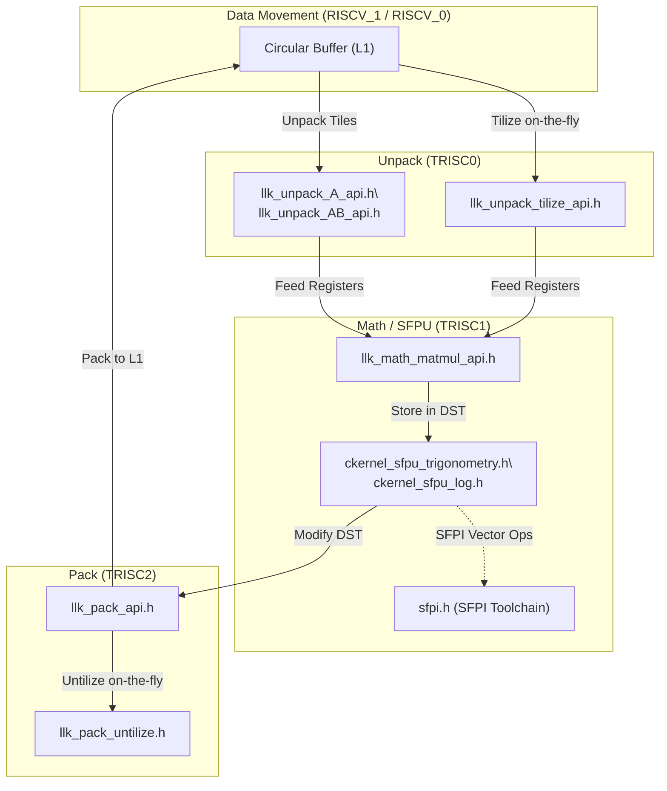
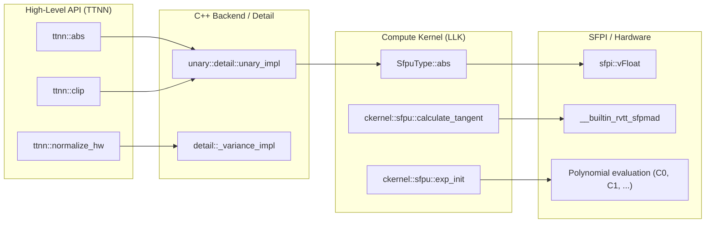
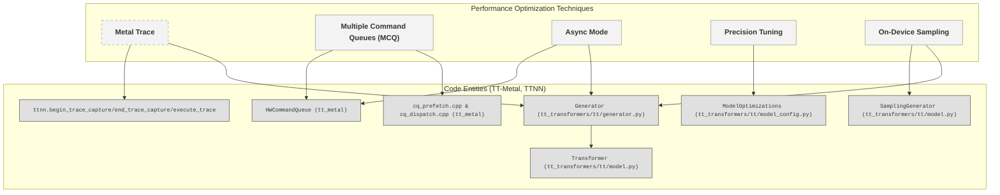
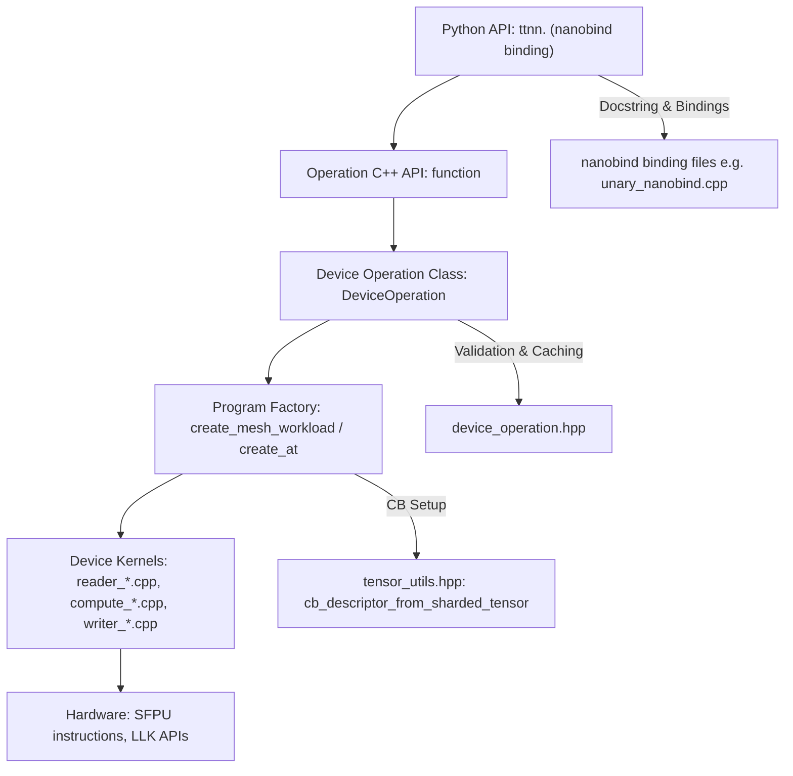

# Math and Compute Operations

Relevant source files
*   [dockerfile/Dockerfile.manylinux](https://github.com/tenstorrent/tt-metal/blob/f30f8df0/dockerfile/Dockerfile.manylinux)
*   [docs/source/tt-metalium/tt_metal/apis/kernel_apis/sfpu/llk.rst](https://github.com/tenstorrent/tt-metal/blob/f30f8df0/docs/source/tt-metalium/tt_metal/apis/kernel_apis/sfpu/llk.rst)
*   [models/demos/deepseek_v3_b1/micro_ops/sdpa/kernels/sdpa_compute.cpp](https://github.com/tenstorrent/tt-metal/blob/f30f8df0/models/demos/deepseek_v3_b1/micro_ops/sdpa/kernels/sdpa_compute.cpp)
*   [tests/tt_metal/tt_metal/test_kernels/sfpi/post.inc](https://github.com/tenstorrent/tt-metal/blob/f30f8df0/tests/tt_metal/tt_metal/test_kernels/sfpi/post.inc)
*   [tests/ttnn/unit_tests/operations/eltwise/test_composite.py](https://github.com/tenstorrent/tt-metal/blob/f30f8df0/tests/ttnn/unit_tests/operations/eltwise/test_composite.py)
*   [tests/ttnn/unit_tests/operations/eltwise/test_exp2.py](https://github.com/tenstorrent/tt-metal/blob/f30f8df0/tests/ttnn/unit_tests/operations/eltwise/test_exp2.py)
*   [tests/ttnn/unit_tests/operations/eltwise/test_expm1.py](https://github.com/tenstorrent/tt-metal/blob/f30f8df0/tests/ttnn/unit_tests/operations/eltwise/test_expm1.py)
*   [tests/ttnn/unit_tests/operations/eltwise/test_unary.py](https://github.com/tenstorrent/tt-metal/blob/f30f8df0/tests/ttnn/unit_tests/operations/eltwise/test_unary.py)
*   [tests/ttnn/unit_tests/operations/eltwise/test_unary_fp32.py](https://github.com/tenstorrent/tt-metal/blob/f30f8df0/tests/ttnn/unit_tests/operations/eltwise/test_unary_fp32.py)
*   [tt_metal/hw/ckernels/blackhole/metal/llk_api/llk_sfpu/ckernel_sfpu_div_int32_floor.h](https://github.com/tenstorrent/tt-metal/blob/f30f8df0/tt_metal/hw/ckernels/blackhole/metal/llk_api/llk_sfpu/ckernel_sfpu_div_int32_floor.h)
*   [tt_metal/hw/ckernels/blackhole/metal/llk_api/llk_sfpu/ckernel_sfpu_exp.h](https://github.com/tenstorrent/tt-metal/blob/f30f8df0/tt_metal/hw/ckernels/blackhole/metal/llk_api/llk_sfpu/ckernel_sfpu_exp.h)
*   [tt_metal/hw/ckernels/blackhole/metal/llk_api/llk_sfpu/ckernel_sfpu_exp2.h](https://github.com/tenstorrent/tt-metal/blob/f30f8df0/tt_metal/hw/ckernels/blackhole/metal/llk_api/llk_sfpu/ckernel_sfpu_exp2.h)
*   [tt_metal/hw/ckernels/blackhole/metal/llk_api/llk_sfpu/ckernel_sfpu_expm1.h](https://github.com/tenstorrent/tt-metal/blob/f30f8df0/tt_metal/hw/ckernels/blackhole/metal/llk_api/llk_sfpu/ckernel_sfpu_expm1.h)
*   [tt_metal/hw/ckernels/blackhole/metal/llk_api/llk_sfpu/ckernel_sfpu_sqrt_custom.h](https://github.com/tenstorrent/tt-metal/blob/f30f8df0/tt_metal/hw/ckernels/blackhole/metal/llk_api/llk_sfpu/ckernel_sfpu_sqrt_custom.h)
*   [tt_metal/hw/ckernels/blackhole/metal/llk_api/llk_sfpu/ckernel_sfpu_trigonometry.h](https://github.com/tenstorrent/tt-metal/blob/f30f8df0/tt_metal/hw/ckernels/blackhole/metal/llk_api/llk_sfpu/ckernel_sfpu_trigonometry.h)
*   [tt_metal/hw/ckernels/blackhole/metal/llk_api/llk_sfpu/llk_math_eltwise_unary_sfpu_macros.h](https://github.com/tenstorrent/tt-metal/blob/f30f8df0/tt_metal/hw/ckernels/blackhole/metal/llk_api/llk_sfpu/llk_math_eltwise_unary_sfpu_macros.h)
*   [tt_metal/hw/ckernels/blackhole/metal/llk_api/llk_sfpu_types.h](https://github.com/tenstorrent/tt-metal/blob/f30f8df0/tt_metal/hw/ckernels/blackhole/metal/llk_api/llk_sfpu_types.h)
*   [tt_metal/hw/ckernels/quasar/metal/llk_api/llk_sfpu/llk_math_eltwise_unary_sfpu_macros.h](https://github.com/tenstorrent/tt-metal/blob/f30f8df0/tt_metal/hw/ckernels/quasar/metal/llk_api/llk_sfpu/llk_math_eltwise_unary_sfpu_macros.h)
*   [tt_metal/hw/ckernels/wormhole_b0/metal/llk_api/llk_sfpu/ckernel_sfpu_exp.h](https://github.com/tenstorrent/tt-metal/blob/f30f8df0/tt_metal/hw/ckernels/wormhole_b0/metal/llk_api/llk_sfpu/ckernel_sfpu_exp.h)
*   [tt_metal/hw/ckernels/wormhole_b0/metal/llk_api/llk_sfpu/ckernel_sfpu_exp2.h](https://github.com/tenstorrent/tt-metal/blob/f30f8df0/tt_metal/hw/ckernels/wormhole_b0/metal/llk_api/llk_sfpu/ckernel_sfpu_exp2.h)
*   [tt_metal/hw/ckernels/wormhole_b0/metal/llk_api/llk_sfpu/ckernel_sfpu_expm1.h](https://github.com/tenstorrent/tt-metal/blob/f30f8df0/tt_metal/hw/ckernels/wormhole_b0/metal/llk_api/llk_sfpu/ckernel_sfpu_expm1.h)
*   [tt_metal/hw/ckernels/wormhole_b0/metal/llk_api/llk_sfpu/ckernel_sfpu_sqrt_custom.h](https://github.com/tenstorrent/tt-metal/blob/f30f8df0/tt_metal/hw/ckernels/wormhole_b0/metal/llk_api/llk_sfpu/ckernel_sfpu_sqrt_custom.h)
*   [tt_metal/hw/ckernels/wormhole_b0/metal/llk_api/llk_sfpu/ckernel_sfpu_trigonometry.h](https://github.com/tenstorrent/tt-metal/blob/f30f8df0/tt_metal/hw/ckernels/wormhole_b0/metal/llk_api/llk_sfpu/ckernel_sfpu_trigonometry.h)
*   [tt_metal/hw/ckernels/wormhole_b0/metal/llk_api/llk_sfpu/llk_math_eltwise_unary_sfpu_macros.h](https://github.com/tenstorrent/tt-metal/blob/f30f8df0/tt_metal/hw/ckernels/wormhole_b0/metal/llk_api/llk_sfpu/llk_math_eltwise_unary_sfpu_macros.h)
*   [tt_metal/hw/ckernels/wormhole_b0/metal/llk_api/llk_sfpu_types.h](https://github.com/tenstorrent/tt-metal/blob/f30f8df0/tt_metal/hw/ckernels/wormhole_b0/metal/llk_api/llk_sfpu_types.h)
*   [tt_metal/hw/inc/api/compute/common_globals.h](https://github.com/tenstorrent/tt-metal/blob/f30f8df0/tt_metal/hw/inc/api/compute/common_globals.h)
*   [tt_metal/hw/inc/api/compute/compute_kernel_api.h](https://github.com/tenstorrent/tt-metal/blob/f30f8df0/tt_metal/hw/inc/api/compute/compute_kernel_api.h)
*   [tt_metal/hw/inc/api/compute/eltwise_unary/exp.h](https://github.com/tenstorrent/tt-metal/blob/f30f8df0/tt_metal/hw/inc/api/compute/eltwise_unary/exp.h)
*   [tt_metal/hw/inc/api/compute/eltwise_unary/trigonometry.h](https://github.com/tenstorrent/tt-metal/blob/f30f8df0/tt_metal/hw/inc/api/compute/eltwise_unary/trigonometry.h)
*   [tt_metal/sfpi-info.sh](https://github.com/tenstorrent/tt-metal/blob/f30f8df0/tt_metal/sfpi-info.sh)
*   [tt_metal/sfpi-version](https://github.com/tenstorrent/tt-metal/blob/f30f8df0/tt_metal/sfpi-version)
*   [tt_metal/tt-llk/tests/helpers/include/sfpu_operations.h](https://github.com/tenstorrent/tt-metal/blob/f30f8df0/tt_metal/tt-llk/tests/helpers/include/sfpu_operations.h)
*   [ttnn/cpp/ttnn/operations/eltwise/unary/common/unary_op_types.hpp](https://github.com/tenstorrent/tt-metal/blob/f30f8df0/ttnn/cpp/ttnn/operations/eltwise/unary/common/unary_op_types.hpp)
*   [ttnn/cpp/ttnn/operations/eltwise/unary/common/unary_op_utils.cpp](https://github.com/tenstorrent/tt-metal/blob/f30f8df0/ttnn/cpp/ttnn/operations/eltwise/unary/common/unary_op_utils.cpp)
*   [ttnn/cpp/ttnn/operations/eltwise/unary/common/unary_op_utils.hpp](https://github.com/tenstorrent/tt-metal/blob/f30f8df0/ttnn/cpp/ttnn/operations/eltwise/unary/common/unary_op_utils.hpp)
*   [ttnn/cpp/ttnn/operations/eltwise/unary/device/kernels/compute/eltwise_sfpu.cpp](https://github.com/tenstorrent/tt-metal/blob/f30f8df0/ttnn/cpp/ttnn/operations/eltwise/unary/device/kernels/compute/eltwise_sfpu.cpp)
*   [ttnn/cpp/ttnn/operations/eltwise/unary/device/unary_composite_op.cpp](https://github.com/tenstorrent/tt-metal/blob/f30f8df0/ttnn/cpp/ttnn/operations/eltwise/unary/device/unary_composite_op.cpp)
*   [ttnn/cpp/ttnn/operations/eltwise/unary/device/unary_composite_op.hpp](https://github.com/tenstorrent/tt-metal/blob/f30f8df0/ttnn/cpp/ttnn/operations/eltwise/unary/device/unary_composite_op.hpp)
*   [ttnn/cpp/ttnn/operations/eltwise/unary/device/unary_device_operation.cpp](https://github.com/tenstorrent/tt-metal/blob/f30f8df0/ttnn/cpp/ttnn/operations/eltwise/unary/device/unary_device_operation.cpp)
*   [ttnn/cpp/ttnn/operations/eltwise/unary/device/unary_device_operation.hpp](https://github.com/tenstorrent/tt-metal/blob/f30f8df0/ttnn/cpp/ttnn/operations/eltwise/unary/device/unary_device_operation.hpp)
*   [ttnn/cpp/ttnn/operations/eltwise/unary/device/unary_program_factory.cpp](https://github.com/tenstorrent/tt-metal/blob/f30f8df0/ttnn/cpp/ttnn/operations/eltwise/unary/device/unary_program_factory.cpp)
*   [ttnn/cpp/ttnn/operations/eltwise/unary/unary.cpp](https://github.com/tenstorrent/tt-metal/blob/f30f8df0/ttnn/cpp/ttnn/operations/eltwise/unary/unary.cpp)
*   [ttnn/cpp/ttnn/operations/eltwise/unary/unary.hpp](https://github.com/tenstorrent/tt-metal/blob/f30f8df0/ttnn/cpp/ttnn/operations/eltwise/unary/unary.hpp)
*   [ttnn/cpp/ttnn/operations/eltwise/unary/unary_composite.hpp](https://github.com/tenstorrent/tt-metal/blob/f30f8df0/ttnn/cpp/ttnn/operations/eltwise/unary/unary_composite.hpp)

## Purpose and Scope

This page details the math and compute operations within the Tenstorrent `tt-metal` repository, focusing on the Low-Level Kernel (LLK) APIs and the Special Function Processing Unit (SFPU). It covers SFPU math operations, matrix multiplication (matmul) logic, and the integration of the SFPI toolchain for custom compute functions.

The compute engine in a Tensix core is responsible for high-performance tensor manipulations, ranging from standard matrix multiplications to complex transcendental functions executed on the SFPU.

* * *

## Compute Engine Architecture

Each Tensix core contains three RISC-V processors forming a pipeline of kernel stages:

*   **TRISC0 (Unpack)**: Reads tile data from Circular Buffers in memory and formats input for matrix math [tt_metal/hw/inc/api/compute/compute_kernel_api.h 50-64](https://github.com/tenstorrent/tt-metal/blob/f30f8df0/tt_metal/hw/inc/api/compute/compute_kernel_api.h#L50-L64)
*   **TRISC1 (Math / SFPU)**: Contains the Matrix Multiply Unit (FPU/ALU) and SFPU (Special Function Processing Unit) for unary compute [tt_metal/hw/inc/api/compute/compute_kernel_api.h 19-35](https://github.com/tenstorrent/tt-metal/blob/f30f8df0/tt_metal/hw/inc/api/compute/compute_kernel_api.h#L19-L35)
*   **TRISC2 (Pack)**: Packs computed tiles from the destination registers back to Circular Buffers [tt_metal/hw/inc/api/compute/compute_kernel_api.h 37-48](https://github.com/tenstorrent/tt-metal/blob/f30f8df0/tt_metal/hw/inc/api/compute/compute_kernel_api.h#L37-L48)

### Core Compute Units

*   **FPU / ALU**: Handles dense matrix operations and binary element-wise arithmetic (add, multiply, subtract).
*   **SFPU**: Executes unary element-wise operations (exponentials, logarithms, trigonometric functions, etc.) in-place on Destination (DST) register tiles.

### Data Flow and LLK API Entity Mapping



This mapping shows how Circular Buffers feed data into the unpack kernels, which optionally tilize inputs to tile layout. The math engines execute matrix multiplies and unary SFPU ops on tiles in DST registers. Finally, packing operations write tiles back to memory, possibly converting from tile back to row-major format (“untilize”).
```


The data pipeline and corresponding LLK API interfaces are mapped as below:

This mapping shows how Circular Buffers feed data into the unpack kernels, which optionally tilize inputs to tile layout. The math engines execute matrix multiplies and unary SFPU ops on tiles in DST registers. Finally, packing operations write tiles back to memory, possibly converting from tile back to row-major format (“untilize”).

**Sources:**[tt_metal/hw/inc/api/compute/compute_kernel_api.h 19-64](https://github.com/tenstorrent/tt-metal/blob/f30f8df0/tt_metal/hw/inc/api/compute/compute_kernel_api.h#L19-L64)[tt_metal/hw/ckernels/blackhole/metal/llk_api/llk_sfpu/ckernel_sfpu_trigonometry.h 8-16](https://github.com/tenstorrent/tt-metal/blob/f30f8df0/tt_metal/hw/ckernels/blackhole/metal/llk_api/llk_sfpu/ckernel_sfpu_trigonometry.h#L8-L16)[tt_metal/hw/ckernels/wormhole_b0/metal/llk_api/llk_sfpu/ckernel_sfpu_exp.h 12-17](https://github.com/tenstorrent/tt-metal/blob/f30f8df0/tt_metal/hw/ckernels/wormhole_b0/metal/llk_api/llk_sfpu/ckernel_sfpu_exp.h#L12-L17)

* * *

## SFPU Math Operations

The SFPU executes unary special functions on tiles residing in the Destination register file. These operations leverage vector intrinsics and polynomial approximations for high performance.

### Operation Types and Hardware Support

The SFPU supports a wide range of operations. The `SfpuType` enum categorizes these, and specialized headers provide the implementations for different architectures (Wormhole, Blackhole).

| Category | SFPU Types / Functions | File Reference |
| --- | --- | --- |
| **Trigonometric** | `sine`, `cosine`, `tan`, `acos`, `asin`, `atan` | [llk_sfpu_types.h 36-41](https://github.com/tenstorrent/tt-metal/blob/f30f8df0/llk_sfpu_types.h#L36-L41)[ckernel_sfpu_trigonometry.h 29-150](https://github.com/tenstorrent/tt-metal/blob/f30f8df0/ckernel_sfpu_trigonometry.h#L29-L150) |
| **Exponential** | `exponential`, `expm1`, `exp2` | [llk_sfpu_types.h 11-51](https://github.com/tenstorrent/tt-metal/blob/f30f8df0/llk_sfpu_types.h#L11-L51)[ckernel_sfpu_exp.h 103-156](https://github.com/tenstorrent/tt-metal/blob/f30f8df0/ckernel_sfpu_exp.h#L103-L156) |
| **Logarithmic** | `log`, `log1p`, `log_with_base` | [llk_sfpu_types.h 20-23](https://github.com/tenstorrent/tt-metal/blob/f30f8df0/llk_sfpu_types.h#L20-L23) |
| **Activations** | `sigmoid`, `silu`, `gelu`, `tanh`, `relu_max`, `relu_min` | [llk_sfpu_types.h 8-46](https://github.com/tenstorrent/tt-metal/blob/f30f8df0/llk_sfpu_types.h#L8-L46) |
| **Power/Root** | `sqrt`, `rsqrt`, `reciprocal`, `square`, `cbrt` | [llk_sfpu_types.h 14-144](https://github.com/tenstorrent/tt-metal/blob/f30f8df0/llk_sfpu_types.h#L14-L144) |
| **Bitwise** | `bitwise_xor`, `bitwise_not`, `bitwise_and`, `bitwise_or` | [llk_sfpu_types.h 109-112](https://github.com/tenstorrent/tt-metal/blob/f30f8df0/llk_sfpu_types.h#L109-L112) |

**Sources:**[tt_metal/hw/ckernels/blackhole/metal/llk_api/llk_sfpu_types.h 7-167](https://github.com/tenstorrent/tt-metal/blob/f30f8df0/tt_metal/hw/ckernels/blackhole/metal/llk_api/llk_sfpu_types.h#L7-L167)[tt_metal/hw/ckernels/wormhole_b0/metal/llk_api/llk_sfpu/ckernel_sfpu_trigonometry.h 29-150](https://github.com/tenstorrent/tt-metal/blob/f30f8df0/tt_metal/hw/ckernels/wormhole_b0/metal/llk_api/llk_sfpu/ckernel_sfpu_trigonometry.h#L29-L150)[tt_metal/hw/ckernels/blackhole/metal/llk_api/llk_sfpu/ckernel_sfpu_exp.h 103-156](https://github.com/tenstorrent/tt-metal/blob/f30f8df0/tt_metal/hw/ckernels/blackhole/metal/llk_api/llk_sfpu/ckernel_sfpu_exp.h#L103-L156)

### Trigonometric and Logarithmic Functions

Transcendental functions use **Cody-Waite argument reduction** to map inputs into intervals, allowing polynomial evaluation with controlled error bounds.

*   **`calculate_tangent`**: Uses a four-stage Cody-Waite reduction with constants `P0`, `P1` to map input `v` to `a = v - j * (PI/2)`. It then evaluates a polynomial for `tan(a)` using `sfpu_tan<is_fp32_dest_acc_en>`[tt_metal/hw/ckernels/wormhole_b0/metal/llk_api/llk_sfpu/ckernel_sfpu_trigonometry.h 115-150](https://github.com/tenstorrent/tt-metal/blob/f30f8df0/tt_metal/hw/ckernels/wormhole_b0/metal/llk_api/llk_sfpu/ckernel_sfpu_trigonometry.h#L115-L150)
*   **`calculate_sine`**: Similarly reduces the argument to the interval `[-PI/2, PI/2]` and evaluates `sin(a)` using an odd symmetry polynomial: `a + a^3(C0 + a^2(C1 + ...))`[tt_metal/hw/ckernels/wormhole_b0/metal/llk_api/llk_sfpu/ckernel_sfpu_trigonometry.h 160-200](https://github.com/tenstorrent/tt-metal/blob/f30f8df0/tt_metal/hw/ckernels/wormhole_b0/metal/llk_api/llk_sfpu/ckernel_sfpu_trigonometry.h#L160-L200)
*   **Exponential (`_sfpu_exp_21f_bf16_`)**: Implements an algorithm that computes `exp(x) = 2^(x/ln2)`. It clamps the input to avoid overflow/underflow and uses a 2nd-degree polynomial for the fractional part [tt_metal/hw/ckernels/blackhole/metal/llk_api/llk_sfpu/ckernel_sfpu_exp.h 103-156](https://github.com/tenstorrent/tt-metal/blob/f30f8df0/tt_metal/hw/ckernels/blackhole/metal/llk_api/llk_sfpu/ckernel_sfpu_exp.h#L103-L156)

**Sources:**[tt_metal/hw/ckernels/wormhole_b0/metal/llk_api/llk_sfpu/ckernel_sfpu_trigonometry.h 115-200](https://github.com/tenstorrent/tt-metal/blob/f30f8df0/tt_metal/hw/ckernels/wormhole_b0/metal/llk_api/llk_sfpu/ckernel_sfpu_trigonometry.h#L115-L200)[tt_metal/hw/ckernels/blackhole/metal/llk_api/llk_sfpu/ckernel_sfpu_exp.h 103-156](https://github.com/tenstorrent/tt-metal/blob/f30f8df0/tt_metal/hw/ckernels/blackhole/metal/llk_api/llk_sfpu/ckernel_sfpu_exp.h#L103-L156)

* * *

## Element-wise and Composite Operations (TTNN)

At the high-level `ttnn` tier, operations are implemented either as direct hardware primitives or as composite operations that chain multiple primitives.

### Unary Operation Dispatch

Unary operations in `ttnn` (e.g., `abs`, `neg`, `relu`) are typically routed through `unary_impl`[ttnn/cpp/ttnn/operations/eltwise/unary/unary.cpp 14-49](https://github.com/tenstorrent/tt-metal/blob/f30f8df0/ttnn/cpp/ttnn/operations/eltwise/unary/unary.cpp#L14-L49) This function:

1.   Validates the operation chain [ttnn/cpp/ttnn/operations/eltwise/unary/unary.cpp 20](https://github.com/tenstorrent/tt-metal/blob/f30f8df0/ttnn/cpp/ttnn/operations/eltwise/unary/unary.cpp#L20-L20)
2.   Determines the required destination accumulation precision (`fp32_dest_acc_en`) based on input and output data types [ttnn/cpp/ttnn/operations/eltwise/unary/unary.cpp 28-31](https://github.com/tenstorrent/tt-metal/blob/f30f8df0/ttnn/cpp/ttnn/operations/eltwise/unary/unary.cpp#L28-L31)
3.   Invokes `prim::unary` which executes the corresponding compute kernel on the device [ttnn/cpp/ttnn/operations/eltwise/unary/unary.cpp 39-48](https://github.com/tenstorrent/tt-metal/blob/f30f8df0/ttnn/cpp/ttnn/operations/eltwise/unary/unary.cpp#L39-L48)

### Composite Operations

Composite operations (e.g., `multigammaln`, `normalize_hw`, `clip`) are implemented by combining simpler unary and binary operations in C++:

*   **`multigammaln`**: Composed of multiple `lgamma`, `subtract`, and `add` calls [ttnn/cpp/ttnn/operations/eltwise/unary/device/unary_composite_op.cpp 111-130](https://github.com/tenstorrent/tt-metal/blob/f30f8df0/ttnn/cpp/ttnn/operations/eltwise/unary/device/unary_composite_op.cpp#L111-L130)
*   **`normalize_hw`**: Computes `(y - mean(y)) / std(y)` using `mean`, `bcast` (subtraction), and `reciprocal`[ttnn/cpp/ttnn/operations/eltwise/unary/device/unary_composite_op.cpp 148-156](https://github.com/tenstorrent/tt-metal/blob/f30f8df0/ttnn/cpp/ttnn/operations/eltwise/unary/device/unary_composite_op.cpp#L148-L156)
*   **`clip`**: Implemented as `min(max(x, min_val), max_val)`[ttnn/cpp/ttnn/operations/eltwise/unary/device/unary_composite_op.cpp 158-170](https://github.com/tenstorrent/tt-metal/blob/f30f8df0/ttnn/cpp/ttnn/operations/eltwise/unary/device/unary_composite_op.cpp#L158-L170)

**Sources:**[ttnn/cpp/ttnn/operations/eltwise/unary/unary.cpp 14-101](https://github.com/tenstorrent/tt-metal/blob/f30f8df0/ttnn/cpp/ttnn/operations/eltwise/unary/unary.cpp#L14-L101)[ttnn/cpp/ttnn/operations/eltwise/unary/device/unary_composite_op.cpp 105-170](https://github.com/tenstorrent/tt-metal/blob/f30f8df0/ttnn/cpp/ttnn/operations/eltwise/unary/device/unary_composite_op.cpp#L105-L170)

* * *

## SFPI Toolchain Integration

The Special Function Programming Interface (SFPI) is a vectorized compiler abstraction for writing SFPU kernels. It allows developers to write C++ code that the compiler translates into optimized SFP instructions.

*   **SFPI Vectors**: `sfpi::vFloat`, `sfpi::vInt`, and `sfpi::vUInt` represent vector registers [tt_metal/hw/ckernels/wormhole_b0/metal/llk_api/llk_sfpu/ckernel_sfpu_trigonometry.h 29-33](https://github.com/tenstorrent/tt-metal/blob/f30f8df0/tt_metal/hw/ckernels/wormhole_b0/metal/llk_api/llk_sfpu/ckernel_sfpu_trigonometry.h#L29-L33)
*   **Predicated Execution**: Uses `v_if`, `v_else`, and `v_endif` macros to handle conditional logic across vector lanes [tt_metal/hw/ckernels/wormhole_b0/metal/llk_api/llk_sfpu/ckernel_sfpu_trigonometry.h 47-75](https://github.com/tenstorrent/tt-metal/blob/f30f8df0/tt_metal/hw/ckernels/wormhole_b0/metal/llk_api/llk_sfpu/ckernel_sfpu_trigonometry.h#L47-L75)
*   **Register Management**: Operations often operate directly on `sfpi::dst_reg[0]` to modify data in-place in the Tensix destination register file [tt_metal/hw/ckernels/wormhole_b0/metal/llk_api/llk_sfpu/ckernel_sfpu_trigonometry.h 122-155](https://github.com/tenstorrent/tt-metal/blob/f30f8df0/tt_metal/hw/ckernels/wormhole_b0/metal/llk_api/llk_sfpu/ckernel_sfpu_trigonometry.h#L122-L155)
*   **Intrinsics**: Direct access to hardware features like `__builtin_rvtt_sfpmad` (Multiply-Add) for high-performance rounding and reduction [tt_metal/hw/ckernels/wormhole_b0/metal/llk_api/llk_sfpu/ckernel_sfpu_trigonometry.h 132](https://github.com/tenstorrent/tt-metal/blob/f30f8df0/tt_metal/hw/ckernels/wormhole_b0/metal/llk_api/llk_sfpu/ckernel_sfpu_trigonometry.h#L132-L132)

**Sources:**[tt_metal/hw/ckernels/wormhole_b0/metal/llk_api/llk_sfpu/ckernel_sfpu_trigonometry.h 29-155](https://github.com/tenstorrent/tt-metal/blob/f30f8df0/tt_metal/hw/ckernels/wormhole_b0/metal/llk_api/llk_sfpu/ckernel_sfpu_trigonometry.h#L29-L155)[tt_metal/sfpi-version 1-11](https://github.com/tenstorrent/tt-metal/blob/f30f8df0/tt_metal/sfpi-version#L1-L11)

* * *

## Summary Diagram: Mapping Code Entities to Math Concepts




The following diagram bridges the natural language math operations to the specific code entities implementing them.

**Sources:**[ttnn/cpp/ttnn/operations/eltwise/unary/unary.cpp 55-67](https://github.com/tenstorrent/tt-metal/blob/f30f8df0/ttnn/cpp/ttnn/operations/eltwise/unary/unary.cpp#L55-L67)[ttnn/cpp/ttnn/operations/eltwise/unary/device/unary_composite_op.cpp 31-46](https://github.com/tenstorrent/tt-metal/blob/f30f8df0/ttnn/cpp/ttnn/operations/eltwise/unary/device/unary_composite_op.cpp#L31-L46)[tt_metal/hw/ckernels/blackhole/metal/llk_api/llk_sfpu_types.h 32-41](https://github.com/tenstorrent/tt-metal/blob/f30f8df0/tt_metal/hw/ckernels/blackhole/metal/llk_api/llk_sfpu_types.h#L32-L41)[tt_metal/hw/ckernels/wormhole_b0/metal/llk_api/llk_sfpu/ckernel_sfpu_trigonometry.h 115-158](https://github.com/tenstorrent/tt-metal/blob/f30f8df0/tt_metal/hw/ckernels/wormhole_b0/metal/llk_api/llk_sfpu/ckernel_sfpu_trigonometry.h#L115-L158)

* * *

## Kernel Configuration and Macro Defines

To optimize kernel binary size and performance, the system uses a macro-based definition system to include only necessary SFPU code.

### Macro Mapping

The function `get_macro_definition` maps `UnaryOpType` to specific SFPU include macros [ttnn/cpp/ttnn/operations/eltwise/unary/common/unary_op_utils.cpp 17-109](https://github.com/tenstorrent/tt-metal/blob/f30f8df0/ttnn/cpp/ttnn/operations/eltwise/unary/common/unary_op_utils.cpp#L17-L109):

*   `UnaryOpType::EXP` ->`SFPU_OP_EXP_INCLUDE`
*   `UnaryOpType::SIN`, `COS`, `TAN` ->`SFPU_OP_TRIG_FAMILY_INCLUDE`
*   `UnaryOpType::FLOOR`, `CEIL` ->`SFPU_OP_ROUND_FAMILY_INCLUDE`

### Parameterized Operations

For operations requiring parameters (like `fill` or `threshold`), the system generates initialization strings and function calls with runtime arguments [ttnn/cpp/ttnn/operations/eltwise/unary/common/unary_op_utils.cpp 112-149](https://github.com/tenstorrent/tt-metal/blob/f30f8df0/ttnn/cpp/ttnn/operations/eltwise/unary/common/unary_op_utils.cpp#L112-L149) This includes handling data format specificities, such as `Int32`, `UInt32`, or `UInt16` for `fill_tile_init`[ttnn/cpp/ttnn/operations/eltwise/unary/common/unary_op_utils.cpp 142-148](https://github.com/tenstorrent/tt-metal/blob/f30f8df0/ttnn/cpp/ttnn/operations/eltwise/unary/common/unary_op_utils.cpp#L142-L148)

**Sources:**[ttnn/cpp/ttnn/operations/eltwise/unary/common/unary_op_utils.cpp 17-149](https://github.com/tenstorrent/tt-metal/blob/f30f8df0/ttnn/cpp/ttnn/operations/eltwise/unary/common/unary_op_utils.cpp#L17-L149)[ttnn/cpp/ttnn/operations/eltwise/unary/common/unary_op_types.hpp 20-137](https://github.com/tenstorrent/tt-metal/blob/f30f8df0/ttnn/cpp/ttnn/operations/eltwise/unary/common/unary_op_types.hpp#L20-L137)

Dismiss
Refresh this wiki

Enter email to refresh

## Additional Diagrams


## Summary Diagram: Mapping Optimization Concepts to Code Entities




---
```


## Summary Diagram: Mapping Natural Language Concepts to Core Code Entities


```mermaid
graph TD
    Nat_AutoContext["Autograd Context"]
    Nat_Module["Neural Network Module"]
    Nat_Optimizer["Optimizer"]
    Nat_Distributed["Distributed Context"]
    Nat_Tensor["Tensor Abstraction"]

    Code_AutoContext["ttml::autograd::AutoContext"]
    Code_ModuleBase["ttml::modules::ModuleBase"]
    Code_OptimizerBase["ttml::optimizers::OptimizerBase"]
    Code_ParallelismCtx["ttml::autograd::ParallelismContext"]
    Code_Tensor["ttml::autograd::Tensor"]

    Nat_AutoContext --> Code_AutoContext
    Nat_Module --> Code_ModuleBase
    Nat_Optimizer --> Code_OptimizerBase
    Nat_Distributed --> Code_ParallelismCtx
    Nat_Tensor --> Code_Tensor

    Code_AutoContext ---|manages|--- Code_Tensor
    Code_ModuleBase ---|registers params|--- Code_Tensor
    Code_OptimizerBase ---|updates params|--- Code_Tensor
    Code_ParallelismCtx ---|configures distributed state|--- Code_Tensor
```

Sources: All above.

---
```


### Additional Diagram: Natural Language to Code Entity Mapping (Operation Development)




This diagram maps from typical developer mental model ("Python API") to exact files and classes where implementation happens, highlighting entrypoints for extensions.

---
```

