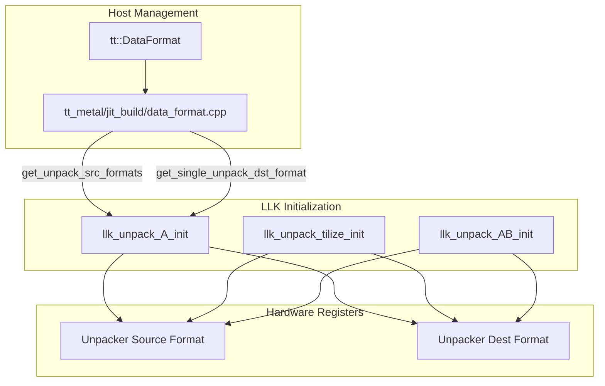
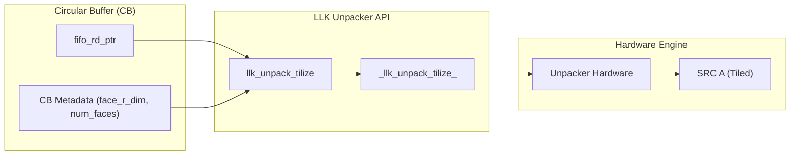

# Data Format Reconfiguration

Relevant source files
*   [tests/tt_metal/tt_metal/llk/sources.cmake](https://github.com/tenstorrent/tt-metal/blob/f30f8df0/tests/tt_metal/tt_metal/llk/sources.cmake)
*   [tests/tt_metal/tt_metal/llk/test_mxfp4_typecast.cpp](https://github.com/tenstorrent/tt-metal/blob/f30f8df0/tests/tt_metal/tt_metal/llk/test_mxfp4_typecast.cpp)
*   [tests/tt_metal/tt_metal/llk/test_mxfp6_typecast.cpp](https://github.com/tenstorrent/tt-metal/blob/f30f8df0/tests/tt_metal/tt_metal/llk/test_mxfp6_typecast.cpp)
*   [tt_metal/api/tt-metalium/mxfp4.hpp](https://github.com/tenstorrent/tt-metal/blob/f30f8df0/tt_metal/api/tt-metalium/mxfp4.hpp)
*   [tt_metal/api/tt-metalium/mxfp6.hpp](https://github.com/tenstorrent/tt-metal/blob/f30f8df0/tt_metal/api/tt-metalium/mxfp6.hpp)
*   [tt_metal/api/tt-metalium/tt_backend_api_types.hpp](https://github.com/tenstorrent/tt-metal/blob/f30f8df0/tt_metal/api/tt-metalium/tt_backend_api_types.hpp)
*   [tt_metal/common/tt_backend_api_types.cpp](https://github.com/tenstorrent/tt-metal/blob/f30f8df0/tt_metal/common/tt_backend_api_types.cpp)
*   [tt_metal/hw/ckernels/blackhole/metal/llk_api/llk_unpack_AB_api.h](https://github.com/tenstorrent/tt-metal/blob/f30f8df0/tt_metal/hw/ckernels/blackhole/metal/llk_api/llk_unpack_AB_api.h)
*   [tt_metal/hw/ckernels/blackhole/metal/llk_api/llk_unpack_AB_matmul_api.h](https://github.com/tenstorrent/tt-metal/blob/f30f8df0/tt_metal/hw/ckernels/blackhole/metal/llk_api/llk_unpack_AB_matmul_api.h)
*   [tt_metal/hw/ckernels/blackhole/metal/llk_api/llk_unpack_AB_reduce_api.h](https://github.com/tenstorrent/tt-metal/blob/f30f8df0/tt_metal/hw/ckernels/blackhole/metal/llk_api/llk_unpack_AB_reduce_api.h)
*   [tt_metal/hw/ckernels/blackhole/metal/llk_api/llk_unpack_A_api.h](https://github.com/tenstorrent/tt-metal/blob/f30f8df0/tt_metal/hw/ckernels/blackhole/metal/llk_api/llk_unpack_A_api.h)
*   [tt_metal/hw/ckernels/blackhole/metal/llk_api/llk_unpack_reduce_api.h](https://github.com/tenstorrent/tt-metal/blob/f30f8df0/tt_metal/hw/ckernels/blackhole/metal/llk_api/llk_unpack_reduce_api.h)
*   [tt_metal/hw/ckernels/blackhole/metal/llk_api/llk_unpack_tilize_api.h](https://github.com/tenstorrent/tt-metal/blob/f30f8df0/tt_metal/hw/ckernels/blackhole/metal/llk_api/llk_unpack_tilize_api.h)
*   [tt_metal/hw/ckernels/wormhole_b0/metal/llk_api/llk_unpack_AB_api.h](https://github.com/tenstorrent/tt-metal/blob/f30f8df0/tt_metal/hw/ckernels/wormhole_b0/metal/llk_api/llk_unpack_AB_api.h)
*   [tt_metal/hw/ckernels/wormhole_b0/metal/llk_api/llk_unpack_AB_matmul_api.h](https://github.com/tenstorrent/tt-metal/blob/f30f8df0/tt_metal/hw/ckernels/wormhole_b0/metal/llk_api/llk_unpack_AB_matmul_api.h)
*   [tt_metal/hw/ckernels/wormhole_b0/metal/llk_api/llk_unpack_AB_reduce_api.h](https://github.com/tenstorrent/tt-metal/blob/f30f8df0/tt_metal/hw/ckernels/wormhole_b0/metal/llk_api/llk_unpack_AB_reduce_api.h)
*   [tt_metal/hw/ckernels/wormhole_b0/metal/llk_api/llk_unpack_A_api.h](https://github.com/tenstorrent/tt-metal/blob/f30f8df0/tt_metal/hw/ckernels/wormhole_b0/metal/llk_api/llk_unpack_A_api.h)
*   [tt_metal/hw/ckernels/wormhole_b0/metal/llk_api/llk_unpack_reduce_api.h](https://github.com/tenstorrent/tt-metal/blob/f30f8df0/tt_metal/hw/ckernels/wormhole_b0/metal/llk_api/llk_unpack_reduce_api.h)
*   [tt_metal/hw/ckernels/wormhole_b0/metal/llk_api/llk_unpack_tilize_api.h](https://github.com/tenstorrent/tt-metal/blob/f30f8df0/tt_metal/hw/ckernels/wormhole_b0/metal/llk_api/llk_unpack_tilize_api.h)
*   [tt_metal/impl/data_format/mx_common.cpp](https://github.com/tenstorrent/tt-metal/blob/f30f8df0/tt_metal/impl/data_format/mx_common.cpp)
*   [tt_metal/impl/data_format/mx_common.hpp](https://github.com/tenstorrent/tt-metal/blob/f30f8df0/tt_metal/impl/data_format/mx_common.hpp)
*   [tt_metal/impl/data_format/mx_tile_pack.hpp](https://github.com/tenstorrent/tt-metal/blob/f30f8df0/tt_metal/impl/data_format/mx_tile_pack.hpp)
*   [tt_metal/impl/data_format/mxfp4.cpp](https://github.com/tenstorrent/tt-metal/blob/f30f8df0/tt_metal/impl/data_format/mxfp4.cpp)
*   [tt_metal/impl/data_format/tile.cpp](https://github.com/tenstorrent/tt-metal/blob/f30f8df0/tt_metal/impl/data_format/tile.cpp)
*   [tt_metal/impl/flatbuffer/base_types.fbs](https://github.com/tenstorrent/tt-metal/blob/f30f8df0/tt_metal/impl/flatbuffer/base_types.fbs)
*   [tt_metal/impl/flatbuffer/base_types_from_flatbuffer.cpp](https://github.com/tenstorrent/tt-metal/blob/f30f8df0/tt_metal/impl/flatbuffer/base_types_from_flatbuffer.cpp)
*   [tt_metal/impl/flatbuffer/base_types_to_flatbuffer.cpp](https://github.com/tenstorrent/tt-metal/blob/f30f8df0/tt_metal/impl/flatbuffer/base_types_to_flatbuffer.cpp)
*   [tt_metal/impl/sources.cmake](https://github.com/tenstorrent/tt-metal/blob/f30f8df0/tt_metal/impl/sources.cmake)
*   [tt_metal/jit_build/data_format.cpp](https://github.com/tenstorrent/tt-metal/blob/f30f8df0/tt_metal/jit_build/data_format.cpp)
*   [tt_metal/sources.cmake](https://github.com/tenstorrent/tt-metal/blob/f30f8df0/tt_metal/sources.cmake)
*   [tt_metal/tt-llk/tests/helpers/include/llk_lib_unpack_wrappers.h](https://github.com/tenstorrent/tt-metal/blob/f30f8df0/tt_metal/tt-llk/tests/helpers/include/llk_lib_unpack_wrappers.h)
*   [tt_metal/tt-llk/tests/python_tests/fuser/fused_operand.py](https://github.com/tenstorrent/tt-metal/blob/f30f8df0/tt_metal/tt-llk/tests/python_tests/fuser/fused_operand.py)
*   [tt_metal/tt-llk/tests/python_tests/fuser/fuser_config_parser.py](https://github.com/tenstorrent/tt-metal/blob/f30f8df0/tt_metal/tt-llk/tests/python_tests/fuser/fuser_config_parser.py)
*   [tt_metal/tt-llk/tests/python_tests/fuser/wormhole/fpu/datacopy.py](https://github.com/tenstorrent/tt-metal/blob/f30f8df0/tt_metal/tt-llk/tests/python_tests/fuser/wormhole/fpu/datacopy.py)
*   [tt_metal/tt-llk/tests/python_tests/fuser/wormhole/unpacker/tilize_a.py](https://github.com/tenstorrent/tt-metal/blob/f30f8df0/tt_metal/tt-llk/tests/python_tests/fuser/wormhole/unpacker/tilize_a.py)
*   [tt_metal/tt-llk/tests/python_tests/fuser_tests/fpu_tilize_a_then_unpack_a.yaml](https://github.com/tenstorrent/tt-metal/blob/f30f8df0/tt_metal/tt-llk/tests/python_tests/fuser_tests/fpu_tilize_a_then_unpack_a.yaml)
*   [tt_metal/tt-llk/tests/python_tests/fuser_tests/fpu_tilize_a_then_unpack_a_num_faces_2.yaml](https://github.com/tenstorrent/tt-metal/blob/f30f8df0/tt_metal/tt-llk/tests/python_tests/fuser_tests/fpu_tilize_a_then_unpack_a_num_faces_2.yaml)
*   [tt_metal/tt-llk/tests/python_tests/fuser_tests/tilize_only_num_faces_2.yaml](https://github.com/tenstorrent/tt-metal/blob/f30f8df0/tt_metal/tt-llk/tests/python_tests/fuser_tests/tilize_only_num_faces_2.yaml)
*   [tt_metal/tt-llk/tests/python_tests/test_tilize_uninit.py](https://github.com/tenstorrent/tt-metal/blob/f30f8df0/tt_metal/tt-llk/tests/python_tests/test_tilize_uninit.py)
*   [tt_metal/tt-llk/tt_llk_blackhole/common/inc/cunpack_common.h](https://github.com/tenstorrent/tt-metal/blob/f30f8df0/tt_metal/tt-llk/tt_llk_blackhole/common/inc/cunpack_common.h)
*   [tt_metal/tt-llk/tt_llk_wormhole_b0/common/inc/cunpack_common.h](https://github.com/tenstorrent/tt-metal/blob/f30f8df0/tt_metal/tt-llk/tt_llk_wormhole_b0/common/inc/cunpack_common.h)
*   [tt_metal/tt-llk/tt_llk_wormhole_b0/llk_lib/llk_unpack_tilize.h](https://github.com/tenstorrent/tt-metal/blob/f30f8df0/tt_metal/tt-llk/tt_llk_wormhole_b0/llk_lib/llk_unpack_tilize.h)

## Purpose and Scope

Data format reconfiguration enables compute kernels within TT-Metalium to dynamically adapt to different data formats and layouts during execution. This capability is critical for handling tensors with varying numerical precisions (e.g., `Float16_b`, `BFloat16`, `Float32`, `Bfp8_b`, and integer formats) and transforming between memory layouts (Row-Major vs. Tiled). Reconfiguration primarily involves programming the Unpacker, Math engine, and Packer hardware units via Low-Level Kernel (LLK) APIs.

This page documents:

*   Supported data formats and hardware precision handling.
*   Implementation of layout transformations (Tilize and Untilize).
*   JIT-build metadata and consistency checks.
*   Data flow from high-level `ttnn` operations to hardware-specific LLK APIs.

Sources: [tt_metal/api/tt-metalium/tt_backend_api_types.hpp 19-24](https://github.com/tenstorrent/tt-metal/blob/f30f8df0/tt_metal/api/tt-metalium/tt_backend_api_types.hpp#L19-L24)[tt_metal/jit_build/data_format.cpp 138-158](https://github.com/tenstorrent/tt-metal/blob/f30f8df0/tt_metal/jit_build/data_format.cpp#L138-L158)

* * *

## Data Format Types and Precision Handling

### Supported Data Formats

The `tt::DataFormat` enum defines the union of all data formats supported across Tenstorrent hardware generations [tt_metal/api/tt-metalium/tt_backend_api_types.hpp 24-52](https://github.com/tenstorrent/tt-metal/blob/f30f8df0/tt_metal/api/tt-metalium/tt_backend_api_types.hpp#L24-L52) Compatibility is checked at runtime based on the target architecture [tt_metal/common/tt_backend_api_types.cpp 119-127](https://github.com/tenstorrent/tt-metal/blob/f30f8df0/tt_metal/common/tt_backend_api_types.cpp#L119-L127)

| Format Category | Examples | Characteristics |
| --- | --- | --- |
| **Floating Point** | `Float32`, `Float16_b`, `Tf32` | Standard IEEE or Brain-float variants. |
| **Block Float** | `Bfp8_b`, `Bfp4_b`, `Bfp2_b` | Shared exponent per 16 elements (face row). |
| **Integer** | `Int32`, `UInt16`, `Int8` | Standard fixed-point types. |
| **Micro-scaling (MX)** | `MxFp8R`, `MxFp4` | Quasar/Blackhole compressed formats [tt_metal/common/tt_backend_api_types.cpp 94-117](https://github.com/tenstorrent/tt-metal/blob/f30f8df0/tt_metal/common/tt_backend_api_types.cpp#L94-L117) |

### Format Consistency and Remapping

The JIT build system performs consistency checks to ensure that all input buffers share the same exponent format (A-family vs B-family) to avoid hardware configuration conflicts [tt_metal/jit_build/data_format.cpp 65-96](https://github.com/tenstorrent/tt-metal/blob/f30f8df0/tt_metal/jit_build/data_format.cpp#L65-L96)

Key remapping logic:

*   **Float32 Unpacking**: If `Float32` is unpacked to a destination register, it may be conditionally remapped to `Float16`, `Float16_b`, or `Tf32` depending on the kernel's `unpack_conditional_dst_format`[tt_metal/jit_build/data_format.cpp 138-153](https://github.com/tenstorrent/tt-metal/blob/f30f8df0/tt_metal/jit_build/data_format.cpp#L138-L153)
*   **MX Formats**: Micro-scaling formats are typically unpacked to `Float16_b` or `Float32` destination formats for computation [tt_metal/jit_build/data_format.cpp 155-158](https://github.com/tenstorrent/tt-metal/blob/f30f8df0/tt_metal/jit_build/data_format.cpp#L155-L158)
*   **Integer Handling**: `UInt8` is remapped to `Int8` at the register-write site because the unpacker's hardware bitfield lacks a unique `UInt8` encoding [tt_metal/jit_build/data_format.cpp 142-144](https://github.com/tenstorrent/tt-metal/blob/f30f8df0/tt_metal/jit_build/data_format.cpp#L142-L144)

Sources: [tt_metal/jit_build/data_format.cpp 18-59](https://github.com/tenstorrent/tt-metal/blob/f30f8df0/tt_metal/jit_build/data_format.cpp#L18-L59)[tt_metal/jit_build/data_format.cpp 138-158](https://github.com/tenstorrent/tt-metal/blob/f30f8df0/tt_metal/jit_build/data_format.cpp#L138-L158)[tt_metal/api/tt-metalium/tt_backend_api_types.hpp 24-52](https://github.com/tenstorrent/tt-metal/blob/f30f8df0/tt_metal/api/tt-metalium/tt_backend_api_types.hpp#L24-L52)

* * *

## Tile Layout Transformations

Tenstorrent hardware operates natively on **Tiles** (typically 32x32 elements). Transforming data between Row-Major and Tile layouts is handled by `Tilize` and `Untilize` operations.

### Tilize (Row-Major to Tile)

Tilize converts row-major memory layouts into the hardware-native tile format. This is often implemented as a fused operation in the unpacker.

*   **Unpacker Initialization**: `llk_unpack_tilize_init` configures the unpacker based on circular buffer (CB) metadata, including face row dimensions and narrow-tile flags [tt_metal/hw/ckernels/blackhole/metal/llk_api/llk_unpack_tilize_api.h 21-28](https://github.com/tenstorrent/tt-metal/blob/f30f8df0/tt_metal/hw/ckernels/blackhole/metal/llk_api/llk_unpack_tilize_api.h#L21-L28)
*   **Block Processing**: `llk_unpack_tilize_block` iterates through a contiguous block of tiles, calling `llk_unpack_tilize` for each [tt_metal/hw/ckernels/blackhole/metal/llk_api/llk_unpack_tilize_api.h 78-85](https://github.com/tenstorrent/tt-metal/blob/f30f8df0/tt_metal/hw/ckernels/blackhole/metal/llk_api/llk_unpack_tilize_api.h#L78-L85)
*   **Fused Tilize-A/Unpack-B**: The hardware supports a combined operation where Operand A is tilized while Operand B is unpacked normally, typically used in matmul or element-wise ops [tt_metal/hw/ckernels/wormhole_b0/metal/llk_api/llk_unpack_tilize_api.h 134-161](https://github.com/tenstorrent/tt-metal/blob/f30f8df0/tt_metal/hw/ckernels/wormhole_b0/metal/llk_api/llk_unpack_tilize_api.h#L134-L161)

### Untilize (Tile to Row-Major)

Untilize performs the inverse transformation.

*   **Packer Configuration**: Kernels use specific LLK APIs to configure the packer to output row-major data directly from the DST registers.
*   **Data Alignment**: The transformation logic accounts for `face_r_dim` and `num_faces` to ensure correct spatial reconstruction [tt_metal/hw/ckernels/blackhole/metal/llk_api/llk_unpack_tilize_api.h 50-69](https://github.com/tenstorrent/tt-metal/blob/f30f8df0/tt_metal/hw/ckernels/blackhole/metal/llk_api/llk_unpack_tilize_api.h#L50-L69)

Sources: [tt_metal/hw/ckernels/blackhole/metal/llk_api/llk_unpack_tilize_api.h 21-85](https://github.com/tenstorrent/tt-metal/blob/f30f8df0/tt_metal/hw/ckernels/blackhole/metal/llk_api/llk_unpack_tilize_api.h#L21-L85)[tt_metal/hw/ckernels/wormhole_b0/metal/llk_api/llk_unpack_tilize_api.h 134-161](https://github.com/tenstorrent/tt-metal/blob/f30f8df0/tt_metal/hw/ckernels/wormhole_b0/metal/llk_api/llk_unpack_tilize_api.h#L134-L161)

* * *

## Code Entity Mapping

The following diagrams illustrate the relationship between high-level data format specifications and the underlying LLK implementation.

### Data Format Configuration Flow

Sources: [tt_metal/jit_build/data_format.cpp 122-136](https://github.com/tenstorrent/tt-metal/blob/f30f8df0/tt_metal/jit_build/data_format.cpp#L122-L136)[tt_metal/hw/ckernels/wormhole_b0/metal/llk_api/llk_unpack_A_api.h 18-41](https://github.com/tenstorrent/tt-metal/blob/f30f8df0/tt_metal/hw/ckernels/wormhole_b0/metal/llk_api/llk_unpack_A_api.h#L18-L41)[tt_metal/hw/ckernels/blackhole/metal/llk_api/llk_unpack_tilize_api.h 21-28](https://github.com/tenstorrent/tt-metal/blob/f30f8df0/tt_metal/hw/ckernels/blackhole/metal/llk_api/llk_unpack_tilize_api.h#L21-L28)




Sources: [tt_metal/jit_build/data_format.cpp:122-136](), [tt_metal/hw/ckernels/wormhole_b0/metal/llk_api/llk_unpack_A_api.h:18-41](), [tt_metal/hw/ckernels/blackhole/metal/llk_api/llk_unpack_tilize_api.h:21-28]()
```
### Tilize Operation Logic

Sources: [tt_metal/hw/ckernels/blackhole/metal/llk_api/llk_unpack_tilize_api.h 50-69](https://github.com/tenstorrent/tt-metal/blob/f30f8df0/tt_metal/hw/ckernels/blackhole/metal/llk_api/llk_unpack_tilize_api.h#L50-L69)[tt_metal/hw/ckernels/wormhole_b0/metal/llk_api/llk_unpack_tilize_api.h 52-72](https://github.com/tenstorrent/tt-metal/blob/f30f8df0/tt_metal/hw/ckernels/wormhole_b0/metal/llk_api/llk_unpack_tilize_api.h#L52-L72)

* * *




Sources: [tt_metal/hw/ckernels/blackhole/metal/llk_api/llk_unpack_tilize_api.h:50-69](), [tt_metal/hw/ckernels/wormhole_b0/metal/llk_api/llk_unpack_tilize_api.h:52-72]()

---
```
## Implementation Details

### Tile Size and Memory Footprint

Tile size in bytes is strictly defined by the `DataFormat`. This calculation is critical for buffer allocation and NOC (Network-on-Chip) transfers [tt_metal/api/tt-metalium/tt_backend_api_types.hpp 113-144](https://github.com/tenstorrent/tt-metal/blob/f30f8df0/tt_metal/api/tt-metalium/tt_backend_api_types.hpp#L113-L144)

| Data Format | Bytes per Tile (32x32) | Formula / Notes |
| --- | --- | --- |
| `Float32` | 4096 | 1024 elements * 4 bytes |
| `Float16` | 2048 | 1024 elements * 2 bytes |
| `Bfp8` | 1088 | (256 * 4) data + (16 * 4) exponents |
| `MxFp4` | 544 | 512 data + 32 scales |
| `Int8` | 1024 | 1024 elements * 1 byte |

Sources: [tt_metal/api/tt-metalium/tt_backend_api_types.hpp 113-144](https://github.com/tenstorrent/tt-metal/blob/f30f8df0/tt_metal/api/tt-metalium/tt_backend_api_types.hpp#L113-L144)

### LLK API Specializations

The LLK APIs are specialized per architecture (e.g., `wormhole_b0`, `blackhole`) to handle differences in hardware capabilities.

*   **Wormhole B0**: Includes support for `llk_unpack_AB_matmul_init` which handles partial faces and different tile dimensions (`ct_dim`, `rt_dim`, `kt_dim`) [tt_metal/hw/ckernels/wormhole_b0/metal/llk_api/llk_unpack_AB_matmul_api.h 13-55](https://github.com/tenstorrent/tt-metal/blob/f30f8df0/tt_metal/hw/ckernels/wormhole_b0/metal/llk_api/llk_unpack_AB_matmul_api.h#L13-L55)
*   **Blackhole**: Extends support to newer formats like `Fp8_e4m3` and provides specialized unpackers for reduction operations [tt_metal/common/tt_backend_api_types.cpp 87](https://github.com/tenstorrent/tt-metal/blob/f30f8df0/tt_metal/common/tt_backend_api_types.cpp#L87-L87)[tt_metal/hw/ckernels/blackhole/metal/llk_api/llk_unpack_tilize_api.h 1-10](https://github.com/tenstorrent/tt-metal/blob/f30f8df0/tt_metal/hw/ckernels/blackhole/metal/llk_api/llk_unpack_tilize_api.h#L1-L10)

Sources: [tt_metal/hw/ckernels/wormhole_b0/metal/llk_api/llk_unpack_AB_matmul_api.h 13-55](https://github.com/tenstorrent/tt-metal/blob/f30f8df0/tt_metal/hw/ckernels/wormhole_b0/metal/llk_api/llk_unpack_AB_matmul_api.h#L13-L55)[tt_metal/common/tt_backend_api_types.cpp 87-91](https://github.com/tenstorrent/tt-metal/blob/f30f8df0/tt_metal/common/tt_backend_api_types.cpp#L87-L91)

Dismiss
Refresh this wiki

Enter email to refresh
