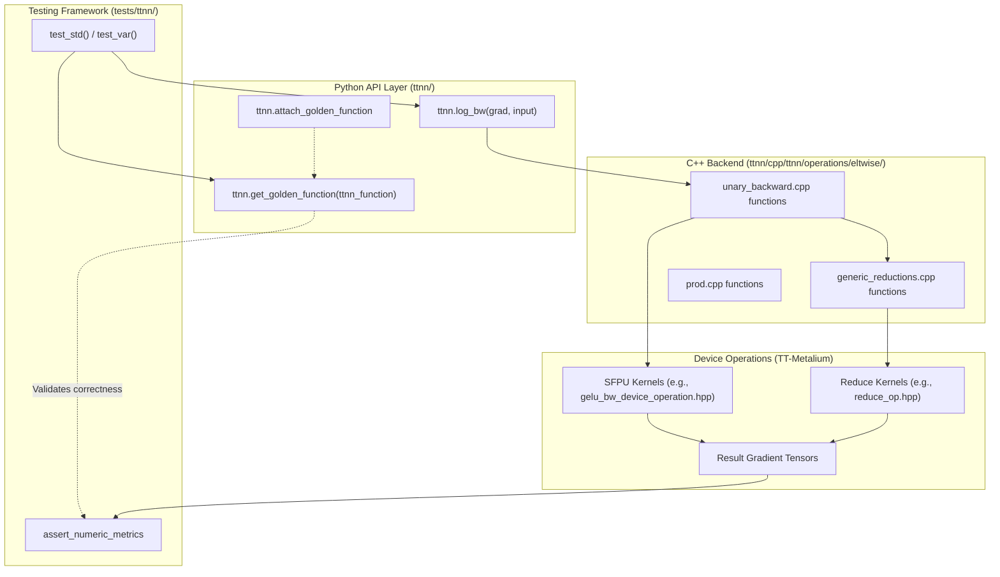
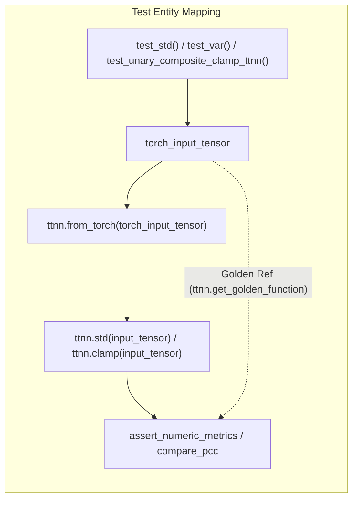

# Backward Operations and Autograd

Relevant source files
*   [tests/tt_eager/python_api_testing/sweep_tests/pytests/tt_dnn/test_prod.py](https://github.com/tenstorrent/tt-metal/blob/f30f8df0/tests/tt_eager/python_api_testing/sweep_tests/pytests/tt_dnn/test_prod.py)
*   [tests/tt_eager/python_api_testing/sweep_tests/pytorch_ops.py](https://github.com/tenstorrent/tt-metal/blob/f30f8df0/tests/tt_eager/python_api_testing/sweep_tests/pytorch_ops.py)
*   [tests/tt_eager/python_api_testing/sweep_tests/tt_lib_ops.py](https://github.com/tenstorrent/tt-metal/blob/f30f8df0/tests/tt_eager/python_api_testing/sweep_tests/tt_lib_ops.py)
*   [tests/tt_eager/python_api_testing/unit_testing/misc/test_average_pool.py](https://github.com/tenstorrent/tt-metal/blob/f30f8df0/tests/tt_eager/python_api_testing/unit_testing/misc/test_average_pool.py)
*   [tests/tt_eager/python_api_testing/unit_testing/misc/test_padding_test.py](https://github.com/tenstorrent/tt-metal/blob/f30f8df0/tests/tt_eager/python_api_testing/unit_testing/misc/test_padding_test.py)
*   [tests/ttnn/unit_tests/operations/eltwise/test_composite.py](https://github.com/tenstorrent/tt-metal/blob/f30f8df0/tests/ttnn/unit_tests/operations/eltwise/test_composite.py)
*   [tests/ttnn/unit_tests/operations/eltwise/test_div_ops.py](https://github.com/tenstorrent/tt-metal/blob/f30f8df0/tests/ttnn/unit_tests/operations/eltwise/test_div_ops.py)
*   [tests/ttnn/unit_tests/operations/eltwise/test_gcd.py](https://github.com/tenstorrent/tt-metal/blob/f30f8df0/tests/ttnn/unit_tests/operations/eltwise/test_gcd.py)
*   [tests/ttnn/unit_tests/operations/eltwise/test_math.py](https://github.com/tenstorrent/tt-metal/blob/f30f8df0/tests/ttnn/unit_tests/operations/eltwise/test_math.py)
*   [tests/ttnn/unit_tests/operations/eltwise/test_remainder.py](https://github.com/tenstorrent/tt-metal/blob/f30f8df0/tests/ttnn/unit_tests/operations/eltwise/test_remainder.py)
*   [tests/ttnn/unit_tests/operations/eltwise/test_unary.py](https://github.com/tenstorrent/tt-metal/blob/f30f8df0/tests/ttnn/unit_tests/operations/eltwise/test_unary.py)
*   [tests/ttnn/unit_tests/operations/reduce/test_reduction.py](https://github.com/tenstorrent/tt-metal/blob/f30f8df0/tests/ttnn/unit_tests/operations/reduce/test_reduction.py)
*   [tt_metal/hw/ckernels/blackhole/metal/llk_api/llk_sfpu/ckernel_sfpu_lgamma.h](https://github.com/tenstorrent/tt-metal/blob/f30f8df0/tt_metal/hw/ckernels/blackhole/metal/llk_api/llk_sfpu/ckernel_sfpu_lgamma.h)
*   [tt_metal/hw/ckernels/blackhole/metal/llk_api/llk_sfpu/llk_math_eltwise_sfpu_lgamma.h](https://github.com/tenstorrent/tt-metal/blob/f30f8df0/tt_metal/hw/ckernels/blackhole/metal/llk_api/llk_sfpu/llk_math_eltwise_sfpu_lgamma.h)
*   [tt_metal/hw/ckernels/blackhole/metal/llk_api/llk_sfpu_types.h](https://github.com/tenstorrent/tt-metal/blob/f30f8df0/tt_metal/hw/ckernels/blackhole/metal/llk_api/llk_sfpu_types.h)
*   [tt_metal/hw/ckernels/wormhole_b0/metal/llk_api/llk_sfpu/ckernel_sfpu_lgamma.h](https://github.com/tenstorrent/tt-metal/blob/f30f8df0/tt_metal/hw/ckernels/wormhole_b0/metal/llk_api/llk_sfpu/ckernel_sfpu_lgamma.h)
*   [tt_metal/hw/ckernels/wormhole_b0/metal/llk_api/llk_sfpu/llk_math_eltwise_sfpu_lgamma.h](https://github.com/tenstorrent/tt-metal/blob/f30f8df0/tt_metal/hw/ckernels/wormhole_b0/metal/llk_api/llk_sfpu/llk_math_eltwise_sfpu_lgamma.h)
*   [tt_metal/hw/ckernels/wormhole_b0/metal/llk_api/llk_sfpu_types.h](https://github.com/tenstorrent/tt-metal/blob/f30f8df0/tt_metal/hw/ckernels/wormhole_b0/metal/llk_api/llk_sfpu_types.h)
*   [tt_metal/hw/inc/api/compute/eltwise_unary/lgamma.h](https://github.com/tenstorrent/tt-metal/blob/f30f8df0/tt_metal/hw/inc/api/compute/eltwise_unary/lgamma.h)
*   [ttnn/cpp/ttnn/operations/eltwise/unary/common/unary_op_types.hpp](https://github.com/tenstorrent/tt-metal/blob/f30f8df0/ttnn/cpp/ttnn/operations/eltwise/unary/common/unary_op_types.hpp)
*   [ttnn/cpp/ttnn/operations/eltwise/unary/common/unary_op_utils.cpp](https://github.com/tenstorrent/tt-metal/blob/f30f8df0/ttnn/cpp/ttnn/operations/eltwise/unary/common/unary_op_utils.cpp)
*   [ttnn/cpp/ttnn/operations/eltwise/unary/common/unary_op_utils.hpp](https://github.com/tenstorrent/tt-metal/blob/f30f8df0/ttnn/cpp/ttnn/operations/eltwise/unary/common/unary_op_utils.hpp)
*   [ttnn/cpp/ttnn/operations/eltwise/unary/device/kernels/compute/eltwise_sfpu.cpp](https://github.com/tenstorrent/tt-metal/blob/f30f8df0/ttnn/cpp/ttnn/operations/eltwise/unary/device/kernels/compute/eltwise_sfpu.cpp)
*   [ttnn/cpp/ttnn/operations/eltwise/unary/device/kernels/compute/lgamma_fast_kernel.cpp](https://github.com/tenstorrent/tt-metal/blob/f30f8df0/ttnn/cpp/ttnn/operations/eltwise/unary/device/kernels/compute/lgamma_fast_kernel.cpp)
*   [ttnn/cpp/ttnn/operations/eltwise/unary/device/kernels/compute/lgamma_kernel.cpp](https://github.com/tenstorrent/tt-metal/blob/f30f8df0/ttnn/cpp/ttnn/operations/eltwise/unary/device/kernels/compute/lgamma_kernel.cpp)
*   [ttnn/cpp/ttnn/operations/eltwise/unary/device/unary_composite_op.cpp](https://github.com/tenstorrent/tt-metal/blob/f30f8df0/ttnn/cpp/ttnn/operations/eltwise/unary/device/unary_composite_op.cpp)
*   [ttnn/cpp/ttnn/operations/eltwise/unary/device/unary_composite_op.hpp](https://github.com/tenstorrent/tt-metal/blob/f30f8df0/ttnn/cpp/ttnn/operations/eltwise/unary/device/unary_composite_op.hpp)
*   [ttnn/cpp/ttnn/operations/eltwise/unary/device/unary_device_operation.cpp](https://github.com/tenstorrent/tt-metal/blob/f30f8df0/ttnn/cpp/ttnn/operations/eltwise/unary/device/unary_device_operation.cpp)
*   [ttnn/cpp/ttnn/operations/eltwise/unary/device/unary_device_operation.hpp](https://github.com/tenstorrent/tt-metal/blob/f30f8df0/ttnn/cpp/ttnn/operations/eltwise/unary/device/unary_device_operation.hpp)
*   [ttnn/cpp/ttnn/operations/eltwise/unary/device/unary_program_factory.cpp](https://github.com/tenstorrent/tt-metal/blob/f30f8df0/ttnn/cpp/ttnn/operations/eltwise/unary/device/unary_program_factory.cpp)
*   [ttnn/cpp/ttnn/operations/eltwise/unary/unary.cpp](https://github.com/tenstorrent/tt-metal/blob/f30f8df0/ttnn/cpp/ttnn/operations/eltwise/unary/unary.cpp)
*   [ttnn/cpp/ttnn/operations/eltwise/unary/unary.hpp](https://github.com/tenstorrent/tt-metal/blob/f30f8df0/ttnn/cpp/ttnn/operations/eltwise/unary/unary.hpp)
*   [ttnn/cpp/ttnn/operations/eltwise/unary/unary_composite.hpp](https://github.com/tenstorrent/tt-metal/blob/f30f8df0/ttnn/cpp/ttnn/operations/eltwise/unary/unary_composite.hpp)
*   [ttnn/cpp/ttnn/operations/eltwise/unary_backward/unary_backward.cpp](https://github.com/tenstorrent/tt-metal/blob/f30f8df0/ttnn/cpp/ttnn/operations/eltwise/unary_backward/unary_backward.cpp)
*   [ttnn/cpp/ttnn/operations/eltwise/unary_backward/unary_backward.hpp](https://github.com/tenstorrent/tt-metal/blob/f30f8df0/ttnn/cpp/ttnn/operations/eltwise/unary_backward/unary_backward.hpp)
*   [ttnn/cpp/ttnn/operations/reduction/generic/generic_reductions.cpp](https://github.com/tenstorrent/tt-metal/blob/f30f8df0/ttnn/cpp/ttnn/operations/reduction/generic/generic_reductions.cpp)
*   [ttnn/cpp/ttnn/operations/reduction/generic/generic_reductions.hpp](https://github.com/tenstorrent/tt-metal/blob/f30f8df0/ttnn/cpp/ttnn/operations/reduction/generic/generic_reductions.hpp)
*   [ttnn/cpp/ttnn/operations/reduction/prod/device/prod_all_device_operation.cpp](https://github.com/tenstorrent/tt-metal/blob/f30f8df0/ttnn/cpp/ttnn/operations/reduction/prod/device/prod_all_device_operation.cpp)
*   [ttnn/cpp/ttnn/operations/reduction/prod/device/prod_all_device_operation.hpp](https://github.com/tenstorrent/tt-metal/blob/f30f8df0/ttnn/cpp/ttnn/operations/reduction/prod/device/prod_all_device_operation.hpp)
*   [ttnn/cpp/ttnn/operations/reduction/prod/device/prod_all_device_operation_types.hpp](https://github.com/tenstorrent/tt-metal/blob/f30f8df0/ttnn/cpp/ttnn/operations/reduction/prod/device/prod_all_device_operation_types.hpp)
*   [ttnn/cpp/ttnn/operations/reduction/prod/device/prod_nc_device_operation.cpp](https://github.com/tenstorrent/tt-metal/blob/f30f8df0/ttnn/cpp/ttnn/operations/reduction/prod/device/prod_nc_device_operation.cpp)
*   [ttnn/cpp/ttnn/operations/reduction/prod/device/prod_nc_device_operation.hpp](https://github.com/tenstorrent/tt-metal/blob/f30f8df0/ttnn/cpp/ttnn/operations/reduction/prod/device/prod_nc_device_operation.hpp)
*   [ttnn/cpp/ttnn/operations/reduction/prod/device/prod_nc_device_operation_types.hpp](https://github.com/tenstorrent/tt-metal/blob/f30f8df0/ttnn/cpp/ttnn/operations/reduction/prod/device/prod_nc_device_operation_types.hpp)
*   [ttnn/cpp/ttnn/operations/reduction/prod/device/prod_nc_op.cpp](https://github.com/tenstorrent/tt-metal/blob/f30f8df0/ttnn/cpp/ttnn/operations/reduction/prod/device/prod_nc_op.cpp)
*   [ttnn/cpp/ttnn/operations/reduction/prod/device/prod_nc_op.hpp](https://github.com/tenstorrent/tt-metal/blob/f30f8df0/ttnn/cpp/ttnn/operations/reduction/prod/device/prod_nc_op.hpp)
*   [ttnn/cpp/ttnn/operations/reduction/prod/device/prod_op_all.cpp](https://github.com/tenstorrent/tt-metal/blob/f30f8df0/ttnn/cpp/ttnn/operations/reduction/prod/device/prod_op_all.cpp)
*   [ttnn/cpp/ttnn/operations/reduction/prod/device/prod_op_all.hpp](https://github.com/tenstorrent/tt-metal/blob/f30f8df0/ttnn/cpp/ttnn/operations/reduction/prod/device/prod_op_all.hpp)
*   [ttnn/cpp/ttnn/operations/reduction/prod/prod.cpp](https://github.com/tenstorrent/tt-metal/blob/f30f8df0/ttnn/cpp/ttnn/operations/reduction/prod/prod.cpp)
*   [ttnn/cpp/ttnn/operations/reduction/prod/prod.hpp](https://github.com/tenstorrent/tt-metal/blob/f30f8df0/ttnn/cpp/ttnn/operations/reduction/prod/prod.hpp)
*   [ttnn/tt_lib/fused_ops/average_pool.py](https://github.com/tenstorrent/tt-metal/blob/f30f8df0/ttnn/tt_lib/fused_ops/average_pool.py)
*   [ttnn/ttnn/operations/binary.py](https://github.com/tenstorrent/tt-metal/blob/f30f8df0/ttnn/ttnn/operations/binary.py)

## Purpose and Scope

This document describes TTNN's backward operation system for computing gradients during neural network training. Backward operations (suffixed with `_bw`) implement the gradient computation for corresponding forward operations, enabling automatic differentiation and backpropagation. These operations are implemented as C++ device operations and exposed via Python with corresponding "golden functions" for PyTorch-based validation.

For information about forward operations, see [Neural Network Operations (TTNN)](https://deepwiki.com/tenstorrent/tt-metal/4-neural-network-operations-(ttnn)). For tensor abstractions and memory management, see [Tensor Operations and Memory Management](https://deepwiki.com/tenstorrent/tt-metal/4.3-tensor-operations-and-memory-management).

## Overview

TTNN provides backward operations for gradient computation in neural network training. Each backward operation computes the gradient of a loss function with respect to the operation's inputs, given the gradient flowing back from subsequent layers. The system implements unary (single input), binary (two inputs), and ternary (three inputs) backward operations.

**Key characteristics:**

*   **Automatic differentiation**: Computes gradients for backpropagation without manual derivative implementation.
*   **Golden function validation**: Each backward operation has a corresponding PyTorch reference implementation in Python to ensure numerical parity [tests/ttnn/unit_tests/operations/eltwise/test_unary.py 57-58](https://github.com/tenstorrent/tt-metal/blob/f30f8df0/tests/ttnn/unit_tests/operations/eltwise/test_unary.py#L57-L58)
*   **Memory Configuration**: Operations support specifying `MemoryConfig` to control whether result gradients are stored in L1 or DRAM [ttnn/cpp/ttnn/operations/eltwise/unary_backward/unary_backward.cpp 40-43](https://github.com/tenstorrent/tt-metal/blob/f30f8df0/ttnn/cpp/ttnn/operations/eltwise/unary_backward/unary_backward.cpp#L40-L43)
*   **Complex number support**: Specialized implementations exist for complex-valued tensors such as `reciprocal` for `ComplexTensor`[ttnn/cpp/ttnn/operations/eltwise/unary/unary.cpp 73-84](https://github.com/tenstorrent/tt-metal/blob/f30f8df0/ttnn/cpp/ttnn/operations/eltwise/unary/unary.cpp#L73-L84)

**Sources:**[ttnn/cpp/ttnn/operations/eltwise/unary_backward/unary_backward.cpp 35-63](https://github.com/tenstorrent/tt-metal/blob/f30f8df0/ttnn/cpp/ttnn/operations/eltwise/unary_backward/unary_backward.cpp#L35-L63)[tests/ttnn/unit_tests/operations/eltwise/test_unary.py 57-58](https://github.com/tenstorrent/tt-metal/blob/f30f8df0/tests/ttnn/unit_tests/operations/eltwise/test_unary.py#L57-L58)[ttnn/cpp/ttnn/operations/eltwise/unary/unary.cpp 73-84](https://github.com/tenstorrent/tt-metal/blob/f30f8df0/ttnn/cpp/ttnn/operations/eltwise/unary/unary.cpp#L73-L84)

## Backward Operation Architecture

**Diagram: Backward Operation Invocation and Validation Flow**

Backward operations follow a consistent architectural pattern:

1.   **Python API**: User invokes `ttnn.operation_bw` with gradient and original inputs.
2.   **C++ Backend**: Implementation logic resides in `unary_backward.cpp` for element-wise operations [ttnn/cpp/ttnn/operations/eltwise/unary_backward/unary_backward.cpp 35-63](https://github.com/tenstorrent/tt-metal/blob/f30f8df0/ttnn/cpp/ttnn/operations/eltwise/unary_backward/unary_backward.cpp#L35-L63) or `generic_reductions.cpp` for reduction operations [ttnn/cpp/ttnn/operations/reduction/generic/generic_reductions.cpp 31-40](https://github.com/tenstorrent/tt-metal/blob/f30f8df0/ttnn/cpp/ttnn/operations/reduction/generic/generic_reductions.cpp#L31-L40) These functions often compose other ttnn operations or lower-level `prim` operations. For example, `clamp_bw` uses `ttnn::ge`, `ttnn::le`, `ttnn::logical_and`, and `ttnn::multiply`[ttnn/cpp/ttnn/operations/eltwise/unary_backward/unary_backward.cpp 57-60](https://github.com/tenstorrent/tt-metal/blob/f30f8df0/ttnn/cpp/ttnn/operations/eltwise/unary_backward/unary_backward.cpp#L57-L60)
3.   **Golden function**: PyTorch reference implementation is attached via `ttnn.attach_golden_function`[tests/ttnn/unit_tests/operations/eltwise/test_unary.py 57-58](https://github.com/tenstorrent/tt-metal/blob/f30f8df0/tests/ttnn/unit_tests/operations/eltwise/test_unary.py#L57-L58) and used to validate correctness during testing [tests/ttnn/unit_tests/operations/reduce/test_reduction.py 26-27](https://github.com/tenstorrent/tt-metal/blob/f30f8df0/tests/ttnn/unit_tests/operations/reduce/test_reduction.py#L26-L27)
4.   **Unit Testing**: Automated tests generate random shapes and dtypes, comparing device results against golden functions using PCC (Pearson Correlation Coefficient) or ULP (Unit in the Last Place) [tests/ttnn/unit_tests/operations/reduce/test_reduction.py 52-59](https://github.com/tenstorrent/tt-metal/blob/f30f8df0/tests/ttnn/unit_tests/operations/reduce/test_reduction.py#L52-L59)

**Sources:**[ttnn/cpp/ttnn/operations/eltwise/unary_backward/unary_backward.cpp 35-63](https://github.com/tenstorrent/tt-metal/blob/f30f8df0/ttnn/cpp/ttnn/operations/eltwise/unary_backward/unary_backward.cpp#L35-L63)[ttnn/cpp/ttnn/operations/reduction/generic/generic_reductions.cpp 31-40](https://github.com/tenstorrent/tt-metal/blob/f30f8df0/ttnn/cpp/ttnn/operations/reduction/generic/generic_reductions.cpp#L31-L40)[tests/ttnn/unit_tests/operations/eltwise/test_unary.py 57-58](https://github.com/tenstorrent/tt-metal/blob/f30f8df0/tests/ttnn/unit_tests/operations/eltwise/test_unary.py#L57-L58)[tests/ttnn/unit_tests/operations/reduce/test_reduction.py 52-59](https://github.com/tenstorrent/tt-metal/blob/f30f8df0/tests/ttnn/unit_tests/operations/reduce/test_reduction.py#L52-L59)




**Diagram: Backward Operation Invocation and Validation Flow**

Backward operations follow a consistent architectural pattern:

1.  **Python API**: User invokes `ttnn.operation_bw` with gradient and original inputs.
2.  **C++ Backend**: Implementation logic resides in `unary_backward.cpp` for element-wise operations [ttnn/cpp/ttnn/operations/eltwise/unary_backward/unary_backward.cpp:35-63]() or `generic_reductions.cpp` for reduction operations [ttnn/cpp/ttnn/operations/reduction/generic/generic_reductions.cpp:31-40](). These functions often compose other ttnn operations or lower-level `prim` operations. For example, `clamp_bw` uses `ttnn::ge`, `ttnn::le`, `ttnn::logical_and`, and `ttnn::multiply` [ttnn/cpp/ttnn/operations/eltwise/unary_backward/unary_backward.cpp:57-60]().
3.  **Golden function**: PyTorch reference implementation is attached via `ttnn.attach_golden_function` [tests/ttnn/unit_tests/operations/eltwise/test_unary.py:57-58]() and used to validate correctness during testing [tests/ttnn/unit_tests/operations/reduce/test_reduction.py:26-27]().
4.  **Unit Testing**: Automated tests generate random shapes and dtypes, comparing device results against golden functions using PCC (Pearson Correlation Coefficient) or ULP (Unit in the Last Place) [tests/ttnn/unit_tests/operations/reduce/test_reduction.py:52-59]().
```
## Unary Backward Operations

Unary backward operations compute gradients for single-input operations. They take the gradient tensor from the next layer and the original input tensor, returning a vector containing the gradient with respect to the input.

### Common Implementation Patterns

**Conditional Logic (Masking)**: Operations like `clamp_bw` or `threshold_bw` use conditional logic to mask gradients based on input values.

*   **`clamp_bw`**: Uses `ttnn::ge`, `ttnn::le`, `ttnn::logical_and`, and `ttnn::multiply` to determine where the input was within the min/max bounds [ttnn/cpp/ttnn/operations/eltwise/unary_backward/unary_backward.cpp 57-60](https://github.com/tenstorrent/tt-metal/blob/f30f8df0/ttnn/cpp/ttnn/operations/eltwise/unary_backward/unary_backward.cpp#L57-L60)
*   **`threshold_bw`**: Uses `ttnn::gtz` and `ttnn::where` to set gradients to zero where the input was below the threshold [ttnn/cpp/ttnn/operations/eltwise/unary_backward/unary_backward.cpp 140-144](https://github.com/tenstorrent/tt-metal/blob/f30f8df0/ttnn/cpp/ttnn/operations/eltwise/unary_backward/unary_backward.cpp#L140-L144)

**Mathematical Derivatives**:

*   **`softplus_bw`**: Involves `ttnn::multiply`, `ttnn::exp`, `ttnn::add`, and `ttnn::reciprocal` to compute the derivative of softplus [ttnn/cpp/ttnn/operations/eltwise/unary_backward/unary_backward.cpp 157-164](https://github.com/tenstorrent/tt-metal/blob/f30f8df0/ttnn/cpp/ttnn/operations/eltwise/unary_backward/unary_backward.cpp#L157-L164)
*   **`hardtanh_bw`**: Uses `ttnn::where`, `ttnn::le`, and `ttnn::ge` to zero out gradients outside the `[min, max]` range [ttnn/cpp/ttnn/operations/eltwise/unary_backward/unary_backward.cpp 122-126](https://github.com/tenstorrent/tt-metal/blob/f30f8df0/ttnn/cpp/ttnn/operations/eltwise/unary_backward/unary_backward.cpp#L122-L126)

**SFPU Integration**: The C++ backend maps high-level operations to SFPU kernels. For example, `gelu_bw` uses a dedicated device operation `GeluBackward`[ttnn/cpp/ttnn/operations/eltwise/unary_backward/unary_backward.cpp 23](https://github.com/tenstorrent/tt-metal/blob/f30f8df0/ttnn/cpp/ttnn/operations/eltwise/unary_backward/unary_backward.cpp#L23-L23) The `UnaryOpType` enum [ttnn/cpp/ttnn/operations/eltwise/unary/common/unary_op_types.hpp 20-137](https://github.com/tenstorrent/tt-metal/blob/f30f8df0/ttnn/cpp/ttnn/operations/eltwise/unary/common/unary_op_types.hpp#L20-L137) defines the various unary operations supported, which are then mapped to specific SFPU macros in `get_macro_definition`[ttnn/cpp/ttnn/operations/eltwise/unary/common/unary_op_utils.cpp 18-108](https://github.com/tenstorrent/tt-metal/blob/f30f8df0/ttnn/cpp/ttnn/operations/eltwise/unary/common/unary_op_utils.cpp#L18-L108)

**Sources:**[ttnn/cpp/ttnn/operations/eltwise/unary_backward/unary_backward.cpp 57-60](https://github.com/tenstorrent/tt-metal/blob/f30f8df0/ttnn/cpp/ttnn/operations/eltwise/unary_backward/unary_backward.cpp#L57-L60)[ttnn/cpp/ttnn/operations/eltwise/unary_backward/unary_backward.cpp 140-144](https://github.com/tenstorrent/tt-metal/blob/f30f8df0/ttnn/cpp/ttnn/operations/eltwise/unary_backward/unary_backward.cpp#L140-L144)[ttnn/cpp/ttnn/operations/eltwise/unary_backward/unary_backward.cpp 157-164](https://github.com/tenstorrent/tt-metal/blob/f30f8df0/ttnn/cpp/ttnn/operations/eltwise/unary_backward/unary_backward.cpp#L157-L164)[ttnn/cpp/ttnn/operations/eltwise/unary_backward/unary_backward.cpp 122-126](https://github.com/tenstorrent/tt-metal/blob/f30f8df0/ttnn/cpp/ttnn/operations/eltwise/unary_backward/unary_backward.cpp#L122-L126)[ttnn/cpp/ttnn/operations/eltwise/unary_backward/unary_backward.cpp 23](https://github.com/tenstorrent/tt-metal/blob/f30f8df0/ttnn/cpp/ttnn/operations/eltwise/unary_backward/unary_backward.cpp#L23-L23)[ttnn/cpp/ttnn/operations/eltwise/unary/common/unary_op_types.hpp 20-137](https://github.com/tenstorrent/tt-metal/blob/f30f8df0/ttnn/cpp/ttnn/operations/eltwise/unary/common/unary_op_types.hpp#L20-L137)[ttnn/cpp/ttnn/operations/eltwise/unary/common/unary_op_utils.cpp 18-108](https://github.com/tenstorrent/tt-metal/blob/f30f8df0/ttnn/cpp/ttnn/operations/eltwise/unary/common/unary_op_utils.cpp#L18-L108)

## Reduction Backward Operations

Reduction operations like `mean`, `std`, `var`, `sum`, `max`, `min`, and `prod` also have backward implementations. These often involve broadcasting the incoming gradient and multiplying it by the derivative of the reduction.

### `reduce` Function

The core `reduce` function [ttnn/cpp/ttnn/operations/reduction/generic/generic_reductions.cpp 31-40](https://github.com/tenstorrent/tt-metal/blob/f30f8df0/ttnn/cpp/ttnn/operations/reduction/generic/generic_reductions.cpp#L31-L40) handling various reduction types handles `ReduceType::Sum`, `ReduceType::Max`, `ReduceType::Min`, `ReduceType::Mean`, `ReduceType::Var`, and `ReduceType::Std`. It dispatches to specialized device operations based on the reduction type and dimension.

**Diagram: Generic Reduction Dispatch Flow**

*   **`reduce_impl`**: The main implementation for most reductions, handling padding, scalar application, and dispatching to `ttnn::prim::reduce`[ttnn/cpp/ttnn/operations/reduction/generic/generic_reductions.cpp 109-122](https://github.com/tenstorrent/tt-metal/blob/f30f8df0/ttnn/cpp/ttnn/operations/reduction/generic/generic_reductions.cpp#L109-L122)
*   **`prod`**: Handled separately due to its multiplicative nature, with `compute_prod_all` and `compute_prod_nc` for different reduction scenarios [ttnn/cpp/ttnn/operations/reduction/prod/prod.cpp 22-62](https://github.com/tenstorrent/tt-metal/blob/f30f8df0/ttnn/cpp/ttnn/operations/reduction/prod/prod.cpp#L22-L62)
*   **`welford_reduce`**: Used for `var` and `std` calculations, which require accumulating sum and sum of squares for numerical stability [ttnn/cpp/ttnn/operations/reduction/generic/device/welford_reduce_device_operation.hpp](https://github.com/tenstorrent/tt-metal/blob/f30f8df0/ttnn/cpp/ttnn/operations/reduction/generic/device/welford_reduce_device_operation.hpp)
*   **`_variance_impl`**: A helper function for variance calculation, used by `var_hw` and `_std`[ttnn/cpp/ttnn/operations/eltwise/unary/device/unary_composite_op.cpp 31-46](https://github.com/tenstorrent/tt-metal/blob/f30f8df0/ttnn/cpp/ttnn/operations/eltwise/unary/device/unary_composite_op.cpp#L31-L46)


```mermaid
graph TD
    A[ttnn::reduce()] --> B{ReduceType?}
    B -- Sum/Mean/Var/Std --> C[reduce_impl()]
    B -- Max --> D[reduce_impl(MAX)]
    B -- Min --> E[reduce_impl(MIN)]
    E --> D
    C --> F{Dim Type?}
    D --> F
    F -- Single Dim (W/H/HW) --> G[ttnn::prim::reduce()]
    F -- Multiple Dims --> H[reduce_nd_loop()]
    G --> I[ReduceDeviceOperation::select_program_factory()]
    I -- MULTI_CORE_H --> J[ReduceMultiCoreHProgramFactory]
    I -- MULTI_CORE_W --> K[ReduceMultiCoreWProgramFactory]
    I -- SINGLE_CORE_HW --> L[ReduceSingleCoreHwProgramFactory]
    H --> G
```

**Diagram: Generic Reduction Dispatch Flow**

-   **`reduce_impl`**: The main implementation for most reductions, handling padding, scalar application, and dispatching to `ttnn::prim::reduce` [ttnn/cpp/ttnn/operations/reduction/generic/generic_reductions.cpp:109-122]().
-   **`prod`**: Handled separately due to its multiplicative nature, with `compute_prod_all` and `compute_prod_nc` for different reduction scenarios [ttnn/cpp/ttnn/operations/reduction/prod/prod.cpp:22-62]().
-   **`welford_reduce`**: Used for `var` and `std` calculations, which require accumulating sum and sum of squares for numerical stability [ttnn/cpp/ttnn/operations/reduction/generic/device/welford_reduce_device_operation.hpp]().
-   **`_variance_impl`**: A helper function for variance calculation, used by `var_hw` and `_std` [ttnn/cpp/ttnn/operations/eltwise/unary/device/unary_composite_op.cpp:31-46]().
```
### Precision and Numerical Stability

For operations like `var` (variance), TTNN provides a regression test for FP32 Welford variance precision under large mean offsets [tests/ttnn/unit_tests/operations/reduce/test_reduction.py 109-121](https://github.com/tenstorrent/tt-metal/blob/f30f8df0/tests/ttnn/unit_tests/operations/reduce/test_reduction.py#L109-L121) If the hardware floor (TF32) causes precision loss, the framework documents these limitations via `pytest.xfail`[tests/ttnn/unit_tests/operations/reduce/test_reduction.py 133-136](https://github.com/tenstorrent/tt-metal/blob/f30f8df0/tests/ttnn/unit_tests/operations/reduce/test_reduction.py#L133-L136)

**Sources:**[ttnn/cpp/ttnn/operations/reduction/generic/generic_reductions.cpp 31-122](https://github.com/tenstorrent/tt-metal/blob/f30f8df0/ttnn/cpp/ttnn/operations/reduction/generic/generic_reductions.cpp#L31-L122)[ttnn/cpp/ttnn/operations/reduction/prod/prod.cpp 22-62](https://github.com/tenstorrent/tt-metal/blob/f30f8df0/ttnn/cpp/ttnn/operations/reduction/prod/prod.cpp#L22-L62)[tests/ttnn/unit_tests/operations/reduce/test_reduction.py 109-136](https://github.com/tenstorrent/tt-metal/blob/f30f8df0/tests/ttnn/unit_tests/operations/reduce/test_reduction.py#L109-L136)[ttnn/cpp/ttnn/operations/eltwise/unary/device/unary_composite_op.cpp 31-46](https://github.com/tenstorrent/tt-metal/blob/f30f8df0/ttnn/cpp/ttnn/operations/eltwise/unary/device/unary_composite_op.cpp#L31-L46)

## Golden Function Validation

Golden functions provide PyTorch reference implementations for backward operations, enabling correctness validation through PCC comparison.

### Implementation Patterns in Python

Golden functions are attached to TTNN operations to provide a reference behavior. For example, the golden function for `ttnn.clamp` is `torch.clamp`[tests/ttnn/unit_tests/operations/eltwise/test_composite.py 70-71](https://github.com/tenstorrent/tt-metal/blob/f30f8df0/tests/ttnn/unit_tests/operations/eltwise/test_composite.py#L70-L71) Similarly, `ttnn.mish` uses `torch.nn.functional.mish`[tests/ttnn/unit_tests/operations/eltwise/test_composite.py 164-165](https://github.com/tenstorrent/tt-metal/blob/f30f8df0/tests/ttnn/unit_tests/operations/eltwise/test_composite.py#L164-L165)

### Testing Framework




**Diagram: Test Execution to Code Entity Mapping**
```

The testing infrastructure validates operations across various hardware configurations:

*   **Sharded Tensors**: Tests validate operations on sharded memory configurations (e.g., `HEIGHT_SHARDED`, `BLOCK_SHARDED`) [tests/ttnn/unit_tests/operations/eltwise/test_composite.py 187-190](https://github.com/tenstorrent/tt-metal/blob/f30f8df0/tests/ttnn/unit_tests/operations/eltwise/test_composite.py#L187-L190)
*   **PCC/ULP Validation**: Results are validated using `assert_numeric_metrics` to ensure numerical accuracy, with specific thresholds for different operations [tests/ttnn/unit_tests/operations/reduce/test_reduction.py 52-59](https://github.com/tenstorrent/tt-metal/blob/f30f8df0/tests/ttnn/unit_tests/operations/reduce/test_reduction.py#L52-L59)
*   **Full Range Testing**: `create_full_range_tensor`[tests/ttnn/unit_tests/operations/eltwise/test_unary.py 21-38](https://github.com/tenstorrent/tt-metal/blob/f30f8df0/tests/ttnn/unit_tests/operations/eltwise/test_unary.py#L21-L38) is used to generate input tensors that cover the full numerical range, including large positive/negative values and values near zero, to thoroughly test the robustness of operations.

**Diagram: Test Execution to Code Entity Mapping**

**Sources:**[tests/ttnn/unit_tests/operations/eltwise/test_composite.py 70-71](https://github.com/tenstorrent/tt-metal/blob/f30f8df0/tests/ttnn/unit_tests/operations/eltwise/test_composite.py#L70-L71)[tests/ttnn/unit_tests/operations/eltwise/test_composite.py 164-165](https://github.com/tenstorrent/tt-metal/blob/f30f8df0/tests/ttnn/unit_tests/operations/eltwise/test_composite.py#L164-L165)[tests/ttnn/unit_tests/operations/eltwise/test_composite.py 187-190](https://github.com/tenstorrent/tt-metal/blob/f30f8df0/tests/ttnn/unit_tests/operations/eltwise/test_composite.py#L187-L190)[tests/ttnn/unit_tests/operations/reduce/test_reduction.py 52-59](https://github.com/tenstorrent/tt-metal/blob/f30f8df0/tests/ttnn/unit_tests/operations/reduce/test_reduction.py#L52-L59)[tests/ttnn/unit_tests/operations/eltwise/test_unary.py 21-38](https://github.com/tenstorrent/tt-metal/blob/f30f8df0/tests/ttnn/unit_tests/operations/eltwise/test_unary.py#L21-L38)

Dismiss
Refresh this wiki

Enter email to refresh
