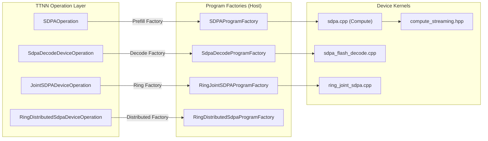
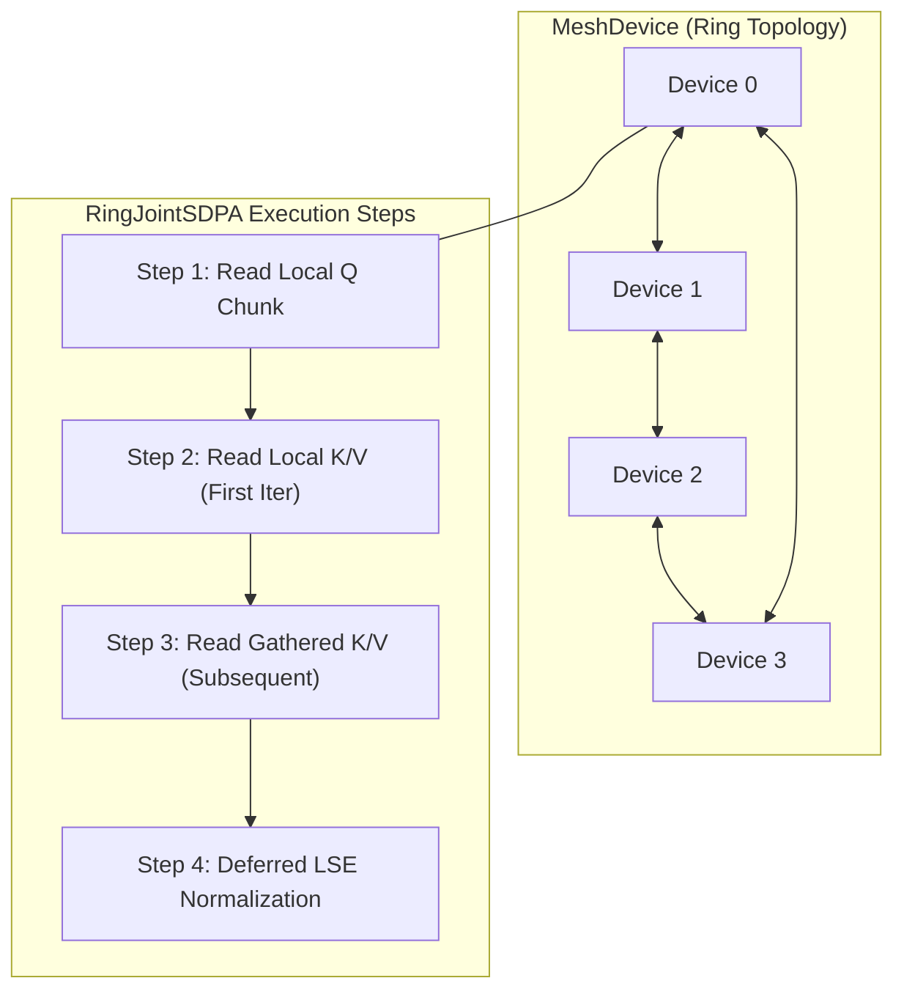

# Attention and Transformer Operations

Relevant source files
*   [tests/nightly/blackhole/sdpa/test_ring_joint_sdpa.py](https://github.com/tenstorrent/tt-metal/blob/f30f8df0/tests/nightly/blackhole/sdpa/test_ring_joint_sdpa.py)
*   [tests/ttnn/nightly/unit_tests/operations/sdpa/test_mla_decode.py](https://github.com/tenstorrent/tt-metal/blob/f30f8df0/tests/ttnn/nightly/unit_tests/operations/sdpa/test_mla_decode.py)
*   [tests/ttnn/nightly/unit_tests/operations/sdpa/test_mla_decode_stress.py](https://github.com/tenstorrent/tt-metal/blob/f30f8df0/tests/ttnn/nightly/unit_tests/operations/sdpa/test_mla_decode_stress.py)
*   [tests/ttnn/nightly/unit_tests/operations/sdpa/test_sdpa_chunked.py](https://github.com/tenstorrent/tt-metal/blob/f30f8df0/tests/ttnn/nightly/unit_tests/operations/sdpa/test_sdpa_chunked.py)
*   [tests/ttnn/nightly/unit_tests/operations/sdpa/test_sdpa_decode.py](https://github.com/tenstorrent/tt-metal/blob/f30f8df0/tests/ttnn/nightly/unit_tests/operations/sdpa/test_sdpa_decode.py)
*   [tests/ttnn/nightly/unit_tests/operations/sdpa/test_sdpa_decode_cache.py](https://github.com/tenstorrent/tt-metal/blob/f30f8df0/tests/ttnn/nightly/unit_tests/operations/sdpa/test_sdpa_decode_cache.py)
*   [tests/ttnn/unit_tests/base_functionality/test_single_device_trace.py](https://github.com/tenstorrent/tt-metal/blob/f30f8df0/tests/ttnn/unit_tests/base_functionality/test_single_device_trace.py)
*   [tests/ttnn/unit_tests/base_functionality/test_sub_device.py](https://github.com/tenstorrent/tt-metal/blob/f30f8df0/tests/ttnn/unit_tests/base_functionality/test_sub_device.py)
*   [tests/ttnn/unit_tests/operations/sdpa/mla_test_utils.py](https://github.com/tenstorrent/tt-metal/blob/f30f8df0/tests/ttnn/unit_tests/operations/sdpa/mla_test_utils.py)
*   [tests/ttnn/unit_tests/operations/sdpa/sdpa_test_utils.py](https://github.com/tenstorrent/tt-metal/blob/f30f8df0/tests/ttnn/unit_tests/operations/sdpa/sdpa_test_utils.py)
*   [tests/ttnn/unit_tests/operations/sdpa/test_mla_decode.py](https://github.com/tenstorrent/tt-metal/blob/f30f8df0/tests/ttnn/unit_tests/operations/sdpa/test_mla_decode.py)
*   [tests/ttnn/unit_tests/operations/sdpa/test_mla_prefill.py](https://github.com/tenstorrent/tt-metal/blob/f30f8df0/tests/ttnn/unit_tests/operations/sdpa/test_mla_prefill.py)
*   [tests/ttnn/unit_tests/operations/sdpa/test_mla_prefill_v_embedding_space.py](https://github.com/tenstorrent/tt-metal/blob/f30f8df0/tests/ttnn/unit_tests/operations/sdpa/test_mla_prefill_v_embedding_space.py)
*   [tests/ttnn/unit_tests/operations/sdpa/test_paged_sdpa_decode_flexible_geometry.py](https://github.com/tenstorrent/tt-metal/blob/f30f8df0/tests/ttnn/unit_tests/operations/sdpa/test_paged_sdpa_decode_flexible_geometry.py)
*   [tests/ttnn/unit_tests/operations/sdpa/test_sdpa_decode.py](https://github.com/tenstorrent/tt-metal/blob/f30f8df0/tests/ttnn/unit_tests/operations/sdpa/test_sdpa_decode.py)
*   [ttnn/cpp/ttnn/operations/transformer/sdpa/device/kernels/compute/compute_common.hpp](https://github.com/tenstorrent/tt-metal/blob/f30f8df0/ttnn/cpp/ttnn/operations/transformer/sdpa/device/kernels/compute/compute_common.hpp)
*   [ttnn/cpp/ttnn/operations/transformer/sdpa/device/kernels/compute/compute_streaming.hpp](https://github.com/tenstorrent/tt-metal/blob/f30f8df0/ttnn/cpp/ttnn/operations/transformer/sdpa/device/kernels/compute/compute_streaming.hpp)
*   [ttnn/cpp/ttnn/operations/transformer/sdpa/device/kernels/compute/ring_joint_sdpa.cpp](https://github.com/tenstorrent/tt-metal/blob/f30f8df0/ttnn/cpp/ttnn/operations/transformer/sdpa/device/kernels/compute/ring_joint_sdpa.cpp)
*   [ttnn/cpp/ttnn/operations/transformer/sdpa/device/kernels/compute/sdpa.cpp](https://github.com/tenstorrent/tt-metal/blob/f30f8df0/ttnn/cpp/ttnn/operations/transformer/sdpa/device/kernels/compute/sdpa.cpp)
*   [ttnn/cpp/ttnn/operations/transformer/sdpa/device/kernels/dataflow/chunked_prefill_utils.hpp](https://github.com/tenstorrent/tt-metal/blob/f30f8df0/ttnn/cpp/ttnn/operations/transformer/sdpa/device/kernels/dataflow/chunked_prefill_utils.hpp)
*   [ttnn/cpp/ttnn/operations/transformer/sdpa/device/kernels/dataflow/dataflow_common.hpp](https://github.com/tenstorrent/tt-metal/blob/f30f8df0/ttnn/cpp/ttnn/operations/transformer/sdpa/device/kernels/dataflow/dataflow_common.hpp)
*   [ttnn/cpp/ttnn/operations/transformer/sdpa/device/kernels/dataflow/fused_op_indexer.hpp](https://github.com/tenstorrent/tt-metal/blob/f30f8df0/ttnn/cpp/ttnn/operations/transformer/sdpa/device/kernels/dataflow/fused_op_indexer.hpp)
*   [ttnn/cpp/ttnn/operations/transformer/sdpa/device/kernels/dataflow/reader_interleaved.cpp](https://github.com/tenstorrent/tt-metal/blob/f30f8df0/ttnn/cpp/ttnn/operations/transformer/sdpa/device/kernels/dataflow/reader_interleaved.cpp)
*   [ttnn/cpp/ttnn/operations/transformer/sdpa/device/kernels/dataflow/ring_joint_reader.cpp](https://github.com/tenstorrent/tt-metal/blob/f30f8df0/ttnn/cpp/ttnn/operations/transformer/sdpa/device/kernels/dataflow/ring_joint_reader.cpp)
*   [ttnn/cpp/ttnn/operations/transformer/sdpa/device/kernels/dataflow/ring_joint_writer.cpp](https://github.com/tenstorrent/tt-metal/blob/f30f8df0/ttnn/cpp/ttnn/operations/transformer/sdpa/device/kernels/dataflow/ring_joint_writer.cpp)
*   [ttnn/cpp/ttnn/operations/transformer/sdpa/device/kernels/dataflow/ring_utils.hpp](https://github.com/tenstorrent/tt-metal/blob/f30f8df0/ttnn/cpp/ttnn/operations/transformer/sdpa/device/kernels/dataflow/ring_utils.hpp)
*   [ttnn/cpp/ttnn/operations/transformer/sdpa/device/kernels/dataflow/writer_interleaved.cpp](https://github.com/tenstorrent/tt-metal/blob/f30f8df0/ttnn/cpp/ttnn/operations/transformer/sdpa/device/kernels/dataflow/writer_interleaved.cpp)
*   [ttnn/cpp/ttnn/operations/transformer/sdpa/device/ring_distributed_sdpa_program_factory.cpp](https://github.com/tenstorrent/tt-metal/blob/f30f8df0/ttnn/cpp/ttnn/operations/transformer/sdpa/device/ring_distributed_sdpa_program_factory.cpp)
*   [ttnn/cpp/ttnn/operations/transformer/sdpa/device/ring_joint_sdpa_device_operation.cpp](https://github.com/tenstorrent/tt-metal/blob/f30f8df0/ttnn/cpp/ttnn/operations/transformer/sdpa/device/ring_joint_sdpa_device_operation.cpp)
*   [ttnn/cpp/ttnn/operations/transformer/sdpa/device/ring_joint_sdpa_device_operation.hpp](https://github.com/tenstorrent/tt-metal/blob/f30f8df0/ttnn/cpp/ttnn/operations/transformer/sdpa/device/ring_joint_sdpa_device_operation.hpp)
*   [ttnn/cpp/ttnn/operations/transformer/sdpa/device/ring_joint_sdpa_device_operation_types.hpp](https://github.com/tenstorrent/tt-metal/blob/f30f8df0/ttnn/cpp/ttnn/operations/transformer/sdpa/device/ring_joint_sdpa_device_operation_types.hpp)
*   [ttnn/cpp/ttnn/operations/transformer/sdpa/device/ring_joint_sdpa_program_factory.cpp](https://github.com/tenstorrent/tt-metal/blob/f30f8df0/ttnn/cpp/ttnn/operations/transformer/sdpa/device/ring_joint_sdpa_program_factory.cpp)
*   [ttnn/cpp/ttnn/operations/transformer/sdpa/device/ring_joint_sdpa_program_factory.hpp](https://github.com/tenstorrent/tt-metal/blob/f30f8df0/ttnn/cpp/ttnn/operations/transformer/sdpa/device/ring_joint_sdpa_program_factory.hpp)
*   [ttnn/cpp/ttnn/operations/transformer/sdpa/device/sdpa_device_operation.cpp](https://github.com/tenstorrent/tt-metal/blob/f30f8df0/ttnn/cpp/ttnn/operations/transformer/sdpa/device/sdpa_device_operation.cpp)
*   [ttnn/cpp/ttnn/operations/transformer/sdpa/device/sdpa_device_operation.hpp](https://github.com/tenstorrent/tt-metal/blob/f30f8df0/ttnn/cpp/ttnn/operations/transformer/sdpa/device/sdpa_device_operation.hpp)
*   [ttnn/cpp/ttnn/operations/transformer/sdpa/device/sdpa_device_operation_types.hpp](https://github.com/tenstorrent/tt-metal/blob/f30f8df0/ttnn/cpp/ttnn/operations/transformer/sdpa/device/sdpa_device_operation_types.hpp)
*   [ttnn/cpp/ttnn/operations/transformer/sdpa/device/sdpa_program_factory.cpp](https://github.com/tenstorrent/tt-metal/blob/f30f8df0/ttnn/cpp/ttnn/operations/transformer/sdpa/device/sdpa_program_factory.cpp)
*   [ttnn/cpp/ttnn/operations/transformer/sdpa/sdpa.cpp](https://github.com/tenstorrent/tt-metal/blob/f30f8df0/ttnn/cpp/ttnn/operations/transformer/sdpa/sdpa.cpp)
*   [ttnn/cpp/ttnn/operations/transformer/sdpa/sdpa.hpp](https://github.com/tenstorrent/tt-metal/blob/f30f8df0/ttnn/cpp/ttnn/operations/transformer/sdpa/sdpa.hpp)
*   [ttnn/cpp/ttnn/operations/transformer/sdpa/sdpa_nanobind.cpp](https://github.com/tenstorrent/tt-metal/blob/f30f8df0/ttnn/cpp/ttnn/operations/transformer/sdpa/sdpa_nanobind.cpp)
*   [ttnn/cpp/ttnn/operations/transformer/sdpa_decode/device/kernels/compute/sdpa_flash_decode.cpp](https://github.com/tenstorrent/tt-metal/blob/f30f8df0/ttnn/cpp/ttnn/operations/transformer/sdpa_decode/device/kernels/compute/sdpa_flash_decode.cpp)
*   [ttnn/cpp/ttnn/operations/transformer/sdpa_decode/device/kernels/dataflow/dataflow_common.hpp](https://github.com/tenstorrent/tt-metal/blob/f30f8df0/ttnn/cpp/ttnn/operations/transformer/sdpa_decode/device/kernels/dataflow/dataflow_common.hpp)
*   [ttnn/cpp/ttnn/operations/transformer/sdpa_decode/device/kernels/dataflow/reader_decode_all.cpp](https://github.com/tenstorrent/tt-metal/blob/f30f8df0/ttnn/cpp/ttnn/operations/transformer/sdpa_decode/device/kernels/dataflow/reader_decode_all.cpp)
*   [ttnn/cpp/ttnn/operations/transformer/sdpa_decode/device/kernels/dataflow/writer_decode_all.cpp](https://github.com/tenstorrent/tt-metal/blob/f30f8df0/ttnn/cpp/ttnn/operations/transformer/sdpa_decode/device/kernels/dataflow/writer_decode_all.cpp)
*   [ttnn/cpp/ttnn/operations/transformer/sdpa_decode/device/kernels/rt_args_common.hpp](https://github.com/tenstorrent/tt-metal/blob/f30f8df0/ttnn/cpp/ttnn/operations/transformer/sdpa_decode/device/kernels/rt_args_common.hpp)
*   [ttnn/cpp/ttnn/operations/transformer/sdpa_decode/device/sdpa_decode_device_operation.cpp](https://github.com/tenstorrent/tt-metal/blob/f30f8df0/ttnn/cpp/ttnn/operations/transformer/sdpa_decode/device/sdpa_decode_device_operation.cpp)
*   [ttnn/cpp/ttnn/operations/transformer/sdpa_decode/device/sdpa_decode_device_operation.hpp](https://github.com/tenstorrent/tt-metal/blob/f30f8df0/ttnn/cpp/ttnn/operations/transformer/sdpa_decode/device/sdpa_decode_device_operation.hpp)
*   [ttnn/cpp/ttnn/operations/transformer/sdpa_decode/device/sdpa_decode_device_operation_types.hpp](https://github.com/tenstorrent/tt-metal/blob/f30f8df0/ttnn/cpp/ttnn/operations/transformer/sdpa_decode/device/sdpa_decode_device_operation_types.hpp)
*   [ttnn/cpp/ttnn/operations/transformer/sdpa_decode/device/sdpa_decode_program_factory.cpp](https://github.com/tenstorrent/tt-metal/blob/f30f8df0/ttnn/cpp/ttnn/operations/transformer/sdpa_decode/device/sdpa_decode_program_factory.cpp)
*   [ttnn/cpp/ttnn/operations/transformer/sdpa_decode/sdpa_decode.cpp](https://github.com/tenstorrent/tt-metal/blob/f30f8df0/ttnn/cpp/ttnn/operations/transformer/sdpa_decode/sdpa_decode.cpp)
*   [ttnn/cpp/ttnn/operations/transformer/sdpa_decode/sdpa_decode.hpp](https://github.com/tenstorrent/tt-metal/blob/f30f8df0/ttnn/cpp/ttnn/operations/transformer/sdpa_decode/sdpa_decode.hpp)
*   [ttnn/cpp/ttnn/operations/transformer/sdpa_decode/sdpa_decode_nanobind.cpp](https://github.com/tenstorrent/tt-metal/blob/f30f8df0/ttnn/cpp/ttnn/operations/transformer/sdpa_decode/sdpa_decode_nanobind.cpp)

This document describes the implementation of attention mechanisms and transformer operations in the TTNN library, focusing on Scaled Dot-Product Attention (SDPA) for both prefill (sequence) and decode (autoregressive) phases.

## Overview

The attention operations provide optimized implementations of Flash Attention for Tenstorrent hardware, supporting various architectures including Wormhole and Blackhole. The library implements multiple variants to handle different model requirements such as paged KV caching, multi-latent attention (MLA), and distributed execution across a MeshDevice.

**Key Features:**

*   **Flash Attention:** Online softmax algorithm to compute attention without materializing the full $S \times S$ matrix [ttnn/cpp/ttnn/operations/transformer/sdpa/device/kernels/compute/compute_streaming.hpp 5-15](https://github.com/tenstorrent/tt-metal/blob/f30f8df0/ttnn/cpp/ttnn/operations/transformer/sdpa/device/kernels/compute/compute_streaming.hpp#L5-L15)
*   **Paged Attention:** Support for non-contiguous KV cache blocks for efficient memory management in LLM serving [ttnn/cpp/ttnn/operations/transformer/sdpa_decode/device/sdpa_decode_program_factory.cpp 112-125](https://github.com/tenstorrent/tt-metal/blob/f30f8df0/ttnn/cpp/ttnn/operations/transformer/sdpa_decode/device/sdpa_decode_program_factory.cpp#L112-L125)
*   **Multi-Latent Attention (MLA):** Optimized for models like DeepSeek where V is a latent subset of K [ttnn/cpp/ttnn/operations/transformer/sdpa_decode/device/sdpa_decode_program_factory.cpp 43-64](https://github.com/tenstorrent/tt-metal/blob/f30f8df0/ttnn/cpp/ttnn/operations/transformer/sdpa_decode/device/sdpa_decode_program_factory.cpp#L43-L64)
*   **Ring Attention:** Distributed SDPA implementation for long-sequence training/inference across multiple devices [ttnn/cpp/ttnn/operations/transformer/sdpa/device/ring_joint_sdpa_program_factory.cpp 42-84](https://github.com/tenstorrent/tt-metal/blob/f30f8df0/ttnn/cpp/ttnn/operations/transformer/sdpa/device/ring_joint_sdpa_program_factory.cpp#L42-L84)
*   **Tree Reduction:** Multi-core execution strategy (up to 64 cores per head) to parallelize the decode phase [ttnn/cpp/ttnn/operations/transformer/sdpa_decode/device/kernels/compute/sdpa_flash_decode.cpp 120-132](https://github.com/tenstorrent/tt-metal/blob/f30f8df0/ttnn/cpp/ttnn/operations/transformer/sdpa_decode/device/kernels/compute/sdpa_flash_decode.cpp#L120-L132)
*   **Streaming Compute (v2):** A high-performance compute path that eliminates row buffers by using absolute offset packing via `cb_push_back_hold_wr_ptr`[ttnn/cpp/ttnn/operations/transformer/sdpa/device/kernels/compute/compute_streaming.hpp 55-65](https://github.com/tenstorrent/tt-metal/blob/f30f8df0/ttnn/cpp/ttnn/operations/transformer/sdpa/device/kernels/compute/compute_streaming.hpp#L55-L65)

Sources: [ttnn/cpp/ttnn/operations/transformer/sdpa/device/kernels/compute/compute_streaming.hpp 5-65](https://github.com/tenstorrent/tt-metal/blob/f30f8df0/ttnn/cpp/ttnn/operations/transformer/sdpa/device/kernels/compute/compute_streaming.hpp#L5-L65)[ttnn/cpp/ttnn/operations/transformer/sdpa_decode/device/sdpa_decode_program_factory.cpp 43-125](https://github.com/tenstorrent/tt-metal/blob/f30f8df0/ttnn/cpp/ttnn/operations/transformer/sdpa_decode/device/sdpa_decode_program_factory.cpp#L43-L125)[ttnn/cpp/ttnn/operations/transformer/sdpa/device/ring_joint_sdpa_program_factory.cpp 42-84](https://github.com/tenstorrent/tt-metal/blob/f30f8df0/ttnn/cpp/ttnn/operations/transformer/sdpa/device/ring_joint_sdpa_program_factory.cpp#L42-L84)[ttnn/cpp/ttnn/operations/transformer/sdpa_decode/device/kernels/compute/sdpa_flash_decode.cpp 120-132](https://github.com/tenstorrent/tt-metal/blob/f30f8df0/ttnn/cpp/ttnn/operations/transformer/sdpa_decode/device/kernels/compute/sdpa_flash_decode.cpp#L120-L132)

## High-Level API and Dispatch

The TTNN transformer library exposes several entry points that dispatch to specific device operations based on the input tensors and configurations.

### Operation Mapping

| API Function | Backend Operation | Implementation File |
| --- | --- | --- |
| `scaled_dot_product_attention` | `SDPAOperation` | [ttnn/cpp/ttnn/operations/transformer/sdpa/device/sdpa_program_factory.cpp 156-160](https://github.com/tenstorrent/tt-metal/blob/f30f8df0/ttnn/cpp/ttnn/operations/transformer/sdpa/device/sdpa_program_factory.cpp#L156-L160) |
| `joint_scaled_dot_product_attention` | `JointSDPADeviceOperation` | [ttnn/cpp/ttnn/operations/transformer/sdpa/sdpa.cpp 152-163](https://github.com/tenstorrent/tt-metal/blob/f30f8df0/ttnn/cpp/ttnn/operations/transformer/sdpa/sdpa.cpp#L152-L163) |
| `ring_joint_scaled_dot_product_attention` | `RingJointSDPADeviceOperation` | [ttnn/cpp/ttnn/operations/transformer/sdpa/device/ring_joint_sdpa_program_factory.cpp 33-37](https://github.com/tenstorrent/tt-metal/blob/f30f8df0/ttnn/cpp/ttnn/operations/transformer/sdpa/device/ring_joint_sdpa_program_factory.cpp#L33-L37) |
| `ring_distributed_scaled_dot_product_attention` | `RingDistributedSdpaDeviceOperation` | [ttnn/cpp/ttnn/operations/transformer/sdpa/device/ring_distributed_sdpa_program_factory.cpp 75-79](https://github.com/tenstorrent/tt-metal/blob/f30f8df0/ttnn/cpp/ttnn/operations/transformer/sdpa/device/ring_distributed_sdpa_program_factory.cpp#L75-L79) |
| `scaled_dot_product_attention_decode` | `SdpaDecodeDeviceOperation` | [ttnn/cpp/ttnn/operations/transformer/sdpa_decode/device/sdpa_decode_program_factory.cpp 29-32](https://github.com/tenstorrent/tt-metal/blob/f30f8df0/ttnn/cpp/ttnn/operations/transformer/sdpa_decode/device/sdpa_decode_program_factory.cpp#L29-L32) |

### Code Entity Space to Natural Language Space



Sources: [ttnn/cpp/ttnn/operations/transformer/sdpa/device/sdpa_program_factory.cpp:156-180](), [ttnn/cpp/ttnn/operations/transformer/sdpa_decode/device/sdpa_decode_program_factory.cpp:29-50](), [ttnn/cpp/ttnn/operations/transformer/sdpa/device/ring_joint_sdpa_program_factory.cpp:33-40](), [ttnn/cpp/ttnn/operations/transformer/sdpa/device/ring_distributed_sdpa_program_factory.cpp:75-79](), [ttnn/cpp/ttnn/operations/transformer/sdpa/sdpa.cpp:152-163]()
```


The following diagram bridges the high-level C++ classes to their functional roles in the attention pipeline.

Title: "Attention Code Entity Mapping"

Sources: [ttnn/cpp/ttnn/operations/transformer/sdpa/device/sdpa_program_factory.cpp 156-180](https://github.com/tenstorrent/tt-metal/blob/f30f8df0/ttnn/cpp/ttnn/operations/transformer/sdpa/device/sdpa_program_factory.cpp#L156-L180)[ttnn/cpp/ttnn/operations/transformer/sdpa_decode/device/sdpa_decode_program_factory.cpp 29-50](https://github.com/tenstorrent/tt-metal/blob/f30f8df0/ttnn/cpp/ttnn/operations/transformer/sdpa_decode/device/sdpa_decode_program_factory.cpp#L29-L50)[ttnn/cpp/ttnn/operations/transformer/sdpa/device/ring_joint_sdpa_program_factory.cpp 33-40](https://github.com/tenstorrent/tt-metal/blob/f30f8df0/ttnn/cpp/ttnn/operations/transformer/sdpa/device/ring_joint_sdpa_program_factory.cpp#L33-L40)[ttnn/cpp/ttnn/operations/transformer/sdpa/device/ring_distributed_sdpa_program_factory.cpp 75-79](https://github.com/tenstorrent/tt-metal/blob/f30f8df0/ttnn/cpp/ttnn/operations/transformer/sdpa/device/ring_distributed_sdpa_program_factory.cpp#L75-L79)[ttnn/cpp/ttnn/operations/transformer/sdpa/sdpa.cpp 152-163](https://github.com/tenstorrent/tt-metal/blob/f30f8df0/ttnn/cpp/ttnn/operations/transformer/sdpa/sdpa.cpp#L152-L163)

## SDPA Implementation Details

### Prefill (Sequence) SDPA

The prefill phase processes the entire prompt sequence. The implementation in `SDPAProgramFactory` supports a "Streaming Compute v2" path for architectures like Blackhole and Wormhole [ttnn/cpp/ttnn/operations/transformer/sdpa/device/sdpa_program_factory.cpp 68-84](https://github.com/tenstorrent/tt-metal/blob/f30f8df0/ttnn/cpp/ttnn/operations/transformer/sdpa/device/sdpa_program_factory.cpp#L68-L84)

**Streaming Compute v2:** This optimization removes the need for intermediate row buffers in L1. It uses `cb_push_back_hold_wr_ptr` to make tiles visible for UNPACK reads while rewinding the write pointer so that subsequent `pack_tile<true>` offsets remain relative to a stable base [ttnn/cpp/ttnn/operations/transformer/sdpa/device/kernels/compute/compute_streaming.hpp 55-65](https://github.com/tenstorrent/tt-metal/blob/f30f8df0/ttnn/cpp/ttnn/operations/transformer/sdpa/device/kernels/compute/compute_streaming.hpp#L55-L65)

**Softmax Normalization:** The compute kernel uses a deferred normalization strategy. It maintains running statistics (max $m$ and sum $l$) across chunks [ttnn/cpp/ttnn/operations/transformer/sdpa/device/kernels/compute/compute_common.hpp 108-115](https://github.com/tenstorrent/tt-metal/blob/f30f8df0/ttnn/cpp/ttnn/operations/transformer/sdpa/device/kernels/compute/compute_common.hpp#L108-L115) In the ring distributed version, this state is carried across iterations using structures like `RingAccumulatorState`[ttnn/cpp/ttnn/operations/transformer/sdpa/device/kernels/compute/compute_streaming.hpp 74-76](https://github.com/tenstorrent/tt-metal/blob/f30f8df0/ttnn/cpp/ttnn/operations/transformer/sdpa/device/kernels/compute/compute_streaming.hpp#L74-L76)

Sources: [ttnn/cpp/ttnn/operations/transformer/sdpa/device/kernels/compute/compute_streaming.hpp 55-76](https://github.com/tenstorrent/tt-metal/blob/f30f8df0/ttnn/cpp/ttnn/operations/transformer/sdpa/device/kernels/compute/compute_streaming.hpp#L55-L76)[ttnn/cpp/ttnn/operations/transformer/sdpa/device/sdpa_program_factory.cpp 68-84](https://github.com/tenstorrent/tt-metal/blob/f30f8df0/ttnn/cpp/ttnn/operations/transformer/sdpa/device/sdpa_program_factory.cpp#L68-L84)[ttnn/cpp/ttnn/operations/transformer/sdpa/device/kernels/compute/compute_common.hpp 108-115](https://github.com/tenstorrent/tt-metal/blob/f30f8df0/ttnn/cpp/ttnn/operations/transformer/sdpa/device/kernels/compute/compute_common.hpp#L108-L115)

### Decode (Autoregressive) SDPA

The decode phase processes a single new token. Because the KV cache grows, this implementation utilizes multi-core parallelism through **Tree Reduction**.

**Tree Reduction Protocol:**

1.   **Worker Phase:** Cores process assigned chunks of the KV cache [ttnn/cpp/ttnn/operations/transformer/sdpa_decode/device/kernels/compute/sdpa_flash_decode.cpp 111-118](https://github.com/tenstorrent/tt-metal/blob/f30f8df0/ttnn/cpp/ttnn/operations/transformer/sdpa_decode/device/kernels/compute/sdpa_flash_decode.cpp#L111-L118)
2.   **Reduction Rounds:** The kernel executes a configurable number of tree reduction rounds [ttnn/cpp/ttnn/operations/transformer/sdpa_decode/device/kernels/compute/sdpa_flash_decode.cpp 67](https://github.com/tenstorrent/tt-metal/blob/f30f8df0/ttnn/cpp/ttnn/operations/transformer/sdpa_decode/device/kernels/compute/sdpa_flash_decode.cpp#L67-L67)
3.   **Root Phase:** The tree root (identified by `is_tree_root`) performs the final correction and normalization [ttnn/cpp/ttnn/operations/transformer/sdpa_decode/device/kernels/compute/sdpa_flash_decode.cpp 121-125](https://github.com/tenstorrent/tt-metal/blob/f30f8df0/ttnn/cpp/ttnn/operations/transformer/sdpa_decode/device/kernels/compute/sdpa_flash_decode.cpp#L121-L125)

Sources: [ttnn/cpp/ttnn/operations/transformer/sdpa_decode/device/kernels/compute/sdpa_flash_decode.cpp 67-125](https://github.com/tenstorrent/tt-metal/blob/f30f8df0/ttnn/cpp/ttnn/operations/transformer/sdpa_decode/device/kernels/compute/sdpa_flash_decode.cpp#L67-L125)[ttnn/cpp/ttnn/operations/transformer/sdpa_decode/device/sdpa_decode_program_factory.cpp 108-111](https://github.com/tenstorrent/tt-metal/blob/f30f8df0/ttnn/cpp/ttnn/operations/transformer/sdpa_decode/device/sdpa_decode_program_factory.cpp#L108-L111)

## Paged and Multi-Latent Attention

### Paged Attention

Paged attention uses a `page_table` tensor to map logical sequence blocks to physical locations [ttnn/cpp/ttnn/operations/transformer/sdpa/device/kernels/dataflow/dataflow_common.hpp 52-53](https://github.com/tenstorrent/tt-metal/blob/f30f8df0/ttnn/cpp/ttnn/operations/transformer/sdpa/device/kernels/dataflow/dataflow_common.hpp#L52-L53)

*   **Virtual to Physical Mapping:**`virtual_seq_tile_id_to_physical_tile_id` converts a logical sequence index into a physical tile ID using the page table [ttnn/cpp/ttnn/operations/transformer/sdpa/device/kernels/dataflow/dataflow_common.hpp 52-67](https://github.com/tenstorrent/tt-metal/blob/f30f8df0/ttnn/cpp/ttnn/operations/transformer/sdpa/device/kernels/dataflow/dataflow_common.hpp#L52-L67)
*   **Sliding Window:** Supports bounded sliding-window caches by wrapping sequence tile indices modulo `capacity_t`[ttnn/cpp/ttnn/operations/transformer/sdpa/device/kernels/dataflow/dataflow_common.hpp 51-61](https://github.com/tenstorrent/tt-metal/blob/f30f8df0/ttnn/cpp/ttnn/operations/transformer/sdpa/device/kernels/dataflow/dataflow_common.hpp#L51-L61)
*   **Block Padding:** Handles cases where the block size is not a multiple of `TILE_HEIGHT` via `has_block_padding`[ttnn/cpp/ttnn/operations/transformer/sdpa_decode/device/sdpa_decode_program_factory.cpp 124-125](https://github.com/tenstorrent/tt-metal/blob/f30f8df0/ttnn/cpp/ttnn/operations/transformer/sdpa_decode/device/sdpa_decode_program_factory.cpp#L124-L125)

Sources: [ttnn/cpp/ttnn/operations/transformer/sdpa/device/kernels/dataflow/dataflow_common.hpp 51-67](https://github.com/tenstorrent/tt-metal/blob/f30f8df0/ttnn/cpp/ttnn/operations/transformer/sdpa/device/kernels/dataflow/dataflow_common.hpp#L51-L67)[ttnn/cpp/ttnn/operations/transformer/sdpa_decode/device/sdpa_decode_program_factory.cpp 113-125](https://github.com/tenstorrent/tt-metal/blob/f30f8df0/ttnn/cpp/ttnn/operations/transformer/sdpa_decode/device/sdpa_decode_program_factory.cpp#L113-L125)

### Multi-Latent Attention (MLA)

In MLA, the V tensor is often a latent subset of the K tensor [ttnn/cpp/ttnn/operations/transformer/sdpa_decode/device/sdpa_decode_program_factory.cpp 62-64](https://github.com/tenstorrent/tt-metal/blob/f30f8df0/ttnn/cpp/ttnn/operations/transformer/sdpa_decode/device/sdpa_decode_program_factory.cpp#L62-L64)

*   **Tensor Reuse:** When MLA is enabled, the kernel can reuse the K tensor as V [ttnn/cpp/ttnn/operations/transformer/sdpa_decode/device/sdpa_decode_program_factory.cpp 64](https://github.com/tenstorrent/tt-metal/blob/f30f8df0/ttnn/cpp/ttnn/operations/transformer/sdpa_decode/device/sdpa_decode_program_factory.cpp#L64-L64)
*   **In-place Materialization:** Optimized readers can materialize V directly from $K^T$ in L1 for single-tile Q heads [ttnn/cpp/ttnn/operations/transformer/sdpa/device/kernels/dataflow/ring_joint_reader.cpp 130-144](https://github.com/tenstorrent/tt-metal/blob/f30f8df0/ttnn/cpp/ttnn/operations/transformer/sdpa/device/kernels/dataflow/ring_joint_reader.cpp#L130-L144)
*   **Parallelization:** Supports `q_heads_parallel_factor` to distribute Q heads across cores for higher throughput [ttnn/cpp/ttnn/operations/transformer/sdpa_decode/device/sdpa_decode_program_factory.cpp 108-132](https://github.com/tenstorrent/tt-metal/blob/f30f8df0/ttnn/cpp/ttnn/operations/transformer/sdpa_decode/device/sdpa_decode_program_factory.cpp#L108-L132)

Sources: [ttnn/cpp/ttnn/operations/transformer/sdpa_decode/device/sdpa_decode_program_factory.cpp 43-132](https://github.com/tenstorrent/tt-metal/blob/f30f8df0/ttnn/cpp/ttnn/operations/transformer/sdpa_decode/device/sdpa_decode_program_factory.cpp#L43-L132)[ttnn/cpp/ttnn/operations/transformer/sdpa/device/kernels/dataflow/ring_joint_reader.cpp 130-144](https://github.com/tenstorrent/tt-metal/blob/f30f8df0/ttnn/cpp/ttnn/operations/transformer/sdpa/device/kernels/dataflow/ring_joint_reader.cpp#L130-L144)

## Multi-Device Ring Attention



**Implementation Components:**
- **Fractured Inputs:** QKV inputs are fractured on the sequence dimension across `ring_size` [ttnn/cpp/ttnn/operations/transformer/sdpa/device/ring_distributed_sdpa_program_factory.cpp:131-133]().
- **Ring ID Resolution:** In distributed mode, `ring_id` is inferred from the mesh coordinate and axis [ttnn/cpp/ttnn/operations/transformer/sdpa/device/ring_distributed_sdpa_program_factory.cpp:30-55]().
- **Ring Work Masks:** Host-side summary of which ring-loop iterations do useful work to prune empty iterations [ttnn/cpp/ttnn/operations/transformer/sdpa/device/ring_joint_sdpa_program_factory.cpp:37-45]().
- **Lightweight Masking:** Generates dynamic masks for causal and joint sequence boundaries [ttnn/cpp/ttnn/operations/transformer/sdpa/device/kernels/compute/ring_joint_sdpa.cpp:86-102]().

Sources: [ttnn/cpp/ttnn/operations/transformer/sdpa/device/ring_joint_sdpa_program_factory.cpp:37-45](), [ttnn/cpp/ttnn/operations/transformer/sdpa/device/ring_distributed_sdpa_program_factory.cpp:30-55, 131-133](), [ttnn/cpp/ttnn/operations/transformer/sdpa/device/kernels/compute/ring_joint_sdpa.cpp:86-102]()
```


For very large sequences, SDPA is fractured across a `MeshDevice` using a ring topology.

Title: "Ring Attention Data Flow"

**Implementation Components:**

*   **Fractured Inputs:** QKV inputs are fractured on the sequence dimension across `ring_size`[ttnn/cpp/ttnn/operations/transformer/sdpa/device/ring_distributed_sdpa_program_factory.cpp 131-133](https://github.com/tenstorrent/tt-metal/blob/f30f8df0/ttnn/cpp/ttnn/operations/transformer/sdpa/device/ring_distributed_sdpa_program_factory.cpp#L131-L133)
*   **Ring ID Resolution:** In distributed mode, `ring_id` is inferred from the mesh coordinate and axis [ttnn/cpp/ttnn/operations/transformer/sdpa/device/ring_distributed_sdpa_program_factory.cpp 30-55](https://github.com/tenstorrent/tt-metal/blob/f30f8df0/ttnn/cpp/ttnn/operations/transformer/sdpa/device/ring_distributed_sdpa_program_factory.cpp#L30-L55)
*   **Ring Work Masks:** Host-side summary of which ring-loop iterations do useful work to prune empty iterations [ttnn/cpp/ttnn/operations/transformer/sdpa/device/ring_joint_sdpa_program_factory.cpp 37-45](https://github.com/tenstorrent/tt-metal/blob/f30f8df0/ttnn/cpp/ttnn/operations/transformer/sdpa/device/ring_joint_sdpa_program_factory.cpp#L37-L45)
*   **Lightweight Masking:** Generates dynamic masks for causal and joint sequence boundaries [ttnn/cpp/ttnn/operations/transformer/sdpa/device/kernels/compute/ring_joint_sdpa.cpp 86-102](https://github.com/tenstorrent/tt-metal/blob/f30f8df0/ttnn/cpp/ttnn/operations/transformer/sdpa/device/kernels/compute/ring_joint_sdpa.cpp#L86-L102)

Sources: [ttnn/cpp/ttnn/operations/transformer/sdpa/device/ring_joint_sdpa_program_factory.cpp 37-45](https://github.com/tenstorrent/tt-metal/blob/f30f8df0/ttnn/cpp/ttnn/operations/transformer/sdpa/device/ring_joint_sdpa_program_factory.cpp#L37-L45)[ttnn/cpp/ttnn/operations/transformer/sdpa/device/ring_distributed_sdpa_program_factory.cpp 30-133](https://github.com/tenstorrent/tt-metal/blob/f30f8df0/ttnn/cpp/ttnn/operations/transformer/sdpa/device/ring_distributed_sdpa_program_factory.cpp#L30-L133)[ttnn/cpp/ttnn/operations/transformer/sdpa/device/kernels/compute/ring_joint_sdpa.cpp 86-102](https://github.com/tenstorrent/tt-metal/blob/f30f8df0/ttnn/cpp/ttnn/operations/transformer/sdpa/device/kernels/compute/ring_joint_sdpa.cpp#L86-L102)

## Circular Buffer and Kernel Interfacing

The kernels communicate through a standardized set of Circular Buffers (CBs) defined at compile time.

| CB Index | Name | Purpose |
| --- | --- | --- |
| `tt::CBIndex::c_0` | `cb_q_in` | Input Query tiles [ttnn/cpp/ttnn/operations/transformer/sdpa_decode/device/kernels/compute/sdpa_flash_decode.cpp 76](https://github.com/tenstorrent/tt-metal/blob/f30f8df0/ttnn/cpp/ttnn/operations/transformer/sdpa_decode/device/kernels/compute/sdpa_flash_decode.cpp#L76-L76) |
| `tt::CBIndex::c_1` | `cb_k_in` | Input Key tiles [ttnn/cpp/ttnn/operations/transformer/sdpa_decode/device/kernels/compute/sdpa_flash_decode.cpp 77](https://github.com/tenstorrent/tt-metal/blob/f30f8df0/ttnn/cpp/ttnn/operations/transformer/sdpa_decode/device/kernels/compute/sdpa_flash_decode.cpp#L77-L77) |
| `tt::CBIndex::c_2` | `cb_v_in` | Input Value tiles [ttnn/cpp/ttnn/operations/transformer/sdpa_decode/device/kernels/compute/sdpa_flash_decode.cpp 78](https://github.com/tenstorrent/tt-metal/blob/f30f8df0/ttnn/cpp/ttnn/operations/transformer/sdpa_decode/device/kernels/compute/sdpa_flash_decode.cpp#L78-L78) |
| `tt::CBIndex::c_3` | `cb_mask_in` | Attention/Lightweight Mask tiles [ttnn/cpp/ttnn/operations/transformer/sdpa_decode/device/kernels/compute/sdpa_flash_decode.cpp 79](https://github.com/tenstorrent/tt-metal/blob/f30f8df0/ttnn/cpp/ttnn/operations/transformer/sdpa_decode/device/kernels/compute/sdpa_flash_decode.cpp#L79-L79) |
| `tt::CBIndex::c_5` | `cb_identity_scale_in` | Scaling factors for dot-product [ttnn/cpp/ttnn/operations/transformer/sdpa_decode/device/kernels/compute/sdpa_flash_decode.cpp 83](https://github.com/tenstorrent/tt-metal/blob/f30f8df0/ttnn/cpp/ttnn/operations/transformer/sdpa_decode/device/kernels/compute/sdpa_flash_decode.cpp#L83-L83) |
| `tt::CBIndex::c_24` | `cb_qk_im` | Intermediate QK result (before Softmax) [ttnn/cpp/ttnn/operations/transformer/sdpa_decode/device/kernels/compute/sdpa_flash_decode.cpp 92](https://github.com/tenstorrent/tt-metal/blob/f30f8df0/ttnn/cpp/ttnn/operations/transformer/sdpa_decode/device/kernels/compute/sdpa_flash_decode.cpp#L92-L92) |
| `tt::CBIndex::c_27/c_28` | `cb_max_1/2` | Ping-pong buffers for online max [ttnn/cpp/ttnn/operations/transformer/sdpa_decode/device/kernels/compute/sdpa_flash_decode.cpp 95-96](https://github.com/tenstorrent/tt-metal/blob/f30f8df0/ttnn/cpp/ttnn/operations/transformer/sdpa_decode/device/kernels/compute/sdpa_flash_decode.cpp#L95-L96) |
| `tt::CBIndex::c_29/c_30` | `cb_sum_1/2` | Ping-pong buffers for online sum [ttnn/cpp/ttnn/operations/transformer/sdpa_decode/device/kernels/compute/sdpa_flash_decode.cpp 97-98](https://github.com/tenstorrent/tt-metal/blob/f30f8df0/ttnn/cpp/ttnn/operations/transformer/sdpa_decode/device/kernels/compute/sdpa_flash_decode.cpp#L97-L98) |

Sources: [ttnn/cpp/ttnn/operations/transformer/sdpa_decode/device/kernels/compute/sdpa_flash_decode.cpp 76-102](https://github.com/tenstorrent/tt-metal/blob/f30f8df0/ttnn/cpp/ttnn/operations/transformer/sdpa_decode/device/kernels/compute/sdpa_flash_decode.cpp#L76-L102)

This wiki is featured in the [repository](https://github.com/tenstorrent/tt-metal/blob/main/README.md)

Dismiss
Refresh this wiki

Enter email to refresh