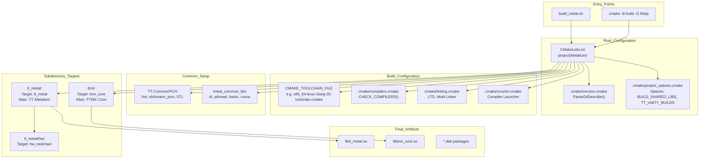
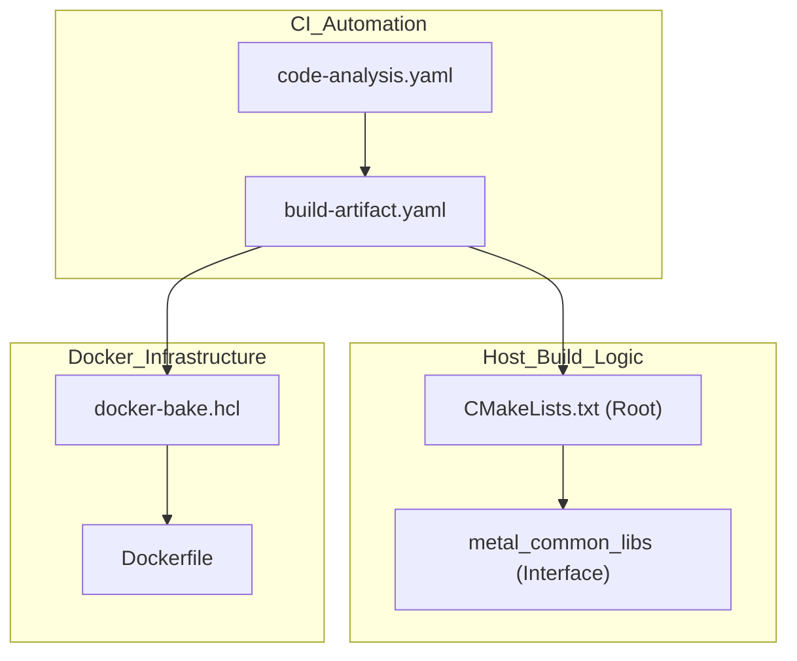
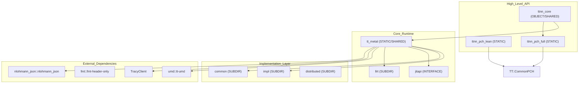
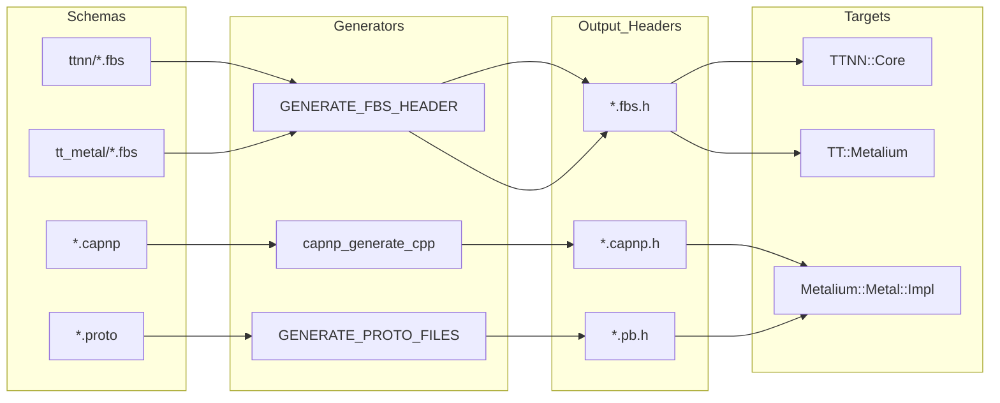

# CMake Configuration and Compilation

Relevant source files
*   [.github/actions/find-changed-files/action.yml](https://github.com/tenstorrent/tt-metal/blob/f30f8df0/.github/actions/find-changed-files/action.yml)
*   [.github/actions/manual-docker-bake/action.yml](https://github.com/tenstorrent/tt-metal/blob/f30f8df0/.github/actions/manual-docker-bake/action.yml)
*   [.github/actions/report-failure/action.yml](https://github.com/tenstorrent/tt-metal/blob/f30f8df0/.github/actions/report-failure/action.yml)
*   [.github/scripts/compute-platform-data.sh](https://github.com/tenstorrent/tt-metal/blob/f30f8df0/.github/scripts/compute-platform-data.sh)
*   [.github/scripts/utils/find-changed-files.sh](https://github.com/tenstorrent/tt-metal/blob/f30f8df0/.github/scripts/utils/find-changed-files.sh)
*   [.github/scripts/utils/model-charts-sync.py](https://github.com/tenstorrent/tt-metal/blob/f30f8df0/.github/scripts/utils/model-charts-sync.py)
*   [.github/workflows/basic.yaml](https://github.com/tenstorrent/tt-metal/blob/f30f8df0/.github/workflows/basic.yaml)
*   [.github/workflows/build-artifact.yaml](https://github.com/tenstorrent/tt-metal/blob/f30f8df0/.github/workflows/build-artifact.yaml)
*   [.github/workflows/build-docker-artifact.yaml](https://github.com/tenstorrent/tt-metal/blob/f30f8df0/.github/workflows/build-docker-artifact.yaml)
*   [.github/workflows/build-docker-tools.yaml](https://github.com/tenstorrent/tt-metal/blob/f30f8df0/.github/workflows/build-docker-tools.yaml)
*   [.github/workflows/build-evaluation-image.yaml](https://github.com/tenstorrent/tt-metal/blob/f30f8df0/.github/workflows/build-evaluation-image.yaml)
*   [.github/workflows/build-wrapper.yaml](https://github.com/tenstorrent/tt-metal/blob/f30f8df0/.github/workflows/build-wrapper.yaml)
*   [.github/workflows/clang-tidy-reusable.yaml](https://github.com/tenstorrent/tt-metal/blob/f30f8df0/.github/workflows/clang-tidy-reusable.yaml)
*   [.github/workflows/code-analysis.yaml](https://github.com/tenstorrent/tt-metal/blob/f30f8df0/.github/workflows/code-analysis.yaml)
*   [.github/workflows/merge-gate.yaml](https://github.com/tenstorrent/tt-metal/blob/f30f8df0/.github/workflows/merge-gate.yaml)
*   [.github/workflows/pr-gate.yaml](https://github.com/tenstorrent/tt-metal/blob/f30f8df0/.github/workflows/pr-gate.yaml)
*   [.github/workflows/sdk-examples.yaml](https://github.com/tenstorrent/tt-metal/blob/f30f8df0/.github/workflows/sdk-examples.yaml)
*   [.github/workflows/smoke.yaml](https://github.com/tenstorrent/tt-metal/blob/f30f8df0/.github/workflows/smoke.yaml)
*   [.github/workflows/ttsim.yaml](https://github.com/tenstorrent/tt-metal/blob/f30f8df0/.github/workflows/ttsim.yaml)
*   [CMakeLists.txt](https://github.com/tenstorrent/tt-metal/blob/f30f8df0/CMakeLists.txt)
*   [INSTALLING.md](https://github.com/tenstorrent/tt-metal/blob/f30f8df0/INSTALLING.md?plain=1)
*   [MANIFEST.in](https://github.com/tenstorrent/tt-metal/blob/f30f8df0/MANIFEST.in)
*   [build_metal.sh](https://github.com/tenstorrent/tt-metal/blob/f30f8df0/build_metal.sh)
*   [cmake/helper_functions.cmake](https://github.com/tenstorrent/tt-metal/blob/f30f8df0/cmake/helper_functions.cmake)
*   [cmake/linking.cmake](https://github.com/tenstorrent/tt-metal/blob/f30f8df0/cmake/linking.cmake)
*   [cmake/project_options.cmake](https://github.com/tenstorrent/tt-metal/blob/f30f8df0/cmake/project_options.cmake)
*   [create_venv.sh](https://github.com/tenstorrent/tt-metal/blob/f30f8df0/create_venv.sh)
*   [dockerfile/Dockerfile](https://github.com/tenstorrent/tt-metal/blob/f30f8df0/dockerfile/Dockerfile)
*   [dockerfile/Dockerfile.basic-dev](https://github.com/tenstorrent/tt-metal/blob/f30f8df0/dockerfile/Dockerfile.basic-dev)
*   [dockerfile/Dockerfile.evaluation](https://github.com/tenstorrent/tt-metal/blob/f30f8df0/dockerfile/Dockerfile.evaluation)
*   [dockerfile/Dockerfile.tools](https://github.com/tenstorrent/tt-metal/blob/f30f8df0/dockerfile/Dockerfile.tools)
*   [dockerfile/scripts/install-ccache.sh](https://github.com/tenstorrent/tt-metal/blob/f30f8df0/dockerfile/scripts/install-ccache.sh)
*   [docs/source/tt-metalium/tools/triage.rst](https://github.com/tenstorrent/tt-metal/blob/f30f8df0/docs/source/tt-metalium/tools/triage.rst)
*   [install_dependencies.sh](https://github.com/tenstorrent/tt-metal/blob/f30f8df0/install_dependencies.sh)
*   [pyproject.toml](https://github.com/tenstorrent/tt-metal/blob/f30f8df0/pyproject.toml)
*   [scripts/install-uv.sh](https://github.com/tenstorrent/tt-metal/blob/f30f8df0/scripts/install-uv.sh)
*   [scripts/install_debugger.sh](https://github.com/tenstorrent/tt-metal/blob/f30f8df0/scripts/install_debugger.sh)
*   [setup.py](https://github.com/tenstorrent/tt-metal/blob/f30f8df0/setup.py)
*   [tests/CMakeLists.txt](https://github.com/tenstorrent/tt-metal/blob/f30f8df0/tests/CMakeLists.txt)
*   [tests/pipeline_reorg/ttnn-tests.yaml](https://github.com/tenstorrent/tt-metal/blob/f30f8df0/tests/pipeline_reorg/ttnn-tests.yaml)
*   [tests/pipeline_reorg/ttsim-skip-list.yaml](https://github.com/tenstorrent/tt-metal/blob/f30f8df0/tests/pipeline_reorg/ttsim-skip-list.yaml)
*   [tests/tt_metal/distributed/benchmark_distributed_host_buffer.cpp](https://github.com/tenstorrent/tt-metal/blob/f30f8df0/tests/tt_metal/distributed/benchmark_distributed_host_buffer.cpp)
*   [tests/tt_metal/distributed/benchmark_thread_pool.cpp](https://github.com/tenstorrent/tt-metal/blob/f30f8df0/tests/tt_metal/distributed/benchmark_thread_pool.cpp)
*   [tests/tt_metal/distributed/test_thread_pool.cpp](https://github.com/tenstorrent/tt-metal/blob/f30f8df0/tests/tt_metal/distributed/test_thread_pool.cpp)
*   [tests/tt_metal/tt_fabric/CMakeLists.txt](https://github.com/tenstorrent/tt-metal/blob/f30f8df0/tests/tt_metal/tt_fabric/CMakeLists.txt)
*   [tests/ttnn/CMakeLists.txt](https://github.com/tenstorrent/tt-metal/blob/f30f8df0/tests/ttnn/CMakeLists.txt)
*   [tests/ttnn/benchmark/cpp/CMakeLists.txt](https://github.com/tenstorrent/tt-metal/blob/f30f8df0/tests/ttnn/benchmark/cpp/CMakeLists.txt)
*   [tests/ttnn/benchmark/cpp/benchmark_host_alloc_on_tensor_readback.cpp](https://github.com/tenstorrent/tt-metal/blob/f30f8df0/tests/ttnn/benchmark/cpp/benchmark_host_alloc_on_tensor_readback.cpp)
*   [tests/ttnn/benchmark/cpp/benchmark_host_dtype_conversion.cpp](https://github.com/tenstorrent/tt-metal/blob/f30f8df0/tests/ttnn/benchmark/cpp/benchmark_host_dtype_conversion.cpp)
*   [tests/ttnn/benchmark/cpp/host_tilizer_untilizer/tilizer_untilizer.cpp](https://github.com/tenstorrent/tt-metal/blob/f30f8df0/tests/ttnn/benchmark/cpp/host_tilizer_untilizer/tilizer_untilizer.cpp)
*   [tests/ttnn/benchmark/cpp/matmul/test_matmul_benchmark.cpp](https://github.com/tenstorrent/tt-metal/blob/f30f8df0/tests/ttnn/benchmark/cpp/matmul/test_matmul_benchmark.cpp)
*   [tests/ttnn/benchmark/cpp/operations/ternary/benchmark_where.cpp](https://github.com/tenstorrent/tt-metal/blob/f30f8df0/tests/ttnn/benchmark/cpp/operations/ternary/benchmark_where.cpp)
*   [tests/ttnn/benchmark/cpp/padding/pad_rm.cpp](https://github.com/tenstorrent/tt-metal/blob/f30f8df0/tests/ttnn/benchmark/cpp/padding/pad_rm.cpp)
*   [tests/ttnn/lab_examples/CMakeLists.txt](https://github.com/tenstorrent/tt-metal/blob/f30f8df0/tests/ttnn/lab_examples/CMakeLists.txt)
*   [tests/ttnn/nightly/unit_tests/operations/experimental/deepseek_prefill/test_deepseek_moe_post_combine_reduce.py](https://github.com/tenstorrent/tt-metal/blob/f30f8df0/tests/ttnn/nightly/unit_tests/operations/experimental/deepseek_prefill/test_deepseek_moe_post_combine_reduce.py)
*   [tests/ttnn/nightly/unit_tests/operations/experimental/deepseek_prefill/test_deepseek_prefill_extract.py](https://github.com/tenstorrent/tt-metal/blob/f30f8df0/tests/ttnn/nightly/unit_tests/operations/experimental/deepseek_prefill/test_deepseek_prefill_extract.py)
*   [tests/ttnn/nightly/unit_tests/operations/experimental/deepseek_prefill/test_deepseek_prefill_insert.py](https://github.com/tenstorrent/tt-metal/blob/f30f8df0/tests/ttnn/nightly/unit_tests/operations/experimental/deepseek_prefill/test_deepseek_prefill_insert.py)
*   [tests/ttnn/nightly/unit_tests/operations/experimental/deepseek_prefill/test_moe_grouped_topk.py](https://github.com/tenstorrent/tt-metal/blob/f30f8df0/tests/ttnn/nightly/unit_tests/operations/experimental/deepseek_prefill/test_moe_grouped_topk.py)
*   [tests/ttnn/nightly/unit_tests/operations/experimental/deepseek_prefill/test_single_routed_expert.py](https://github.com/tenstorrent/tt-metal/blob/f30f8df0/tests/ttnn/nightly/unit_tests/operations/experimental/deepseek_prefill/test_single_routed_expert.py)
*   [tests/ttnn/tracy/cpp/CMakeLists.txt](https://github.com/tenstorrent/tt-metal/blob/f30f8df0/tests/ttnn/tracy/cpp/CMakeLists.txt)
*   [tests/ttnn/unit_tests/gtests/CMakeLists.txt](https://github.com/tenstorrent/tt-metal/blob/f30f8df0/tests/ttnn/unit_tests/gtests/CMakeLists.txt)
*   [tests/ttnn/unit_tests/gtests/multiprocess/CMakeLists.txt](https://github.com/tenstorrent/tt-metal/blob/f30f8df0/tests/ttnn/unit_tests/gtests/multiprocess/CMakeLists.txt)
*   [tests/ttnn/unit_tests/gtests/test_graph_capture_arguments_morehdot.cpp](https://github.com/tenstorrent/tt-metal/blob/f30f8df0/tests/ttnn/unit_tests/gtests/test_graph_capture_arguments_morehdot.cpp)
*   [tests/ttnn/unit_tests/gtests/test_graph_capture_arguments_transpose.cpp](https://github.com/tenstorrent/tt-metal/blob/f30f8df0/tests/ttnn/unit_tests/gtests/test_graph_capture_arguments_transpose.cpp)
*   [tests/ttnn/unit_tests/gtests/ttnn_test_fixtures.hpp](https://github.com/tenstorrent/tt-metal/blob/f30f8df0/tests/ttnn/unit_tests/gtests/ttnn_test_fixtures.hpp)
*   [tests/ttnn/unit_tests/gtests/udm/CMakeLists.txt](https://github.com/tenstorrent/tt-metal/blob/f30f8df0/tests/ttnn/unit_tests/gtests/udm/CMakeLists.txt)
*   [tests/ttnn/unit_tests/operations/experimental/test_multi_scale_deformable_attn.py](https://github.com/tenstorrent/tt-metal/blob/f30f8df0/tests/ttnn/unit_tests/operations/experimental/test_multi_scale_deformable_attn.py)
*   [tt_metal/CMakeLists.txt](https://github.com/tenstorrent/tt-metal/blob/f30f8df0/tt_metal/CMakeLists.txt)
*   [tt_metal/common/CMakeLists.txt](https://github.com/tenstorrent/tt-metal/blob/f30f8df0/tt_metal/common/CMakeLists.txt)
*   [tt_metal/common/sources.cmake](https://github.com/tenstorrent/tt-metal/blob/f30f8df0/tt_metal/common/sources.cmake)
*   [tt_metal/fabric/CMakeLists.txt](https://github.com/tenstorrent/tt-metal/blob/f30f8df0/tt_metal/fabric/CMakeLists.txt)
*   [tt_metal/hw/CMakeLists.txt](https://github.com/tenstorrent/tt-metal/blob/f30f8df0/tt_metal/hw/CMakeLists.txt)
*   [tt_metal/hw/toolchain/main.ld](https://github.com/tenstorrent/tt-metal/blob/f30f8df0/tt_metal/hw/toolchain/main.ld)
*   [tt_metal/impl/CMakeLists.txt](https://github.com/tenstorrent/tt-metal/blob/f30f8df0/tt_metal/impl/CMakeLists.txt)
*   [tt_metal/jit_build/CMakeLists.txt](https://github.com/tenstorrent/tt-metal/blob/f30f8df0/tt_metal/jit_build/CMakeLists.txt)
*   [tt_metal/llrt/CMakeLists.txt](https://github.com/tenstorrent/tt-metal/blob/f30f8df0/tt_metal/llrt/CMakeLists.txt)
*   [tt_metal/llrt/hal/CMakeLists.txt](https://github.com/tenstorrent/tt-metal/blob/f30f8df0/tt_metal/llrt/hal/CMakeLists.txt)
*   [tt_metal/llrt/hal/codegen/codegen.sh](https://github.com/tenstorrent/tt-metal/blob/f30f8df0/tt_metal/llrt/hal/codegen/codegen.sh)
*   [tt_metal/python_env/requirements-dev.txt](https://github.com/tenstorrent/tt-metal/blob/f30f8df0/tt_metal/python_env/requirements-dev.txt)
*   [tt_metal/tools/lightmetal_runner/CMakeLists.txt](https://github.com/tenstorrent/tt-metal/blob/f30f8df0/tt_metal/tools/lightmetal_runner/CMakeLists.txt)
*   [tt_metal/tools/watcher_dump/CMakeLists.txt](https://github.com/tenstorrent/tt-metal/blob/f30f8df0/tt_metal/tools/watcher_dump/CMakeLists.txt)
*   [ttnn/CMakeLists.txt](https://github.com/tenstorrent/tt-metal/blob/f30f8df0/ttnn/CMakeLists.txt)
*   [ttnn/cpp/ttnn/operations/experimental/experimental_nanobind.cpp](https://github.com/tenstorrent/tt-metal/blob/f30f8df0/ttnn/cpp/ttnn/operations/experimental/experimental_nanobind.cpp)
*   [ttnn/cpp/ttnn/operations/experimental/multi_scale_deformable_attn/CMakeLists.txt](https://github.com/tenstorrent/tt-metal/blob/f30f8df0/ttnn/cpp/ttnn/operations/experimental/multi_scale_deformable_attn/CMakeLists.txt)
*   [ttnn/cpp/ttnn/operations/experimental/multi_scale_deformable_attn/device/kernels/compute/msda_compute.cpp](https://github.com/tenstorrent/tt-metal/blob/f30f8df0/ttnn/cpp/ttnn/operations/experimental/multi_scale_deformable_attn/device/kernels/compute/msda_compute.cpp)
*   [ttnn/cpp/ttnn/operations/experimental/multi_scale_deformable_attn/device/kernels/dataflow/reader_msda.cpp](https://github.com/tenstorrent/tt-metal/blob/f30f8df0/ttnn/cpp/ttnn/operations/experimental/multi_scale_deformable_attn/device/kernels/dataflow/reader_msda.cpp)
*   [ttnn/cpp/ttnn/operations/experimental/multi_scale_deformable_attn/device/kernels/dataflow/writer_msda.cpp](https://github.com/tenstorrent/tt-metal/blob/f30f8df0/ttnn/cpp/ttnn/operations/experimental/multi_scale_deformable_attn/device/kernels/dataflow/writer_msda.cpp)
*   [ttnn/cpp/ttnn/operations/experimental/multi_scale_deformable_attn/device/kernels/msda_tile_layout.hpp](https://github.com/tenstorrent/tt-metal/blob/f30f8df0/ttnn/cpp/ttnn/operations/experimental/multi_scale_deformable_attn/device/kernels/msda_tile_layout.hpp)
*   [ttnn/cpp/ttnn/operations/experimental/multi_scale_deformable_attn/device/multi_scale_deformable_attn_device_operation.cpp](https://github.com/tenstorrent/tt-metal/blob/f30f8df0/ttnn/cpp/ttnn/operations/experimental/multi_scale_deformable_attn/device/multi_scale_deformable_attn_device_operation.cpp)
*   [ttnn/cpp/ttnn/operations/experimental/multi_scale_deformable_attn/device/multi_scale_deformable_attn_device_operation.hpp](https://github.com/tenstorrent/tt-metal/blob/f30f8df0/ttnn/cpp/ttnn/operations/experimental/multi_scale_deformable_attn/device/multi_scale_deformable_attn_device_operation.hpp)
*   [ttnn/cpp/ttnn/operations/experimental/multi_scale_deformable_attn/device/multi_scale_deformable_attn_program_factory.cpp](https://github.com/tenstorrent/tt-metal/blob/f30f8df0/ttnn/cpp/ttnn/operations/experimental/multi_scale_deformable_attn/device/multi_scale_deformable_attn_program_factory.cpp)
*   [ttnn/sources.cmake](https://github.com/tenstorrent/tt-metal/blob/f30f8df0/ttnn/sources.cmake)
*   [ttnn/test/CMakeLists.txt](https://github.com/tenstorrent/tt-metal/blob/f30f8df0/ttnn/test/CMakeLists.txt)
*   [ttnn/ttnn/download_sfpi.py](https://github.com/tenstorrent/tt-metal/blob/f30f8df0/ttnn/ttnn/download_sfpi.py)

**Purpose**: This page describes the CMake-based build system for tt-metal, including configuration options, compilation flow, and library organization. It covers how the project is structured, how to configure builds with various options, and how the build system handles multiple platforms, toolchains, and optimization settings.

For information about Docker build environments, see [Docker Build Environments](https://deepwiki.com/tenstorrent/tt-metal/5.2-docker-build-environments). For details on artifact packaging and distribution, see [Artifact Generation and Packaging](https://deepwiki.com/tenstorrent/tt-metal/5.3-artifact-generation-and-packaging). For dependency management, see [Dependency Management](https://deepwiki.com/tenstorrent/tt-metal/5.4-dependency-management).

* * *

## Overview

The tt-metal build system is a CMake-based configuration (minimum version 3.24) that orchestrates compilation of the entire software stack from low-level firmware to high-level Python bindings. The root `CMakeLists.txt` defines the `Metalium` project and coordinates build configuration, dependency resolution, and artifact generation.

**Key Components**:

*   **Entry Point**: `CMakeLists.txt` at repository root defines project `Metalium` with version parsed from git tags via `ParseGitDescribe()`[CMakeLists.txt 25-36](https://github.com/tenstorrent/tt-metal/blob/f30f8df0/CMakeLists.txt#L25-L36)
*   **Configuration Modules**: Located in `cmake/` directory (e.g., `project_options.cmake`, `compilers.cmake`, `linking.cmake`) [CMakeLists.txt 82-84](https://github.com/tenstorrent/tt-metal/blob/f30f8df0/CMakeLists.txt#L82-L84)
*   **Build Wrapper**: `build_metal.sh` script translates user options to CMake variables [build_metal.sh 152-250](https://github.com/tenstorrent/tt-metal/blob/f30f8df0/build_metal.sh#L152-L250)
*   **Target System**: Hierarchical library targets (`tt_metal`[tt_metal/CMakeLists.txt 5-6](https://github.com/tenstorrent/tt-metal/blob/f30f8df0/tt_metal/CMakeLists.txt#L5-L6)`ttnn_core`[ttnn/CMakeLists.txt 92](https://github.com/tenstorrent/tt-metal/blob/f30f8df0/ttnn/CMakeLists.txt#L92-L92) implementation sub-libraries).
*   **Compiler Support**: Clang-20 (default) or GCC-12+ (alternative) with automatic detection via `CHECK_COMPILERS()`[CMakeLists.txt 117-118](https://github.com/tenstorrent/tt-metal/blob/f30f8df0/CMakeLists.txt#L117-L118)

**Build Features**:

*   **Unity builds**: Controlled by `TT_ENABLE_UNITY_BUILD()` macro to speed up compilation by merging translation units [ttnn/CMakeLists.txt 96](https://github.com/tenstorrent/tt-metal/blob/f30f8df0/ttnn/CMakeLists.txt#L96-L96)
*   **Precompiled headers**: `TT::CommonPCH` (core) and `TTNN::PCHLean`/`TTNN::PCHFull` (extended) [ttnn/CMakeLists.txt 20-76](https://github.com/tenstorrent/tt-metal/blob/f30f8df0/ttnn/CMakeLists.txt#L20-L76)
*   **Link-Time Optimization**: Controlled via `TT_LTO_ENABLED`[CMakeLists.txt 142](https://github.com/tenstorrent/tt-metal/blob/f30f8df0/CMakeLists.txt#L142-L142)
*   **ccache integration**: Enabled via `ENABLE_CCACHE` to speed up incremental builds [CMakeLists.txt 112-115](https://github.com/tenstorrent/tt-metal/blob/f30f8df0/CMakeLists.txt#L112-L115)

Sources: [CMakeLists.txt 1-125](https://github.com/tenstorrent/tt-metal/blob/f30f8df0/CMakeLists.txt#L1-L125)[build_metal.sh 66-97](https://github.com/tenstorrent/tt-metal/blob/f30f8df0/build_metal.sh#L66-L97)[ttnn/CMakeLists.txt 20-76](https://github.com/tenstorrent/tt-metal/blob/f30f8df0/ttnn/CMakeLists.txt#L20-L76)

* * *

## Build System Architecture

**Top-level build structure** — entry points, CMake configuration modules, and build targets:

Title: Build System Data Flow

Sources: [CMakeLists.txt 1-36](https://github.com/tenstorrent/tt-metal/blob/f30f8df0/CMakeLists.txt#L1-L36)[CMakeLists.txt 61-105](https://github.com/tenstorrent/tt-metal/blob/f30f8df0/CMakeLists.txt#L61-L105)[tt_metal/CMakeLists.txt 5-15](https://github.com/tenstorrent/tt-metal/blob/f30f8df0/tt_metal/CMakeLists.txt#L5-L15)[ttnn/CMakeLists.txt 92](https://github.com/tenstorrent/tt-metal/blob/f30f8df0/ttnn/CMakeLists.txt#L92-L92)

* * *




Sources: [CMakeLists.txt:1-36](), [CMakeLists.txt:61-105](), [tt_metal/CMakeLists.txt:5-15](), [ttnn/CMakeLists.txt:92]()

---
```



## Configuration Entry Points

### build_metal.sh - User-Facing Script

The `build_metal.sh` script provides a simplified interface to CMake configuration. It performs environment detection and translates user options to CMake variables.

**Key Options Mapping**:

| Option | CMake Variable | Description |
| --- | --- | --- |
| `--build-type <type>` | `CMAKE_BUILD_TYPE` | Release, Debug, RelWithDebInfo [build_metal.sh 166-167](https://github.com/tenstorrent/tt-metal/blob/f30f8df0/build_metal.sh#L166-L167) |
| `--enable-ccache` | `ENABLE_CCACHE` | Enable ccache integration [build_metal.sh 158-159](https://github.com/tenstorrent/tt-metal/blob/f30f8df0/build_metal.sh#L158-L159) |
| `--disable-profiler` | `ENABLE_TRACY` | Disable Tracy profiler linking [build_metal.sh 168-169](https://github.com/tenstorrent/tt-metal/blob/f30f8df0/build_metal.sh#L168-L169) |
| `--without-distributed` | `ENABLE_DISTRIBUTED` | Disable OpenMPI and distributed runtime [build_metal.sh 162-163](https://github.com/tenstorrent/tt-metal/blob/f30f8df0/build_metal.sh#L162-L163) |
| `--enable-lto` | `TT_LTO_ENABLED` | Enable Link-Time Optimization [build_metal.sh 249-250](https://github.com/tenstorrent/tt-metal/blob/f30f8df0/build_metal.sh#L249-L250) |

Sources: [build_metal.sh 152-250](https://github.com/tenstorrent/tt-metal/blob/f30f8df0/build_metal.sh#L152-L250)

### Direct CMake Configuration

The minimum CMake version is 3.24 [CMakeLists.txt 1](https://github.com/tenstorrent/tt-metal/blob/f30f8df0/CMakeLists.txt#L1-L1) Users can invoke CMake directly for fine-grained control over targets.

`# Standard configurationcmake -B build -G Ninja -DCMAKE_BUILD_TYPE=RelWithDebInfo -DTT_UNITY_BUILDS=ON # Build specific targetcmake --build build --target tt_metal`
Sources: [CMakeLists.txt 1-23](https://github.com/tenstorrent/tt-metal/blob/f30f8df0/CMakeLists.txt#L1-L23)

* * *

## Build Configuration Options

The following table details major CMake options defined in the root `CMakeLists.txt`:

| Option | Default | Description |
| --- | --- | --- |
| `BUILD_SHARED_LIBS` | ON | Build shared libraries (.so) instead of static (.a) [CMakeLists.txt 136](https://github.com/tenstorrent/tt-metal/blob/f30f8df0/CMakeLists.txt#L136-L136) |
| `WITH_PYTHON_BINDINGS` | ON | Build Python bindings [CMakeLists.txt 137](https://github.com/tenstorrent/tt-metal/blob/f30f8df0/CMakeLists.txt#L137-L137) |
| `TT_UNITY_BUILDS` | ON | Combine source files for faster compilation [CMakeLists.txt 141](https://github.com/tenstorrent/tt-metal/blob/f30f8df0/CMakeLists.txt#L141-L141) |
| `TT_LTO_ENABLED` | OFF | Enable Link-Time Optimization [CMakeLists.txt 142](https://github.com/tenstorrent/tt-metal/blob/f30f8df0/CMakeLists.txt#L142-L142) |
| `ENABLE_DISTRIBUTED` | ON | Enable multi-host support via OpenMPI [CMakeLists.txt 145](https://github.com/tenstorrent/tt-metal/blob/f30f8df0/CMakeLists.txt#L145-L145) |
| `TT_METAL_BUILD_TESTS` | OFF | Build tt_metal test suite [CMakeLists.txt 139](https://github.com/tenstorrent/tt-metal/blob/f30f8df0/CMakeLists.txt#L139-L139) |
| `TTNN_BUILD_TESTS` | OFF | Build TTNN test suite [CMakeLists.txt 140](https://github.com/tenstorrent/tt-metal/blob/f30f8df0/CMakeLists.txt#L140-L140) |

Sources: [CMakeLists.txt 132-146](https://github.com/tenstorrent/tt-metal/blob/f30f8df0/CMakeLists.txt#L132-L146)

* * *

## Toolchain and Compiler Flags

### Host Compiler Support

The system validates host compilers via `CHECK_COMPILERS()`[CMakeLists.txt 118](https://github.com/tenstorrent/tt-metal/blob/f30f8df0/CMakeLists.txt#L118-L118) It primarily targets Clang-20 for development and CI, as specified in the default toolchain [build_metal.sh 89](https://github.com/tenstorrent/tt-metal/blob/f30f8df0/build_metal.sh#L89-L89)

### Compiler Flags

**Common Host Flags** (set via `add_compile_options()`):

*   `-g3`, `-ggnu-pubnames`: Richer debug info for Debug and RelWithDebInfo builds [CMakeLists.txt 50-51](https://github.com/tenstorrent/tt-metal/blob/f30f8df0/CMakeLists.txt#L50-L51)
*   `-fno-omit-frame-pointer`: Keep frame pointers for profiling in non-Release builds [CMakeLists.txt 53](https://github.com/tenstorrent/tt-metal/blob/f30f8df0/CMakeLists.txt#L53-L53)
*   `-Wunused-parameter`: Warning control applied to Clang [tt_metal/CMakeLists.txt 1](https://github.com/tenstorrent/tt-metal/blob/f30f8df0/tt_metal/CMakeLists.txt#L1-L1)
*   `-DDEBUG`: Restricted to CXX in Debug builds to avoid conflicts with third-party C macros [CMakeLists.txt 59](https://github.com/tenstorrent/tt-metal/blob/f30f8df0/CMakeLists.txt#L59-L59)

Sources: [CMakeLists.txt 40-62](https://github.com/tenstorrent/tt-metal/blob/f30f8df0/CMakeLists.txt#L40-L62)[tt_metal/CMakeLists.txt 1-2](https://github.com/tenstorrent/tt-metal/blob/f30f8df0/tt_metal/CMakeLists.txt#L1-L2)

### Hardware Toolchain (SFPI)

The build system manages a specialized RISC-V toolchain (SFPI) for device kernels. This is handled in `tt_metal/hw/CMakeLists.txt`.

*   **Detection**: The script `sfpi-info.sh` is used to determine version information [tt_metal/hw/CMakeLists.txt 46-51](https://github.com/tenstorrent/tt-metal/blob/f30f8df0/tt_metal/hw/CMakeLists.txt#L46-L51)
*   **Download/Build**: It can download pre-built toolchains or build them from source [tt_metal/hw/CMakeLists.txt 63-107](https://github.com/tenstorrent/tt-metal/blob/f30f8df0/tt_metal/hw/CMakeLists.txt#L63-L107)
*   **Linker Scripts**: Generates device-specific linker scripts (e.g., `erisc-b0-kernel.ld`) by preprocessing templates with the host C++ compiler [tt_metal/hw/CMakeLists.txt 181-211](https://github.com/tenstorrent/tt-metal/blob/f30f8df0/tt_metal/hw/CMakeLists.txt#L181-L211)

Sources: [tt_metal/hw/CMakeLists.txt 41-211](https://github.com/tenstorrent/tt-metal/blob/f30f8df0/tt_metal/hw/CMakeLists.txt#L41-L211)

* * *

## Library Organization and Targets

Title: Library Target Hierarchy



### Core Library: `tt_metal`

The main runtime library. It links against low-level components like UMD (User Mode Driver) and HAL.

*   **Public API**: Defined in `tt_metal/api/`[tt_metal/CMakeLists.txt 34-37](https://github.com/tenstorrent/tt-metal/blob/f30f8df0/tt_metal/CMakeLists.txt#L34-L37)
*   **Private Implementation**: Links to `jit_build`, `llrt`, `distributed`, and `fabric`[tt_metal/CMakeLists.txt 107-112](https://github.com/tenstorrent/tt-metal/blob/f30f8df0/tt_metal/CMakeLists.txt#L107-L112)
*   **Alias**: Accessible as `TT::Metalium`[tt_metal/CMakeLists.txt 6](https://github.com/tenstorrent/tt-metal/blob/f30f8df0/tt_metal/CMakeLists.txt#L6-L6)

### Neural Network Library: `ttnn_core`

The high-level library providing tensor operations.

*   **Library Type**: Can be `SHARED` or `OBJECT` based on `ENABLE_TTNN_SHARED_SUBLIBS`[ttnn/CMakeLists.txt 84-90](https://github.com/tenstorrent/tt-metal/blob/f30f8df0/ttnn/CMakeLists.txt#L84-L90)
*   **JIT API**: Includes kernel compute and dataflow source files for device-side compilation [ttnn/CMakeLists.txt 128-132](https://github.com/tenstorrent/tt-metal/blob/f30f8df0/ttnn/CMakeLists.txt#L128-L132)
*   **Precompiled Headers**: Uses `TTNN::PCHFull` for targets that include `device_operation.hpp` or `operation.hpp`, and `TTNN::PCHLean` for others, both extending `TT::CommonPCH`[ttnn/CMakeLists.txt 20-76](https://github.com/tenstorrent/tt-metal/blob/f30f8df0/ttnn/CMakeLists.txt#L20-L76)

Sources: [tt_metal/CMakeLists.txt 5-116](https://github.com/tenstorrent/tt-metal/blob/f30f8df0/tt_metal/CMakeLists.txt#L5-L116)[ttnn/CMakeLists.txt 20-132](https://github.com/tenstorrent/tt-metal/blob/f30f8df0/ttnn/CMakeLists.txt#L20-L132)

* * *

## Generated Files




Sources: [tt_metal/CMakeLists.txt:16-29](), [tt_metal/CMakeLists.txt:51-76](), [ttnn/CMakeLists.txt:109-113](), [tt_metal/impl/CMakeLists.txt:6-79]()
3d:T41f7,
```

The build system handles several code generation tasks using FlatBuffers, Cap'n Proto, and Protobuf:

1.   **FlatBuffers**: Generates C++ headers from `.fbs` schemas for tensor serialization and mesh descriptors. 
    *   **TTNN**: Generates headers for `mesh_shape.fbs`, `tensor_spec.fbs`, `tensor.fbs`, etc. [ttnn/CMakeLists.txt 109-113](https://github.com/tenstorrent/tt-metal/blob/f30f8df0/ttnn/CMakeLists.txt#L109-L113)
    *   **Metalium**: Generates headers for `mesh_coordinate.fbs`[tt_metal/CMakeLists.txt 17-21](https://github.com/tenstorrent/tt-metal/blob/f30f8df0/tt_metal/CMakeLists.txt#L17-L21) and various implementation types like `command.fbs` and `program_types.fbs`[tt_metal/impl/CMakeLists.txt 6-18](https://github.com/tenstorrent/tt-metal/blob/f30f8df0/tt_metal/impl/CMakeLists.txt#L6-L18)

2.   **Cap'n Proto**: Used for RPC serialization in the Inspector and JIT server. `capnp_generate_cpp` is used to create source and header files from `.capnp` definitions [tt_metal/impl/CMakeLists.txt 23-31](https://github.com/tenstorrent/tt-metal/blob/f30f8df0/tt_metal/impl/CMakeLists.txt#L23-L31)
3.   **Protobuf**: Generates files for `KvChunkAddressTable` serialization via the `GENERATE_PROTO_FILES` macro [tt_metal/impl/CMakeLists.txt 74-79](https://github.com/tenstorrent/tt-metal/blob/f30f8df0/tt_metal/impl/CMakeLists.txt#L74-L79)
4.   **JIT API**: The `jitapi` interface target collects headers and source files required for runtime kernel compilation, including LLK headers for Wormhole, Blackhole, and Quasar architectures [tt_metal/CMakeLists.txt 51-76](https://github.com/tenstorrent/tt-metal/blob/f30f8df0/tt_metal/CMakeLists.txt#L51-L76)

Title: Code Generation Pipeline

Sources: [tt_metal/CMakeLists.txt 16-29](https://github.com/tenstorrent/tt-metal/blob/f30f8df0/tt_metal/CMakeLists.txt#L16-L29)[tt_metal/CMakeLists.txt 51-76](https://github.com/tenstorrent/tt-metal/blob/f30f8df0/tt_metal/CMakeLists.txt#L51-L76)[ttnn/CMakeLists.txt 109-113](https://github.com/tenstorrent/tt-metal/blob/f30f8df0/ttnn/CMakeLists.txt#L109-L113)[tt_metal/impl/CMakeLists.txt 6-79](https://github.com/tenstorrent/tt-metal/blob/f30f8df0/tt_metal/impl/CMakeLists.txt#L6-L79)

This wiki is featured in the [repository](https://github.com/tenstorrent/tt-metal/blob/main/README.md)

Dismiss
Refresh this wiki

Enter email to refresh
