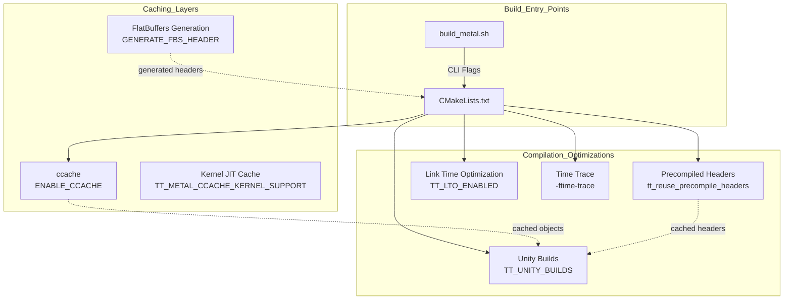

# Build Caching and Optimization

Relevant source files
*   [.github/actions/find-changed-files/action.yml](https://github.com/tenstorrent/tt-metal/blob/f30f8df0/.github/actions/find-changed-files/action.yml)
*   [.github/actions/manual-docker-bake/action.yml](https://github.com/tenstorrent/tt-metal/blob/f30f8df0/.github/actions/manual-docker-bake/action.yml)
*   [.github/actions/report-failure/action.yml](https://github.com/tenstorrent/tt-metal/blob/f30f8df0/.github/actions/report-failure/action.yml)
*   [.github/scripts/compute-platform-data.sh](https://github.com/tenstorrent/tt-metal/blob/f30f8df0/.github/scripts/compute-platform-data.sh)
*   [.github/scripts/utils/find-changed-files.sh](https://github.com/tenstorrent/tt-metal/blob/f30f8df0/.github/scripts/utils/find-changed-files.sh)
*   [.github/scripts/utils/model-charts-sync.py](https://github.com/tenstorrent/tt-metal/blob/f30f8df0/.github/scripts/utils/model-charts-sync.py)
*   [.github/workflows/basic.yaml](https://github.com/tenstorrent/tt-metal/blob/f30f8df0/.github/workflows/basic.yaml)
*   [.github/workflows/build-artifact.yaml](https://github.com/tenstorrent/tt-metal/blob/f30f8df0/.github/workflows/build-artifact.yaml)
*   [.github/workflows/build-docker-artifact.yaml](https://github.com/tenstorrent/tt-metal/blob/f30f8df0/.github/workflows/build-docker-artifact.yaml)
*   [.github/workflows/build-docker-tools.yaml](https://github.com/tenstorrent/tt-metal/blob/f30f8df0/.github/workflows/build-docker-tools.yaml)
*   [.github/workflows/build-evaluation-image.yaml](https://github.com/tenstorrent/tt-metal/blob/f30f8df0/.github/workflows/build-evaluation-image.yaml)
*   [.github/workflows/build-wrapper.yaml](https://github.com/tenstorrent/tt-metal/blob/f30f8df0/.github/workflows/build-wrapper.yaml)
*   [.github/workflows/clang-tidy-reusable.yaml](https://github.com/tenstorrent/tt-metal/blob/f30f8df0/.github/workflows/clang-tidy-reusable.yaml)
*   [.github/workflows/code-analysis.yaml](https://github.com/tenstorrent/tt-metal/blob/f30f8df0/.github/workflows/code-analysis.yaml)
*   [.github/workflows/merge-gate.yaml](https://github.com/tenstorrent/tt-metal/blob/f30f8df0/.github/workflows/merge-gate.yaml)
*   [.github/workflows/pr-gate.yaml](https://github.com/tenstorrent/tt-metal/blob/f30f8df0/.github/workflows/pr-gate.yaml)
*   [.github/workflows/sdk-examples.yaml](https://github.com/tenstorrent/tt-metal/blob/f30f8df0/.github/workflows/sdk-examples.yaml)
*   [.github/workflows/smoke.yaml](https://github.com/tenstorrent/tt-metal/blob/f30f8df0/.github/workflows/smoke.yaml)
*   [.github/workflows/ttsim.yaml](https://github.com/tenstorrent/tt-metal/blob/f30f8df0/.github/workflows/ttsim.yaml)
*   [CMakeLists.txt](https://github.com/tenstorrent/tt-metal/blob/f30f8df0/CMakeLists.txt)
*   [INSTALLING.md](https://github.com/tenstorrent/tt-metal/blob/f30f8df0/INSTALLING.md?plain=1)
*   [MANIFEST.in](https://github.com/tenstorrent/tt-metal/blob/f30f8df0/MANIFEST.in)
*   [build_metal.sh](https://github.com/tenstorrent/tt-metal/blob/f30f8df0/build_metal.sh)
*   [cmake/linking.cmake](https://github.com/tenstorrent/tt-metal/blob/f30f8df0/cmake/linking.cmake)
*   [cmake/project_options.cmake](https://github.com/tenstorrent/tt-metal/blob/f30f8df0/cmake/project_options.cmake)
*   [create_venv.sh](https://github.com/tenstorrent/tt-metal/blob/f30f8df0/create_venv.sh)
*   [dockerfile/Dockerfile](https://github.com/tenstorrent/tt-metal/blob/f30f8df0/dockerfile/Dockerfile)
*   [dockerfile/Dockerfile.basic-dev](https://github.com/tenstorrent/tt-metal/blob/f30f8df0/dockerfile/Dockerfile.basic-dev)
*   [dockerfile/Dockerfile.evaluation](https://github.com/tenstorrent/tt-metal/blob/f30f8df0/dockerfile/Dockerfile.evaluation)
*   [dockerfile/Dockerfile.tools](https://github.com/tenstorrent/tt-metal/blob/f30f8df0/dockerfile/Dockerfile.tools)
*   [dockerfile/scripts/install-ccache.sh](https://github.com/tenstorrent/tt-metal/blob/f30f8df0/dockerfile/scripts/install-ccache.sh)
*   [docs/source/tt-metalium/tools/triage.rst](https://github.com/tenstorrent/tt-metal/blob/f30f8df0/docs/source/tt-metalium/tools/triage.rst)
*   [install_dependencies.sh](https://github.com/tenstorrent/tt-metal/blob/f30f8df0/install_dependencies.sh)
*   [pyproject.toml](https://github.com/tenstorrent/tt-metal/blob/f30f8df0/pyproject.toml)
*   [scripts/install-uv.sh](https://github.com/tenstorrent/tt-metal/blob/f30f8df0/scripts/install-uv.sh)
*   [scripts/install_debugger.sh](https://github.com/tenstorrent/tt-metal/blob/f30f8df0/scripts/install_debugger.sh)
*   [setup.py](https://github.com/tenstorrent/tt-metal/blob/f30f8df0/setup.py)
*   [tests/CMakeLists.txt](https://github.com/tenstorrent/tt-metal/blob/f30f8df0/tests/CMakeLists.txt)
*   [tests/pipeline_reorg/ttnn-tests.yaml](https://github.com/tenstorrent/tt-metal/blob/f30f8df0/tests/pipeline_reorg/ttnn-tests.yaml)
*   [tests/pipeline_reorg/ttsim-skip-list.yaml](https://github.com/tenstorrent/tt-metal/blob/f30f8df0/tests/pipeline_reorg/ttsim-skip-list.yaml)
*   [tests/tt_metal/distributed/benchmark_distributed_host_buffer.cpp](https://github.com/tenstorrent/tt-metal/blob/f30f8df0/tests/tt_metal/distributed/benchmark_distributed_host_buffer.cpp)
*   [tests/tt_metal/distributed/benchmark_thread_pool.cpp](https://github.com/tenstorrent/tt-metal/blob/f30f8df0/tests/tt_metal/distributed/benchmark_thread_pool.cpp)
*   [tests/tt_metal/distributed/test_thread_pool.cpp](https://github.com/tenstorrent/tt-metal/blob/f30f8df0/tests/tt_metal/distributed/test_thread_pool.cpp)
*   [tests/tt_metal/tt_fabric/CMakeLists.txt](https://github.com/tenstorrent/tt-metal/blob/f30f8df0/tests/tt_metal/tt_fabric/CMakeLists.txt)
*   [tests/ttnn/CMakeLists.txt](https://github.com/tenstorrent/tt-metal/blob/f30f8df0/tests/ttnn/CMakeLists.txt)
*   [tests/ttnn/benchmark/cpp/benchmark_host_alloc_on_tensor_readback.cpp](https://github.com/tenstorrent/tt-metal/blob/f30f8df0/tests/ttnn/benchmark/cpp/benchmark_host_alloc_on_tensor_readback.cpp)
*   [tests/ttnn/benchmark/cpp/benchmark_host_dtype_conversion.cpp](https://github.com/tenstorrent/tt-metal/blob/f30f8df0/tests/ttnn/benchmark/cpp/benchmark_host_dtype_conversion.cpp)
*   [tests/ttnn/benchmark/cpp/host_tilizer_untilizer/tilizer_untilizer.cpp](https://github.com/tenstorrent/tt-metal/blob/f30f8df0/tests/ttnn/benchmark/cpp/host_tilizer_untilizer/tilizer_untilizer.cpp)
*   [tests/ttnn/benchmark/cpp/matmul/test_matmul_benchmark.cpp](https://github.com/tenstorrent/tt-metal/blob/f30f8df0/tests/ttnn/benchmark/cpp/matmul/test_matmul_benchmark.cpp)
*   [tests/ttnn/benchmark/cpp/operations/ternary/benchmark_where.cpp](https://github.com/tenstorrent/tt-metal/blob/f30f8df0/tests/ttnn/benchmark/cpp/operations/ternary/benchmark_where.cpp)
*   [tests/ttnn/benchmark/cpp/padding/pad_rm.cpp](https://github.com/tenstorrent/tt-metal/blob/f30f8df0/tests/ttnn/benchmark/cpp/padding/pad_rm.cpp)
*   [tests/ttnn/nightly/unit_tests/operations/experimental/deepseek_prefill/test_deepseek_moe_post_combine_reduce.py](https://github.com/tenstorrent/tt-metal/blob/f30f8df0/tests/ttnn/nightly/unit_tests/operations/experimental/deepseek_prefill/test_deepseek_moe_post_combine_reduce.py)
*   [tests/ttnn/nightly/unit_tests/operations/experimental/deepseek_prefill/test_deepseek_prefill_extract.py](https://github.com/tenstorrent/tt-metal/blob/f30f8df0/tests/ttnn/nightly/unit_tests/operations/experimental/deepseek_prefill/test_deepseek_prefill_extract.py)
*   [tests/ttnn/nightly/unit_tests/operations/experimental/deepseek_prefill/test_deepseek_prefill_insert.py](https://github.com/tenstorrent/tt-metal/blob/f30f8df0/tests/ttnn/nightly/unit_tests/operations/experimental/deepseek_prefill/test_deepseek_prefill_insert.py)
*   [tests/ttnn/nightly/unit_tests/operations/experimental/deepseek_prefill/test_moe_grouped_topk.py](https://github.com/tenstorrent/tt-metal/blob/f30f8df0/tests/ttnn/nightly/unit_tests/operations/experimental/deepseek_prefill/test_moe_grouped_topk.py)
*   [tests/ttnn/nightly/unit_tests/operations/experimental/deepseek_prefill/test_single_routed_expert.py](https://github.com/tenstorrent/tt-metal/blob/f30f8df0/tests/ttnn/nightly/unit_tests/operations/experimental/deepseek_prefill/test_single_routed_expert.py)
*   [tt_metal/CMakeLists.txt](https://github.com/tenstorrent/tt-metal/blob/f30f8df0/tt_metal/CMakeLists.txt)
*   [tt_metal/common/CMakeLists.txt](https://github.com/tenstorrent/tt-metal/blob/f30f8df0/tt_metal/common/CMakeLists.txt)
*   [tt_metal/common/sources.cmake](https://github.com/tenstorrent/tt-metal/blob/f30f8df0/tt_metal/common/sources.cmake)
*   [tt_metal/fabric/CMakeLists.txt](https://github.com/tenstorrent/tt-metal/blob/f30f8df0/tt_metal/fabric/CMakeLists.txt)
*   [tt_metal/hw/CMakeLists.txt](https://github.com/tenstorrent/tt-metal/blob/f30f8df0/tt_metal/hw/CMakeLists.txt)
*   [tt_metal/hw/toolchain/main.ld](https://github.com/tenstorrent/tt-metal/blob/f30f8df0/tt_metal/hw/toolchain/main.ld)
*   [tt_metal/impl/CMakeLists.txt](https://github.com/tenstorrent/tt-metal/blob/f30f8df0/tt_metal/impl/CMakeLists.txt)
*   [tt_metal/jit_build/CMakeLists.txt](https://github.com/tenstorrent/tt-metal/blob/f30f8df0/tt_metal/jit_build/CMakeLists.txt)
*   [tt_metal/llrt/CMakeLists.txt](https://github.com/tenstorrent/tt-metal/blob/f30f8df0/tt_metal/llrt/CMakeLists.txt)
*   [tt_metal/python_env/requirements-dev.txt](https://github.com/tenstorrent/tt-metal/blob/f30f8df0/tt_metal/python_env/requirements-dev.txt)
*   [ttnn/ttnn/download_sfpi.py](https://github.com/tenstorrent/tt-metal/blob/f30f8df0/ttnn/ttnn/download_sfpi.py)

## Purpose and Scope

This document covers build performance optimization strategies employed in the `tt-metal` build system. It describes compiler caching (`ccache`), unity builds, link-time optimization (LTO), precompiled headers, and build performance techniques. These techniques are essential for managing the complexity of a codebase that spans high-level Python/C++ (TTNN) and low-level hardware firmware (SFPI).

## Build Optimization Architecture

The `tt-metalium` build system employs multiple layers of caching and optimization to reduce build times. This is achieved through a combination of local development tools and build-time configuration.

### Build Optimization Data Flow

Sources: [CMakeLists.txt 1-172](https://github.com/tenstorrent/tt-metal/blob/f30f8df0/CMakeLists.txt#L1-L172)[build_metal.sh 1-250](https://github.com/tenstorrent/tt-metal/blob/f30f8df0/build_metal.sh#L1-L250)



Sources: [CMakeLists.txt:1-172](), [build_metal.sh:1-250]()
```
## ccache: Compiler Cache

### Overview

`ccache` is a compiler cache that speeds up recompilation by caching previous compilations. The build system supports caching for host-side C++ development and specialized caching for on-device kernel compilation.

### Host Compilation Caching

For host-side C++ development, `ccache` is enabled via CMake if `ENABLE_CCACHE` is set [CMakeLists.txt 112-115](https://github.com/tenstorrent/tt-metal/blob/f30f8df0/CMakeLists.txt#L112-L115) This is typically toggled via the `--enable-ccache` or `-c` flag in the build script [build_metal.sh 158-159](https://github.com/tenstorrent/tt-metal/blob/f30f8df0/build_metal.sh#L158-L159) The `ci-build` Docker image installs `ccache` from an upstream layer to ensure remote storage support [dockerfile/Dockerfile 150-155](https://github.com/tenstorrent/tt-metal/blob/f30f8df0/dockerfile/Dockerfile#L150-L155) The environment variable `CCACHE_TEMPDIR` is set to `/tmp/ccache` within the build environment to optimize disk I/O [dockerfile/Dockerfile 146](https://github.com/tenstorrent/tt-metal/blob/f30f8df0/dockerfile/Dockerfile#L146-L146)

### Kernel JIT Caching

The runtime system supports an experimental kernel ccache for JIT compilation of device kernels. When `TT_METAL_CCACHE_KERNEL_SUPPORT` is enabled, the system uses Redis as a remote storage backend to share compiled kernel binaries across different CI runners [.github/workflows/smoke.yaml 135-164](https://github.com/tenstorrent/tt-metal/blob/f30f8df0/.github/workflows/smoke.yaml#L135-L164)

*   **Backend**: Redis is configured via `CCACHE_REMOTE_STORAGE` with credentials provided by GitHub Secrets [.github/workflows/smoke.yaml 153-158](https://github.com/tenstorrent/tt-metal/blob/f30f8df0/.github/workflows/smoke.yaml#L153-L158)
*   **Configuration**: Includes `CCACHE_COMPILERCHECK=content` and `CCACHE_COMPRESS=true` to ensure cache integrity and efficiency [.github/workflows/smoke.yaml 139-142](https://github.com/tenstorrent/tt-metal/blob/f30f8df0/.github/workflows/smoke.yaml#L139-L142)

### Build Performance Tracing

For debugging slow compilation units, the build system supports Clang's `-ftime-trace`. This is enabled via the `ENABLE_BUILD_TIME_TRACE` CMake variable [CMakeLists.txt 149-156](https://github.com/tenstorrent/tt-metal/blob/f30f8df0/CMakeLists.txt#L149-L156) or the `--enable-time-trace` CLI flag [build_metal.sh 160-161](https://github.com/tenstorrent/tt-metal/blob/f30f8df0/build_metal.sh#L160-L161) The `ci-build` Docker image also includes `ClangBuildAnalyzer` for detailed post-build analysis of these traces [dockerfile/Dockerfile 152](https://github.com/tenstorrent/tt-metal/blob/f30f8df0/dockerfile/Dockerfile#L152-L152)

Sources: [CMakeLists.txt 112-156](https://github.com/tenstorrent/tt-metal/blob/f30f8df0/CMakeLists.txt#L112-L156)[build_metal.sh 158-161](https://github.com/tenstorrent/tt-metal/blob/f30f8df0/build_metal.sh#L158-L161)[dockerfile/Dockerfile 146-155](https://github.com/tenstorrent/tt-metal/blob/f30f8df0/dockerfile/Dockerfile#L146-L155)[.github/workflows/smoke.yaml 135-164](https://github.com/tenstorrent/tt-metal/blob/f30f8df0/.github/workflows/smoke.yaml#L135-L164)

## Unity Builds

### Concept

Unity builds combine multiple source files into a single translation unit, reducing header parsing overhead and improving optimization scope across files.

### Implementation

*   **Configuration**: The global status of unity builds is tracked via the `TT_UNITY_BUILDS` variable [CMakeLists.txt 141](https://github.com/tenstorrent/tt-metal/blob/f30f8df0/CMakeLists.txt#L141-L141)
*   **Logic**: The build system includes `unity.cmake` to handle the batching of source files [CMakeLists.txt 83](https://github.com/tenstorrent/tt-metal/blob/f30f8df0/CMakeLists.txt#L83-L83)
*   **Interaction**: The system uses `add_compile_options` with generator expressions to manage configuration-specific flags (e.g., `-O3` for `RelWithDebInfo`) which interact with the unity build system [CMakeLists.txt 48-62](https://github.com/tenstorrent/tt-metal/blob/f30f8df0/CMakeLists.txt#L48-L62)

Sources: [CMakeLists.txt 48-141](https://github.com/tenstorrent/tt-metal/blob/f30f8df0/CMakeLists.txt#L48-L141)

## Link Time Optimization (LTO)

LTO performs whole-program optimization at link time. It is controlled by the `TT_LTO_ENABLED` flag [CMakeLists.txt 142](https://github.com/tenstorrent/tt-metal/blob/f30f8df0/CMakeLists.txt#L142-L142)

*   **Configuration**: It can be enabled via the `--enable-lto` flag in `build_metal.sh`[build_metal.sh 226-227](https://github.com/tenstorrent/tt-metal/blob/f30f8df0/build_metal.sh#L226-L227) or through the `enable-lto` input in GitHub Actions workflows like `build-artifact.yaml`[.github/workflows/build-artifact.yaml 67-71](https://github.com/tenstorrent/tt-metal/blob/f30f8df0/.github/workflows/build-artifact.yaml#L67-L71) and `code-analysis.yaml`[.github/workflows/code-analysis.yaml 34-38](https://github.com/tenstorrent/tt-metal/blob/f30f8df0/.github/workflows/code-analysis.yaml#L34-L38)
*   **Linker Interaction**: The build system is designed to augment CMake's built-in per-config flags rather than replacing them, ensuring LTO composes correctly with toolchain files [CMakeLists.txt 40-44](https://github.com/tenstorrent/tt-metal/blob/f30f8df0/CMakeLists.txt#L40-L44)
*   **Performance**: The `ci-build` Docker image installs the `mold` linker for faster linking, which is critical for performance when LTO is enabled [dockerfile/Dockerfile 154](https://github.com/tenstorrent/tt-metal/blob/f30f8df0/dockerfile/Dockerfile#L154-L154)
*   **Toolchain Support**: Specific toolchain files, such as `cmake/x86_64-linux-clang-20-libstdcpp-toolchain.cmake`, are used in CI to provide the necessary LLVM utilities for robust LTO support [.github/workflows/build-artifact.yaml 36-40](https://github.com/tenstorrent/tt-metal/blob/f30f8df0/.github/workflows/build-artifact.yaml#L36-L40)

Sources: [CMakeLists.txt 40-142](https://github.com/tenstorrent/tt-metal/blob/f30f8df0/CMakeLists.txt#L40-L142)[build_metal.sh 226-227](https://github.com/tenstorrent/tt-metal/blob/f30f8df0/build_metal.sh#L226-L227)[.github/workflows/build-artifact.yaml 36-71](https://github.com/tenstorrent/tt-metal/blob/f30f8df0/.github/workflows/build-artifact.yaml#L36-L71)[.github/workflows/code-analysis.yaml 34-38](https://github.com/tenstorrent/tt-metal/blob/f30f8df0/.github/workflows/code-analysis.yaml#L34-L38)[dockerfile/Dockerfile 154](https://github.com/tenstorrent/tt-metal/blob/f30f8df0/dockerfile/Dockerfile#L154-L154)

## Precompiled Headers (PCH)

### Purpose

Precompiled headers cache the compilation of commonly included headers (like `<vector>`, `<memory>`, and core utility headers). This is critical for reducing compilation time across the numerous translation units in `tt-metal`.

### Implementation

The build system defines specific PCH targets and reuse patterns:

1.   **Global Integration**: The build system uses `include(unity)` and `include(project_options)` to manage PCH logic [CMakeLists.txt 82-83](https://github.com/tenstorrent/tt-metal/blob/f30f8df0/CMakeLists.txt#L82-L83)
2.   **Target Configuration**: The core library `tt_metal` is configured to reuse a common PCH target named `TT::CommonPCH` via the `tt_reuse_precompile_headers` function [tt_metal/CMakeLists.txt 119](https://github.com/tenstorrent/tt-metal/blob/f30f8df0/tt_metal/CMakeLists.txt#L119-L119)

### PCH Code Entity Mapping

Sources: [CMakeLists.txt 82-83](https://github.com/tenstorrent/tt-metal/blob/f30f8df0/CMakeLists.txt#L82-L83)[tt_metal/CMakeLists.txt 119](https://github.com/tenstorrent/tt-metal/blob/f30f8df0/tt_metal/CMakeLists.txt#L119-L119)

## Build Performance Techniques

### Dependency Management

The build system uses `CPM` (CMake Package Manager) to manage third-party dependencies efficiently [CMakeLists.txt 162](https://github.com/tenstorrent/tt-metal/blob/f30f8df0/CMakeLists.txt#L162-L162) To prevent external projects from triggering unnecessary analysis, subdirectories for third-party code are added with the `SYSTEM` flag where supported [CMakeLists.txt 168-169](https://github.com/tenstorrent/tt-metal/blob/f30f8df0/CMakeLists.txt#L168-L169)

### FlatBuffers Generation Caching

The system includes custom FlatBuffers generation logic that only rebuilds headers when the underlying `.fbs` schema files change [tt_metal/CMakeLists.txt 16-29](https://github.com/tenstorrent/tt-metal/blob/f30f8df0/tt_metal/CMakeLists.txt#L16-L29) This prevents redundant header generation for targets like `mesh_coordinate.fbs`.

### Docker Build Optimization

The Docker environment uses multi-stage builds to cache tool layers (ccache, mold, sfpi, cmake) independently [dockerfile/Dockerfile 48-60](https://github.com/tenstorrent/tt-metal/blob/f30f8df0/dockerfile/Dockerfile#L48-L60) This allows for rapid container reconstruction when only application code changes. It specifically uses `uv` for Python dependency management, which provides significant speedups in environment setup [dockerfile/Dockerfile 98](https://github.com/tenstorrent/tt-metal/blob/f30f8df0/dockerfile/Dockerfile#L98-L98)

### Build Configuration Reference

| Flag | CMake Variable | Purpose |
| --- | --- | --- |
| LTO | `TT_LTO_ENABLED` | Enable Link Time Optimization [CMakeLists.txt 142](https://github.com/tenstorrent/tt-metal/blob/f30f8df0/CMakeLists.txt#L142-L142) |
| Unity Builds | `TT_UNITY_BUILDS` | Combine source files for faster compilation [CMakeLists.txt 141](https://github.com/tenstorrent/tt-metal/blob/f30f8df0/CMakeLists.txt#L141-L141) |
| ccache | `ENABLE_CCACHE` | Enable host-side compiler caching [CMakeLists.txt 112](https://github.com/tenstorrent/tt-metal/blob/f30f8df0/CMakeLists.txt#L112-L112) |
| Build Trace | `ENABLE_BUILD_TIME_TRACE` | Generate `-ftime-trace` for Clang profiling [CMakeLists.txt 149](https://github.com/tenstorrent/tt-metal/blob/f30f8df0/CMakeLists.txt#L149-L149) |
| Kernel Cache | `TT_METAL_CCACHE_KERNEL_SUPPORT` | Enable JIT kernel compilation caching [.github/workflows/smoke.yaml 146](https://github.com/tenstorrent/tt-metal/blob/f30f8df0/.github/workflows/smoke.yaml#L146-L146) |

Sources: [CMakeLists.txt 112-162](https://github.com/tenstorrent/tt-metal/blob/f30f8df0/CMakeLists.txt#L112-L162)[tt_metal/CMakeLists.txt 16-119](https://github.com/tenstorrent/tt-metal/blob/f30f8df0/tt_metal/CMakeLists.txt#L16-L119)[dockerfile/Dockerfile 48-98](https://github.com/tenstorrent/tt-metal/blob/f30f8df0/dockerfile/Dockerfile#L48-L98)[.github/workflows/smoke.yaml 146](https://github.com/tenstorrent/tt-metal/blob/f30f8df0/.github/workflows/smoke.yaml#L146-L146)

Dismiss
Refresh this wiki

Enter email to refresh
