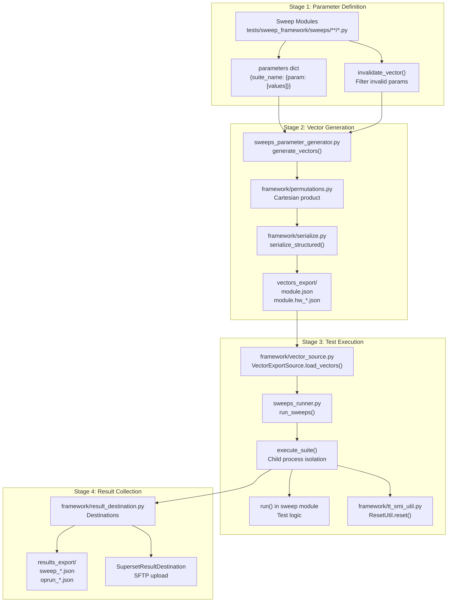
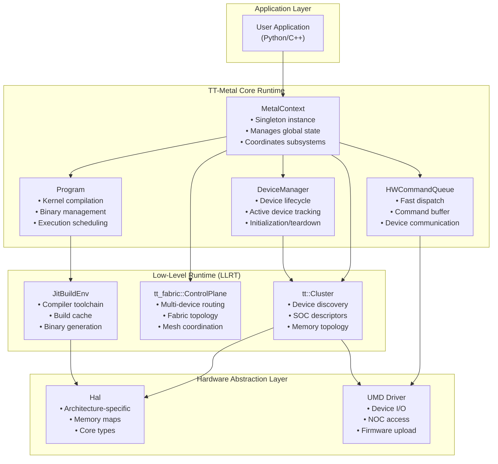
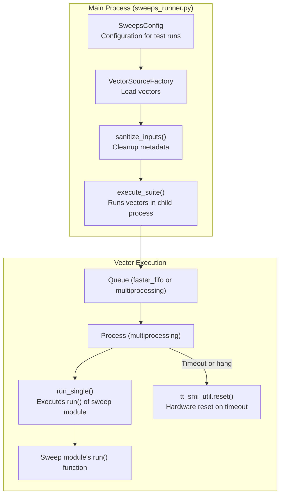

# Sweep Test Framework

Relevant source files
*   [.github/actions/sweep-run-analysis/scripts/push_sweep_results.py](https://github.com/tenstorrent/tt-metal/blob/f30f8df0/.github/actions/sweep-run-analysis/scripts/push_sweep_results.py)
*   [.github/workflows/ttnn-model-trace-sweep-validation-impl.yaml](https://github.com/tenstorrent/tt-metal/blob/f30f8df0/.github/workflows/ttnn-model-trace-sweep-validation-impl.yaml)
*   [.github/workflows/ttnn-model-trace-sweep-validation.yaml](https://github.com/tenstorrent/tt-metal/blob/f30f8df0/.github/workflows/ttnn-model-trace-sweep-validation.yaml)
*   [.github/workflows/ttnn-run-sweeps-impl.yaml](https://github.com/tenstorrent/tt-metal/blob/f30f8df0/.github/workflows/ttnn-run-sweeps-impl.yaml)
*   [.github/workflows/ttnn-run-sweeps.yaml](https://github.com/tenstorrent/tt-metal/blob/f30f8df0/.github/workflows/ttnn-run-sweeps.yaml)
*   [model_tracer/GUIDE.md](https://github.com/tenstorrent/tt-metal/blob/f30f8df0/model_tracer/GUIDE.md?plain=1)
*   [model_tracer/README.md](https://github.com/tenstorrent/tt-metal/blob/f30f8df0/model_tracer/README.md?plain=1)
*   [model_tracer/destructively_create_ttnn_ops_schema_v6.sql](https://github.com/tenstorrent/tt-metal/blob/f30f8df0/model_tracer/destructively_create_ttnn_ops_schema_v6.sql)
*   [model_tracer/generic_ops_tracer.py](https://github.com/tenstorrent/tt-metal/blob/f30f8df0/model_tracer/generic_ops_tracer.py)
*   [model_tracer/migrate_v6_add_pytest_args.sql](https://github.com/tenstorrent/tt-metal/blob/f30f8df0/model_tracer/migrate_v6_add_pytest_args.sql)
*   [model_tracer/trace_selection_registry.yaml](https://github.com/tenstorrent/tt-metal/blob/f30f8df0/model_tracer/trace_selection_registry.yaml)
*   [model_tracer/tracer_pytest_plugin.py](https://github.com/tenstorrent/tt-metal/blob/f30f8df0/model_tracer/tracer_pytest_plugin.py)
*   [tests/README.md](https://github.com/tenstorrent/tt-metal/blob/f30f8df0/tests/README.md?plain=1)
*   [tests/sweep_framework/README.md](https://github.com/tenstorrent/tt-metal/blob/f30f8df0/tests/sweep_framework/README.md?plain=1)
*   [tests/sweep_framework/framework/compute_sweep_matrix.py](https://github.com/tenstorrent/tt-metal/blob/f30f8df0/tests/sweep_framework/framework/compute_sweep_matrix.py)
*   [tests/sweep_framework/framework/compute_sweep_matrix_README.md](https://github.com/tenstorrent/tt-metal/blob/f30f8df0/tests/sweep_framework/framework/compute_sweep_matrix_README.md?plain=1)
*   [tests/sweep_framework/framework/compute_validation_sweep_matrix.py](https://github.com/tenstorrent/tt-metal/blob/f30f8df0/tests/sweep_framework/framework/compute_validation_sweep_matrix.py)
*   [tests/sweep_framework/framework/constants.py](https://github.com/tenstorrent/tt-metal/blob/f30f8df0/tests/sweep_framework/framework/constants.py)
*   [tests/sweep_framework/framework/matrix_runner_config.py](https://github.com/tenstorrent/tt-metal/blob/f30f8df0/tests/sweep_framework/framework/matrix_runner_config.py)
*   [tests/sweep_framework/framework/result_destination.py](https://github.com/tenstorrent/tt-metal/blob/f30f8df0/tests/sweep_framework/framework/result_destination.py)
*   [tests/sweep_framework/framework/serialize.py](https://github.com/tenstorrent/tt-metal/blob/f30f8df0/tests/sweep_framework/framework/serialize.py)
*   [tests/sweep_framework/framework/statuses.py](https://github.com/tenstorrent/tt-metal/blob/f30f8df0/tests/sweep_framework/framework/statuses.py)
*   [tests/sweep_framework/framework/sweeps_workflow_verification.py](https://github.com/tenstorrent/tt-metal/blob/f30f8df0/tests/sweep_framework/framework/sweeps_workflow_verification.py)
*   [tests/sweep_framework/framework/tt_smi_util.py](https://github.com/tenstorrent/tt-metal/blob/f30f8df0/tests/sweep_framework/framework/tt_smi_util.py)
*   [tests/sweep_framework/framework/vector_source.py](https://github.com/tenstorrent/tt-metal/blob/f30f8df0/tests/sweep_framework/framework/vector_source.py)
*   [tests/sweep_framework/load_ttnn_ops_data_v2.py](https://github.com/tenstorrent/tt-metal/blob/f30f8df0/tests/sweep_framework/load_ttnn_ops_data_v2.py)
*   [tests/sweep_framework/requirements-sweeps.txt](https://github.com/tenstorrent/tt-metal/blob/f30f8df0/tests/sweep_framework/requirements-sweeps.txt)
*   [tests/sweep_framework/run_collective_update.py](https://github.com/tenstorrent/tt-metal/blob/f30f8df0/tests/sweep_framework/run_collective_update.py)
*   [tests/sweep_framework/split_vectors_by_axis.py](https://github.com/tenstorrent/tt-metal/blob/f30f8df0/tests/sweep_framework/split_vectors_by_axis.py)
*   [tests/sweep_framework/sweep_utils/ccl_common.py](https://github.com/tenstorrent/tt-metal/blob/f30f8df0/tests/sweep_framework/sweep_utils/ccl_common.py)
*   [tests/sweep_framework/sweep_utils/perf_utils.py](https://github.com/tenstorrent/tt-metal/blob/f30f8df0/tests/sweep_framework/sweep_utils/perf_utils.py)
*   [tests/sweep_framework/sweeps/model_traced/all_gather_async_model_traced.py](https://github.com/tenstorrent/tt-metal/blob/f30f8df0/tests/sweep_framework/sweeps/model_traced/all_gather_async_model_traced.py)
*   [tests/sweep_framework/sweeps/model_traced/linear_model_traced.py](https://github.com/tenstorrent/tt-metal/blob/f30f8df0/tests/sweep_framework/sweeps/model_traced/linear_model_traced.py)
*   [tests/sweep_framework/sweeps/model_traced/matmul_model_traced.py](https://github.com/tenstorrent/tt-metal/blob/f30f8df0/tests/sweep_framework/sweeps/model_traced/matmul_model_traced.py)
*   [tests/sweep_framework/sweeps/model_traced/untilize_with_unpadding_model_traced.py](https://github.com/tenstorrent/tt-metal/blob/f30f8df0/tests/sweep_framework/sweeps/model_traced/untilize_with_unpadding_model_traced.py)
*   [tests/sweep_framework/sweeps_parameter_generator.py](https://github.com/tenstorrent/tt-metal/blob/f30f8df0/tests/sweep_framework/sweeps_parameter_generator.py)
*   [tests/sweep_framework/sweeps_runner.py](https://github.com/tenstorrent/tt-metal/blob/f30f8df0/tests/sweep_framework/sweeps_runner.py)
*   [tests/sweep_framework/test_load_ttnn_ops_data_v2_functional.py](https://github.com/tenstorrent/tt-metal/blob/f30f8df0/tests/sweep_framework/test_load_ttnn_ops_data_v2_functional.py)
*   [tests/sweep_framework/test_memory_capture_integration.py](https://github.com/tenstorrent/tt-metal/blob/f30f8df0/tests/sweep_framework/test_memory_capture_integration.py)
*   [tt_metal/api/tt-metalium/experimental/kernel_cache.hpp](https://github.com/tenstorrent/tt-metal/blob/f30f8df0/tt_metal/api/tt-metalium/experimental/kernel_cache.hpp)

The Sweep Test Framework is a parameterized testing system designed to validate TTNN operations with extensive coverage over numerous parameter permutations. It automates the generation of operation parameters from code or model-traced data, executes tests exhaustively across these parameter spaces, and collects detailed validation, performance, and memory metrics. The framework decouples vector generation, test execution, and result storage, facilitating flexible workflows for both local development and CI/CD pipelines.

For detailed guidance on writing sweep test modules, see the [`tests/sweep_framework/README.md`](https://github.com/tenstorrent/tt-metal/blob/f30f8df0/%60tests/sweep_framework/README.md%60) document. The framework is distinct from the unit test runner, which is a pytest-based system documented under CI/CD Testing Infrastructure (Section 6.4).

* * *

## System Architecture

The sweep test system consists of four principal stages:

1.   **Parameter Definition**: Modules define parameter grids and optional vector invalidation logic.
2.   **Vector Generation**: Cartesian permutations of parameters are serialized as test vectors with metadata.
3.   **Test Execution**: Individual vectors are executed, generally in isolated subprocesses with device reset on timeouts.
4.   **Result Collection**: Results, including pass/fail and optional performance data, are recorded for analysis and CI reporting.

**Diagram: Sweep Test Framework Architecture**

Sources: [tests/sweep_framework/sweeps_parameter_generator.py 154-183](https://github.com/tenstorrent/tt-metal/blob/f30f8df0/tests/sweep_framework/sweeps_parameter_generator.py#L154-L183)[tests/sweep_framework/sweeps_runner.py 38-63](https://github.com/tenstorrent/tt-metal/blob/f30f8df0/tests/sweep_framework/sweeps_runner.py#L38-L63)[tests/sweep_framework/framework/result_destination.py 25-32](https://github.com/tenstorrent/tt-metal/blob/f30f8df0/tests/sweep_framework/framework/result_destination.py#L25-L32)

* * *




Sources: [tests/sweep_framework/sweeps_parameter_generator.py:154-183](), [tests/sweep_framework/sweeps_runner.py:38-63](), [tests/sweep_framework/framework/result_destination.py:25-32]()

---
```



## Parameter Definition and Sweep Modules

Sweep test modules reside under `tests/sweep_framework/sweeps/` and define comprehensive parameter spaces for their operations. Each module exports:

*   A `parameters` dictionary that defines named suites, each mapping parameter names to lists of values.
*   A `run()` function implementing the test logic per parameter combination.
*   Optionally, an `invalidate_vector(test_vector)` function to filter invalid parameter sets before execution.
*   Optionally, a `mesh_device_fixture()` function to override device selection for multi-chip testing.

### Parameter Structure

Parameters are grouped into suites to classify tests by frequency or purpose (e.g., `nightly`, `default`, `xfail_*`). The framework generates all Cartesian product permutations within each suite's parameter lists.

Example:

### Vector Invalidation

To avoid running invalid parameter combinations, a module may define:

This filter runs on CPU before test execution and marks such vectors as `NOT_RUN` with the specified reason.

### Routing by Mesh Shape and Hardware

The framework supports routing vectors by hardware and mesh-device topology. Functions like `group_vectors_by_mesh_shape` and `group_vectors_by_hardware_and_mesh`[tests/sweep_framework/sweeps_parameter_generator.py 91-201](https://github.com/tenstorrent/tt-metal/blob/f30f8df0/tests/sweep_framework/sweeps_parameter_generator.py#L91-L201) analyze vectors' `traced_machine_info` to categorize them for multi-chip CI runner assignment.

Sources: [tests/sweep_framework/README.md 67-127](https://github.com/tenstorrent/tt-metal/blob/f30f8df0/tests/sweep_framework/README.md?plain=1#L67-L127)[tests/sweep_framework/sweeps_parameter_generator.py 36-88](https://github.com/tenstorrent/tt-metal/blob/f30f8df0/tests/sweep_framework/sweeps_parameter_generator.py#L36-L88)[tests/sweep_framework/sweeps_parameter_generator.py 196-201](https://github.com/tenstorrent/tt-metal/blob/f30f8df0/tests/sweep_framework/sweeps_parameter_generator.py#L196-L201)

* * *

## Vector Generation Pipeline

The vector generation module (`sweeps_parameter_generator.py`) generates the flattened set of test parameters (vectors) to be consumed by test runners. It performs the following steps:

1.   **Permutations**: Uses Cartesian product on parameter lists within suites.
2.   **Invalidation**: Applies `invalidate_vector` to mark invalid vectors.
3.   **Metadata Augmentation**: Adds `input_hash`, `suite_name`, `validity`, and `sweep_name`.
4.   **Serialization**: Converts complex TTNN types to JSON-serializable formats.
5.   **Hashing**: Generates stable SHA224 hashes (`input_hash`) to identify vectors uniquely.
6.   **Grouping**: Groups vectors by mesh shape or hardware identifiers for routing.
7.   **File Writing**: Writes vectors serialized as JSON files under `vectors_export/`.

**Diagram: Vector Generation Data Flow**

Sources: [tests/sweep_framework/sweeps_parameter_generator.py 154-183](https://github.com/tenstorrent/tt-metal/blob/f30f8df0/tests/sweep_framework/sweeps_parameter_generator.py#L154-L183)[tests/sweep_framework/sweeps_parameter_generator.py 186-201](https://github.com/tenstorrent/tt-metal/blob/f30f8df0/tests/sweep_framework/sweeps_parameter_generator.py#L186-L201)[tests/sweep_framework/framework/serialize.py 1-50](https://github.com/tenstorrent/tt-metal/blob/f30f8df0/tests/sweep_framework/framework/serialize.py#L1-L50)

* * *




```mermaid
graph LR
    subgraph "Input: Sweep Module"
        ParamDict["parameters dict {suite: {param: [values]}}"]
        InvalidateFunc["invalidate_vector()"]
    end
    
    subgraph "Generation Process"
        Permute["permutations()<br/>Cartesian product"]
        AddMeta["Add metadata:<br/>suite_name, validity,<br/>status, sweep_name"]
        Invalidate["Call invalidate_vector()<br/>Flag invalid vectors"]
        Serialize["serialize_structured()<br/>TTNN object conversion"]
        Hash["Compute SHA224 hash<br/>input_hash"]
        GroupMesh["group_vectors_by_mesh_shape()"]
        GroupHW["group_vectors_by_hardware_and_mesh()"]
    end
    
    subgraph "Output: Vector Files"
        JSON1["module.json"]
        JSON2["module.hw_wormhole_n300_1c.json"]
    end
    
    ParamDict --> Permute
    Permute --> AddMeta
    AddMeta --> Invalidate
    InvalidateFunc --> Invalidate
    Invalidate --> Serialize
    Serialize --> Hash
    Hash --> GroupMesh
    GroupMesh --> GroupHW
    GroupHW --> JSON1
    GroupHW --> JSON2
```

Sources: [tests/sweep_framework/sweeps_parameter_generator.py:154-183](), [tests/sweep_framework/sweeps_parameter_generator.py:186-201](), [tests/sweep_framework/framework/serialize.py:1-50]()

---
```
## Test Execution Architecture

The test runner script `sweeps_runner.py` loads vectors from the configured source, then executes test vectors using the associated sweep modules.

**Diagram: Test Execution Flow**

Sources: [tests/sweep_framework/sweeps_runner.py 38-63](https://github.com/tenstorrent/tt-metal/blob/f30f8df0/tests/sweep_framework/sweeps_runner.py#L38-L63)[tests/sweep_framework/sweeps_runner.py 158-176](https://github.com/tenstorrent/tt-metal/blob/f30f8df0/tests/sweep_framework/sweeps_runner.py#L158-L176)[tests/sweep_framework/sweep_utils/perf_utils.py 35-36](https://github.com/tenstorrent/tt-metal/blob/f30f8df0/tests/sweep_framework/sweep_utils/perf_utils.py#L35-L36)




Sources: [tests/sweep_framework/sweeps_runner.py:38-63](), [tests/sweep_framework/sweeps_runner.py:158-176](), [tests/sweep_framework/sweep_utils/perf_utils.py:35-36]()
```
### Process Isolation and Watchdog

*   Each vector's `run()` executes in a separate child process to isolate runtime errors or hardware hangs.
*   Timeouts are defined per module by a `TIMEOUT` constant (default 30 seconds).
*   On timeout, the child process is killed and the hardware device is reset using `tt_smi_util.reset()` to avoid cascading failures.

### Performance Measurement

The runner supports multiple metrics modes via `SweepsConfig` flags:

*   **measure_perf**: Measures end-to-end execution duration.
*   **measure_perf_with_cache**: Executes and compares cached vs uncached performance via `run_with_cache_comparison()`.
*   **measure_device_perf**: Collects device-resident performance counters.
*   **measure_memory**: Tracks peak L1/DRAM memory usage during op execution.

Sources: [tests/sweep_framework/sweeps_runner.py 38-62](https://github.com/tenstorrent/tt-metal/blob/f30f8df0/tests/sweep_framework/sweeps_runner.py#L38-L62)[tests/sweep_framework/sweep_utils/perf_utils.py 35-36](https://github.com/tenstorrent/tt-metal/blob/f30f8df0/tests/sweep_framework/sweep_utils/perf_utils.py#L35-L36)

* * *

## Result Collection and Reporting

Test results are aggregated and serialized by `framework/result_destination.py`. This module provides flexible sinks:

*   File output to JSON under `results_export/`.
*   Optional upload to a Superset dashboard via SFTP.

### Metric Extraction and Normalization

*   Performance metrics are normalized into sets of `PerfMetric` objects.
*   End-to-end metrics include cached and uncached latencies with distinct keys `e2e_perf_uncached_ms` and `e2e_perf_cached_ms`.
*   Device performance counters are normalized and suffixed per cache state (`_cached`, `_uncached`).
*   Memory usage metrics for L1 and DRAM peak consumption are captured.

### Status and Classification Mapping

Test execution statuses from the runner are mapped to standardized `TestStatus`:

| Internal Status | Reported TestStatus |
| --- | --- |
| `PASS` | "pass" |
| `FAIL_ASSERT_EXCEPTION` | "fail_assert_exception" |
| `FAIL_CRASH_HANG` | "fail_crash_hang" |
| `FAIL_L1_OUT_OF_MEM` | "fail_l1_out_of_mem" |
| `FAIL_WATCHER` | "fail_watcher" |
| `XFAIL` (Expected Failure) | "xfail" |
| `XPASS` (Unexpected Pass) | "xpass" |

Sources: [tests/sweep_framework/framework/result_destination.py 103-112](https://github.com/tenstorrent/tt-metal/blob/f30f8df0/tests/sweep_framework/framework/result_destination.py#L103-L112)[tests/sweep_framework/framework/result_destination.py 144-177](https://github.com/tenstorrent/tt-metal/blob/f30f8df0/tests/sweep_framework/framework/result_destination.py#L144-L177)[tests/sweep_framework/framework/statuses.py 1-40](https://github.com/tenstorrent/tt-metal/blob/f30f8df0/tests/sweep_framework/framework/statuses.py#L1-L40)

* * *

## Model-Traced Operations and CI Matrix Integration

The Sweep Framework tightly integrates with the `model_tracer` subsystem to include real-world operation configurations collected from large production models.

### Model Tracer and Trace Selection

*   `generic_ops_tracer.py` extracts operation parameters from actual model runs (either pytest or standalone scripts) using a lightweight `--trace-params` method [model_tracer/generic_ops_tracer.py 6-42](https://github.com/tenstorrent/tt-metal/blob/f30f8df0/model_tracer/generic_ops_tracer.py#L6-L42)
*   These configurations are loaded into a centralized PostgreSQL database and managed by `load_ttnn_ops_data_v2.py`.
*   Selection of traces and models for inclusion in CI sweeping is controlled by `trace_selection_registry.yaml`[model_tracer/trace_selection_registry.yaml 1-205](https://github.com/tenstorrent/tt-metal/blob/f30f8df0/model_tracer/trace_selection_registry.yaml#L1-L205)

### CI Matrix Routing and Scheduling

*   The matrix runner configuration in `matrix_runner_config.py` maps hardware groups to logical runners and CI jobs [tests/sweep_framework/framework/matrix_runner_config.py 5-186](https://github.com/tenstorrent/tt-metal/blob/f30f8df0/tests/sweep_framework/framework/matrix_runner_config.py#L5-L186)
*   Sweep types run on schedules or dispatch commands configured in `.github/workflows/ttnn-run-sweeps.yaml`.
*   Key sweep types include: 
    *   **Nightly**: Common validation subset.
    *   **Comprehensive**: Exhaustive permutations for deep validation.
    *   **Model Traced**: Real production workloads extracted via tracer.
    *   **Lead Models**: Prioritized models with enhanced CI resources.

*   Routing respects mesh-device topology and hardware-specific capabilities to minimize test failures and maximize relevant coverage.

Sources: [tests/sweep_framework/framework/matrix_runner_config.py 1-186](https://github.com/tenstorrent/tt-metal/blob/f30f8df0/tests/sweep_framework/framework/matrix_runner_config.py#L1-L186)[.github/workflows/ttnn-run-sweeps.yaml 1-38](https://github.com/tenstorrent/tt-metal/blob/f30f8df0/.github/workflows/ttnn-run-sweeps.yaml#L1-L38)[model_tracer/generic_ops_tracer.py 1-42](https://github.com/tenstorrent/tt-metal/blob/f30f8df0/model_tracer/generic_ops_tracer.py#L1-L42)[model_tracer/trace_selection_registry.yaml 1-205](https://github.com/tenstorrent/tt-metal/blob/f30f8df0/model_tracer/trace_selection_registry.yaml#L1-L205)

* * *

# Summary

The Sweep Test Framework provides a robust infrastructure for exhaustive, parameterized validation of TTNN neural network operations across Tenstorrent hardware. Its design prioritizes flexibility, reproducibility, and comprehensive real-world coverage by:

*   Defining parameter spaces clearly in self-contained sweep modules.
*   Auto-generating test vectors with precise invalidation handling.
*   Executing tests isolated in subprocesses, with tight integration to hardware reset mechanisms.
*   Capturing extensive results including pass/fail, performance, and memory metrics.
*   Integrating real-operation parameters from production model traces for high relevance.
*   Mapping tests intelligently onto multi-chip hardware topologies and CI runners.

This framework underpins continuous validation and ensures correctness and performance across diverse neural network workloads.

* * *

# References to Key Files

| Filename | Purpose |
| --- | --- |
| `tests/sweep_framework/sweeps_parameter_generator.py` | Parameter sweep vector generation |
| `tests/sweep_framework/sweeps_runner.py` | Execution of sweep vectors |
| `tests/sweep_framework/framework/vector_source.py` | Abstracts vector loading from various sources |
| `tests/sweep_framework/framework/result_destination.py` | Result serialization and reporting |
| `tests/sweep_framework/framework/matrix_runner_config.py` | CI matrix routing configuration |
| `model_tracer/generic_ops_tracer.py` | Operation parameter extraction from model runs |
| `model_tracer/trace_selection_registry.yaml` | Controlled selection of model traces for CI |

* * *

# References for Diagram Annotations

| Diagram Label | File and Lines |
| --- | --- |
| Sweep Modules & Parameters | `tests/sweep_framework/README.md:67-127` |
| Vector Generation | `tests/sweep_framework/sweeps_parameter_generator.py:154-183` |
| Test Execution Flow | `tests/sweep_framework/sweeps_runner.py:38-63` |
| Result Collection | `tests/sweep_framework/framework/result_destination.py:103-112` |

* * *

# End of Section 6.10 Sweep Test Framework

Dismiss
Refresh this wiki

Enter email to refresh
