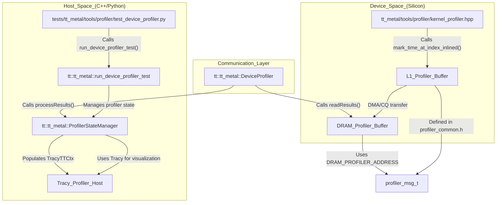

# Performance and Profiler Testing

Relevant source files
*   [.github/CODEOWNERS](https://github.com/tenstorrent/tt-metal/blob/f30f8df0/.github/CODEOWNERS)
*   [.github/workflows/all-model-tests.yaml](https://github.com/tenstorrent/tt-metal/blob/f30f8df0/.github/workflows/all-model-tests.yaml)
*   [.github/workflows/fast-dispatch-full-regressions-and-models-impl.yaml](https://github.com/tenstorrent/tt-metal/blob/f30f8df0/.github/workflows/fast-dispatch-full-regressions-and-models-impl.yaml)
*   [.github/workflows/fast-dispatch-full-regressions-and-models.yaml](https://github.com/tenstorrent/tt-metal/blob/f30f8df0/.github/workflows/fast-dispatch-full-regressions-and-models.yaml)
*   [.github/workflows/galaxy-deepseek-tests-impl.yaml](https://github.com/tenstorrent/tt-metal/blob/f30f8df0/.github/workflows/galaxy-deepseek-tests-impl.yaml)
*   [.github/workflows/galaxy-deepseek-tests.yaml](https://github.com/tenstorrent/tt-metal/blob/f30f8df0/.github/workflows/galaxy-deepseek-tests.yaml)
*   [.github/workflows/galaxy-demo-tests-impl.yaml](https://github.com/tenstorrent/tt-metal/blob/f30f8df0/.github/workflows/galaxy-demo-tests-impl.yaml)
*   [.github/workflows/galaxy-demo-tests.yaml](https://github.com/tenstorrent/tt-metal/blob/f30f8df0/.github/workflows/galaxy-demo-tests.yaml)
*   [.github/workflows/galaxy-profiler-tests.yaml](https://github.com/tenstorrent/tt-metal/blob/f30f8df0/.github/workflows/galaxy-profiler-tests.yaml)
*   [.github/workflows/galaxy-stress-tests-impl.yaml](https://github.com/tenstorrent/tt-metal/blob/f30f8df0/.github/workflows/galaxy-stress-tests-impl.yaml)
*   [.github/workflows/galaxy-stress-tests.yaml](https://github.com/tenstorrent/tt-metal/blob/f30f8df0/.github/workflows/galaxy-stress-tests.yaml)
*   [.github/workflows/galaxy-unit-tests-impl.yaml](https://github.com/tenstorrent/tt-metal/blob/f30f8df0/.github/workflows/galaxy-unit-tests-impl.yaml)
*   [.github/workflows/galaxy-unit-tests.yaml](https://github.com/tenstorrent/tt-metal/blob/f30f8df0/.github/workflows/galaxy-unit-tests.yaml)
*   [.github/workflows/metal-run-microbenchmarks.yaml](https://github.com/tenstorrent/tt-metal/blob/f30f8df0/.github/workflows/metal-run-microbenchmarks.yaml)
*   [.github/workflows/perf-device-models-impl.yaml](https://github.com/tenstorrent/tt-metal/blob/f30f8df0/.github/workflows/perf-device-models-impl.yaml)
*   [.github/workflows/perf-device-models.yaml](https://github.com/tenstorrent/tt-metal/blob/f30f8df0/.github/workflows/perf-device-models.yaml)
*   [.github/workflows/perf-models-impl.yaml](https://github.com/tenstorrent/tt-metal/blob/f30f8df0/.github/workflows/perf-models-impl.yaml)
*   [.github/workflows/perf-models.yaml](https://github.com/tenstorrent/tt-metal/blob/f30f8df0/.github/workflows/perf-models.yaml)
*   [.github/workflows/pipeline-select-galaxy.yaml](https://github.com/tenstorrent/tt-metal/blob/f30f8df0/.github/workflows/pipeline-select-galaxy.yaml)
*   [.github/workflows/pipeline-select-t3k.yaml](https://github.com/tenstorrent/tt-metal/blob/f30f8df0/.github/workflows/pipeline-select-t3k.yaml)
*   [.github/workflows/pipeline-select.yaml](https://github.com/tenstorrent/tt-metal/blob/f30f8df0/.github/workflows/pipeline-select.yaml)
*   [.github/workflows/single-card-demo-tests-impl.yaml](https://github.com/tenstorrent/tt-metal/blob/f30f8df0/.github/workflows/single-card-demo-tests-impl.yaml)
*   [.github/workflows/single-card-demo-tests.yaml](https://github.com/tenstorrent/tt-metal/blob/f30f8df0/.github/workflows/single-card-demo-tests.yaml)
*   [.github/workflows/t3000-demo-tests-impl.yaml](https://github.com/tenstorrent/tt-metal/blob/f30f8df0/.github/workflows/t3000-demo-tests-impl.yaml)
*   [.github/workflows/t3000-demo-tests.yaml](https://github.com/tenstorrent/tt-metal/blob/f30f8df0/.github/workflows/t3000-demo-tests.yaml)
*   [.github/workflows/t3000-e2e-tests.yaml](https://github.com/tenstorrent/tt-metal/blob/f30f8df0/.github/workflows/t3000-e2e-tests.yaml)
*   [.github/workflows/t3000-integration-tests.yaml](https://github.com/tenstorrent/tt-metal/blob/f30f8df0/.github/workflows/t3000-integration-tests.yaml)
*   [.github/workflows/t3000-perf-tests.yaml](https://github.com/tenstorrent/tt-metal/blob/f30f8df0/.github/workflows/t3000-perf-tests.yaml)
*   [.github/workflows/t3000-profiler-tests-impl.yaml](https://github.com/tenstorrent/tt-metal/blob/f30f8df0/.github/workflows/t3000-profiler-tests-impl.yaml)
*   [.github/workflows/t3000-profiler-tests.yaml](https://github.com/tenstorrent/tt-metal/blob/f30f8df0/.github/workflows/t3000-profiler-tests.yaml)
*   [.github/workflows/t3000-unit-tests-impl.yaml](https://github.com/tenstorrent/tt-metal/blob/f30f8df0/.github/workflows/t3000-unit-tests-impl.yaml)
*   [.github/workflows/t3000-unit-tests.yaml](https://github.com/tenstorrent/tt-metal/blob/f30f8df0/.github/workflows/t3000-unit-tests.yaml)
*   [.github/workflows/test-dispatch.yaml](https://github.com/tenstorrent/tt-metal/blob/f30f8df0/.github/workflows/test-dispatch.yaml)
*   [conftest.py](https://github.com/tenstorrent/tt-metal/blob/f30f8df0/conftest.py)
*   [models/demos/deepseek_v3/tests/fused_op_unit_tests/mla/test_ds_mla.py](https://github.com/tenstorrent/tt-metal/blob/f30f8df0/models/demos/deepseek_v3/tests/fused_op_unit_tests/mla/test_ds_mla.py)
*   [models/demos/deepseek_v3/tests/fused_op_unit_tests/moe/test_ds_moe.py](https://github.com/tenstorrent/tt-metal/blob/f30f8df0/models/demos/deepseek_v3/tests/fused_op_unit_tests/moe/test_ds_moe.py)
*   [models/demos/deepseek_v3/tests/fused_op_unit_tests/run_ci_device_perf_tracy.sh](https://github.com/tenstorrent/tt-metal/blob/f30f8df0/models/demos/deepseek_v3/tests/fused_op_unit_tests/run_ci_device_perf_tracy.sh)
*   [models/demos/deepseek_v3/tests/test_compute_tg.py](https://github.com/tenstorrent/tt-metal/blob/f30f8df0/models/demos/deepseek_v3/tests/test_compute_tg.py)
*   [models/demos/deepseek_v3/tests/test_dispatch_tg.py](https://github.com/tenstorrent/tt-metal/blob/f30f8df0/models/demos/deepseek_v3/tests/test_dispatch_tg.py)
*   [models/demos/deepseek_v3/tests/test_optimized_moe_decode_block_tg.py](https://github.com/tenstorrent/tt-metal/blob/f30f8df0/models/demos/deepseek_v3/tests/test_optimized_moe_decode_block_tg.py)
*   [models/demos/t3000/falcon40b/tests/unit_tests/layernorm/test_falcon_layernorm.py](https://github.com/tenstorrent/tt-metal/blob/f30f8df0/models/demos/t3000/falcon40b/tests/unit_tests/layernorm/test_falcon_layernorm.py)
*   [models/demos/t3000/falcon40b/tests/unit_tests/layernorm/test_fused_falcon_layernorm.py](https://github.com/tenstorrent/tt-metal/blob/f30f8df0/models/demos/t3000/falcon40b/tests/unit_tests/layernorm/test_fused_falcon_layernorm.py)
*   [models/demos/t3000/falcon40b/tests/unit_tests/test_falcon_create_qkv_heads.py](https://github.com/tenstorrent/tt-metal/blob/f30f8df0/models/demos/t3000/falcon40b/tests/unit_tests/test_falcon_create_qkv_heads.py)
*   [models/demos/t3000/falcon40b/tests/unit_tests/test_falcon_softmax.py](https://github.com/tenstorrent/tt-metal/blob/f30f8df0/models/demos/t3000/falcon40b/tests/unit_tests/test_falcon_softmax.py)
*   [models/demos/ttnn_falcon7b/tests/multi_chip/test_falcon_causallm.py](https://github.com/tenstorrent/tt-metal/blob/f30f8df0/models/demos/ttnn_falcon7b/tests/multi_chip/test_falcon_causallm.py)
*   [models/perf/merge_device_perf_results.py](https://github.com/tenstorrent/tt-metal/blob/f30f8df0/models/perf/merge_device_perf_results.py)
*   [tech_reports/PerfCounters/perf-counters.md](https://github.com/tenstorrent/tt-metal/blob/f30f8df0/tech_reports/PerfCounters/perf-counters.md?plain=1)
*   [tests/pipeline_reorg/t3k_demo_tests.yaml](https://github.com/tenstorrent/tt-metal/blob/f30f8df0/tests/pipeline_reorg/t3k_demo_tests.yaml)
*   [tests/pipeline_reorg/t3k_integration_tests.yaml](https://github.com/tenstorrent/tt-metal/blob/f30f8df0/tests/pipeline_reorg/t3k_integration_tests.yaml)
*   [tests/pipeline_reorg/t3k_perf_tests.yaml](https://github.com/tenstorrent/tt-metal/blob/f30f8df0/tests/pipeline_reorg/t3k_perf_tests.yaml)
*   [tests/scripts/common.py](https://github.com/tenstorrent/tt-metal/blob/f30f8df0/tests/scripts/common.py)
*   [tests/scripts/run_python_model_tests.sh](https://github.com/tenstorrent/tt-metal/blob/f30f8df0/tests/scripts/run_python_model_tests.sh)
*   [tests/scripts/single_card/run_single_card_demo_tests.sh](https://github.com/tenstorrent/tt-metal/blob/f30f8df0/tests/scripts/single_card/run_single_card_demo_tests.sh)
*   [tests/scripts/t3000/run_t3000_demo_tests.sh](https://github.com/tenstorrent/tt-metal/blob/f30f8df0/tests/scripts/t3000/run_t3000_demo_tests.sh)
*   [tests/scripts/t3000/run_t3000_integration_tests.sh](https://github.com/tenstorrent/tt-metal/blob/f30f8df0/tests/scripts/t3000/run_t3000_integration_tests.sh)
*   [tests/scripts/t3000/run_t3000_perf_tests.sh](https://github.com/tenstorrent/tt-metal/blob/f30f8df0/tests/scripts/t3000/run_t3000_perf_tests.sh)
*   [tests/scripts/t3000/run_t3000_perplexity_tests.sh](https://github.com/tenstorrent/tt-metal/blob/f30f8df0/tests/scripts/t3000/run_t3000_perplexity_tests.sh)
*   [tests/scripts/t3000/run_t3000_unit_tests.sh](https://github.com/tenstorrent/tt-metal/blob/f30f8df0/tests/scripts/t3000/run_t3000_unit_tests.sh)
*   [tests/scripts/tg/run_tg_frequent_tests.sh](https://github.com/tenstorrent/tt-metal/blob/f30f8df0/tests/scripts/tg/run_tg_frequent_tests.sh)
*   [tests/scripts/wh_6u/run_wh_6u_profiler_tests.sh](https://github.com/tenstorrent/tt-metal/blob/f30f8df0/tests/scripts/wh_6u/run_wh_6u_profiler_tests.sh)
*   [tests/tt_metal/tools/profiler/test_device_profiler.py](https://github.com/tenstorrent/tt-metal/blob/f30f8df0/tests/tt_metal/tools/profiler/test_device_profiler.py)
*   [tests/ttnn/tracy/cpp/test_get_programs_perf_data.cpp](https://github.com/tenstorrent/tt-metal/blob/f30f8df0/tests/ttnn/tracy/cpp/test_get_programs_perf_data.cpp)
*   [tests/ttnn/tracy/test_dispatch_profiler.py](https://github.com/tenstorrent/tt-metal/blob/f30f8df0/tests/ttnn/tracy/test_dispatch_profiler.py)
*   [tests/ttnn/tracy/test_perf_op_report.py](https://github.com/tenstorrent/tt-metal/blob/f30f8df0/tests/ttnn/tracy/test_perf_op_report.py)
*   [tests/ttnn/tracy/test_process_ops_logs.py](https://github.com/tenstorrent/tt-metal/blob/f30f8df0/tests/ttnn/tracy/test_process_ops_logs.py)
*   [tests/ttnn/tracy/test_profiler_sync.py](https://github.com/tenstorrent/tt-metal/blob/f30f8df0/tests/ttnn/tracy/test_profiler_sync.py)
*   [tests/ttnn/tracy/test_trace_runs.py](https://github.com/tenstorrent/tt-metal/blob/f30f8df0/tests/ttnn/tracy/test_trace_runs.py)
*   [tests/ttnn/tracy/test_various_ops_profile.py](https://github.com/tenstorrent/tt-metal/blob/f30f8df0/tests/ttnn/tracy/test_various_ops_profile.py)
*   [tools/tracy/__main__.py](https://github.com/tenstorrent/tt-metal/blob/f30f8df0/tools/tracy/__main__.py)
*   [tools/tracy/device_post_proc_config.py](https://github.com/tenstorrent/tt-metal/blob/f30f8df0/tools/tracy/device_post_proc_config.py)
*   [tools/tracy/perf_counter_analysis.py](https://github.com/tenstorrent/tt-metal/blob/f30f8df0/tools/tracy/perf_counter_analysis.py)
*   [tools/tracy/process_device_log.py](https://github.com/tenstorrent/tt-metal/blob/f30f8df0/tools/tracy/process_device_log.py)
*   [tools/tracy/process_model_log.py](https://github.com/tenstorrent/tt-metal/blob/f30f8df0/tools/tracy/process_model_log.py)
*   [tools/tracy/process_ops_logs.py](https://github.com/tenstorrent/tt-metal/blob/f30f8df0/tools/tracy/process_ops_logs.py)
*   [tt_metal/api/tt-metalium/experimental/fabric/fabric.hpp](https://github.com/tenstorrent/tt-metal/blob/f30f8df0/tt_metal/api/tt-metalium/experimental/fabric/fabric.hpp)
*   [tt_metal/api/tt-metalium/experimental/fabric/fabric_switch_manager.hpp](https://github.com/tenstorrent/tt-metal/blob/f30f8df0/tt_metal/api/tt-metalium/experimental/fabric/fabric_switch_manager.hpp)
*   [tt_metal/api/tt-metalium/experimental/profiler.hpp](https://github.com/tenstorrent/tt-metal/blob/f30f8df0/tt_metal/api/tt-metalium/experimental/profiler.hpp)
*   [tt_metal/api/tt-metalium/profiler_types.hpp](https://github.com/tenstorrent/tt-metal/blob/f30f8df0/tt_metal/api/tt-metalium/profiler_types.hpp)
*   [tt_metal/core_descriptors/blackhole_140_arch_fabric_mux.yaml](https://github.com/tenstorrent/tt-metal/blob/f30f8df0/tt_metal/core_descriptors/blackhole_140_arch_fabric_mux.yaml)
*   [tt_metal/hw/inc/internal/tt-1xx/blackhole/hw_counters.h](https://github.com/tenstorrent/tt-metal/blob/f30f8df0/tt_metal/hw/inc/internal/tt-1xx/blackhole/hw_counters.h)
*   [tt_metal/impl/dispatch/data_collection.cpp](https://github.com/tenstorrent/tt-metal/blob/f30f8df0/tt_metal/impl/dispatch/data_collection.cpp)
*   [tt_metal/impl/dispatch/data_collection.hpp](https://github.com/tenstorrent/tt-metal/blob/f30f8df0/tt_metal/impl/dispatch/data_collection.hpp)
*   [tt_metal/impl/dispatch/data_collector.cpp](https://github.com/tenstorrent/tt-metal/blob/f30f8df0/tt_metal/impl/dispatch/data_collector.cpp)
*   [tt_metal/impl/dispatch/data_collector.hpp](https://github.com/tenstorrent/tt-metal/blob/f30f8df0/tt_metal/impl/dispatch/data_collector.hpp)
*   [tt_metal/impl/profiler/profiler.cpp](https://github.com/tenstorrent/tt-metal/blob/f30f8df0/tt_metal/impl/profiler/profiler.cpp)
*   [tt_metal/impl/profiler/profiler.hpp](https://github.com/tenstorrent/tt-metal/blob/f30f8df0/tt_metal/impl/profiler/profiler.hpp)
*   [tt_metal/impl/profiler/profiler_analysis.cpp](https://github.com/tenstorrent/tt-metal/blob/f30f8df0/tt_metal/impl/profiler/profiler_analysis.cpp)
*   [tt_metal/impl/profiler/profiler_analysis.hpp](https://github.com/tenstorrent/tt-metal/blob/f30f8df0/tt_metal/impl/profiler/profiler_analysis.hpp)
*   [tt_metal/impl/profiler/profiler_state_manager.hpp](https://github.com/tenstorrent/tt-metal/blob/f30f8df0/tt_metal/impl/profiler/profiler_state_manager.hpp)
*   [tt_metal/impl/profiler/tt_metal_profiler.cpp](https://github.com/tenstorrent/tt-metal/blob/f30f8df0/tt_metal/impl/profiler/tt_metal_profiler.cpp)
*   [tt_metal/tools/profiler/event_metadata.hpp](https://github.com/tenstorrent/tt-metal/blob/f30f8df0/tt_metal/tools/profiler/event_metadata.hpp)
*   [tt_metal/tools/profiler/kernel_profiler.hpp](https://github.com/tenstorrent/tt-metal/blob/f30f8df0/tt_metal/tools/profiler/kernel_profiler.hpp)
*   [tt_metal/tools/profiler/noc_event_profiler.hpp](https://github.com/tenstorrent/tt-metal/blob/f30f8df0/tt_metal/tools/profiler/noc_event_profiler.hpp)
*   [tt_metal/tools/profiler/noc_event_profiler_utils.hpp](https://github.com/tenstorrent/tt-metal/blob/f30f8df0/tt_metal/tools/profiler/noc_event_profiler_utils.hpp)
*   [tt_metal/tools/profiler/perf_counters.hpp](https://github.com/tenstorrent/tt-metal/blob/f30f8df0/tt_metal/tools/profiler/perf_counters.hpp)
*   [ttnn/cpp/ttnn-nanobind/profiler.cpp](https://github.com/tenstorrent/tt-metal/blob/f30f8df0/ttnn/cpp/ttnn-nanobind/profiler.cpp)

This document describes the infrastructure for model performance testing, profiler validation, Tracy integration, and benchmark collection within the `tt-metal` repository. These systems ensure that performance regressions are caught early and that the low-level execution characteristics of Tenstorrent hardware are visible to developers.

For information about the broader CI/CD pipeline structure, see [6.1 CI/CD Architecture Overview](https://github.com/tenstorrent/tt-metal/blob/f30f8df0/6.1%20CI/CD%20Architecture%20Overview) For details on test suite organization and categorization, see [6.4 Test Suite Organization and Execution](https://github.com/tenstorrent/tt-metal/blob/f30f8df0/6.4%20Test%20Suite%20Organization%20and%20Execution)

## Profiler System Architecture

The tt-metal profiler is a multi-layered system that collects timing and event data from both the host (CPU) and the device (Tenstorrent RISC-V cores). It integrates deeply with the Tracy profiler for visualization and analysis.

### Data Flow and Code Entities

The following diagram maps the natural language flow of profiling data to the specific code entities responsible for each stage.

Sources:

*   [tt_metal/impl/profiler/profiler.cpp 67-112](https://github.com/tenstorrent/tt-metal/blob/f30f8df0/tt_metal/impl/profiler/profiler.cpp#L67-L112)
*   [tt_metal/tools/profiler/kernel_profiler.hpp 79-84](https://github.com/tenstorrent/tt-metal/blob/f30f8df0/tt_metal/tools/profiler/kernel_profiler.hpp#L79-L84)
*   [tests/tt_metal/tools/profiler/test_device_profiler.py 116-154](https://github.com/tenstorrent/tt-metal/blob/f30f8df0/tests/tt_metal/tools/profiler/test_device_profiler.py#L116-L154)




Sources:
- [tt_metal/impl/profiler/profiler.cpp:67-112]()
- [tt_metal/tools/profiler/kernel_profiler.hpp:79-84]()
- [tests/tt_metal/tools/profiler/test_device_profiler.py:116-154]()
```
### Key Profiler Classes and Functions

| Entity | File Path | Role |
| --- | --- | --- |
| `DeviceProfiler` | [tt_metal/impl/profiler/profiler.hpp 68](https://github.com/tenstorrent/tt-metal/blob/f30f8df0/tt_metal/impl/profiler/profiler.hpp#L68-L68) | Manages per-device profiling state, buffer reading, and Tracy context mapping. |
| `ProfilerStateManager` | [tt_metal/impl/profiler/profiler_state_manager.hpp 1-20](https://github.com/tenstorrent/tt-metal/blob/f30f8df0/tt_metal/impl/profiler/profiler_state_manager.hpp#L1-L20) | Singleton-like manager holding the mapping of all active device profilers. |
| `init_profiler` | [tt_metal/tools/profiler/kernel_profiler.hpp 117-156](https://github.com/tenstorrent/tt-metal/blob/f30f8df0/tt_metal/tools/profiler/kernel_profiler.hpp#L117-L156) | Device-side function to initialize L1 buffers and reset trace counters on RISC cores. |
| `mark_time_at_index_inlined` | [tt_metal/tools/profiler/kernel_profiler.hpp 178-182](https://github.com/tenstorrent/tt-metal/blob/f30f8df0/tt_metal/tools/profiler/kernel_profiler.hpp#L178-L182) | High-performance device-side function to record wall-clock timestamps into L1. |
| `syncDeviceHost` | [tt_metal/impl/profiler/tt_metal_profiler.cpp 102-180](https://github.com/tenstorrent/tt-metal/blob/f30f8df0/tt_metal/impl/profiler/tt_metal_profiler.cpp#L102-L180) | Synchronizes host and device clocks using a specialized sync kernel and wall-clock registers. |

Sources:

*   [tt_metal/impl/profiler/profiler.hpp 68-205](https://github.com/tenstorrent/tt-metal/blob/f30f8df0/tt_metal/impl/profiler/profiler.hpp#L68-L205)
*   [tt_metal/tools/profiler/kernel_profiler.hpp 117-182](https://github.com/tenstorrent/tt-metal/blob/f30f8df0/tt_metal/tools/profiler/kernel_profiler.hpp#L117-L182)
*   [tt_metal/impl/profiler/tt_metal_profiler.cpp 102-180](https://github.com/tenstorrent/tt-metal/blob/f30f8df0/tt_metal/impl/profiler/tt_metal_profiler.cpp#L102-L180)

## Tracy Integration

Tracy is the primary tool for performance visualization. The integration supports both host-side instrumentation and device-side "zones" that appear in the Tracy UI.

### Tracy Device Contexts

The profiler maintains a map of Tracy contexts in `device_tracy_contexts`, associating each core with a `TracyTTCtx`[tt_metal/impl/profiler/profiler.hpp 104-105](https://github.com/tenstorrent/tt-metal/blob/f30f8df0/tt_metal/impl/profiler/profiler.hpp#L104-L105) This allows device events to be correlated with host-side dispatch events. The system distinguishes between different RISC processors (BRISC, NCRISC, TRISC0-2, ERISC) using `tracy::RiscType`[tt_metal/impl/profiler/profiler.cpp 170-175](https://github.com/tenstorrent/tt-metal/blob/f30f8df0/tt_metal/impl/profiler/profiler.cpp#L170-L175)

### Performance Counters and NOC Tracing

The profiler can collect advanced hardware metrics beyond simple timestamps:

*   **NOC Events**: Captured via `recordNocEvent` and `recordMulticastNocEvent` to profile Read/Write/Barrier operations on the NoC [tt_metal/tools/profiler/noc_event_profiler.hpp 78-156](https://github.com/tenstorrent/tt-metal/blob/f30f8df0/tt_metal/tools/profiler/noc_event_profiler.hpp#L78-L156) The `make_noc_debug_event` function handles decoding specific NoC transfer types like `READ`, `WRITE_MULTICAST`, and `SEMAPHORE_SET_REMOTE`[tt_metal/impl/profiler/profiler.cpp 114-168](https://github.com/tenstorrent/tt-metal/blob/f30f8df0/tt_metal/impl/profiler/profiler.cpp#L114-L168)
*   **Environment Control**: Users can enable specific profiling features using environment variables such as `TT_METAL_DEVICE_PROFILER_NOC_EVENTS=1` or `TT_METAL_PROFILER_SYNC=1`[tests/tt_metal/tools/profiler/test_device_profiler.py 59-83](https://github.com/tenstorrent/tt-metal/blob/f30f8df0/tests/tt_metal/tools/profiler/test_device_profiler.py#L59-L83)

Sources:

*   [tt_metal/impl/profiler/profiler.hpp 104-116](https://github.com/tenstorrent/tt-metal/blob/f30f8df0/tt_metal/impl/profiler/profiler.hpp#L104-L116)
*   [tt_metal/tools/profiler/noc_event_profiler.hpp 78-156](https://github.com/tenstorrent/tt-metal/blob/f30f8df0/tt_metal/tools/profiler/noc_event_profiler.hpp#L78-L156)
*   [tt_metal/impl/profiler/profiler.cpp 114-168](https://github.com/tenstorrent/tt-metal/blob/f30f8df0/tt_metal/impl/profiler/profiler.cpp#L114-L168)
*   [tests/tt_metal/tools/profiler/test_device_profiler.py 59-83](https://github.com/tenstorrent/tt-metal/blob/f30f8df0/tests/tt_metal/tools/profiler/test_device_profiler.py#L59-L83)

## Performance Testing Categories

Performance tests are organized into regression suites and microbenchmarks to validate throughput and efficiency across architectures.

### Microbenchmarks and Unit Tests

Microbenchmarks validate specific hardware performance characteristics and are often executed via shell scripts in CI:

*   **T3000 Fabric Benchmarks**: Validates NoC fabric routing performance and latency across mesh topologies using `test_tt_fabric` with various YAML configurations [tests/scripts/t3000/run_t3000_unit_tests.sh 78-83](https://github.com/tenstorrent/tt-metal/blob/f30f8df0/tests/scripts/t3000/run_t3000_unit_tests.sh#L78-L83)
*   **Unit Perf Microbenchmarks**: Includes tests for `WorkerFabricEdmDatapath` and `EdmFabric` to ensure communication efficiency [tests/scripts/t3000/run_t3000_unit_tests.sh 60-62](https://github.com/tenstorrent/tt-metal/blob/f30f8df0/tests/scripts/t3000/run_t3000_unit_tests.sh#L60-L62)

### Model Performance Regressions

Model-level performance is tracked through dedicated CI jobs. The `PYTEST_CMD` environment variable is often wrapped with Tracy for automated ops recording: `python -m tracy -r -p --dump-device-data-mid-run -m pytest`[tests/scripts/single_card/run_single_card_demo_tests.sh 13-20](https://github.com/tenstorrent/tt-metal/blob/f30f8df0/tests/scripts/single_card/run_single_card_demo_tests.sh#L13-L20)

| Model | Script Function | Platform Support |
| --- | --- | --- |
| ResNet50 | `run_resnet_func` | N150, N300, BH [.github/workflows/perf-device-models-impl.yaml 55](https://github.com/tenstorrent/tt-metal/blob/f30f8df0/.github/workflows/perf-device-models-impl.yaml#L55-L55) |
| Stable Diffusion XL | `run_sdxl_func` | N150, BH [.github/workflows/perf-device-models-impl.yaml 48](https://github.com/tenstorrent/tt-metal/blob/f30f8df0/.github/workflows/perf-device-models-impl.yaml#L48-L48) |
| BERT Large | `run_bert_func` | N150, N300 [.github/workflows/perf-device-models-impl.yaml 58](https://github.com/tenstorrent/tt-metal/blob/f30f8df0/.github/workflows/perf-device-models-impl.yaml#L58-L58) |
| DeepSeek R1 Qwen | `run_ds_r1_qwen_func` | N300 [tests/scripts/single_card/run_single_card_demo_tests.sh 24-30](https://github.com/tenstorrent/tt-metal/blob/f30f8df0/tests/scripts/single_card/run_single_card_demo_tests.sh#L24-L30) |

Sources:

*   [tests/scripts/t3000/run_t3000_unit_tests.sh 60-83](https://github.com/tenstorrent/tt-metal/blob/f30f8df0/tests/scripts/t3000/run_t3000_unit_tests.sh#L60-L83)
*   [tests/scripts/single_card/run_single_card_demo_tests.sh 13-30](https://github.com/tenstorrent/tt-metal/blob/f30f8df0/tests/scripts/single_card/run_single_card_demo_tests.sh#L13-L30)
*   [.github/workflows/perf-device-models-impl.yaml 48-68](https://github.com/tenstorrent/tt-metal/blob/f30f8df0/.github/workflows/perf-device-models-impl.yaml#L48-L68)

### Benchmark Execution Flow

Sources:

*   [tests/tt_metal/tools/profiler/test_device_profiler.py 116-154](https://github.com/tenstorrent/tt-metal/blob/f30f8df0/tests/tt_metal/tools/profiler/test_device_profiler.py#L116-L154)
*   [tt_metal/impl/profiler/profiler.cpp 170-200](https://github.com/tenstorrent/tt-metal/blob/f30f8df0/tt_metal/impl/profiler/profiler.cpp#L170-L200)
*   [tt_metal/tools/profiler/kernel_profiler.hpp 178-182](https://github.com/tenstorrent/tt-metal/blob/f30f8df0/tt_metal/tools/profiler/kernel_profiler.hpp#L178-L182)

## Benchmark Collection and Reporting

### Data Processing Pipeline

The processing pipeline converts raw device logs into performance reports and environment-aware JSON files for historical tracking.

| Stage | Code Entity / Script | Input | Output |
| --- | --- | --- | --- |
| Execution | `run_device_profiler_test` | Test Binary | Raw Device Logs |
| Post-Processing | `process_device_log.py` | Binary Logs | `device_analysis_data.json` |
| Benchmark Metadata | `create_benchmark_with_environment_json.py` | `generated/benchmark_data` | Environment-tagged JSON [.github/workflows/t3000-demo-tests-impl.yaml 133](https://github.com/tenstorrent/tt-metal/blob/f30f8df0/.github/workflows/t3000-demo-tests-impl.yaml#L133-L133) |
| Result Upload | `upload-data-via-sftp` | JSON/CSV Reports | SFTP Benchmark Server [.github/workflows/t3000-demo-tests-impl.yaml 141-147](https://github.com/tenstorrent/tt-metal/blob/f30f8df0/.github/workflows/t3000-demo-tests-impl.yaml#L141-L147) |

Sources:

*   [tests/tt_metal/tools/profiler/test_device_profiler.py 45-56](https://github.com/tenstorrent/tt-metal/blob/f30f8df0/tests/tt_metal/tools/profiler/test_device_profiler.py#L45-L56)
*   [.github/workflows/t3000-demo-tests-impl.yaml 131-147](https://github.com/tenstorrent/tt-metal/blob/f30f8df0/.github/workflows/t3000-demo-tests-impl.yaml#L131-L147)
*   [.github/workflows/galaxy-demo-tests-impl.yaml 121-139](https://github.com/tenstorrent/tt-metal/blob/f30f8df0/.github/workflows/galaxy-demo-tests-impl.yaml#L121-L139)

### Performance Validation in Tests

Tests use the `get_device_data()` function to programmatically verify performance metrics [tests/tt_metal/tools/profiler/test_device_profiler.py 45-56](https://github.com/tenstorrent/tt-metal/blob/f30f8df0/tests/tt_metal/tools/profiler/test_device_profiler.py#L45-L56) For example, `test_multi_op` validates that the count of kernel markers matches expected values for specific architectures like `wormhole_b0` (72/64/56 cores) or `blackhole` (130/120/110 cores) [tests/tt_metal/tools/profiler/test_device_profiler.py 162-181](https://github.com/tenstorrent/tt-metal/blob/f30f8df0/tests/tt_metal/tools/profiler/test_device_profiler.py#L162-L181)

Sources:

*   [tests/tt_metal/tools/profiler/test_device_profiler.py 45-56](https://github.com/tenstorrent/tt-metal/blob/f30f8df0/tests/tt_metal/tools/profiler/test_device_profiler.py#L45-L56)
*   [tests/tt_metal/tools/profiler/test_device_profiler.py 162-181](https://github.com/tenstorrent/tt-metal/blob/f30f8df0/tests/tt_metal/tools/profiler/test_device_profiler.py#L162-L181)

Dismiss
Refresh this wiki

Enter email to refresh
