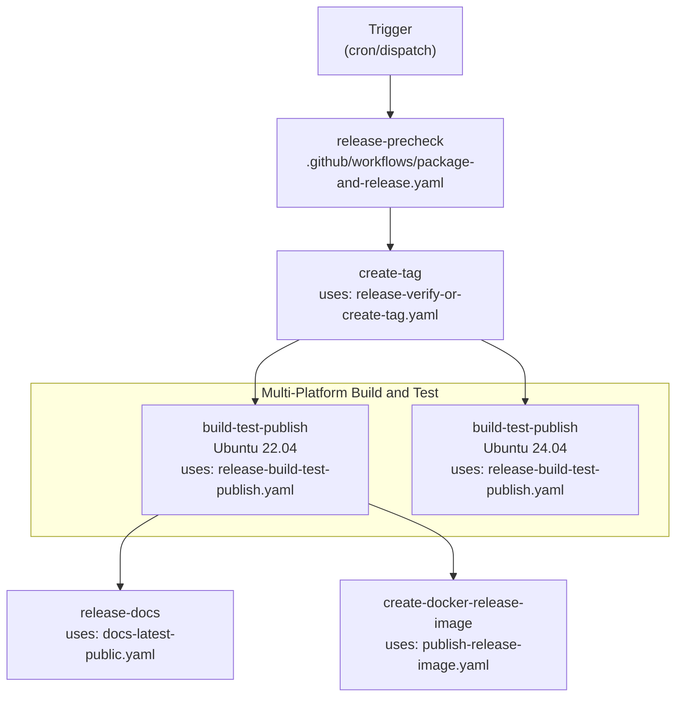
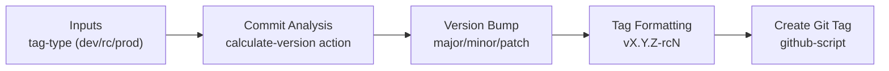
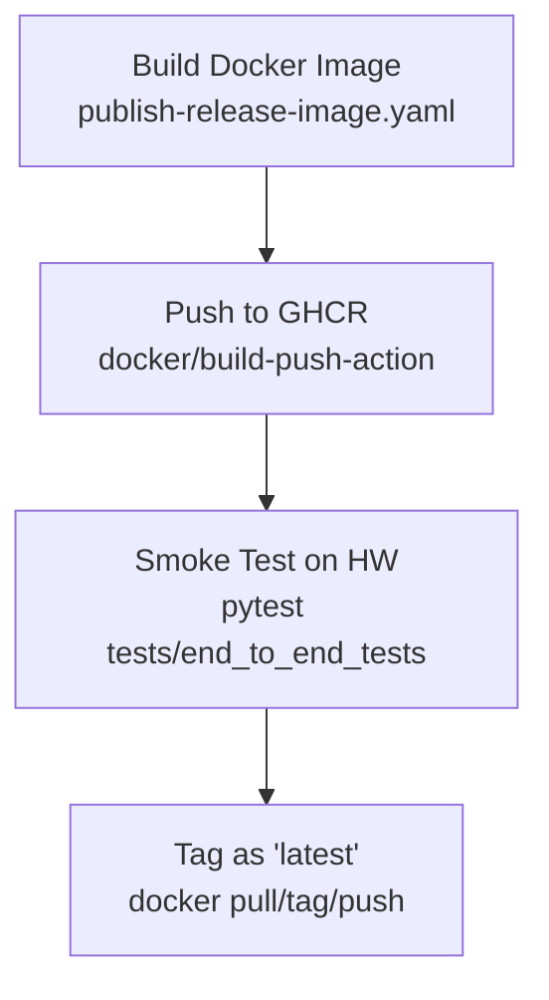

# Release Process and Publishing

Relevant source files
*   [.github/actions/calculate-version/action.yml](https://github.com/tenstorrent/tt-metal/blob/f30f8df0/.github/actions/calculate-version/action.yml)
*   [.github/actions/docker-run/action.yml](https://github.com/tenstorrent/tt-metal/blob/f30f8df0/.github/actions/docker-run/action.yml)
*   [.github/actions/generate-docker-tag/action.yml](https://github.com/tenstorrent/tt-metal/blob/f30f8df0/.github/actions/generate-docker-tag/action.yml)
*   [.github/workflows/_test-wheels-impl.yaml](https://github.com/tenstorrent/tt-metal/blob/f30f8df0/.github/workflows/_test-wheels-impl.yaml)
*   [.github/workflows/docs-latest-public-wrapper.yaml](https://github.com/tenstorrent/tt-metal/blob/f30f8df0/.github/workflows/docs-latest-public-wrapper.yaml)
*   [.github/workflows/docs-latest-public.yaml](https://github.com/tenstorrent/tt-metal/blob/f30f8df0/.github/workflows/docs-latest-public.yaml)
*   [.github/workflows/package-and-release.yaml](https://github.com/tenstorrent/tt-metal/blob/f30f8df0/.github/workflows/package-and-release.yaml)
*   [.github/workflows/publish-release-image-wrapper.yaml](https://github.com/tenstorrent/tt-metal/blob/f30f8df0/.github/workflows/publish-release-image-wrapper.yaml)
*   [.github/workflows/publish-release-image.yaml](https://github.com/tenstorrent/tt-metal/blob/f30f8df0/.github/workflows/publish-release-image.yaml)
*   [.github/workflows/release-build-test-publish.yaml](https://github.com/tenstorrent/tt-metal/blob/f30f8df0/.github/workflows/release-build-test-publish.yaml)
*   [.github/workflows/release-verify-or-create-tag.yaml](https://github.com/tenstorrent/tt-metal/blob/f30f8df0/.github/workflows/release-verify-or-create-tag.yaml)
*   [.github/workflows/test-action-calculate-version.yml](https://github.com/tenstorrent/tt-metal/blob/f30f8df0/.github/workflows/test-action-calculate-version.yml)
*   [docs/Doxyfile](https://github.com/tenstorrent/tt-metal/blob/f30f8df0/docs/Doxyfile)
*   [docs/Makefile](https://github.com/tenstorrent/tt-metal/blob/f30f8df0/docs/Makefile)
*   [docs/published_versions.json](https://github.com/tenstorrent/tt-metal/blob/f30f8df0/docs/published_versions.json)
*   [docs/source/common/_static/tt_theme.css](https://github.com/tenstorrent/tt-metal/blob/f30f8df0/docs/source/common/_static/tt_theme.css)
*   [docs/source/common/_templates/layout.html](https://github.com/tenstorrent/tt-metal/blob/f30f8df0/docs/source/common/_templates/layout.html)
*   [docs/source/common/_templates/versions.html](https://github.com/tenstorrent/tt-metal/blob/f30f8df0/docs/source/common/_templates/versions.html)
*   [docs/source/tt-metalium/tt_metal/apis/kernel_apis/compute/addcmul_tile.rst](https://github.com/tenstorrent/tt-metal/blob/f30f8df0/docs/source/tt-metalium/tt_metal/apis/kernel_apis/compute/addcmul_tile.rst)
*   [docs/source/tt-metalium/tt_metal/apis/kernel_apis/compute/compute.rst](https://github.com/tenstorrent/tt-metal/blob/f30f8df0/docs/source/tt-metalium/tt_metal/apis/kernel_apis/compute/compute.rst)
*   [docs/source/tt-metalium/tt_metal/apis/kernel_apis/compute/logical_not_unary_tile.rst](https://github.com/tenstorrent/tt-metal/blob/f30f8df0/docs/source/tt-metalium/tt_metal/apis/kernel_apis/compute/logical_not_unary_tile.rst)
*   [docs/source/tt-metalium/tt_metal/apis/kernel_apis/compute/round_tile.rst](https://github.com/tenstorrent/tt-metal/blob/f30f8df0/docs/source/tt-metalium/tt_metal/apis/kernel_apis/compute/round_tile.rst)
*   [docs/source/ttnn/_templates/class.rst](https://github.com/tenstorrent/tt-metal/blob/f30f8df0/docs/source/ttnn/_templates/class.rst)
*   [tt_metal/hw/ckernels/blackhole/metal/llk_api/llk_sfpu/ckernel_sfpu_addcmul.h](https://github.com/tenstorrent/tt-metal/blob/f30f8df0/tt_metal/hw/ckernels/blackhole/metal/llk_api/llk_sfpu/ckernel_sfpu_addcmul.h)
*   [tt_metal/hw/ckernels/blackhole/metal/llk_api/llk_sfpu/ckernel_sfpu_logical_not.h](https://github.com/tenstorrent/tt-metal/blob/f30f8df0/tt_metal/hw/ckernels/blackhole/metal/llk_api/llk_sfpu/ckernel_sfpu_logical_not.h)
*   [tt_metal/hw/ckernels/wormhole_b0/metal/llk_api/llk_sfpu/ckernel_sfpu_addcmul.h](https://github.com/tenstorrent/tt-metal/blob/f30f8df0/tt_metal/hw/ckernels/wormhole_b0/metal/llk_api/llk_sfpu/ckernel_sfpu_addcmul.h)
*   [tt_metal/hw/ckernels/wormhole_b0/metal/llk_api/llk_sfpu/ckernel_sfpu_logical_not.h](https://github.com/tenstorrent/tt-metal/blob/f30f8df0/tt_metal/hw/ckernels/wormhole_b0/metal/llk_api/llk_sfpu/ckernel_sfpu_logical_not.h)
*   [tt_metal/hw/inc/api/compute/eltwise_unary/logical_not.h](https://github.com/tenstorrent/tt-metal/blob/f30f8df0/tt_metal/hw/inc/api/compute/eltwise_unary/logical_not.h)

This document describes the automated release pipeline for creating, testing, and publishing tt-metal releases. The system produces Python wheels (PyPI), Debian packages, Docker images, and GitHub releases through a multi-stage CI/CD workflow that supports development snapshots, release candidates, and production releases.

* * *

## Release Types and Triggers

The release system supports three distinct release types, each with different triggers, versioning schemes, and validation requirements:

| Release Type | Tag Format | Trigger | Validation | Use Case |
| --- | --- | --- | --- | --- |
| **dev** | `v*.*.0-dev{YYYYMMDD}` | Daily cron at 00:00 UTC | Release tests | Nightly builds for continuous validation |
| **rc** | `v*.*.0-rc{N}` | Manual dispatch / branch push | Full test suite | Pre-release validation before production |
| **prod** | `v*.*.*` | Manual dispatch | Inherited from RC | Official versioned releases |

**Workflow dispatch inputs** (manual triggers):

*   `dry-run`: Skip tag/release creation (default: `false`) [[.github/workflows/package-and-release.yaml 5-9](https://github.com/tenstorrent/tt-metal/blob/f30f8df0/[.github/workflows/package-and-release.yaml#L5-L9)]
*   `release-type`: Override auto-detection (`dev`, `rc`, `prod`) [[.github/workflows/package-and-release.yaml 10-14](https://github.com/tenstorrent/tt-metal/blob/f30f8df0/[.github/workflows/package-and-release.yaml#L10-L14)]
*   `force-bump-type`: Force version bump (`major`, `minor`, `patch`, `none`) [[.github/workflows/package-and-release.yaml 15-19](https://github.com/tenstorrent/tt-metal/blob/f30f8df0/[.github/workflows/package-and-release.yaml#L15-L19)]
*   `ignore-commits`: Exclude specific commit SHAs from version analysis [[.github/workflows/package-and-release.yaml 20-24](https://github.com/tenstorrent/tt-metal/blob/f30f8df0/[.github/workflows/package-and-release.yaml#L20-L24)]
*   `tests-yaml-gist-url`: Override release test configuration via a remote Gist URL [[.github/workflows/package-and-release.yaml 25-29](https://github.com/tenstorrent/tt-metal/blob/f30f8df0/[.github/workflows/package-and-release.yaml#L25-L29)]

**Sources:**[[.github/workflows/package-and-release.yaml:1-35]](https://deepwiki.com/tenstorrent/tt-metal/6.9-release-process-and-publishing), [[.github/workflows/package-and-release.yaml:83-114]](https://deepwiki.com/tenstorrent/tt-metal/6.9-release-process-and-publishing)

* * *

## Release Pipeline Architecture

The release pipeline orchestrates multiple jobs across different platforms to produce validated, multi-platform artifacts.

Title: Release Pipeline Orchestration

**Key pipeline characteristics:**

1.   **Parallel platform builds**: Ubuntu 22.04 and 24.04 build simultaneously in separate matrix jobs [[.github/workflows/package-and-release.yaml 153-156](https://github.com/tenstorrent/tt-metal/blob/f30f8df0/[.github/workflows/package-and-release.yaml#L153-L156)]
2.   **Idempotent release checks**: `get_should_create_release.sh` prevents duplicate releases by checking existing tags and commits [[.github/workflows/package-and-release.yaml 127-132](https://github.com/tenstorrent/tt-metal/blob/f30f8df0/[.github/workflows/package-and-release.yaml#L127-L132)]
3.   **Platform Differentiation**: The main platform (Ubuntu 22.04) runs the full suite including multi-card tests (Galaxy, N300, Blackhole clusters), while others run single-card only [[.github/workflows/release-build-test-publish.yaml 122-128](https://github.com/tenstorrent/tt-metal/blob/f30f8df0/[.github/workflows/release-build-test-publish.yaml#L122-L128)]

**Sources:**[[.github/workflows/package-and-release.yaml:63-163]](https://deepwiki.com/tenstorrent/tt-metal/6.9-release-process-and-publishing), [[.github/workflows/release-build-test-publish.yaml:122-128]](https://deepwiki.com/tenstorrent/tt-metal/6.9-release-process-and-publishing)

* * *




**Key pipeline characteristics:**

1. **Parallel platform builds**: Ubuntu 22.04 and 24.04 build simultaneously in separate matrix jobs [[.github/workflows/package-and-release.yaml:153-156]()]
2. **Idempotent release checks**: `get_should_create_release.sh` prevents duplicate releases by checking existing tags and commits [[.github/workflows/package-and-release.yaml:127-132]()]
3. **Platform Differentiation**: The main platform (Ubuntu 22.04) runs the full suite including multi-card tests (Galaxy, N300, Blackhole clusters), while others run single-card only [[.github/workflows/release-build-test-publish.yaml:122-128]()]
```
## Version Tagging and Management

Version management uses the `release-verify-or-create-tag.yaml` workflow to analyze commits and determine appropriate version bumps.

Title: Tag Creation and Versioning Logic

**Commit ignore list** (defined in environment variables):

`DEFAULT_IGNORE_COMMITS: >-  72e9419a1be562889e1f008cf3e2db495f9e0aa9`
[[.github/workflows/package-and-release.yaml 54-55](https://github.com/tenstorrent/tt-metal/blob/f30f8df0/[.github/workflows/package-and-release.yaml#L54-L55)]

**Bump detection logic:**

*   Commits are analyzed to determine if a release is needed via `get_should_create_release.sh`[[.github/workflows/package-and-release.yaml 127-132](https://github.com/tenstorrent/tt-metal/blob/f30f8df0/[.github/workflows/package-and-release.yaml#L127-L132)]
*   The `calculate-version` action determines the final version string based on `tag-type` and `force-bump-type`[[.github/actions/calculate-version/action.yml 1-10](https://github.com/tenstorrent/tt-metal/blob/f30f8df0/[.github/actions/calculate-version/action.yml#L1-L10)]
*   `force-bump-type` input overrides automatic detection [[.github/workflows/package-and-release.yaml 145](https://github.com/tenstorrent/tt-metal/blob/f30f8df0/[.github/workflows/package-and-release.yaml#L145-L145)]
*   The `calculate-version` action handles special logic for `dev` tags, which always increment the minor version [[.github/actions/calculate-version/action.yml 178-180](https://github.com/tenstorrent/tt-metal/blob/f30f8df0/[.github/actions/calculate-version/action.yml#L178-L180)]

**Sources:**[[.github/workflows/package-and-release.yaml:43-147]](https://deepwiki.com/tenstorrent/tt-metal/6.9-release-process-and-publishing), [[.github/actions/calculate-version/action.yml:1-180]](https://deepwiki.com/tenstorrent/tt-metal/6.9-release-process-and-publishing), [[.github/workflows/release-verify-or-create-tag.yaml:52-128]](https://deepwiki.com/tenstorrent/tt-metal/6.9-release-process-and-publishing)

* * *




**Commit ignore list** (defined in environment variables):
```yaml
DEFAULT_IGNORE_COMMITS: >-
  72e9419a1be562889e1f008cf3e2db495f9e0aa9
```
[[.github/workflows/package-and-release.yaml:54-55]()]

**Bump detection logic:**
- Commits are analyzed to determine if a release is needed via `get_should_create_release.sh` [[.github/workflows/package-and-release.yaml:127-132]()]
- The `calculate-version` action determines the final version string based on `tag-type` and `force-bump-type` [[.github/actions/calculate-version/action.yml:1-10]()]
- `force-bump-type` input overrides automatic detection [[.github/workflows/package-and-release.yaml:145]()]
- The `calculate-version` action handles special logic for `dev` tags, which always increment the minor version [[.github/actions/calculate-version/action.yml:178-180]()]
```
## Multi-Platform Build and Test

The `build-test-publish` workflow executes for each platform using the standard build infrastructure.

**Platform matrix:**

`strategy:  fail-fast: false  matrix:    platform: ["Ubuntu 22.04", "Ubuntu 24.04"]`
[[.github/workflows/package-and-release.yaml 153-156](https://github.com/tenstorrent/tt-metal/blob/f30f8df0/[.github/workflows/package-and-release.yaml#L153-L156)]

**Build stages per platform:**

1.   **Build artifacts** via `build-artifact.yaml`:

    *   Builds both standard release and Tracy-enabled artifacts for testing [[.github/workflows/release-build-test-publish.yaml 80-95](https://github.com/tenstorrent/tt-metal/blob/f30f8df0/[.github/workflows/release-build-test-publish.yaml#L80-L95)]
    *   Generates Python wheels with specific references using `wheel-ref`[[.github/workflows/release-build-test-publish.yaml 92](https://github.com/tenstorrent/tt-metal/blob/f30f8df0/[.github/workflows/release-build-test-publish.yaml#L92-L92)]

2.   **Execute release tests**:

    *   `release-demo-tests` runs the validation suite targeted at specific hardware SKUs (N150, N300, P150, Galaxy, LLMBox) [[.github/workflows/release-build-test-publish.yaml 130-142](https://github.com/tenstorrent/tt-metal/blob/f30f8df0/[.github/workflows/release-build-test-publish.yaml#L130-L142)]
    *   `determine-test-skus` filters SKUs based on the platform; the main platform runs all tests including multi-card [[.github/workflows/release-build-test-publish.yaml 114-128](https://github.com/tenstorrent/tt-metal/blob/f30f8df0/[.github/workflows/release-build-test-publish.yaml#L114-L128)]

3.   **RTL Simulation Validation**:

    *   For releases on the `stable` branch, the workflow polls for the "RTL Sim CI test" check status on the HEAD commit to ensure hardware simulation parity [[.github/workflows/release-build-test-publish.yaml 153-182](https://github.com/tenstorrent/tt-metal/blob/f30f8df0/[.github/workflows/release-build-test-publish.yaml#L153-L182)]

**Sources:**[[.github/workflows/release-build-test-publish.yaml:80-182]](https://deepwiki.com/tenstorrent/tt-metal/6.9-release-process-and-publishing), [[.github/workflows/package-and-release.yaml:153-156]](https://deepwiki.com/tenstorrent/tt-metal/6.9-release-process-and-publishing)

* * *

## Docker Release Images

Release Docker images are created and published to the GitHub Container Registry (GHCR).

Title: Docker Image Build and Smoke Test

**Image types and tagging:**

*   Images are built for `release` and `release-models` variants [[.github/workflows/publish-release-image-wrapper.yaml 47](https://github.com/tenstorrent/tt-metal/blob/f30f8df0/[.github/workflows/publish-release-image-wrapper.yaml#L47-L47)]
*   Python versions are selected based on the Ubuntu distro (3.12 for 24.04, 3.10 for 22.04) [[.github/workflows/publish-release-image.yaml 70-76](https://github.com/tenstorrent/tt-metal/blob/f30f8df0/[.github/workflows/publish-release-image.yaml#L70-L76)]
*   Built images undergo a hardware smoke test using `pytest tests/end_to_end_tests` on N150/N300 runners before being tagged as `latest`[[.github/workflows/publish-release-image.yaml 112-160](https://github.com/tenstorrent/tt-metal/blob/f30f8df0/[.github/workflows/publish-release-image.yaml#L112-L160)]

**Sources:**[[.github/workflows/publish-release-image.yaml:1-188]](https://deepwiki.com/tenstorrent/tt-metal/6.9-release-process-and-publishing), [[.github/workflows/publish-release-image-wrapper.yaml:1-62]](https://deepwiki.com/tenstorrent/tt-metal/6.9-release-process-and-publishing)

* * *




**Image types and tagging:**
- Images are built for `release` and `release-models` variants [[.github/workflows/publish-release-image-wrapper.yaml:47]()]
- Python versions are selected based on the Ubuntu distro (3.12 for 24.04, 3.10 for 22.04) [[.github/workflows/publish-release-image.yaml:70-76]()]
- Built images undergo a hardware smoke test using `pytest tests/end_to_end_tests` on N150/N300 runners before being tagged as `latest` [[.github/workflows/publish-release-image.yaml:112-160]()]
```
## Documentation Publishing

The documentation release process builds Sphinx/Doxygen docs and deploys them to GitHub Pages.

**Deployment Logic:**

*   Docs are built inside a container environment based on the dev-docker-image [[.github/workflows/docs-latest-public-wrapper.yaml 49](https://github.com/tenstorrent/tt-metal/blob/f30f8df0/[.github/workflows/docs-latest-public-wrapper.yaml#L49-L49)]
*   Verification steps ensure every registered `ttnn` op has documentation entries via `detect_undocumented_ttnn_ops.py`[[.github/workflows/docs-latest-public.yaml 63-72](https://github.com/tenstorrent/tt-metal/blob/f30f8df0/[.github/workflows/docs-latest-public.yaml#L63-L72)]
*   Deployment is restricted to `main`, `stable`, or final release tags to avoid inflating the Pages storage limit [[.github/workflows/docs-latest-public.yaml 101-104](https://github.com/tenstorrent/tt-metal/blob/f30f8df0/[.github/workflows/docs-latest-public.yaml#L101-L104)]
*   The `published_versions.json` file tracks historical versions for the documentation site switcher [[docs/published_versions.json 1-26](https://github.com/tenstorrent/tt-metal/blob/f30f8df0/[docs/published_versions.json#L1-L26)]

**Sources:**[[docs/published_versions.json:1-26]](https://deepwiki.com/tenstorrent/tt-metal/6.9-release-process-and-publishing), [[.github/workflows/docs-latest-public.yaml:1-152]](https://deepwiki.com/tenstorrent/tt-metal/6.9-release-process-and-publishing), [[.github/workflows/docs-latest-public-wrapper.yaml:1-51]](https://deepwiki.com/tenstorrent/tt-metal/6.9-release-process-and-publishing)

* * *

## Key Workflow Permissions

The release process requires elevated permissions to manage artifacts and infrastructure:

| Permission | Purpose |
| --- | --- |
| `contents: write` | Creating Git tags and GitHub Releases [[.github/workflows/package-and-release.yaml 37](https://github.com/tenstorrent/tt-metal/blob/f30f8df0/[.github/workflows/package-and-release.yaml#L37-L37)] |
| `packages: write` | Publishing Docker images to GHCR [[.github/workflows/package-and-release.yaml 38](https://github.com/tenstorrent/tt-metal/blob/f30f8df0/[.github/workflows/package-and-release.yaml#L38-L38)] |
| `id-token: write` | OIDC authentication for secure publishing [[.github/workflows/package-and-release.yaml 40](https://github.com/tenstorrent/tt-metal/blob/f30f8df0/[.github/workflows/package-and-release.yaml#L40-L40)] |
| `actions: write` | Managing workflow runs and concurrency [[.github/workflows/package-and-release.yaml 39](https://github.com/tenstorrent/tt-metal/blob/f30f8df0/[.github/workflows/package-and-release.yaml#L39-L39)] |

**Sources:**[[.github/workflows/package-and-release.yaml:36-41]](https://deepwiki.com/tenstorrent/tt-metal/6.9-release-process-and-publishing)

Dismiss
Refresh this wiki

Enter email to refresh
