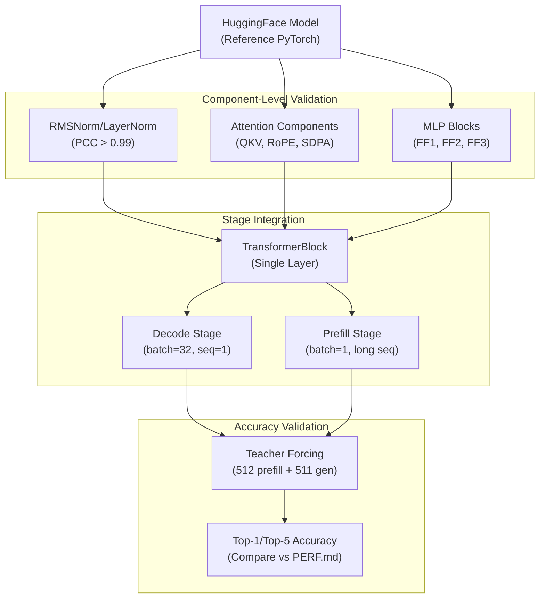
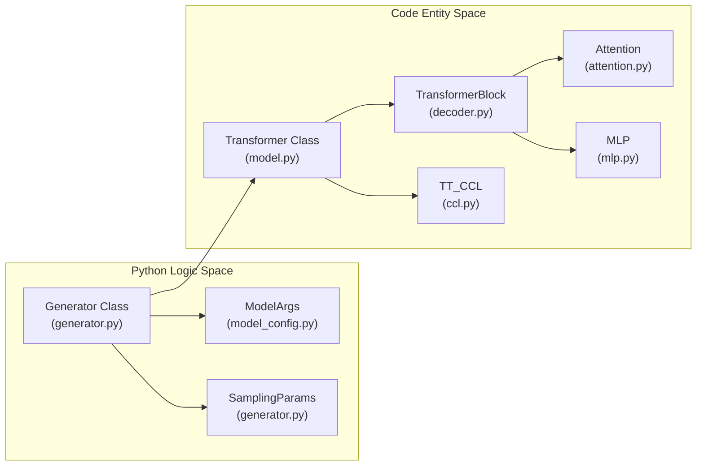
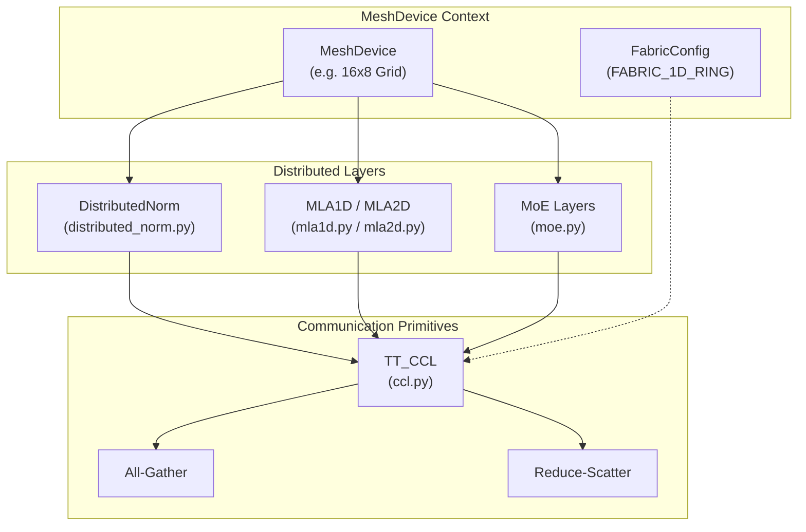
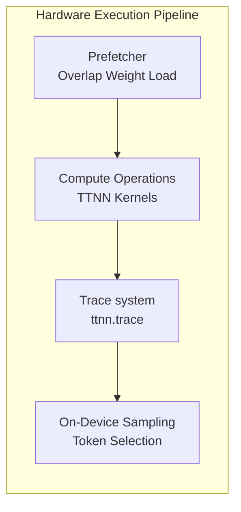
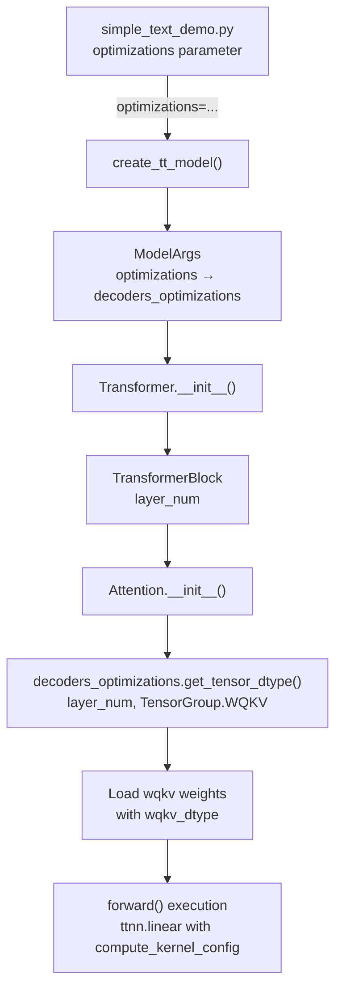

# Model Development and Optimization

Relevant source files
*   [.github/pull_request_template.md](https://github.com/tenstorrent/tt-metal/blob/f30f8df0/.github/pull_request_template.md?plain=1)
*   [.github/workflows/pr-description-inject-branch-name.yaml](https://github.com/tenstorrent/tt-metal/blob/f30f8df0/.github/workflows/pr-description-inject-branch-name.yaml)
*   [CONTRIBUTING.md](https://github.com/tenstorrent/tt-metal/blob/f30f8df0/CONTRIBUTING.md?plain=1)
*   [README.md](https://github.com/tenstorrent/tt-metal/blob/f30f8df0/README.md?plain=1)
*   [models/README.md](https://github.com/tenstorrent/tt-metal/blob/f30f8df0/models/README.md?plain=1)
*   [models/demos/deepseek_v3/README.md](https://github.com/tenstorrent/tt-metal/blob/f30f8df0/models/demos/deepseek_v3/README.md?plain=1)
*   [models/demos/llama3_70b_galaxy/PERF.md](https://github.com/tenstorrent/tt-metal/blob/f30f8df0/models/demos/llama3_70b_galaxy/PERF.md?plain=1)
*   [models/demos/llama3_70b_galaxy/README.md](https://github.com/tenstorrent/tt-metal/blob/f30f8df0/models/demos/llama3_70b_galaxy/README.md?plain=1)
*   [models/demos/multimodal/gemma3/README.md](https://github.com/tenstorrent/tt-metal/blob/f30f8df0/models/demos/multimodal/gemma3/README.md?plain=1)
*   [models/demos/t3000/llama3_70b/README.md](https://github.com/tenstorrent/tt-metal/blob/f30f8df0/models/demos/t3000/llama3_70b/README.md?plain=1)
*   [models/demos/t3000/llama3_70b/setup_llama.sh](https://github.com/tenstorrent/tt-metal/blob/f30f8df0/models/demos/t3000/llama3_70b/setup_llama.sh)
*   [models/demos/wormhole/qwen3_embedding_8b/demo/generator_vllm.py](https://github.com/tenstorrent/tt-metal/blob/f30f8df0/models/demos/wormhole/qwen3_embedding_8b/demo/generator_vllm.py)
*   [models/docs/MODEL_HYBRID_TP_DP.md](https://github.com/tenstorrent/tt-metal/blob/f30f8df0/models/docs/MODEL_HYBRID_TP_DP.md?plain=1)
*   [models/docs/MODEL_UPDATES.md](https://github.com/tenstorrent/tt-metal/blob/f30f8df0/models/docs/MODEL_UPDATES.md?plain=1)
*   [models/docs/model_bring_up.md](https://github.com/tenstorrent/tt-metal/blob/f30f8df0/models/docs/model_bring_up.md?plain=1)
*   [models/tt_transformers/PERF.md](https://github.com/tenstorrent/tt-metal/blob/f30f8df0/models/tt_transformers/PERF.md?plain=1)
*   [models/tt_transformers/README.md](https://github.com/tenstorrent/tt-metal/blob/f30f8df0/models/tt_transformers/README.md?plain=1)
*   [models/tt_transformers/demo/conftest.py](https://github.com/tenstorrent/tt-metal/blob/f30f8df0/models/tt_transformers/demo/conftest.py)
*   [models/tt_transformers/demo/simple_text_demo.py](https://github.com/tenstorrent/tt-metal/blob/f30f8df0/models/tt_transformers/demo/simple_text_demo.py)
*   [models/tt_transformers/demo/simple_vision_demo.py](https://github.com/tenstorrent/tt-metal/blob/f30f8df0/models/tt_transformers/demo/simple_vision_demo.py)
*   [models/tt_transformers/tests/conftest.py](https://github.com/tenstorrent/tt-metal/blob/f30f8df0/models/tt_transformers/tests/conftest.py)
*   [models/tt_transformers/tests/generate_reference_outputs.py](https://github.com/tenstorrent/tt-metal/blob/f30f8df0/models/tt_transformers/tests/generate_reference_outputs.py)
*   [models/tt_transformers/tests/multimodal/test_llama_cross_attention_transformer_text.py](https://github.com/tenstorrent/tt-metal/blob/f30f8df0/models/tt_transformers/tests/multimodal/test_llama_cross_attention_transformer_text.py)
*   [models/tt_transformers/tests/test_attention.py](https://github.com/tenstorrent/tt-metal/blob/f30f8df0/models/tt_transformers/tests/test_attention.py)
*   [models/tt_transformers/tests/test_attention_prefill.py](https://github.com/tenstorrent/tt-metal/blob/f30f8df0/models/tt_transformers/tests/test_attention_prefill.py)
*   [models/tt_transformers/tests/test_chunked_generation.py](https://github.com/tenstorrent/tt-metal/blob/f30f8df0/models/tt_transformers/tests/test_chunked_generation.py)
*   [models/tt_transformers/tests/test_decoder.py](https://github.com/tenstorrent/tt-metal/blob/f30f8df0/models/tt_transformers/tests/test_decoder.py)
*   [models/tt_transformers/tests/test_decoder_prefill.py](https://github.com/tenstorrent/tt-metal/blob/f30f8df0/models/tt_transformers/tests/test_decoder_prefill.py)
*   [models/tt_transformers/tests/test_embedding.py](https://github.com/tenstorrent/tt-metal/blob/f30f8df0/models/tt_transformers/tests/test_embedding.py)
*   [models/tt_transformers/tests/test_load_checkpoints.py](https://github.com/tenstorrent/tt-metal/blob/f30f8df0/models/tt_transformers/tests/test_load_checkpoints.py)
*   [models/tt_transformers/tests/test_mlp.py](https://github.com/tenstorrent/tt-metal/blob/f30f8df0/models/tt_transformers/tests/test_mlp.py)
*   [models/tt_transformers/tests/test_model.py](https://github.com/tenstorrent/tt-metal/blob/f30f8df0/models/tt_transformers/tests/test_model.py)
*   [models/tt_transformers/tests/test_model_prefill.py](https://github.com/tenstorrent/tt-metal/blob/f30f8df0/models/tt_transformers/tests/test_model_prefill.py)
*   [models/tt_transformers/tests/test_rms_norm.py](https://github.com/tenstorrent/tt-metal/blob/f30f8df0/models/tt_transformers/tests/test_rms_norm.py)
*   [models/tt_transformers/tt/attention.py](https://github.com/tenstorrent/tt-metal/blob/f30f8df0/models/tt_transformers/tt/attention.py)
*   [models/tt_transformers/tt/common.py](https://github.com/tenstorrent/tt-metal/blob/f30f8df0/models/tt_transformers/tt/common.py)
*   [models/tt_transformers/tt/decoder.py](https://github.com/tenstorrent/tt-metal/blob/f30f8df0/models/tt_transformers/tt/decoder.py)
*   [models/tt_transformers/tt/generator.py](https://github.com/tenstorrent/tt-metal/blob/f30f8df0/models/tt_transformers/tt/generator.py)
*   [models/tt_transformers/tt/load_checkpoints.py](https://github.com/tenstorrent/tt-metal/blob/f30f8df0/models/tt_transformers/tt/load_checkpoints.py)
*   [models/tt_transformers/tt/mlp.py](https://github.com/tenstorrent/tt-metal/blob/f30f8df0/models/tt_transformers/tt/mlp.py)
*   [models/tt_transformers/tt/model.py](https://github.com/tenstorrent/tt-metal/blob/f30f8df0/models/tt_transformers/tt/model.py)
*   [models/tt_transformers/tt/model_config.py](https://github.com/tenstorrent/tt-metal/blob/f30f8df0/models/tt_transformers/tt/model_config.py)
*   [models/tt_transformers/tt/multimodal/llama_class_embedding.py](https://github.com/tenstorrent/tt-metal/blob/f30f8df0/models/tt_transformers/tt/multimodal/llama_class_embedding.py)
*   [models/tt_transformers/tt/multimodal/llama_conv2d_patch.py](https://github.com/tenstorrent/tt-metal/blob/f30f8df0/models/tt_transformers/tt/multimodal/llama_conv2d_patch.py)
*   [models/tt_transformers/tt/multimodal/llama_cross_attention_transformer_text.py](https://github.com/tenstorrent/tt-metal/blob/f30f8df0/models/tt_transformers/tt/multimodal/llama_cross_attention_transformer_text.py)
*   [models/tt_transformers/tt/multimodal/llama_cross_block.py](https://github.com/tenstorrent/tt-metal/blob/f30f8df0/models/tt_transformers/tt/multimodal/llama_cross_block.py)
*   [models/tt_transformers/tt/multimodal/llama_image_block.py](https://github.com/tenstorrent/tt-metal/blob/f30f8df0/models/tt_transformers/tt/multimodal/llama_image_block.py)
*   [models/tt_transformers/tt/multimodal/llama_positional_embedding.py](https://github.com/tenstorrent/tt-metal/blob/f30f8df0/models/tt_transformers/tt/multimodal/llama_positional_embedding.py)
*   [models/tt_transformers/tt/multimodal/llama_tile_position_embedding.py](https://github.com/tenstorrent/tt-metal/blob/f30f8df0/models/tt_transformers/tt/multimodal/llama_tile_position_embedding.py)
*   [models/tt_transformers/tt/multimodal/llama_vision_encoder.py](https://github.com/tenstorrent/tt-metal/blob/f30f8df0/models/tt_transformers/tt/multimodal/llama_vision_encoder.py)
*   [models/tt_transformers/tt/multimodal/llama_vision_model.py](https://github.com/tenstorrent/tt-metal/blob/f30f8df0/models/tt_transformers/tt/multimodal/llama_vision_model.py)
*   [models/tt_transformers/tt/rope.py](https://github.com/tenstorrent/tt-metal/blob/f30f8df0/models/tt_transformers/tt/rope.py)
*   [releases/README.md](https://github.com/tenstorrent/tt-metal/blob/f30f8df0/releases/README.md?plain=1)
*   [scripts/tracing/.gitattributes](https://github.com/tenstorrent/tt-metal/blob/f30f8df0/scripts/tracing/.gitattributes)
*   [scripts/tracing/.gitignore](https://github.com/tenstorrent/tt-metal/blob/f30f8df0/scripts/tracing/.gitignore)
*   [scripts/tracing/README.md](https://github.com/tenstorrent/tt-metal/blob/f30f8df0/scripts/tracing/README.md?plain=1)
*   [scripts/tracing/context.txt](https://github.com/tenstorrent/tt-metal/blob/f30f8df0/scripts/tracing/context.txt)
*   [scripts/tracing/questions.txt](https://github.com/tenstorrent/tt-metal/blob/f30f8df0/scripts/tracing/questions.txt)
*   [scripts/tracing/run.py](https://github.com/tenstorrent/tt-metal/blob/f30f8df0/scripts/tracing/run.py)
*   [scripts/tracing/system-prompt.txt](https://github.com/tenstorrent/tt-metal/blob/f30f8df0/scripts/tracing/system-prompt.txt)
*   [tech_reports/Debugging/Kernel_Debugging_Tips.md](https://github.com/tenstorrent/tt-metal/blob/f30f8df0/tech_reports/Debugging/Kernel_Debugging_Tips.md?plain=1)
*   [tech_reports/LLMs/vLLM_integration.md](https://github.com/tenstorrent/tt-metal/blob/f30f8df0/tech_reports/LLMs/vLLM_integration.md?plain=1)

This document covers the end-to-end process of developing, configuring, optimizing, and deploying machine learning models on Tenstorrent hardware. It focuses on Large Language Models (LLMs) and transformer architectures using the `tt-transformers` framework. The material includes model bring-up procedures, configuration of precision and math fidelity settings, performance optimization techniques, and scaling strategies for multi-device execution.

For low-level kernel development, see [Writing Custom Kernels](https://deepwiki.com/tenstorrent/tt-metal/9.2-writing-custom-kernels). For neural network operation primitives, see [Neural Network Operations (TTNN)](https://deepwiki.com/tenstorrent/tt-metal/4-neural-network-operations-(ttnn)).

* * *

## Model Development Workflow

The model development workflow follows a systematic bring-up process that validates components individually before integrating them into full models. This staged validation ensures accuracy at each stage and makes debugging tractable.

### Component Validation and Integration Pipeline



**Component Validation Process**:
1. **Component Isolation**: Building blocks like `RMSNorm` [models/tt_transformers/tt/model.py:11-11]() and `TransformerBlock` [models/tt_transformers/tt/decoder.py:15-15]() are validated independently against PyTorch reference outputs using Pearson Correlation Coefficient (PCC).
2. **Stage Validation**: The model is tested in `Mode.DECODE` (autoregressive generation) and `Mode.PREFILL` (prompt processing) [models/tt_transformers/tt/common.py:31-31]().
3. **Accuracy Testing**: Final validation uses `TokenAccuracy` [models/tt_transformers/demo/simple_text_demo.py:38-74]() to compare generated tokens against reference outputs, measuring Top-1 and Top-5 accuracy against thresholds defined in `PERF.md` [models/tt_transformers/demo/simple_text_demo.py:77-125]().

For detailed workflow and Bring-Up process, see [Model Development Workflow](#7.1).
```


**Component Validation Process**:

1.   **Component Isolation**: Building blocks like `RMSNorm`[models/tt_transformers/tt/model.py 11](https://github.com/tenstorrent/tt-metal/blob/f30f8df0/models/tt_transformers/tt/model.py#L11-L11) and `TransformerBlock`[models/tt_transformers/tt/decoder.py 15](https://github.com/tenstorrent/tt-metal/blob/f30f8df0/models/tt_transformers/tt/decoder.py#L15-L15) are validated independently against PyTorch reference outputs using Pearson Correlation Coefficient (PCC).
2.   **Stage Validation**: The model is tested in `Mode.DECODE` (autoregressive generation) and `Mode.PREFILL` (prompt processing) [models/tt_transformers/tt/common.py 31](https://github.com/tenstorrent/tt-metal/blob/f30f8df0/models/tt_transformers/tt/common.py#L31-L31)
3.   **Accuracy Testing**: Final validation uses `TokenAccuracy`[models/tt_transformers/demo/simple_text_demo.py 38-74](https://github.com/tenstorrent/tt-metal/blob/f30f8df0/models/tt_transformers/demo/simple_text_demo.py#L38-L74) to compare generated tokens against reference outputs, measuring Top-1 and Top-5 accuracy against thresholds defined in `PERF.md`[models/tt_transformers/demo/simple_text_demo.py 77-125](https://github.com/tenstorrent/tt-metal/blob/f30f8df0/models/tt_transformers/demo/simple_text_demo.py#L77-L125)

For detailed workflow and Bring-Up process, see [Model Development Workflow](https://deepwiki.com/tenstorrent/tt-metal/7.1-model-development-workflow).

**Sources**: [models/tt_transformers/demo/simple_text_demo.py 38-125](https://github.com/tenstorrent/tt-metal/blob/f30f8df0/models/tt_transformers/demo/simple_text_demo.py#L38-L125)[models/tt_transformers/tt/common.py 31](https://github.com/tenstorrent/tt-metal/blob/f30f8df0/models/tt_transformers/tt/common.py#L31-L31)[models/tt_transformers/tt/model.py 11](https://github.com/tenstorrent/tt-metal/blob/f30f8df0/models/tt_transformers/tt/model.py#L11-L11)[models/tt_transformers/tt/decoder.py 15](https://github.com/tenstorrent/tt-metal/blob/f30f8df0/models/tt_transformers/tt/decoder.py#L15-L15)

* * *

## LLM Inference and Transformers

### Generator Architecture



**Key Execution Phases**:
- **Prefill Phase**: Processes input prompts and populates KV cache. Supports batching and chunking for long sequences to fit hardware constraints. Managed via `warmup_model_prefill()` [models/tt_transformers/tt/generator.py:145-145]().
- **Decode Phase**: Autoregressive token generation, often optimized through Metal Trace caching mechanisms minimizing host-device interaction [models/tt_transformers/tt/generator.py:101-103]().

For detailed LLM inference mechanisms, see [LLM Inference and Transformers](#7.2).
```


The `Generator` class orchestrates model inference, managing the lifecycle of multiple `Transformer` instances across a `MeshDevice`. It supports prefill and decode phases, maintains KV cache state, and enables advanced features like split sampling.

**Key Execution Phases**:

*   **Prefill Phase**: Processes input prompts and populates KV cache. Supports batching and chunking for long sequences to fit hardware constraints. Managed via `warmup_model_prefill()`[models/tt_transformers/tt/generator.py 145](https://github.com/tenstorrent/tt-metal/blob/f30f8df0/models/tt_transformers/tt/generator.py#L145-L145)
*   **Decode Phase**: Autoregressive token generation, often optimized through Metal Trace caching mechanisms minimizing host-device interaction [models/tt_transformers/tt/generator.py 101-103](https://github.com/tenstorrent/tt-metal/blob/f30f8df0/models/tt_transformers/tt/generator.py#L101-L103)

For detailed LLM inference mechanisms, see [LLM Inference and Transformers](https://deepwiki.com/tenstorrent/tt-metal/7.2-llm-inference-and-transformers).

**Sources**: [models/tt_transformers/tt/generator.py 76-145](https://github.com/tenstorrent/tt-metal/blob/f30f8df0/models/tt_transformers/tt/generator.py#L76-L145)[models/tt_transformers/tt/model.py 23-140](https://github.com/tenstorrent/tt-metal/blob/f30f8df0/models/tt_transformers/tt/model.py#L23-L140)

* * *

## Model Configuration and Optimization

### Precision and Fidelity Control

Model parameters, precisions, and optimizations are managed via the `ModelArgs` and `ModelOptimizations` classes, supporting fine-grained control over tensor groups and operator fidelity levels.

| Concept | Description | Code Ref |
| --- | --- | --- |
| TensorGroup | Logical groups of tensors (e.g. FF1_FF3, WQKV, KV_CACHE) | [model_config.py 52-59](https://github.com/tenstorrent/tt-metal/blob/f30f8df0/model_config.py#L52-L59) |
| PrecisionSetting | Numeric precision modes (BFP4, BFP8, BF16) | [model_config.py 61-65](https://github.com/tenstorrent/tt-metal/blob/f30f8df0/model_config.py#L61-L65) |
| OpGroup | Operator categories for math fidelity control | [model_config.py 67-82](https://github.com/tenstorrent/tt-metal/blob/f30f8df0/model_config.py#L67-L82) |
| MathFidelitySetting | Controls numerical accuracy of kernels (LOFI, HIFI4, etc.) | [model_config.py 103-110](https://github.com/tenstorrent/tt-metal/blob/f30f8df0/model_config.py#L103-L110) |

### Modes of Optimization

*   **Accuracy Mode**: Prioritizes precise computations with BF16 precision and high-fidelity math kernels (`HIFI4`). For very large models (70B+), selectively uses BFP4/BFP8 to balance memory [model_config.py 115-181](https://github.com/tenstorrent/tt-metal/blob/f30f8df0/model_config.py#L115-L181)
*   **Performance Mode**: Enables lower-precision BFP4 for faster MLP processing with `LOFI` math fidelity to improve throughput [model_config.py 184-201](https://github.com/tenstorrent/tt-metal/blob/f30f8df0/model_config.py#L184-L201)

For detailed configuration options and tuning strategies, see [Model Configuration and Optimization](https://deepwiki.com/tenstorrent/tt-metal/7.3-model-configuration-and-optimization).

**Sources**: [models/tt_transformers/tt/model_config.py 52-201](https://github.com/tenstorrent/tt-metal/blob/f30f8df0/models/tt_transformers/tt/model_config.py#L52-L201)

* * *

## Performance Optimization Techniques

Advanced optimization techniques maximize hardware utilization and throughput:

*   **Metal Trace Caching**: Uses `ttnn` trace APIs to capture GPU execution patterns, enabling efficient repeated decode calls avoiding host overhead [models/tt_transformers/tt/generator.py 101-103](https://github.com/tenstorrent/tt-metal/blob/f30f8df0/models/tt_transformers/tt/generator.py#L101-L103)
*   **Prefetcher Module**: Overlaps DRAM weight fetches with execution to hide latency, improving throughput [models/tt_transformers/tt/model.py 48](https://github.com/tenstorrent/tt-metal/blob/f30f8df0/models/tt_transformers/tt/model.py#L48-L48)
*   **Paged Attention**: Efficient KV cache tiled mapping and management via `PagedAttentionConfig`[models/tt_transformers/tt/common.py 25](https://github.com/tenstorrent/tt-metal/blob/f30f8df0/models/tt_transformers/tt/common.py#L25-L25)
*   **On-Device Sampling**: Supports top-k/top-p token sampling directly within device kernels, reducing host-device synchronization and accelerating decode throughput [models/tt_transformers/tt/model.py 157-163](https://github.com/tenstorrent/tt-metal/blob/f30f8df0/models/tt_transformers/tt/model.py#L157-L163)

These optimization primitives are essential for achieving state-of-the-art token throughput and low latency on Tenstorrent hardware.

For implementation details, see [Performance Optimization Techniques](https://deepwiki.com/tenstorrent/tt-metal/7.4-performance-optimization-techniques).

**Sources**: [models/tt_transformers/tt/generator.py 101-103](https://github.com/tenstorrent/tt-metal/blob/f30f8df0/models/tt_transformers/tt/generator.py#L101-L103)[models/tt_transformers/tt/model_config.py 45](https://github.com/tenstorrent/tt-metal/blob/f30f8df0/models/tt_transformers/tt/model_config.py#L45-L45)[models/tt_transformers/tt/model.py 48-163](https://github.com/tenstorrent/tt-metal/blob/f30f8df0/models/tt_transformers/tt/model.py#L48-L163)[models/tt_transformers/tt/common.py 25](https://github.com/tenstorrent/tt-metal/blob/f30f8df0/models/tt_transformers/tt/common.py#L25-L25)

* * *

## Multi-Device and Distributed Execution

Models scale across Tenstorrent hardware clusters using several parallelism and communication abstractions:

*   **Tensor Parallelism (TP)**: Weight matrices and computations are sharded across devices for horizontal scaling. For example, DeepSeek MLA uses `MLA1D` for 1D tensor parallelism [models/demos/deepseek_v3/tt/mla/mla1d.py 194-196](https://github.com/tenstorrent/tt-metal/blob/f30f8df0/models/demos/deepseek_v3/tt/mla/mla1d.py#L194-L196)
*   **MeshDevice**: Represents the device topology grid; submeshes corresponding to tensor parallel groups are created [models/tt_transformers/tt/generator.py 30](https://github.com/tenstorrent/tt-metal/blob/f30f8df0/models/tt_transformers/tt/generator.py#L30-L30)
*   **Collective Communications (`TT_CCL`)**: Provides primitives like All-Gather and Reduce-Scatter to synchronize shards and activations efficiently [models/tt_transformers/tt/model.py 49](https://github.com/tenstorrent/tt-metal/blob/f30f8df0/models/tt_transformers/tt/model.py#L49-L49)
*   **Fabric Configurations**: Define inter-device fabric topologies and routing, e.g. `FABRIC_1D_RING` for ring-allreduce style communication [models/demos/deepseek_v3/utils/config_helpers.py 33-60](https://github.com/tenstorrent/tt-metal/blob/f30f8df0/models/demos/deepseek_v3/utils/config_helpers.py#L33-L60)

### Distributed Model Execution and Communication Diagram



For in-depth distributed execution strategies, see [Multi-Device and Distributed Execution](#7.5).
```


For in-depth distributed execution strategies, see [Multi-Device and Distributed Execution](https://deepwiki.com/tenstorrent/tt-metal/7.5-multi-device-and-distributed-execution).

**Sources**: [models/demos/deepseek_v3/tt/mla/mla1d.py 194-196](https://github.com/tenstorrent/tt-metal/blob/f30f8df0/models/demos/deepseek_v3/tt/mla/mla1d.py#L194-L196)[models/tt_transformers/tt/generator.py 30](https://github.com/tenstorrent/tt-metal/blob/f30f8df0/models/tt_transformers/tt/generator.py#L30-L30)[models/tt_transformers/tt/model.py 49](https://github.com/tenstorrent/tt-metal/blob/f30f8df0/models/tt_transformers/tt/model.py#L49-L49)[models/demos/deepseek_v3/utils/config_helpers.py 33-60](https://github.com/tenstorrent/tt-metal/blob/f30f8df0/models/demos/deepseek_v3/utils/config_helpers.py#L33-L60)

* * *

## TT-Train: C++ Training Framework

The `tt-train` framework provides a C++ environment for neural network training on Tenstorrent hardware. It includes:

*   An autograd system enabling automatic differentiation.
*   Reference model implementations such as NanoGPT.
*   Support for distributed and multi-device training workflows.
*   Seamless integration with the TTNN library primitives.

This framework empowers model researchers and engineers to efficiently build and train large-scale models on hardware.

For detailed documentation, see [TT-Train: C++ Training Framework](https://deepwiki.com/tenstorrent/tt-metal/7.7-tt-train:-c++-training-framework).

* * *

## Model Examples and Demos

The repository hosts a rich set of model implementations and demonstration code that showcase the full power of the TT-Metalium and TTNN stack together with Tenstorrent hardware:

*   **DeepSeek-V3**: A sophisticated Row-Batched model leveraging Mixture-of-Experts (MoE) and Multi-Latent Attention (MLA) for performance [models/demos/deepseek_v3/tt/generator.py 154](https://github.com/tenstorrent/tt-metal/blob/f30f8df0/models/demos/deepseek_v3/tt/generator.py#L154-L154)
*   **Llama 3.1 / 3.2 Series**: Supports multiple sizes including 8B, 70B, and vision-enabled variants deployed on hardware platforms like Wormhole and Galaxy [models/tt_transformers/demo/simple_vision_demo.py 114-175](https://github.com/tenstorrent/tt-metal/blob/f30f8df0/models/tt_transformers/demo/simple_vision_demo.py#L114-L175)
*   **Mistral 7B and Small 24B**: Efficient inference examples optimized for Tenstorrent clusters.
*   Others include Qwen 2.5, Falcon, Mixtral, Whisper models, and stable diffusion demos.

These examples serve as templates and performance baselines for users integrating their own custom model variants.

For comprehensive model details and metrics, see [Model Examples and Demos](https://deepwiki.com/tenstorrent/tt-metal/7.6-model-examples-and-demos).

**Sources**: [models/demos/deepseek_v3/tt/generator.py 154](https://github.com/tenstorrent/tt-metal/blob/f30f8df0/models/demos/deepseek_v3/tt/generator.py#L154-L154)[models/tt_transformers/demo/simple_vision_demo.py 114-175](https://github.com/tenstorrent/tt-metal/blob/f30f8df0/models/tt_transformers/demo/simple_vision_demo.py#L114-L175)

* * *

# Summary

This page provides a high-level overview of the model development lifecycle on Tenstorrent hardware—from isolated component validation through full model integration, precision and fidelity tuning, hardware-level performance optimizations, to scaling across multiple devices and distributed clusters.

Each step incorporates best practices for balancing accuracy and throughput using the configurable parameters and primitives exposed by the `tt-transformers` framework.

For detailed technical specifics, algorithms, tuning parameters, and complete examples please consult the child pages:

*   [LLM Inference and Transformers](https://deepwiki.com/tenstorrent/tt-metal/7.2-llm-inference-and-transformers)
*   [Performance Optimization Techniques](https://deepwiki.com/tenstorrent/tt-metal/7.4-performance-optimization-techniques)
*   [Model Examples and Demos](https://deepwiki.com/tenstorrent/tt-metal/7.6-model-examples-and-demos)

Dismiss
Refresh this wiki

Enter email to refresh


### Related: Techniques for Maximizing Throughput and Reducing Latency



### Related: End-to-End Configuration Flow


