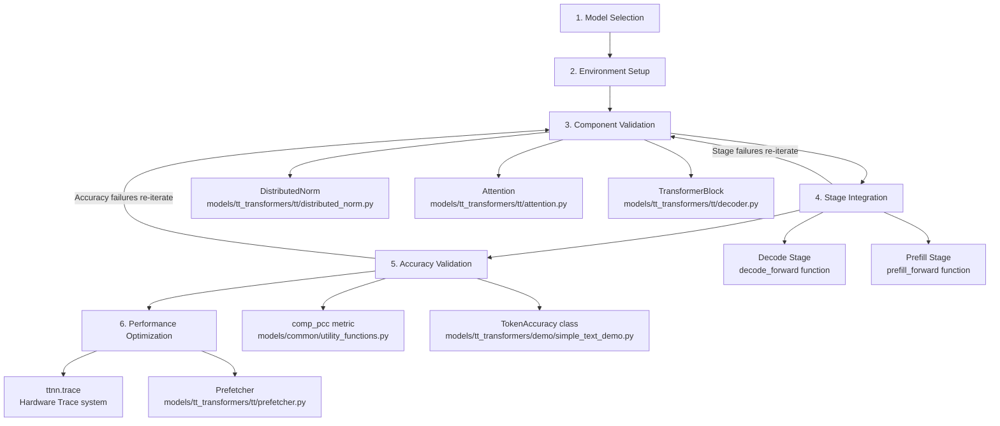
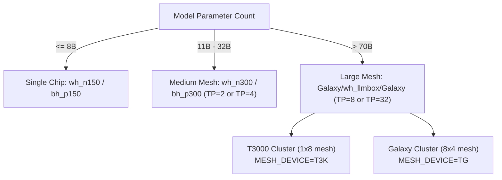
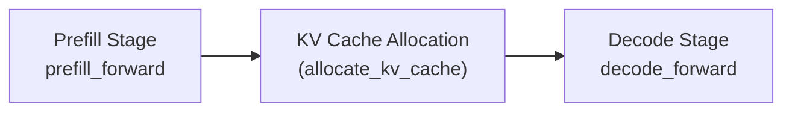
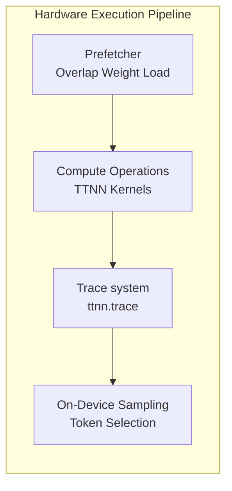
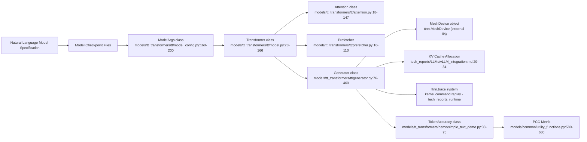

# Model Development Workflow

Relevant source files
*   [.github/pull_request_template.md](https://github.com/tenstorrent/tt-metal/blob/f30f8df0/.github/pull_request_template.md?plain=1)
*   [.github/workflows/pr-description-inject-branch-name.yaml](https://github.com/tenstorrent/tt-metal/blob/f30f8df0/.github/workflows/pr-description-inject-branch-name.yaml)
*   [CONTRIBUTING.md](https://github.com/tenstorrent/tt-metal/blob/f30f8df0/CONTRIBUTING.md?plain=1)
*   [README.md](https://github.com/tenstorrent/tt-metal/blob/f30f8df0/README.md?plain=1)
*   [models/README.md](https://github.com/tenstorrent/tt-metal/blob/f30f8df0/models/README.md?plain=1)
*   [models/demos/deepseek_v3/README.md](https://github.com/tenstorrent/tt-metal/blob/f30f8df0/models/demos/deepseek_v3/README.md?plain=1)
*   [models/demos/llama3_70b_galaxy/PERF.md](https://github.com/tenstorrent/tt-metal/blob/f30f8df0/models/demos/llama3_70b_galaxy/PERF.md?plain=1)
*   [models/demos/llama3_70b_galaxy/README.md](https://github.com/tenstorrent/tt-metal/blob/f30f8df0/models/demos/llama3_70b_galaxy/README.md?plain=1)
*   [models/demos/multimodal/gemma3/README.md](https://github.com/tenstorrent/tt-metal/blob/f30f8df0/models/demos/multimodal/gemma3/README.md?plain=1)
*   [models/demos/t3000/llama3_70b/README.md](https://github.com/tenstorrent/tt-metal/blob/f30f8df0/models/demos/t3000/llama3_70b/README.md?plain=1)
*   [models/demos/t3000/llama3_70b/setup_llama.sh](https://github.com/tenstorrent/tt-metal/blob/f30f8df0/models/demos/t3000/llama3_70b/setup_llama.sh)
*   [models/demos/wormhole/qwen3_embedding_8b/demo/generator_vllm.py](https://github.com/tenstorrent/tt-metal/blob/f30f8df0/models/demos/wormhole/qwen3_embedding_8b/demo/generator_vllm.py)
*   [models/docs/MODEL_HYBRID_TP_DP.md](https://github.com/tenstorrent/tt-metal/blob/f30f8df0/models/docs/MODEL_HYBRID_TP_DP.md?plain=1)
*   [models/docs/MODEL_UPDATES.md](https://github.com/tenstorrent/tt-metal/blob/f30f8df0/models/docs/MODEL_UPDATES.md?plain=1)
*   [models/docs/model_bring_up.md](https://github.com/tenstorrent/tt-metal/blob/f30f8df0/models/docs/model_bring_up.md?plain=1)
*   [models/tt_transformers/PERF.md](https://github.com/tenstorrent/tt-metal/blob/f30f8df0/models/tt_transformers/PERF.md?plain=1)
*   [models/tt_transformers/README.md](https://github.com/tenstorrent/tt-metal/blob/f30f8df0/models/tt_transformers/README.md?plain=1)
*   [models/tt_transformers/demo/conftest.py](https://github.com/tenstorrent/tt-metal/blob/f30f8df0/models/tt_transformers/demo/conftest.py)
*   [models/tt_transformers/demo/simple_text_demo.py](https://github.com/tenstorrent/tt-metal/blob/f30f8df0/models/tt_transformers/demo/simple_text_demo.py)
*   [models/tt_transformers/demo/simple_vision_demo.py](https://github.com/tenstorrent/tt-metal/blob/f30f8df0/models/tt_transformers/demo/simple_vision_demo.py)
*   [models/tt_transformers/tests/conftest.py](https://github.com/tenstorrent/tt-metal/blob/f30f8df0/models/tt_transformers/tests/conftest.py)
*   [models/tt_transformers/tests/generate_reference_outputs.py](https://github.com/tenstorrent/tt-metal/blob/f30f8df0/models/tt_transformers/tests/generate_reference_outputs.py)
*   [models/tt_transformers/tests/multimodal/test_llama_cross_attention_transformer_text.py](https://github.com/tenstorrent/tt-metal/blob/f30f8df0/models/tt_transformers/tests/multimodal/test_llama_cross_attention_transformer_text.py)
*   [models/tt_transformers/tests/test_attention.py](https://github.com/tenstorrent/tt-metal/blob/f30f8df0/models/tt_transformers/tests/test_attention.py)
*   [models/tt_transformers/tests/test_attention_prefill.py](https://github.com/tenstorrent/tt-metal/blob/f30f8df0/models/tt_transformers/tests/test_attention_prefill.py)
*   [models/tt_transformers/tests/test_chunked_generation.py](https://github.com/tenstorrent/tt-metal/blob/f30f8df0/models/tt_transformers/tests/test_chunked_generation.py)
*   [models/tt_transformers/tests/test_decoder.py](https://github.com/tenstorrent/tt-metal/blob/f30f8df0/models/tt_transformers/tests/test_decoder.py)
*   [models/tt_transformers/tests/test_decoder_prefill.py](https://github.com/tenstorrent/tt-metal/blob/f30f8df0/models/tt_transformers/tests/test_decoder_prefill.py)
*   [models/tt_transformers/tests/test_embedding.py](https://github.com/tenstorrent/tt-metal/blob/f30f8df0/models/tt_transformers/tests/test_embedding.py)
*   [models/tt_transformers/tests/test_load_checkpoints.py](https://github.com/tenstorrent/tt-metal/blob/f30f8df0/models/tt_transformers/tests/test_load_checkpoints.py)
*   [models/tt_transformers/tests/test_mlp.py](https://github.com/tenstorrent/tt-metal/blob/f30f8df0/models/tt_transformers/tests/test_mlp.py)
*   [models/tt_transformers/tests/test_model.py](https://github.com/tenstorrent/tt-metal/blob/f30f8df0/models/tt_transformers/tests/test_model.py)
*   [models/tt_transformers/tests/test_model_prefill.py](https://github.com/tenstorrent/tt-metal/blob/f30f8df0/models/tt_transformers/tests/test_model_prefill.py)
*   [models/tt_transformers/tests/test_rms_norm.py](https://github.com/tenstorrent/tt-metal/blob/f30f8df0/models/tt_transformers/tests/test_rms_norm.py)
*   [models/tt_transformers/tt/attention.py](https://github.com/tenstorrent/tt-metal/blob/f30f8df0/models/tt_transformers/tt/attention.py)
*   [models/tt_transformers/tt/common.py](https://github.com/tenstorrent/tt-metal/blob/f30f8df0/models/tt_transformers/tt/common.py)
*   [models/tt_transformers/tt/decoder.py](https://github.com/tenstorrent/tt-metal/blob/f30f8df0/models/tt_transformers/tt/decoder.py)
*   [models/tt_transformers/tt/generator.py](https://github.com/tenstorrent/tt-metal/blob/f30f8df0/models/tt_transformers/tt/generator.py)
*   [models/tt_transformers/tt/load_checkpoints.py](https://github.com/tenstorrent/tt-metal/blob/f30f8df0/models/tt_transformers/tt/load_checkpoints.py)
*   [models/tt_transformers/tt/mlp.py](https://github.com/tenstorrent/tt-metal/blob/f30f8df0/models/tt_transformers/tt/mlp.py)
*   [models/tt_transformers/tt/model.py](https://github.com/tenstorrent/tt-metal/blob/f30f8df0/models/tt_transformers/tt/model.py)
*   [models/tt_transformers/tt/model_config.py](https://github.com/tenstorrent/tt-metal/blob/f30f8df0/models/tt_transformers/tt/model_config.py)
*   [models/tt_transformers/tt/multimodal/llama_class_embedding.py](https://github.com/tenstorrent/tt-metal/blob/f30f8df0/models/tt_transformers/tt/multimodal/llama_class_embedding.py)
*   [models/tt_transformers/tt/multimodal/llama_conv2d_patch.py](https://github.com/tenstorrent/tt-metal/blob/f30f8df0/models/tt_transformers/tt/multimodal/llama_conv2d_patch.py)
*   [models/tt_transformers/tt/multimodal/llama_cross_attention_transformer_text.py](https://github.com/tenstorrent/tt-metal/blob/f30f8df0/models/tt_transformers/tt/multimodal/llama_cross_attention_transformer_text.py)
*   [models/tt_transformers/tt/multimodal/llama_cross_block.py](https://github.com/tenstorrent/tt-metal/blob/f30f8df0/models/tt_transformers/tt/multimodal/llama_cross_block.py)
*   [models/tt_transformers/tt/multimodal/llama_image_block.py](https://github.com/tenstorrent/tt-metal/blob/f30f8df0/models/tt_transformers/tt/multimodal/llama_image_block.py)
*   [models/tt_transformers/tt/multimodal/llama_positional_embedding.py](https://github.com/tenstorrent/tt-metal/blob/f30f8df0/models/tt_transformers/tt/multimodal/llama_positional_embedding.py)
*   [models/tt_transformers/tt/multimodal/llama_tile_position_embedding.py](https://github.com/tenstorrent/tt-metal/blob/f30f8df0/models/tt_transformers/tt/multimodal/llama_tile_position_embedding.py)
*   [models/tt_transformers/tt/multimodal/llama_vision_encoder.py](https://github.com/tenstorrent/tt-metal/blob/f30f8df0/models/tt_transformers/tt/multimodal/llama_vision_encoder.py)
*   [models/tt_transformers/tt/multimodal/llama_vision_model.py](https://github.com/tenstorrent/tt-metal/blob/f30f8df0/models/tt_transformers/tt/multimodal/llama_vision_model.py)
*   [models/tt_transformers/tt/rope.py](https://github.com/tenstorrent/tt-metal/blob/f30f8df0/models/tt_transformers/tt/rope.py)
*   [releases/README.md](https://github.com/tenstorrent/tt-metal/blob/f30f8df0/releases/README.md?plain=1)
*   [scripts/tracing/.gitattributes](https://github.com/tenstorrent/tt-metal/blob/f30f8df0/scripts/tracing/.gitattributes)
*   [scripts/tracing/.gitignore](https://github.com/tenstorrent/tt-metal/blob/f30f8df0/scripts/tracing/.gitignore)
*   [scripts/tracing/README.md](https://github.com/tenstorrent/tt-metal/blob/f30f8df0/scripts/tracing/README.md?plain=1)
*   [scripts/tracing/context.txt](https://github.com/tenstorrent/tt-metal/blob/f30f8df0/scripts/tracing/context.txt)
*   [scripts/tracing/questions.txt](https://github.com/tenstorrent/tt-metal/blob/f30f8df0/scripts/tracing/questions.txt)
*   [scripts/tracing/run.py](https://github.com/tenstorrent/tt-metal/blob/f30f8df0/scripts/tracing/run.py)
*   [scripts/tracing/system-prompt.txt](https://github.com/tenstorrent/tt-metal/blob/f30f8df0/scripts/tracing/system-prompt.txt)
*   [tech_reports/Debugging/Kernel_Debugging_Tips.md](https://github.com/tenstorrent/tt-metal/blob/f30f8df0/tech_reports/Debugging/Kernel_Debugging_Tips.md?plain=1)
*   [tech_reports/LLMs/vLLM_integration.md](https://github.com/tenstorrent/tt-metal/blob/f30f8df0/tech_reports/LLMs/vLLM_integration.md?plain=1)

## Purpose and Scope

This page documents the systematic process for bringing up AI models on Tenstorrent hardware using the tt-metal codebase. The workflow emphasizes component-wise validation, stage integration, accuracy validation, and subsequent optimization. It aims to guide developers through transforming model architectures and checkpoints into performant pipelines that run efficiently on supported hardware.

This bring-up process is fundamental for key models such as Llama 3.3, Qwen 2.5, Mistral, and others supported in the repository [README.md 24-65](https://github.com/tenstorrent/tt-metal/blob/f30f8df0/README.md?plain=1#L24-L65)

For related model topics, see:

*   [7.3 Model Configuration and Optimization](https://github.com/tenstorrent/tt-metal/blob/f30f8df0/7.3%20Model%20Configuration%20and%20Optimization)
*   [7.4 Performance Optimization Techniques](https://github.com/tenstorrent/tt-metal/blob/f30f8df0/7.4%20Performance%20Optimization%20Techniques)
*   [7.5 Multi-Device and Distributed Execution](https://github.com/tenstorrent/tt-metal/blob/f30f8df0/7.5%20Multi-Device%20and%20Distributed%20Execution)
*   [7.6 Model Examples and Demos](https://github.com/tenstorrent/tt-metal/blob/f30f8df0/7.6%20Model%20Examples%20and%20Demos)

* * *

## Development Workflow Overview

The model bring-up process involves six major stages from selecting the model, preparing the environment, validating components, integrating execution stages, validating accuracy, and optimizing for performance.

This flow enforces thorough validation before advancing stages, ensuring correctness, memory layout compatibility, arithmetic fidelity, and runtime performance [models/docs/model_bring_up.md 1-50](https://github.com/tenstorrent/tt-metal/blob/f30f8df0/models/docs/model_bring_up.md?plain=1#L1-L50)[tech_reports/LLMs/vLLM_integration.md 27-34](https://github.com/tenstorrent/tt-metal/blob/f30f8df0/tech_reports/LLMs/vLLM_integration.md?plain=1#L27-L34)

Sources:

[README.md 24-65](https://github.com/tenstorrent/tt-metal/blob/f30f8df0/README.md?plain=1#L24-L65)[models/docs/model_bring_up.md 1-50](https://github.com/tenstorrent/tt-metal/blob/f30f8df0/models/docs/model_bring_up.md?plain=1#L1-L50)[tech_reports/LLMs/vLLM_integration.md 27-34](https://github.com/tenstorrent/tt-metal/blob/f30f8df0/tech_reports/LLMs/vLLM_integration.md?plain=1#L27-L34)

* * *




This flow enforces thorough validation before advancing stages, ensuring correctness, memory layout compatibility, arithmetic fidelity, and runtime performance [models/docs/model_bring_up.md:1-50](), [tech_reports/LLMs/vLLM_integration.md:27-34]().

Sources:  
[README.md:24-65](), [models/docs/model_bring_up.md:1-50](), [tech_reports/LLMs/vLLM_integration.md:27-34]()

---
```
## Stage 1: Model Selection and Compatibility

### Supported Model Architectures

tt-metal primarily supports transformer-based LLMs with a focus on Llama family variants, Qwen, Mistral, DeepSeek, and Mixtral series, with expanding multimodal support [models/README.md 3-45](https://github.com/tenstorrent/tt-metal/blob/f30f8df0/models/README.md?plain=1#L3-L45)

| Aspect | Description |
| --- | --- |
| **Architectures** | Llama 3.x (8B to 90B), Qwen 2.5 (7B to 72B), Mistral (7B and 24B), DeepSeek, Mixtral |
| **Multimodal Models** | Llama 3.2 Vision (11B, 90B), Qwen 2.5 VL, Gemma 3 multimodal [models/README.md 13-14](https://github.com/tenstorrent/tt-metal/blob/f30f8df0/models/README.md?plain=1#L13-L14)[models/docs/MODEL_UPDATES.md 24-27](https://github.com/tenstorrent/tt-metal/blob/f30f8df0/models/docs/MODEL_UPDATES.md?plain=1#L24-L27) |
| **Hardware Targets** | Wormhole N150/N300/T3000/Galaxy meshes, Blackhole P100/P150/QuietBox, Galaxy cluster for massive scale |

### Hardware Selection Criteria

Hardware choice depends on model size and parallelism:

*   Small models (<~8B) run on single chips (N150, P150).
*   Medium models (~11B to 32B) leverage 2-4 chip tensor parallel configurations (N300, P300).
*   Large models (>70B) require large meshes: Galaxy (8x4 chip), T3000 (1x8) for tensor parallel factor 8 to 32.

Sources:

[README.md 40-64](https://github.com/tenstorrent/tt-metal/blob/f30f8df0/README.md?plain=1#L40-L64)[models/README.md 5-23](https://github.com/tenstorrent/tt-metal/blob/f30f8df0/models/README.md?plain=1#L5-L23)[models/demos/deepseek_v3/README.md 28-59](https://github.com/tenstorrent/tt-metal/blob/f30f8df0/models/demos/deepseek_v3/README.md?plain=1#L28-L59)

* * *




Sources:  
[README.md:40-64](), [models/README.md:5-23](), [models/demos/deepseek_v3/README.md:28-59]()

---
```
## Stage 2: Environment Setup

### Essential Environment Configuration

Before bring-up begins, environment variables configure paths, topology, and model checkpoint references.

| Variable | Description | Example |
| --- | --- | --- |
| `HF_MODEL` | HuggingFace ID or local checkpoint path of model | `"meta-llama/Llama-3.1-8B-Instruct"`[tests/pipeline_reorg/models_e2e_tests.yaml 19](https://github.com/tenstorrent/tt-metal/blob/f30f8df0/tests/pipeline_reorg/models_e2e_tests.yaml#L19-L19) |
| `TT_CACHE_PATH` | Cache directory for pre-compiled tensor and weight cache | `/mnt/MLPerf/huggingface/tt_cache/`[tests/pipeline_reorg/models_e2e_tests.yaml 19](https://github.com/tenstorrent/tt-metal/blob/f30f8df0/tests/pipeline_reorg/models_e2e_tests.yaml#L19-L19) |
| `MESH_DEVICE` | Logical device mesh topology name | `"T3K"`, `"TG"`, `"DUAL"`, `"QUAD"`[models/demos/deepseek_v3/README.md 55](https://github.com/tenstorrent/tt-metal/blob/f30f8df0/models/demos/deepseek_v3/README.md?plain=1#L55-L55) |

### Device Mesh Initialization

The `ttnn.MeshDevice` object abstracts physical hardware topology. For multi-host meshes like Galaxy, `tt-run` orchestrates MPI rank initialization and fabric communication setup.

This mesh device object is passed at model creation to shape tensors and dispatch kernels [models/demos/deepseek_v3/README.md 59](https://github.com/tenstorrent/tt-metal/blob/f30f8df0/models/demos/deepseek_v3/README.md?plain=1#L59-L59)

Sources:

[tests/pipeline_reorg/models_e2e_tests.yaml 15-25](https://github.com/tenstorrent/tt-metal/blob/f30f8df0/tests/pipeline_reorg/models_e2e_tests.yaml#L15-L25)[models/demos/deepseek_v3/README.md 50-60](https://github.com/tenstorrent/tt-metal/blob/f30f8df0/models/demos/deepseek_v3/README.md?plain=1#L50-L60)

* * *

## Stage 3: Component Validation

### Isolated Module Bring-Up and Testing

Individual components critical to model execution are validated for correctness in isolation. Unit tests ensure that tensor layouts, kernel behavior, and communication operations function as expected.

| Component | Location / Test | Description |
| --- | --- | --- |
| `Embedding` | `tests/test_embedding.py` | Input token embeddings, tested for correct mapping and caching [tests/pipeline_reorg/models_unit_tests.yaml 18](https://github.com/tenstorrent/tt-metal/blob/f30f8df0/tests/pipeline_reorg/models_unit_tests.yaml#L18-L18) |
| `Attention` | `tests/test_attention.py` | Self-attention computation with collective ops [tests/pipeline_reorg/models_unit_tests.yaml 21](https://github.com/tenstorrent/tt-metal/blob/f30f8df0/tests/pipeline_reorg/models_unit_tests.yaml#L21-L21) |
| `DistributedNorm` | `tests/test_rms_norm.py` | RMSNorm layer tested for correctness of distributed normalization [tests/pipeline_reorg/models_unit_tests.yaml 19](https://github.com/tenstorrent/tt-metal/blob/f30f8df0/tests/pipeline_reorg/models_unit_tests.yaml#L19-L19) |
| `MLP` | `tests/test_mlp.py` | Feed-forward network layers with quantization, precision tests [tests/pipeline_reorg/models_unit_tests.yaml 20](https://github.com/tenstorrent/tt-metal/blob/f30f8df0/tests/pipeline_reorg/models_unit_tests.yaml#L20-L20) |

Developers use Python unit tests that compare outputs with known PyTorch references, evaluating metrics like Pearson Correlation Coefficient (PCC) for numerical fidelity [models/docs/model_bring_up.md 10-30](https://github.com/tenstorrent/tt-metal/blob/f30f8df0/models/docs/model_bring_up.md?plain=1#L10-L30)

Sources:

[tests/pipeline_reorg/models_unit_tests.yaml 15-34](https://github.com/tenstorrent/tt-metal/blob/f30f8df0/tests/pipeline_reorg/models_unit_tests.yaml#L15-L34)[models/docs/model_bring_up.md 1-30](https://github.com/tenstorrent/tt-metal/blob/f30f8df0/models/docs/model_bring_up.md?plain=1#L1-L30)

* * *

## Stage 4: Stage Integration

### Prefill and Decode Execution Stages

Once components are validated, they are integrated into the model's two main execution stages, critical to inference:

*   **Prefill Stage (`prefill_forward`)**: Processes input prompt tokens in a batch, builds the key-value (KV) cache to prepare for decoding. It supports high throughput batched execution via paged KV cache constructs and sharded tensor layouts.

*   **Decode Stage (`decode_forward`)**: Incrementally generates output tokens one by one. This stage is latency-critical and exploits hardware features like paged scaled dot-product attention for efficient token-wise attention updates.

The KV cache is configured with tensor shapes such as `(max_num_blocks, num_kv_heads, block_size, head_size)` and managed with allocation helpers [tech_reports/LLMs/vLLM_integration.md 13-34](https://github.com/tenstorrent/tt-metal/blob/f30f8df0/tech_reports/LLMs/vLLM_integration.md?plain=1#L13-L34)

Sources:

[tech_reports/LLMs/vLLM_integration.md 13-34](https://github.com/tenstorrent/tt-metal/blob/f30f8df0/tech_reports/LLMs/vLLM_integration.md?plain=1#L13-L34)[models/docs/MODEL_UPDATES.md 12-14](https://github.com/tenstorrent/tt-metal/blob/f30f8df0/models/docs/MODEL_UPDATES.md?plain=1#L12-L14)

* * *




Sources:  
[tech_reports/LLMs/vLLM_integration.md:13-34](), [models/docs/MODEL_UPDATES.md:12-14]()

---
```
## Stage 5: Accuracy Validation

### End-to-End Model Testing

Complete accuracy validation runs the full model pipeline to verify output fidelity. Two main testing approaches are used:

*   **Token Matching**: Exact match of output tokens against reference sequences from prior runs or known good checkpoints.

*   **Pearson Correlation Coefficient (PCC)**: Numerical fidelity check comparing host-computed outputs vs device outputs to tolerate minor floating point variations.

Example test filters in the test suite include:

| Metric | Test Filter (pytest) | Description |
| --- | --- | --- |
| Token Matching | `-k "performance-ci-token-matching"` | Validates exact token output match |
| PCC (80-layer) | `-k "pcc-80L"` | PCC metric on 80-layer transformer block outputs |
| Performance+Eval | `-k "performance-ci-eval-32"` | End-to-end evaluation on 32 batch size |

Token accuracy is implemented in classes like `TokenAccuracy` in `models/tt_transformers/demo/simple_text_demo.py` that load reference data and compare predicted vs expected tokens [tests/pipeline_reorg/models_e2e_tests.yaml 148-149](https://github.com/tenstorrent/tt-metal/blob/f30f8df0/tests/pipeline_reorg/models_e2e_tests.yaml#L148-L149)[models/tt_transformers/demo/simple_text_demo.py 38-75](https://github.com/tenstorrent/tt-metal/blob/f30f8df0/models/tt_transformers/demo/simple_text_demo.py#L38-L75)

Sources:

[tests/pipeline_reorg/models_e2e_tests.yaml 17-23](https://github.com/tenstorrent/tt-metal/blob/f30f8df0/tests/pipeline_reorg/models_e2e_tests.yaml#L17-L23)[tests/pipeline_reorg/models_e2e_tests.yaml 164-168](https://github.com/tenstorrent/tt-metal/blob/f30f8df0/tests/pipeline_reorg/models_e2e_tests.yaml#L164-L168)[models/tt_transformers/demo/simple_text_demo.py 38-75](https://github.com/tenstorrent/tt-metal/blob/f30f8df0/models/tt_transformers/demo/simple_text_demo.py#L38-L75)

* * *

## Stage 6: Performance Optimization

### Techniques for Maximizing Throughput and Reducing Latency

After accuracy is confirmed, the model undergoes performance tuning via several key techniques:

1.   **Metal Trace System (`ttnn.trace`)**: Records a sequence of operations into a hardware-executable trace graph to reduce runtime host-device interaction overhead. The trace minimizes latency during repeated token generation [tech_reports/LLMs/vLLM_integration.md 31-33](https://github.com/tenstorrent/tt-metal/blob/f30f8df0/tech_reports/LLMs/vLLM_integration.md?plain=1#L31-L33)

2.   **DRAM Prefetching (`Prefetcher`)**: Overlapping weight loading with computation using `use_prefetcher=True` hides memory latency. The prefetcher works at tensor and kernel dispatch levels to keep the hardware busy [models/tt_transformers/tt/prefetcher.py](https://github.com/tenstorrent/tt-metal/blob/f30f8df0/models/tt_transformers/tt/prefetcher.py)

3.   **On-Device Sampling**: Token sampling operations (top-k, top-p, temperature scaling) are offloaded to the Tenstorrent device itself to avoid costly synchronization between CPU and accelerators [models/docs/MODEL_UPDATES.md 12-14](https://github.com/tenstorrent/tt-metal/blob/f30f8df0/models/docs/MODEL_UPDATES.md?plain=1#L12-L14)

4.   **TT-Fabric Collective Comm. Library**: Improved multi-device scaling by porting collective communication ops to the `TT-Fabric` system, optimizing network utilization [models/docs/MODEL_UPDATES.md 66-67](https://github.com/tenstorrent/tt-metal/blob/f30f8df0/models/docs/MODEL_UPDATES.md?plain=1#L66-L67)

Performance gains from these optimizations result in reduced time-to-first-token (TTFT) and increased tokens-per-second throughput on supported hardware [README.md 24-64](https://github.com/tenstorrent/tt-metal/blob/f30f8df0/README.md?plain=1#L24-L64)[models/README.md 5-23](https://github.com/tenstorrent/tt-metal/blob/f30f8df0/models/README.md?plain=1#L5-L23)

Sources:

[tech_reports/LLMs/vLLM_integration.md 31-34](https://github.com/tenstorrent/tt-metal/blob/f30f8df0/tech_reports/LLMs/vLLM_integration.md?plain=1#L31-L34)[models/docs/MODEL_UPDATES.md 12-14](https://github.com/tenstorrent/tt-metal/blob/f30f8df0/models/docs/MODEL_UPDATES.md?plain=1#L12-L14)[models/tt_transformers/tt/prefetcher.py](https://github.com/tenstorrent/tt-metal/blob/f30f8df0/models/tt_transformers/tt/prefetcher.py)[README.md 24-64](https://github.com/tenstorrent/tt-metal/blob/f30f8df0/README.md?plain=1#L24-L64)

* * *




Performance gains from these optimizations result in reduced time-to-first-token (TTFT) and increased tokens-per-second throughput on supported hardware [README.md:24-64](), [models/README.md:5-23]().

Sources:  
[tech_reports/LLMs/vLLM_integration.md:31-34](), [models/docs/MODEL_UPDATES.md:12-14](), [models/tt_transformers/tt/prefetcher.py](), [README.md:24-64]()

---
```
# Bridging Natural Language Concepts to Code Entities

This diagram maps the natural language concepts (model specifications and checkpoints) to core code entities and runtime constructs critical for the model bring-up workflow.

Sources:

[models/tt_transformers/tt/model_config.py 168-200](https://github.com/tenstorrent/tt-metal/blob/f30f8df0/models/tt_transformers/tt/model_config.py#L168-L200)[models/tt_transformers/tt/model.py 23-166](https://github.com/tenstorrent/tt-metal/blob/f30f8df0/models/tt_transformers/tt/model.py#L23-L166)[models/tt_transformers/tt/attention.py 18-147](https://github.com/tenstorrent/tt-metal/blob/f30f8df0/models/tt_transformers/tt/attention.py#L18-L147)[models/tt_transformers/tt/generator.py 76-460](https://github.com/tenstorrent/tt-metal/blob/f30f8df0/models/tt_transformers/tt/generator.py#L76-L460)[models/tt_transformers/demo/simple_text_demo.py 38-75](https://github.com/tenstorrent/tt-metal/blob/f30f8df0/models/tt_transformers/demo/simple_text_demo.py#L38-L75)[models/common/utility_functions.py 580-630](https://github.com/tenstorrent/tt-metal/blob/f30f8df0/models/common/utility_functions.py#L580-L630)

* * *




This diagram maps the natural language concepts (model specifications and checkpoints) to core code entities and runtime constructs critical for the model bring-up workflow.

Sources:  
[models/tt_transformers/tt/model_config.py:168-200](), [models/tt_transformers/tt/model.py:23-166](), [models/tt_transformers/tt/attention.py:18-147](), [models/tt_transformers/tt/generator.py:76-460](), [models/tt_transformers/demo/simple_text_demo.py:38-75](), [models/common/utility_functions.py:580-630]()

---
```
# Summary

The tt-metal model development workflow rigorously ensures that each module is verified individually before combining into executing model pipelines running on Tenstorrent hardware. This process—from environment setup, validation, integration, to optimization—enables the deployment of highly accurate and performant large language models. Ensuring correctness with PCC and token accuracy enables confidence as models scale in size and complexity.

Technical implementation details can be found referenced in source files throughout the `models/tt_transformers` directory along with demo scripts and test fixtures. This workflow remains the cornerstone for supporting an ever-growing suite of transformer architectures in tt-metal.

* * *

# References

*   [README.md 24-65](https://github.com/tenstorrent/tt-metal/blob/f30f8df0/README.md?plain=1#L24-L65)
*   [models/docs/model_bring_up.md 1-50](https://github.com/tenstorrent/tt-metal/blob/f30f8df0/models/docs/model_bring_up.md?plain=1#L1-L50)
*   [tech_reports/LLMs/vLLM_integration.md 13-34](https://github.com/tenstorrent/tt-metal/blob/f30f8df0/tech_reports/LLMs/vLLM_integration.md?plain=1#L13-L34)
*   [tests/pipeline_reorg/models_unit_tests.yaml 15-34](https://github.com/tenstorrent/tt-metal/blob/f30f8df0/tests/pipeline_reorg/models_unit_tests.yaml#L15-L34)
*   [tests/pipeline_reorg/models_e2e_tests.yaml 17-23](https://github.com/tenstorrent/tt-metal/blob/f30f8df0/tests/pipeline_reorg/models_e2e_tests.yaml#L17-L23)
*   [models/tt_transformers/tt/generator.py 76-460](https://github.com/tenstorrent/tt-metal/blob/f30f8df0/models/tt_transformers/tt/generator.py#L76-L460)
*   [models/tt_transformers/demo/simple_text_demo.py 38-75](https://github.com/tenstorrent/tt-metal/blob/f30f8df0/models/tt_transformers/demo/simple_text_demo.py#L38-L75)
*   [models/tt_transformers/tt/model.py 23-166](https://github.com/tenstorrent/tt-metal/blob/f30f8df0/models/tt_transformers/tt/model.py#L23-L166)
*   [models/tt_transformers/tt/attention.py 18-147](https://github.com/tenstorrent/tt-metal/blob/f30f8df0/models/tt_transformers/tt/attention.py#L18-L147)
*   [models/tt_transformers/tt/prefetcher.py](https://github.com/tenstorrent/tt-metal/blob/f30f8df0/models/tt_transformers/tt/prefetcher.py)
*   [models/common/utility_functions.py 580-630](https://github.com/tenstorrent/tt-metal/blob/f30f8df0/models/common/utility_functions.py#L580-L630)

Dismiss
Refresh this wiki

Enter email to refresh
