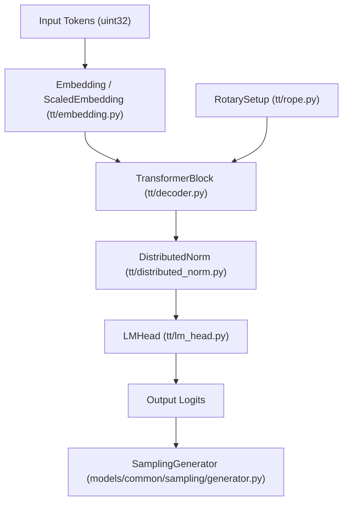

# LLM Inference and Transformers

Relevant source files
*   [models/common/demos/llama31_8B_demo.py](https://github.com/tenstorrent/tt-metal/blob/f30f8df0/models/common/demos/llama31_8B_demo.py)
*   [models/common/sampling/README.md](https://github.com/tenstorrent/tt-metal/blob/f30f8df0/models/common/sampling/README.md?plain=1)
*   [models/common/sampling/__init__.py](https://github.com/tenstorrent/tt-metal/blob/f30f8df0/models/common/sampling/__init__.py)
*   [models/common/sampling/_utils.py](https://github.com/tenstorrent/tt-metal/blob/f30f8df0/models/common/sampling/_utils.py)
*   [models/common/sampling/generator.py](https://github.com/tenstorrent/tt-metal/blob/f30f8df0/models/common/sampling/generator.py)
*   [models/common/sampling/sampling_params.py](https://github.com/tenstorrent/tt-metal/blob/f30f8df0/models/common/sampling/sampling_params.py)
*   [models/common/sampling/tt_log_probs.py](https://github.com/tenstorrent/tt-metal/blob/f30f8df0/models/common/sampling/tt_log_probs.py)
*   [models/common/sampling/tt_penalties.py](https://github.com/tenstorrent/tt-metal/blob/f30f8df0/models/common/sampling/tt_penalties.py)
*   [models/common/sampling/tt_sampling.py](https://github.com/tenstorrent/tt-metal/blob/f30f8df0/models/common/sampling/tt_sampling.py)
*   [models/common/tests/test_sampling.py](https://github.com/tenstorrent/tt-metal/blob/f30f8df0/models/common/tests/test_sampling.py)
*   [models/common/utils.py](https://github.com/tenstorrent/tt-metal/blob/f30f8df0/models/common/utils.py)
*   [models/demos/gpt_oss/tests/run_logprobs_tests.sh](https://github.com/tenstorrent/tt-metal/blob/f30f8df0/models/demos/gpt_oss/tests/run_logprobs_tests.sh)
*   [models/demos/gpt_oss/tests/unit/test_sampling.py](https://github.com/tenstorrent/tt-metal/blob/f30f8df0/models/demos/gpt_oss/tests/unit/test_sampling.py)
*   [models/demos/llama3_70b_galaxy/demo/demo_common.py](https://github.com/tenstorrent/tt-metal/blob/f30f8df0/models/demos/llama3_70b_galaxy/demo/demo_common.py)
*   [models/demos/llama3_70b_galaxy/demo/demo_decode.py](https://github.com/tenstorrent/tt-metal/blob/f30f8df0/models/demos/llama3_70b_galaxy/demo/demo_decode.py)
*   [models/demos/llama3_70b_galaxy/demo/demo_qwen_decode.py](https://github.com/tenstorrent/tt-metal/blob/f30f8df0/models/demos/llama3_70b_galaxy/demo/demo_qwen_decode.py)
*   [models/demos/llama3_70b_galaxy/demo/outputs_batch_1.json](https://github.com/tenstorrent/tt-metal/blob/f30f8df0/models/demos/llama3_70b_galaxy/demo/outputs_batch_1.json)
*   [models/demos/llama3_70b_galaxy/demo/qwen_outputs_batch_1.json](https://github.com/tenstorrent/tt-metal/blob/f30f8df0/models/demos/llama3_70b_galaxy/demo/qwen_outputs_batch_1.json)
*   [models/demos/llama3_70b_galaxy/demo/qwen_text_demo_targets.json](https://github.com/tenstorrent/tt-metal/blob/f30f8df0/models/demos/llama3_70b_galaxy/demo/qwen_text_demo_targets.json)
*   [models/demos/llama3_70b_galaxy/demo/text_demo.py](https://github.com/tenstorrent/tt-metal/blob/f30f8df0/models/demos/llama3_70b_galaxy/demo/text_demo.py)
*   [models/demos/llama3_70b_galaxy/demo/text_qwen_demo.py](https://github.com/tenstorrent/tt-metal/blob/f30f8df0/models/demos/llama3_70b_galaxy/demo/text_qwen_demo.py)
*   [models/demos/llama3_70b_galaxy/reference/args.py](https://github.com/tenstorrent/tt-metal/blob/f30f8df0/models/demos/llama3_70b_galaxy/reference/args.py)
*   [models/demos/llama3_70b_galaxy/reference/qwen.py](https://github.com/tenstorrent/tt-metal/blob/f30f8df0/models/demos/llama3_70b_galaxy/reference/qwen.py)
*   [models/demos/llama3_70b_galaxy/tests/module_tests/test_qwen_attention_prefill_ttt.py](https://github.com/tenstorrent/tt-metal/blob/f30f8df0/models/demos/llama3_70b_galaxy/tests/module_tests/test_qwen_attention_prefill_ttt.py)
*   [models/demos/llama3_70b_galaxy/tests/test_llama_accuracy.py](https://github.com/tenstorrent/tt-metal/blob/f30f8df0/models/demos/llama3_70b_galaxy/tests/test_llama_accuracy.py)
*   [models/demos/llama3_70b_galaxy/tests/test_llama_model.py](https://github.com/tenstorrent/tt-metal/blob/f30f8df0/models/demos/llama3_70b_galaxy/tests/test_llama_model.py)
*   [models/demos/llama3_70b_galaxy/tests/test_llama_model_nd.py](https://github.com/tenstorrent/tt-metal/blob/f30f8df0/models/demos/llama3_70b_galaxy/tests/test_llama_model_nd.py)
*   [models/demos/llama3_70b_galaxy/tests/test_qwen_accuracy.py](https://github.com/tenstorrent/tt-metal/blob/f30f8df0/models/demos/llama3_70b_galaxy/tests/test_qwen_accuracy.py)
*   [models/demos/llama3_70b_galaxy/tests/unit_tests/test_llama_attention_prefill.py](https://github.com/tenstorrent/tt-metal/blob/f30f8df0/models/demos/llama3_70b_galaxy/tests/unit_tests/test_llama_attention_prefill.py)
*   [models/demos/llama3_70b_galaxy/tests/unit_tests/test_sampling.py](https://github.com/tenstorrent/tt-metal/blob/f30f8df0/models/demos/llama3_70b_galaxy/tests/unit_tests/test_sampling.py)
*   [models/demos/llama3_70b_galaxy/tt/generator.py](https://github.com/tenstorrent/tt-metal/blob/f30f8df0/models/demos/llama3_70b_galaxy/tt/generator.py)
*   [models/demos/llama3_70b_galaxy/tt/llama_attention.py](https://github.com/tenstorrent/tt-metal/blob/f30f8df0/models/demos/llama3_70b_galaxy/tt/llama_attention.py)
*   [models/demos/llama3_70b_galaxy/tt/llama_ccl.py](https://github.com/tenstorrent/tt-metal/blob/f30f8df0/models/demos/llama3_70b_galaxy/tt/llama_ccl.py)
*   [models/demos/llama3_70b_galaxy/tt/llama_decoder.py](https://github.com/tenstorrent/tt-metal/blob/f30f8df0/models/demos/llama3_70b_galaxy/tt/llama_decoder.py)
*   [models/demos/llama3_70b_galaxy/tt/llama_embedding.py](https://github.com/tenstorrent/tt-metal/blob/f30f8df0/models/demos/llama3_70b_galaxy/tt/llama_embedding.py)
*   [models/demos/llama3_70b_galaxy/tt/llama_mlp.py](https://github.com/tenstorrent/tt-metal/blob/f30f8df0/models/demos/llama3_70b_galaxy/tt/llama_mlp.py)
*   [models/demos/llama3_70b_galaxy/tt/llama_model.py](https://github.com/tenstorrent/tt-metal/blob/f30f8df0/models/demos/llama3_70b_galaxy/tt/llama_model.py)
*   [models/demos/llama3_70b_galaxy/tt/model_config.py](https://github.com/tenstorrent/tt-metal/blob/f30f8df0/models/demos/llama3_70b_galaxy/tt/model_config.py)
*   [models/demos/llama3_70b_galaxy/tt/qwen_model_config.py](https://github.com/tenstorrent/tt-metal/blob/f30f8df0/models/demos/llama3_70b_galaxy/tt/qwen_model_config.py)
*   [models/tt_transformers/PERF.md](https://github.com/tenstorrent/tt-metal/blob/f30f8df0/models/tt_transformers/PERF.md?plain=1)
*   [models/tt_transformers/README.md](https://github.com/tenstorrent/tt-metal/blob/f30f8df0/models/tt_transformers/README.md?plain=1)
*   [models/tt_transformers/demo/conftest.py](https://github.com/tenstorrent/tt-metal/blob/f30f8df0/models/tt_transformers/demo/conftest.py)
*   [models/tt_transformers/demo/simple_text_demo.py](https://github.com/tenstorrent/tt-metal/blob/f30f8df0/models/tt_transformers/demo/simple_text_demo.py)
*   [models/tt_transformers/demo/simple_vision_demo.py](https://github.com/tenstorrent/tt-metal/blob/f30f8df0/models/tt_transformers/demo/simple_vision_demo.py)
*   [models/tt_transformers/demo/trace_region_config.py](https://github.com/tenstorrent/tt-metal/blob/f30f8df0/models/tt_transformers/demo/trace_region_config.py)
*   [models/tt_transformers/tests/conftest.py](https://github.com/tenstorrent/tt-metal/blob/f30f8df0/models/tt_transformers/tests/conftest.py)
*   [models/tt_transformers/tests/generate_reference_outputs.py](https://github.com/tenstorrent/tt-metal/blob/f30f8df0/models/tt_transformers/tests/generate_reference_outputs.py)
*   [models/tt_transformers/tests/multimodal/test_llama_cross_attention_transformer_text.py](https://github.com/tenstorrent/tt-metal/blob/f30f8df0/models/tt_transformers/tests/multimodal/test_llama_cross_attention_transformer_text.py)
*   [models/tt_transformers/tests/test_attention.py](https://github.com/tenstorrent/tt-metal/blob/f30f8df0/models/tt_transformers/tests/test_attention.py)
*   [models/tt_transformers/tests/test_attention_prefill.py](https://github.com/tenstorrent/tt-metal/blob/f30f8df0/models/tt_transformers/tests/test_attention_prefill.py)
*   [models/tt_transformers/tests/test_chunked_generation.py](https://github.com/tenstorrent/tt-metal/blob/f30f8df0/models/tt_transformers/tests/test_chunked_generation.py)
*   [models/tt_transformers/tests/test_decoder.py](https://github.com/tenstorrent/tt-metal/blob/f30f8df0/models/tt_transformers/tests/test_decoder.py)
*   [models/tt_transformers/tests/test_decoder_prefill.py](https://github.com/tenstorrent/tt-metal/blob/f30f8df0/models/tt_transformers/tests/test_decoder_prefill.py)
*   [models/tt_transformers/tests/test_embedding.py](https://github.com/tenstorrent/tt-metal/blob/f30f8df0/models/tt_transformers/tests/test_embedding.py)
*   [models/tt_transformers/tests/test_load_checkpoints.py](https://github.com/tenstorrent/tt-metal/blob/f30f8df0/models/tt_transformers/tests/test_load_checkpoints.py)
*   [models/tt_transformers/tests/test_mlp.py](https://github.com/tenstorrent/tt-metal/blob/f30f8df0/models/tt_transformers/tests/test_mlp.py)
*   [models/tt_transformers/tests/test_model.py](https://github.com/tenstorrent/tt-metal/blob/f30f8df0/models/tt_transformers/tests/test_model.py)
*   [models/tt_transformers/tests/test_model_prefill.py](https://github.com/tenstorrent/tt-metal/blob/f30f8df0/models/tt_transformers/tests/test_model_prefill.py)
*   [models/tt_transformers/tests/test_rms_norm.py](https://github.com/tenstorrent/tt-metal/blob/f30f8df0/models/tt_transformers/tests/test_rms_norm.py)
*   [models/tt_transformers/tt/attention.py](https://github.com/tenstorrent/tt-metal/blob/f30f8df0/models/tt_transformers/tt/attention.py)
*   [models/tt_transformers/tt/common.py](https://github.com/tenstorrent/tt-metal/blob/f30f8df0/models/tt_transformers/tt/common.py)
*   [models/tt_transformers/tt/decoder.py](https://github.com/tenstorrent/tt-metal/blob/f30f8df0/models/tt_transformers/tt/decoder.py)
*   [models/tt_transformers/tt/generator.py](https://github.com/tenstorrent/tt-metal/blob/f30f8df0/models/tt_transformers/tt/generator.py)
*   [models/tt_transformers/tt/load_checkpoints.py](https://github.com/tenstorrent/tt-metal/blob/f30f8df0/models/tt_transformers/tt/load_checkpoints.py)
*   [models/tt_transformers/tt/mlp.py](https://github.com/tenstorrent/tt-metal/blob/f30f8df0/models/tt_transformers/tt/mlp.py)
*   [models/tt_transformers/tt/model.py](https://github.com/tenstorrent/tt-metal/blob/f30f8df0/models/tt_transformers/tt/model.py)
*   [models/tt_transformers/tt/model_config.py](https://github.com/tenstorrent/tt-metal/blob/f30f8df0/models/tt_transformers/tt/model_config.py)
*   [models/tt_transformers/tt/multimodal/llama_class_embedding.py](https://github.com/tenstorrent/tt-metal/blob/f30f8df0/models/tt_transformers/tt/multimodal/llama_class_embedding.py)
*   [models/tt_transformers/tt/multimodal/llama_conv2d_patch.py](https://github.com/tenstorrent/tt-metal/blob/f30f8df0/models/tt_transformers/tt/multimodal/llama_conv2d_patch.py)
*   [models/tt_transformers/tt/multimodal/llama_cross_attention_transformer_text.py](https://github.com/tenstorrent/tt-metal/blob/f30f8df0/models/tt_transformers/tt/multimodal/llama_cross_attention_transformer_text.py)
*   [models/tt_transformers/tt/multimodal/llama_cross_block.py](https://github.com/tenstorrent/tt-metal/blob/f30f8df0/models/tt_transformers/tt/multimodal/llama_cross_block.py)
*   [models/tt_transformers/tt/multimodal/llama_image_block.py](https://github.com/tenstorrent/tt-metal/blob/f30f8df0/models/tt_transformers/tt/multimodal/llama_image_block.py)
*   [models/tt_transformers/tt/multimodal/llama_positional_embedding.py](https://github.com/tenstorrent/tt-metal/blob/f30f8df0/models/tt_transformers/tt/multimodal/llama_positional_embedding.py)
*   [models/tt_transformers/tt/multimodal/llama_tile_position_embedding.py](https://github.com/tenstorrent/tt-metal/blob/f30f8df0/models/tt_transformers/tt/multimodal/llama_tile_position_embedding.py)
*   [models/tt_transformers/tt/multimodal/llama_vision_encoder.py](https://github.com/tenstorrent/tt-metal/blob/f30f8df0/models/tt_transformers/tt/multimodal/llama_vision_encoder.py)
*   [models/tt_transformers/tt/multimodal/llama_vision_model.py](https://github.com/tenstorrent/tt-metal/blob/f30f8df0/models/tt_transformers/tt/multimodal/llama_vision_model.py)
*   [models/tt_transformers/tt/rope.py](https://github.com/tenstorrent/tt-metal/blob/f30f8df0/models/tt_transformers/tt/rope.py)

## Purpose and Scope

This page documents the core transformer model implementation and inference orchestration in the `tt-transformers` framework within `models/tt_transformers/`. It explains how the transformer model executes the prefill and decode phases, how KV cache is managed (including paged attention), and the role of the `Generator` class in coordinating inference with Metal Trace caching and optional on-device sampling.

This is a crucial component of Tenstorrent's LLM runtime targeting multi-chip tensor-parallel architectures. Details on model configuration, optimization, and demos appear in related pages.

* * *

## Framework Overview

The `tt_transformers` module implements transformer-based LLMs such as Llama 3.x, Qwen 2.5/3, Mistral, DeepSeek, embedded with hardware-aware optimizations and tensor parallelism. It supports loading HuggingFace weights and deploying across device meshes.

Key files for LLM inference:

| File | Purpose |
| --- | --- |
| `tt/model_config.py` | `ModelArgs` - model hyperparameter and hardware config Precision and fidelity settings |
| `tt/model.py` | `Transformer` - full transformer model forward pass, with embedding, layers, and LM head |
| `tt/generator.py` | `Generator` - controls prefill/decode phase execution, trace caching, sampling orchestration |
| `tt/decoder.py` | `TransformerBlock` - individual decoder layer implementation |
| `tt/attention.py` | `Attention` - multi-head attention, QKV projection, RoPE, SDPA, and KV cache updates |
| `tt/rope.py` | Rotary embedding setup for positional encodings |
| `tt/common.py` | Enums, utility functions, paged attention config classes |
| `tt/ccl.py` | Collective communication primitives (TT_CCL) for mesh execution |

Sources: [models/tt_transformers/tt/model_config.py 1-50](https://github.com/tenstorrent/tt-metal/blob/f30f8df0/models/tt_transformers/tt/model_config.py#L1-L50)[models/tt_transformers/tt/generator.py 1-104](https://github.com/tenstorrent/tt-metal/blob/f30f8df0/models/tt_transformers/tt/generator.py#L1-L104)[models/tt_transformers/tt/model.py 1-36](https://github.com/tenstorrent/tt-metal/blob/f30f8df0/models/tt_transformers/tt/model.py#L1-L36)

* * *

## Model Configuration

### Central Configuration: `ModelArgs`

`ModelArgs` holds all model-specific and hardware-specific parameters essential for model building and inference.

*   **Model Hyperparameters**: number of layers, hidden size, number of attention heads, vocab size, rotary embedding parameters
*   **Hardware & Mesh Info**: mesh shape, number of devices, supported batch size, max sequence length
*   **Weight Paths & State Dict**: checkpoint loading configuration
*   **Precision/Fidelity**: controlled by `ModelOptimizations` and exposed to layers for dtype selection
*   **Prefetcher**: optional component enabling DRAM weight prefetching for reduced latency

The `ModelArgs` API provides methods for querying derived values like padded vocab size and supported sequence lengths.

Sources: [models/tt_transformers/tt/model_config.py 454-600](https://github.com/tenstorrent/tt-metal/blob/f30f8df0/models/tt_transformers/tt/model_config.py#L454-L600)[models/tt_transformers/tt/model_config.py 32-45](https://github.com/tenstorrent/tt-metal/blob/f30f8df0/models/tt_transformers/tt/model_config.py#L32-L45)

* * *

### Precision and Fidelity Layers

Transformation tensors and operators have precision profiles controlled by two enums:

*   `TensorGroup`: categorizes tensors (e.g., `FF1_FF3` for first/third feedforward steps, `WQKV` for attention weights, `KV_CACHE`, etc.)
*   `OpGroup`: categorizes operator groups such as linear layers in decode/prefill, scaled dot-product attention (SDPA), etc.

`ModelOptimizations` and its companion `DecodersPrecision` classes govern these settings per decoder layer to balance performance and accuracy.

Defaults:

*   Accuracy mode uses higher precision math fidelity (`HIFI4`, `BF16`) especially for attention.
*   Performance mode prefers lower precision (`BFP4`, LOFI).
*   Large 70B+ models use mixed settings, e.g., BFP4 MLPs but BFP8 attention for memory reasons.

Sources: [models/tt_transformers/tt/model_config.py 52-167](https://github.com/tenstorrent/tt-metal/blob/f30f8df0/models/tt_transformers/tt/model_config.py#L52-L167)

* * *

## Model Architecture

### `Transformer` Class



Sources: [models/tt_transformers/tt/model.py:23-153](), [models/tt_transformers/tt/attention.py:18-33]()
```


The `Transformer` class provides the full model forward pass. It composes:

*   Input embedding layer (`Embedding` or `ScaledEmbedding`) — projects token IDs to embeddings
*   Rotary positional embeddings (`RotarySetup` or `HfRotarySetup`)
*   Decoder stack of `TransformerBlock`s (one per layer)
*   A distributed normalization layer (`DistributedNorm` wrapping `RMSNorm`)
*   The LM head computing logits over vocabulary
*   Optional on-device sampling support

Instantiation loads weights from checkpoint state dicts and handles configuration parameters including paged attention and prefetcher.

Sources: [models/tt_transformers/tt/model.py 23-153](https://github.com/tenstorrent/tt-metal/blob/f30f8df0/models/tt_transformers/tt/model.py#L23-L153)[models/tt_transformers/tt/attention.py 18-33](https://github.com/tenstorrent/tt-metal/blob/f30f8df0/models/tt_transformers/tt/attention.py#L18-L33)

### `TransformerBlock`

One decoder layer with:

*   Attention (QKV projection, rotary embeddings, scaled dot product attention with KV cache)
*   Feed-forward MLP
*   Layer normalization modules

Separate methods for `forward_prefill` and `forward_decode` support two distinct execution phases.

### `Attention`

Handles multi-head attention computations:

*   Projects input hidden states to Q, K, V vectors using specific dtypes
*   Applies rotary position embeddings (configurable)
*   Supports paged KV caches for large context windows
*   Executes scaled dot product attention with selected math fidelity
*   Performs all-gather and all-reduce communication across mesh devices when necessary

Advanced models (e.g., DeepSeek-V3) may use multi-latent attention (MLA) to shrink KV cache sizes.

Sources: [models/tt_transformers/tt/decoder.py 15-30](https://github.com/tenstorrent/tt-metal/blob/f30f8df0/models/tt_transformers/tt/decoder.py#L15-L30)[models/tt_transformers/tt/attention.py 18-130](https://github.com/tenstorrent/tt-metal/blob/f30f8df0/models/tt_transformers/tt/attention.py#L18-L130)

* * *

## Execution Phases

The model runs inference in two phases for efficient context management:

### Prefill Phase

*   Processes the full input prompt tokens at once, building KV caches.
*   Supports batched prefill with batch sizes supported by Metal Trace.
*   Applies chunking to long sequences and large batches to fit memory.
*   Manages page tables for paged attention to handle context blocks.
*   Caches Metal Trace graphs keyed on batch size and sequence length for fast iterative use.

### Decode Phase

*   Auto-regressively generates tokens one by one.
*   Inputs single token per batch position with KV cache states.
*   Uses Metal Trace to minimize host-device overhead.
*   Supports on-device sampling integrated with model execution.
*   Some models implement speculative decoding (e.g., DeepSeek-V3 multi-token prediction) for speed.

Sources: [models/tt_transformers/tt/generator.py 41-103](https://github.com/tenstorrent/tt-metal/blob/f30f8df0/models/tt_transformers/tt/generator.py#L41-L103)[models/tt_transformers/tt/generator.py 145-181](https://github.com/tenstorrent/tt-metal/blob/f30f8df0/models/tt_transformers/tt/generator.py#L145-L181)[models/tt_transformers/tt/model.py 167-175](https://github.com/tenstorrent/tt-metal/blob/f30f8df0/models/tt_transformers/tt/model.py#L167-L175)

* * *

## KV Cache Management and Paged Attention

### Paged Attention

To support very long contexts efficiently, paged attention breaks KV caches into discrete blocks.

*   `PagedAttentionConfig` defines `block_size` and `max_num_blocks`.
*   A **page table** maps virtual blocks (sequence chunks) to physical DRAM blocks, preventing fragmentation.
*   During prefill, the page table reshuffles or pads these blocks as needed.
*   The page table assists in prefix caching and chunked prefill.

Paging is used conditionally based on hardware and model configuration to optimize memory use.

* * *

### Page Table and Block Alignment Helpers

To handle page table consistency:

*   `_pad_or_create_page_table` pads existing page tables to aligned block counts or creates default filled tables.
*   Max blocks are inferred from KV cache tensor shapes.

These helpers ensure that Metal Trace inputs see fixed shapes even for variable-length sequences.

Sources: [models/tt_transformers/tt/generator.py 49-73](https://github.com/tenstorrent/tt-metal/blob/f30f8df0/models/tt_transformers/tt/generator.py#L49-L73)[models/tt_transformers/tt/common.py 75-85](https://github.com/tenstorrent/tt-metal/blob/f30f8df0/models/tt_transformers/tt/common.py#L75-L85)

* * *

## The `Generator` Class

The `Generator` class from `models/tt_transformers/tt/generator.py` is the main orchestrator for LLM inference.

*   Holds references to the loaded model, mesh device, tokenizer, and sampling components.
*   Manages Metal Trace capture and execution for both prefill and decode steps.
*   Includes warmup routines to pre-compile traces for common sequence lengths and batch sizes.
*   Supports splitting decode trace into logits and sampling steps to flexibly support on-device or host sampling.
*   Handles paged attention page table updates for dynamic KV cache reshuffles.
*   Maintains state tracking for trace IDs, inputs, and outputs.

### Generator Functional Flow

The generator allows repeating calls for multiple users/batches, manages empty slots in batch for variable-length user inputs, and coordinates seed management for sampling.

Sources: [models/tt_transformers/tt/generator.py 76-104](https://github.com/tenstorrent/tt-metal/blob/f30f8df0/models/tt_transformers/tt/generator.py#L76-L104)[models/tt_transformers/tt/generator.py 145-181](https://github.com/tenstorrent/tt-metal/blob/f30f8df0/models/tt_transformers/tt/generator.py#L145-L181)

* * *

## On-Device Sampling Integration

Sampling is performed via the `SamplingGenerator` in `models/common/sampling/generator.py`.

*   The `Transformer` class enables `SamplingGenerator` when the per-device vocabulary shard is sufficiently small.
*   The generator class works with this integrated sampling instance to perform next-token sampling after the decode forward pass, optionally capturing trace metadata.
*   Supports multiple sampling parameters like temperature, top-k, top-p, presence/frequency penalties, and seeding for reproducibility.
*   Seeds are managed with a per-token deterministic hash for stable random sampling on device.
*   Supports resetting sampling state on new prompts or token sequences.

This reduces host-device communication and accelerates auto-regressive generation.

Sources: [models/tt_transformers/tt/model.py 154-165](https://github.com/tenstorrent/tt-metal/blob/f30f8df0/models/tt_transformers/tt/model.py#L154-L165)[models/tt_transformers/tt/generator.py 107-108](https://github.com/tenstorrent/tt-metal/blob/f30f8df0/models/tt_transformers/tt/generator.py#L107-L108)[models/common/sampling/generator.py](https://github.com/tenstorrent/tt-metal/blob/f30f8df0/models/common/sampling/generator.py)

* * *

# Summary Diagram: From Natural Language to Code Entities

This diagram maps the lifecycle from user input text to the core model and sampling code entities.

Sources: [models/tt_transformers/demo/simple_text_demo.py 5-164](https://github.com/tenstorrent/tt-metal/blob/f30f8df0/models/tt_transformers/demo/simple_text_demo.py#L5-L164)[models/tt_transformers/tt/generator.py 76-104](https://github.com/tenstorrent/tt-metal/blob/f30f8df0/models/tt_transformers/tt/generator.py#L76-L104)[models/tt_transformers/tt/model.py 23-155](https://github.com/tenstorrent/tt-metal/blob/f30f8df0/models/tt_transformers/tt/model.py#L23-L155)

* * *

# Detailed Data Flow Diagram: `Generator` and Model Execution

This diagram expands the core inference loop inside the `Generator` class showing prefill, decode, and interaction with Metal Trace.

This cycle repeats until generation completion.

Sources: [models/tt_transformers/tt/generator.py 76-104](https://github.com/tenstorrent/tt-metal/blob/f30f8df0/models/tt_transformers/tt/generator.py#L76-L104)

* * *

# Notes on Paged Attention and KV Cache

*   Paged attention avoids holding the entire KV cache contiguously in memory.
*   The KV cache is split into blocks, and the page table maps virtual sequence blocks to real GPU/DRAM blocks.
*   During decode, the page table is refreshed if KV blocks are re-allocated.
*   This approach supports very long contexts efficiently and allows incremental token decoding via prefix caching.
*   Page table manipulations occur primarily in `Generator` and `Transformer` layers during prefill and decode.

Sources: [models/tt_transformers/tt/generator.py 60-73](https://github.com/tenstorrent/tt-metal/blob/f30f8df0/models/tt_transformers/tt/generator.py#L60-L73)[models/tt_transformers/tt/common.py 75-100](https://github.com/tenstorrent/tt-metal/blob/f30f8df0/models/tt_transformers/tt/common.py#L75-L100)

* * *

# References and Further Reading

*   `models/tt_transformers/tt/generator.py` Lines 1–104, 145–325 (Generator class and hotspot methods)
*   `models/tt_transformers/tt/model.py` Lines 23–178 (Transformer class architecture)
*   `models/tt_transformers/tt/model_config.py` Lines 1–200 (ModelArgs and precision classes)
*   `models/tt_transformers/tt/common.py` Lines 25–100 (PagedAttentionConfig, Mode enum)
*   `models/common/sampling/generator.py` (SamplingGenerator class)
*   `models/tt_transformers/tt/decoder.py` (TransformerBlock layers)
*   `models/tt_transformers/tt/attention.py` (Attention and KV cache handling)

* * *

This completes the detailed technical documentation for LLM Inference and Transformers in the TT-Metal codebase.

Dismiss
Refresh this wiki

Enter email to refresh