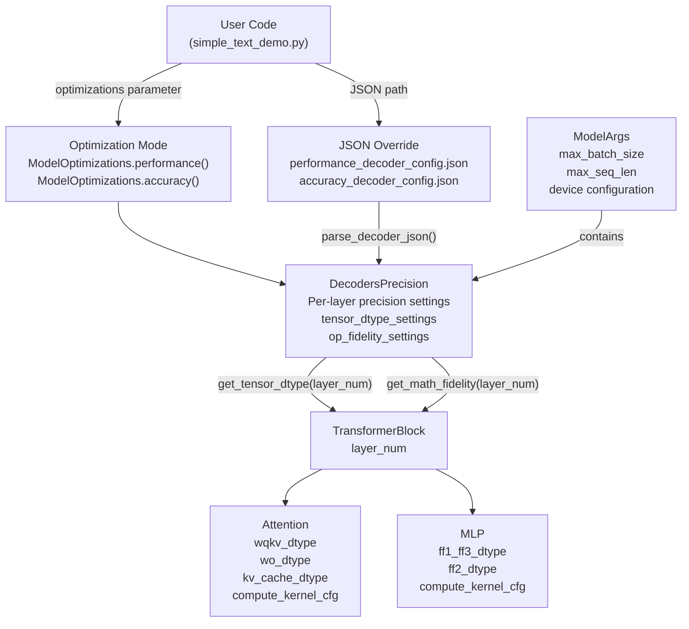
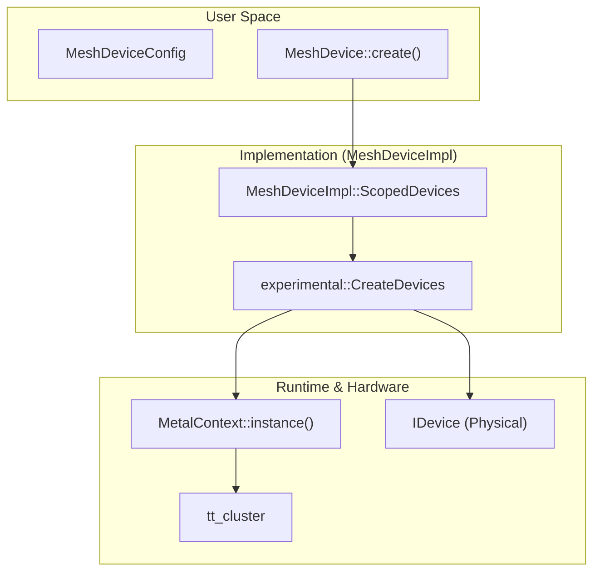
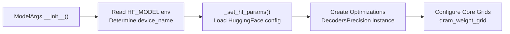
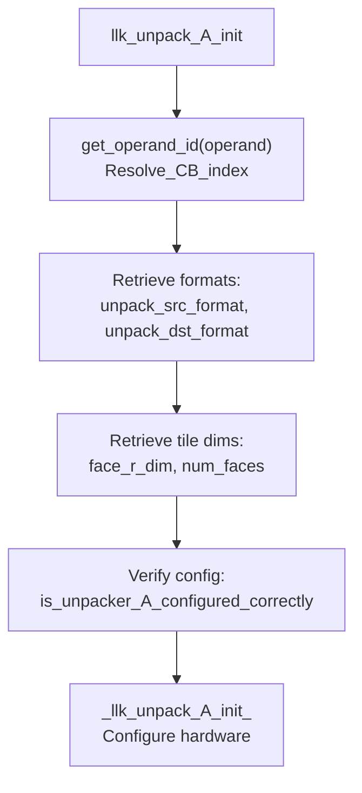
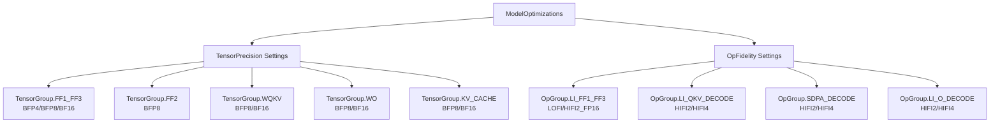
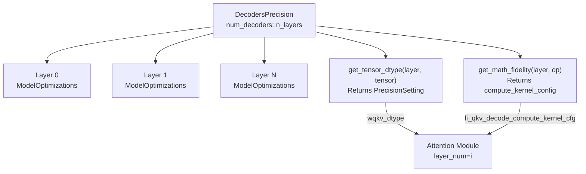
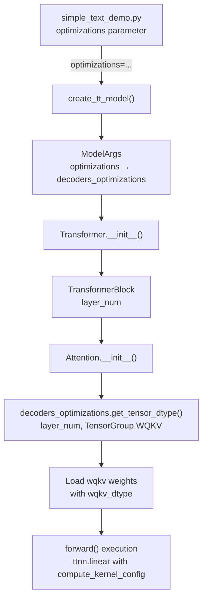

# Model Configuration and Optimization

Relevant source files
*   [models/demos/deepseek_v3/conftest.py](https://github.com/tenstorrent/tt-metal/blob/f30f8df0/models/demos/deepseek_v3/conftest.py)
*   [models/demos/deepseek_v3/demo/README.md](https://github.com/tenstorrent/tt-metal/blob/f30f8df0/models/demos/deepseek_v3/demo/README.md?plain=1)
*   [models/demos/deepseek_v3/demo/demo.py](https://github.com/tenstorrent/tt-metal/blob/f30f8df0/models/demos/deepseek_v3/demo/demo.py)
*   [models/demos/deepseek_v3/demo/make_lmeval_prompts.py](https://github.com/tenstorrent/tt-metal/blob/f30f8df0/models/demos/deepseek_v3/demo/make_lmeval_prompts.py)
*   [models/demos/deepseek_v3/demo/score_lmeval_outputs.py](https://github.com/tenstorrent/tt-metal/blob/f30f8df0/models/demos/deepseek_v3/demo/score_lmeval_outputs.py)
*   [models/demos/deepseek_v3/demo/test_demo.py](https://github.com/tenstorrent/tt-metal/blob/f30f8df0/models/demos/deepseek_v3/demo/test_demo.py)
*   [models/demos/deepseek_v3/demo/test_demo_teacher_forced.py](https://github.com/tenstorrent/tt-metal/blob/f30f8df0/models/demos/deepseek_v3/demo/test_demo_teacher_forced.py)
*   [models/demos/deepseek_v3/demo/test_eval_support.py](https://github.com/tenstorrent/tt-metal/blob/f30f8df0/models/demos/deepseek_v3/demo/test_eval_support.py)
*   [models/demos/deepseek_v3/tests/test_decoder_block.py](https://github.com/tenstorrent/tt-metal/blob/f30f8df0/models/demos/deepseek_v3/tests/test_decoder_block.py)
*   [models/demos/deepseek_v3/tests/test_embedding.py](https://github.com/tenstorrent/tt-metal/blob/f30f8df0/models/demos/deepseek_v3/tests/test_embedding.py)
*   [models/demos/deepseek_v3/tests/test_get_weight_config.py](https://github.com/tenstorrent/tt-metal/blob/f30f8df0/models/demos/deepseek_v3/tests/test_get_weight_config.py)
*   [models/demos/deepseek_v3/tests/test_mla.py](https://github.com/tenstorrent/tt-metal/blob/f30f8df0/models/demos/deepseek_v3/tests/test_mla.py)
*   [models/demos/deepseek_v3/tests/test_mlp.py](https://github.com/tenstorrent/tt-metal/blob/f30f8df0/models/demos/deepseek_v3/tests/test_mlp.py)
*   [models/demos/deepseek_v3/tests/test_model.py](https://github.com/tenstorrent/tt-metal/blob/f30f8df0/models/demos/deepseek_v3/tests/test_model.py)
*   [models/demos/deepseek_v3/tests/test_moe.py](https://github.com/tenstorrent/tt-metal/blob/f30f8df0/models/demos/deepseek_v3/tests/test_moe.py)
*   [models/demos/deepseek_v3/tests/test_moe_experts.py](https://github.com/tenstorrent/tt-metal/blob/f30f8df0/models/demos/deepseek_v3/tests/test_moe_experts.py)
*   [models/demos/deepseek_v3/tests/test_moe_gate.py](https://github.com/tenstorrent/tt-metal/blob/f30f8df0/models/demos/deepseek_v3/tests/test_moe_gate.py)
*   [models/demos/deepseek_v3/tests/test_rms_norm.py](https://github.com/tenstorrent/tt-metal/blob/f30f8df0/models/demos/deepseek_v3/tests/test_rms_norm.py)
*   [models/demos/deepseek_v3/tests/unit/test_to_memory_config.py](https://github.com/tenstorrent/tt-metal/blob/f30f8df0/models/demos/deepseek_v3/tests/unit/test_to_memory_config.py)
*   [models/demos/deepseek_v3/tt/ccl.py](https://github.com/tenstorrent/tt-metal/blob/f30f8df0/models/demos/deepseek_v3/tt/ccl.py)
*   [models/demos/deepseek_v3/tt/decoder_block/decoder_block_base.py](https://github.com/tenstorrent/tt-metal/blob/f30f8df0/models/demos/deepseek_v3/tt/decoder_block/decoder_block_base.py)
*   [models/demos/deepseek_v3/tt/embedding/embedding1d.py](https://github.com/tenstorrent/tt-metal/blob/f30f8df0/models/demos/deepseek_v3/tt/embedding/embedding1d.py)
*   [models/demos/deepseek_v3/tt/embedding/embedding2d.py](https://github.com/tenstorrent/tt-metal/blob/f30f8df0/models/demos/deepseek_v3/tt/embedding/embedding2d.py)
*   [models/demos/deepseek_v3/tt/experts.py](https://github.com/tenstorrent/tt-metal/blob/f30f8df0/models/demos/deepseek_v3/tt/experts.py)
*   [models/demos/deepseek_v3/tt/generator.py](https://github.com/tenstorrent/tt-metal/blob/f30f8df0/models/demos/deepseek_v3/tt/generator.py)
*   [models/demos/deepseek_v3/tt/generator_vllm.py](https://github.com/tenstorrent/tt-metal/blob/f30f8df0/models/demos/deepseek_v3/tt/generator_vllm.py)
*   [models/demos/deepseek_v3/tt/lm_head1d.py](https://github.com/tenstorrent/tt-metal/blob/f30f8df0/models/demos/deepseek_v3/tt/lm_head1d.py)
*   [models/demos/deepseek_v3/tt/mla/mla1d.py](https://github.com/tenstorrent/tt-metal/blob/f30f8df0/models/demos/deepseek_v3/tt/mla/mla1d.py)
*   [models/demos/deepseek_v3/tt/mla/mla2d.py](https://github.com/tenstorrent/tt-metal/blob/f30f8df0/models/demos/deepseek_v3/tt/mla/mla2d.py)
*   [models/demos/deepseek_v3/tt/mlp/mlp.py](https://github.com/tenstorrent/tt-metal/blob/f30f8df0/models/demos/deepseek_v3/tt/mlp/mlp.py)
*   [models/demos/deepseek_v3/tt/model/row_batched_model.py](https://github.com/tenstorrent/tt-metal/blob/f30f8df0/models/demos/deepseek_v3/tt/model/row_batched_model.py)
*   [models/demos/deepseek_v3/tt/moe.py](https://github.com/tenstorrent/tt-metal/blob/f30f8df0/models/demos/deepseek_v3/tt/moe.py)
*   [models/demos/deepseek_v3/tt/moe_gate.py](https://github.com/tenstorrent/tt-metal/blob/f30f8df0/models/demos/deepseek_v3/tt/moe_gate.py)
*   [models/demos/deepseek_v3/tt/mtp.py](https://github.com/tenstorrent/tt-metal/blob/f30f8df0/models/demos/deepseek_v3/tt/mtp.py)
*   [models/demos/deepseek_v3/tt/rms_norm/distributed_rms_norm.py](https://github.com/tenstorrent/tt-metal/blob/f30f8df0/models/demos/deepseek_v3/tt/rms_norm/distributed_rms_norm.py)
*   [models/demos/deepseek_v3/tt/rms_norm/rms_norm.py](https://github.com/tenstorrent/tt-metal/blob/f30f8df0/models/demos/deepseek_v3/tt/rms_norm/rms_norm.py)
*   [models/demos/deepseek_v3/tt/rms_norm/rms_norm_base.py](https://github.com/tenstorrent/tt-metal/blob/f30f8df0/models/demos/deepseek_v3/tt/rms_norm/rms_norm_base.py)
*   [models/demos/deepseek_v3/tt/rope.py](https://github.com/tenstorrent/tt-metal/blob/f30f8df0/models/demos/deepseek_v3/tt/rope.py)
*   [models/demos/deepseek_v3/utils/config_dataclass.py](https://github.com/tenstorrent/tt-metal/blob/f30f8df0/models/demos/deepseek_v3/utils/config_dataclass.py)
*   [models/demos/deepseek_v3/utils/config_helpers.py](https://github.com/tenstorrent/tt-metal/blob/f30f8df0/models/demos/deepseek_v3/utils/config_helpers.py)
*   [models/demos/deepseek_v3/utils/run_config.py](https://github.com/tenstorrent/tt-metal/blob/f30f8df0/models/demos/deepseek_v3/utils/run_config.py)
*   [models/demos/deepseek_v3/utils/test_utils.py](https://github.com/tenstorrent/tt-metal/blob/f30f8df0/models/demos/deepseek_v3/utils/test_utils.py)
*   [models/demos/deepseek_v3/utils/weight_config.py](https://github.com/tenstorrent/tt-metal/blob/f30f8df0/models/demos/deepseek_v3/utils/weight_config.py)
*   [models/tt_transformers/PERF.md](https://github.com/tenstorrent/tt-metal/blob/f30f8df0/models/tt_transformers/PERF.md?plain=1)
*   [models/tt_transformers/README.md](https://github.com/tenstorrent/tt-metal/blob/f30f8df0/models/tt_transformers/README.md?plain=1)
*   [models/tt_transformers/demo/conftest.py](https://github.com/tenstorrent/tt-metal/blob/f30f8df0/models/tt_transformers/demo/conftest.py)
*   [models/tt_transformers/demo/simple_text_demo.py](https://github.com/tenstorrent/tt-metal/blob/f30f8df0/models/tt_transformers/demo/simple_text_demo.py)
*   [models/tt_transformers/demo/simple_vision_demo.py](https://github.com/tenstorrent/tt-metal/blob/f30f8df0/models/tt_transformers/demo/simple_vision_demo.py)
*   [models/tt_transformers/tests/conftest.py](https://github.com/tenstorrent/tt-metal/blob/f30f8df0/models/tt_transformers/tests/conftest.py)
*   [models/tt_transformers/tests/generate_reference_outputs.py](https://github.com/tenstorrent/tt-metal/blob/f30f8df0/models/tt_transformers/tests/generate_reference_outputs.py)
*   [models/tt_transformers/tests/multimodal/test_llama_cross_attention_transformer_text.py](https://github.com/tenstorrent/tt-metal/blob/f30f8df0/models/tt_transformers/tests/multimodal/test_llama_cross_attention_transformer_text.py)
*   [models/tt_transformers/tests/test_attention.py](https://github.com/tenstorrent/tt-metal/blob/f30f8df0/models/tt_transformers/tests/test_attention.py)
*   [models/tt_transformers/tests/test_attention_prefill.py](https://github.com/tenstorrent/tt-metal/blob/f30f8df0/models/tt_transformers/tests/test_attention_prefill.py)
*   [models/tt_transformers/tests/test_chunked_generation.py](https://github.com/tenstorrent/tt-metal/blob/f30f8df0/models/tt_transformers/tests/test_chunked_generation.py)
*   [models/tt_transformers/tests/test_decoder.py](https://github.com/tenstorrent/tt-metal/blob/f30f8df0/models/tt_transformers/tests/test_decoder.py)
*   [models/tt_transformers/tests/test_decoder_prefill.py](https://github.com/tenstorrent/tt-metal/blob/f30f8df0/models/tt_transformers/tests/test_decoder_prefill.py)
*   [models/tt_transformers/tests/test_embedding.py](https://github.com/tenstorrent/tt-metal/blob/f30f8df0/models/tt_transformers/tests/test_embedding.py)
*   [models/tt_transformers/tests/test_load_checkpoints.py](https://github.com/tenstorrent/tt-metal/blob/f30f8df0/models/tt_transformers/tests/test_load_checkpoints.py)
*   [models/tt_transformers/tests/test_mlp.py](https://github.com/tenstorrent/tt-metal/blob/f30f8df0/models/tt_transformers/tests/test_mlp.py)
*   [models/tt_transformers/tests/test_model.py](https://github.com/tenstorrent/tt-metal/blob/f30f8df0/models/tt_transformers/tests/test_model.py)
*   [models/tt_transformers/tests/test_model_prefill.py](https://github.com/tenstorrent/tt-metal/blob/f30f8df0/models/tt_transformers/tests/test_model_prefill.py)
*   [models/tt_transformers/tests/test_rms_norm.py](https://github.com/tenstorrent/tt-metal/blob/f30f8df0/models/tt_transformers/tests/test_rms_norm.py)
*   [models/tt_transformers/tt/attention.py](https://github.com/tenstorrent/tt-metal/blob/f30f8df0/models/tt_transformers/tt/attention.py)
*   [models/tt_transformers/tt/common.py](https://github.com/tenstorrent/tt-metal/blob/f30f8df0/models/tt_transformers/tt/common.py)
*   [models/tt_transformers/tt/decoder.py](https://github.com/tenstorrent/tt-metal/blob/f30f8df0/models/tt_transformers/tt/decoder.py)
*   [models/tt_transformers/tt/generator.py](https://github.com/tenstorrent/tt-metal/blob/f30f8df0/models/tt_transformers/tt/generator.py)
*   [models/tt_transformers/tt/load_checkpoints.py](https://github.com/tenstorrent/tt-metal/blob/f30f8df0/models/tt_transformers/tt/load_checkpoints.py)
*   [models/tt_transformers/tt/mlp.py](https://github.com/tenstorrent/tt-metal/blob/f30f8df0/models/tt_transformers/tt/mlp.py)
*   [models/tt_transformers/tt/model.py](https://github.com/tenstorrent/tt-metal/blob/f30f8df0/models/tt_transformers/tt/model.py)
*   [models/tt_transformers/tt/model_config.py](https://github.com/tenstorrent/tt-metal/blob/f30f8df0/models/tt_transformers/tt/model_config.py)
*   [models/tt_transformers/tt/multimodal/llama_class_embedding.py](https://github.com/tenstorrent/tt-metal/blob/f30f8df0/models/tt_transformers/tt/multimodal/llama_class_embedding.py)
*   [models/tt_transformers/tt/multimodal/llama_conv2d_patch.py](https://github.com/tenstorrent/tt-metal/blob/f30f8df0/models/tt_transformers/tt/multimodal/llama_conv2d_patch.py)
*   [models/tt_transformers/tt/multimodal/llama_cross_attention_transformer_text.py](https://github.com/tenstorrent/tt-metal/blob/f30f8df0/models/tt_transformers/tt/multimodal/llama_cross_attention_transformer_text.py)
*   [models/tt_transformers/tt/multimodal/llama_cross_block.py](https://github.com/tenstorrent/tt-metal/blob/f30f8df0/models/tt_transformers/tt/multimodal/llama_cross_block.py)
*   [models/tt_transformers/tt/multimodal/llama_image_block.py](https://github.com/tenstorrent/tt-metal/blob/f30f8df0/models/tt_transformers/tt/multimodal/llama_image_block.py)
*   [models/tt_transformers/tt/multimodal/llama_positional_embedding.py](https://github.com/tenstorrent/tt-metal/blob/f30f8df0/models/tt_transformers/tt/multimodal/llama_positional_embedding.py)
*   [models/tt_transformers/tt/multimodal/llama_tile_position_embedding.py](https://github.com/tenstorrent/tt-metal/blob/f30f8df0/models/tt_transformers/tt/multimodal/llama_tile_position_embedding.py)
*   [models/tt_transformers/tt/multimodal/llama_vision_encoder.py](https://github.com/tenstorrent/tt-metal/blob/f30f8df0/models/tt_transformers/tt/multimodal/llama_vision_encoder.py)
*   [models/tt_transformers/tt/multimodal/llama_vision_model.py](https://github.com/tenstorrent/tt-metal/blob/f30f8df0/models/tt_transformers/tt/multimodal/llama_vision_model.py)
*   [models/tt_transformers/tt/rope.py](https://github.com/tenstorrent/tt-metal/blob/f30f8df0/models/tt_transformers/tt/rope.py)
*   [tests/tt_eager/python_api_testing/unit_testing/misc/test_deepseek_mla_ops.py](https://github.com/tenstorrent/tt-metal/blob/f30f8df0/tests/tt_eager/python_api_testing/unit_testing/misc/test_deepseek_mla_ops.py)

This document describes the model configuration and optimization system in the `tt-transformers` implementation within `tt-metal`. It covers how models are configured for different precision and fidelity settings, how optimization strategies balance performance and accuracy, and how these configurations flow through the runtime to control tensor data types and compute kernel parameters.

For information about the overall model development workflow and bring-up process, see [Model Development Workflow](https://github.com/tenstorrent/tt-metal/blob/f30f8df0/Model%20Development%20Workflow) For performance optimization techniques like Metal Trace and async mode, see [Performance Optimization Techniques](https://github.com/tenstorrent/tt-metal/blob/f30f8df0/Performance%20Optimization%20Techniques)

* * *

## Configuration System Architecture

The configuration system provides a flexible framework for controlling model precision, math fidelity, and other optimization parameters. It operates at multiple levels: global defaults, per-optimization-mode settings, and per-layer overrides.

**Configuration System Flow**

**Sources:**[models/tt_transformers/tt/model_config.py 113-201](https://github.com/tenstorrent/tt-metal/blob/f30f8df0/models/tt_transformers/tt/model_config.py#L113-L201)[models/tt_transformers/demo/simple_text_demo.py 77-124](https://github.com/tenstorrent/tt-metal/blob/f30f8df0/models/tt_transformers/demo/simple_text_demo.py#L77-L124)[models/tt_transformers/tt/model.py 23-140](https://github.com/tenstorrent/tt-metal/blob/f30f8df0/models/tt_transformers/tt/model.py#L23-L140)

* * *



## ModelArgs Class

The `ModelArgs` class is the central configuration container that holds all model-specific parameters, hardware configuration, and optimization settings. It is initialized with device information and user-specified parameters.

### Key Responsibilities

| Aspect | Description | Key Attributes |
| --- | --- | --- |
| **Model Parameters** | Loads architecture parameters from HuggingFace config | `n_layers`, `dim`, `n_heads`, `n_kv_heads`, `vocab_size` |
| **Hardware Configuration** | Device topology and memory layout | `mesh_device`, `num_devices`, `max_grid_size` |
| **Sequence Management** | Maximum context and batch settings | `max_seq_len`, `max_batch_size`, `max_prefill_chunk_size` |
| **Optimization Strategy** | Contains `DecodersPrecision` instance | `decoders_optimizations` |
| **Cache Paths** | Weight caching and HF model location | `weight_cache_path()` |

### Initialization Flow

**Initialization Code Path:**

*   User creates `ModelArgs` instance: [models/tt_transformers/tests/test_model.py 120-130](https://github.com/tenstorrent/tt-metal/blob/f30f8df0/models/tt_transformers/tests/test_model.py#L120-L130)
*   Constructor processes parameters: [models/tt_transformers/tt/model_config.py 401-609](https://github.com/tenstorrent/tt-metal/blob/f30f8df0/models/tt_transformers/tt/model_config.py#L401-L609)
*   Loads HuggingFace parameters: [models/tt_transformers/tt/model_config.py 1264-1428](https://github.com/tenstorrent/tt-metal/blob/f30f8df0/models/tt_transformers/tt/model_config.py#L1264-L1428)
*   Establishes optimization settings: [models/tt_transformers/tt/model_config.py 571-578](https://github.com/tenstorrent/tt-metal/blob/f30f8df0/models/tt_transformers/tt/model_config.py#L571-L578)

**Sources:**[models/tt_transformers/tt/model_config.py 401-609](https://github.com/tenstorrent/tt-metal/blob/f30f8df0/models/tt_transformers/tt/model_config.py#L401-L609)[models/tt_transformers/tests/test_model.py 120-130](https://github.com/tenstorrent/tt-metal/blob/f30f8df0/models/tt_transformers/tests/test_model.py#L120-L130)

* * *







**Initialization Code Path:**
- User creates `ModelArgs` instance: [models/tt_transformers/tests/test_model.py:120-130]()
- Constructor processes parameters: [models/tt_transformers/tt/model_config.py:401-609]()
- Loads HuggingFace parameters: [models/tt_transformers/tt/model_config.py:1264-1428]()
- Establishes optimization settings: [models/tt_transformers/tt/model_config.py:571-578]()
```




The hardware configuration prepares the unpacker unit for the specified source and destination data formats and tile layouts.

**Template parameters controlling behavior:**

- `BType`: Broadcast type (defined in `ckernel::BroadcastType`), e.g., `NONE`, `ROW`, `COL`, `SCALAR`.
- `acc_to_dest`: Whether to accumulate results directly to destination register.
- `binary_reuse_dest`: Binary reuse flag (defined in `ckernel::EltwiseBinaryReuseDestType`).
- `unpack_to_dest`: Whether to unpack directly to the destination (bypassing SRCA).

Sources:
[tt_metal/hw/ckernels/wormhole_b0/metal/llk_api/llk_unpack_A_api.h:13-41](),
[tt_metal/hw/ckernels/blackhole/metal/llk_api/llk_unpack_A_api.h:13-41]()
```
## Optimization Modes

The `ModelOptimizations` class provides predefined configurations that balance performance and accuracy. It defines precision settings for `TensorGroup` and math fidelity for `OpGroup`.

### Performance vs Accuracy Modes

**Performance Mode** (`ModelOptimizations.performance()`):

*   Uses `BFP4` for MLP feed-forward weights (`FF1_FF3`) with `LOFI` math fidelity [models/tt_transformers/tt/model_config.py 183-201](https://github.com/tenstorrent/tt-metal/blob/f30f8df0/models/tt_transformers/tt/model_config.py#L183-L201)
*   Uses `BFP8` for attention weights and KV cache by default.
*   Optimized for maximum throughput.

**Accuracy Mode** (`ModelOptimizations.accuracy()`):

*   Uses `BF16` for attention weights (`WQKV`, `WO`, `KV_CACHE`) with `HIFI4` math fidelity [models/tt_transformers/tt/model_config.py 161-177](https://github.com/tenstorrent/tt-metal/blob/f30f8df0/models/tt_transformers/tt/model_config.py#L161-L177)
*   Uses `BFP8` for MLP with `HIFI2_FP16` (FP16 accumulation) for specific models like Llama 3 [models/tt_transformers/tt/model_config.py 143-153](https://github.com/tenstorrent/tt-metal/blob/f30f8df0/models/tt_transformers/tt/model_config.py#L143-L153)
*   Special handling for 70B+ models (still use `BFP4` MLPs and `BFP8` attention) [models/tt_transformers/tt/model_config.py 119-128](https://github.com/tenstorrent/tt-metal/blob/f30f8df0/models/tt_transformers/tt/model_config.py#L119-L128)

### Configuration Structure

**Sources:**[models/tt_transformers/tt/model_config.py 113-201](https://github.com/tenstorrent/tt-metal/blob/f30f8df0/models/tt_transformers/tt/model_config.py#L113-L201)[models/tt_transformers/PERF.md 9-99](https://github.com/tenstorrent/tt-metal/blob/f30f8df0/models/tt_transformers/PERF.md?plain=1#L9-L99)

* * *



## Tensor and Operation Categorization

The configuration system categorizes tensors and operations into groups, allowing fine-grained control over precision and math fidelity settings.

### TensorGroup Enum

Categorizes model weights and activations:

| Group | Description | Typical Tensors |
| --- | --- | --- |
| `FF1_FF3` | MLP feed-forward input weights | `w1.weight`, `w3.weight` |
| `FF2` | MLP feed-forward output weights | `w2.weight` |
| `WQKV` | Attention query/key/value weights | `wq.weight`, `wk.weight`, `wv.weight` |
| `WO` | Attention output projection weights | `wo.weight` |
| `KV_CACHE` | Key-value cache tensors | Paged KV cache blocks |
| `ACTIVATION` | Intermediate activations | Layer outputs, residuals |

**Definition:**[models/tt_transformers/tt/model_config.py 52-59](https://github.com/tenstorrent/tt-metal/blob/f30f8df0/models/tt_transformers/tt/model_config.py#L52-L59)

### OpGroup Enum

Categorizes operations by their computational characteristics:

| Group | Description | Operations |
| --- | --- | --- |
| `LI_FF1_FF3` | MLP input linear operations | Matmul for FF1 and FF3 |
| `LI_FF2` | MLP output linear operation | Matmul for FF2 |
| `LI_QKV_DECODE` | Attention QKV projection (decode) | Decode-mode QKV matmul |
| `LI_O_DECODE` | Attention output projection (decode) | Decode-mode output matmul |
| `SDPA_DECODE` | Scaled dot-product attention (decode) | Decode-mode attention computation |
| `LI_QKV_PREFILL` | Attention QKV projection (prefill) | Prefill-mode QKV matmul |
| `LI_O_PREFILL` | Attention output projection (prefill) | Prefill-mode output matmul |
| `SDPA_PREFILL` | Scaled dot-product attention (prefill) | Prefill-mode attention computation |

**Definition:**[models/tt_transformers/tt/model_config.py 67-82](https://github.com/tenstorrent/tt-metal/blob/f30f8df0/models/tt_transformers/tt/model_config.py#L67-L82)

### Precision and Fidelity Settings

**PrecisionSetting** (data types):

*   `BFP4`: Block floating point 4-bit (highest compression)
*   `BFP8`: Block floating point 8-bit (balanced)
*   `BF16`: BFloat16 (highest precision)

**MathFidelitySetting** (compute kernel configurations):

*   `LOFI`: Low fidelity, fastest computation [models/tt_transformers/tt/model_config.py 104](https://github.com/tenstorrent/tt-metal/blob/f30f8df0/models/tt_transformers/tt/model_config.py#L104-L104)
*   `HIFI2`: High fidelity with FP32 accumulation [models/tt_transformers/tt/model_config.py 105](https://github.com/tenstorrent/tt-metal/blob/f30f8df0/models/tt_transformers/tt/model_config.py#L105-L105)
*   `HIFI2_FP16`: High fidelity with FP16 accumulation (saves L1 memory) [models/tt_transformers/tt/model_config.py 107](https://github.com/tenstorrent/tt-metal/blob/f30f8df0/models/tt_transformers/tt/model_config.py#L107-L107)
*   `HIFI2_NA`: Specified `packer_l1_acc=False` and `fp32_dest_acc_en=False`[models/tt_transformers/tt/model_config.py 106](https://github.com/tenstorrent/tt-metal/blob/f30f8df0/models/tt_transformers/tt/model_config.py#L106-L106)
*   `HIFI4`: Highest fidelity with FP32 accumulation throughout [models/tt_transformers/tt/model_config.py 109](https://github.com/tenstorrent/tt-metal/blob/f30f8df0/models/tt_transformers/tt/model_config.py#L109-L109)
*   `HIFI4_FP32`: Highest fidelity with explicit FP32 destination accumulation [models/tt_transformers/tt/model_config.py 110](https://github.com/tenstorrent/tt-metal/blob/f30f8df0/models/tt_transformers/tt/model_config.py#L110-L110)

**Definitions:**[models/tt_transformers/tt/model_config.py 61-110](https://github.com/tenstorrent/tt-metal/blob/f30f8df0/models/tt_transformers/tt/model_config.py#L61-L110)

**Sources:**[models/tt_transformers/tt/model_config.py 52-110](https://github.com/tenstorrent/tt-metal/blob/f30f8df0/models/tt_transformers/tt/model_config.py#L52-L110)[models/tt_transformers/tt/attention.py 115-145](https://github.com/tenstorrent/tt-metal/blob/f30f8df0/models/tt_transformers/tt/attention.py#L115-L145)

* * *

## Per-Layer Decoder Precision

The `DecodersPrecision` class enables layer-specific precision and fidelity configurations, allowing fine-grained optimization of individual transformer layers.

### DecodersPrecision Structure



### Creating Decoder Precision Configurations

**From Optimization Mode:**

**Setting Per-Layer Configuration:**

**Implementation:**[models/tt_transformers/tt/model_config.py 1430-1563](https://github.com/tenstorrent/tt-metal/blob/f30f8df0/models/tt_transformers/tt/model_config.py#L1430-L1563)

### Usage in Modules

Modules query `DecodersPrecision` to determine their configuration:

**Usage Examples:**[models/tt_transformers/tt/attention.py 115-145](https://github.com/tenstorrent/tt-metal/blob/f30f8df0/models/tt_transformers/tt/attention.py#L115-L145)

**Sources:**[models/tt_transformers/tt/model_config.py 1430-1563](https://github.com/tenstorrent/tt-metal/blob/f30f8df0/models/tt_transformers/tt/model_config.py#L1430-L1563)[models/tt_transformers/tt/attention.py 115-145](https://github.com/tenstorrent/tt-metal/blob/f30f8df0/models/tt_transformers/tt/attention.py#L115-L145)

* * *

## JSON Configuration Override

JSON files provide a structured way to override decoder precision settings, enabling experimentation and per-model tuning without code changes.

### JSON Configuration Format

### Configuration File Locations

The system looks for these files in the model directory:

| File | Purpose |
| --- | --- |
| `performance_decoder_config.json` | Overrides for performance mode |
| `accuracy_decoder_config.json` | Overrides for accuracy mode |

**File name constants:**[models/tt_transformers/tt/model_config.py 48-49](https://github.com/tenstorrent/tt-metal/blob/f30f8df0/models/tt_transformers/tt/model_config.py#L48-L49)

### Loading JSON Configuration

**Parser Implementation:**[models/tt_transformers/tt/model_config.py 352-398](https://github.com/tenstorrent/tt-metal/blob/f30f8df0/models/tt_transformers/tt/model_config.py#L352-L398)

**Sources:**[models/tt_transformers/tt/model_config.py 352-398](https://github.com/tenstorrent/tt-metal/blob/f30f8df0/models/tt_transformers/tt/model_config.py#L352-L398)[models/tt_transformers/tt/model_config.py 48-49](https://github.com/tenstorrent/tt-metal/blob/f30f8df0/models/tt_transformers/tt/model_config.py#L48-L49)

* * *

## Configuration Flow Through Runtime

This section illustrates how configuration settings propagate from user code through the runtime to control hardware execution.

### End-to-End Configuration Flow



### Configuration Application in Attention

**Weight Loading with Precision:** Attention weights are loaded using the configured `wqkv_dtype` and `wo_dtype` to ensure memory efficiency and target fidelity [models/tt_transformers/tt/attention.py 119-124](https://github.com/tenstorrent/tt-metal/blob/f30f8df0/models/tt_transformers/tt/attention.py#L119-L124)

**Compute Kernel Configuration:** Compute kernel configurations (e.g., `li_qkv_decode_compute_kernel_cfg`) are applied during the forward pass to matmul and SDPA operations [models/tt_transformers/tt/attention.py 128-145](https://github.com/tenstorrent/tt-metal/blob/f30f8df0/models/tt_transformers/tt/attention.py#L128-L145)

**Sources:**[models/tt_transformers/demo/simple_text_demo.py 1155-1164](https://github.com/tenstorrent/tt-metal/blob/f30f8df0/models/tt_transformers/demo/simple_text_demo.py#L1155-L1164)[models/tt_transformers/tt/model_config.py 571-578](https://github.com/tenstorrent/tt-metal/blob/f30f8df0/models/tt_transformers/tt/model_config.py#L571-L578)[models/tt_transformers/tt/attention.py 115-145](https://github.com/tenstorrent/tt-metal/blob/f30f8df0/models/tt_transformers/tt/attention.py#L115-L145)

* * *

## Optimization Strategies and Tradeoffs

Different optimization strategies achieve different points on the performance-accuracy Pareto frontier.

### Performance vs Accuracy Tradeoffs

The `PERF.md` file documents measured tradeoffs across models and hardware:

| Configuration | Llama-3.1-8B N300 Top-1 | Speed (t/s/u) | Description |
| --- | --- | --- | --- |
| Performance | ~90% | 44.2 | BFP4 MLP, BFP8 attention |
| Accuracy | ~96% | 38.8 | BFP8 MLP (FP16 accum), BF16 attention |

**Performance Table:**[models/tt_transformers/PERF.md 15-57](https://github.com/tenstorrent/tt-metal/blob/f30f8df0/models/tt_transformers/PERF.md?plain=1#L15-L57)[models/tt_transformers/PERF.md 65-99](https://github.com/tenstorrent/tt-metal/blob/f30f8df0/models/tt_transformers/PERF.md?plain=1#L65-L99)

### Model-Specific Optimizations

The system applies model-specific optimizations based on empirical testing:

*   **Llama-3.x Models:** Attention precision is insensitive, so `BFP8` is used even in accuracy mode to save memory [models/tt_transformers/tt/model_config.py 140-143](https://github.com/tenstorrent/tt-metal/blob/f30f8df0/models/tt_transformers/tt/model_config.py#L140-L143)

*   **Qwen2.5-7B:** Uses `BFP8` MLP and `BF16` attention in all decoders [models/tt_transformers/PERF.md 12](https://github.com/tenstorrent/tt-metal/blob/f30f8df0/models/tt_transformers/PERF.md?plain=1#L12-L12)

*   **70B+ Models:** Due to memory limitations, retain `BFP4` MLP and `BFP8` attention even in accuracy mode [models/tt_transformers/tt/model_config.py 119-128](https://github.com/tenstorrent/tt-metal/blob/f30f8df0/models/tt_transformers/tt/model_config.py#L119-L128)

This approach balances memory footprint, latency, and model accuracy.

**Sources:**[models/tt_transformers/PERF.md 1-99](https://github.com/tenstorrent/tt-metal/blob/f30f8df0/models/tt_transformers/PERF.md?plain=1#L1-L99)[models/tt_transformers/tt/model_config.py 113-201](https://github.com/tenstorrent/tt-metal/blob/f30f8df0/models/tt_transformers/tt/model_config.py#L113-L201)

* * *

# Summary

The model configuration and optimization system in `tt-metal` for `tt-transformers` leverages `ModelArgs` as a central configuration class that embeds a `DecodersPrecision` instance assigning per-layer precision and fidelity settings. These settings are defined predominantly by the selected optimization mode: performance or accuracy. Tensor data types and math fidelity levels are assigned at the tensor group and operation group level, with the runtime querying these settings during weight loading and kernel execution.

This layered, extensible design enables fine-grained control over tensor precision and compute fidelity to navigate the tradeoff between model throughput and inference quality. JSON configuration overrides support model-specific tuning without code changes. The configuration propagates from user-facing model creation code into transformer layers and ultimately the device-level linear algebra kernels, ensuring precision consistency for correct, performant execution on Tenstorrent hardware.

* * *

# Appendices

### Key Classes and Enums

| Class / Enum | Description | Location |
| --- | --- | --- |
| `ModelArgs` | Holds model parameters and optimization config | `models/tt_transformers/tt/model_config.py` |
| `ModelOptimizations` | Predefined optimization modes (performance / accuracy) | `models/tt_transformers/tt/model_config.py` |
| `DecodersPrecision` | Per-layer precision and fidelity controller | `models/tt_transformers/tt/model_config.py` |
| `TensorGroup` | Enum of tensor categories for precision control | `models/tt_transformers/tt/model_config.py` |
| `OpGroup` | Enum of operation groups for fidelity control | `models/tt_transformers/tt/model_config.py` |
| `PrecisionSetting` | Enum of data types (BFP4/BFP8/BF16) | `models/tt_transformers/tt/model_config.py` |
| `MathFidelitySetting` | Enum of compute kernel fidelity levels | `models/tt_transformers/tt/model_config.py` |

* * *

### References to Supporting Code

*   Precision and fidelity getters in `DecodersPrecision`: [models/tt_transformers/tt/model_config.py 1477-1540](https://github.com/tenstorrent/tt-metal/blob/f30f8df0/models/tt_transformers/tt/model_config.py#L1477-L1540)
*   Application of precision in `Attention` layer: [models/tt_transformers/tt/attention.py 115-145](https://github.com/tenstorrent/tt-metal/blob/f30f8df0/models/tt_transformers/tt/attention.py#L115-L145)
*   Demo usage of `ModelArgs` and `ModelOptimizations`: [models/tt_transformers/demo/simple_text_demo.py 70-1250](https://github.com/tenstorrent/tt-metal/blob/f30f8df0/models/tt_transformers/demo/simple_text_demo.py#L70-L1250)
*   Optimization settings definitions: [models/tt_transformers/tt/model_config.py 114-201](https://github.com/tenstorrent/tt-metal/blob/f30f8df0/models/tt_transformers/tt/model_config.py#L114-L201)

* * *

# Diagrams Legend

*   Boxes denote code classes or files.
*   Arrows denote calls, data flow, or containment.
*   Labels contain class, method, or variable names in code style.

* * *

This completes the coverage of model configuration and optimization in the `tt-metal` repository.

Dismiss
Refresh this wiki

Enter email to refresh
