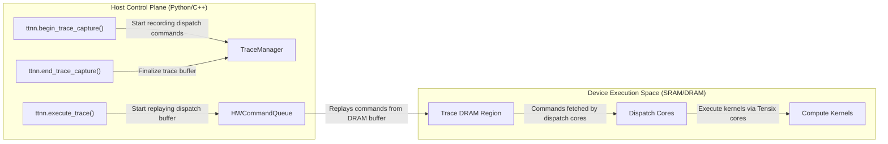
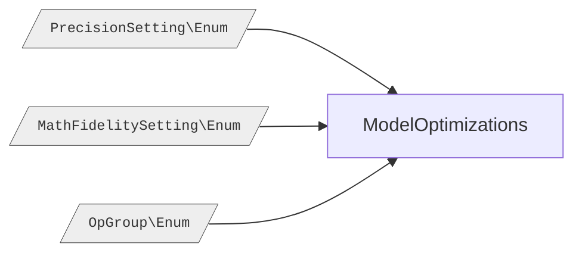
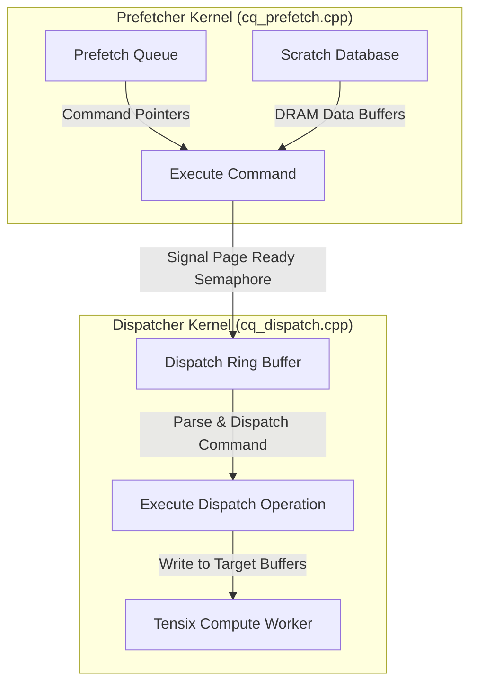
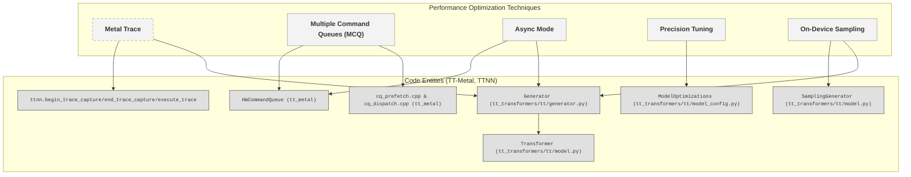

# Performance Optimization Techniques

Relevant source files
*   [models/tt_transformers/PERF.md](https://github.com/tenstorrent/tt-metal/blob/f30f8df0/models/tt_transformers/PERF.md?plain=1)
*   [models/tt_transformers/README.md](https://github.com/tenstorrent/tt-metal/blob/f30f8df0/models/tt_transformers/README.md?plain=1)
*   [models/tt_transformers/demo/conftest.py](https://github.com/tenstorrent/tt-metal/blob/f30f8df0/models/tt_transformers/demo/conftest.py)
*   [models/tt_transformers/demo/simple_text_demo.py](https://github.com/tenstorrent/tt-metal/blob/f30f8df0/models/tt_transformers/demo/simple_text_demo.py)
*   [models/tt_transformers/demo/simple_vision_demo.py](https://github.com/tenstorrent/tt-metal/blob/f30f8df0/models/tt_transformers/demo/simple_vision_demo.py)
*   [models/tt_transformers/tests/conftest.py](https://github.com/tenstorrent/tt-metal/blob/f30f8df0/models/tt_transformers/tests/conftest.py)
*   [models/tt_transformers/tests/generate_reference_outputs.py](https://github.com/tenstorrent/tt-metal/blob/f30f8df0/models/tt_transformers/tests/generate_reference_outputs.py)
*   [models/tt_transformers/tests/multimodal/test_llama_cross_attention_transformer_text.py](https://github.com/tenstorrent/tt-metal/blob/f30f8df0/models/tt_transformers/tests/multimodal/test_llama_cross_attention_transformer_text.py)
*   [models/tt_transformers/tests/test_attention.py](https://github.com/tenstorrent/tt-metal/blob/f30f8df0/models/tt_transformers/tests/test_attention.py)
*   [models/tt_transformers/tests/test_attention_prefill.py](https://github.com/tenstorrent/tt-metal/blob/f30f8df0/models/tt_transformers/tests/test_attention_prefill.py)
*   [models/tt_transformers/tests/test_chunked_generation.py](https://github.com/tenstorrent/tt-metal/blob/f30f8df0/models/tt_transformers/tests/test_chunked_generation.py)
*   [models/tt_transformers/tests/test_decoder.py](https://github.com/tenstorrent/tt-metal/blob/f30f8df0/models/tt_transformers/tests/test_decoder.py)
*   [models/tt_transformers/tests/test_decoder_prefill.py](https://github.com/tenstorrent/tt-metal/blob/f30f8df0/models/tt_transformers/tests/test_decoder_prefill.py)
*   [models/tt_transformers/tests/test_embedding.py](https://github.com/tenstorrent/tt-metal/blob/f30f8df0/models/tt_transformers/tests/test_embedding.py)
*   [models/tt_transformers/tests/test_load_checkpoints.py](https://github.com/tenstorrent/tt-metal/blob/f30f8df0/models/tt_transformers/tests/test_load_checkpoints.py)
*   [models/tt_transformers/tests/test_mlp.py](https://github.com/tenstorrent/tt-metal/blob/f30f8df0/models/tt_transformers/tests/test_mlp.py)
*   [models/tt_transformers/tests/test_model.py](https://github.com/tenstorrent/tt-metal/blob/f30f8df0/models/tt_transformers/tests/test_model.py)
*   [models/tt_transformers/tests/test_model_prefill.py](https://github.com/tenstorrent/tt-metal/blob/f30f8df0/models/tt_transformers/tests/test_model_prefill.py)
*   [models/tt_transformers/tests/test_rms_norm.py](https://github.com/tenstorrent/tt-metal/blob/f30f8df0/models/tt_transformers/tests/test_rms_norm.py)
*   [models/tt_transformers/tt/attention.py](https://github.com/tenstorrent/tt-metal/blob/f30f8df0/models/tt_transformers/tt/attention.py)
*   [models/tt_transformers/tt/common.py](https://github.com/tenstorrent/tt-metal/blob/f30f8df0/models/tt_transformers/tt/common.py)
*   [models/tt_transformers/tt/decoder.py](https://github.com/tenstorrent/tt-metal/blob/f30f8df0/models/tt_transformers/tt/decoder.py)
*   [models/tt_transformers/tt/generator.py](https://github.com/tenstorrent/tt-metal/blob/f30f8df0/models/tt_transformers/tt/generator.py)
*   [models/tt_transformers/tt/load_checkpoints.py](https://github.com/tenstorrent/tt-metal/blob/f30f8df0/models/tt_transformers/tt/load_checkpoints.py)
*   [models/tt_transformers/tt/mlp.py](https://github.com/tenstorrent/tt-metal/blob/f30f8df0/models/tt_transformers/tt/mlp.py)
*   [models/tt_transformers/tt/model.py](https://github.com/tenstorrent/tt-metal/blob/f30f8df0/models/tt_transformers/tt/model.py)
*   [models/tt_transformers/tt/model_config.py](https://github.com/tenstorrent/tt-metal/blob/f30f8df0/models/tt_transformers/tt/model_config.py)
*   [models/tt_transformers/tt/multimodal/llama_class_embedding.py](https://github.com/tenstorrent/tt-metal/blob/f30f8df0/models/tt_transformers/tt/multimodal/llama_class_embedding.py)
*   [models/tt_transformers/tt/multimodal/llama_conv2d_patch.py](https://github.com/tenstorrent/tt-metal/blob/f30f8df0/models/tt_transformers/tt/multimodal/llama_conv2d_patch.py)
*   [models/tt_transformers/tt/multimodal/llama_cross_attention_transformer_text.py](https://github.com/tenstorrent/tt-metal/blob/f30f8df0/models/tt_transformers/tt/multimodal/llama_cross_attention_transformer_text.py)
*   [models/tt_transformers/tt/multimodal/llama_cross_block.py](https://github.com/tenstorrent/tt-metal/blob/f30f8df0/models/tt_transformers/tt/multimodal/llama_cross_block.py)
*   [models/tt_transformers/tt/multimodal/llama_image_block.py](https://github.com/tenstorrent/tt-metal/blob/f30f8df0/models/tt_transformers/tt/multimodal/llama_image_block.py)
*   [models/tt_transformers/tt/multimodal/llama_positional_embedding.py](https://github.com/tenstorrent/tt-metal/blob/f30f8df0/models/tt_transformers/tt/multimodal/llama_positional_embedding.py)
*   [models/tt_transformers/tt/multimodal/llama_tile_position_embedding.py](https://github.com/tenstorrent/tt-metal/blob/f30f8df0/models/tt_transformers/tt/multimodal/llama_tile_position_embedding.py)
*   [models/tt_transformers/tt/multimodal/llama_vision_encoder.py](https://github.com/tenstorrent/tt-metal/blob/f30f8df0/models/tt_transformers/tt/multimodal/llama_vision_encoder.py)
*   [models/tt_transformers/tt/multimodal/llama_vision_model.py](https://github.com/tenstorrent/tt-metal/blob/f30f8df0/models/tt_transformers/tt/multimodal/llama_vision_model.py)
*   [models/tt_transformers/tt/rope.py](https://github.com/tenstorrent/tt-metal/blob/f30f8df0/models/tt_transformers/tt/rope.py)
*   [tech_reports/memory/allocator.md](https://github.com/tenstorrent/tt-metal/blob/f30f8df0/tech_reports/memory/allocator.md?plain=1)
*   [tests/tt_metal/distributed/test_mesh_trace.cpp](https://github.com/tenstorrent/tt-metal/blob/f30f8df0/tests/tt_metal/distributed/test_mesh_trace.cpp)
*   [tests/tt_metal/tt_metal/api/allocator/test_free_list_opt_allocator.cpp](https://github.com/tenstorrent/tt-metal/blob/f30f8df0/tests/tt_metal/tt_metal/api/allocator/test_free_list_opt_allocator.cpp)
*   [tests/tt_metal/tt_metal/api/allocator/test_overlapped_bank_manager.cpp](https://github.com/tenstorrent/tt-metal/blob/f30f8df0/tests/tt_metal/tt_metal/api/allocator/test_overlapped_bank_manager.cpp)
*   [tests/tt_metal/tt_metal/test_gold_impls.hpp](https://github.com/tenstorrent/tt-metal/blob/f30f8df0/tests/tt_metal/tt_metal/test_gold_impls.hpp)
*   [tt_metal/api/tt-metalium/allocator.hpp](https://github.com/tenstorrent/tt-metal/blob/f30f8df0/tt_metal/api/tt-metalium/allocator.hpp)
*   [tt_metal/api/tt-metalium/memory_reporter.hpp](https://github.com/tenstorrent/tt-metal/blob/f30f8df0/tt_metal/api/tt-metalium/memory_reporter.hpp)
*   [tt_metal/api/tt-metalium/tilize_utils.hpp](https://github.com/tenstorrent/tt-metal/blob/f30f8df0/tt_metal/api/tt-metalium/tilize_utils.hpp)
*   [tt_metal/detail/reports/memory_reporter.cpp](https://github.com/tenstorrent/tt-metal/blob/f30f8df0/tt_metal/detail/reports/memory_reporter.cpp)
*   [tt_metal/detail/reports/memory_reporter.hpp](https://github.com/tenstorrent/tt-metal/blob/f30f8df0/tt_metal/detail/reports/memory_reporter.hpp)
*   [tt_metal/distributed/mesh_trace.cpp](https://github.com/tenstorrent/tt-metal/blob/f30f8df0/tt_metal/distributed/mesh_trace.cpp)
*   [tt_metal/distributed/mesh_trace.hpp](https://github.com/tenstorrent/tt-metal/blob/f30f8df0/tt_metal/distributed/mesh_trace.hpp)
*   [tt_metal/impl/allocator/algorithms/allocator_algorithm.hpp](https://github.com/tenstorrent/tt-metal/blob/f30f8df0/tt_metal/impl/allocator/algorithms/allocator_algorithm.hpp)
*   [tt_metal/impl/allocator/algorithms/free_list_opt.cpp](https://github.com/tenstorrent/tt-metal/blob/f30f8df0/tt_metal/impl/allocator/algorithms/free_list_opt.cpp)
*   [tt_metal/impl/allocator/algorithms/free_list_opt.hpp](https://github.com/tenstorrent/tt-metal/blob/f30f8df0/tt_metal/impl/allocator/algorithms/free_list_opt.hpp)
*   [tt_metal/impl/allocator/allocator.cpp](https://github.com/tenstorrent/tt-metal/blob/f30f8df0/tt_metal/impl/allocator/allocator.cpp)
*   [tt_metal/impl/allocator/allocator.hpp](https://github.com/tenstorrent/tt-metal/blob/f30f8df0/tt_metal/impl/allocator/allocator.hpp)
*   [tt_metal/impl/allocator/bank_manager.cpp](https://github.com/tenstorrent/tt-metal/blob/f30f8df0/tt_metal/impl/allocator/bank_manager.cpp)
*   [tt_metal/impl/allocator/bank_manager.hpp](https://github.com/tenstorrent/tt-metal/blob/f30f8df0/tt_metal/impl/allocator/bank_manager.hpp)
*   [tt_metal/impl/allocator/l1_banking_allocator.cpp](https://github.com/tenstorrent/tt-metal/blob/f30f8df0/tt_metal/impl/allocator/l1_banking_allocator.cpp)
*   [ttnn/cpp/ttnn/operations/trace.cpp](https://github.com/tenstorrent/tt-metal/blob/f30f8df0/ttnn/cpp/ttnn/operations/trace.cpp)

This document describes advanced performance optimization techniques for neural network models running on Tenstorrent hardware using the **TT-Metalium** runtime system and the **TTNN** neural network library. It focuses on reducing host overhead, maximizing concurrency, and tuning model behavior for better throughput and latency. Key techniques covered include **Metal Trace**, **Multiple Command Queues**, **Async Mode**, and advanced strategies such as **Precision Tuning** and **On-Device Sampling**.

* * *

## Overview of Optimization Strategies

| Technique | Purpose | Performance Benefit | Use Case |
| --- | --- | --- | --- |
| **Metal Trace** | Remove host overhead by tracing commands | Minimize inter-op dispatch latency | Host-bound models with static static-shaped workloads (e.g. LLM Decode) |
| **Multiple Command Queues (MCQ)** | Overlap IO transfers and compute | Reduces iteration gap by concurrent data+compute | Workloads with frequent data transfers and compute kernels |
| **Async Mode** | Pipeline command queue submissions | Increases device utilization and host-device parallelism | Models where host side is faster than execution |
| **Precision Tuning** | Balance numerical fidelity and speed | Reduces bandwidth pressure and cycles | Large models (70B+) where reduced precision is sufficient |
| **On-Device Sampling** | Perform token sampling on Tensix cores | Reduces host-device roundtrips latency | LLM decoding where Top-K/Top-P are compute intensive |

* * *

## Metal Trace

### Concept and Implementation

**Metal Trace** is a core technique to eliminate the overhead of host API calls and CPU dispatch latency by converting sequences of GPU/accelerator commands into pre-recorded buffers that the hardware can replay directly. This method replaces iterative operation dispatch with a fast DMA replay to the device dispatch engine.

During a **trace capture** phase, the system records all dispatch commands into a large DRAM buffer. Later, instead of making many API calls from the host, the hardware plays back these commands from the buffer, enabling near-continuous execution with minimal host interaction.

Within the TT-Transformers codebase, the `Generator` class maintains trace IDs and inputs for different execution phases such as prefill, decode, and sampling [models/tt_transformers/tt/generator.py 95-103](https://github.com/tenstorrent/tt-metal/blob/f30f8df0/models/tt_transformers/tt/generator.py#L95-L103) It also supports warming up traces for supported sequence lengths and batch sizes to ensure the kernel trace warm paths are ready and optimal before production runs [models/tt_transformers/tt/generator.py 145-158](https://github.com/tenstorrent/tt-metal/blob/f30f8df0/models/tt_transformers/tt/generator.py#L145-L158)

### Data and Control Flow of Metal Trace



### Key Code Entities

*   `Generator.trace_id_prefill`, `Generator.trace_ids_decode`, `Generator.trace_id_prefill_sampling`: Store identifiers of cached traces per device or batch for different execution phases.
*   `ttnn.begin_trace_capture()`, `ttnn.end_trace_capture()`, `ttnn.execute_trace()`: API functions that coordinate trace recording and replay.
*   `HWCommandQueue`: Hardware queue that triggers trace replay at kernel dispatch level.

This design massively reduces CPU dispatch overhead on models with static or predictable operation sequences, such as during token decoding in large language models.

**Sources:**[models/tt_transformers/tt/generator.py 95-103](https://github.com/tenstorrent/tt-metal/blob/f30f8df0/models/tt_transformers/tt/generator.py#L95-L103)[models/tt_transformers/tt/generator.py 145-158](https://github.com/tenstorrent/tt-metal/blob/f30f8df0/models/tt_transformers/tt/generator.py#L145-L158)

* * *

## Multiple Command Queues (MCQ)

### Concept and Purpose

**Multiple Command Queues (MCQ)** allow concurrent dispatch of different types of operations on a single device by providing separate hardware command queues. This enables overlapping of I/O transfers (such as DMA writes) with compute kernels, effectively hiding memory latencies behind compute, thereby increasing throughput.

Multiple command queues are especially beneficial when workloads involve expensive IO operations (like buffer writes/reads) alongside heavy compute. By dispatching to two or more queues, the device can, for example, write input data for the next iteration while simultaneously running inference on the current iteration.

### Command Queue Topology and Implementation

The TT-Metalium internal dispatch topology defines nodes such as `PREFETCH_HD` and `DISPATCH_HD` in a command dispatch graph. Topologies vary by architecture:

*   Single-chip single command queue: contains one `PREFETCH_HD` node and one `DISPATCH_HD` node.
*   Single-chip dual command queue (`single_chip_arch_2cq`): two sets of `PREFETCH_HD` and `DISPATCH_HD` nodes for parallel command streams.
*   Multi-chip topologies use additional nodes for fabric muxing.

These topologies are defined in `tt_metal/impl/dispatch/topology.cpp` lines 125-170 [tt_metal/impl/dispatch/topology.cpp 125-170](https://github.com/tenstorrent/tt-metal/blob/f30f8df0/tt_metal/impl/dispatch/topology.cpp#L125-L170)

| Topology | Description |
| --- | --- |
| single_chip_arch_1cq | Single set of prefetch and dispatch nodes |
| single_chip_arch_2cq | Two independent command queues for overlapping dispatch |
| two_chip_arch_1cq_fabric | Multi-chip with fabric mux and dispatch nodes |

### Parallel Command Queue Data Flow

### Integration Examples

*   The `TT_CCL` class in the `Transformer` model uses the multiple command queue feature to overlap collective communication with compute operations [models/tt_transformers/tt/model.py 49](https://github.com/tenstorrent/tt-metal/blob/f30f8df0/models/tt_transformers/tt/model.py#L49-L49)
*   Dispatch kernels such as `cq_prefetch.cpp` and `cq_dispatch.cpp` handle low-level queue prefetch and dispatch logic to support command queue parallelism [tt_metal/impl/dispatch/kernels/cq_prefetch.cpp 5-10](https://github.com/tenstorrent/tt-metal/blob/f30f8df0/tt_metal/impl/dispatch/kernels/cq_prefetch.cpp#L5-L10)[tt_metal/impl/dispatch/kernels/cq_dispatch.cpp 5-8](https://github.com/tenstorrent/tt-metal/blob/f30f8df0/tt_metal/impl/dispatch/kernels/cq_dispatch.cpp#L5-L8)

**Sources:**[tt_metal/impl/dispatch/topology.cpp 125-170](https://github.com/tenstorrent/tt-metal/blob/f30f8df0/tt_metal/impl/dispatch/topology.cpp#L125-L170)[models/tt_transformers/tt/model.py 49](https://github.com/tenstorrent/tt-metal/blob/f30f8df0/models/tt_transformers/tt/model.py#L49-L49)[tt_metal/impl/dispatch/kernels/cq_prefetch.cpp 5-10](https://github.com/tenstorrent/tt-metal/blob/f30f8df0/tt_metal/impl/dispatch/kernels/cq_prefetch.cpp#L5-L10)[tt_metal/impl/dispatch/kernels/cq_dispatch.cpp 5-8](https://github.com/tenstorrent/tt-metal/blob/f30f8df0/tt_metal/impl/dispatch/kernels/cq_dispatch.cpp#L5-L8)

* * *

## Async Mode

### Concept and Benefits

**Async Mode** builds upon Metal Trace and Multiple Command Queues by enabling the host to pipeline command queue submissions asynchronously. This maximizes device utilization by allowing the host to enqueue multiple batches ahead of device execution, effectively hiding host-side computation and communication latencies.

By overlapping host-side workload preparation (e.g., data loading, tokenization) with device execution, throughput and overall utilization increase—especially important when host processing cost is non-trivial.

### Implementation Highlights

*   The device supports multiple command queues allowing concurrent dispatch.
*   The runtime API supports async submission semantics where enqueue commands return immediately while device processes queued commands.
*   The generator and program launchers leverage async mode to prefill device queues with work ahead of time.

This pattern is particularly essential in multi-batch or sequence-prefill scenarios in LLM inference, where total latency is bound by sequential CPU + dispatch + device execution steps.

* * *

## Model-Specific Advanced Optimizations

### Precision Tuning for Performance

Large models such as those with 70B+ parameters benefit from precise control of numerical fidelity to reduce bandwidth usage and compute cycles while maintaining acceptable accuracy.

The `ModelOptimizations` class supports predefined configurations switching between **performance** and **accuracy** settings controlling:

*   Tensor data type precision (e.g., `BFP4`, `BFP8`, `BF16`) for weights and activations.
*   Compute kernel fidelity settings (via `MathFidelitySetting`) determining rounding, accumulation precision, etc.
*   Operator group fidelity controls to tune math precision on specific kernels (e.g., feedforward MLP, attention).

These settings are applied at the layer or model instantiation level to balance speed and accuracy trade-offs [models/tt_transformers/tt/model_config.py 61-110](https://github.com/tenstorrent/tt-metal/blob/f30f8df0/models/tt_transformers/tt/model_config.py#L61-L110)[models/tt_transformers/tt/model_config.py 113-140](https://github.com/tenstorrent/tt-metal/blob/f30f8df0/models/tt_transformers/tt/model_config.py#L113-L140)

* * *




These settings are applied at the layer or model instantiation level to balance speed and accuracy trade-offs [models/tt_transformers/tt/model_config.py:61-110](), [models/tt_transformers/tt/model_config.py:113-140]().

---
```
### On-Device Sampling

To minimize latency and host-device overhead for token sampling (e.g., Top-K, nucleus Top-P sampling), TTNN supports doing the sampling computation **on device** directly on Tensix cores.

*   The `Transformer` model checks if on-device sampling is feasible based on vocab size per device shard (threshold ~64K tokens) [models/tt_transformers/tt/model.py 157-163](https://github.com/tenstorrent/tt-metal/blob/f30f8df0/models/tt_transformers/tt/model.py#L157-L163)
*   When enabled, `SamplingGenerator` is integrated into the model's sampling pipeline to perform sampling steps internally.
*   The `Generator` class manages enabling/disabling sampling trace modes for the on-device sampling step [models/tt_transformers/tt/generator.py 115-119](https://github.com/tenstorrent/tt-metal/blob/f30f8df0/models/tt_transformers/tt/generator.py#L115-L119)
*   Padding vocabularies to power-of-two sizes is supported to maximize single-core TopK efficiency [models/tt_transformers/tt/model_config.py 91-100](https://github.com/tenstorrent/tt-metal/blob/f30f8df0/models/tt_transformers/tt/model_config.py#L91-L100)

This significantly reduces the roundtrip latency of moving large logits tensors to the host and back, leading to faster decode loop iteration times.

* * *

## Prefetcher and Dispatcher Kernels

Two special command queue kernels underpin the dispatch system efficiency:

### Prefetcher Kernel (`cq_prefetch.cpp`)

*   Reads commands and data pointers from the host/DRAM command buffer.
*   Fetches command parameters and data asynchronously into `scratch_db`, a double-buffered memory region.
*   Dispatches commands to the dispatcher kernel.

### Dispatcher Kernel (`cq_dispatch.cpp`)

*   Processes prefetched commands pulled from `scratch_db`.
*   Writes data to target buffers (L1, register files).
*   Synchronizes compute workers by issuing events and memory barriers.
*   Handles enqueue and wait commands, enabling fine-grained concurrent execution.

These kernels provide the low-level primitives enabling multiple command queues and asynchronous dispatch [tt_metal/impl/dispatch/kernels/cq_prefetch.cpp 5-10](https://github.com/tenstorrent/tt-metal/blob/f30f8df0/tt_metal/impl/dispatch/kernels/cq_prefetch.cpp#L5-L10)[tt_metal/impl/dispatch/kernels/cq_dispatch.cpp 5-8](https://github.com/tenstorrent/tt-metal/blob/f30f8df0/tt_metal/impl/dispatch/kernels/cq_dispatch.cpp#L5-L8)

* * *




These kernels provide the low-level primitives enabling multiple command queues and asynchronous dispatch [tt_metal/impl/dispatch/kernels/cq_prefetch.cpp:5-10](), [tt_metal/impl/dispatch/kernels/cq_dispatch.cpp:5-8]().

---
```
## Memory and DRAM Optimizations

### Prefetcher Usage in Model Layers

The `Prefetcher` class alleviates memory bottlenecks by asynchronously fetching weight tensors and other buffer data into L1 caches ahead of compute kernel execution. It is instantiated and configured within key model components such as:

*   `TransformerBlock`
*   `DistributedNorm`
*   `LMHead`

This ensures the model layers have their parameters and intermediate data quickly accessible on Tensix cores, avoiding stalls during runtime [models/tt_transformers/tt/model.py 105-152](https://github.com/tenstorrent/tt-metal/blob/f30f8df0/models/tt_transformers/tt/model.py#L105-L152)

### KV Cache Paging and Management

The Key-Value (KV) cache, critical for transformer decode efficiency, is optimized via:

*   Sharding across devices.
*   Using paged attention with page tables for block mapping.
*   Aligning and padding page tables for hardware trace compatibility.

The `Generator` class manages the KV cache page table, including padding and alignment to power-of-8 or -32 block sizes to optimize trace and hardware performance [models/tt_transformers/tt/generator.py 65-73](https://github.com/tenstorrent/tt-metal/blob/f30f8df0/models/tt_transformers/tt/generator.py#L65-L73)

* * *

# Summary Diagram: Mapping Optimization Concepts to Code Entities

* * *




---
```
# Summary

This page presented detailed technical insight into four key optimization techniques used in the tt-metal codebase to maximize performance of neural network inference on Tenstorrent hardware:

*   **Metal Trace** for eliminating host dispatch overhead.
*   **Multiple Command Queues** for overlapping IO and compute.
*   **Async Mode** for pipelining execution on host and device.
*   **Model-specific optimizations** including precision tuning and on-device sampling.

These advances operate together at the runtime and model levels, greatly increasing throughput and minimizing latencies critical for large-scale transformer inference on Tenstorrent platforms.

* * *

## References

*   [models/tt_transformers/tt/generator.py 95-158](https://github.com/tenstorrent/tt-metal/blob/f30f8df0/models/tt_transformers/tt/generator.py#L95-L158)
*   [tt_metal/impl/dispatch/topology.cpp 125-170](https://github.com/tenstorrent/tt-metal/blob/f30f8df0/tt_metal/impl/dispatch/topology.cpp#L125-L170)
*   [models/tt_transformers/tt/model.py 49-163](https://github.com/tenstorrent/tt-metal/blob/f30f8df0/models/tt_transformers/tt/model.py#L49-L163)
*   [tt_metal/impl/dispatch/kernels/cq_prefetch.cpp 5-10](https://github.com/tenstorrent/tt-metal/blob/f30f8df0/tt_metal/impl/dispatch/kernels/cq_prefetch.cpp#L5-L10)
*   [tt_metal/impl/dispatch/kernels/cq_dispatch.cpp 5-8](https://github.com/tenstorrent/tt-metal/blob/f30f8df0/tt_metal/impl/dispatch/kernels/cq_dispatch.cpp#L5-L8)
*   [models/tt_transformers/tt/model_config.py 61-110](https://github.com/tenstorrent/tt-metal/blob/f30f8df0/models/tt_transformers/tt/model_config.py#L61-L110)
*   [models/tt_transformers/tt/model_config.py 91-100](https://github.com/tenstorrent/tt-metal/blob/f30f8df0/models/tt_transformers/tt/model_config.py#L91-L100)

Dismiss
Refresh this wiki

Enter email to refresh
