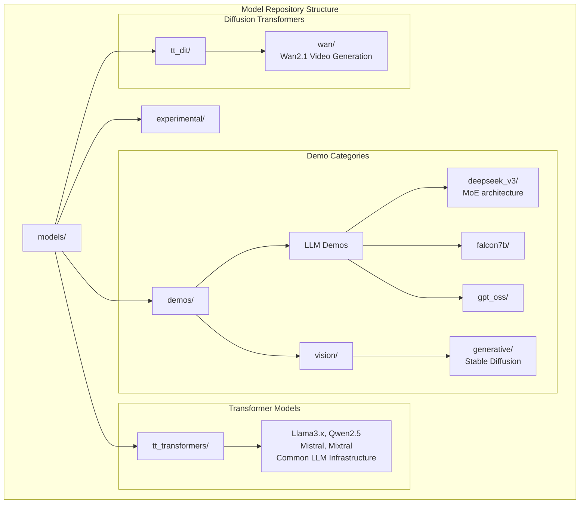
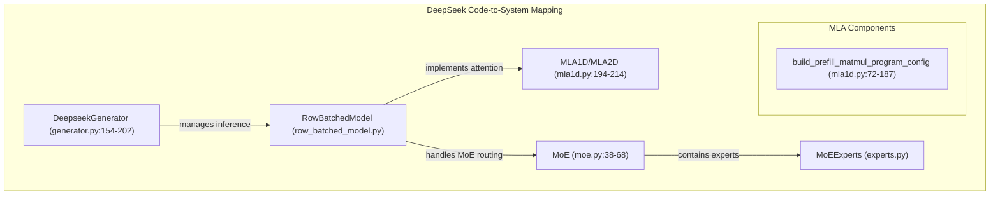
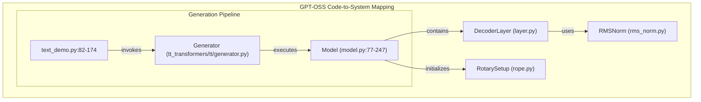
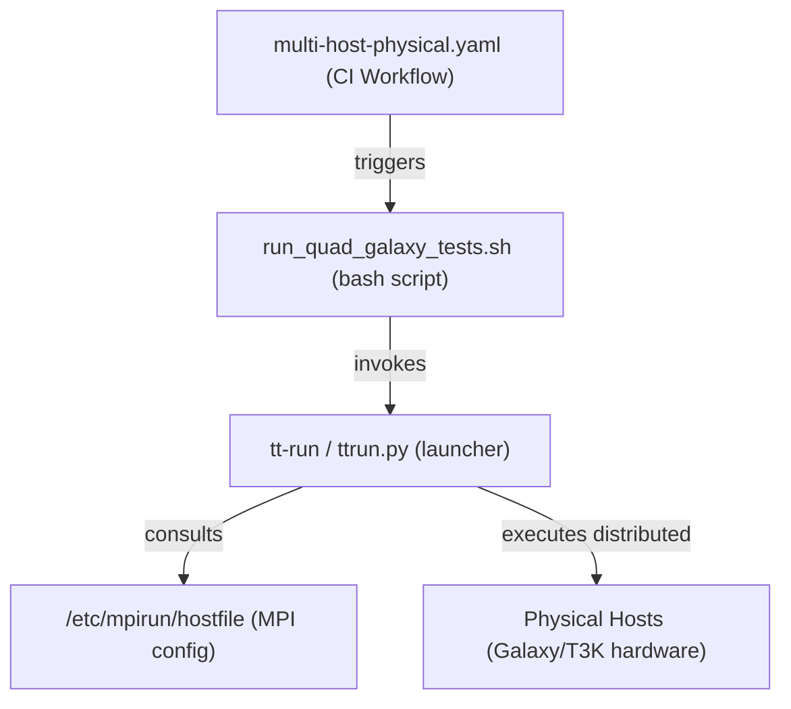

# Model Examples and Demos

Relevant source files
*   [.github/pyproject.toml](https://github.com/tenstorrent/tt-metal/blob/f30f8df0/.github/pyproject.toml)
*   [.github/scripts/utils/validate_perf_targets.py](https://github.com/tenstorrent/tt-metal/blob/f30f8df0/.github/scripts/utils/validate_perf_targets.py)
*   [.github/workflows/vllm-nightly-tests-impl.yaml](https://github.com/tenstorrent/tt-metal/blob/f30f8df0/.github/workflows/vllm-nightly-tests-impl.yaml)
*   [.github/workflows/vllm-nightly-tests.yaml](https://github.com/tenstorrent/tt-metal/blob/f30f8df0/.github/workflows/vllm-nightly-tests.yaml)
*   [models/common/rmsnorm.py](https://github.com/tenstorrent/tt-metal/blob/f30f8df0/models/common/rmsnorm.py)
*   [models/demos/deepseek_v3/conftest.py](https://github.com/tenstorrent/tt-metal/blob/f30f8df0/models/demos/deepseek_v3/conftest.py)
*   [models/demos/deepseek_v3/demo/README.md](https://github.com/tenstorrent/tt-metal/blob/f30f8df0/models/demos/deepseek_v3/demo/README.md?plain=1)
*   [models/demos/deepseek_v3/demo/demo.py](https://github.com/tenstorrent/tt-metal/blob/f30f8df0/models/demos/deepseek_v3/demo/demo.py)
*   [models/demos/deepseek_v3/demo/make_lmeval_prompts.py](https://github.com/tenstorrent/tt-metal/blob/f30f8df0/models/demos/deepseek_v3/demo/make_lmeval_prompts.py)
*   [models/demos/deepseek_v3/demo/score_lmeval_outputs.py](https://github.com/tenstorrent/tt-metal/blob/f30f8df0/models/demos/deepseek_v3/demo/score_lmeval_outputs.py)
*   [models/demos/deepseek_v3/demo/test_demo.py](https://github.com/tenstorrent/tt-metal/blob/f30f8df0/models/demos/deepseek_v3/demo/test_demo.py)
*   [models/demos/deepseek_v3/demo/test_demo_teacher_forced.py](https://github.com/tenstorrent/tt-metal/blob/f30f8df0/models/demos/deepseek_v3/demo/test_demo_teacher_forced.py)
*   [models/demos/deepseek_v3/demo/test_eval_support.py](https://github.com/tenstorrent/tt-metal/blob/f30f8df0/models/demos/deepseek_v3/demo/test_eval_support.py)
*   [models/demos/deepseek_v3/tests/test_decoder_block.py](https://github.com/tenstorrent/tt-metal/blob/f30f8df0/models/demos/deepseek_v3/tests/test_decoder_block.py)
*   [models/demos/deepseek_v3/tests/test_embedding.py](https://github.com/tenstorrent/tt-metal/blob/f30f8df0/models/demos/deepseek_v3/tests/test_embedding.py)
*   [models/demos/deepseek_v3/tests/test_get_weight_config.py](https://github.com/tenstorrent/tt-metal/blob/f30f8df0/models/demos/deepseek_v3/tests/test_get_weight_config.py)
*   [models/demos/deepseek_v3/tests/test_mla.py](https://github.com/tenstorrent/tt-metal/blob/f30f8df0/models/demos/deepseek_v3/tests/test_mla.py)
*   [models/demos/deepseek_v3/tests/test_mlp.py](https://github.com/tenstorrent/tt-metal/blob/f30f8df0/models/demos/deepseek_v3/tests/test_mlp.py)
*   [models/demos/deepseek_v3/tests/test_model.py](https://github.com/tenstorrent/tt-metal/blob/f30f8df0/models/demos/deepseek_v3/tests/test_model.py)
*   [models/demos/deepseek_v3/tests/test_moe.py](https://github.com/tenstorrent/tt-metal/blob/f30f8df0/models/demos/deepseek_v3/tests/test_moe.py)
*   [models/demos/deepseek_v3/tests/test_moe_experts.py](https://github.com/tenstorrent/tt-metal/blob/f30f8df0/models/demos/deepseek_v3/tests/test_moe_experts.py)
*   [models/demos/deepseek_v3/tests/test_moe_gate.py](https://github.com/tenstorrent/tt-metal/blob/f30f8df0/models/demos/deepseek_v3/tests/test_moe_gate.py)
*   [models/demos/deepseek_v3/tests/test_rms_norm.py](https://github.com/tenstorrent/tt-metal/blob/f30f8df0/models/demos/deepseek_v3/tests/test_rms_norm.py)
*   [models/demos/deepseek_v3/tests/unit/test_to_memory_config.py](https://github.com/tenstorrent/tt-metal/blob/f30f8df0/models/demos/deepseek_v3/tests/unit/test_to_memory_config.py)
*   [models/demos/deepseek_v3/tt/ccl.py](https://github.com/tenstorrent/tt-metal/blob/f30f8df0/models/demos/deepseek_v3/tt/ccl.py)
*   [models/demos/deepseek_v3/tt/decoder_block/decoder_block_base.py](https://github.com/tenstorrent/tt-metal/blob/f30f8df0/models/demos/deepseek_v3/tt/decoder_block/decoder_block_base.py)
*   [models/demos/deepseek_v3/tt/embedding/embedding1d.py](https://github.com/tenstorrent/tt-metal/blob/f30f8df0/models/demos/deepseek_v3/tt/embedding/embedding1d.py)
*   [models/demos/deepseek_v3/tt/embedding/embedding2d.py](https://github.com/tenstorrent/tt-metal/blob/f30f8df0/models/demos/deepseek_v3/tt/embedding/embedding2d.py)
*   [models/demos/deepseek_v3/tt/experts.py](https://github.com/tenstorrent/tt-metal/blob/f30f8df0/models/demos/deepseek_v3/tt/experts.py)
*   [models/demos/deepseek_v3/tt/generator.py](https://github.com/tenstorrent/tt-metal/blob/f30f8df0/models/demos/deepseek_v3/tt/generator.py)
*   [models/demos/deepseek_v3/tt/generator_vllm.py](https://github.com/tenstorrent/tt-metal/blob/f30f8df0/models/demos/deepseek_v3/tt/generator_vllm.py)
*   [models/demos/deepseek_v3/tt/lm_head1d.py](https://github.com/tenstorrent/tt-metal/blob/f30f8df0/models/demos/deepseek_v3/tt/lm_head1d.py)
*   [models/demos/deepseek_v3/tt/mla/mla1d.py](https://github.com/tenstorrent/tt-metal/blob/f30f8df0/models/demos/deepseek_v3/tt/mla/mla1d.py)
*   [models/demos/deepseek_v3/tt/mla/mla2d.py](https://github.com/tenstorrent/tt-metal/blob/f30f8df0/models/demos/deepseek_v3/tt/mla/mla2d.py)
*   [models/demos/deepseek_v3/tt/mlp/mlp.py](https://github.com/tenstorrent/tt-metal/blob/f30f8df0/models/demos/deepseek_v3/tt/mlp/mlp.py)
*   [models/demos/deepseek_v3/tt/model/row_batched_model.py](https://github.com/tenstorrent/tt-metal/blob/f30f8df0/models/demos/deepseek_v3/tt/model/row_batched_model.py)
*   [models/demos/deepseek_v3/tt/moe.py](https://github.com/tenstorrent/tt-metal/blob/f30f8df0/models/demos/deepseek_v3/tt/moe.py)
*   [models/demos/deepseek_v3/tt/moe_gate.py](https://github.com/tenstorrent/tt-metal/blob/f30f8df0/models/demos/deepseek_v3/tt/moe_gate.py)
*   [models/demos/deepseek_v3/tt/mtp.py](https://github.com/tenstorrent/tt-metal/blob/f30f8df0/models/demos/deepseek_v3/tt/mtp.py)
*   [models/demos/deepseek_v3/tt/rms_norm/distributed_rms_norm.py](https://github.com/tenstorrent/tt-metal/blob/f30f8df0/models/demos/deepseek_v3/tt/rms_norm/distributed_rms_norm.py)
*   [models/demos/deepseek_v3/tt/rms_norm/rms_norm.py](https://github.com/tenstorrent/tt-metal/blob/f30f8df0/models/demos/deepseek_v3/tt/rms_norm/rms_norm.py)
*   [models/demos/deepseek_v3/tt/rms_norm/rms_norm_base.py](https://github.com/tenstorrent/tt-metal/blob/f30f8df0/models/demos/deepseek_v3/tt/rms_norm/rms_norm_base.py)
*   [models/demos/deepseek_v3/tt/rope.py](https://github.com/tenstorrent/tt-metal/blob/f30f8df0/models/demos/deepseek_v3/tt/rope.py)
*   [models/demos/deepseek_v3/utils/config_dataclass.py](https://github.com/tenstorrent/tt-metal/blob/f30f8df0/models/demos/deepseek_v3/utils/config_dataclass.py)
*   [models/demos/deepseek_v3/utils/config_helpers.py](https://github.com/tenstorrent/tt-metal/blob/f30f8df0/models/demos/deepseek_v3/utils/config_helpers.py)
*   [models/demos/deepseek_v3/utils/run_config.py](https://github.com/tenstorrent/tt-metal/blob/f30f8df0/models/demos/deepseek_v3/utils/run_config.py)
*   [models/demos/deepseek_v3/utils/test_utils.py](https://github.com/tenstorrent/tt-metal/blob/f30f8df0/models/demos/deepseek_v3/utils/test_utils.py)
*   [models/demos/deepseek_v3/utils/weight_config.py](https://github.com/tenstorrent/tt-metal/blob/f30f8df0/models/demos/deepseek_v3/utils/weight_config.py)
*   [models/demos/deepseek_v3_b1/demo/README.md](https://github.com/tenstorrent/tt-metal/blob/f30f8df0/models/demos/deepseek_v3_b1/demo/README.md?plain=1)
*   [models/demos/deepseek_v3_b1/demo/cli.py](https://github.com/tenstorrent/tt-metal/blob/f30f8df0/models/demos/deepseek_v3_b1/demo/cli.py)
*   [models/demos/deepseek_v3_b1/demo/decoder_stage.py](https://github.com/tenstorrent/tt-metal/blob/f30f8df0/models/demos/deepseek_v3_b1/demo/decoder_stage.py)
*   [models/demos/deepseek_v3_b1/demo/mesh_device_context.py](https://github.com/tenstorrent/tt-metal/blob/f30f8df0/models/demos/deepseek_v3_b1/demo/mesh_device_context.py)
*   [models/demos/deepseek_v3_b1/demo/model_pipeline.py](https://github.com/tenstorrent/tt-metal/blob/f30f8df0/models/demos/deepseek_v3_b1/demo/model_pipeline.py)
*   [models/demos/deepseek_v3_b1/demo/pipeline.py](https://github.com/tenstorrent/tt-metal/blob/f30f8df0/models/demos/deepseek_v3_b1/demo/pipeline.py)
*   [models/demos/deepseek_v3_b1/demo/pipeline_routing.py](https://github.com/tenstorrent/tt-metal/blob/f30f8df0/models/demos/deepseek_v3_b1/demo/pipeline_routing.py)
*   [models/demos/deepseek_v3_b1/demo/runtime.py](https://github.com/tenstorrent/tt-metal/blob/f30f8df0/models/demos/deepseek_v3_b1/demo/runtime.py)
*   [models/demos/deepseek_v3_b1/demo/stage.py](https://github.com/tenstorrent/tt-metal/blob/f30f8df0/models/demos/deepseek_v3_b1/demo/stage.py)
*   [models/demos/deepseek_v3_b1/demo/stage_family.py](https://github.com/tenstorrent/tt-metal/blob/f30f8df0/models/demos/deepseek_v3_b1/demo/stage_family.py)
*   [models/demos/deepseek_v3_b1/fused_ops/decoder_block/op.py](https://github.com/tenstorrent/tt-metal/blob/f30f8df0/models/demos/deepseek_v3_b1/fused_ops/decoder_block/op.py)
*   [models/demos/deepseek_v3_b1/micro_ops/d2d_exchange/kernels/d2d_exchange.cpp](https://github.com/tenstorrent/tt-metal/blob/f30f8df0/models/demos/deepseek_v3_b1/micro_ops/d2d_exchange/kernels/d2d_exchange.cpp)
*   [models/demos/deepseek_v3_b1/micro_ops/d2d_exchange/kernels/d2d_exchange_multiple_upstreams.cpp](https://github.com/tenstorrent/tt-metal/blob/f30f8df0/models/demos/deepseek_v3_b1/micro_ops/d2d_exchange/kernels/d2d_exchange_multiple_upstreams.cpp)
*   [models/demos/deepseek_v3_b1/micro_ops/d2d_exchange/op.py](https://github.com/tenstorrent/tt-metal/blob/f30f8df0/models/demos/deepseek_v3_b1/micro_ops/d2d_exchange/op.py)
*   [models/demos/deepseek_v3_b1/micro_ops/host_io/kernels/d2h_sender.cpp](https://github.com/tenstorrent/tt-metal/blob/f30f8df0/models/demos/deepseek_v3_b1/micro_ops/host_io/kernels/d2h_sender.cpp)
*   [models/demos/deepseek_v3_b1/micro_ops/host_io/kernels/fused_h2d_receiver_embedding.cpp](https://github.com/tenstorrent/tt-metal/blob/f30f8df0/models/demos/deepseek_v3_b1/micro_ops/host_io/kernels/fused_h2d_receiver_embedding.cpp)
*   [models/demos/deepseek_v3_b1/micro_ops/host_io/kernels/h2d_receiver.cpp](https://github.com/tenstorrent/tt-metal/blob/f30f8df0/models/demos/deepseek_v3_b1/micro_ops/host_io/kernels/h2d_receiver.cpp)
*   [models/demos/deepseek_v3_b1/micro_ops/host_io/op.py](https://github.com/tenstorrent/tt-metal/blob/f30f8df0/models/demos/deepseek_v3_b1/micro_ops/host_io/op.py)
*   [models/demos/deepseek_v3_b1/micro_ops/pipeline_block/op.py](https://github.com/tenstorrent/tt-metal/blob/f30f8df0/models/demos/deepseek_v3_b1/micro_ops/pipeline_block/op.py)
*   [models/demos/deepseek_v3_b1/model.py](https://github.com/tenstorrent/tt-metal/blob/f30f8df0/models/demos/deepseek_v3_b1/model.py)
*   [models/demos/deepseek_v3_b1/scaleout_configs/blitz_decode_single_galaxy_mesh_graph_descriptor.textproto](https://github.com/tenstorrent/tt-metal/blob/f30f8df0/models/demos/deepseek_v3_b1/scaleout_configs/blitz_decode_single_galaxy_mesh_graph_descriptor.textproto)
*   [models/demos/deepseek_v3_b1/scaleout_configs/blitz_decode_single_pod_4X2_subtorus_topology_mesh_graph_descriptor.textproto](https://github.com/tenstorrent/tt-metal/blob/f30f8df0/models/demos/deepseek_v3_b1/scaleout_configs/blitz_decode_single_pod_4X2_subtorus_topology_mesh_graph_descriptor.textproto)
*   [models/demos/deepseek_v3_b1/tests/unit_tests/conftest.py](https://github.com/tenstorrent/tt-metal/blob/f30f8df0/models/demos/deepseek_v3_b1/tests/unit_tests/conftest.py)
*   [models/demos/deepseek_v3_b1/tests/unit_tests/test_decoder_block.py](https://github.com/tenstorrent/tt-metal/blob/f30f8df0/models/demos/deepseek_v3_b1/tests/unit_tests/test_decoder_block.py)
*   [models/demos/deepseek_v3_b1/tests/unit_tests/test_demo.py](https://github.com/tenstorrent/tt-metal/blob/f30f8df0/models/demos/deepseek_v3_b1/tests/unit_tests/test_demo.py)
*   [models/demos/deepseek_v3_b1/tests/unit_tests/test_host_io.py](https://github.com/tenstorrent/tt-metal/blob/f30f8df0/models/demos/deepseek_v3_b1/tests/unit_tests/test_host_io.py)
*   [models/demos/deepseek_v3_b1/tests/unit_tests/test_model.py](https://github.com/tenstorrent/tt-metal/blob/f30f8df0/models/demos/deepseek_v3_b1/tests/unit_tests/test_model.py)
*   [models/demos/deepseek_v3_b1/tests/unit_tests/test_multi_host_pipeline.py](https://github.com/tenstorrent/tt-metal/blob/f30f8df0/models/demos/deepseek_v3_b1/tests/unit_tests/test_multi_host_pipeline.py)
*   [models/demos/deepseek_v3_b1/tests/unit_tests/test_stage_size_loopback_smoke.py](https://github.com/tenstorrent/tt-metal/blob/f30f8df0/models/demos/deepseek_v3_b1/tests/unit_tests/test_stage_size_loopback_smoke.py)
*   [models/demos/falcon7b_common/demo/demo.py](https://github.com/tenstorrent/tt-metal/blob/f30f8df0/models/demos/falcon7b_common/demo/demo.py)
*   [models/demos/gpt_oss/config.py](https://github.com/tenstorrent/tt-metal/blob/f30f8df0/models/demos/gpt_oss/config.py)
*   [models/demos/gpt_oss/conftest.py](https://github.com/tenstorrent/tt-metal/blob/f30f8df0/models/demos/gpt_oss/conftest.py)
*   [models/demos/gpt_oss/demo/text_demo.py](https://github.com/tenstorrent/tt-metal/blob/f30f8df0/models/demos/gpt_oss/demo/text_demo.py)
*   [models/demos/gpt_oss/tests/accuracy/test_model.py](https://github.com/tenstorrent/tt-metal/blob/f30f8df0/models/demos/gpt_oss/tests/accuracy/test_model.py)
*   [models/demos/gpt_oss/tests/test_factory.py](https://github.com/tenstorrent/tt-metal/blob/f30f8df0/models/demos/gpt_oss/tests/test_factory.py)
*   [models/demos/gpt_oss/tt/attention/decode.py](https://github.com/tenstorrent/tt-metal/blob/f30f8df0/models/demos/gpt_oss/tt/attention/decode.py)
*   [models/demos/gpt_oss/tt/attention/operations.py](https://github.com/tenstorrent/tt-metal/blob/f30f8df0/models/demos/gpt_oss/tt/attention/operations.py)
*   [models/demos/gpt_oss/tt/attention/prefill.py](https://github.com/tenstorrent/tt-metal/blob/f30f8df0/models/demos/gpt_oss/tt/attention/prefill.py)
*   [models/demos/gpt_oss/tt/attention/weights.py](https://github.com/tenstorrent/tt-metal/blob/f30f8df0/models/demos/gpt_oss/tt/attention/weights.py)
*   [models/demos/gpt_oss/tt/ccl.py](https://github.com/tenstorrent/tt-metal/blob/f30f8df0/models/demos/gpt_oss/tt/ccl.py)
*   [models/demos/gpt_oss/tt/common.py](https://github.com/tenstorrent/tt-metal/blob/f30f8df0/models/demos/gpt_oss/tt/common.py)
*   [models/demos/gpt_oss/tt/expert_configs.py](https://github.com/tenstorrent/tt-metal/blob/f30f8df0/models/demos/gpt_oss/tt/expert_configs.py)
*   [models/demos/gpt_oss/tt/experts/config.py](https://github.com/tenstorrent/tt-metal/blob/f30f8df0/models/demos/gpt_oss/tt/experts/config.py)
*   [models/demos/gpt_oss/tt/experts/decode.py](https://github.com/tenstorrent/tt-metal/blob/f30f8df0/models/demos/gpt_oss/tt/experts/decode.py)
*   [models/demos/gpt_oss/tt/experts/operations.py](https://github.com/tenstorrent/tt-metal/blob/f30f8df0/models/demos/gpt_oss/tt/experts/operations.py)
*   [models/demos/gpt_oss/tt/experts/prefill.py](https://github.com/tenstorrent/tt-metal/blob/f30f8df0/models/demos/gpt_oss/tt/experts/prefill.py)
*   [models/demos/gpt_oss/tt/experts/weights.py](https://github.com/tenstorrent/tt-metal/blob/f30f8df0/models/demos/gpt_oss/tt/experts/weights.py)
*   [models/demos/gpt_oss/tt/experts_throughput/__init__.py](https://github.com/tenstorrent/tt-metal/blob/f30f8df0/models/demos/gpt_oss/tt/experts_throughput/__init__.py)
*   [models/demos/gpt_oss/tt/experts_throughput/config.py](https://github.com/tenstorrent/tt-metal/blob/f30f8df0/models/demos/gpt_oss/tt/experts_throughput/config.py)
*   [models/demos/gpt_oss/tt/experts_throughput/decode.py](https://github.com/tenstorrent/tt-metal/blob/f30f8df0/models/demos/gpt_oss/tt/experts_throughput/decode.py)
*   [models/demos/gpt_oss/tt/experts_throughput/prefill.py](https://github.com/tenstorrent/tt-metal/blob/f30f8df0/models/demos/gpt_oss/tt/experts_throughput/prefill.py)
*   [models/demos/gpt_oss/tt/experts_throughput/weights.py](https://github.com/tenstorrent/tt-metal/blob/f30f8df0/models/demos/gpt_oss/tt/experts_throughput/weights.py)
*   [models/demos/gpt_oss/tt/layer.py](https://github.com/tenstorrent/tt-metal/blob/f30f8df0/models/demos/gpt_oss/tt/layer.py)
*   [models/demos/gpt_oss/tt/mlp.py](https://github.com/tenstorrent/tt-metal/blob/f30f8df0/models/demos/gpt_oss/tt/mlp.py)
*   [models/demos/gpt_oss/tt/model.py](https://github.com/tenstorrent/tt-metal/blob/f30f8df0/models/demos/gpt_oss/tt/model.py)
*   [models/demos/gpt_oss/tt/model_config.py](https://github.com/tenstorrent/tt-metal/blob/f30f8df0/models/demos/gpt_oss/tt/model_config.py)
*   [models/demos/gpt_oss/tt/rms_norm.py](https://github.com/tenstorrent/tt-metal/blob/f30f8df0/models/demos/gpt_oss/tt/rms_norm.py)
*   [models/demos/gpt_oss/tt/topk.py](https://github.com/tenstorrent/tt-metal/blob/f30f8df0/models/demos/gpt_oss/tt/topk.py)
*   [models/demos/llama3_70b_galaxy/tt/generator_vllm.py](https://github.com/tenstorrent/tt-metal/blob/f30f8df0/models/demos/llama3_70b_galaxy/tt/generator_vllm.py)
*   [models/demos/qwen25_vl/demo/combined.py](https://github.com/tenstorrent/tt-metal/blob/f30f8df0/models/demos/qwen25_vl/demo/combined.py)
*   [models/demos/qwen25_vl/demo/demo.py](https://github.com/tenstorrent/tt-metal/blob/f30f8df0/models/demos/qwen25_vl/demo/demo.py)
*   [models/demos/qwen25_vl/demo/sample_prompts/expected_text_32B.txt](https://github.com/tenstorrent/tt-metal/blob/f30f8df0/models/demos/qwen25_vl/demo/sample_prompts/expected_text_32B.txt)
*   [models/demos/qwen25_vl/demo/sample_prompts/expected_text_72B.txt](https://github.com/tenstorrent/tt-metal/blob/f30f8df0/models/demos/qwen25_vl/demo/sample_prompts/expected_text_72B.txt)
*   [models/demos/qwen25_vl/tests/test_mlp.py](https://github.com/tenstorrent/tt-metal/blob/f30f8df0/models/demos/qwen25_vl/tests/test_mlp.py)
*   [models/demos/qwen25_vl/tests/test_model.py](https://github.com/tenstorrent/tt-metal/blob/f30f8df0/models/demos/qwen25_vl/tests/test_model.py)
*   [models/demos/qwen25_vl/tests/test_patch_merger.py](https://github.com/tenstorrent/tt-metal/blob/f30f8df0/models/demos/qwen25_vl/tests/test_patch_merger.py)
*   [models/demos/qwen25_vl/tests/test_rms_norm.py](https://github.com/tenstorrent/tt-metal/blob/f30f8df0/models/demos/qwen25_vl/tests/test_rms_norm.py)
*   [models/demos/qwen25_vl/tests/test_vision_attention.py](https://github.com/tenstorrent/tt-metal/blob/f30f8df0/models/demos/qwen25_vl/tests/test_vision_attention.py)
*   [models/demos/qwen25_vl/tests/test_vision_block.py](https://github.com/tenstorrent/tt-metal/blob/f30f8df0/models/demos/qwen25_vl/tests/test_vision_block.py)
*   [models/demos/qwen25_vl/tests/test_wrapped_model.py](https://github.com/tenstorrent/tt-metal/blob/f30f8df0/models/demos/qwen25_vl/tests/test_wrapped_model.py)
*   [models/demos/qwen25_vl/tt/generator.py](https://github.com/tenstorrent/tt-metal/blob/f30f8df0/models/demos/qwen25_vl/tt/generator.py)
*   [models/demos/qwen25_vl/tt/generator_vllm.py](https://github.com/tenstorrent/tt-metal/blob/f30f8df0/models/demos/qwen25_vl/tt/generator_vllm.py)
*   [models/demos/qwen25_vl/tt/model.py](https://github.com/tenstorrent/tt-metal/blob/f30f8df0/models/demos/qwen25_vl/tt/model.py)
*   [models/demos/qwen25_vl/tt/model_config.py](https://github.com/tenstorrent/tt-metal/blob/f30f8df0/models/demos/qwen25_vl/tt/model_config.py)
*   [models/demos/qwen25_vl/tt/vision_attention.py](https://github.com/tenstorrent/tt-metal/blob/f30f8df0/models/demos/qwen25_vl/tt/vision_attention.py)
*   [models/demos/qwen25_vl/tt/vision_block.py](https://github.com/tenstorrent/tt-metal/blob/f30f8df0/models/demos/qwen25_vl/tt/vision_block.py)
*   [models/demos/qwen25_vl/tt/vision_mlp.py](https://github.com/tenstorrent/tt-metal/blob/f30f8df0/models/demos/qwen25_vl/tt/vision_mlp.py)
*   [models/demos/t3000/falcon40b/demo/demo.py](https://github.com/tenstorrent/tt-metal/blob/f30f8df0/models/demos/t3000/falcon40b/demo/demo.py)
*   [models/demos/t3000/falcon7b/demo_t3000.py](https://github.com/tenstorrent/tt-metal/blob/f30f8df0/models/demos/t3000/falcon7b/demo_t3000.py)
*   [models/demos/tg/falcon7b/demo_tg.py](https://github.com/tenstorrent/tt-metal/blob/f30f8df0/models/demos/tg/falcon7b/demo_tg.py)
*   [models/demos/utils/llm_demo_utils.py](https://github.com/tenstorrent/tt-metal/blob/f30f8df0/models/demos/utils/llm_demo_utils.py)
*   [models/demos/utils/model_targets.py](https://github.com/tenstorrent/tt-metal/blob/f30f8df0/models/demos/utils/model_targets.py)
*   [models/demos/wormhole/falcon7b/demo_wormhole.py](https://github.com/tenstorrent/tt-metal/blob/f30f8df0/models/demos/wormhole/falcon7b/demo_wormhole.py)
*   [models/demos/wormhole/mamba/demo/demo.py](https://github.com/tenstorrent/tt-metal/blob/f30f8df0/models/demos/wormhole/mamba/demo/demo.py)
*   [models/model_targets.yaml](https://github.com/tenstorrent/tt-metal/blob/f30f8df0/models/model_targets.yaml)
*   [models/tt_dit/encoders/t5/model_t5.py](https://github.com/tenstorrent/tt-metal/blob/f30f8df0/models/tt_dit/encoders/t5/model_t5.py)
*   [models/tt_dit/layers/linear.py](https://github.com/tenstorrent/tt-metal/blob/f30f8df0/models/tt_dit/layers/linear.py)
*   [models/tt_dit/layers/normalization.py](https://github.com/tenstorrent/tt-metal/blob/f30f8df0/models/tt_dit/layers/normalization.py)
*   [models/tt_dit/models/transformers/wan2_2/attention_wan.py](https://github.com/tenstorrent/tt-metal/blob/f30f8df0/models/tt_dit/models/transformers/wan2_2/attention_wan.py)
*   [models/tt_dit/models/transformers/wan2_2/transformer_wan.py](https://github.com/tenstorrent/tt-metal/blob/f30f8df0/models/tt_dit/models/transformers/wan2_2/transformer_wan.py)
*   [models/tt_dit/models/vae/vae_wan2_1.py](https://github.com/tenstorrent/tt-metal/blob/f30f8df0/models/tt_dit/models/vae/vae_wan2_1.py)
*   [models/tt_dit/parallel/manager.py](https://github.com/tenstorrent/tt-metal/blob/f30f8df0/models/tt_dit/parallel/manager.py)
*   [models/tt_dit/pipelines/wan/pipeline_wan.py](https://github.com/tenstorrent/tt-metal/blob/f30f8df0/models/tt_dit/pipelines/wan/pipeline_wan.py)
*   [models/tt_dit/pipelines/wan/pipeline_wan_i2v.py](https://github.com/tenstorrent/tt-metal/blob/f30f8df0/models/tt_dit/pipelines/wan/pipeline_wan_i2v.py)
*   [models/tt_dit/solvers/__init__.py](https://github.com/tenstorrent/tt-metal/blob/f30f8df0/models/tt_dit/solvers/__init__.py)
*   [models/tt_dit/solvers/base.py](https://github.com/tenstorrent/tt-metal/blob/f30f8df0/models/tt_dit/solvers/base.py)
*   [models/tt_dit/solvers/euler.py](https://github.com/tenstorrent/tt-metal/blob/f30f8df0/models/tt_dit/solvers/euler.py)
*   [models/tt_dit/solvers/unipc.py](https://github.com/tenstorrent/tt-metal/blob/f30f8df0/models/tt_dit/solvers/unipc.py)
*   [models/tt_dit/tests/models/wan2_2/bruteforce_conv3d_sweep.py](https://github.com/tenstorrent/tt-metal/blob/f30f8df0/models/tt_dit/tests/models/wan2_2/bruteforce_conv3d_sweep.py)
*   [models/tt_dit/tests/models/wan2_2/test_performance_wan.py](https://github.com/tenstorrent/tt-metal/blob/f30f8df0/models/tt_dit/tests/models/wan2_2/test_performance_wan.py)
*   [models/tt_dit/tests/models/wan2_2/test_pipeline_wan.py](https://github.com/tenstorrent/tt-metal/blob/f30f8df0/models/tt_dit/tests/models/wan2_2/test_pipeline_wan.py)
*   [models/tt_dit/tests/models/wan2_2/test_pipeline_wan_i2v.py](https://github.com/tenstorrent/tt-metal/blob/f30f8df0/models/tt_dit/tests/models/wan2_2/test_pipeline_wan_i2v.py)
*   [models/tt_dit/tests/models/wan2_2/test_stability_wan.py](https://github.com/tenstorrent/tt-metal/blob/f30f8df0/models/tt_dit/tests/models/wan2_2/test_stability_wan.py)
*   [models/tt_dit/tests/models/wan2_2/test_vae_wan2_1.py](https://github.com/tenstorrent/tt-metal/blob/f30f8df0/models/tt_dit/tests/models/wan2_2/test_vae_wan2_1.py)
*   [models/tt_dit/tests/unit/test_fast_device_to_host.py](https://github.com/tenstorrent/tt-metal/blob/f30f8df0/models/tt_dit/tests/unit/test_fast_device_to_host.py)
*   [models/tt_dit/tests/unit/test_solvers.py](https://github.com/tenstorrent/tt-metal/blob/f30f8df0/models/tt_dit/tests/unit/test_solvers.py)
*   [models/tt_dit/utils/conv3d.py](https://github.com/tenstorrent/tt-metal/blob/f30f8df0/models/tt_dit/utils/conv3d.py)
*   [models/tt_dit/utils/matmul.py](https://github.com/tenstorrent/tt-metal/blob/f30f8df0/models/tt_dit/utils/matmul.py)
*   [models/tt_dit/utils/tensor.py](https://github.com/tenstorrent/tt-metal/blob/f30f8df0/models/tt_dit/utils/tensor.py)
*   [models/tt_dit/utils/tracing.py](https://github.com/tenstorrent/tt-metal/blob/f30f8df0/models/tt_dit/utils/tracing.py)
*   [models/tt_transformers/conftest.py](https://github.com/tenstorrent/tt-metal/blob/f30f8df0/models/tt_transformers/conftest.py)
*   [models/tt_transformers/tests/test_hybrid_attention_for_causal_lm.py](https://github.com/tenstorrent/tt-metal/blob/f30f8df0/models/tt_transformers/tests/test_hybrid_attention_for_causal_lm.py)
*   [models/tt_transformers/tests/test_vllm_kv_cache.py](https://github.com/tenstorrent/tt-metal/blob/f30f8df0/models/tt_transformers/tests/test_vllm_kv_cache.py)
*   [models/tt_transformers/tt/generator_vllm.py](https://github.com/tenstorrent/tt-metal/blob/f30f8df0/models/tt_transformers/tt/generator_vllm.py)
*   [tests/tt_eager/python_api_testing/unit_testing/misc/test_deepseek_mla_ops.py](https://github.com/tenstorrent/tt-metal/blob/f30f8df0/tests/tt_eager/python_api_testing/unit_testing/misc/test_deepseek_mla_ops.py)
*   [tests/tt_metal/tt_metal/test_kernels/misc/socket/pcie_socket_receiver.cpp](https://github.com/tenstorrent/tt-metal/blob/f30f8df0/tests/tt_metal/tt_metal/test_kernels/misc/socket/pcie_socket_receiver.cpp)
*   [tests/tt_metal/tt_metal/test_kernels/misc/socket/pcie_socket_sender.cpp](https://github.com/tenstorrent/tt-metal/blob/f30f8df0/tests/tt_metal/tt_metal/test_kernels/misc/socket/pcie_socket_sender.cpp)
*   [tools/tests/github_scripts/test_model_targets_resolver.py](https://github.com/tenstorrent/tt-metal/blob/f30f8df0/tools/tests/github_scripts/test_model_targets_resolver.py)
*   [tools/tests/github_scripts/test_validate_perf_targets.py](https://github.com/tenstorrent/tt-metal/blob/f30f8df0/tools/tests/github_scripts/test_validate_perf_targets.py)
*   [tt_metal/hw/inc/api/socket_api.h](https://github.com/tenstorrent/tt-metal/blob/f30f8df0/tt_metal/hw/inc/api/socket_api.h)
*   [ttnn/cpp/ttnn-nanobind/hd_socket.cpp](https://github.com/tenstorrent/tt-metal/blob/f30f8df0/ttnn/cpp/ttnn-nanobind/hd_socket.cpp)
*   [ttnn/cpp/ttnn-nanobind/mesh_socket.cpp](https://github.com/tenstorrent/tt-metal/blob/f30f8df0/ttnn/cpp/ttnn-nanobind/mesh_socket.cpp)

This page provides a detailed reference and technical overview of implemented models and demos within the `tt-metal` repository, specifically covering examples such as Llama, Qwen, Mistral, DeepSeek, and Stable Diffusion. It includes configuration details, performance metrics, integration of vLLM with hybrid attention models, and insight into Falcon and GPT-OSS demos, as well as vision and multimodal models. The page also highlights multi-host deployment and continuous integration strategies.

* * *

## Model Organization

The `tt-metal` repository organizes models primarily under the `models/` directory. Within this, demos are grouped by model family or domain, showcasing production-ready implementations optimized for Tenstorrent hardware.

**Sources:**[models/demos/deepseek_v3/demo/demo.py 18-26](https://github.com/tenstorrent/tt-metal/blob/f30f8df0/models/demos/deepseek_v3/demo/demo.py#L18-L26)[models/demos/deepseek_v3/tt/generator.py 16-27](https://github.com/tenstorrent/tt-metal/blob/f30f8df0/models/demos/deepseek_v3/tt/generator.py#L16-L27)[models/demos/gpt_oss/demo/text_demo.py 33-44](https://github.com/tenstorrent/tt-metal/blob/f30f8df0/models/demos/gpt_oss/demo/text_demo.py#L33-L44)

* * *



## Featured Model: DeepSeek-V3 / R1

DeepSeek-V3 is a Mixture-of-Experts (MoE) transformer model implemented with optimized row-batched inference mechanisms. It features multi-latent attention and efficient distributed routing using TTNN's mesh infrastructure.

### Implementation Architecture

The key class connecting DeepSeek components is the `DeepseekGenerator`, which integrates the `RowBatchedModel` for tiled batch inference with the LM head sampling mechanism. This class manages the decode-only inference phases running over batches of users per row, supporting teacher forcing, multi-token prediction (MTP), and optional verification with aliased page tables.

*   **DeepseekGenerator**: Orchestrates inference steps, token batching, sampling parameters, and optionally MTP verification aliasing [models/demos/deepseek_v3/tt/generator.py 154-202](https://github.com/tenstorrent/tt-metal/blob/f30f8df0/models/demos/deepseek_v3/tt/generator.py#L154-L202)
*   **RowBatchedModel**: Implements the core batched transformer forward pass.
*   **MLA1D/MLA2D**: Multi-Latent Attention modules support 1D and 2D tensor parallelism, including advanced matmul program configuration for memory and compute efficiency [models/demos/deepseek_v3/tt/mla/mla1d.py 72-187](https://github.com/tenstorrent/tt-metal/blob/f30f8df0/models/demos/deepseek_v3/tt/mla/mla1d.py#L72-L187)
*   **MoE Module**: Includes gate and expert submodules, with shared and SRAM-hot routes for optimal expert weighting [models/demos/deepseek_v3/tt/moe.py 38-68](https://github.com/tenstorrent/tt-metal/blob/f30f8df0/models/demos/deepseek_v3/tt/moe.py#L38-L68)

**Sources:**[models/demos/deepseek_v3/tt/generator.py 154-202](https://github.com/tenstorrent/tt-metal/blob/f30f8df0/models/demos/deepseek_v3/tt/generator.py#L154-L202)[models/demos/deepseek_v3/tt/mla/mla1d.py 72-214](https://github.com/tenstorrent/tt-metal/blob/f30f8df0/models/demos/deepseek_v3/tt/mla/mla1d.py#L72-L214)[models/demos/deepseek_v3/tt/moe.py 38-68](https://github.com/tenstorrent/tt-metal/blob/f30f8df0/models/demos/deepseek_v3/tt/moe.py#L38-L68)




- **DeepseekGenerator**: Orchestrates inference steps, token batching, sampling parameters, and optionally MTP verification aliasing [models/demos/deepseek_v3/tt/generator.py:154-202]().
- **RowBatchedModel**: Implements the core batched transformer forward pass.
- **MLA1D/MLA2D**: Multi-Latent Attention modules support 1D and 2D tensor parallelism, including advanced matmul program configuration for memory and compute efficiency [models/demos/deepseek_v3/tt/mla/mla1d.py:72-187]().
- **MoE Module**: Includes gate and expert submodules, with shared and SRAM-hot routes for optimal expert weighting [models/demos/deepseek_v3/tt/moe.py:38-68]().
```
### Running the DeepSeek Demo

The DeepSeek demo executable accepts configurable prompt input, batch sizes, token limits, and advanced options such as weight caching, speculative decode, and MTP options.

*   Performance metrics logged include prefill times, decode throughput per user, time to first token, and trace-execution token rates at 128th token sampling [models/demos/deepseek_v3/demo/demo.py 121-140](https://github.com/tenstorrent/tt-metal/blob/f30f8df0/models/demos/deepseek_v3/demo/demo.py#L121-L140)

*   Configuration adapts to the hardware mesh shape (e.g., Quad 16x8, Dual 8xN, TG 4xN) by setting prefill chunk sizes, MLA chunk sizes, and workspace alignment [models/demos/deepseek_v3/utils/config_helpers.py 81-102](https://github.com/tenstorrent/tt-metal/blob/f30f8df0/models/demos/deepseek_v3/utils/config_helpers.py#L81-L102)

**Sources:**[models/demos/deepseek_v3/demo/demo.py 121-140](https://github.com/tenstorrent/tt-metal/blob/f30f8df0/models/demos/deepseek_v3/demo/demo.py#L121-L140)[models/demos/deepseek_v3/utils/config_helpers.py 81-102](https://github.com/tenstorrent/tt-metal/blob/f30f8df0/models/demos/deepseek_v3/utils/config_helpers.py#L81-L102)

* * *

## Featured Model: GPT-OSS

GPT-OSS is integrated with the TT Transformers infrastructure, implementing sliding window and paged attention for causal language modeling at scale.

### Architecture and Pipeline

The GPT-OSS model consists of layers with RMS normalization and rotary position embeddings created by the `RotarySetup`. The overall model supports MoE and paged attention.

*   **Vocabulary handling**: The calculation of per-device vocabulary width aligns vocab size to the next power of two, enabling optimized top-k multi-core sorting in `ttnn.topk`[models/demos/gpt_oss/tt/model.py 21-31](https://github.com/tenstorrent/tt-metal/blob/f30f8df0/models/demos/gpt_oss/tt/model.py#L21-L31)

*   **RoPE Setup**: The `create_rope_setup` function constructs cos/sin matrices and various transformation matrices for rotary embeddings, constraining data to bfloat16 for compatibility [models/demos/gpt_oss/tt/model.py 34-74](https://github.com/tenstorrent/tt-metal/blob/f30f8df0/models/demos/gpt_oss/tt/model.py#L34-L74)

*   **Throughput Experts**: Experimental support for throughput-based experts enhances multi-device throughput, enabled based on architecture and mesh size [models/demos/gpt_oss/tt/model.py 103-181](https://github.com/tenstorrent/tt-metal/blob/f30f8df0/models/demos/gpt_oss/tt/model.py#L103-L181)

**Sources:**[models/demos/gpt_oss/demo/text_demo.py 46-174](https://github.com/tenstorrent/tt-metal/blob/f30f8df0/models/demos/gpt_oss/demo/text_demo.py#L46-L174)[models/demos/gpt_oss/tt/model.py 21-181](https://github.com/tenstorrent/tt-metal/blob/f30f8df0/models/demos/gpt_oss/tt/model.py#L21-L181)

* * *




- **Vocabulary handling**: The calculation of per-device vocabulary width aligns vocab size to the next power of two, enabling optimized top-k multi-core sorting in `ttnn.topk` [models/demos/gpt_oss/tt/model.py:21-31]().

- **RoPE Setup**: The `create_rope_setup` function constructs cos/sin matrices and various transformation matrices for rotary embeddings, constraining data to bfloat16 for compatibility [models/demos/gpt_oss/tt/model.py:34-74]().

- **Throughput Experts**: Experimental support for throughput-based experts enhances multi-device throughput, enabled based on architecture and mesh size [models/demos/gpt_oss/tt/model.py:103-181]().
```
## vLLM Integration and Hybrid Attention Models

The repository integrates with vLLM for serving high-throughput transformer workloads, especially models with hybrid attention architectures.

### HybridAttentionForCausalLM Class

This wrapper extends the `Generator` class in `tt_transformers` to implement hybrid attention handling:

*   Uses per-layer KV cache specifications derived from HuggingFace configurations via `text_config.layer_types` to determine sliding vs full attention [models/tt_transformers/tt/generator_vllm.py 119-150](https://github.com/tenstorrent/tt-metal/blob/f30f8df0/models/tt_transformers/tt/generator_vllm.py#L119-L150)
*   Supports allocation of sharing KV caches across layers indexed by tensor indices, facilitating DRAM sharing and reduced memory footprint [models/tt_transformers/tt/generator_vllm.py 35-55](https://github.com/tenstorrent/tt-metal/blob/f30f8df0/models/tt_transformers/tt/generator_vllm.py#L35-L55)

### Nightly Testing Matrix

The `.github/workflows/vllm-nightly-tests-impl.yaml` workflow runs extensive nightly validation on multiple models and hardware configurations, such as Gemma3, Gemma4, GPT-OSS, on Wormhole T3K and Blackhole devices. Configurations specify fabric mode (`FABRIC_1D` or `FABRIC_1D_RING`), model replication, async scheduling flags, and timeout constraints [`.github/workflows/vllm-nightly-tests-impl.yaml 85-154](https://github.com/tenstorrent/tt-metal/blob/f30f8df0/%60.github/workflows/vllm-nightly-tests-impl.yaml#L85-L154)

**Sources:**[models/tt_transformers/tt/generator_vllm.py 35-150](https://github.com/tenstorrent/tt-metal/blob/f30f8df0/models/tt_transformers/tt/generator_vllm.py#L35-L150)[.github/workflows/vllm-nightly-tests-impl.yaml 85-154](https://github.com/tenstorrent/tt-metal/blob/f30f8df0/.github/workflows/vllm-nightly-tests-impl.yaml#L85-L154)

* * *

## Vision and Multi-Modal Models

The repository supports multi-modal transformers and vision models, including integrations for multi-modal processing and Stable Diffusion pipelines.

*   Multi-modal models such as Qwen2.5-VL and Gemma3 multimodal use vLLM's multimodal processor interfaces registered in the code. Vision mask creation supports conditioning for image tokens [models/tt_transformers/tt/generator_vllm.py 12-32](https://github.com/tenstorrent/tt-metal/blob/f30f8df0/models/tt_transformers/tt/generator_vllm.py#L12-L32)
*   UNet-based diffusion and shallow UNet pipelines have been validated for accuracy and performance on Wormhole and Blackhole platforms, including sharded memory configurations for handling large tensor operations at scale.

**Sources:**[models/tt_transformers/tt/generator_vllm.py 12-32](https://github.com/tenstorrent/tt-metal/blob/f30f8df0/models/tt_transformers/tt/generator_vllm.py#L12-L32)

* * *

## Multi-Host Deployment and CI Integration

Multi-host deployment orchestration is supported via scripts and workflows to run distributed tests on large clusters (e.g., Galaxy-scale 16x8 mesh).

### Multi-Host Execution Flow

*   The `run_quad_galaxy_tests.sh` utility launches multiple runs across hosts using `tt-run` CLI or `ttrun.py`, collecting exit codes and producing JUnit XML summaries for CI reporting [tests/scripts/multihost/run_quad_galaxy_tests.sh 10-25](https://github.com/tenstorrent/tt-metal/blob/f30f8df0/tests/scripts/multihost/run_quad_galaxy_tests.sh#L10-L25)[tests/scripts/multihost/run_quad_galaxy_tests.sh 138-184](https://github.com/tenstorrent/tt-metal/blob/f30f8df0/tests/scripts/multihost/run_quad_galaxy_tests.sh#L138-L184)

*   Physical multi-host workflows for Blackhole Loudbox and Wormhole T3K clusters are validated regularly and provide cross-host connectivity and workload distribution [.github/workflows/multi-host-physical.yaml 83-186](https://github.com/tenstorrent/tt-metal/blob/f30f8df0/.github/workflows/multi-host-physical.yaml#L83-L186)

**Sources:**[tests/scripts/multihost/run_quad_galaxy_tests.sh 10-184](https://github.com/tenstorrent/tt-metal/blob/f30f8df0/tests/scripts/multihost/run_quad_galaxy_tests.sh#L10-L184)[.github/workflows/multi-host-physical.yaml 83-186](https://github.com/tenstorrent/tt-metal/blob/f30f8df0/.github/workflows/multi-host-physical.yaml#L83-L186)

* * *




- The `run_quad_galaxy_tests.sh` utility launches multiple runs across hosts using `tt-run` CLI or `ttrun.py`, collecting exit codes and producing JUnit XML summaries for CI reporting [tests/scripts/multihost/run_quad_galaxy_tests.sh:10-25](), [tests/scripts/multihost/run_quad_galaxy_tests.sh:138-184]().

- Physical multi-host workflows for Blackhole Loudbox and Wormhole T3K clusters are validated regularly and provide cross-host connectivity and workload distribution [.github/workflows/multi-host-physical.yaml:83-186]().
```
## Performance Metrics and Monitoring

The demos and model implementations in `tt-metal` embed performance monitoring and accuracy validation through PyTorch reference outputs and Pearson Correlation Coefficient (PCC) metrics for quality assurance.

| Metric | Description | Implementation Pointer |
| --- | --- | --- |
| **Prefill tokens per second** | Rate of tokens processed during prefill phase | `models/demos/deepseek_v3/demo/demo.py:130` |
| **Decode tokens per second per user** | Per-user throughput in decode phase | `models/demos/deepseek_v3/demo/demo.py:131` |
| **Time to first token (TTFT)** | Latency until first decoded token | `models/demos/deepseek_v3/demo/demo.py:129` |
| **Trace execution tokens/sec** | Tokens/sec at specific positions (e.g., 128th token) | `models/demos/deepseek_v3/demo/demo.py:133` |

**Accuracy Validation:**

 Models include accuracy verification using cached reference outputs and statistical correlation measures. For example, DeepSeek tracks accuracy top-1 and top-5 values, garbage token detection, and debug traces to validate model fidelity during generation [models/demos/deepseek_v3/demo/demo.py 58-67](https://github.com/tenstorrent/tt-metal/blob/f30f8df0/models/demos/deepseek_v3/demo/demo.py#L58-L67)

**Sources:**[models/demos/deepseek_v3/demo/demo.py 121-140](https://github.com/tenstorrent/tt-metal/blob/f30f8df0/models/demos/deepseek_v3/demo/demo.py#L121-L140)[models/demos/deepseek_v3/demo/demo.py 58-67](https://github.com/tenstorrent/tt-metal/blob/f30f8df0/models/demos/deepseek_v3/demo/demo.py#L58-L67)

* * *

# Summary

This page documents the broad spectrum of model examples and demos implemented within the `tt-metal` repository. It elaborates on DeepSeek V3's MoE and MLA implementation, GPT-OSS architecture, vLLM hybrid attention integration, vision models including multi-modal transformers and Stable Diffusion, and finally multi-host deployment with CI integration. The demos are instrumented for detailed performance metrics and accuracy validation. The accompanying diagrams link system names and model concepts directly to critical code entities, aiding developer orientation and system understanding.

* * *

# References

*   DeepSeek Generator and Model: `models/demos/deepseek_v3/tt/generator.py:154-202`
*   DeepSeek MLA1D Program Config: `models/demos/deepseek_v3/tt/mla/mla1d.py:72-187`
*   DeepSeek MoE Module: `models/demos/deepseek_v3/tt/moe.py:38-68`
*   DeepSeek Demo Main and Performance: `models/demos/deepseek_v3/demo/demo.py:121-140`
*   DeepSeek Config Helpers: `models/demos/deepseek_v3/utils/config_helpers.py:33-102`
*   GPT-OSS Model and RoPE: `models/demos/gpt_oss/tt/model.py:21-181`
*   GPT-OSS Demo Text: `models/demos/gpt_oss/demo/text_demo.py:46-174`
*   TT-Transformers vLLM Generator: `models/tt_transformers/tt/generator_vllm.py:35-150`
*   vLLM Nightly Tests: `.github/workflows/vllm-nightly-tests-impl.yaml:85-154`
*   Multi-Host Script and CI Workflows: `tests/scripts/multihost/run_quad_galaxy_tests.sh:10-184`, `.github/workflows/multi-host-physical.yaml:83-186`

Dismiss
Refresh this wiki

Enter email to refresh
