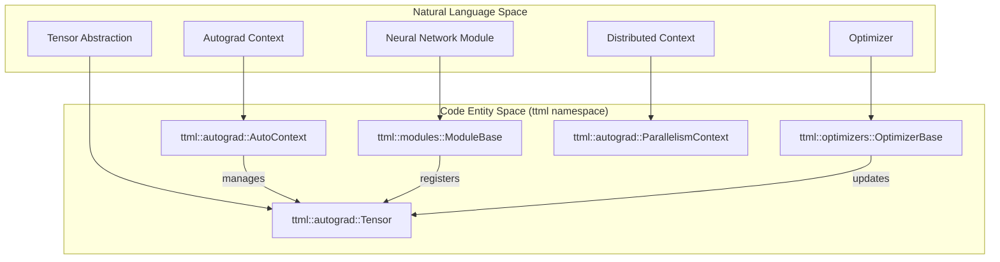
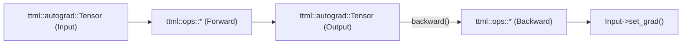
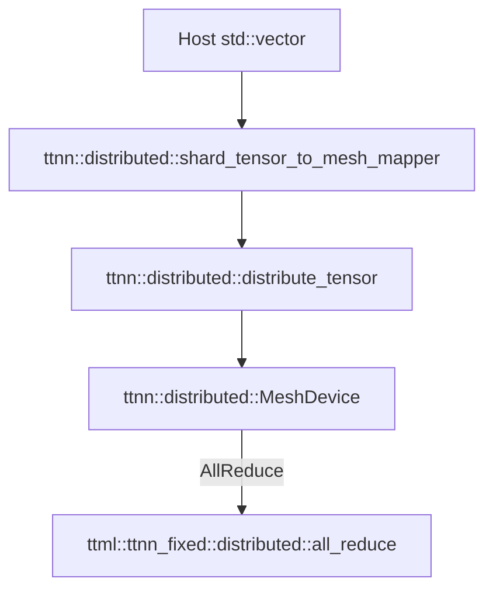
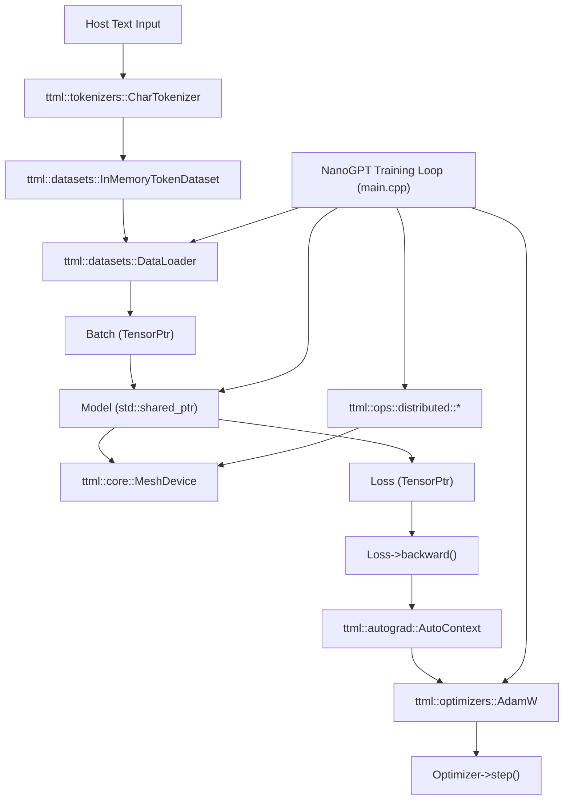

# TT-Train: C++ Training Framework

Relevant source files
*   [.github/actions/detect-slow-tests/action.yml](https://github.com/tenstorrent/tt-metal/blob/f30f8df0/.github/actions/detect-slow-tests/action.yml)
*   [.github/actions/detect-slow-tests/detect-slow-tests.py](https://github.com/tenstorrent/tt-metal/blob/f30f8df0/.github/actions/detect-slow-tests/detect-slow-tests.py)
*   [tests/tt_metal/tt_metal/api/test_tilize_untilize.cpp](https://github.com/tenstorrent/tt-metal/blob/f30f8df0/tests/tt_metal/tt_metal/api/test_tilize_untilize.cpp)
*   [tt-train/README.md](https://github.com/tenstorrent/tt-metal/blob/f30f8df0/tt-train/README.md?plain=1)
*   [tt-train/sources/examples/mnist_mlp/main.cpp](https://github.com/tenstorrent/tt-metal/blob/f30f8df0/tt-train/sources/examples/mnist_mlp/main.cpp)
*   [tt-train/sources/examples/nano_gpt/main.cpp](https://github.com/tenstorrent/tt-metal/blob/f30f8df0/tt-train/sources/examples/nano_gpt/main.cpp)
*   [tt-train/sources/ttml/CMakeLists.txt](https://github.com/tenstorrent/tt-metal/blob/f30f8df0/tt-train/sources/ttml/CMakeLists.txt)
*   [tt-train/sources/ttml/autograd/auto_context.cpp](https://github.com/tenstorrent/tt-metal/blob/f30f8df0/tt-train/sources/ttml/autograd/auto_context.cpp)
*   [tt-train/sources/ttml/autograd/auto_context.hpp](https://github.com/tenstorrent/tt-metal/blob/f30f8df0/tt-train/sources/ttml/autograd/auto_context.hpp)
*   [tt-train/sources/ttml/core/mesh_device.cpp](https://github.com/tenstorrent/tt-metal/blob/f30f8df0/tt-train/sources/ttml/core/mesh_device.cpp)
*   [tt-train/sources/ttml/core/mesh_device.hpp](https://github.com/tenstorrent/tt-metal/blob/f30f8df0/tt-train/sources/ttml/core/mesh_device.hpp)
*   [tt-train/sources/ttml/core/tt_tensor_utils.cpp](https://github.com/tenstorrent/tt-metal/blob/f30f8df0/tt-train/sources/ttml/core/tt_tensor_utils.cpp)
*   [tt-train/sources/ttml/core/tt_tensor_utils.hpp](https://github.com/tenstorrent/tt-metal/blob/f30f8df0/tt-train/sources/ttml/core/tt_tensor_utils.hpp)
*   [tt-train/sources/ttml/core/ttnn_all_includes.hpp](https://github.com/tenstorrent/tt-metal/blob/f30f8df0/tt-train/sources/ttml/core/ttnn_all_includes.hpp)
*   [tt-train/sources/ttml/metal/common/compute_utils.hpp](https://github.com/tenstorrent/tt-metal/blob/f30f8df0/tt-train/sources/ttml/metal/common/compute_utils.hpp)
*   [tt-train/sources/ttml/metal/common/dataflow_utils.hpp](https://github.com/tenstorrent/tt-metal/blob/f30f8df0/tt-train/sources/ttml/metal/common/dataflow_utils.hpp)
*   [tt-train/sources/ttml/metal/operations.hpp](https://github.com/tenstorrent/tt-metal/blob/f30f8df0/tt-train/sources/ttml/metal/operations.hpp)
*   [tt-train/sources/ttml/metal/ops/softmax_backward/device/kernels/compute/softmax_backward_kernel.cpp](https://github.com/tenstorrent/tt-metal/blob/f30f8df0/tt-train/sources/ttml/metal/ops/softmax_backward/device/kernels/compute/softmax_backward_kernel.cpp)
*   [tt-train/sources/ttml/metal/ops/softmax_backward/device/kernels/dataflow/reader_softmax_backward.cpp](https://github.com/tenstorrent/tt-metal/blob/f30f8df0/tt-train/sources/ttml/metal/ops/softmax_backward/device/kernels/dataflow/reader_softmax_backward.cpp)
*   [tt-train/sources/ttml/metal/ops/softmax_backward/device/kernels/dataflow/writer_softmax_backward.cpp](https://github.com/tenstorrent/tt-metal/blob/f30f8df0/tt-train/sources/ttml/metal/ops/softmax_backward/device/kernels/dataflow/writer_softmax_backward.cpp)
*   [tt-train/sources/ttml/metal/ops/softmax_backward/device/softmax_backward_device_operation.cpp](https://github.com/tenstorrent/tt-metal/blob/f30f8df0/tt-train/sources/ttml/metal/ops/softmax_backward/device/softmax_backward_device_operation.cpp)
*   [tt-train/sources/ttml/metal/ops/softmax_backward/device/softmax_backward_device_operation.hpp](https://github.com/tenstorrent/tt-metal/blob/f30f8df0/tt-train/sources/ttml/metal/ops/softmax_backward/device/softmax_backward_device_operation.hpp)
*   [tt-train/sources/ttml/metal/ops/softmax_backward/device/softmax_backward_device_operation_types.hpp](https://github.com/tenstorrent/tt-metal/blob/f30f8df0/tt-train/sources/ttml/metal/ops/softmax_backward/device/softmax_backward_device_operation_types.hpp)
*   [tt-train/sources/ttml/metal/ops/softmax_backward/device/softmax_backward_program_factory.cpp](https://github.com/tenstorrent/tt-metal/blob/f30f8df0/tt-train/sources/ttml/metal/ops/softmax_backward/device/softmax_backward_program_factory.cpp)
*   [tt-train/sources/ttml/modules/rotary_embedding.cpp](https://github.com/tenstorrent/tt-metal/blob/f30f8df0/tt-train/sources/ttml/modules/rotary_embedding.cpp)
*   [tt-train/sources/ttml/modules/rotary_embedding.hpp](https://github.com/tenstorrent/tt-metal/blob/f30f8df0/tt-train/sources/ttml/modules/rotary_embedding.hpp)
*   [tt-train/sources/ttml/serialization/serialization.cpp](https://github.com/tenstorrent/tt-metal/blob/f30f8df0/tt-train/sources/ttml/serialization/serialization.cpp)
*   [tt-train/sources/ttml/ttnn_fixed/trivial_ttnn_ops.cpp](https://github.com/tenstorrent/tt-metal/blob/f30f8df0/tt-train/sources/ttml/ttnn_fixed/trivial_ttnn_ops.cpp)
*   [tt-train/sources/ttml/ttnn_fixed/trivial_ttnn_ops.hpp](https://github.com/tenstorrent/tt-metal/blob/f30f8df0/tt-train/sources/ttml/ttnn_fixed/trivial_ttnn_ops.hpp)
*   [tt-train/tests/CMakeLists.txt](https://github.com/tenstorrent/tt-metal/blob/f30f8df0/tt-train/tests/CMakeLists.txt)
*   [tt-train/tests/autograd/autograd_tensor.cpp](https://github.com/tenstorrent/tt-metal/blob/f30f8df0/tt-train/tests/autograd/autograd_tensor.cpp)
*   [tt-train/tests/autograd/autograd_test.cpp](https://github.com/tenstorrent/tt-metal/blob/f30f8df0/tt-train/tests/autograd/autograd_test.cpp)
*   [tt-train/tests/autograd/module_base_parameters_test.cpp](https://github.com/tenstorrent/tt-metal/blob/f30f8df0/tt-train/tests/autograd/module_base_parameters_test.cpp)
*   [tt-train/tests/core/n300_utils_test.cpp](https://github.com/tenstorrent/tt-metal/blob/f30f8df0/tt-train/tests/core/n300_utils_test.cpp)
*   [tt-train/tests/core/tensor_utils_test.cpp](https://github.com/tenstorrent/tt-metal/blob/f30f8df0/tt-train/tests/core/tensor_utils_test.cpp)
*   [tt-train/tests/model/gpt2s_test.cpp](https://github.com/tenstorrent/tt-metal/blob/f30f8df0/tt-train/tests/model/gpt2s_test.cpp)
*   [tt-train/tests/model/linear_regression_ddp_test.cpp](https://github.com/tenstorrent/tt-metal/blob/f30f8df0/tt-train/tests/model/linear_regression_ddp_test.cpp)
*   [tt-train/tests/model/nano_gpt_test.cpp](https://github.com/tenstorrent/tt-metal/blob/f30f8df0/tt-train/tests/model/nano_gpt_test.cpp)
*   [tt-train/tests/modules/distributed/linear_test.cpp](https://github.com/tenstorrent/tt-metal/blob/f30f8df0/tt-train/tests/modules/distributed/linear_test.cpp)
*   [tt-train/tests/ops/cross_entropy_bw_op_test.cpp](https://github.com/tenstorrent/tt-metal/blob/f30f8df0/tt-train/tests/ops/cross_entropy_bw_op_test.cpp)
*   [tt-train/tests/ops/cross_entropy_fw_op_test.cpp](https://github.com/tenstorrent/tt-metal/blob/f30f8df0/tt-train/tests/ops/cross_entropy_fw_op_test.cpp)
*   [tt-train/tests/ops/distributed/comm_ops_test.cpp](https://github.com/tenstorrent/tt-metal/blob/f30f8df0/tt-train/tests/ops/distributed/comm_ops_test.cpp)
*   [tt-train/tests/ops/positional_embedding_test.cpp](https://github.com/tenstorrent/tt-metal/blob/f30f8df0/tt-train/tests/ops/positional_embedding_test.cpp)
*   [tt-train/tests/ops/profiler_no_op_test.cpp](https://github.com/tenstorrent/tt-metal/blob/f30f8df0/tt-train/tests/ops/profiler_no_op_test.cpp)
*   [tt-train/tests/ops/rmsnorm_op_test.cpp](https://github.com/tenstorrent/tt-metal/blob/f30f8df0/tt-train/tests/ops/rmsnorm_op_test.cpp)
*   [tt-train/tests/ops/softmax_backward_op_test.cpp](https://github.com/tenstorrent/tt-metal/blob/f30f8df0/tt-train/tests/ops/softmax_backward_op_test.cpp)
*   [tt-train/tests/ops/softmax_test.cpp](https://github.com/tenstorrent/tt-metal/blob/f30f8df0/tt-train/tests/ops/softmax_test.cpp)
*   [tt-train/tests/ops/unary_ops_test.cpp](https://github.com/tenstorrent/tt-metal/blob/f30f8df0/tt-train/tests/ops/unary_ops_test.cpp)
*   [tt-train/tests/optimizers/adamw_test.cpp](https://github.com/tenstorrent/tt-metal/blob/f30f8df0/tt-train/tests/optimizers/adamw_test.cpp)
*   [tt-train/tests/serialization/tensor_serializer_test.cpp](https://github.com/tenstorrent/tt-metal/blob/f30f8df0/tt-train/tests/serialization/tensor_serializer_test.cpp)
*   [tt-train/tests/ttnn_fixed/distributed/distributed_ttnn_ops_test.cpp](https://github.com/tenstorrent/tt-metal/blob/f30f8df0/tt-train/tests/ttnn_fixed/distributed/distributed_ttnn_ops_test.cpp)
*   [tt-train/tests/ttnn_fixed/dropout_op_test.cpp](https://github.com/tenstorrent/tt-metal/blob/f30f8df0/tt-train/tests/ttnn_fixed/dropout_op_test.cpp)
*   [tt-train/tests/ttnn_fixed/reduce_ops_test.cpp](https://github.com/tenstorrent/tt-metal/blob/f30f8df0/tt-train/tests/ttnn_fixed/reduce_ops_test.cpp)
*   [tt-train/tests/ttnn_fixed/trivial_ttnn_ops_test.cpp](https://github.com/tenstorrent/tt-metal/blob/f30f8df0/tt-train/tests/ttnn_fixed/trivial_ttnn_ops_test.cpp)
*   [tt_metal/api/tt-metalium/bfloat16.hpp](https://github.com/tenstorrent/tt-metal/blob/f30f8df0/tt_metal/api/tt-metalium/bfloat16.hpp)
*   [tt_metal/impl/data_format/bfloat16.cpp](https://github.com/tenstorrent/tt-metal/blob/f30f8df0/tt_metal/impl/data_format/bfloat16.cpp)

The **TT-Train** framework is a high-performance C++ library built atop the Tenstorrent stack (TT-Metalium and TTNN) to support neural network training on Tenstorrent hardware. It features a native C++ autograd engine, a variety of distributed training paradigms (Data Parallelism, Tensor Parallelism, Pipeline Parallelism), and highly optimized model implementations such as NanoGPT and Llama.

* * *

## Framework Architecture

TT-Train serves as an abstraction layer bridging high-level model definition and low-level TTNN/TT-Metalium APIs. It exposes a "Torch-like" C++ interface for users while managing memory, compute kernels, and distributed execution explicitly.

### Framework Component Mapping

This diagram maps key conceptual components in TT-Train's training framework to their main C++ class or namespace representations in the `ttml` namespace:

Sources: [tt-train/sources/ttml/CMakeLists.txt 4-104](https://github.com/tenstorrent/tt-metal/blob/f30f8df0/tt-train/sources/ttml/CMakeLists.txt#L4-L104)[tt-train/sources/ttml/autograd/auto_context.cpp 4-7](https://github.com/tenstorrent/tt-metal/blob/f30f8df0/tt-train/sources/ttml/autograd/auto_context.cpp#L4-L7)[tt-train/sources/ttml/modules/module_base.cpp 43-45](https://github.com/tenstorrent/tt-metal/blob/f30f8df0/tt-train/sources/ttml/modules/module_base.cpp#L43-L45)[tt-train/sources/ttml/optimizers/optimizer_base.cpp 85-87](https://github.com/tenstorrent/tt-metal/blob/f30f8df0/tt-train/sources/ttml/optimizers/optimizer_base.cpp#L85-L87)

* * *




Sources: [tt-train/sources/ttml/CMakeLists.txt:4-104](), [tt-train/sources/ttml/autograd/auto_context.cpp:4-7](), [tt-train/sources/ttml/modules/module_base.cpp:43-45](), [tt-train/sources/ttml/optimizers/optimizer_base.cpp:85-87]().

---
```
## Autograd System

TT-Train's autograd subsystem is central to enabling dynamic neural network training by automatic differentiation.

*   **Tensor Class**: The core data structure is `ttml::autograd::Tensor` that wraps around `ttnn::Tensor`. It holds data, gradients, a reference to its creator function (for backward graph traversal), and flags to track gradient requirements [tt-train/sources/ttml/autograd/tensor.cpp 7-9](https://github.com/tenstorrent/tt-metal/blob/f30f8df0/tt-train/sources/ttml/autograd/tensor.cpp#L7-L9)

*   **Context Management**: Managed by a singleton called `AutoContext`, responsible for device initialization (`open_device`), resource clean-up (`close_device`), and maintaining global random seeds for reproducibility [tt-train/sources/ttml/autograd/auto_context.cpp 4-7](https://github.com/tenstorrent/tt-metal/blob/f30f8df0/tt-train/sources/ttml/autograd/auto_context.cpp#L4-L7)[tt-train/sources/examples/nano_gpt/main.cpp 134-135](https://github.com/tenstorrent/tt-metal/blob/f30f8df0/tt-train/sources/examples/nano_gpt/main.cpp#L134-L135)

*   **Backward Propagation**: Calling `backward()` on a loss tensor initiates graph traversal to execute backward kernel computations, propagating gradients appropriately [tt-train/tests/ops/rmsnorm_op_test.cpp 58-91](https://github.com/tenstorrent/tt-metal/blob/f30f8df0/tt-train/tests/ops/rmsnorm_op_test.cpp#L58-L91)

*   **Gradient Clipping**: Integrates global clipping of gradients based on norm using `ttml::core::clip_grad_norm`, helping stabilize training [tt-train/sources/ttml/core/clip_grad_norm.cpp 8-10](https://github.com/tenstorrent/tt-metal/blob/f30f8df0/tt-train/sources/ttml/core/clip_grad_norm.cpp#L8-L10)

*   **Loss Implementations**: Common losses such as Cross-Entropy and Mean Squared Error are implemented with efficient forward and backward operations [tt-train/sources/ttml/ops/losses.cpp 61-63](https://github.com/tenstorrent/tt-metal/blob/f30f8df0/tt-train/sources/ttml/ops/losses.cpp#L61-L63)[tt-train/tests/ops/cross_entropy_bw_op_test.cpp 78-86](https://github.com/tenstorrent/tt-metal/blob/f30f8df0/tt-train/tests/ops/cross_entropy_bw_op_test.cpp#L78-L86)

### Autograd Data Flow Diagram

Sources: [tt-train/sources/ttml/autograd/tensor.cpp 7-9](https://github.com/tenstorrent/tt-metal/blob/f30f8df0/tt-train/sources/ttml/autograd/tensor.cpp#L7-L9)[tt-train/tests/ops/rmsnorm_op_test.cpp 58-91](https://github.com/tenstorrent/tt-metal/blob/f30f8df0/tt-train/tests/ops/rmsnorm_op_test.cpp#L58-L91)

* * *




Sources: [tt-train/sources/ttml/autograd/tensor.cpp:7-9](), [tt-train/tests/ops/rmsnorm_op_test.cpp:58-91]().

---
```
## Model Implementations

TT-Train features several optimized transformer model implementations crafted for Tenstorrent hardware.

### NanoGPT / GPT-2

*   Implements GPT-2-like architectures using compositional modules in `ttml::modules`.

*   The primary building block is the **GPT Block**, combining multi-head attention and multi-layer perceptron (MLP) layers [tt-train/sources/ttml/modules/gpt_block.cpp 38-40](https://github.com/tenstorrent/tt-metal/blob/f30f8df0/tt-train/sources/ttml/modules/gpt_block.cpp#L38-L40)

*   The NanoGPT example training loop is demonstrated in a dedicated main program which covers data loading, batching, gradient accumulation, loss computation, optimizer stepping, and model checkpointing [tt-train/sources/examples/nano_gpt/main.cpp 150-184](https://github.com/tenstorrent/tt-metal/blob/f30f8df0/tt-train/sources/examples/nano_gpt/main.cpp#L150-L184)

### Llama

*   Includes specialized modules extending transformer blocks: 
    *   **RMSNorm** layers with custom Metal kernels for efficient forward and backward passes [tt-train/sources/ttml/metal/ops/rmsnorm_fw/rmsnorm_fw.cpp 114-116](https://github.com/tenstorrent/tt-metal/blob/f30f8df0/tt-train/sources/ttml/metal/ops/rmsnorm_fw/rmsnorm_fw.cpp#L114-L116)[tt-train/sources/ttml/metal/ops/rmsnorm_bw/rmsnorm_bw.cpp 118-120](https://github.com/tenstorrent/tt-metal/blob/f30f8df0/tt-train/sources/ttml/metal/ops/rmsnorm_bw/rmsnorm_bw.cpp#L118-L120)

    *   **Rotary Positional Embeddings (RoPE)** implemented for tile-based computation [tt-train/sources/ttml/ops/rope_op.cpp 70-72](https://github.com/tenstorrent/tt-metal/blob/f30f8df0/tt-train/sources/ttml/ops/rope_op.cpp#L70-L72)

    *   **Grouped Query Attention (GQA)** for optimization within Llama attention modules [tt-train/sources/ttml/modules/grouped_query_attention.cpp 39-41](https://github.com/tenstorrent/tt-metal/blob/f30f8df0/tt-train/sources/ttml/modules/grouped_query_attention.cpp#L39-L41)

Sources: [tt-train/sources/ttml/CMakeLists.txt 23-48](https://github.com/tenstorrent/tt-metal/blob/f30f8df0/tt-train/sources/ttml/CMakeLists.txt#L23-L48)[tt-train/sources/examples/nano_gpt/main.cpp 99-136](https://github.com/tenstorrent/tt-metal/blob/f30f8df0/tt-train/sources/examples/nano_gpt/main.cpp#L99-L136)

* * *

## Distributed Training Support

TT-Train adapts to multi-device and multi-node training leveraging Tenstorrent Fabric and strong integration with TTNN's distributed tensor abstractions.

### Parallelism Strategies

| Strategy | Implementation | Description |
| --- | --- | --- |
| **Data Parallel (DDP)** | `ttml::ops::distributed::all_reduce` | Replicates whole model; gradient averaging via All-Reduce ops [tt-train/tests/ops/distributed/comm_ops_test.cpp 60](https://github.com/tenstorrent/tt-metal/blob/f30f8df0/tt-train/tests/ops/distributed/comm_ops_test.cpp#L60-L60) |
| **Tensor Parallel (TP)** | `ttml::modules::distributed::RowParallelLinear` | Shards individual layers (weights) across device mesh [tt-train/tests/modules/distributed/linear_test.cpp 67-68](https://github.com/tenstorrent/tt-metal/blob/f30f8df0/tt-train/tests/modules/distributed/linear_test.cpp#L67-L68) |
| **Pipeline Parallel** | `ttml::models::distributed::PipelineParallelLlama` | Splits model layers sequentially across devices [tt-train/sources/ttml/models/distributed/pipeline_parallel_llama.cpp 26-28](https://github.com/tenstorrent/tt-metal/blob/f30f8df0/tt-train/sources/ttml/models/distributed/pipeline_parallel_llama.cpp#L26-L28) |

### Mesh Shape Validation

TT-Train validates the mesh shape configuration used by the training program against the physical device mesh discovered by the control plane (`tt::tt_fabric`) to prevent tensor/data misalignment errors.

`// Conceptual check in NanoGPT example:auto physical_mesh_shapes = tt::tt_fabric::get_physical_mesh_shapes();if (physical_mesh_shapes.size() == 1) {    if (config_mesh_shape != physical_mesh_shape) {        throw runtime_error("Mesh shape mismatch...");    }}`
### Distributed Tensor Data Flow

Sources: [tt-train/tests/core/n300_utils_test.cpp 95-96](https://github.com/tenstorrent/tt-metal/blob/f30f8df0/tt-train/tests/core/n300_utils_test.cpp#L95-L96)[tt-train/tests/core/n300_utils_test.cpp 141](https://github.com/tenstorrent/tt-metal/blob/f30f8df0/tt-train/tests/core/n300_utils_test.cpp#L141-L141)[tt-train/sources/examples/nano_gpt/main.cpp 41-95](https://github.com/tenstorrent/tt-metal/blob/f30f8df0/tt-train/sources/examples/nano_gpt/main.cpp#L41-L95)

* * *




Sources: [tt-train/tests/core/n300_utils_test.cpp:95-96](), [tt-train/tests/core/n300_utils_test.cpp:141](), [tt-train/sources/examples/nano_gpt/main.cpp:41-95]().

---
```
## Integration with TTNN

TT-Train builds heavily upon the TTNN tensor and operation libraries for its tensor implementations and high-performance kernels.

*   **Tensor Conversion**: Utilities under `ttml::core` seamlessly convert between native CPU containers (xtensor/std::vector) and `ttnn::Tensor` objects, supporting distributed/sharded tensors as well [tt-train/tests/core/n300_utils_test.cpp 55-56](https://github.com/tenstorrent/tt-metal/blob/f30f8df0/tt-train/tests/core/n300_utils_test.cpp#L55-L56)

*   **Fixed TTNN Ops**: The `ttml::ttnn_fixed` namespace contains wrappers and patched TTNN operations specialized for training workloads, including `dropout`, `matmuls`, and various reduction ops [tt-train/sources/ttml/CMakeLists.txt 104-107](https://github.com/tenstorrent/tt-metal/blob/f30f8df0/tt-train/sources/ttml/CMakeLists.txt#L104-L107)

*   **Optimizers**: Includes implementations for popular optimization algorithms like AdamW, SGD, and Muon with composite and full precision variants [tt-train/sources/ttml/CMakeLists.txt 79-92](https://github.com/tenstorrent/tt-metal/blob/f30f8df0/tt-train/sources/ttml/CMakeLists.txt#L79-L92)

### Key Utility Functions

| Function Name | File (Location) | Description |
| --- | --- | --- |
| `from_vector` | `ttml/core/tt_tensor_utils.cpp` | Creates `ttnn::Tensor` from host vector, supports sharding [tt-train/sources/ttml/core/tt_tensor_utils.cpp 102-146](https://github.com/tenstorrent/tt-metal/blob/f30f8df0/tt-train/sources/ttml/core/tt_tensor_utils.cpp#L102-L146) |
| `open_device` | `ttml/autograd/auto_context.cpp` | Initializes device and mesh context for training [tt-train/sources/ttml/autograd/auto_context.cpp 4-7](https://github.com/tenstorrent/tt-metal/blob/f30f8df0/tt-train/sources/ttml/autograd/auto_context.cpp#L4-L7) |
| `all_reduce` | `ttml/ops/distributed/comm_ops.cpp` | Performs all-reduce on distributed tensors including scaling and backward support [tt-train/tests/ops/distributed/comm_ops_test.cpp 60](https://github.com/tenstorrent/tt-metal/blob/f30f8df0/tt-train/tests/ops/distributed/comm_ops_test.cpp#L60-L60) |
| `zeros_like` | `ttml/core/tt_tensor_utils.cpp` | Creates zero tensor matching shape/data type/layout [tt-train/sources/ttml/core/tt_tensor_utils.cpp 76-78](https://github.com/tenstorrent/tt-metal/blob/f30f8df0/tt-train/sources/ttml/core/tt_tensor_utils.cpp#L76-L78) |

Sources: [tt-train/sources/ttml/core/tt_tensor_utils.cpp 102-146](https://github.com/tenstorrent/tt-metal/blob/f30f8df0/tt-train/sources/ttml/core/tt_tensor_utils.cpp#L102-L146)[tt-train/sources/ttml/optimizers/adamw.cpp 81-83](https://github.com/tenstorrent/tt-metal/blob/f30f8df0/tt-train/sources/ttml/optimizers/adamw.cpp#L81-L83)[tt-train/sources/ttml/autograd/auto_context.cpp 4-7](https://github.com/tenstorrent/tt-metal/blob/f30f8df0/tt-train/sources/ttml/autograd/auto_context.cpp#L4-L7)[tt-train/sources/ttml/core/tt_tensor_utils.cpp 76-78](https://github.com/tenstorrent/tt-metal/blob/f30f8df0/tt-train/sources/ttml/core/tt_tensor_utils.cpp#L76-L78)

* * *

# Summary Diagram: Mapping Natural Language Concepts to Core Code Entities

Sources: All above.

* * *


```mermaid
graph TD
    Nat_AutoContext["Autograd Context"]
    Nat_Module["Neural Network Module"]
    Nat_Optimizer["Optimizer"]
    Nat_Distributed["Distributed Context"]
    Nat_Tensor["Tensor Abstraction"]

    Code_AutoContext["ttml::autograd::AutoContext"]
    Code_ModuleBase["ttml::modules::ModuleBase"]
    Code_OptimizerBase["ttml::optimizers::OptimizerBase"]
    Code_ParallelismCtx["ttml::autograd::ParallelismContext"]
    Code_Tensor["ttml::autograd::Tensor"]

    Nat_AutoContext --> Code_AutoContext
    Nat_Module --> Code_ModuleBase
    Nat_Optimizer --> Code_OptimizerBase
    Nat_Distributed --> Code_ParallelismCtx
    Nat_Tensor --> Code_Tensor

    Code_AutoContext ---|manages|--- Code_Tensor
    Code_ModuleBase ---|registers params|--- Code_Tensor
    Code_OptimizerBase ---|updates params|--- Code_Tensor
    Code_ParallelismCtx ---|configures distributed state|--- Code_Tensor
```

Sources: All above.

---
```
# Summary Diagram: NanoGPT Example Training Flow to Code Entities




Sources: [tt-train/sources/examples/nano_gpt/main.cpp:100-180](), [tt-train/sources/ttml/autograd/auto_context.cpp:4-20]().

---

This page documents TT-Train’s architecture, autograd system, model support, distributed training, and integration with TTNN, providing a foundation for developing and training neural networks efficiently on Tenstorrent hardware.
57:T4d4b,
```

Sources: [tt-train/sources/examples/nano_gpt/main.cpp 100-180](https://github.com/tenstorrent/tt-metal/blob/f30f8df0/tt-train/sources/examples/nano_gpt/main.cpp#L100-L180)[tt-train/sources/ttml/autograd/auto_context.cpp 4-20](https://github.com/tenstorrent/tt-metal/blob/f30f8df0/tt-train/sources/ttml/autograd/auto_context.cpp#L4-L20)

* * *

This page documents TT-Train’s architecture, autograd system, model support, distributed training, and integration with TTNN, providing a foundation for developing and training neural networks efficiently on Tenstorrent hardware.

Dismiss
Refresh this wiki

Enter email to refresh
