# Development Guide

Relevant source files
*   [.clang-tidy](https://github.com/tenstorrent/tt-metal/blob/f30f8df0/.clang-tidy)
*   [.github/pull_request_template.md](https://github.com/tenstorrent/tt-metal/blob/f30f8df0/.github/pull_request_template.md?plain=1)
*   [.github/workflows/pr-description-inject-branch-name.yaml](https://github.com/tenstorrent/tt-metal/blob/f30f8df0/.github/workflows/pr-description-inject-branch-name.yaml)
*   [CONTRIBUTING.md](https://github.com/tenstorrent/tt-metal/blob/f30f8df0/CONTRIBUTING.md?plain=1)
*   [README.md](https://github.com/tenstorrent/tt-metal/blob/f30f8df0/README.md?plain=1)
*   [models/README.md](https://github.com/tenstorrent/tt-metal/blob/f30f8df0/models/README.md?plain=1)
*   [models/demos/deepseek_v3/README.md](https://github.com/tenstorrent/tt-metal/blob/f30f8df0/models/demos/deepseek_v3/README.md?plain=1)
*   [models/demos/llama3_70b_galaxy/PERF.md](https://github.com/tenstorrent/tt-metal/blob/f30f8df0/models/demos/llama3_70b_galaxy/PERF.md?plain=1)
*   [models/demos/llama3_70b_galaxy/README.md](https://github.com/tenstorrent/tt-metal/blob/f30f8df0/models/demos/llama3_70b_galaxy/README.md?plain=1)
*   [models/demos/multimodal/gemma3/README.md](https://github.com/tenstorrent/tt-metal/blob/f30f8df0/models/demos/multimodal/gemma3/README.md?plain=1)
*   [models/demos/t3000/llama3_70b/README.md](https://github.com/tenstorrent/tt-metal/blob/f30f8df0/models/demos/t3000/llama3_70b/README.md?plain=1)
*   [models/demos/t3000/llama3_70b/setup_llama.sh](https://github.com/tenstorrent/tt-metal/blob/f30f8df0/models/demos/t3000/llama3_70b/setup_llama.sh)
*   [models/demos/wormhole/qwen3_embedding_8b/demo/generator_vllm.py](https://github.com/tenstorrent/tt-metal/blob/f30f8df0/models/demos/wormhole/qwen3_embedding_8b/demo/generator_vllm.py)
*   [models/docs/MODEL_HYBRID_TP_DP.md](https://github.com/tenstorrent/tt-metal/blob/f30f8df0/models/docs/MODEL_HYBRID_TP_DP.md?plain=1)
*   [models/docs/MODEL_UPDATES.md](https://github.com/tenstorrent/tt-metal/blob/f30f8df0/models/docs/MODEL_UPDATES.md?plain=1)
*   [models/docs/model_bring_up.md](https://github.com/tenstorrent/tt-metal/blob/f30f8df0/models/docs/model_bring_up.md?plain=1)
*   [releases/README.md](https://github.com/tenstorrent/tt-metal/blob/f30f8df0/releases/README.md?plain=1)
*   [scripts/tracing/.gitattributes](https://github.com/tenstorrent/tt-metal/blob/f30f8df0/scripts/tracing/.gitattributes)
*   [scripts/tracing/.gitignore](https://github.com/tenstorrent/tt-metal/blob/f30f8df0/scripts/tracing/.gitignore)
*   [scripts/tracing/README.md](https://github.com/tenstorrent/tt-metal/blob/f30f8df0/scripts/tracing/README.md?plain=1)
*   [scripts/tracing/context.txt](https://github.com/tenstorrent/tt-metal/blob/f30f8df0/scripts/tracing/context.txt)
*   [scripts/tracing/questions.txt](https://github.com/tenstorrent/tt-metal/blob/f30f8df0/scripts/tracing/questions.txt)
*   [scripts/tracing/run.py](https://github.com/tenstorrent/tt-metal/blob/f30f8df0/scripts/tracing/run.py)
*   [scripts/tracing/system-prompt.txt](https://github.com/tenstorrent/tt-metal/blob/f30f8df0/scripts/tracing/system-prompt.txt)
*   [tech_reports/Debugging/Kernel_Debugging_Tips.md](https://github.com/tenstorrent/tt-metal/blob/f30f8df0/tech_reports/Debugging/Kernel_Debugging_Tips.md?plain=1)
*   [tech_reports/LLMs/vLLM_integration.md](https://github.com/tenstorrent/tt-metal/blob/f30f8df0/tech_reports/LLMs/vLLM_integration.md?plain=1)
*   [tests/.clang-tidy](https://github.com/tenstorrent/tt-metal/blob/f30f8df0/tests/.clang-tidy)
*   [tests/tt_metal/tt_metal/api/test_shape.cpp](https://github.com/tenstorrent/tt-metal/blob/f30f8df0/tests/tt_metal/tt_metal/api/test_shape.cpp)
*   [tests/ttnn/unit_tests/gtests/ccl/test_sharded_address_generators.cpp](https://github.com/tenstorrent/tt-metal/blob/f30f8df0/tests/ttnn/unit_tests/gtests/ccl/test_sharded_address_generators.cpp)
*   [tt_metal/api/tt-metalium/shape.hpp](https://github.com/tenstorrent/tt-metal/blob/f30f8df0/tt_metal/api/tt-metalium/shape.hpp)
*   [tt_metal/api/tt-metalium/shape_base.hpp](https://github.com/tenstorrent/tt-metal/blob/f30f8df0/tt_metal/api/tt-metalium/shape_base.hpp)
*   [tt_metal/common/multi_producer_single_consumer_queue.hpp](https://github.com/tenstorrent/tt-metal/blob/f30f8df0/tt_metal/common/multi_producer_single_consumer_queue.hpp)
*   [tt_metal/common/shape.cpp](https://github.com/tenstorrent/tt-metal/blob/f30f8df0/tt_metal/common/shape.cpp)
*   [tt_metal/common/shape_base.cpp](https://github.com/tenstorrent/tt-metal/blob/f30f8df0/tt_metal/common/shape_base.cpp)
*   [tt_metal/fabric/fabric_vc2_connection.cpp](https://github.com/tenstorrent/tt-metal/blob/f30f8df0/tt_metal/fabric/fabric_vc2_connection.cpp)
*   [tt_metal/impl/buffers/semaphore.cpp](https://github.com/tenstorrent/tt-metal/blob/f30f8df0/tt_metal/impl/buffers/semaphore.cpp)
*   [tt_metal/impl/buffers/semaphore.hpp](https://github.com/tenstorrent/tt-metal/blob/f30f8df0/tt_metal/impl/buffers/semaphore.hpp)
*   [tt_metal/llrt/sanitize_noc_host.hpp](https://github.com/tenstorrent/tt-metal/blob/f30f8df0/tt_metal/llrt/sanitize_noc_host.hpp)
*   [tt_metal/llrt/tt_elffile.cpp](https://github.com/tenstorrent/tt-metal/blob/f30f8df0/tt_metal/llrt/tt_elffile.cpp)
*   [tt_metal/llrt/tt_elffile.hpp](https://github.com/tenstorrent/tt-metal/blob/f30f8df0/tt_metal/llrt/tt_elffile.hpp)
*   [tt_metal/llrt/tt_memory.cpp](https://github.com/tenstorrent/tt-metal/blob/f30f8df0/tt_metal/llrt/tt_memory.cpp)
*   [tt_metal/llrt/tt_memory.h](https://github.com/tenstorrent/tt-metal/blob/f30f8df0/tt_metal/llrt/tt_memory.h)
*   [tt_stl/.clang-tidy](https://github.com/tenstorrent/tt-metal/blob/f30f8df0/tt_stl/.clang-tidy)
*   [tt_stl/CMakeLists.txt](https://github.com/tenstorrent/tt-metal/blob/f30f8df0/tt_stl/CMakeLists.txt)
*   [tt_stl/tests/CMakeLists.txt](https://github.com/tenstorrent/tt-metal/blob/f30f8df0/tt_stl/tests/CMakeLists.txt)
*   [tt_stl/tests/test_reflection.cpp](https://github.com/tenstorrent/tt-metal/blob/f30f8df0/tt_stl/tests/test_reflection.cpp)
*   [tt_stl/tests/test_tt_pause.cpp](https://github.com/tenstorrent/tt-metal/blob/f30f8df0/tt_stl/tests/test_tt_pause.cpp)
*   [tt_stl/tt_stl/indestructible.hpp](https://github.com/tenstorrent/tt-metal/blob/f30f8df0/tt_stl/tt_stl/indestructible.hpp)
*   [tt_stl/tt_stl/llvm/llvm_small_vector.cpp](https://github.com/tenstorrent/tt-metal/blob/f30f8df0/tt_stl/tt_stl/llvm/llvm_small_vector.cpp)
*   [tt_stl/tt_stl/llvm/llvm_small_vector.hpp](https://github.com/tenstorrent/tt-metal/blob/f30f8df0/tt_stl/tt_stl/llvm/llvm_small_vector.hpp)
*   [tt_stl/tt_stl/llvm/memory_alloc.hpp](https://github.com/tenstorrent/tt-metal/blob/f30f8df0/tt_stl/tt_stl/llvm/memory_alloc.hpp)
*   [tt_stl/tt_stl/reflection.hpp](https://github.com/tenstorrent/tt-metal/blob/f30f8df0/tt_stl/tt_stl/reflection.hpp)
*   [tt_stl/tt_stl/tt_pause.hpp](https://github.com/tenstorrent/tt-metal/blob/f30f8df0/tt_stl/tt_stl/tt_pause.hpp)
*   [tt_stl/tt_stl/unique_any.hpp](https://github.com/tenstorrent/tt-metal/blob/f30f8df0/tt_stl/tt_stl/unique_any.hpp)
*   [ttnn/api/ttnn/operation.hpp](https://github.com/tenstorrent/tt-metal/blob/f30f8df0/ttnn/api/ttnn/operation.hpp)
*   [ttnn/cpp/ttnn/operations/experimental/ccl/llama_reduce_scatter_matmul/device/rs_matmul_op.cpp](https://github.com/tenstorrent/tt-metal/blob/f30f8df0/ttnn/cpp/ttnn/operations/experimental/ccl/llama_reduce_scatter_matmul/device/rs_matmul_op.cpp)

This guide provides practical information for developers contributing to or working with the `tt-metal` repository. It covers environment setup, building from source, testing, development workflows, and contribution processes.

For detailed information on specific topics:

*   **[Getting Started for Developers](https://deepwiki.com/tenstorrent/tt-metal/9.1-getting-started-for-developers)** — Walk through setting up the development environment, building from source, and running first tests.
*   **[Writing Custom Kernels](https://deepwiki.com/tenstorrent/tt-metal/9.2-writing-custom-kernels)** — Guide developers through creating custom compute kernels, reader/writer kernels, and kernel compilation.
*   **[Developing TTNN Operations](https://deepwiki.com/tenstorrent/tt-metal/9.3-developing-ttnn-operations)** — Explain how to add new TTNN operations including C++ implementation, Python bindings, and testing.
*   **[Multi-Device Programming](https://deepwiki.com/tenstorrent/tt-metal/9.4-multi-device-programming)** — Guide developers on writing multi-device programs, using Collective Communication Library (CCL) operations, and managing mesh devices.
*   **[Contributing Guidelines](https://deepwiki.com/tenstorrent/tt-metal/9.5-contributing-guidelines)** — Explain the contribution process, coding standards, PR requirements, and `CODEOWNERS` workflow. Covers `tt_stl` utilities (reflection, span, strong_type) and C++ best practices documented in `CONTRIBUTING.md`.
*   **[Scale-Out Tools and Cluster Management](https://deepwiki.com/tenstorrent/tt-metal/9.6-scale-out-tools-and-cluster-management)** — Document tools for managing large multi-host Tenstorrent clusters, including cabling generators and validation utilities.
*   **[Model Tracer and Operation Extraction](https://deepwiki.com/tenstorrent/tt-metal/9.7-model-tracer-and-operation-extraction)** — Document the `model_tracer` tool for automatically extracting real-world operation configurations from model tests and integrating them into sweep tests.

* * *

## Development Environment Setup

The `tt-metal` repository supports development through multiple installation methods. For contributors, building from source is recommended to enable rapid iteration and testing.

### Prerequisites

Before starting development, ensure you have the required software dependencies installed:

1.   **System packages**: Use the `install_dependencies.sh` script which supports Debian and RedHat based systems.
2.   **Hardware setup**: Configure your Tenstorrent device (supported hardware includes Wormhole N150/N300, Blackhole P100/P150, T3000, Galaxy).
3.   **Driver and firmware installation**: Install `tt-kmd`, `tt-flash`, and `tt-smi` utilities.

### Building from Source

Clone the repository with submodules and build using the provided `build_metal.sh` script:

`# Clone repositorygit clone https://github.com/tenstorrent/tt-metal.git --recurse-submodulescd tt-metal # Build using the provided script (recommended)./build_metal.sh`
### Python Environment

The repository uses a Python environment for TTNN development and testing. Developers should set the `PYTHONPATH` environment variable pointing to the root of the repository for proper module resolution.

To enable detailed logging during development, set the environment variable:

`export TT_LOGGER_LEVEL=Debug`
Then run your build or tests.

* * *

## Development Workflow Overview

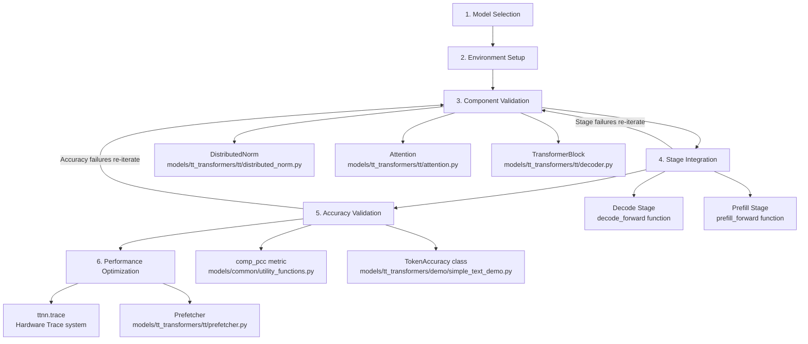

This flow enforces thorough validation before advancing stages, ensuring correctness, memory layout compatibility, arithmetic fidelity, and runtime performance [models/docs/model_bring_up.md:1-50](), [tech_reports/LLMs/vLLM_integration.md:27-34]().

Sources:  
[README.md:24-65](), [models/docs/model_bring_up.md:1-50](), [tech_reports/LLMs/vLLM_integration.md:27-34]()

---
```


This section bridges the conceptual developer tasks to specific code entities and directories within the repository.

### Developer Tasks and Corresponding Code Areas

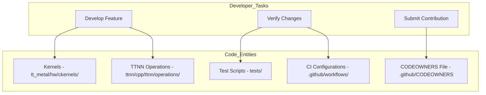

This diagram shows how developer tasks map to specific codebase components, making it easier for new developers to locate relevant files.

---
```


This diagram shows how developer tasks map to specific codebase components, making it easier for new developers to locate relevant files.

* * *

## Building and Testing

### Running Tests

The repository contains multiple test categories, from unit tests to full model regressions.

**Core Unit Tests:**

`# C++ Unit Tests./build/test/tt_metal/unit_tests_dispatch # TTNN Unit Tests./build/test/ttnn/unit_tests_ttnn`
**Model Regression Tests:**

Model tests are categorized by hardware and complexity. Developers typically use `pytest` to run model validation and performance tests. For example:

`# Run ResNet50 demo on Wormhole platformpytest models/demos/vision/classification/resnet50/wormhole/demo/demo.py`

* * *

## Code Development Areas

### Repository Layering and Relations

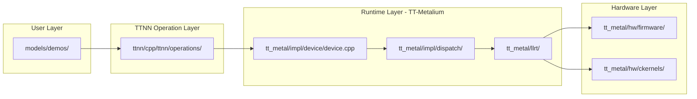

This shows the relationship between high-level model demos, neural network operation implementations, low-level device runtime, and hardware-specific kernels and firmware.
```


This shows the relationship between high-level model demos, neural network operation implementations, low-level device runtime, and hardware-specific kernels and firmware.

### Key Components Overview

| Component | Description | Key Location |
| --- | --- | --- |
| TT-Metalium | Low-level runtime and programming model managing hardware abstraction and program execution. | `tt_metal/` |
| TTNN | High-level neural network operation library with Python bindings and C++ backend. | `ttnn/` |
| Kernel Code | Custom compute kernels running on the hardware matrix engine cores. | `tt_metal/hw/ckernels/` |
| Model Demos | Implementations and demos of optimized models for Tenstorrent hardware. | `models/demos/` |
| Utilities | Core utilities such as reflection, span types, and strong typing aiding C++ development. | `tt_stl/`, `tt_metal/impl/` |

* * *

## Contribution Process

### PR Requirements and Workflow

*   **Issue Tracking**: All contributions need a corresponding GitHub issue filed under appropriate projects.
*   **Pull Requests**: PRs must be categorized (Feature, Performance, Bug fix, Cleanup, Test Only) using the PR template.
*   **Code Reviews**: Maintainers assigned via `CODEOWNERS` review and approve PRs.
*   **CI Gates**: PRs must pass static analysis, linting, and various levels of testing before merging.

### Code Quality Enforcement

Checks include clang-tidy static analysis, formatting, and pre-commit hooks to enforce standards. The workflow ensures high code quality and consistent documentation.

* * *

## Common Development Tasks

### Debug and Logging

*   Enable detailed host and kernel-side logging via the `TT_LOGGER_LEVEL` environment variable.
*   Use the "watcher" system for debugging kernel execution and device state.
*   For kernel development, register new kernels with the watcher server during their initialization.

### Documentation

Build local HTML documentation for offline viewing and review using:

`cd docsmake cleanmake htmlmake server  # starts a local HTTP server to browse docs`
### CI/CD and Workflow Monitoring

*   Developers can monitor CI pipelines, triage failures with owner assignments, and track long-term test health using aggregated workflow data and internal dashboards.

* * *

# Child Pages For Detailed Topics

For in-depth guidance on individual topics and workflows, refer to the following child pages:

| Section | Title | Description |
| --- | --- | --- |
| 9.1 | Getting Started for Developers | Environment setup, build instructions, running initial tests. |
| 9.2 | Writing Custom Kernels | Creating compute, reader/writer kernels; kernel compilation details. |
| 9.3 | Developing TTNN Operations | Adding new TTNN ops, C++ implementation, Python bindings, testing. |
| 9.4 | Multi-Device Programming | Writing multi-device programs, using CCL, managing mesh devices. |
| 9.5 | Contributing Guidelines | Contribution process, coding standards, PR requirements, and workflow. |
| 9.6 | Scale-Out Tools and Cluster Management | Scale-out cabling generation, cluster validation, deployment tools. |
| 9.7 | Model Tracer and Operation Extraction | Using `model_tracer` for extracting and integrating operations. |

* * *

# Summary Diagram: Natural Language Concepts to Code Entities

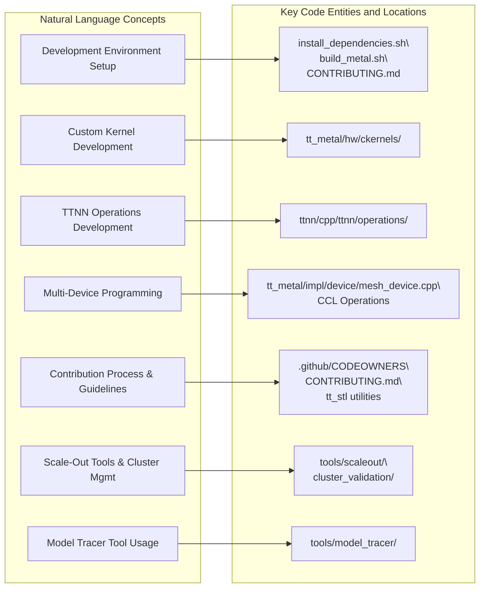

---
```


* * *

# Summary

This Development Guide serves as a high-level orientation for new and existing developers contributing to `tt-metal`. It outlines the overall workflows, introduces key components, and points to detailed child pages for every significant development domain, ensuring an effective onboarding and development experience.

* * *

### Sources

*   [CONTRIBUTING.md 50-180](https://github.com/tenstorrent/tt-metal/blob/f30f8df0/CONTRIBUTING.md?plain=1#L50-L180)
*   [README.md 4-170](https://github.com/tenstorrent/tt-metal/blob/f30f8df0/README.md?plain=1#L4-L170)
*   [models/README.md 1-40](https://github.com/tenstorrent/tt-metal/blob/f30f8df0/models/README.md?plain=1#L1-L40)
*   [.github/pull_request_template.md 1-12](https://github.com/tenstorrent/tt-metal/blob/f30f8df0/.github/pull_request_template.md?plain=1#L1-L12)
*   [tt_metal/impl/kernels/kernel.cpp 150-190](https://github.com/tenstorrent/tt-metal/blob/f30f8df0/tt_metal/impl/kernels/kernel.cpp#L150-L190)
*   [ttnn/ttnn/__init__.py 1-141](https://github.com/tenstorrent/tt-metal/blob/f30f8df0/ttnn/ttnn/__init__.py#L1-L141)

This wiki is featured in the [repository](https://github.com/tenstorrent/tt-metal/blob/main/README.md)

Dismiss
Refresh this wiki

Enter email to refresh

## Additional Diagrams


## Summary Diagram: Code Review and CI/CD Workflow Integration


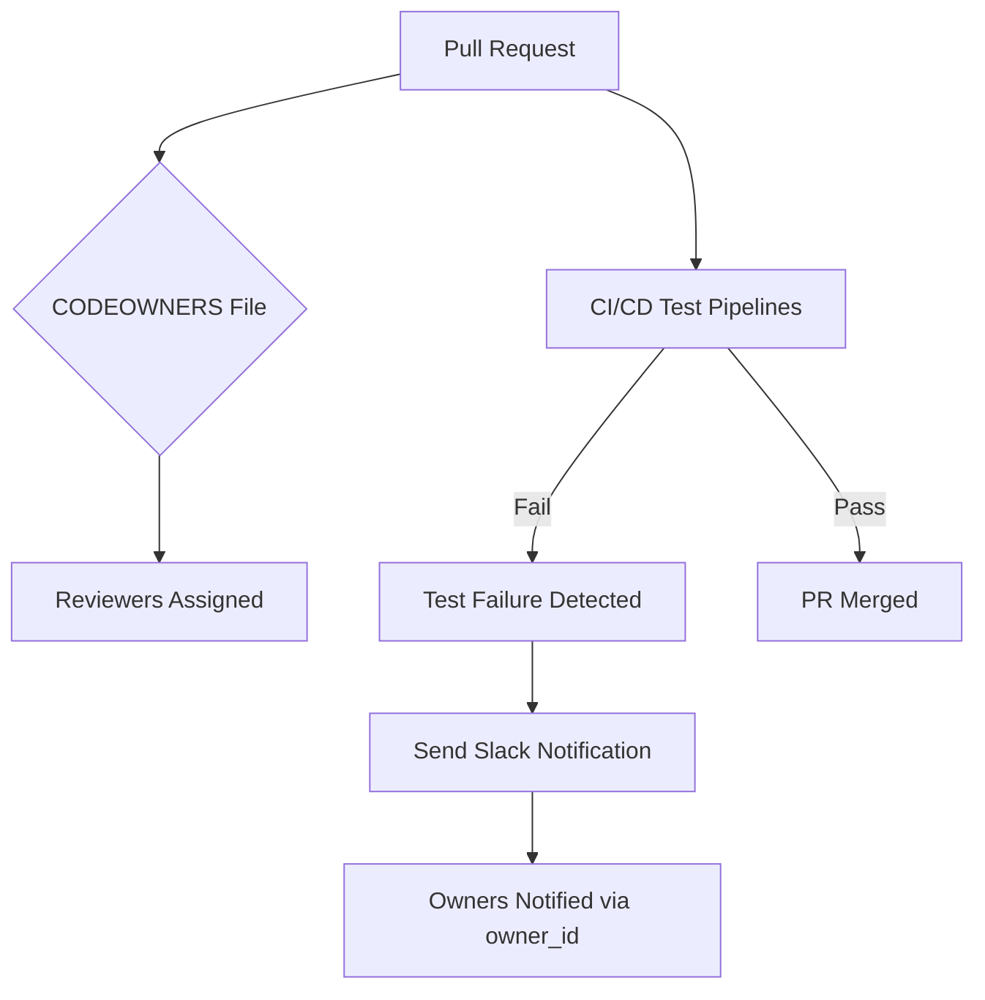

---
```


#### Prefill and Decode Execution Stages


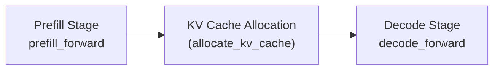

Sources:  
[tech_reports/LLMs/vLLM_integration.md:13-34](), [models/docs/MODEL_UPDATES.md:12-14]()

---
```


## Summary Diagram — From Natural Language Concepts to Key Code Entities


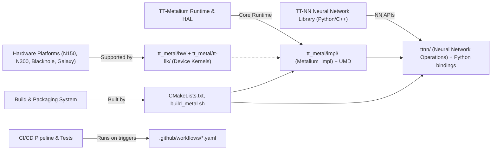

Sources: [INSTALLING.md:120-150](), [CMakeLists.txt:28-36](), [.github/workflows/build-artifact.yaml:1-150]()

---
```


#### Diagram: Kernel Compilation and Deployment Flow


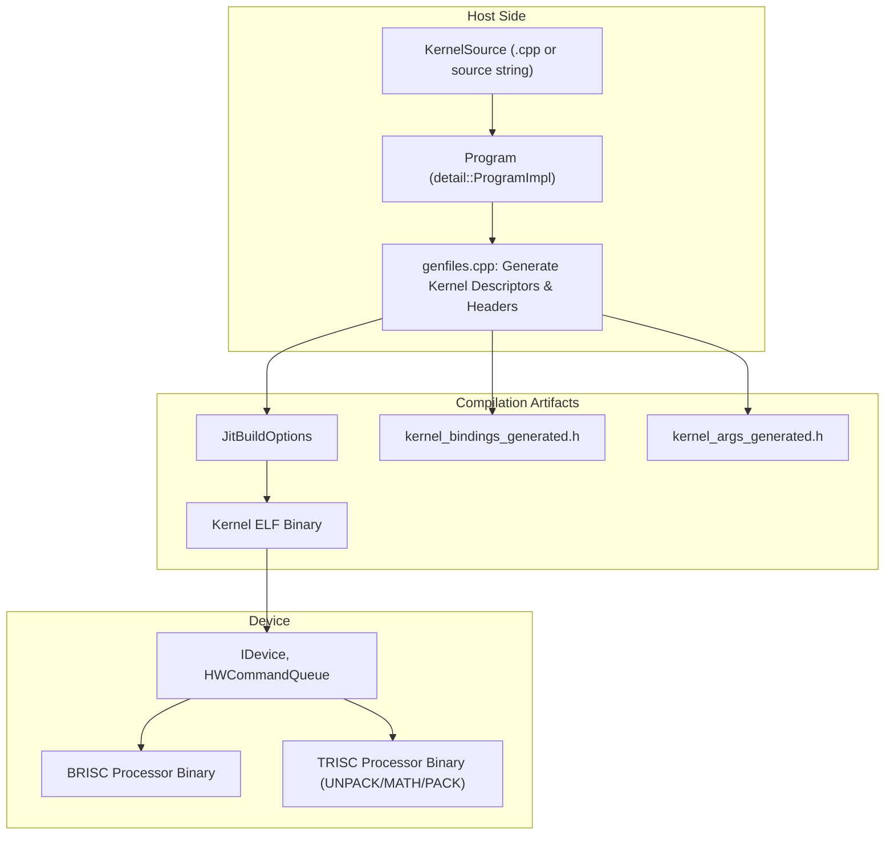

Sources: [tt_metal/impl/kernels/kernel.cpp:122-178](), [tt_metal/jit_build/genfiles.cpp:5-87](), [tt_metal/impl/program/program.cpp:156-189](), [tt_metal/impl/dispatch/hardware_command_queue.cpp:28-52]()

---
```


### Contribution Workflow Overview


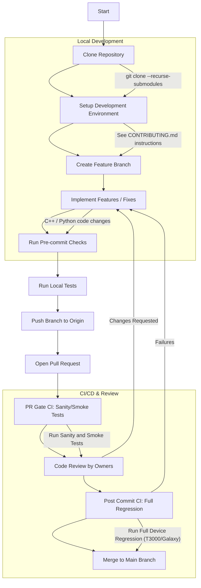

This flow ensures only thoroughly tested and reviewed code integrates into the main development line, preserving code quality for releases.
```


#### Hardware Test Integration and Automatic Triage


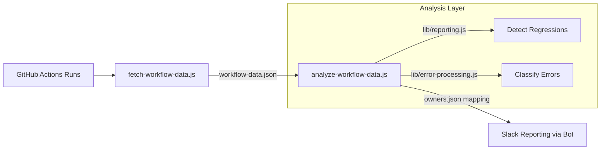

This workflow detects flaky and persistent failures by analyzing test history and posting owner-tagged notifications to Slack channels, speeding up response times to failures.
```


### Summary Diagram: Contribution and Review Process Expanded with Code Entities


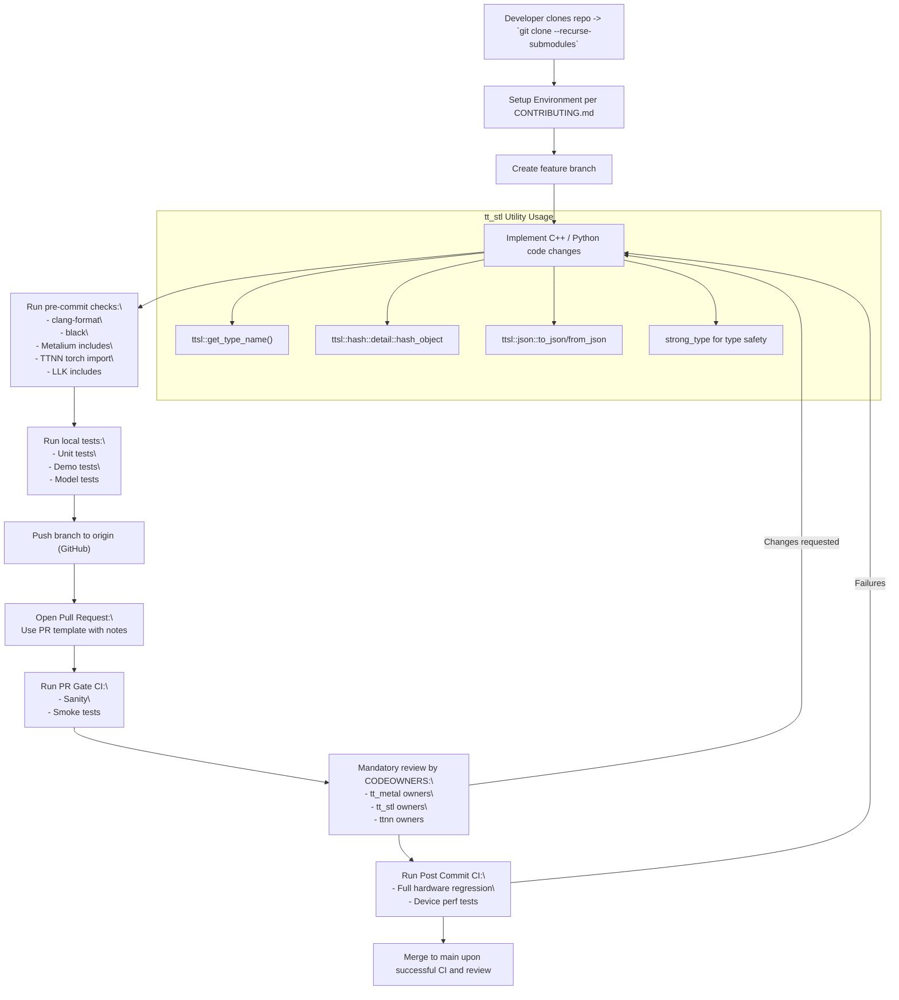

---
```


#### Extraction Pipeline Diagram


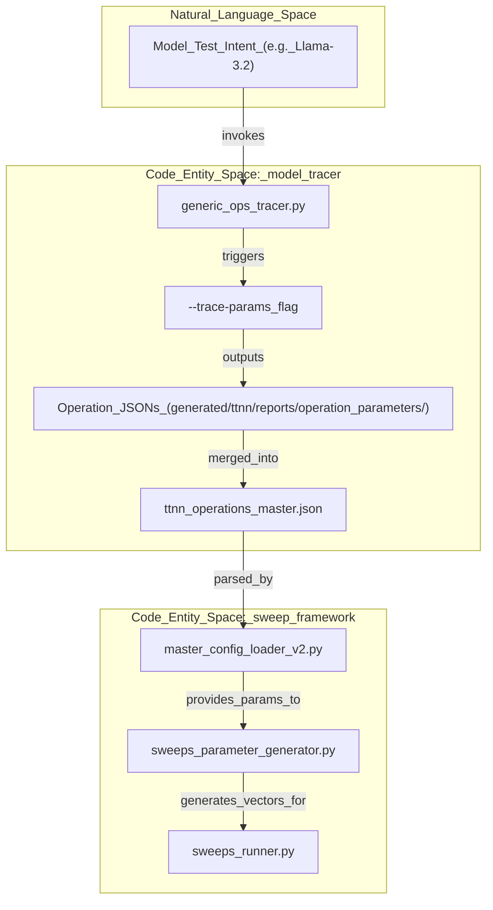

Sources: [[model_tracer/generic_ops_tracer.py:6-25]](), [[model_tracer/README.md:15-25]](), [[tests/sweep_framework/sweeps_parameter_generator.py:17-21]](), [[tests/sweep_framework/README.md:25-38]](), [[tests/sweep_framework/sweeps_runner.py:65-88]]()

---
```

