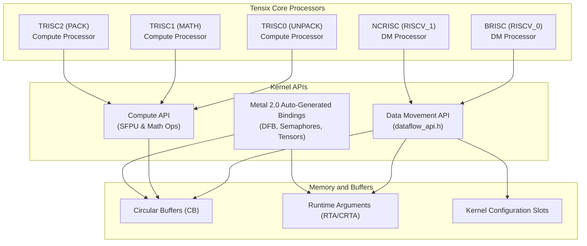
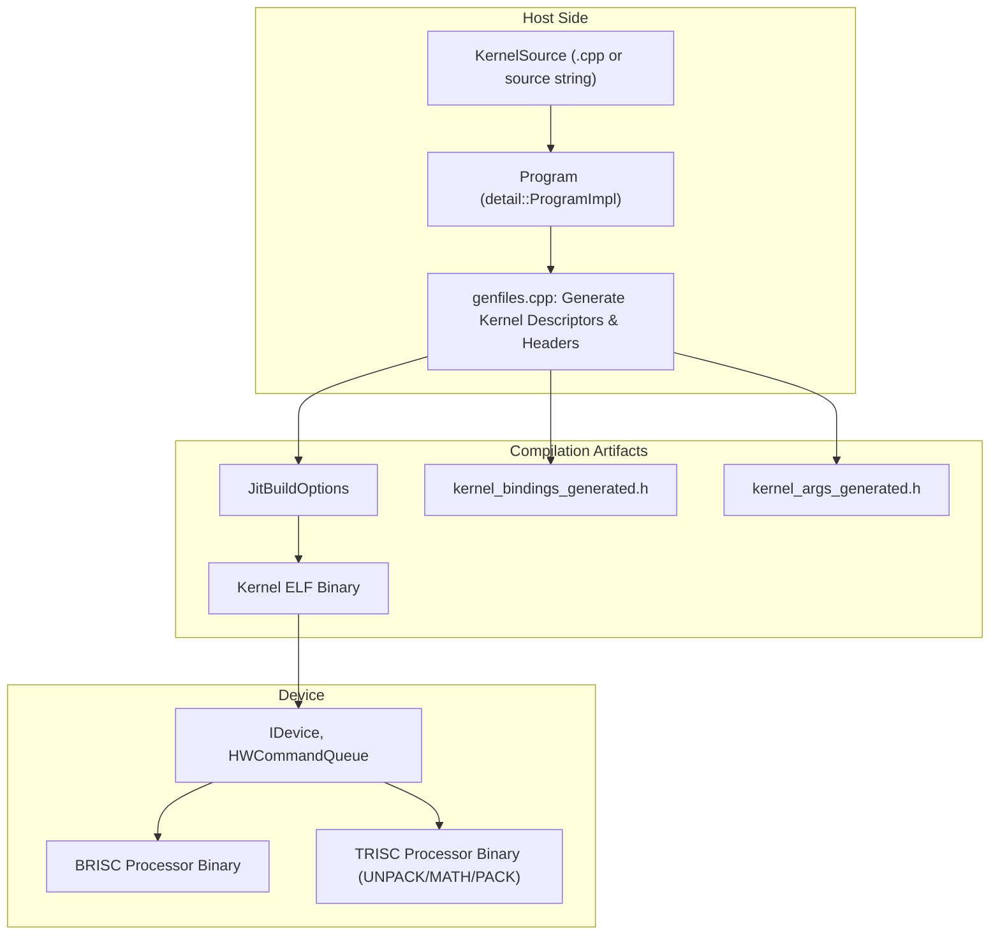

# Writing Custom Kernels

Relevant source files
*   [tests/tt_metal/tt_fabric/test_bandwidth_telemetry_validation.cpp](https://github.com/tenstorrent/tt-metal/blob/f30f8df0/tests/tt_metal/tt_fabric/test_bandwidth_telemetry_validation.cpp)
*   [tests/tt_metal/tt_metal/api/dataflow_buffer/test_dataflow_buffer.cpp](https://github.com/tenstorrent/tt-metal/blob/f30f8df0/tests/tt_metal/tt_metal/api/dataflow_buffer/test_dataflow_buffer.cpp)
*   [tests/tt_metal/tt_metal/api/dataflow_buffer/test_dataflow_buffer_configs.cpp](https://github.com/tenstorrent/tt-metal/blob/f30f8df0/tests/tt_metal/tt_metal/api/dataflow_buffer/test_dataflow_buffer_configs.cpp)
*   [tests/tt_metal/tt_metal/api/metal2_host_api/test_helpers.hpp](https://github.com/tenstorrent/tt-metal/blob/f30f8df0/tests/tt_metal/tt_metal/api/metal2_host_api/test_helpers.hpp)
*   [tests/tt_metal/tt_metal/api/metal2_host_api/test_program_run_args.cpp](https://github.com/tenstorrent/tt-metal/blob/f30f8df0/tests/tt_metal/tt_metal/api/metal2_host_api/test_program_run_args.cpp)
*   [tests/tt_metal/tt_metal/api/metal2_host_api/test_program_spec.cpp](https://github.com/tenstorrent/tt-metal/blob/f30f8df0/tests/tt_metal/tt_metal/api/metal2_host_api/test_program_spec.cpp)
*   [tests/tt_metal/tt_metal/api/metal2_host_api/test_program_spec_hw.cpp](https://github.com/tenstorrent/tt-metal/blob/f30f8df0/tests/tt_metal/tt_metal/api/metal2_host_api/test_program_spec_hw.cpp)
*   [tests/tt_metal/tt_metal/api/test_dram.cpp](https://github.com/tenstorrent/tt-metal/blob/f30f8df0/tests/tt_metal/tt_metal/api/test_dram.cpp)
*   [tests/tt_metal/tt_metal/api/test_kernel_thread_sync.cpp](https://github.com/tenstorrent/tt-metal/blob/f30f8df0/tests/tt_metal/tt_metal/api/test_kernel_thread_sync.cpp)
*   [tests/tt_metal/tt_metal/eth/test_basic_eth.cpp](https://github.com/tenstorrent/tt-metal/blob/f30f8df0/tests/tt_metal/tt_metal/eth/test_basic_eth.cpp)
*   [tests/tt_metal/tt_metal/eth/test_buffer_movement_kernels.cpp](https://github.com/tenstorrent/tt-metal/blob/f30f8df0/tests/tt_metal/tt_metal/eth/test_buffer_movement_kernels.cpp)
*   [tests/tt_metal/tt_metal/eth/test_erisc_app_direct_send.cpp](https://github.com/tenstorrent/tt-metal/blob/f30f8df0/tests/tt_metal/tt_metal/eth/test_erisc_app_direct_send.cpp)
*   [tests/tt_metal/tt_metal/test_compile_sets_kernel_binaries.cpp](https://github.com/tenstorrent/tt-metal/blob/f30f8df0/tests/tt_metal/tt_metal/test_compile_sets_kernel_binaries.cpp)
*   [tests/tt_metal/tt_metal/test_kernels/compute/dfb_t6.cpp](https://github.com/tenstorrent/tt-metal/blob/f30f8df0/tests/tt_metal/tt_metal/test_kernels/compute/dfb_t6.cpp)
*   [tests/tt_metal/tt_metal/test_kernels/compute/dfb_t6_consumer.cpp](https://github.com/tenstorrent/tt-metal/blob/f30f8df0/tests/tt_metal/tt_metal/test_kernels/compute/dfb_t6_consumer.cpp)
*   [tests/tt_metal/tt_metal/test_kernels/compute/dfb_t6_producer.cpp](https://github.com/tenstorrent/tt-metal/blob/f30f8df0/tests/tt_metal/tt_metal/test_kernels/compute/dfb_t6_producer.cpp)
*   [tests/tt_metal/tt_metal/test_kernels/dataflow/dfb_consumer.cpp](https://github.com/tenstorrent/tt-metal/blob/f30f8df0/tests/tt_metal/tt_metal/test_kernels/dataflow/dfb_consumer.cpp)
*   [tests/tt_metal/tt_metal/test_kernels/dataflow/dfb_producer.cpp](https://github.com/tenstorrent/tt-metal/blob/f30f8df0/tests/tt_metal/tt_metal/test_kernels/dataflow/dfb_producer.cpp)
*   [tests/tt_metal/tt_metal/test_kernels/dataflow/dram_copy.cpp](https://github.com/tenstorrent/tt-metal/blob/f30f8df0/tests/tt_metal/tt_metal/test_kernels/dataflow/dram_copy.cpp)
*   [tt_metal/api/tt-metalium/experimental/fabric/fabric_telemetry.hpp](https://github.com/tenstorrent/tt-metal/blob/f30f8df0/tt_metal/api/tt-metalium/experimental/fabric/fabric_telemetry.hpp)
*   [tt_metal/api/tt-metalium/experimental/metal2_host_api/advanced_options.hpp](https://github.com/tenstorrent/tt-metal/blob/f30f8df0/tt_metal/api/tt-metalium/experimental/metal2_host_api/advanced_options.hpp)
*   [tt_metal/api/tt-metalium/experimental/metal2_host_api/dataflow_buffer_spec.hpp](https://github.com/tenstorrent/tt-metal/blob/f30f8df0/tt_metal/api/tt-metalium/experimental/metal2_host_api/dataflow_buffer_spec.hpp)
*   [tt_metal/api/tt-metalium/experimental/metal2_host_api/kernel_spec.hpp](https://github.com/tenstorrent/tt-metal/blob/f30f8df0/tt_metal/api/tt-metalium/experimental/metal2_host_api/kernel_spec.hpp)
*   [tt_metal/api/tt-metalium/experimental/metal2_host_api/program_spec.hpp](https://github.com/tenstorrent/tt-metal/blob/f30f8df0/tt_metal/api/tt-metalium/experimental/metal2_host_api/program_spec.hpp)
*   [tt_metal/api/tt-metalium/experimental/metal2_host_api/semaphore_spec.hpp](https://github.com/tenstorrent/tt-metal/blob/f30f8df0/tt_metal/api/tt-metalium/experimental/metal2_host_api/semaphore_spec.hpp)
*   [tt_metal/api/tt-metalium/experimental/metal2_host_api/tensor_parameter.hpp](https://github.com/tenstorrent/tt-metal/blob/f30f8df0/tt_metal/api/tt-metalium/experimental/metal2_host_api/tensor_parameter.hpp)
*   [tt_metal/api/tt-metalium/mesh_workload.hpp](https://github.com/tenstorrent/tt-metal/blob/f30f8df0/tt_metal/api/tt-metalium/mesh_workload.hpp)
*   [tt_metal/api/tt-metalium/program.hpp](https://github.com/tenstorrent/tt-metal/blob/f30f8df0/tt_metal/api/tt-metalium/program.hpp)
*   [tt_metal/distributed/mesh_workload.cpp](https://github.com/tenstorrent/tt-metal/blob/f30f8df0/tt_metal/distributed/mesh_workload.cpp)
*   [tt_metal/distributed/mesh_workload_impl.hpp](https://github.com/tenstorrent/tt-metal/blob/f30f8df0/tt_metal/distributed/mesh_workload_impl.hpp)
*   [tt_metal/fabric/fabric_telemetry_converter.hpp](https://github.com/tenstorrent/tt-metal/blob/f30f8df0/tt_metal/fabric/fabric_telemetry_converter.hpp)
*   [tt_metal/fabric/fabric_telemetry_reader.cpp](https://github.com/tenstorrent/tt-metal/blob/f30f8df0/tt_metal/fabric/fabric_telemetry_reader.cpp)
*   [tt_metal/hw/ckernels/quasar/metal/llk_api/llk_unpack_AB_matmul_api.h](https://github.com/tenstorrent/tt-metal/blob/f30f8df0/tt_metal/hw/ckernels/quasar/metal/llk_api/llk_unpack_AB_matmul_api.h)
*   [tt_metal/hw/ckernels/quasar/metal/llk_io/llk_io_pack.h](https://github.com/tenstorrent/tt-metal/blob/f30f8df0/tt_metal/hw/ckernels/quasar/metal/llk_io/llk_io_pack.h)
*   [tt_metal/hw/ckernels/quasar/metal/llk_io/llk_io_unpack.h](https://github.com/tenstorrent/tt-metal/blob/f30f8df0/tt_metal/hw/ckernels/quasar/metal/llk_io/llk_io_unpack.h)
*   [tt_metal/hw/firmware/src/tt-1xx/drisc.cc](https://github.com/tenstorrent/tt-metal/blob/f30f8df0/tt_metal/hw/firmware/src/tt-1xx/drisc.cc)
*   [tt_metal/hw/firmware/src/tt-2xx/dm.cc](https://github.com/tenstorrent/tt-metal/blob/f30f8df0/tt_metal/hw/firmware/src/tt-2xx/dm.cc)
*   [tt_metal/hw/firmware/src/tt-2xx/dmk.cc](https://github.com/tenstorrent/tt-metal/blob/f30f8df0/tt_metal/hw/firmware/src/tt-2xx/dmk.cc)
*   [tt_metal/hw/firmware/src/tt-2xx/trisc.cc](https://github.com/tenstorrent/tt-metal/blob/f30f8df0/tt_metal/hw/firmware/src/tt-2xx/trisc.cc)
*   [tt_metal/hw/inc/api/dataflow/dataflow_api.h](https://github.com/tenstorrent/tt-metal/blob/f30f8df0/tt_metal/hw/inc/api/dataflow/dataflow_api.h)
*   [tt_metal/hw/inc/api/dataflow/dataflow_buffer.h](https://github.com/tenstorrent/tt-metal/blob/f30f8df0/tt_metal/hw/inc/api/dataflow/dataflow_buffer.h)
*   [tt_metal/hw/inc/hostdev/dev_msgs.h](https://github.com/tenstorrent/tt-metal/blob/f30f8df0/tt_metal/hw/inc/hostdev/dev_msgs.h)
*   [tt_metal/hw/inc/hostdev/fabric_telemetry_msgs.h](https://github.com/tenstorrent/tt-metal/blob/f30f8df0/tt_metal/hw/inc/hostdev/fabric_telemetry_msgs.h)
*   [tt_metal/hw/inc/internal/dataflow/dataflow_cmd_bufs.h](https://github.com/tenstorrent/tt-metal/blob/f30f8df0/tt_metal/hw/inc/internal/dataflow/dataflow_cmd_bufs.h)
*   [tt_metal/hw/inc/internal/tt-1xx/blackhole/c_tensix_core.h](https://github.com/tenstorrent/tt-metal/blob/f30f8df0/tt_metal/hw/inc/internal/tt-1xx/blackhole/c_tensix_core.h)
*   [tt_metal/hw/inc/internal/tt-1xx/blackhole/core_config.h](https://github.com/tenstorrent/tt-metal/blob/f30f8df0/tt_metal/hw/inc/internal/tt-1xx/blackhole/core_config.h)
*   [tt_metal/hw/inc/internal/tt-1xx/blackhole/dev_mem_map.h](https://github.com/tenstorrent/tt-metal/blob/f30f8df0/tt_metal/hw/inc/internal/tt-1xx/blackhole/dev_mem_map.h)
*   [tt_metal/hw/inc/internal/tt-1xx/blackhole/noc_nonblocking_api.h](https://github.com/tenstorrent/tt-metal/blob/f30f8df0/tt_metal/hw/inc/internal/tt-1xx/blackhole/noc_nonblocking_api.h)
*   [tt_metal/hw/inc/internal/tt-1xx/wormhole/c_tensix_core.h](https://github.com/tenstorrent/tt-metal/blob/f30f8df0/tt_metal/hw/inc/internal/tt-1xx/wormhole/c_tensix_core.h)
*   [tt_metal/hw/inc/internal/tt-1xx/wormhole/core_config.h](https://github.com/tenstorrent/tt-metal/blob/f30f8df0/tt_metal/hw/inc/internal/tt-1xx/wormhole/core_config.h)
*   [tt_metal/hw/inc/internal/tt-1xx/wormhole/dev_mem_map.h](https://github.com/tenstorrent/tt-metal/blob/f30f8df0/tt_metal/hw/inc/internal/tt-1xx/wormhole/dev_mem_map.h)
*   [tt_metal/hw/inc/internal/tt-1xx/wormhole/noc_nonblocking_api.h](https://github.com/tenstorrent/tt-metal/blob/f30f8df0/tt_metal/hw/inc/internal/tt-1xx/wormhole/noc_nonblocking_api.h)
*   [tt_metal/hw/inc/internal/tt-2xx/dataflow_buffer.inl](https://github.com/tenstorrent/tt-metal/blob/f30f8df0/tt_metal/hw/inc/internal/tt-2xx/dataflow_buffer.inl)
*   [tt_metal/hw/inc/internal/tt-2xx/dataflow_buffer/dataflow_buffer_config.h](https://github.com/tenstorrent/tt-metal/blob/f30f8df0/tt_metal/hw/inc/internal/tt-2xx/dataflow_buffer/dataflow_buffer_config.h)
*   [tt_metal/hw/inc/internal/tt-2xx/dataflow_buffer/dataflow_buffer_init.h](https://github.com/tenstorrent/tt-metal/blob/f30f8df0/tt_metal/hw/inc/internal/tt-2xx/dataflow_buffer/dataflow_buffer_init.h)
*   [tt_metal/hw/inc/internal/tt-2xx/dataflow_buffer/dataflow_buffer_interface.h](https://github.com/tenstorrent/tt-metal/blob/f30f8df0/tt_metal/hw/inc/internal/tt-2xx/dataflow_buffer/dataflow_buffer_interface.h)
*   [tt_metal/hw/inc/internal/tt-2xx/quasar/core_config.h](https://github.com/tenstorrent/tt-metal/blob/f30f8df0/tt_metal/hw/inc/internal/tt-2xx/quasar/core_config.h)
*   [tt_metal/hw/inc/internal/tt-2xx/quasar/dev_mem_map.h](https://github.com/tenstorrent/tt-metal/blob/f30f8df0/tt_metal/hw/inc/internal/tt-2xx/quasar/dev_mem_map.h)
*   [tt_metal/hw/inc/internal/tt-2xx/quasar/noc_nonblocking_api.h](https://github.com/tenstorrent/tt-metal/blob/f30f8df0/tt_metal/hw/inc/internal/tt-2xx/quasar/noc_nonblocking_api.h)
*   [tt_metal/hw/inc/internal/tt-2xx/quasar/noc_nonblocking_api_v1.h](https://github.com/tenstorrent/tt-metal/blob/f30f8df0/tt_metal/hw/inc/internal/tt-2xx/quasar/noc_nonblocking_api_v1.h)
*   [tt_metal/hw/inc/internal/tt-2xx/quasar/noc_nonblocking_api_v2.h](https://github.com/tenstorrent/tt-metal/blob/f30f8df0/tt_metal/hw/inc/internal/tt-2xx/quasar/noc_nonblocking_api_v2.h)
*   [tt_metal/hw/inc/internal/tt-2xx/quasar/stream_interface.h](https://github.com/tenstorrent/tt-metal/blob/f30f8df0/tt_metal/hw/inc/internal/tt-2xx/quasar/stream_interface.h)
*   [tt_metal/impl/dataflow_buffer/dataflow_buffer.cpp](https://github.com/tenstorrent/tt-metal/blob/f30f8df0/tt_metal/impl/dataflow_buffer/dataflow_buffer.cpp)
*   [tt_metal/impl/dataflow_buffer/dataflow_buffer_impl.hpp](https://github.com/tenstorrent/tt-metal/blob/f30f8df0/tt_metal/impl/dataflow_buffer/dataflow_buffer_impl.hpp)
*   [tt_metal/impl/dispatch/hardware_command_queue.cpp](https://github.com/tenstorrent/tt-metal/blob/f30f8df0/tt_metal/impl/dispatch/hardware_command_queue.cpp)
*   [tt_metal/impl/dispatch/hardware_command_queue.hpp](https://github.com/tenstorrent/tt-metal/blob/f30f8df0/tt_metal/impl/dispatch/hardware_command_queue.hpp)
*   [tt_metal/impl/dispatch/host_runtime_commands.cpp](https://github.com/tenstorrent/tt-metal/blob/f30f8df0/tt_metal/impl/dispatch/host_runtime_commands.cpp)
*   [tt_metal/impl/kernels/kernel.cpp](https://github.com/tenstorrent/tt-metal/blob/f30f8df0/tt_metal/impl/kernels/kernel.cpp)
*   [tt_metal/impl/kernels/kernel.hpp](https://github.com/tenstorrent/tt-metal/blob/f30f8df0/tt_metal/impl/kernels/kernel.hpp)
*   [tt_metal/impl/metal2_host_api/program_spec.cpp](https://github.com/tenstorrent/tt-metal/blob/f30f8df0/tt_metal/impl/metal2_host_api/program_spec.cpp)
*   [tt_metal/impl/program/dispatch.cpp](https://github.com/tenstorrent/tt-metal/blob/f30f8df0/tt_metal/impl/program/dispatch.cpp)
*   [tt_metal/impl/program/dispatch.hpp](https://github.com/tenstorrent/tt-metal/blob/f30f8df0/tt_metal/impl/program/dispatch.hpp)
*   [tt_metal/impl/program/program.cpp](https://github.com/tenstorrent/tt-metal/blob/f30f8df0/tt_metal/impl/program/program.cpp)
*   [tt_metal/impl/program/program_command_sequence.hpp](https://github.com/tenstorrent/tt-metal/blob/f30f8df0/tt_metal/impl/program/program_command_sequence.hpp)
*   [tt_metal/impl/program/program_impl.hpp](https://github.com/tenstorrent/tt-metal/blob/f30f8df0/tt_metal/impl/program/program_impl.hpp)
*   [tt_metal/jit_build/data_format.hpp](https://github.com/tenstorrent/tt-metal/blob/f30f8df0/tt_metal/jit_build/data_format.hpp)
*   [tt_metal/jit_build/genfiles.cpp](https://github.com/tenstorrent/tt-metal/blob/f30f8df0/tt_metal/jit_build/genfiles.cpp)
*   [tt_metal/jit_build/jit_build_settings.hpp](https://github.com/tenstorrent/tt-metal/blob/f30f8df0/tt_metal/jit_build/jit_build_settings.hpp)
*   [tt_metal/llrt/hal/codegen/codegen.py](https://github.com/tenstorrent/tt-metal/blob/f30f8df0/tt_metal/llrt/hal/codegen/codegen.py)
*   [tt_metal/llrt/hal/tt-1xx/blackhole/bh_hal_dram.cpp](https://github.com/tenstorrent/tt-metal/blob/f30f8df0/tt_metal/llrt/hal/tt-1xx/blackhole/bh_hal_dram.cpp)

This page provides a detailed technical guide for developers to write custom kernels in the TT-Metalium low-level framework for Tenstorrent hardware. It covers writing compute and data movement kernels, Metal 2.0 reader/writer kernels, runtime argument handling, kernel compilation, and kernel deployment.

* * *

## Kernel Types and Execution Model

TT-Metalium supports two main kernel types running on different processors within Tensix and Ethernet cores:

| Kernel Type | Processor Class | Functionality |
| --- | --- | --- |
| **Data Movement** | BRISC / NCRISC (RISCV_0 / RISCV_1) `HalProcessorClassType::DM` | Perform asynchronous NOC reads/writes, manage circular buffer flow control, move data across memories. |
| **Compute** | TRISC0 (UNPACK), TRISC1 (MATH), TRISC2 (PACK) `HalProcessorClassType::COMPUTE` | Unpack data from circular buffers, apply SFPU math operations, pack results back to buffers. |

The kernels are designed for specialized roles:

*   Data Movement kernels handle core-to-core, DRAM-to-core, or core-to-DRAM data transfers using non-blocking Network on Chip (NOC) APIs.
*   Compute kernels run on a three-threaded model within Tensix cores, with distinct processors dedicated to unpacking inputs, performing mathematical operations (including vector and matrix computations), and packing outputs.

The TT-Metalium framework offers distinct APIs for these kernel types:

*   **Data Movement API** from `dataflow_api.h` supports asynchronous NOC operations (`noc_async_read`, `noc_async_write`), runtime argument access, and circular buffer (CB) management.
*   **Compute API** provides SFPU operations and specialized instructions for math and pack/unpack in compute kernels.
*   **Metal 2.0 Bindings** enable implicit, auto-generated accessors for Dataflow Buffers (DFBs), Semaphores, and Tensors, streamlining resource binding.

### Diagram: Tensix Core Kernel Execution Architecture and API Mapping

Sources: [tt_metal/impl/program/program.cpp 107-114](https://github.com/tenstorrent/tt-metal/blob/f30f8df0/tt_metal/impl/program/program.cpp#L107-L114)[tt_metal/impl/program/program.cpp 160-170](https://github.com/tenstorrent/tt-metal/blob/f30f8df0/tt_metal/impl/program/program.cpp#L160-L170)[tt_metal/jit_build/genfiles.cpp 92-182](https://github.com/tenstorrent/tt-metal/blob/f30f8df0/tt_metal/jit_build/genfiles.cpp#L92-L182)[tt_metal/hw/inc/api/dataflow/dataflow_api.h 44-172](https://github.com/tenstorrent/tt-metal/blob/f30f8df0/tt_metal/hw/inc/api/dataflow/dataflow_api.h#L44-L172)[tt_metal/impl/kernels/kernel.cpp 42-90](https://github.com/tenstorrent/tt-metal/blob/f30f8df0/tt_metal/impl/kernels/kernel.cpp#L42-L90)

* * *




Sources: [tt_metal/impl/program/program.cpp:107-114](), [tt_metal/impl/program/program.cpp:160-170](), [tt_metal/jit_build/genfiles.cpp:92-182](), [tt_metal/hw/inc/api/dataflow/dataflow_api.h:44-172](), [tt_metal/impl/kernels/kernel.cpp:42-90]()

---
```
## Writing Data Movement Kernels

Data movement kernels execute on the BRISC and NCRISC processors and leverage asynchronous NOC operations for communicating with DRAM or other cores.

### Core APIs for Memory Operations

| Operation | Function | Description |
| --- | --- | --- |
| **Asynchronous Read** | `noc_async_read()` | Initiates non-blocking read from remote NOC address to local L1 memory. |
| **Asynchronous Write** | `noc_async_write()` | Initiates non-blocking write from local L1 memory to remote NOC address. |
| **Get Unique Argument** | `get_arg_val<T>(idx)` | Fetch a 4-byte unique runtime argument value from L1 memory. |
| **Get Common Argument** | `get_common_arg_val<T>(idx)` | Fetch a 4-byte common runtime argument value shared across all cores. |

These APIs allow highly efficient, non-blocking transfers coordinated via runtime arguments and circular buffer flow controls.

Sources: [tt_metal/hw/inc/internal/tt-1xx/blackhole/noc_nonblocking_api.h 85-90](https://github.com/tenstorrent/tt-metal/blob/f30f8df0/tt_metal/hw/inc/internal/tt-1xx/blackhole/noc_nonblocking_api.h#L85-L90)[tt_metal/hw/inc/api/dataflow/dataflow_api.h 108-172](https://github.com/tenstorrent/tt-metal/blob/f30f8df0/tt_metal/hw/inc/api/dataflow/dataflow_api.h#L108-L172)

* * *

## Writing Compute Kernels

Compute kernels run three specialized threads in Tensix cores:

*   **TRISC0 (UNPACK)**: Reads input tiles from circular buffers, unpacks data into registers.
*   **TRISC1 (MATH)**: Executes arithmetic, SFPU vector, and FPU matrix operations.
*   **TRISC2 (PACK)**: Packs results from registers back into circular buffers.

### Kernel Source Management and Compilation

*   Kernel sources can be specified as absolute paths or resolved relative to several predefined directories, including:

    *   Current working directory
    *   Kernel directory specified by runtime options
    *   System kernel directory
    *   Root directory (`TT_METAL_HOME`)

The `KernelSource` class handles this resolution on construction.

*   Compile-time defines and include paths are constructed and managed by `jit_build` utilities.

*   The kernel is represented by the `Kernel` class, which stores metadata including programmable core type, processor class, range of supported cores, runtime argument names, and compile-time defines.

*   Kernels are compiled just-in-time (JIT) into firmware binaries using the configured toolchain.

Sources: [tt_metal/impl/kernels/kernel.cpp 50-90](https://github.com/tenstorrent/tt-metal/blob/f30f8df0/tt_metal/impl/kernels/kernel.cpp#L50-L90)[tt_metal/impl/program/program.cpp 160-171](https://github.com/tenstorrent/tt-metal/blob/f30f8df0/tt_metal/impl/program/program.cpp#L160-L171)

* * *

## Metal 2.0 Kernels and Bindings

Metal 2.0 kernels, created via the `ProgramSpec` host API, introduce a richer binding mechanism with auto-generated C++ headers that expose:

*   **Dataflow Buffer Accessors** (`dfb::` namespace), as `constexpr DFBAccessor` variables.
*   **Semaphore Accessors** (`sem::` namespace), as `constexpr uint32_t` constants.
*   **Tensor Binding Accessors** (`ta::` namespace), as templated tokens (`TensorAccessorBindingToken`).

These headers are automatically generated during JIT build by invoking functions such as `write_kernel_bindings_generated_header`. This generation ensures deterministic ordering and exact correspondence between source bindings and runtime layout.

This mechanism simplifies kernel code by enabling implicit compile-time accessors rather than manually passing all bind handles.

Sources: [tt_metal/jit_build/genfiles.cpp 92-182](https://github.com/tenstorrent/tt-metal/blob/f30f8df0/tt_metal/jit_build/genfiles.cpp#L92-L182)[tt_metal/impl/metal2_host_api/program_spec.cpp 52-94](https://github.com/tenstorrent/tt-metal/blob/f30f8df0/tt_metal/impl/metal2_host_api/program_spec.cpp#L52-L94)

* * *

## Runtime Arguments Handling

Each kernel can define runtime arguments (RTAs), which are small, per-core or common parameters passed from the host to the kernel at dispatch time.

*   **Unique Runtime Arguments (RTA)**: Per-core arguments indexed by argument index, accessed in kernel code via `get_arg_val<T>(idx)`.

*   **Common Runtime Arguments (CRTA)**: Shared across all cores, accessed by `get_common_arg_val<T>(idx)`.

RTAs are stored in L1 memory, with addresses managed by metadata populated during program creation. When the Watcher system is enabled, RTAs are initialized with sentinel values to detect illegal accesses.

Sources: [tt_metal/hw/inc/api/dataflow/dataflow_api.h 100-172](https://github.com/tenstorrent/tt-metal/blob/f30f8df0/tt_metal/hw/inc/api/dataflow/dataflow_api.h#L100-L172)[tt_metal/impl/program/dispatch.cpp 155-161](https://github.com/tenstorrent/tt-metal/blob/f30f8df0/tt_metal/impl/program/dispatch.cpp#L155-L161)

* * *

## Kernel Compilation and JIT Build Workflow

Custom kernels go through a JIT compile and deployment flow managed by TT-Metalium:

1.   **Kernel Source Setup**

    *   Resolve kernel source file paths.
    *   Combine with compile-time arguments and defines.

2.   **Kernel Source Generation**

    *   `generate_kernel_source_files` produces descriptors and source code for the kernel, using the device-specific build environment managed by `BuildEnvManager`.

3.   **Build Descriptor Preparation**

    *   `build_kernel_descriptor` creates a `KernelCompileDescriptor` which includes compile options, kernel hashes, and build keys.

4.   **Compilation**

    *   The kernel compiler (SFPI toolchain) produces binary firmware for each kernel component.

5.   **Deployment**

    *   Compiled binaries are loaded into device DRAM.
    *   Runtime arguments, circular buffer configurations, and kernel metadata are initialized.
    *   Kernel placement on device cores is validated.

6.   **Dispatch**

    *   Kernels dispatch commands are enqueued using `HWCommandQueue`.

### Diagram: Kernel Compilation and Deployment Flow

Sources: [tt_metal/impl/kernels/kernel.cpp 122-178](https://github.com/tenstorrent/tt-metal/blob/f30f8df0/tt_metal/impl/kernels/kernel.cpp#L122-L178)[tt_metal/jit_build/genfiles.cpp 5-87](https://github.com/tenstorrent/tt-metal/blob/f30f8df0/tt_metal/jit_build/genfiles.cpp#L5-L87)[tt_metal/impl/program/program.cpp 156-189](https://github.com/tenstorrent/tt-metal/blob/f30f8df0/tt_metal/impl/program/program.cpp#L156-L189)[tt_metal/impl/dispatch/hardware_command_queue.cpp 28-52](https://github.com/tenstorrent/tt-metal/blob/f30f8df0/tt_metal/impl/dispatch/hardware_command_queue.cpp#L28-L52)

* * *




Sources: [tt_metal/impl/kernels/kernel.cpp:122-178](), [tt_metal/jit_build/genfiles.cpp:5-87](), [tt_metal/impl/program/program.cpp:156-189](), [tt_metal/impl/dispatch/hardware_command_queue.cpp:28-52]()

---
```
## Kernel Placement and Validation

*   Kernel placement rules prevent user kernels from running on dispatch cores when fast dispatch is enabled.
*   Compute kernels (Tensix) cannot be placed on dispatch cores except if they are part of dispatch infrastructure.
*   Ethernet kernels cannot run on idle Ethernet cores in fast dispatch mode.
*   Logical core coordinates are used to track placement relative to sub-devices.
*   Validation ensures kernels do not violate topology or resource constraints.

Sources: [tt_metal/impl/program/program.cpp 116-151](https://github.com/tenstorrent/tt-metal/blob/f30f8df0/tt_metal/impl/program/program.cpp#L116-L151)[tt_metal/impl/program/dispatch.cpp 118-127](https://github.com/tenstorrent/tt-metal/blob/f30f8df0/tt_metal/impl/program/dispatch.cpp#L118-L127)

* * *

## Debugging and Watching

The TT-Metalium Watcher system registers kernels during creation to allow runtime monitoring and assertion failure detection:

*   The `Kernel` class calls `register_kernel_with_watcher()` on construction.
*   When watcher asserts are enabled, RTA/CRTA offsets are initialized to a sentinel value, enabling detection of illegal RTA usage.
*   Watcher kernel IDs link hardware kernel execution with debugging tools and logs.

Sources: [tt_metal/impl/kernels/kernel.cpp 180-200](https://github.com/tenstorrent/tt-metal/blob/f30f8df0/tt_metal/impl/kernels/kernel.cpp#L180-L200)[tt_metal/impl/program/dispatch.cpp 155-161](https://github.com/tenstorrent/tt-metal/blob/f30f8df0/tt_metal/impl/program/dispatch.cpp#L155-L161)

* * *

# Summary

Writing custom kernels in TT-Metalium involves:

*   Writing data movement kernels using NOC APIs on BRISC/NCRISC processors.
*   Writing compute kernels targeting the three-thread TRISC execution model.
*   Utilizing Metal 2.0 host API `ProgramSpec` for streamlined resource binding.
*   Leveraging runtime argument APIs to parameterize kernel execution.
*   Understanding kernel source resolution, generation, and JIT compilation.
*   Validating kernel placement to maintain system integrity.
*   Registering kernels with the Watcher for production debugging.

This approach allows developers to create efficient, scalable, and debuggable kernels for Tenstorrent hardware.

* * *

# References

| Topic | Code Locations |
| --- | --- |
| Kernel execution architecture | `tt_metal/impl/program/program.cpp:107-114`, `tt_metal/jit_build/genfiles.cpp:92-182`, `tt_metal/hw/inc/api/dataflow/dataflow_api.h:44-172` |
| Data movement API | `tt_metal/hw/inc/internal/tt-1xx/blackhole/noc_nonblocking_api.h:85-90`, `tt_metal/hw/inc/api/dataflow/dataflow_api.h:108-172` |
| Compute kernel source & build | `tt_metal/impl/kernels/kernel.cpp:50-90`, `tt_metal/impl/program/program.cpp:160-171` |
| Metal 2.0 bindings generation | `tt_metal/jit_build/genfiles.cpp:92-182`, `tt_metal/impl/metal2_host_api/program_spec.cpp:52-94` |
| Runtime arguments handling | `tt_metal/hw/inc/api/dataflow/dataflow_api.h:100-172`, `tt_metal/impl/program/dispatch.cpp:155-161` |
| Kernel compilation / deployment | `tt_metal/impl/kernels/kernel.cpp:122-178`, `tt_metal/jit_build/genfiles.cpp:5-87`, `tt_metal/impl/program/program.cpp:156-189` |
| Kernel placement validation | `tt_metal/impl/program/program.cpp:116-151`, `tt_metal/impl/program/dispatch.cpp:118-127` |
| Watcher system | `tt_metal/impl/kernels/kernel.cpp:180-200`, `tt_metal/impl/program/dispatch.cpp:155-161` |

Sources:

[tt_metal/impl/program/program.cpp 100-151](https://github.com/tenstorrent/tt-metal/blob/f30f8df0/tt_metal/impl/program/program.cpp#L100-L151)

[tt_metal/impl/program/dispatch.cpp 110-140](https://github.com/tenstorrent/tt-metal/blob/f30f8df0/tt_metal/impl/program/dispatch.cpp#L110-L140)

[tt_metal/impl/kernels/kernel.cpp 40-90](https://github.com/tenstorrent/tt-metal/blob/f30f8df0/tt_metal/impl/kernels/kernel.cpp#L40-L90)

[tt_metal/jit_build/genfiles.cpp 50-182](https://github.com/tenstorrent/tt-metal/blob/f30f8df0/tt_metal/jit_build/genfiles.cpp#L50-L182)

[tt_metal/hw/inc/api/dataflow/dataflow_api.h 30-172](https://github.com/tenstorrent/tt-metal/blob/f30f8df0/tt_metal/hw/inc/api/dataflow/dataflow_api.h#L30-L172)

[tt_metal/hw/inc/internal/tt-1xx/blackhole/noc_nonblocking_api.h 85-90](https://github.com/tenstorrent/tt-metal/blob/f30f8df0/tt_metal/hw/inc/internal/tt-1xx/blackhole/noc_nonblocking_api.h#L85-L90)

[tt_metal/impl/program/dispatch.cpp 155-161](https://github.com/tenstorrent/tt-metal/blob/f30f8df0/tt_metal/impl/program/dispatch.cpp#L155-L161)

[tt_metal/impl/dispatch/hardware_command_queue.cpp 28-52](https://github.com/tenstorrent/tt-metal/blob/f30f8df0/tt_metal/impl/dispatch/hardware_command_queue.cpp#L28-L52)

Dismiss
Refresh this wiki

Enter email to refresh
