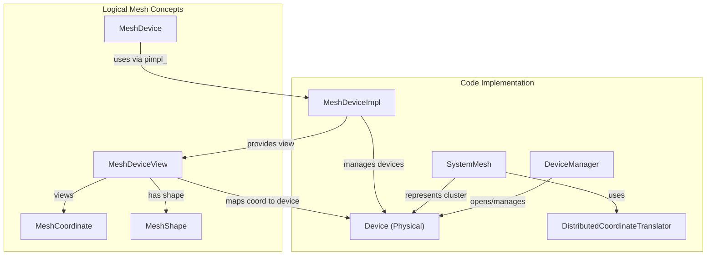
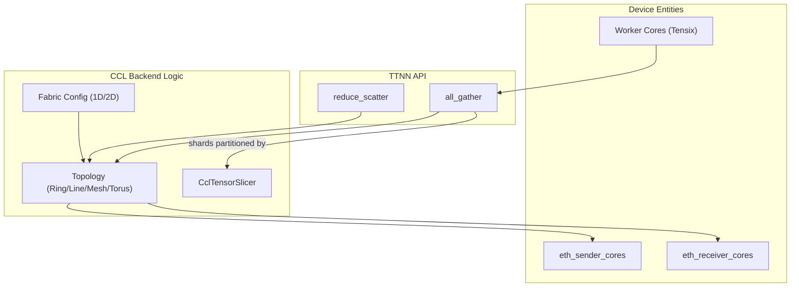

# Multi-Device Programming

Relevant source files
*   [.github/workflows/fabric-cpu-only-tests-impl.yaml](https://github.com/tenstorrent/tt-metal/blob/f30f8df0/.github/workflows/fabric-cpu-only-tests-impl.yaml)
*   [.github/workflows/tm-data-movement-perf-impl.yaml](https://github.com/tenstorrent/tt-metal/blob/f30f8df0/.github/workflows/tm-data-movement-perf-impl.yaml)
*   [.github/workflows/tm-data-movement-unit-impl.yaml](https://github.com/tenstorrent/tt-metal/blob/f30f8df0/.github/workflows/tm-data-movement-unit-impl.yaml)
*   [.github/workflows/tm-data-movement-wrapper.yaml](https://github.com/tenstorrent/tt-metal/blob/f30f8df0/.github/workflows/tm-data-movement-wrapper.yaml)
*   [.github/workflows/tm-fabric-tests-impl.yaml](https://github.com/tenstorrent/tt-metal/blob/f30f8df0/.github/workflows/tm-fabric-tests-impl.yaml)
*   [.github/workflows/tm-fabric-tests-perf-impl.yaml](https://github.com/tenstorrent/tt-metal/blob/f30f8df0/.github/workflows/tm-fabric-tests-perf-impl.yaml)
*   [.github/workflows/tm-fabric-tests.yaml](https://github.com/tenstorrent/tt-metal/blob/f30f8df0/.github/workflows/tm-fabric-tests.yaml)
*   [models/demos/t3000/falcon40b/tests/test_falcon_model.py](https://github.com/tenstorrent/tt-metal/blob/f30f8df0/models/demos/t3000/falcon40b/tests/test_falcon_model.py)
*   [tests/scripts/multihost/run_fabric_cpu_only_unit_tests.sh](https://github.com/tenstorrent/tt-metal/blob/f30f8df0/tests/scripts/multihost/run_fabric_cpu_only_unit_tests.sh)
*   [tests/tt_metal/distributed/multiprocess/test_sanity.cpp](https://github.com/tenstorrent/tt-metal/blob/f30f8df0/tests/tt_metal/distributed/multiprocess/test_sanity.cpp)
*   [tests/tt_metal/distributed/test_mesh_coord.cpp](https://github.com/tenstorrent/tt-metal/blob/f30f8df0/tests/tt_metal/distributed/test_mesh_coord.cpp)
*   [tests/tt_metal/distributed/test_mesh_device.cpp](https://github.com/tenstorrent/tt-metal/blob/f30f8df0/tests/tt_metal/distributed/test_mesh_device.cpp)
*   [tests/tt_metal/distributed/test_mesh_device_reshape.cpp](https://github.com/tenstorrent/tt-metal/blob/f30f8df0/tests/tt_metal/distributed/test_mesh_device_reshape.cpp)
*   [tests/tt_metal/distributed/test_mesh_device_view.cpp](https://github.com/tenstorrent/tt-metal/blob/f30f8df0/tests/tt_metal/distributed/test_mesh_device_view.cpp)
*   [tests/tt_metal/multihost/fabric_tests/mesh_socket_test_context.cpp](https://github.com/tenstorrent/tt-metal/blob/f30f8df0/tests/tt_metal/multihost/fabric_tests/mesh_socket_test_context.cpp)
*   [tests/tt_metal/tt_metal/common/multi_device_fixture.hpp](https://github.com/tenstorrent/tt-metal/blob/f30f8df0/tests/tt_metal/tt_metal/common/multi_device_fixture.hpp)
*   [tests/tt_metal/tt_metal/data_movement/noc_estimator_tests/README.md](https://github.com/tenstorrent/tt-metal/blob/f30f8df0/tests/tt_metal/tt_metal/data_movement/noc_estimator_tests/README.md?plain=1)
*   [tests/tt_metal/tt_metal/data_movement/noc_estimator_tests/kernels/barrier_sync.hpp](https://github.com/tenstorrent/tt-metal/blob/f30f8df0/tests/tt_metal/tt_metal/data_movement/noc_estimator_tests/kernels/barrier_sync.hpp)
*   [tests/tt_metal/tt_metal/data_movement/noc_estimator_tests/kernels/dram_reader.cpp](https://github.com/tenstorrent/tt-metal/blob/f30f8df0/tests/tt_metal/tt_metal/data_movement/noc_estimator_tests/kernels/dram_reader.cpp)
*   [tests/tt_metal/tt_metal/data_movement/noc_estimator_tests/kernels/dram_writer.cpp](https://github.com/tenstorrent/tt-metal/blob/f30f8df0/tests/tt_metal/tt_metal/data_movement/noc_estimator_tests/kernels/dram_writer.cpp)
*   [tests/tt_metal/tt_metal/data_movement/noc_estimator_tests/kernels/log_helpers.hpp](https://github.com/tenstorrent/tt-metal/blob/f30f8df0/tests/tt_metal/tt_metal/data_movement/noc_estimator_tests/kernels/log_helpers.hpp)
*   [tests/tt_metal/tt_metal/data_movement/noc_estimator_tests/kernels/reader.cpp](https://github.com/tenstorrent/tt-metal/blob/f30f8df0/tests/tt_metal/tt_metal/data_movement/noc_estimator_tests/kernels/reader.cpp)
*   [tests/tt_metal/tt_metal/data_movement/noc_estimator_tests/kernels/writer.cpp](https://github.com/tenstorrent/tt-metal/blob/f30f8df0/tests/tt_metal/tt_metal/data_movement/noc_estimator_tests/kernels/writer.cpp)
*   [tests/tt_metal/tt_metal/data_movement/noc_estimator_tests/test_noc_estimator.cpp](https://github.com/tenstorrent/tt-metal/blob/f30f8df0/tests/tt_metal/tt_metal/data_movement/noc_estimator_tests/test_noc_estimator.cpp)
*   [tests/ttnn/distributed/test_new_mode_phases.py](https://github.com/tenstorrent/tt-metal/blob/f30f8df0/tests/ttnn/distributed/test_new_mode_phases.py)
*   [tests/ttnn/distributed/test_ttrun.py](https://github.com/tenstorrent/tt-metal/blob/f30f8df0/tests/ttnn/distributed/test_ttrun.py)
*   [tests/ttnn/unit_tests/gtests/multiprocess/test_host_all_gather.cpp](https://github.com/tenstorrent/tt-metal/blob/f30f8df0/tests/ttnn/unit_tests/gtests/multiprocess/test_host_all_gather.cpp)
*   [tests/ttnn/unit_tests/gtests/tensor/test_distributed_tensor.cpp](https://github.com/tenstorrent/tt-metal/blob/f30f8df0/tests/ttnn/unit_tests/gtests/tensor/test_distributed_tensor.cpp)
*   [tests/ttnn/unit_tests/gtests/tensor/test_partition.cpp](https://github.com/tenstorrent/tt-metal/blob/f30f8df0/tests/ttnn/unit_tests/gtests/tensor/test_partition.cpp)
*   [tests/ttnn/unit_tests/gtests/tensor/test_unit_mesh_utils.cpp](https://github.com/tenstorrent/tt-metal/blob/f30f8df0/tests/ttnn/unit_tests/gtests/tensor/test_unit_mesh_utils.cpp)
*   [tests/ttnn/unit_tests/gtests/tensor/test_xtensor_adapter.cpp](https://github.com/tenstorrent/tt-metal/blob/f30f8df0/tests/ttnn/unit_tests/gtests/tensor/test_xtensor_adapter.cpp)
*   [tests/ttnn/unit_tests/gtests/tensor/test_xtensor_conversion.cpp](https://github.com/tenstorrent/tt-metal/blob/f30f8df0/tests/ttnn/unit_tests/gtests/tensor/test_xtensor_conversion.cpp)
*   [tests/ttnn/unit_tests/tensor/test_tensor_prealloc_and_write.py](https://github.com/tenstorrent/tt-metal/blob/f30f8df0/tests/ttnn/unit_tests/tensor/test_tensor_prealloc_and_write.py)
*   [tools/scaleout/src/generate_rank_bindings.cpp](https://github.com/tenstorrent/tt-metal/blob/f30f8df0/tools/scaleout/src/generate_rank_bindings.cpp)
*   [tt-train/sources/ttml/core/xtensor_utils.hpp](https://github.com/tenstorrent/tt-metal/blob/f30f8df0/tt-train/sources/ttml/core/xtensor_utils.hpp)
*   [tt-train/tests/3rd_party/xtensor_test.cpp](https://github.com/tenstorrent/tt-metal/blob/f30f8df0/tt-train/tests/3rd_party/xtensor_test.cpp)
*   [tt_metal/api/tt-metalium/device.hpp](https://github.com/tenstorrent/tt-metal/blob/f30f8df0/tt_metal/api/tt-metalium/device.hpp)
*   [tt_metal/api/tt-metalium/mesh_coord.hpp](https://github.com/tenstorrent/tt-metal/blob/f30f8df0/tt_metal/api/tt-metalium/mesh_coord.hpp)
*   [tt_metal/api/tt-metalium/mesh_device.hpp](https://github.com/tenstorrent/tt-metal/blob/f30f8df0/tt_metal/api/tt-metalium/mesh_device.hpp)
*   [tt_metal/api/tt-metalium/mesh_device_view.hpp](https://github.com/tenstorrent/tt-metal/blob/f30f8df0/tt_metal/api/tt-metalium/mesh_device_view.hpp)
*   [tt_metal/api/tt-metalium/system_mesh.hpp](https://github.com/tenstorrent/tt-metal/blob/f30f8df0/tt_metal/api/tt-metalium/system_mesh.hpp)
*   [tt_metal/common/mesh_coord.cpp](https://github.com/tenstorrent/tt-metal/blob/f30f8df0/tt_metal/common/mesh_coord.cpp)
*   [tt_metal/distributed/mesh_device.cpp](https://github.com/tenstorrent/tt-metal/blob/f30f8df0/tt_metal/distributed/mesh_device.cpp)
*   [tt_metal/distributed/mesh_device_view.cpp](https://github.com/tenstorrent/tt-metal/blob/f30f8df0/tt_metal/distributed/mesh_device_view.cpp)
*   [tt_metal/distributed/system_mesh.cpp](https://github.com/tenstorrent/tt-metal/blob/f30f8df0/tt_metal/distributed/system_mesh.cpp)
*   [tt_metal/impl/allocator/allocator_state.cpp](https://github.com/tenstorrent/tt-metal/blob/f30f8df0/tt_metal/impl/allocator/allocator_state.cpp)
*   [tt_metal/impl/device/device.cpp](https://github.com/tenstorrent/tt-metal/blob/f30f8df0/tt_metal/impl/device/device.cpp)
*   [tt_metal/impl/device/device_impl.hpp](https://github.com/tenstorrent/tt-metal/blob/f30f8df0/tt_metal/impl/device/device_impl.hpp)
*   [tt_metal/impl/sub_device/sub_device_manager.cpp](https://github.com/tenstorrent/tt-metal/blob/f30f8df0/tt_metal/impl/sub_device/sub_device_manager.cpp)
*   [tt_metal/impl/sub_device/sub_device_manager_tracker.cpp](https://github.com/tenstorrent/tt-metal/blob/f30f8df0/tt_metal/impl/sub_device/sub_device_manager_tracker.cpp)
*   [tt_metal/impl/sub_device/sub_device_manager_tracker.hpp](https://github.com/tenstorrent/tt-metal/blob/f30f8df0/tt_metal/impl/sub_device/sub_device_manager_tracker.hpp)
*   [tt_stl/tt_stl/assert.hpp](https://github.com/tenstorrent/tt-metal/blob/f30f8df0/tt_stl/tt_stl/assert.hpp)
*   [ttnn/api/ttnn/distributed/distributed_tensor.hpp](https://github.com/tenstorrent/tt-metal/blob/f30f8df0/ttnn/api/ttnn/distributed/distributed_tensor.hpp)
*   [ttnn/api/ttnn/tensor/unit_mesh/unit_mesh_utils.hpp](https://github.com/tenstorrent/tt-metal/blob/f30f8df0/ttnn/api/ttnn/tensor/unit_mesh/unit_mesh_utils.hpp)
*   [ttnn/api/ttnn/tensor/xtensor/conversion_utils.hpp](https://github.com/tenstorrent/tt-metal/blob/f30f8df0/ttnn/api/ttnn/tensor/xtensor/conversion_utils.hpp)
*   [ttnn/api/ttnn/tensor/xtensor/partition.hpp](https://github.com/tenstorrent/tt-metal/blob/f30f8df0/ttnn/api/ttnn/tensor/xtensor/partition.hpp)
*   [ttnn/core/distributed/distributed_tensor.cpp](https://github.com/tenstorrent/tt-metal/blob/f30f8df0/ttnn/core/distributed/distributed_tensor.cpp)
*   [ttnn/core/distributed/host_ccl.cpp](https://github.com/tenstorrent/tt-metal/blob/f30f8df0/ttnn/core/distributed/host_ccl.cpp)
*   [ttnn/core/tensor/unit_mesh/unit_mesh_utils.cpp](https://github.com/tenstorrent/tt-metal/blob/f30f8df0/ttnn/core/tensor/unit_mesh/unit_mesh_utils.cpp)
*   [ttnn/core/tensor/xtensor/partition.cpp](https://github.com/tenstorrent/tt-metal/blob/f30f8df0/ttnn/core/tensor/xtensor/partition.cpp)
*   [ttnn/cpp/ttnn/operations/experimental/adaptive_pool/adaptive_pool_utils.cpp](https://github.com/tenstorrent/tt-metal/blob/f30f8df0/ttnn/cpp/ttnn/operations/experimental/adaptive_pool/adaptive_pool_utils.cpp)
*   [ttnn/ttnn/distributed/__init__.py](https://github.com/tenstorrent/tt-metal/blob/f30f8df0/ttnn/ttnn/distributed/__init__.py)
*   [ttnn/ttnn/distributed/distributed.py](https://github.com/tenstorrent/tt-metal/blob/f30f8df0/ttnn/ttnn/distributed/distributed.py)
*   [ttnn/ttnn/distributed/ttrun.py](https://github.com/tenstorrent/tt-metal/blob/f30f8df0/ttnn/ttnn/distributed/ttrun.py)

This page provides guidance on programming across multiple Tenstorrent devices, instructing developers on how to manage mesh devices, utilize collective communication operations (CCL), and structure distributed execution using TT-Metal’s abstractions and APIs.

* * *

## MeshDevice and Multi-Device Management

The core abstraction for multi-device programming is the **`MeshDevice`**, which virtualizes several physical devices as a unified multi-dimensional mesh. This abstraction leverages device coordinate systems and topologies to enable seamless programming of distributed workloads.

### MeshDevice Overview

*   The `MeshDevice` class extends `IDevice` and provides methods to interact with the mesh of devices, including querying the device grid size, accessing individual devices via mesh coordinates, and managing memory through allocators [tt_metal/api/tt-metalium/mesh_device.hpp 75-160](https://github.com/tenstorrent/tt-metal/blob/f30f8df0/tt_metal/api/tt-metalium/mesh_device.hpp#L75-L160)

*   Internally, `MeshDeviceImpl` manages the actual devices, opens devices, manages sub-device contexts, and builds the fabric for communication [tt_metal/distributed/mesh_device.cpp 160-200](https://github.com/tenstorrent/tt-metal/blob/f30f8df0/tt_metal/distributed/mesh_device.cpp#L160-L200)

*   The mesh shape (`MeshShape`) and device coordinates (`MeshCoordinate`) define the multi-dimensional grid; `MeshDeviceView` provides a view into the mesh, assisting with sub-region addressing and locality queries [tt_metal/api/tt-metalium/mesh_device.hpp 40-90](https://github.com/tenstorrent/tt-metal/blob/f30f8df0/tt_metal/api/tt-metalium/mesh_device.hpp#L40-L90)

### System Mesh and Physical Devices

The **SystemMesh** represents the entire physical device collection accessible to the process.

*   Physical devices (`Device` class instances) are discovered and managed by `DeviceManager` and grouped logically by their coordinates in the `SystemMesh`[tt_metal/impl/device/device.cpp 77-173](https://github.com/tenstorrent/tt-metal/blob/f30f8df0/tt_metal/impl/device/device.cpp#L77-L173)

*   The distributed coordinate translator maps local device coordinates to global mesh coordinates, enabling programs to understand physical layout and topology [tt_metal/distributed/system_mesh.cpp 85-110](https://github.com/tenstorrent/tt-metal/blob/f30f8df0/tt_metal/distributed/system_mesh.cpp#L85-L110)

*   Devices provide coordinate translation, core queries (worker cores, ethernet cores), and support L1 banking allocator configurations for memory management on multi-chip systems.

* * *

### Architecture Diagram: Logical to Code Entity Mapping for MeshDevice

**Sources:**[tt_metal/api/tt-metalium/mesh_device.hpp 75-87](https://github.com/tenstorrent/tt-metal/blob/f30f8df0/tt_metal/api/tt-metalium/mesh_device.hpp#L75-L87)[tt_metal/distributed/mesh_device.cpp 140-160](https://github.com/tenstorrent/tt-metal/blob/f30f8df0/tt_metal/distributed/mesh_device.cpp#L140-L160)[tt_metal/distributed/system_mesh.cpp 85-110](https://github.com/tenstorrent/tt-metal/blob/f30f8df0/tt_metal/distributed/system_mesh.cpp#L85-L110)[tt_metal/impl/device/device.cpp 77-173](https://github.com/tenstorrent/tt-metal/blob/f30f8df0/tt_metal/impl/device/device.cpp#L77-L173)

* * *

## MeshBuffer and Distributed Memory Management

### MeshBuffer Abstraction

Multi-device programs distribute data buffers using the **`MeshBuffer`** abstraction.

*   `MeshBuffer` enables data to be sharded or replicated across devices depending on the configuration (sharded or replicated).

*   The underlying mesh allocator ensures consistent memory indexing and alignment across the devices, critical for lockstep execution and coordinated memory accesses [tt_metal/impl/device/device.cpp 160-162](https://github.com/tenstorrent/tt-metal/blob/f30f8df0/tt_metal/impl/device/device.cpp#L160-L162)

### Host-to-MeshBuffer Data Transfers

The **`MeshCommandQueue`** provides APIs to enqueue data transfers:

*   `enqueue_write_mesh_buffer`: Writes host data into a mesh buffer, handling partitioning according to buffer configuration automatically.

*   `enqueue_read_mesh_buffer`: Reads distributed mesh buffer data back to host memory by aggregating from mesh devices.

*   `enqueue_write_shards`: Allows specific data shards to be written to designated devices on the mesh, enabling fine-grained control [tt_metal/api/tt-metalium/mesh_command_queue.hpp 89-138](https://github.com/tenstorrent/tt-metal/blob/f30f8df0/tt_metal/api/tt-metalium/mesh_command_queue.hpp#L89-L138)

* * *

## Executing Programs on Multiple Devices (SPMD)

Tenstorrent employs a **Single-Program, Multiple-Device (SPMD)** execution model to run the same program instance across devices in the mesh.

### MeshWorkload and Command Queue Dispatch

*   A **`MeshWorkload`** groups programs and resources targeting a subgrid in the mesh [tt_metal/distributed/fd_mesh_command_queue.cpp 132-158](https://github.com/tenstorrent/tt-metal/blob/f30f8df0/tt_metal/distributed/fd_mesh_command_queue.cpp#L132-L158)

*   The **`FDMeshCommandQueue`** is the Fast Dispatch implementation responsible for enqueueing commands over multiple chips.

*   Workflow entails creating commands for each device coordinate tile, sending "go" signals to devices in the workload's subgrid, and signaling idle regions to skip processing safely [tt_metal/distributed/fd_mesh_command_queue.hpp 60-75](https://github.com/tenstorrent/tt-metal/blob/f30f8df0/tt_metal/distributed/fd_mesh_command_queue.hpp#L60-L75)

*   The queue manages asynchronous completion notification via a completion queue reader thread [tt_metal/distributed/fd_mesh_command_queue.cpp 167-168](https://github.com/tenstorrent/tt-metal/blob/f30f8df0/tt_metal/distributed/fd_mesh_command_queue.cpp#L167-L168)

* * *

### Sequence Diagram: Mesh Workload Dispatch Flow

**Sources:**[tt_metal/distributed/fd_mesh_command_queue.cpp 132-168](https://github.com/tenstorrent/tt-metal/blob/f30f8df0/tt_metal/distributed/fd_mesh_command_queue.cpp#L132-L168)[tt_metal/distributed/fd_mesh_command_queue.hpp 60-75](https://github.com/tenstorrent/tt-metal/blob/f30f8df0/tt_metal/distributed/fd_mesh_command_queue.hpp#L60-L75)

* * *

## Collective Communication Operations (CCL)

Distributed applications require inter-device communication primitives. TTNN's CCL operations are tightly integrated with TT-Metal's multi-device programming.

### CCL Overview and Topology

*   Operations like `all_gather`, `reduce_scatter`, and `all_reduce` provide collective communication across devices.

*   Topology abstractions such as **RingTopology**, **LineTopology**, **MeshTopology**, and **TorusTopology** are dynamically chosen based on device Ethernet cores and cluster fabric capabilities [ttnn/cpp/ttnn/operations/ccl/ccl_common.cpp 77-93](https://github.com/tenstorrent/tt-metal/blob/f30f8df0/ttnn/cpp/ttnn/operations/ccl/ccl_common.cpp#L77-L93)

### Core Selection and Execution

*   Worker cores for collective communication are selected considering worker link count and Ethernet cores' active status.

*   The CCL system partitions communication using `CclTensorSlicer` which defines how tensor data is sliced/sharded for the collective operation.

*   CCL kernels execute on worker cores orchestrated by the fabric communication network to optimize bandwidth and latency [ttnn/cpp/ttnn/operations/ccl/ccl_common.hpp 88-95](https://github.com/tenstorrent/tt-metal/blob/f30f8df0/ttnn/cpp/ttnn/operations/ccl/ccl_common.hpp#L88-L95)

* * *

### CCL High-Level Mapping Diagram

**Sources:**[tt_metal/api/tt-metalium/mesh_device.hpp 133-134](https://github.com/tenstorrent/tt-metal/blob/f30f8df0/tt_metal/api/tt-metalium/mesh_device.hpp#L133-L134)[ttnn/cpp/ttnn/operations/ccl/ccl_common.cpp 77-93](https://github.com/tenstorrent/tt-metal/blob/f30f8df0/ttnn/cpp/ttnn/operations/ccl/ccl_common.cpp#L77-L93)[ttnn/cpp/ttnn/operations/ccl/ccl_common.hpp 88-95](https://github.com/tenstorrent/tt-metal/blob/f30f8df0/ttnn/cpp/ttnn/operations/ccl/ccl_common.hpp#L88-L95)

* * *

## Sub-Device Management and Event Synchronization

Devices can be partitioned into **SubDevices**, enabling multiple independent workloads per physical device.

*   The **SubDeviceManager** manages sub-device resource allocation, allocators, and NOC multicast/unicast data mappings [tt_metal/impl/sub_device/sub_device_manager.cpp 40-180](https://github.com/tenstorrent/tt-metal/blob/f30f8df0/tt_metal/impl/sub_device/sub_device_manager.cpp#L40-L180)

*   CCL and mesh operations operate on sub-device sets, and synchronization requires explicit coordination.

### Synchronization Patterns

*   The `enqueue_record_event` method on mesh command queues records events on specified devices or sub-device groups [tt_metal/distributed/fd_mesh_command_queue.hpp 54-57](https://github.com/tenstorrent/tt-metal/blob/f30f8df0/tt_metal/distributed/fd_mesh_command_queue.hpp#L54-L57)

*   Slow dispatch mode employs explicit host synchronization to ensure cores finish processing before new commands, using mechanisms like `wait_for_cores_idle`[tt_metal/distributed/sd_mesh_command_queue.cpp 150-159](https://github.com/tenstorrent/tt-metal/blob/f30f8df0/tt_metal/distributed/sd_mesh_command_queue.cpp#L150-L159)

* * *

# Summary

This section detailed how to author multi-device programs over TT-Metal's abstraction layers:

*   `MeshDevice` virtualizes multiple physical devices as a single addressable entity.
*   `MeshBuffer` and related command queues facilitate distributed memory handling.
*   SPMD execution via `MeshWorkload` and `FDMeshCommandQueue` enables high-performance program dispatch.
*   CCL primitives operate with adaptive topologies leveraging fabric interconnects.
*   Sub-device management and event synchronization enable composable multi-tenant workloads.

Developers should familiarize themselves with these APIs and patterns to build efficient distributed programs on Tenstorrent hardware.

* * *

**Sources:**

*   [tt_metal/api/tt-metalium/mesh_device.hpp 75-160](https://github.com/tenstorrent/tt-metal/blob/f30f8df0/tt_metal/api/tt-metalium/mesh_device.hpp#L75-L160)
*   [tt_metal/distributed/mesh_device.cpp 140-200](https://github.com/tenstorrent/tt-metal/blob/f30f8df0/tt_metal/distributed/mesh_device.cpp#L140-L200)
*   [tt_metal/impl/device/device.cpp 77-173](https://github.com/tenstorrent/tt-metal/blob/f30f8df0/tt_metal/impl/device/device.cpp#L77-L173)
*   [tt_metal/distributed/system_mesh.cpp 85-110](https://github.com/tenstorrent/tt-metal/blob/f30f8df0/tt_metal/distributed/system_mesh.cpp#L85-L110)
*   [tt_metal/api/tt-metalium/mesh_command_queue.hpp 89-138](https://github.com/tenstorrent/tt-metal/blob/f30f8df0/tt_metal/api/tt-metalium/mesh_command_queue.hpp#L89-L138)
*   [tt_metal/distributed/fd_mesh_command_queue.cpp 132-168](https://github.com/tenstorrent/tt-metal/blob/f30f8df0/tt_metal/distributed/fd_mesh_command_queue.cpp#L132-L168)
*   [tt_metal/distributed/fd_mesh_command_queue.hpp 54-75](https://github.com/tenstorrent/tt-metal/blob/f30f8df0/tt_metal/distributed/fd_mesh_command_queue.hpp#L54-L75)
*   [ttnn/cpp/ttnn/operations/ccl/ccl_common.cpp 21-93](https://github.com/tenstorrent/tt-metal/blob/f30f8df0/ttnn/cpp/ttnn/operations/ccl/ccl_common.cpp#L21-L93)
*   [ttnn/cpp/ttnn/operations/ccl/ccl_common.hpp 88-95](https://github.com/tenstorrent/tt-metal/blob/f30f8df0/ttnn/cpp/ttnn/operations/ccl/ccl_common.hpp#L88-L95)
*   [tt_metal/impl/sub_device/sub_device_manager.cpp 40-180](https://github.com/tenstorrent/tt-metal/blob/f30f8df0/tt_metal/impl/sub_device/sub_device_manager.cpp#L40-L180)
*   [tt_metal/distributed/sd_mesh_command_queue.cpp 150-159](https://github.com/tenstorrent/tt-metal/blob/f30f8df0/tt_metal/distributed/sd_mesh_command_queue.cpp#L150-L159)

Dismiss
Refresh this wiki

Enter email to refresh
