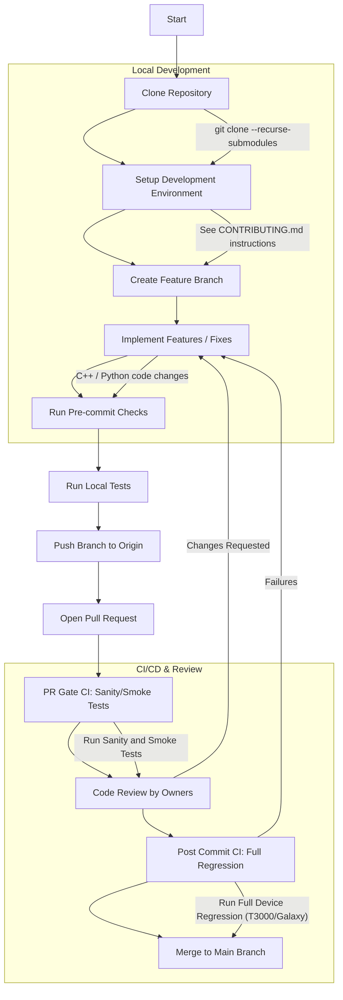
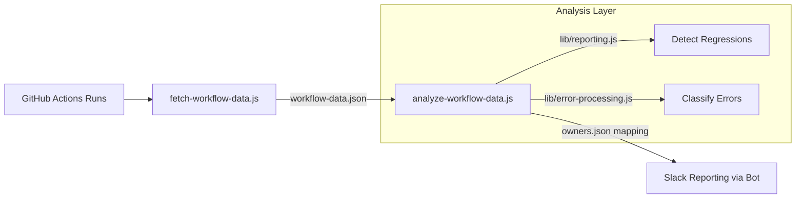
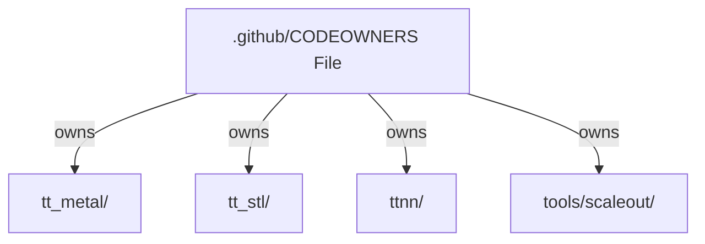
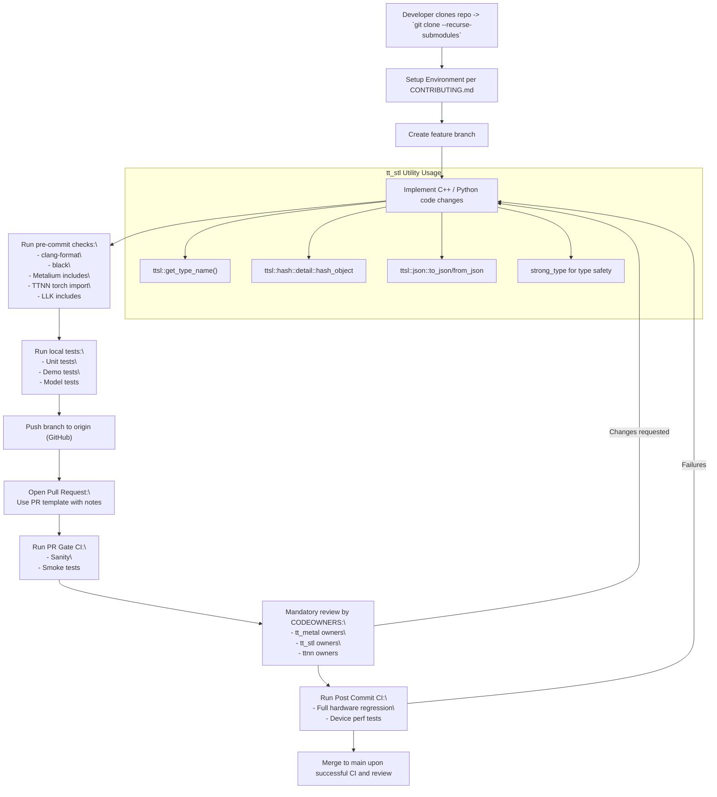

# Contributing Guidelines

Relevant source files
*   [.clang-tidy](https://github.com/tenstorrent/tt-metal/blob/f30f8df0/.clang-tidy)
*   [.github/CODEOWNERS](https://github.com/tenstorrent/tt-metal/blob/f30f8df0/.github/CODEOWNERS)
*   [.github/pull_request_template.md](https://github.com/tenstorrent/tt-metal/blob/f30f8df0/.github/pull_request_template.md?plain=1)
*   [.github/workflows/all-model-tests.yaml](https://github.com/tenstorrent/tt-metal/blob/f30f8df0/.github/workflows/all-model-tests.yaml)
*   [.github/workflows/fast-dispatch-full-regressions-and-models-impl.yaml](https://github.com/tenstorrent/tt-metal/blob/f30f8df0/.github/workflows/fast-dispatch-full-regressions-and-models-impl.yaml)
*   [.github/workflows/fast-dispatch-full-regressions-and-models.yaml](https://github.com/tenstorrent/tt-metal/blob/f30f8df0/.github/workflows/fast-dispatch-full-regressions-and-models.yaml)
*   [.github/workflows/galaxy-deepseek-tests-impl.yaml](https://github.com/tenstorrent/tt-metal/blob/f30f8df0/.github/workflows/galaxy-deepseek-tests-impl.yaml)
*   [.github/workflows/galaxy-deepseek-tests.yaml](https://github.com/tenstorrent/tt-metal/blob/f30f8df0/.github/workflows/galaxy-deepseek-tests.yaml)
*   [.github/workflows/galaxy-demo-tests-impl.yaml](https://github.com/tenstorrent/tt-metal/blob/f30f8df0/.github/workflows/galaxy-demo-tests-impl.yaml)
*   [.github/workflows/galaxy-demo-tests.yaml](https://github.com/tenstorrent/tt-metal/blob/f30f8df0/.github/workflows/galaxy-demo-tests.yaml)
*   [.github/workflows/galaxy-profiler-tests.yaml](https://github.com/tenstorrent/tt-metal/blob/f30f8df0/.github/workflows/galaxy-profiler-tests.yaml)
*   [.github/workflows/galaxy-stress-tests-impl.yaml](https://github.com/tenstorrent/tt-metal/blob/f30f8df0/.github/workflows/galaxy-stress-tests-impl.yaml)
*   [.github/workflows/galaxy-stress-tests.yaml](https://github.com/tenstorrent/tt-metal/blob/f30f8df0/.github/workflows/galaxy-stress-tests.yaml)
*   [.github/workflows/galaxy-unit-tests-impl.yaml](https://github.com/tenstorrent/tt-metal/blob/f30f8df0/.github/workflows/galaxy-unit-tests-impl.yaml)
*   [.github/workflows/galaxy-unit-tests.yaml](https://github.com/tenstorrent/tt-metal/blob/f30f8df0/.github/workflows/galaxy-unit-tests.yaml)
*   [.github/workflows/metal-run-microbenchmarks.yaml](https://github.com/tenstorrent/tt-metal/blob/f30f8df0/.github/workflows/metal-run-microbenchmarks.yaml)
*   [.github/workflows/perf-device-models-impl.yaml](https://github.com/tenstorrent/tt-metal/blob/f30f8df0/.github/workflows/perf-device-models-impl.yaml)
*   [.github/workflows/perf-device-models.yaml](https://github.com/tenstorrent/tt-metal/blob/f30f8df0/.github/workflows/perf-device-models.yaml)
*   [.github/workflows/perf-models-impl.yaml](https://github.com/tenstorrent/tt-metal/blob/f30f8df0/.github/workflows/perf-models-impl.yaml)
*   [.github/workflows/perf-models.yaml](https://github.com/tenstorrent/tt-metal/blob/f30f8df0/.github/workflows/perf-models.yaml)
*   [.github/workflows/pipeline-select-galaxy.yaml](https://github.com/tenstorrent/tt-metal/blob/f30f8df0/.github/workflows/pipeline-select-galaxy.yaml)
*   [.github/workflows/pipeline-select-t3k.yaml](https://github.com/tenstorrent/tt-metal/blob/f30f8df0/.github/workflows/pipeline-select-t3k.yaml)
*   [.github/workflows/pipeline-select.yaml](https://github.com/tenstorrent/tt-metal/blob/f30f8df0/.github/workflows/pipeline-select.yaml)
*   [.github/workflows/pr-description-inject-branch-name.yaml](https://github.com/tenstorrent/tt-metal/blob/f30f8df0/.github/workflows/pr-description-inject-branch-name.yaml)
*   [.github/workflows/single-card-demo-tests-impl.yaml](https://github.com/tenstorrent/tt-metal/blob/f30f8df0/.github/workflows/single-card-demo-tests-impl.yaml)
*   [.github/workflows/single-card-demo-tests.yaml](https://github.com/tenstorrent/tt-metal/blob/f30f8df0/.github/workflows/single-card-demo-tests.yaml)
*   [.github/workflows/t3000-demo-tests-impl.yaml](https://github.com/tenstorrent/tt-metal/blob/f30f8df0/.github/workflows/t3000-demo-tests-impl.yaml)
*   [.github/workflows/t3000-demo-tests.yaml](https://github.com/tenstorrent/tt-metal/blob/f30f8df0/.github/workflows/t3000-demo-tests.yaml)
*   [.github/workflows/t3000-e2e-tests.yaml](https://github.com/tenstorrent/tt-metal/blob/f30f8df0/.github/workflows/t3000-e2e-tests.yaml)
*   [.github/workflows/t3000-integration-tests.yaml](https://github.com/tenstorrent/tt-metal/blob/f30f8df0/.github/workflows/t3000-integration-tests.yaml)
*   [.github/workflows/t3000-perf-tests.yaml](https://github.com/tenstorrent/tt-metal/blob/f30f8df0/.github/workflows/t3000-perf-tests.yaml)
*   [.github/workflows/t3000-profiler-tests-impl.yaml](https://github.com/tenstorrent/tt-metal/blob/f30f8df0/.github/workflows/t3000-profiler-tests-impl.yaml)
*   [.github/workflows/t3000-profiler-tests.yaml](https://github.com/tenstorrent/tt-metal/blob/f30f8df0/.github/workflows/t3000-profiler-tests.yaml)
*   [.github/workflows/t3000-unit-tests-impl.yaml](https://github.com/tenstorrent/tt-metal/blob/f30f8df0/.github/workflows/t3000-unit-tests-impl.yaml)
*   [.github/workflows/t3000-unit-tests.yaml](https://github.com/tenstorrent/tt-metal/blob/f30f8df0/.github/workflows/t3000-unit-tests.yaml)
*   [.github/workflows/test-dispatch.yaml](https://github.com/tenstorrent/tt-metal/blob/f30f8df0/.github/workflows/test-dispatch.yaml)
*   [CONTRIBUTING.md](https://github.com/tenstorrent/tt-metal/blob/f30f8df0/CONTRIBUTING.md?plain=1)
*   [README.md](https://github.com/tenstorrent/tt-metal/blob/f30f8df0/README.md?plain=1)
*   [models/README.md](https://github.com/tenstorrent/tt-metal/blob/f30f8df0/models/README.md?plain=1)
*   [models/demos/deepseek_v3/README.md](https://github.com/tenstorrent/tt-metal/blob/f30f8df0/models/demos/deepseek_v3/README.md?plain=1)
*   [models/demos/deepseek_v3/tests/fused_op_unit_tests/mla/test_ds_mla.py](https://github.com/tenstorrent/tt-metal/blob/f30f8df0/models/demos/deepseek_v3/tests/fused_op_unit_tests/mla/test_ds_mla.py)
*   [models/demos/deepseek_v3/tests/fused_op_unit_tests/moe/test_ds_moe.py](https://github.com/tenstorrent/tt-metal/blob/f30f8df0/models/demos/deepseek_v3/tests/fused_op_unit_tests/moe/test_ds_moe.py)
*   [models/demos/deepseek_v3/tests/fused_op_unit_tests/run_ci_device_perf_tracy.sh](https://github.com/tenstorrent/tt-metal/blob/f30f8df0/models/demos/deepseek_v3/tests/fused_op_unit_tests/run_ci_device_perf_tracy.sh)
*   [models/demos/deepseek_v3/tests/test_compute_tg.py](https://github.com/tenstorrent/tt-metal/blob/f30f8df0/models/demos/deepseek_v3/tests/test_compute_tg.py)
*   [models/demos/deepseek_v3/tests/test_dispatch_tg.py](https://github.com/tenstorrent/tt-metal/blob/f30f8df0/models/demos/deepseek_v3/tests/test_dispatch_tg.py)
*   [models/demos/deepseek_v3/tests/test_optimized_moe_decode_block_tg.py](https://github.com/tenstorrent/tt-metal/blob/f30f8df0/models/demos/deepseek_v3/tests/test_optimized_moe_decode_block_tg.py)
*   [models/demos/llama3_70b_galaxy/PERF.md](https://github.com/tenstorrent/tt-metal/blob/f30f8df0/models/demos/llama3_70b_galaxy/PERF.md?plain=1)
*   [models/demos/llama3_70b_galaxy/README.md](https://github.com/tenstorrent/tt-metal/blob/f30f8df0/models/demos/llama3_70b_galaxy/README.md?plain=1)
*   [models/demos/multimodal/gemma3/README.md](https://github.com/tenstorrent/tt-metal/blob/f30f8df0/models/demos/multimodal/gemma3/README.md?plain=1)
*   [models/demos/t3000/llama3_70b/README.md](https://github.com/tenstorrent/tt-metal/blob/f30f8df0/models/demos/t3000/llama3_70b/README.md?plain=1)
*   [models/demos/t3000/llama3_70b/setup_llama.sh](https://github.com/tenstorrent/tt-metal/blob/f30f8df0/models/demos/t3000/llama3_70b/setup_llama.sh)
*   [models/demos/wormhole/qwen3_embedding_8b/demo/generator_vllm.py](https://github.com/tenstorrent/tt-metal/blob/f30f8df0/models/demos/wormhole/qwen3_embedding_8b/demo/generator_vllm.py)
*   [models/docs/MODEL_HYBRID_TP_DP.md](https://github.com/tenstorrent/tt-metal/blob/f30f8df0/models/docs/MODEL_HYBRID_TP_DP.md?plain=1)
*   [models/docs/MODEL_UPDATES.md](https://github.com/tenstorrent/tt-metal/blob/f30f8df0/models/docs/MODEL_UPDATES.md?plain=1)
*   [models/docs/model_bring_up.md](https://github.com/tenstorrent/tt-metal/blob/f30f8df0/models/docs/model_bring_up.md?plain=1)
*   [models/perf/merge_device_perf_results.py](https://github.com/tenstorrent/tt-metal/blob/f30f8df0/models/perf/merge_device_perf_results.py)
*   [releases/README.md](https://github.com/tenstorrent/tt-metal/blob/f30f8df0/releases/README.md?plain=1)
*   [scripts/tracing/.gitattributes](https://github.com/tenstorrent/tt-metal/blob/f30f8df0/scripts/tracing/.gitattributes)
*   [scripts/tracing/.gitignore](https://github.com/tenstorrent/tt-metal/blob/f30f8df0/scripts/tracing/.gitignore)
*   [scripts/tracing/README.md](https://github.com/tenstorrent/tt-metal/blob/f30f8df0/scripts/tracing/README.md?plain=1)
*   [scripts/tracing/context.txt](https://github.com/tenstorrent/tt-metal/blob/f30f8df0/scripts/tracing/context.txt)
*   [scripts/tracing/questions.txt](https://github.com/tenstorrent/tt-metal/blob/f30f8df0/scripts/tracing/questions.txt)
*   [scripts/tracing/run.py](https://github.com/tenstorrent/tt-metal/blob/f30f8df0/scripts/tracing/run.py)
*   [scripts/tracing/system-prompt.txt](https://github.com/tenstorrent/tt-metal/blob/f30f8df0/scripts/tracing/system-prompt.txt)
*   [tech_reports/Debugging/Kernel_Debugging_Tips.md](https://github.com/tenstorrent/tt-metal/blob/f30f8df0/tech_reports/Debugging/Kernel_Debugging_Tips.md?plain=1)
*   [tech_reports/LLMs/vLLM_integration.md](https://github.com/tenstorrent/tt-metal/blob/f30f8df0/tech_reports/LLMs/vLLM_integration.md?plain=1)
*   [tests/.clang-tidy](https://github.com/tenstorrent/tt-metal/blob/f30f8df0/tests/.clang-tidy)
*   [tests/pipeline_reorg/t3k_demo_tests.yaml](https://github.com/tenstorrent/tt-metal/blob/f30f8df0/tests/pipeline_reorg/t3k_demo_tests.yaml)
*   [tests/pipeline_reorg/t3k_integration_tests.yaml](https://github.com/tenstorrent/tt-metal/blob/f30f8df0/tests/pipeline_reorg/t3k_integration_tests.yaml)
*   [tests/pipeline_reorg/t3k_perf_tests.yaml](https://github.com/tenstorrent/tt-metal/blob/f30f8df0/tests/pipeline_reorg/t3k_perf_tests.yaml)
*   [tests/scripts/run_python_model_tests.sh](https://github.com/tenstorrent/tt-metal/blob/f30f8df0/tests/scripts/run_python_model_tests.sh)
*   [tests/scripts/single_card/run_single_card_demo_tests.sh](https://github.com/tenstorrent/tt-metal/blob/f30f8df0/tests/scripts/single_card/run_single_card_demo_tests.sh)
*   [tests/scripts/t3000/run_t3000_demo_tests.sh](https://github.com/tenstorrent/tt-metal/blob/f30f8df0/tests/scripts/t3000/run_t3000_demo_tests.sh)
*   [tests/scripts/t3000/run_t3000_integration_tests.sh](https://github.com/tenstorrent/tt-metal/blob/f30f8df0/tests/scripts/t3000/run_t3000_integration_tests.sh)
*   [tests/scripts/t3000/run_t3000_perf_tests.sh](https://github.com/tenstorrent/tt-metal/blob/f30f8df0/tests/scripts/t3000/run_t3000_perf_tests.sh)
*   [tests/scripts/t3000/run_t3000_perplexity_tests.sh](https://github.com/tenstorrent/tt-metal/blob/f30f8df0/tests/scripts/t3000/run_t3000_perplexity_tests.sh)
*   [tests/scripts/t3000/run_t3000_unit_tests.sh](https://github.com/tenstorrent/tt-metal/blob/f30f8df0/tests/scripts/t3000/run_t3000_unit_tests.sh)
*   [tests/scripts/tg/run_tg_frequent_tests.sh](https://github.com/tenstorrent/tt-metal/blob/f30f8df0/tests/scripts/tg/run_tg_frequent_tests.sh)
*   [tests/scripts/wh_6u/run_wh_6u_profiler_tests.sh](https://github.com/tenstorrent/tt-metal/blob/f30f8df0/tests/scripts/wh_6u/run_wh_6u_profiler_tests.sh)
*   [tests/tt_metal/tt_metal/api/test_shape.cpp](https://github.com/tenstorrent/tt-metal/blob/f30f8df0/tests/tt_metal/tt_metal/api/test_shape.cpp)
*   [tests/ttnn/unit_tests/gtests/ccl/test_sharded_address_generators.cpp](https://github.com/tenstorrent/tt-metal/blob/f30f8df0/tests/ttnn/unit_tests/gtests/ccl/test_sharded_address_generators.cpp)
*   [tt_metal/api/tt-metalium/shape.hpp](https://github.com/tenstorrent/tt-metal/blob/f30f8df0/tt_metal/api/tt-metalium/shape.hpp)
*   [tt_metal/api/tt-metalium/shape_base.hpp](https://github.com/tenstorrent/tt-metal/blob/f30f8df0/tt_metal/api/tt-metalium/shape_base.hpp)
*   [tt_metal/common/multi_producer_single_consumer_queue.hpp](https://github.com/tenstorrent/tt-metal/blob/f30f8df0/tt_metal/common/multi_producer_single_consumer_queue.hpp)
*   [tt_metal/common/shape.cpp](https://github.com/tenstorrent/tt-metal/blob/f30f8df0/tt_metal/common/shape.cpp)
*   [tt_metal/common/shape_base.cpp](https://github.com/tenstorrent/tt-metal/blob/f30f8df0/tt_metal/common/shape_base.cpp)
*   [tt_metal/fabric/fabric_vc2_connection.cpp](https://github.com/tenstorrent/tt-metal/blob/f30f8df0/tt_metal/fabric/fabric_vc2_connection.cpp)
*   [tt_metal/impl/buffers/semaphore.cpp](https://github.com/tenstorrent/tt-metal/blob/f30f8df0/tt_metal/impl/buffers/semaphore.cpp)
*   [tt_metal/impl/buffers/semaphore.hpp](https://github.com/tenstorrent/tt-metal/blob/f30f8df0/tt_metal/impl/buffers/semaphore.hpp)
*   [tt_metal/llrt/sanitize_noc_host.hpp](https://github.com/tenstorrent/tt-metal/blob/f30f8df0/tt_metal/llrt/sanitize_noc_host.hpp)
*   [tt_metal/llrt/tt_elffile.cpp](https://github.com/tenstorrent/tt-metal/blob/f30f8df0/tt_metal/llrt/tt_elffile.cpp)
*   [tt_metal/llrt/tt_elffile.hpp](https://github.com/tenstorrent/tt-metal/blob/f30f8df0/tt_metal/llrt/tt_elffile.hpp)
*   [tt_metal/llrt/tt_memory.cpp](https://github.com/tenstorrent/tt-metal/blob/f30f8df0/tt_metal/llrt/tt_memory.cpp)
*   [tt_metal/llrt/tt_memory.h](https://github.com/tenstorrent/tt-metal/blob/f30f8df0/tt_metal/llrt/tt_memory.h)
*   [tt_stl/.clang-tidy](https://github.com/tenstorrent/tt-metal/blob/f30f8df0/tt_stl/.clang-tidy)
*   [tt_stl/CMakeLists.txt](https://github.com/tenstorrent/tt-metal/blob/f30f8df0/tt_stl/CMakeLists.txt)
*   [tt_stl/tests/CMakeLists.txt](https://github.com/tenstorrent/tt-metal/blob/f30f8df0/tt_stl/tests/CMakeLists.txt)
*   [tt_stl/tests/test_reflection.cpp](https://github.com/tenstorrent/tt-metal/blob/f30f8df0/tt_stl/tests/test_reflection.cpp)
*   [tt_stl/tests/test_tt_pause.cpp](https://github.com/tenstorrent/tt-metal/blob/f30f8df0/tt_stl/tests/test_tt_pause.cpp)
*   [tt_stl/tt_stl/indestructible.hpp](https://github.com/tenstorrent/tt-metal/blob/f30f8df0/tt_stl/tt_stl/indestructible.hpp)
*   [tt_stl/tt_stl/llvm/llvm_small_vector.cpp](https://github.com/tenstorrent/tt-metal/blob/f30f8df0/tt_stl/tt_stl/llvm/llvm_small_vector.cpp)
*   [tt_stl/tt_stl/llvm/llvm_small_vector.hpp](https://github.com/tenstorrent/tt-metal/blob/f30f8df0/tt_stl/tt_stl/llvm/llvm_small_vector.hpp)
*   [tt_stl/tt_stl/llvm/memory_alloc.hpp](https://github.com/tenstorrent/tt-metal/blob/f30f8df0/tt_stl/tt_stl/llvm/memory_alloc.hpp)
*   [tt_stl/tt_stl/reflection.hpp](https://github.com/tenstorrent/tt-metal/blob/f30f8df0/tt_stl/tt_stl/reflection.hpp)
*   [tt_stl/tt_stl/tt_pause.hpp](https://github.com/tenstorrent/tt-metal/blob/f30f8df0/tt_stl/tt_stl/tt_pause.hpp)
*   [tt_stl/tt_stl/unique_any.hpp](https://github.com/tenstorrent/tt-metal/blob/f30f8df0/tt_stl/tt_stl/unique_any.hpp)
*   [ttnn/api/ttnn/operation.hpp](https://github.com/tenstorrent/tt-metal/blob/f30f8df0/ttnn/api/ttnn/operation.hpp)
*   [ttnn/cpp/ttnn/operations/experimental/ccl/llama_reduce_scatter_matmul/device/rs_matmul_op.cpp](https://github.com/tenstorrent/tt-metal/blob/f30f8df0/ttnn/cpp/ttnn/operations/experimental/ccl/llama_reduce_scatter_matmul/device/rs_matmul_op.cpp)

This page documents the contribution workflow, code standards, testing requirements, and pull request process for the `tt-metal` repository. Contributors must follow these guidelines to ensure code quality and maintain project stability across the low-level Metalium and high-level TTNN layers.

* * *

## Contribution Workflow Overview

The contribution process is designed to ensure that every change is validated through static analysis, unit testing, and full hardware regression before reaching the `main` branch.

This flow ensures only thoroughly tested and reviewed code integrates into the main development line, preserving code quality for releases.

**Sources:**[CONTRIBUTING.md 50-70](https://github.com/tenstorrent/tt-metal/blob/f30f8df0/CONTRIBUTING.md?plain=1#L50-L70)[.github/workflows/sanity-tests.yaml 1-10](https://github.com/tenstorrent/tt-metal/blob/f30f8df0/.github/workflows/sanity-tests.yaml#L1-L10)

* * *




This flow ensures only thoroughly tested and reviewed code integrates into the main development line, preserving code quality for releases.
```
## Code Standards and Formatting

### Licensing and SPDX

Every source file must include an SPDX license header. This is validated by CI to ensure Apache-2.0 compliance.

*   **Python files** must have:

`# SPDX-FileCopyrightText: © 2024 Tenstorrent AI ULC# SPDX-License-Identifier: Apache-2.0`
*   **C++ files** require:

`// SPDX-FileCopyrightText: © 2024 Tenstorrent AI ULC// SPDX-License-Identifier: Apache-2.0`

Code failing this check will not pass CI and must be corrected before merging.

* * *

### C++ Coding Standards

We employ a strict `.clang-tidy` configuration that enforces modern C++ best practices to aid readability, maintainability, and prevent common errors.

| Category | Requirement | Configured Check / Rule |
| --- | --- | --- |
| Headers | Use `#pragma once` exclusively | `modernize-use-pragma-once`[.clang-tidy 18-21](https://github.com/tenstorrent/tt-metal/blob/f30f8df0/.clang-tidy#L18-L21) |
| Complexity | Cognitive complexity threshold 312 | `readability-function-cognitive-complexity`[.clang-tidy 181-182](https://github.com/tenstorrent/tt-metal/blob/f30f8df0/.clang-tidy#L181-L182) |
| Safety | Avoid C-style arrays, magic numbers, implicit narrowing | `cppcoreguidelines-avoid-c-arrays`, `readability-magic-numbers`[.clang-tidy 48-51](https://github.com/tenstorrent/tt-metal/blob/f30f8df0/.clang-tidy#L48-L51)[.clang-tidy 118](https://github.com/tenstorrent/tt-metal/blob/f30f8df0/.clang-tidy#L118-L118) |
| Performance | Avoid use of `std::endl` to prevent forced flush | `performance-avoid-endl`[.clang-tidy 36-39](https://github.com/tenstorrent/tt-metal/blob/f30f8df0/.clang-tidy#L36-L39) |

These checks run automatically via pre-commit hooks and CI.

* * *

### TT-STL Utilities and Best Practices

The repository includes a lightweight utility library `tt_stl` that provides modern C++ helper utilities aligned with Tenstorrent's infrastructure:

*   **Reflection**:

 Use `ttsl::get_type_name<T>()` to get type names at compile time.

 Use `ttsl::get_active_type_name_in_variant()` to debug variants.

 This is defined in `tt_stl/tt_stl/reflection.hpp`[tt_stl/tt_stl/reflection.hpp 38-56](https://github.com/tenstorrent/tt-metal/blob/f30f8df0/tt_stl/tt_stl/reflection.hpp#L38-L56)

*   **Object Hashing**:

 For a consistent and extensible hashing approach to objects, use `ttsl::hash::detail::hash_object` to implement hash functions.

 This allows polymorphic and custom types hashing [tt_stl/tt_stl/reflection.hpp 78-107](https://github.com/tenstorrent/tt-metal/blob/f30f8df0/tt_stl/tt_stl/reflection.hpp#L78-L107)

*   **JSON Serialization**:

 Utilities `to_json` and `from_json` helpers are defined under the `ttsl::json` namespace for seamless JSON integration, aiding config, and debugging [tt_stl/tt_stl/reflection.hpp 111-126](https://github.com/tenstorrent/tt-metal/blob/f30f8df0/tt_stl/tt_stl/reflection.hpp#L111-L126)

*   **Strong Typedefs for Type Safety**:

 Use `strong_type` wrappers to encode semantic units and prevent implicit conversions (e.g., distinguish `CoreCoord` from `Shape`). This protects API correctness and enforces self-documenting code.

 Example usage is in `tt_metal/common/shape.cpp` defining strong types for core coordinates [tt_metal/common/shape.cpp 11-20](https://github.com/tenstorrent/tt-metal/blob/f30f8df0/tt_metal/common/shape.cpp#L11-L20)

These utilities are encouraged to maintain consistency and leverage the Tenstorrent toolchain's strengths.

* * *

## Testing and CI Infrastructure

### Test Execution Scripts

Multiple shell scripts support running unit, integration, and demo tests locally or via CI on different hardware architectures.

| Script | Description | Target Hardware |
| --- | --- | --- |
| `run_t3000_unit_tests.sh` | Runs T3000-specific unit tests including distributed and dispatch tests | T3000 (Wormhole) [tests/scripts/t3000/run_t3000_unit_tests.sh 1-123](https://github.com/tenstorrent/tt-metal/blob/f30f8df0/tests/scripts/t3000/run_t3000_unit_tests.sh#L1-L123) |
| `run_single_card_demo_tests.sh` | Runs demos and performance tests for popular models (ResNet, BERT, SD, etc.) | N150, N300 [tests/scripts/single_card/run_single_card_demo_tests.sh 1-258](https://github.com/tenstorrent/tt-metal/blob/f30f8df0/tests/scripts/single_card/run_single_card_demo_tests.sh#L1-L258) |
| `run_python_model_tests.sh` | Executes Python-level model testing including PCC and performance | Wormhole/Blackhole [tests/scripts/run_python_model_tests.sh 1-83](https://github.com/tenstorrent/tt-metal/blob/f30f8df0/tests/scripts/run_python_model_tests.sh#L1-L83) |

These scripts set appropriate environment variables (e.g., `ARCH_NAME`, `TT_METAL_HOME`) and run python pytest commands or compiled test binaries.

* * *

### Hardware Test Integration and Automatic Triage

After tests run in GitHub Actions workflows, dedicated tooling collects result data, aggregates regressions, and maps errors to owners for faster triage.

The error analysis pipeline follows this structure:

This workflow detects flaky and persistent failures by analyzing test history and posting owner-tagged notifications to Slack channels, speeding up response times to failures.

**Sources:**

[.github/workflows/aggregate-workflow-data.yaml 1-109](https://github.com/tenstorrent/tt-metal/blob/f30f8df0/.github/workflows/aggregate-workflow-data.yaml#L1-L109)

[.github/actions/analyze-workflow-data/analyze-workflow-data.js 1-83](https://github.com/tenstorrent/tt-metal/blob/f30f8df0/.github/actions/analyze-workflow-data/analyze-workflow-data.js#L1-L83)

[.github/actions/analyze-workflow-data/lib/error-processing.js 1-50](https://github.com/tenstorrent/tt-metal/blob/f30f8df0/.github/actions/analyze-workflow-data/lib/error-processing.js#L1-L50)

* * *




This workflow detects flaky and persistent failures by analyzing test history and posting owner-tagged notifications to Slack channels, speeding up response times to failures.
```
## CODEOWNERS and Review Process

The repository defines mandatory code owners with subdirectory granularity, ensuring subject matter experts review changes in their areas.

The `.github/CODEOWNERS` file contains mappings like:

| Directory / File Pattern | Owners / Teams |
| --- | --- |
| `tt_metal/` | `@tenstorrent/metalium-api-owners` |
| `tt_stl/` | `@ayerofieiev-tt`, `@akerteszTT`, `@riverwuTT` |
| `ttnn/` | `@tenstorrent/ttnn-owners` |
| `tools/scaleout/` | `@tt-aho`, `@tt-asaigal`, `@aliuTT` |

This enforces review discipline for critical low-level runtime code, standard library utilities, neural network operations, and scale-out tools.

A partial structure visualization:

Additionally, a GitHub Action `.github/workflows/pr-description-inject-branch-name.yaml` automates filling PR descriptions with branch names and status badges, streamlining reviewer context.

**Sources:**[.github/CODEOWNERS 1-53860](https://github.com/tenstorrent/tt-metal/blob/f30f8df0/.github/CODEOWNERS#L1-L53860)[.github/workflows/pr-description-inject-branch-name.yaml 33-45](https://github.com/tenstorrent/tt-metal/blob/f30f8df0/.github/workflows/pr-description-inject-branch-name.yaml#L33-L45)

* * *




Additionally, a GitHub Action `.github/workflows/pr-description-inject-branch-name.yaml` automates filling PR descriptions with branch names and status badges, streamlining reviewer context.
```
## Pull Request Requirements

Contributors must ensure the following checks and policies are fulfilled before a PR can be merged:

1.   **PR Template Compliance:**

 Use the `pull_request_template.md` to provide meaningful summary information and specify notes for reviewers. This allows standardized submission of change rationale and review context [.github/pull_request_template.md 1-12](https://github.com/tenstorrent/tt-metal/blob/f30f8df0/.github/pull_request_template.md?plain=1#L1-L12)

2.   **Pre-commit Hooks:**

 Run and pass local `pre-commit` checks before pushing changes. Installed checks include:

    *   `trailing-whitespace`, `black` (Python formatting), `clang-format` (C++ formatting)
    *   Specialized hooks: 
        *   Metalium: header includes validation and deprecation checks
        *   TTNN: disallow global torch imports and frozen source modifications
        *   LLK: fix `cstdint` includes and enforce formatting within `tt_metal/tt-llk/`

These hooks enforce style and guard against common errors [.pre-commit-config.yaml 1-153](https://github.com/tenstorrent/tt-metal/blob/f30f8df0/.pre-commit-config.yaml#L1-L153)

3.   **Notebook Documentation:**

 Any modified `.ipynb` notebooks in `ttnn/tutorials` must be updated alongside their generated `.py` scripts. A pre-commit hook auto-generates `.py` from `.ipynb` ensuring documentation consistency [CONTRIBUTING.md 93-107](https://github.com/tenstorrent/tt-metal/blob/f30f8df0/CONTRIBUTING.md?plain=1#L93-L107)

4.   **Deprecated Patterns:**

 The use of `InterleavedAddrGen` for address generation is deprecated in favor of `TensorAccessor`. Pull requests that introduce this old pattern in changed files will be rejected by CI gates [.github/workflows/sanity-tests.yaml 123-185](https://github.com/tenstorrent/tt-metal/blob/f30f8df0/.github/workflows/sanity-tests.yaml#L123-L185)

* * *

## Summary Diagram: Contribution and Review Process Expanded with Code Entities

* * *




---
```
## References for Key Files

| Purpose | File / Location |
| --- | --- |
| Code Ownership and Review Groups | `.github/CODEOWNERS`[](https://github.com/tenstorrent/tt-metal/blob/f30f8df0/#LNaN-LNaN) |
| Static Analysis Configuration | `.clang-tidy`[.clang-tidy 1-198](https://github.com/tenstorrent/tt-metal/blob/f30f8df0/.clang-tidy#L1-L198) |
| Pre-commit Hook Configurations | `.pre-commit-config.yaml`[.pre-commit-config.yaml 1-153](https://github.com/tenstorrent/tt-metal/blob/f30f8df0/.pre-commit-config.yaml#L1-L153) |
| TT-STL Reflections and JSON Utilities | `tt_stl/tt_stl/reflection.hpp`[tt_stl/tt_stl/reflection.hpp 1-126](https://github.com/tenstorrent/tt-metal/blob/f30f8df0/tt_stl/tt_stl/reflection.hpp#L1-L126) |
| Strong Type Definitions | `tt_metal/common/shape.cpp`[tt_metal/common/shape.cpp 11-20](https://github.com/tenstorrent/tt-metal/blob/f30f8df0/tt_metal/common/shape.cpp#L11-L20) |
| Test Running Scripts | `tests/scripts/t3000/run_t3000_unit_tests.sh`[tests/scripts/t3000/run_t3000_unit_tests.sh 1-123](https://github.com/tenstorrent/tt-metal/blob/f30f8df0/tests/scripts/t3000/run_t3000_unit_tests.sh#L1-L123)`tests/scripts/single_card/run_single_card_demo_tests.sh`[tests/scripts/single_card/run_single_card_demo_tests.sh 1-258](https://github.com/tenstorrent/tt-metal/blob/f30f8df0/tests/scripts/single_card/run_single_card_demo_tests.sh#L1-L258) |
| PR Template | `.github/pull_request_template.md`[.github/pull_request_template.md 1-12](https://github.com/tenstorrent/tt-metal/blob/f30f8df0/.github/pull_request_template.md?plain=1#L1-L12) |
| Workflow Automated PR Description | `.github/workflows/pr-description-inject-branch-name.yaml`[.github/workflows/pr-description-inject-branch-name.yaml 33-45](https://github.com/tenstorrent/tt-metal/blob/f30f8df0/.github/workflows/pr-description-inject-branch-name.yaml#L33-L45) |

* * *

This guide exists to foster high-quality, maintainable contributions with rigorous review and testing discipline. Following these standards enables the `tt-metal` project to maintain reliability across evolving device and model support.

**Sources:**

[CONTRIBUTING.md 50-107](https://github.com/tenstorrent/tt-metal/blob/f30f8df0/CONTRIBUTING.md?plain=1#L50-L107)

[.clang-tidy 1-198](https://github.com/tenstorrent/tt-metal/blob/f30f8df0/.clang-tidy#L1-L198)

[tt_stl/tt_stl/reflection.hpp 1-126](https://github.com/tenstorrent/tt-metal/blob/f30f8df0/tt_stl/tt_stl/reflection.hpp#L1-L126)

[tt_metal/common/shape.cpp 11-20](https://github.com/tenstorrent/tt-metal/blob/f30f8df0/tt_metal/common/shape.cpp#L11-L20)

[tests/scripts/t3000/run_t3000_unit_tests.sh 1-123](https://github.com/tenstorrent/tt-metal/blob/f30f8df0/tests/scripts/t3000/run_t3000_unit_tests.sh#L1-L123)

[tests/scripts/single_card/run_single_card_demo_tests.sh 1-258](https://github.com/tenstorrent/tt-metal/blob/f30f8df0/tests/scripts/single_card/run_single_card_demo_tests.sh#L1-L258)

[.github/CODEOWNERS 1-53860](https://github.com/tenstorrent/tt-metal/blob/f30f8df0/.github/CODEOWNERS#L1-L53860)

[.pre-commit-config.yaml 1-153](https://github.com/tenstorrent/tt-metal/blob/f30f8df0/.pre-commit-config.yaml#L1-L153)

[.github/pull_request_template.md 1-12](https://github.com/tenstorrent/tt-metal/blob/f30f8df0/.github/pull_request_template.md?plain=1#L1-L12)

[.github/workflows/pr-description-inject-branch-name.yaml 33-45](https://github.com/tenstorrent/tt-metal/blob/f30f8df0/.github/workflows/pr-description-inject-branch-name.yaml#L33-L45)

Dismiss
Refresh this wiki

Enter email to refresh
