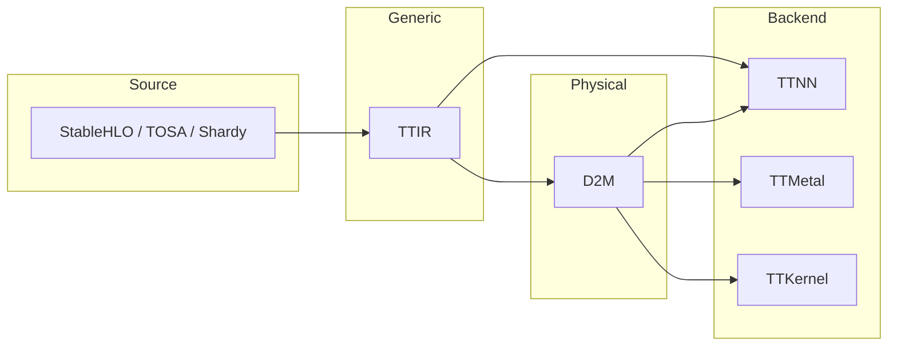

# Overview

Relevant source files
*   [.gitignore](https://github.com/tenstorrent/tt-mlir/blob/c7d92e92/.gitignore)
*   [CMakeLists.txt](https://github.com/tenstorrent/tt-mlir/blob/c7d92e92/CMakeLists.txt)
*   [README.md](https://github.com/tenstorrent/tt-mlir/blob/c7d92e92/README.md?plain=1)
*   [docs/src/SUMMARY.md](https://github.com/tenstorrent/tt-mlir/blob/c7d92e92/docs/src/SUMMARY.md?plain=1)
*   [docs/src/adding-an-op.md](https://github.com/tenstorrent/tt-mlir/blob/c7d92e92/docs/src/adding-an-op.md?plain=1)
*   [docs/src/emitc-testing.md](https://github.com/tenstorrent/tt-mlir/blob/c7d92e92/docs/src/emitc-testing.md?plain=1)
*   [docs/src/lit-testing.md](https://github.com/tenstorrent/tt-mlir/blob/c7d92e92/docs/src/lit-testing.md?plain=1)
*   [docs/src/overview.md](https://github.com/tenstorrent/tt-mlir/blob/c7d92e92/docs/src/overview.md?plain=1)
*   [docs/src/specs/runtime-stitching.md](https://github.com/tenstorrent/tt-mlir/blob/c7d92e92/docs/src/specs/runtime-stitching.md?plain=1)
*   [docs/src/specs/specs.md](https://github.com/tenstorrent/tt-mlir/blob/c7d92e92/docs/src/specs/specs.md?plain=1)
*   [docs/src/testing.md](https://github.com/tenstorrent/tt-mlir/blob/c7d92e92/docs/src/testing.md?plain=1)
*   [docs/src/tools.md](https://github.com/tenstorrent/tt-mlir/blob/c7d92e92/docs/src/tools.md?plain=1)
*   [docs/src/ttnn-standalone.md](https://github.com/tenstorrent/tt-mlir/blob/c7d92e92/docs/src/ttnn-standalone.md?plain=1)
*   [docs/theme/highlight.js](https://github.com/tenstorrent/tt-mlir/blob/c7d92e92/docs/theme/highlight.js)
*   [env/CMakeLists.txt](https://github.com/tenstorrent/tt-mlir/blob/c7d92e92/env/CMakeLists.txt)
*   [env/activate](https://github.com/tenstorrent/tt-mlir/blob/c7d92e92/env/activate)
*   [env/activate.fish](https://github.com/tenstorrent/tt-mlir/blob/c7d92e92/env/activate.fish)
*   [env/patches/shardy.patch](https://github.com/tenstorrent/tt-mlir/blob/c7d92e92/env/patches/shardy.patch)
*   [include/ttmlir/CMakeLists.txt](https://github.com/tenstorrent/tt-mlir/blob/c7d92e92/include/ttmlir/CMakeLists.txt)
*   [include/ttmlir/Conversion/CMakeLists.txt](https://github.com/tenstorrent/tt-mlir/blob/c7d92e92/include/ttmlir/Conversion/CMakeLists.txt)
*   [include/ttmlir/Conversion/Passes.h](https://github.com/tenstorrent/tt-mlir/blob/c7d92e92/include/ttmlir/Conversion/Passes.h)
*   [include/ttmlir/Conversion/Passes.td](https://github.com/tenstorrent/tt-mlir/blob/c7d92e92/include/ttmlir/Conversion/Passes.td)
*   [include/ttmlir/Conversion/TTNNToEmitC/TTNNToEmitC.h](https://github.com/tenstorrent/tt-mlir/blob/c7d92e92/include/ttmlir/Conversion/TTNNToEmitC/TTNNToEmitC.h)
*   [lib/CMakeLists.txt](https://github.com/tenstorrent/tt-mlir/blob/c7d92e92/lib/CMakeLists.txt)
*   [lib/Conversion/CMakeLists.txt](https://github.com/tenstorrent/tt-mlir/blob/c7d92e92/lib/Conversion/CMakeLists.txt)
*   [lib/Conversion/TTNNToEmitC/CMakeLists.txt](https://github.com/tenstorrent/tt-mlir/blob/c7d92e92/lib/Conversion/TTNNToEmitC/CMakeLists.txt)
*   [lib/Dialect/TTNN/Transforms/TTNNToCpp.cpp](https://github.com/tenstorrent/tt-mlir/blob/c7d92e92/lib/Dialect/TTNN/Transforms/TTNNToCpp.cpp)
*   [lib/RegisterAll.cpp](https://github.com/tenstorrent/tt-mlir/blob/c7d92e92/lib/RegisterAll.cpp)
*   [test/ttmlir/Dialect/StableHLO/shardy/op_propagation_registry/gather_2d_mesh.mlir](https://github.com/tenstorrent/tt-mlir/blob/c7d92e92/test/ttmlir/Dialect/StableHLO/shardy/op_propagation_registry/gather_2d_mesh.mlir)
*   [test/ttmlir/EmitC/TTNN/matmul/matmul.mlir](https://github.com/tenstorrent/tt-mlir/blob/c7d92e92/test/ttmlir/EmitC/TTNN/matmul/matmul.mlir)
*   [tools/ttmlir-opt/CMakeLists.txt](https://github.com/tenstorrent/tt-mlir/blob/c7d92e92/tools/ttmlir-opt/CMakeLists.txt)
*   [tools/ttnn-standalone/ci_compile_dylib.py](https://github.com/tenstorrent/tt-mlir/blob/c7d92e92/tools/ttnn-standalone/ci_compile_dylib.py)
*   [tools/ttnn-standalone/emitc_compiler.py](https://github.com/tenstorrent/tt-mlir/blob/c7d92e92/tools/ttnn-standalone/emitc_compiler.py)

## What is tt-mlir?

`tt-mlir` is an MLIR-based compiler infrastructure designed to translate machine learning models into optimized executable programs for Tenstorrent AI accelerator hardware. The system ingests models from high-level frameworks like PyTorch and JAX (primarily via the StableHLO dialect), performs hardware-specific optimizations, and generates executable binaries or C++ code targeting Tenstorrent's Wormhole and Blackhole architectures [README.md 17-34](https://github.com/tenstorrent/tt-mlir/blob/c7d92e92/README.md?plain=1#L17-L34)

**Core Architecture**: The project defines a series of custom MLIR dialects that provide progressive levels of abstraction:

*   **TTCore**: The foundational dialect providing common types (like `ttcore.tile`) and attributes used across the stack [lib/RegisterAll.cpp 14-16](https://github.com/tenstorrent/tt-mlir/blob/c7d92e92/lib/RegisterAll.cpp#L14-L16)
*   **TTIR**: Hardware-agnostic Tenstorrent Intermediate Representation serving as the initial entry point for frontends. It defines operations like `ttir.matmul`, `ttir.pooling`, and `ttir.to_layout`[docs/src/adding-an-op.md 41-54](https://github.com/tenstorrent/tt-mlir/blob/c7d92e92/docs/src/adding-an-op.md?plain=1#L41-L54)
*   **TTNN**: A dialect for neural network operations that maps to the high-level `ttnn` library. It includes device management, memory configuration, and optimized kernels [lib/RegisterAll.cpp 88](https://github.com/tenstorrent/tt-mlir/blob/c7d92e92/lib/RegisterAll.cpp#L88-L88)
*   **D2M (Data-to-Metal)**: Device-aware transformations that model grid-based execution, tiled data movement, and stream management [include/ttmlir/Conversion/Passes.td 65-108](https://github.com/tenstorrent/tt-mlir/blob/c7d92e92/include/ttmlir/Conversion/Passes.td#L65-L108)
*   **TTKernel & SFPI**: Low-level dialects for hardware kernel primitives (FPU/SFPU) and direct hardware access via the SFPU Programming Interface (SFPI) [lib/RegisterAll.cpp 89-92](https://github.com/tenstorrent/tt-mlir/blob/c7d92e92/lib/RegisterAll.cpp#L89-L92)
*   **Debug & EmitPy**: Dialects supporting compiler instrumentation and Python-based constant evaluation or "golden" mode execution [lib/RegisterAll.cpp 100-101](https://github.com/tenstorrent/tt-mlir/blob/c7d92e92/lib/RegisterAll.cpp#L100-L101)

**Execution Backends**: The compiler supports multiple execution paths:

*   **TTNN Path**: High-level neural network operations optimized for the `ttnn` library [include/ttmlir/Conversion/Passes.td 54-55](https://github.com/tenstorrent/tt-mlir/blob/c7d92e92/include/ttmlir/Conversion/Passes.td#L54-L55)
*   **TTMetal Path**: Low-level kernel control with explicit device management via the `tt-metal` library [include/ttmlir/Conversion/Passes.td 56-57](https://github.com/tenstorrent/tt-mlir/blob/c7d92e92/include/ttmlir/Conversion/Passes.td#L56-L57)

**Output Formats**:

*   **Flatbuffer binaries**: Serialized programs for runtime execution (`.ttnn` and `.ttm` files) [docs/src/adding-an-op.md 19-23](https://github.com/tenstorrent/tt-mlir/blob/c7d92e92/docs/src/adding-an-op.md?plain=1#L19-L23)[.gitignore 39-41](https://github.com/tenstorrent/tt-mlir/blob/c7d92e92/.gitignore#L39-L41)
*   **EmitC**: Generated C++ code for integration into standalone applications, managed via `ttnn-standalone`[lib/Conversion/TTNNToEmitC/CMakeLists.txt 1-19](https://github.com/tenstorrent/tt-mlir/blob/c7d92e92/lib/Conversion/TTNNToEmitC/CMakeLists.txt#L1-L19)
*   **EmitPy**: Python code generation for "golden" validation and constant evaluation [lib/RegisterAll.cpp 100](https://github.com/tenstorrent/tt-mlir/blob/c7d92e92/lib/RegisterAll.cpp#L100-L100)

Sources: [README.md 17-34](https://github.com/tenstorrent/tt-mlir/blob/c7d92e92/README.md?plain=1#L17-L34)[docs/src/adding-an-op.md 41-115](https://github.com/tenstorrent/tt-mlir/blob/c7d92e92/docs/src/adding-an-op.md?plain=1#L41-L115)[include/ttmlir/Conversion/Passes.td 45-124](https://github.com/tenstorrent/tt-mlir/blob/c7d92e92/include/ttmlir/Conversion/Passes.td#L45-L124)[lib/RegisterAll.cpp 85-100](https://github.com/tenstorrent/tt-mlir/blob/c7d92e92/lib/RegisterAll.cpp#L85-L100)

## Documentation Roadmap

This wiki is organized into the following sections:

| Section | Purpose |
| --- | --- |
| **[Architecture Overview](https://deepwiki.com/tenstorrent/tt-mlir/1.1-architecture-overview)** | Multi-level compilation pipeline, dialect hierarchy (TTCore, TTIR, TTNN, etc.), and backend divergence details. |
| **[System Requirements and Setup](https://deepwiki.com/tenstorrent/tt-mlir/1.2-system-requirements-and-setup)** | Build dependencies, environment setup via `env/activate`, and `tt-metal` integration. |
| **[Core MLIR Dialects](https://deepwiki.com/tenstorrent/tt-mlir/2-core-mlir-dialects)** | Specifications for TTIR, TTNN, TTKernel, D2M dialects, and the custom Type System. |
| **[Compilation Pipelines](https://deepwiki.com/tenstorrent/tt-mlir/3-compilation-pipelines)** | Frontend ingestion (StableHLO), conversion passes (TTIR to TTNN/TTMetal), and serialization. |
| **[Runtime System](https://deepwiki.com/tenstorrent/tt-mlir/4-runtime-system)** | Binary loading, program execution flow, and device/tensor management. |
| **[Performance and Optimization](https://deepwiki.com/tenstorrent/tt-mlir/5-performance-and-optimization)** | OpModel analysis, layout optimization, and hardware workarounds. |
| **[Testing and Validation](https://deepwiki.com/tenstorrent/tt-mlir/6-testing-and-validation)** | Builder framework, golden testing, silicon validation, and CI/CD automation. |
| **[Build System and Development](https://deepwiki.com/tenstorrent/tt-mlir/7-build-system-and-development)** | CMake configuration, Python bindings, and Docker environments. |
| **[Tools and Utilities](https://deepwiki.com/tenstorrent/tt-mlir/8-tools-and-utilities)** | Compiler drivers (`ttmlir-opt`), runtime tools (`ttrt`), and visualization (`tt-explorer`). |
| **[Advanced Features](https://deepwiki.com/tenstorrent/tt-mlir/9-advanced-features)** | JIT compilation (`ttnn-jit`), PyKernel DSL, and distributed execution. |

Sources: [docs/src/SUMMARY.md 1-56](https://github.com/tenstorrent/tt-mlir/blob/c7d92e92/docs/src/SUMMARY.md?plain=1#L1-L56)[lib/CMakeLists.txt 1-17](https://github.com/tenstorrent/tt-mlir/blob/c7d92e92/lib/CMakeLists.txt#L1-L17)[env/activate 1-32](https://github.com/tenstorrent/tt-mlir/blob/c7d92e92/env/activate#L1-L32)

## High-Level System Architecture

```mermaid
graph TB
    subgraph Frontends ["Natural Language Space: Model Input"]
        PyTorch["PyTorch / JAX / StableHLO"]
    end

    subgraph Dialects ["Code Entity Space: MLIR Dialects"]
        StableHLO["mlir::stablehlo::StablehloDialect"]
        Sdy["mlir::sdy::SdyDialect"]
        TTIR["mlir::tt::ttir::TTIRDialect"]
        D2M["mlir::tt::d2m::D2MDialect"]
        TTNN["mlir::tt::ttnn::TTNNDialect"]
    end

    subgraph Tools ["Code Entity Space: Compiler Tools"]
        Opt["ttmlir-opt"]
        Translate["ttmlir-translate"]
    end

    subgraph Targets ["Code Entity Space: Serialization"]
        FB["Flatbuffer Target"]
        EC["mlir::emitc::EmitCDialect"]
    end

    PyTorch --> StableHLO
    StableHLO --> Sdy
    Sdy --> ["ConvertStableHLOToTTIR"] TTIR
    TTIR --> ["TTIRToD2M"] D2M
    TTIR --> ["ConvertTTIRToTTNN"] TTNN
    
    TTNN --> ["TTNNToFlatbuffer"] FB
    TTNN --> ["TTNNToEmitC"] EC
    
    Opt -.-> Dialects
    Translate -.-> Targets
```

Sources: [include/ttmlir/Conversion/Passes.td:11-20](), [include/ttmlir/Conversion/Passes.td:65-108](), [lib/RegisterAll.cpp:85-106](), [lib/Conversion/TTNNToEmitC/CMakeLists.txt:1-19]()
```


The following diagram bridges the natural language concepts of the compilation flow to the specific code entities and dialects used in the repository.

**Overall System Data Flow**

Sources: [include/ttmlir/Conversion/Passes.td 11-20](https://github.com/tenstorrent/tt-mlir/blob/c7d92e92/include/ttmlir/Conversion/Passes.td#L11-L20)[include/ttmlir/Conversion/Passes.td 65-108](https://github.com/tenstorrent/tt-mlir/blob/c7d92e92/include/ttmlir/Conversion/Passes.td#L65-L108)[lib/RegisterAll.cpp 85-106](https://github.com/tenstorrent/tt-mlir/blob/c7d92e92/lib/RegisterAll.cpp#L85-L106)[lib/Conversion/TTNNToEmitC/CMakeLists.txt 1-19](https://github.com/tenstorrent/tt-mlir/blob/c7d92e92/lib/Conversion/TTNNToEmitC/CMakeLists.txt#L1-L19)

## Compilation Pipeline Hierarchy



**Primary Conversion Passes**

| Pass | Purpose |
|------|---------|
| `ConvertStableHLOToTTIR` | Ingest models from StableHLO into TTIR [include/ttmlir/Conversion/Passes.td:11-20]() |
| `LegalizeStableHLOCompositeToTTIR` | Legalize StableHLO composite operations directly to TTIR [include/ttmlir/Conversion/Passes.td:26-36]() |
| `TTIRToTTIRDecomposition` | Break complex operations into hardware-friendly primitives [include/ttmlir/Conversion/Passes.td:45-62]() |
| `TTIRToD2M` | Lower generic TTIR operations to the physical D2M dialect [include/ttmlir/Conversion/Passes.td:65-124]() |
| `ConvertTosaToTTIR` | Convert TOSA dialect inputs to TTIR [include/ttmlir/Conversion/Passes.td:39-43]() |

Sources: [include/ttmlir/Conversion/Passes.td:11-124](), [lib/RegisterAll.cpp:145-150]()
```


The compilation process follows a multi-level abstraction hierarchy. For details on how these relate, see [Architecture Overview](https://deepwiki.com/tenstorrent/tt-mlir/1.1-architecture-overview).

**Dialect Transformation Pipeline**

**Primary Conversion Passes**

| Pass | Purpose |
| --- | --- |
| `ConvertStableHLOToTTIR` | Ingest models from StableHLO into TTIR [include/ttmlir/Conversion/Passes.td 11-20](https://github.com/tenstorrent/tt-mlir/blob/c7d92e92/include/ttmlir/Conversion/Passes.td#L11-L20) |
| `LegalizeStableHLOCompositeToTTIR` | Legalize StableHLO composite operations directly to TTIR [include/ttmlir/Conversion/Passes.td 26-36](https://github.com/tenstorrent/tt-mlir/blob/c7d92e92/include/ttmlir/Conversion/Passes.td#L26-L36) |
| `TTIRToTTIRDecomposition` | Break complex operations into hardware-friendly primitives [include/ttmlir/Conversion/Passes.td 45-62](https://github.com/tenstorrent/tt-mlir/blob/c7d92e92/include/ttmlir/Conversion/Passes.td#L45-L62) |
| `TTIRToD2M` | Lower generic TTIR operations to the physical D2M dialect [include/ttmlir/Conversion/Passes.td 65-124](https://github.com/tenstorrent/tt-mlir/blob/c7d92e92/include/ttmlir/Conversion/Passes.td#L65-L124) |
| `ConvertTosaToTTIR` | Convert TOSA dialect inputs to TTIR [include/ttmlir/Conversion/Passes.td 39-43](https://github.com/tenstorrent/tt-mlir/blob/c7d92e92/include/ttmlir/Conversion/Passes.td#L39-L43) |

Sources: [include/ttmlir/Conversion/Passes.td 11-124](https://github.com/tenstorrent/tt-mlir/blob/c7d92e92/include/ttmlir/Conversion/Passes.td#L11-L124)[lib/RegisterAll.cpp 145-150](https://github.com/tenstorrent/tt-mlir/blob/c7d92e92/lib/RegisterAll.cpp#L145-L150)

## Runtime and Tools

The runtime system is responsible for loading the compiled binaries and dispatching them to the Tenstorrent device.

**Runtime Execution Components**

| Component | Code Entity / Path | Purpose |
| --- | --- | --- |
| **CLI Driver** | `ttmlir-opt` | Main tool for running optimization passes and dialect conversions [tools/ttmlir-opt/CMakeLists.txt 1-4](https://github.com/tenstorrent/tt-mlir/blob/c7d92e92/tools/ttmlir-opt/CMakeLists.txt#L1-L4) |
| **Runtime Tool** | `ttrt` | Command-line utility to execute and profile binaries on hardware [docs/src/SUMMARY.md 16](https://github.com/tenstorrent/tt-mlir/blob/c7d92e92/docs/src/SUMMARY.md?plain=1#L16-L16) |
| **Explorer** | `tt-explorer` | Visualization tool for MLIR graphs and performance analysis [docs/src/SUMMARY.md 21](https://github.com/tenstorrent/tt-mlir/blob/c7d92e92/docs/src/SUMMARY.md?plain=1#L21-L21) |
| **JIT System** | `ttnn-jit` | Just-in-time compilation path for Python-based models [docs/src/SUMMARY.md 31](https://github.com/tenstorrent/tt-mlir/blob/c7d92e92/docs/src/SUMMARY.md?plain=1#L31-L31) |
| **Standalone** | `ttnn-standalone` | Tool for running TTNN operations independently [docs/src/SUMMARY.md 27](https://github.com/tenstorrent/tt-mlir/blob/c7d92e92/docs/src/SUMMARY.md?plain=1#L27-L27) |

For setup instructions and system requirements, see [System Requirements and Setup](https://deepwiki.com/tenstorrent/tt-mlir/1.2-system-requirements-and-setup).

Sources: [docs/src/SUMMARY.md 13-31](https://github.com/tenstorrent/tt-mlir/blob/c7d92e92/docs/src/SUMMARY.md?plain=1#L13-L31)[tools/ttmlir-opt/CMakeLists.txt 1-10](https://github.com/tenstorrent/tt-mlir/blob/c7d92e92/tools/ttmlir-opt/CMakeLists.txt#L1-L10)

Dismiss
Refresh this wiki

Enter email to refresh