# Overview
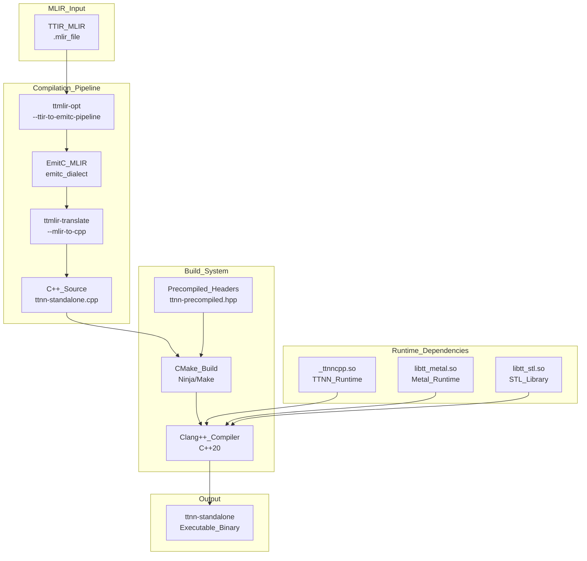

**Diagram: ttnn-standalone Compilation and Build Flow**

Sources: [tools/ttnn-standalone/ttnn-standalone.cpp:1-30](), [docs/src/ttmlir-translate.md:1-27](), [tools/ttnn-standalone/CMakeLists.txt:120-125]()
```


Relevant source files
*   [.gitignore](https://github.com/tenstorrent/tt-mlir/blob/c7d92e92/.gitignore)
*   [CMakeLists.txt](https://github.com/tenstorrent/tt-mlir/blob/c7d92e92/CMakeLists.txt)
*   [README.md](https://github.com/tenstorrent/tt-mlir/blob/c7d92e92/README.md?plain=1)
*   [docs/src/SUMMARY.md](https://github.com/tenstorrent/tt-mlir/blob/c7d92e92/docs/src/SUMMARY.md?plain=1)
*   [docs/src/adding-an-op.md](https://github.com/tenstorrent/tt-mlir/blob/c7d92e92/docs/src/adding-an-op.md?plain=1)
*   [docs/src/emitc-testing.md](https://github.com/tenstorrent/tt-mlir/blob/c7d92e92/docs/src/emitc-testing.md?plain=1)
*   [docs/src/lit-testing.md](https://github.com/tenstorrent/tt-mlir/blob/c7d92e92/docs/src/lit-testing.md?plain=1)
*   [docs/src/overview.md](https://github.com/tenstorrent/tt-mlir/blob/c7d92e92/docs/src/overview.md?plain=1)
*   [docs/src/specs/runtime-stitching.md](https://github.com/tenstorrent/tt-mlir/blob/c7d92e92/docs/src/specs/runtime-stitching.md?plain=1)
*   [docs/src/specs/specs.md](https://github.com/tenstorrent/tt-mlir/blob/c7d92e92/docs/src/specs/specs.md?plain=1)
*   [docs/src/testing.md](https://github.com/tenstorrent/tt-mlir/blob/c7d92e92/docs/src/testing.md?plain=1)
*   [docs/src/tools.md](https://github.com/tenstorrent/tt-mlir/blob/c7d92e92/docs/src/tools.md?plain=1)
*   [docs/src/ttnn-standalone.md](https://github.com/tenstorrent/tt-mlir/blob/c7d92e92/docs/src/ttnn-standalone.md?plain=1)
*   [docs/theme/highlight.js](https://github.com/tenstorrent/tt-mlir/blob/c7d92e92/docs/theme/highlight.js)
*   [env/CMakeLists.txt](https://github.com/tenstorrent/tt-mlir/blob/c7d92e92/env/CMakeLists.txt)
*   [env/activate](https://github.com/tenstorrent/tt-mlir/blob/c7d92e92/env/activate)
*   [env/activate.fish](https://github.com/tenstorrent/tt-mlir/blob/c7d92e92/env/activate.fish)
*   [env/patches/shardy.patch](https://github.com/tenstorrent/tt-mlir/blob/c7d92e92/env/patches/shardy.patch)
*   [include/ttmlir/CMakeLists.txt](https://github.com/tenstorrent/tt-mlir/blob/c7d92e92/include/ttmlir/CMakeLists.txt)
*   [include/ttmlir/Conversion/CMakeLists.txt](https://github.com/tenstorrent/tt-mlir/blob/c7d92e92/include/ttmlir/Conversion/CMakeLists.txt)
*   [include/ttmlir/Conversion/Passes.h](https://github.com/tenstorrent/tt-mlir/blob/c7d92e92/include/ttmlir/Conversion/Passes.h)
*   [include/ttmlir/Conversion/Passes.td](https://github.com/tenstorrent/tt-mlir/blob/c7d92e92/include/ttmlir/Conversion/Passes.td)
*   [include/ttmlir/Conversion/TTNNToEmitC/TTNNToEmitC.h](https://github.com/tenstorrent/tt-mlir/blob/c7d92e92/include/ttmlir/Conversion/TTNNToEmitC/TTNNToEmitC.h)
*   [lib/CMakeLists.txt](https://github.com/tenstorrent/tt-mlir/blob/c7d92e92/lib/CMakeLists.txt)
*   [lib/Conversion/CMakeLists.txt](https://github.com/tenstorrent/tt-mlir/blob/c7d92e92/lib/Conversion/CMakeLists.txt)
*   [lib/Conversion/TTNNToEmitC/CMakeLists.txt](https://github.com/tenstorrent/tt-mlir/blob/c7d92e92/lib/Conversion/TTNNToEmitC/CMakeLists.txt)
*   [lib/Dialect/TTNN/Transforms/TTNNToCpp.cpp](https://github.com/tenstorrent/tt-mlir/blob/c7d92e92/lib/Dialect/TTNN/Transforms/TTNNToCpp.cpp)
*   [lib/RegisterAll.cpp](https://github.com/tenstorrent/tt-mlir/blob/c7d92e92/lib/RegisterAll.cpp)
*   [test/ttmlir/Dialect/StableHLO/shardy/op_propagation_registry/gather_2d_mesh.mlir](https://github.com/tenstorrent/tt-mlir/blob/c7d92e92/test/ttmlir/Dialect/StableHLO/shardy/op_propagation_registry/gather_2d_mesh.mlir)
*   [test/ttmlir/EmitC/TTNN/matmul/matmul.mlir](https://github.com/tenstorrent/tt-mlir/blob/c7d92e92/test/ttmlir/EmitC/TTNN/matmul/matmul.mlir)
*   [tools/ttmlir-opt/CMakeLists.txt](https://github.com/tenstorrent/tt-mlir/blob/c7d92e92/tools/ttmlir-opt/CMakeLists.txt)
*   [tools/ttnn-standalone/ci_compile_dylib.py](https://github.com/tenstorrent/tt-mlir/blob/c7d92e92/tools/ttnn-standalone/ci_compile_dylib.py)
*   [tools/ttnn-standalone/emitc_compiler.py](https://github.com/tenstorrent/tt-mlir/blob/c7d92e92/tools/ttnn-standalone/emitc_compiler.py)

## What is tt-mlir?

`tt-mlir` is an MLIR-based compiler infrastructure designed to translate machine learning models into optimized executable programs for Tenstorrent AI accelerator hardware. The system ingests models from high-level frameworks like PyTorch and JAX (primarily via the StableHLO dialect), performs hardware-specific optimizations, and generates executable binaries or C++ code targeting Tenstorrent's Wormhole and Blackhole architectures [README.md 17-34](https://github.com/tenstorrent/tt-mlir/blob/c7d92e92/README.md?plain=1#L17-L34)

**Core Architecture**: The project defines a series of custom MLIR dialects that provide progressive levels of abstraction:

*   **TTCore**: The foundational dialect providing common types (like `ttcore.tile`) and attributes used across the stack [lib/RegisterAll.cpp 14-16](https://github.com/tenstorrent/tt-mlir/blob/c7d92e92/lib/RegisterAll.cpp#L14-L16)
*   **TTIR**: Hardware-agnostic Tenstorrent Intermediate Representation serving as the initial entry point for frontends. It defines operations like `ttir.matmul`, `ttir.pooling`, and `ttir.to_layout`[docs/src/adding-an-op.md 41-54](https://github.com/tenstorrent/tt-mlir/blob/c7d92e92/docs/src/adding-an-op.md?plain=1#L41-L54)
*   **TTNN**: A dialect for neural network operations that maps to the high-level `ttnn` library. It includes device management, memory configuration, and optimized kernels [lib/RegisterAll.cpp 88](https://github.com/tenstorrent/tt-mlir/blob/c7d92e92/lib/RegisterAll.cpp#L88-L88)
*   **D2M (Data-to-Metal)**: Device-aware transformations that model grid-based execution, tiled data movement, and stream management [include/ttmlir/Conversion/Passes.td 65-108](https://github.com/tenstorrent/tt-mlir/blob/c7d92e92/include/ttmlir/Conversion/Passes.td#L65-L108)
*   **TTKernel & SFPI**: Low-level dialects for hardware kernel primitives (FPU/SFPU) and direct hardware access via the SFPU Programming Interface (SFPI) [lib/RegisterAll.cpp 89-92](https://github.com/tenstorrent/tt-mlir/blob/c7d92e92/lib/RegisterAll.cpp#L89-L92)
*   **Debug & EmitPy**: Dialects supporting compiler instrumentation and Python-based constant evaluation or "golden" mode execution [lib/RegisterAll.cpp 100-101](https://github.com/tenstorrent/tt-mlir/blob/c7d92e92/lib/RegisterAll.cpp#L100-L101)

**Execution Backends**: The compiler supports multiple execution paths:

*   **TTNN Path**: High-level neural network operations optimized for the `ttnn` library [include/ttmlir/Conversion/Passes.td 54-55](https://github.com/tenstorrent/tt-mlir/blob/c7d92e92/include/ttmlir/Conversion/Passes.td#L54-L55)
*   **TTMetal Path**: Low-level kernel control with explicit device management via the `tt-metal` library [include/ttmlir/Conversion/Passes.td 56-57](https://github.com/tenstorrent/tt-mlir/blob/c7d92e92/include/ttmlir/Conversion/Passes.td#L56-L57)

**Output Formats**:

*   **Flatbuffer binaries**: Serialized programs for runtime execution (`.ttnn` and `.ttm` files) [docs/src/adding-an-op.md 19-23](https://github.com/tenstorrent/tt-mlir/blob/c7d92e92/docs/src/adding-an-op.md?plain=1#L19-L23)[.gitignore 39-41](https://github.com/tenstorrent/tt-mlir/blob/c7d92e92/.gitignore#L39-L41)
*   **EmitC**: Generated C++ code for integration into standalone applications, managed via `ttnn-standalone`[lib/Conversion/TTNNToEmitC/CMakeLists.txt 1-19](https://github.com/tenstorrent/tt-mlir/blob/c7d92e92/lib/Conversion/TTNNToEmitC/CMakeLists.txt#L1-L19)
*   **EmitPy**: Python code generation for "golden" validation and constant evaluation [lib/RegisterAll.cpp 100](https://github.com/tenstorrent/tt-mlir/blob/c7d92e92/lib/RegisterAll.cpp#L100-L100)

Sources: [README.md 17-34](https://github.com/tenstorrent/tt-mlir/blob/c7d92e92/README.md?plain=1#L17-L34)[docs/src/adding-an-op.md 41-115](https://github.com/tenstorrent/tt-mlir/blob/c7d92e92/docs/src/adding-an-op.md?plain=1#L41-L115)[include/ttmlir/Conversion/Passes.td 45-124](https://github.com/tenstorrent/tt-mlir/blob/c7d92e92/include/ttmlir/Conversion/Passes.td#L45-L124)[lib/RegisterAll.cpp 85-100](https://github.com/tenstorrent/tt-mlir/blob/c7d92e92/lib/RegisterAll.cpp#L85-L100)

## Documentation Roadmap

This wiki is organized into the following sections:

| Section | Purpose |
| --- | --- |
| **[Architecture Overview](https://deepwiki.com/tenstorrent/tt-mlir/1.1-architecture-overview)** | Multi-level compilation pipeline, dialect hierarchy (TTCore, TTIR, TTNN, etc.), and backend divergence details. |
| **[System Requirements and Setup](https://deepwiki.com/tenstorrent/tt-mlir/1.2-system-requirements-and-setup)** | Build dependencies, environment setup via `env/activate`, and `tt-metal` integration. |
| **[Core MLIR Dialects](https://deepwiki.com/tenstorrent/tt-mlir/2-core-mlir-dialects)** | Specifications for TTIR, TTNN, TTKernel, D2M dialects, and the custom Type System. |
| **[Compilation Pipelines](https://deepwiki.com/tenstorrent/tt-mlir/3-compilation-pipelines)** | Frontend ingestion (StableHLO), conversion passes (TTIR to TTNN/TTMetal), and serialization. |
| **[Runtime System](https://deepwiki.com/tenstorrent/tt-mlir/4-runtime-system)** | Binary loading, program execution flow, and device/tensor management. |
| **[Performance and Optimization](https://deepwiki.com/tenstorrent/tt-mlir/5-performance-and-optimization)** | OpModel analysis, layout optimization, and hardware workarounds. |
| **[Testing and Validation](https://deepwiki.com/tenstorrent/tt-mlir/6-testing-and-validation)** | Builder framework, golden testing, silicon validation, and CI/CD automation. |
| **[Build System and Development](https://deepwiki.com/tenstorrent/tt-mlir/7-build-system-and-development)** | CMake configuration, Python bindings, and Docker environments. |
| **[Tools and Utilities](https://deepwiki.com/tenstorrent/tt-mlir/8-tools-and-utilities)** | Compiler drivers (`ttmlir-opt`), runtime tools (`ttrt`), and visualization (`tt-explorer`). |
| **[Advanced Features](https://deepwiki.com/tenstorrent/tt-mlir/9-advanced-features)** | JIT compilation (`ttnn-jit`), PyKernel DSL, and distributed execution. |

Sources: [docs/src/SUMMARY.md 1-56](https://github.com/tenstorrent/tt-mlir/blob/c7d92e92/docs/src/SUMMARY.md?plain=1#L1-L56)[lib/CMakeLists.txt 1-17](https://github.com/tenstorrent/tt-mlir/blob/c7d92e92/lib/CMakeLists.txt#L1-L17)[env/activate 1-32](https://github.com/tenstorrent/tt-mlir/blob/c7d92e92/env/activate#L1-L32)

## High-Level System Architecture

```mermaid
graph TB
    subgraph Frontends ["Natural Language Space: Model Input"]
        PyTorch["PyTorch / JAX / StableHLO"]
    end

    subgraph Dialects ["Code Entity Space: MLIR Dialects"]
        StableHLO["mlir::stablehlo::StablehloDialect"]
        Sdy["mlir::sdy::SdyDialect"]
        TTIR["mlir::tt::ttir::TTIRDialect"]
        D2M["mlir::tt::d2m::D2MDialect"]
        TTNN["mlir::tt::ttnn::TTNNDialect"]
    end

    subgraph Tools ["Code Entity Space: Compiler Tools"]
        Opt["ttmlir-opt"]
        Translate["ttmlir-translate"]
    end

    subgraph Targets ["Code Entity Space: Serialization"]
        FB["Flatbuffer Target"]
        EC["mlir::emitc::EmitCDialect"]
    end

    PyTorch --> StableHLO
    StableHLO --> Sdy
    Sdy --> ["ConvertStableHLOToTTIR"] TTIR
    TTIR --> ["TTIRToD2M"] D2M
    TTIR --> ["ConvertTTIRToTTNN"] TTNN
    
    TTNN --> ["TTNNToFlatbuffer"] FB
    TTNN --> ["TTNNToEmitC"] EC
    
    Opt -.-> Dialects
    Translate -.-> Targets
```

Sources: [include/ttmlir/Conversion/Passes.td:11-20](), [include/ttmlir/Conversion/Passes.td:65-108](), [lib/RegisterAll.cpp:85-106](), [lib/Conversion/TTNNToEmitC/CMakeLists.txt:1-19]()
```


The following diagram bridges the natural language concepts of the compilation flow to the specific code entities and dialects used in the repository.

**Overall System Data Flow**

Sources: [include/ttmlir/Conversion/Passes.td 11-20](https://github.com/tenstorrent/tt-mlir/blob/c7d92e92/include/ttmlir/Conversion/Passes.td#L11-L20)[include/ttmlir/Conversion/Passes.td 65-108](https://github.com/tenstorrent/tt-mlir/blob/c7d92e92/include/ttmlir/Conversion/Passes.td#L65-L108)[lib/RegisterAll.cpp 85-106](https://github.com/tenstorrent/tt-mlir/blob/c7d92e92/lib/RegisterAll.cpp#L85-L106)[lib/Conversion/TTNNToEmitC/CMakeLists.txt 1-19](https://github.com/tenstorrent/tt-mlir/blob/c7d92e92/lib/Conversion/TTNNToEmitC/CMakeLists.txt#L1-L19)

## Compilation Pipeline Hierarchy

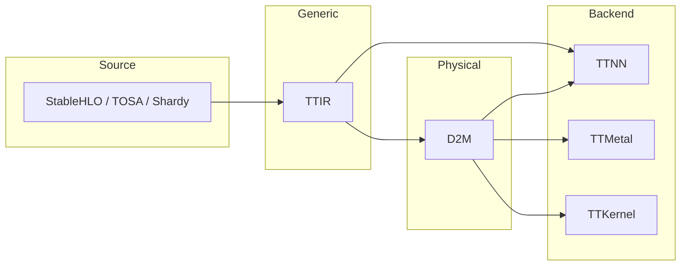

**Primary Conversion Passes**

| Pass | Purpose |
|------|---------|
| `ConvertStableHLOToTTIR` | Ingest models from StableHLO into TTIR [include/ttmlir/Conversion/Passes.td:11-20]() |
| `LegalizeStableHLOCompositeToTTIR` | Legalize StableHLO composite operations directly to TTIR [include/ttmlir/Conversion/Passes.td:26-36]() |
| `TTIRToTTIRDecomposition` | Break complex operations into hardware-friendly primitives [include/ttmlir/Conversion/Passes.td:45-62]() |
| `TTIRToD2M` | Lower generic TTIR operations to the physical D2M dialect [include/ttmlir/Conversion/Passes.td:65-124]() |
| `ConvertTosaToTTIR` | Convert TOSA dialect inputs to TTIR [include/ttmlir/Conversion/Passes.td:39-43]() |

Sources: [include/ttmlir/Conversion/Passes.td:11-124](), [lib/RegisterAll.cpp:145-150]()
```


The compilation process follows a multi-level abstraction hierarchy. For details on how these relate, see [Architecture Overview](https://deepwiki.com/tenstorrent/tt-mlir/1.1-architecture-overview).

**Dialect Transformation Pipeline**

**Primary Conversion Passes**

| Pass | Purpose |
| --- | --- |
| `ConvertStableHLOToTTIR` | Ingest models from StableHLO into TTIR [include/ttmlir/Conversion/Passes.td 11-20](https://github.com/tenstorrent/tt-mlir/blob/c7d92e92/include/ttmlir/Conversion/Passes.td#L11-L20) |
| `LegalizeStableHLOCompositeToTTIR` | Legalize StableHLO composite operations directly to TTIR [include/ttmlir/Conversion/Passes.td 26-36](https://github.com/tenstorrent/tt-mlir/blob/c7d92e92/include/ttmlir/Conversion/Passes.td#L26-L36) |
| `TTIRToTTIRDecomposition` | Break complex operations into hardware-friendly primitives [include/ttmlir/Conversion/Passes.td 45-62](https://github.com/tenstorrent/tt-mlir/blob/c7d92e92/include/ttmlir/Conversion/Passes.td#L45-L62) |
| `TTIRToD2M` | Lower generic TTIR operations to the physical D2M dialect [include/ttmlir/Conversion/Passes.td 65-124](https://github.com/tenstorrent/tt-mlir/blob/c7d92e92/include/ttmlir/Conversion/Passes.td#L65-L124) |
| `ConvertTosaToTTIR` | Convert TOSA dialect inputs to TTIR [include/ttmlir/Conversion/Passes.td 39-43](https://github.com/tenstorrent/tt-mlir/blob/c7d92e92/include/ttmlir/Conversion/Passes.td#L39-L43) |

Sources: [include/ttmlir/Conversion/Passes.td 11-124](https://github.com/tenstorrent/tt-mlir/blob/c7d92e92/include/ttmlir/Conversion/Passes.td#L11-L124)[lib/RegisterAll.cpp 145-150](https://github.com/tenstorrent/tt-mlir/blob/c7d92e92/lib/RegisterAll.cpp#L145-L150)

## Runtime and Tools

The runtime system is responsible for loading the compiled binaries and dispatching them to the Tenstorrent device.

**Runtime Execution Components**

| Component | Code Entity / Path | Purpose |
| --- | --- | --- |
| **CLI Driver** | `ttmlir-opt` | Main tool for running optimization passes and dialect conversions [tools/ttmlir-opt/CMakeLists.txt 1-4](https://github.com/tenstorrent/tt-mlir/blob/c7d92e92/tools/ttmlir-opt/CMakeLists.txt#L1-L4) |
| **Runtime Tool** | `ttrt` | Command-line utility to execute and profile binaries on hardware [docs/src/SUMMARY.md 16](https://github.com/tenstorrent/tt-mlir/blob/c7d92e92/docs/src/SUMMARY.md?plain=1#L16-L16) |
| **Explorer** | `tt-explorer` | Visualization tool for MLIR graphs and performance analysis [docs/src/SUMMARY.md 21](https://github.com/tenstorrent/tt-mlir/blob/c7d92e92/docs/src/SUMMARY.md?plain=1#L21-L21) |
| **JIT System** | `ttnn-jit` | Just-in-time compilation path for Python-based models [docs/src/SUMMARY.md 31](https://github.com/tenstorrent/tt-mlir/blob/c7d92e92/docs/src/SUMMARY.md?plain=1#L31-L31) |
| **Standalone** | `ttnn-standalone` | Tool for running TTNN operations independently [docs/src/SUMMARY.md 27](https://github.com/tenstorrent/tt-mlir/blob/c7d92e92/docs/src/SUMMARY.md?plain=1#L27-L27) |

For setup instructions and system requirements, see [System Requirements and Setup](https://deepwiki.com/tenstorrent/tt-mlir/1.2-system-requirements-and-setup).

Sources: [docs/src/SUMMARY.md 13-31](https://github.com/tenstorrent/tt-mlir/blob/c7d92e92/docs/src/SUMMARY.md?plain=1#L13-L31)[tools/ttmlir-opt/CMakeLists.txt 1-10](https://github.com/tenstorrent/tt-mlir/blob/c7d92e92/tools/ttmlir-opt/CMakeLists.txt#L1-L10)

Dismiss
Refresh this wiki

Enter email to refresh

## Additional Diagrams


### Environment Setup Overview


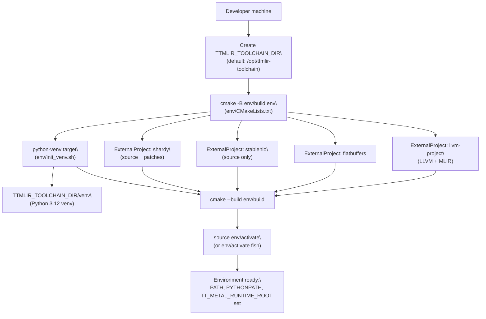

Sources: [env/CMakeLists.txt:1-105](), [env/activate:1-32]()

---
```


### The `env/activate` Script


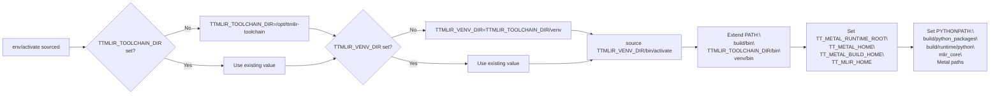

Sources: [env/activate:1-32]()

---
```


### tt-metal Integration


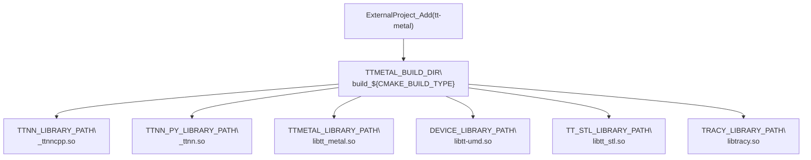

Sources: [third_party/CMakeLists.txt:94-117]()

The build system handles CPM cache for `tt-metal` dependencies and configures it to use the same compiler launcher (e.g., `ccache`) as the main project. It also disables distributed support if the system processor is not x86-based due to MPI dependencies.

Sources: [third_party/CMakeLists.txt:44-52](), [third_party/CMakeLists.txt:119-124](), [third_party/CMakeLists.txt:134-139]()

---
```


### Docker Images


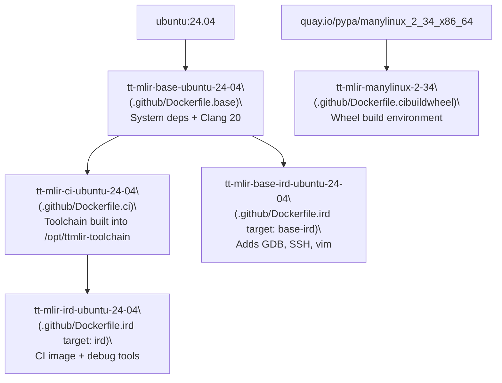

Sources: [.github/Dockerfile.base:1-64]()

---
```


### Overview and Compilation Flow


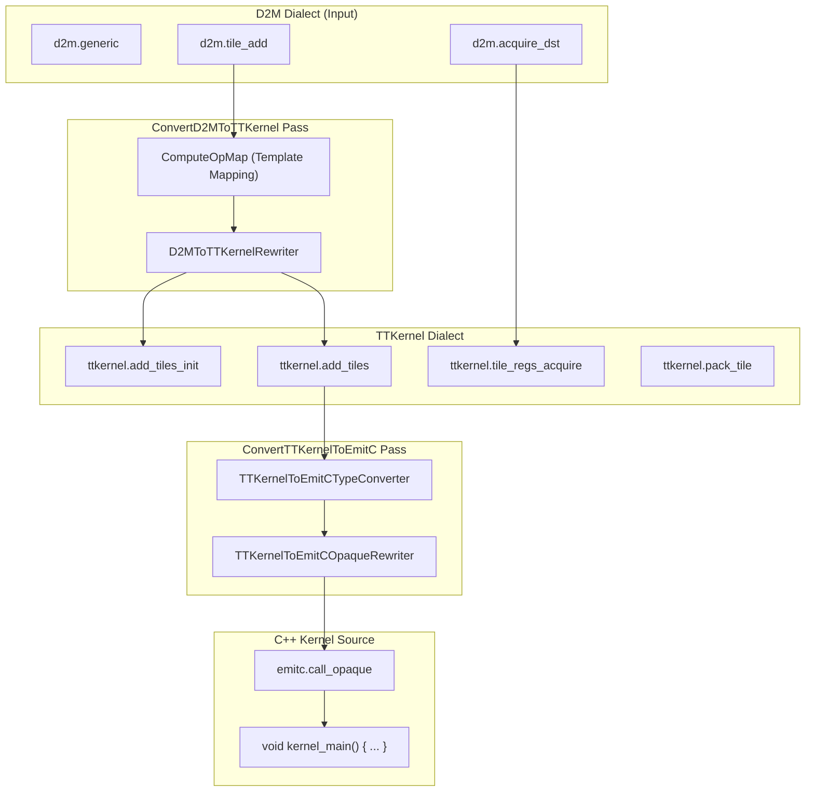

The conversion from D2M to TTKernel uses specialized rewriters to map D2M generic region ops into TTKernel **Init** and **Compute** pairs. Init operations are often hoisted to the start of the function using `setInsertionPointToFuncStart`.
```


### Generic Operation Model


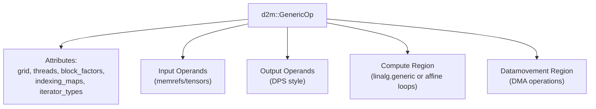

**Key Attributes:**
- `grid`: Physical core grid shape `[rows, cols]`.
- `threads`: Thread assignment (e.g., `unified`, `compute`, `datamovement`).
- `block_factors`: Blocking factors for iteration space tiling [lib/Dialect/D2M/IR/D2MOps.cpp:77-79]().
- `indexing_maps`: Affine maps from iteration space to operands [lib/Dialect/D2M/IR/D2MOps.cpp:84-118]().
- `iterator_types`: Parallel or reduction iterators.
```


### Data Movement and DMA Operations


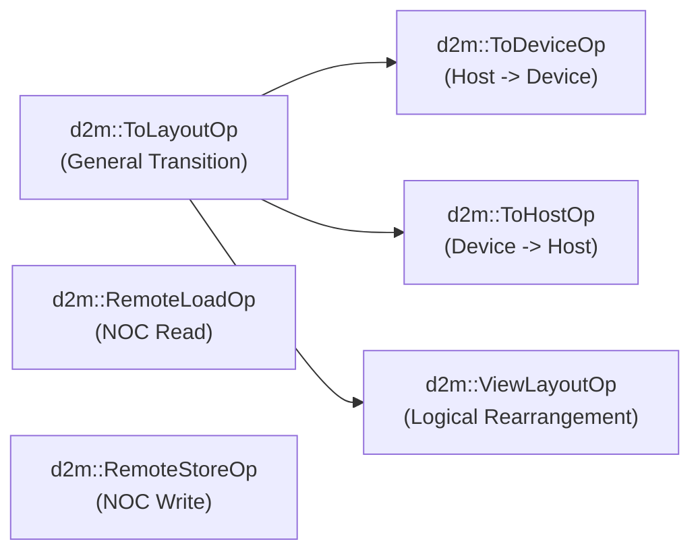

**Key Data Movement Ops:**
- `ToLayoutOp`: Transitions tensors between different memory spaces, data types, or sharding [include/ttmlir/Dialect/D2M/IR/D2MOps.td:88-104]().
- `ToDeviceOp` / `ToHostOp`: Explicit host-device transfer operations [test/ttmlir/Dialect/D2M/lower_to_layout.mlir:15-16]().
- `ViewLayoutOp`: Creates a representational view with a different layout; a no-op for codegen [include/ttmlir/Dialect/D2M/IR/D2MOps.td:19-31]().
- `CompositeViewOp`: Represents a piecewise-affine view aggregating multiple input tensors [include/ttmlir/Dialect/D2M/IR/D2MOps.td:55-73]().
```


### Memory Layout and Grid Management


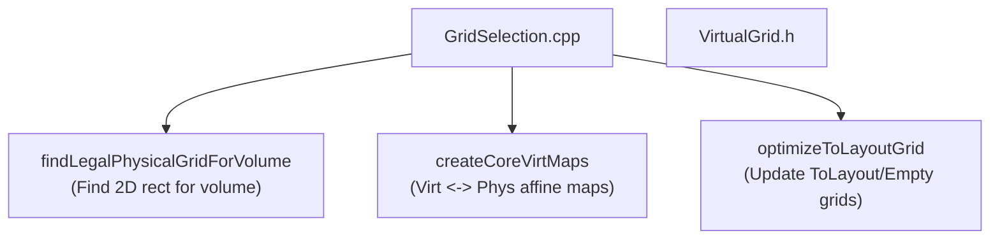

**Virtual Grids:** When a requested grid exceeds the physical worker grid, D2M uses virtualization.
- `requiresVirtualGrid`: Checks if a grid needs virtualization [lib/Dialect/D2M/IR/D2MOps.cpp:145-146]().
- `createCoreVirtMaps`: Generates the forward and inverse affine maps for core translation [lib/Dialect/D2M/Transforms/GridSelection.cpp:63-65]().
- `findLegalPhysicalGridForVolume`: Utility to find a physical core rectangle that fits the required virtual volume [lib/Dialect/D2M/Transforms/GridSelection.cpp:55-57]().
- `deriveVirtualGridAttrs`: Helper to materialize `AffineMapAttr` for virtualization and offsets [lib/Dialect/D2M/Transforms/GridSelection.cpp:37-50]().
```


### Attribute Type Hierarchy


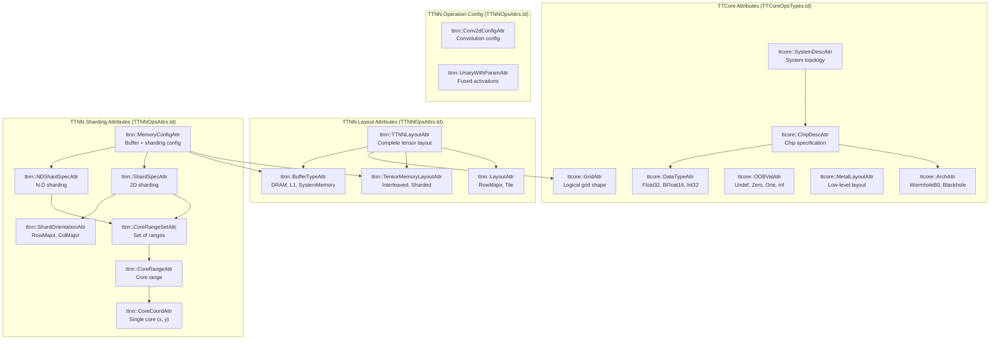

Sources: [include/ttmlir/Dialect/TTNN/IR/TTNNOpsAttrs.td:33-304](), [include/ttmlir/Dialect/TTCore/IR/TTCoreOpsTypes.td:30-172](), [include/ttmlir/Dialect/TTNN/IR/TTNNOpsEnums.td:10-58]()
```


#### Pipeline Flow Diagram


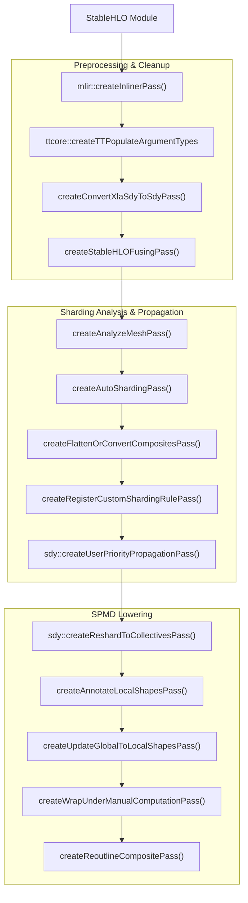


#### Conversion Infrastructure


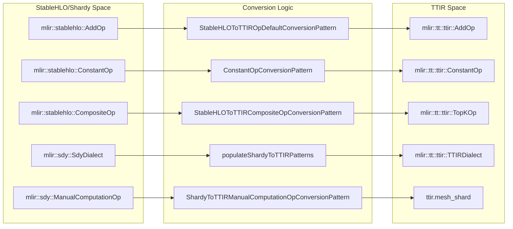


#### Three-Stage Pipeline Structure


```mermaid
graph TB
    subgraph Frontend["createTTIRToTTMetalFrontendPipeline()"]
        TTIR["TTIR Operations"]
        MultiDevice["ttir::createTTIRMultiDeviceTensorAnnotation"]
        RegisterDevice["ttcore::createTTCoreRegisterDevicePass"]
        Decomposition["tt::createTTIRToTTIRDecompositionPass"]
        GlobalFmt["ttir::createTTIRGlobalDataFormatConversion"]
        DecomposePermute["ttir::createTTIRDecomposeComplexPermute"]
        ToD2M["tt::createTTIRToD2MPass"]
        ScalarizeConst["d2m::createD2MScalarizeConstTensors"]
        GridSelection["d2m::createD2MGridSelection"]
        MatView["d2m::createD2MMaterializeViewReturns"]
        LowerLayout["d2m::createD2MLowerToLayout"]
        
        TTIR --> MultiDevice
        MultiDevice --> RegisterDevice
        RegisterDevice --> Decomposition
        Decomposition --> GlobalFmt
        GlobalFmt --> DecomposePermute
        DecomposePermute --> ToD2M
        ToD2M --> ScalarizeConst
        ScalarizeConst --> MatView
        MatView --> GridSelection
        GridSelection --> LowerLayout
    end
    
    subgraph Middleend["createTTIRToTTMetalMiddleendPipeline()"]
        LowerLayout --> EltFusion["d2m::createD2MElementwiseFusion"]
        EltFusion --> Bufferize["ttcore::createTTCoreOneShotBufferizePass"]
        Bufferize --> Scratch["d2m::createD2MInsertScratchBuffers"]
        Scratch --> Interchange["d2m::createD2MGenericApplyInterchange"]
        Interchange --> GenLoops["d2m::createD2MGenerateOuterLoops"]
        GenLoops --> Allocate["d2m::createD2MAllocate"]
        Allocate --> TileLoops["d2m::createD2MGenericTileComputeLoops"]
        TileLoops --> LinalgToAffine["d2m::createD2MLinalgToAffine"]
        LinalgToAffine --> OpScheduler["d2m::createD2MOpScheduler"]
        OpScheduler --> InsertDst["d2m::createD2MInsertDstRegisterAccess"]
        InsertDst --> SFPUFission["d2m::createD2MSFPUTileLoopFission"]
        SFPUFission --> Linearize["d2m::createD2MGenericLinearizeMemref"]
        Linearize --> GenDatamove["d2m::createD2MGenericGenerateDatamovement"]
        GenDatamove --> LowerDMAs["d2m::createD2MGenericLowerDMAs"]
        LowerDMAs --> HWThread["d2m::createD2MGenericHWThreadSelection"]
        HWThread --> RegionsToFuncs["d2m::createD2MGenericRegionsToFuncs"]
    end
    
    subgraph Backend["createTTIRToTTMetalBackendPipeline()"]
        RegionsToFuncs --> ToTTKernel["createConvertD2MToTTKernelPass"]
        ToTTKernel --> ControlDst["createTTKernelControlDstSection"]
        ControlDst --> ToTTMetal["createConvertD2MToTTMetalPass"]
        ToTTMetal --> HoistInits["createTTKernelHoistInits"]
        HoistInits --> DeviceZone["createTTKernelInsertDeviceZoneScopes"]
        DeviceZone --> ToEmitC["createConvertTTKernelToEmitC"]
        ToEmitC --> FormExpr["createFormExpressionsPass"]
        FormExpr --> Output["C++ Kernel Code"]
    end
```


#### D2M Generic Operation Structure


```mermaid
graph TB
    subgraph "GenericOp [d2m::GenericOp]"
        Attrs["Attributes:<br/>grid: ttcore::GridAttr<br/>indexing_maps: ArrayAttr<br/>iterator_types: ArrayAttr<br/>block_factors: ArrayAttr"]
        
        Operands["Operands:<br/>ins(...): RankedTensorType<br/>outs(...): RankedTensorType"]
        
        Region["Region with blocks per thread<br/>Each block has d2m::CB args"]
    end
    
    subgraph "RegionStructure [Region Components]"
        BlockArgs["Block arguments:<br/>d2m::CBType [D2MOpsTypes.td]"]
        
        CBOps["CB Operations:<br/>d2m::WaitOp<br/>d2m::ReserveBackOp<br/>d2m::PushBackOp<br/>d2m::PopFrontOp"]
        
        ComputeBody["Compute Body:<br/>linalg::GenericOp or<br/>affine::AffineForOp"]
        
        TileOps["Tile Operations:<br/>d2m::TileAddOp<br/>d2m::TileMulOp<br/>d2m::TileMatmulOp"]
    end
    
    "GenericOp [d2m::GenericOp]" --> Attrs
    "GenericOp [d2m::GenericOp]" --> Operands
    "GenericOp [d2m::GenericOp]" --> Region
    
    Region --> BlockArgs
    BlockArgs --> CBOps
    CBOps --> ComputeBody
    ComputeBody --> TileOps
```


#### TTKernel and EmitC Conversion


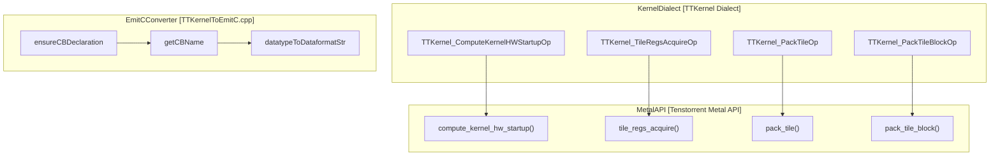

**Key Conversion Logic:**
- **Circular Buffer Management**: assigning stable names and emitting C++ declarations for circular buffers via `getCBName` [lib/Conversion/TTKernelToEmitC/TTKernelToEmitC.cpp:110-128]().
- **Data Format Mapping**: converting MLIR data types to Tenstorrent `DataFormat` enums using `datatypeToDataformatStr` [lib/Conversion/TTKernelToEmitC/TTKernelToEmitC.cpp:45-92]().
- **Startup Operations**: lowering to the `compute_kernel_hw_startup` C++ call [lib/Dialect/TTKernel/IR/TTKernelOps.td:26-39]().
- **Register Management**: managing hardware DST register locks for MATH and PACK threads via `tile_regs_acquire` and `tile_regs_wait` [lib/Dialect/TTKernel/IR/TTKernelOps.td:58-93]().
```


### Conversion Architecture Overview


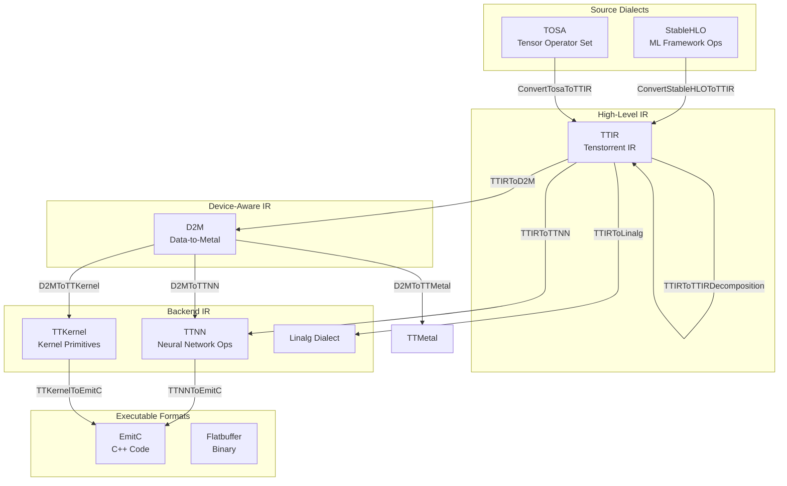

Sources: [lib/Conversion/TosaToTTIR/TosaToTTIRPatterns.cpp:5-200](), [lib/Conversion/TTIRToTTIRDecomposition/TTIRToTTIRDecompositionPass.cpp:40-88]()
```


### Position in the Compiler Pipeline


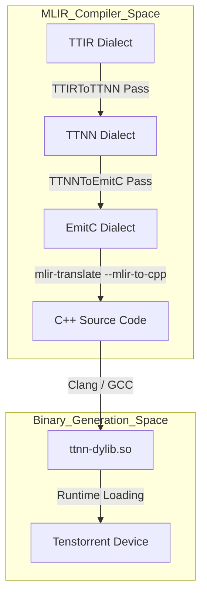

Sources: [lib/Conversion/TTIRToTTNN/TTIRToTTNN.cpp:5-17](), [lib/Conversion/TTNNToEmitC/TTNNToEmitC.cpp:51-75](), [tools/ttnn-standalone/CMakeLists.txt:161-175]()

---
```


#### Natural Language to Code Entity Space: TTNN Serialization


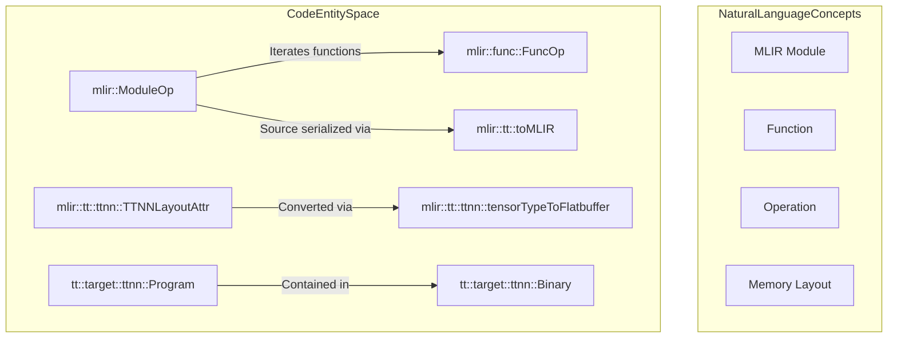


#### Natural Language to Code Entity Space: TTMetal Serialization


```mermaid
graph TD
    subgraph "NaturalLanguageConcepts"
        Queue["Command Queue"]
        Cmd["Command"]
        Prog["Metal Program"]
        Kernel["Compute/NOC/Eth Kernel"]
    end

    subgraph "CodeEntitySpace"
        CQBuilder["mlir::tt::ttmetal::CQBuilder"]
        appendCommand["mlir::tt::ttmetal::CQBuilder::appendCommand"]
        Command["tt::target::metal::Command"]
        MCQExecutor["tt::runtime::ttmetal::MCQExecutor"]
        execute["tt::runtime::ttmetal::MCQExecutor::execute"]
    end

    CQBuilder -- "Collects" --> appendCommand
    appendCommand -- "Creates" --> Command
    MCQExecutor -- "Dispatches via" --> execute
    execute -- "Processes" --> Command
```


#### Runtime Enumeration Types


```mermaid
graph TB
    subgraph "Runtime Selection Enums (tt::runtime::flatbuffer)"
        DeviceRuntime["DeviceRuntime Enum"]
        HostRuntime["HostRuntime Enum"]
    end
    
    subgraph "Device Backend Options"
        TTNN["DeviceRuntime::TTNN"]
        TTMetal["DeviceRuntime::TTMetal"]
        Disabled["DeviceRuntime::Disabled"]
    end
    
    subgraph "Host Execution Options"
        Local["HostRuntime::Local"]
        Distributed["HostRuntime::Distributed"]
    end
    
    DeviceRuntime --> TTNN
    DeviceRuntime --> TTMetal
    DeviceRuntime --> Disabled
    
    HostRuntime --> Local
    HostRuntime --> Distributed
```

**Runtime Enumeration Types**

| Runtime Type | Values | Purpose |
|-------------|---------|---------|
| `DeviceRuntime` | `TTNN`, `TTMetal`, `Disabled` | Selects which device backend to use for computation. |
| `HostRuntime` | `Local`, `Distributed` | Selects single-process or multi-process execution mode. |

Sources: [runtime/include/tt/runtime/types.h:26-31](), [runtime/lib/runtime.cpp:159-168]()
```


### Type System and Runtime Checking


```mermaid
graph TB
    subgraph "Base Implementation Classes"
        ObjectImpl["tt::runtime::detail::ObjectImpl"]
        CheckedImpl["tt::runtime::detail::RuntimeCheckedObjectImpl"]
        ConstCheckedImpl["tt::runtime::detail::RuntimeCheckedConstObjectImpl"]
    end
    
    subgraph "Public Runtime Handles"
        Tensor["tt::runtime::Tensor"]
        Binary["tt::runtime::Binary"]
        Device["tt::runtime::Device"]
        Event["tt::runtime::Event"]
    end
    
    CheckedImpl --> Tensor
    CheckedImpl --> Device
    CheckedImpl --> Event
    ObjectImpl --> Binary
```

**Type Safety Implementation:**
- `RuntimeCheckedObjectImpl` stores an `associatedRuntime` field [runtime/include/tt/runtime/types.h:103]().
- The `as<T>(DeviceRuntime)` method asserts that the requested runtime matches the object's associated runtime before casting the underlying `void*` handle [runtime/include/tt/runtime/types.h:121-125]().

Sources: [runtime/include/tt/runtime/types.h:84-169]()

---
```


### Tensor Type Hierarchy


```mermaid
graph TB
    subgraph "Public API Types (tt::runtime)"
        Tensor["Tensor<br/>(RuntimeCheckedObjectImpl)"]
        TensorDesc["TensorDesc<br/>(shape, dtype, stride, physicalVolume)"]
    end
    
    subgraph "TTNN Runtime Entities (tt::runtime::ttnn)"
        TTNNTensorWrapper["TTNNTensorWrapper<br/>(holds ::ttnn::Tensor)"]
        ProgramContext["ProgramContext<br/>(manages live tensors)"]
        TTNNLayout["::ttnn::Layout"]
        TTNNDataType["::ttnn::DataType"]
    end
    
    subgraph "TTMetal Runtime Entities (tt::runtime::ttmetal)"
        MetalTensor["MetalTensor<br/>(std::variant)"]
        MetalHostBuffer["tt_metal::HostBuffer"]
        MeshBuffer["tt_metal::distributed::MeshBuffer"]
    end
    
    Tensor -->|"wraps"| TTNNTensorWrapper
    Tensor -->|"wraps"| MetalTensor
    TTNNTensorWrapper -->|"contains"| TTNNLayout
    TTNNTensorWrapper -->|"contains"| TTNNDataType
    
    MetalTensor -->|"variant of"| MetalHostBuffer
    MetalTensor -->|"variant of"| MeshBuffer
    
    ProgramContext -->|"manages"| TTNNTensorWrapper
    
    TensorDesc -->|"describes"| Tensor
```

The `ProgramContext` acts as the registry for tensors during program execution, mapping `global_id` from the Flatbuffer representation to live tensor handles in a `TensorPtrMap`. [runtime/lib/ttnn/program_executor.cpp:142-161]()
```


#### OpModel Template Hierarchy


```mermaid
graph TB
    subgraph "Base Templates"
        UnaryEltwiseOpModel["UnaryEltwiseOpModel<OpTy>"]
        BinaryEltwiseOpModel["BinaryEltwiseOpModel<OpTy>"]
        TernaryEltwiseOpModel["TernaryEltwiseOpModel<OpTy>"]
    end
    
    subgraph "Specialized Templates"
        OpModelRelu["OpModel<ReluOp>"]
        OpModelAdd["OpModel<AddOp>"]
        OpModelWhere["OpModel<WhereOp>"]
        OpModelMatmul["OpModel<MatmulOp>"]
    end
    
    UnaryEltwiseOpModel -.inherits.-> OpModelRelu
    BinaryEltwiseOpModel -.inherits.-> OpModelAdd
    TernaryEltwiseOpModel -.inherits.-> OpModelWhere
    
    OpModelRelu --> GetOpConstraintsUnary["getOpConstraints(deviceGrid, inputShape,<br/>inputLayout, outputLayout)"]
    OpModelAdd --> GetOpConstraintsBinary["getOpConstraints(deviceGrid, inputShapeA,<br/>inputLayoutA, inputShapeB,<br/>inputLayoutB, outputLayout)"]
```

Operations are grouped by signature patterns into base templates. Each operation type specializes `OpModel<OpTy>` to inherit from the appropriate base template or provide custom implementations for complex operations.

Sources: [include/ttmlir/OpModel/TTNN/TTNNOpModel.h:56-181](), [include/ttmlir/OpModel/TTNN/TTNNOpModel.h:234-245]()
```


#### Layout Representation


```mermaid
graph TB
    subgraph "TTNNLayoutAttr Structure"
        Layout["Layout<br/>(RowMajor/Tile)"]
        BufferType["BufferType<br/>(SystemMemory/DRAM/L1)"]
        TensorMemoryLayout["TensorMemoryLayout<br/>(Interleaved/Sharded)"]
        DataType["DataType<br/>(Float32/BFloat16/etc)"]
    end
    
    subgraph "Memory Hierarchy"
        SystemMem["System Memory<br/>(Host)"]
        DRAM["DRAM<br/>(On-Device)"]
        L1["L1 SRAM<br/>(Worker Cores)"]
    end
    
    subgraph "Sharding Modes"
        Interleaved["Interleaved<br/>(Round-robin distribution)"]
        HeightSharded["HeightSharded<br/>(Shard along height)"]
        WidthSharded["WidthSharded<br/>(Shard along width)"]
        BlockSharded["BlockSharded<br/>(2D sharding)"]
    end
    
    BufferType -.-> SystemMem
    BufferType -.-> DRAM
    BufferType -.-> L1
    
    TensorMemoryLayout -.-> Interleaved
    TensorMemoryLayout -.-> HeightSharded
    TensorMemoryLayout -.-> WidthSharded
    TensorMemoryLayout -.-> BlockSharded
```

Sources: [lib/Dialect/TTNN/Analysis/MemoryLayoutPropagation.cpp:114-121](), [include/ttmlir/Dialect/TTNN/Utils/PassOverrides.h:47-53](), [lib/Dialect/TTNN/Analysis/DFShardingPolicy.cpp:69-81]()
```


### Pipeline Integration


```mermaid
graph LR
    [TTIRToTTNN_Lowering] --> [TTNN_Fusing]
    [TTNN_Fusing] --> [TTNNWorkarounds_Pass]
    [TTNNWorkarounds_Pass] --> [TTNNOptimizer]
```

Sources: [lib/Dialect/TTNN/Pipelines/TTNNPipelines.cpp:113-132]()
```


#### Builder Class Hierarchy


```mermaid
graph TB
    subgraph "Base Layer"
        Builder["Builder<br/>(tools/builder/base/builder.py)"]
    end
    
    subgraph "Dialect Builders"
        TTIRBuilder["TTIRBuilder<br/>(tools/builder/ttir/ttir_builder.py)"]
        StableHLOBuilder["StableHLOBuilder<br/>(tools/builder/stablehlo/stablehlo_builder.py)"]
        TTNNBuilder["TTNNBuilder<br/>(tools/builder/ttnn/ttnn_builder.py)"]
        D2MBuilder["D2MBuilder<br/>(tools/builder/d2m/d2m_builder.py)"]
    end
    
    Builder --> TTIRBuilder
    Builder --> StableHLOBuilder
    Builder --> TTNNBuilder
    Builder --> D2MBuilder
    
    Builder -.->|"manages"| GoldenStorage["_goldens: Dict[Operand, GoldenMapTensor]"]
    Builder -.->|"tracks"| FuncOps["_func_ops_generated"]
    Builder -.->|"provides"| GoldenMap["golden_map property"]
```

**Builder Base Class Responsibilities** [tools/builder/base/builder.py:39-57]():
- **Golden tensor management**: Maps MLIR operands to reference tensor values via `_goldens` dictionary [tools/builder/base/builder.py:80-80]().
- **Function tracking**: Maintains ordered lists of inputs/outputs per function in `_func_ops_generated` [tools/builder/base/builder.py:74-74]().
- **Mesh configuration**: Stores multi-device mesh topology for distributed execution [tools/builder/base/builder.py:106-122]().
- **Metadata storage**: Tracks operand locations, bypass operations, and deallocation points [tools/builder/base/builder.py:89-101]().

**Key Builder Methods** [tools/builder/base/builder.py:186-253]():

| Method | Purpose |
|--------|---------|
| `set_goldens(inputs, outputs)` | Associate PyTorch tensors with MLIR operands [tools/builder/base/builder.py:255-277]() |
| `set_goldens_to_check(operands)` | Mark specific operands for validation [tools/builder/base/builder.py:283-284]() |
| `golden_map` | Extract golden tensors organized by program and location [tools/builder/base/builder.py:186-228]() |
| `preshard_arg(operand, shard_dims)` | Pre-shard input tensors for multi-device execution [tools/builder/base/builder.py:240-253]() |
| `bypass(operand)` | Skip golden comparison for specific operations [tools/builder/base/builder.py:279-281]() |

Sources: [tools/builder/base/builder.py:39-284]()

---
```


### Testing Architecture Overview


```mermaid
graph TB
    subgraph "Test_Categories"
        OpModelTests["C++ OpModel Tests<br/>TestOpModelLib.cpp<br/>TestOpModelInterface.cpp"]
        ShardSolverTests["Shard Solver Tests<br/>TestShardSolver.cpp"]
        SchedulerTests["Scheduler Tests<br/>TestScheduler.cpp"]
        CostModelTests["Cost Model Tests<br/>TestD2MOpCostModel.cpp"]
        ValidationTests["Constraint Validation Tests<br/>TestOpConstraintValidation.cpp"]
    end
    
    subgraph "Test_Infrastructure"
        OpModelFixture["OpModelFixture<br/>Mock/Real Device Setup"]
        SingletonDC["SingletonDeviceContext<br/>Device Lifecycle"]
        ShardSolverBase["ShardSolverBase<br/>Module/Func Setup"]
    end
    
    subgraph "Validation_Components"
        OpModelAPI["OpModel&lt;OpTy&gt; API<br/>getOpConstraints()<br/>getOpRuntime()"]
        MetalGraph["ttnn::graph API<br/>ConstraintQueryResponse<br/>RuntimeQueryResponse"]
        OpConstraintVal["OpConstraintValidation<br/>validateOperation()"]
        ShardSolver["ShardSolver Analysis"]
        D2MCost["D2MOpCostModel"]
    end
    
    OpModelTests --> OpModelFixture
    OpModelTests --> OpModelAPI
    ShardSolverTests --> ShardSolverBase
    ShardSolverBase --> ShardSolver
    CostModelTests --> D2MCost
    ValidationTests --> OpConstraintVal
    
    OpModelFixture --> SingletonDC
    OpModelAPI --> SingletonDC
    OpModelAPI --> MetalGraph
    OpConstraintVal --> OpModelAPI
```

Sources: [test/unittests/OpModel/TTNN/Lib/TestOpModelLib.cpp:25-30](), [lib/OpModel/TTNN/TTNNOpModel.cpp:86-120](), [test/unittests/Optimizer/TestShardSolver.cpp:32-45](), [lib/Dialect/TTNN/Validation/OpConstraintValidation.cpp:48-53]()

---
```


#### Constraint Validation Testing


```mermaid
graph LR
    subgraph "Input_Generation"
        CreateLayout["CreateTiledLayout()"]
        WorkerGrid["CreateWorkerGrid()"]
    end

    subgraph "OpModel_Execution"
        Query["OpModel&lt;OpTy&gt;::getOpConstraints()"]
        Cache["opConstraintsCache()<br/>getOrCompute()"]
    end

    subgraph "Assertion"
        Legal["EXPECT_EQ(legal, expected)"]
        Resources["EXPECT_GE(cbSize, 0)<br/>EXPECT_GE(l1Peak, 0)"]
    end

    CreateLayout --> Query
    WorkerGrid --> Query
    Query --> Cache
    Cache --> Legal
    Cache --> Resources
```

**Key Validation Functions:**
- `getOpConstraints`: Queries peak L1 memory, circular buffer (CB) usage, and output tensor layouts. It utilizes `executeConstraintQuery` to perform the actual call to the backend [lib/OpModel/TTNN/TTNNOpModel.cpp:139-163]().
- `executeConstraintQuery`: Wraps the low-level `ttnn::graph` query, handling exceptions and validating the `ExecutionStatus`. It also manages `ProgramCacheState` to ensure clean measurements [lib/OpModel/TTNN/TTNNOpModel.cpp:86-120]().

Sources: [test/unittests/OpModel/TTNN/Lib/TestOpModelLib.cpp:85-102](), [lib/OpModel/TTNN/TTNNOpModel.cpp:50-55](), [lib/OpModel/TTNN/TTNNOpModel.cpp:139-163]()

---
```


#### Interface Testing Pattern


```mermaid
graph TD
    subgraph "MLIR_Operation"
        OpPtr["mlir::Operation*"]
    end

    subgraph "Interface_Dispatch"
        Cast["dyn_cast&lt;OpModel&gt;(op)"]
        IFace["TTNNOpModelInterface"]
    end

    subgraph "Backend_Query"
        GetC["getOpConstraints()"]
        GetR["getOpRuntime()"]
    end

    OpPtr --> Cast
    Cast --> IFace
    IFace --> GetC
    IFace --> GetR
```

**Interface Helper Methods:**
- `getInputLayouts`: Extracts `TTNNLayoutAttr` from operation operands or defaults to Interleaved L1 [test/unittests/OpModel/TTNN/Op/TestOpModelInterface.cpp:42-66]().
- `getOutputLayout`: Extracts the expected output layout from the result type encoding [test/unittests/OpModel/TTNN/Op/TestOpModelInterface.cpp:69-75]().

Sources: [test/unittests/OpModel/TTNN/Op/TestOpModelInterface.cpp:28-40](), [lib/Dialect/TTNN/Interfaces/TTNNOpModelInterface.cpp:113-126]()

---
```


### Docker and Environment Management


```mermaid
graph TD
    subgraph "CI_Workflow_Entities"
        CALL["call-build-docker.yml"]
        CHECK["check-if-docker-exist"]
        BUILD["build-image"]
    end
    
    subgraph "Automation_Scripts"
        BDS[".github/build-docker-images.sh"]
        GTS[".github/get-docker-tag.sh"]
    end

    CHECK -- "invokes" --> BDS
    BUILD -- "invokes" --> BDS
    BDS -- "tags_via" --> GTS
    BDS -- "reads_version" --> CMakeLists["third_party/CMakeLists.txt"]
    BUILD -- "pushes_to" --> GHCR["ghcr.io/tenstorrent/tt-mlir"]
```

Sources: [.github/workflows/call-build-docker.yml:28-86](), [.github/workflows/schedule-nightly-uplift.yml:135-136](), [.github/build-docker-images.sh:15-26](), [.github/Dockerfile.ird:5-58]()

---
```


#### EmitC and Kernel Verification


```mermaid
graph LR
    "TTKernelDialect" -->|"TTKernelToEmitC"| "EmitCDialect"
    "EmitCDialect" -->|"MLIRTargetCpp"| "CppSource[.cpp]"
```


### Code Entity Association


```mermaid
graph LR
    subgraph "TestingTools[Tools]"
        "ttmlir-opt"["ttmlir-opt"]
        "ttmlir-translate"["ttmlir-translate"]
        "ttrt"["ttrt"]
    end

    subgraph "BuildSystem[CMake]"
        "check-ttmlir"["check-ttmlir"]
        "check-perf"["check-perf"]
        "compile-ttmlir-tests"["compile-ttmlir-tests"]
    end

    subgraph "TranslationTargets[Translations]"
        "TTNNToFlatbuffer"["registerTTNNToFlatbuffer"]
        "TTMetalToFlatbuffer"["registerTTMetalToFlatbuffer"]
        "TTKernelToCpp"["registerTTKernelToCpp"]
        "ToPython"["registerToPythonTranslation"]
    end

    "check-ttmlir" -->|"Depends on"| "ttmlir-opt"
    "check-ttmlir" -->|"Depends on"| "ttmlir-translate"
    "check-perf" -->|"Uses"| "ttrt"
    "ttmlir-translate" -->|"Uses"| "TTNNToFlatbuffer"
    "ttmlir-translate" -->|"Uses"| "TTMetalToFlatbuffer"
    "ttmlir-translate" -->|"Uses"| "TTKernelToCpp"
    "ttmlir-translate" -->|"Uses"| "ToPython"
```


```mermaid
graph TD
    "lit.site.cfg.py.in"["lit.site.cfg.py.in"] -->|"Configured by CMake"| "lit.site.cfg.py"["lit.site.cfg.py"]
    "lit.site.cfg.py" -->|"Loads"| "lit.cfg.py"["lit.cfg.py"]
    "lit.cfg.py" -->|"Queries"| "ttrt"["ttrt"]
    "ttrt" -->|"Loads"| "SYSTEM_DESC_PATH"["SYSTEM_DESC_PATH"]
    "lit.cfg.py" -->|"Adds Features"| "available_features"["available_features: n150/n300/tg/llmbox"]
```


### CMake Project Structure


```mermaid
graph TD
    root["CMakeLists.txt"]
    include["add_subdirectory(include)"]
    lib["add_subdirectory(lib)"]
    python["add_subdirectory(python)"]
    test["add_subdirectory(test)"]
    tools["add_subdirectory(tools)"]
    runtime["add_subdirectory(runtime)"]
    env["add_subdirectory(env)"]

    root --> include
    root --> lib
    root --> python
    root --> test
    root --> tools
    root --> runtime
    root --> env
```

**lib/ Subdirectory Structure**

```mermaid
graph TD
    lib_cmake["lib/CMakeLists.txt"]
    opmodel["add_subdirectory(OpModel)"]
    capi["add_subdirectory(CAPI)"]
    conversion["add_subdirectory(Conversion)"]
    dialect["add_subdirectory(Dialect)"]
    target["add_subdirectory(Target)"]
    scheduler["add_subdirectory(Scheduler)"]
    support["add_subdirectory(Support)"]
    transforms["add_subdirectory(Transforms)"]

    lib_cmake --> opmodel
    lib_cmake --> capi
    lib_cmake --> conversion
    lib_cmake --> dialect
    lib_cmake --> target
    lib_cmake --> scheduler
    lib_cmake --> support
    lib_cmake --> transforms
```

Sources: [CMakeLists.txt:3-10](), [lib/CMakeLists.txt:9-16](), [env/CMakeLists.txt:1-2](), [tools/ttnn-standalone/CMakeLists.txt:1-2]()

---
```


### External Dependencies


```mermaid
graph TD
    subgraph "Toolchain Dependencies (env/)"
        llvm["llvm-project<br/>(4efe170)"]
        stablehlo["stablehlo<br/>(0a4440a)"]
        shardy["shardy<br/>(edfd673)"]
        flatbuffers["flatbuffers<br/>(fb9afba)"]
    end

    subgraph "Hardware Backend (third_party/)"
        ttmetal["tt-metal<br/>(c5ebc63)"]
    end

    ttmlir["tt-mlir Project"]
    
    llvm --> ttmlir
    stablehlo --> ttmlir
    shardy --> ttmlir
    flatbuffers --> ttmlir
    ttmetal --> ttmlir
```

| Dependency | Version (Commit) | Role |
|---|---|---|
| `tt-metal` | `c5ebc63...` | Hardware abstraction and kernel runtime [third_party/CMakeLists.txt:3]() |
| `llvm-project` | `4efe170...` | Base MLIR/LLVM infrastructure [env/CMakeLists.txt:5]() |
| `stablehlo` | `0a4440a...` | Input dialect for ML models [env/CMakeLists.txt:6]() |
| `shardy` | `edfd673...` | Sharding and distributed IR [env/CMakeLists.txt:7]() |
| `flatbuffers` | `fb9afba...` | Binary serialization format [env/CMakeLists.txt:4]() |

Sources: [third_party/CMakeLists.txt:1-3](), [env/CMakeLists.txt:4-7]()

---
```


### Build System Architecture


```mermaid
graph TB
    subgraph "Toolchain Layer (env/)"
        ENV["env/CMakeLists.txt"]
        LLVM["llvm-project<br/>ExternalProject"]
        FB["flatbuffers<br/>ExternalProject"]
        SHLO["stablehlo<br/>ExternalProject"]
        SHARDY["shardy<br/>ExternalProject"]
        VENV["Python venv<br/>python-venv target"]
    end
    
    subgraph "Main Project Layer"
        MAIN["CMakeLists.txt<br/>Project Root"]
        INCLUDE["include/<br/>TableGen Definitions"]
        LIB["lib/<br/>Implementation"]
        TOOLS["tools/<br/>Executables"]
    end
    
    subgraph "External Dependencies"
        TTMETAL["tt-metal<br/>ExternalProject<br/>third_party/CMakeLists.txt"]
        TTMETAL_SRC["tt-metal source<br/>Git Repository"]
        TTMETAL_BUILD["tt-metal build<br/>Ninja"]
        CPM_CACHE["CPM Source Cache<br/>.cpmcache/"]
    end
    
    ENV --> VENV
    VENV --> LLVM
    VENV --> FB
    ENV --> SHLO
    ENV --> SHARDY
    
    MAIN --> INCLUDE
    MAIN --> LIB
    MAIN --> TOOLS
    
    MAIN -.->|"requires"| ENV
    MAIN --> TTMETAL
    
    TTMETAL --> TTMETAL_SRC
    TTMETAL_SRC --> TTMETAL_BUILD
    TTMETAL_BUILD --> CPM_CACHE
    
    LIB -.->|"links"| TTMETAL_BUILD
    TOOLS -.->|"depends"| LIB
```

Sources: [CMakeLists.txt:1-177](), [third_party/CMakeLists.txt:1-157](), [env/CMakeLists.txt:1-107]()
```


### tt-metal External Project Integration


```mermaid
graph TB
    subgraph "tt-metal Configuration"
        VERSION["TT_METAL_VERSION<br/>c5ebc63..."]
        EXTPROJ["ExternalProject_Add<br/>tt-metal target"]
        GIT["Git Repository<br/>github.com/tenstorrent/tt-metal"]
    end
    
    subgraph "Build Configuration"
        BUILD_DIR["TTMETAL_BUILD_DIR<br/>build_${CMAKE_BUILD_TYPE}"]
        BUILD_SYMLINK["TTMETAL_BUILD_SYMLINK<br/>build/"]
        CMAKE_ARGS["CMake Arguments<br/>-DENABLE_CCACHE<br/>-DWITH_PYTHON_BINDINGS<br/>-DENABLE_TRACY"]
        NINJA["Ninja Generator"]
    end
    
    subgraph "Output Libraries"
        TTNN_LIB["_ttnncpp.so<br/>TTNN_LIBRARY_PATH"]
        TTNN_PY["_ttnn.so<br/>TTNN_PY_LIBRARY_PATH"]
        METAL_LIB["libtt_metal.so<br/>TTMETAL_LIBRARY_PATH"]
        DEVICE_LIB["libtt-umd.so<br/>DEVICE_LIBRARY_PATH"]
        STL_LIB["libtt_stl.so<br/>TT_STL_LIBRARY_PATH"]
        FMT_LIB["libfmt.so<br/>FMT_LIBRARY_PATH"]
    end
    
    VERSION --> EXTPROJ
    EXTPROJ --> GIT
    EXTPROJ --> CMAKE_ARGS
    CMAKE_ARGS --> NINJA
    NINJA --> BUILD_DIR
    BUILD_DIR --> BUILD_SYMLINK
    
    BUILD_DIR --> TTNN_LIB
    BUILD_DIR --> TTNN_PY
    BUILD_DIR --> METAL_LIB
    BUILD_DIR --> DEVICE_LIB
    BUILD_DIR --> STL_LIB
    BUILD_DIR --> FMT_LIB
```

Sources: [third_party/CMakeLists.txt:1-157]()

**Version Pinning:**
The `tt-metal` version is pinned to a specific git commit to ensure reproducible builds:
```cmake
set(TT_METAL_VERSION "c5ebc6351098dfb68ce913eedcc20ee5abd1509f")
```
Sources: [third_party/CMakeLists.txt:3]()

**User-Managed Source Override:**
Developers can provide a path to a local `tt-metal` checkout via `TTMLIR_TTMETAL_SOURCE_DIR`. If set, the build system creates a symbolic link at `third_party/tt-metal/src/tt-metal` pointing to the override directory [[third_party/CMakeLists.txt:5-35]]().

**Build Directory Structure:**
The build creates separate directories per build type and maintains a symbolic link for convenience:
- Build directory: `third_party/tt-metal/src/tt-metal/build_${CMAKE_BUILD_TYPE}` [[third_party/CMakeLists.txt:51]]()
- Symbolic link: `third_party/tt-metal/src/tt-metal/build` [[third_party/CMakeLists.txt:52]]()
- Library directory: `${TTMETAL_BUILD_DIR}/${CMAKE_INSTALL_LIBDIR}` [[third_party/CMakeLists.txt:56]]()

**CMake Arguments Passed to tt-metal:**
The `ExternalProject_Add` call for `tt-metal` forwards critical configuration flags including build type, compilers, and feature toggles like distributed support and performance tracing [[third_party/CMakeLists.txt:157-174]]().
```


#### Component Architecture


```mermaid
graph TB
    subgraph "C++ Extensions (_ttmlir)"
        Main["TTMLIRModule.cpp<br/>(Main Entry)"]
        DialectExts["TTIRModule.cpp<br/>TTNNModule.cpp<br/>D2MModule.cpp<br/>TTKernelModule.cpp"]
        PassExts["Passes.cpp<br/>(Pipeline APIs)"]
        UtilExts["Util.cpp<br/>(Helpers)"]
    end
    
    subgraph "Python Package (ttmlir.*)"
        PyDialects["ttmlir.dialects<br/>(ttcore, ttir, ttnn, d2m, ttkernel)"]
        PyPasses["ttmlir.passes<br/>(Pass Managers)"]
        PyUtil["ttmlir.util<br/>(Location/Type helpers)"]
    end

    subgraph "Tooling & DSLs"
        TTNNJIT["ttnn_jit<br/>(JIT Compiler)"]
        PyKernel["pykernel<br/>(Python Kernel DSL)"]
        Common["ttmlir.common<br/>(Compile & Run Utils)"]
    end
    
    Main --> DialectExts
    Main --> PassExts
    Main --> UtilExts
    
    PyDialects -.-> DialectExts
    PyPasses -.-> PassExts
    PyUtil -.-> UtilExts
    
    Common --> PyPasses
    PyKernel --> PyDialects
    TTNNJIT --> PyDialects
    TTNNJIT --> PyPasses
```

**Key Python Components:**

| Component | Purpose |
|------------|---------|
| `_ttmlir` | The primary C++ extension module compiled with `nanobind` [python/CMakeLists.txt:140-142](). |
| `ttmlir.dialects` | Python bindings for Tenstorrent-specific dialects (TTCore, TTIR, TTNN, D2M, TTKernel) [python/CMakeLists.txt:26-79](). |
| `ttmlir.passes` | Interface to register and run compiler pipelines like `ttir-to-ttnn-runtime-pipeline` [python/Passes.cpp:102-129](). |
| `ttmlir.common` | Utility scripts for internal compilation and execution flows like `compile_and_run.py` [python/CMakeLists.txt:191-199](). |

Sources: [python/CMakeLists.txt:1-204](), [python/TTMLIRModule.cpp:84-104]()
```


#### Binding Data Flow


```mermaid
graph LR
    subgraph "Python Space"
        User["User Script"]
        TTPasses["ttmlir.passes"]
        TTIR["ttmlir.dialects.ttir"]
    end
    
    subgraph "C++ Binding Layer (_ttmlir)"
        PopPass["populatePassesModule()"]
        PopTTIR["populateTTIRModule()"]
        NB["nanobind"]
    end
    
    subgraph "MLIR C++ Core"
        PM["mlir::PassManager"]
        TTIR_IR["mlir::tt::ttir"]
        CAPI["TTMLIRCAPI"]
    end
    
    User --> TTPasses
    User --> TTIR
    TTPasses --> PopPass
    TTIR --> PopTTIR
    PopPass --> PM
    PopTTIR --> TTIR_IR
    PopPass --> CAPI
```


#### Tool Data Flow and Code Entities


```mermaid
graph TB
    subgraph "Command-Line Entry Points"
        OptExe["ttmlir-opt.cpp<br/>main()"]
        TransExe["ttmlir-translate.cpp<br/>main()"]
    end
    
    subgraph "Registration Logic [lib/RegisterAll.cpp]"
        RegPasses["mlir::tt::registerAllPasses()"]
        RegDialects["mlir::tt::registerAllDialects()"]
        RegExt["mlir::tt::registerAllExtensions()"]
    end
    
    subgraph "MLIR Infrastructure"
        OptMain["mlir::MlirOptMain()"]
        TransMain["mlir::mlirTranslateMain()"]
    end
    
    subgraph "Dialects & Passes"
        TTNN["mlir::tt::ttnn::TTNNDialect"]
        TTIR["mlir::tt::ttir::TTIRDialect"]
        TTMetal["mlir::tt::ttmetal::TTMetalDialect"]
        D2M["mlir::tt::d2m::D2MDialect"]
    end

    OptExe --> RegPasses
    OptExe --> RegDialects
    OptExe --> RegExt
    OptExe --> OptMain
    
    TransExe --> RegDialects
    TransExe --> TransMain
    
    RegDialects --> TTNN
    RegDialects --> TTIR
    RegDialects --> TTMetal
    RegDialects --> D2M
```


#### System Integration


```mermaid
graph TB
    subgraph "User Interface Layer"
        CLI["ttrt CLI<br/>(tools/ttrt/__main__.py)"]
        PythonAPI["ttrt Python Package<br/>(tools/ttrt/common)"]
    end
    
    subgraph "ttrt Core (Python)"
        Run["class Run<br/>(tools/ttrt/common/run.py)"]
        Perf["class Perf<br/>(tools/ttrt/common/perf.py)"]
        Query["class Query<br/>(tools/ttrt/common/query.py)"]
        Read["class Read<br/>(tools/ttrt/common/read.py)"]
        EmitPy["class EmitPy<br/>(tools/ttrt/common/emitpy.py)"]
    end
    
    subgraph "Callback System"
        PreCallback["pre_op_get_callback_fn<br/>(tools/ttrt/common/callback.py)"]
        PostCallback["post_op_get_callback_fn<br/>(tools/ttrt/common/callback.py)"]
    end
    
    subgraph "C++ Runtime Bridge"
        TTMLIRRuntime["libTTMLIRRuntime.so<br/>(runtime/lib/runtime.cpp)"]
        PerfEnv["perf::Env<br/>(runtime/include/tt/runtime/perf.h)"]
    end
    
    subgraph "Backend Execution"
        ProgramExecutor["ProgramExecutor<br/>(runtime/include/tt/runtime/detail/ttnn/program_executor.h)"]
        Device["Tenstorrent Hardware"]
    end
    
    CLI --> Run
    CLI --> Perf
    CLI --> Query
    CLI --> EmitPy
    
    Run --> PreCallback
    Run --> PostCallback
    
    Run --> TTMLIRRuntime
    Perf --> TTMLIRRuntime
    
    TTMLIRRuntime --> ProgramExecutor
    ProgramExecutor --> Device
    
    Perf -.-> PerfEnv
```

**ttrt System Integration**: This diagram shows ttrt's position as the primary interface to the tt-mlir runtime system. The Python-based tool logic wraps the `TTMLIRRuntime` shared library. Execution flow moves from the Python `Run` or `Perf` classes into the C++ `ProgramExecutor`, which manages operation dispatch to the hardware. [tools/ttrt/common/run.py:11-17](), [tools/ttrt/common/perf.py:19-44](), [runtime/include/tt/runtime/perf.h:33-71]()

Sources: [tools/ttrt/common/run.py:11-17](), [tools/ttrt/common/perf.py:19-44](), [runtime/include/tt/runtime/perf.h:33-71]()
```


### ChipDesc: Hardware Specification


```mermaid
graph TB
    START["getCurrentSystemDescImpl()<br/>runtime/lib/common/system_desc.cpp:141"]
    DEV_QUERY["Query IDevice* properties"]
    
    subgraph "Memory_Calculations"
        L1_BASE["device->allocator()->get_base_allocator_addr(HalMemType::L1)"]
        DRAM_BASE["device->allocator()->get_base_allocator_addr(HalMemType::DRAM)"]
        DRAM_END["calculateDRAMUnreservedEnd(device)<br/>runtime/lib/common/system_desc.cpp:115"]
    end
    
    subgraph "Alignment_Queries"
        PCIE_ALIGN["tt::tt_metal::hal::get_pcie_alignment()"]
        L1_ALIGN["tt::tt_metal::hal::get_l1_alignment()"]
        DRAM_ALIGN["tt::tt_metal::hal::get_dram_alignment()"]
    end
    
    FBB["Build ChipDesc Flatbuffer"]
    
    START -- "triggers" --> DEV_QUERY
    DEV_QUERY -- "calls" --> L1_BASE
    DEV_QUERY -- "calls" --> DRAM_BASE
    DEV_QUERY -- "calls" --> DRAM_END
    DEV_QUERY -- "calls" --> PCIE_ALIGN
    DEV_QUERY -- "calls" --> L1_ALIGN
    DEV_QUERY -- "calls" --> DRAM_ALIGN
    
    L1_BASE -- "populates" --> FBB
    DRAM_BASE -- "populates" --> FBB
    DRAM_END -- "populates" --> FBB
    PCIE_ALIGN -- "populates" --> FBB
    L1_ALIGN -- "populates" --> FBB
    DRAM_ALIGN -- "populates" --> FBB
```


#### Architecture Overview Diagram


```mermaid
graph TB
    subgraph "Frontend (Browser)"
        UI["Model Explorer UI<br/>(Web Interface)"]
    end
    
    subgraph "Backend (Python Server)"
        Adapter["TTAdapter<br/>main.py::TTAdapter"]
        Runner["ModelRunner<br/>runner.py::ModelRunner"]
        GraphHandler["GraphHandler<br/>mlir.py::GraphHandler"]
        AttrHandler["AttrHandler<br/>mlir.py::AttrHandler"]
    end
    
    subgraph "Compilation Pipeline"
        ttmlir_opt["ttmlir-opt<br/>(MLIR Passes)"]
        ttmlir_translate["ttmlir-translate<br/>(Flatbuffer)"]
        ttrt["ttrt perf<br/>(Performance)"]
    end
    
    subgraph "Data Sources"
        MLIR["MLIR Files<br/>(.mlir, .ttir, .ttnn)"]
        Flatbuffer["Flatbuffer Files<br/>(.ttnn)"]
        PerfTrace["Performance Data<br/>(ops_perf_results.csv)"]
        MemTrace["Memory Data<br/>(memory_results.json)"]
    end
    
    UI -->|"HTTP API Calls"| Adapter
    Adapter -->|"convert()"| GraphHandler
    Adapter -->|"execute()"| Runner
    
    Runner -->|"Compile & Run"| ttmlir_opt
    ttmlir_opt --> ttmlir_translate
    ttmlir_translate --> ttrt
    
    GraphHandler -->|"Parse Attributes"| AttrHandler
    GraphHandler -->|"Load"| MLIR
    GraphHandler -->|"Load"| Flatbuffer
    
    ttrt -->|"Generate"| PerfTrace
    ttrt -->|"Generate"| MemTrace
    
    GraphHandler -->|"Read"| PerfTrace
    GraphHandler -->|"Read"| MemTrace
    
    GraphHandler -->|"Build Graph"| UI
```


#### ModelRunner Execution Flow


```mermaid
graph LR
    subgraph "ModelRunner State Machine"
        Idle["Idle State<br/>runner.py::ModelRunner.runner_thread = None"]
        Running["Running State<br/>runner.py::ModelRunner.runner_thread.is_alive()"]
        Complete["Complete State<br/>runner.py::ModelRunner.progress = 100"]
        Error["Error State<br/>runner.py::ModelRunner.runner_error != None"]
    end
    
    subgraph "Compilation Stages"
        S1["StableHLO/Shardy → TTIR<br/>--stablehlo-to-ttir-pipeline"]
        S2["TTIR → TTNN<br/>--ttir-to-ttnn-backend-pipeline"]
        S3["EmitC Generation<br/>--ttnn-to-emitc-device-pipeline"]
        S4["TTNN → Flatbuffer<br/>--ttnn-to-flatbuffer"]
        S5["ttrt perf<br/>Performance Analysis"]
    end
    
    Idle -->|"run()"| Running
    Running -->|"compile_and_run()"| S1
    S1 --> S2
    S2 --> S3
    S3 --> S4
    S4 --> S5
    S5 -->|"Success"| Complete
    Running -->|"Exception"| Error
    Complete -->|"reset_state()"| Idle
    Error -->|"reset_state()"| Idle
```

**Key Features:**
- **Pipeline Orchestration**: Invokes `ttmlir-opt` and `ttmlir-translate` via subprocesses or internal pass managers [tools/explorer/tt_adapter/src/tt_adapter/runner.py:272-400]().
- **Progress Tracking**: Updates the `progress` field (0-100) during compilation stages [tools/explorer/tt_adapter/src/tt_adapter/runner.py:72-72]().
- **Artifact Management**: Stores results in `ttrt-artifacts/` (default `TT_MLIR_HOME/ttrt-artifacts`) [tools/explorer/tt_adapter/src/tt_adapter/runner.py:98-101]().
- **TTRT Integration**: Loads `ttrt` APIs dynamically via `ttrt_loader` to handle device initialization and performance tracing [tools/explorer/tt_adapter/src/tt_adapter/runner.py:86-120]().
```


#### MLIR to Graph Conversion Process


```mermaid
graph TB
    subgraph "MLIR Structure"
        Module["ttmlir.ir.Module"]
        Function["ttmlir.dialects.func.FuncOp"]
        Region["process_region()"]
        Block["process_block()"]
        Operation["process_operation()"]
    end
    
    subgraph "Graph Builder Output"
        Graph["model_explorer.graph_builder.Graph"]
        GraphNode["model_explorer.graph_builder.GraphNode"]
        Edge["Graph Edges"]
        Overlay["Overlay Data"]
    end
    
    Module --> Function
    Function --> Region
    Region --> Block
    Block --> Operation
    
    Operation -->|"make_graph_node()"| GraphNode
    GraphNode --> Graph
    
    Block -->|"add_edges()"| Edge
    Edge --> Graph
    
    Operation -->|"perf_node_data"| Overlay
    Operation -->|"accuracy_node_data"| Overlay
    Overlay --> Graph
```


#### Override Data Flow


```mermaid
graph TB
    subgraph "Frontend Interaction"
        UI["User edits attribute<br/>in Model Explorer UI"]
        Settings["settings.overrides<br/>{op_id: {attributes}}"]
    end
    
    subgraph "Override Processing"
        Handler["ttmlir.optimizer_overrides.OptimizerOverridesHandler"]
        OutputLayout["ttmlir.optimizer_overrides.OutputLayoutOverrideParams"]
        Conv2dConfig["ttmlir.optimizer_overrides.Conv2dConfigOverrideParams"]
    end
    
    subgraph "Pipeline Application"
        Pipeline["--ttir-to-ttnn-backend-pipeline"]
        Optimizer["TTNN Optimizer Passes"]
        LayoutAnalysis["Layout Analysis"]
    end
    
    UI --> Settings
    Settings -->|"settings_to_overrides()"| Handler
    
    Handler -->|"add_output_layout_override()"| OutputLayout
    Handler -->|"add_conv2d_config_override()"| Conv2dConfig
    
    OutputLayout -->|"Override Fields:<br/>data_type<br/>memory_layout<br/>buffer_type<br/>tensor_memory_layout<br/>grid"| Pipeline
    
    Conv2dConfig -->|"Override Fields:<br/>weights_dtype<br/>activation<br/>act_block_h_override<br/>shard_layout<br/>etc."| Pipeline
    
    Handler -->|"to_string()"| Pipeline
    Pipeline --> Optimizer
    Pipeline --> LayoutAnalysis
```


#### Test Infrastructure Diagram


```mermaid
graph TB
    subgraph "Test Types"
        LoadTest["test_load_model()<br/>Parametrized over all .mlir/.ttnn files"]
        ExecTest["test_execute_model()<br/>Full compilation + execution"]
        PolicyTest["test_execute_mnist_df_sharding()<br/>Optimization policy validation"]
        OverrideTest["test_execute_mnist_with_overrides()<br/>Attribute override functionality"]
        PerfTest["test_execute_and_check_perf_data_exists()<br/>Performance overlay verification"]
    end
    
    subgraph "Test Infrastructure"
        Server["Model Explorer Server<br/>model_explorer.visualize_from_config"]
        API["HTTP API<br/>tools/explorer/test/run_tests.py::send_command"]
        Status["status_check()<br/>wait_for_execution_to_finish()"]
    end
    
    LoadTest --> API
    ExecTest --> API
    ExecTest --> Status
    PolicyTest --> API
    OverrideTest --> API
    PerfTest --> API
    
    API --> Server
    Status --> Server
```


#### System Architecture and Data Flow


```mermaid
graph TD
    subgraph "Python Frontend (tools/ttnn-jit/)"
        A["@ttnn_jit.jit() Decorator"] --> B["JitFunction (jit.py)"]
        B --> C["generate_ir (ir_generator.py)"]
        C --> D["Tracing Process"]
    end

    subgraph "Compiler Backend (C++ & MLIR)"
        D --> E["TTIR Dialect Generation"]
        E --> F["ttnn_to_ttmetal_pipeline (ttmlir/passes)"]
        F --> G["Op Fusion / Grid Selection"]
        G --> H["ttnn_to_flatbuffer_bin"]
    end

    subgraph "Runtime Dispatch"
        H --> I["run_binary (dispatch_op.py)"]
        I --> J["Tenstorrent Device"]
    end
```
Sources: [tools/ttnn-jit/api.py:11-52](), [tools/ttnn-jit/_src/jit.py:112-184](), [docs/src/ttnn-jit.md:136-146](), [tools/ttnn-jit/_src/ir_generator.py:22-22]()

---
```


#### Data and Control Flow


```mermaid
graph TD
    subgraph "Python Frontend (pykernel._src)"
        ["PyKernelOp Definition"] --> ["@compute_thread / @reader_thread / @writer_thread"]
        ["@compute_thread / @reader_thread / @writer_thread"] --> ["Python AST Parsing (ast module)"]
    end

    subgraph "tt-mlir Compiler"
        ["Python AST Parsing (ast module)"] --> ["TTKernel Dialect (MLIR)"]
        ["TTKernel Dialect (MLIR)"] --> ["MLIR Transformations / Optimization"]
        ["MLIR Transformations / Optimization"] --> ["EmitC Dialect (C++ Generation)"]
    end

    subgraph "Hardware Execution"
        ["EmitC Dialect (C++ Generation)"] --> ["tt-metal Compiler (offline/JIT)"]
        ["tt-metal Compiler (offline/JIT)"] --> ["Tensix Core / NOC Hardware"]
    end

    subgraph "Runtime Management (ttnn integration)"
        ["ttnn.Device"] --> ["PyKernelOp.invoke()"]
        ["PyKernelOp.invoke()"] --> ["Circular Buffer Allocation"]
        ["Circular Buffer Allocation"] --> ["Program Dispatch (Generic Op)"]
        ["Program Dispatch (Generic Op)"] --> ["tt-metal Compiler (offline/JIT)"]
    end
```


#### System Architecture and Data Flow


```mermaid
graph TD
    subgraph "Module Processing"
        A["Original MLIR Module"]
        B["MLIRModuleSplitter"]
        C["List of OpWrapper"]
        D["OpWrapper::as_module()"]

        A --> B
        B --> C
        C --> D
    end

    subgraph "Execution Loop"
        E["MLIRModuleExecutor::execute()"]
        F["stablehlo_to_ttir()"]
        G["ttir_to_ttnn()"]
        H["ttnn_to_flatbuffer()"]
        I["run_flatbuffer()"]

        D --> E
        E --> F
        F --> G
        G --> H
        H --> I
    end

    subgraph "Results"
        J["ExecutionResult"]
        K["OpTest (Pydantic Model)"]

        I --> J
        J --> K
    end
```

