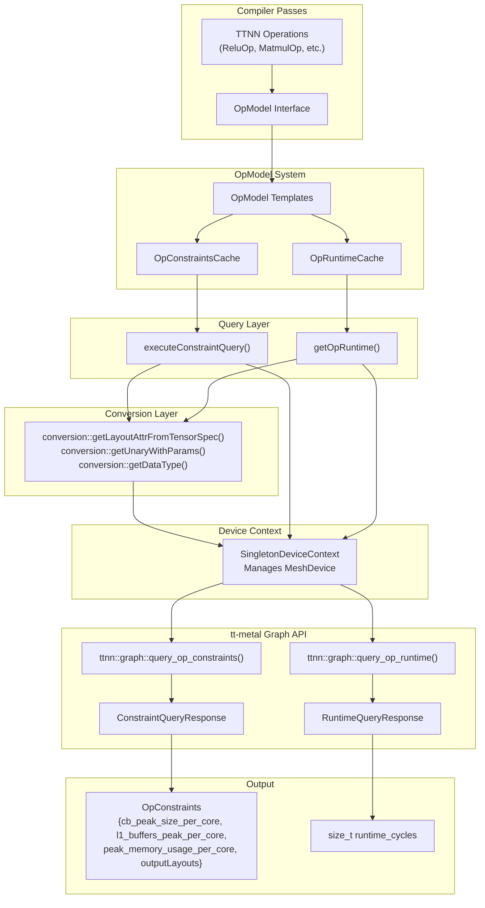
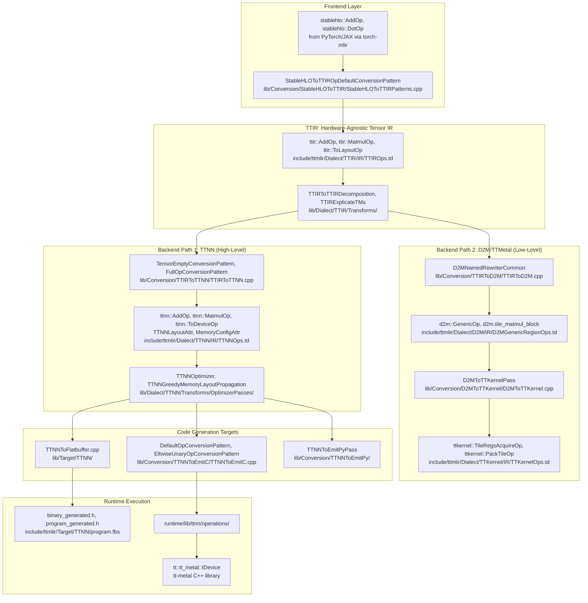
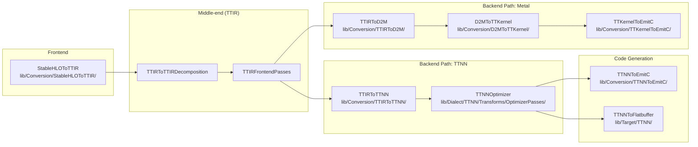

# Architecture Overview

Relevant source files
*   [.claude/skills/add-op/references/ttnn_type_mapping.md](https://github.com/tenstorrent/tt-mlir/blob/c7d92e92/.claude/skills/add-op/references/ttnn_type_mapping.md?plain=1)
*   [include/ttmlir-c/TTAttrs.h](https://github.com/tenstorrent/tt-mlir/blob/c7d92e92/include/ttmlir-c/TTAttrs.h)
*   [include/ttmlir/Dialect/D2M/IR/D2MGenericRegionOps.td](https://github.com/tenstorrent/tt-mlir/blob/c7d92e92/include/ttmlir/Dialect/D2M/IR/D2MGenericRegionOps.td)
*   [include/ttmlir/Dialect/D2M/IR/D2MOps.td](https://github.com/tenstorrent/tt-mlir/blob/c7d92e92/include/ttmlir/Dialect/D2M/IR/D2MOps.td)
*   [include/ttmlir/Dialect/D2M/Utils/Utils.h](https://github.com/tenstorrent/tt-mlir/blob/c7d92e92/include/ttmlir/Dialect/D2M/Utils/Utils.h)
*   [include/ttmlir/Dialect/SFPI/IR/SFPIOpsTypes.td](https://github.com/tenstorrent/tt-mlir/blob/c7d92e92/include/ttmlir/Dialect/SFPI/IR/SFPIOpsTypes.td)
*   [include/ttmlir/Dialect/TTCore/IR/TTCoreOpsEnums.td](https://github.com/tenstorrent/tt-mlir/blob/c7d92e92/include/ttmlir/Dialect/TTCore/IR/TTCoreOpsEnums.td)
*   [include/ttmlir/Dialect/TTCore/IR/TTCoreOpsTypes.td](https://github.com/tenstorrent/tt-mlir/blob/c7d92e92/include/ttmlir/Dialect/TTCore/IR/TTCoreOpsTypes.td)
*   [include/ttmlir/Dialect/TTCore/Transforms/Passes.td](https://github.com/tenstorrent/tt-mlir/blob/c7d92e92/include/ttmlir/Dialect/TTCore/Transforms/Passes.td)
*   [include/ttmlir/Dialect/TTIR/IR/TTIROps.td](https://github.com/tenstorrent/tt-mlir/blob/c7d92e92/include/ttmlir/Dialect/TTIR/IR/TTIROps.td)
*   [include/ttmlir/Dialect/TTKernel/IR/TTKernelOps.td](https://github.com/tenstorrent/tt-mlir/blob/c7d92e92/include/ttmlir/Dialect/TTKernel/IR/TTKernelOps.td)
*   [include/ttmlir/Dialect/TTNN/IR/TTNNOps.td](https://github.com/tenstorrent/tt-mlir/blob/c7d92e92/include/ttmlir/Dialect/TTNN/IR/TTNNOps.td)
*   [include/ttmlir/Target/Common/types.fbs](https://github.com/tenstorrent/tt-mlir/blob/c7d92e92/include/ttmlir/Target/Common/types.fbs)
*   [include/ttmlir/Target/TTKernel/TTKernelIncludesMap.h](https://github.com/tenstorrent/tt-mlir/blob/c7d92e92/include/ttmlir/Target/TTKernel/TTKernelIncludesMap.h)
*   [include/ttmlir/Target/TTNN/program.fbs](https://github.com/tenstorrent/tt-mlir/blob/c7d92e92/include/ttmlir/Target/TTNN/program.fbs)
*   [include/ttmlir/Target/Utils/MLIRToFlatbuffer.h](https://github.com/tenstorrent/tt-mlir/blob/c7d92e92/include/ttmlir/Target/Utils/MLIRToFlatbuffer.h)
*   [lib/CAPI/TTCoreAttrs.cpp](https://github.com/tenstorrent/tt-mlir/blob/c7d92e92/lib/CAPI/TTCoreAttrs.cpp)
*   [lib/Conversion/D2MToTTKernel/D2MToTTKernel.cpp](https://github.com/tenstorrent/tt-mlir/blob/c7d92e92/lib/Conversion/D2MToTTKernel/D2MToTTKernel.cpp)
*   [lib/Conversion/StableHLOToTTIR/StableHLOToTTIRPatterns.cpp](https://github.com/tenstorrent/tt-mlir/blob/c7d92e92/lib/Conversion/StableHLOToTTIR/StableHLOToTTIRPatterns.cpp)
*   [lib/Conversion/TTIRToD2M/TTIRToD2M.cpp](https://github.com/tenstorrent/tt-mlir/blob/c7d92e92/lib/Conversion/TTIRToD2M/TTIRToD2M.cpp)
*   [lib/Conversion/TTIRToTTNN/TTIRToTTNN.cpp](https://github.com/tenstorrent/tt-mlir/blob/c7d92e92/lib/Conversion/TTIRToTTNN/TTIRToTTNN.cpp)
*   [lib/Conversion/TTKernelToEmitC/TTKernelToEmitC.cpp](https://github.com/tenstorrent/tt-mlir/blob/c7d92e92/lib/Conversion/TTKernelToEmitC/TTKernelToEmitC.cpp)
*   [lib/Conversion/TTNNToEmitC/TTNNToEmitC.cpp](https://github.com/tenstorrent/tt-mlir/blob/c7d92e92/lib/Conversion/TTNNToEmitC/TTNNToEmitC.cpp)
*   [lib/Dialect/D2M/IR/D2MGenericRegionOps.cpp](https://github.com/tenstorrent/tt-mlir/blob/c7d92e92/lib/Dialect/D2M/IR/D2MGenericRegionOps.cpp)
*   [lib/Dialect/D2M/IR/D2MOps.cpp](https://github.com/tenstorrent/tt-mlir/blob/c7d92e92/lib/Dialect/D2M/IR/D2MOps.cpp)
*   [lib/Dialect/D2M/Transforms/GridSelection.cpp](https://github.com/tenstorrent/tt-mlir/blob/c7d92e92/lib/Dialect/D2M/Transforms/GridSelection.cpp)
*   [lib/Dialect/D2M/Transforms/LowerToLayout/LowerToLayout.cpp](https://github.com/tenstorrent/tt-mlir/blob/c7d92e92/lib/Dialect/D2M/Transforms/LowerToLayout/LowerToLayout.cpp)
*   [lib/Dialect/D2M/Transforms/LowerToLayout/Plan.cpp](https://github.com/tenstorrent/tt-mlir/blob/c7d92e92/lib/Dialect/D2M/Transforms/LowerToLayout/Plan.cpp)
*   [lib/Dialect/D2M/Transforms/MarkSynchronizedBuffers.cpp](https://github.com/tenstorrent/tt-mlir/blob/c7d92e92/lib/Dialect/D2M/Transforms/MarkSynchronizedBuffers.cpp)
*   [lib/Dialect/D2M/Utils/Utils.cpp](https://github.com/tenstorrent/tt-mlir/blob/c7d92e92/lib/Dialect/D2M/Utils/Utils.cpp)
*   [lib/Dialect/TTCore/IR/TTCoreOpsTypes.cpp](https://github.com/tenstorrent/tt-mlir/blob/c7d92e92/lib/Dialect/TTCore/IR/TTCoreOpsTypes.cpp)
*   [lib/Dialect/TTIR/IR/TTIROps.cpp](https://github.com/tenstorrent/tt-mlir/blob/c7d92e92/lib/Dialect/TTIR/IR/TTIROps.cpp)
*   [lib/Dialect/TTKernel/IR/TTKernelOps.cpp](https://github.com/tenstorrent/tt-mlir/blob/c7d92e92/lib/Dialect/TTKernel/IR/TTKernelOps.cpp)
*   [lib/Dialect/TTNN/IR/TTNNOps.cpp](https://github.com/tenstorrent/tt-mlir/blob/c7d92e92/lib/Dialect/TTNN/IR/TTNNOps.cpp)
*   [lib/Target/TTKernel/TTKernelToCpp.cpp](https://github.com/tenstorrent/tt-mlir/blob/c7d92e92/lib/Target/TTKernel/TTKernelToCpp.cpp)
*   [lib/Target/TTNN/TTNNToFlatbuffer.cpp](https://github.com/tenstorrent/tt-mlir/blob/c7d92e92/lib/Target/TTNN/TTNNToFlatbuffer.cpp)
*   [python/TTModule.cpp](https://github.com/tenstorrent/tt-mlir/blob/c7d92e92/python/TTModule.cpp)
*   [runtime/lib/common/system_desc.cpp](https://github.com/tenstorrent/tt-mlir/blob/c7d92e92/runtime/lib/common/system_desc.cpp)
*   [runtime/lib/ttnn/operations/CMakeLists.txt](https://github.com/tenstorrent/tt-mlir/blob/c7d92e92/runtime/lib/ttnn/operations/CMakeLists.txt)
*   [test/python/golden/d2m/test_dma.py](https://github.com/tenstorrent/tt-mlir/blob/c7d92e92/test/python/golden/d2m/test_dma.py)
*   [test/python/golden/d2m/test_dram_ops.py](https://github.com/tenstorrent/tt-mlir/blob/c7d92e92/test/python/golden/d2m/test_dram_ops.py)
*   [test/ttmlir/Conversion/StableHLOToTTIR/scatter_op.mlir](https://github.com/tenstorrent/tt-mlir/blob/c7d92e92/test/ttmlir/Conversion/StableHLOToTTIR/scatter_op.mlir)
*   [test/ttmlir/Conversion/TTIRToD2M/named_to_generic.mlir](https://github.com/tenstorrent/tt-mlir/blob/c7d92e92/test/ttmlir/Conversion/TTIRToD2M/named_to_generic.mlir)
*   [test/ttmlir/Conversion/TTKernelToEmitC/ttkernel.mlir](https://github.com/tenstorrent/tt-mlir/blob/c7d92e92/test/ttmlir/Conversion/TTKernelToEmitC/ttkernel.mlir)
*   [test/ttmlir/Dialect/D2M/Transforms/grid_selection.mlir](https://github.com/tenstorrent/tt-mlir/blob/c7d92e92/test/ttmlir/Dialect/D2M/Transforms/grid_selection.mlir)
*   [test/ttmlir/Dialect/D2M/Transforms/lower_to_layout_host_dram.mlir](https://github.com/tenstorrent/tt-mlir/blob/c7d92e92/test/ttmlir/Dialect/D2M/Transforms/lower_to_layout_host_dram.mlir)
*   [test/ttmlir/Dialect/D2M/Transforms/lower_to_layout_sharded_to_interleaved.mlir](https://github.com/tenstorrent/tt-mlir/blob/c7d92e92/test/ttmlir/Dialect/D2M/Transforms/lower_to_layout_sharded_to_interleaved.mlir)
*   [test/ttmlir/Dialect/D2M/generic/mark_synchronized_buffers.mlir](https://github.com/tenstorrent/tt-mlir/blob/c7d92e92/test/ttmlir/Dialect/D2M/generic/mark_synchronized_buffers.mlir)
*   [test/ttmlir/Dialect/D2M/lower_to_layout.mlir](https://github.com/tenstorrent/tt-mlir/blob/c7d92e92/test/ttmlir/Dialect/D2M/lower_to_layout.mlir)
*   [test/ttmlir/Dialect/TTKernel/canonicalize_barriers.mlir](https://github.com/tenstorrent/tt-mlir/blob/c7d92e92/test/ttmlir/Dialect/TTKernel/canonicalize_barriers.mlir)
*   [test/ttmlir/Dialect/TTKernel/invalid.mlir](https://github.com/tenstorrent/tt-mlir/blob/c7d92e92/test/ttmlir/Dialect/TTKernel/invalid.mlir)
*   [test/ttmlir/Dialect/TTKernel/ops.mlir](https://github.com/tenstorrent/tt-mlir/blob/c7d92e92/test/ttmlir/Dialect/TTKernel/ops.mlir)
*   [test/ttmlir/Dialect/TTKernel/remote_sram_write_u32_invalid.mlir](https://github.com/tenstorrent/tt-mlir/blob/c7d92e92/test/ttmlir/Dialect/TTKernel/remote_sram_write_u32_invalid.mlir)
*   [test/ttmlir/Dialect/TTNN/simple_scatter.mlir](https://github.com/tenstorrent/tt-mlir/blob/c7d92e92/test/ttmlir/Dialect/TTNN/simple_scatter.mlir)
*   [test/ttmlir/Translate/TTKernel/ttkernel_noc.mlir](https://github.com/tenstorrent/tt-mlir/blob/c7d92e92/test/ttmlir/Translate/TTKernel/ttkernel_noc.mlir)
*   [test/unittests/LowerToLayout/TestPlan.cpp](https://github.com/tenstorrent/tt-mlir/blob/c7d92e92/test/unittests/LowerToLayout/TestPlan.cpp)

## Purpose and Scope

This document describes the high-level architecture of `tt-mlir`, a compiler infrastructure for Tenstorrent AI hardware. It covers the multi-dialect MLIR architecture, progressive lowering pipeline, compilation paths, and runtime execution model. For detailed information about individual dialects, see **2. Core MLIR Dialects**. For runtime system details, see **4. Runtime System**. For compilation pipeline specifics, see **3. Compilation Pipelines**.

* * *


```mermaid
graph TB
    subgraph "TTNN Compilation Pipeline"
        [TTIR_Ops] --> [TTIRToTTNN_Pass]
        [TTIRToTTNN_Pass] --> [TTNN_Ops_Initial]
        [TTNN_Ops_Initial] --> [TTNN_Fusing_Pass]
        [TTNN_Fusing_Pass] --> [TTNNWorkarounds_Pass]
        [TTNNWorkarounds_Pass] --> [TTNN_Ops_Hardware_Compatible]
        [TTNN_Ops_Hardware_Compatible] --> [TTNNOptimizer]
    end
    
    subgraph "Workaround System Entities"
        [wa::TTNNWorkaroundInterface]
        [wa::TTNNOperandsWorkaroundsFactory]
        [TTNNWorkaroundsPatterns.cpp]
        [Decomposition_Patterns]
    end
    
    subgraph "Workaround Types"
        [Layout_Workarounds]
        [Buffer_Type_Workarounds]
        [Memory_Layout_Workarounds]
        [Data_Type_Workarounds]
    end
    
    [TTNNWorkarounds_Pass] -- "uses" --> [wa::TTNNWorkaroundInterface]
    [wa::TTNNWorkaroundInterface] -- "calls" --> [wa::TTNNOperandsWorkaroundsFactory]
    [wa::TTNNOperandsWorkaroundsFactory] -- "defines" --> [Layout_Workarounds]
    [wa::TTNNOperandsWorkaroundsFactory] -- "defines" --> [Buffer_Type_Workarounds]
    [wa::TTNNOperandsWorkaroundsFactory] -- "defines" --> [Memory_Layout_Workarounds]
    [wa::TTNNOperandsWorkaroundsFactory] -- "defines" --> [Data_Type_Workarounds]
    
    [TTNNWorkaroundsPatterns.cpp] -- "implements" --> [wa::TTNNWorkaroundInterface]
    [Decomposition_Patterns] -- "part of" --> [TTNNWorkarounds_Pass]
```

Sources: [lib/Dialect/TTNN/Pipelines/TTNNPipelines.cpp:113-132](), [lib/Dialect/TTNN/Transforms/Workarounds/TTNNWorkaroundsPatterns.cpp:1-61](), [include/ttmlir/Dialect/TTNN/Transforms/Passes.td:31-52]()
```
## System Architecture


The system bridges MLIR operations to tt-metal hardware queries through a conversion and caching layer. Operations implement the `OpModel` interface, which dispatches to specialized templates that query the hardware using the tt-metal graph API.

Sources: [lib/OpModel/TTNN/TTNNOpModel.cpp:36-120](), [lib/Dialect/TTNN/Interfaces/TTNNOpModelInterface.cpp:113-139]()

---
```


`tt-mlir` is an MLIR-based compiler that transforms ML framework IR (StableHLO) into executable code for Tenstorrent hardware. The system uses progressive lowering through several main dialects, each adding increasing hardware specificity.

### System Architecture and Code Entities




The following diagram bridges the high-level compilation stages with the specific code entities and files that implement them.

**Sources:**[include/ttmlir/Dialect/TTIR/IR/TTIROps.td 36-91](https://github.com/tenstorrent/tt-mlir/blob/c7d92e92/include/ttmlir/Dialect/TTIR/IR/TTIROps.td#L36-L91)[include/ttmlir/Dialect/TTNN/IR/TTNNOps.td 26-145](https://github.com/tenstorrent/tt-mlir/blob/c7d92e92/include/ttmlir/Dialect/TTNN/IR/TTNNOps.td#L26-L145)[lib/Conversion/TTIRToTTNN/TTIRToTTNN.cpp 41-103](https://github.com/tenstorrent/tt-mlir/blob/c7d92e92/lib/Conversion/TTIRToTTNN/TTIRToTTNN.cpp#L41-L103)[lib/Conversion/TTNNToEmitC/TTNNToEmitC.cpp 79-147](https://github.com/tenstorrent/tt-mlir/blob/c7d92e92/lib/Conversion/TTNNToEmitC/TTNNToEmitC.cpp#L79-L147)[lib/Conversion/StableHLOToTTIR/StableHLOToTTIRPatterns.cpp 184-199](https://github.com/tenstorrent/tt-mlir/blob/c7d92e92/lib/Conversion/StableHLOToTTIR/StableHLOToTTIRPatterns.cpp#L184-L199)

* * *

## Dialect Hierarchy and Progressive Lowering

### Dialect Roles

The `tt-mlir` compilation pipeline uses several primary dialects.

| Dialect | Namespace | Purpose | Key Implementation |
| --- | --- | --- | --- |
| **TTCore** | `ttcore` | Shared types, attributes, and hardware traits | [include/ttmlir/Dialect/TTCore/IR/TTCoreOpsTypes.td 1-100](https://github.com/tenstorrent/tt-mlir/blob/c7d92e92/include/ttmlir/Dialect/TTCore/IR/TTCoreOpsTypes.td#L1-L100) |
| **TTIR** | `ttir` | Hardware-agnostic tensor IR; supports decomposition and folding | [lib/Dialect/TTIR/IR/TTIROps.cpp 55-144](https://github.com/tenstorrent/tt-mlir/blob/c7d92e92/lib/Dialect/TTIR/IR/TTIROps.cpp#L55-L144) |
| **TTNN** | `ttnn` | TTNN runtime operations; includes memory and device management | [lib/Dialect/TTNN/IR/TTNNOps.cpp 39-167](https://github.com/tenstorrent/tt-mlir/blob/c7d92e92/lib/Dialect/TTNN/IR/TTNNOps.cpp#L39-L167) |
| **D2M** | `d2m` | Data-to-Metal; grid-based execution and bufferization | [include/ttmlir/Dialect/D2M/IR/D2MOps.td 1-20](https://github.com/tenstorrent/tt-mlir/blob/c7d92e92/include/ttmlir/Dialect/D2M/IR/D2MOps.td#L1-L20) |
| **TTKernel** | `ttkernel` | Low-level kernel primitives for Tensix cores | [include/ttmlir/Dialect/TTKernel/IR/TTKernelOps.td 26-135](https://github.com/tenstorrent/tt-mlir/blob/c7d92e92/include/ttmlir/Dialect/TTKernel/IR/TTKernelOps.td#L26-L135) |
| **SFPI** | `sfpi` | SFPU hardware access via GCC builtins | [include/ttmlir/Dialect/TTKernel/IR/TTKernelOps.td 167-170](https://github.com/tenstorrent/tt-mlir/blob/c7d92e92/include/ttmlir/Dialect/TTKernel/IR/TTKernelOps.td#L167-L170) |
| **Debug** | `debug` | Compiler debug information and source mapping | [lib/Conversion/TTIRToTTNN/TTIRToTTNN.cpp 8-9](https://github.com/tenstorrent/tt-mlir/blob/c7d92e92/lib/Conversion/TTIRToTTNN/TTIRToTTNN.cpp#L8-L9) |

**Sources:**[include/ttmlir/Dialect/TTIR/IR/TTIROps.td 9-22](https://github.com/tenstorrent/tt-mlir/blob/c7d92e92/include/ttmlir/Dialect/TTIR/IR/TTIROps.td#L9-L22)[include/ttmlir/Dialect/TTNN/IR/TTNNOps.td 8-25](https://github.com/tenstorrent/tt-mlir/blob/c7d92e92/include/ttmlir/Dialect/TTNN/IR/TTNNOps.td#L8-L25)[include/ttmlir/Dialect/TTKernel/IR/TTKernelOps.td 5-18](https://github.com/tenstorrent/tt-mlir/blob/c7d92e92/include/ttmlir/Dialect/TTKernel/IR/TTKernelOps.td#L5-L18)[include/ttmlir/Dialect/D2M/IR/D2MOps.td 5-15](https://github.com/tenstorrent/tt-mlir/blob/c7d92e92/include/ttmlir/Dialect/D2M/IR/D2MOps.td#L5-L15)

### Progressive Lowering Flow




The compilation flow transitions from high-level operations to hardware-specific implementations.

**Sources:**[lib/Conversion/TTIRToTTNN/TTIRToTTNN.cpp 5-30](https://github.com/tenstorrent/tt-mlir/blob/c7d92e92/lib/Conversion/TTIRToTTNN/TTIRToTTNN.cpp#L5-L30)[lib/Conversion/TTNNToEmitC/TTNNToEmitC.cpp 5-25](https://github.com/tenstorrent/tt-mlir/blob/c7d92e92/lib/Conversion/TTNNToEmitC/TTNNToEmitC.cpp#L5-L25)[lib/Conversion/TTIRToD2M/TTIRToD2M.cpp 5-30](https://github.com/tenstorrent/tt-mlir/blob/c7d92e92/lib/Conversion/TTIRToD2M/TTIRToD2M.cpp#L5-L30)

* * *

## Compilation Pipeline Architecture

### TTNN Backend Pipeline (High-Level)

The TTNN backend targets the high-level TTNN runtime API. It converts hardware-agnostic TTIR operations into device-specific TTNN operations.

1.   **Frontend Conversion**: `StableHLO` is lowered to `TTIR` via `StableHLOToTTIRPatterns`[lib/Conversion/StableHLOToTTIR/StableHLOToTTIRPatterns.cpp 184-199](https://github.com/tenstorrent/tt-mlir/blob/c7d92e92/lib/Conversion/StableHLOToTTIR/StableHLOToTTIRPatterns.cpp#L184-L199)
2.   **TTIR Refinement**: Includes decomposition of complex ops, constant folding [lib/Dialect/TTIR/IR/TTIROps.cpp 58-144](https://github.com/tenstorrent/tt-mlir/blob/c7d92e92/lib/Dialect/TTIR/IR/TTIROps.cpp#L58-L144) and constant value defining op traversal [lib/Conversion/StableHLOToTTIR/StableHLOToTTIRPatterns.cpp 189-192](https://github.com/tenstorrent/tt-mlir/blob/c7d92e92/lib/Conversion/StableHLOToTTIR/StableHLOToTTIRPatterns.cpp#L189-L192)
3.   **Conversion to TTNN**: `TTIRToTTNN` pass converts `ttir.to_layout` to `ttnn.to_device`, `ttnn.to_layout`, or `ttnn.to_memory_config` based on the target device and memory layout [lib/Conversion/TTIRToTTNN/TTIRToTTNN.cpp 188-210](https://github.com/tenstorrent/tt-mlir/blob/c7d92e92/lib/Conversion/TTIRToTTNN/TTIRToTTNN.cpp#L188-L210)
4.   **Optimization**: Performs layout analysis and memory configuration to minimize data movement.
5.   **Code Generation**: 
    *   **Flatbuffer Serialization**: `TTNNToFlatbuffer` generates a binary format for the `ttrt` runtime, mapping tensors to `TensorDesc` and memory to `MemoryConfig`[lib/Target/TTNN/TTNNToFlatbuffer.cpp 143-180](https://github.com/tenstorrent/tt-mlir/blob/c7d92e92/lib/Target/TTNN/TTNNToFlatbuffer.cpp#L143-L180)
    *   **EmitC**: `TTNNToEmitC` generates C++ code by mapping TTNN operations to `emitc::CallOpaqueOp` using the `ttnn::` namespace prefix [lib/Conversion/TTNNToEmitC/TTNNToEmitC.cpp 64-114](https://github.com/tenstorrent/tt-mlir/blob/c7d92e92/lib/Conversion/TTNNToEmitC/TTNNToEmitC.cpp#L64-L114)

**Sources:**[lib/Conversion/TTIRToTTNN/TTIRToTTNN.cpp 41-103](https://github.com/tenstorrent/tt-mlir/blob/c7d92e92/lib/Conversion/TTIRToTTNN/TTIRToTTNN.cpp#L41-L103)[lib/Target/TTNN/TTNNToFlatbuffer.cpp 143-180](https://github.com/tenstorrent/tt-mlir/blob/c7d92e92/lib/Target/TTNN/TTNNToFlatbuffer.cpp#L143-L180)

### TTMetal/D2M Backend Pipeline (Low-Level)

The TTMetal path provides finer control over hardware resources via the `D2M` (Data-to-Metal) and `TTKernel` dialects.

1.   **D2M Lowering**: Converts high-level tensor reductions and matmuls into `d2m` operations via `D2MNamedRewriterCommon`, handling grid selection for tiled execution [lib/Conversion/TTIRToD2M/TTIRToD2M.cpp 63-134](https://github.com/tenstorrent/tt-mlir/blob/c7d92e92/lib/Conversion/TTIRToD2M/TTIRToD2M.cpp#L63-L134)
2.   **Kernel Generation**: Lowers generic region ops into specific hardware kernel instructions like `tile_regs_acquire`, `pack_tile`, and `compute_kernel_hw_startup`[include/ttmlir/Dialect/TTKernel/IR/TTKernelOps.td 26-135](https://github.com/tenstorrent/tt-mlir/blob/c7d92e92/include/ttmlir/Dialect/TTKernel/IR/TTKernelOps.td#L26-L135)
3.   **Low-level EmitC**: Converts kernel primitives into Tenstorrent-specific C++ kernel code in `TTKernelToEmitC.cpp`, often assigning deterministic names to Circular Buffers [lib/Conversion/TTKernelToEmitC/TTKernelToEmitC.cpp 110-149](https://github.com/tenstorrent/tt-mlir/blob/c7d92e92/lib/Conversion/TTKernelToEmitC/TTKernelToEmitC.cpp#L110-L149)

**Sources:**[include/ttmlir/Dialect/TTKernel/IR/TTKernelOps.td 26-135](https://github.com/tenstorrent/tt-mlir/blob/c7d92e92/include/ttmlir/Dialect/TTKernel/IR/TTKernelOps.td#L26-L135)[lib/Conversion/TTIRToD2M/TTIRToD2M.cpp 63-134](https://github.com/tenstorrent/tt-mlir/blob/c7d92e92/lib/Conversion/TTIRToD2M/TTIRToD2M.cpp#L63-L134)

* * *

## Key System Components

### Hardware and System Description

The compiler and runtime share a common understanding of the target hardware through the `SystemDesc` structure.

*   **Device Attributes**: `ttcore.DeviceAttr` stores hardware specifications like worker grid size and L1 capacity, which are looked up during serialization to create `DeviceRef`[lib/Target/TTNN/TTNNToFlatbuffer.cpp 50-55](https://github.com/tenstorrent/tt-mlir/blob/c7d92e92/lib/Target/TTNN/TTNNToFlatbuffer.cpp#L50-L55)
*   **Flatbuffer Schema**: The binary format defined in `program.fbs` encapsulates inputs, outputs, operations, and device references [include/ttmlir/Target/TTNN/program.fbs 155-171](https://github.com/tenstorrent/tt-mlir/blob/c7d92e92/include/ttmlir/Target/TTNN/program.fbs#L155-L171)
*   **System Discovery**: Hardware discovery is handled via `getCurrentSystemDescImpl` which queries the `MeshDevice` for its constituent `IDevice` capabilities [runtime/lib/common/system_desc.cpp 141-175](https://github.com/tenstorrent/tt-mlir/blob/c7d92e92/runtime/lib/common/system_desc.cpp#L141-L175)

### Code Generation and Serialization

`tt-mlir` supports multiple output formats to facilitate development and deployment.

*   **EmitC**: Converts `ttnn` ops to `emitc::CallOpaqueOp`. It handles special cases like `EltwiseUnaryOp` by inserting necessary parameters for memory configurations [lib/Conversion/TTNNToEmitC/TTNNToEmitC.cpp 132-145](https://github.com/tenstorrent/tt-mlir/blob/c7d92e92/lib/Conversion/TTNNToEmitC/TTNNToEmitC.cpp#L132-L145)
*   **Flatbuffer**: Serializes the program into a binary format. It handles `TensorDesc`, `MemoryConfig`, and specific operation parameters by caching flatbuffer objects [lib/Target/TTNN/TTNNToFlatbuffer.cpp 73-109](https://github.com/tenstorrent/tt-mlir/blob/c7d92e92/lib/Target/TTNN/TTNNToFlatbuffer.cpp#L73-L109)

**Sources:**[lib/Conversion/TTNNToEmitC/TTNNToEmitC.cpp 89-114](https://github.com/tenstorrent/tt-mlir/blob/c7d92e92/lib/Conversion/TTNNToEmitC/TTNNToEmitC.cpp#L89-L114)[lib/Target/TTNN/TTNNToFlatbuffer.cpp 73-109](https://github.com/tenstorrent/tt-mlir/blob/c7d92e92/lib/Target/TTNN/TTNNToFlatbuffer.cpp#L73-L109)[lib/Target/TTNN/TTNNToFlatbuffer.cpp 143-180](https://github.com/tenstorrent/tt-mlir/blob/c7d92e92/lib/Target/TTNN/TTNNToFlatbuffer.cpp#L143-L180)[include/ttmlir/Target/TTNN/program.fbs 155-171](https://github.com/tenstorrent/tt-mlir/blob/c7d92e92/include/ttmlir/Target/TTNN/program.fbs#L155-L171)[runtime/lib/common/system_desc.cpp 141-175](https://github.com/tenstorrent/tt-mlir/blob/c7d92e92/runtime/lib/common/system_desc.cpp#L141-L175)

This wiki is featured in the [repository](https://github.com/tenstorrent/tt-mlir/blob/main/README.md)

Dismiss
Refresh this wiki

Enter email to refresh
